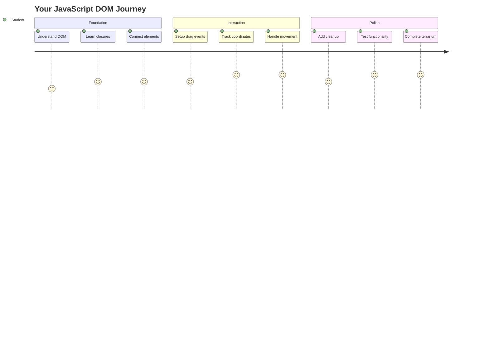
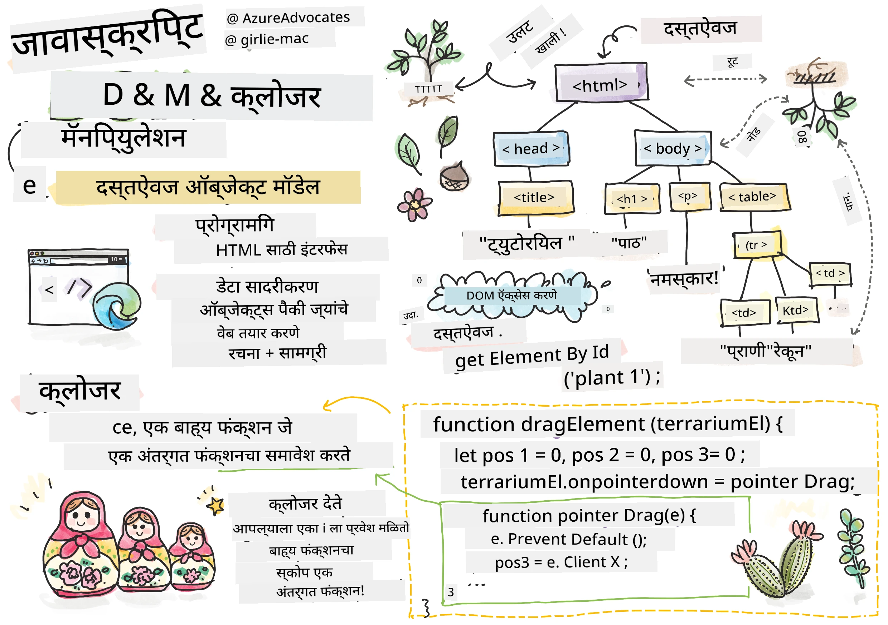
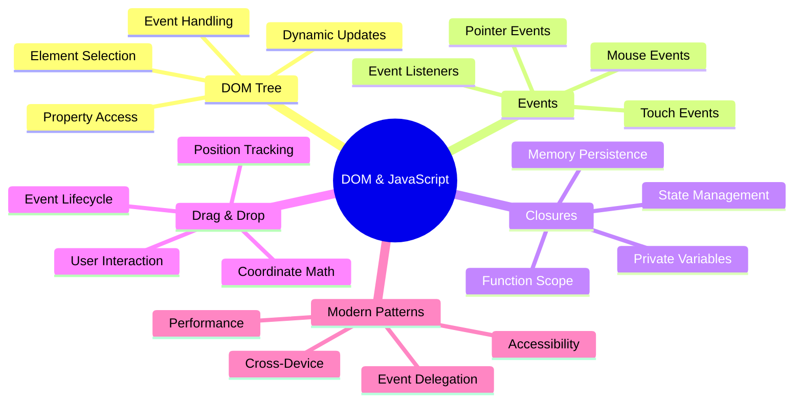
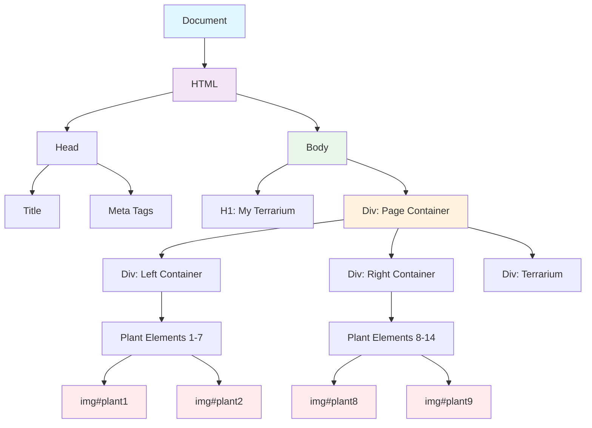
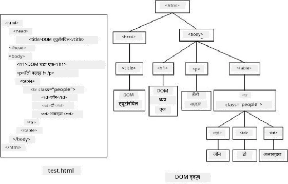
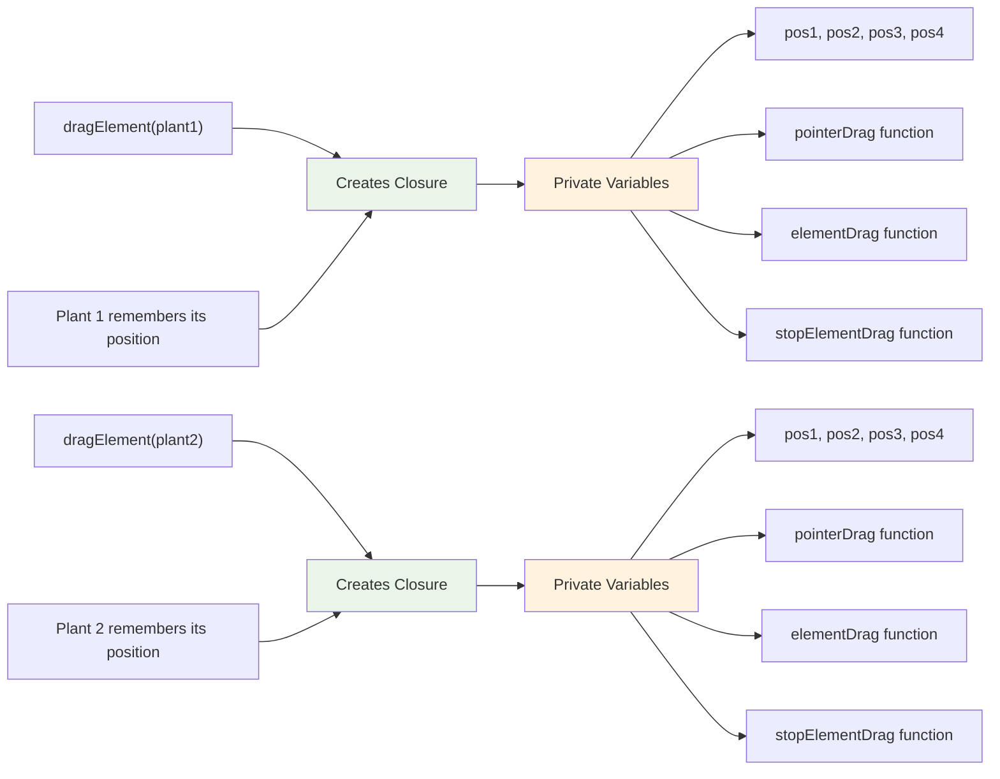
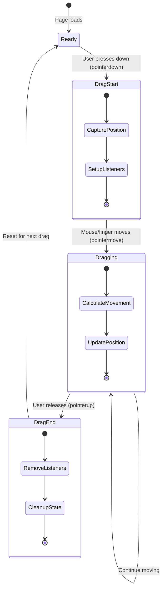
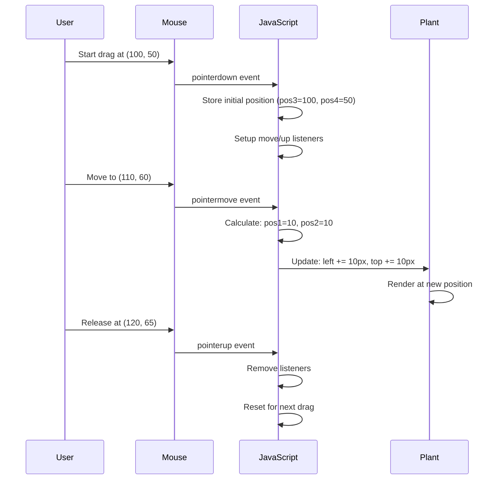
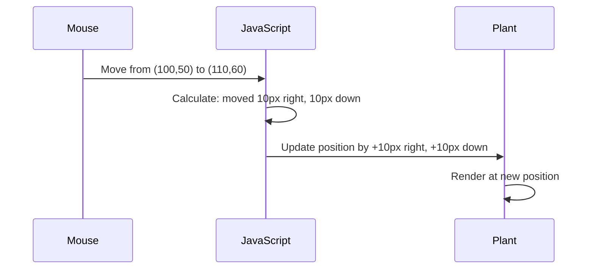
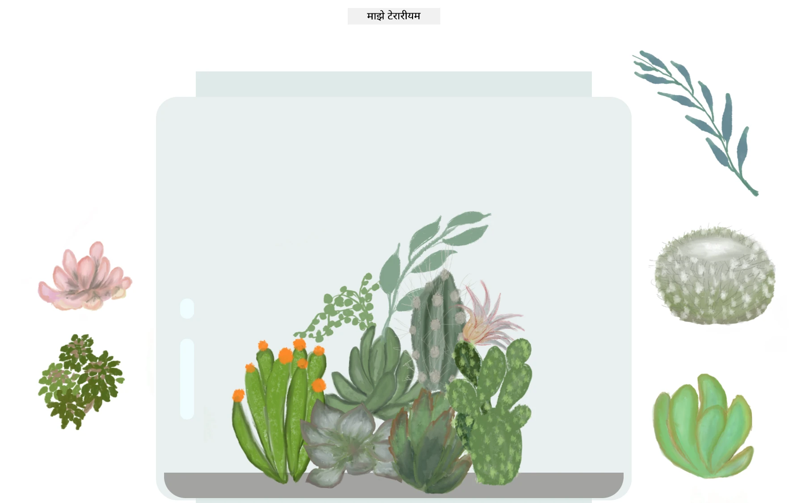

# टेरारियम प्रकल्प भाग ३: DOM मॅनिप्युलेशन आणि जावास्क्रिप्ट क्लोजर्स




> स्केच नोट [Tomomi Imura](https://twitter.com/girlie_mac) यांच्याकडून

वेब विकासातील सर्वात आकर्षक पैलूंच्या स्वागतासाठी तयार व्हा - गोष्टी परस्परसंवादी बनवणे! डॉक्युमेंट ऑब्जेक्ट मॉडेल (DOM) हे तुमच्या HTML आणि जावास्क्रिप्टमधील एक पूल आहे, आणि आज आपण त्याचा उपयोग तुमच्या टेरारियमला जिवंत करण्यासाठी करू. जेव्हा टिम बर्नर्स-लीने पहिला वेब ब्राउझर तयार केला, तेव्हा त्यांनी एक वेब कल्पना केली होती जिथे दस्तऐवज गतिशील आणि परस्परसंवादी असू शकतात - DOM त्या दृष्टिकोनाला शक्य बनवते.

आपण जावास्क्रिप्ट क्लोजर्स देखील एक्सप्लोर करू, जे सुरुवातीला थोडे कठीण वाटू शकतात. क्लोजर्स म्हणजे "मेमरी पॉकेट्स" तयार करणे जिथे तुमचे फंक्शन महत्त्वाची माहिती लक्षात ठेवू शकतात. हे असे आहे जसे की तुमच्या टेरारियममधील प्रत्येक वनस्पतीला तिच्या स्थानाचा डेटा रेकॉर्ड असतो. या धड्याच्या शेवटी, तुम्हाला समजेल की ते किती नैसर्गिक आणि उपयुक्त आहेत.

आम्ही काय तयार करत आहोत: एक टेरारियम जिथे वापरकर्ते वनस्पती कुठेही ड्रॅग आणि ड्रॉप करू शकतात. तुम्ही DOM मॅनिप्युलेशन तंत्र शिकाल जे ड्रॅग-ड्रॉप फाइल अपलोड्सपासून परस्परसंवादी गेम्सपर्यंत सर्वकाही शक्य करते. चला तुमचे टेरारियम जिवंत करूया.



## प्री-लेक्चर क्विझ

[प्री-लेक्चर क्विझ](https://ff-quizzes.netlify.app/web/quiz/19)

## DOM समजून घेणे: परस्परसंवादी वेब पृष्ठांसाठी तुमचा प्रवेशद्वार

डॉक्युमेंट ऑब्जेक्ट मॉडेल (DOM) हे जावास्क्रिप्ट तुमच्या HTML घटकांशी संवाद साधण्याचा मार्ग आहे. जेव्हा तुमचा ब्राउझर HTML पृष्ठ लोड करतो, तेव्हा तो त्या पृष्ठाचे संरचित प्रतिनिधित्व मेमरीमध्ये तयार करतो - तेच DOM आहे. याला एक कौटुंबिक झाड समजा जिथे प्रत्येक HTML घटक एक कुटुंब सदस्य आहे ज्याला जावास्क्रिप्ट प्रवेश करू शकते, बदलू शकते किंवा पुन्हा व्यवस्थापित करू शकते.

DOM मॅनिप्युलेशन स्थिर पृष्ठांना परस्परसंवादी वेबसाइट्समध्ये बदलते. प्रत्येक वेळी तुम्हाला बटण हवरवर रंग बदलताना, पृष्ठ रीफ्रेश न करता सामग्री अपडेट करताना किंवा तुम्ही ड्रॅग करू शकणारे घटक दिसत असताना, ते DOM मॅनिप्युलेशनचे काम आहे.





> DOM आणि त्याचा संदर्भ देणारा HTML मार्कअपचे प्रतिनिधित्व. [Olfa Nasraoui](https://www.researchgate.net/publication/221417012_Profile-Based_Focused_Crawler_for_Social_Media-Sharing_Websites) कडून

**DOM शक्तिशाली बनवणारे घटक:**
- **प्रदान करते** तुमच्या पृष्ठावरील कोणत्याही घटकावर प्रवेश करण्याचा संरचित मार्ग
- **सक्षम करते** पृष्ठ रीफ्रेश न करता गतिशील सामग्री अपडेट्स
- **परवानगी देते** क्लिक्स आणि ड्रॅग्ससारख्या वापरकर्त्याच्या परस्परसंवादाला त्वरित प्रतिसाद
- **निर्माण करते** आधुनिक परस्परसंवादी वेब अनुप्रयोगांसाठी पाया

## जावास्क्रिप्ट क्लोजर्स: व्यवस्थित, शक्तिशाली कोड तयार करणे

[जावास्क्रिप्ट क्लोजर](https://developer.mozilla.org/docs/Web/JavaScript/Closures) म्हणजे फंक्शनला त्याचे स्वतःचे खाजगी कार्यक्षेत्र देणे ज्यामध्ये सतत मेमरी असते. विचार करा की गॅलापागोस बेटांवरील डार्विनच्या फिंचेसने त्यांच्या विशिष्ट वातावरणावर आधारित विशेष चोच विकसित केल्या - क्लोजर्स त्याचप्रमाणे काम करतात, विशेष फंक्शन्स तयार करतात जे त्यांच्या विशिष्ट संदर्भाची "आठवण" ठेवतात जरी त्यांचे पॅरेंट फंक्शन पूर्ण झाले तरी.

आमच्या टेरारियममध्ये, क्लोजर्स प्रत्येक वनस्पतीला स्वतंत्रपणे तिचे स्थान लक्षात ठेवण्यास मदत करतात. हा पॅटर्न व्यावसायिक जावास्क्रिप्ट विकासात सर्वत्र दिसतो, त्यामुळे तो समजून घेणे महत्त्वाचे आहे.



> 💡 **क्लोजर्स समजून घेणे**: क्लोजर्स जावास्क्रिप्टमधील एक महत्त्वाचा विषय आहे, आणि अनेक विकसक त्याचा पूर्ण सैद्धांतिक पैलू समजण्याआधी अनेक वर्षे त्याचा वापर करतात. आज, आम्ही व्यावहारिक अनुप्रयोगावर लक्ष केंद्रित करत आहोत - तुम्ही पाहाल की ते परस्परसंवादी वैशिष्ट्ये तयार करताना नैसर्गिकरित्या कसे उद्भवतात. समजून घेणे विकसित होईल कारण तुम्ही पाहाल की ते वास्तविक समस्यांचे निराकरण कसे करतात.


> DOM आणि त्याचा संदर्भ देणारा HTML मार्कअपचे प्रतिनिधित्व. [Olfa Nasraoui](https://www.researchgate.net/publication/221417012_Profile-Based_Focused_Crawler_for_Social_Media-Sharing_Websites) कडून

या धड्यात, आपण परस्परसंवादी टेरारियम प्रकल्प पूर्ण करू जिथे वापरकर्त्याला पृष्ठावरील वनस्पतींमध्ये फेरफार करण्यासाठी जावास्क्रिप्ट तयार करायची आहे.

## सुरुवात करण्यापूर्वी: यशासाठी तयारी

तुम्हाला मागील टेरारियम धड्यांमधील HTML आणि CSS फाइल्सची आवश्यकता असेल - आपण त्या स्थिर डिझाइनला परस्परसंवादी बनवणार आहोत. जर तुम्ही प्रथमच सामील होत असाल, तर त्या धडे पूर्ण करणे महत्त्वाचा संदर्भ प्रदान करेल.

आम्ही काय तयार करू:
- **स्मूथ ड्रॅग-ड्रॉप** सर्व टेरारियम वनस्पतींसाठी
- **कोऑर्डिनेट ट्रॅकिंग** जेणेकरून वनस्पती त्यांची स्थानं लक्षात ठेवतील
- **पूर्ण परस्परसंवादी इंटरफेस** व्हॅनिला जावास्क्रिप्ट वापरून
- **स्वच्छ, व्यवस्थित कोड** क्लोजर पॅटर्न वापरून

## तुमची जावास्क्रिप्ट फाइल सेट करणे

चला तुमची टेरारियम परस्परसंवादी बनवणारी जावास्क्रिप्ट फाइल तयार करूया.

**पायरी १: तुमची स्क्रिप्ट फाइल तयार करा**

तुमच्या टेरारियम फोल्डरमध्ये, `script.js` नावाची नवीन फाइल तयार करा.

**पायरी २: जावास्क्रिप्टला तुमच्या HTML शी लिंक करा**

तुमच्या `index.html` फाइलच्या `<head>` विभागात हा स्क्रिप्ट टॅग जोडा:

```html
<script src="./script.js" defer></script>
```

**`defer` अॅट्रिब्युट का महत्त्वाचे आहे:**
- **सुनिश्चित करते** की तुमची जावास्क्रिप्ट सर्व HTML लोड होईपर्यंत थांबते
- **टाळते** अशा त्रुटी जिथे जावास्क्रिप्ट तयार नसलेल्या घटकांचा शोध घेते
- **हमी देते** की तुमचे सर्व वनस्पती घटक परस्परसंवादासाठी उपलब्ध आहेत
- **उत्तम कार्यक्षमता प्रदान करते** पृष्ठाच्या तळाशी स्क्रिप्ट ठेवण्यापेक्षा

> ⚠️ **महत्त्वाची टीप**: `defer` अॅट्रिब्युट सामान्य वेळेच्या समस्यांना टाळते. त्याशिवाय, जावास्क्रिप्ट HTML घटक लोड होण्याआधी त्यांचा शोध घेण्याचा प्रयत्न करू शकते, ज्यामुळे त्रुटी निर्माण होतात.

---

## जावास्क्रिप्टला तुमच्या HTML घटकांशी जोडणे

घटकांना ड्रॅग करण्यायोग्य बनवण्यापूर्वी, जावास्क्रिप्टला DOM मध्ये त्यांचा शोध घेणे आवश्यक आहे. याला एक लायब्ररी कॅटलॉगिंग सिस्टम समजा - एकदा तुम्हाला कॅटलॉग नंबर मिळाला की, तुम्ही तुम्हाला हवे असलेले पुस्तक अचूकपणे शोधू शकता आणि त्यातील सर्व सामग्रीवर प्रवेश करू शकता.

आपण `document.getElementById()` पद्धतीचा उपयोग करून या कनेक्शनचा उपयोग करू. हे जसे अचूक फाइलिंग सिस्टम आहे - तुम्ही एक ID प्रदान करता, आणि ते तुमच्या HTML मध्ये तुम्हाला हवे असलेले घटक अचूकपणे शोधते.

### सर्व वनस्पतींसाठी ड्रॅग फंक्शनलिटी सक्षम करणे

तुमच्या `script.js` फाइलमध्ये हा कोड जोडा:

```javascript
// Enable drag functionality for all 14 plants
dragElement(document.getElementById('plant1'));
dragElement(document.getElementById('plant2'));
dragElement(document.getElementById('plant3'));
dragElement(document.getElementById('plant4'));
dragElement(document.getElementById('plant5'));
dragElement(document.getElementById('plant6'));
dragElement(document.getElementById('plant7'));
dragElement(document.getElementById('plant8'));
dragElement(document.getElementById('plant9'));
dragElement(document.getElementById('plant10'));
dragElement(document.getElementById('plant11'));
dragElement(document.getElementById('plant12'));
dragElement(document.getElementById('plant13'));
dragElement(document.getElementById('plant14'));
```

**हा कोड काय साध्य करतो:**
- **प्रत्येक वनस्पती घटकाचा शोध घेतो** त्याच्या अद्वितीय ID वापरून
- **प्रत्येक HTML घटकाचा जावास्क्रिप्ट संदर्भ मिळवतो**
- **प्रत्येक घटकाला `dragElement` फंक्शनमध्ये पास करतो** (जे आपण पुढे तयार करू)
- **प्रत्येक वनस्पतीला ड्रॅग-ड्रॉप परस्परसंवादासाठी तयार करतो**
- **तुमच्या HTML संरचनेला जावास्क्रिप्ट फंक्शनॅलिटीशी जोडतो**

> 🎯 **ID ऐवजी क्लासेस का वापरायचे नाहीत?** ID विशिष्ट घटकांसाठी अद्वितीय ओळख प्रदान करतात, तर CSS क्लासेस घटकांच्या गटांना स्टाइल करण्यासाठी डिझाइन केलेले आहेत. जावास्क्रिप्टला वैयक्तिक घटकांमध्ये फेरफार करायचे असल्यास, ID आम्हाला आवश्यक असलेली अचूकता आणि कार्यक्षमता प्रदान करतात.

> 💡 **प्रो टिप**: लक्षात ठेवा की आपण प्रत्येक वनस्पतीसाठी स्वतंत्रपणे `dragElement()` कॉल करत आहोत. हा दृष्टिकोन सुनिश्चित करतो की प्रत्येक वनस्पतीला स्वतंत्र ड्रॅगिंग वर्तन मिळते, जे गुळगुळीत वापरकर्ता परस्परसंवादासाठी आवश्यक आहे.

### 🔄 **शैक्षणिक तपासणी**
**DOM कनेक्शन समजून घेणे**: ड्रॅग फंक्शनॅलिटीकडे जाण्यापूर्वी, तुम्ही हे सत्यापित करू शकता:
- ✅ `document.getElementById()` HTML घटक कसे शोधते हे स्पष्ट करा
- ✅ प्रत्येक वनस्पतीसाठी अद्वितीय ID का वापरतो हे समजून घ्या
- ✅ स्क्रिप्ट टॅगमधील `defer` अॅट्रिब्युटचा उद्देश वर्णन करा
- ✅ जावास्क्रिप्ट आणि HTML DOM द्वारे कसे जोडले जातात हे ओळखा

**जलद स्व-परीक्षण**: दोन घटकांना समान ID असल्यास काय होईल? `getElementById()` फक्त एक घटक का परत करते?
*उत्तर: ID अद्वितीय असावेत; जर डुप्लिकेट केले गेले तर फक्त पहिला घटक परत केला जातो*

---

## ड्रॅग एलिमेंट क्लोजर तयार करणे

आता आपण आमच्या ड्रॅगिंग फंक्शनॅलिटीचे मुख्य भाग तयार करू: प्रत्येक वनस्पतीसाठी ड्रॅगिंग वर्तन व्यवस्थापित करणारा क्लोजर. हा क्लोजर अनेक अंतर्गत फंक्शन्स समाविष्ट करेल जे माउस मूव्हमेंट ट्रॅक करण्यासाठी आणि घटक स्थान अपडेट करण्यासाठी एकत्र काम करतील.

क्लोजर्स या कार्यासाठी योग्य आहेत कारण ते आम्हाला "खाजगी" व्हेरिएबल्स तयार करण्यास अनुमती देतात जे फंक्शन कॉल दरम्यान टिकून राहतात, प्रत्येक वनस्पतीसाठी स्वतंत्र समन्वय ट्रॅकिंग सिस्टम देतात.

### सोप्या उदाहरणासह क्लोजर्स समजून घेणे

क्लोजर्सची संकल्पना स्पष्ट करणारे सोपे उदाहरण देऊ:

```javascript
function createCounter() {
    let count = 0; // This is like a private variable
    
    function increment() {
        count++; // The inner function remembers the outer variable
        return count;
    }
    
    return increment; // We're giving back the inner function
}

const myCounter = createCounter();
console.log(myCounter()); // 1
console.log(myCounter()); // 2
```

**या क्लोजर पॅटर्नमध्ये काय घडत आहे:**
- **खाजगी `count` व्हेरिएबल तयार करते** जे फक्त या क्लोजरमध्ये अस्तित्वात आहे
- **अंतर्गत फंक्शन** त्या बाह्य व्हेरिएबलमध्ये प्रवेश करू शकते आणि त्यात बदल करू शकते (क्लोजर यंत्रणा)
- **जेव्हा आम्ही परत करतो** अंतर्गत फंक्शन, ते त्या खाजगी डेटाशी त्याचे कनेक्शन टिकवते
- **जरी `createCounter()` अंमलबजावणी पूर्ण झाली तरी**, `count` टिकून राहते आणि त्याची किंमत लक्षात ठेवते

### ड्रॅग फंक्शनॅलिटीसाठी क्लोजर्स का योग्य आहेत

आमच्या टेरारियमसाठी, प्रत्येक वनस्पतीला तिच्या वर्तमान स्थान समन्वय लक्षात ठेवण्याची आवश्यकता आहे. क्लोजर्स परिपूर्ण उपाय प्रदान करतात:

**आमच्या प्रकल्पासाठी मुख्य फायदे:**
- **प्रत्येक वनस्पतीसाठी स्वतंत्रपणे खाजगी स्थान व्हेरिएबल्स टिकवते**
- **ड्रॅग इव्हेंट्स दरम्यान समन्वय डेटा टिकवते**
- **वेगवेगळ्या ड्रॅग करण्यायोग्य घटकांमधील व्हेरिएबल्सच्या संघर्षांना प्रतिबंधित करते**
- **स्वच्छ, व्यवस्थित कोड संरचना तयार करते**

> 🎯 **शिकण्याचे उद्दिष्ट**: तुम्हाला क्लोजर्सचे प्रत्येक पैलू आत्ता मास्टर करण्याची गरज नाही. ते कोड कसे व्यवस्थित ठेवतात आणि आमच्या ड्रॅगिंग फंक्शनॅलिटीसाठी स्थिती कशी टिकवतात हे पाहण्यावर लक्ष केंद्रित करा.



### `dragElement` फंक्शन तयार करणे

आता आपण मुख्य फंक्शन तयार करू जे सर्व ड्रॅगिंग लॉजिक हाताळेल. तुमच्या वनस्पती घटक घोषणांखाली हे फंक्शन जोडा:

```javascript
function dragElement(terrariumElement) {
    // Initialize position tracking variables
    let pos1 = 0,  // Previous mouse X position
        pos2 = 0,  // Previous mouse Y position  
        pos3 = 0,  // Current mouse X position
        pos4 = 0;  // Current mouse Y position
    
    // Set up the initial drag event listener
    terrariumElement.onpointerdown = pointerDrag;
}
```

**स्थान ट्रॅकिंग सिस्टम समजून घेणे:**
- **`pos1` आणि `pos2`**: जुने आणि नवीन माउस स्थानांमधील फरक साठवते
- **`pos3` आणि `pos4`**: वर्तमान माउस समन्वय ट्रॅक करते
- **`terrariumElement`**: विशिष्ट वनस्पती घटक ज्याला आपण ड्रॅग करण्यायोग्य बनवत आहोत
- **`onpointerdown`**: वापरकर्ता ड्रॅगिंग सुरू करताना ट्रिगर होणारी घटना

**क्लोजर पॅटर्न कसे कार्य करते:**
- **प्रत्येक वनस्पती घटकासाठी खाजगी स्थान व्हेरिएबल्स तयार करते**
- **ड्रॅगिंग लाइफसायकल दरम्यान या व्हेरिएबल्स टिकवते**
- **प्रत्येक वनस्पती स्वतंत्रपणे तिचे समन्वय ट्रॅक करते याची खात्री करते**
- **`dragElement` फंक्शनद्वारे स्वच्छ इंटरफेस प्रदान करते**

### पॉइंटर इव्हेंट्स का वापरायचे?

तुम्हाला `onpointerdown` ऐवजी अधिक परिचित `onclick` का वापरत नाही याचा विचार येऊ शकतो. याचे कारण येथे आहे:

| इव्हेंट प्रकार | सर्वोत्तम उपयोग | अडचण |
|------------|----------|-------------|
| `onclick` | साधे बटण क्लिक | ड्रॅगिंग हाताळू शकत नाही (फक्त क्लिक आणि रिलीज) |
| `onpointerdown` | माउस आणि टच दोन्ही | नवीन, पण सध्या चांगले समर्थित |
| `onmousedown` | डेस्कटॉप माउससाठी फक्त | मोबाइल वापरकर्त्यांना वगळते |

**आम्ही तयार करत असलेल्या गोष्टींसाठी पॉइंटर इव्हेंट्स परिपूर्ण आहेत:**
- **उत्तम कार्य करते** जरी कोणी माउस, बोट किंवा स्टायलस वापरत असेल
- **समान वाटते** लॅपटॉप, टॅबलेट किंवा फोनवर
- **खऱ्या ड्रॅगिंग मोशनला हाताळते** (फक्त क्लिक-आणि-डन नाही)
- **गुळगुळीत अनुभव तयार करते** जो वापरकर्त्यांना आधुनिक वेब अॅप्सकडून अपेक्षित आहे

> 💡 **भविष्यातील तयारी**: पॉइंटर इव्हेंट्स वापरकर्त्यांच्या परस्परसंवाद हाताळण्याचा आधुनिक मार्ग आहेत. माउस आणि टचसाठी स्वतंत्र कोड लिहिण्याऐवजी, तुम्हाला दोन्ही विनामूल्य मिळतात. खूप छान, नाही का?

### 🔄 **शैक्षणिक तपासणी**
**इव्हेंट हँडलिंग समजून घेणे**: इव्हेंट्सची तुमची समज तपासण्यासाठी थांबा:
- ✅ माउस इव्हेंट्सऐवजी पॉइंटर इव्हेंट्स का वापरतो?
- ✅ क्लोजर व्ह
**या समन्वयांची समज:**
- **पुरवते** पिक्सेल-परफेक्ट पोझिशनिंग माहिती
- **रिअल-टाइममध्ये अपडेट होते** जेव्हा वापरकर्ता त्यांचा पॉइंटर हलवतो
- **सर्व स्क्रीन आकार आणि झूम स्तरांवर** सुसंगत राहते
- **सक्षम करते** गुळगुळीत, प्रतिसादक्षम ड्रॅग इंटरॅक्शन

### डॉक्युमेंट-स्तरीय इव्हेंट लिसनर्स सेट करणे

लक्षात घ्या की आम्ही मूव्ह आणि स्टॉप इव्हेंट संपूर्ण `document` वर जोडतो, फक्त प्लांट एलिमेंटवर नाही:

```javascript
document.onpointermove = elementDrag;
document.onpointerup = stopElementDrag;
```

**डॉक्युमेंटवर का जोडायचे:**
- **ट्रॅकिंग सुरू ठेवते** जरी माउस प्लांट एलिमेंट सोडतो
- **ड्रॅग व्यत्यय टाळते** जर वापरकर्ता वेगाने हलवतो
- **संपूर्ण स्क्रीनवर गुळगुळीत ड्रॅगिंग प्रदान करते**
- **एज केस हाताळते** जिथे कर्सर ब्राउझर विंडोच्या बाहेर हलतो

> ⚡ **परफॉर्मन्स नोट**: ड्रॅगिंग थांबल्यावर या डॉक्युमेंट-स्तरीय लिसनर्स साफ करू, जेणेकरून मेमरी लीक आणि परफॉर्मन्स समस्या टाळता येतील.

## ड्रॅग सिस्टम पूर्ण करणे: मूव्हमेंट आणि क्लीनअप

आता आम्ही दोन उर्वरित फंक्शन्स जोडणार आहोत जे प्रत्यक्ष ड्रॅगिंग मूव्हमेंट आणि ड्रॅगिंग थांबल्यावर क्लीनअप हाताळतात. या फंक्शन्स एकत्र काम करून तुमच्या टेरॅरियममध्ये गुळगुळीत, प्रतिसादक्षम प्लांट मूव्हमेंट तयार करतात.

### elementDrag फंक्शन: मूव्हमेंट ट्रॅकिंग

`pointerDrag` च्या बंद कर्ली ब्रॅकेटनंतर `elementDrag` फंक्शन जोडा:

```javascript
function elementDrag(e) {
    // Calculate the distance moved since the last event
    pos1 = pos3 - e.clientX;  // Horizontal distance moved
    pos2 = pos4 - e.clientY;  // Vertical distance moved
    
    // Update the current position tracking
    pos3 = e.clientX;  // New current X position
    pos4 = e.clientY;  // New current Y position
    
    // Apply the movement to the element's position
    terrariumElement.style.top = (terrariumElement.offsetTop - pos2) + 'px';
    terrariumElement.style.left = (terrariumElement.offsetLeft - pos1) + 'px';
}
```

**समन्वय गणित समजून घेणे:**
- **`pos1` आणि `pos2`**: शेवटच्या अपडेटपासून माउस किती हलला आहे हे मोजते
- **`pos3` आणि `pos4`**: पुढील गणनेसाठी वर्तमान माउस पोझिशन स्टोअर करते
- **`offsetTop` आणि `offsetLeft`**: पृष्ठावर एलिमेंटची वर्तमान पोझिशन मिळवा
- **वजाबाकी लॉजिक**: माउस हलल्याइतकेच एलिमेंट हलवते



**मूव्हमेंट गणना ब्रेकडाउन:**
1. **जुने आणि नवीन माउस पोझिशनमधील फरक मोजते**
2. **माउस मूव्हमेंटच्या आधारे एलिमेंट किती हलवायचे ते गणना करते**
3. **रिअल-टाइममध्ये एलिमेंटच्या CSS पोझिशन प्रॉपर्टीज अपडेट करते**
4. **पुढील मूव्हमेंट गणनेसाठी नवीन पोझिशन बेसलाइन म्हणून स्टोअर करते**

### गणिताचे दृश्य प्रतिनिधित्व



### stopElementDrag फंक्शन: क्लीनअप

`elementDrag` च्या बंद कर्ली ब्रॅकेटनंतर क्लीनअप फंक्शन जोडा:

```javascript
function stopElementDrag() {
    // Remove the document-level event listeners
    document.onpointerup = null;
    document.onpointermove = null;
}
```

**क्लीनअप का आवश्यक आहे:**
- **मेमरी लीक टाळते** जेव्हा इव्हेंट लिसनर्स राहतात
- **प्लांट सोडल्यावर ड्रॅगिंग वर्तन थांबवते**
- **इतर एलिमेंट्स स्वतंत्रपणे ड्रॅग करण्यास परवानगी देते**
- **पुढील ड्रॅग ऑपरेशनसाठी सिस्टम रीसेट करते**

**क्लीनअप न केल्यास काय होते:**
- ड्रॅगिंग थांबल्यानंतरही इव्हेंट लिसनर्स चालू राहतात
- वापरलेले लिसनर्स जमा झाल्यामुळे परफॉर्मन्स कमी होतो
- इतर एलिमेंट्सशी संवाद साधताना अनपेक्षित वर्तन
- अनावश्यक इव्हेंट हँडलिंगवर ब्राउझर संसाधने वाया जातात

### CSS पोझिशन प्रॉपर्टीज समजून घेणे

आमच्या ड्रॅगिंग सिस्टममध्ये दोन मुख्य CSS प्रॉपर्टीज हाताळल्या जातात:

| प्रॉपर्टी | काय नियंत्रित करते | आम्ही कसे वापरतो |
|----------|------------------|---------------|
| `top` | वरच्या कडेकडून अंतर | ड्रॅग दरम्यान उभ्या पोझिशनिंगसाठी |
| `left` | डाव्या कडेकडून अंतर | ड्रॅग दरम्यान आडव्या पोझिशनिंगसाठी |

**ऑफसेट प्रॉपर्टीजबद्दल महत्त्वाची माहिती:**
- **`offsetTop`**: पोझिशन केलेल्या पॅरेंट एलिमेंटपासून वर्तमान अंतर
- **`offsetLeft`**: पोझिशन केलेल्या पॅरेंट एलिमेंटपासून वर्तमान अंतर
- **पोझिशनिंग संदर्भ**: ही मूल्ये जवळच्या पोझिशन केलेल्या पूर्वजाच्या संदर्भात असतात
- **रिअल-टाइम अपडेट्स**: CSS प्रॉपर्टीज बदलल्यावर लगेच बदलतात

> 🎯 **डिझाइन तत्त्वज्ञान**: हा ड्रॅग सिस्टम जाणीवपूर्वक लवचिक आहे – "ड्रॉप झोन" किंवा निर्बंध नाहीत. वापरकर्ते प्लांट्स कुठेही ठेवू शकतात, त्यांना त्यांच्या टेरॅरियम डिझाइनवर पूर्ण सर्जनशील नियंत्रण देतात.

## सर्व एकत्र आणणे: तुमचा पूर्ण ड्रॅग सिस्टम

अभिनंदन! तुम्ही व्हॅनिला जावास्क्रिप्ट वापरून एक परिष्कृत ड्रॅग-एंड-ड्रॉप सिस्टम तयार केला आहे. तुमचा पूर्ण `dragElement` फंक्शन आता एक शक्तिशाली क्लोजर समाविष्ट करतो जो व्यवस्थापित करतो:

**तुमचा क्लोजर काय साध्य करतो:**
- **प्रत्येक प्लांटसाठी स्वतंत्र पोझिशन व्हेरिएबल्स राखतो**
- **ड्रॅग लाइफसायकल पूर्णपणे सुरुवातीपासून शेवटपर्यंत हाताळतो**
- **संपूर्ण स्क्रीनवर गुळगुळीत, प्रतिसादक्षम मूव्हमेंट प्रदान करतो**
- **मेमरी लीक टाळण्यासाठी संसाधने योग्य प्रकारे साफ करते**
- **टेरॅरियम डिझाइनसाठी अंतर्ज्ञानी, सर्जनशील इंटरफेस तयार करतो**

### तुमचा इंटरॅक्टिव टेरॅरियम चाचणी करा

आता तुमचा इंटरॅक्टिव टेरॅरियम चाचणी करा! तुमचा `index.html` फाइल वेब ब्राउझरमध्ये उघडा आणि फंक्शनलिटी वापरून पहा:

1. **क्लिक करा आणि धरून ठेवा** कोणताही प्लांट ड्रॅगिंग सुरू करण्यासाठी
2. **तुमचा माउस किंवा बोट हलवा** आणि प्लांट गुळगुळीतपणे फॉलो करताना पहा
3. **सोडा** प्लांट त्याच्या नवीन पोझिशनवर ठेवण्यासाठी
4. **प्रयोग करा** वेगवेगळ्या व्यवस्था करून इंटरफेस एक्सप्लोर करण्यासाठी

🥇 **यश**: तुम्ही कोर संकल्पना वापरून एक पूर्णपणे इंटरॅक्टिव वेब अॅप्लिकेशन तयार केले आहे जे व्यावसायिक विकसक दररोज वापरतात. त्या ड्रॅग-एंड-ड्रॉप फंक्शनलिटीमध्ये फाइल अपलोड्स, कॅनबन बोर्ड्स आणि इतर अनेक इंटरॅक्टिव इंटरफेसमागील समान तत्त्वे आहेत.

### 🔄 **शैक्षणिक तपासणी**
**पूर्ण सिस्टम समजून घेणे**: तुमच्या पूर्ण ड्रॅग सिस्टमची मास्टरी सत्यापित करा:
- ✅ क्लोजर्स प्रत्येक प्लांटसाठी स्वतंत्र स्थिती कशी राखतात?
- ✅ गुळगुळीत मूव्हमेंटसाठी समन्वय गणित का आवश्यक आहे?
- ✅ जर आम्ही इव्हेंट लिसनर्स साफ करणे विसरलो तर काय होईल?
- ✅ हा पॅटर्न अधिक जटिल इंटरॅक्शनसाठी कसा स्केल होतो?

**कोड गुणवत्ता प्रतिबिंब**: तुमचे पूर्ण समाधान पुनरावलोकन करा:
- **मॉड्युलर डिझाइन**: प्रत्येक प्लांटला त्याचा स्वतःचा क्लोजर इंस्टन्स मिळतो
- **इव्हेंट कार्यक्षमता**: लिसनर्सची योग्य सेटअप आणि क्लीनअप
- **क्रॉस-डिव्हाइस सपोर्ट**: डेस्कटॉप आणि मोबाइलवर कार्य करते
- **परफॉर्मन्स कॉन्शस**: मेमरी लीक किंवा अनावश्यक गणना नाही



---

## GitHub Copilot Agent Challenge 🚀

Agent मोड वापरून खालील आव्हान पूर्ण करा:

**वर्णन:** टेरॅरियम प्रोजेक्टमध्ये रीसेट फंक्शनलिटी जोडा जी सर्व प्लांट्स त्यांच्या मूळ पोझिशनवर गुळगुळीत अॅनिमेशनसह परत आणते.

**प्रॉम्प्ट:** एक रीसेट बटण तयार करा जे क्लिक केल्यावर सर्व प्लांट्स त्यांच्या मूळ साइडबार पोझिशनवर CSS ट्रान्झिशन्स वापरून 1 सेकंदात गुळगुळीतपणे परत आणते. पृष्ठ लोड झाल्यावर मूळ पोझिशन्स स्टोअर करा आणि रीसेट बटण दाबल्यावर प्लांट्स त्या पोझिशन्सवर परत आणा.

[agent mode](https://code.visualstudio.com/blogs/2025/02/24/introducing-copilot-agent-mode) बद्दल अधिक जाणून घ्या.

## 🚀 अतिरिक्त आव्हान: तुमचे कौशल्य वाढवा

तुमचा टेरॅरियम पुढील स्तरावर नेण्यासाठी तयार आहात? या सुधारणा अंमलात आणण्याचा प्रयत्न करा:

**सर्जनशील विस्तार:**
- **डबल-क्लिक** प्लांटला पुढे आणण्यासाठी (z-index manipulation)
- **दृश्यमान फीडबॅक जोडा** जसे की प्लांट्सवर होव्हर करताना सौम्य चमक
- **सीमारेषा अंमलात आणा** जेणेकरून प्लांट्स टेरॅरियमच्या बाहेर ड्रॅग होऊ शकत नाहीत
- **सेव्ह फंक्शन तयार करा** जे प्लांट पोझिशन्स localStorage वापरून लक्षात ठेवते
- **ध्वनी प्रभाव जोडा** प्लांट्स उचलताना आणि ठेवताना

> 💡 **शिकण्याची संधी**: या प्रत्येक आव्हानामुळे तुम्हाला DOM मॅनिप्युलेशन, इव्हेंट हँडलिंग आणि वापरकर्ता अनुभव डिझाइनबद्दल नवीन पैलू शिकायला मिळतील.

## पोस्ट-लेक्चर क्विझ

[पोस्ट-लेक्चर क्विझ](https://ff-quizzes.netlify.app/web/quiz/20)

## पुनरावलोकन आणि स्व-अभ्यास: तुमची समज वाढवणे

तुम्ही DOM मॅनिप्युलेशन आणि क्लोजर्सच्या मूलभूत गोष्टींमध्ये पारंगत झाला आहात, परंतु नेहमीच अधिक एक्सप्लोर करण्यासारखे असते! तुमचे ज्ञान आणि कौशल्य वाढवण्यासाठी येथे काही मार्ग आहेत.

### पर्यायी ड्रॅग आणि ड्रॉप पद्धती

जास्तीत जास्त लवचिकतेसाठी आम्ही पॉइंटर इव्हेंट्स वापरले, परंतु वेब डेव्हलपमेंटमध्ये अनेक पद्धती आहेत:

| पद्धत | सर्वोत्तम उपयोग | शिकण्याचे मूल्य |
|----------|----------|----------------|
| [HTML Drag and Drop API](https://developer.mozilla.org/docs/Web/API/HTML_Drag_and_Drop_API) | फाइल अपलोड्स, औपचारिक ड्रॅग झोन | नेटिव्ह ब्राउझर क्षमता समजून घेणे |
| [Touch Events](https://developer.mozilla.org/docs/Web/API/Touch_events) | मोबाइल-विशिष्ट इंटरॅक्शन | मोबाइल-फर्स्ट डेव्हलपमेंट पॅटर्न |
| CSS `transform` प्रॉपर्टीज | गुळगुळीत अॅनिमेशन | परफॉर्मन्स ऑप्टिमायझेशन तंत्र |

### प्रगत DOM मॅनिप्युलेशन विषय

**तुमच्या शिकण्याच्या प्रवासातील पुढील पायऱ्या:**
- **इव्हेंट डेलीगेशन**: अनेक एलिमेंट्ससाठी इव्हेंट्स कार्यक्षमतेने हाताळणे
- **Intersection Observer**: एलिमेंट्स व्ह्यूपोर्टमध्ये प्रवेश करताना/सोडताना शोधणे
- **Mutation Observer**: DOM स्ट्रक्चरमध्ये बदल पाहणे
- **Web Components**: पुनर्वापरयोग्य, इनकॅप्स्युलेटेड UI एलिमेंट्स तयार करणे
- **Virtual DOM संकल्पना**: फ्रेमवर्क्स DOM अपडेट्स कसे ऑप्टिमाइझ करतात ते समजून घेणे

### सतत शिकण्यासाठी आवश्यक संसाधने

**तांत्रिक दस्तऐवज:**
- [MDN Pointer Events Guide](https://developer.mozilla.org/docs/Web/API/Pointer_events) - व्यापक पॉइंटर इव्हेंट संदर्भ
- [W3C Pointer Events Specification](https://www.w3.org/TR/pointerevents1/) - अधिकृत मानक दस्तऐवज
- [JavaScript Closures Deep Dive](https://developer.mozilla.org/docs/Web/JavaScript/Closures) - प्रगत क्लोजर पॅटर्न

**ब्राउझर सुसंगतता:**
- [CanIUse.com](https://caniuse.com/) - ब्राउझरमध्ये फीचर सपोर्ट तपासा
- [MDN Browser Compatibility Data](https://github.com/mdn/browser-compat-data) - तपशीलवार सुसंगतता माहिती

**अभ्यासाच्या संधी:**
- **तयार करा** ड्रॅग मेकॅनिक्स वापरून पझल गेम
- **तयार करा** ड्रॅग-एंड-ड्रॉप टास्क मॅनेजमेंटसह कॅनबन बोर्ड
- **डिझाइन करा** ड्रॅग करण्यायोग्य फोटो व्यवस्था असलेली इमेज गॅलरी
- **प्रयोग करा** मोबाइल इंटरफेससाठी टच जेस्चरसह

> 🎯 **शिकण्याची रणनीती**: या संकल्पनांना ठोस करण्याचा सर्वोत्तम मार्ग म्हणजे सराव. ड्रॅग करण्यायोग्य इंटरफेसचे प्रकार तयार करण्याचा प्रयत्न करा – प्रत्येक प्रोजेक्ट तुम्हाला वापरकर्ता इंटरॅक्शन आणि DOM मॅनिप्युलेशनबद्दल काहीतरी नवीन शिकवेल.

### ⚡ **तुम्ही पुढील 5 मिनिटांत काय करू शकता**
- [ ] ब्राउझर DevTools उघडा आणि कन्सोलमध्ये `document.querySelector('body')` टाइप करा
- [ ] `innerHTML` किंवा `textContent` वापरून वेबपेजचा मजकूर बदलण्याचा प्रयत्न करा
- [ ] वेबपेजवरील कोणत्याही बटणावर किंवा लिंकवर क्लिक इव्हेंट लिसनर जोडा
- [ ] एलिमेंट्स पॅनेल वापरून DOM ट्री स्ट्रक्चर तपासा

### 🎯 **तुम्ही या तासात काय साध्य करू शकता**
- [ ] पोस्ट-लेसन क्विझ पूर्ण करा आणि DOM मॅनिप्युलेशन संकल्पना पुनरावलोकन करा
- [ ] वापरकर्त्याच्या क्लिकला प्रतिसाद देणारी इंटरॅक्टिव वेबपेज तयार करा
- [ ] वेगवेगळ्या इव्हेंट प्रकारांसह (क्लिक, माउसओव्हर, कीप्रेस) इव्हेंट हँडलिंग सराव करा
- [ ] DOM मॅनिप्युलेशन वापरून साधी टू-डू लिस्ट किंवा काउंटर तयार करा
- [ ] HTML एलिमेंट्स आणि जावास्क्रिप्ट ऑब्जेक्ट्समधील संबंध एक्सप्लोर करा

### 📅 **तुमचा आठवडाभराचा जावास्क्रिप्ट प्रवास**
- [ ] ड्रॅग-एंड-ड्रॉप फंक्शनलिटीसह इंटरॅक्टिव टेरॅरियम प्रोजेक्ट पूर्ण करा
- [ ] कार्यक्षम इव्हेंट हँडलिंगसाठी इव्हेंट डेलीगेशन मास्टर करा
- [ ] इव्हेंट लूप आणि असिंक्रोनस जावास्क्रिप्टबद्दल जाणून घ्या
- [ ] क्लोजर्स सराव करून प्रायव्हेट स्टेटसह मॉड्यूल तयार करा
- [ ] Intersection Observer सारख्या आधुनिक DOM APIs एक्सप्लोर करा
- [ ] फ्रेमवर्क्सशिवाय इंटरॅक्टिव घटक तयार करा

### 🌟 **तुमचा महिनाभराचा जावास्क्रिप्ट मास्टरी**
- [ ] व्हॅनिला जावास्क्रिप्ट वापरून एक जटिल सिंगल-पेज अॅप्लिकेशन तयार करा
- [ ] आधुनिक फ्रेमवर्क (React, Vue, किंवा Angular) शिकून ते व्हॅनिला DOMशी तुलना करा
- [ ] ओपन सोर्स जावास्क्रिप्ट प्रोजेक्ट्समध्ये योगदान द्या
- [ ] वेब घटक आणि कस्टम एलिमेंट्ससारख्या प्रगत संकल्पना मास्टर करा
- [ ] ऑप्टिमल DOM पॅटर्नसह कार्यक्षम वेब अॅप्लिकेशन्स तयार करा
- [ ] DOM मॅनिप्युलेशन आणि जावास्क्रिप्ट मूलभूत गोष्टी

---

**अस्वीकरण**:  
हा दस्तऐवज AI भाषांतर सेवा [Co-op Translator](https://github.com/Azure/co-op-translator) वापरून भाषांतरित करण्यात आला आहे. आम्ही अचूकतेसाठी प्रयत्नशील असलो तरी, कृपया लक्षात ठेवा की स्वयंचलित भाषांतरे त्रुटी किंवा अचूकतेच्या अभावाने युक्त असू शकतात. मूळ भाषेतील दस्तऐवज हा अधिकृत स्रोत मानला जावा. महत्त्वाच्या माहितीसाठी व्यावसायिक मानवी भाषांतराची शिफारस केली जाते. या भाषांतराचा वापर करून उद्भवलेल्या कोणत्याही गैरसमज किंवा चुकीच्या अर्थासाठी आम्ही जबाबदार राहणार नाही.