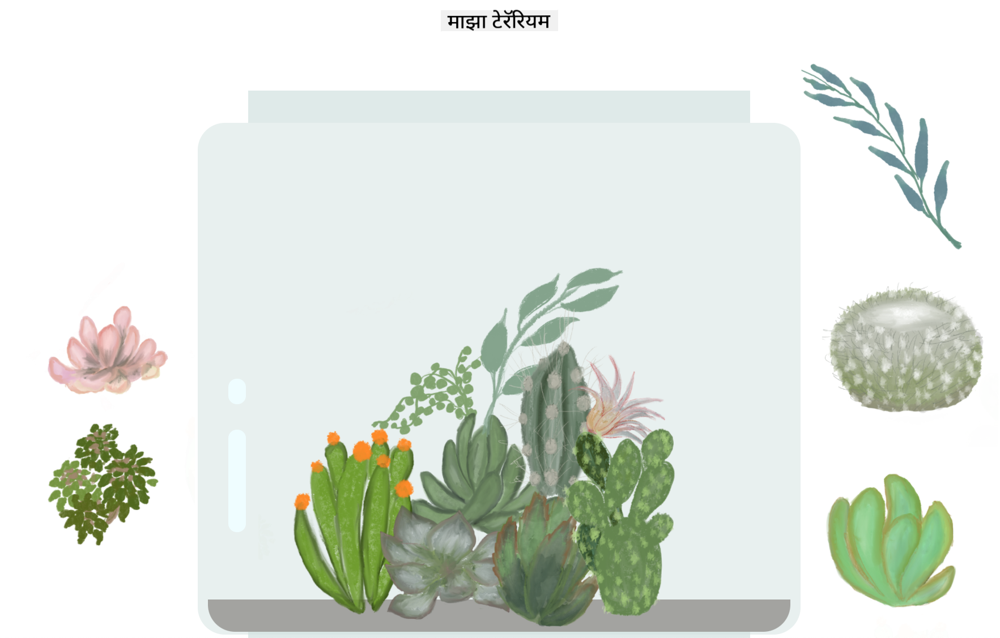

<!--
CO_OP_TRANSLATOR_METADATA:
{
  "original_hash": "6329fbe8bd936068debd78cca6f09c0a",
  "translation_date": "2025-08-25T21:30:53+00:00",
  "source_file": "3-terrarium/solution/README.md",
  "language_code": "mr"
}
-->
# माझं टेरॅरियम: HTML, CSS, आणि DOM मॅनिप्युलेशन शिकण्यासाठी JavaScript वापरून एक प्रकल्प 🌵🌱

एक छोटासा ड्रॅग आणि ड्रॉप कोड-मेडिटेशन. थोडं HTML, JS आणि CSS वापरून तुम्ही एक वेब इंटरफेस तयार करू शकता, त्याला स्टाइल देऊ शकता, आणि त्यात इंटरॅक्शन जोडू शकता.

## श्रेय

♥️ सह लिहिलं [Jen Looper](https://www.twitter.com/jenlooper) यांनी.

CSS वापरून तयार केलेलं टेरॅरियम Jakub Mandra च्या ग्लास जार [codepen](https://codepen.io/Rotarepmi/pen/rjpNZY) वरून प्रेरित आहे.

कला [Jen Looper](http://jenlooper.com) यांनी Procreate वापरून हाताने काढली आहे.

## तुमचं टेरॅरियम प्रकाशित करा

तुमचं टेरॅरियम Azure Static Web Apps वापरून वेबवर प्रकाशित करू शकता.

1. या रेपोला फोर्क करा

2. हा बटन दाबा

3. तुमचं अ‍ॅप तयार करण्यासाठी विजार्डमधून जा. तुमचं अ‍ॅप रूट `/solution` किंवा तुमच्या कोडबेसच्या रूटवर सेट करा याची खात्री करा. या अ‍ॅपमध्ये कोणताही API नाही, त्यामुळे त्याबद्दल चिंता करू नका. एक .github फोल्डर तुमच्या फोर्क केलेल्या रेपोमध्ये तयार होईल, जो Azure Static Web Apps च्या बिल्ड सर्व्हिसला तुमचं अ‍ॅप तयार आणि नवीन URL वर प्रकाशित करण्यात मदत करेल.

**अस्वीकरण**:  
हा दस्तऐवज AI भाषांतर सेवा [Co-op Translator](https://github.com/Azure/co-op-translator) चा वापर करून भाषांतरित करण्यात आला आहे. आम्ही अचूकतेसाठी प्रयत्नशील असलो तरी, कृपया लक्षात घ्या की स्वयंचलित भाषांतरांमध्ये त्रुटी किंवा अचूकतेचा अभाव असू शकतो. मूळ भाषेतील मूळ दस्तऐवज हा अधिकृत स्रोत मानला जावा. महत्त्वाच्या माहितीसाठी, व्यावसायिक मानवी भाषांतराची शिफारस केली जाते. या भाषांतराचा वापर केल्यामुळे उद्भवणाऱ्या कोणत्याही गैरसमज किंवा चुकीच्या अर्थासाठी आम्ही जबाबदार राहणार नाही.