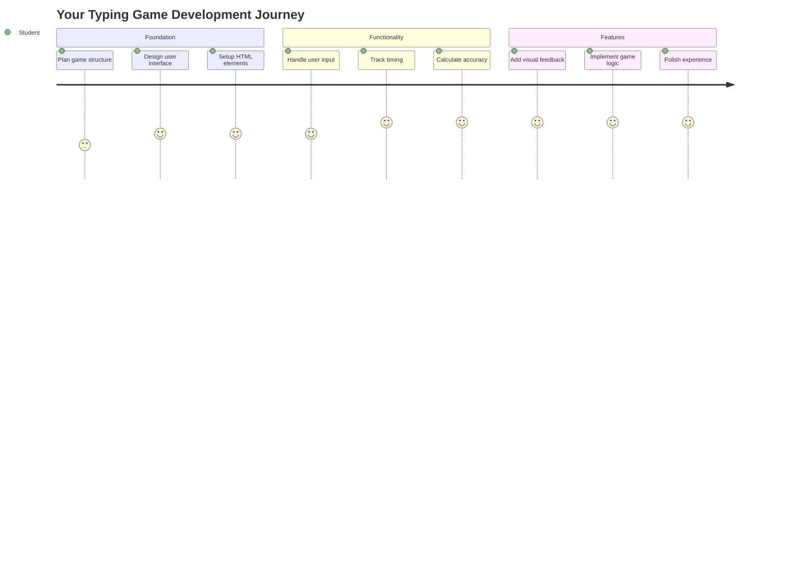
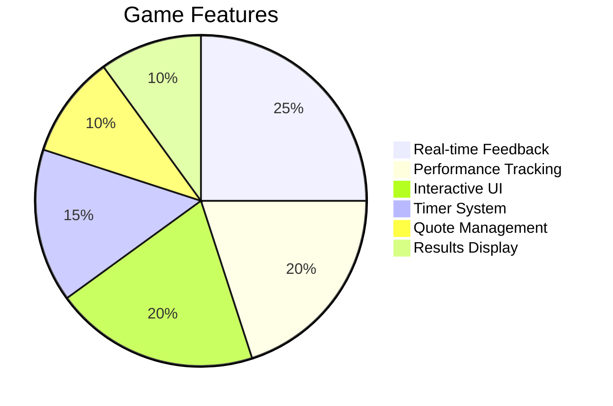
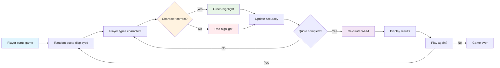
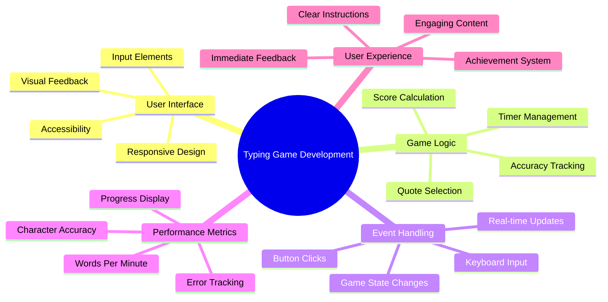
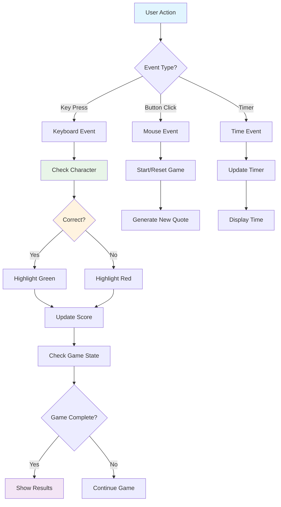
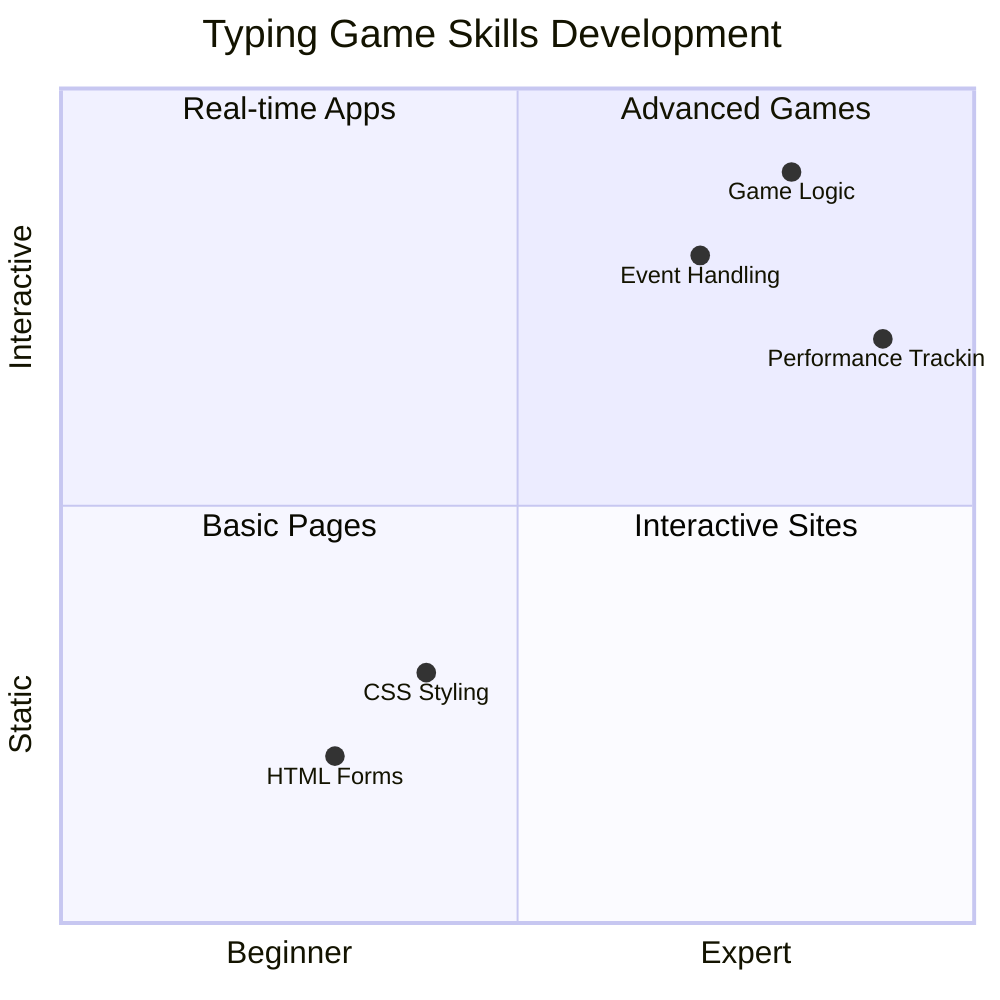
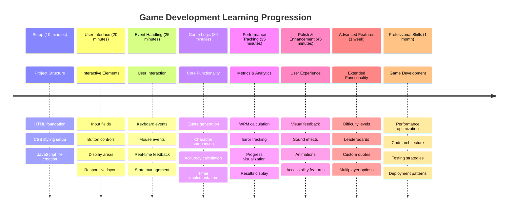

<!--
CO_OP_TRANSLATOR_METADATA:
{
  "original_hash": "efa2ab875b8bb5a7883816506da6b6d2",
  "translation_date": "2025-11-03T14:51:46+00:00",
  "source_file": "4-typing-game/README.md",
  "language_code": "mr"
}
-->
# इव्हेंट-ड्रिव्हन प्रोग्रामिंग - टायपिंग गेम तयार करा

## परिचय

प्रत्येक विकसकाला हे माहित असते पण क्वचितच बोलले जाते: जलद टायपिंग करणे म्हणजे एक सुपरपॉवर आहे! 🚀 विचार करा - तुमच्या कल्पना तुमच्या मेंदूपासून कोड एडिटरपर्यंत जितक्या जलद पोहोचतील, तितकी तुमची सर्जनशीलता अधिक प्रवाही होईल. हे तुमच्या विचारांपासून स्क्रीनपर्यंत थेट पाइपलाइन असल्यासारखे आहे.

या कौशल्याला सुधारण्यासाठी सर्वोत्तम मार्गांपैकी एक जाणून घ्यायचा आहे का? तुम्ही बरोबर ओळखले - आपण एक गेम तयार करणार आहोत!

> चला एक अप्रतिम टायपिंग गेम तयार करूया!

तुम्ही शिकत असलेल्या JavaScript, HTML आणि CSS कौशल्यांचा वापर करण्यासाठी तयार आहात का? आपण एक टायपिंग गेम तयार करणार आहोत जो तुम्हाला [शेरलॉक होम्स](https://en.wikipedia.org/wiki/Sherlock_Holmes) या प्रसिद्ध गुप्तहेराच्या यादृच्छिक कोट्ससह आव्हान देईल. हा गेम तुमची टायपिंगची गती आणि अचूकता ट्रॅक करेल - आणि माझ्यावर विश्वास ठेवा, हे अपेक्षेपेक्षा जास्त व्यसनाधीन आहे!

## तुम्हाला काय माहित असणे आवश्यक आहे

आत खोलवर जाण्यापूर्वी, तुम्ही या संकल्पनांमध्ये आरामदायक आहात याची खात्री करा (जर तुम्हाला थोडा रीफ्रेशर लागला तर काळजी करू नका - आपण सर्व तिथे गेलो आहोत!):

- टेक्स्ट इनपुट आणि बटण नियंत्रण तयार करणे
- CSS आणि वर्गांचा वापर करून शैली सेट करणे  
- JavaScript मूलभूत गोष्टी
  - अ‍ॅरे तयार करणे
  - यादृच्छिक संख्या तयार करणे
  - वर्तमान वेळ मिळवणे

जर यापैकी काही थोडेसे विसरले गेले असतील तर ते पूर्णपणे ठीक आहे! कधी कधी प्रकल्पात उडी मारणे आणि गोष्टी शोधणे हे तुमचे ज्ञान मजबूत करण्याचा सर्वोत्तम मार्ग असतो.

### 🔄 **शैक्षणिक तपासणी**
**मूलभूत मूल्यांकन**: विकास सुरू करण्यापूर्वी, तुम्हाला समजले आहे याची खात्री करा:
- ✅ HTML फॉर्म्स आणि इनपुट घटक कसे कार्य करतात
- ✅ CSS वर्ग आणि डायनॅमिक स्टाइलिंग
- ✅ JavaScript इव्हेंट लिसनर्स आणि हँडलर्स
- ✅ अ‍ॅरे मॅनिप्युलेशन आणि यादृच्छिक निवड
- ✅ वेळ मोजमाप आणि गणना

**जलद स्व-परीक्षण**: तुम्ही स्पष्ट करू शकता का की या संकल्पना परस्परसंवादी गेममध्ये एकत्र कशा कार्य करतात?
- **इव्हेंट्स** वापरकर्त्यांनी घटकांशी संवाद साधल्यावर ट्रिगर होतात
- **हँडलर्स** त्या इव्हेंट्सवर प्रक्रिया करतात आणि गेमची स्थिती अपडेट करतात
- **CSS** वापरकर्त्याच्या क्रियांसाठी व्हिज्युअल फीडबॅक प्रदान करते
- **टायमिंग** कार्यक्षमता मोजमाप आणि गेम प्रगती सक्षम करते

## चला हे तयार करूया!

[इव्हेंट-ड्रिव्हन प्रोग्रामिंग वापरून टायपिंग गेम तयार करणे](./typing-game/README.md)

### ⚡ **पुढील 5 मिनिटांत तुम्ही काय करू शकता**
- [ ] तुमच्या ब्राउझर कन्सोलमध्ये उघडा आणि `addEventListener` वापरून कीबोर्ड इव्हेंट्स ऐकण्याचा प्रयत्न करा
- [ ] इनपुट फील्डसह एक साधे HTML पृष्ठ तयार करा आणि टायपिंग डिटेक्शनची चाचणी करा
- [ ] स्ट्रिंग मॅनिप्युलेशनचा सराव करा टाइप केलेला मजकूर लक्ष्य मजकुराशी तुलना करून
- [ ] `setTimeout` वापरून टायमिंग फंक्शन्स समजून घेण्याचा प्रयोग करा

### 🎯 **तुम्ही या तासात काय साध्य करू शकता**
- [ ] पोस्ट-लेसन क्विझ पूर्ण करा आणि इव्हेंट-ड्रिव्हन प्रोग्रामिंग समजून घ्या
- [ ] शब्द सत्यापनासह टायपिंग गेमची मूलभूत आवृत्ती तयार करा
- [ ] योग्य आणि चुकीच्या टायपिंगसाठी व्हिज्युअल फीडबॅक जोडा
- [ ] गती आणि अचूकतेवर आधारित एक साधी स्कोअरिंग प्रणाली अंमलात आणा
- [ ] CSS सह तुमचा गेम शैलीबद्ध करा आणि तो व्हिज्युअली आकर्षक बनवा

### 📅 **तुमचा आठवडाभराचा गेम विकास**
- [ ] सर्व वैशिष्ट्ये आणि पॉलिशसह पूर्ण टायपिंग गेम पूर्ण करा
- [ ] वेगवेगळ्या शब्दांच्या जटिलतेसह अडचण पातळी जोडा
- [ ] वापरकर्ता आकडेवारी ट्रॅकिंग अंमलात आणा (WPM, वेळोवेळी अचूकता)
- [ ] चांगल्या वापरकर्ता अनुभवासाठी ध्वनी प्रभाव आणि अ‍ॅनिमेशन तयार करा
- [ ] टच डिव्हाइससाठी तुमचा गेम मोबाइल-प्रतिसादक्षम बनवा
- [ ] तुमचा गेम ऑनलाइन शेअर करा आणि वापरकर्त्यांकडून फीडबॅक मिळवा

### 🌟 **तुमचा महिनाभराचा परस्पर विकास**
- [ ] विविध संवाद पॅटर्न एक्सप्लोर करणारे एकाधिक गेम तयार करा
- [ ] गेम लूप्स, स्टेट मॅनेजमेंट आणि कार्यक्षमता ऑप्टिमायझेशनबद्दल जाणून घ्या
- [ ] ओपन सोर्स गेम डेव्हलपमेंट प्रोजेक्ट्समध्ये योगदान द्या
- [ ] प्रगत टायमिंग संकल्पना आणि गुळगुळीत अ‍ॅनिमेशनमध्ये प्रभुत्व मिळवा
- [ ] विविध परस्पर अनुप्रयोग दर्शविणारे पोर्टफोलिओ तयार करा
- [ ] गेम डेव्हलपमेंट आणि वापरकर्ता संवादामध्ये स्वारस्य असलेल्या इतरांना मार्गदर्शन करा

## 🎯 तुमचा टायपिंग गेम मास्टरी टाइमलाइन

### 🛠️ तुमचा गेम डेव्हलपमेंट टूलकिट सारांश

हा प्रकल्प पूर्ण केल्यानंतर, तुम्ही खालील गोष्टींमध्ये प्रभुत्व मिळवले असेल:
- **इव्हेंट-ड्रिव्हन प्रोग्रामिंग**: इनपुटला प्रतिसाद देणारे परस्परसंवादी यूजर इंटरफेस
- **रिअल-टाइम फीडबॅक**: त्वरित व्हिज्युअल आणि कार्यक्षमता अपडेट्स
- **कार्यक्षमता मोजमाप**: अचूक टायमिंग आणि स्कोअरिंग प्रणाली
- **गेम स्टेट मॅनेजमेंट**: अनुप्रयोग प्रवाह आणि वापरकर्ता अनुभव नियंत्रित करणे
- **परस्पर डिझाइन**: आकर्षक, व्यसनाधीन वापरकर्ता अनुभव तयार करणे
- **आधुनिक वेब APIs**: समृद्ध संवादांसाठी ब्राउझर क्षमता वापरणे
- **प्रवेशयोग्यता नमुने**: सर्व वापरकर्त्यांसाठी समावेशक डिझाइन

**वास्तविक-जागतिक अनुप्रयोग**: या कौशल्यांचा थेट उपयोग होतो:
- **वेब अनुप्रयोग**: कोणतेही परस्परसंवादी इंटरफेस किंवा डॅशबोर्ड
- **शैक्षणिक सॉफ्टवेअर**: शिक्षण प्लॅटफॉर्म आणि कौशल्य मूल्यांकन साधने
- **उत्पादकता साधने**: टेक्स्ट एडिटर्स, IDEs आणि सहयोग सॉफ्टवेअर
- **गेमिंग उद्योग**: ब्राउझर गेम्स आणि परस्पर मनोरंजन
- **मोबाइल विकास**: टच-आधारित इंटरफेस आणि जेस्चर हँडलिंग

**पुढील स्तर**: तुम्ही प्रगत गेम फ्रेमवर्क्स, रिअल-टाइम मल्टीप्लेअर सिस्टम्स किंवा जटिल परस्परसंवादी अनुप्रयोग एक्सप्लोर करण्यास तयार आहात!

## क्रेडिट्स

[क्रिस्टोफर हॅरिसन](http://www.twitter.com/geektrainer) यांनी ♥️ सह लिहिले

---

**अस्वीकरण**:  
हा दस्तऐवज AI भाषांतर सेवा [Co-op Translator](https://github.com/Azure/co-op-translator) वापरून भाषांतरित करण्यात आला आहे. आम्ही अचूकतेसाठी प्रयत्नशील असलो तरी, कृपया लक्षात ठेवा की स्वयंचलित भाषांतरांमध्ये त्रुटी किंवा अचूकतेचा अभाव असू शकतो. मूळ भाषेतील दस्तऐवज हा अधिकृत स्रोत मानला जावा. महत्त्वाच्या माहितीसाठी व्यावसायिक मानवी भाषांतराची शिफारस केली जाते. या भाषांतराचा वापर करून निर्माण होणाऱ्या कोणत्याही गैरसमज किंवा चुकीच्या अर्थासाठी आम्ही जबाबदार राहणार नाही.