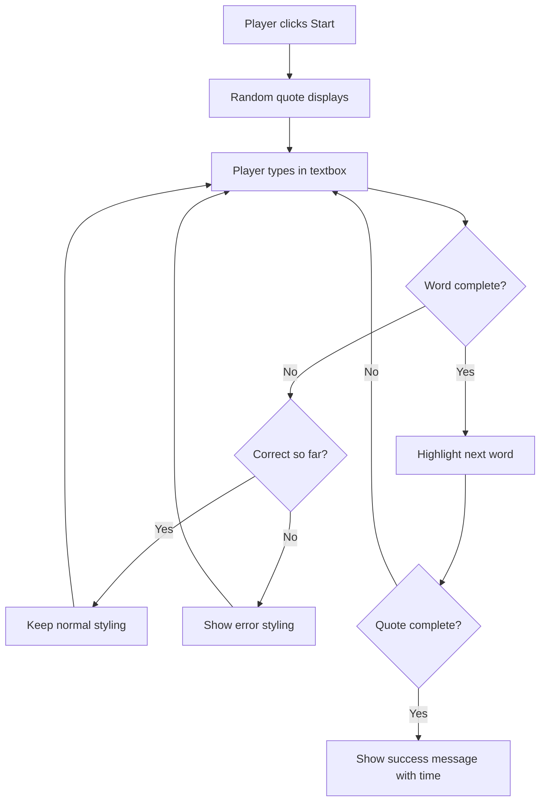
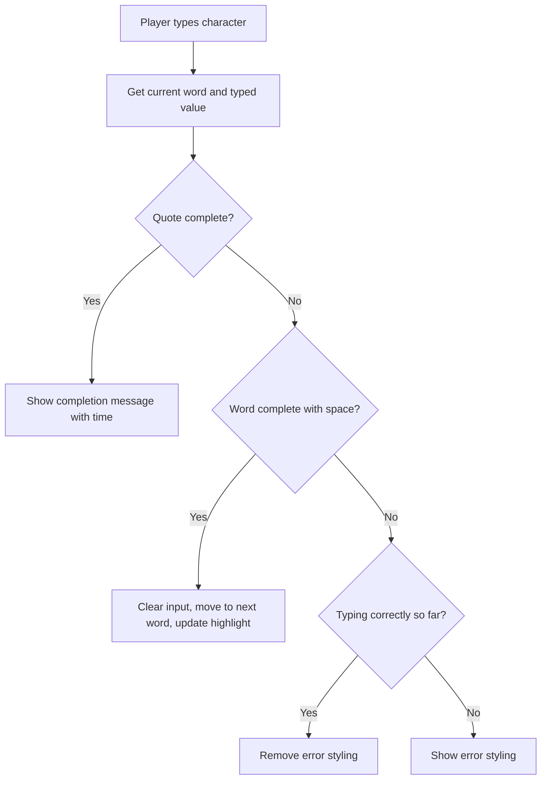

# इव्हेंट्स वापरून गेम तयार करणे

तुम्ही कधी विचार केला आहे का की वेबसाइट्सला कसे कळते की तुम्ही बटण क्लिक करता किंवा टेक्स्ट बॉक्समध्ये टाइप करता? हे इव्हेंट-ड्रिव्हन प्रोग्रामिंगचे जादू आहे! ही महत्त्वाची कौशल्य शिकण्यासाठी काहीतरी उपयुक्त तयार करण्यापेक्षा चांगले काय असू शकते - एक टाइपिंग स्पीड गेम जो तुम्ही केलेल्या प्रत्येक कीस्ट्रोकवर प्रतिक्रिया देतो.

तुम्ही स्वतः पाहणार आहात की वेब ब्राउझर तुमच्या JavaScript कोडशी "कसे बोलतात". तुम्ही प्रत्येक वेळी क्लिक करता, टाइप करता किंवा तुमचा माउस हलवता, ब्राउझर तुमच्या कोडला लहान संदेश (त्यांना इव्हेंट्स म्हणतात) पाठवत असतो आणि तुम्ही त्यावर कसे प्रतिसाद द्यायचे ते ठरवता!

जेव्हा आपण येथे संपवतो, तेव्हा तुम्ही एक खरा टाइपिंग गेम तयार केला असेल जो तुमचा वेग आणि अचूकता ट्रॅक करतो. त्याहून महत्त्वाचे म्हणजे, तुम्ही प्रत्येक इंटरॅक्टिव्ह वेबसाइटला चालवणारे मूलभूत संकल्पना समजून घेतल्या असतील. चला सुरुवात करूया!

## प्री-लेक्चर क्विझ

[प्री-लेक्चर क्विझ](https://ff-quizzes.netlify.app/web/quiz/21)

## इव्हेंट-ड्रिव्हन प्रोग्रामिंग

तुमच्या आवडत्या अॅप किंवा वेबसाइटबद्दल विचार करा - त्याला जिवंत आणि प्रतिसादात्मक काय बनवते? हे सर्व तुमच्या कृतींवर कसे प्रतिक्रिया देते याबद्दल आहे! प्रत्येक टॅप, क्लिक, स्वाइप किंवा कीस्ट्रोक "इव्हेंट" तयार करते आणि वेब डेव्हलपमेंटचे खरे जादू तिथेच घडते.

वेबसाठी प्रोग्रामिंग करणे इतके मनोरंजक का आहे? कारण आपल्याला कधीच माहित नसते की एखादी व्यक्ती ते बटण कधी क्लिक करेल किंवा टेक्स्ट बॉक्समध्ये टाइप करायला सुरुवात करेल. ते त्वरित क्लिक करू शकतात, पाच मिनिटे थांबू शकतात किंवा कदाचित कधीच क्लिक करू शकत नाहीत! या अनिश्चिततेमुळे आपल्याला आपला कोड कसा लिहायचा याबद्दल वेगळ्या प्रकारे विचार करावा लागतो.

रेसिपीसारखा कोड वरून खाली चालवण्याऐवजी, आम्ही कोड लिहितो जो काहीतरी होण्याची वाट पाहत शांतपणे बसतो. हे 1800 च्या दशकातील टेलिग्राफ ऑपरेटर कसे त्यांच्या मशीनजवळ बसून, वायरद्वारे संदेश येताच प्रतिसाद देण्यासाठी तयार असायचे त्यासारखे आहे.

तर "इव्हेंट" नेमके काय आहे? सोप्या भाषेत सांगायचे तर, ते काहीतरी घडते! तुम्ही बटण क्लिक करता तेव्हा - ते एक इव्हेंट आहे. तुम्ही अक्षर टाइप करता तेव्हा - ते एक इव्हेंट आहे. तुम्ही तुमचा माउस हलवता तेव्हा - ते आणखी एक इव्हेंट आहे.

इव्हेंट-ड्रिव्हन प्रोग्रामिंग आपल्याला आपला कोड ऐकण्यासाठी आणि प्रतिसाद देण्यासाठी सेट करण्यास अनुमती देते. आम्ही **इव्हेंट लिसनर्स** नावाच्या विशेष फंक्शन्स तयार करतो जे विशिष्ट गोष्टी घडण्याची वाट पाहतात आणि त्या घडल्यावर लगेच अॅक्शनमध्ये येतात.

इव्हेंट लिसनर्सना तुमच्या कोडसाठी डोअरबेल असल्यासारखे समजा. तुम्ही डोअरबेल सेट करता (`addEventListener()`), त्याला कोणता आवाज ऐकायचा आहे ते सांगता (जसे 'क्लिक' किंवा 'कीप्रेस') आणि मग कोणीतरी डोअरबेल वाजवल्यावर काय घडावे ते निर्दिष्ट करता (तुमचे कस्टम फंक्शन).

**इव्हेंट लिसनर्स कसे कार्य करतात:**
- **ऐकतात** विशिष्ट वापरकर्त्याच्या क्रिया जसे की क्लिक, कीस्ट्रोक्स किंवा माउस मूव्हमेंट
- **अंमलात आणतात** तुमचा कस्टम कोड जेव्हा निर्दिष्ट इव्हेंट घडतो
- **तत्काळ प्रतिसाद देतात** वापरकर्त्याच्या इंटरॅक्शनला, एक सहज अनुभव तयार करतात
- **हाताळतात** एकाच घटकावर वेगवेगळ्या लिसनर्ससह अनेक इव्हेंट्स

> **NOTE:** हे हायलाइट करणे योग्य आहे की इव्हेंट लिसनर्स तयार करण्याचे अनेक मार्ग आहेत. तुम्ही अज्ञात फंक्शन्स वापरू शकता किंवा नामांकित फंक्शन्स तयार करू शकता. तुम्ही विविध शॉर्टकट्स वापरू शकता, जसे की `click` प्रॉपर्टी सेट करणे किंवा `addEventListener()` वापरणे. आमच्या व्यायामामध्ये आम्ही `addEventListener()` आणि अज्ञात फंक्शन्सवर लक्ष केंद्रित करणार आहोत, कारण वेब डेव्हलपर्स वापरत असलेली ही सर्वात सामान्य तंत्र आहे. हे सर्वात लवचिक देखील आहे, कारण `addEventListener()` सर्व इव्हेंट्ससाठी कार्य करते आणि इव्हेंटचे नाव पॅरामीटर म्हणून प्रदान केले जाऊ शकते.

### सामान्य इव्हेंट्स

वेब ब्राउझर तुम्हाला ऐकण्यासाठी डझनभर वेगवेगळ्या इव्हेंट्स ऑफर करतात, परंतु बहुतेक इंटरॅक्टिव्ह अॅप्लिकेशन्स फक्त काही आवश्यक इव्हेंट्सवर अवलंबून असतात. या मुख्य इव्हेंट्स समजून घेणे तुम्हाला परिष्कृत वापरकर्ता इंटरॅक्शन तयार करण्याचा पाया देईल.

तुम्ही अॅप्लिकेशन तयार करताना ऐकण्यासाठी [डझनभर इव्हेंट्स](https://developer.mozilla.org/docs/Web/Events) उपलब्ध आहेत. मूलत: वापरकर्ता पृष्ठावर जे काही करतो ते एक इव्हेंट निर्माण करते, ज्यामुळे तुम्हाला त्यांना हवे असलेले अनुभव मिळवून देण्यासाठी खूप ताकद मिळते. सुदैवाने, तुम्हाला सामान्यतः फक्त काही मोजक्या इव्हेंट्सची आवश्यकता असते. येथे काही सामान्य इव्हेंट्स आहेत (ज्यामध्ये दोन आम्ही आमचा गेम तयार करताना वापरणार आहोत):

| इव्हेंट | वर्णन | सामान्य उपयोग |
|--------|-------|---------------|
| `click` | वापरकर्त्याने काहीतरी क्लिक केले | बटण, लिंक, इंटरॅक्टिव्ह घटक |
| `contextmenu` | वापरकर्त्याने उजव्या माउस बटणावर क्लिक केले | कस्टम राइट-क्लिक मेनू |
| `select` | वापरकर्त्याने काही टेक्स्ट हायलाइट केले | टेक्स्ट एडिटिंग, कॉपी ऑपरेशन्स |
| `input` | वापरकर्त्याने काही टेक्स्ट इनपुट केले | फॉर्म व्हॅलिडेशन, रिअल-टाइम सर्च |

**या इव्हेंट प्रकार समजून घेणे:**
- **ट्रिगर होते** जेव्हा वापरकर्ते तुमच्या पृष्ठावरील विशिष्ट घटकांशी संवाद साधतात
- **तपशीलवार माहिती प्रदान करते** वापरकर्त्याच्या कृतीबद्दल इव्हेंट ऑब्जेक्ट्सद्वारे
- **तुम्हाला सक्षम करते** प्रतिसादात्मक, इंटरॅक्टिव्ह वेब अॅप्लिकेशन्स तयार करण्यासाठी
- **सर्व ब्राउझर्स आणि डिव्हाइसवर कार्य करते** सातत्याने

## गेम तयार करणे

आता तुम्हाला इव्हेंट्स कसे कार्य करतात हे समजले आहे, चला त्या ज्ञानाचा उपयोग करून काहीतरी उपयुक्त तयार करूया. आम्ही एक टाइपिंग स्पीड गेम तयार करू जो इव्हेंट हँडलिंग दाखवेल आणि तुम्हाला एक महत्त्वाचे डेव्हलपर कौशल्य विकसित करण्यात मदत करेल.

आम्ही एक गेम तयार करणार आहोत ज्याद्वारे JavaScript मध्ये इव्हेंट्स कसे कार्य करतात हे एक्सप्लोर करू. आमचा गेम खेळाडूच्या टाइपिंग कौशल्याची चाचणी घेईल, जे सर्व डेव्हलपर्ससाठी सर्वात कमी कौतुक केलेले कौशल्य आहे. मजेदार तथ्य: आज आपण वापरत असलेली QWERTY कीबोर्ड लेआउट 1870 च्या दशकात टाइपराइटर्ससाठी डिझाइन केली गेली होती - आणि चांगले टाइपिंग कौशल्य आजही प्रोग्रामर्ससाठी तितकेच मौल्यवान आहे! गेमचा सामान्य प्रवाह असा दिसेल:



**आमचा गेम कसा कार्य करेल:**
- **सुरू होतो** जेव्हा खेळाडू स्टार्ट बटण क्लिक करतो आणि एक रँडम कोट दाखवतो
- **ट्रॅक करतो** खेळाडूचा टाइपिंग प्रगती शब्दानुसार रिअल-टाइममध्ये
- **हायलाइट करतो** सध्याचा शब्द खेळाडूचे लक्ष केंद्रित करण्यासाठी
- **तत्काळ व्हिज्युअल फीडबॅक प्रदान करतो** टाइपिंग त्रुटींसाठी
- **एकूण वेळ मोजतो आणि दाखवतो** जेव्हा कोट पूर्ण होतो

चला आपला गेम तयार करूया आणि इव्हेंट्सबद्दल शिकूया!

### फाइल स्ट्रक्चर

कोडिंग सुरू करण्यापूर्वी, चला व्यवस्थित होऊया! सुरुवातीपासून स्वच्छ फाइल स्ट्रक्चर असणे तुम्हाला नंतर डोकेदुखीपासून वाचवेल आणि तुमचा प्रोजेक्ट अधिक व्यावसायिक बनवेल. 😊

आम्ही फक्त तीन फाइल्ससह गोष्टी सोप्या ठेवणार आहोत: `index.html` आमच्या पृष्ठ संरचनेसाठी, `script.js` आमच्या सर्व गेम लॉजिकसाठी आणि `style.css` सर्वकाही चांगले दिसण्यासाठी. ही क्लासिक तिकडी आहे जी वेबचा मोठा भाग चालवते!

**कन्सोल किंवा टर्मिनल विंडो उघडून खालील कमांड जारी करून तुमच्या कामासाठी नवीन फोल्डर तयार करा:**

```bash
# Linux or macOS
mkdir typing-game && cd typing-game

# Windows
md typing-game && cd typing-game
```

**या कमांड्स काय करतात:**
- **नवीन डिरेक्टरी तयार करते** ज्याचे नाव `typing-game` आहे तुमच्या प्रोजेक्ट फाइल्ससाठी
- **स्वतःच नव्याने तयार केलेल्या डिरेक्टरीमध्ये जाते**
- **तुमच्या गेम डेव्हलपमेंटसाठी स्वच्छ कार्यक्षेत्र सेट करते**

**Visual Studio Code उघडा:**

```bash
code .
```

**ही कमांड:**
- **Visual Studio Code सुरू करते** सध्याच्या डिरेक्टरीमध्ये
- **तुमच्या प्रोजेक्ट फोल्डरला एडिटरमध्ये उघडते**
- **तुम्हाला आवश्यक असलेल्या सर्व डेव्हलपमेंट टूल्ससाठी प्रवेश प्रदान करते**

**Visual Studio Code मध्ये फोल्डरमध्ये खालील नावांच्या तीन फाइल्स जोडा:**
- `index.html` - तुमच्या गेमची संरचना आणि सामग्री समाविष्ट करते
- `script.js` - सर्व गेम लॉजिक आणि इव्हेंट लिसनर्स हाताळते
- `style.css` - व्हिज्युअल स्वरूप आणि स्टाइलिंग परिभाषित करते

## वापरकर्ता इंटरफेस तयार करा

आता चला स्टेज तयार करूया जिथे आमच्या गेमची सर्व अॅक्शन होईल! याला स्पेसशिपसाठी कंट्रोल पॅनेल डिझाइन करणे असे समजा - आपल्याला खात्री करायची आहे की आमच्या खेळाडूंना आवश्यक असलेली प्रत्येक गोष्ट तिथेच आहे जिथे त्यांना अपेक्षित आहे.

चला पाहूया की आमच्या गेमला प्रत्यक्षात काय आवश्यक आहे. तुम्ही टाइपिंग गेम खेळत असाल तर तुम्हाला स्क्रीनवर काय पाहायचे आहे? येथे आपल्याला काय आवश्यक आहे:

| UI घटक | उद्देश | HTML घटक |
|---------|--------|----------|
| कोट डिस्प्ले | टाइप करण्यासाठी टेक्स्ट दाखवतो | `<p>` `id="quote"` सह |
| मेसेज एरिया | स्टेटस आणि यशाचे संदेश दाखवतो | `<p>` `id="message"` सह |
| टेक्स्ट इनपुट | जिथे खेळाडू कोट टाइप करतात | `<input>` `id="typed-value"` सह |
| स्टार्ट बटण | गेम सुरू करतो | `<button>` `id="start"` सह |

**UI स्ट्रक्चर समजून घेणे:**
- **सामग्री व्यवस्थित करते** वरून खाली लॉजिकल पद्धतीने
- **युनिक IDs असाइन करते** घटकांना JavaScript टार्गेटिंगसाठी
- **स्पष्ट व्हिज्युअल हायरार्की प्रदान करते** चांगल्या वापरकर्ता अनुभवासाठी
- **सेमॅंटिक HTML घटक समाविष्ट करते** ऍक्सेसिबिलिटीसाठी

त्यापैकी प्रत्येकाला IDs आवश्यक असतील जेणेकरून आम्ही आमच्या JavaScript मध्ये त्यांच्याशी काम करू शकू. आम्ही तयार करणार असलेल्या CSS आणि JavaScript फाइल्ससाठी संदर्भ देखील जोडू.

`index.html` नावाची नवीन फाइल तयार करा. खालील HTML जोडा:

```html
<!-- inside index.html -->
<html>
<head>
  <title>Typing game</title>
  <link rel="stylesheet" href="style.css">
</head>
<body>
  <h1>Typing game!</h1>
  <p>Practice your typing skills with a quote from Sherlock Holmes. Click **start** to begin!</p>
  <p id="quote"></p> <!-- This will display our quote -->
  <p id="message"></p> <!-- This will display any status messages -->
  <div>
    <input type="text" aria-label="current word" id="typed-value" /> <!-- The textbox for typing -->
    <button type="button" id="start">Start</button> <!-- To start the game -->
  </div>
  <script src="script.js"></script>
</body>
</html>
```

**या HTML स्ट्रक्चरने काय साध्य केले आहे याचे विश्लेषण:**
- **CSS स्टाइलशीट लिंक करते** `<head>` मध्ये स्टाइलिंगसाठी
- **स्पष्ट हेडिंग आणि सूचना तयार करते** वापरकर्त्यांसाठी
- **स्पेसिफिक IDs सह प्लेसहोल्डर पॅराग्राफ्स स्थापन करते** डायनॅमिक सामग्रीसाठी
- **एक इनपुट फील्ड समाविष्ट करते** ऍक्सेसिबिलिटी अॅट्रिब्युट्ससह
- **स्टार्ट बटण प्रदान करते** गेम ट्रिगर करण्यासाठी
- **JavaScript फाइल लोड करते** शेवटी ऑप्टिमल परफॉर्मन्ससाठी

### अॅप्लिकेशन लॉन्च करा

डेव्हलपमेंट दरम्यान तुमचे अॅप्लिकेशन वारंवार चाचणी करणे तुम्हाला लवकर समस्या शोधण्यात आणि तुमची प्रगती रिअल-टाइममध्ये पाहण्यात मदत करते. Live Server हा एक अमूल्य टूल आहे जो तुम्ही बदल सेव्ह केल्यावर तुमचा ब्राउझर आपोआप रीफ्रेश करतो, ज्यामुळे डेव्हलपमेंट अधिक कार्यक्षम होते.

नेहमीच पुनरावृत्तीने डेव्हलप करणे चांगले असते जेणेकरून गोष्टी कशा दिसतात ते पाहता येईल. चला आपले अॅप्लिकेशन लॉन्च करूया. Visual Studio Code साठी [Live Server](https://marketplace.visualstudio.com/items?itemName=ritwickdey.LiveServer&WT.mc_id=academic-77807-sagibbon) नावाचा एक अद्भुत विस्तार आहे जो तुमचे अॅप्लिकेशन स्थानिक पातळीवर होस्ट करेल आणि तुम्ही प्रत्येक वेळी फाइल सेव्ह केल्यावर ब्राउझर रीफ्रेश करेल.

**[Live Server](https://marketplace.visualstudio.com/items?itemName=ritwickdey.LiveServer&WT.mc_id=academic-77807-sagibbon) इंस्टॉल करा, लिंक फॉलो करून आणि इंस्टॉल क्लिक करून:**

**इंस्टॉलेशन दरम्यान काय होते:**
- **तुमच्या ब्राउझरला Visual Studio Code उघडण्यास प्रवृत्त करते**
- **तुम्हाला विस्तार इंस्टॉल करण्याच्या प्रक्रियेत मार्गदर्शन करते**
- **Visual Studio Code पुन्हा सुरू करणे आवश्यक असू शकते** सेटअप पूर्ण करण्यासाठी

**इंस्टॉल झाल्यावर, Visual Studio Code मध्ये, Ctrl-Shift-P (किंवा Cmd-Shift-P) क्लिक करा कमांड पॅलेट उघडण्यासाठी:**

**कमांड पॅलेट समजून घेणे:**
- **Visual Studio Code च्या सर्व कमांड्ससाठी जलद प्रवेश प्रदान करते**
- **तुम्ही टाइप करता तेव्हा कमांड्स शोधते**
- **जलद डेव्हलपमेंटसाठी कीबोर्ड शॉर्टकट्स ऑफर करते**

**"Live Server: Open with Live Server" टाइप करा:**

**Live Server काय करते:**
- **तुमच्या प्रोजेक्टसाठी स्थानिक डेव्हलपमेंट सर्व्हर सुरू करते**
- **तुम्ही फाइल्स सेव्ह करता तेव्हा ब्राउझर आपोआप रीफ्रेश करते**
- **तुमच्या फाइल्सला स्थानिक URL वर सर्व्ह करते** (सामान्यतः `localhost:5500`)

**ब्राउझर उघडा आणि `https://localhost:5500` वर जा:**

आता तुम्ही तयार केलेले पृष्ठ पाहू शकता! चला काही फंक्शनॅलिटी जोडूया.

## CSS जोडा

आता गोष्टी चांगल्या दिसू द्या! व्हिज्युअल फीडबॅक हे संगणकीय इंटरफेससाठी सुरुवातीच्या काळापासून महत्त्वाचे आहे. 1980 च्या दशकात, संशोधकांनी शोधले की तात्काळ व्हिज्युअल फीडबॅक वापरकर्त्याची कार्यक्षमता लक्षणीयरीत्या सुधारते आणि त्रुटी कमी करते. हेच आपण तयार करणार आहोत.

आपल्या गेमला काय चालले आहे हे स्पष्टपणे दाखवणे आवश्यक आहे. खेळाडूंनी त्वरित जाणले पाहिजे की त्यांना कोणता शब्द टाइप करायचा आहे आणि त्यांनी चूक केली तर त्यांना लगेच
| कोट्सची यादी | खेळासाठी सर्व शक्य कोट्स साठवा | `['Quote 1', 'Quote 2', ...]` |
| शब्दांची यादी | सध्याचा कोट वेगवेगळ्या शब्दांमध्ये विभागा | `['When', 'you', 'have', ...]` |
| शब्द क्रमांक | खेळाडू कोणता शब्द टाइप करत आहे ते ट्रॅक करा | `0, 1, 2, 3...` |
| सुरुवातीचा वेळ | स्कोरिंगसाठी लागलेला वेळ मोजा | `Date.now()` |

**आपल्याला UI घटकांचे संदर्भ देखील आवश्यक आहेत:**
| घटक | ID | उद्देश |
|------|----|--------|
| टेक्स्ट इनपुट | `typed-value` | जिथे खेळाडू टाइप करतात |
| कोट डिस्प्ले | `quote` | टाइप करण्यासाठी कोट दाखवतो |
| मेसेज एरिया | `message` | स्थिती अपडेट्स दाखवतो |

```javascript
// inside script.js
// all of our quotes
const quotes = [
    'When you have eliminated the impossible, whatever remains, however improbable, must be the truth.',
    'There is nothing more deceptive than an obvious fact.',
    'I ought to know by this time that when a fact appears to be opposed to a long train of deductions it invariably proves to be capable of bearing some other interpretation.',
    'I never make exceptions. An exception disproves the rule.',
    'What one man can invent another can discover.',
    'Nothing clears up a case so much as stating it to another person.',
    'Education never ends, Watson. It is a series of lessons, with the greatest for the last.',
];
// store the list of words and the index of the word the player is currently typing
let words = [];
let wordIndex = 0;
// the starting time
let startTime = Date.now();
// page elements
const quoteElement = document.getElementById('quote');
const messageElement = document.getElementById('message');
const typedValueElement = document.getElementById('typed-value');
```

**या सेटअप कोडने काय साध्य केले आहे याचे विश्लेषण:**
- **साठवते** Sherlock Holmes कोट्सची यादी `const` वापरून कारण कोट्स बदलणार नाहीत
- **ट्रॅकिंग व्हेरिएबल्स सुरू करते** `let` वापरून कारण हे मूल्य गेमप्ले दरम्यान अपडेट होईल
- **DOM घटकांचे संदर्भ घेतो** `document.getElementById()` वापरून कार्यक्षम प्रवेशासाठी
- **सर्व गेम फंक्शनॅलिटीसाठी पाया तयार करतो** स्पष्ट, वर्णनात्मक व्हेरिएबल नावांसह
- **संबंधित डेटा आणि घटक व्यवस्थित ठेवतो** कोड देखभाल सुलभ करण्यासाठी

✅ आपल्या खेळात अधिक कोट्स जोडा

> 💡 **प्रो टिप**: आपण कोडमध्ये कधीही घटक पुनर्प्राप्त करू शकतो `document.getElementById()` वापरून. कारण आपण या घटकांचा नियमितपणे संदर्भ घेणार आहोत, आम्ही स्ट्रिंग लिटरल्ससह टायपो टाळणार आहोत आणि कॉन्स्टंट्स वापरणार आहोत. [Vue.js](https://vuejs.org/) किंवा [React](https://reactjs.org/) सारख्या फ्रेमवर्क्स आपल्याला कोड केंद्रीकरण अधिक चांगल्या प्रकारे व्यवस्थापित करण्यात मदत करू शकतात.
>
**ही पद्धत इतकी प्रभावी का आहे:**
- **स्पेलिंग त्रुटी टाळते** जेव्हा घटकांचा अनेक वेळा संदर्भ घेतला जातो
- **कोड वाचनीयता सुधारते** वर्णनात्मक कॉन्स्टंट नावांसह
- **चांगले IDE समर्थन सक्षम करते** ऑटो-कंप्लीट आणि त्रुटी तपासणीसह
- **रिफॅक्टरिंग सुलभ करते** जर घटक IDs नंतर बदलले

`const`, `let` आणि `var` वापरण्याबद्दल व्हिडिओ पाहण्यासाठी एक मिनिट घ्या

[](https://youtube.com/watch?v=JNIXfGiDWM8 "व्हेरिएबल प्रकार")

> 🎥 व्हेरिएबल्सबद्दल व्हिडिओसाठी वरील प्रतिमा क्लिक करा.

### सुरुवात करण्याचे लॉजिक जोडा

इथेच सर्वकाही एकत्र येते! 🚀 तुम्ही तुमचा पहिला खरा इव्हेंट लिसनर लिहिणार आहात, आणि "स्टार्ट" बटण क्लिक केल्यावर तुमचा कोड प्रतिसाद देताना पाहण्यात काहीतरी समाधानकारक आहे.

कल्पना करा: कुठेतरी एक खेळाडू "स्टार्ट" बटण क्लिक करणार आहे, आणि तुमचा कोड त्यासाठी तयार असायला हवा. आम्हाला कल्पना नाही की ते कधी क्लिक करतील - त्वरित, किंवा कॉफी घेतल्यानंतर - पण जेव्हा ते करतील, तुमचा खेळ सुरू होईल.

जेव्हा वापरकर्ता `start` क्लिक करतो, तेव्हा आपल्याला एक कोट निवडायचा आहे, यूजर इंटरफेस सेटअप करायचा आहे, आणि सध्याच्या शब्दासाठी आणि वेळेसाठी ट्रॅकिंग सेटअप करायचे आहे. खाली तुम्हाला आवश्यक JavaScript दिले आहे; आम्ही स्क्रिप्ट ब्लॉकनंतर त्यावर चर्चा करतो.

```javascript
// at the end of script.js
document.getElementById('start').addEventListener('click', () => {
  // get a quote
  const quoteIndex = Math.floor(Math.random() * quotes.length);
  const quote = quotes[quoteIndex];
  // Put the quote into an array of words
  words = quote.split(' ');
  // reset the word index for tracking
  wordIndex = 0;

  // UI updates
  // Create an array of span elements so we can set a class
  const spanWords = words.map(function(word) { return `<span>${word} </span>`});
  // Convert into string and set as innerHTML on quote display
  quoteElement.innerHTML = spanWords.join('');
  // Highlight the first word
  quoteElement.childNodes[0].className = 'highlight';
  // Clear any prior messages
  messageElement.innerText = '';

  // Setup the textbox
  // Clear the textbox
  typedValueElement.value = '';
  // set focus
  typedValueElement.focus();
  // set the event handler

  // Start the timer
  startTime = new Date().getTime();
});
```

**कोडचे लॉजिकल विभागांमध्ये विश्लेषण:**

**📊 शब्द ट्रॅकिंग सेटअप:**
- **निवडतो** एक रँडम कोट `Math.floor()` आणि `Math.random()` वापरून विविधतेसाठी
- **कोटला** वेगवेगळ्या शब्दांच्या यादीत बदलतो `split(' ')` वापरून
- **रीसेट करतो** `wordIndex` 0 वर कारण खेळाडू पहिल्या शब्दापासून सुरुवात करतो
- **तयार करतो** खेळाची स्थिती एका नवीन राउंडसाठी

**🎨 UI सेटअप आणि डिस्प्ले:**
- **निर्मिती करतो** `<span>` घटकांची यादी, प्रत्येक शब्दाला वेगळ्या शैलीसाठी वेढून
- **जोडतो** स्पॅन घटक एका सिंगल स्ट्रिंगमध्ये कार्यक्षम DOM अपडेटसाठी
- **हायलाइट करतो** पहिला शब्द `highlight` CSS क्लास जोडून
- **पूर्वीचे गेम मेसेजेस साफ करतो** स्वच्छ सुरुवातीसाठी

**⌨️ टेक्स्टबॉक्स तयारी:**
- **साफ करतो** इनपुट फील्डमधील कोणतेही विद्यमान टेक्स्ट
- **फोकस सेट करतो** टेक्स्टबॉक्सवर जेणेकरून खेळाडू त्वरित टाइपिंग सुरू करू शकतील
- **इनपुट एरिया तयार करतो** नवीन गेम सत्रासाठी

**⏱️ टाइमर इनिशियलायझेशन:**
- **सध्याचा टाइमस्टॅम्प कॅप्चर करतो** `new Date().getTime()` वापरून
- **टायपिंग स्पीड आणि पूर्ण वेळेची अचूक गणना सक्षम करतो**
- **गेम सत्रासाठी परफॉर्मन्स ट्रॅकिंग सुरू करतो**

### टायपिंग लॉजिक जोडा

इथे आपण आपल्या खेळाचा मुख्य भाग हाताळतो! सुरुवातीला हे थोडे जास्त वाटू शकते, पण आम्ही प्रत्येक भाग समजावून सांगू, आणि शेवटी तुम्हाला हे किती लॉजिकल आहे ते समजेल.

आपण जे तयार करत आहोत ते खूप प्रगत आहे: प्रत्येक वेळी कोणी अक्षर टाइप करते, आपला कोड तपासणार आहे की त्यांनी काय टाइप केले, त्यांना फीडबॅक देणार आहे, आणि पुढे काय करायचे ते ठरवणार आहे. हे 1970 च्या दशकातील WordStar सारख्या सुरुवातीच्या वर्ड प्रोसेसरसारखे आहे जे टायपिस्टला रिअल-टाइम फीडबॅक देत होते.

```javascript
// at the end of script.js
typedValueElement.addEventListener('input', () => {
  // Get the current word
  const currentWord = words[wordIndex];
  // get the current value
  const typedValue = typedValueElement.value;

  if (typedValue === currentWord && wordIndex === words.length - 1) {
    // end of sentence
    // Display success
    const elapsedTime = new Date().getTime() - startTime;
    const message = `CONGRATULATIONS! You finished in ${elapsedTime / 1000} seconds.`;
    messageElement.innerText = message;
  } else if (typedValue.endsWith(' ') && typedValue.trim() === currentWord) {
    // end of word
    // clear the typedValueElement for the new word
    typedValueElement.value = '';
    // move to the next word
    wordIndex++;
    // reset the class name for all elements in quote
    for (const wordElement of quoteElement.childNodes) {
      wordElement.className = '';
    }
    // highlight the new word
    quoteElement.childNodes[wordIndex].className = 'highlight';
  } else if (currentWord.startsWith(typedValue)) {
    // currently correct
    // highlight the next word
    typedValueElement.className = '';
  } else {
    // error state
    typedValueElement.className = 'error';
  }
});
```

**टायपिंग लॉजिक फ्लो समजून घेणे:**

ही फंक्शन सर्वात विशिष्ट ते सर्वसामान्य अटी तपासते. प्रत्येक परिस्थितीचे विश्लेषण करूया:



**🏁 कोट पूर्ण (परिस्थिती 1):**
- **तपासते** की टाइप केलेले मूल्य सध्याच्या शब्दाशी जुळते आणि आपण शेवटच्या शब्दावर आहोत
- **गणना करते** लागलेला वेळ सुरुवातीच्या वेळेपासून सध्याच्या वेळेपर्यंत वजा करून
- **मिलीसेकंद सेकंदात बदलते** 1,000 ने भाग देऊन
- **प्रदर्शित करते** अभिनंदन संदेश पूर्ण वेळासह

**✅ शब्द पूर्ण (परिस्थिती 2):**
- **शब्द पूर्ण होणे ओळखते** जेव्हा इनपुट स्पेसने संपते
- **तपासते** की ट्रिम केलेले इनपुट सध्याच्या शब्दाशी अचूक जुळते
- **इनपुट फील्ड साफ करते** पुढील शब्दासाठी
- **पुढे जाते** पुढील शब्दावर `wordIndex` वाढवून
- **दृश्य हायलाइटिंग अपडेट करते** सर्व क्लासेस काढून आणि नवीन शब्द हायलाइट करून

**📝 टायपिंग चालू आहे (परिस्थिती 3):**
- **तपासते** की सध्याचा शब्द आतापर्यंत टाइप केलेल्या गोष्टीने सुरू होतो
- **कोणतेही त्रुटी स्टाइलिंग काढते** दाखवण्यासाठी की इनपुट योग्य आहे
- **टायपिंग सुरू ठेवण्यास परवानगी देते** कोणत्याही व्यत्ययाशिवाय

**❌ त्रुटी स्थिती (परिस्थिती 4):**
- **ट्रिगर करते** जेव्हा टाइप केलेला मजकूर अपेक्षित शब्दाच्या सुरुवातीशी जुळत नाही
- **त्रुटी CSS क्लास लागू करते** त्वरित दृश्य फीडबॅक प्रदान करण्यासाठी
- **खेळाडूंना मदत करते** लवकर ओळखण्यासाठी आणि चुका सुधारण्यासाठी

## तुमचे अॅप्लिकेशन तपासा

तुम्ही काय साध्य केले आहे ते पहा! 🎉 तुम्ही इव्हेंट-ड्रिव्हन प्रोग्रामिंग वापरून स्क्रॅचपासून एक वास्तविक, कार्यरत टायपिंग गेम तयार केला आहे. याचा आनंद घ्या - हे काही छोटे यश नाही!

आता चाचणी टप्पा सुरू होतो! हे अपेक्षेप्रमाणे कार्य करेल का? आपण काहीतरी चुकवले आहे का? एक गोष्ट लक्षात ठेवा: जर काहीतरी लगेच परिपूर्णपणे कार्य करत नसेल, तर ते पूर्णपणे सामान्य आहे. अनुभवी विकसक देखील नियमितपणे त्यांच्या कोडमध्ये बग शोधतात. हे विकास प्रक्रियेचा एक भाग आहे!

`start` वर क्लिक करा, आणि टाइपिंग सुरू करा! हे थोडेसे आपण पाहिलेल्या अॅनिमेशनसारखे दिसायला हवे.


**तुमच्या अॅप्लिकेशनमध्ये काय तपासायचे:**
- **तपासते** की स्टार्ट क्लिक केल्यावर रँडम कोट दिसतो
- **पुष्टी करते** की टाइप करताना सध्याचा शब्द योग्य प्रकारे हायलाइट होतो
- **तपासते** की चुकीच्या टायपिंगसाठी त्रुटी स्टाइलिंग दिसते
- **पुष्टी करते** की शब्द पूर्ण झाल्यावर हायलाइट योग्य प्रकारे पुढे जातो
- **तपासते** की कोट पूर्ण केल्यावर पूर्ण वेळेसह संदेश दिसतो

**सामान्य डिबगिंग टिप्स:**
- **तपासा** ब्राउझर कन्सोल (F12) मध्ये JavaScript त्रुटींसाठी
- **पुष्टी करा** की सर्व फाइल नावे अचूक जुळतात (केस-संवेदनशील)
- **पक्का करा** की Live Server चालू आहे आणि योग्य प्रकारे रिफ्रेश होत आहे
- **वेगवेगळे कोट्स तपासा** रँडम निवड कार्य करते याची पुष्टी करण्यासाठी

---

## GitHub Copilot Agent Challenge 🎮

Agent मोड वापरून खालील आव्हान पूर्ण करा:

**वर्णन:** खेळाडूच्या कामगिरीवर आधारित गेम समायोजित करणारी अडचण प्रणाली अंमलात आणून टायपिंग गेम विस्तृत करा. हे आव्हान तुम्हाला प्रगत इव्हेंट हँडलिंग, डेटा विश्लेषण, आणि डायनॅमिक UI अपडेट्सचा सराव करण्यास मदत करेल.

**प्रॉम्प्ट:** टायपिंग गेमसाठी अडचण समायोजन प्रणाली तयार करा जी:
1. खेळाडूचा टायपिंग वेग (शब्द प्रति मिनिट) आणि अचूकता टक्केवारी ट्रॅक करते
2. आपोआप तीन अडचण पातळ्यांमध्ये समायोजित होते: सोपे (सोपे कोट्स), मध्यम (सध्याचे कोट्स), कठीण (विरामचिन्हांसह जटिल कोट्स)
3. सध्याची अडचण पातळी आणि खेळाडूची आकडेवारी UI वर प्रदर्शित करते
4. 3 सलग चांगल्या कामगिरीनंतर अडचण वाढवणारा स्ट्रीक काउंटर अंमलात आणते
5. अडचण बदल सूचित करण्यासाठी दृश्य फीडबॅक (रंग, अॅनिमेशन) जोडते

आवश्यक HTML घटक, CSS शैली, आणि JavaScript फंक्शन्स जोडा जेणेकरून ही सुविधा अंमलात आणता येईल. योग्य त्रुटी हाताळणी समाविष्ट करा आणि खेळ योग्य प्रकारे प्रवेशयोग्य राहील याची खात्री करा.

[agent mode बद्दल अधिक जाणून घ्या](https://code.visualstudio.com/blogs/2025/02/24/introducing-copilot-agent-mode) येथे.

## 🚀 आव्हान

तुमचा टायपिंग गेम पुढील स्तरावर नेण्यासाठी तयार आहात? इव्हेंट हँडलिंग आणि DOM मॅनिप्युलेशनची सखोल समज मिळवण्यासाठी या प्रगत वैशिष्ट्ये अंमलात आणण्याचा प्रयत्न करा:

**अधिक कार्यक्षमता जोडा:**

| वैशिष्ट्य | वर्णन | तुम्ही सराव कराल अशा कौशल्य |
|-----------|-------|-----------------------------|
| **इनपुट नियंत्रण** | पूर्ण झाल्यावर `input` इव्हेंट लिसनर अक्षम करा, आणि बटण क्लिक केल्यावर पुन्हा सक्षम करा | इव्हेंट व्यवस्थापन आणि स्थिती नियंत्रण |
| **UI स्थिती व्यवस्थापन** | खेळाडू कोट पूर्ण केल्यावर टेक्स्टबॉक्स अक्षम करा | DOM प्रॉपर्टी मॅनिप्युलेशन |
| **मोडल डायलॉग** | यशाचा संदेश असलेला मोडल डायलॉग बॉक्स प्रदर्शित करा | प्रगत UI पॅटर्न आणि प्रवेशयोग्यता |
| **हाय स्कोअर प्रणाली** | `localStorage` वापरून उच्च स्कोअर साठवा | ब्राउझर स्टोरेज APIs आणि डेटा टिकवणे |

**अंमलबजावणी टिप्स:**
- **शोधा** `localStorage.setItem()` आणि `localStorage.getItem()` टिकाऊ स्टोरेजसाठी
- **सराव करा** इव्हेंट लिसनर्स डायनॅमिकली जोडणे आणि काढणे
- **अन्वेषण करा** HTML डायलॉग घटक किंवा CSS मोडल पॅटर्न
- **विचार करा** फॉर्म कंट्रोल्स अक्षम आणि सक्षम करताना प्रवेशयोग्यता

## पोस्ट-लेक्चर क्विझ

[पोस्ट-लेक्चर क्विझ](https://ff-quizzes.netlify.app/web/quiz/22)

---

## 🚀 तुमचा टायपिंग गेम मास्टरी टाइमलाइन

### ⚡ **पुढील 5 मिनिटांत तुम्ही काय करू शकता**
- [ ] तुमचा टायपिंग गेम वेगवेगळ्या कोट्ससह तपासा की तो सुरळीत कार्य करतो
- [ ] CSS स्टाइलिंगसह प्रयोग करा - हायलाइट आणि त्रुटी रंग बदलून पहा
- [ ] तुमच्या ब्राउझरच्या DevTools (F12) उघडा आणि खेळताना कन्सोल पहा
- [ ] स्वतःला आव्हान द्या की कोट शक्य तितक्या वेगाने पूर्ण करा

### ⏰ **तुम्ही या तासात काय साध्य करू शकता**
- [ ] यादीत अधिक कोट्स जोडा (कदाचित तुमच्या आवडत्या पुस्तकांमधून किंवा चित्रपटांमधून)
- [ ] चॅलेंज सेक्शनमधील localStorage उच्च स्कोअर प्रणाली अंमलात आणा
- [ ] शब्द प्रति मिनिट कॅल्क्युलेटर तयार करा जो प्रत्येक खेळानंतर प्रदर्शित होतो
- [ ] योग्य टायपिंग, चुका, आणि पूर्णतेसाठी साउंड इफेक्ट्स जोडा

### 📅 **तुमचा आठवडाभराचा प्रवास**
- [ ] एक मल्टीप्लेयर आवृत्ती तयार करा जिथे मित्र एकत्र स्पर्धा करू शकतात
- [ ] वेगवेगळ्या कोट्सच्या जटिलतेसह विविध अडचण पातळ्या तयार करा
- [ ] कोट किती पूर्ण झाला आहे हे दर्शवणारा प्रगती बार जोडा
- [ ] वैयक्तिक आकडेवारी ट्रॅकिंगसह वापरकर्ता खाती अंमलात आणा
- [ ] सानुकूल थीम डिझाइन करा आणि वापरकर्त्यांना त्यांची पसंतीची शैली निवडण्याची परवानगी द्या

### 🗓️ **तुमचा महिनाभराचा बदल**
- [ ] योग्य बोट ठेवण्याचे प्रगतपणे शिकवणाऱ्या धड्यांसह टायपिंग कोर्स तयार करा
- [ ] विश्लेषण तयार करा जे दाखवते की कोणते अक्षरे किंवा शब्द सर्वाधिक चुका करतात
- [ ] वेगवेगळ्या भाषा आणि कीबोर्ड लेआउटसाठी समर्थन जोडा
- [ ] शैक्षणिक APIs सह एकत्रित करा जे साहित्य डेटाबेसमधून कोट्स आणतात
- [ ] तुमचा सुधारित टायपिंग गेम इतरांसाठी प्रकाशित करा आणि आनंद घ्या

### 🎯 **अंतिम प्रतिबिंब तपासणी**

**पुढे जाण्यापूर्वी, एक क्षण घ्या आणि साजरा करा:**
- गेम तयार करताना सर्वात समाधानकारक क्षण कोणता होता?
- इव्हेंट-ड्रिव्ह

---

**अस्वीकरण**:  
हा दस्तऐवज AI भाषांतर सेवा [Co-op Translator](https://github.com/Azure/co-op-translator) वापरून भाषांतरित करण्यात आला आहे. आम्ही अचूकतेसाठी प्रयत्नशील असलो तरी, कृपया लक्षात ठेवा की स्वयंचलित भाषांतरांमध्ये त्रुटी किंवा अचूकतेचा अभाव असू शकतो. मूळ भाषेतील दस्तऐवज हा अधिकृत स्रोत मानला जावा. महत्त्वाच्या माहितीसाठी, व्यावसायिक मानवी भाषांतराची शिफारस केली जाते. या भाषांतराचा वापर करून उद्भवलेल्या कोणत्याही गैरसमज किंवा चुकीच्या अर्थासाठी आम्ही जबाबदार राहणार नाही.