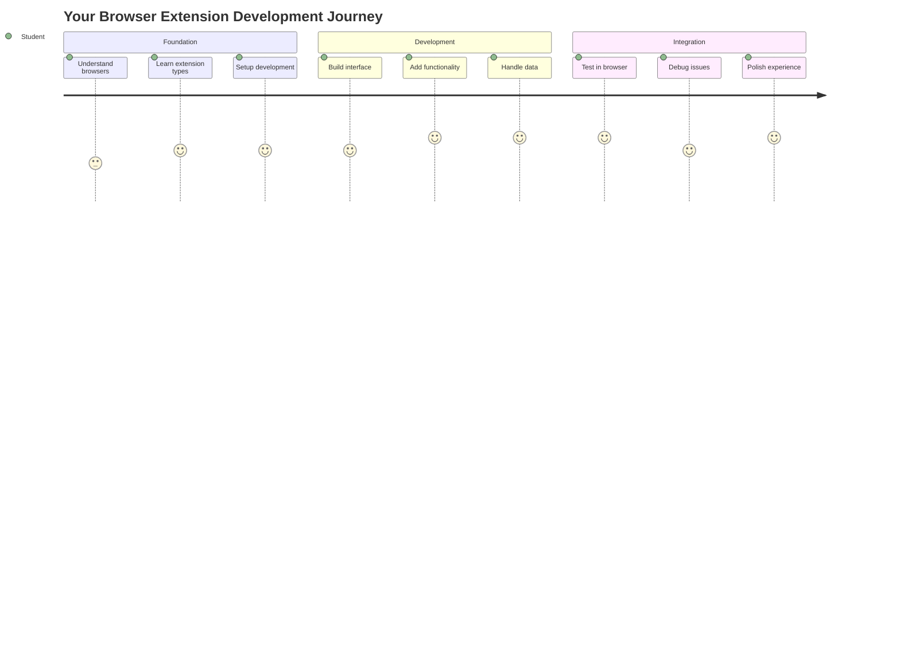
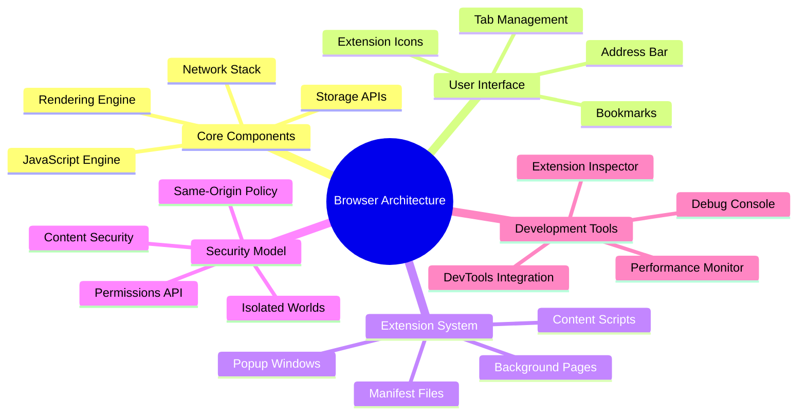
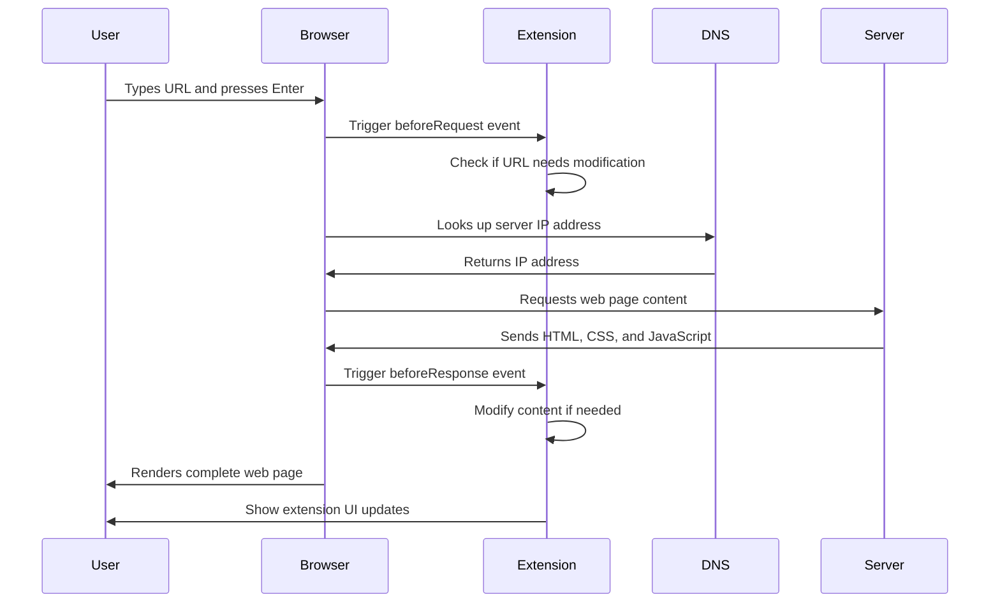
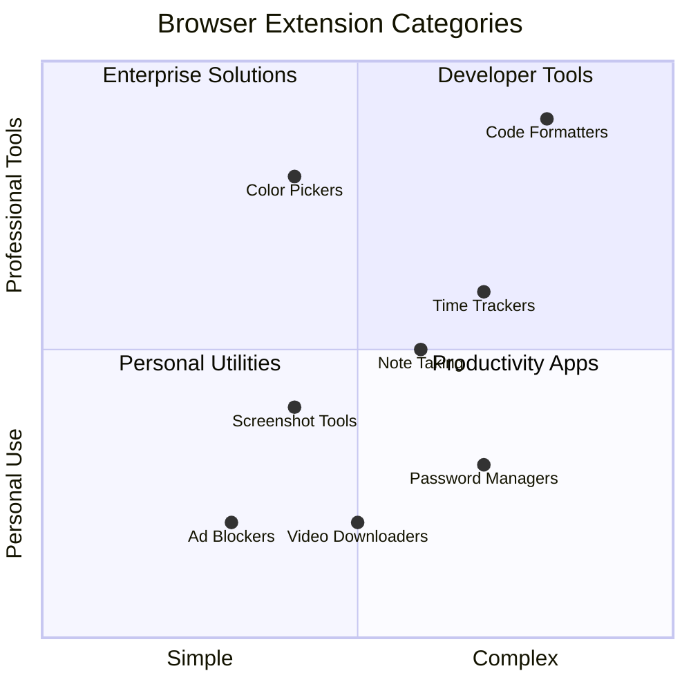
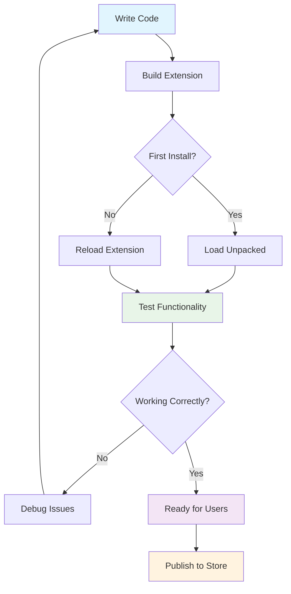
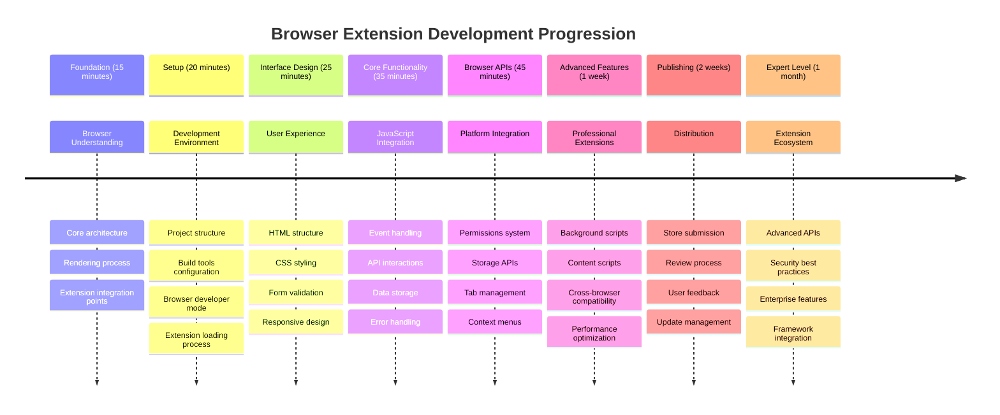

<!--
CO_OP_TRANSLATOR_METADATA:
{
  "original_hash": "00aa85715e1efd4930c17a23e3012e69",
  "translation_date": "2025-11-03T15:08:25+00:00",
  "source_file": "5-browser-extension/1-about-browsers/README.md",
  "language_code": "mr"
}
-->
# ब्राउझर विस्तार प्रकल्प भाग 1: ब्राउझर बद्दल सर्व काही




> स्केच नोट [Wassim Chegham](https://dev.to/wassimchegham/ever-wondered-what-happens-when-you-type-in-a-url-in-an-address-bar-in-a-browser-3dob) यांच्याकडून

## पूर्व-व्याख्यान प्रश्नमंजुषा

[पूर्व-व्याख्यान प्रश्नमंजुषा](https://ff-quizzes.netlify.app/web/quiz/23)

### परिचय

ब्राउझर विस्तार हे लहान अनुप्रयोग आहेत जे तुमच्या वेब ब्राउझिंग अनुभवाला सुधारित करतात. टिम बर्नर्स-ली यांच्या परस्परसंवादी वेबच्या मूळ दृष्टिकोनासारखे, विस्तार ब्राउझरच्या क्षमतांना साध्या दस्तऐवज पाहण्याच्या पलीकडे नेतात. पासवर्ड व्यवस्थापकांपासून जे तुमचे खाते सुरक्षित ठेवतात ते रंग निवडणाऱ्यांपर्यंत जे डिझायनर्सना परिपूर्ण रंग मिळविण्यास मदत करतात, विस्तार दैनंदिन ब्राउझिंग आव्हाने सोडवतात.

तुमचा पहिला विस्तार तयार करण्यापूर्वी, ब्राउझर कसे कार्य करतात हे समजून घेऊया. जसे अलेक्झांडर ग्रॅहम बेलला टेलिफोन शोधण्यापूर्वी ध्वनी प्रसारण समजणे आवश्यक होते, तसेच ब्राउझर मूलभूत गोष्टी जाणून घेणे तुम्हाला विद्यमान ब्राउझर प्रणालींसह सहजपणे समाकलित होणारे विस्तार तयार करण्यात मदत करेल.

या धड्याच्या शेवटी, तुम्हाला ब्राउझर आर्किटेक्चर समजेल आणि तुमचा पहिला विस्तार तयार करण्यास सुरुवात केली असेल.



## वेब ब्राउझर समजून घेणे

वेब ब्राउझर हा मूलतः एक प्रगत दस्तऐवज व्याख्याकार आहे. जेव्हा तुम्ही "google.com" पत्त्याच्या बारमध्ये टाइप करता, तेव्हा ब्राउझर एक जटिल प्रक्रिया करते - जगभरातील सर्व्हरकडून सामग्रीची विनंती करणे, नंतर त्या कोडचे विश्लेषण आणि रेंडरिंग करणे जेणेकरून तुम्हाला परस्परसंवादी वेब पृष्ठे दिसतील.

ही प्रक्रिया टिम बर्नर्स-ली यांनी 1990 मध्ये डिझाइन केलेल्या पहिल्या वेब ब्राउझर, वर्ल्डवाइडवेब, कसे तयार केले गेले यासारखी आहे, ज्यामुळे हायपरलिंक केलेले दस्तऐवज सर्वांसाठी प्रवेशयोग्य बनले.

✅ **थोडा इतिहास**: पहिला ब्राउझर 'वर्ल्डवाइडवेब' म्हणून ओळखला जात होता आणि सर टिमोथी बर्नर्स-ली यांनी 1990 मध्ये तयार केला होता.


> काही प्रारंभिक ब्राउझर, [Karen McGrane](https://www.slideshare.net/KMcGrane/week-4-ixd-history-personal-computing) यांच्याकडून

### ब्राउझर वेब सामग्री कशी प्रक्रिया करतात

URL टाइप करण्यापासून वेबपृष्ठ पाहण्यापर्यंतची प्रक्रिया काही सेकंदांत अनेक समन्वयित चरणांमध्ये होते:



**या प्रक्रियेमुळे काय साध्य होते:**
- **मानवी-वाचनीय URL** DNS लुकअपद्वारे सर्व्हर IP पत्त्यात **अनुवादित** करते
- HTTP किंवा HTTPS प्रोटोकॉल वापरून वेब सर्व्हरसह सुरक्षित कनेक्शन **स्थापित** करते
- सर्व्हरकडून विशिष्ट वेब पृष्ठ सामग्रीची **विनंती** करते
- सर्व्हरकडून HTML मार्कअप, CSS शैली आणि JavaScript कोड **प्राप्त** करते
- सर्व सामग्री परस्परसंवादी वेब पृष्ठात **रेंडर** करते

### ब्राउझर मुख्य वैशिष्ट्ये

आधुनिक ब्राउझर अनेक वैशिष्ट्ये प्रदान करतात ज्याचा विस्तार विकसक फायदा घेऊ शकतात:

| वैशिष्ट्य | उद्देश | विस्तार संधी |
|---------|---------|------------------------|
| **रेंडरिंग इंजिन** | HTML, CSS आणि JavaScript प्रदर्शित करते | सामग्री सुधारणा, शैली इंजेक्शन |
| **JavaScript इंजिन** | JavaScript कोड कार्यान्वित करते | सानुकूल स्क्रिप्ट्स, API संवाद |
| **स्थानिक संग्रह** | स्थानिक डेटा जतन करते | वापरकर्ता प्राधान्ये, कॅश केलेला डेटा |
| **नेटवर्क स्टॅक** | वेब विनंत्या हाताळते | विनंती निरीक्षण, डेटा विश्लेषण |
| **सुरक्षा मॉडेल** | वापरकर्त्यांना हानिकारक सामग्रीपासून संरक्षण करते | सामग्री फिल्टरिंग, सुरक्षा सुधारणा |

**ही वैशिष्ट्ये समजून घेणे तुम्हाला मदत करते:**
- **ओळखणे** की तुमचा विस्तार सर्वाधिक मूल्य कुठे जोडू शकतो
- **योग्य ब्राउझर API निवडणे** तुमच्या विस्ताराच्या कार्यक्षमतेसाठी
- **डिझाइन करणे** ब्राउझर प्रणालींसह कार्यक्षमतेने कार्य करणारे विस्तार
- **सुनिश्चित करणे** की तुमचा विस्तार ब्राउझर सुरक्षा सर्वोत्तम पद्धतींचे पालन करतो

### क्रॉस-ब्राउझर विकास विचार

वेगवेगळे ब्राउझर मानकांची अंमलबजावणी थोड्या फरकाने करतात, जसे की वेगवेगळ्या प्रोग्रामिंग भाषा समान अल्गोरिदम वेगळ्या प्रकारे हाताळू शकतात. Chrome, Firefox आणि Safari प्रत्येकामध्ये अद्वितीय वैशिष्ट्ये आहेत ज्यांचा विस्तार विकासादरम्यान विचार केला पाहिजे.

> 💡 **प्रो टिप**: [caniuse.com](https://www.caniuse.com) वापरा जेणेकरून वेगवेगळ्या ब्राउझरमध्ये कोणते वेब तंत्रज्ञान समर्थित आहे ते तपासता येईल. तुमच्या विस्ताराच्या वैशिष्ट्यांची योजना करताना हे अमूल्य आहे!

**विस्तार विकासासाठी महत्त्वाचे विचार:**
- **तुमचा विस्तार Chrome, Firefox आणि Edge ब्राउझरमध्ये चाचणी करा**
- **वेगवेगळ्या ब्राउझर विस्तार API आणि मॅनिफेस्ट स्वरूपांशी जुळवा**
- **वेगवेगळ्या कार्यक्षमता वैशिष्ट्ये आणि मर्यादा हाताळा**
- **ब्राउझर-विशिष्ट वैशिष्ट्यांसाठी फॉलबॅक प्रदान करा जे उपलब्ध नसतील**

✅ **विश्लेषण अंतर्दृष्टी**: तुमच्या वेब विकास प्रकल्पांमध्ये विश्लेषण पॅकेजेस स्थापित करून तुम्ही तुमचे वापरकर्ते कोणते ब्राउझर पसंत करतात हे ठरवू शकता. ही माहिती तुम्हाला कोणते ब्राउझर प्रथम समर्थन करायचे ते प्राधान्य देण्यास मदत करते.

## ब्राउझर विस्तार समजून घेणे

ब्राउझर विस्तार सामान्य वेब ब्राउझिंग आव्हाने सोडवतात जे ब्राउझर इंटरफेसमध्ये थेट कार्यक्षमता जोडतात. स्वतंत्र अनुप्रयोग किंवा जटिल कार्यप्रवाहांची आवश्यकता न ठेवता, विस्तार त्वरित साधने आणि वैशिष्ट्ये प्रदान करतात.

हा संकल्पना लवकर संगणक पायोनियर डग्लस एंगलबर्ट यांनी तंत्रज्ञानासह मानवी क्षमता वाढवण्याच्या कल्पनेप्रमाणे आहे - विस्तार तुमच्या ब्राउझरच्या मूलभूत कार्यक्षमतेत सुधारणा करतात.



**लोकप्रिय विस्तार श्रेणी आणि त्यांचे फायदे:**
- **उत्पादकता साधने**: कार्य व्यवस्थापक, नोट्स घेण्याचे अनुप्रयोग आणि वेळ ट्रॅकर्स जे तुम्हाला व्यवस्थित राहण्यास मदत करतात
- **सुरक्षा सुधारणा**: पासवर्ड व्यवस्थापक, जाहिरात ब्लॉकर्स आणि गोपनीयता साधने जी तुमचा डेटा सुरक्षित ठेवतात
- **विकसक साधने**: कोड फॉर्मॅटर्स, रंग निवडणारे आणि डीबगिंग युटिलिटीज जे विकास सुलभ करतात
- **सामग्री सुधारणा**: वाचन मोड, व्हिडिओ डाउनलोडर्स आणि स्क्रीनशॉट साधने जी तुमचा वेब अनुभव सुधारतात

✅ **प्रतिबिंब प्रश्न**: तुमचे आवडते ब्राउझर विस्तार कोणते आहेत? ते कोणते विशिष्ट कार्य करतात आणि ते तुमचा ब्राउझिंग अनुभव कसा सुधारतात?

### 🔄 **शैक्षणिक तपासणी**
**ब्राउझर आर्किटेक्चर समजून घेणे**: विस्तार विकासाकडे जाण्यापूर्वी, सुनिश्चित करा की तुम्ही:
- ✅ ब्राउझर वेब विनंत्या कशा प्रक्रिया करतात आणि सामग्री कशी रेंडर करतात ते स्पष्ट करू शकता
- ✅ ब्राउझर आर्किटेक्चरचे मुख्य घटक ओळखू शकता
- ✅ विस्तार ब्राउझर कार्यक्षमतेसह कसे समाकलित होतात ते समजून घेऊ शकता
- ✅ वापरकर्त्यांचे संरक्षण करणारे सुरक्षा मॉडेल ओळखू शकता

**जलद स्व-परीक्षण**: तुम्ही URL टाइप करण्यापासून वेबपृष्ठ पाहण्यापर्यंतचा मार्ग शोधू शकता का?
1. **DNS लुकअप** URL ला IP पत्त्यात रूपांतरित करते
2. **HTTP विनंती** सर्व्हरकडून सामग्री प्राप्त करते
3. **विश्लेषण** HTML, CSS आणि JavaScript प्रक्रिया करते
4. **रेंडरिंग** अंतिम वेबपृष्ठ प्रदर्शित करते
5. **विस्तार** अनेक चरणांमध्ये सामग्री सुधारू शकतात

## विस्तार स्थापित करणे आणि व्यवस्थापित करणे

विस्तार स्थापना प्रक्रिया समजून घेणे तुम्हाला तुमचा विस्तार लोकांनी स्थापित करताना अनुभव कसा असेल याचा अंदाज घेण्यास मदत करते. स्थापना प्रक्रिया आधुनिक ब्राउझरमध्ये प्रमाणित आहे, इंटरफेस डिझाइनमध्ये लहान फरकांसह.


> **महत्त्वाचे**: तुमचे स्वतःचे विस्तार चाचणी करताना विकसक मोड चालू करा आणि इतर स्टोअरमधून विस्तारांना परवानगी द्या.

### विकास विस्तार स्थापना प्रक्रिया

तुमचे स्वतःचे विस्तार विकसित आणि चाचणी करताना, हा कार्यप्रवाह अनुसरण करा:



```bash
# Step 1: Build your extension
npm run build
```

**या आदेशामुळे काय साध्य होते:**
- **तुमचा स्रोत कोड ब्राउझर-तयार फाइल्समध्ये संकलित करते**
- **JavaScript मॉड्यूल्स ऑप्टिमाइझ केलेल्या पॅकेजेसमध्ये बंडल करते**
- **अंतिम विस्तार फाइल्स `/dist` फोल्डरमध्ये तयार करते**
- **तुमचा विस्तार स्थापना आणि चाचणीसाठी तयार करते**

**चरण 2: ब्राउझर विस्तार पृष्ठावर जा**
1. **तुमच्या ब्राउझरचा विस्तार व्यवस्थापन पृष्ठ उघडा**
2. **"सेटिंग्ज आणि अधिक" बटणावर क्लिक करा (`...` चिन्ह) वरच्या उजव्या बाजूला
3. **ड्रॉपडाउन मेनूमधून "विस्तार" निवडा**

**चरण 3: तुमचा विस्तार लोड करा**
- **नवीन स्थापनेसाठी**: `लोड अनपॅक्ड` निवडा आणि तुमचा `/dist` फोल्डर निवडा
- **अपडेटसाठी**: तुमच्या आधीच स्थापित केलेल्या विस्ताराच्या बाजूला `रिलोड` क्लिक करा
- **चाचणीसाठी**: "विकसक मोड" सक्षम करा जेणेकरून अतिरिक्त डीबगिंग वैशिष्ट्ये प्रवेश करता येतील

### उत्पादन विस्तार स्थापना

> ✅ **टीप**: हे विकास निर्देश विशेषतः तुम्ही स्वतः तयार केलेल्या विस्तारांसाठी आहेत. प्रकाशित विस्तार स्थापित करण्यासाठी, [Microsoft Edge Add-ons store](https://microsoftedge.microsoft.com/addons/Microsoft-Edge-Extensions-Home) सारख्या अधिकृत ब्राउझर विस्तार स्टोअरला भेट द्या.

**फरक समजून घेणे:**
- **विकास स्थापने** तुम्हाला अप्रकाशित विस्तार विकासादरम्यान चाचणी करण्यास अनुमती देते
- **स्टोअर स्थापने** प्रमाणित, प्रकाशित विस्तार प्रदान करते ज्यामध्ये स्वयंचलित अद्यतने असतात
- **साइडलोडिंग** अधिकृत स्टोअरच्या बाहेरून विस्तार स्थापित करण्यास अनुमती देते (विकसक मोड आवश्यक आहे)

## तुमचा कार्बन फूटप्रिंट विस्तार तयार करणे

आम्ही एक ब्राउझर विस्तार तयार करू जो तुमच्या प्रदेशाच्या ऊर्जा वापराचा कार्बन फूटप्रिंट प्रदर्शित करतो. हा प्रकल्प आवश्यक विस्तार विकास संकल्पना प्रदर्शित करतो आणि पर्यावरणीय जागरूकतेसाठी व्यावहारिक साधन तयार करतो.

हा दृष्टिकोन "करून शिकणे" या तत्त्वाचे अनुसरण करतो जे जॉन ड्यूईच्या शैक्षणिक सिद्धांतांपासून प्रभावी सिद्ध झाले आहे - तांत्रिक कौशल्ये अर्थपूर्ण वास्तविक-जगातील अनुप्रयोगांसह एकत्रित करणे.

### प्रकल्प आवश्यकता

विकास सुरू करण्यापूर्वी, आवश्यक संसाधने आणि अवलंबित्व गोळा करूया:

**आवश्यक API प्रवेश:**
- **[CO2 Signal API key](https://www.co2signal.com/)**: तुमचा ईमेल पत्ता प्रविष्ट करा जेणेकरून तुम्हाला तुमची मोफत API key मिळेल
- **[Region code](http://api.electricitymap.org/v3/zones)**: तुमचा प्रदेश कोड [Electricity Map](https://www.electricitymap.org/map) वापरून शोधा (उदाहरणार्थ, बोस्टन 'US-NEISO' वापरतो)

**विकास साधने:**
- **[Node.js आणि NPM](https://www.npmjs.com)**: प्रकल्प अवलंबित्व स्थापित करण्यासाठी पॅकेज व्यवस्थापन साधन
- **[स्टार्टर कोड](../../../../5-browser-extension/start)**: विकास सुरू करण्यासाठी `start` फोल्डर डाउनलोड करा

✅ **अधिक जाणून घ्या**: तुमचे पॅकेज व्यवस्थापन कौशल्ये सुधारण्यासाठी [संपूर्ण Learn module](https://docs.microsoft.com/learn/modules/create-nodejs-project-dependencies/?WT.mc_id=academic-77807-sagibbon) वापरा

### प्रकल्प संरचना समजून घेणे

प्रकल्प संरचना समजून घेणे विकास कार्य कार्यक्षमतेने आयोजित करण्यात मदत करते. जसे अलेक्झांड्रिया ग्रंथालय ज्ञान पुनर्प्राप्तीसाठी सुलभतेने आयोजित केले गेले होते, तसेच एक चांगले संरचित कोडबेस विकास अधिक कार्यक्षम बनवते:

```
project-root/
├── dist/                    # Built extension files
│   ├── manifest.json        # Extension configuration
│   ├── index.html           # User interface markup
│   ├── background.js        # Background script functionality
│   └── main.js              # Compiled JavaScript bundle
├── src/                     # Source development files
│   └── index.js             # Your main JavaScript code
├── package.json             # Project dependencies and scripts
└── webpack.config.js        # Build configuration
```

**प्रत्येक फाइल काय साध्य करते ते समजून घेणे:**
- **`manifest.json`**: विस्तार मेटाडेटा, परवानग्या आणि प्रवेश बिंदू **परिभाषित** करते
- **`index.html`**: वापरकर्ता इंटरफेस तयार करते जो वापरकर्ते तुमचा विस्तार क्लिक करताना दिसतो
- **`background.js`**: पार्श्वभूमी कार्ये आणि ब्राउझर इव्हेंट लिसनर्स **हाताळते**
- **`main.js`**: बिल्ड प्रक्रियेनंतर अंतिम बंडल केलेला JavaScript **सामाविष्ट** करते
- **`src/index.js`**: तुमचा मुख्य विकास कोड **साठवतो** जो `main.js` मध्ये संकलित केला जातो

> 💡 **संघटन टिप**: तुमचा API key आणि प्रदेश कोड सुरक्षित नोटमध्ये साठवा जेणेकरून विकासादरम्यान संदर्भासाठी सोपे असेल. तुम्हाला तुमच्या विस्ताराची कार्यक्षमता चाचणी करण्यासाठी या मूल्यांची आवश्यकता असेल.

✅ **सुरक्षा टीप**: API key किंवा संवेदनशील क्रेडेन्शियल्स तुमच्या कोड रिपॉझिटरीमध्ये कधीही कमिट करू नका. आम्ही तुम्हाला पुढील चरणांमध्ये हे सुरक्षितपणे हाताळण्याचा मार्ग दाखवू.

## विस्तार इंटरफेस तयार करणे

आता आपण वापरकर्ता इंटरफेस घटक तयार करू. विस्तार दोन-स्क्रीन दृष्टिकोन वापरतो: प्रारंभिक सेटअपसाठी कॉन्फिगरेशन स्क्रीन आणि डेटा प्रदर्शनासाठी परिणाम स्क्रीन.

हे संगणकाच्या सुरुवातीच्या दिवसांपासून इंटरफेस डिझाइनमध्ये वापरल्या जाणाऱ्या प्रगत प्रकटीकरण तत्त्वाचे अनुसरण करते - वापरकर्त्यांना गोंधळात टाकण्यापासून टाळण्यासाठी माहिती आणि पर्याय तार्किक क्रमाने उघड करणे.

### विस्तार दृश्ये विहंगावलोकन

**सेटअप दृश्य** - प्रथमच वापरकर्ता कॉन्फिगरेशन:


**परिणाम दृश्य** - कार्बन फूटप्रिंट डेटा प्रदर्शन:


### कॉन्फिगरेशन फॉर्म तयार करणे

सेटअप फॉर्म प्रारंभिक वापरादरम्यान वापरकर्ता कॉन्फिगरेशन डेटा गोळा करतो. एकदा कॉन्फिगर केल्यानंतर, ही माहिती भविष्यात
1. **बिल्ड** कमांड चालवा तुमचा कोड संकलित करण्यासाठी  
2. **एक्स्टेंशन** तुमच्या ब्राउझरमध्ये डेव्हलपर मोड वापरून लोड करा  
3. **पडताळा** की फॉर्म योग्य प्रकारे दिसतो आणि व्यावसायिक वाटतो  
4. **तपासा** की सर्व फॉर्म घटक व्यवस्थित संरेखित आणि कार्यक्षम आहेत  

**तुम्ही काय साध्य केले आहे:**  
- **बनवले** तुमच्या एक्स्टेंशनसाठी मूलभूत HTML संरचना  
- **निर्मिती केली** कॉन्फिगरेशन आणि परिणाम इंटरफेस योग्य सेमॅंटिक मार्कअपसह  
- **सेट अप केले** आधुनिक विकास कार्यप्रवाह उद्योग-मानक साधनांसह  
- **तयार केले** परस्परसंवादी JavaScript कार्यक्षमता जोडण्यासाठी पाया  

### 🔄 **शैक्षणिक तपासणी**  
**एक्स्टेंशन विकास प्रगती**: पुढे जाण्यापूर्वी तुमची समज तपासा:  
- ✅ तुम्ही प्रकल्प संरचनेतील प्रत्येक फाइलचा उद्देश स्पष्ट करू शकता का?  
- ✅ तुम्हाला समजते का की बिल्ड प्रक्रिया तुमचा सोर्स कोड कसा बदलते?  
- ✅ आम्ही कॉन्फिगरेशन आणि परिणाम वेगवेगळ्या UI विभागांमध्ये का विभाजित करतो?  
- ✅ फॉर्म संरचना वापरता येण्याजोगी आणि प्रवेशयोग्यता कशी समर्थन करते?  

**विकास कार्यप्रवाह समज**: तुम्ही आता हे करू शकता:  
1. **HTML आणि CSS बदलणे** तुमच्या एक्स्टेंशन इंटरफेससाठी  
2. **बिल्ड कमांड चालवा** तुमचे बदल संकलित करण्यासाठी  
3. **एक्स्टेंशन पुन्हा लोड करा** तुमच्या ब्राउझरमध्ये अद्यतने तपासण्यासाठी  
4. **डिबग करा** ब्राउझर डेव्हलपर टूल्स वापरून समस्या  

तुम्ही ब्राउझर एक्स्टेंशन विकासाचा पहिला टप्पा पूर्ण केला आहे. जसे राइट बंधूंनी उड्डाण साध्य करण्यापूर्वी एरोडायनामिक्स समजून घेणे आवश्यक होते, तसेच या मूलभूत संकल्पना समजून घेणे तुम्हाला पुढील धड्यात अधिक जटिल परस्परसंवादी वैशिष्ट्ये तयार करण्यासाठी तयार करते.  

## GitHub Copilot Agent Challenge 🚀  

Agent मोड वापरून खालील आव्हान पूर्ण करा:  

**वर्णन:** API की आणि क्षेत्र कोड प्रविष्ट करताना वापरकर्ता अनुभव सुधारण्यासाठी फॉर्म सत्यापन आणि वापरकर्ता अभिप्राय वैशिष्ट्ये जोडा.  

**प्रॉम्प्ट:** JavaScript सत्यापन फंक्शन्स तयार करा जे तपासतात की API की फील्डमध्ये किमान 20 अक्षरे आहेत आणि क्षेत्र कोड योग्य स्वरूपाचे अनुसरण करतो (उदा. 'US-NEISO'). वैध इनपुटसाठी इनपुट बॉर्डर रंग हिरवा आणि अवैध इनपुटसाठी लाल रंग बदलून दृश्य अभिप्राय जोडा. तसेच सुरक्षा उद्देशाने API की दर्शविण्यासाठी/लपविण्यासाठी टॉगल वैशिष्ट्य जोडा.  

[Agent मोड](https://code.visualstudio.com/blogs/2025/02/24/introducing-copilot-agent-mode) बद्दल अधिक जाणून घ्या.  

## 🚀 आव्हान  

ब्राउझर एक्स्टेंशन स्टोअरवर एक नजर टाका आणि तुमच्या ब्राउझरमध्ये एक एक्स्टेंशन इंस्टॉल करा. तुम्ही त्याच्या फाइल्स मनोरंजक प्रकारे तपासू शकता. तुम्हाला काय सापडते?  

## पोस्ट-लेक्चर क्विझ  

[पोस्ट-लेक्चर क्विझ](https://ff-quizzes.netlify.app/web/quiz/24)  

## पुनरावलोकन आणि स्व-अभ्यास  

या धड्यात तुम्ही वेब ब्राउझरच्या इतिहासाबद्दल थोडेसे शिकले; वर्ल्ड वाइड वेबच्या शोधकांनी त्याचा उपयोग कसा केला जावा याबद्दल अधिक जाणून घेण्यासाठी ही संधी घ्या. काही उपयुक्त साइट्स:  

[वेब ब्राउझर्सचा इतिहास](https://www.mozilla.org/firefox/browsers/browser-history/)  

[वेबचा इतिहास](https://webfoundation.org/about/vision/history-of-the-web/)  

[टिम बर्नर्स-ली यांची मुलाखत](https://www.theguardian.com/technology/2019/mar/12/tim-berners-lee-on-30-years-of-the-web-if-we-dream-a-little-we-can-get-the-web-we-want)  

### ⚡ **पुढील 5 मिनिटांत तुम्ही काय करू शकता**  
- [ ] Chrome/Edge एक्स्टेंशन्स पृष्ठ उघडा (chrome://extensions) आणि तुमच्याकडे काय इंस्टॉल आहे ते एक्सप्लोर करा  
- [ ] तुमच्या ब्राउझरच्या DevTools नेटवर्क टॅबमध्ये वेबपेज लोड करताना पहा  
- [ ] पेज सोर्स (Ctrl+U) पाहून HTML संरचना तपासा  
- [ ] कोणत्याही वेबपेज घटकाची तपासणी करा आणि DevTools मध्ये त्याचा CSS बदला  

### 🎯 **तुम्ही एका तासात काय साध्य करू शकता**  
- [ ] पोस्ट-लेक्चर क्विझ पूर्ण करा आणि ब्राउझर मूलभूत गोष्टी समजून घ्या  
- [ ] ब्राउझर एक्स्टेंशनसाठी मूलभूत manifest.json फाइल तयार करा  
- [ ] एक साधे "Hello World" एक्स्टेंशन तयार करा जे पॉपअप दाखवते  
- [ ] तुमचे एक्स्टेंशन डेव्हलपर मोडमध्ये लोड करण्याची चाचणी करा  
- [ ] तुमच्या लक्ष्य ब्राउझरसाठी ब्राउझर एक्स्टेंशन दस्तऐवज एक्सप्लोर करा  

### 📅 **तुमचा आठवडाभराचा एक्स्टेंशन प्रवास**  
- [ ] वास्तविक उपयोगासह कार्यात्मक ब्राउझर एक्स्टेंशन पूर्ण करा  
- [ ] कंटेंट स्क्रिप्ट्स, बॅकग्राउंड स्क्रिप्ट्स आणि पॉपअप इंटरॅक्शनबद्दल जाणून घ्या  
- [ ] स्टोरेज, टॅब्स आणि मेसेजिंग यासारख्या ब्राउझर APIs मध्ये प्रावीण्य मिळवा  
- [ ] तुमच्या एक्स्टेंशनसाठी वापरकर्ता-अनुकूल इंटरफेस डिझाइन करा  
- [ ] वेगवेगळ्या वेबसाइट्स आणि परिस्थितींमध्ये तुमच्या एक्स्टेंशनची चाचणी करा  
- [ ] तुमचे एक्स्टेंशन ब्राउझरच्या एक्स्टेंशन स्टोअरमध्ये प्रकाशित करा  

### 🌟 **तुमचा महिनाभराचा ब्राउझर विकास**  
- [ ] वेगवेगळ्या वापरकर्ता समस्यांचे निराकरण करणारी अनेक एक्स्टेंशन्स तयार करा  
- [ ] प्रगत ब्राउझर APIs आणि सुरक्षा सर्वोत्तम पद्धती शिकणे  
- [ ] ओपन सोर्स ब्राउझर एक्स्टेंशन प्रकल्पांमध्ये योगदान द्या  
- [ ] क्रॉस-ब्राउझर सुसंगतता आणि प्रोग्रेसिव्ह एन्हांसमेंटमध्ये प्रावीण्य मिळवा  
- [ ] इतरांसाठी एक्स्टेंशन विकास साधने आणि टेम्पलेट्स तयार करा  
- [ ] ब्राउझर एक्स्टेंशन तज्ञ बना जो इतर विकसकांना मदत करतो  

## 🎯 तुमचा ब्राउझर एक्स्टेंशन मास्टरी टाइमलाइन  


  
### 🛠️ तुमचा एक्स्टेंशन विकास टूलकिट सारांश  

या धड्याचा अभ्यास केल्यानंतर, तुमच्याकडे आता आहे:  
- **ब्राउझर आर्किटेक्चर ज्ञान**: रेंडरिंग इंजिन्स, सुरक्षा मॉडेल्स आणि एक्स्टेंशन इंटिग्रेशनची समज  
- **विकास वातावरण**: Webpack, NPM आणि डिबगिंग क्षमतांसह आधुनिक टूलचेन  
- **UI/UX पाया**: प्रगत प्रकटीकरण पॅटर्नसह सेमॅंटिक HTML संरचना  
- **सुरक्षा जागरूकता**: ब्राउझर परवानग्या आणि सुरक्षित विकास पद्धतींची समज  
- **क्रॉस-ब्राउझर संकल्पना**: सुसंगतता विचार आणि चाचणी दृष्टिकोनांचे ज्ञान  
- **API इंटिग्रेशन**: बाह्य डेटा स्रोतांसह काम करण्याचा पाया  
- **व्यावसायिक कार्यप्रवाह**: उद्योग-मानक विकास आणि चाचणी प्रक्रिया  

**वास्तविक-जगातील अनुप्रयोग**: या कौशल्यांचा थेट उपयोग:  
- **वेब विकास**: सिंगल-पेज अॅप्लिकेशन्स आणि प्रोग्रेसिव्ह वेब अॅप्स  
- **डेस्कटॉप अॅप्लिकेशन्स**: Electron आणि वेब-आधारित डेस्कटॉप सॉफ्टवेअर  
- **मोबाइल विकास**: हायब्रिड अॅप्स आणि वेब-आधारित मोबाइल सोल्यूशन्स  
- **एंटरप्राइज टूल्स**: अंतर्गत उत्पादकता अॅप्लिकेशन्स आणि कार्यप्रवाह ऑटोमेशन  
- **ओपन सोर्स**: ब्राउझर एक्स्टेंशन प्रकल्प आणि वेब मानकांमध्ये योगदान  

**पुढील स्तर**: तुम्ही परस्परसंवादी कार्यक्षमता जोडण्यासाठी, ब्राउझर APIs सह काम करण्यासाठी आणि वास्तविक वापरकर्ता समस्यांचे निराकरण करणारी एक्स्टेंशन्स तयार करण्यासाठी तयार आहात!  

## असाइनमेंट  

[तुमचे एक्स्टेंशन पुन्हा डिझाइन करा](assignment.md)  

---

**अस्वीकरण**:  
हा दस्तऐवज AI भाषांतर सेवा [Co-op Translator](https://github.com/Azure/co-op-translator) वापरून भाषांतरित करण्यात आला आहे. आम्ही अचूकतेसाठी प्रयत्नशील असलो तरी, कृपया लक्षात ठेवा की स्वयंचलित भाषांतरे त्रुटी किंवा अचूकतेच्या अभावाने युक्त असू शकतात. मूळ भाषेतील दस्तऐवज हा अधिकृत स्रोत मानला जावा. महत्त्वाच्या माहितीसाठी, व्यावसायिक मानवी भाषांतराची शिफारस केली जाते. या भाषांतराचा वापर करून उद्भवलेल्या कोणत्याही गैरसमज किंवा चुकीच्या अर्थासाठी आम्ही जबाबदार नाही.