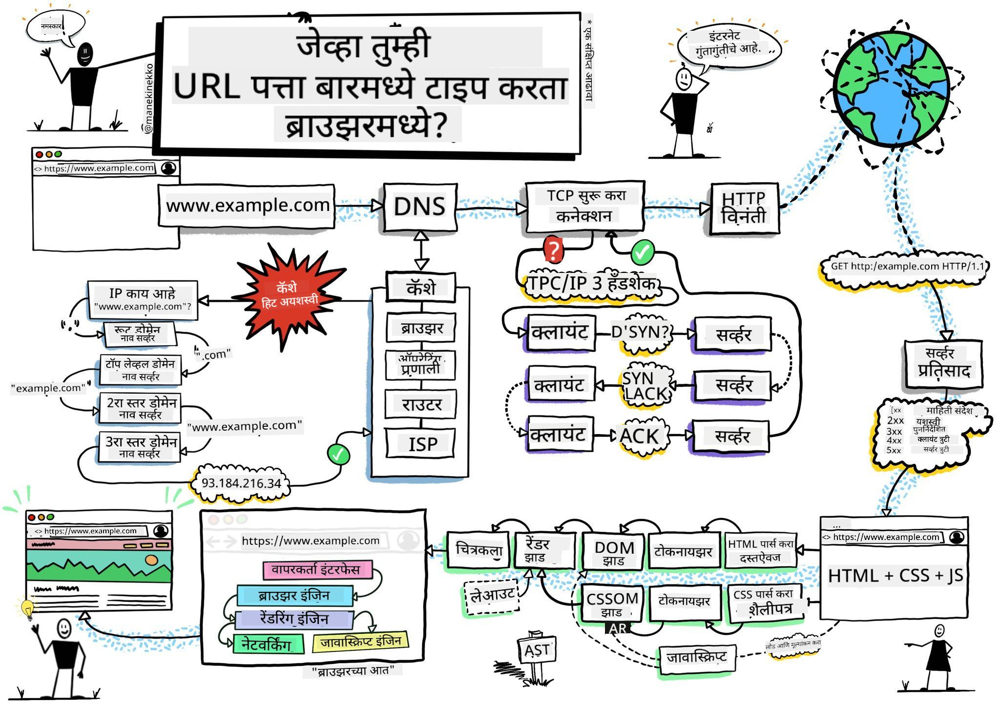
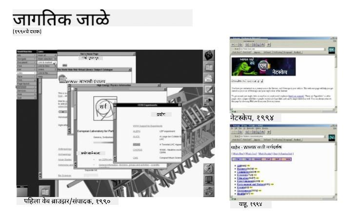
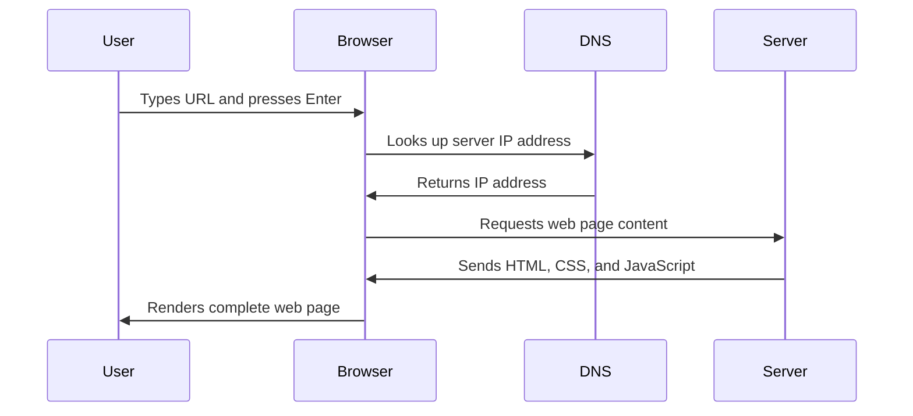
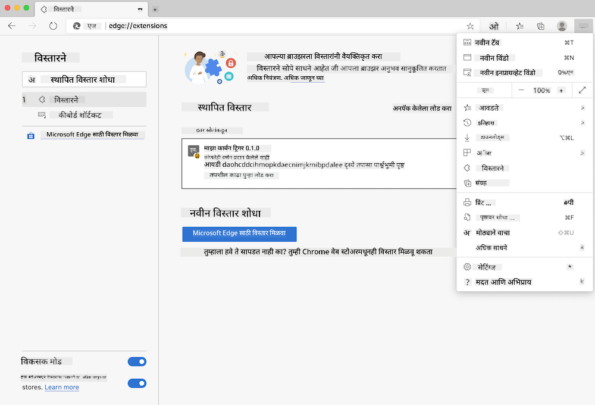
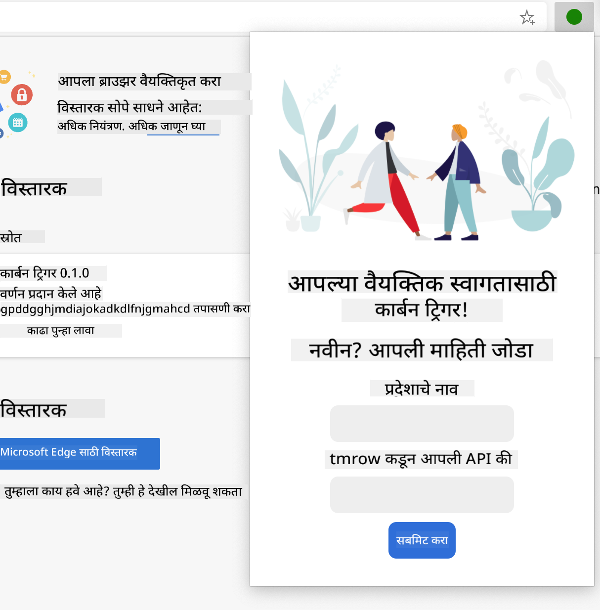

<!--
CO_OP_TRANSLATOR_METADATA:
{
  "original_hash": "33a875c522f237a2026e4653240dfc07",
  "translation_date": "2025-10-22T16:37:32+00:00",
  "source_file": "5-browser-extension/1-about-browsers/README.md",
  "language_code": "mr"
}
-->
# ब्राउझर एक्स्टेंशन प्रोजेक्ट भाग 1: ब्राउझरची संपूर्ण माहिती


> स्केच नोट [Wassim Chegham](https://dev.to/wassimchegham/ever-wondered-what-happens-when-you-type-in-a-url-in-an-address-bar-in-a-browser-3dob) यांच्याकडून

## प्री-लेक्चर क्विझ

[प्री-लेक्चर क्विझ](https://ff-quizzes.netlify.app/web/quiz/23)

### परिचय

ब्राउझर एक्स्टेंशन्स म्हणजे लहान अ‍ॅप्स आहेत जे तुमच्या वेब ब्राउझिंग अनुभवाला सुधारतात. टिम बर्नर्स-ली यांच्या परस्परसंवादी वेबच्या मूळ कल्पनेप्रमाणे, एक्स्टेंशन्स ब्राउझरच्या क्षमतांना साध्या दस्तऐवज पाहण्याच्या पलीकडे वाढवतात. पासवर्ड मॅनेजर्सपासून जे तुमचे खाते सुरक्षित ठेवतात ते रंग निवडणारे टूल्स जे डिझायनर्सना योग्य रंग निवडण्यास मदत करतात, एक्स्टेंशन्स रोजच्या ब्राउझिंग समस्यांचे निराकरण करतात.

तुमचा पहिला एक्स्टेंशन तयार करण्यापूर्वी, ब्राउझर कसे कार्य करतात हे समजून घेऊया. जसे अलेक्झांडर ग्रॅहम बेलला टेलिफोन शोधण्यापूर्वी ध्वनी प्रसारण समजून घेणे आवश्यक होते, तसेच ब्राउझरची मूलभूत माहिती जाणून घेणे तुम्हाला विद्यमान ब्राउझर सिस्टम्ससोबत सहजपणे समाकलित होणारे एक्स्टेंशन्स तयार करण्यात मदत करेल.

या धड्याच्या शेवटी, तुम्हाला ब्राउझर आर्किटेक्चर समजेल आणि तुम्ही तुमचे पहिले एक्स्टेंशन तयार करण्यास सुरुवात केली असेल.

## वेब ब्राउझर समजून घेणे

वेब ब्राउझर म्हणजे एक प्रकारचा प्रगत दस्तऐवज व्याख्याकार आहे. जेव्हा तुम्ही "google.com" ब्राउझरच्या अ‍ॅड्रेस बारमध्ये टाइप करता, तेव्हा ब्राउझर एक जटिल प्रक्रिया करते - जगभरातील सर्व्हरकडून सामग्रीची विनंती करते, नंतर त्या कोडचे विश्लेषण करून ते परस्परसंवादी वेब पृष्ठांमध्ये रूपांतरित करते.

ही प्रक्रिया टिम बर्नर्स-ली यांनी 1990 मध्ये डिझाइन केलेल्या पहिल्या वेब ब्राउझर, वर्ल्डवाइडवेबच्या डिझाइनसारखी आहे, ज्यामुळे हायपरलिंक केलेले दस्तऐवज सर्वांसाठी सुलभ झाले.

✅ **थोडा इतिहास**: पहिला ब्राउझर 'वर्ल्डवाइडवेब' नावाचा होता आणि तो सर टिमोथी बर्नर्स-ली यांनी 1990 मध्ये तयार केला होता.


> काही प्रारंभिक ब्राउझर, [Karen McGrane](https://www.slideshare.net/KMcGrane/week-4-ixd-history-personal-computing) यांच्याकडून

### ब्राउझर वेब सामग्री कशी प्रक्रिया करतात

URL टाइप केल्यानंतर वेबपृष्ठ दिसण्यापर्यंतची प्रक्रिया काही सेकंदांत समन्वयित पद्धतीने होते:



**या प्रक्रियेमुळे काय साध्य होते:**
- **मानवी-वाचनीय URL** DNS लुकअपद्वारे सर्व्हर IP पत्त्यात रूपांतरित करते
- **सुरक्षित कनेक्शन** HTTP किंवा HTTPS प्रोटोकॉल वापरून वेब सर्व्हरशी स्थापित करते
- **विशिष्ट वेबपृष्ठ सामग्रीची विनंती** सर्व्हरकडून करते
- **HTML मार्कअप, CSS स्टाइलिंग आणि JavaScript कोड** सर्व्हरकडून प्राप्त करते
- **संपूर्ण सामग्री परस्परसंवादी वेबपृष्ठात रूपांतरित करते**

### ब्राउझरची मुख्य वैशिष्ट्ये

आधुनिक ब्राउझर अनेक वैशिष्ट्ये प्रदान करतात ज्याचा एक्स्टेंशन डेव्हलपर्स फायदा घेऊ शकतात:

| वैशिष्ट्य | उद्देश | एक्स्टेंशन संधी |
|-----------|--------|-----------------|
| **रेंडरिंग इंजिन** | HTML, CSS आणि JavaScript प्रदर्शित करते | सामग्री बदल, स्टाइलिंग इंजेक्शन |
| **JavaScript इंजिन** | JavaScript कोड कार्यान्वित करते | कस्टम स्क्रिप्ट्स, API परस्परसंवाद |
| **लोकल स्टोरेज** | डेटा स्थानिक पातळीवर जतन करते | वापरकर्ता प्राधान्ये, कॅश केलेला डेटा |
| **नेटवर्क स्टॅक** | वेब विनंत्या हाताळते | विनंती निरीक्षण, डेटा विश्लेषण |
| **सुरक्षा मॉडेल** | वापरकर्त्यांना हानिकारक सामग्रीपासून संरक्षण देते | सामग्री फिल्टरिंग, सुरक्षा सुधारणा |

**ही वैशिष्ट्ये समजून घेणे तुम्हाला मदत करते:**
- **ओळखणे** की तुमचे एक्स्टेंशन सर्वाधिक मूल्य कुठे जोडू शकते
- **योग्य ब्राउझर API निवडणे** तुमच्या एक्स्टेंशनच्या कार्यक्षमतेसाठी
- **डिझाइन करणे** ब्राउझर सिस्टमसह कार्यक्षमतेने कार्य करणारे एक्स्टेंशन्स
- **सुनिश्चित करणे** की तुमचे एक्स्टेंशन ब्राउझर सुरक्षा सर्वोत्तम पद्धतींचे पालन करते

### क्रॉस-ब्राउझर डेव्हलपमेंट विचार

वेगवेगळे ब्राउझर मानकांची अंमलबजावणी थोड्या फरकाने करतात, जसे की वेगवेगळ्या प्रोग्रामिंग भाषांमध्ये समान अल्गोरिदम वेगळ्या प्रकारे हाताळला जातो. Chrome, Firefox आणि Safari प्रत्येकामध्ये एक्स्टेंशन डेव्हलपमेंट दरम्यान विचारात घेण्यासारखे अनोखे वैशिष्ट्य आहे.

> 💡 **प्रो टिप**: [caniuse.com](https://www.caniuse.com) वापरा वेगवेगळ्या ब्राउझरमध्ये कोणते वेब तंत्रज्ञान समर्थित आहे ते तपासण्यासाठी. तुमच्या एक्स्टेंशनच्या वैशिष्ट्यांची योजना करताना हे अमूल्य आहे!

**एक्स्टेंशन डेव्हलपमेंटसाठी महत्त्वाचे विचार:**
- **तुमचे एक्स्टेंशन Chrome, Firefox आणि Edge ब्राउझरमध्ये चाचणी करा**
- **वेगवेगळ्या ब्राउझर एक्स्टेंशन API आणि मॅनिफेस्ट स्वरूपांशी जुळवा**
- **वेगवेगळ्या कार्यक्षमता वैशिष्ट्ये आणि मर्यादा हाताळा**
- **ब्राउझर-विशिष्ट वैशिष्ट्यांसाठी फॉलबॅक प्रदान करा जे उपलब्ध नसू शकतात**

✅ **विश्लेषण अंतर्दृष्टी**: तुमचे वापरकर्ते कोणते ब्राउझर पसंत करतात हे ठरवण्यासाठी तुमच्या वेब डेव्हलपमेंट प्रकल्पांमध्ये विश्लेषण पॅकेजेस स्थापित करू शकता. ही माहिती तुम्हाला कोणते ब्राउझर प्रथम समर्थन देणे आवश्यक आहे हे प्राधान्य देण्यास मदत करते.

## ब्राउझर एक्स्टेंशन्स समजून घेणे

ब्राउझर एक्स्टेंशन्स सामान्य वेब ब्राउझिंग समस्यांचे निराकरण करून ब्राउझर इंटरफेसमध्ये थेट कार्यक्षमता जोडतात. स्वतंत्र अ‍ॅप्स किंवा जटिल कार्यप्रवाहांची आवश्यकता न ठेवता, एक्स्टेंशन्स साधने आणि वैशिष्ट्ये त्वरित प्रवेशासाठी प्रदान करतात.

ही संकल्पना डग्लस एंगलबार्ट यांसारख्या प्रारंभिक संगणक पायोनियर्सनी तंत्रज्ञानासह मानवी क्षमता वाढवण्याची कल्पना कशी केली होती यासारखी आहे - एक्स्टेंशन्स तुमच्या ब्राउझरच्या मूलभूत कार्यक्षमतेला वाढवतात.

**लोकप्रिय एक्स्टेंशन श्रेण्या आणि त्यांचे फायदे:**
- **उत्पादकता साधने**: टास्क मॅनेजर्स, नोट्स घेण्याचे अ‍ॅप्स आणि वेळ ट्रॅकर्स जे तुम्हाला व्यवस्थित राहण्यास मदत करतात
- **सुरक्षा सुधारणा**: पासवर्ड मॅनेजर्स, अ‍ॅड ब्लॉकर्स आणि गोपनीयता साधने जी तुमचा डेटा सुरक्षित ठेवतात
- **डेव्हलपर साधने**: कोड फॉर्मॅटर्स, रंग निवडणारे टूल्स आणि डीबगिंग युटिलिटीज जे डेव्हलपमेंट सुलभ करतात
- **सामग्री सुधारणा**: वाचन मोड्स, व्हिडिओ डाउनलोडर्स आणि स्क्रीनशॉट टूल्स जे तुमचा वेब अनुभव सुधारतात

✅ **प्रतिबिंब प्रश्न**: तुमचे आवडते ब्राउझर एक्स्टेंशन्स कोणते आहेत? ते कोणते विशिष्ट कार्य करतात आणि ते तुमचा ब्राउझिंग अनुभव कसा सुधारतात?

## एक्स्टेंशन्स स्थापित करणे आणि व्यवस्थापित करणे

एक्स्टेंशन इंस्टॉलेशन प्रक्रिया समजून घेणे तुम्हाला लोक तुमचे एक्स्टेंशन स्थापित करताना वापरकर्ता अनुभवाची अपेक्षा करण्यास मदत करते. इंस्टॉलेशन प्रक्रिया आधुनिक ब्राउझरमध्ये प्रमाणित आहे, इंटरफेस डिझाइनमध्ये लहान फरकांसह.



> **महत्त्वाचे**: तुमचे स्वतःचे एक्स्टेंशन्स चाचणी करताना डेव्हलपर मोड चालू करा आणि इतर स्टोअर्समधून एक्स्टेंशन्सला परवानगी द्या.

### डेव्हलपमेंट एक्स्टेंशन इंस्टॉलेशन प्रक्रिया

तुमचे स्वतःचे एक्स्टेंशन्स विकसित आणि चाचणी करताना, खालील कार्यप्रवाह अनुसरण करा:

```bash
# Step 1: Build your extension
npm run build
```

**या कमांडने काय साध्य होते:**
- **तुमचा सोर्स कोड ब्राउझर-रेडी फाइल्समध्ये संकलित करते**
- **JavaScript मॉड्यूल्स ऑप्टिमाइझ केलेल्या पॅकेजेसमध्ये बंडल करते**
- **अंतिम एक्स्टेंशन फाइल्स `/dist` फोल्डरमध्ये तयार करते**
- **तुमचे एक्स्टेंशन इंस्टॉलेशन आणि चाचणीसाठी तयार करते**

**पायरी 2: ब्राउझर एक्स्टेंशन्सवर जा**
1. **तुमच्या ब्राउझरच्या एक्स्टेंशन्स व्यवस्थापन पृष्ठावर जा**
2. **"सेटिंग्ज आणि अधिक" बटणावर क्लिक करा (`...` आयकॉन) वरच्या उजव्या बाजूला
3. **ड्रॉपडाउन मेनूमधून "एक्स्टेंशन्स" निवडा**

**पायरी 3: तुमचे एक्स्टेंशन लोड करा**
- **नवीन इंस्टॉलेशन्ससाठी**: `load unpacked` निवडा आणि तुमचा `/dist` फोल्डर निवडा
- **अपडेट्ससाठी**: तुमच्या आधीपासून इंस्टॉल केलेल्या एक्स्टेंशनच्या बाजूला `reload` क्लिक करा
- **चाचणीसाठी**: "डेव्हलपर मोड" सक्षम करा अतिरिक्त डीबगिंग वैशिष्ट्ये प्रवेश करण्यासाठी

### उत्पादन एक्स्टेंशन इंस्टॉलेशन

> ✅ **टीप**: ही डेव्हलपमेंट सूचना विशेषतः तुम्ही स्वतः तयार केलेल्या एक्स्टेंशन्ससाठी आहेत. प्रकाशित एक्स्टेंशन्स इंस्टॉल करण्यासाठी, [Microsoft Edge Add-ons store](https://microsoftedge.microsoft.com/addons/Microsoft-Edge-Extensions-Home) सारख्या अधिकृत ब्राउझर एक्स्टेंशन स्टोअर्सला भेट द्या.

**फरक समजून घेणे:**
- **डेव्हलपमेंट इंस्टॉलेशन्स** तुम्हाला विकासादरम्यान अप्रकाशित एक्स्टेंशन्स चाचणी करण्यास अनुमती देतात
- **स्टोअर इंस्टॉलेशन्स** स्वयंचलित अपडेट्ससह प्रमाणित, प्रकाशित एक्स्टेंशन्स प्रदान करतात
- **साइडलोडिंग** अधिकृत स्टोअर्सच्या बाहेरून एक्स्टेंशन्स इंस्टॉल करण्यास अनुमती देते (डेव्हलपर मोड आवश्यक आहे)

## तुमचे कार्बन फूटप्रिंट एक्स्टेंशन तयार करणे

आम्ही एक ब्राउझर एक्स्टेंशन तयार करू जे तुमच्या प्रदेशाच्या ऊर्जा वापराच्या कार्बन फूटप्रिंट प्रदर्शित करते. हा प्रकल्प आवश्यक एक्स्टेंशन डेव्हलपमेंट संकल्पना प्रदर्शित करतो आणि पर्यावरण जागरूकतेसाठी एक व्यावहारिक साधन तयार करतो.

हा दृष्टिकोन "करून शिकणे" या तत्त्वाचे अनुसरण करतो जे जॉन डेवीच्या शैक्षणिक सिद्धांतांपासून प्रभावी असल्याचे सिद्ध झाले आहे - तांत्रिक कौशल्ये आणि अर्थपूर्ण वास्तविक-जगातील अनुप्रयोग एकत्रित करणे.

### प्रोजेक्ट आवश्यकता

विकास सुरू करण्यापूर्वी, आवश्यक संसाधने आणि अवलंबित्व गोळा करूया:

**आवश्यक API प्रवेश:**
- **[CO2 Signal API key](https://www.co2signal.com/)**: तुमचा ईमेल पत्ता प्रविष्ट करा तुमची मोफत API key मिळवण्यासाठी
- **[Region code](http://api.electricitymap.org/v3/zones)**: तुमचा प्रदेश कोड शोधा [Electricity Map](https://www.electricitymap.org/map) वापरून (उदाहरणार्थ, Boston 'US-NEISO' वापरतो)

**विकास साधने:**
- **[Node.js आणि NPM](https://www.npmjs.com)**: प्रकल्प अवलंबित्व स्थापित करण्यासाठी पॅकेज व्यवस्थापन साधन
- **[स्टार्टर कोड](../../../../5-browser-extension/start)**: विकास सुरू करण्यासाठी `start` फोल्डर डाउनलोड करा

✅ **अधिक जाणून घ्या**: तुमचे पॅकेज व्यवस्थापन कौशल्य वाढवा या [संपूर्ण Learn module](https://docs.microsoft.com/learn/modules/create-nodejs-project-dependencies/?WT.mc_id=academic-77807-sagibbon) सह

### प्रोजेक्ट स्ट्रक्चर समजून घेणे

प्रोजेक्ट स्ट्रक्चर समजून घेणे विकास कार्य कार्यक्षमतेने आयोजित करण्यात मदत करते. जसे अलेक्झांड्रिया ग्रंथालय ज्ञान पुनर्प्राप्तीसाठी सुलभतेने आयोजित केले गेले होते, तसेच एक चांगले संरचित कोडबेस विकास अधिक कार्यक्षम बनवते:

```
project-root/
├── dist/                    # Built extension files
│   ├── manifest.json        # Extension configuration
│   ├── index.html           # User interface markup
│   ├── background.js        # Background script functionality
│   └── main.js              # Compiled JavaScript bundle
└── src/                     # Source development files
    └── index.js             # Your main JavaScript code
```

**प्रत्येक फाइल काय साध्य करते याचे विश्लेषण:**
- **`manifest.json`**: **परिभाषित करते** एक्स्टेंशन मेटाडेटा, परवानग्या आणि प्रवेश बिंदू
- **`index.html`**: **निर्माण करते** वापरकर्ता इंटरफेस जेव्हा वापरकर्ते तुमचे एक्स्टेंशन क्लिक करतात तेव्हा दिसते
- **`background.js`**: **हाताळते** पार्श्वभूमी कार्ये आणि ब्राउझर इव्हेंट लिसनर्स
- **`main.js`**: **अंतिम बंडल केलेला JavaScript** बिल्ड प्रक्रियेनंतर समाविष्ट करते
- **`src/index.js`**: **तुमचा मुख्य विकास कोड ठेवते** जो `main.js` मध्ये संकलित केला जातो

> 💡 **संघटन टिप**: तुमचा API key आणि प्रदेश कोड सुरक्षित नोटमध्ये संग्रहित करा विकासादरम्यान संदर्भासाठी. तुमच्या एक्स्टेंशनची कार्यक्षमता चाचणी करण्यासाठी तुम्हाला या मूल्यांची आवश्यकता असेल.

✅ **सुरक्षा टीप**: तुमचे API key किंवा संवेदनशील क्रेडेन्शियल्स तुमच्या कोड रिपॉझिटरीमध्ये कधीही कमिट करू नका. आम्ही तुम्हाला पुढील चरणांमध्ये हे सुरक्षितपणे हाताळण्याचा मार्ग दाखवू.

## एक्स्टेंशन इंटरफेस तयार करणे

आता आम्ही वापरकर्ता इंटरफेस घटक तयार करू. एक्स्टेंशन दोन-स्क्रीन दृष्टिकोन वापरते: प्रारंभिक सेटअपसाठी एक कॉन्फिगरेशन स्क्रीन आणि डेटा प्रदर्शनासाठी एक परिणाम स्क्रीन.

हे संगणकाच्या सुरुवातीच्या दिवसांपासून वापरले जाणारे इंटरफेस डिझाइनमध्ये प्रगत प्रकटीकरण तत्त्व अनुसरण करते - वापरकर्त्यांना ओव्हरव्हेल्म न करता माहिती आणि पर्याय तार्किक क्रमाने उघड करणे.

### एक्स्टेंशन दृश्ये विहंगावलोकन

**सेटअप दृश्य** - प्रथमच वापरकर्ता कॉन्फिगरेशन:


**परिणाम दृश्य** - कार्बन फूटप्रिंट डेटा प्रदर्शन:


### कॉन्फिगरेशन फॉर्म तयार करणे

सेटअप फॉर्म प्रारंभिक वापरादरम्यान वापरकर्ता कॉन्फिगरेशन डेटा गोळा करतो. एकदा कॉन्फिगर केल्यानंतर, ही माहिती भविष्यातील सत्रांसाठी ब्राउझर स्टोरेजमध्ये टिकून राहते.

`/dist/index.html` फाइलमध्ये, हा फॉर्म
**वर्णन:** ब्राउझर विस्तार सुधारण्यासाठी फॉर्म सत्यापन आणि वापरकर्ता अभिप्राय वैशिष्ट्ये जोडा, जेणेकरून API की आणि प्रदेश कोड प्रविष्ट करताना वापरकर्ता अनुभव सुधारेल.

**सूचना:** जावास्क्रिप्ट सत्यापन फंक्शन्स तयार करा ज्यामुळे तपासता येईल की API की फील्डमध्ये किमान 20 अक्षरे आहेत का आणि प्रदेश कोड योग्य स्वरूपात आहे का (उदाहरणार्थ, 'US-NEISO'). वैध इनपुटसाठी इनपुट बॉर्डर रंग हिरवा आणि अवैध इनपुटसाठी लाल रंगात बदलून दृश्य अभिप्राय जोडा. तसेच सुरक्षा उद्देशाने API की दाखवणे/लपवणे यासाठी टॉगल वैशिष्ट्य जोडा.

[एजंट मोड](https://code.visualstudio.com/blogs/2025/02/24/introducing-copilot-agent-mode) बद्दल अधिक जाणून घ्या.

## 🚀 आव्हान

ब्राउझर विस्तार स्टोअरवर एक नजर टाका आणि तुमच्या ब्राउझरमध्ये एक विस्तार स्थापित करा. त्याच्या फाइल्स वेगवेगळ्या पद्धतीने तपासून पहा. तुम्हाला काय सापडते?

## व्याख्यानानंतरचा क्विझ

[व्याख्यानानंतरचा क्विझ](https://ff-quizzes.netlify.app/web/quiz/24)

## पुनरावलोकन आणि स्व-अभ्यास

या धड्यात तुम्ही वेब ब्राउझरच्या इतिहासाबद्दल थोडेसे शिकले; वेबच्या इतिहासाबद्दल अधिक वाचून वर्ल्ड वाइड वेबच्या शोधकांनी त्याचा उपयोग कसा केला याबद्दल जाणून घेण्याची संधी घ्या. काही उपयुक्त साइट्स:

[वेब ब्राउझर्सचा इतिहास](https://www.mozilla.org/firefox/browsers/browser-history/)

[वेबचा इतिहास](https://webfoundation.org/about/vision/history-of-the-web/)

[टिम बर्नर्स-ली यांची मुलाखत](https://www.theguardian.com/technology/2019/mar/12/tim-berners-lee-on-30-years-of-the-web-if-we-dream-a-little-we-can-get-the-web-we-want)

## असाइनमेंट 

[तुमचा विस्तार पुन्हा डिझाइन करा](assignment.md)

---

**अस्वीकरण**:  
हा दस्तऐवज AI भाषांतर सेवा [Co-op Translator](https://github.com/Azure/co-op-translator) वापरून भाषांतरित करण्यात आला आहे. आम्ही अचूकतेसाठी प्रयत्नशील असलो तरी कृपया लक्षात ठेवा की स्वयंचलित भाषांतरे त्रुटी किंवा अचूकतेच्या अभावाने युक्त असू शकतात. मूळ भाषेतील दस्तऐवज हा अधिकृत स्रोत मानला जावा. महत्त्वाच्या माहितीसाठी व्यावसायिक मानवी भाषांतराची शिफारस केली जाते. या भाषांतराचा वापर करून उद्भवलेल्या कोणत्याही गैरसमज किंवा चुकीच्या अर्थासाठी आम्ही जबाबदार राहणार नाही.