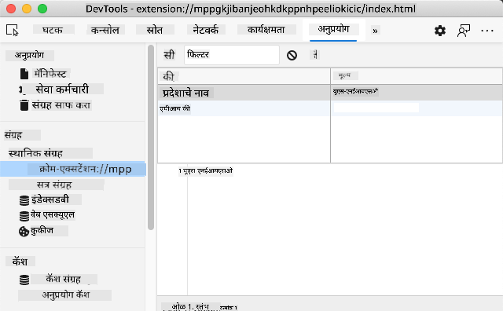

<!--
CO_OP_TRANSLATOR_METADATA:
{
  "original_hash": "7e164d318e19925330cfcaeea954e7b5",
  "translation_date": "2025-10-20T21:29:47+00:00",
  "source_file": "5-browser-extension/2-forms-browsers-local-storage/README.md",
  "language_code": "mr"
}
-->
# ब्राउझर एक्स्टेंशन प्रकल्प भाग 2: API कॉल करा, लोकल स्टोरेज वापरा

## व्याख्यानपूर्व प्रश्नमंजुषा

[व्याख्यानपूर्व प्रश्नमंजुषा](https://ff-quizzes.netlify.app/web/quiz/25)

### परिचय

या धड्यात, तुम्ही तुमच्या ब्राउझर एक्स्टेंशनच्या फॉर्मद्वारे API कॉल कराल आणि परिणाम ब्राउझर एक्स्टेंशनमध्ये प्रदर्शित कराल. याशिवाय, तुम्ही तुमच्या ब्राउझरच्या लोकल स्टोरेजमध्ये डेटा भविष्यातील संदर्भासाठी आणि वापरासाठी कसा साठवायचा ते शिकाल.

✅ योग्य फाइल्समधील क्रमांकित विभागांचे अनुसरण करा आणि तुमचा कोड कुठे ठेवायचा आहे ते जाणून घ्या.

### एक्स्टेंशनमध्ये बदल करण्यासाठी घटक सेट करा:

आतापर्यंत तुम्ही तुमच्या ब्राउझर एक्स्टेंशनसाठी फॉर्म आणि परिणाम `<div>` साठी HTML तयार केले आहे. आता तुम्हाला `/src/index.js` फाइलमध्ये काम करावे लागेल आणि तुमचे एक्स्टेंशन थोडे थोडे तयार करावे लागेल. तुमचा प्रकल्प सेट अप करण्यासाठी आणि बिल्ड प्रक्रियेबद्दल [मागील धडा](../1-about-browsers/README.md) पहा.

तुमच्या `index.js` फाइलमध्ये काम करताना, विविध फील्डशी संबंधित मूल्ये ठेवण्यासाठी काही `const` व्हेरिएबल्स तयार करून प्रारंभ करा:

```JavaScript
// form fields
const form = document.querySelector('.form-data');
const region = document.querySelector('.region-name');
const apiKey = document.querySelector('.api-key');

// results
const errors = document.querySelector('.errors');
const loading = document.querySelector('.loading');
const results = document.querySelector('.result-container');
const usage = document.querySelector('.carbon-usage');
const fossilfuel = document.querySelector('.fossil-fuel');
const myregion = document.querySelector('.my-region');
const clearBtn = document.querySelector('.clear-btn');
```

हे सर्व फील्ड्स त्यांच्या CSS वर्गाद्वारे संदर्भित केले जातात, जे तुम्ही मागील धड्यात HTML मध्ये सेट केले आहे.

### लिसनर्स जोडा

यानंतर, फॉर्म आणि रीसेट बटणावर इव्हेंट लिसनर्स जोडा जे फॉर्म रीसेट करते, जेणेकरून वापरकर्ता फॉर्म सबमिट करतो किंवा रीसेट बटणावर क्लिक करतो तेव्हा काहीतरी होईल. आणि फाइलच्या तळाशी अॅप प्रारंभ करण्यासाठी कॉल जोडा:

```JavaScript
form.addEventListener('submit', (e) => handleSubmit(e));
clearBtn.addEventListener('click', (e) => reset(e));
init();
```

✅ सबमिट किंवा क्लिक इव्हेंटसाठी लिसन करण्यासाठी वापरलेला शॉर्टहँड लक्षात घ्या आणि इव्हेंट कसे `handleSubmit` किंवा `reset` फंक्शनला पास केले जाते. तुम्ही या शॉर्टहँडचे समतुल्य लांब स्वरूपात लिहू शकता का? तुम्हाला कोणते स्वरूप अधिक आवडते?

### `init()` फंक्शन आणि `reset()` फंक्शन तयार करा:

आता तुम्ही एक्स्टेंशन प्रारंभ करणारे फंक्शन तयार करणार आहात, ज्याला `init()` म्हणतात:

```JavaScript
function init() {
	//if anything is in localStorage, pick it up
	const storedApiKey = localStorage.getItem('apiKey');
	const storedRegion = localStorage.getItem('regionName');

	//set icon to be generic green
	//todo

	if (storedApiKey === null || storedRegion === null) {
		//if we don't have the keys, show the form
		form.style.display = 'block';
		results.style.display = 'none';
		loading.style.display = 'none';
		clearBtn.style.display = 'none';
		errors.textContent = '';
	} else {
        //if we have saved keys/regions in localStorage, show results when they load
        displayCarbonUsage(storedApiKey, storedRegion);
		results.style.display = 'none';
		form.style.display = 'none';
		clearBtn.style.display = 'block';
	}
};

function reset(e) {
	e.preventDefault();
	//clear local storage for region only
	localStorage.removeItem('regionName');
	init();
}

```

या फंक्शनमध्ये काही मनोरंजक लॉजिक आहे. वाचताना, तुम्हाला काय घडते ते दिसते का?

- दोन `const` सेट केले जातात जे तपासतात की वापरकर्त्याने लोकल स्टोरेजमध्ये APIKey आणि region code साठवले आहे का.
- जर त्यापैकी एक null असेल, तर त्याची शैली 'block' म्हणून प्रदर्शित करून फॉर्म दर्शवा.
- परिणाम, लोडिंग आणि clearBtn लपवा आणि कोणताही त्रुटी मजकूर रिक्त स्ट्रिंगवर सेट करा.
- जर key आणि region अस्तित्वात असेल, तर एक प्रक्रिया सुरू करा:
  - कार्बन वापर डेटा मिळवण्यासाठी API कॉल करा.
  - परिणाम क्षेत्र लपवा.
  - फॉर्म लपवा.
  - रीसेट बटण दर्शवा.

पुढे जाण्यापूर्वी, ब्राउझरमध्ये उपलब्ध असलेल्या एका महत्त्वाच्या संकल्पनेबद्दल शिकणे उपयुक्त आहे: [LocalStorage](https://developer.mozilla.org/docs/Web/API/Window/localStorage). LocalStorage ही ब्राउझरमध्ये `key-value` जोड म्हणून स्ट्रिंग्स साठवण्यासाठी उपयुक्त पद्धत आहे. या प्रकारच्या वेब स्टोरेजचा डेटा व्यवस्थापित करण्यासाठी JavaScript द्वारे वापर केला जाऊ शकतो. LocalStorage कधीही कालबाह्य होत नाही, तर SessionStorage, वेब स्टोरेजचा दुसरा प्रकार, ब्राउझर बंद झाल्यावर साफ केला जातो. स्टोरेजच्या विविध प्रकारांच्या वापरासाठी फायदे आणि तोटे आहेत.

> लक्षात ठेवा - तुमच्या ब्राउझर एक्स्टेंशनला स्वतःचे लोकल स्टोरेज आहे; मुख्य ब्राउझर विंडो एक वेगळी उदाहरण आहे आणि वेगळ्या प्रकारे वागते.

तुम्ही तुमचा APIKey स्ट्रिंग मूल्य म्हणून सेट करता, उदाहरणार्थ, आणि तुम्ही Edge वर सेट केले आहे हे पाहू शकता, वेब पृष्ठ "इन्स्पेक्ट" करताना (तुम्ही ब्राउझरवर राईट-क्लिक करून इन्स्पेक्ट करू शकता) आणि स्टोरेज पाहण्यासाठी Applications टॅबवर जा.



✅ अशा परिस्थितींबद्दल विचार करा जिथे तुम्हाला काही डेटा लोकल स्टोरेजमध्ये साठवायचा नसेल. सामान्यतः, API Keys लोकल स्टोरेजमध्ये ठेवणे ही वाईट कल्पना आहे! तुम्हाला का वाटते? आमच्या बाबतीत, कारण आमचे अॅप केवळ शिकण्यासाठी आहे आणि अॅप स्टोअरमध्ये तैनात केले जाणार नाही, आम्ही ही पद्धत वापरू.

लक्षात घ्या की तुम्ही लोकल स्टोरेज हाताळण्यासाठी Web API वापरता, `getItem()`, `setItem()`, किंवा `removeItem()` वापरून. हे ब्राउझरमध्ये मोठ्या प्रमाणावर समर्थित आहे.

`displayCarbonUsage()` फंक्शन तयार करण्यापूर्वी जे `init()` मध्ये कॉल केले जाते, प्रारंभिक फॉर्म सबमिशन हाताळण्याची कार्यक्षमता तयार करूया.

### फॉर्म सबमिशन हाताळा

`handleSubmit` नावाचे एक फंक्शन तयार करा जे `(e)` इव्हेंट आर्ग्युमेंट स्वीकारते. इव्हेंटचा प्रसार थांबवा (या प्रकरणात, आम्हाला ब्राउझर रीफ्रेश होण्यापासून थांबवायचे आहे) आणि `setUpUser` नावाच्या नवीन फंक्शनला कॉल करा, `apiKey.value` आणि `region.value` आर्ग्युमेंट्स पास करत. अशा प्रकारे, तुम्ही प्रारंभिक फॉर्मद्वारे योग्य फील्ड्स भरल्यावर आणलेल्या दोन मूल्यांचा वापर करता.

```JavaScript
function handleSubmit(e) {
	e.preventDefault();
	setUpUser(apiKey.value, region.value);
}
```
✅ तुमची स्मृती ताजी करा - मागील धड्यात तुम्ही सेट केलेल्या HTML मध्ये दोन इनपुट फील्ड्स आहेत ज्यांचे `values` तुम्ही फाइलच्या शीर्षस्थानी सेट केलेल्या `const` द्वारे कॅप्चर केले जातात आणि ते दोन्ही `required` आहेत त्यामुळे ब्राउझर वापरकर्त्यांना null मूल्ये इनपुट करण्यापासून थांबवतो.

### वापरकर्ता सेट करा

`setUpUser` फंक्शनकडे वळत, येथे तुम्ही apiKey आणि regionName साठी लोकल स्टोरेज मूल्ये सेट करता. एक नवीन फंक्शन जोडा:

```JavaScript
function setUpUser(apiKey, regionName) {
	localStorage.setItem('apiKey', apiKey);
	localStorage.setItem('regionName', regionName);
	loading.style.display = 'block';
	errors.textContent = '';
	clearBtn.style.display = 'block';
	//make initial call
	displayCarbonUsage(apiKey, regionName);
}
```

हे फंक्शन API कॉल करत असताना एक लोडिंग संदेश दर्शवते. या टप्प्यावर, तुम्ही या ब्राउझर एक्स्टेंशनच्या सर्वात महत्त्वाच्या फंक्शन तयार करण्याच्या टप्प्यावर पोहोचला आहात!

### कार्बन वापर प्रदर्शित करा

शेवटी, API क्वेरी करण्याची वेळ आली आहे!

पुढे जाण्यापूर्वी, आपल्याला API बद्दल चर्चा करणे आवश्यक आहे. API, किंवा [Application Programming Interfaces](https://www.webopedia.com/TERM/A/API.html), हे वेब डेव्हलपरच्या टूलबॉक्सचा एक महत्त्वाचा घटक आहे. ते प्रोग्राम्सना एकमेकांशी संवाद साधण्यासाठी आणि इंटरफेस करण्यासाठी मानक मार्ग प्रदान करतात. उदाहरणार्थ, जर तुम्ही डेटाबेस क्वेरी करण्यासाठी वेबसाइट तयार करत असाल, तर कदाचित कोणीतरी तुमच्यासाठी वापरण्यासाठी API तयार केले असेल. जरी अनेक प्रकारचे API आहेत, तरी [REST API](https://www.smashingmagazine.com/2018/01/understanding-using-rest-api/) सर्वात लोकप्रिय आहे.

✅ 'REST' हा शब्द 'Representational State Transfer' साठी आहे आणि डेटा मिळवण्यासाठी विविध प्रकारे कॉन्फिगर केलेल्या URL चा वापर करण्याची वैशिष्ट्ये आहेत. डेव्हलपर्ससाठी उपलब्ध असलेल्या विविध प्रकारच्या API बद्दल थोडे संशोधन करा. तुम्हाला कोणता प्रकार आवडतो?

या फंक्शनबद्दल काही महत्त्वाच्या गोष्टी लक्षात घेण्यासारख्या आहेत. प्रथम, [`async` कीवर्ड](https://developer.mozilla.org/docs/Web/JavaScript/Reference/Statements/async_function) लक्षात घ्या. तुमचे फंक्शन्स असे लिहिणे जेणेकरून ते असिंक्रोनसली चालतील याचा अर्थ असा होतो की ते डेटा परत येण्यासारख्या क्रिया पूर्ण होईपर्यंत चालू राहतील.

`async` बद्दल एक जलद व्हिडिओ येथे आहे:

[](https://youtube.com/watch?v=YwmlRkrxvkk "प्रॉमिसेस व्यवस्थापित करण्यासाठी Async आणि Await")

> 🎥 Async/await बद्दल व्हिडिओसाठी वरील प्रतिमेवर क्लिक करा.

C02Signal API क्वेरी करण्यासाठी एक नवीन फंक्शन तयार करा:

```JavaScript
import axios from '../node_modules/axios';

async function displayCarbonUsage(apiKey, region) {
	try {
		await axios
			.get('https://api.co2signal.com/v1/latest', {
				params: {
					countryCode: region,
				},
				headers: {
					'auth-token': apiKey,
				},
			})
			.then((response) => {
				let CO2 = Math.floor(response.data.data.carbonIntensity);

				//calculateColor(CO2);

				loading.style.display = 'none';
				form.style.display = 'none';
				myregion.textContent = region;
				usage.textContent =
					Math.round(response.data.data.carbonIntensity) + ' grams (grams C02 emitted per kilowatt hour)';
				fossilfuel.textContent =
					response.data.data.fossilFuelPercentage.toFixed(2) +
					'% (percentage of fossil fuels used to generate electricity)';
				results.style.display = 'block';
			});
	} catch (error) {
		console.log(error);
		loading.style.display = 'none';
		results.style.display = 'none';
		errors.textContent = 'Sorry, we have no data for the region you have requested.';
	}
}
```

हे एक मोठे फंक्शन आहे. येथे काय चालले आहे?

- सर्वोत्तम पद्धतींचे अनुसरण करून, तुम्ही हे फंक्शन असिंक्रोनसली वागवण्यासाठी `async` कीवर्ड वापरता. फंक्शनमध्ये `try/catch` ब्लॉक आहे कारण API डेटा परत करताना ते प्रॉमिस परत करेल. कारण तुम्हाला API प्रतिसाद देण्याचा वेग नियंत्रित करता येत नाही (कदाचित ते प्रतिसाद देणार नाही!), तुम्हाला ही अनिश्चितता असिंक्रोनसली कॉल करून हाताळणे आवश्यक आहे.
- तुम्ही तुमच्या region चा डेटा मिळवण्यासाठी co2signal API क्वेरी करत आहात, तुमचा API Key वापरून. त्या key चा वापर करण्यासाठी, तुम्हाला तुमच्या हेडर पॅरामीटर्समध्ये एक प्रकारचे ऑथेंटिकेशन वापरावे लागेल.
- एकदा API प्रतिसाद दिल्यावर, तुम्ही त्याच्या प्रतिसाद डेटाच्या विविध घटकांना तुमच्या स्क्रीनच्या त्या भागांमध्ये असाइन करता जे तुम्ही हा डेटा दर्शवण्यासाठी सेट केले आहेत.
- जर एखादी त्रुटी असेल, किंवा कोणताही परिणाम नसेल, तर तुम्ही एक त्रुटी संदेश दर्शवता.

✅ असिंक्रोनस प्रोग्रामिंग पॅटर्न्स वापरणे तुमच्या टूलबॉक्समधील आणखी एक उपयुक्त साधन आहे. [विविध प्रकारांबद्दल वाचा](https://developer.mozilla.org/docs/Web/JavaScript/Reference/Statements/async_function) ज्याद्वारे तुम्ही हा प्रकारचा कोड कॉन्फिगर करू शकता.

अभिनंदन! जर तुम्ही तुमचे एक्स्टेंशन तयार केले (`npm run build`) आणि ते तुमच्या एक्स्टेंशन पॅनमध्ये रीफ्रेश केले, तर तुमच्याकडे एक कार्यरत एक्स्टेंशन आहे! एकमेव गोष्ट जी कार्यरत नाही ती म्हणजे आयकॉन, आणि तुम्ही पुढील धड्यात ती दुरुस्त कराल.

---

## GitHub Copilot Agent Challenge 🚀

Agent मोड वापरून खालील आव्हान पूर्ण करा:

**वर्णन:** ब्राउझर एक्स्टेंशनमध्ये त्रुटी हाताळणी सुधारणा आणि वापरकर्ता अनुभव वैशिष्ट्ये जोडून सुधारणा करा. हे आव्हान तुम्हाला आधुनिक JavaScript पॅटर्न्स वापरून API, लोकल स्टोरेज आणि DOM मॅनिप्युलेशनसह काम करण्याचा सराव करण्यास मदत करेल.

**प्रॉम्प्ट:** `displayCarbonUsage` फंक्शनची सुधारित आवृत्ती तयार करा ज्यामध्ये समाविष्ट आहे: 1) अपयशी API कॉलसाठी एक्सपोनेंशियल बॅकऑफसह रीट्राय मेकॅनिझम, 2) API कॉल करण्यापूर्वी region code साठी इनपुट व्हॅलिडेशन, 3) प्रगती निर्देशकांसह लोडिंग अॅनिमेशन, 4) लोकल स्टोरेजमध्ये API प्रतिसादांची कॅशिंग 30 मिनिटांसाठी एक्सपायरेशन टाइमस्टॅम्पसह, आणि 5) मागील API कॉल्समधील ऐतिहासिक डेटा प्रदर्शित करण्यासाठी एक वैशिष्ट्य. तसेच सर्व फंक्शन पॅरामीटर्स आणि रिटर्न प्रकार डॉक्युमेंट करण्यासाठी योग्य TypeScript-शैलीतील JSDoc टिप्पण्या जोडा.

## 🚀 आव्हान

आम्ही या धड्यांमध्ये अनेक प्रकारचे API चर्चा केली आहेत. एक वेब API निवडा आणि ते काय ऑफर करते यावर सखोल संशोधन करा. उदाहरणार्थ, ब्राउझरमध्ये उपलब्ध असलेल्या API वर एक नजर टाका जसे की [HTML Drag and Drop API](https://developer.mozilla.org/docs/Web/API/HTML_Drag_and_Drop_API). तुमच्या मते एक उत्कृष्ट API काय बनवते?

## व्याख्यानोत्तर प्रश्नमंजुषा

[व्याख्यानोत्तर प्रश्नमंजुषा](https://ff-quizzes.netlify.app/web/quiz/26)

## पुनरावलोकन आणि स्व-अभ्यास

या धड्यात तुम्ही LocalStorage आणि API बद्दल शिकलात, जे व्यावसायिक वेब डेव्हलपरसाठी खूप उपयुक्त आहेत. हे दोन गोष्टी एकत्र कशा कार्य करतात याबद्दल तुम्ही विचार करू शकता का? तुम्ही API द्वारे वापरण्यासाठी आयटम्स साठवणारी वेबसाइट कशी तयार कराल याबद्दल विचार करा.

## असाइनमेंट

[एक API स्वीकारा](assignment.md)

---

**अस्वीकरण**:  
हा दस्तऐवज AI भाषांतर सेवा [Co-op Translator](https://github.com/Azure/co-op-translator) वापरून भाषांतरित करण्यात आला आहे. आम्ही अचूकतेसाठी प्रयत्नशील असलो तरी, कृपयास लक्षात ठेवा की स्वयंचलित भाषांतरांमध्ये त्रुटी किंवा अचूकतेचा अभाव असू शकतो. मूळ भाषेतील दस्तऐवज हा अधिकृत स्रोत मानला जावा. महत्त्वाच्या माहितीसाठी व्यावसायिक मानवी भाषांतराची शिफारस केली जाते. या भाषांतराचा वापर करून निर्माण झालेल्या कोणत्याही गैरसमज किंवा चुकीच्या अर्थासाठी आम्ही जबाबदार नाही.