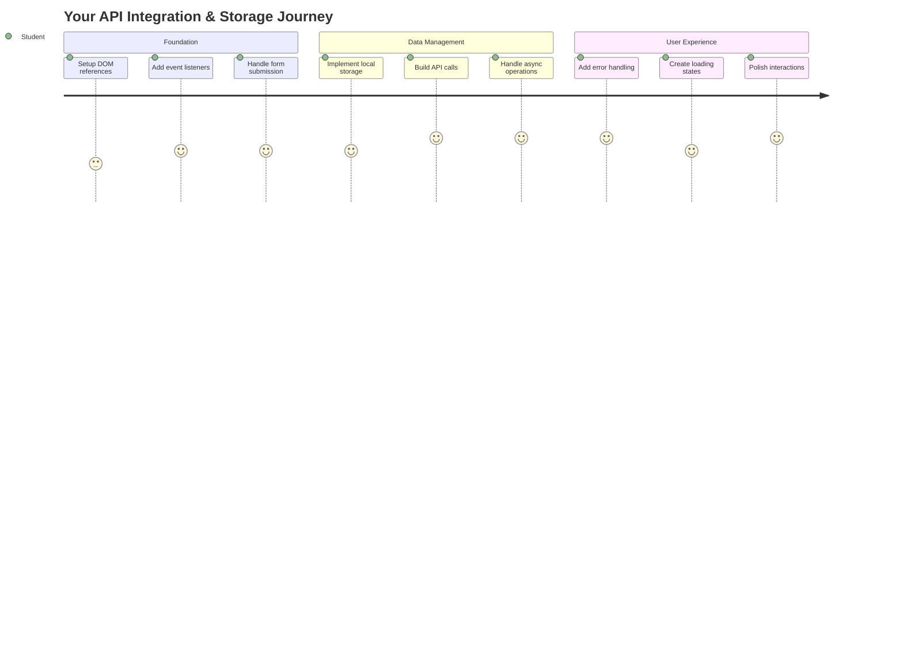
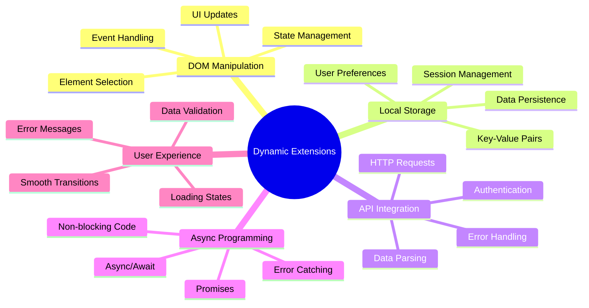
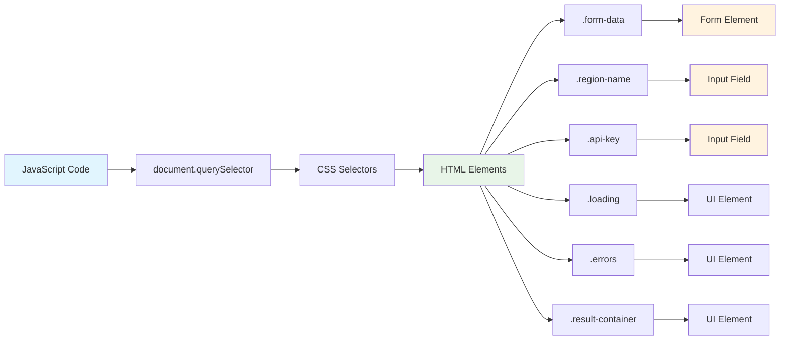
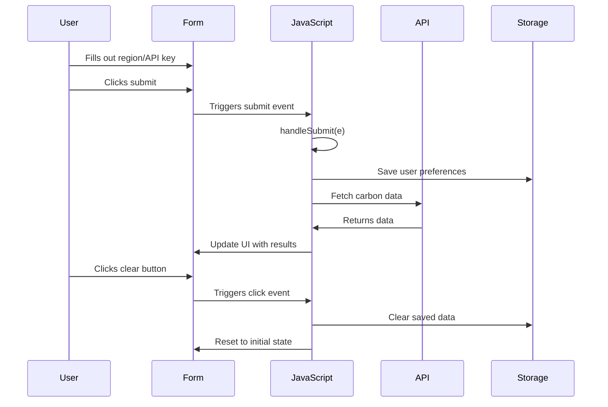
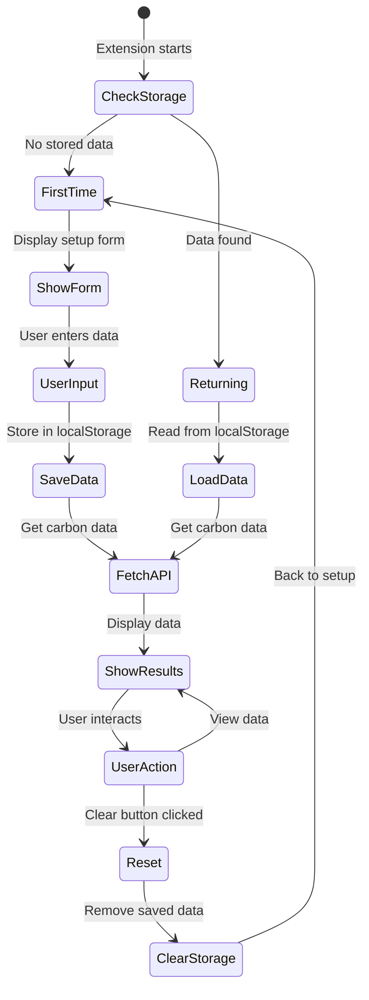
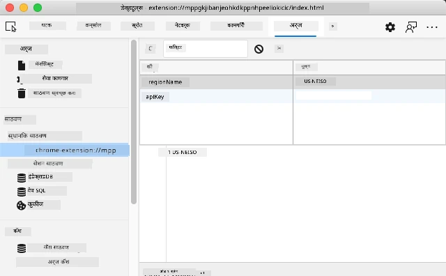
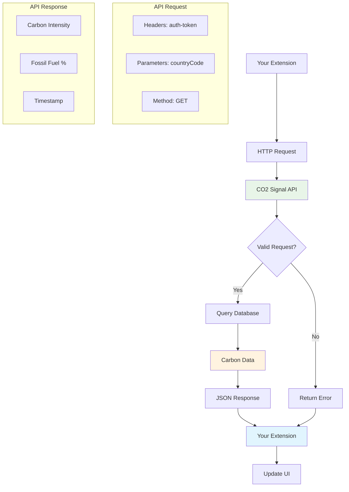
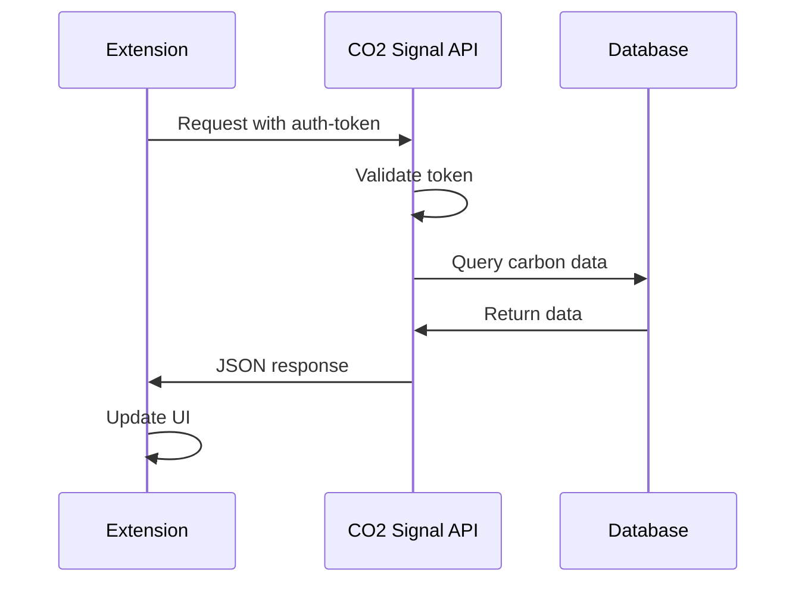
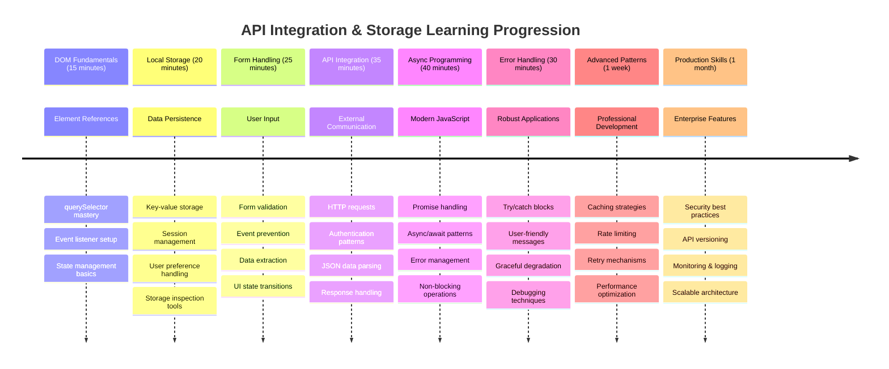

<!--
CO_OP_TRANSLATOR_METADATA:
{
  "original_hash": "2b6203a48c48d8234e0948353b47d84e",
  "translation_date": "2025-11-03T15:06:41+00:00",
  "source_file": "5-browser-extension/2-forms-browsers-local-storage/README.md",
  "language_code": "mr"
}
-->
# ब्राउझर एक्स्टेंशन प्रोजेक्ट भाग 2: API कॉल करा, लोकल स्टोरेज वापरा



## प्री-लेक्चर क्विझ

[प्री-लेक्चर क्विझ](https://ff-quizzes.netlify.app/web/quiz/25)

## परिचय

तुम्ही तयार करत असलेल्या ब्राउझर एक्स्टेंशनची आठवण आहे का? सध्या तुमच्याकडे एक छान दिसणारा फॉर्म आहे, पण तो मुख्यतः स्थिर आहे. आज आपण त्याला वास्तविक डेटा जोडून आणि त्याला मेमरी देऊन जिवंत करू.

अपोलो मिशन कंट्रोल संगणकांचा विचार करा - त्यांनी फक्त निश्चित माहिती प्रदर्शित केली नाही. ते सतत अंतराळ यानाशी संवाद साधत होते, टेलिमेट्री डेटा अपडेट करत होते आणि महत्त्वाचे मिशन पॅरामीटर्स लक्षात ठेवत होते. आज आपण तयार करत असलेल्या एक्स्टेंशनमध्ये असाच डायनॅमिक वर्तन असेल. तुमचे एक्स्टेंशन इंटरनेटशी संपर्क साधेल, वास्तविक पर्यावरणीय डेटा मिळवेल आणि पुढच्या वेळी तुमच्या सेटिंग्ज लक्षात ठेवेल.

API इंटिग्रेशन जटिल वाटू शकते, परंतु ते इतर सेवांशी संवाद साधण्यास तुमच्या कोडला शिकवण्यासारखे आहे. तुम्ही हवामान डेटा, सोशल मीडिया फीड्स किंवा कार्बन फूटप्रिंट माहिती मिळवत असाल, जसे आपण आज करणार आहोत, ते डिजिटल कनेक्शन स्थापित करण्याबद्दल आहे. ब्राउझर माहिती टिकवून ठेवू शकतात हे कसे शोधायचे ते देखील आपण पाहू - जसे लायब्ररींनी कार्ड कॅटलॉग वापरून पुस्तके कुठे आहेत हे लक्षात ठेवले.

या धड्याच्या शेवटी, तुमच्याकडे एक ब्राउझर एक्स्टेंशन असेल जे वास्तविक डेटा मिळवते, वापरकर्ता प्राधान्ये साठवते आणि एक सहज अनुभव प्रदान करते. चला सुरुवात करूया!



✅ योग्य फाइल्समधील क्रमांकित विभागांचे अनुसरण करा आणि तुमचा कोड कुठे ठेवायचा ते जाणून घ्या

## एक्स्टेंशनमध्ये बदल करण्यासाठी घटक सेट करा

तुमचा जावास्क्रिप्ट इंटरफेसमध्ये बदल करू शकतो, त्याआधी त्याला विशिष्ट HTML घटकांचे संदर्भ आवश्यक आहेत. जसे दुर्बिणीला विशिष्ट ताऱ्यांकडे लक्ष केंद्रित करावे लागते - गॅलिलिओने ज्युपिटरचे चंद्र अभ्यास करण्याआधी त्याला ज्युपिटर शोधून त्यावर लक्ष केंद्रित करावे लागले.

तुमच्या `index.js` फाइलमध्ये, आपण प्रत्येक महत्त्वाच्या फॉर्म घटकांचे संदर्भ कॅप्चर करणारे `const` व्हेरिएबल्स तयार करू. हे वैज्ञानिकांनी त्यांच्या उपकरणांना लेबल करण्यासारखे आहे - प्रत्येक वेळी संपूर्ण प्रयोगशाळा शोधण्याऐवजी, ते थेट त्यांना आवश्यक असलेल्या गोष्टींवर प्रवेश करू शकतात.



```javascript
// form fields
const form = document.querySelector('.form-data');
const region = document.querySelector('.region-name');
const apiKey = document.querySelector('.api-key');

// results
const errors = document.querySelector('.errors');
const loading = document.querySelector('.loading');
const results = document.querySelector('.result-container');
const usage = document.querySelector('.carbon-usage');
const fossilfuel = document.querySelector('.fossil-fuel');
const myregion = document.querySelector('.my-region');
const clearBtn = document.querySelector('.clear-btn');
```

**या कोडमध्ये काय होते:**
- **कॅप्चर करते** फॉर्म घटक `document.querySelector()` वापरून CSS क्लास सिलेक्टर्ससह
- **निर्माण करते** इनपुट फील्ड्ससाठी संदर्भ क्षेत्राचे नाव आणि API कीसाठी
- **जोडते** कार्बन वापर डेटा प्रदर्शित करणाऱ्या घटकांशी कनेक्शन
- **सेट करते** UI घटकांवर प्रवेश जसे लोडिंग इंडिकेटर्स आणि एरर मेसेजेस
- **साठवते** प्रत्येक घटक संदर्भ `const` व्हेरिएबलमध्ये जेणेकरून तुमच्या कोडमध्ये सहज वापरता येईल

## इव्हेंट लिसनर्स जोडा

आता तुमचे एक्स्टेंशन वापरकर्त्याच्या क्रियाकलापांना प्रतिसाद देईल. इव्हेंट लिसनर्स हे वापरकर्त्याच्या संवादावर लक्ष ठेवण्याचा तुमच्या कोडचा मार्ग आहे. ते सुरुवातीच्या टेलिफोन एक्सचेंजमधील ऑपरेटरसारखे आहेत - ते येणाऱ्या कॉल्ससाठी ऐकतात आणि कोणीतरी कनेक्शन करायचे असल्यास योग्य सर्किट्स जोडतात.



```javascript
form.addEventListener('submit', (e) => handleSubmit(e));
clearBtn.addEventListener('click', (e) => reset(e));
init();
```

**या संकल्पना समजून घ्या:**
- **जोडते** फॉर्मला सबमिट लिसनर जेव्हा वापरकर्ते एंटर प्रेस करतात किंवा सबमिट क्लिक करतात
- **कनेक्ट करते** क्लिअर बटणावर क्लिक लिसनर फॉर्म रीसेट करण्यासाठी
- **पास करते** इव्हेंट ऑब्जेक्ट `(e)` हँडलर फंक्शन्ससाठी अतिरिक्त नियंत्रणासाठी
- **कॉल करते** `init()` फंक्शन लगेच एक्स्टेंशनची सुरुवातीची स्थिती सेट करण्यासाठी

✅ येथे वापरलेले शॉर्टहँड अ‍ॅरो फंक्शन सिंटॅक्स लक्षात घ्या. पारंपरिक फंक्शन एक्सप्रेशन्सपेक्षा आधुनिक जावास्क्रिप्ट दृष्टिकोन स्वच्छ आहे, परंतु दोन्ही समान कार्य करतात!

### 🔄 **शैक्षणिक तपासणी**
**इव्हेंट हँडलिंग समजून घेणे**: इनिशियलायझेशनकडे जाण्यापूर्वी, सुनिश्चित करा की तुम्ही:
- ✅ कसे `addEventListener` वापरकर्त्याच्या क्रियाकलापांना जावास्क्रिप्ट फंक्शन्सशी जोडते ते स्पष्ट करू शकता
- ✅ का आपण इव्हेंट ऑब्जेक्ट `(e)` हँडलर फंक्शन्सला पास करतो ते समजून घ्या
- ✅ `submit` आणि `click` इव्हेंट्समधील फरक ओळखू शकता
- ✅ `init()` फंक्शन कधी चालते आणि का चालते ते वर्णन करू शकता

**जलद स्व-परीक्षण**: जर तुम्ही फॉर्म सबमिशनमध्ये `e.preventDefault()` विसरलात तर काय होईल?
*उत्तर: पृष्ठ पुन्हा लोड होईल, सर्व जावास्क्रिप्ट स्थिती गमावेल आणि वापरकर्ता अनुभव खंडित होईल*

## इनिशियलायझेशन आणि रीसेट फंक्शन्स तयार करा

तुमच्या एक्स्टेंशनसाठी इनिशियलायझेशन लॉजिक तयार करूया. `init()` फंक्शन हे जहाजाच्या नेव्हिगेशन सिस्टमसारखे आहे जे त्याच्या उपकरणांची तपासणी करते - ते वर्तमान स्थिती ठरवते आणि त्यानुसार इंटरफेस समायोजित करते. हे तपासते की कोणी तुमचे एक्स्टेंशन आधी वापरले आहे का आणि त्यांचे पूर्वीचे सेटिंग्ज लोड करते.

`reset()` फंक्शन वापरकर्त्यांना नवीन सुरुवात प्रदान करते - जसे वैज्ञानिक त्यांच्या उपकरणे प्रयोगांदरम्यान रीसेट करतात जेणेकरून स्वच्छ डेटा सुनिश्चित होईल.

```javascript
function init() {
	// Check if user has previously saved API credentials
	const storedApiKey = localStorage.getItem('apiKey');
	const storedRegion = localStorage.getItem('regionName');

	// Set extension icon to generic green (placeholder for future lesson)
	// TODO: Implement icon update in next lesson

	if (storedApiKey === null || storedRegion === null) {
		// First-time user: show the setup form
		form.style.display = 'block';
		results.style.display = 'none';
		loading.style.display = 'none';
		clearBtn.style.display = 'none';
		errors.textContent = '';
	} else {
		// Returning user: load their saved data automatically
		displayCarbonUsage(storedApiKey, storedRegion);
		results.style.display = 'none';
		form.style.display = 'none';
		clearBtn.style.display = 'block';
	}
}

function reset(e) {
	e.preventDefault();
	// Clear stored region to allow user to choose a new location
	localStorage.removeItem('regionName');
	// Restart the initialization process
	init();
}
```

**येथे काय होते ते समजून घ्या:**
- **मिळवते** ब्राउझरच्या लोकल स्टोरेजमधून साठवलेली API की आणि क्षेत्र
- **तपासते** हा प्रथमच वापरकर्ता आहे (कोणतेही साठवलेले क्रेडेन्शियल्स नाहीत) किंवा परतणारा वापरकर्ता
- **दाखवते** नवीन वापरकर्त्यांसाठी सेटअप फॉर्म आणि इतर इंटरफेस घटक लपवते
- **स्वयंचलितपणे लोड करते** परतणाऱ्या वापरकर्त्यांसाठी साठवलेला डेटा आणि रीसेट पर्याय प्रदर्शित करते
- **व्यवस्थापित करते** उपलब्ध डेटावर आधारित वापरकर्ता इंटरफेस स्थिती

**लोकल स्टोरेजबद्दल महत्त्वाच्या संकल्पना:**
- **टिकवते** ब्राउझर सत्रांदरम्यान डेटा (सेशन स्टोरेजच्या विपरीत)
- **साठवते** डेटा की-वॅल्यू जोड्यांमध्ये `getItem()` आणि `setItem()` वापरून
- **परत करते** `null` जेव्हा दिलेल्या कीसाठी कोणताही डेटा अस्तित्वात नसतो
- **प्रदान करते** वापरकर्ता प्राधान्ये आणि सेटिंग्ज लक्षात ठेवण्यासाठी सोपा मार्ग

> 💡 **ब्राउझर स्टोरेज समजून घेणे**: [LocalStorage](https://developer.mozilla.org/docs/Web/API/Window/localStorage) तुमच्या एक्स्टेंशनला टिकाऊ मेमरी देण्यासारखे आहे. प्राचीन अलेक्झांड्रिया लायब्ररीने स्क्रोल्स कसे साठवले याचा विचार करा - विद्वान सोडून परत आल्यावरही माहिती उपलब्ध राहिली.
>
> **महत्त्वाच्या वैशिष्ट्ये:**
> - **टिकवते** डेटा ब्राउझर बंद केल्यानंतरही
> - **जिवंत राहते** संगणक पुन्हा सुरू केल्यानंतर आणि ब्राउझर क्रॅश झाल्यानंतर
> - **प्रदान करते** वापरकर्ता प्राधान्यांसाठी मोठ्या प्रमाणात स्टोरेज स्पेस
> - **त्वरित प्रवेश देते** नेटवर्क विलंबाशिवाय

> **महत्त्वाची टीप**: तुमच्या ब्राउझर एक्स्टेंशनमध्ये त्याचे स्वतःचे वेगळे लोकल स्टोरेज आहे जे नियमित वेब पृष्ठांपासून वेगळे आहे. यामुळे सुरक्षा मिळते आणि इतर वेबसाइट्ससोबत संघर्ष टाळला जातो.

तुमचा साठवलेला डेटा पाहण्यासाठी ब्राउझर डेव्हलपर टूल्स (F12) उघडा, **Application** टॅबवर जा आणि **Local Storage** विभाग विस्तृत करा.





> ⚠️ **सुरक्षा विचार**: उत्पादन ऍप्लिकेशन्समध्ये, लोकल स्टोरेजमध्ये API की साठवणे सुरक्षा जोखीम निर्माण करते कारण जावास्क्रिप्टला हा डेटा प्रवेश करता येतो. शिकण्यासाठी, हा दृष्टिकोन ठीक आहे, परंतु वास्तविक ऍप्लिकेशन्स संवेदनशील क्रेडेन्शियल्ससाठी सुरक्षित सर्व्हर-साइड स्टोरेज वापरतात.

## फॉर्म सबमिशन हाताळा

आता आपण पाहू की कोणीतरी तुमचा फॉर्म सबमिट केल्यावर काय होते. डीफॉल्टनुसार, ब्राउझर फॉर्म सबमिट केल्यावर पृष्ठ पुन्हा लोड करतात, परंतु आम्ही हा वर्तन अडवून एक सहज अनुभव तयार करू.

हा दृष्टिकोन मिशन कंट्रोल अंतराळ यान संवाद कसा हाताळतो यासारखा आहे - प्रत्येक ट्रान्समिशनसाठी संपूर्ण सिस्टम रीसेट करण्याऐवजी, ते नवीन माहिती प्रक्रिया करत असताना सतत ऑपरेशन टिकवून ठेवतात.

फॉर्म सबमिशन इव्हेंट कॅप्चर करणारे आणि वापरकर्त्याचा इनपुट काढणारे फंक्शन तयार करा:

```javascript
function handleSubmit(e) {
	e.preventDefault();
	setUpUser(apiKey.value, region.value);
}
```

**वरीलमध्ये, आम्ही:**
- **थांबवते** डीफॉल्ट फॉर्म सबमिशन वर्तन जे पृष्ठ रीफ्रेश करेल
- **काढते** API की आणि क्षेत्र फील्डमधून वापरकर्ता इनपुट मूल्ये
- **पास करते** फॉर्म डेटा `setUpUser()` फंक्शनला प्रक्रिया करण्यासाठी
- **टिकवते** सिंगल-पेज ऍप्लिकेशन वर्तन पृष्ठ रीफ्रेश टाळून

✅ लक्षात ठेवा की तुमच्या HTML फॉर्म फील्ड्समध्ये `required` अट आहे, त्यामुळे ब्राउझर आपोआप पडताळणी करतो की वापरकर्त्यांनी हे फंक्शन चालण्यापूर्वी API की आणि क्षेत्र प्रदान केले आहे.

## वापरकर्ता प्राधान्ये सेट करा

`setUpUser` फंक्शन वापरकर्त्याचे क्रेडेन्शियल्स साठवण्यास आणि पहिला API कॉल सुरू करण्यास जबाबदार आहे. हे सेटअपपासून परिणाम प्रदर्शित करण्यासाठी एक सहज संक्रमण तयार करते.

```javascript
function setUpUser(apiKey, regionName) {
	// Save user credentials for future sessions
	localStorage.setItem('apiKey', apiKey);
	localStorage.setItem('regionName', regionName);
	
	// Update UI to show loading state
	loading.style.display = 'block';
	errors.textContent = '';
	clearBtn.style.display = 'block';
	
	// Fetch carbon usage data with user's credentials
	displayCarbonUsage(apiKey, regionName);
}
```

**पायऱ्या-पायऱ्यांनी, येथे काय होते:**
- **साठवते** API की आणि क्षेत्र नाव भविष्यातील वापरासाठी लोकल स्टोरेजमध्ये
- **दाखवते** लोडिंग इंडिकेटर वापरकर्त्यांना डेटा मिळवला जात आहे हे कळवण्यासाठी
- **क्लिअर करते** पूर्वीचे एरर मेसेजेस डिस्प्लेवरून
- **दाखवते** क्लिअर बटण वापरकर्त्यांना नंतर त्यांचे सेटिंग्ज रीसेट करण्यासाठी
- **सुरू करते** API कॉल वास्तविक कार्बन वापर डेटा मिळवण्यासाठी

हे फंक्शन डेटा टिकवून ठेवणे आणि वापरकर्ता इंटरफेस अपडेट्स एकत्रितपणे व्यवस्थापित करून एक सहज वापरकर्ता अनुभव तयार करते.

## कार्बन वापर डेटा प्रदर्शित करा

आता आपण तुमचे एक्स्टेंशन बाह्य डेटा स्रोतांशी API द्वारे जोडू. हे तुमचे एक्स्टेंशन एक स्वतंत्र साधन म्हणून बदलते जे इंटरनेटवरून रिअल-टाइम माहिती मिळवू शकते.

**API समजून घेणे**

[APIs](https://www.webopedia.com/TERM/A/API.html) वेगवेगळ्या ऍप्लिकेशन्स एकमेकांशी संवाद साधण्याचा मार्ग आहेत. ते 19व्या शतकातील दूरच्या शहरांना जोडणाऱ्या टेलिग्राफ सिस्टमसारखे आहेत - ऑपरेटर दूरच्या स्टेशनला विनंत्या पाठवतात आणि विनंती केलेली माहिती मिळवतात. तुम्ही सोशल मीडिया तपासता, व्हॉइस असिस्टंटला प्रश्न विचारता किंवा डिलिव्हरी ऍप वापरता, तेव्हा API डेटा एक्सचेंज सुलभ करत असतात.



**REST APIs बद्दल महत्त्वाच्या संकल्पना:**
- **REST** म्हणजे 'Representational State Transfer'
- **वापरते** स्टँडर्ड HTTP पद्धती (GET, POST, PUT, DELETE) डेटा संवाद साधण्यासाठी
- **परत करते** डेटा प्रेडिक्टेबल फॉरमॅट्समध्ये, सामान्यतः JSON
- **प्रदान करते** वेगवेगळ्या प्रकारच्या विनंत्यांसाठी सुसंगत, URL-आधारित एंडपॉइंट्स

✅ [CO2 Signal API](https://www.co2signal.com/) आम्ही वापरणार आहोत ते जगभरातील इलेक्ट्रिकल ग्रिड्समधून रिअल-टाइम कार्बन इंटेन्सिटी डेटा प्रदान करते. हे वापरकर्त्यांना त्यांच्या वीज वापराचा पर्यावरणीय प्रभाव समजून घेण्यास मदत करते!

> 💡 **असिंक्रोनस जावास्क्रिप्ट समजून घेणे**: [`async` कीवर्ड](https://developer.mozilla.org/docs/Web/JavaScript/Reference/Statements/async_function) तुमच्या कोडला एकाच वेळी अनेक ऑपरेशन्स हाताळण्यास सक्षम करते. जेव्हा तुम्ही सर्व्हरकडून डेटा विनंती करता, तेव्हा तुम्हाला तुमचे संपूर्ण एक्स्टेंशन थांबवायचे नाही - ते एखाद्या विमानाला प्रतिसाद देण्यासाठी हवाई वाहतूक नियंत्रण सर्व ऑपरेशन्स थांबवण्यासारखे असेल.
>
> **महत्त्वाचे फायदे:**
> - **टिकवते** डेटा लोड करत असताना एक्स्टेंशन प्रतिसादक्षमता
> - **परवानगी देते** नेटवर्क विनंत्यांदरम्यान इतर कोड चालू ठेवण्यासाठी
> - **वाढवते** पारंपरिक कॉलबॅक पॅटर्नच्या तुलनेत कोड वाचण्यायोग्यता
> - **सक्षम करते** नेटवर्क समस्यांसाठी ग्रेसफुल एरर हँडलिंग

`async` बद्दल एक जलद व्हिडिओ येथे आहे:

[](https://youtube.com/watch?v=YwmlRkrxvkk "Async आणि Await प्रॉमिसेस व्यवस्थापित करण्यासाठी")

> 🎥 वरच्या प्रतिमेवर क्लिक करा `async/await` बद्दल व्हिडिओसाठी.

### 🔄 **शैक्षणिक तपासणी**
**असिंक्रोनस प्रोग्रामिंग समजून घेणे**: API फंक्शनमध्ये जाण्यापूर्वी, सुनिश्चित करा की तुम्ही समजता:
- ✅ का आपण `async/await` वापरतो संपूर्ण एक्स्टेंशन थांबवण्याऐवजी
- ✅ कसे `try/catch` ब्लॉक्स नेटवर्क एरर ग्रेसफुली हाताळतात
- ✅ समकालीन आणि असिंक्रोनस ऑपरेशन्समधील फरक
- ✅ API कॉल्स का अयशस्वी होऊ शकतात आणि त्या अयशस्वीतेचे व्यवस्थापन कसे करावे

**वास्तविक-जगातील कनेक्शन**: या रोजच्या असिंक्रोनस उदाहरणांचा विचार करा:
- **अन्न ऑर्डर करणे**: तुम्ही स्वयंपाकघराजवळ थांबत नाही - तुम्हाला पावती मिळते आणि इतर क्रियाकलाप सुरू ठेवता
- **ईमेल पाठवणे**: तुमचे ईमेल ऍप पाठवताना थांबत नाही - तुम्ही अधिक ईमेल तयार करू शकता
- **वेब पृष्ठे लोड करणे**: प्रतिमा प्रगतपणे लोड होतात आणि तुम्ही आधीच मजकूर वाचू शकता

**API ऑथेंटिकेशन फ्लो**:


कार्बन वापर डेटा मिळवण्यासाठी आणि प्रदर्शित करण्यासाठी फंक्शन तयार करा:

@@
**वर्णन:** ब्राउझर विस्तारामध्ये सुधारणा करून त्रुटी हाताळणी सुधारणा आणि वापरकर्ता अनुभव वैशिष्ट्ये जोडा. ही आव्हाने तुम्हाला API, स्थानिक स्टोरेज आणि आधुनिक JavaScript पॅटर्न वापरून DOM मॅनिप्युलेशनवर काम करण्याचा सराव करण्यास मदत करेल.

**सूचना:** displayCarbonUsage फंक्शनची सुधारित आवृत्ती तयार करा ज्यामध्ये समाविष्ट असेल: 1) API कॉल अयशस्वी झाल्यास एक्स्पोनेंशियल बॅकऑफसह पुन्हा प्रयत्न करण्याचा यंत्रणा, 2) API कॉल करण्यापूर्वी क्षेत्र कोडसाठी इनपुट सत्यापन, 3) प्रगती निर्देशकांसह लोडिंग अ‍ॅनिमेशन, 4) स्थानिक स्टोरेजमध्ये API प्रतिसादांचे 30 मिनिटांसाठी कालबाह्य टाइमस्टॅम्पसह कॅशिंग, आणि 5) मागील API कॉलमधून ऐतिहासिक डेटा प्रदर्शित करण्याचे वैशिष्ट्य. तसेच सर्व फंक्शन पॅरामीटर्स आणि रिटर्न प्रकारांचे दस्तऐवजीकरण करण्यासाठी योग्य TypeScript-शैलीतील JSDoc टिप्पण्या जोडा.

[एजंट मोड](https://code.visualstudio.com/blogs/2025/02/24/introducing-copilot-agent-mode) बद्दल अधिक जाणून घ्या.

## 🚀 आव्हान

API चा अभ्यास करून वेब विकासासाठी उपलब्ध असलेल्या ब्राउझर-आधारित API चा सखोल अभ्यास करा. या ब्राउझर API पैकी एक निवडा आणि एक छोटा डेमो तयार करा:

- [Geolocation API](https://developer.mozilla.org/docs/Web/API/Geolocation_API) - वापरकर्त्याचे वर्तमान स्थान मिळवा
- [Notification API](https://developer.mozilla.org/docs/Web/API/Notifications_API) - डेस्कटॉप सूचना पाठवा
- [HTML Drag and Drop API](https://developer.mozilla.org/docs/Web/API/HTML_Drag_and_Drop_API) - परस्परसंवादी ड्रॅग इंटरफेस तयार करा
- [Web Storage API](https://developer.mozilla.org/docs/Web/API/Web_Storage_API) - प्रगत स्थानिक स्टोरेज तंत्रज्ञान
- [Fetch API](https://developer.mozilla.org/docs/Web/API/Fetch_API) - XMLHttpRequest साठी आधुनिक पर्याय

**संशोधनासाठी प्रश्न विचारात घ्या:**
- हा API कोणती वास्तविक समस्या सोडवतो?
- API त्रुटी आणि काठाच्या प्रकरणांशी कसे हाताळतो?
- हा API वापरताना कोणते सुरक्षा विचार आहेत?
- वेगवेगळ्या ब्राउझरमध्ये हा API किती प्रमाणात समर्थित आहे?

तुमच्या संशोधनानंतर, कोणत्या वैशिष्ट्यांमुळे API विकसक-अनुकूल आणि विश्वासार्ह बनतो हे ओळखा.

## पोस्ट-लेक्चर क्विझ

[पोस्ट-लेक्चर क्विझ](https://ff-quizzes.netlify.app/web/quiz/26)

## पुनरावलोकन आणि स्व-अभ्यास

या धड्यात तुम्ही स्थानिक स्टोरेज आणि API बद्दल शिकले, जे व्यावसायिक वेब विकसकासाठी खूप उपयुक्त आहेत. हे दोन गोष्टी एकत्र कशा कार्य करतात याचा विचार करू शकता का? अशा वेबसाइटची रचना कशी कराल याचा विचार करा जी API द्वारे वापरण्यासाठी आयटम संग्रहित करेल.

### ⚡ **पुढील 5 मिनिटांत तुम्ही काय करू शकता**
- [ ] DevTools Application टॅब उघडा आणि कोणत्याही वेबसाइटवरील स्थानिक स्टोरेज एक्सप्लोर करा
- [ ] एक साधा HTML फॉर्म तयार करा आणि ब्राउझरमध्ये फॉर्म सत्यापन तपासा
- [ ] ब्राउझर कन्सोलमध्ये स्थानिक स्टोरेज वापरून डेटा संग्रहित आणि पुनर्प्राप्त करण्याचा प्रयत्न करा
- [ ] सबमिट केलेल्या फॉर्म डेटाचा नेटवर्क टॅब वापरून तपास करा

### 🎯 **तुम्ही एका तासात काय साध्य करू शकता**
- [ ] पोस्ट-लेसन क्विझ पूर्ण करा आणि फॉर्म हाताळणी संकल्पना समजून घ्या
- [ ] वापरकर्ता प्राधान्ये जतन करणारा ब्राउझर विस्तार फॉर्म तयार करा
- [ ] उपयुक्त त्रुटी संदेशांसह क्लायंट-साइड फॉर्म सत्यापन लागू करा
- [ ] विस्तार डेटा टिकवण्यासाठी chrome.storage API वापरण्याचा सराव करा
- [ ] जतन केलेल्या वापरकर्ता सेटिंग्जला प्रतिसाद देणारे वापरकर्ता इंटरफेस तयार करा

### 📅 **तुमचा आठवडाभराचा विस्तार तयार करणे**
- [ ] फॉर्म कार्यक्षमतेसह पूर्ण-वैशिष्ट्यीकृत ब्राउझर विस्तार पूर्ण करा
- [ ] वेगवेगळ्या स्टोरेज पर्यायांमध्ये प्रावीण्य मिळवा: स्थानिक, सिंक आणि सत्र स्टोरेज
- [ ] ऑटो-कंप्लीट आणि सत्यापन यासारख्या प्रगत फॉर्म वैशिष्ट्ये लागू करा
- [ ] वापरकर्ता डेटासाठी आयात/निर्यात कार्यक्षमता जोडा
- [ ] वेगवेगळ्या ब्राउझरमध्ये तुमचा विस्तार पूर्णपणे तपासा
- [ ] तुमच्या विस्ताराचा वापरकर्ता अनुभव आणि त्रुटी हाताळणी सुधारित करा

### 🌟 **तुमचा महिनाभराचा वेब API प्रावीण्य**
- [ ] विविध ब्राउझर स्टोरेज API वापरून जटिल अनुप्रयोग तयार करा
- [ ] ऑफलाइन-प्रथम विकास पॅटर्नबद्दल शिका
- [ ] डेटा टिकवण्याशी संबंधित ओपन सोर्स प्रकल्पांमध्ये योगदान द्या
- [ ] गोपनीयता-केंद्रित विकास आणि GDPR अनुपालनात प्रावीण्य मिळवा
- [ ] फॉर्म हाताळणी आणि डेटा व्यवस्थापनासाठी पुनर्वापरयोग्य लायब्ररी तयार करा
- [ ] वेब API आणि विस्तार विकासाबद्दल ज्ञान सामायिक करा

## 🎯 तुमचा विस्तार विकास प्रावीण्य टाइमलाइन



### 🛠️ तुमचा फुल-स्टॅक विकास टूलकिट सारांश

या धड्याचा अभ्यास केल्यानंतर, तुमच्याकडे आता आहे:
- **DOM प्रावीण्य**: अचूक घटक लक्ष्यीकरण आणि मॅनिप्युलेशन
- **स्टोरेज कौशल्य**: स्थानिक स्टोरेजसह टिकाऊ डेटा व्यवस्थापन
- **API एकत्रीकरण**: रिअल-टाइम डेटा फेचिंग आणि प्रमाणीकरण
- **असिंक्रोनस प्रोग्रामिंग**: आधुनिक JavaScript सह नॉन-ब्लॉकिंग ऑपरेशन्स
- **त्रुटी हाताळणी**: अपयशांना सौम्यपणे हाताळणारे मजबूत अनुप्रयोग
- **वापरकर्ता अनुभव**: लोडिंग स्टेट्स, सत्यापन आणि गुळगुळीत संवाद
- **आधुनिक पॅटर्न्स**: fetch API, async/await, आणि ES6+ वैशिष्ट्ये

**व्यावसायिक कौशल्ये मिळवली:** तुम्ही खालील पद्धती लागू केल्या आहेत:
- **वेब अनुप्रयोग**: बाह्य डेटा स्रोतांसह सिंगल-पेज अ‍ॅप्स
- **मोबाइल विकास**: ऑफलाइन क्षमता असलेले API-चालित अ‍ॅप्स
- **डेस्कटॉप सॉफ्टवेअर**: टिकाऊ स्टोरेजसह इलेक्ट्रॉन अ‍ॅप्स
- **एंटरप्राइज सिस्टीम्स**: प्रमाणीकरण, कॅशिंग आणि त्रुटी हाताळणी
- **आधुनिक फ्रेमवर्क्स**: React/Vue/Angular डेटा व्यवस्थापन पॅटर्न्स

**पुढील स्तर:** तुम्ही कॅशिंग रणनीती, रिअल-टाइम WebSocket कनेक्शन किंवा जटिल स्टेट व्यवस्थापन यासारख्या प्रगत विषयांचा अभ्यास करण्यास तयार आहात!

## असाइनमेंट

[API स्वीकारा](assignment.md)

---

**अस्वीकरण**:  
हा दस्तऐवज AI भाषांतर सेवा [Co-op Translator](https://github.com/Azure/co-op-translator) वापरून भाषांतरित करण्यात आला आहे. आम्ही अचूकतेसाठी प्रयत्नशील असलो तरी कृपया लक्षात ठेवा की स्वयंचलित भाषांतरांमध्ये त्रुटी किंवा अचूकतेचा अभाव असू शकतो. मूळ भाषेतील दस्तऐवज हा अधिकृत स्रोत मानला जावा. महत्त्वाच्या माहितीसाठी व्यावसायिक मानवी भाषांतराची शिफारस केली जाते. या भाषांतराचा वापर करून निर्माण झालेल्या कोणत्याही गैरसमज किंवा चुकीच्या अर्थासाठी आम्ही जबाबदार राहणार नाही.