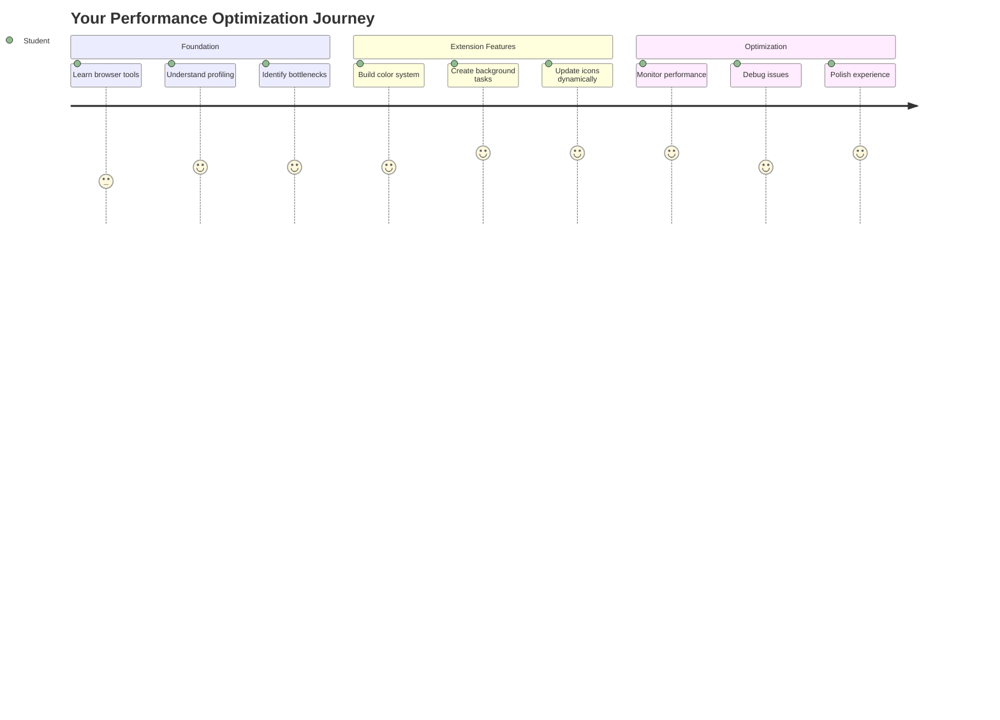
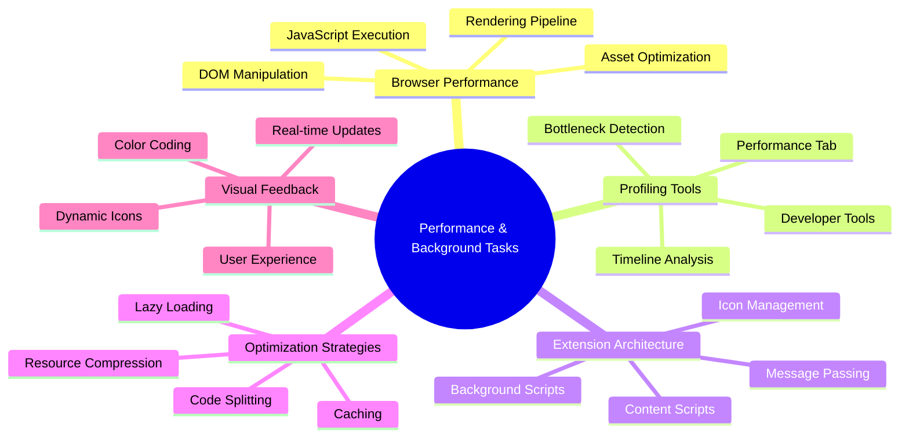
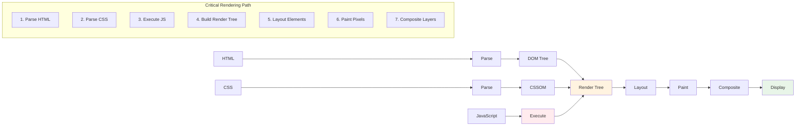
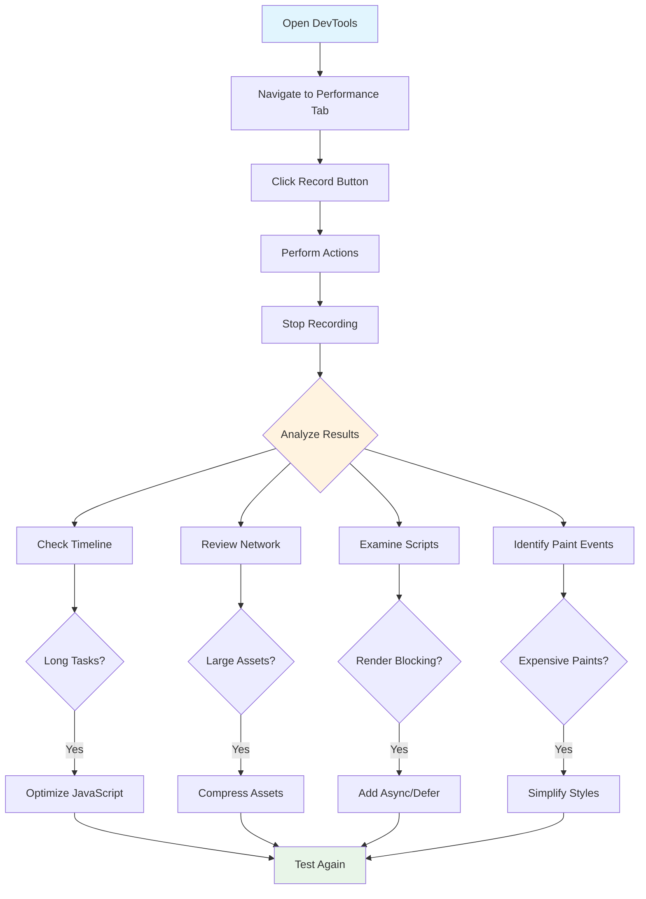
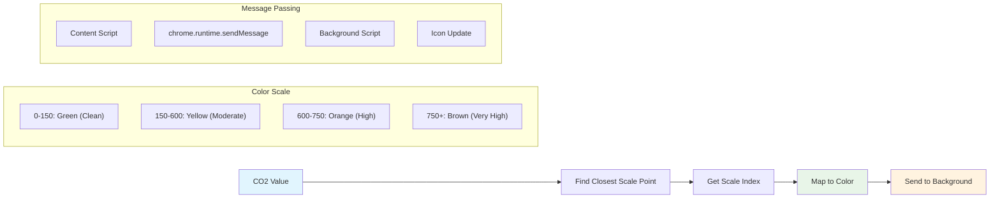
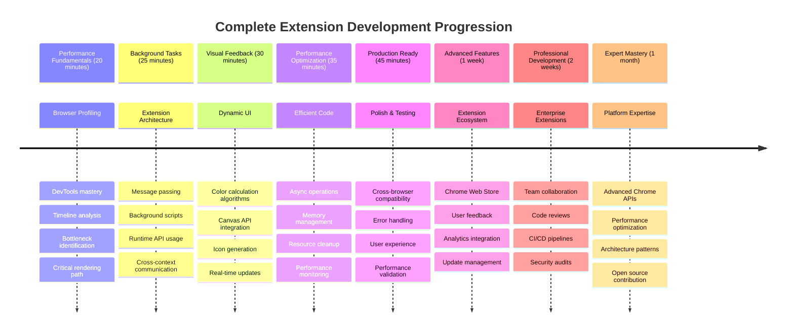

```mermaid
architecture-beta
    group browser(logos:chrome)[Browser]
    
    service popup(logos:html5)[Popup UI] in browser
    service content(logos:javascript)[Content Script] in browser
    service background(database)[Background Script] in browser
    service api(logos:api)[External API] in browser
    
    popup:R -- L:content
    content:R -- L:background
    background:T -- B:api
    content:T -- B:api
    
    junction junctionCenter in browser
    popup:R -- L:junctionCenter
    junctionCenter:R -- L:background
```

<!--
CO_OP_TRANSLATOR_METADATA:
{
  "original_hash": "b275fed2c6fc90d2b9b6661a3225faa2",
  "translation_date": "2025-11-03T15:04:54+00:00",
  "source_file": "5-browser-extension/3-background-tasks-and-performance/README.md",
  "language_code": "mr"
}
-->
# ब्राउझर विस्तार प्रकल्प भाग 3: पार्श्वभूमी कार्ये आणि कार्यक्षमता जाणून घ्या



कधी विचार केला आहे का की काही ब्राउझर विस्तार जलद आणि प्रतिसादात्मक का वाटतात तर काही मंद वाटतात? यामागचे रहस्य पडद्यामागे काय चालले आहे यामध्ये आहे. जेव्हा वापरकर्ते तुमच्या विस्ताराच्या इंटरफेसवर क्लिक करतात, तेव्हा पार्श्वभूमी प्रक्रियांचा एक संपूर्ण जग डेटा मिळवणे, आयकॉन अपडेट्स आणि सिस्टम संसाधनांचे व्यवस्थापन शांतपणे करत असते.

हा ब्राउझर विस्तार मालिकेतील आमचा अंतिम धडा आहे आणि आम्ही तुमचा कार्बन फूटप्रिंट ट्रॅकर सुरळीतपणे कार्य करेल याची खात्री करणार आहोत. तुम्ही डायनॅमिक आयकॉन अपडेट्स जोडाल आणि कार्यक्षमता समस्या ओळखायला शिकाल, जेणेकरून त्या समस्या होण्याआधीच टाळता येतील. हे रेस कार ट्यून करण्यासारखे आहे - लहान सुधारणा सर्वकाही कसे चालते यामध्ये मोठा फरक करू शकतात.

जेव्हा आपण पूर्ण करू, तेव्हा तुमच्याकडे एक परिपूर्ण विस्तार असेल आणि चांगल्या वेब अॅप्स आणि उत्कृष्ट वेब अॅप्समधील कार्यक्षमता तत्त्वे समजतील. चला ब्राउझर ऑप्टिमायझेशनच्या जगात डुबकी मारूया.

## पूर्व-व्याख्यान प्रश्नमंजुषा

[पूर्व-व्याख्यान प्रश्नमंजुषा](https://ff-quizzes.netlify.app/web/quiz/27)

### परिचय

आमच्या मागील धड्यांमध्ये, तुम्ही एक फॉर्म तयार केला, API शी जोडले आणि असिंक्रोनस डेटा मिळवण्याचा सामना केला. तुमचा विस्तार चांगल्या प्रकारे आकार घेत आहे.

आता आपल्याला अंतिम टच जोडायचे आहेत - जसे की कार्बन डेटावर आधारित विस्तार आयकॉनचे रंग बदलणे. हे मला आठवण करून देते की NASA ला अपोलो अंतराळयानावर प्रत्येक प्रणाली ऑप्टिमाइझ करावी लागली. त्यांना कोणतेही वाया जाणारे सायकल किंवा मेमरी परवडत नव्हते कारण कार्यक्षमता महत्त्वाची होती. जरी आपला ब्राउझर विस्तार तितका गंभीर नाही, तरीही त्याच तत्त्वे लागू होतात - कार्यक्षम कोड चांगले वापरकर्ता अनुभव तयार करतो.



## वेब कार्यक्षमता मूलभूत गोष्टी

जेव्हा तुमचा कोड कार्यक्षमतेने चालतो, तेव्हा लोकांना प्रत्यक्षात *फरक* जाणवतो. तुम्हाला माहित आहे का तो क्षण जेव्हा एखादी पृष्ठ झटकन लोड होते किंवा अॅनिमेशन सहजतेने चालते? ती चांगली कार्यक्षमता आहे.

कार्यक्षमता केवळ वेगाबद्दल नाही - ती वेब अनुभवांना नैसर्गिक वाटण्याबद्दल आहे, क्लंकी आणि निराशाजनक वाटण्याऐवजी. संगणकाच्या सुरुवातीच्या काळात, ग्रेस हॉपरने तिच्या डेस्कवर एक नॅनोसेकंद (सुमारे एक फूट लांब वायरचा तुकडा) ठेवला होता, ज्यामुळे प्रकाश एका सेकंदाच्या एक अब्जव्या भागात किती अंतर प्रवास करतो हे दाखवले. संगणनात प्रत्येक मायक्रोसेकंद का महत्त्वाचा आहे हे स्पष्ट करण्याचा तिचा मार्ग होता. चला शोध साधनांचा शोध घेऊया जे तुम्हाला गोष्टी मंदावण्याचे कारण शोधण्यात मदत करतात.

> "वेबसाइट कार्यक्षमता दोन गोष्टींवर आधारित आहे: पृष्ठ किती वेगाने लोड होते आणि त्यावरील कोड किती वेगाने चालतो." -- [Zack Grossbart](https://www.smashingmagazine.com/2012/06/javascript-profiling-chrome-developer-tools/)

तुमची वेबसाइट्स सर्व प्रकारच्या उपकरणांवर, सर्व प्रकारच्या वापरकर्त्यांसाठी, सर्व प्रकारच्या परिस्थितीत झपाट्याने कशी चालवायची याचा विषय, आश्चर्यकारकपणे विस्तृत आहे. येथे काही मुद्दे आहेत जे तुम्ही मानक वेब प्रकल्प किंवा ब्राउझर विस्तार तयार करताना लक्षात ठेवले पाहिजेत.

तुमच्या साइटला ऑप्टिमाइझ करण्याचा पहिला टप्पा म्हणजे प्रत्यक्षात काय चालले आहे ते समजून घेणे. सुदैवाने, तुमच्या ब्राउझरमध्ये शक्तिशाली शोध साधने अंगभूत आहेत.



Edge मध्ये Developer Tools उघडण्यासाठी, वरच्या उजव्या कोपऱ्यातील तीन डॉट्सवर क्लिक करा, नंतर More Tools > Developer Tools वर जा. किंवा कीबोर्ड शॉर्टकट वापरा: Windows वर `Ctrl` + `Shift` + `I` किंवा Mac वर `Option` + `Command` + `I`. एकदा तुम्ही तिथे पोहोचलात की, Performance टॅबवर क्लिक करा - येथे तुम्ही तुमची तपासणी कराल.

**तुमचे कार्यक्षमता शोध साधन:**
- **उघडा** Developer Tools (तुम्ही हे सतत वापरणार आहात!)
- **जा** Performance टॅबवर - तुमच्या वेब अॅपचा फिटनेस ट्रॅकर समजा
- **दाबा** Record बटण आणि तुमच्या पृष्ठाला क्रियेत पहा
- **अभ्यास करा** परिणाम जे गोष्टी मंदावण्याचे कारण शोधण्यात मदत करतील

चला हे करून पाहूया. एखादी वेबसाइट उघडा (Microsoft.com चांगली काम करते) आणि 'Record' बटणावर क्लिक करा. आता पृष्ठ रीफ्रेश करा आणि प्रोफाइलरने काय होते ते कॅप्चर करताना पहा. जेव्हा तुम्ही रेकॉर्डिंग थांबवाल, तेव्हा तुम्हाला ब्राउझर 'स्क्रिप्ट्स', 'रेंडर्स', आणि 'पेंट्स' साइट कशी करते याचे तपशीलवार विहंगावलोकन दिसेल. हे मला रॉकेट लॉन्च दरम्यान मिशन कंट्रोल प्रत्येक प्रणालीचे निरीक्षण कसे करते याची आठवण करून देते - तुम्हाला नेमके काय आणि कधी घडते याचे रिअल-टाइम डेटा मिळतो.


✅ [Microsoft Documentation](https://docs.microsoft.com/microsoft-edge/devtools-guide/performance/?WT.mc_id=academic-77807-sagibbon) मध्ये अधिक तपशील आहेत जर तुम्हाला अधिक खोलवर जाण्याची इच्छा असेल

> प्रो टिप: चाचणी करण्यापूर्वी तुमचा ब्राउझर कॅशे साफ करा जेणेकरून तुमची साइट प्रथमच भेट देणाऱ्या वापरकर्त्यांसाठी कशी कार्य करते ते पाहता येईल - हे पुनरावृत्ती भेटींपेक्षा वेगळे असते!

प्रोफाइल टाइमलाइनमधील घटक निवडा जेणेकरून तुमच्या पृष्ठ लोड होत असताना घडणाऱ्या घटनांवर झूम करता येईल.

प्रोफाइल टाइमलाइनचा एक भाग निवडून आणि सारांश पॅन पाहून तुमच्या पृष्ठाच्या कार्यक्षमतेचा स्नॅपशॉट मिळवा:


इव्हेंट लॉग पॅन तपासा की कोणत्याही इव्हेंटला 15 ms पेक्षा जास्त वेळ लागला आहे का:


✅ तुमच्या प्रोफाइलरला ओळखा! या साइटवर Developer Tools उघडा आणि कोणतेही अडथळे आहेत का ते पहा. सर्वात मंद लोड होणारा घटक कोणता आहे? सर्वात जलद कोणता आहे?



## प्रोफाइलिंग करताना काय शोधावे

प्रोफाइलर चालवणे ही फक्त सुरुवात आहे - खरी कौशल्य म्हणजे त्या रंगीत चार्ट्स तुम्हाला काय सांगत आहेत ते समजून घेणे. काळजी करू नका, तुम्हाला ते वाचण्याची सवय होईल. अनुभवी विकसकांना पूर्ण-फुललेल्या समस्यांमध्ये बदलण्यापूर्वी चेतावणी चिन्हे ओळखण्याची सवय असते.

चला सामान्य संशयितांबद्दल बोलूया - कार्यक्षमता अडचणी ज्या वेब प्रकल्पांमध्ये घुसण्याची प्रवृत्ती असते. जसे मेरी क्युरीला तिच्या प्रयोगशाळेत रेडिएशन पातळी काळजीपूर्वक निरीक्षण करावी लागली, तसे आपल्याला काही नमुन्यांसाठी लक्ष ठेवावे लागते जे अडचणी निर्माण होण्याचे संकेत देतात. हे लवकर पकडल्याने तुम्हाला (आणि तुमच्या वापरकर्त्यांना) खूप निराशा वाचवेल.

**असेट आकार**: वेबसाइट्स वर्षानुवर्षे "जड" होत आहेत, आणि त्या अतिरिक्त वजनाचा मोठा भाग प्रतिमांमुळे आहे. जणू आपण आपल्या डिजिटल सूटकेसमध्ये अधिकाधिक भरत आहोत.

✅ [Internet Archive](https://httparchive.org/reports/page-weight) तपासा जे पृष्ठ आकार कसे वाढले आहेत ते दाखवते - हे खूप उघड करणारे आहे.

**तुमच्या असेट्स ऑप्टिमाइझ कसे ठेवायचे:**
- **कॉम्प्रेस करा** त्या प्रतिमा! WebP सारख्या आधुनिक स्वरूपात फाइल आकार मोठ्या प्रमाणात कमी होऊ शकतो
- **योग्य प्रतिमा आकार** प्रत्येक उपकरणासाठी पाठवा - फोनवर मोठ्या डेस्कटॉप प्रतिमा पाठवण्याची गरज नाही
- **मिनिफाय करा** तुमचे CSS आणि JavaScript - प्रत्येक बाइट महत्त्वाचा आहे
- **लेझी लोडिंग वापरा** जेणेकरून प्रतिमा फक्त वापरकर्ते प्रत्यक्षात स्क्रोल केल्यावर डाउनलोड होतात

**DOM ट्रॅव्हर्सल्स**: ब्राउझरला तुमच्या कोडवर आधारित त्याचा Document Object Model तयार करावा लागतो, त्यामुळे चांगल्या पृष्ठ कार्यक्षमतेसाठी तुमचे टॅग्स कमी ठेवणे, पृष्ठाला आवश्यक असलेलेच वापरणे आणि स्टाइल करणे महत्त्वाचे आहे. या मुद्द्याला, पृष्ठाशी संबंधित अतिरिक्त CSS ऑप्टिमाइझ केले जाऊ शकते; ज्या शैली एका पृष्ठावर वापरल्या जाण्याची आवश्यकता आहे त्या मुख्य शैली पत्रकात समाविष्ट करण्याची आवश्यकता नाही, उदाहरणार्थ.

**DOM ऑप्टिमायझेशनसाठी मुख्य रणनीती:**
- **HTML घटकांची संख्या आणि नेस्टिंग स्तर कमी करा**
- **अवांछित CSS नियम काढून टाका आणि शैली पत्रके कार्यक्षमतेने एकत्र करा**
- **प्रत्येक पृष्ठासाठी आवश्यक असलेले CSS लोड करा**
- **ब्राउझर पार्सिंगसाठी HTML संरचना अर्थपूर्ण ठेवा**

**JavaScript**: प्रत्येक JavaScript विकसकाने 'रेंडर-ब्लॉकिंग' स्क्रिप्ट्ससाठी लक्ष ठेवले पाहिजे ज्यांना DOM ट्रॅव्हर्सल आणि ब्राउझरवर पेंटिंग करण्यापूर्वी लोड करणे आवश्यक आहे. तुमच्या इनलाइन स्क्रिप्ट्ससह `defer` वापरण्याचा विचार करा (जसे की Terrarium मॉड्यूलमध्ये केले जाते).

**आधुनिक JavaScript ऑप्टिमायझेशन तंत्र:**
- **`defer` गुणधर्म वापरा** DOM पार्सिंगनंतर स्क्रिप्ट्स लोड करण्यासाठी
- **कोड स्प्लिटिंग अंमलात आणा** फक्त आवश्यक JavaScript लोड करण्यासाठी
- **नॉन-क्रिटिकल फंक्शनॅलिटीसाठी लेझी लोडिंग लागू करा**
- **जड लायब्ररी आणि फ्रेमवर्कचा वापर शक्य असल्यास कमी करा**

✅ साइट कार्यक्षमतेबद्दल सामान्य तपासणी शिकण्यासाठी [Site Speed Test website](https://www.webpagetest.org/) वर काही साइट्स वापरून पहा.

### 🔄 **शैक्षणिक तपासणी**
**कार्यक्षमता समजून घेणे**: विस्तार वैशिष्ट्ये तयार करण्यापूर्वी, खात्री करा की तुम्ही करू शकता:
- ✅ HTML ते पिक्सलपर्यंतच्या महत्त्वाच्या रेंडरिंग पथाचे स्पष्टीकरण द्या
- ✅ वेब अनुप्रयोगांमधील सामान्य कार्यक्षमता अडथळे ओळखा
- ✅ ब्राउझर डेव्हलपर टूल्स वापरून पृष्ठ कार्यक्षमता प्रोफाइल करा
- ✅ असेट आकार आणि DOM जटिलतेचा वेगावर होणारा परिणाम समजून घ्या

**जलद स्व-परीक्षण**: रेंडर-ब्लॉकिंग JavaScript असल्यास काय होते?
*उत्तर: ब्राउझरला स्क्रिप्ट डाउनलोड आणि अंमलात आणावी लागते, त्यानंतरच HTML पार्सिंग आणि पृष्ठ रेंडरिंग सुरू ठेवता येते*

**वास्तविक-जागतिक कार्यक्षमता परिणाम**:
- **100ms विलंब**: वापरकर्त्यांना मंदी जाणवते
- **1 सेकंद विलंब**: वापरकर्ते लक्ष केंद्रित करणे सोडतात
- **3+ सेकंद**: 40% वापरकर्ते पृष्ठ सोडून जातात
- **मोबाइल नेटवर्क्स**: कार्यक्षमता अधिक महत्त्वाची आहे

आता तुम्हाला ब्राउझर तुमच्याकडून पाठवलेल्या असेट्स कसे रेंडर करतो याची कल्पना आहे, चला तुमचा विस्तार पूर्ण करण्यासाठी तुम्हाला करायच्या शेवटच्या काही गोष्टी पाहूया:

### रंग गणना करण्यासाठी फंक्शन तयार करा

आता आपण एक फंक्शन तयार करू जे संख्यात्मक डेटा अर्थपूर्ण रंगांमध्ये बदलते. याचा विचार ट्रॅफिक लाइट सिस्टमसारखा करा - स्वच्छ ऊर्जेसाठी हिरवा, उच्च कार्बन तीव्रतेसाठी लाल.

हे फंक्शन आमच्या API मधून CO2 डेटा घेईल आणि पर्यावरणीय परिणामाचे सर्वोत्तम प्रतिनिधित्व करणारा रंग ठरवेल. हे वैज्ञानिक उष्णता नकाशांमध्ये जटिल डेटा नमुने व्हिज्युअलाइझ करण्यासाठी रंग-कोडिंग कसे वापरतात यासारखे आहे - महासागर तापमानापासून ते तारा निर्मितीपर्यंत. चला हे `/src/index.js` मध्ये जोडूया, ज्या `const` व्हेरिएबल्स आम्ही आधी सेट केले होते त्यानंतर:



```javascript
function calculateColor(value) {
	// Define CO2 intensity scale (grams per kWh)
	const co2Scale = [0, 150, 600, 750, 800];
	// Corresponding colors from green (clean) to dark brown (high carbon)
	const colors = ['#2AA364', '#F5EB4D', '#9E4229', '#381D02', '#381D02'];

	// Find the closest scale value to our input
	const closestNum = co2Scale.sort((a, b) => {
		return Math.abs(a - value) - Math.abs(b - value);
	})[0];
	
	console.log(`${value} is closest to ${closestNum}`);
	
	// Find the index for color mapping
	const num = (element) => element > closestNum;
	const scaleIndex = co2Scale.findIndex(num);

	const closestColor = colors[scaleIndex];
	console.log(scaleIndex, closestColor);

	// Send color update message to background script
	chrome.runtime.sendMessage({ action: 'updateIcon', value: { color: closestColor } });
}
```

**चला या हुशार लहान फंक्शनचे विश्लेषण करूया:**
- **दोन अ‍ॅरे सेट करते** - एक CO2 स्तरांसाठी, दुसरा रंगांसाठी (हिरवा = स्वच्छ, तपकिरी = घाणेरडा!)
- **आमच्या वास्तविक CO2 मूल्याशी सर्वात जवळचा जुळणारा शोधतो** काही छान अ‍ॅरे सॉर्टिंग वापरून
- **findIndex() पद्धतीचा वापर करून जुळणारा रंग मिळवतो**
- **आमच्या निवडलेल्या रंगासह Chrome च्या पार्श्वभूमी स्क्रिप्टला संदेश पाठवतो**
- **स्वच्छ स्ट्रिंग स्वरूपनासाठी टेम्पलेट लिटरल्स (त्या बॅकटिक्स) वापरतो**
- **सर्वकाही const घोषणांसह व्यवस्थित ठेवतो**

`chrome.runtime` [API](https://developer.chrome.com/extensions/runtime) तुमच्या विस्ताराचा मज्जासंस्था आहे - ते सर्व पडद्यामागील संवाद आणि कार्ये हाताळते:

> "chrome.runtime API वापरून पार्श्वभूमी पृष्ठ मिळवा, मॅनिफेस्टबद्दल तपशील परत करा आणि अॅप किंवा विस्तार जीवनचक्रातील घटनांसाठी ऐका आणि प्रतिसाद द्या. तुम्ही URL च्या सापेक्ष पथांना पूर्णपणे-योग्य URL मध्ये रूपांतरित करण्यासाठी देखील हे API वापरू शकता."

**Chrome Runtime API का उपयुक्त आहे:**
- **तुमच्या विस्ताराच्या वेगवेगळ्या भागांना एकमेकांशी संवाद साधू देते**
- **पार्श्वभूमी कामे वापरकर्ता इंटरफेस गोठवण्याशिवाय हाताळते**
- **तुमच्या विस्ताराच्या जीवनचक्रातील घटनांचे व्यवस्थापन करते**
- **स्क्रिप्ट्समधील संदेश पासिंग खूप सोपे करते**

✅ जर तुम्ही Edge साठी हा ब्राउझर विस्तार विकसित करत असाल, तर तुम्हाला आश्चर्य वाटेल की तुम्ही chrome API वापरत आहात. Edge ब्राउझरच्या नवीन आवृत्त्या Chromium ब्राउझर इंजिनवर चालतात, त्यामुळे तुम्ही या साधनांचा लाभ घेऊ शकता.



> **प्रो टिप**: जर तुम्हाला ब्राउझर विस्तार प्रोफाइल करायचा असेल, तर विस्ताराच्या आतून Developer Tools लॉन्च करा, कारण ते स्वतःचे स्वतंत्र ब्राउझर उदाहरण आहे. यामुळे तुम्हाला विस्तार-विशिष्ट कार्यक्षमता मेट्रिक्स मिळतात.

### डीफॉल्ट आयकॉन रंग सेट करा

आम्ही वास्तविक डेटा मिळवण्यास सुरुवात करण्यापूर्वी, चला आमच्या विस्ताराला सुरुवातीचा बिंदू देऊया. कोणीही रिकाम्या किंवा तुटलेल्या दिसणाऱ्या आयकॉनकडे पाहायला आवडत नाही. आम्ही हिरव्या रंगाने सुरुवात करू जेणेकरून वापरकर्त्यांना विस्तार स्थापित केल्याच्या क्षणापासून कार्यरत असल्याचे कळेल.

तुमच्या `init()` फंक्शनमध्ये, चला तो डीफॉल्ट हिरवा आयकॉन सेट करूया:

```javascript
chrome.runtime.sendMessage({
	action: 'updateIcon',
	value: {
		color: 'green',
	},
});
```

**या प्रारंभिक सेटअपने काय साध्य केले:**
- **तटस्थ हिरवा रंग डीफॉल्ट स्थिती म्हणून सेट करतो**
- **विस्तार लोड झाल्यावर त्वरित व्हिज्युअल फीडबॅक प्रदान करतो**
- **पार्श्वभूमी स्क्रिप्टसह संवाद पद्धती स्थापित करतो**
- **डेटा लोड होण्यापूर्वी वाप
- ✅ Chrome Runtime API विस्तार आर्किटेक्चरमध्ये कोणती भूमिका बजावते?
- ✅ रंग गणना अल्गोरिदम डेटा दृश्य प्रतिसादाशी कसा जोडतो?

**कामगिरी विचार**: तुमचा विस्तार आता दाखवतो:
- **प्रभावी संदेशवहन**: स्क्रिप्ट संदर्भांमध्ये स्वच्छ संवाद
- **ऑप्टिमाइझ केलेले रेंडरिंग**: OffscreenCanvas UI ब्लॉकिंग टाळतो
- **रिअल-टाइम अपडेट्स**: थेट डेटावर आधारित डायनॅमिक आयकॉन बदल
- **मेमरी व्यवस्थापन**: योग्य साफसफाई आणि संसाधन हाताळणी

**तुमचा विस्तार तपासण्याची वेळ आली आहे:**
- **Build** सर्वकाही `npm run build` वापरून तयार करा
- **Reload** तुमचा विस्तार ब्राउझरमध्ये पुन्हा लोड करा (हा टप्पा विसरू नका)
- **Open** तुमचा विस्तार उघडा आणि आयकॉन रंग बदलताना पहा
- **Check** तो जगभरातील वास्तविक कार्बन डेटावर कसा प्रतिसाद देतो

आता तुम्हाला एका नजरेत कळेल की कपडे धुण्यासाठी योग्य वेळ आहे की स्वच्छ ऊर्जा येईपर्यंत थांबावे. तुम्ही काहीतरी खरोखर उपयुक्त तयार केले आहे आणि ब्राउझरच्या कामगिरीबद्दल शिकले आहात.

## GitHub Copilot Agent Challenge 🚀

Agent मोड वापरून खालील आव्हान पूर्ण करा:

**वर्णन:** ब्राउझर विस्ताराच्या कामगिरी निरीक्षण क्षमता वाढवण्यासाठी एक फिचर जोडा जे विस्ताराच्या विविध घटकांचे लोड वेळ ट्रॅक करते आणि प्रदर्शित करते.

**सूचना:** ब्राउझर विस्तारासाठी एक कामगिरी निरीक्षण प्रणाली तयार करा जी API मधून CO2 डेटा मिळविण्यासाठी, रंगांची गणना करण्यासाठी आणि आयकॉन अपडेट करण्यासाठी लागणारा वेळ मोजते आणि ब्राउझर कन्सोलमध्ये टाइमस्टॅम्प आणि कालावधी मेट्रिक्ससह परिणाम दाखवते. `performanceTracker` नावाची एक फंक्शन जोडा जी Performance API वापरते.

[agent mode बद्दल अधिक जाणून घ्या](https://code.visualstudio.com/blogs/2025/02/24/introducing-copilot-agent-mode) येथे.

## 🚀 Challenge

येथे एक मनोरंजक गुप्तहेर मिशन आहे: काही ओपन सोर्स वेबसाइट्स निवडा ज्या अनेक वर्षांपासून अस्तित्वात आहेत (जसे Wikipedia, GitHub, किंवा Stack Overflow) आणि त्यांच्या कमिट इतिहासाचा शोध घ्या. तुम्हाला कुठे कामगिरी सुधारणा केल्या आहेत हे दिसते का? कोणती समस्या वारंवार येत राहते?

**तुमचा तपास करण्याचा दृष्टिकोन:**
- **Search** कमिट संदेशांमध्ये "optimize," "performance," किंवा "faster" सारख्या शब्दांचा शोध घ्या
- **Look** नमुने शोधा - ते सतत त्याच प्रकारच्या समस्यांचे निराकरण करत आहेत का?
- **Identify** वेबसाइट्स धीम्या होण्याचे सामान्य कारण शोधा
- **Share** तुम्ही काय शोधले - इतर विकसकांना वास्तविक उदाहरणांमधून शिकायला मिळेल

## Post-Lecture Quiz

[Post-lecture quiz](https://ff-quizzes.netlify.app/web/quiz/28)

## Review & Self Study

[performance newsletter](https://perf.email/) साठी साइन अप करण्याचा विचार करा.

ब्राउझर त्यांच्या वेब कामगिरीचे मोजमाप कसे करतात याचा अभ्यास करण्यासाठी त्यांच्या वेब टूल्समधील कामगिरी टॅब पाहा. तुम्हाला काही मोठे फरक आढळतात का?

### ⚡ **पुढील 5 मिनिटांत तुम्ही काय करू शकता**
- [ ] ब्राउझर Task Manager (Chrome मध्ये Shift+Esc) उघडा आणि विस्तार संसाधन वापर पहा
- [ ] DevTools Performance टॅब वापरून वेबपेज कामगिरी रेकॉर्ड आणि विश्लेषण करा
- [ ] ब्राउझरच्या Extensions पृष्ठावर जा आणि कोणते विस्तार स्टार्टअप वेळेवर परिणाम करतात ते पहा
- [ ] तात्पुरते विस्तार अक्षम करून कामगिरीतील फरक पहा

### 🎯 **तुम्ही एका तासात काय साध्य करू शकता**
- [ ] पोस्ट-लेसन क्विझ पूर्ण करा आणि कामगिरी संकल्पना समजून घ्या
- [ ] तुमच्या ब्राउझर विस्तारासाठी एक बॅकग्राउंड स्क्रिप्ट लागू करा
- [ ] ब्राउझर.alarms वापरून कार्यक्षम बॅकग्राउंड कार्ये शिकून घ्या
- [ ] कंटेंट स्क्रिप्ट्स आणि बॅकग्राउंड स्क्रिप्ट्स दरम्यान संदेश पासिंगचा सराव करा
- [ ] तुमच्या विस्ताराचा संसाधन वापर मोजा आणि ऑप्टिमाइझ करा

### 📅 **तुमचा आठवडाभराचा कामगिरी प्रवास**
- [ ] बॅकग्राउंड फंक्शनॅलिटीसह उच्च-कार्यक्षम ब्राउझर विस्तार पूर्ण करा
- [ ] सर्व्हिस वर्कर्स आणि आधुनिक विस्तार आर्किटेक्चरमध्ये प्रावीण्य मिळवा
- [ ] कार्यक्षम डेटा सिंक्रोनायझेशन आणि कॅशिंग रणनीती लागू करा
- [ ] विस्तार कामगिरीसाठी प्रगत डीबगिंग तंत्रे शिका
- [ ] तुमच्या विस्तारासाठी कार्यक्षमता आणि संसाधन कार्यक्षमतेसाठी ऑप्टिमाइझ करा
- [ ] विस्तार कामगिरी परिस्थितींसाठी व्यापक चाचण्या तयार करा

### 🌟 **तुमचा महिनाभराचा ऑप्टिमायझेशन मास्टरी**
- [ ] ऑप्टिमल कामगिरीसह एंटरप्राइज-ग्रेड ब्राउझर विस्तार तयार करा
- [ ] Web Workers, Service Workers, आणि आधुनिक वेब कामगिरीबद्दल शिका
- [ ] कामगिरी ऑप्टिमायझेशनवर लक्ष केंद्रित करणाऱ्या ओपन सोर्स प्रकल्पांमध्ये योगदान द्या
- [ ] ब्राउझर अंतर्गत आणि प्रगत डीबगिंग तंत्रे मास्टर करा
- [ ] कामगिरी निरीक्षण साधने आणि सर्वोत्तम पद्धती मार्गदर्शक तयार करा
- [ ] वेब अनुप्रयोग ऑप्टिमाइझ करण्यात मदत करणारे कामगिरी तज्ञ बना

## 🎯 तुमचा ब्राउझर विस्तार मास्टरी टाइमलाइन



### 🛠️ तुमचे संपूर्ण विस्तार विकास साधनसंच

या त्रयी पूर्ण केल्यानंतर, तुम्ही मास्टर केले आहे:
- **ब्राउझर आर्किटेक्चर**: ब्राउझर प्रणालींसह विस्तार कसे समाकलित करतात याचे सखोल ज्ञान
- **कामगिरी प्रोफाइलिंग**: विकसक साधने वापरून बॉटलनेक्स ओळखणे आणि निराकरण करणे
- **Async प्रोग्रामिंग**: प्रतिसादक्षम, नॉन-ब्लॉकिंग ऑपरेशन्ससाठी आधुनिक JavaScript पॅटर्न
- **API एकत्रीकरण**: प्रमाणीकरण आणि त्रुटी हाताळणीसह बाह्य डेटा मिळवणे
- **व्हिज्युअल डिझाइन**: डायनॅमिक UI अपडेट्स आणि Canvas-आधारित ग्राफिक्स निर्मिती
- **Message Passing**: विस्तार आर्किटेक्चरमध्ये इंटर-स्क्रिप्ट संवाद
- **User Experience**: लोडिंग स्टेट्स, त्रुटी हाताळणी, आणि अंतर्ज्ञानी संवाद
- **Production Skills**: वास्तविक-जगातील तैनातीसाठी चाचणी, डीबगिंग, आणि ऑप्टिमायझेशन

**वास्तविक-जगातील अनुप्रयोग**: तुमचे विस्तार विकास कौशल्य थेट लागू होते:
- **Progressive Web Apps**: समान आर्किटेक्चर आणि कामगिरी नमुने
- **Electron Desktop Apps**: वेब तंत्रज्ञान वापरून क्रॉस-प्लॅटफॉर्म अनुप्रयोग
- **Mobile Hybrid Apps**: Cordova/PhoneGap वापरून वेब API विकास
- **Enterprise Web Applications**: जटिल डॅशबोर्ड आणि उत्पादकता साधने
- **Chrome DevTools Extensions**: प्रगत विकसक साधने आणि डीबगिंग
- **Web API Integration**: बाह्य सेवांशी संवाद साधणारे कोणतेही अनुप्रयोग

**व्यावसायिक प्रभाव**: तुम्ही आता:
- **Build** संकल्पनेपासून तैनातीपर्यंत उत्पादन-तयार ब्राउझर विस्तार तयार करू शकता
- **Optimize** वेब अनुप्रयोग कामगिरी उद्योग-मानक प्रोफाइलिंग साधने वापरून
- **Architect** योग्य चिंता विभाजनासह स्केलेबल प्रणाली
- **Debug** जटिल async ऑपरेशन्स आणि क्रॉस-कॉन्टेक्स्ट संवाद
- **Contribute** ओपन सोर्स विस्तार प्रकल्प आणि ब्राउझर मानकांमध्ये योगदान द्या

**पुढील स्तर संधी**:
- **Chrome Web Store Developer**: लाखो वापरकर्त्यांसाठी विस्तार प्रकाशित करा
- **Web Performance Engineer**: ऑप्टिमायझेशन आणि वापरकर्ता अनुभवात विशेष प्रावीण्य मिळवा
- **Browser Platform Developer**: ब्राउझर इंजिन विकासात योगदान द्या
- **Extension Framework Creator**: इतर विकसकांना मदत करणारी साधने तयार करा
- **Developer Relations**: शिक्षण आणि सामग्री निर्मितीद्वारे ज्ञान सामायिक करा

🌟 **Achievement Unlocked**: तुम्ही एक संपूर्ण, कार्यक्षम ब्राउझर विस्तार तयार केला आहे जो व्यावसायिक विकास पद्धती आणि आधुनिक वेब मानकांचे प्रदर्शन करतो!

## Assignment

[Analyze a site for performance](assignment.md)

---

**अस्वीकरण**:  
हा दस्तऐवज AI भाषांतर सेवा [Co-op Translator](https://github.com/Azure/co-op-translator) वापरून भाषांतरित करण्यात आला आहे. आम्ही अचूकतेसाठी प्रयत्नशील असलो तरी, कृपयास लक्षात ठेवा की स्वयंचलित भाषांतरे त्रुटी किंवा अचूकतेच्या अभावाने युक्त असू शकतात. मूळ भाषेतील दस्तऐवज हा अधिकृत स्रोत मानला जावा. महत्त्वाच्या माहितीसाठी, व्यावसायिक मानवी भाषांतराची शिफारस केली जाते. या भाषांतराचा वापर करून उद्भवलेल्या कोणत्याही गैरसमज किंवा चुकीच्या अर्थासाठी आम्ही जबाबदार नाही.