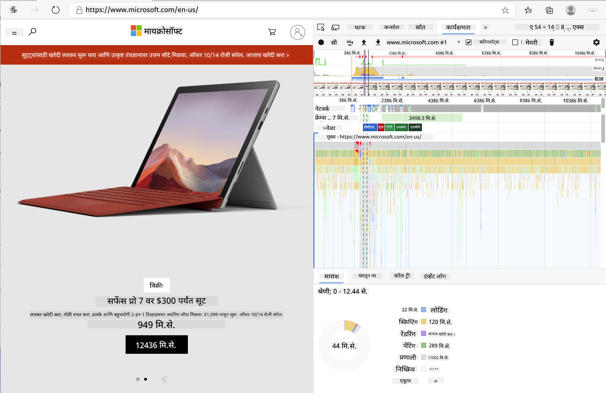
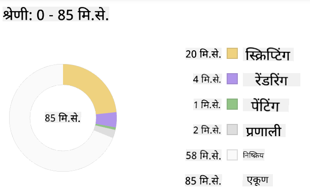
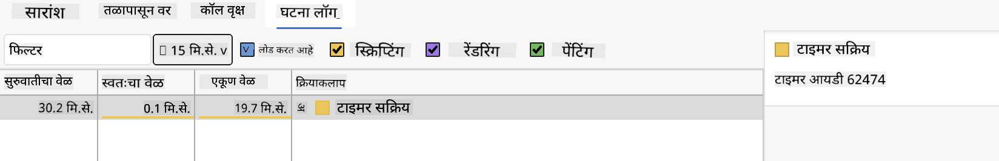

<!--
CO_OP_TRANSLATOR_METADATA:
{
  "original_hash": "640d7f35d57f0e02bbfe468bb0247741",
  "translation_date": "2025-10-20T21:28:55+00:00",
  "source_file": "5-browser-extension/3-background-tasks-and-performance/README.md",
  "language_code": "mr"
}
-->
# ब्राउझर एक्स्टेंशन प्रोजेक्ट भाग 3: बॅकग्राउंड टास्क आणि कार्यक्षमता जाणून घ्या

## प्री-लेक्चर क्विझ

[प्री-लेक्चर क्विझ](https://ff-quizzes.netlify.app/web/quiz/27)

### परिचय

या मॉड्यूलच्या मागील दोन धड्यांमध्ये, तुम्ही API मधून डेटा मिळवण्यासाठी फॉर्म आणि डिस्प्ले एरिया कसा तयार करायचा ते शिकले. वेबवर वेब उपस्थिती तयार करण्याचा हा एक अतिशय सामान्य मार्ग आहे. तुम्ही डेटा असिंक्रोनसरी कसा मिळवायचा हे देखील शिकले. तुमचे ब्राउझर एक्स्टेंशन जवळजवळ पूर्ण झाले आहे.

आता काही बॅकग्राउंड टास्क व्यवस्थापित करणे बाकी आहे, ज्यामध्ये एक्स्टेंशनच्या आयकॉनचा रंग रीफ्रेश करणे समाविष्ट आहे, त्यामुळे ब्राउझर अशा प्रकारच्या कार्याचे व्यवस्थापन कसे करते याबद्दल बोलण्याची ही एक उत्तम वेळ आहे. वेब अॅसेट्स तयार करताना कार्यक्षमतेच्या संदर्भात या ब्राउझर टास्कचा विचार करूया.

## वेब कार्यक्षमता मूलभूत गोष्टी

> "वेबसाइट कार्यक्षमता दोन गोष्टींविषयी आहे: पृष्ठ किती वेगाने लोड होते आणि त्यावरील कोड किती वेगाने चालतो." -- [Zack Grossbart](https://www.smashingmagazine.com/2012/06/javascript-profiling-chrome-developer-tools/)

तुमच्या वेबसाइट्सना सर्व प्रकारच्या डिव्हाइसवर, सर्व प्रकारच्या वापरकर्त्यांसाठी, सर्व प्रकारच्या परिस्थितीत वेगवान बनवण्याचा विषय आश्चर्यकारकपणे विस्तृत आहे. तुम्ही मानक वेब प्रोजेक्ट किंवा ब्राउझर एक्स्टेंशन तयार करत असताना लक्षात ठेवण्यासारखे काही मुद्दे येथे आहेत.

तुमची साइट कार्यक्षमतेने चालत आहे याची खात्री करण्यासाठी तुम्हाला सर्वप्रथम तिच्या कार्यक्षमतेबद्दल डेटा गोळा करणे आवश्यक आहे. हे करण्याचे पहिले ठिकाण तुमच्या वेब ब्राउझरचे डेव्हलपर टूल्स आहे. Edge मध्ये, तुम्ही "सेटिंग्ज आणि अधिक" बटण (ब्राउझरच्या वरच्या उजव्या बाजूला तीन बिंदूंचा आयकॉन) निवडू शकता, नंतर More Tools > Developer Tools वर जा आणि Performance टॅब उघडा. Windows वर `Ctrl` + `Shift` + `I` किंवा Mac वर `Option` + `Command` + `I` कीबोर्ड शॉर्टकट वापरून तुम्ही डेव्हलपर टूल्स उघडू शकता.

Performance टॅबमध्ये एक प्रोफाइलिंग टूल आहे. वेबसाइट उघडा (उदाहरणार्थ, [https://www.microsoft.com](https://www.microsoft.com/?WT.mc_id=academic-77807-sagibbon)) आणि 'Record' बटणावर क्लिक करा, नंतर साइट रीफ्रेश करा. रेकॉर्डिंग कधीही थांबवा आणि तुम्ही साइट 'स्क्रिप्ट', 'रेंडर' आणि 'पेंट' करण्यासाठी तयार केलेल्या रूटीन पाहू शकता:



✅ [Microsoft Documentation](https://docs.microsoft.com/microsoft-edge/devtools-guide/performance/?WT.mc_id=academic-77807-sagibbon) वर Edge मधील Performance पॅनेलबद्दल अधिक जाणून घ्या

> टिप: तुमच्या वेबसाइटच्या स्टार्टअप वेळेचे अचूक वाचन मिळवण्यासाठी, तुमच्या ब्राउझरचा कॅशे क्लिअर करा

तुमच्या पृष्ठ लोड होत असताना घडणाऱ्या घटनांवर झूम इन करण्यासाठी प्रोफाइल टाइमलाइनचे घटक निवडा.

प्रोफाइल टाइमलाइनचा एक भाग निवडून आणि सारांश पॅन पाहून तुमच्या पृष्ठाच्या कार्यक्षमतेचा स्नॅपशॉट मिळवा:



Event Log पॅन तपासा आणि पहा की कोणत्याही इव्हेंटला 15 ms पेक्षा जास्त वेळ लागला आहे का:



✅ तुमचा प्रोफाइलर ओळखा! या साइटवर डेव्हलपर टूल्स उघडा आणि पाहा की काही अडथळे आहेत का. सर्वात हळू-लोड होणारा अॅसेट कोणता आहे? सर्वात वेगवान कोणता आहे?

## प्रोफाइलिंग तपासणी

सामान्यतः, काही "समस्या क्षेत्रे" आहेत ज्यावर प्रत्येक वेब डेव्हलपरने साइट तयार करताना लक्ष ठेवले पाहिजे जेणेकरून उत्पादनात तैनात करताना अप्रिय आश्चर्य टाळता येईल.

**अॅसेट साइजेस**: वेब गेल्या काही वर्षांत 'जड' आणि त्यामुळे हळू झाला आहे. या वजनाचा काही भाग प्रतिमांच्या वापराशी संबंधित आहे.

✅ [Internet Archive](https://httparchive.org/reports/page-weight) पाहा आणि पृष्ठ वजनाचा ऐतिहासिक दृष्टिकोन आणि अधिक जाणून घ्या.

तुमच्या प्रतिमा ऑप्टिमाइझ केल्या आहेत आणि तुमच्या वापरकर्त्यांसाठी योग्य आकार आणि रिझोल्यूशनमध्ये वितरित केल्या आहेत याची खात्री करणे ही एक चांगली प्रथा आहे.

**DOM ट्रॅव्हर्सल्स**: ब्राउझरला तुमच्या कोडवर आधारित त्याचा Document Object Model तयार करावा लागतो, त्यामुळे चांगल्या पृष्ठ कार्यक्षमतेसाठी तुमचे टॅग्स कमीत कमी ठेवणे, पृष्ठाला आवश्यक असलेलेच वापरणे आणि शैली देणे आवश्यक आहे. या मुद्द्याच्या दृष्टीने, पृष्ठाशी संबंधित अतिरिक्त CSS ऑप्टिमाइझ केले जाऊ शकते; ज्या शैली केवळ एका पृष्ठावर वापरल्या जाणे आवश्यक आहेत त्या मुख्य शैली पत्रकात समाविष्ट करण्याची आवश्यकता नाही, उदाहरणार्थ.

**JavaScript**: प्रत्येक JavaScript डेव्हलपरने 'रेंडर-ब्लॉकिंग' स्क्रिप्ट्ससाठी लक्ष ठेवले पाहिजे ज्यांना DOM ट्रॅव्हर्स आणि ब्राउझरवर पेंट करण्यापूर्वी लोड करणे आवश्यक आहे. तुमच्या इनलाइन स्क्रिप्ट्ससह `defer` वापरण्याचा विचार करा (जसे की Terrarium मॉड्यूलमध्ये केले जाते).

✅ साइट कार्यक्षमतेचा निर्धार करण्यासाठी सामान्य तपासणीबद्दल अधिक जाणून घेण्यासाठी [Site Speed Test वेबसाइट](https://www.webpagetest.org/) वर काही साइट्स वापरून पहा.

आता तुम्हाला ब्राउझरने तुम्ही पाठवलेले अॅसेट्स कसे रेंडर केले याची कल्पना आहे, चला तुमचे एक्स्टेंशन पूर्ण करण्यासाठी तुम्हाला करायच्या शेवटच्या काही गोष्टी पाहूया:

### रंग गणना करण्यासाठी फंक्शन तयार करा

`/src/index.js` मध्ये काम करताना, तुम्ही DOM मध्ये प्रवेश मिळवण्यासाठी सेट केलेल्या `const` व्हेरिएबल्सच्या मालिकेनंतर `calculateColor()` नावाचे फंक्शन जोडा:

```JavaScript
function calculateColor(value) {
	let co2Scale = [0, 150, 600, 750, 800];
	let colors = ['#2AA364', '#F5EB4D', '#9E4229', '#381D02', '#381D02'];

	let closestNum = co2Scale.sort((a, b) => {
		return Math.abs(a - value) - Math.abs(b - value);
	})[0];
	console.log(value + ' is closest to ' + closestNum);
	let num = (element) => element > closestNum;
	let scaleIndex = co2Scale.findIndex(num);

	let closestColor = colors[scaleIndex];
	console.log(scaleIndex, closestColor);

	chrome.runtime.sendMessage({ action: 'updateIcon', value: { color: closestColor } });
}
```

इथे काय चालले आहे? तुम्ही API कॉलमधून (मागील धड्यात पूर्ण केलेले) एक मूल्य (कार्बन तीव्रता) पास करता आणि नंतर तुम्ही त्याचे मूल्य रंगांच्या अॅरेमध्ये सादर केलेल्या निर्देशांकाच्या किती जवळ आहे हे गणना करता. नंतर तुम्ही तो सर्वात जवळचा रंग मूल्य chrome runtime कडे पाठवता.

chrome.runtime मध्ये [एक API](https://developer.chrome.com/extensions/runtime) आहे जे सर्व प्रकारच्या बॅकग्राउंड टास्क हाताळते आणि तुमचे एक्स्टेंशन त्याचा लाभ घेत आहे:

> "chrome.runtime API वापरून बॅकग्राउंड पृष्ठ पुनर्प्राप्त करा, मॅनिफेस्टबद्दल तपशील परत करा आणि अॅप किंवा एक्स्टेंशन लाइफसायकलमधील इव्हेंटसाठी ऐका आणि प्रतिसाद द्या. तुम्ही URL च्या सापेक्ष मार्गांना पूर्णपणे पात्र URL मध्ये रूपांतरित करण्यासाठी देखील हा API वापरू शकता."

✅ जर तुम्ही Edge साठी हे ब्राउझर एक्स्टेंशन विकसित करत असाल, तर तुम्हाला आश्चर्य वाटेल की तुम्ही chrome API वापरत आहात. नवीन Edge ब्राउझर आवृत्त्या Chromium ब्राउझर इंजिनवर चालतात, त्यामुळे तुम्ही या टूल्सचा लाभ घेऊ शकता.

> लक्षात ठेवा, जर तुम्हाला ब्राउझर एक्स्टेंशन प्रोफाइल करायचे असेल, तर एक्स्टेंशनच्या आतून डेव्हलपर टूल्स लॉन्च करा, कारण ते स्वतःचे स्वतंत्र ब्राउझर इंस्टन्स आहे.

### डिफॉल्ट आयकॉन रंग सेट करा

आता, `init()` फंक्शनमध्ये, chrome च्या `updateIcon` अॅक्शनला पुन्हा कॉल करून आयकॉनला सुरुवातीला सामान्य हिरवा रंग सेट करा:

```JavaScript
chrome.runtime.sendMessage({
	action: 'updateIcon',
		value: {
			color: 'green',
		},
});
```
### फंक्शन कॉल करा, कॉल अंमलात आणा

पुढे, तुम्ही मागील धड्यात पूर्ण केलेल्या C02Signal API द्वारे परत केलेल्या प्रॉमिसमध्ये तुम्ही नुकतेच तयार केलेले फंक्शन कॉल करा:

```JavaScript
//let CO2...
calculateColor(CO2);
```

आणि शेवटी, `/dist/background.js` मध्ये, या बॅकग्राउंड अॅक्शन कॉलसाठी लिसनर जोडा:

```JavaScript
chrome.runtime.onMessage.addListener(function (msg, sender, sendResponse) {
	if (msg.action === 'updateIcon') {
		chrome.action.setIcon({ imageData: drawIcon(msg.value) });
	}
});
//borrowed from energy lollipop extension, nice feature!
function drawIcon(value) {
	let canvas = new OffscreenCanvas(200, 200);
	let context = canvas.getContext('2d');

	context.beginPath();
	context.fillStyle = value.color;
	context.arc(100, 100, 50, 0, 2 * Math.PI);
	context.fill();

	return context.getImageData(50, 50, 100, 100);
}
```

या कोडमध्ये, तुम्ही बॅकएंड टास्क मॅनेजरकडे येणाऱ्या कोणत्याही संदेशांसाठी लिसनर जोडत आहात. जर त्याला 'updateIcon' असे म्हटले गेले असेल, तर पुढील कोड चालवला जातो आणि Canvas API वापरून योग्य रंगाचा आयकॉन काढला जातो.

✅ तुम्ही Canvas API बद्दल अधिक [Space Game धड्यांमध्ये](../../6-space-game/2-drawing-to-canvas/README.md) शिकाल.

आता तुमचे एक्स्टेंशन पुन्हा तयार करा (`npm run build`), रीफ्रेश करा आणि तुमचे एक्स्टेंशन लॉन्च करा आणि रंग बदलताना पहा. एखादे काम करण्यासाठी किंवा भांडी धुण्यासाठी ही चांगली वेळ आहे का? आता तुम्हाला माहित आहे!

अभिनंदन, तुम्ही एक उपयुक्त ब्राउझर एक्स्टेंशन तयार केले आहे आणि ब्राउझर कसे कार्य करते आणि त्याच्या कार्यक्षमतेचे प्रोफाइल कसे करावे याबद्दल अधिक जाणून घेतले आहे.

## GitHub Copilot Agent Challenge 🚀

Agent मोड वापरून खालील आव्हान पूर्ण करा:

**वर्णन:** ब्राउझर एक्स्टेंशनच्या कार्यक्षमता मॉनिटरिंग क्षमता वाढवण्यासाठी एक फीचर जोडा जे एक्स्टेंशनच्या वेगवेगळ्या घटकांच्या लोड वेळा ट्रॅक करते आणि प्रदर्शित करते.

**प्रॉम्प्ट:** ब्राउझर एक्स्टेंशनसाठी एक कार्यक्षमता मॉनिटरिंग सिस्टम तयार करा जे API मधून CO2 डेटा मिळवण्यासाठी, रंगांची गणना करण्यासाठी आणि आयकॉन अपडेट करण्यासाठी लागणारा वेळ मोजते आणि लॉग करते. `performanceTracker` नावाचे फंक्शन जोडा जे Performance API वापरून या ऑपरेशन्सचे मोजमाप करते आणि ब्राउझर कन्सोलमध्ये टाइमस्टॅम्प्स आणि ड्युरेशन मेट्रिक्ससह परिणाम प्रदर्शित करते.

---

## 🚀 आव्हान

काही ओपन सोर्स वेबसाइट्सचा शोध घ्या ज्या खूप पूर्वीपासून आहेत आणि त्यांच्या GitHub इतिहासाच्या आधारे, पाहा की त्यांनी कार्यक्षमतेसाठी कसे ऑप्टिमाइझ केले आहे, जर केले असेल तर. सर्वात सामान्य समस्या कोणती आहे?

## पोस्ट-लेक्चर क्विझ

[पोस्ट-लेक्चर क्विझ](https://ff-quizzes.netlify.app/web/quiz/28)

## पुनरावलोकन आणि स्व-अभ्यास

[परफॉर्मन्स न्यूजलेटर](https://perf.email/) साठी साइन अप करण्याचा विचार करा.

ब्राउझर वेब कार्यक्षमता कशी मोजतात याबद्दल जाणून घेण्यासाठी त्यांच्या वेब टूल्समधील कार्यक्षमता टॅब्स पाहा. तुम्हाला काही मोठे फरक आढळतात का?

## असाइनमेंट

[साइटचे कार्यक्षमतेसाठी विश्लेषण करा](assignment.md)

---

**अस्वीकरण**:  
हा दस्तऐवज AI भाषांतर सेवा [Co-op Translator](https://github.com/Azure/co-op-translator) वापरून भाषांतरित करण्यात आला आहे. आम्ही अचूकतेसाठी प्रयत्नशील असलो तरी, कृपयास लक्षात ठेवा की स्वयंचलित भाषांतरे त्रुटी किंवा अचूकतेच्या अभावाने युक्त असू शकतात. मूळ भाषेतील दस्तऐवज हा अधिकृत स्रोत मानला जावा. महत्त्वाच्या माहितीसाठी, व्यावसायिक मानवी भाषांतराची शिफारस केली जाते. या भाषांतराचा वापर करून उद्भवलेल्या कोणत्याही गैरसमज किंवा चुकीच्या अर्थासाठी आम्ही जबाबदार राहणार नाही.