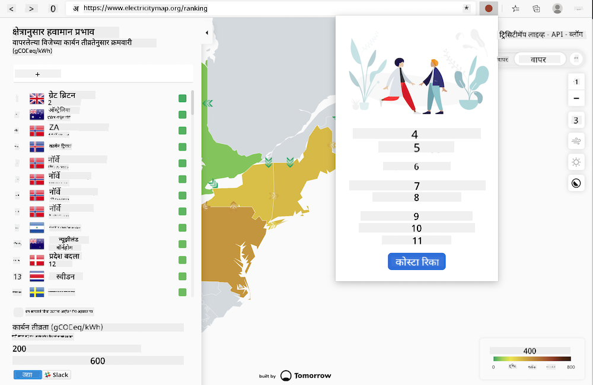

<!--
CO_OP_TRANSLATOR_METADATA:
{
  "original_hash": "b121a279a6ab39878491f3e572673515",
  "translation_date": "2025-08-25T23:26:33+00:00",
  "source_file": "5-browser-extension/README.md",
  "language_code": "mr"
}
-->
# ब्राउझर एक्स्टेंशन तयार करणे

ब्राउझर एक्स्टेंशन्स तयार करणे हे तुमच्या अ‍ॅप्सच्या कार्यक्षमतेबद्दल विचार करण्याचा एक मजेदार आणि वेगळा मार्ग आहे, ज्यामध्ये वेगळ्या प्रकारचा वेब अ‍ॅसेट तयार केला जातो. या मॉड्यूलमध्ये ब्राउझर कसे कार्य करतात, ब्राउझर एक्स्टेंशन कसे डिप्लॉय करायचे, फॉर्म कसा तयार करायचा, API कसे कॉल करायचे, लोकल स्टोरेज कसे वापरायचे, आणि तुमच्या वेबसाइटची कार्यक्षमता कशी मोजायची व सुधारायची यावर धडे समाविष्ट आहेत.

तुम्ही एक ब्राउझर एक्स्टेंशन तयार कराल जे Edge, Chrome, आणि Firefox वर कार्य करते. हे एक्स्टेंशन, जे एका विशिष्ट कार्यासाठी तयार केलेल्या मिनी वेबसाइटसारखे आहे, [C02 Signal API](https://www.co2signal.com) तपासते आणि दिलेल्या प्रदेशातील वीज वापर आणि कार्बन तीव्रतेबद्दल माहिती देते, ज्यामुळे त्या प्रदेशाचा कार्बन फूटप्रिंट समजतो.

हे एक्स्टेंशन वापरकर्त्याने API की आणि प्रदेश कोड फॉर्ममध्ये भरल्यानंतर अड-हॉक पद्धतीने कॉल केले जाऊ शकते, ज्यामुळे स्थानिक वीज वापर समजतो आणि वापरकर्त्याच्या वीज वापराच्या निर्णयांवर परिणाम होऊ शकतो. उदाहरणार्थ, तुमच्या प्रदेशात वीज वापर जास्त असताना कपडे वाळवायचा ड्रायर (कार्बन-तीव्र क्रिया) चालवणे टाळणे अधिक योग्य ठरू शकते.

### विषय

1. [ब्राउझरबद्दल माहिती](1-about-browsers/README.md)
2. [फॉर्म्स आणि लोकल स्टोरेज](2-forms-browsers-local-storage/README.md)
3. [बॅकग्राउंड टास्क्स आणि कार्यक्षमता](3-background-tasks-and-performance/README.md)

### श्रेय

## श्रेय

या वेब कार्बन ट्रिगरची कल्पना Microsoft च्या Green Cloud Advocacy टीमचे लीड असिम हुसैन यांनी दिली होती, जे [Green Principles](https://principles.green/) चे लेखक आहेत. हे मूळतः एक [वेब साइट प्रोजेक्ट](https://github.com/jlooper/green) होते.

ब्राउझर एक्स्टेंशनची रचना [Adebola Adeniran's COVID extension](https://github.com/onedebos/covtension) ने प्रेरित केली होती.

'डॉट' आयकॉन प्रणालीमागील संकल्पना [Energy Lollipop](https://energylollipop.com/) ब्राउझर एक्स्टेंशनच्या कॅलिफोर्निया उत्सर्जनासाठीच्या आयकॉन संरचनेने सुचवली होती.

हे धडे ♥️ सह [Jen Looper](https://www.twitter.com/jenlooper) यांनी लिहिले आहेत.

**अस्वीकरण**:  
हा दस्तऐवज AI भाषांतर सेवा [Co-op Translator](https://github.com/Azure/co-op-translator) वापरून भाषांतरित करण्यात आला आहे. आम्ही अचूकतेसाठी प्रयत्नशील असलो तरी कृपया लक्षात ठेवा की स्वयंचलित भाषांतरांमध्ये त्रुटी किंवा अचूकतेचा अभाव असू शकतो. मूळ भाषेतील दस्तऐवज हा अधिकृत स्रोत मानला जावा. महत्त्वाच्या माहितीसाठी व्यावसायिक मानवी भाषांतराची शिफारस केली जाते. या भाषांतराचा वापर करून उद्भवलेल्या कोणत्याही गैरसमज किंवा चुकीच्या अर्थासाठी आम्ही जबाबदार राहणार नाही.