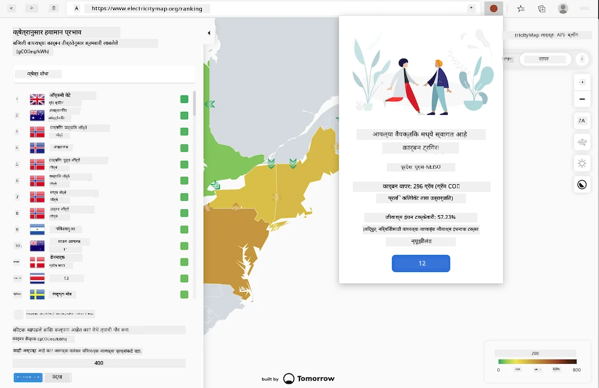

<!--
CO_OP_TRANSLATOR_METADATA:
{
  "original_hash": "dd58ae1b7707034f055718c1b68bc8de",
  "translation_date": "2025-08-25T23:54:17+00:00",
  "source_file": "5-browser-extension/solution/translation/README.hi.md",
  "language_code": "mr"
}
-->
# कार्बन ट्रिगर ब्राउझर एक्सटेंशन: पूर्ण कोड

वीज वापर ट्रॅक करण्यासाठी tmrow च्या C02 सिग्नल API चा वापर करून, एक ब्राउझर एक्सटेंशन तयार करणे जे तुमच्या ब्राउझरमध्ये तुमच्या क्षेत्रातील वीज वापर किती जड आहे याबद्दल तुम्हाला स्मरण देईल. या एक्सटेंशनचा उपयोग तुम्हाला या माहितीच्या आधारे तुमच्या क्रियाकलापांबद्दल निर्णय घेण्यास मदत करेल.



## सुरुवात करणे

तुम्हाला [npm](https://npmjs.com) इंस्टॉल करावे लागेल. तुमच्या संगणकावर एका फोल्डरमध्ये या कोडची एक प्रत डाउनलोड करा.

सर्व आवश्यक पॅकेजेस इंस्टॉल करा:

```
npm install
```

वेबपॅक वापरून एक्सटेंशन तयार करा:

```
npm run build
```

एज ब्राउझरवर इंस्टॉल करण्यासाठी, ब्राउझरच्या वरच्या उजव्या कोपऱ्यातील 'तीन डॉट' मेनू वापरून एक्सटेंशन पॅनेल शोधा. तिथून, नवीन एक्सटेंशन लोड करण्यासाठी 'लोड अनपॅक्ड' निवडा. प्रॉम्प्टवर 'dist' फोल्डर उघडा आणि एक्सटेंशन लोड होईल. याचा उपयोग करण्यासाठी, तुम्हाला CO2 सिग्नल API ([ईमेलद्वारे येथे मिळवा](https://www.co2signal.com/) साठी API की आवश्यक असेल - या पृष्ठावरील बॉक्समध्ये तुमचा ईमेल टाका) आणि [तुमच्या क्षेत्रासाठी कोड](http://api.electricitymap.org/v3/zones) [इलेक्ट्रिसिटी मॅप](https://www.electricitymap.org/map) वरून (उदाहरणार्थ, बोस्टनसाठी, मी 'US-NEISO' वापरतो).


एकदा API की आणि क्षेत्र एक्सटेंशन इंटरफेसमध्ये इनपुट केल्यानंतर, ब्राउझर एक्सटेंशन बारमधील रंगीत डॉट तुमच्या क्षेत्रातील ऊर्जा वापर प्रतिबिंबित करण्यासाठी बदलायला हवा आणि तुम्हाला एक संकेतक द्यायला हवा की ऊर्जा-गंभीर क्रियाकलाप तुमच्या कामगिरीसाठी योग्य असतील. या 'डॉट' प्रणालीची संकल्पना मला कॅलिफोर्नियाच्या उत्सर्जनासाठी [एनर्जी लॉलीपॉप एक्सटेंशन](https://energylollipop.com/) कडून मिळाली.

**अस्वीकरण**:  
हा दस्तऐवज AI भाषांतर सेवा [Co-op Translator](https://github.com/Azure/co-op-translator) वापरून भाषांतरित करण्यात आला आहे. आम्ही अचूकतेसाठी प्रयत्नशील असलो तरी कृपया लक्षात ठेवा की स्वयंचलित भाषांतरांमध्ये त्रुटी किंवा अचूकतेचा अभाव असू शकतो. मूळ भाषेतील दस्तऐवज हा अधिकृत स्रोत मानला जावा. महत्त्वाच्या माहितीसाठी व्यावसायिक मानवी भाषांतराची शिफारस केली जाते. या भाषांतराचा वापर करून निर्माण होणाऱ्या कोणत्याही गैरसमज किंवा चुकीच्या अर्थासाठी आम्ही जबाबदार नाही.