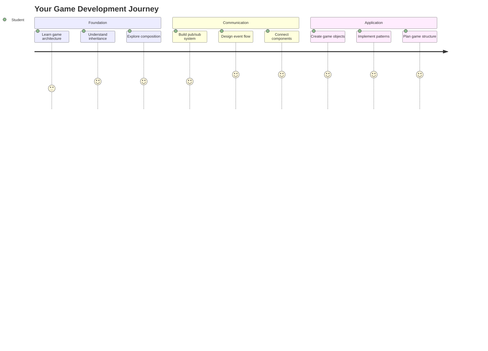
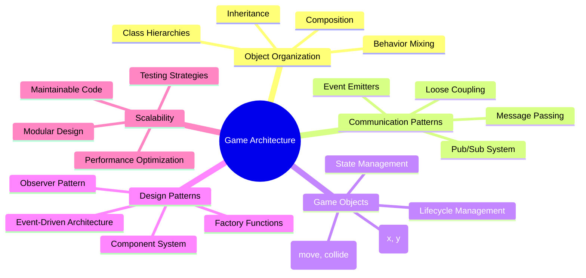
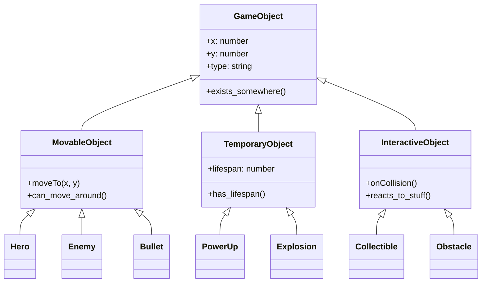
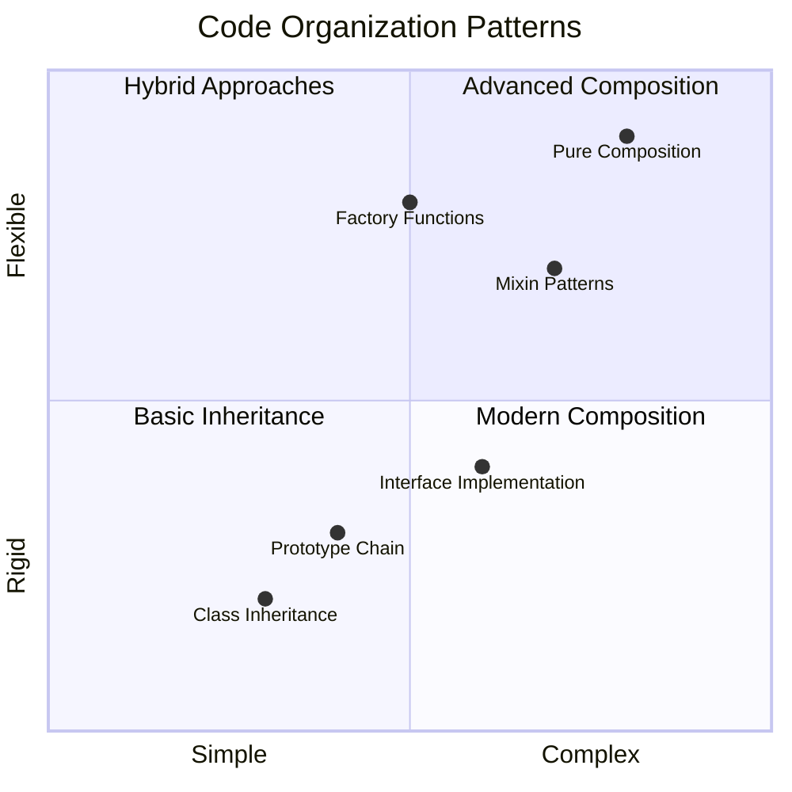
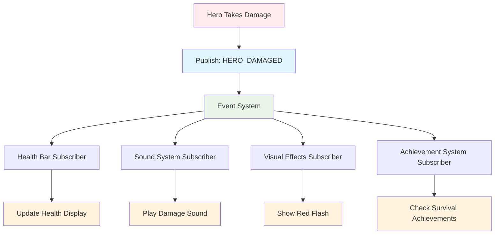
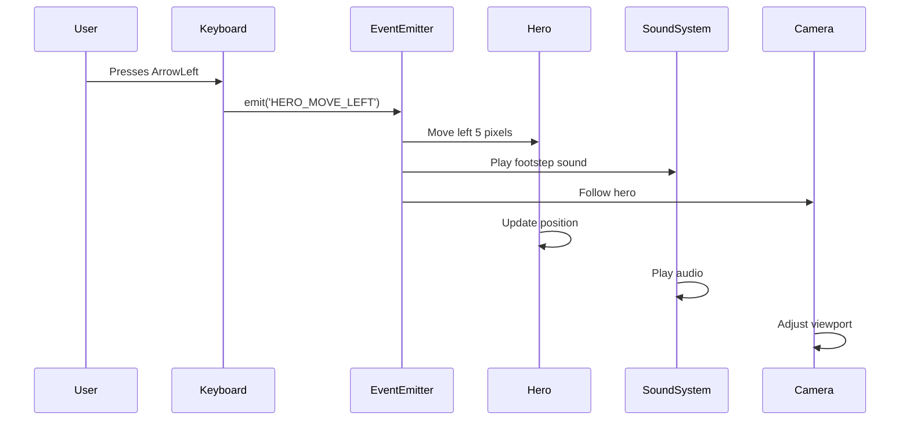
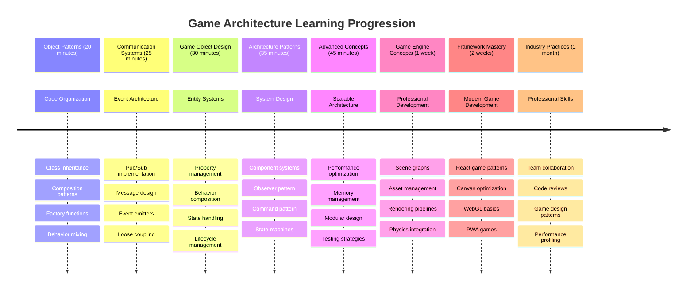

<!--
CO_OP_TRANSLATOR_METADATA:
{
  "original_hash": "a6332a7bb4d0be3bfd24199c83993777",
  "translation_date": "2025-11-03T15:02:35+00:00",
  "source_file": "6-space-game/1-introduction/README.md",
  "language_code": "mr"
}
-->
# स्पेस गेम तयार करा भाग 1: परिचय




जसे NASA चे मिशन कंट्रोल स्पेस लॉन्च दरम्यान अनेक प्रणालींचे समन्वय करते, तसेच आपण एक स्पेस गेम तयार करणार आहोत जो दाखवेल की प्रोग्रामचे विविध भाग एकत्र कसे सुरळीतपणे कार्य करू शकतात. काहीतरी खेळण्यायोग्य तयार करताना, तुम्ही कोणत्याही सॉफ्टवेअर प्रकल्पासाठी लागू होणाऱ्या महत्त्वाच्या प्रोग्रामिंग संकल्पना शिकाल.

आपण कोड आयोजित करण्यासाठी दोन मूलभूत दृष्टिकोनांचा अभ्यास करू: इनहेरिटन्स आणि कंपोझिशन. हे केवळ शैक्षणिक संकल्पना नाहीत – हेच पद्धती व्हिडिओ गेम्सपासून बँकिंग सिस्टमपर्यंत सर्वकाही चालवतात. आपण एक कम्युनिकेशन सिस्टम देखील अंमलात आणू ज्याला pub/sub म्हणतात, जे स्पेसक्राफ्टमध्ये वापरल्या जाणाऱ्या कम्युनिकेशन नेटवर्क्ससारखे कार्य करते, विविध घटकांना परस्पर अवलंबित्व निर्माण न करता माहिती सामायिक करण्यास अनुमती देते.

या मालिकेच्या शेवटी, तुम्हाला स्केल आणि विकसित होणाऱ्या अ‍ॅप्लिकेशन्स तयार करण्याची समज असेल – मग तुम्ही गेम्स, वेब अ‍ॅप्लिकेशन्स किंवा इतर कोणतेही सॉफ्टवेअर सिस्टम विकसित करत असाल.



## प्री-लेक्चर क्विझ

[प्री-लेक्चर क्विझ](https://ff-quizzes.netlify.app/web/quiz/29)

## गेम डेव्हलपमेंटमध्ये इनहेरिटन्स आणि कंपोझिशन

प्रकल्प जसे जसे जटिल होतात, कोडचे आयोजन महत्त्वाचे बनते. जे एक साधे स्क्रिप्ट म्हणून सुरू होते ते योग्य संरचनेशिवाय देखभाल करणे कठीण होऊ शकते – जसे अपोलो मिशनमध्ये हजारो घटकांमध्ये काळजीपूर्वक समन्वय आवश्यक होता.

आपण कोड आयोजित करण्यासाठी दोन मूलभूत दृष्टिकोनांचा अभ्यास करू: इनहेरिटन्स आणि कंपोझिशन. प्रत्येकाचे वेगळे फायदे आहेत आणि दोन्ही समजून घेणे तुम्हाला वेगवेगळ्या परिस्थितीत योग्य दृष्टिकोन निवडण्यास मदत करते. आपण आमच्या स्पेस गेमद्वारे या संकल्पनांचे प्रदर्शन करू, जिथे हिरो, शत्रू, पॉवर-अप्स आणि इतर ऑब्जेक्ट्स कार्यक्षमतेने संवाद साधणे आवश्यक आहे.

✅ सर्वात प्रसिद्ध प्रोग्रामिंग पुस्तकांपैकी एक [डिझाइन पॅटर्न्स](https://en.wikipedia.org/wiki/Design_Patterns) बद्दल आहे.

कोणत्याही गेममध्ये, तुमच्याकडे `गेम ऑब्जेक्ट्स` असतात – तुमच्या गेमच्या जगात परस्परसंवादी घटक. हिरो, शत्रू, पॉवर-अप्स आणि व्हिज्युअल इफेक्ट्स हे सर्व गेम ऑब्जेक्ट्स आहेत. प्रत्येक विशिष्ट स्क्रीन कोऑर्डिनेट्सवर `x` आणि `y` मूल्ये वापरून अस्तित्वात असतो, जसे की कोऑर्डिनेट प्लेनवर पॉइंट्स प्लॉट करणे.

त्यांच्या व्हिज्युअल फरक असूनही, या ऑब्जेक्ट्समध्ये सामान्यतः मूलभूत वर्तन सामायिक असते:

- **ते कुठेतरी अस्तित्वात असतात** – प्रत्येक ऑब्जेक्टमध्ये x आणि y कोऑर्डिनेट्स असतात जेणेकरून गेमला ते कुठे काढायचे ते माहित असते
- **अनेक फिरू शकतात** – हिरो धावतात, शत्रू पाठलाग करतात, बुलेट्स स्क्रीनवर उडतात
- **त्यांचा आयुष्यकाल असतो** – काही कायम राहतात, तर काही (जसे की स्फोट) थोड्या वेळासाठी दिसतात आणि गायब होतात
- **ते गोष्टींवर प्रतिक्रिया देतात** – जेव्हा गोष्टी टक्कर घेतात, पॉवर-अप्स गोळा केले जातात, हेल्थ बार अपडेट होतात

✅ पॅक-मॅन सारख्या गेमचा विचार करा. तुम्ही या गेममध्ये वरील चार ऑब्जेक्ट प्रकार ओळखू शकता का?



### कोडद्वारे वर्तन व्यक्त करणे

आता तुम्हाला गेम ऑब्जेक्ट्स सामायिक करतात अशा सामान्य वर्तनाची समज आहे, चला जावास्क्रिप्टमध्ये ही वर्तन कशी अंमलात आणायची ते शोधूया. तुम्ही वर्ग किंवा वैयक्तिक ऑब्जेक्ट्सशी संलग्न पद्धतींद्वारे ऑब्जेक्ट वर्तन व्यक्त करू शकता आणि निवडण्यासाठी अनेक दृष्टिकोन आहेत.

**क्लास-आधारित दृष्टिकोन**

क्लासेस आणि इनहेरिटन्स गेम ऑब्जेक्ट्स आयोजित करण्यासाठी संरचित दृष्टिकोन प्रदान करतात. कार्ल लिनियसने विकसित केलेल्या टॅक्सोनॉमिक वर्गीकरण प्रणालीसारखे, तुम्ही सामान्य गुणधर्म असलेल्या बेस क्लाससह प्रारंभ करता, नंतर विशेष क्षमता जोडताना या मूलभूत गोष्टी वारसाहक्काने घेणारे विशेष वर्ग तयार करता.

✅ इनहेरिटन्स समजून घेणे महत्त्वाचे आहे. [MDN च्या इनहेरिटन्सवरील लेख](https://developer.mozilla.org/docs/Web/JavaScript/Inheritance_and_the_prototype_chain) वर अधिक जाणून घ्या.

क्लासेस आणि इनहेरिटन्स वापरून गेम ऑब्जेक्ट्स कसे अंमलात आणता येतील ते येथे आहे:

```javascript
// Step 1: Create the base GameObject class
class GameObject {
  constructor(x, y, type) {
    this.x = x;
    this.y = y;
    this.type = type;
  }
}
```

**चला हे टप्प्याटप्प्याने समजून घेऊया:**
- आपण प्रत्येक गेम ऑब्जेक्ट वापरू शकणारे मूलभूत टेम्पलेट तयार करत आहोत
- कन्स्ट्रक्टर ऑब्जेक्ट कुठे आहे (`x`, `y`) आणि ते कोणत्या प्रकारचे आहे हे जतन करते
- हे तुमच्या सर्व गेम ऑब्जेक्ट्ससाठी पाया बनते

```javascript
// Step 2: Add movement capability through inheritance
class Movable extends GameObject {
  constructor(x, y, type) {
    super(x, y, type); // Call parent constructor
  }

  // Add the ability to move to a new position
  moveTo(x, y) {
    this.x = x;
    this.y = y;
  }
}
```

**वरीलमध्ये, आपण:**
- गेमऑब्जेक्ट क्लास **वाढवला** जेणेकरून मूव्हमेंट फंक्शनॅलिटी जोडता येईल
- `super()` वापरून पॅरेंट कन्स्ट्रक्टर **कॉल केला** जेणेकरून वारसाहक्काने घेतलेले गुणधर्म प्रारंभ होऊ शकतील
- ऑब्जेक्टची स्थिती अपडेट करणारा `moveTo()` मेथड **जोडला**

```javascript
// Step 3: Create specific game object types
class Hero extends Movable {
  constructor(x, y) {
    super(x, y, 'Hero'); // Set type automatically
  }
}

class Tree extends GameObject {
  constructor(x, y) {
    super(x, y, 'Tree'); // Trees don't need movement
  }
}

// Step 4: Use your game objects
const hero = new Hero(0, 0);
hero.moveTo(5, 5); // Hero can move!

const tree = new Tree(10, 15);
// tree.moveTo() would cause an error - trees can't move
```

**या संकल्पना समजून घेणे:**
- योग्य वर्तन वारसाहक्काने घेणारे विशेष ऑब्जेक्ट प्रकार **तयार करते**
- इनहेरिटन्स कसे निवडक वैशिष्ट्य समाविष्ट करण्यास अनुमती देते हे **दाखवते**
- हिरो हलू शकतात तर झाडे स्थिर राहतात हे **दाखवते**
- क्लास हायरार्की अनुचित क्रिया टाळते हे **समजावते**

✅ काही मिनिटे घ्या आणि पॅक-मॅन हिरो (उदा. इन्की, पिंकी किंवा ब्लिंकी) पुन्हा कसा लिहिला जाईल याचा विचार करा.

**कंपोझिशन दृष्टिकोन**

कंपोझिशन मॉड्युलर डिझाइन तत्त्वज्ञानाचे अनुसरण करते, जसे अभियंते इंटरचेंज करण्यायोग्य घटकांसह स्पेसक्राफ्ट डिझाइन करतात. पॅरेंट क्लासकडून वारसाहक्काने घेण्याऐवजी, तुम्ही विशिष्ट वर्तन एकत्र करून ऑब्जेक्ट्स तयार करता ज्यांना त्यांना आवश्यक असलेली कार्यक्षमता मिळते. हा दृष्टिकोन कठोर श्रेणीबद्ध मर्यादा न ठेवता लवचिकता प्रदान करतो.

```javascript
// Step 1: Create base behavior objects
const gameObject = {
  x: 0,
  y: 0,
  type: ''
};

const movable = {
  moveTo(x, y) {
    this.x = x;
    this.y = y;
  }
};
```

**या कोडमध्ये काय होते:**
- स्थिती आणि प्रकार गुणधर्मांसह बेस `gameObject` **परिभाषित करते**
- मूव्हमेंट फंक्शनॅलिटीसह स्वतंत्र `movable` वर्तन ऑब्जेक्ट **तयार करते**
- स्थिती डेटा आणि मूव्हमेंट लॉजिक स्वतंत्र ठेवून चिंता **वेगळ्या करते**

```javascript
// Step 2: Compose objects by combining behaviors
const movableObject = { ...gameObject, ...movable };

// Step 3: Create factory functions for different object types
function createHero(x, y) {
  return {
    ...movableObject,
    x,
    y,
    type: 'Hero'
  };
}

function createStatic(x, y, type) {
  return {
    ...gameObject,
    x,
    y,
    type
  };
}
```

**वरीलमध्ये, आपण:**
- स्प्रेड सिंटॅक्स वापरून मूव्हमेंट वर्तनासह बेस ऑब्जेक्ट गुणधर्म **एकत्र केले**
- कस्टमाइज्ड ऑब्जेक्ट्स परत करणारे फॅक्टरी फंक्शन्स **तयार केले**
- कठोर क्लास हायरार्कीजशिवाय लवचिक ऑब्जेक्ट निर्मिती **सक्षम केली**
- ऑब्जेक्ट्सना त्यांना आवश्यक असलेले वर्तन **असण्यास अनुमती दिली**

```javascript
// Step 4: Create and use your composed objects
const hero = createHero(10, 10);
hero.moveTo(5, 5); // Works perfectly!

const tree = createStatic(0, 0, 'Tree');
// tree.moveTo() is undefined - no movement behavior was composed
```

**महत्त्वाचे मुद्दे लक्षात ठेवा:**
- वर्तन वारसाहक्काने घेण्याऐवजी ऑब्जेक्ट्स **मिश्रित करते**
- कठोर इनहेरिटन्स हायरार्कीजपेक्षा अधिक लवचिकता **प्रदान करते**
- ऑब्जेक्ट्सना त्यांना आवश्यक असलेली वैशिष्ट्ये **असण्यास अनुमती देते**
- स्वच्छ ऑब्जेक्ट संयोजनासाठी आधुनिक जावास्क्रिप्ट स्प्रेड सिंटॅक्स **वापरते**
```

**Which Pattern Should You Choose?**

**Which Pattern Should You Choose?**



> 💡 **प्रो टिप**: आधुनिक जावास्क्रिप्ट डेव्हलपमेंटमध्ये दोन्ही पद्धतींचे स्थान आहे. क्लासेस स्पष्टपणे परिभाषित हायरार्कीजसाठी चांगले कार्य करतात, तर कंपोझिशन तुम्हाला जास्तीत जास्त लवचिकता आवश्यक असते तेव्हा चमकते.
> 
**प्रत्येक दृष्टिकोन कधी वापरायचा:**
- **इनहेरिटन्स निवडा** जेव्हा तुमच्याकडे स्पष्ट "is-a" संबंध असतात (हिरो *is-a* मूव्हेबल ऑब्जेक्ट)
- **कंपोझिशन निवडा** जेव्हा तुम्हाला "has-a" संबंध आवश्यक असतात (हिरो *has* मूव्हमेंट क्षमता)
- **तुमच्या टीमच्या प्राधान्ये आणि प्रकल्पाच्या गरजा विचारात घ्या**
- **लक्षात ठेवा** की तुम्ही एकाच अ‍ॅप्लिकेशनमध्ये दोन्ही दृष्टिकोन मिसळू शकता

### 🔄 **शैक्षणिक तपासणी**
**ऑब्जेक्ट ऑर्गनायझेशन समज**: कम्युनिकेशन पॅटर्नकडे जाण्यापूर्वी, तुम्ही हे समजू शकता:
- ✅ इनहेरिटन्स आणि कंपोझिशनमधील फरक स्पष्ट करा
- ✅ क्लासेस विरुद्ध फॅक्टरी फंक्शन्स कधी वापरायचे ते ओळखा
- ✅ इनहेरिटन्समध्ये `super()` कीवर्ड कसा कार्य करतो ते समजून घ्या
- ✅ गेम डेव्हलपमेंटसाठी प्रत्येक दृष्टिकोनाचे फायदे ओळखा

**जलद स्व-परीक्षण**: तुम्ही मूव्ह आणि फ्लाय करू शकणारा फ्लाइंग एनिमी कसा तयार कराल?
- **इनहेरिटन्स दृष्टिकोन**: `class FlyingEnemy extends Movable`
- **कंपोझिशन दृष्टिकोन**: `{ ...movable, ...flyable, ...gameObject }`

**वास्तविक-जगाशी संबंध**: हे पॅटर्न सर्वत्र दिसतात:
- **React Components**: Props (कंपोझिशन) विरुद्ध क्लास इनहेरिटन्स
- **Game Engines**: Entity-component systems कंपोझिशन वापरतात
- **Mobile Apps**: UI फ्रेमवर्क्स अनेकदा इनहेरिटन्स हायरार्कीज वापरतात

## कम्युनिकेशन पॅटर्न्स: Pub/Sub सिस्टम

अ‍ॅप्लिकेशन्स जसे जसे जटिल होतात, घटकांमधील कम्युनिकेशन व्यवस्थापित करणे आव्हानात्मक बनते. पब्लिश-सबस्क्राइब पॅटर्न (pub/sub) रेडिओ ब्रॉडकास्टिंगसारख्या तत्त्वांचा वापर करून हा प्रश्न सोडवतो – एक ट्रान्समीटर कोण ऐकत आहे हे न जाणता अनेक रिसिव्हर्सपर्यंत पोहोचू शकतो.

हिरोला इजा झाल्यावर काय होते ते विचार करा: हेल्थ बार अपडेट होतो, साउंड इफेक्ट्स प्ले होतात, व्हिज्युअल फीडबॅक दिसतो. हिरो ऑब्जेक्टला थेट या सिस्टमशी जोडण्याऐवजी, pub/sub हिरोला "इजा झाली" असा संदेश प्रसारित करण्यास अनुमती देते. प्रतिसाद देण्याची आवश्यकता असलेली कोणतीही प्रणाली या संदेश प्रकाराची सदस्यता घेऊ शकते आणि त्यानुसार प्रतिक्रिया देऊ शकते.

✅ **Pub/Sub** म्हणजे 'पब्लिश-सबस्क्राइब'



### Pub/Sub आर्किटेक्चर समजून घेणे

Pub/Sub पॅटर्न तुमच्या अ‍ॅप्लिकेशनच्या वेगवेगळ्या भागांना सैल जोडलेले ठेवते, म्हणजे ते एकमेकांवर थेट अवलंबून न राहता एकत्र काम करू शकतात. हा वेगळेपणा तुमचा कोड अधिक टिकाऊ, चाचणीयोग्य आणि बदलांसाठी लवचिक बनवतो.

**Pub/Sub मधील मुख्य घटक:**
- **संदेश** – 'PLAYER_SCORED' सारख्या साध्या मजकूर लेबल्स जे काय घडले ते वर्णन करतात (प्लस कोणतीही अतिरिक्त माहिती)
- **पब्लिशर्स** – ऑब्जेक्ट्स जे "काहीतरी घडले!" असे कोणालाही ऐकवतात
- **सबस्क्रायबर्स** – ऑब्जेक्ट्स जे "मला त्या इव्हेंटची काळजी आहे" असे म्हणतात आणि ते घडल्यावर प्रतिक्रिया देतात
- **इव्हेंट सिस्टम** – मध्यस्थ जो संदेश योग्य श्रोत्यांपर्यंत पोहोचतो याची खात्री करतो

### इव्हेंट सिस्टम तयार करणे

चला या संकल्पनांचे प्रदर्शन करणारी एक साधी पण शक्तिशाली इव्हेंट सिस्टम तयार करूया:

```javascript
// Step 1: Create the EventEmitter class
class EventEmitter {
  constructor() {
    this.listeners = {}; // Store all event listeners
  }
  
  // Register a listener for a specific message type
  on(message, listener) {
    if (!this.listeners[message]) {
      this.listeners[message] = [];
    }
    this.listeners[message].push(listener);
  }
  
  // Send a message to all registered listeners
  emit(message, payload = null) {
    if (this.listeners[message]) {
      this.listeners[message].forEach(listener => {
        listener(message, payload);
      });
    }
  }
}
```

**इथे काय होते ते समजून घेणे:**
- एक साधा क्लास वापरून केंद्रीय इव्हेंट व्यवस्थापन प्रणाली **तयार करते**
- संदेश प्रकारानुसार आयोजित केलेल्या ऑब्जेक्टमध्ये श्रोते **साठवते**
- `on()` मेथड वापरून नवीन श्रोते **नोंदवते**
- `emit()` वापरून सर्व इच्छुक श्रोत्यांना संदेश **प्रसारित करते**
- संबंधित माहिती पास करण्यासाठी पर्यायी डेटा पेलोड्स **समर्थन करते**

### सर्व एकत्र आणणे: एक व्यावहारिक उदाहरण

ठीक आहे, चला हे कृतीत पाहूया! आपण एक साधी मूव्हमेंट सिस्टम तयार करू जी pub/sub किती स्वच्छ आणि लवचिक असू शकते हे दर्शवते:

```javascript
// Step 1: Define your message types
const Messages = {
  HERO_MOVE_LEFT: 'HERO_MOVE_LEFT',
  HERO_MOVE_RIGHT: 'HERO_MOVE_RIGHT',
  ENEMY_SPOTTED: 'ENEMY_SPOTTED'
};

// Step 2: Create your event system and game objects
const eventEmitter = new EventEmitter();
const hero = createHero(0, 0);
```

**या कोडमध्ये काय होते:**
- संदेश नावांमध्ये टायपो टाळण्यासाठी एक कॉन्स्टंट्स ऑब्जेक्ट **परिभाषित करते**
- सर्व कम्युनिकेशन हाताळण्यासाठी एक इव्हेंट एमिटर इंस्टन्स **तयार करते**
- सुरुवातीच्या स्थितीत हिरो ऑब्जेक्ट **प्रारंभ करते**

```javascript
// Step 3: Set up event listeners (subscribers)
eventEmitter.on(Messages.HERO_MOVE_LEFT, () => {
  hero.moveTo(hero.x - 5, hero.y);
  console.log(`Hero moved to position: ${hero.x}, ${hero.y}`);
});

eventEmitter.on(Messages.HERO_MOVE_RIGHT, () => {
  hero.moveTo(hero.x + 5, hero.y);
  console.log(`Hero moved to position: ${hero.x}, ${hero.y}`);
});
```

**वरीलमध्ये, आपण:**
- मूव्हमेंट संदेशांना प्रतिसाद देणारे इव्हेंट श्रोते **नोंदवले**
- मूव्हमेंटच्या दिशेनुसार हिरोची स्थिती **अपडेट केली**
- हिरोच्या स्थिती बदलांचा मागोवा घेण्यासाठी कन्सोल लॉगिंग **जोडले**
- इनपुट हँडलिंगपासून मूव्हमेंट लॉजिक **वेगळे केले**

```javascript
// Step 4: Connect keyboard input to events (publishers)
window.addEventListener('keydown', (event) => {
  switch(event.key) {
    case 'ArrowLeft':
      eventEmitter.emit(Messages.HERO_MOVE_LEFT);
      break;
    case 'ArrowRight':
      eventEmitter.emit(Messages.HERO_MOVE_RIGHT);
      break;
  }
});
```

**या संकल्पना समजून घेणे:**
- कीबोर्ड इनपुटला गेम इव्हेंट्सशी **जोडते** परंतु घट्ट जोडणीशिवाय
- इनपुट सिस्टमला अप्रत्यक्षपणे गेम ऑब्जेक्ट्सशी संवाद साधण्यास **सक्षम करते**
- समान कीबोर्ड इव्हेंट्सला प्रतिसाद देण्यासाठी एकाधिक सिस्टम्सना **परवानगी देते**
- की बाइंडिंग बदलणे किंवा नवीन इनपुट पद्धती जोडणे **सुलभ करते**



> 💡 **प्रो टिप**: या पॅटर्नचे सौंदर्य म्हणजे लवचिकता! तुम्ही फक्त तुम्हाला काळजी असलेल्या इव्हेंट्ससाठी ऐकून सहज नवीन वैशिष्ट्ये जोडू शकता – विद्यमान कीबोर्ड किंवा मूव्हमेंट कोड बदलण्याची गरज नाही.
> 
**तुम्हाला हा दृष्टिकोन का आवडेल:**
- नवीन वैशिष्ट्ये जोडणे खूप सोपे होते – फक्त तुम्हाला काळजी असलेल्या इव्हेंट्ससाठी ऐका
- एकाच इव्हेंटला प्रतिसाद देण्यासाठी एकाधिक गोष्टी एकमेकांवर परिणाम न करता करू शकतात
- चाचणी खूप सोपी होते कारण प्रत्येक भाग स्वतंत्रपणे कार्य करतो
- काहीतरी बिघडल्यास, तुम्हाला नेमके कुठे पाहायचे आहे हे माहित आहे

### Pub/Sub प्रभावीपणे स्केल का करते

Pub/Sub पॅटर्न अ‍ॅप्लिकेशन्स जसे जसे जटिल होतात तसतसे साधेपणा टिकवून ठेवतो. शत्रूंचे डझनभर व्यवस्थापित करणे, डायनॅमिक UI अपडेट्स किंवा साउंड सिस्टम्स असो, पॅटर्न आर्किटेक्चरल बदल न करता वाढीव स्केल हाताळतो. नवीन
पब-सब पॅटर्न गेम आर्किटेक्चर सुधारण्यासाठी कसा उपयोगी ठरतो याचा विचार करा. कोणते घटक इव्हेंट्स उत्सर्जित करावेत आणि प्रणालीने कसे प्रतिसाद द्यावे याची ओळख करा. एक गेम संकल्पना तयार करा आणि त्याच्या घटकांमधील संवाद पॅटर्न मॅप करा.

## व्याख्यानानंतरचा क्विझ

[व्याख्यानानंतरचा क्विझ](https://ff-quizzes.netlify.app/web/quiz/30)

## पुनरावलोकन आणि स्व-अभ्यास

पब/सब बद्दल अधिक जाणून घ्या [त्याबद्दल वाचा](https://docs.microsoft.com/azure/architecture/patterns/publisher-subscriber/?WT.mc_id=academic-77807-sagibbon).

### ⚡ **पुढील ५ मिनिटांत तुम्ही काय करू शकता**
- [ ] कोणताही HTML5 गेम ऑनलाइन उघडा आणि त्याचा कोड DevTools वापरून तपासा
- [ ] एक साधा HTML5 कॅनव्हास घटक तयार करा आणि एक मूलभूत आकार काढा
- [ ] `setInterval` वापरून एक साधा अॅनिमेशन लूप तयार करण्याचा प्रयत्न करा
- [ ] कॅनव्हास API दस्तऐवज एक्सप्लोर करा आणि एक ड्रॉइंग पद्धत वापरून पहा

### 🎯 **तुम्ही एका तासात काय साध्य करू शकता**
- [ ] व्याख्यानानंतरचा क्विझ पूर्ण करा आणि गेम डेव्हलपमेंट संकल्पना समजून घ्या
- [ ] HTML, CSS, आणि JavaScript फाइल्ससह तुमच्या गेम प्रोजेक्टची रचना सेट करा
- [ ] एक मूलभूत गेम लूप तयार करा जो सतत अपडेट आणि रेंडर करतो
- [ ] कॅनव्हासवर तुमचे पहिले गेम स्प्राइट्स काढा
- [ ] प्रतिमा आणि ध्वनीसाठी मूलभूत अॅसेट लोडिंग अंमलात आणा

### 📅 **तुमचा आठवडाभराचा गेम तयार करण्याचा प्रवास**
- [ ] सर्व नियोजित वैशिष्ट्यांसह पूर्ण स्पेस गेम तयार करा
- [ ] गुळगुळीत ग्राफिक्स, ध्वनी प्रभाव, आणि अॅनिमेशन जोडा
- [ ] गेम स्टेट्स अंमलात आणा (स्टार्ट स्क्रीन, गेमप्ले, गेम ओव्हर)
- [ ] स्कोअरिंग सिस्टम आणि खेळाडू प्रगती ट्रॅकिंग तयार करा
- [ ] तुमचा गेम डिव्हाइसवर प्रतिसादक्षम आणि प्रवेशयोग्य बनवा
- [ ] तुमचा गेम ऑनलाइन शेअर करा आणि खेळाडूंकडून फीडबॅक मिळवा

### 🌟 **तुमचा महिनाभराचा गेम डेव्हलपमेंट प्रवास**
- [ ] विविध शैली आणि यांत्रिकी एक्सप्लोर करत अनेक गेम तयार करा
- [ ] Phaser किंवा Three.js सारख्या गेम डेव्हलपमेंट फ्रेमवर्क शिकणे
- [ ] ओपन सोर्स गेम डेव्हलपमेंट प्रोजेक्ट्समध्ये योगदान द्या
- [ ] प्रगत गेम प्रोग्रामिंग पॅटर्न आणि ऑप्टिमायझेशनमध्ये प्रावीण्य मिळवा
- [ ] तुमच्या गेम डेव्हलपमेंट कौशल्यांचे प्रदर्शन करणारे पोर्टफोलिओ तयार करा
- [ ] गेम डेव्हलपमेंट आणि इंटरॅक्टिव्ह मीडियामध्ये स्वारस्य असलेल्या इतरांना मार्गदर्शन करा

## 🎯 तुमचा गेम डेव्हलपमेंट मास्टरी टाइमलाइन



### 🛠️ तुमचा गेम आर्किटेक्चर टूलकिट सारांश

या धड्याचा अभ्यास केल्यानंतर, तुमच्याकडे आता आहे:
- **डिझाइन पॅटर्न प्रावीण्य**: इनहेरिटन्स विरुद्ध कंपोझिशनचे फायदे आणि तोटे समजणे
- **इव्हेंट-ड्रिव्हन आर्किटेक्चर**: स्केलेबल संवादासाठी पब/सब अंमलात आणणे
- **ऑब्जेक्ट-ओरिएंटेड डिझाइन**: क्लास हायरार्कीज आणि बिहेवियर कंपोझिशन
- **आधुनिक JavaScript**: फॅक्टरी फंक्शन्स, स्प्रेड सिंटॅक्स, आणि ES6+ पॅटर्न्स
- **स्केलेबल आर्किटेक्चर**: लूज कपलिंग आणि मॉड्युलर डिझाइन तत्त्वे
- **गेम डेव्हलपमेंट फाउंडेशन**: एंटिटी सिस्टम्स आणि कंपोनेंट पॅटर्न्स
- **प्रोफेशनल पॅटर्न्स**: कोड ऑर्गनायझेशनसाठी इंडस्ट्री-स्टँडर्ड दृष्टिकोन

**वास्तविक-जगातील अनुप्रयोग**: हे पॅटर्न थेट लागू होतात:
- **फ्रंटएंड फ्रेमवर्क्स**: React/Vue कंपोनेंट आर्किटेक्चर आणि स्टेट मॅनेजमेंट
- **बॅकएंड सर्व्हिसेस**: मायक्रोसर्व्हिस संवाद आणि इव्हेंट-ड्रिव्हन सिस्टम्स
- **मोबाईल डेव्हलपमेंट**: iOS/Android अॅप आर्किटेक्चर आणि नोटिफिकेशन सिस्टम्स
- **गेम इंजिन्स**: Unity, Unreal, आणि वेब-आधारित गेम डेव्हलपमेंट
- **एंटरप्राइज सॉफ्टवेअर**: इव्हेंट सोर्सिंग आणि डिस्ट्रिब्युटेड सिस्टम डिझाइन
- **API डिझाइन**: RESTful सर्व्हिसेस आणि रिअल-टाइम संवाद

**प्रोफेशनल कौशल्ये मिळवली**: तुम्ही आता करू शकता:
- **डिझाइन** स्केलेबल सॉफ्टवेअर आर्किटेक्चर वापरून सिद्ध पॅटर्न्स
- **अंमलात आणा** इव्हेंट-ड्रिव्हन सिस्टम्स जे जटिल संवाद हाताळतात
- **निवडा** वेगवेगळ्या परिस्थितीसाठी योग्य कोड ऑर्गनायझेशन स्ट्रॅटेजीज
- **डिबग** आणि लूजली कपल्ड सिस्टम्स प्रभावीपणे देखरेख करा
- **संवाद साधा** तांत्रिक निर्णय इंडस्ट्री-स्टँडर्ड टर्मिनोलॉजी वापरून

**पुढील स्तर**: तुम्ही हे पॅटर्न्स वास्तविक गेममध्ये अंमलात आणण्यासाठी, प्रगत गेम डेव्हलपमेंट विषय एक्सप्लोर करण्यासाठी, किंवा वेब अनुप्रयोगांमध्ये या आर्किटेक्चरल संकल्पनांचा उपयोग करण्यासाठी तयार आहात!

🌟 **साध्य केलेले यश**: तुम्ही मूलभूत सॉफ्टवेअर आर्किटेक्चर पॅटर्न्समध्ये प्रावीण्य मिळवले आहे जे साध्या गेम्सपासून ते जटिल एंटरप्राइज सिस्टम्सपर्यंत सर्वकाही समर्थित करतात!

## असाइनमेंट

[गेमचे मॉकअप तयार करा](assignment.md)

---

**अस्वीकरण**:  
हा दस्तऐवज AI भाषांतर सेवा [Co-op Translator](https://github.com/Azure/co-op-translator) वापरून भाषांतरित करण्यात आला आहे. आम्ही अचूकतेसाठी प्रयत्नशील असलो तरी, कृपया लक्षात ठेवा की स्वयंचलित भाषांतरे त्रुटी किंवा अचूकतेच्या अभावाने युक्त असू शकतात. मूळ भाषेतील दस्तऐवज हा अधिकृत स्रोत मानला जावा. महत्त्वाच्या माहितीसाठी, व्यावसायिक मानवी भाषांतराची शिफारस केली जाते. या भाषांतराचा वापर करून उद्भवलेल्या कोणत्याही गैरसमज किंवा चुकीच्या अर्थासाठी आम्ही जबाबदार राहणार नाही.