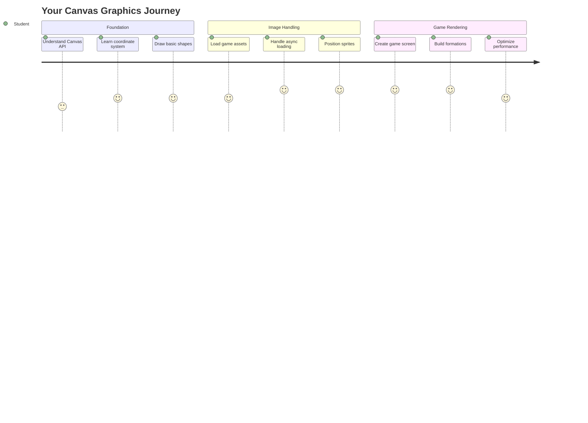
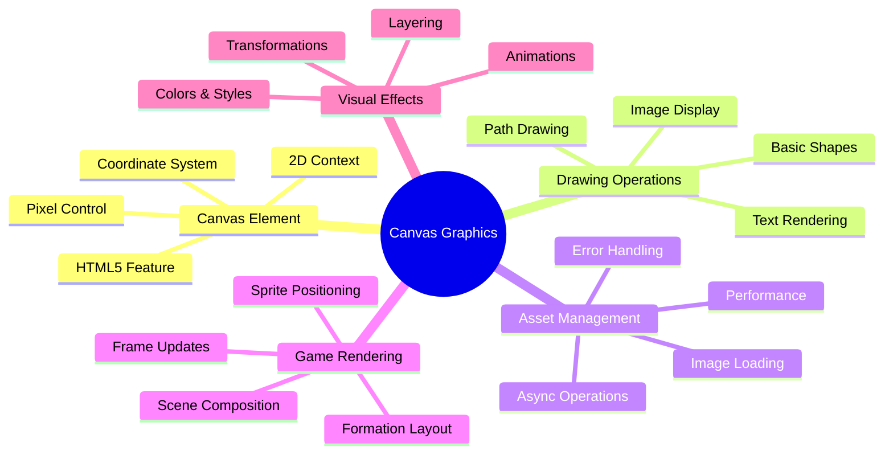
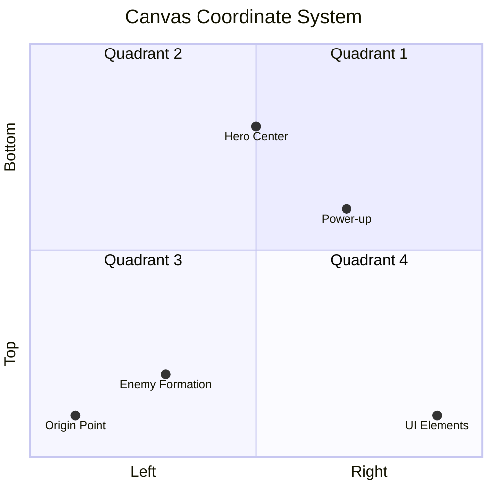
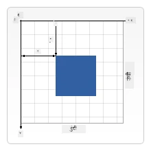
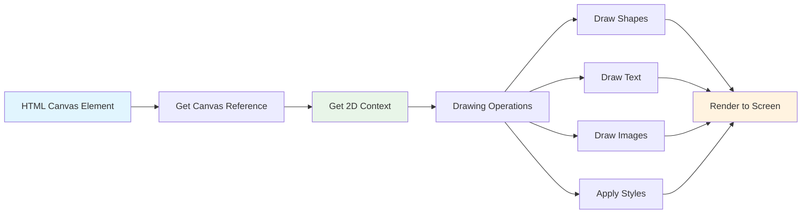
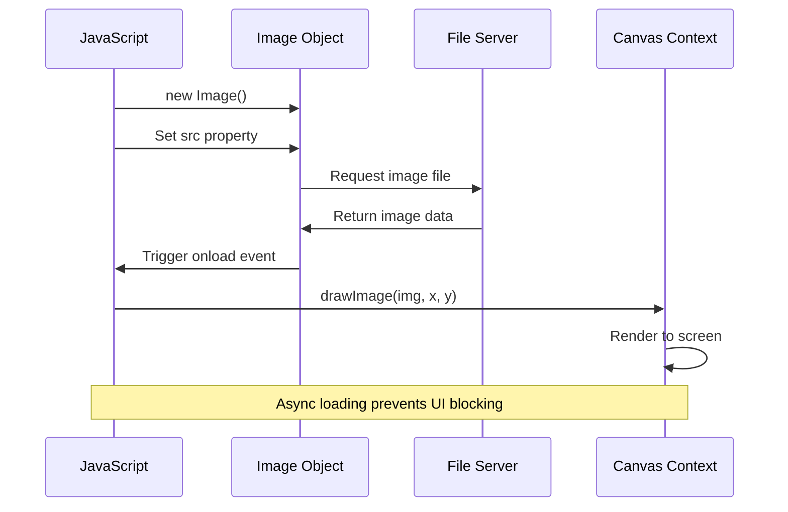
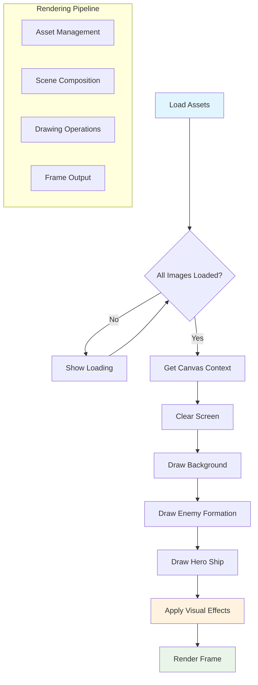
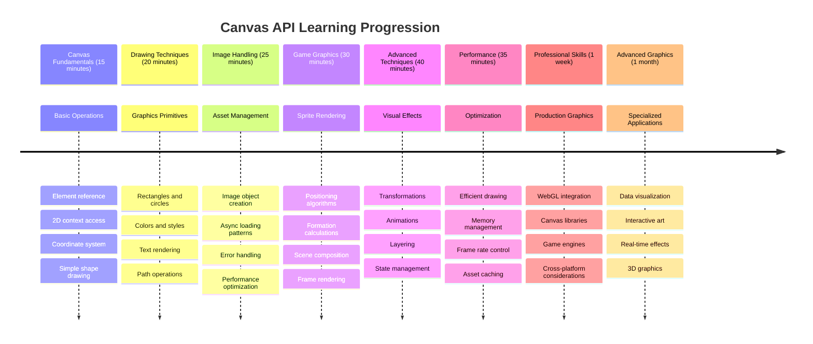

# स्पेस गेम तयार करा भाग 2: हिरो आणि मॉन्स्टर्स कॅनव्हासवर काढा



कॅनव्हास API ही वेब डेव्हलपमेंटमधील सर्वात शक्तिशाली वैशिष्ट्यांपैकी एक आहे, जी तुमच्या ब्राउझरमध्ये डायनॅमिक, इंटरॅक्टिव ग्राफिक्स तयार करण्यासाठी वापरली जाते. या धड्यात, आपण त्या रिकाम्या HTML `<canvas>` घटकाला हिरो आणि मॉन्स्टर्सने भरलेल्या गेम वर्ल्डमध्ये बदलू. कॅनव्हासला तुमचा डिजिटल आर्ट बोर्ड समजा जिथे कोड दृश्यात बदलतो.

आम्ही मागील धड्यात शिकलेल्या गोष्टींवर आधारित काम करत आहोत आणि आता आम्ही दृश्यात्मक पैलूंमध्ये खोलवर जाऊ. तुम्ही गेम स्प्राइट्स कसे लोड करायचे आणि प्रदर्शित करायचे, घटक अचूकपणे कसे स्थानबद्ध करायचे आणि तुमच्या स्पेस गेमसाठी दृश्यात्मक पाया कसा तयार करायचा हे शिकाल. हे स्थिर वेब पृष्ठे आणि डायनॅमिक, इंटरॅक्टिव अनुभव यांच्यातील अंतर कमी करते.

या धड्याच्या शेवटी, तुमच्याकडे तुमच्या हिरो शिपला योग्यरित्या स्थानबद्ध केलेले आणि शत्रूंच्या फॉर्मेशन्स लढाईसाठी तयार असलेले पूर्ण गेम दृश्य असेल. तुम्हाला समजेल की आधुनिक गेम्स ब्राउझरमध्ये ग्राफिक्स कसे रेंडर करतात आणि तुमचे स्वतःचे इंटरॅक्टिव दृश्यात्मक अनुभव तयार करण्यासाठी कौशल्य मिळेल. चला कॅनव्हास ग्राफिक्स एक्सप्लोर करूया आणि तुमच्या स्पेस गेमला जीवंत करूया!



## प्री-लेक्चर क्विझ

[प्री-लेक्चर क्विझ](https://ff-quizzes.netlify.app/web/quiz/31)

## कॅनव्हास म्हणजे काय?

तर हे `<canvas>` घटक नेमके काय आहे? हे HTML5 चे वेब ब्राउझरमध्ये डायनॅमिक ग्राफिक्स आणि अ‍ॅनिमेशन तयार करण्याचे समाधान आहे. नियमित प्रतिमा किंवा व्हिडिओ जे स्थिर असतात त्याऐवजी, कॅनव्हास तुम्हाला स्क्रीनवर दिसणाऱ्या प्रत्येक गोष्टीवर पिक्सेल-स्तरीय नियंत्रण देते. हे गेम्स, डेटा व्हिज्युअलायझेशन आणि इंटरॅक्टिव आर्टसाठी परिपूर्ण बनवते. याला प्रोग्रामेबल ड्रॉइंग पृष्ठभाग समजा जिथे जावास्क्रिप्ट तुमचा ब्रश बनते.

डिफॉल्टनुसार, कॅनव्हास घटक तुमच्या पृष्ठावर रिक्त, पारदर्शक आयतासारखा दिसतो. पण इथेच त्याची क्षमता आहे! जेव्हा तुम्ही जावास्क्रिप्ट वापरून आकार काढता, प्रतिमा लोड करता, अ‍ॅनिमेशन तयार करता आणि गोष्टी वापरकर्त्याच्या संवादांना प्रतिसाद देण्यासाठी बनवता तेव्हा त्याची खरी ताकद दिसून येते. हे 1960 च्या दशकातील बेल लॅब्समधील सुरुवातीच्या संगणक ग्राफिक्स पायोनियर्सप्रमाणे आहे ज्यांना पहिल्या डिजिटल अ‍ॅनिमेशन तयार करण्यासाठी प्रत्येक पिक्सेल प्रोग्राम करावा लागला.

✅ [कॅनव्हास API बद्दल अधिक वाचा](https://developer.mozilla.org/docs/Web/API/Canvas_API) MDN वर.

हे सामान्यतः पृष्ठाच्या बॉडीचा भाग म्हणून घोषित केले जाते:

```html
<canvas id="myCanvas" width="200" height="100"></canvas>
```

**या कोडमध्ये काय होते:**
- **सेट करते** `id` अ‍ॅट्रिब्युट जेणेकरून तुम्ही जावास्क्रिप्टमध्ये या विशिष्ट कॅनव्हास घटकाचा संदर्भ घेऊ शकता
- **परिभाषित करते** पिक्सेलमधील `width` जे कॅनव्हासचा आडवा आकार नियंत्रित करते
- **स्थापित करते** पिक्सेलमधील `height` जे कॅनव्हासची उभी परिमाणे ठरवते

## साध्या भूमितीय आकृत्या काढणे

आता तुम्हाला कॅनव्हास घटक काय आहे हे माहित आहे, चला प्रत्यक्षात त्यावर काढण्याचा शोध घेऊया! कॅनव्हास एक समन्वय प्रणाली वापरते जी गणित वर्गातून परिचित वाटू शकते, परंतु संगणक ग्राफिक्ससाठी एक महत्त्वाचा ट्विस्ट आहे.

कॅनव्हास x-अक्ष (आडवा) आणि y-अक्ष (उभा) असलेल्या कार्टेशियन समन्वय प्रणालीचा वापर करतो ज्यावर तुम्ही काढलेल्या प्रत्येक गोष्टीचे स्थान ठरवता. पण इथे मुख्य फरक आहे: गणित वर्गातील समन्वय प्रणालीच्या विपरीत, मूळ बिंदू `(0,0)` वरच्या डाव्या कोपऱ्यात सुरू होते, x-मूल्ये उजवीकडे जाताना वाढतात आणि y-मूल्ये खाली जाताना वाढतात. ही पद्धत सुरुवातीच्या संगणक डिस्प्लेपासून सुरू झाली जिथे इलेक्ट्रॉन बीम वरून खाली स्कॅन करत होते, ज्यामुळे वरचा डावा नैसर्गिक प्रारंभ बिंदू बनला.




> प्रतिमा [MDN](https://developer.mozilla.org/docs/Web/API/Canvas_API/Tutorial/Drawing_shapes) वरून

कॅनव्हास घटकावर काढण्यासाठी, तुम्ही कॅनव्हास ग्राफिक्सच्या सर्व मूलभूत गोष्टी तयार करणारी तीच तीन-चरण प्रक्रिया अनुसरण कराल. तुम्ही हे काही वेळा केल्यानंतर, ते सहज होईल:



1. **तुमच्या कॅनव्हास घटकाचा संदर्भ मिळवा** DOM मधून (इतर HTML घटकांप्रमाणेच)
2. **2D रेंडरिंग संदर्भ मिळवा** – हे सर्व ड्रॉइंग पद्धती प्रदान करते
3. **काढायला सुरुवात करा!** संदर्भाच्या अंगभूत पद्धतींचा वापर करून तुमचे ग्राफिक्स तयार करा

कोडमध्ये हे कसे दिसते:

```javascript
// Step 1: Get the canvas element
const canvas = document.getElementById("myCanvas");

// Step 2: Get the 2D rendering context
const ctx = canvas.getContext("2d");

// Step 3: Set fill color and draw a rectangle
ctx.fillStyle = 'red';
ctx.fillRect(0, 0, 200, 200); // x, y, width, height
```

**चरण-दर-चरण याचे विश्लेषण करूया:**
- आम्ही **आमचा कॅनव्हास घटक** त्याच्या ID वापरून पकडतो आणि तो एका व्हेरिएबलमध्ये साठवतो
- आम्ही **2D रेंडरिंग संदर्भ मिळवतो** – हे आमचे ड्रॉइंग टूलकिट आहे
- आम्ही **कॅनव्हासला सांगतो** की आम्हाला `fillStyle` प्रॉपर्टी वापरून गोष्टी लाल रंगाने भरायच्या आहेत
- आम्ही **आयत काढतो** जो वरच्या डाव्या कोपऱ्यात (0,0) सुरू होतो आणि 200 पिक्सेल रुंद आणि उंच आहे

✅ कॅनव्हास API मुख्यतः 2D आकारांवर लक्ष केंद्रित करते, परंतु तुम्ही वेबसाइटवर 3D घटक देखील काढू शकता; यासाठी तुम्ही [WebGL API](https://developer.mozilla.org/docs/Web/API/WebGL_API) वापरू शकता.

तुम्ही कॅनव्हास API चा वापर करून अनेक गोष्टी काढू शकता जसे की:

- **भूमितीय आकार**, आम्ही आयत कसे काढायचे ते आधीच दाखवले आहे, परंतु तुम्ही आणखी बरेच काही काढू शकता.
- **मजकूर**, तुम्ही कोणत्याही फॉन्ट आणि रंगासह मजकूर काढू शकता.
- **प्रतिमा**, तुम्ही .jpg किंवा .png सारख्या प्रतिमा अ‍ॅसेटवर आधारित प्रतिमा काढू शकता.

✅ प्रयत्न करा! तुम्हाला आयत कसे काढायचे माहित आहे, तुम्ही पृष्ठावर वर्तुळ काढू शकता का? CodePen वर काही मनोरंजक कॅनव्हास ड्रॉइंग्स पहा. येथे एक [विशेषतः प्रभावी उदाहरण](https://codepen.io/dissimulate/pen/KrAwx) आहे.

### 🔄 **शैक्षणिक तपासणी**
**कॅनव्हास मूलभूत गोष्टींचे समज**: प्रतिमा लोडिंगकडे जाण्यापूर्वी, सुनिश्चित करा की तुम्ही:
- ✅ कॅनव्हास समन्वय प्रणाली गणितीय समन्वयांपेक्षा कशी वेगळी आहे हे स्पष्ट करू शकता
- ✅ कॅनव्हास ड्रॉइंग ऑपरेशन्ससाठी तीन-चरण प्रक्रिया समजून घ्या
- ✅ 2D रेंडरिंग संदर्भ काय प्रदान करते हे ओळखा
- ✅ fillStyle आणि fillRect एकत्र कसे कार्य करतात हे वर्णन करा

**जलद स्व-परीक्षण**: तुम्ही (100, 50) स्थितीवर 25 त्रिज्याचा निळा वर्तुळ कसा काढाल?
```javascript
ctx.fillStyle = 'blue';
ctx.beginPath();
ctx.arc(100, 50, 25, 0, 2 * Math.PI);
ctx.fill();
```

**कॅनव्हास ड्रॉइंग पद्धती तुम्हाला आता माहित आहेत:**
- **fillRect()**: भरलेले आयत काढते
- **fillStyle**: रंग आणि नमुने सेट करते
- **beginPath()**: नवीन ड्रॉइंग पथ सुरू करते
- **arc()**: वर्तुळे आणि वक्र तयार करते

## प्रतिमा अ‍ॅसेट लोड करा आणि काढा

मूलभूत आकार काढणे सुरुवातीसाठी उपयुक्त आहे, परंतु बहुतेक गेम्सना प्रत्यक्ष प्रतिमा आवश्यक असतात! स्प्राइट्स, पार्श्वभूमी आणि टेक्सचर्स गेम्सना त्यांचे दृश्यात्मक आकर्षण देतात. कॅनव्हासवर प्रतिमा लोड करणे आणि प्रदर्शित करणे भूमितीय आकार काढण्यापेक्षा वेगळे कार्य करते, परंतु एकदा प्रक्रिया समजल्यावर ते सोपे होते.

आपल्याला एक `Image` ऑब्जेक्ट तयार करणे, आमची प्रतिमा फाइल लोड करणे (हे असिंक्रोनसपणे होते, म्हणजे "पार्श्वभूमीत"), आणि ती कॅनव्हासवर तयार झाल्यावर काढणे आवश्यक आहे. ही पद्धत सुनिश्चित करते की तुमच्या प्रतिमा योग्यरित्या प्रदर्शित होतात आणि लोड होत असताना तुमच्या अ‍ॅप्लिकेशनला ब्लॉक करत नाहीत.



### मूलभूत प्रतिमा लोडिंग

```javascript
const img = new Image();
img.src = 'path/to/my/image.png';
img.onload = () => {
  // Image loaded and ready to be used
  console.log('Image loaded successfully!');
};
```

**या कोडमध्ये काय होते:**
- आम्ही **नवीन प्रतिमा ऑब्जेक्ट तयार करतो** जे आमचे स्प्राइट किंवा टेक्सचर ठेवेल
- आम्ही **त्याला सांगतो** कोणती प्रतिमा फाइल लोड करायची ती स्रोत पथ सेट करून
- आम्ही **लोड इव्हेंटसाठी ऐकतो** जेणेकरून आम्हाला अचूकपणे माहित होईल की प्रतिमा वापरण्यास तयार आहे

### प्रतिमा लोड करण्याचा एक चांगला मार्ग

येथे प्रतिमा लोडिंग हाताळण्यासाठी एक अधिक मजबूत पद्धत आहे जी व्यावसायिक डेव्हलपर्स सामान्यतः वापरतात. आम्ही प्रतिमा लोडिंग Promise-आधारित फंक्शनमध्ये रॅप करू – ही पद्धत, जेव्हा जावास्क्रिप्ट प्रॉमिसेस ES6 मध्ये मानक बनली तेव्हा लोकप्रिय झाली, तुमचा कोड अधिक व्यवस्थित बनवते आणि त्रुटींचे व्यवस्थितपणे व्यवस्थापन करते:

```javascript
function loadAsset(path) {
  return new Promise((resolve, reject) => {
    const img = new Image();
    img.src = path;
    img.onload = () => {
      resolve(img);
    };
    img.onerror = () => {
      reject(new Error(`Failed to load image: ${path}`));
    };
  });
}

// Modern usage with async/await
async function initializeGame() {
  try {
    const heroImg = await loadAsset('hero.png');
    const monsterImg = await loadAsset('monster.png');
    // Images are now ready to use
  } catch (error) {
    console.error('Failed to load game assets:', error);
  }
}
```

**आम्ही येथे काय केले आहे:**
- **संपूर्ण प्रतिमा लोडिंग लॉजिक Promise मध्ये रॅप केले** जेणेकरून आम्ही ते चांगल्या प्रकारे हाताळू शकतो
- **त्रुटी हाताळणी जोडली** जी आम्हाला प्रत्यक्षात सांगते की काहीतरी चुकले आहे
- **आधुनिक async/await सिंटॅक्स वापरला** कारण तो वाचण्यासाठी खूप स्वच्छ आहे
- **try/catch ब्लॉक्स समाविष्ट केले** जेणेकरून लोडिंगमध्ये कोणत्याही अडचणींना व्यवस्थितपणे हाताळता येईल

तुमच्या प्रतिमा लोड झाल्यावर, त्या कॅनव्हासवर काढणे प्रत्यक्षात खूप सोपे आहे:

```javascript
async function renderGameScreen() {
  try {
    // Load game assets
    const heroImg = await loadAsset('hero.png');
    const monsterImg = await loadAsset('monster.png');

    // Get canvas and context
    const canvas = document.getElementById("myCanvas");
    const ctx = canvas.getContext("2d");

    // Draw images to specific positions
    ctx.drawImage(heroImg, canvas.width / 2, canvas.height / 2);
    ctx.drawImage(monsterImg, 0, 0);
  } catch (error) {
    console.error('Failed to render game screen:', error);
  }
}
```

**चरण-दर-चरण याचे विश्लेषण करूया:**
- आम्ही **आमच्या हिरो आणि मॉन्स्टर प्रतिमा पार्श्वभूमीत लोड करतो** await वापरून
- आम्ही **आमचा कॅनव्हास घटक पकडतो** आणि आम्हाला आवश्यक असलेला 2D रेंडरिंग संदर्भ मिळवतो
- आम्ही **हिरो प्रतिमा केंद्रात स्थानबद्ध करतो** काही जलद समन्वय गणित वापरून
- आम्ही **मॉन्स्टर प्रतिमा वरच्या डाव्या कोपऱ्यात ठेवतो** शत्रूंच्या फॉर्मेशनसाठी सुरुवात करण्यासाठी
- आम्ही **कोणत्याही त्रुटी पकडतो** ज्या लोडिंग किंवा रेंडरिंग दरम्यान होऊ शकतात



## आता तुमचा गेम तयार करण्याची वेळ आली आहे

आता आम्ही सर्वकाही एकत्र ठेवून तुमच्या स्पेस गेमचा दृश्यात्मक पाया तयार करू. तुम्हाला कॅनव्हास मूलभूत गोष्टी आणि प्रतिमा लोडिंग तंत्रांची ठोस समज आहे, त्यामुळे हा हाताळण्याचा विभाग तुम्हाला योग्यरित्या स्थानबद्ध स्प्राइट्ससह पूर्ण गेम स्क्रीन तयार करण्यासाठी मार्गदर्शन करेल.

### काय तयार करायचे

तुम्ही कॅनव्हास घटक असलेले वेब पृष्ठ तयार कराल. ते `1024*768` चा काळा स्क्रीन रेंडर करेल. आम्ही तुम्हाला दोन प्रतिमा दिल्या आहेत:

- हिरो शिप

   

- 5*5 मॉन्स्टर

   

### विकास सुरू करण्यासाठी शिफारस केलेली पावले

`your-work` सब फोल्डरमध्ये तयार केलेल्या स्टार्टर फाइल्स शोधा. तुमच्या प्रोजेक्ट स्ट्रक्चरमध्ये खालील गोष्टी असाव्यात:

```bash
your-work/
├── assets/
│   ├── enemyShip.png
│   └── player.png
├── index.html
├── app.js
└── package.json
```

**तुमच्याकडे काय आहे:**
- **गेम स्प्राइट्स** `assets/` फोल्डरमध्ये राहतात त्यामुळे सर्वकाही व्यवस्थित राहते
- **तुमची मुख्य HTML फाइल** कॅनव्हास घटक सेट करते आणि सर्वकाही तयार करते
- **जावास्क्रिप्ट फाइल** जिथे तुम्ही तुमचे सर्व गेम रेंडरिंग मॅजिक लिहाल
- **package.json** जे विकास सर्व्हर सेट करते जेणेकरून तुम्ही स्थानिकपणे चाचणी करू शकता

विकास सुरू करण्यासाठी हे फोल्डर Visual Studio Code मध्ये उघडा. तुम्हाला Visual Studio Code, NPM, आणि Node.js स्थापित असलेले स्थानिक विकास वातावरण आवश्यक आहे. तुमच्या संगणकावर `npm` सेट केलेले नसेल तर, [ते कसे स्थापित करायचे](https://www.npmjs.com/get-npm) येथे आहे.

`your-work` फोल्डरमध्ये नेव्हिगेट करून तुमचा विकास सर्व्हर सुरू करा:

```bash
cd your-work
npm start
```

**हा आदेश काही छान गोष्टी करतो:**
- **स्थानिक सर्व्हर सुरू करतो** `http://localhost:5000` वर जेणेकरून तुम्ही तुमचा गेम चाचणी करू शकता
- **तुमच्या सर्व फाइल्स योग्यरित्या सर्व्ह करतो** जेणेकरून तुमचा ब्राउझर त्यांना योग्यरित्या लोड करू शकेल
- **तुमच्या फाइल्ससाठी बदल पाहतो** जेणेकरून तुम्ही सहजपणे विकास करू शकता
- **तुम्हाला एक व्यावसायिक विकास वातावरण देते** सर्वकाही चाचणी करण्यासाठी

> 💡 **टीप**: तुमचा ब्राउझर सुरुवातीला रिकामे पृष्ठ दाखवेल – ते अपेक्षित आहे! तुम्ही कोड जोडत असताना, तुमचे बदल पाहण्यासाठी तुमचा ब्राउझर रीफ्रेश करा. NASA ने अपोलो मार्गदर्शन संगणक तयार करण्यासाठी प्रत्येक घटकाची चाचणी घेऊन त्याला मोठ्या प्रणालीमध्ये समाकलित करण्यापूर्वी केलेल्या पद्धतीसारखा हा पुनरावृत्ती विकास दृष्टिकोन आहे.

### कोड जोडा

`your-work/app.js` मध्ये आवश्यक कोड जोडा खालील कार्ये पूर्ण करण्यासाठी:

1. **काळ्या पार्श्वभूमीसह कॅनव्हास काढा**
   > 💡 **कसे करायचे**: `/app.js` मधील TODO शोधा आणि फक्त दोन ओळी जोडा. `ctx.fillStyle` काळा सेट करा, नंतर तुमच्या कॅनव्हास परिमाणांसह (0,0) पासून सुरू होणारा `ctx.fillRect()` वापरा. सोपे!

2. **गेम टेक्सचर्स लोड करा**
   > 💡 **कसे करायचे**: तुमच्या प्लेयर आणि शत्रू प्रतिमा लोड करण्यासाठी `await loadAsset()` वापरा. त्यांना व्हेरिएबल्समध्ये साठवा जेणेकरून तुम्ही त्यांचा नंतर वापर करू शकता. लक्षात ठेवा – तुम्ही प्रत्यक्षात त्यांना काढेपर्यंत ते दिसणार नाहीत!

3. **हिरो शिप केंद्र-तळाच्या स्थितीत काढा**
   > 💡 **कसे करायचे**: तुमच्या हिरोला स्थानबद्ध करण्यासाठी `ctx.drawImage()` वापरा. x-समन्वयासाठी, ते केंद्रित करण्यासाठी `canvas.width / 2 - 45` वापरून पहा आणि y-समन्वयासाठी `canvas.height - canvas.height / 4` वापरा
- **समन्वय प्रणाली**: गणिताचे स्क्रीनवरील स्थानांमध्ये रूपांतर
- **स्प्राइट व्यवस्थापन**: गेम ग्राफिक्स लोड करणे आणि दाखवणे
- **गठन अल्गोरिदम**: व्यवस्थित लेआउटसाठी गणितीय नमुने
- **असिंक्रोनस ऑपरेशन्स**: आधुनिक JavaScript वापरून गुळगुळीत वापरकर्ता अनुभव

## परिणाम

अंतिम परिणाम असा दिसायला हवा:


## उपाय

कृपया स्वतः प्रयत्न करा, पण जर अडचण आली तर [उपाय](../../../../6-space-game/2-drawing-to-canvas/solution/app.js) पहा.

---

## GitHub Copilot Agent Challenge 🚀

Agent मोड वापरून खालील आव्हान पूर्ण करा:

**वर्णन:** Canvas API तंत्रज्ञान वापरून तुमच्या स्पेस गेम कॅनव्हासमध्ये व्हिज्युअल इफेक्ट्स आणि इंटरॅक्टिव्ह घटक जोडा.

**प्रॉम्प्ट:** `enhanced-canvas.html` नावाची नवीन फाइल तयार करा ज्यामध्ये कॅनव्हासवर पार्श्वभूमीमध्ये अॅनिमेटेड तारे, हिरो शिपसाठी पल्सिंग हेल्थ बार, आणि शत्रू जहाजे हळूहळू खाली सरकताना दिसतील. JavaScript कोड समाविष्ट करा जो रँडम पोझिशन्स आणि अपॅसिटी वापरून चमकणारे तारे काढतो, हेल्थ लेव्हलनुसार रंग बदलणारा हेल्थ बार (हिरवा > पिवळा > लाल) अंमलात आणतो, आणि शत्रू जहाजे वेगवेगळ्या गतीने स्क्रीनवर खाली सरकवतो.

[agent mode](https://code.visualstudio.com/blogs/2025/02/24/introducing-copilot-agent-mode) बद्दल अधिक जाणून घ्या.

## 🚀 आव्हान

तुम्ही 2D-केंद्रित Canvas API बद्दल शिकला आहात; [WebGL API](https://developer.mozilla.org/docs/Web/API/WebGL_API) पहा आणि 3D ऑब्जेक्ट काढण्याचा प्रयत्न करा.

## पोस्ट-लेक्चर क्विझ

[पोस्ट-लेक्चर क्विझ](https://ff-quizzes.netlify.app/web/quiz/32)

## पुनरावलोकन आणि स्व-अभ्यास

Canvas API बद्दल अधिक जाणून घ्या [वाचून](https://developer.mozilla.org/docs/Web/API/Canvas_API).

### ⚡ **पुढील 5 मिनिटांत तुम्ही काय करू शकता**
- [ ] ब्राउझर कन्सोल उघडा आणि `document.createElement('canvas')` वापरून कॅनव्हास एलिमेंट तयार करा
- [ ] कॅनव्हास कॉन्टेक्स्टवर `fillRect()` वापरून एक आयत काढण्याचा प्रयत्न करा
- [ ] `fillStyle` प्रॉपर्टी वापरून वेगवेगळ्या रंगांसह प्रयोग करा
- [ ] `arc()` पद्धत वापरून एक साधा वर्तुळ काढा

### 🎯 **तुम्ही एका तासात काय साध्य करू शकता**
- [ ] पोस्ट-लेसन क्विझ पूर्ण करा आणि कॅनव्हास मूलभूत गोष्टी समजून घ्या
- [ ] एकाधिक आकार आणि रंगांसह कॅनव्हास ड्रॉइंग अॅप्लिकेशन तयार करा
- [ ] तुमच्या गेमसाठी इमेज लोडिंग आणि स्प्राइट रेंडरिंग अंमलात आणा
- [ ] कॅनव्हासवर वस्तू हलवणारी साधी अॅनिमेशन तयार करा
- [ ] स्केलिंग, रोटेशन आणि ट्रान्सलेशनसारख्या कॅनव्हास ट्रान्सफॉर्मेशनचा सराव करा

### 📅 **तुमचा आठवडाभराचा कॅनव्हास प्रवास**
- [ ] पॉलिश ग्राफिक्स आणि स्प्राइट अॅनिमेशनसह स्पेस गेम पूर्ण करा
- [ ] ग्रेडियंट्स, पॅटर्न्स आणि कंपोझिटिंगसारख्या प्रगत कॅनव्हास तंत्रज्ञानात प्रावीण्य मिळवा
- [ ] डेटा प्रतिनिधित्वासाठी कॅनव्हास वापरून इंटरॅक्टिव्ह व्हिज्युअलायझेशन तयार करा
- [ ] गुळगुळीत कार्यक्षमतेसाठी कॅनव्हास ऑप्टिमायझेशन तंत्रज्ञान जाणून घ्या
- [ ] विविध साधनांसह ड्रॉइंग किंवा पेंटिंग अॅप्लिकेशन तयार करा
- [ ] कॅनव्हाससह क्रिएटिव्ह कोडिंग पॅटर्न्स आणि जनरेटिव्ह आर्ट एक्सप्लोर करा

### 🌟 **तुमचा महिनाभराचा ग्राफिक्स प्रावीण्य**
- [ ] Canvas 2D आणि WebGL वापरून जटिल व्हिज्युअल अॅप्लिकेशन्स तयार करा
- [ ] ग्राफिक्स प्रोग्रामिंग संकल्पना आणि शेडर मूलभूत गोष्टी शिका
- [ ] ओपन सोर्स ग्राफिक्स लायब्ररी आणि व्हिज्युअलायझेशन टूल्समध्ये योगदान द्या
- [ ] ग्राफिक्स-इंटेन्सिव्ह अॅप्लिकेशन्ससाठी कार्यक्षमता ऑप्टिमायझेशनमध्ये प्रावीण्य मिळवा
- [ ] कॅनव्हास प्रोग्रामिंग आणि संगणक ग्राफिक्सबद्दल शैक्षणिक सामग्री तयार करा
- [ ] व्हिज्युअल अनुभव तयार करण्यात इतरांना मदत करणारा ग्राफिक्स प्रोग्रामिंग तज्ञ बना

## 🎯 तुमचा कॅनव्हास ग्राफिक्स प्रावीण्य टाइमलाइन



### 🛠️ तुमचा कॅनव्हास ग्राफिक्स टूलकिट सारांश

या धड्याचा अभ्यास केल्यानंतर, आता तुमच्याकडे आहे:
- **Canvas API प्रावीण्य**: 2D ग्राफिक्स प्रोग्रामिंगचे संपूर्ण ज्ञान
- **समन्वय गणित**: अचूक पोझिशनिंग आणि लेआउट अल्गोरिदम
- **असेट व्यवस्थापन**: व्यावसायिक इमेज लोडिंग आणि एरर हँडलिंग
- **रेंडरिंग पाइपलाइन**: सीन कंपोझिशनसाठी संरचित दृष्टिकोन
- **गेम ग्राफिक्स**: स्प्राइट पोझिशनिंग आणि गठन गणना
- **असिंक्रोनस प्रोग्रामिंग**: गुळगुळीत कार्यक्षमतेसाठी आधुनिक JavaScript पॅटर्न्स
- **व्हिज्युअल प्रोग्रामिंग**: गणितीय संकल्पना स्क्रीन ग्राफिक्समध्ये रूपांतरित करणे

**वास्तविक-जगातील अनुप्रयोग**: तुमचे कॅनव्हास कौशल्य थेट लागू होते:
- **डेटा व्हिज्युअलायझेशन**: चार्ट्स, ग्राफ्स आणि इंटरॅक्टिव्ह डॅशबोर्ड्स
- **गेम डेव्हलपमेंट**: 2D गेम्स, सिम्युलेशन्स आणि इंटरॅक्टिव्ह अनुभव
- **डिजिटल आर्ट**: क्रिएटिव्ह कोडिंग आणि जनरेटिव्ह आर्ट प्रोजेक्ट्स
- **UI/UX डिझाइन**: कस्टम ग्राफिक्स आणि इंटरॅक्टिव्ह घटक
- **शैक्षणिक सॉफ्टवेअर**: व्हिज्युअल लर्निंग टूल्स आणि सिम्युलेशन्स
- **वेब अॅप्लिकेशन्स**: डायनॅमिक ग्राफिक्स आणि रिअल-टाइम व्हिज्युअलायझेशन्स

**व्यावसायिक कौशल्ये मिळवली**: तुम्ही आता करू शकता:
- **बनवा** बाह्य लायब्ररीशिवाय कस्टम ग्राफिक्स सोल्यूशन्स
- **ऑप्टिमाइझ** गुळगुळीत वापरकर्ता अनुभवासाठी रेंडरिंग कार्यक्षमता
- **डिबग** ब्राउझर डेव्हलपर टूल्स वापरून जटिल व्हिज्युअल समस्या
- **डिझाइन** गणितीय तत्त्वे वापरून स्केलेबल ग्राफिक्स प्रणाली
- **इंटिग्रेट** आधुनिक वेब अॅप्लिकेशन फ्रेमवर्कसह कॅनव्हास ग्राफिक्स

**Canvas API पद्धती ज्यामध्ये तुम्ही प्रावीण्य मिळवले आहे**:
- **एलिमेंट व्यवस्थापन**: getElementById, getContext
- **ड्रॉइंग ऑपरेशन्स**: fillRect, drawImage, fillStyle
- **असेट लोडिंग**: इमेज ऑब्जेक्ट्स, Promise पॅटर्न्स
- **गणितीय पोझिशनिंग**: समन्वय गणना, गठन अल्गोरिदम

**पुढील स्तर**: तुम्ही अॅनिमेशन, वापरकर्ता इंटरॅक्शन, कोलिजन डिटेक्शन जोडण्यासाठी तयार आहात किंवा 3D ग्राफिक्ससाठी WebGL एक्सप्लोर करा!

🌟 **साध्य केलेले यश**: तुम्ही मूलभूत Canvas API तंत्रज्ञान वापरून संपूर्ण गेम रेंडरिंग प्रणाली तयार केली आहे!

## असाइनमेंट

[Canvas API सोबत खेळा](assignment.md)

---

**अस्वीकरण**:  
हा दस्तऐवज AI भाषांतर सेवा [Co-op Translator](https://github.com/Azure/co-op-translator) वापरून भाषांतरित करण्यात आला आहे. आम्ही अचूकतेसाठी प्रयत्नशील असलो तरी, कृपयास लक्षात ठेवा की स्वयंचलित भाषांतरे त्रुटी किंवा अचूकतेच्या अभावाने युक्त असू शकतात. मूळ भाषेतील दस्तऐवज हा अधिकृत स्रोत मानला जावा. महत्त्वाच्या माहितीसाठी, व्यावसायिक मानवी भाषांतराची शिफारस केली जाते. या भाषांतराचा वापर करून उद्भवलेल्या कोणत्याही गैरसमज किंवा चुकीच्या अर्थासाठी आम्ही जबाबदार नाही.