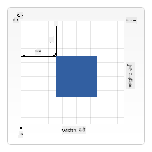

<!--
CO_OP_TRANSLATOR_METADATA:
{
  "original_hash": "056641280211e52fd0adb81b6058ec55",
  "translation_date": "2025-08-28T16:16:23+00:00",
  "source_file": "6-space-game/2-drawing-to-canvas/README.md",
  "language_code": "mr"
}
-->
# स्पेस गेम तयार करा भाग 2: हिरो आणि मॉन्स्टर्स कॅनव्हासवर काढा

## प्री-लेक्चर क्विझ

[प्री-लेक्चर क्विझ](https://ff-quizzes.netlify.app/web/quiz/31)

## कॅनव्हास

कॅनव्हास हा एक HTML घटक आहे ज्यामध्ये डीफॉल्टने कोणताही कंटेंट नसतो; तो एक कोरा पृष्ठभाग आहे. तुम्हाला त्यावर काहीतरी काढून त्यात भर घालावी लागते.

✅ [कॅनव्हास API बद्दल अधिक वाचा](https://developer.mozilla.org/docs/Web/API/Canvas_API) MDN वर.

हे सामान्यतः पेजच्या बॉडीचा भाग म्हणून खालीलप्रमाणे घोषित केले जाते:

```html
<canvas id="myCanvas" width="200" height="100"></canvas>
```

वरील कोडमध्ये आपण `id`, `width` आणि `height` सेट करत आहोत.

- `id`: हे सेट करा जेणेकरून तुम्हाला त्यावर काम करताना संदर्भ मिळेल.
- `width`: हा घटकाचा रुंदी आहे.
- `height`: हा घटकाचा उंची आहे.

## साध्या भूमितीय आकृत्या काढणे

कॅनव्हास गोष्टी काढण्यासाठी कार्टेशियन कोऑर्डिनेट सिस्टम वापरतो. त्यामुळे तो x-अक्ष आणि y-अक्ष वापरतो जेणेकरून एखादी गोष्ट कुठे आहे हे व्यक्त करता येईल. स्थान `0,0` हे वरच्या डाव्या कोपऱ्यात असते आणि खालच्या उजव्या कोपऱ्याचे स्थान कॅनव्हासच्या WIDTH आणि HEIGHT प्रमाणे असते.


> प्रतिमा [MDN](https://developer.mozilla.org/docs/Web/API/Canvas_API/Tutorial/Drawing_shapes) वरून

कॅनव्हास घटकावर काहीतरी काढण्यासाठी तुम्हाला खालील टप्पे पार करावे लागतील:

1. **संदर्भ मिळवा** कॅनव्हास घटकाचा.
2. **संदर्भ मिळवा** कॅनव्हासवर असलेल्या Context घटकाचा.
3. **ड्रॉइंग ऑपरेशन करा** Context घटक वापरून.

वरील टप्प्यांसाठी कोड साधारणपणे खालीलप्रमाणे दिसतो:

```javascript
// draws a red rectangle
//1. get the canvas reference
canvas = document.getElementById("myCanvas");

//2. set the context to 2D to draw basic shapes
ctx = canvas.getContext("2d");

//3. fill it with the color red
ctx.fillStyle = 'red';

//4. and draw a rectangle with these parameters, setting location and size
ctx.fillRect(0,0, 200, 200) // x,y,width, height
```

✅ कॅनव्हास API मुख्यतः 2D आकृत्यांवर लक्ष केंद्रित करते, परंतु तुम्ही वेबसाइटवर 3D घटक देखील काढू शकता; यासाठी तुम्ही [WebGL API](https://developer.mozilla.org/docs/Web/API/WebGL_API) वापरू शकता.

कॅनव्हास API वापरून तुम्ही खालील गोष्टी काढू शकता:

- **भूमितीय आकृत्या**, आम्ही आधीच आयत कसा काढायचा ते दाखवले आहे, पण तुम्ही आणखी बरेच काही काढू शकता.
- **मजकूर**, तुम्ही कोणत्याही फॉन्ट आणि रंगासह मजकूर काढू शकता.
- **प्रतिमा**, तुम्ही .jpg किंवा .png सारख्या प्रतिमा फाइलवरून प्रतिमा काढू शकता.

✅ प्रयत्न करा! तुम्हाला आयत कसा काढायचा हे माहित आहे, तुम्ही पृष्ठावर वर्तुळ काढू शकता का? CodePen वर काही मनोरंजक कॅनव्हास ड्रॉइंग्स पहा. येथे एक [खूप प्रभावी उदाहरण](https://codepen.io/dissimulate/pen/KrAwx) आहे.

## प्रतिमा संसाधन लोड करा आणि काढा

तुम्ही `Image` ऑब्जेक्ट तयार करून आणि त्याच्या `src` प्रॉपर्टी सेट करून प्रतिमा संसाधन लोड करता. नंतर तुम्ही `load` इव्हेंट ऐकता जेणेकरून ते वापरण्यास तयार असल्याचे कळेल. कोड खालीलप्रमाणे दिसतो:

### संसाधन लोड करा

```javascript
const img = new Image();
img.src = 'path/to/my/image.png';
img.onload = () => {
  // image loaded and ready to be used
}
```

### संसाधन लोड करण्याचा पॅटर्न

वरील कोड एका संरचनेत गुंडाळणे शिफारसीय आहे, जेणेकरून ते वापरण्यास सोपे होईल आणि तुम्ही ते पूर्णपणे लोड झाल्यावरच त्यावर काम करू शकता:

```javascript
function loadAsset(path) {
  return new Promise((resolve) => {
    const img = new Image();
    img.src = path;
    img.onload = () => {
      // image loaded and ready to be used
      resolve(img);
    }
  })
}

// use like so

async function run() {
  const heroImg = await loadAsset('hero.png')
  const monsterImg = await loadAsset('monster.png')
}

```

गेम संसाधने स्क्रीनवर काढण्यासाठी तुमचा कोड खालीलप्रमाणे दिसेल:

```javascript
async function run() {
  const heroImg = await loadAsset('hero.png')
  const monsterImg = await loadAsset('monster.png')

  canvas = document.getElementById("myCanvas");
  ctx = canvas.getContext("2d");
  ctx.drawImage(heroImg, canvas.width/2,canvas.height/2);
  ctx.drawImage(monsterImg, 0,0);
}
```

## आता तुमचा गेम तयार करण्यास सुरुवात करण्याची वेळ आली आहे

### काय तयार करायचे

तुम्ही कॅनव्हास घटकासह एक वेब पृष्ठ तयार कराल. ते `1024*768` काळ्या स्क्रीनवर रेंडर करेल. आम्ही तुम्हाला दोन प्रतिमा दिल्या आहेत:

- हिरो शिप

   

- 5*5 मॉन्स्टर

   

### विकास सुरू करण्यासाठी शिफारस केलेले टप्पे

`your-work` सब फोल्डरमध्ये तयार केलेल्या फाइल्स शोधा. त्यामध्ये खालील गोष्टी असाव्यात:

```bash
-| assets
  -| enemyShip.png
  -| player.png
-| index.html
-| app.js
-| package.json
```

Visual Studio Code मध्ये या फोल्डरची कॉपी उघडा. तुम्हाला स्थानिक विकास वातावरण सेटअप करणे आवश्यक आहे, प्राधान्याने Visual Studio Code सह NPM आणि Node स्थापित केलेले असावे. जर तुमच्या संगणकावर `npm` सेटअप नसेल, तर [ते कसे करायचे ते येथे आहे](https://www.npmjs.com/get-npm).

तुमचा प्रोजेक्ट सुरू करण्यासाठी `your_work` फोल्डरमध्ये जा:

```bash
cd your-work
npm start
```

वरील कोड `http://localhost:5000` या पत्त्यावर HTTP सर्व्हर सुरू करेल. ब्राउझर उघडा आणि तो पत्ता टाका. सध्या ते रिक्त पृष्ठ आहे, पण ते बदलणार आहे.

> टीप: स्क्रीनवर बदल पाहण्यासाठी, तुमचा ब्राउझर रीफ्रेश करा.

### कोड जोडा

`your-work/app.js` मध्ये आवश्यक कोड जोडा आणि खालील सोडवा:

1. **काढा** काळ्या पार्श्वभूमीसह कॅनव्हास
   > टीप: `/app.js` मधील योग्य TODO अंतर्गत दोन ओळी जोडा, `ctx` घटक काळा सेट करा आणि वर/डावीकडील समन्वय 0,0 वर सेट करा आणि कॅनव्हासच्या उंची आणि रुंदी समान सेट करा.
2. **लोड करा** टेक्सचर्स
   > टीप: `await loadTexture` वापरून आणि प्रतिमेचा मार्ग पास करून प्लेयर आणि शत्रू प्रतिमा जोडा. तुम्हाला त्या स्क्रीनवर अद्याप दिसणार नाहीत!
3. **काढा** हिरो स्क्रीनच्या मध्यभागी खालच्या अर्ध्या भागात
   > टीप: `drawImage` API वापरून heroImg स्क्रीनवर काढा, `canvas.width / 2 - 45` आणि `canvas.height - canvas.height / 4)` सेट करा.
4. **काढा** 5*5 मॉन्स्टर्स
   > टीप: आता तुम्ही स्क्रीनवर शत्रू काढण्यासाठी कोड अनकॉमेंट करू शकता. नंतर, `createEnemies` फंक्शनमध्ये जा आणि ते तयार करा.

   प्रथम, काही constants सेट करा:

    ```javascript
    const MONSTER_TOTAL = 5;
    const MONSTER_WIDTH = MONSTER_TOTAL * 98;
    const START_X = (canvas.width - MONSTER_WIDTH) / 2;
    const STOP_X = START_X + MONSTER_WIDTH;
    ```

    नंतर, मॉन्स्टर्सच्या array ला स्क्रीनवर काढण्यासाठी लूप तयार करा:

    ```javascript
    for (let x = START_X; x < STOP_X; x += 98) {
        for (let y = 0; y < 50 * 5; y += 50) {
          ctx.drawImage(enemyImg, x, y);
        }
      }
    ```

## परिणाम

पूर्ण झालेला परिणाम खालीलप्रमाणे दिसायला हवा:


## समाधान

कृपया स्वतःच सोडवण्याचा प्रयत्न करा, पण जर तुम्हाला अडचण आली तर [समाधान](../../../../6-space-game/2-drawing-to-canvas/solution/app.js) पहा.

---

## 🚀 आव्हान

तुम्ही 2D-केंद्रित कॅनव्हास API बद्दल शिकला आहात; [WebGL API](https://developer.mozilla.org/docs/Web/API/WebGL_API) बद्दल वाचा आणि 3D ऑब्जेक्ट काढण्याचा प्रयत्न करा.

## पोस्ट-लेक्चर क्विझ

[पोस्ट-लेक्चर क्विझ](https://ff-quizzes.netlify.app/web/quiz/32)

## पुनरावलोकन आणि स्व-अभ्यास

कॅनव्हास API बद्दल अधिक जाणून घ्या [त्याबद्दल वाचून](https://developer.mozilla.org/docs/Web/API/Canvas_API).

## असाइनमेंट

[कॅनव्हास API वापरून प्रयोग करा](assignment.md)

---

**अस्वीकृती**:  
हा दस्तऐवज AI भाषांतर सेवा [Co-op Translator](https://github.com/Azure/co-op-translator) वापरून भाषांतरित करण्यात आला आहे. आम्ही अचूकतेसाठी प्रयत्नशील असलो तरी कृपया लक्षात ठेवा की स्वयंचलित भाषांतरांमध्ये त्रुटी किंवा अचूकतेचा अभाव असू शकतो. मूळ भाषेतील दस्तऐवज हा अधिकृत स्रोत मानला जावा. महत्त्वाच्या माहितीसाठी व्यावसायिक मानवी भाषांतराची शिफारस केली जाते. या भाषांतराचा वापर करून निर्माण होणाऱ्या कोणत्याही गैरसमज किंवा चुकीच्या अर्थासाठी आम्ही जबाबदार राहणार नाही.