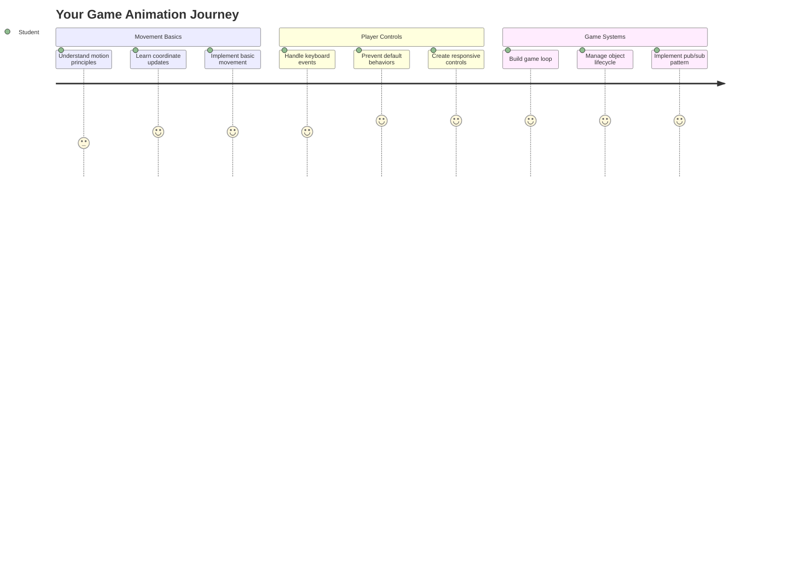
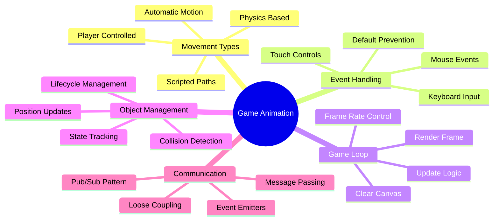
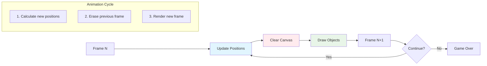
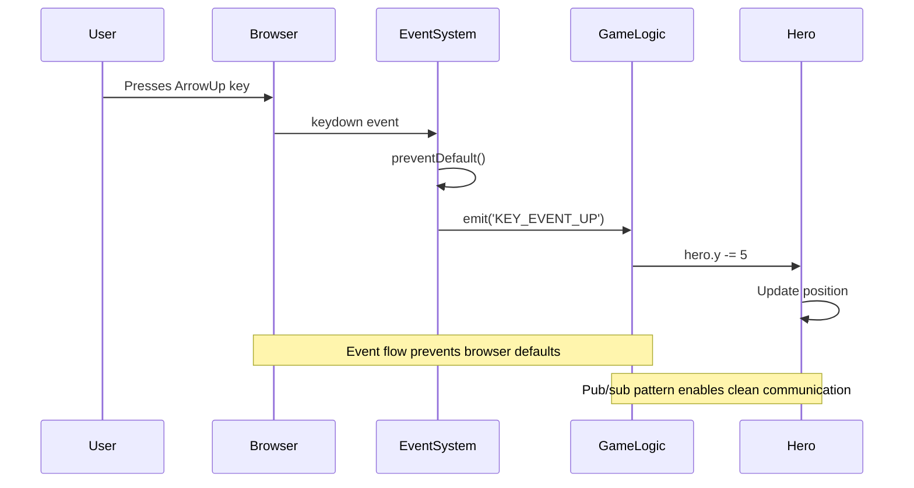
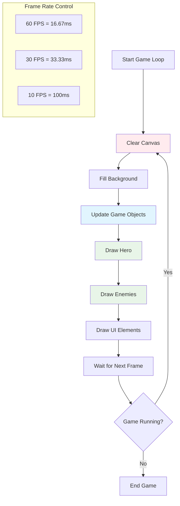
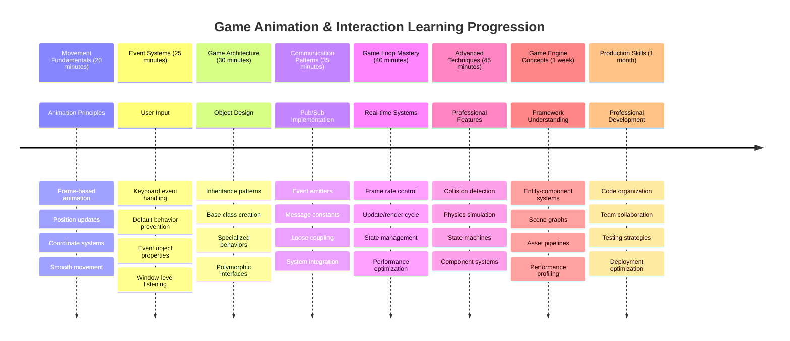

# स्पेस गेम तयार करा भाग 3: गती जोडणे



तुमच्या आवडत्या गेम्सबद्दल विचार करा – त्यांना आकर्षक बनवणारी गोष्ट फक्त सुंदर ग्राफिक्स नाही, तर ती गोष्ट कशी हलते आणि तुमच्या कृतींना कशी प्रतिसाद देते. सध्या, तुमचा स्पेस गेम एक सुंदर चित्रासारखा आहे, पण आता आपण त्यात गती जोडणार आहोत ज्यामुळे तो जिवंत वाटेल.

जेव्हा NASA चे अभियंते अपोलो मिशनसाठी मार्गदर्शन संगणक प्रोग्राम करत होते, तेव्हा त्यांना असाच एक आव्हान होता: पायलटच्या इनपुटला प्रतिसाद देताना अंतराळयान आपोआप कोर्स सुधारणा कसे राखेल? आज आपण शिकणार असलेल्या तत्त्वे त्याच संकल्पनांना प्रतिध्वनी देतात – खेळाडू-नियंत्रित गती व्यवस्थापनासह स्वयंचलित प्रणालीचे वर्तन.

या धड्यात, तुम्ही अंतराळयान स्क्रीनवर कसे सरकवायचे, खेळाडूच्या आदेशांना कसे प्रतिसाद द्यायचे आणि गतीचे गुळगुळीत नमुने कसे तयार करायचे हे शिकाल. आम्ही सर्वकाही व्यवस्थापित संकल्पनांमध्ये विभागून नैसर्गिकरित्या एकमेकांवर आधारित शिकवू.

शेवटी, खेळाडू त्यांचे हिरो जहाज स्क्रीनवर उडवतील आणि शत्रू जहाजे वर गस्त घालतील. त्याहून महत्त्वाचे म्हणजे, तुम्हाला गेम गती प्रणालींना चालवणारी मुख्य तत्त्वे समजतील.



## प्री-लेक्चर क्विझ

[प्री-लेक्चर क्विझ](https://ff-quizzes.netlify.app/web/quiz/33)

## गेम गती समजून घेणे

गेम्स खऱ्या अर्थाने जिवंत वाटतात जेव्हा गोष्टी हलायला लागतात, आणि मूलतः दोन प्रकारे हे घडते:

- **खेळाडू-नियंत्रित गती**: जेव्हा तुम्ही एखादी की दाबता किंवा माउस क्लिक करता, तेव्हा काहीतरी हलते. हा तुमच्या आणि गेमच्या जगामधील थेट संबंध आहे.
- **स्वयंचलित गती**: जेव्हा गेम स्वतःच गोष्टी हलवण्याचा निर्णय घेतो – जसे की शत्रू जहाजे स्क्रीनवर गस्त घालतात, तुम्ही काहीही करत नसल्यास.

संगणक स्क्रीनवर वस्तू हलवणे अपेक्षेपेक्षा सोपे आहे. गणित वर्गातील x आणि y निर्देशांक लक्षात आहेत का? आपण याच गोष्टींवर काम करत आहोत. जेव्हा गॅलिलिओने 1610 मध्ये ज्युपिटरच्या चंद्रांचा मागोवा घेतला, तेव्हा तो मूलतः तेच करत होता – गती नमुने समजण्यासाठी वेळोवेळी स्थानांचे प्लॉटिंग.

स्क्रीनवर गोष्टी हलवणे म्हणजे फ्लिपबुक अॅनिमेशन तयार करण्यासारखे आहे – तुम्हाला हे तीन सोप्या पायऱ्या फॉलो कराव्या लागतील:



1. **स्थान अपडेट करा** – तुमची वस्तू कुठे असावी ते बदला (कदाचित ती उजवीकडे 5 पिक्सल हलवा)
2. **जुना फ्रेम मिटवा** – स्क्रीन साफ करा जेणेकरून तुम्हाला भूतासारखे मागचे चिन्ह दिसणार नाही
3. **नवीन फ्रेम काढा** – तुमची वस्तू तिच्या नवीन ठिकाणी ठेवा

हे पुरेसे वेगाने करा, आणि बघा! तुम्हाला गुळगुळीत गती मिळेल जी खेळाडूंना नैसर्गिक वाटेल.

कोडमध्ये हे कसे दिसते ते येथे आहे:

```javascript
// Set the hero's location
hero.x += 5;
// Clear the rectangle that hosts the hero
ctx.clearRect(0, 0, canvas.width, canvas.height);
// Redraw the game background and hero
ctx.fillRect(0, 0, canvas.width, canvas.height);
ctx.fillStyle = "black";
ctx.drawImage(heroImg, hero.x, hero.y);
```

**या कोडचे कार्य:**
- **अपडेट करते** हिरोचा x-निर्देशांक 5 पिक्सलने, त्याला आडव्या दिशेने हलवण्यासाठी
- **संपूर्ण कॅनव्हास क्षेत्र साफ करते** मागील फ्रेम काढून टाकण्यासाठी
- **कॅनव्हासला काळ्या पार्श्वभूमीच्या रंगाने भरते**
- **हिरोची प्रतिमा त्याच्या नवीन स्थानावर पुन्हा काढते**

✅ तुम्हाला असे का वाटते की तुमच्या हिरोला अनेक फ्रेम्स प्रति सेकंद पुन्हा काढल्याने कार्यक्षमतेवर परिणाम होऊ शकतो? [या पॅटर्नच्या पर्यायांबद्दल वाचा](https://developer.mozilla.org/en-US/docs/Web/API/Canvas_API/Tutorial/Optimizing_canvas).

## कीबोर्ड इव्हेंट्स हाताळा

हेथे आपण खेळाडूच्या इनपुटला गेमच्या कृतीशी जोडतो. जेव्हा कोणी लेझर फायर करण्यासाठी स्पेसबार दाबतो किंवा अॅस्टरॉइड टाळण्यासाठी अॅरो की दाबतो, तेव्हा तुमच्या गेमला तो इनपुट शोधून त्याला प्रतिसाद द्यावा लागतो.

कीबोर्ड इव्हेंट्स विंडो स्तरावर घडतात, म्हणजे तुमचे संपूर्ण ब्राउझर विंडो त्या कीप्रेससाठी ऐकत असते. माउस क्लिक, दुसऱ्या बाजूला, विशिष्ट घटकांशी जोडले जाऊ शकते (जसे की बटण क्लिक करणे). आपल्या स्पेस गेमसाठी, आपण कीबोर्ड कंट्रोल्सवर लक्ष केंद्रित करू कारण ते खेळाडूंना क्लासिक आर्केड अनुभव देते.

हे मला आठवते की 1800 च्या दशकातील टेलिग्राफ ऑपरेटरला मोर्स कोड इनपुटला अर्थपूर्ण संदेशांमध्ये अनुवाद करावा लागायचा – आपण काहीसे तसेच करत आहोत, कीप्रेसला गेम कमांडमध्ये अनुवादित करत आहोत.

इव्हेंट हाताळण्यासाठी तुम्हाला विंडोच्या `addEventListener()` पद्धतीचा वापर करावा लागतो आणि त्याला दोन इनपुट पॅरामीटर्स द्यावे लागतात. पहिला पॅरामीटर इव्हेंटचे नाव आहे, उदाहरणार्थ `keyup`. दुसरा पॅरामीटर इव्हेंट घडल्यामुळे कॉल केला जाणारा फंक्शन आहे.

येथे एक उदाहरण आहे:

```javascript
window.addEventListener('keyup', (evt) => {
  // evt.key = string representation of the key
  if (evt.key === 'ArrowUp') {
    // do something
  }
});
```

**येथे काय घडते ते समजून घ्या:**
- **कीबोर्ड इव्हेंट्ससाठी ऐकते** संपूर्ण विंडोवर
- **इव्हेंट ऑब्जेक्ट कॅप्चर करते** ज्यामध्ये कोणती की दाबली गेली याची माहिती असते
- **तपासते** की दाबलेली की विशिष्ट कीशी जुळते का (या प्रकरणात, वरची अॅरो की)
- **कोड अंमलात आणते** जेव्हा अटी पूर्ण होतात

की इव्हेंट्ससाठी इव्हेंटवर दोन प्रॉपर्टीज असतात ज्याचा वापर तुम्ही कोणती की दाबली गेली हे पाहण्यासाठी करू शकता:

- `key` - दाबलेल्या कीचे स्ट्रिंग प्रतिनिधित्व, उदाहरणार्थ `'ArrowUp'`
- `keyCode` - याचा संख्यात्मक प्रतिनिधित्व, उदाहरणार्थ `37`, जो `ArrowLeft` शी संबंधित आहे

✅ गेम डेव्हलपमेंटच्या बाहेर की इव्हेंट मॅनिप्युलेशन उपयुक्त आहे. या तंत्राचा आणखी कोणत्या उपयोगासाठी विचार करू शकता?



### विशेष की: एक सूचना!

काही कींमध्ये अंगभूत ब्राउझर वर्तन असते जे तुमच्या गेममध्ये अडथळा आणू शकते. अॅरो की पृष्ठ स्क्रोल करतात आणि स्पेसबार खाली उडी मारतो – जेव्हा कोणी त्यांचे अंतराळयान चालवण्याचा प्रयत्न करत असतो तेव्हा तुम्हाला हे वर्तन नको असते.

आपण ही डीफॉल्ट वर्तन रोखू शकतो आणि त्याऐवजी आपला गेम इनपुट हाताळू शकतो. हे अगदी तसेच आहे जसे की सुरुवातीच्या संगणक प्रोग्रामरला सिस्टिम इंटरप्ट्स ओव्हरराइड करावे लागले जेणेकरून सानुकूल वर्तन तयार करता येईल – आपण फक्त ब्राउझर स्तरावर ते करत आहोत. हे कसे करायचे:

```javascript
const onKeyDown = function (e) {
  console.log(e.keyCode);
  switch (e.keyCode) {
    case 37:
    case 39:
    case 38:
    case 40: // Arrow keys
    case 32:
      e.preventDefault();
      break; // Space
    default:
      break; // do not block other keys
  }
};

window.addEventListener('keydown', onKeyDown);
```

**या प्रतिबंध कोडचे समजून घ्या:**
- **तपासते** विशिष्ट की कोड्ससाठी जे अवांछित ब्राउझर वर्तन निर्माण करू शकतात
- **डीफॉल्ट ब्राउझर क्रिया रोखते** अॅरो की आणि स्पेसबारसाठी
- **इतर कींना सामान्यपणे कार्य करण्यास परवानगी देते**
- **`e.preventDefault()` वापरते** ब्राउझरचे अंगभूत वर्तन थांबवण्यासाठी

### 🔄 **शैक्षणिक तपासणी**
**इव्हेंट हाताळणी समजून घेणे**: स्वयंचलित गतीकडे जाण्यापूर्वी, तुम्ही हे करू शकता:
- ✅ `keydown` आणि `keyup` इव्हेंट्समधील फरक स्पष्ट करा
- ✅ डीफॉल्ट ब्राउझर वर्तन का रोखतो हे समजून घ्या
- ✅ इव्हेंट लिसनर्स कसे वापरकर्त्याच्या इनपुटला गेम लॉजिकशी जोडतात हे वर्णन करा
- ✅ कोणत्या की गेम कंट्रोल्समध्ये अडथळा आणू शकतात हे ओळखा

**जलद स्व-परीक्षण**: जर तुम्ही अॅरो कीसाठी डीफॉल्ट वर्तन रोखले नाही तर काय होईल?
*उत्तर: ब्राउझर पृष्ठ स्क्रोल करेल, गेम गतीमध्ये अडथळा आणेल*

**इव्हेंट सिस्टीम आर्किटेक्चर**: तुम्हाला आता समजले आहे:
- **विंडो-स्तरीय ऐकणे**: ब्राउझर स्तरावर इव्हेंट्स कॅप्चर करणे
- **इव्हेंट ऑब्जेक्ट प्रॉपर्टीज**: `key` स्ट्रिंग्स विरुद्ध `keyCode` नंबर
- **डीफॉल्ट प्रतिबंध**: अवांछित ब्राउझर वर्तन थांबवणे
- **शर्ती लॉजिक**: विशिष्ट की संयोजनांना प्रतिसाद देणे

## गेम प्रेरित गती

आता आपण खेळाडूच्या इनपुटशिवाय वस्तू हलवण्याबद्दल बोलूया. स्क्रीनवर फिरणाऱ्या शत्रू जहाजांचा विचार करा, सरळ रेषेत उडणाऱ्या गोळ्यांचा किंवा पार्श्वभूमीतील ढगांचा. ही स्वायंचलित गती तुमच्या गेमच्या जगाला जिवंत वाटते जरी कोणीही नियंत्रणाला स्पर्श करत नसेल.

आपण JavaScript च्या अंगभूत टाइमर्सचा वापर करून नियमित अंतराने स्थान अपडेट करतो. ही संकल्पना पेंडुलम घड्याळ कसे कार्य करते यासारखी आहे – एक नियमित यंत्रणा जी सुसंगत, वेळेवर क्रिया ट्रिगर करते. हे किती सोपे असू शकते ते येथे आहे:

```javascript
const id = setInterval(() => {
  // Move the enemy on the y axis
  enemy.y += 10;
}, 100);
```

**या गती कोडचे कार्य:**
- **टायमर तयार करते** जो प्रत्येक 100 मिलिसेकंदांनी चालतो
- **शत्रूचा y-निर्देशांक 10 पिक्सलने अपडेट करते** प्रत्येक वेळी
- **इंटरवल आयडी साठवते** जेणेकरून नंतर ते थांबवता येईल
- **शत्रूला स्क्रीनवर खाली हलवते** स्वयंचलितपणे

## गेम लूप

येथे एक संकल्पना आहे जी सर्वकाही एकत्र बांधते – गेम लूप. जर तुमचा गेम एक चित्रपट असेल, तर गेम लूप हा फिल्म प्रोजेक्टर असेल, जो फ्रेम नंतर फ्रेम इतक्या वेगाने दाखवतो की सर्वकाही गुळगुळीतपणे हलत असल्याचे दिसते.

प्रत्येक गेमच्या मागे एक लूप चालू असतो. ही एक फंक्शन आहे जी सर्व गेम ऑब्जेक्ट्स अपडेट करते, स्क्रीन पुन्हा काढते आणि सतत हा प्रक्रिया पुन्हा करते. हे तुमच्या हिरो, सर्व शत्रू, उडणाऱ्या लेझर्स – संपूर्ण गेम स्टेटचा मागोवा ठेवते.

ही संकल्पना मला आठवते की सुरुवातीच्या फिल्म अॅनिमेटर्स जसे की वॉल्ट डिस्नेने पात्रांना फ्रेम बाय फ्रेम पुन्हा काढले होते जेणेकरून गतीचा भ्रम निर्माण होईल. आपण तेच करत आहोत, फक्त पेन्सिल्सऐवजी कोडसह.

गेम लूप कोडमध्ये कसे दिसते ते येथे आहे:



```javascript
const gameLoopId = setInterval(() => {
  function gameLoop() {
    ctx.clearRect(0, 0, canvas.width, canvas.height);
    ctx.fillStyle = "black";
    ctx.fillRect(0, 0, canvas.width, canvas.height);
    drawHero();
    drawEnemies();
    drawStaticObjects();
  }
  gameLoop();
}, 200);
```

**गेम लूप संरचना समजून घ्या:**
- **संपूर्ण कॅनव्हास साफ करते** मागील फ्रेम काढण्यासाठी
- **पार्श्वभूमीला एकसंध रंगाने भरते**
- **सर्व गेम ऑब्जेक्ट्स त्यांच्या वर्तमान स्थानांवर काढते**
- **200 मिलिसेकंदांच्या अंतराने ही प्रक्रिया पुन्हा करते** गुळगुळीत अॅनिमेशन तयार करण्यासाठी
- **फ्रेम रेट व्यवस्थापित करते** इंटरवल टाइमिंग नियंत्रित करून

## स्पेस गेम सुरू ठेवणे

आता आपण स्थिर दृश्याला गती देणार आहोत जे तुम्ही यापूर्वी तयार केले होते. आपण ते स्क्रीनशॉटमधून एक परस्पर अनुभवामध्ये रूपांतरित करणार आहोत. प्रत्येक भाग मागील भागावर आधारित असेल याची खात्री करून आपण हे पायऱ्यांमध्ये काम करू.

मागील धड्यातून कोड घ्या (किंवा तुम्हाला नवीन सुरुवात करायची असल्यास [भाग II- स्टार्टर](../../../../6-space-game/3-moving-elements-around/your-work) फोल्डरमधील कोड वापरा).

**आज आपण काय तयार करणार आहोत:**
- **हिरो कंट्रोल्स**: अॅरो की तुमचे अंतराळयान स्क्रीनवर चालवतील
- **शत्रू गती**: ती एलियन जहाजे त्यांचा हल्ला सुरू करतील

चला या वैशिष्ट्यांची अंमलबजावणी सुरू करूया.

## शिफारस केलेल्या पायऱ्या

`your-work` सब फोल्डरमध्ये तयार केलेल्या फाइल्स शोधा. त्यात खालील गोष्टी असाव्यात:

```bash
-| assets
  -| enemyShip.png
  -| player.png
-| index.html
-| app.js
-| package.json
```

तुमचा प्रोजेक्ट `your-work` फोल्डरमध्ये सुरू करण्यासाठी टाइप करा:

```bash
cd your-work
npm start
```

**या कमांडचे कार्य:**
- **तुमच्या प्रोजेक्ट डायरेक्टरीमध्ये नेते**
- **HTTP सर्व्हर सुरू करते** पत्त्यावर `http://localhost:5000`
- **तुमच्या गेम फाइल्स सर्व्ह करते** जेणेकरून तुम्ही ब्राउझरमध्ये त्यांची चाचणी करू शकता

वरील HTTP सर्व्हर पत्त्यावर `http://localhost:5000` सुरू होईल. ब्राउझर उघडा आणि तो पत्ता टाइप करा, सध्या ते हिरो आणि सर्व शत्रूंना रेंडर करेल; काहीही हलत नाही - अजून!

### कोड जोडा

1. **`hero`, `enemy` आणि `game object` साठी समर्पित ऑब्जेक्ट्स जोडा**, त्यांच्याकडे `x` आणि `y` प्रॉपर्टीज असाव्यात. (याबद्दल [Inheritance किंवा composition](../README.md) भाग लक्षात ठेवा).

   *सूचना* `game object` हा तोच असावा ज्यामध्ये `x` आणि `y` असतील आणि स्वतःला कॅनव्हासवर काढण्याची क्षमता असेल.

   > **टीप**: नवीन `GameObject` क्लास जोडा ज्याचा कन्स्ट्रक्टर खालीलप्रमाणे परिभाषित करा आणि नंतर कॅनव्हासवर काढा:

    ```javascript
    class GameObject {
      constructor(x, y) {
        this.x = x;
        this.y = y;
        this.dead = false;
        this.type = "";
        this.width = 0;
        this.height = 0;
        this.img = undefined;
      }
    
      draw(ctx) {
        ctx.drawImage(this.img, this.x, this.y, this.width, this.height);
      }
    }
    ```

    **या बेस क्लासचे समजून घ्या:**
    - **सामान्य प्रॉपर्टीज परिभाषित करते** जे सर्व गेम ऑब्जेक्ट्स सामाय
   - **सुरुवात करते** सर्व गेम ऑब्जेक्ट्स ठेवण्यासाठी एक array तयार करते

   4. **गेम सुरू करा**

       ```javascript
       function initGame() {
         gameObjects = [];
         createEnemies();
         createHero();
       
         eventEmitter.on(Messages.KEY_EVENT_UP, () => {
           hero.y -= 5;
         });
       
         eventEmitter.on(Messages.KEY_EVENT_DOWN, () => {
           hero.y += 5;
         });
       
         eventEmitter.on(Messages.KEY_EVENT_LEFT, () => {
           hero.x -= 5;
         });
       
4. **गेम लूप सेटअप करा**

   `window.onload` फंक्शनला पुनर्रचना करा जेणेकरून गेम सुरू होईल आणि योग्य अंतराने गेम लूप सेटअप होईल. तुम्ही लेझर बीम देखील जोडाल:

    ```javascript
    window.onload = async () => {
      canvas = document.getElementById("canvas");
      ctx = canvas.getContext("2d");
      heroImg = await loadTexture("assets/player.png");
      enemyImg = await loadTexture("assets/enemyShip.png");
      laserImg = await loadTexture("assets/laserRed.png");
    
      initGame();
      const gameLoopId = setInterval(() => {
        ctx.clearRect(0, 0, canvas.width, canvas.height);
        ctx.fillStyle = "black";
        ctx.fillRect(0, 0, canvas.width, canvas.height);
        drawGameObjects(ctx);
      }, 100);
    };
    ```

   **गेम सेटअप समजून घेणे:**
   - **प्रतीक्षा करते** पृष्ठ पूर्णपणे लोड होईपर्यंत
   - **कॅनव्हास एलिमेंट आणि त्याचा 2D रेंडरिंग संदर्भ मिळवते**
   - **सर्व इमेज अॅसेट्स असिंक्रोनसली लोड करते** `await` वापरून
   - **गेम लूप सुरू करते** 100ms अंतराने चालणारे (10 FPS)
   - **स्क्रीन साफ करते आणि प्रत्येक फ्रेममध्ये पुन्हा रेखाटते**

5. **कोड जोडा** जेणेकरून ठराविक अंतराने शत्रू हलतील

    `createEnemies()` फंक्शनला पुनर्रचना करा जेणेकरून शत्रू तयार होतील आणि त्यांना नवीन gameObjects वर्गात ढकलले जाईल:

    ```javascript
    function createEnemies() {
      const MONSTER_TOTAL = 5;
      const MONSTER_WIDTH = MONSTER_TOTAL * 98;
      const START_X = (canvas.width - MONSTER_WIDTH) / 2;
      const STOP_X = START_X + MONSTER_WIDTH;
    
      for (let x = START_X; x < STOP_X; x += 98) {
        for (let y = 0; y < 50 * 5; y += 50) {
          const enemy = new Enemy(x, y);
          enemy.img = enemyImg;
          gameObjects.push(enemy);
        }
      }
    }
    ```

    **शत्रू तयार करण्याचे कार्य:**
    - **पोजिशन्सची गणना करते** जेणेकरून शत्रू स्क्रीनच्या मध्यभागी असतील
    - **शत्रूंचा ग्रिड तयार करते** नेस्टेड लूप्स वापरून
    - **प्रत्येक शत्रू ऑब्जेक्टला शत्रू इमेज असाइन करते**
    - **प्रत्येक शत्रूला ग्लोबल गेम ऑब्जेक्ट्स array मध्ये जोडते**
    
    आणि `createHero()` फंक्शन जोडा जे नायकासाठी समान प्रक्रिया करेल.
    
    ```javascript
    function createHero() {
      hero = new Hero(
        canvas.width / 2 - 45,
        canvas.height - canvas.height / 4
      );
      hero.img = heroImg;
      gameObjects.push(hero);
    }
    ```

    **नायक तयार करण्याचे कार्य:**
    - **नायकाला स्क्रीनच्या तळाशी मध्यभागी ठेवते**
    - **नायक ऑब्जेक्टला नायक इमेज असाइन करते**
    - **नायकाला गेम ऑब्जेक्ट्स array मध्ये रेंडरिंगसाठी जोडते**

    आणि शेवटी, `drawGameObjects()` फंक्शन जोडा जे रेखाटन सुरू करेल:

    ```javascript
    function drawGameObjects(ctx) {
      gameObjects.forEach(go => go.draw(ctx));
    }
    ```

    **रेखाटन फंक्शन समजून घेणे:**
    - **सर्व गेम ऑब्जेक्ट्स array मधून iterate करते**
    - **प्रत्येक ऑब्जेक्टवर `draw()` मेथड कॉल करते**
    - **कॅनव्हास संदर्भ पास करते जेणेकरून ऑब्जेक्ट्स स्वतःला रेंडर करू शकतील**

    ### 🔄 **शैक्षणिक तपासणी**
    **पूर्ण गेम सिस्टम समजून घेणे**: संपूर्ण आर्किटेक्चरची तुमची मास्टरी तपासा:
    - ✅ वारसाहक्क कसा नायक आणि शत्रूंना सामान्य GameObject गुणधर्म शेअर करण्यास अनुमती देतो?
    - ✅ pub/sub पॅटर्न तुमचा कोड अधिक टिकाऊ का बनवतो?
    - ✅ गेम लूप गुळगुळीत अॅनिमेशन तयार करण्यात कोणती भूमिका बजावतो?
    - ✅ इव्हेंट लिसनर्स गेम ऑब्जेक्टच्या वर्तनाशी वापरकर्ता इनपुट कसे जोडतात?

    **सिस्टम इंटिग्रेशन**: तुमचा गेम आता दाखवतो:
    - **ऑब्जेक्ट-ओरिएंटेड डिझाइन**: बेस क्लासेससह विशेष वारसाहक्क
    - **इव्हेंट-ड्रिव्हन आर्किटेक्चर**: pub/sub पॅटर्नसाठी सैल कपलिंग
    - **अॅनिमेशन फ्रेमवर्क**: गेम लूपसह सुसंगत फ्रेम अपडेट्स
    - **इनपुट हँडलिंग**: कीबोर्ड इव्हेंट्ससह डिफॉल्ट प्रिव्हेंशन
    - **अॅसेट मॅनेजमेंट**: इमेज लोडिंग आणि स्प्राइट रेंडरिंग

    **प्रोफेशनल पॅटर्न्स**: तुम्ही अंमलात आणले आहे:
    - **सेपरेशन ऑफ कन्सर्न्स**: इनपुट, लॉजिक आणि रेंडरिंग वेगळे
    - **पॉलिमॉर्फिझम**: सर्व गेम ऑब्जेक्ट्स सामान्य रेखाटन इंटरफेस शेअर करतात
    - **मेस्सेज पासिंग**: घटकांमधील स्वच्छ संवाद
    - **रिसोर्स मॅनेजमेंट**: कार्यक्षम स्प्राइट आणि अॅनिमेशन हँडलिंग

    तुमचे शत्रू तुमच्या नायकाच्या स्पेसशिपकडे पुढे सरकायला सुरुवात करायला हवे!
      }
    }
    ```
    
    and add a `createHero()` function to do a similar process for the hero.
    
    ```javascript
    function createHero() {
      hero = new Hero(
        canvas.width / 2 - 45,
        canvas.height - canvas.height / 4
      );
      hero.img = heroImg;
      gameObjects.push(hero);
    }
    ```

    आणि शेवटी, `drawGameObjects()` फंक्शन जोडा जे रेखाटन सुरू करेल:

    ```javascript
    function drawGameObjects(ctx) {
      gameObjects.forEach(go => go.draw(ctx));
    }
    ```

    तुमचे शत्रू तुमच्या नायकाच्या स्पेसशिपकडे पुढे सरकायला सुरुवात करायला हवे!

---

## GitHub Copilot Agent Challenge 🚀

तुमच्या गेमची चमक वाढवण्यासाठी एक आव्हान: सीमा आणि गुळगुळीत नियंत्रण जोडणे. सध्या, तुमचा नायक स्क्रीनच्या बाहेर जाऊ शकतो आणि हालचाल थोडी खडबडीत वाटू शकते.

**तुमचे मिशन:** स्क्रीनवर तुमचे स्पेसशिप ठेवण्यासाठी एक प्रणाली तयार करा आणि नियंत्रण गुळगुळीत करा. जेव्हा खेळाडू एरो की दाबून ठेवतात, तेव्हा जहाज सतत सरकायला हवे, डिस्क्रीट स्टेप्सऐवजी. स्क्रीनच्या सीमांवर पोहोचल्यावर व्हिज्युअल फीडबॅक विचारात घ्या – कदाचित प्ले एरियाच्या कडेला सूचक प्रभाव.

[agent mode](https://code.visualstudio.com/blogs/2025/02/24/introducing-copilot-agent-mode) बद्दल अधिक जाणून घ्या.

## 🚀 Challenge

प्रकल्प वाढत असताना कोडचे आयोजन अधिक महत्त्वाचे होते. तुम्ही कदाचित लक्षात घेतले असेल की तुमची फाइल फंक्शन्स, व्हेरिएबल्स आणि क्लासेससह गोंधळलेली आहे. हे मला आठवते की अपोलो मिशन कोडचे आयोजन करणाऱ्या अभियंत्यांना एक स्पष्ट, टिकाऊ प्रणाली तयार करावी लागली ज्यावर अनेक टीम्स एकत्र काम करू शकतील.

**तुमचे मिशन:**
सॉफ्टवेअर आर्किटेक्टसारखे विचार करा. तुम्ही तुमचा कोड कसा आयोजित कराल जेणेकरून सहा महिन्यांनंतर तुम्ही (किंवा तुमचा सहकारी) काय चालले आहे ते समजू शकाल? जरी सर्व काही सध्या एका फाइलमध्ये राहिले तरी, तुम्ही चांगले आयोजन तयार करू शकता:

- **संबंधित फंक्शन्स गटबद्ध करणे** स्पष्ट कमेंट हेडर्ससह
- **कन्सर्न्स वेगळे करणे** - गेम लॉजिक रेंडरिंगपासून वेगळे ठेवा
- **सुसंगत नाव देणे** व्हेरिएबल्स आणि फंक्शन्ससाठी
- **मॉड्यूल्स किंवा नेमस्पेस तयार करणे** गेमच्या वेगवेगळ्या पैलूंना आयोजित करण्यासाठी
- **डॉक्युमेंटेशन जोडणे** जे प्रत्येक मुख्य विभागाचा उद्देश स्पष्ट करते

**प्रतिबिंब प्रश्न:**
- तुमच्या कोडचे कोणते भाग परत आल्यावर समजणे सर्वात कठीण आहे?
- तुमचा कोड दुसऱ्या व्यक्तीला योगदान देण्यासाठी सोपा कसा बनवता येईल?
- तुम्हाला पॉवर-अप्स किंवा वेगळ्या प्रकारचे शत्रू जोडायचे असल्यास काय होईल?

## Post-Lecture Quiz

[Post-lecture quiz](https://ff-quizzes.netlify.app/web/quiz/34)

## Review & Self Study

आम्ही सर्व काही सुरुवातीपासून तयार करत आहोत, जे शिकण्यासाठी उत्कृष्ट आहे, परंतु येथे एक छोटासा गुपित आहे – काही अद्भुत JavaScript फ्रेमवर्क्स आहेत जे तुमच्यासाठी बरेच काम करू शकतात. आम्ही कव्हर केलेल्या मूलभूत गोष्टींमध्ये तुम्हाला आराम वाटल्यावर, [उपलब्ध असलेल्या गोष्टींचा शोध घेणे](https://github.com/collections/javascript-game-engines) योग्य ठरेल.

फ्रेमवर्क्स म्हणजे प्रत्येक साधन हाताने बनवण्याऐवजी चांगल्या प्रकारे सुसज्ज टूलबॉक्स असणे. ते त्या कोड आयोजन आव्हानांपैकी अनेक सोडवू शकतात, तसेच अशा वैशिष्ट्यांची ऑफर देतात जी स्वतः तयार करण्यासाठी आठवडे लागतील.

**शोधण्यासारख्या गोष्टी:**
- गेम इंजिन्स कोड कसे आयोजित करतात – तुम्ही वापरत असलेल्या हुशार पॅटर्न्स पाहून तुम्हाला आश्चर्य वाटेल
- कॅनव्हास गेम्स गुळगुळीत चालवण्यासाठी परफॉर्मन्स ट्रिक्स  
- आधुनिक JavaScript वैशिष्ट्ये जी तुमचा कोड स्वच्छ आणि अधिक टिकाऊ बनवू शकतात
- गेम ऑब्जेक्ट्स आणि त्यांच्या नातेसंबंधांचे व्यवस्थापन करण्याचे वेगवेगळे दृष्टिकोन

## 🎯 Your Game Animation Mastery Timeline



### 🛠️ तुमचा गेम डेव्हलपमेंट टूलकिट सारांश

या धड्याचा अभ्यास केल्यानंतर, तुम्ही आता मास्टर केले आहे:
- **अॅनिमेशन तत्त्वे**: फ्रेम-आधारित हालचाल आणि गुळगुळीत संक्रमण
- **इव्हेंट-ड्रिव्हन प्रोग्रामिंग**: कीबोर्ड इनपुट हँडलिंगसह योग्य इव्हेंट व्यवस्थापन
- **ऑब्जेक्ट-ओरिएंटेड डिझाइन**: वारसाहक्क श्रेणी आणि पॉलिमॉर्फिक इंटरफेस
- **संवाद पॅटर्न्स**: टिकाऊ कोडसाठी pub/sub आर्किटेक्चर
- **गेम लूप आर्किटेक्चर**: रिअल-टाइम अपडेट आणि रेंडरिंग सायकल्स
- **इनपुट सिस्टम्स**: वापरकर्ता नियंत्रण मॅपिंगसह डिफॉल्ट वर्तन प्रतिबंध
- **अॅसेट मॅनेजमेंट**: स्प्राइट लोडिंग आणि कार्यक्षम रेंडरिंग तंत्र

### ⚡ **तुम्ही पुढील 5 मिनिटांत काय करू शकता**
- [ ] ब्राउझर कन्सोल उघडा आणि `addEventListener('keydown', console.log)` वापरून कीबोर्ड इव्हेंट्स पहा
- [ ] एक साधा div एलिमेंट तयार करा आणि एरो की वापरून हलवा
- [ ] सतत हालचाल तयार करण्यासाठी `setInterval` वापरून प्रयोग करा
- [ ] `event.preventDefault()` वापरून डिफॉल्ट वर्तन प्रतिबंध करण्याचा प्रयत्न करा

### 🎯 **तुम्ही या तासात काय साध्य करू शकता**
- [ ] पोस्ट-लेसन क्विझ पूर्ण करा आणि इव्हेंट-ड्रिव्हन प्रोग्रामिंग समजून घ्या
- [ ] पूर्ण कीबोर्ड नियंत्रणासह हलणारे नायक स्पेसशिप तयार करा
- [ ] गुळगुळीत शत्रू हालचाल पॅटर्न अंमलात आणा
- [ ] गेम ऑब्जेक्ट्स स्क्रीनच्या बाहेर जाण्यापासून रोखण्यासाठी सीमा जोडा
- [ ] गेम ऑब्जेक्ट्समधील मूलभूत टक्कर शोध तयार करा

### 📅 **तुमचा आठवडाभराचा अॅनिमेशन प्रवास**
- [ ] गुळगुळीत हालचाल आणि परस्परसंवादासह पूर्ण स्पेस गेम तयार करा
- [ ] वक्र, प्रवेग आणि भौतिकशास्त्रासारखे प्रगत हालचाल पॅटर्न जोडा
- [ ] गुळगुळीत संक्रमण आणि ईझिंग फंक्शन्स अंमलात आणा
- [ ] कण प्रभाव आणि व्हिज्युअल फीडबॅक सिस्टम तयार करा
- [ ] गुळगुळीत 60fps गेमप्ले साठी गेम परफॉर्मन्स ऑप्टिमाइझ करा
- [ ] मोबाइल टच नियंत्रण आणि प्रतिसादात्मक डिझाइन जोडा

### 🌟 **तुमचा महिनाभराचा परस्पर विकास**
- [ ] प्रगत अॅनिमेशन सिस्टमसह जटिल परस्पर अनुप्रयोग तयार करा
- [ ] GSAP सारख्या अॅनिमेशन लायब्ररी शिकणे किंवा तुमचे स्वतःचे अॅनिमेशन इंजिन तयार करणे
- [ ] ओपन सोर्स गेम डेव्हलपमेंट आणि अॅनिमेशन प्रकल्पांमध्ये योगदान द्या
- [ ] ग्राफिक्स-इंटेन्सिव्ह अनुप्रयोगांसाठी परफॉर्मन्स ऑप्टिमायझेशन मास्टर करा
- [ ] गेम डेव्हलपमेंट आणि अॅनिमेशनबद्दल शैक्षणिक सामग्री तयार करा
- [ ] प्रगत परस्पर प्रोग्रामिंग कौशल्ये दर्शविणारे पोर्टफोलिओ तयार करा

**वास्तविक-जगातील अनुप्रयोग**: तुमचे गेम अॅनिमेशन कौशल्य थेट लागू होते:
- **परस्पर वेब अनुप्रयोग**: डायनॅमिक डॅशबोर्ड आणि रिअल-टाइम इंटरफेस
- **डेटा व्हिज्युअलायझेशन**: अॅनिमेटेड चार्ट्स आणि परस्पर ग्राफिक्स
- **शैक्षणिक सॉफ्टवेअर**: परस्पर सिम्युलेशन्स आणि शिकण्याची साधने
- **मोबाइल डेव्हलपमेंट**: टच-आधारित गेम्स आणि जेस्चर हँडलिंग
- **डेस्कटॉप अनुप्रयोग**: इलेक्ट्रॉन अॅप्ससह गुळगुळीत अॅनिमेशन
- **वेब अॅनिमेशन**: CSS आणि JavaScript अॅनिमेशन लायब्ररी

**प्रोफेशनल कौशल्ये मिळवली**: तुम्ही आता करू शकता:
- **आर्किटेक्ट** इव्हेंट-ड्रिव्हन सिस्टम्स जे जटिलतेसह स्केल होतात
- **अंमलात आणा** गुळगुळीत अॅनिमेशन गणितीय तत्त्वे वापरून
- **डिबग** ब्राउझर डेव्हलपर टूल्स वापरून जटिल परस्पर प्रणाली
- **ऑप्टिमाइझ** गेम परफॉर्मन्स वेगवेगळ्या डिव्हाइस आणि ब्राउझरसाठी
- **डिझाइन** टिकाऊ कोड संरचना सिद्ध पॅटर्न्स वापरून

**गेम डेव्हलपमेंट संकल्पना मास्टर केल्या**:
- **फ्रेम रेट व्यवस्थापन**: FPS आणि टाइमिंग कंट्रोल्स समजून घेणे
- **इनपुट हँडलिंग**: क्रॉस-प्लॅटफॉर्म कीबोर्ड आणि इव्हेंट सिस्टम्स
- **ऑब्जेक्ट लाइफसायकल**: निर्मिती, अपडेट आणि नाश पॅटर्न्स
- **स्टेट सिंक्रोनायझेशन**: फ्रेम्समध्ये गेम स्टेट सुसंगत ठेवणे
- **इव्हेंट आर्किटेक्चर**: गेम सिस्टम्समधील डिस्कपल्ड संवाद

**पुढील स्तर**: तुम्ही टक्कर शोध, स्कोअरिंग सिस्टम्स, साउंड इफेक्ट्स जोडण्यासाठी तयार आहात किंवा Phaser किंवा Three.js सारख्या आधुनिक गेम फ्रेमवर्क्सचा शोध घेण्यासाठी तयार आहात!

🌟 **अचिव्हमेंट अनलॉक**: तुम्ही व्यावसायिक आर्किटेक्चर पॅटर्न्ससह पूर्ण परस्पर गेम सिस्टम तयार केले आहे!

## Assignment

[तुमच्या कोडवर टिप्पणी द्या](assignment.md)

---

**अस्वीकरण**:  
हा दस्तऐवज AI भाषांतर सेवा [Co-op Translator](https://github.com/Azure/co-op-translator) वापरून भाषांतरित करण्यात आला आहे. आम्ही अचूकतेसाठी प्रयत्नशील असलो तरी, कृपयास लक्षात ठेवा की स्वयंचलित भाषांतरे त्रुटी किंवा अचूकतेच्या अभावाने युक्त असू शकतात. मूळ भाषेतील दस्तऐवज हा अधिकृत स्रोत मानला जावा. महत्त्वाच्या माहितीसाठी, व्यावसायिक मानवी भाषांतराची शिफारस केली जाते. या भाषांतराचा वापर करून निर्माण झालेल्या कोणत्याही गैरसमज किंवा चुकीच्या अर्थासाठी आम्ही जबाबदार नाही.