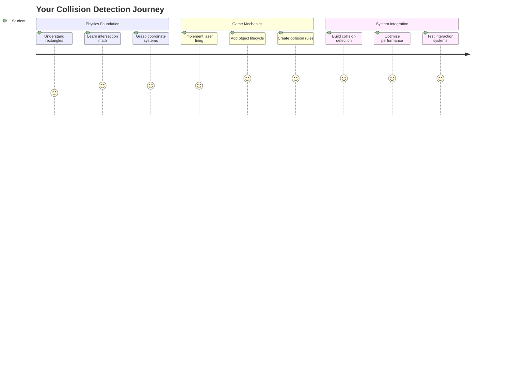
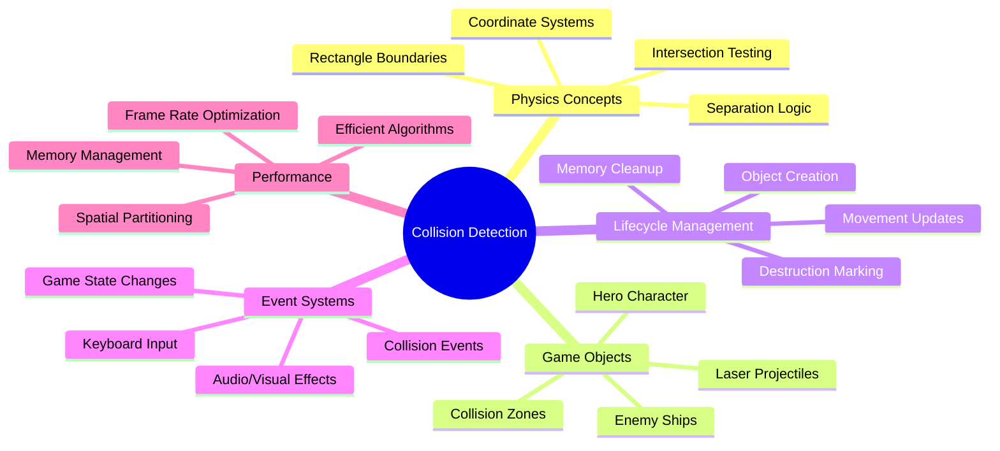
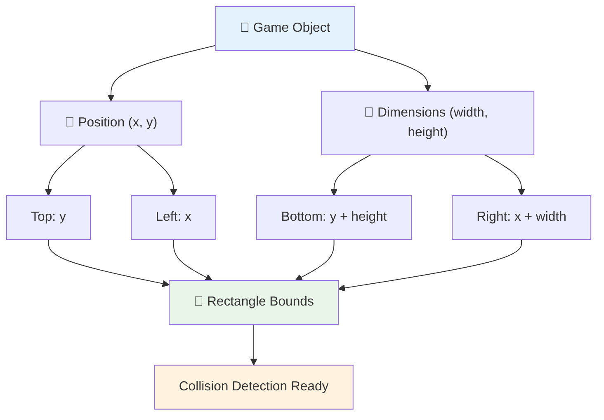
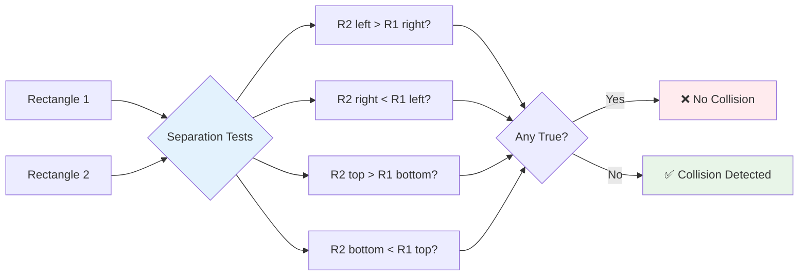
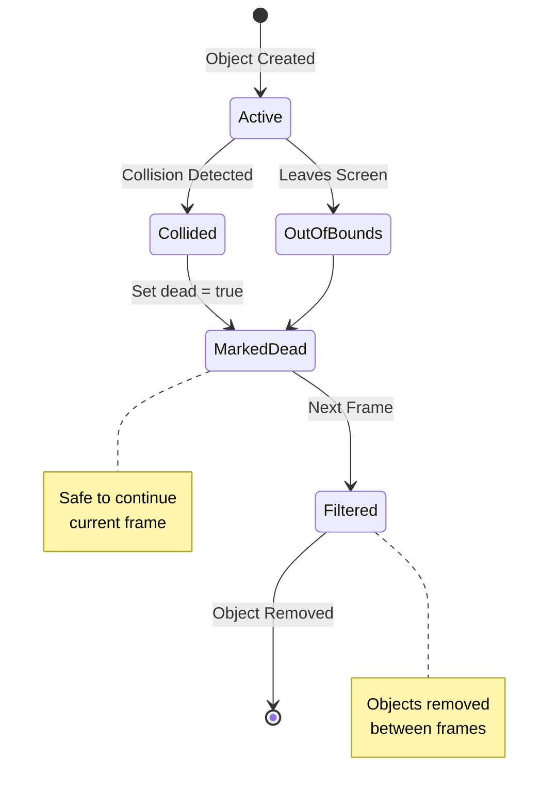
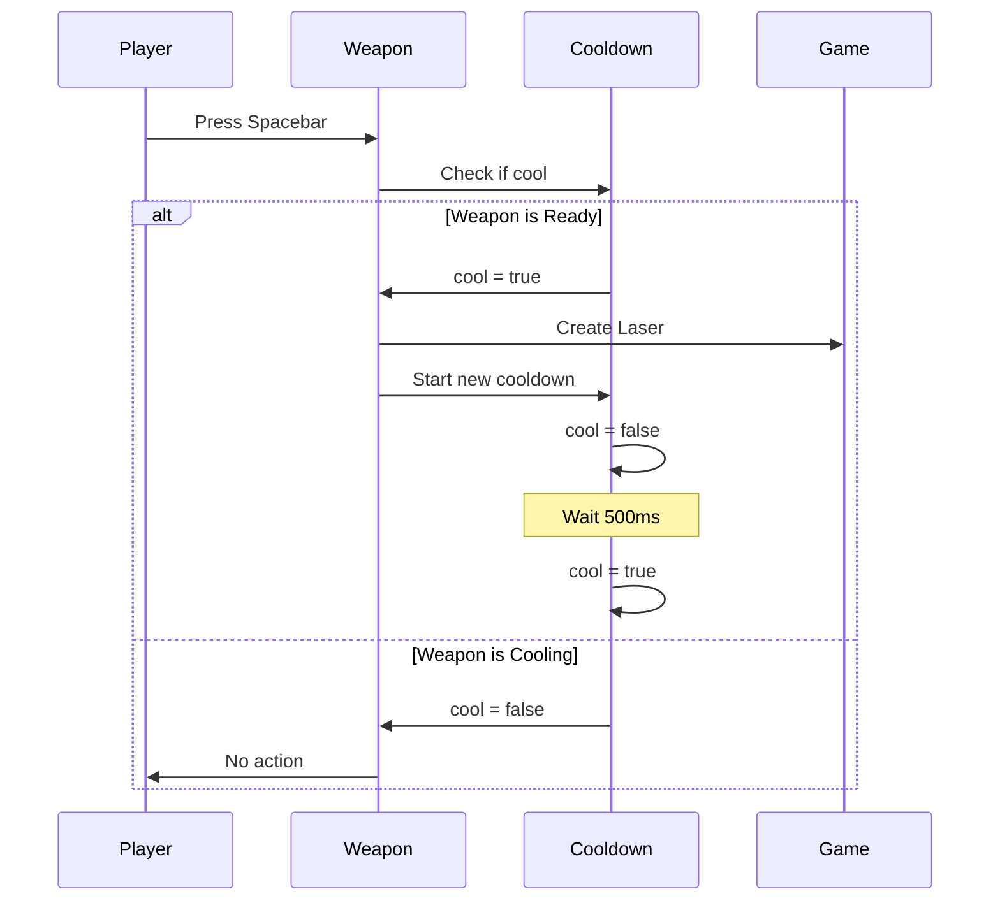
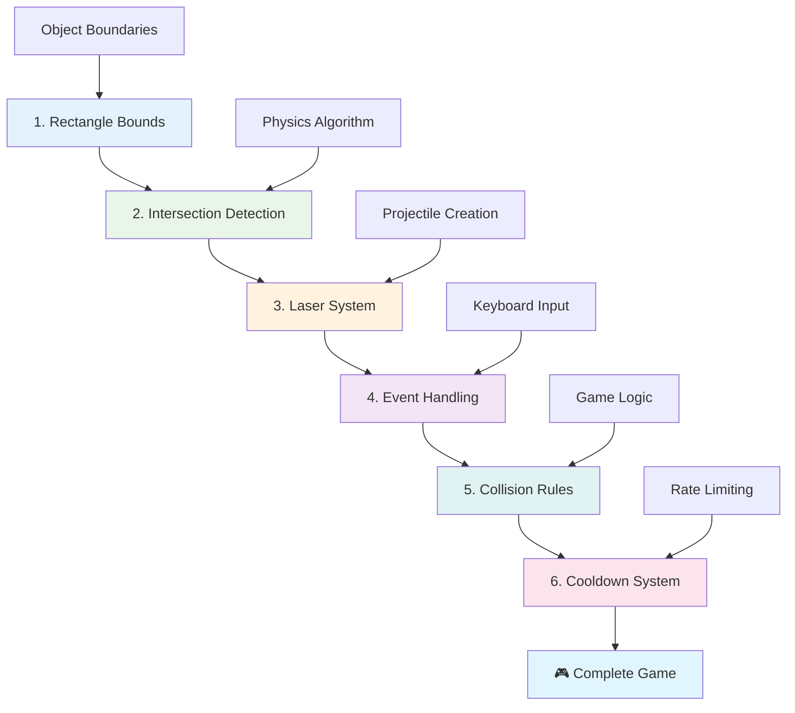
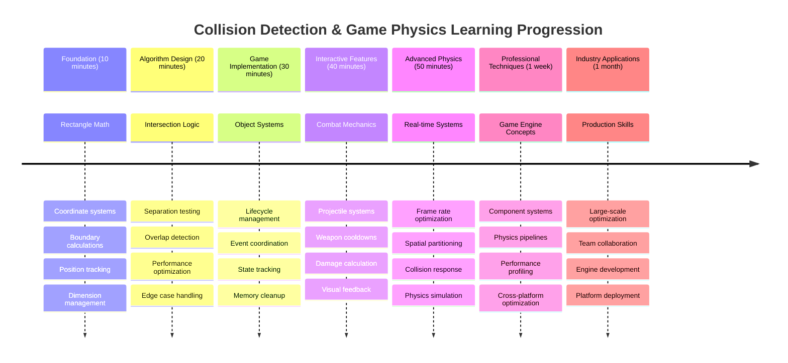

<!--
CO_OP_TRANSLATOR_METADATA:
{
  "original_hash": "039b4d8ce65f5edd82cf48d9c3e6728c",
  "translation_date": "2025-11-03T15:00:54+00:00",
  "source_file": "6-space-game/4-collision-detection/README.md",
  "language_code": "mr"
}
-->
# स्पेस गेम तयार करा भाग 4: लेसर जोडणे आणि टक्कर शोधणे



## प्री-लेक्चर क्विझ

[प्री-लेक्चर क्विझ](https://ff-quizzes.netlify.app/web/quiz/35)

स्टार वॉर्समधील तो क्षण आठवा जेव्हा ल्यूकच्या प्रोटॉन टॉरपीडोने डेथ स्टारच्या एक्झॉस्ट पोर्टला हिट केले. त्या अचूक टक्कर शोधामुळे आकाशगंगेचे भविष्य बदलले! गेम्समध्ये, टक्कर शोधणे याच प्रकारे कार्य करते - ते वस्तू कधी परस्परसंवाद करतात आणि पुढे काय होते हे ठरवते.

या धड्यात, तुम्ही तुमच्या स्पेस गेममध्ये लेसर शस्त्रे जोडाल आणि टक्कर शोधणे अंमलात आणाल. जसे नासाचे मिशन नियोजक मलबा टाळण्यासाठी अंतराळ यानाच्या कक्षांचा हिशोब करतात, तसे तुम्ही गेम ऑब्जेक्ट्स कधी एकमेकांना छेदतात ते शोधायला शिकाल. आम्ही हे व्यवस्थापित करण्यायोग्य टप्प्यांमध्ये विभागू जे एकमेकांवर आधारित असतील.

शेवटी, तुमच्याकडे एक कार्यरत कॉम्बॅट सिस्टम असेल जिथे लेसर शत्रूंना नष्ट करतात आणि टक्कर गेम इव्हेंट्स ट्रिगर करतात. हेच टक्कर तत्त्व भौतिकशास्त्राच्या सिम्युलेशनपासून ते इंटरॅक्टिव्ह वेब इंटरफेसपर्यंत सर्वत्र वापरले जातात.



✅ पहिला संगणक गेम कधी लिहिला गेला यावर थोडे संशोधन करा. त्याची कार्यक्षमता काय होती?

## टक्कर शोधणे

टक्कर शोधणे अपोलो लूनर मॉड्यूलवरील प्रॉक्सिमिटी सेन्सर्ससारखे कार्य करते - ते सतत अंतर तपासते आणि वस्तू खूप जवळ आल्यावर अलर्ट ट्रिगर करते. गेम्समध्ये, ही प्रणाली ठरवते की वस्तू कधी परस्परसंवाद करतात आणि पुढे काय घडले पाहिजे.

आपण वापरणार असलेला दृष्टिकोन प्रत्येक गेम ऑब्जेक्टला आयत म्हणून मानतो, जसे की एअर ट्रॅफिक कंट्रोल सिस्टम्स विमानाचा मागोवा घेण्यासाठी सोप्या भूमितीय आकारांचा वापर करतात. हा आयताकृती पद्धत मूलभूत वाटू शकते, परंतु ती संगणकीयदृष्ट्या कार्यक्षम आहे आणि बहुतेक गेम परिस्थितीसाठी चांगले कार्य करते.

### आयताचे प्रतिनिधित्व

प्रत्येक गेम ऑब्जेक्टला समन्वय सीमा आवश्यक असते, जसे की मंगळावर मंगळ पाथफाइंडर रोव्हरने त्याचे स्थान मॅप केले. येथे आम्ही या सीमा समन्वय कसे परिभाषित करतो:



```javascript
rectFromGameObject() {
  return {
    top: this.y,
    left: this.x,
    bottom: this.y + this.height,
    right: this.x + this.width
  }
}
```

**याचा अर्थ असा आहे:**
- **वरचा कडा**: तुमचा ऑब्जेक्ट उभ्या दिशेने कुठे सुरू होतो (त्याचा y स्थान)
- **डावा कडा**: तो आडव्या दिशेने कुठे सुरू होतो (त्याचा x स्थान)
- **खालचा कडा**: y स्थानात उंची जोडा - आता तुम्हाला ते कुठे संपते हे माहित आहे!
- **उजवा कडा**: x स्थानात रुंदी जोडा - आणि तुमच्याकडे संपूर्ण सीमा आहे

### इंटरसेक्शन अल्गोरिदम

आयताच्या इंटरसेक्शनचा शोध घेणे हबल स्पेस टेलिस्कोपने त्याच्या दृश्य क्षेत्रात खगोलीय वस्तू ओव्हरलॅप होत आहेत की नाही हे ठरवण्यासाठी वापरलेल्या तर्कासारखे आहे. अल्गोरिदम विभाजन तपासतो:



```javascript
function intersectRect(r1, r2) {
  return !(r2.left > r1.right ||
    r2.right < r1.left ||
    r2.top > r1.bottom ||
    r2.bottom < r1.top);
}
```

**विभाजन चाचणी रडार सिस्टमसारखी कार्य करते:**
- आयत 2 पूर्णपणे आयत 1 च्या उजवीकडे आहे का?
- आयत 2 पूर्णपणे आयत 1 च्या डावीकडे आहे का?
- आयत 2 पूर्णपणे आयत 1 च्या खाली आहे का?
- आयत 2 पूर्णपणे आयत 1 च्या वर आहे का?

जर या अटींपैकी कोणतीही खरी नसेल, तर आयत ओव्हरलॅप होत असले पाहिजे. हा दृष्टिकोन रडार ऑपरेटर दोन विमान सुरक्षित अंतरावर आहेत की नाही हे ठरवण्यासाठी कसे कार्य करतात यासारखा आहे.

## ऑब्जेक्ट्सचे जीवनचक्र व्यवस्थापित करणे

जेव्हा लेसर शत्रूला हिट करते, तेव्हा दोन्ही वस्तू गेममधून काढून टाकल्या पाहिजेत. तथापि, ऑब्जेक्ट्स मिड-लूप हटवणे क्रॅश होऊ शकते - अपोलो गाइडन्स संगणकासारख्या सुरुवातीच्या संगणक प्रणालींमध्ये कठोरपणे शिकलेला धडा. त्याऐवजी, आम्ही "हटवण्यासाठी चिन्हांकित करा" दृष्टिकोन वापरतो जो फ्रेम्स दरम्यान वस्तू सुरक्षितपणे काढून टाकतो.



आम्ही काहीतरी काढून टाकण्यासाठी कसे चिन्हांकित करतो:

```javascript
// Mark object for removal
enemy.dead = true;
```

**हा दृष्टिकोन का कार्य करतो:**
- आम्ही ऑब्जेक्टला "मृत" म्हणून चिन्हांकित करतो परंतु लगेच काढून टाकत नाही
- हे चालू गेम फ्रेम सुरक्षितपणे पूर्ण करू देते
- आधीच निघून गेलेल्या वस्तूचा वापर करण्याचा प्रयत्न केल्यामुळे कोणतेही क्रॅश होत नाही!

मग पुढील रेंडर सायकलपूर्वी चिन्हांकित ऑब्जेक्ट्स फिल्टर करा:

```javascript
gameObjects = gameObjects.filter(go => !go.dead);
```

**हे फिल्टरिंग काय करते:**
- फक्त "जिवंत" वस्तूंसह ताजी यादी तयार करते
- "मृत" म्हणून चिन्हांकित केलेल्या कोणत्याही गोष्टीला टाकून देते
- तुमचा गेम सुरळीत चालू ठेवतो
- नष्ट झालेल्या वस्तूंच्या संचयामुळे मेमरी बोट टाळते

## लेसर यांत्रिकी अंमलात आणणे

गेम्समधील लेसर प्रोजेक्टाइल्स स्टार ट्रेकमधील फोटॉन टॉरपीडोसारख्या तत्त्वावर कार्य करतात - ते वेगळ्या वस्तू असतात जे सरळ रेषेत प्रवास करतात जोपर्यंत ते काहीतरी हिट करत नाहीत. प्रत्येक स्पेसबार प्रेस एक नवीन लेसर ऑब्जेक्ट तयार करते जे स्क्रीनवर फिरते.

हे कार्य करण्यासाठी, आम्हाला काही वेगवेगळ्या भागांचे समन्वय साधणे आवश्यक आहे:

**अंमलात आणण्यासाठी मुख्य घटक:**
- **तयार करा** लेसर ऑब्जेक्ट्स जे हिरोच्या स्थानावरून तयार होतात
- **हँडल करा** कीबोर्ड इनपुट लेसर तयार करणे ट्रिगर करण्यासाठी
- **व्यवस्थापित करा** लेसरची हालचाल आणि जीवनचक्र
- **अंमलात आणा** लेसर प्रोजेक्टाइल्ससाठी व्हिज्युअल प्रतिनिधित्व

## फायरिंग रेट नियंत्रण अंमलात आणणे

अमर्यादित फायरिंग रेट्स गेम इंजिनला ओव्हरव्हेल्म करतील आणि गेमप्ले खूप सोपे करतील. वास्तविक शस्त्र प्रणालींना समान मर्यादा असतात - USS एंटरप्राइझच्या फेजर्सलाही शॉट्स दरम्यान रिचार्ज करण्यासाठी वेळ आवश्यक होता.

आम्ही एक कूलडाउन सिस्टम अंमलात आणू जी जलद फायर स्पॅमिंग रोखते आणि प्रतिसादात्मक नियंत्रण राखते:



```javascript
class Cooldown {
  constructor(time) {
    this.cool = false;
    setTimeout(() => {
      this.cool = true;
    }, time);
  }
}

class Weapon {
  constructor() {
    this.cooldown = null;
  }
  
  fire() {
    if (!this.cooldown || this.cooldown.cool) {
      // Create laser projectile
      this.cooldown = new Cooldown(500);
    } else {
      // Weapon is still cooling down
    }
  }
}
```

**कूलडाउन कसे कार्य करते:**
- तयार झाल्यावर, शस्त्र "हॉट" सुरू होते (आतापर्यंत फायर करू शकत नाही)
- टाइमआउट कालावधीनंतर, ते "कूल" होते (फायर करण्यासाठी तयार)
- फायर करण्यापूर्वी, आम्ही तपासतो: "शस्त्र कूल आहे का?"
- हे स्पॅम-क्लिकिंग रोखते आणि नियंत्रण प्रतिसादात्मक ठेवते

✅ स्पेस गेम मालिकेतील धडा 1 पहा कूलडाउनबद्दल आठवण करून देण्यासाठी.

## टक्कर प्रणाली तयार करणे

तुम्ही तुमच्या विद्यमान स्पेस गेम कोडला टक्कर शोधण्याची प्रणाली तयार करण्यासाठी विस्तारित कराल. आंतरराष्ट्रीय स्पेस स्टेशनच्या स्वयंचलित टक्कर टाळण्याच्या प्रणालीसारखे, तुमचा गेम सतत ऑब्जेक्ट्सच्या स्थानावर नजर ठेवेल आणि इंटरसेक्शनला प्रतिसाद देईल.

तुमच्या मागील धड्याच्या कोडपासून सुरुवात करून, तुम्ही टक्कर शोधणे विशिष्ट नियमांसह जोडाल जे ऑब्जेक्ट्सच्या परस्परसंवादाचे नियमन करतात.

> 💡 **प्रो टिप**: लेसर स्प्राइट आधीच तुमच्या अॅसेट्स फोल्डरमध्ये समाविष्ट आहे आणि तुमच्या कोडमध्ये संदर्भित आहे, अंमलात आणण्यासाठी तयार आहे.

### अंमलात आणण्यासाठी टक्कर नियम

**गेम यांत्रिकी जोडण्यासाठी:**
1. **लेसर शत्रूला हिट करते**: लेसर प्रोजेक्टाइलने हिट केल्यावर शत्रू ऑब्जेक्ट नष्ट होतो
2. **लेसर स्क्रीनच्या सीमेला हिट करते**: स्क्रीनच्या वरच्या कडावर पोहोचल्यावर लेसर काढून टाकला जातो
3. **शत्रू आणि हिरो टक्कर**: दोन्ही वस्तू एकमेकांना छेदल्यावर नष्ट होतात
4. **शत्रू तळाशी पोहोचतो**: शत्रू स्क्रीनच्या तळाशी पोहोचल्यावर गेम ओव्हर स्थिती

### 🔄 **शैक्षणिक तपासणी**
**टक्कर शोधण्याचा पाया**: अंमलात आणण्यापूर्वी, सुनिश्चित करा की तुम्हाला समजते:
- ✅ आयताच्या सीमा टक्कर झोन कसे परिभाषित करतात
- ✅ विभाजन चाचणी इंटरसेक्शन गणनेपेक्षा अधिक कार्यक्षम का आहे
- ✅ गेम लूपमध्ये ऑब्जेक्ट्सचे जीवनचक्र व्यवस्थापन का महत्त्वाचे आहे
- ✅ टक्कर प्रतिसाद समन्वयित करण्यासाठी इव्हेंट-ड्रिव्हन सिस्टम कसे कार्य करते

**जलद स्व-परीक्षण**: जर तुम्ही ऑब्जेक्ट्स त्वरित हटवले तर काय होईल?
*उत्तर: मिड-लूप हटवणे क्रॅश होऊ शकते किंवा पुनरावृत्तीत ऑब्जेक्ट्स वगळू शकते*

**भौतिकशास्त्र समजणे**: तुम्हाला आता समजले आहे:
- **समन्वय प्रणाली**: स्थान आणि परिमाण सीमा कशा तयार करतात
- **इंटरसेक्शन लॉजिक**: टक्कर शोधण्यामागील गणितीय तत्त्वे
- **कामगिरी ऑप्टिमायझेशन**: रिअल-टाइम सिस्टममध्ये कार्यक्षम अल्गोरिदम का महत्त्वाचे आहेत
- **मेमरी व्यवस्थापन**: स्थिरतेसाठी सुरक्षित ऑब्जेक्ट जीवनचक्र पॅटर्न

## तुमचे विकास वातावरण सेट करणे

चांगली बातमी - आम्ही तुमच्यासाठी बहुतेक तयारी आधीच केली आहे! तुमचे सर्व गेम अॅसेट्स आणि मूलभूत रचना `your-work` सबफोल्डरमध्ये आहेत, थंड टक्कर वैशिष्ट्ये जोडण्यासाठी तयार आहेत.

### प्रकल्प रचना

```bash
-| assets
  -| enemyShip.png
  -| player.png
  -| laserRed.png
-| index.html
-| app.js
-| package.json
```

**फाइल संरचना समजून घेणे:**
- **समाविष्ट करते** गेम ऑब्जेक्ट्ससाठी आवश्यक सर्व स्प्राइट प्रतिमा
- **समाविष्ट करते** मुख्य HTML दस्तऐवज आणि जावास्क्रिप्ट अनुप्रयोग फाइल
- **प्रदान करते** स्थानिक विकास सर्व्हरसाठी पॅकेज कॉन्फिगरेशन

### विकास सर्व्हर सुरू करणे

तुमच्या प्रकल्प फोल्डरमध्ये जा आणि स्थानिक सर्व्हर सुरू करा:

```bash
cd your-work
npm start
```

**ही कमांड अनुक्रम:**
- **डायरेक्टरी बदलते** तुमच्या कार्यरत प्रकल्प फोल्डरमध्ये
- **स्थानिक HTTP सर्व्हर सुरू करते** `http://localhost:5000` वर
- **तुमच्या गेम फाइल्स सर्व्ह करते** चाचणी आणि विकासासाठी
- **लाइव्ह विकास सक्षम करते** स्वयंचलित रीलोडिंगसह

तुमच्या ब्राउझरमध्ये `http://localhost:5000` वर जा आणि हिरो आणि शत्रू स्क्रीनवर रेंडर केलेले तुमचे चालू गेम स्टेट पहा.

### टप्प्याटप्प्याने अंमलबजावणी

नासाने व्हॉयजर अंतराळ यान प्रोग्राम करण्यासाठी वापरलेल्या पद्धतशीर दृष्टिकोनासारखे, आम्ही टक्कर शोधणे पद्धतशीरपणे अंमलात आणू, प्रत्येक घटक टप्प्याटप्प्याने तयार करू.



#### 1. आयत टक्कर सीमा जोडा

प्रथम, आपल्या गेम ऑब्जेक्ट्सना त्यांच्या सीमा कशा वर्णन करायच्या ते शिकवूया. तुमच्या `GameObject` वर्गात ही पद्धत जोडा:

```javascript
rectFromGameObject() {
    return {
      top: this.y,
      left: this.x,
      bottom: this.y + this.height,
      right: this.x + this.width,
    };
  }
```

**ही पद्धत साध्य करते:**
- **तयार करते** अचूक सीमा समन्वयांसह आयत ऑब्जेक्ट
- **तळ आणि उजवे कडे गणना करते** स्थान आणि परिमाण वापरून
- **परत करते** टक्कर शोध अल्गोरिदमसाठी तयार ऑब्जेक्ट
- **सर्व गेम ऑब्जेक्ट्ससाठी मानक इंटरफेस प्रदान करते**

#### 2. इंटरसेक्शन शोध अंमलात आणा

आता आपण टक्कर शोधण्याचा गुप्तहेर तयार करूया - एक फंक्शन जे दोन आयत ओव्हरलॅप होत आहेत की नाही हे सांगू शकते:

```javascript
function intersectRect(r1, r2) {
  return !(
    r2.left > r1.right ||
    r2.right < r1.left ||
    r2.top > r1.bottom ||
    r2.bottom < r1.top
  );
}
```

**हा अल्गोरिदम कार्य करतो:**
- **चाचणी घेतो** आयतांमधील चार विभाजन अटी
- **`false` परत करते** जर कोणतीही विभाजन अट खरी असेल
- **टक्कर सूचित करते** जेव्हा कोणतेही विभाजन अस्तित्वात नसते
- **कार्यक्षम इंटरसेक्शन चाचणीसाठी नकारात्मक तर्क वापरतो**

#### 3. लेसर फायरिंग प्रणाली अंमलात आणा

येथे गोष्टी रोमांचक होतात! चला लेसर फायरिंग प्रणाली सेट करूया.

##### संदेश स्थिरांक

प्रथम, काही संदेश प्रकार परिभाषित करूया जेणेकरून आमच्या गेमचे वेगवेगळे भाग एकमेकांशी संवाद साधू शकतील:

```javascript
KEY_EVENT_SPACE: "KEY_EVENT_SPACE",
COLLISION_ENEMY_LASER: "COLLISION_ENEMY_LASER",
COLLISION_ENEMY_HERO: "COLLISION_ENEMY_HERO",
```

**हे स्थिरांक प्रदान करतात:**
- **अर्जभर इव्हेंट नावे मानकीकृत करतात**
- **गेम सिस्टम्समधील सुसंगत संवाद सक्षम करतात**
- **इव्हेंट हँडलर नोंदणीमध्ये टायपो टाळतात**

##### कीबोर्ड इनपुट हाताळणी

तुमच्या की इव्हेंट लिसनरमध्ये स्पेस की डिटेक्शन जोडा:

```javascript
} else if(evt.keyCode === 32) {
  eventEmitter.emit(Messages.KEY_EVENT_SPACE);
}
```

**हा इनपुट हँडलर:**
- **स्पेस की प्रेस शोधतो** keyCode 32 वापरून
- **मानकीकृत इव्हेंट संदेश प्रसारित करतो**
- **डिकपल्ड फायरिंग लॉजिक सक्षम करतो**

##### इव्हेंट लिसनर सेटअप

तुमच्या `initGame()` फंक्शनमध्ये फायरिंग वर्तन नोंदणी करा:

```javascript
eventEmitter.on(Messages.KEY_EVENT_SPACE, () => {
 if (hero.canFire()) {
   hero.fire();
 }
});
```

**हा इव्हेंट लिसनर:**
- **स्पेस की इव्हेंट्सला प्रतिसाद देतो**
- **फायरिंग कूलडाउन स्थिती तपासतो**
- **परवानगी दिल्यास लेसर तयार करणे ट्रिगर करते**

लेसर-शत्रू परस्परसंवादासाठी टक्कर हाताळणी जोडा:

```javascript
eventEmitter.on(Messages.COLLISION_ENEMY_LASER, (_, { first, second }) => {
  first.dead = true;
  second.dead = true;
});
```

**ही टक्कर हाताळणी:**
- **दोन्ही वस्तूंसह टक्कर इव्हेंट डेटा प्राप्त करते**
- **दोन्ही वस्तूंना काढून टाकण्यासाठी चिन्हांकित करते**
- **टक्करनंतर योग्य साफसफाई सुनिश्चित करते**

#### 4. लेसर वर्ग तयार करा

वरच्या दिशेने हलणारे आणि त्याचे स्वतःचे जीवनचक्र व्यवस्थापित करणारे लेसर प्रोजेक्टाइल अंमलात आणा:

```javascript
class Laser extends GameObject {
  constructor(x, y) {
    super(x, y);
    this.width = 9;
    this.height = 33;
    this.type = 'Laser';
    this.img = laserImg;
    
    let id = setInterval(() => {
      if (this.y > 0) {
        this.y -= 15;
      } else {
        this.dead = true;
        clearInterval(id);
      }
    }, 100);
  }
}
```

**हा वर्ग अंमलात आणणे:**
- **GameObject विस्तारित करते** मूलभूत कार्यक्षमता वारसा मिळवण्यासाठी
- **लेसर स्प्राइटसाठी योग्य परिमाण सेट करते**
- **`setInterval()` वापरून स्वयंचलित वरच्या दिशेने हालचाल तयार करते**
- **स्क्रीन टॉपवर पोहोचल्यावर स्वतःचा नाश हाताळतो**
- **त्याचे स्वतःचे अॅनिमेशन टाइमिंग आणि साफसफाई व्यवस्थापित करते**

#### 5. टक्कर शोध प्रणाली अंमलात आणा

व्यापक टक्कर शोध फंक्शन तयार करा:

```javascript
function updateGameObjects() {
  const enemies = gameObjects.filter(go => go.type === 'Enemy');
  const lasers = gameObjects.filter(go => go.type === "Laser");
  
  // Test laser-enemy collisions
  lasers.forEach((laser) => {
    enemies.forEach((enemy) => {
      if (intersectRect(laser.rectFromGameObject(), enemy.rectFromGameObject())) {
        eventEmitter.emit(Messages.COLLISION_ENEMY_LASER, {
          first: laser,
          second: enemy,
        });
      }
    });
  });

  // Remove destroyed objects
  gameObjects = gameObjects.filter(go => !go.dead);
}
```

**ही टक्कर प्रणाली:**
- **टेस्टिंगसाठी प्रकारानुसार गेम ऑब्जेक्ट्स फिल्टर करते**
- **प्रत्येक लेसर प्रत्येक शत्रूविरुद्ध इंटरसेक्शनसाठी चाचणी करते**
- **इंटरसेक्शन आढळल्य
- [ ] रिअल-टाइममध्ये टक्कर घटना ट्रॅक करण्यासाठी `console.log` स्टेटमेंट्स जोडा

### 🎯 **या तासात तुम्ही काय साध्य करू शकता**
- [ ] पोस्ट-लेसन क्विझ पूर्ण करा आणि टक्कर शोधण्याचे अल्गोरिदम समजून घ्या
- [ ] टक्कर झाल्यावर स्फोटासारखे व्हिज्युअल इफेक्ट्स जोडा
- [ ] वेगवेगळ्या गुणधर्मांसह विविध प्रकारचे प्रोजेक्टाइल्स लागू करा
- [ ] खेळाडूंच्या क्षमतेत तात्पुरती सुधारणा करणारे पॉवर-अप्स तयार करा
- [ ] टक्कर अधिक समाधानकारक बनवण्यासाठी साउंड इफेक्ट्स जोडा

### 📅 **तुमचे आठवडाभराचे फिजिक्स प्रोग्रामिंग**
- [ ] पॉलिश केलेल्या टक्कर प्रणालीसह संपूर्ण स्पेस गेम पूर्ण करा
- [ ] आयतांव्यतिरिक्त प्रगत टक्कर आकार लागू करा (गोल, बहुभुज)
- [ ] वास्तववादी स्फोट प्रभावांसाठी पार्टिकल सिस्टम्स जोडा
- [ ] टक्कर टाळण्यासाठी जटिल शत्रूंचे वर्तन तयार करा
- [ ] अनेक वस्तूंसह चांगल्या कार्यक्षमतेसाठी टक्कर शोधणे ऑप्टिमाइझ करा
- [ ] गती आणि वास्तववादी हालचालीसारखे फिजिक्स सिम्युलेशन जोडा

### 🌟 **तुमचे महिनाभराचे गेम फिजिक्स मास्टरी**
- [ ] प्रगत फिजिक्स इंजिन्स आणि वास्तववादी सिम्युलेशन्ससह गेम्स तयार करा
- [ ] 3D टक्कर शोधणे आणि स्पेशल पार्टिशनिंग अल्गोरिदम शिकणे
- [ ] ओपन सोर्स फिजिक्स लायब्ररी आणि गेम इंजिन्समध्ये योगदान द्या
- [ ] ग्राफिक्स-इंटेन्सिव्ह अॅप्लिकेशन्ससाठी कार्यक्षमता ऑप्टिमायझेशन मास्टर करा
- [ ] गेम फिजिक्स आणि टक्कर शोधण्याबद्दल शैक्षणिक सामग्री तयार करा
- [ ] प्रगत फिजिक्स प्रोग्रामिंग कौशल्ये दर्शविणारे पोर्टफोलिओ तयार करा

## 🎯 तुमचे टक्कर शोधण्याचे मास्टरी टाइमलाइन



### 🛠️ तुमचे गेम फिजिक्स टूलकिट सारांश

या लेसननंतर, तुम्ही आता मास्टर केले आहे:
- **टक्कर गणित**: आयत इंटरसेक्शन अल्गोरिदम आणि कोऑर्डिनेट सिस्टम्स
- **कार्यक्षमता ऑप्टिमायझेशन**: रिअल-टाइम अॅप्लिकेशन्ससाठी कार्यक्षम टक्कर शोधणे
- **ऑब्जेक्ट लाइफसायकल व्यवस्थापन**: सुरक्षित निर्मिती, अपडेटिंग आणि नष्ट करण्याचे पॅटर्न्स
- **इव्हेंट-ड्रिव्हन आर्किटेक्चर**: टक्कर प्रतिसादासाठी डिस्कपल्ड सिस्टम्स
- **गेम लूप इंटिग्रेशन**: फ्रेम-आधारित फिजिक्स अपडेट्स आणि रेंडरिंग समन्वय
- **इनपुट सिस्टम्स**: दर मर्यादित आणि फीडबॅकसह प्रतिसादात्मक नियंत्रण
- **मेमरी व्यवस्थापन**: कार्यक्षम ऑब्जेक्ट पूलिंग आणि क्लीनअप स्ट्रॅटेजीज

**वास्तविक-जगातील अनुप्रयोग**: तुमचे टक्कर शोधण्याचे कौशल्य थेट लागू होते:
- **इंटरॅक्टिव्ह सिम्युलेशन्स**: वैज्ञानिक मॉडेलिंग आणि शैक्षणिक साधने
- **यूजर इंटरफेस डिझाइन**: ड्रॅग-आणि-ड्रॉप इंटरॅक्शन आणि टच शोधणे
- **डेटा व्हिज्युअलायझेशन**: इंटरॅक्टिव्ह चार्ट्स आणि क्लिक करण्यायोग्य घटक
- **मोबाइल डेव्हलपमेंट**: टच जेस्चर ओळख आणि टक्कर हाताळणे
- **रोबोटिक्स प्रोग्रामिंग**: पथ नियोजन आणि अडथळा टाळणे
- **कंप्युटर ग्राफिक्स**: रे ट्रेसिंग आणि स्पेशल अल्गोरिदम्स

**प्रोफेशनल कौशल्ये मिळवली**: तुम्ही आता करू शकता:
- **डिझाइन** रिअल-टाइम टक्कर शोधण्यासाठी कार्यक्षम अल्गोरिदम्स
- **अंमलात आणा** ऑब्जेक्ट्सच्या जटिलतेसह स्केल होणारी फिजिक्स सिस्टम्स
- **डिबग** गणितीय तत्त्वांचा वापर करून जटिल इंटरॅक्शन सिस्टम्स
- **ऑप्टिमाइझ** विविध हार्डवेअर आणि ब्राउझर क्षमतांसाठी कार्यक्षमता
- **आर्किटेक्ट** सिद्ध डिझाइन पॅटर्न्स वापरून टिकाऊ गेम सिस्टम्स

**गेम डेव्हलपमेंट संकल्पना मास्टर केल्या**:
- **फिजिक्स सिम्युलेशन**: रिअल-टाइम टक्कर शोधणे आणि प्रतिसाद
- **कार्यक्षमता अभियांत्रिकी**: इंटरॅक्टिव्ह अॅप्लिकेशन्ससाठी ऑप्टिमाइझ केलेले अल्गोरिदम्स
- **इव्हेंट सिस्टम्स**: गेम घटकांमधील डिस्कपल्ड कम्युनिकेशन
- **ऑब्जेक्ट व्यवस्थापन**: डायनॅमिक कंटेंटसाठी कार्यक्षम लाइफसायकल पॅटर्न्स
- **इनपुट हाताळणी**: योग्य फीडबॅकसह प्रतिसादात्मक नियंत्रण

**पुढील स्तर**: तुम्ही आता Matter.js सारख्या प्रगत फिजिक्स इंजिन्स एक्सप्लोर करण्यासाठी, 3D टक्कर शोधणे लागू करण्यासाठी किंवा जटिल पार्टिकल सिस्टम्स तयार करण्यासाठी तयार आहात!

🌟 **अचिव्हमेंट अनलॉक**: तुम्ही व्यावसायिक-ग्रेड टक्कर शोधण्यासह संपूर्ण फिजिक्स-आधारित इंटरॅक्शन सिस्टम तयार केले आहे!

## GitHub Copilot Agent Challenge 🚀

Agent मोड वापरून खालील चॅलेंज पूर्ण करा:

**वर्णन:** टक्कर शोधण्याच्या प्रणालीला सुधारित करा ज्यामध्ये पॉवर-अप्स समाविष्ट आहेत जे रँडमली स्पॉन होतात आणि हिरो शिपने गोळा केल्यावर तात्पुरत्या क्षमतेची ऑफर देतात.

**प्रॉम्प्ट:** PowerUp वर्ग तयार करा जो GameObject ला विस्तारतो आणि हिरो आणि पॉवर-अप्स यांच्यात टक्कर शोधणे लागू करा. किमान दोन प्रकारचे पॉवर-अप्स जोडा: एक जो फायर रेट वाढवतो (कूलडाउन कमी करतो) आणि दुसरा जो तात्पुरता शील्ड तयार करतो. पॉवर-अप्स रँडम अंतर आणि स्थानांवर तयार करणारी स्पॉन लॉजिक समाविष्ट करा.

---


## 🚀 चॅलेंज

स्फोट जोडा! [Space Art repo](../../../../6-space-game/solution/spaceArt/readme.txt) मधील गेम अॅसेट्स पहा आणि लेसर एलियनला हिट करताच स्फोट जोडण्याचा प्रयत्न करा

## पोस्ट-लेसन क्विझ

[पोस्ट-लेसन क्विझ](https://ff-quizzes.netlify.app/web/quiz/36)

## पुनरावलोकन आणि स्व-अभ्यास

तुमच्या गेममधील अंतरांवर प्रयोग करा. तुम्ही त्यांना बदलल्यास काय होते? [JavaScript timing events](https://www.freecodecamp.org/news/javascript-timing-events-settimeout-and-setinterval/) बद्दल अधिक वाचा.

## असाइनमेंट

[टक्कर एक्सप्लोर करा](assignment.md)

---

**अस्वीकरण**:  
हा दस्तऐवज AI भाषांतर सेवा [Co-op Translator](https://github.com/Azure/co-op-translator) वापरून भाषांतरित करण्यात आला आहे. आम्ही अचूकतेसाठी प्रयत्नशील असलो तरी, कृपया लक्षात ठेवा की स्वयंचलित भाषांतरांमध्ये त्रुटी किंवा अचूकतेचा अभाव असू शकतो. मूळ भाषेतील दस्तऐवज हा अधिकृत स्रोत मानला जावा. महत्त्वाच्या माहितीसाठी व्यावसायिक मानवी भाषांतराची शिफारस केली जाते. या भाषांतराचा वापर करून झालेल्या कोणत्याही गैरसमज किंवा चुकीच्या अर्थासाठी आम्ही जबाबदार राहणार नाही.