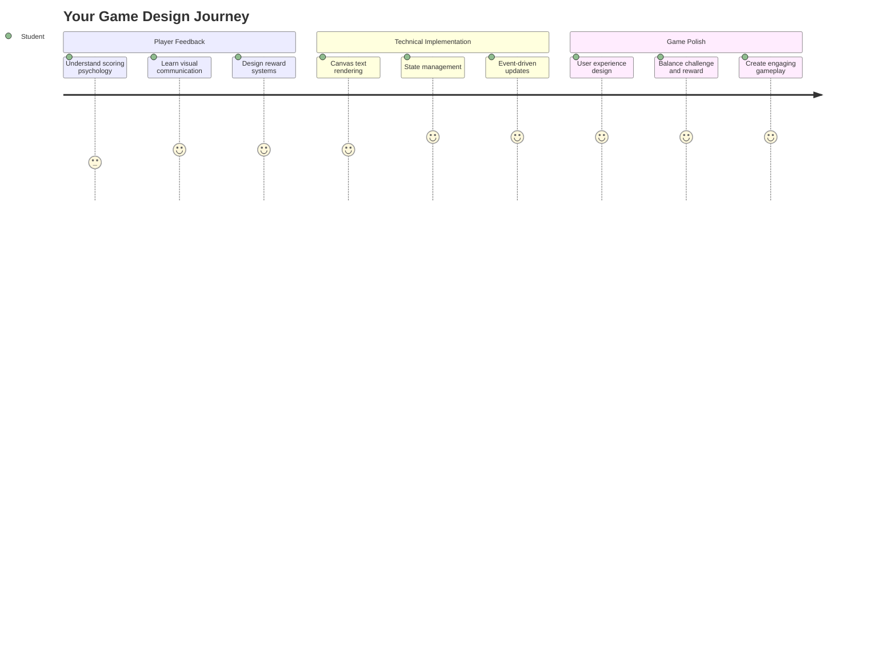
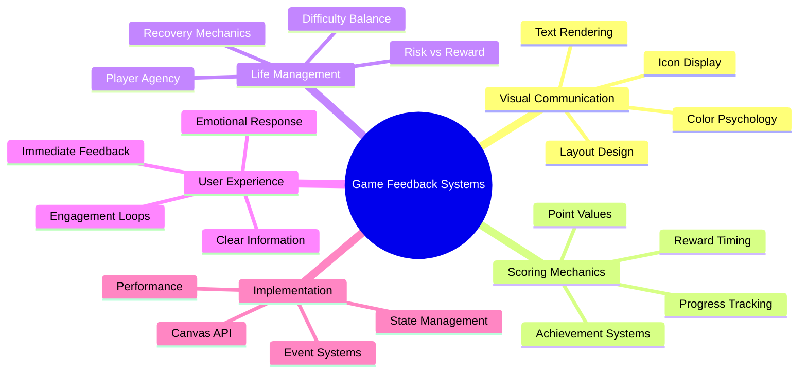
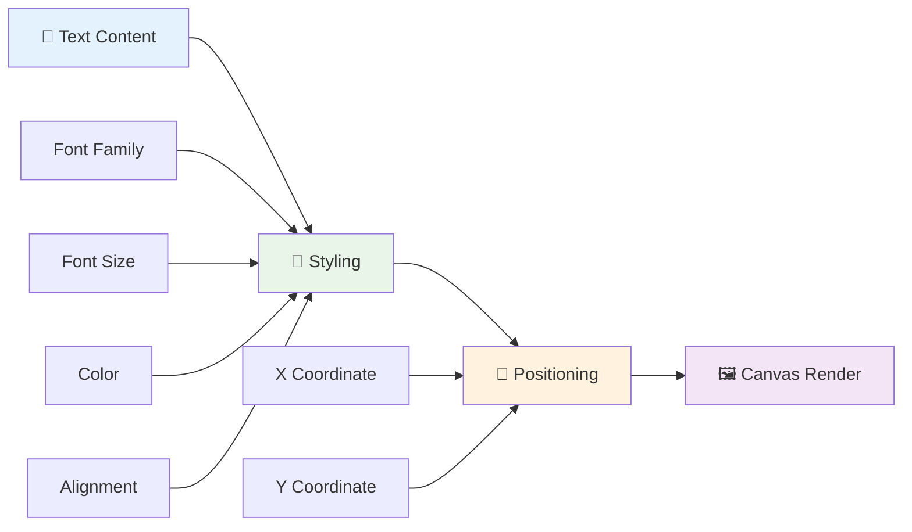
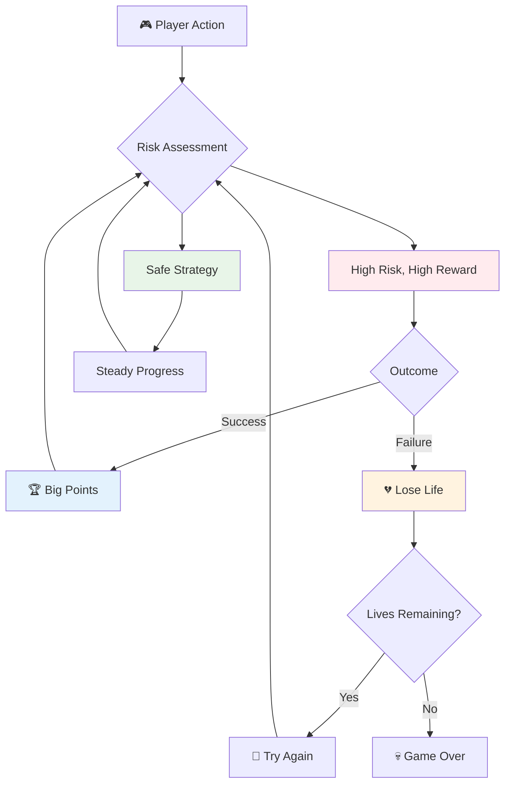
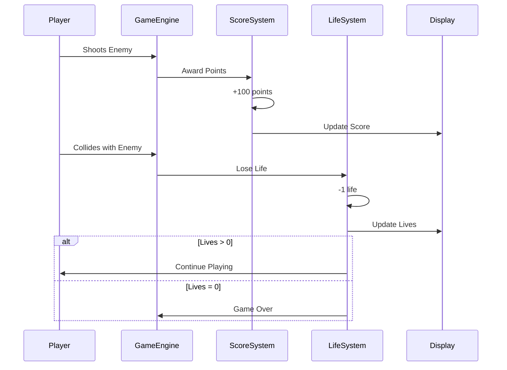
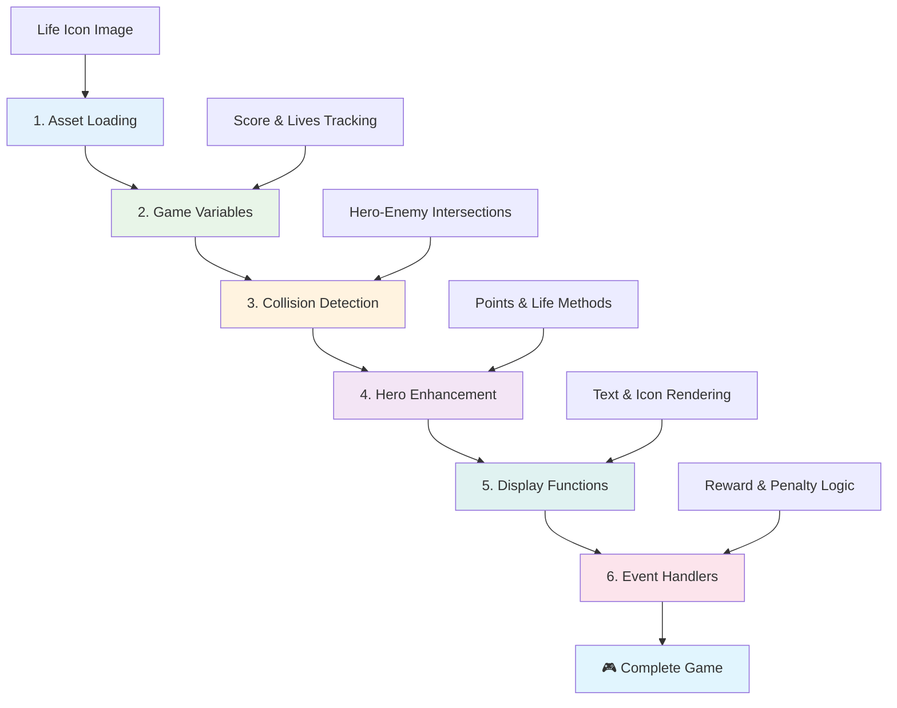
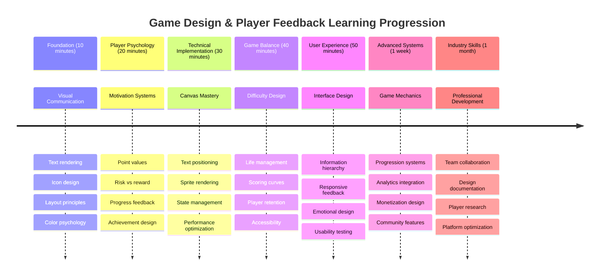

<!--
CO_OP_TRANSLATOR_METADATA:
{
  "original_hash": "2ed9145a16cf576faa2a973dff84d099",
  "translation_date": "2025-11-03T15:03:26+00:00",
  "source_file": "6-space-game/5-keeping-score/README.md",
  "language_code": "mr"
}
-->
# स्पेस गेम तयार करा भाग ५: स्कोअरिंग आणि जीवन



## प्री-लेक्चर क्विझ

[प्री-लेक्चर क्विझ](https://ff-quizzes.netlify.app/web/quiz/37)

तुमचा स्पेस गेम खऱ्या गेमसारखा वाटेल असं तयार करायला तयार आहात का? चला, स्कोअरिंग पॉइंट्स आणि जीवन व्यवस्थापन जोडूया - मुख्य यांत्रिकी ज्यामुळे स्पेस इनव्हेडर्ससारखे सुरुवातीचे आर्केड गेम्स साध्या प्रदर्शनांपासून व्यसनमुक्त मनोरंजनात बदलले. यामुळे तुमचा गेम खरोखर खेळण्यायोग्य होतो.



## स्क्रीनवर मजकूर काढणे - तुमच्या गेमचा आवाज

तुमचा स्कोअर दाखवण्यासाठी, आम्हाला कॅनव्हासवर मजकूर रेंडर कसा करायचा ते शिकावे लागेल. `fillText()` पद्धत तुमचं मुख्य साधन आहे - क्लासिक आर्केड गेम्समध्ये स्कोअर आणि स्थिती माहिती दाखवण्यासाठी याच तंत्राचा वापर केला जातो.



तुमच्याकडे मजकूराच्या स्वरूपावर पूर्ण नियंत्रण आहे:

```javascript
ctx.font = "30px Arial";
ctx.fillStyle = "red";
ctx.textAlign = "right";
ctx.fillText("show this on the screen", 0, 0);
```

✅ [कॅनव्हासवर मजकूर जोडण्याबद्दल](https://developer.mozilla.org/docs/Web/API/Canvas_API/Tutorial/Drawing_text) अधिक सखोल माहिती मिळवा - तुम्ही फॉन्ट्स आणि स्टाइलिंगसह किती सर्जनशील होऊ शकता याबद्दल तुम्हाला आश्चर्य वाटेल!

## जीवन - फक्त एक संख्या नाही

गेम डिझाइनमध्ये, "जीवन" खेळाडूच्या चुका करण्याच्या मर्यादेचे प्रतिनिधित्व करते. ही संकल्पना पिनबॉल मशीनपासून सुरू झाली, जिथे तुम्हाला खेळण्यासाठी अनेक बॉल्स मिळायचे. अ‍ॅस्टरॉइड्ससारख्या सुरुवातीच्या व्हिडिओ गेम्समध्ये, जीवन खेळाडूंना धोका पत्करण्याची आणि चुका करून शिकण्याची परवानगी देत असे.



दृश्य प्रतिनिधित्व खूप महत्त्वाचे आहे - फक्त "Lives: 3" ऐवजी जहाजाच्या आयकॉन दाखवणे त्वरित दृश्य ओळख निर्माण करते, जसे की सुरुवातीच्या आर्केड कॅबिनेट्सने भाषा अडथळ्यांवर संवाद साधण्यासाठी आयकॉनोग्राफीचा वापर केला.

## तुमच्या गेमचा बक्षीस प्रणाली तयार करणे

आता आपण कोर फीडबॅक सिस्टम्स लागू करू जे खेळाडूंना गुंतवून ठेवतात:



- **स्कोअरिंग सिस्टम**: प्रत्येक नष्ट केलेल्या शत्रूच्या जहाजासाठी १०० गुण दिले जातात (गोल संख्या खेळाडूंना मानसिक गणना करणे सोपे करते). स्कोअर तळाच्या डाव्या कोपऱ्यात दिसेल.
- **जीवन काउंटर**: तुमचा हिरो तीन जीवनांसह सुरू होतो - सुरुवातीच्या आर्केड गेम्सने आव्हान आणि खेळण्यायोग्यता संतुलित करण्यासाठी स्थापित केलेला मानक. प्रत्येक शत्रूशी टक्कर झाल्यावर एक जीवन कमी होते. उर्वरित जीवन तळाच्या उजव्या कोपऱ्यात जहाजाच्या आयकॉनद्वारे दाखवले जातील .

## चला तयार करूया!

प्रथम, तुमचं कार्यक्षेत्र सेट करा. `your-work` सब फोल्डरमधील फाइल्समध्ये जा. तुम्हाला या फाइल्स दिसायला हव्यात:

```bash
-| assets
  -| enemyShip.png
  -| player.png
  -| laserRed.png
-| index.html
-| app.js
-| package.json
```

तुमचा गेम तपासण्यासाठी, `your_work` फोल्डरमधून विकास सर्व्हर सुरू करा:

```bash
cd your-work
npm start
```

हे `http://localhost:5000` वर स्थानिक सर्व्हर चालवते. तुमच्या ब्राउझरमध्ये हा पत्ता उघडा आणि तुमचा गेम पहा. अॅरो कीजसह नियंत्रण तपासा आणि शत्रूंवर शूट करण्याचा प्रयत्न करा की सर्व काही कार्य करते का.



### कोड लिहिण्याची वेळ!

1. **तुम्हाला आवश्यक असलेली दृश्यात्मक संसाधने मिळवा**. `solution/assets/` फोल्डरमधून `life.png` संसाधन कॉपी करा आणि तुमच्या `your-work` फोल्डरमध्ये ठेवा. नंतर `lifeImg` तुमच्या window.onload फंक्शनमध्ये जोडा:

    ```javascript
    lifeImg = await loadTexture("assets/life.png");
    ```

1. `lifeImg` तुमच्या संसाधन यादीत जोडायला विसरू नका:

    ```javascript
    let heroImg,
    ...
    lifeImg,
    ...
    eventEmitter = new EventEmitter();
    ```
  
2. **तुमच्या गेम व्हेरिएबल्स सेट करा**. तुमचा एकूण स्कोअर (० पासून सुरू होणारा) आणि उर्वरित जीवन (३ पासून सुरू होणारे) ट्रॅक करण्यासाठी काही कोड जोडा. आम्ही हे स्क्रीनवर दाखवू जेणेकरून खेळाडूंना नेहमी त्यांची स्थिती माहित असेल.

3. **कोलिजन डिटेक्शन लागू करा**. तुमच्या `updateGameObjects()` फंक्शनला विस्तारित करा जेणेकरून शत्रू तुमच्या हिरोशी टक्कर घेतात तेव्हा ओळखता येईल:

    ```javascript
    enemies.forEach(enemy => {
        const heroRect = hero.rectFromGameObject();
        if (intersectRect(heroRect, enemy.rectFromGameObject())) {
          eventEmitter.emit(Messages.COLLISION_ENEMY_HERO, { enemy });
        }
      })
    ```

4. **तुमच्या हिरोमध्ये जीवन आणि पॉइंट ट्रॅकिंग जोडा**. 
   1. **काउंटर प्रारंभ करा**. `this.cooldown = 0` च्या खाली तुमच्या `Hero` वर्गात, जीवन आणि पॉइंट्स सेट करा:

        ```javascript
        this.life = 3;
        this.points = 0;
        ```

   1. **खेळाडूंना हे मूल्ये दाखवा**. स्क्रीनवर ही मूल्ये काढण्यासाठी फंक्शन्स तयार करा:

        ```javascript
        function drawLife() {
          // TODO, 35, 27
          const START_POS = canvas.width - 180;
          for(let i=0; i < hero.life; i++ ) {
            ctx.drawImage(
              lifeImg, 
              START_POS + (45 * (i+1) ), 
              canvas.height - 37);
          }
        }
        
        function drawPoints() {
          ctx.font = "30px Arial";
          ctx.fillStyle = "red";
          ctx.textAlign = "left";
          drawText("Points: " + hero.points, 10, canvas.height-20);
        }
        
        function drawText(message, x, y) {
          ctx.fillText(message, x, y);
        }

        ```

   1. **हे सर्व तुमच्या गेम लूपमध्ये जोडा**. `updateGameObjects()` नंतर हे फंक्शन्स तुमच्या window.onload फंक्शनमध्ये जोडा:

        ```javascript
        drawPoints();
        drawLife();
        ```

### 🔄 **शैक्षणिक तपासणी**
**गेम डिझाइन समज**: परिणाम लागू करण्यापूर्वी, सुनिश्चित करा की तुम्हाला समजते:
- ✅ दृश्यात्मक फीडबॅक खेळाडूंना गेमची स्थिती कशी सांगते
- ✅ UI घटकांची सुसंगत जागा का उपयोगिता सुधारते
- ✅ पॉइंट मूल्ये आणि जीवन व्यवस्थापनामागील मानसशास्त्र
- ✅ कॅनव्हास मजकूर रेंडरिंग HTML मजकूरापेक्षा कसे वेगळे आहे

**जलद स्व-परीक्षण**: आर्केड गेम्स सामान्यतः पॉइंट मूल्यांसाठी गोल संख्या का वापरतात?
*उत्तर: गोल संख्या खेळाडूंना मानसिक गणना करणे सोपे करते आणि समाधानकारक मानसशास्त्रीय बक्षीस निर्माण करते*

**वापरकर्ता अनुभव तत्त्वे**: तुम्ही आता लागू करत आहात:
- **दृश्यात्मक श्रेणीक्रम**: महत्त्वाची माहिती प्रमुखपणे ठेवणे
- **तत्काळ फीडबॅक**: खेळाडूच्या क्रियांसाठी रिअल-टाइम अपडेट्स
- **संज्ञानात्मक भार**: सोपी, स्पष्ट माहिती सादरीकरण
- **भावनिक डिझाइन**: आयकॉन आणि रंग जे खेळाडूशी कनेक्शन निर्माण करतात

1. **गेम परिणाम आणि बक्षीस लागू करा**. आता आपण फीडबॅक सिस्टम्स जोडू जे खेळाडूच्या क्रियांना अर्थपूर्ण बनवतात:

   1. **टक्कर झाल्यावर जीवन कमी होते**. प्रत्येक वेळी तुमचा हिरो शत्रूशी टक्कर घेतो, तुम्ही एक जीवन गमवायला हवे.
   
      तुमच्या `Hero` वर्गात ही पद्धत जोडा:

        ```javascript
        decrementLife() {
          this.life--;
          if (this.life === 0) {
            this.dead = true;
          }
        }
        ```

   2. **शत्रूंवर शूट केल्यावर पॉइंट्स मिळतात**. प्रत्येक यशस्वी हिटसाठी १०० पॉइंट्स दिले जातात, अचूक शूटिंगसाठी त्वरित सकारात्मक फीडबॅक प्रदान करते.

      तुमच्या Hero वर्गात ही वाढीची पद्धत विस्तारित करा:
    
        ```javascript
          incrementPoints() {
            this.points += 100;
          }
        ```

        आता या फंक्शन्स तुमच्या टक्कर घटनांशी जोडा:

        ```javascript
        eventEmitter.on(Messages.COLLISION_ENEMY_LASER, (_, { first, second }) => {
           first.dead = true;
           second.dead = true;
           hero.incrementPoints();
        })

        eventEmitter.on(Messages.COLLISION_ENEMY_HERO, (_, { enemy }) => {
           enemy.dead = true;
           hero.decrementLife();
        });
        ```

✅ जावास्क्रिप्ट आणि कॅनव्हाससह तयार केलेल्या इतर गेम्सबद्दल उत्सुक आहात? काही शोध करा - तुम्हाला काय शक्य आहे याबद्दल आश्चर्य वाटेल!

या वैशिष्ट्ये लागू केल्यानंतर, तुमचा गेम तपासा आणि संपूर्ण फीडबॅक सिस्टम क्रियाशील आहे का ते पहा. तुम्हाला तळाच्या उजव्या कोपऱ्यात जीवन आयकॉन, तळाच्या डाव्या कोपऱ्यात तुमचा स्कोअर दिसेल आणि टक्कर झाल्यावर जीवन कमी होताना आणि यशस्वी शॉट्सने स्कोअर वाढताना पहा.

तुमच्या गेममध्ये आता सुरुवातीच्या आर्केड गेम्सला इतके आकर्षक बनवणारे आवश्यक यांत्रिकी आहेत - स्पष्ट उद्दिष्टे, त्वरित फीडबॅक आणि खेळाडूच्या क्रियांसाठी अर्थपूर्ण परिणाम.

### 🔄 **शैक्षणिक तपासणी**
**पूर्ण गेम डिझाइन सिस्टम**: खेळाडू फीडबॅक सिस्टम्सची तुमची प्रावीण्य सत्यापित करा:
- ✅ स्कोअरिंग यांत्रिकी खेळाडूंची प्रेरणा आणि गुंतवणूक कशी निर्माण करतात?
- ✅ वापरकर्ता इंटरफेस डिझाइनसाठी दृश्यात्मक सुसंगतता का महत्त्वाची आहे?
- ✅ जीवन प्रणाली आव्हान आणि खेळाडू टिकवून ठेवण्याचे संतुलन कसे राखते?
- ✅ समाधानकारक गेमप्ले तयार करण्यासाठी त्वरित फीडबॅकची भूमिका काय आहे?

**सिस्टम इंटिग्रेशन**: तुमची फीडबॅक प्रणाली दाखवते:
- **वापरकर्ता अनुभव डिझाइन**: स्पष्ट दृश्यात्मक संवाद आणि माहिती श्रेणीक्रम
- **इव्हेंट-ड्रिव्हन आर्किटेक्चर**: खेळाडूच्या क्रियांसाठी प्रतिसादात्मक अपडेट्स
- **स्टेट मॅनेजमेंट**: डायनॅमिक गेम डेटा ट्रॅक करणे आणि दाखवणे
- **कॅनव्हास कौशल्य**: मजकूर रेंडरिंग आणि स्प्राइट पोझिशनिंग
- **गेम मानसशास्त्र**: खेळाडूंची प्रेरणा आणि गुंतवणूक समजणे

**व्यावसायिक नमुने**: तुम्ही लागू केले आहे:
- **MVC आर्किटेक्चर**: गेम लॉजिक, डेटा आणि सादरीकरणाचे विभाजन
- **ऑब्झर्व्हर पॅटर्न**: गेम स्टेट बदलांसाठी इव्हेंट-ड्रिव्हन अपडेट्स
- **कंपोनेंट डिझाइन**: रेंडरिंग आणि लॉजिकसाठी पुनर्वापरयोग्य फंक्शन्स
- **परफॉर्मन्स ऑप्टिमायझेशन**: गेम लूप्समध्ये कार्यक्षम रेंडरिंग

### ⚡ **पुढील ५ मिनिटांत तुम्ही काय करू शकता**
- [ ] स्कोअर डिस्प्लेसाठी वेगवेगळ्या फॉन्ट साइज आणि रंगांसह प्रयोग करा
- [ ] पॉइंट मूल्ये बदलण्याचा प्रयत्न करा आणि गेमप्लेच्या अनुभवावर त्याचा कसा परिणाम होतो ते पहा
- [ ] पॉइंट्स आणि जीवन बदलल्यावर ट्रॅक करण्यासाठी console.log स्टेटमेंट्स जोडा
- [ ] जीवन संपणे किंवा उच्च स्कोअर मिळवणे यासारख्या एज केस तपासा

### 🎯 **तुम्ही या तासात काय साध्य करू शकता**
- [ ] पोस्ट-लेसन क्विझ पूर्ण करा आणि गेम डिझाइन मानसशास्त्र समजून घ्या
- [ ] स्कोअरिंग आणि जीवन गमावण्याचे साउंड इफेक्ट्स जोडा
- [ ] localStorage वापरून उच्च स्कोअर प्रणाली लागू करा
- [ ] वेगवेगळ्या शत्रू प्रकारांसाठी वेगवेगळे पॉइंट मूल्ये तयार करा
- [ ] जीवन गमावल्यावर स्क्रीन शेकसारखे दृश्यात्मक प्रभाव जोडा

### 📅 **तुमचा आठवडाभराचा गेम डिझाइन प्रवास**
- [ ] पूर्ण फीडबॅक सिस्टमसह संपूर्ण स्पेस गेम पूर्ण करा
- [ ] कॉम्बो मल्टीप्लायरसारख्या प्रगत स्कोअरिंग यांत्रिकी लागू करा
- [ ] अचिव्हमेंट्स आणि अनलॉक करण्यायोग्य सामग्री जोडा
- [ ] अडचण प्रगती आणि संतुलन प्रणाली तयार करा
- [ ] मेनू आणि गेम ओव्हर स्क्रीनसाठी वापरकर्ता इंटरफेस डिझाइन करा
- [ ] इतर गेम्सचा अभ्यास करा जे गुंतवणूक यंत्रणा समजून घेण्यासाठी

### 🌟 **तुमचा महिनाभराचा गेम डेव्हलपमेंट कौशल्य मास्टरी**
- [ ] प्रगत प्रगती प्रणालीसह संपूर्ण गेम्स तयार करा
- [ ] गेम अॅनालिटिक्स आणि खेळाडूंच्या वर्तनाचे मोजमाप शिकणे
- [ ] ओपन सोर्स गेम डेव्हलपमेंट प्रकल्पांमध्ये योगदान द्या
- [ ] प्रगत गेम डिझाइन नमुने आणि उत्पन्नाचे स्रोत मास्टर करा
- [ ] गेम डिझाइन आणि वापरकर्ता अनुभवाबद्दल शैक्षणिक सामग्री तयार करा
- [ ] गेम डिझाइन आणि डेव्हलपमेंट कौशल्ये दाखवणारे पोर्टफोलिओ तयार करा

## 🎯 तुमचा गेम डिझाइन मास्टरी टाइमलाइन



### 🛠️ तुमचा गेम डिझाइन टूलकिट सारांश

या धड्याचा अभ्यास केल्यानंतर, तुम्ही आता मास्टर केले आहे:
- **खेळाडू मानसशास्त्र**: प्रेरणा, धोका/बक्षीस आणि गुंतवणूक लूप समजणे
- **दृश्यात्मक संवाद**: मजकूर, आयकॉन आणि लेआउट वापरून प्रभावी UI डिझाइन
- **फीडबॅक सिस्टम्स**: खेळाडूच्या क्रिया आणि गेम इव्हेंट्ससाठी रिअल-टाइम प्रतिसाद
- **स्टेट मॅनेजमेंट**: डायनॅमिक गेम डेटा कार्यक्षमतेने ट्रॅक करणे आणि दाखवणे
- **कॅनव्हास मजकूर रेंडरिंग**: स्टाइलिंग आणि पोझिशनिंगसह व्यावसायिक मजकूर प्रदर्शन
- **इव्हेंट इंटिग्रेशन**: वापरकर्ता क्रियांसाठी अर्थपूर्ण गेम परिणाम जोडणे
- **गेम संतुलन**: अडचण वक्र आणि खेळाडू प्रगती प्रणाली डिझाइन करणे

**वास्तविक-जगातील अनुप्रयोग**: तुमची गेम डिझाइन कौशल्ये थेट लागू होतात:
- **वापरकर्ता इंटरफेस डिझाइन**: आकर्षक आणि अंतर्ज्ञानी इंटरफेस तयार करणे
- **उत्पादन विकास**: वापरकर्ता प्रेरणा आणि फीडबॅक लूप समजणे
- **शैक्षणिक तंत्रज्ञान**: गेमिफिकेशन आणि शिक्षण गुंतवणूक प्रणाली
- **डेटा व्हिज्युअलायझेशन**: जटिल माहिती सुलभ आणि आकर्षक बनवणे
- **मोबाइल अॅप विकास**: टिकाव यांत्रिकी आणि वापरकर्ता अनुभव डिझाइन
- **मार्केटिंग तंत्रज्ञान**: वापरकर्ता वर्तन आणि रूपांतरण ऑप्टिमायझेशन समजणे

**प्रोफेशनल कौशल्ये मिळवली**: तुम्ही आता करू शकता:
- **डिझाइन** वापरकर्ता अनुभव जे वापरकर्त्यांना प्रेरित आणि गुंतवणूक करतात
- **अंमलबजावणी** फीडबॅक सिस्टम्स जे वापरकर्ता वर्तन प्रभावीपणे मार्गदर्शन करतात
- **संतुलन** आव्हान आणि परस्पर प्रणालींमध्ये प्रवेशयोग्यता
- **निर्मिती** दृश्यात्मक संवाद जो वेगवेगळ्या वापरकर्ता गटांसाठी कार्य करतो
- **विश्लेषण** वापरकर्ता वर्तन आणि डिझाइन सुधारणा पुनरावृत्ती करणे

**गेम डेव्हलपमेंट संकल्पना मास्टर केल्या**:
- **खेळाडू प्रेरणा**: गुंतवणूक आणि टिकाव काय चालवते ते समजणे
- **दृश्यात्मक डिझाइन**: स्पष्ट, आकर्षक आणि कार्यात्मक इंटरफेस तयार करणे
- **सिस्टम इंटिग्रेशन**: एकसंध अनुभवासाठी एकाधिक गेम सिस्टम्स कनेक्ट करणे
- **परफॉर्मन्स ऑप्टिमायझेशन**: कार्यक्षम रेंडरिंग आणि स्टेट मॅनेजमेंट
- **प्रवेशयोग्यता**: वेगवेगळ्या कौशल्य स्तरांसाठी आणि खेळाडूंच्या गरजांसाठी डिझाइन करणे

**पुढील स्तर**: तुम्ही प्रगत गेम डिझाइन नमुने एक्सप्लोर करण्यासाठी, अॅनालिटिक्स सिस्टम्स लागू करण्यासाठी किंवा गेम उत्पन्न आणि खेळाडू टिकाव धोरणांचा अभ्यास करण्यासाठी तयार आहात!

🌟 **साध्य केलेली उपलब्धी**: तुम्ही व्यावसायिक गेम डिझाइन तत्त्वांसह संपूर्ण खेळाडू फीडबॅक प्रणाली तयार केली आहे!

---

## GitHub Copilot Agent Challenge 🚀

Agent मोड वापरून खालील आव्हान पूर्ण करा:

**वर्णन:** स्पेस गेमच्या स्कोअरिंग सिस्टमला उच्च स्कोअर वैशिष्ट्य लागू करून सुधारित

---

**अस्वीकरण**:  
हा दस्तऐवज AI भाषांतर सेवा [Co-op Translator](https://github.com/Azure/co-op-translator) वापरून भाषांतरित करण्यात आला आहे. आम्ही अचूकतेसाठी प्रयत्नशील असलो तरी कृपया लक्षात ठेवा की स्वयंचलित भाषांतरांमध्ये त्रुटी किंवा अचूकतेचा अभाव असू शकतो. मूळ भाषेतील दस्तऐवज हा अधिकृत स्रोत मानला जावा. महत्त्वाच्या माहितीसाठी व्यावसायिक मानवी भाषांतराची शिफारस केली जाते. या भाषांतराचा वापर करून निर्माण झालेल्या कोणत्याही गैरसमज किंवा चुकीच्या अर्थासाठी आम्ही जबाबदार राहणार नाही.