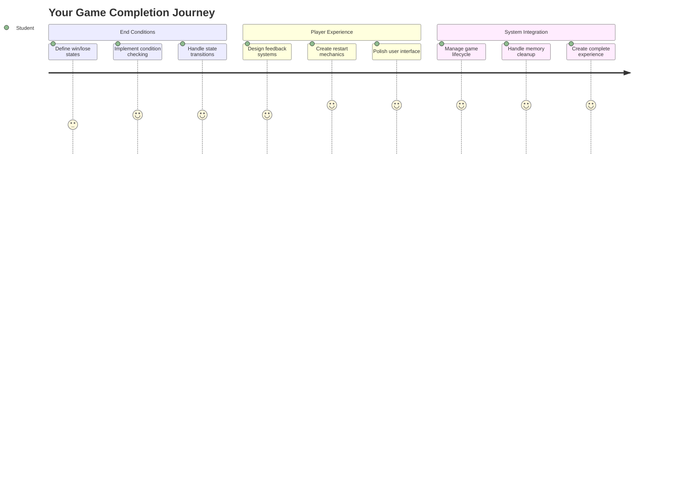
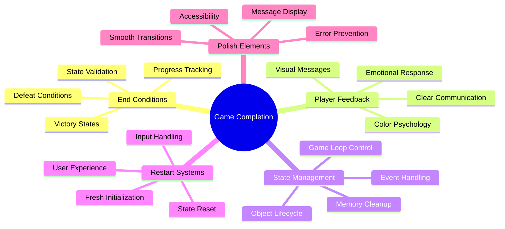
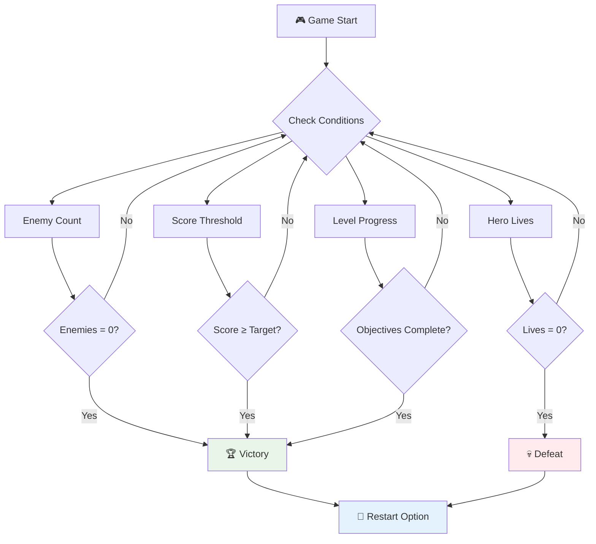
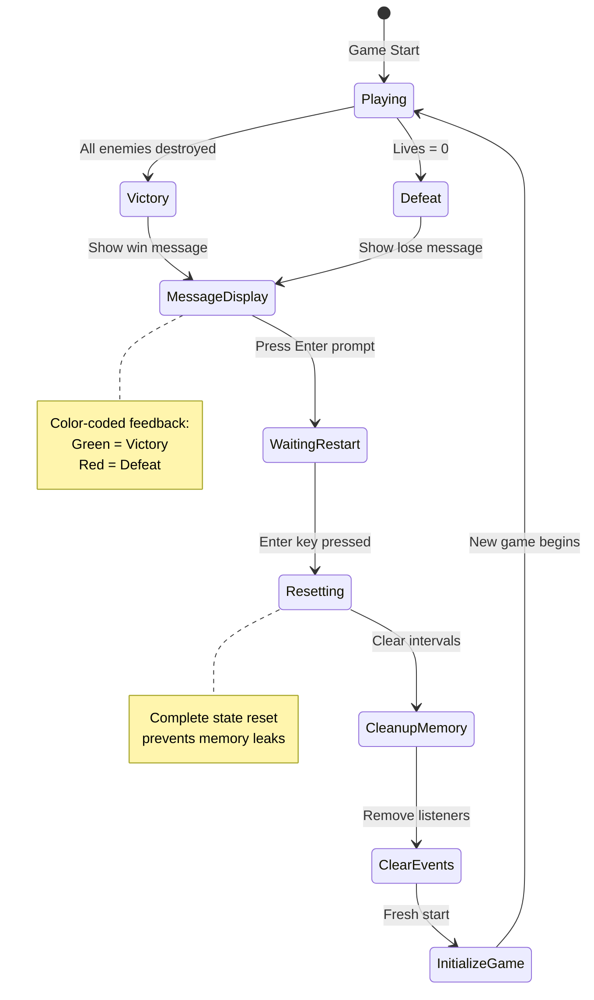
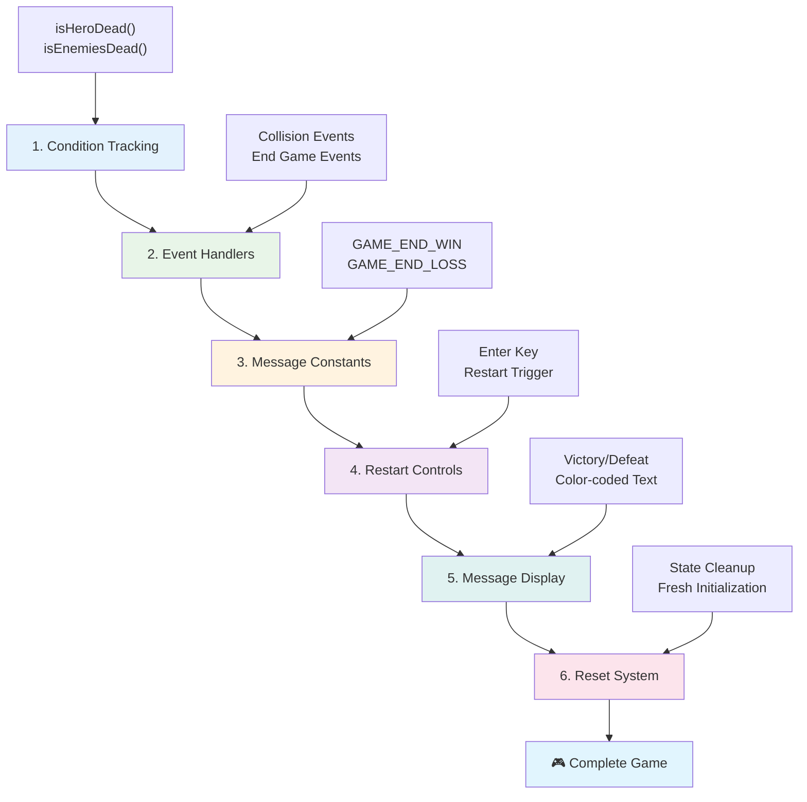
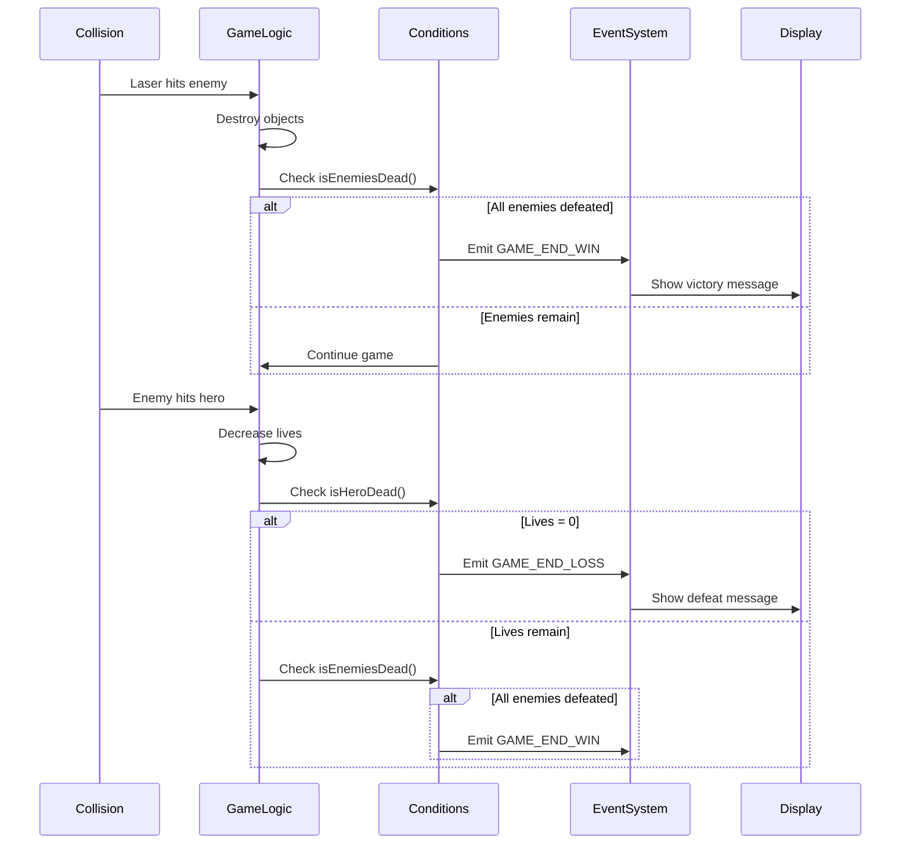
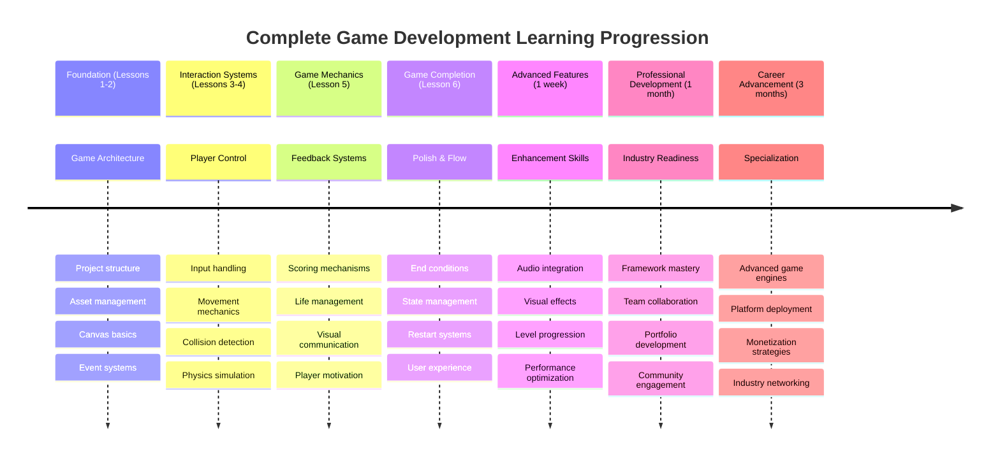

<!--
CO_OP_TRANSLATOR_METADATA:
{
  "original_hash": "a4b78043f4d64bf3ee24e0689b8b391d",
  "translation_date": "2025-11-03T14:59:11+00:00",
  "source_file": "6-space-game/6-end-condition/README.md",
  "language_code": "mr"
}
-->
# स्पेस गेम तयार करा भाग 6: शेवट आणि पुन्हा सुरू करा



प्रत्येक उत्कृष्ट खेळासाठी स्पष्ट शेवटाच्या अटी आणि गुळगुळीत पुन्हा सुरू करण्याची यंत्रणा आवश्यक असते. तुम्ही हालचाल, लढाई आणि स्कोअरिंगसह एक प्रभावी स्पेस गेम तयार केला आहे - आता ते पूर्ण वाटावे यासाठी अंतिम तुकडे जोडण्याची वेळ आली आहे.

तुमचा गेम सध्या अनिश्चित काळासाठी चालतो, जसे NASA ने 1977 मध्ये लॉन्च केलेले व्हॉयजर प्रोब्स - अजूनही दशकांनंतर अंतराळात प्रवास करत आहेत. अंतराळ संशोधनासाठी ते ठीक असले तरी, खेळांना समाधानकारक अनुभव निर्माण करण्यासाठी निश्चित शेवटाचे बिंदू आवश्यक असतात.

आज, आपण योग्य विजय/पराजय अटी आणि पुन्हा सुरू करण्याची प्रणाली लागू करू. या धड्याच्या शेवटी, तुमच्याकडे एक पॉलिश गेम असेल जो खेळाडू पूर्ण करू शकतील आणि पुन्हा खेळू शकतील, जसे की माध्यमाची व्याख्या करणारे क्लासिक आर्केड गेम्स.



## प्री-लेक्चर क्विझ

[प्री-लेक्चर क्विझ](https://ff-quizzes.netlify.app/web/quiz/39)

## गेमच्या शेवटाच्या अटी समजून घेणे

तुमचा गेम कधी संपायला हवा? हा मूलभूत प्रश्न गेम डिझाइनला सुरुवातीच्या आर्केड युगापासून आकार देत आहे. पॅक-मॅनमध्ये तुम्ही भूतांनी पकडले किंवा सर्व डॉट्स साफ केले की खेळ संपतो, तर स्पेस इनव्हेडर्समध्ये एलियन्स तळाशी पोहोचले किंवा तुम्ही त्यांना नष्ट केले की खेळ संपतो.

गेम निर्माता म्हणून, तुम्ही विजय आणि पराजयाच्या अटी ठरवता. आमच्या स्पेस गेमसाठी, येथे सिद्ध दृष्टिकोन आहेत जे आकर्षक गेमप्ले तयार करतात:



- **`N` शत्रू जहाजे नष्ट केली गेली आहेत**: जर तुम्ही गेम वेगवेगळ्या स्तरांमध्ये विभागला असेल तर तुम्हाला स्तर पूर्ण करण्यासाठी `N` शत्रू जहाजे नष्ट करावी लागतील.
- **तुमचे जहाज नष्ट झाले आहे**: असे नक्कीच गेम्स आहेत जिथे तुमचे जहाज नष्ट झाले तर तुम्ही गेम हराल. आणखी एक सामान्य दृष्टिकोन म्हणजे तुमच्याकडे जीवनाची संकल्पना आहे. प्रत्येक वेळी तुमचे जहाज नष्ट होते तेव्हा ते एक जीवन कमी करते. सर्व जीवन संपल्यावर तुम्ही गेम हराल.
- **तुम्ही `N` गुण गोळा केले आहेत**: आणखी एक सामान्य शेवटाची अट म्हणजे तुम्ही गुण गोळा करणे. तुम्ही गुण कसे मिळवता हे तुमच्यावर अवलंबून आहे परंतु शत्रू जहाज नष्ट करणे किंवा कदाचित वस्तू गोळा करणे ज्या वस्तू नष्ट झाल्यावर *ड्रॉप* होतात अशा विविध क्रियाकलापांना गुण देणे सामान्य आहे.
- **स्तर पूर्ण करा**: यामध्ये `X` शत्रू जहाजे नष्ट करणे, `Y` गुण गोळा करणे किंवा कदाचित विशिष्ट वस्तू गोळा करणे यासारख्या अनेक अटींचा समावेश असू शकतो.

## गेम पुन्हा सुरू करण्याची कार्यक्षमता लागू करणे

चांगले गेम गुळगुळीत पुन्हा सुरू करण्याच्या यंत्रणेद्वारे पुनरावृत्तीला प्रोत्साहन देतात. जेव्हा खेळाडू गेम पूर्ण करतात (किंवा पराजयाला सामोरे जातात), तेव्हा ते लगेच पुन्हा प्रयत्न करू इच्छितात - त्यांचा स्कोअर पराभूत करण्यासाठी किंवा त्यांची कामगिरी सुधारण्यासाठी.



टेट्रिस याचे उत्तम उदाहरण आहे: जेव्हा तुमचे ब्लॉक्स वर पोहोचतात, तेव्हा तुम्ही जटिल मेनू नेव्हिगेट न करता लगेच नवीन गेम सुरू करू शकता. आम्ही एक समान रीस्टार्ट सिस्टम तयार करू जे गेम स्टेट स्वच्छपणे रीसेट करते आणि खेळाडूंना त्वरीत कृतीत परत आणते.

✅ **प्रतिबिंब**: तुम्ही खेळलेले गेम विचार करा. कोणत्या अटींनुसार ते संपतात आणि तुम्हाला पुन्हा सुरू करण्यास कसे प्रवृत्त केले जाते? रीस्टार्ट अनुभव गुळगुळीत विरुद्ध निराशाजनक वाटतो असे काय बनवते?

## तुम्ही काय तयार कराल

तुम्ही अंतिम वैशिष्ट्ये लागू कराल जी तुमच्या प्रकल्पाला पूर्ण गेम अनुभवात रूपांतरित करतात. हे घटक पॉलिश गेम्सना मूलभूत प्रोटोटाइप्सपासून वेगळे करतात.

**आज आपण काय जोडत आहोत:**

1. **विजय अट**: सर्व शत्रूंना नष्ट करा आणि योग्य सेलिब्रेशन मिळवा (तुम्ही ते कमावले आहे!)
2. **पराजय अट**: जीवन संपवा आणि पराजय स्क्रीनसह संगीताचा सामना करा
3. **रीस्टार्ट यंत्रणा**: Enter दाबा आणि पुन्हा खेळायला सुरुवात करा - कारण एक गेम कधीच पुरेसा नसतो
4. **स्टेट व्यवस्थापन**: प्रत्येक वेळी स्वच्छ सुरुवात - मागील गेममधील शत्रू किंवा विचित्र गडबड नाही

## सुरुवात करणे

तुमचे विकास वातावरण तयार करूया. तुम्ही मागील धड्यांमधून तुमच्या स्पेस गेम फाइल्स तयार ठेवल्या पाहिजेत.

**तुमचा प्रकल्प काहीसा असा दिसायला हवा:**

```bash
-| assets
  -| enemyShip.png
  -| player.png
  -| laserRed.png
  -| life.png
-| index.html
-| app.js
-| package.json
```

**तुमचा विकास सर्व्हर सुरू करा:**

```bash
cd your-work
npm start
```

**हा आदेश:**
- `http://localhost:5000` वर स्थानिक सर्व्हर चालवतो
- तुमच्या फाइल्स योग्य प्रकारे सर्व्ह करतो
- तुम्ही बदल केल्यावर आपोआप रीफ्रेश होते

`http://localhost:5000` तुमच्या ब्राउझरमध्ये उघडा आणि तुमचा गेम चालू असल्याची पुष्टी करा. तुम्ही हलवू, शूट करू आणि शत्रूंशी संवाद साधू शकता. एकदा पुष्टी झाल्यावर, आम्ही अंमलबजावणीसह पुढे जाऊ शकतो.

> 💡 **प्रो टिप**: व्हिज्युअल स्टुडिओ कोडमध्ये चेतावणी टाळण्यासाठी, `gameLoopId` तुमच्या फाइलच्या शीर्षस्थानी `let gameLoopId;` म्हणून घोषित करा, `window.onload` फंक्शनमध्ये घोषित करण्याऐवजी. हे आधुनिक JavaScript व्हेरिएबल डिक्लेरेशन सर्वोत्तम पद्धतींचे अनुसरण करते.



## अंमलबजावणी चरण

### चरण 1: शेवटच्या अटी ट्रॅकिंग फंक्शन्स तयार करा

आपल्या गेमचा शेवट कधी व्हायला हवा हे सतत तपासण्यासाठी आपल्याला फंक्शन्सची आवश्यकता आहे. आंतरराष्ट्रीय स्पेस स्टेशनवरील सेन्सर्सप्रमाणे जे महत्त्वाच्या प्रणालींचे सतत निरीक्षण करतात, हे फंक्शन्स गेम स्टेट सतत तपासतील.

```javascript
function isHeroDead() {
  return hero.life <= 0;
}

function isEnemiesDead() {
  const enemies = gameObjects.filter((go) => go.type === "Enemy" && !go.dead);
  return enemies.length === 0;
}
```

**येथे काय चालले आहे:**
- **तपासते** की आपला हिरो जीवन संपला आहे का (अरेरे!)
- **मोजते** किती शत्रू अजूनही जिवंत आहेत
- **परत करते** `true` जेव्हा युद्धभूमी शत्रूंनी रिक्त होते
- **वापरते** सोपी true/false लॉजिक गोष्टी सोप्या ठेवण्यासाठी
- **फिल्टर करते** सर्व गेम ऑब्जेक्ट्समधून वाचलेल्यांना शोधण्यासाठी

### चरण 2: शेवटच्या अटींसाठी इव्हेंट हँडलर्स अपडेट करा

आता आपण या अटी तपासण्यांना गेमच्या इव्हेंट सिस्टमशी जोडू. प्रत्येक वेळी टक्कर होते, गेम मूल्यांकन करेल की ते शेवटच्या अटींना ट्रिगर करते का. हे महत्त्वाच्या गेम इव्हेंटसाठी त्वरित फीडबॅक तयार करते.



```javascript
eventEmitter.on(Messages.COLLISION_ENEMY_LASER, (_, { first, second }) => {
    first.dead = true;
    second.dead = true;
    hero.incrementPoints();

    if (isEnemiesDead()) {
      eventEmitter.emit(Messages.GAME_END_WIN);
    }
});

eventEmitter.on(Messages.COLLISION_ENEMY_HERO, (_, { enemy }) => {
    enemy.dead = true;
    hero.decrementLife();
    if (isHeroDead())  {
      eventEmitter.emit(Messages.GAME_END_LOSS);
      return; // loss before victory
    }
    if (isEnemiesDead()) {
      eventEmitter.emit(Messages.GAME_END_WIN);
    }
});

eventEmitter.on(Messages.GAME_END_WIN, () => {
    endGame(true);
});
  
eventEmitter.on(Messages.GAME_END_LOSS, () => {
  endGame(false);
});
```

**येथे काय चालले आहे:**
- **लेसर शत्रूला लागतो**: दोघे गायब होतात, तुम्हाला गुण मिळतात आणि आम्ही तपासतो की तुम्ही जिंकलात का
- **शत्रू तुम्हाला लागतो**: तुम्ही एक जीवन गमावता आणि आम्ही तपासतो की तुम्ही अजून श्वास घेत आहात का
- **स्मार्ट ऑर्डरिंग**: आम्ही प्रथम पराजय तपासतो (कोणीही एकाच वेळी जिंकणे आणि हरवणे इच्छित नाही!)
- **त्वरित प्रतिक्रिया**: काहीतरी महत्त्वाचे घडताच, गेमला त्याबद्दल माहिती मिळते

### चरण 3: नवीन संदेश स्थिरांक जोडा

तुम्हाला तुमच्या `Messages` स्थिर ऑब्जेक्टमध्ये नवीन संदेश प्रकार जोडण्याची आवश्यकता आहे. हे स्थिरांक सुसंगतता राखण्यास आणि तुमच्या इव्हेंट सिस्टममधील टायपो टाळण्यास मदत करतात.

```javascript
GAME_END_LOSS: "GAME_END_LOSS",
GAME_END_WIN: "GAME_END_WIN",
```

**वरीलमध्ये, आम्ही:**
- **जोडले** गेम एंड इव्हेंटसाठी स्थिरांक सुसंगतता राखण्यासाठी
- **वापरले** वर्णनात्मक नावे जी इव्हेंटचा हेतू स्पष्टपणे दर्शवतात
- **अनुसरण केले** संदेश प्रकारांसाठी विद्यमान नामकरण पद्धत

### चरण 4: रीस्टार्ट कंट्रोल्स लागू करा

आता तुम्ही कीबोर्ड कंट्रोल्स जोडाल जे खेळाडूंना गेम पुन्हा सुरू करण्याची परवानगी देतात. Enter की हा एक नैसर्गिक पर्याय आहे कारण तो क्रिया पुष्टी करण्यासाठी आणि नवीन गेम सुरू करण्यासाठी सामान्यतः संबंधित आहे.

**तुमच्या विद्यमान कीडाउन इव्हेंट लिसनरमध्ये Enter की डिटेक्शन जोडा:**

```javascript
else if(evt.key === "Enter") {
   eventEmitter.emit(Messages.KEY_EVENT_ENTER);
}
```

**नवीन संदेश स्थिरांक जोडा:**

```javascript
KEY_EVENT_ENTER: "KEY_EVENT_ENTER",
```

**तुम्हाला काय माहित असणे आवश्यक आहे:**
- **विस्तारित करते** तुमची विद्यमान कीबोर्ड इव्हेंट हँडलिंग प्रणाली
- **वापरते** रीस्टार्ट ट्रिगरसाठी Enter की, जे वापरकर्त्यांसाठी सहज समजण्यासारखे आहे
- **उत्पन्न करते** एक सानुकूल इव्हेंट ज्यासाठी तुमच्या गेमचे इतर भाग ऐकू शकतात
- **जतन करते** तुमच्या इतर कीबोर्ड कंट्रोल्ससारखा समान नमुना

### चरण 5: संदेश प्रदर्शन प्रणाली तयार करा

तुमच्या गेमला खेळाडूंना परिणाम स्पष्टपणे सांगण्याची आवश्यकता आहे. आम्ही एक संदेश प्रणाली तयार करू जी विजय आणि पराजयाच्या स्थिती रंग-कोडित मजकूर वापरून प्रदर्शित करते, जसे की प्रारंभिक संगणक प्रणालींच्या टर्मिनल इंटरफेससाठी हिरवा यश दर्शवतो आणि लाल त्रुटी दर्शवतो.

**`displayMessage()` फंक्शन तयार करा:**

```javascript
function displayMessage(message, color = "red") {
  ctx.font = "30px Arial";
  ctx.fillStyle = color;
  ctx.textAlign = "center";
  ctx.fillText(message, canvas.width / 2, canvas.height / 2);
}
```

**पायरी-पायरीने, येथे काय घडत आहे:**
- **सेट करते** फॉन्ट आकार आणि कुटुंब स्पष्ट, वाचण्यायोग्य मजकूरासाठी
- **लागू करते** रंग पॅरामीटर "लाल" चेतावणीसाठी डीफॉल्ट म्हणून
- **केंद्रित करते** कॅनव्हासवर मजकूर आडव्या आणि उभ्या
- **वापरते** आधुनिक JavaScript डीफॉल्ट पॅरामीटर्स लवचिक रंग पर्यायांसाठी
- **लेव्हरेज करते** कॅनव्हास 2D संदर्भ थेट मजकूर रेंडरिंगसाठी

**`endGame()` फंक्शन तयार करा:**

```javascript
function endGame(win) {
  clearInterval(gameLoopId);

  // Set a delay to ensure any pending renders complete
  setTimeout(() => {
    ctx.clearRect(0, 0, canvas.width, canvas.height);
    ctx.fillStyle = "black";
    ctx.fillRect(0, 0, canvas.width, canvas.height);
    if (win) {
      displayMessage(
        "Victory!!! Pew Pew... - Press [Enter] to start a new game Captain Pew Pew",
        "green"
      );
    } else {
      displayMessage(
        "You died !!! Press [Enter] to start a new game Captain Pew Pew"
      );
    }
  }, 200)  
}
```

**हे फंक्शन काय करते:**
- **गोठवते** सर्व काही जागेवर - आता हलणारे जहाज किंवा लेसर नाही
- **घेतो** एक छोटासा विराम (200ms) शेवटचा फ्रेम काढण्यास परवानगी देण्यासाठी
- **स्वच्छ करते** स्क्रीन आणि नाट्यमय प्रभावासाठी ती काळी रंगवते
- **दाखवते** विजेत्यांसाठी आणि पराभूतांसाठी वेगवेगळे संदेश
- **रंग कोड करते** बातम्या - चांगल्यासाठी हिरवा, लाल... बरं, चांगलं नाही
- **सांगते** खेळाडूंना पुन्हा सुरुवात कशी करायची

### 🔄 **शैक्षणिक तपासणी**
**गेम स्टेट व्यवस्थापन**: रीसेट कार्यक्षमता लागू करण्यापूर्वी, सुनिश्चित करा की तुम्हाला समजते:
- ✅ शेवटच्या अटी स्पष्ट गेमप्ले उद्दिष्टे कशा तयार करतात
- ✅ व्हिज्युअल फीडबॅक खेळाडूंच्या समजून घेण्यास का आवश्यक आहे
- ✅ मेमरी लीक टाळण्यासाठी योग्य साफसफाईचे महत्त्व
- ✅ इव्हेंट-ड्रिव्हन आर्किटेक्चर स्वच्छ स्टेट ट्रान्सिशन्स सक्षम कसे करते

**जलद स्व-परीक्षण**: जर तुम्ही रीसेट दरम्यान इव्हेंट लिसनर्स साफ केले नाहीत तर काय होईल?
*उत्तर: मेमरी लीक आणि डुप्लिकेट इव्हेंट हँडलर्समुळे अनपेक्षित वर्तन*

**गेम डिझाइन तत्त्वे**: तुम्ही आता अंमलात आणत आहात:
- **स्पष्ट उद्दिष्टे**: खेळाडूंना यश आणि अपयश काय परिभाषित करते हे अचूकपणे माहित आहे
- **त्वरित फीडबॅक**: गेम स्टेट बदल त्वरित संवाद साधतात
- **वापरकर्ता नियंत्रण**: खेळाडू तयार झाल्यावर पुन्हा सुरू करू शकतात
- **सिस्टम विश्वसनीयता**: योग्य साफसफाई बग आणि कार्यक्षमतेच्या समस्यांना प्रतिबंधित करते

### चरण 6: गेम रीसेट कार्यक्षमता लागू करा

रीसेट सिस्टमला विद्यमान गेम स्टेट पूर्णपणे साफ करणे आणि नवीन गेम सत्र सुरू करणे आवश्यक आहे. हे सुनिश्चित करते की खेळाडूंना मागील गेममधील कोणत्याही शिल्लक डेटाशिवाय स्वच्छ सुरुवात मिळते.

**`resetGame()` फंक्शन तयार करा:**

```javascript
function resetGame() {
  if (gameLoopId) {
    clearInterval(gameLoopId);
    eventEmitter.clear();
    initGame();
    gameLoopId = setInterval(() => {
      ctx.clearRect(0, 0, canvas.width, canvas.height);
      ctx.fillStyle = "black";
      ctx.fillRect(0, 0, canvas.width, canvas.height);
      drawPoints();
      drawLife();
      updateGameObjects();
      drawGameObjects(ctx);
    }, 100);
  }
}
```

**प्रत्येक भाग समजून घेऊया:**
- **तपासते** की रीसेट करण्यापूर्वी गेम लूप सध्या चालू आहे का
- **साफ करते** विद्यमान गेम लूप सर्व वर्तमान गेम क्रियाकलाप थांबवण्यासाठी
- **काढून टाकते** सर्व इव्हेंट लिसनर्स मेमरी लीक टाळण्यासाठी
- **पुनरारंभ करते** नवीन ऑब्जेक्ट्स आणि व्हेरिएबल्ससह गेम स्टेट
- **सुरू करते** सर्व आवश्यक गेम फंक्शन्ससह नवीन गेम लूप
- **जतन करते** समान 100ms अंतर सुसंगत गेम कार्यक्षमतेसाठी

**तुमच्या `initGame()` फंक्शनमध्ये Enter की इव्हेंट हँडलर जोडा:**

```javascript
eventEmitter.on(Messages.KEY_EVENT_ENTER, () => {
  resetGame();
});
```

**तुमच्या EventEmitter वर्गात `clear()` पद्धत जोडा:**

```javascript
clear() {
  this.listeners = {};
}
```

**लक्षात ठेवण्याचे महत्त्वाचे मुद्दे:**
- **जोडते** Enter की प्रेस रीसेट गेम कार्यक्षमतेशी
- **नोंदणी करते** गेम प्रारंभ दरम्यान हा इव्हेंट लिसनर
- **प्रदान करते** सर्व इव्हेंट लिसनर्स काढून टाकण्याचा स्वच्छ मार्ग गेम्स दरम्यान
- **टाळते** मेमरी लीक गेम्स दरम्यान इव्हेंट हँडलर्स साफ करून
- **रीसेट करते** लिसनर्स ऑब्जेक्ट रिक्त स्टेटसाठी ताज्या प्रारंभासाठी

## अभिनंदन! 🎉

👽 💥 🚀 तुम्ही जमिनीपासून पूर्ण गेम यशस्वीरित्या तयार केला आहे. जसे 1970 च्या दशकात पहिल्या व्हिडिओ गेम्स तयार करणारे प्रोग्रामर, तुम्ही कोडच्या ओळींना योग्य गेम यांत्रिकी आणि वापरकर्ता फीडबॅकसह परस्पर अनुभवात रूपांतरित केले आहे. 🚀 💥 👽

**तुम्ही साध्य केले आहे:**
- **अंमलात आणले** पूर्ण विजय आणि पराजय अटी वापरकर्ता फीडबॅकसह
- **तयार केले** सतत गेमप्लेसाठी गुळगुळीत रीस्टार्ट सिस्टम
- **डिझाइन केले** गेम स्टेट्ससाठी स्पष्ट व्हिज्युअल संवाद
- **व्यवस्थापित केले** जटिल गेम स्टेट ट्रान्सिशन्स आणि साफसफाई
- **सर्व घटक एकत्र केले** एक सुसंगत, खेळण्यायोग्य गेममध्ये

### 🔄 **शैक्षणिक तपासणी**
**पूर्ण गेम विकास प्रणाली**: पूर्ण गेम विकास चक्रातील तुमच्या प्रभुत्वाचा आनंद घ्या:
- ✅ शेवटच्या अटी समाधानकारक खेळाडू अनुभव कशा तयार करतात?
- ✅ गेम स्थिरतेसाठी योग्य स्टेट व्यवस्थापन का महत्त्वाचे आहे?
- ✅ व्हिज्युअल फीडबॅक खेळाडूंच्या समजून घेण्यास कसे वाढवते?
- ✅ खेळाडूंच्या टिकावासाठी रीस्टार्ट सिस्टमची भूमिका काय आहे
### 🌟 **तुमचा महिनाभराचा गेम डेव्हलपमेंट करिअर**
- [ ] विविध प्रकार आणि यांत्रिकींचा अभ्यास करत अनेक पूर्ण गेम तयार करा
- [ ] Phaser किंवा Three.js सारख्या प्रगत गेम डेव्हलपमेंट फ्रेमवर्क शिकणे
- [ ] ओपन सोर्स गेम डेव्हलपमेंट प्रकल्पांमध्ये योगदान द्या
- [ ] गेम डिझाइन तत्त्वे आणि खेळाडूंच्या मानसशास्त्राचा अभ्यास करा
- [ ] तुमच्या गेम डेव्हलपमेंट कौशल्यांचे प्रदर्शन करणारे पोर्टफोलिओ तयार करा
- [ ] गेम डेव्हलपमेंट समुदायाशी संपर्क साधा आणि शिकत राहा

## 🎯 तुमचा संपूर्ण गेम डेव्हलपमेंट मास्टरी टाइमलाइन



### 🛠️ तुमचा संपूर्ण गेम डेव्हलपमेंट टूलकिट सारांश

या संपूर्ण स्पेस गेम मालिकेचे पूर्ण केल्यानंतर, तुम्ही खालील गोष्टींमध्ये प्राविण्य मिळवले आहे:
- **गेम आर्किटेक्चर**: इव्हेंट-ड्रिव्हन सिस्टीम, गेम लूप्स आणि स्टेट मॅनेजमेंट
- **ग्राफिक्स प्रोग्रामिंग**: कॅनव्हास API, स्प्राइट रेंडरिंग आणि व्हिज्युअल इफेक्ट्स
- **इनपुट सिस्टीम्स**: कीबोर्ड हाताळणी, कोलिजन डिटेक्शन आणि प्रतिसादक्षम नियंत्रण
- **गेम डिझाइन**: खेळाडूंचा फीडबॅक, प्रगती प्रणाली आणि गुंतवणूक यांत्रिकी
- **परफॉर्मन्स ऑप्टिमायझेशन**: कार्यक्षम रेंडरिंग, मेमरी व्यवस्थापन आणि फ्रेम रेट नियंत्रण
- **युजर एक्सपीरियन्स**: स्पष्ट संवाद, अंतर्ज्ञानी नियंत्रण आणि बारकावे
- **प्रोफेशनल पॅटर्न्स**: स्वच्छ कोड, डीबगिंग तंत्र आणि प्रकल्प संघटना

**वास्तविक-जगातील अनुप्रयोग**: तुमचे गेम डेव्हलपमेंट कौशल्य थेट लागू होते:
- **इंटरॅक्टिव वेब अनुप्रयोग**: डायनॅमिक इंटरफेस आणि रिअल-टाइम सिस्टीम्स
- **डेटा व्हिज्युअलायझेशन**: अॅनिमेटेड चार्ट्स आणि इंटरॅक्टिव ग्राफिक्स
- **शैक्षणिक तंत्रज्ञान**: गेमिफिकेशन आणि आकर्षक शिक्षण अनुभव
- **मोबाइल डेव्हलपमेंट**: टच-आधारित संवाद आणि कार्यक्षमता ऑप्टिमायझेशन
- **सिम्युलेशन सॉफ्टवेअर**: फिजिक्स इंजिन्स आणि रिअल-टाइम मॉडेलिंग
- **क्रिएटिव इंडस्ट्रीज**: इंटरॅक्टिव आर्ट, मनोरंजन आणि डिजिटल अनुभव

**प्रोफेशनल कौशल्ये मिळवली**: तुम्ही आता करू शकता:
- **आर्किटेक्ट** स्क्रॅचपासून जटिल इंटरॅक्टिव सिस्टीम्स तयार करा
- **डीबग** रिअल-टाइम अनुप्रयोगांसाठी प्रणालीबद्ध दृष्टिकोन वापरा
- **ऑप्टिमाइझ** गुळगुळीत युजर अनुभवासाठी कार्यक्षमता
- **डिझाइन** आकर्षक युजर इंटरफेस आणि संवाद पॅटर्न्स
- **सहकार्य** तांत्रिक प्रकल्पांवर योग्य कोड संघटनेसह प्रभावीपणे काम करा

**गेम डेव्हलपमेंट संकल्पना ज्यामध्ये प्राविण्य मिळवले**:
- **रिअल-टाइम सिस्टीम्स**: गेम लूप्स, फ्रेम रेट व्यवस्थापन आणि कार्यक्षमता
- **इव्हेंट-ड्रिव्हन आर्किटेक्चर**: डिस्कपल्ड सिस्टीम्स आणि मेसेज पासिंग
- **स्टेट मॅनेजमेंट**: जटिल डेटा हाताळणी आणि जीवनचक्र व्यवस्थापन
- **युजर इंटरफेस प्रोग्रामिंग**: कॅनव्हास ग्राफिक्स आणि प्रतिसादक्षम डिझाइन
- **गेम डिझाइन थिअरी**: खेळाडूंचे मानसशास्त्र आणि गुंतवणूक यांत्रिकी

**पुढील स्तर**: तुम्ही प्रगत गेम फ्रेमवर्क्स, 3D ग्राफिक्स, मल्टीप्लेयर सिस्टीम्स एक्सप्लोर करण्यासाठी किंवा व्यावसायिक गेम डेव्हलपमेंट भूमिकांमध्ये संक्रमण करण्यासाठी तयार आहात!

🌟 **अचिव्हमेंट अनलॉक**: तुम्ही संपूर्ण गेम डेव्हलपमेंट प्रवास पूर्ण केला आहे आणि स्क्रॅचपासून व्यावसायिक-गुणवत्तेचा इंटरॅक्टिव अनुभव तयार केला आहे!

**गेम डेव्हलपमेंट समुदायात स्वागत आहे!** 🎮✨

## GitHub Copilot Agent Challenge 🚀

Agent मोड वापरून खालील आव्हान पूर्ण करा:

**वर्णन:** लेव्हल प्रगती प्रणाली लागू करून स्पेस गेम सुधारित करा ज्यामध्ये वाढती अडचण आणि बोनस वैशिष्ट्ये असतील.

**प्रॉम्प्ट:** मल्टी-लेव्हल स्पेस गेम प्रणाली तयार करा जिथे प्रत्येक स्तरावर अधिक शत्रू जहाजे असतील ज्यांची गती आणि आरोग्य वाढेल. प्रत्येक स्तरासह वाढणारा स्कोअरिंग मल्टिप्लायर जोडा आणि पॉवर-अप्स (जसे की रॅपिड फायर किंवा शील्ड) लागू करा जेव्हा शत्रू नष्ट होतात तेव्हा यादृच्छिकपणे दिसतात. स्तर पूर्णता बोनस समाविष्ट करा आणि विद्यमान स्कोअर आणि लाइव्ह्ससह स्क्रीनवर वर्तमान स्तर प्रदर्शित करा.

Agent मोडबद्दल अधिक जाणून घ्या [इथे](https://code.visualstudio.com/blogs/2025/02/24/introducing-copilot-agent-mode).

## 🚀 पर्यायी सुधारणा आव्हान

**तुमच्या गेममध्ये ऑडिओ जोडा**: ध्वनी प्रभाव लागू करून तुमचा गेमप्ले अनुभव सुधारित करा! खालीलसाठी ऑडिओ विचार करा:

- **लेझर शॉट्स** जेव्हा खेळाडू फायर करतो
- **शत्रूंचा नाश** जेव्हा जहाजे हिट होतात
- **हिरो डॅमेज** जेव्हा खेळाडू हिट घेतो
- **विजय संगीत** जेव्हा गेम जिंकला जातो
- **पराभव ध्वनी** जेव्हा गेम हरला जातो

**ऑडिओ अंमलबजावणीचे उदाहरण:**

```javascript
// Create audio objects
const laserSound = new Audio('assets/laser.wav');
const explosionSound = new Audio('assets/explosion.wav');

// Play sounds during game events
function playLaserSound() {
  laserSound.currentTime = 0; // Reset to beginning
  laserSound.play();
}
```

**तुम्हाला काय माहित असणे आवश्यक आहे:**
- **ऑडिओ ऑब्जेक्ट्स तयार करते** विविध ध्वनी प्रभावांसाठी
- **`currentTime` रीसेट करते** जलद फायर ध्वनी प्रभावांना परवानगी देण्यासाठी
- **ब्राउझर ऑटोप्ले धोरणे हाताळते** वापरकर्त्याच्या संवादांमधून ध्वनी ट्रिगर करून
- **ऑडिओ व्हॉल्यूम आणि टाइमिंग व्यवस्थापित करते** चांगल्या गेम अनुभवासाठी

> 💡 **शिकण्याचा स्रोत**: JavaScript गेम्समध्ये ऑडिओ लागू करण्याबद्दल अधिक जाणून घेण्यासाठी [ऑडिओ सॅंडबॉक्स एक्सप्लोर करा](https://www.w3schools.com/jsref/tryit.asp?filename=tryjsref_audio_play).

## पोस्ट-लेक्चर क्विझ

[पोस्ट-लेक्चर क्विझ](https://ff-quizzes.netlify.app/web/quiz/40)

## पुनरावलोकन आणि स्व-अभ्यास

तुमचे असाइनमेंट म्हणजे एक नवीन नमुना गेम तयार करणे, त्यामुळे तुम्ही बाहेर काही मनोरंजक गेम्स एक्सप्लोर करा आणि तुम्ही कोणत्या प्रकारचा गेम तयार करू शकता ते पहा.

## असाइनमेंट

[नमुना गेम तयार करा](assignment.md)

---

**अस्वीकरण**:  
हा दस्तऐवज AI भाषांतर सेवा [Co-op Translator](https://github.com/Azure/co-op-translator) वापरून भाषांतरित करण्यात आला आहे. आम्ही अचूकतेसाठी प्रयत्नशील असलो तरी, कृपयास लक्षात ठेवा की स्वयंचलित भाषांतरे त्रुटी किंवा अचूकतेच्या अभावाने युक्त असू शकतात. मूळ भाषेतील दस्तऐवज हा अधिकृत स्रोत मानला जावा. महत्त्वाच्या माहितीसाठी, व्यावसायिक मानवी भाषांतराची शिफारस केली जाते. या भाषांतराचा वापर करून उद्भवलेल्या कोणत्याही गैरसमज किंवा चुकीच्या अर्थासाठी आम्ही जबाबदार राहणार नाही.