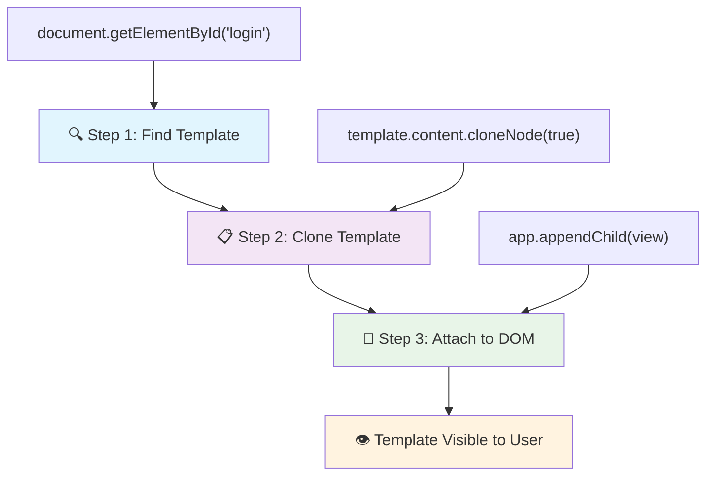
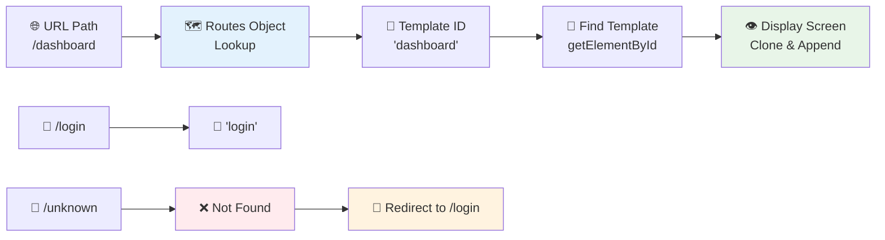
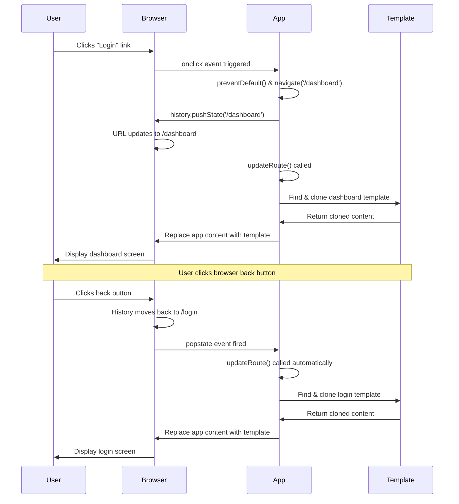

<!--
CO_OP_TRANSLATOR_METADATA:
{
  "original_hash": "5d259f6962464ad91e671083aa0398f4",
  "translation_date": "2025-10-22T16:21:41+00:00",
  "source_file": "7-bank-project/1-template-route/README.md",
  "language_code": "mr"
}
-->
# बँकिंग अ‍ॅप तयार करा भाग 1: HTML टेम्पलेट्स आणि वेब अ‍ॅपमधील रूट्स

जेव्हा अपोलो 11 च्या मार्गदर्शन संगणकाने 1969 मध्ये चंद्रावर नेव्हिगेशन केले, तेव्हा त्याला संपूर्ण प्रणाली पुन्हा सुरू न करता वेगवेगळ्या प्रोग्राम्समध्ये स्विच करावे लागले. आधुनिक वेब अ‍ॅप्सही असंच काम करतात – ते तुम्हाला जे दिसतं ते बदलतात, परंतु सर्वकाही सुरुवातीपासून पुन्हा लोड करत नाहीत. यामुळे वापरकर्त्यांना अपेक्षित असलेला गुळगुळीत, प्रतिसादात्मक अनुभव निर्माण होतो.

पारंपरिक वेबसाइट्स ज्या प्रत्येक संवादासाठी संपूर्ण पृष्ठे पुन्हा लोड करतात, त्यापेक्षा आधुनिक वेब अ‍ॅप्स फक्त बदलण्याची गरज असलेल्या भागांचे अपडेट्स करतात. हे दृष्टिकोन, जसे मिशन कंट्रोल वेगवेगळ्या डिस्प्ले दरम्यान स्विच करते आणि सतत संवाद ठेवते, तसाच गुळगुळीत अनुभव निर्माण करतो.

यामुळे फरक इतका नाट्यमय का वाटतो:

| पारंपरिक मल्टी-पेज अ‍ॅप्स | आधुनिक सिंगल-पेज अ‍ॅप्स |
|----------------------------|-------------------------|
| **नेव्हिगेशन** | प्रत्येक स्क्रीनसाठी संपूर्ण पृष्ठ पुन्हा लोड | त्वरित सामग्री स्विचिंग |
| **कामगिरी** | संपूर्ण HTML डाउनलोडमुळे धीमे | अंशतः अपडेट्समुळे जलद |
| **वापरकर्ता अनुभव** | पृष्ठ फ्लॅशेस त्रासदायक | गुळगुळीत, अ‍ॅपसारखे संक्रमण |
| **डेटा शेअरिंग** | पृष्ठांमध्ये कठीण | सोपे स्टेट मॅनेजमेंट |
| **विकास** | अनेक HTML फाइल्स सांभाळणे | एक HTML फाइल आणि डायनॅमिक टेम्पलेट्स |

**उत्क्रांती समजून घेणे:**
- **पारंपरिक अ‍ॅप्स** प्रत्येक नेव्हिगेशन क्रियेसाठी सर्व्हर विनंत्या करतात
- **आधुनिक SPAs** एकदाच लोड होतात आणि JavaScript वापरून सामग्री डायनॅमिकपणे अपडेट करतात
- **वापरकर्त्यांच्या अपेक्षा** आता त्वरित, अखंड संवादांना प्राधान्य देतात
- **कामगिरी फायदे** बँडविड्थ कमी होणे आणि जलद प्रतिसाद

या धड्यात, आम्ही अनेक स्क्रीन असलेला बँकिंग अ‍ॅप तयार करू जो अखंडपणे एकत्रित होतो. जसे वैज्ञानिक वेगवेगळ्या प्रयोगांसाठी पुन्हा कॉन्फिगर करता येणारी मॉड्यूलर उपकरणे वापरतात, तसेच आम्ही HTML टेम्पलेट्स वापरू जे पुनर्वापर करता येणारे घटक आहेत आणि गरजेनुसार प्रदर्शित करता येतात.

तुम्ही HTML टेम्पलेट्स (वेगवेगळ्या स्क्रीनसाठी पुनर्वापर करता येणारे ब्लूप्रिंट्स), JavaScript रूटिंग (स्क्रीन दरम्यान स्विचिंगची प्रणाली) आणि ब्राउझरचा इतिहास API (बॅक बटण अपेक्षेप्रमाणे कार्य करते याची खात्री करणारी) यावर काम कराल. React, Vue आणि Angular सारख्या फ्रेमवर्क्समध्ये वापरल्या जाणाऱ्या मूलभूत तंत्रांचा वापर येथे केला जातो.

शेवटी, तुम्हाला व्यावसायिक सिंगल-पेज अ‍ॅप्लिकेशन तत्त्वे दाखवणारा कार्यरत बँकिंग अ‍ॅप तयार होईल.

## प्री-लेक्चर क्विझ

[प्री-लेक्चर क्विझ](https://ff-quizzes.netlify.app/web/quiz/41)

### तुम्हाला काय लागेल

आपल्या बँकिंग अ‍ॅपची चाचणी घेण्यासाठी स्थानिक वेब सर्व्हरची आवश्यकता असेल – काळजी करू नका, हे सोपे आहे! जर तुमच्याकडे आधीपासून सेटअप नसेल, तर फक्त [Node.js](https://nodejs.org) इंस्टॉल करा आणि तुमच्या प्रोजेक्ट फोल्डरमधून `npx lite-server` चालवा. ही सोपी कमांड स्थानिक सर्व्हर सुरू करते आणि तुमचा अ‍ॅप ब्राउझरमध्ये आपोआप उघडतो.

### तयारी

तुमच्या संगणकावर `bank` नावाचा फोल्डर तयार करा आणि त्यामध्ये `index.html` नावाची फाइल ठेवा. आपण या HTML [बॉयलरप्लेट](https://en.wikipedia.org/wiki/Boilerplate_code) पासून सुरुवात करू:

```html
<!DOCTYPE html>
<html lang="en">
  <head>
    <meta charset="UTF-8">
    <meta name="viewport" content="width=device-width, initial-scale=1.0">
    <title>Bank App</title>
  </head>
  <body>
    <!-- This is where you'll work -->
  </body>
</html>
```

**या बॉयलरप्लेटमध्ये काय आहे:**
- **HTML5 दस्तऐवज संरचना** योग्य DOCTYPE घोषणेसह स्थापित करते
- **कॅरेक्टर एन्कोडिंग** UTF-8 म्हणून कॉन्फिगर करते, आंतरराष्ट्रीय मजकूर समर्थनासाठी
- **रेस्पॉन्सिव्ह डिझाइन सक्षम करते** मोबाइल सुसंगततेसाठी व्ह्यूपोर्ट मेटा टॅगसह
- **वर्णनात्मक शीर्षक सेट करते** जे ब्राउझर टॅबमध्ये दिसते
- **स्वच्छ बॉडी सेक्शन तयार करते** जिथे आपण आपला अ‍ॅप तयार करू

> 📁 **प्रोजेक्ट स्ट्रक्चर प्रिव्ह्यू**
> 
> **या धड्याच्या शेवटी, तुमच्या प्रोजेक्टमध्ये खालील गोष्टी असतील:**
> ```
> bank/
> ├── index.html      <!-- Main HTML with templates -->
> ├── app.js          <!-- Routing and navigation logic -->
> └── style.css       <!-- (Optional for future lessons) -->
> ```
> 
> **फाइल जबाबदाऱ्या:**
> - **index.html**: सर्व टेम्पलेट्स समाविष्ट करते आणि अ‍ॅपची संरचना प्रदान करते
> - **app.js**: रूटिंग, नेव्हिगेशन आणि टेम्पलेट व्यवस्थापन हाताळते
> - **टेम्पलेट्स**: लॉगिन, डॅशबोर्ड आणि इतर स्क्रीनसाठी UI परिभाषित करतात

---

## HTML टेम्पलेट्स

टेम्पलेट्स वेब विकासातील मूलभूत समस्येचे निराकरण करतात. जेव्हा गुटेनबर्गने 1440 च्या दशकात हलणाऱ्या टाइप प्रिंटिंगचा शोध लावला, तेव्हा त्याला समजले की संपूर्ण पृष्ठे कोरण्याऐवजी, तो पुनर्वापर करता येणारे अक्षर ब्लॉक्स तयार करू शकतो आणि गरजेनुसार त्यांची व्यवस्था करू शकतो. HTML टेम्पलेट्स याच तत्त्वावर काम करतात – प्रत्येक स्क्रीनसाठी वेगळ्या HTML फाइल्स तयार करण्याऐवजी, तुम्ही पुनर्वापर करता येणाऱ्या संरचना परिभाषित करता ज्या गरजेनुसार प्रदर्शित केल्या जाऊ शकतात.

टेम्पलेट्सला तुमच्या अ‍ॅपच्या वेगवेगळ्या भागांसाठी ब्लूप्रिंट्स म्हणून विचार करा. जसे एखादा आर्किटेक्ट एक ब्लूप्रिंट तयार करतो आणि त्याचा अनेक वेळा वापर करतो, त्याऐवजी समान खोल्या पुन्हा काढत नाही, तसेच आम्ही टेम्पलेट्स एकदाच तयार करतो आणि गरजेनुसार त्यांचा वापर करतो. ब्राउझर हे टेम्पलेट्स लपवून ठेवतो जोपर्यंत JavaScript त्यांना सक्रिय करत नाही.

जर तुम्हाला वेब पेजसाठी अनेक स्क्रीन तयार करायच्या असतील, तर एक उपाय म्हणजे तुम्हाला प्रत्येक स्क्रीनसाठी एक HTML फाइल तयार करावी लागेल. परंतु, या उपायामध्ये काही असुविधा आहेत:

- स्क्रीन स्विच करताना तुम्हाला संपूर्ण HTML पुन्हा लोड करावी लागते, ज्यामुळे प्रक्रिया धीमी होऊ शकते.
- वेगवेगळ्या स्क्रीनमध्ये डेटा शेअर करणे कठीण होते.

दुसरा दृष्टिकोन म्हणजे फक्त एक HTML फाइल असणे आणि `<template>` घटक वापरून अनेक [HTML टेम्पलेट्स](https://developer.mozilla.org/docs/Web/HTML/Element/template) परिभाषित करणे. टेम्पलेट हा पुनर्वापर करता येणारा HTML ब्लॉक आहे जो ब्राउझरद्वारे प्रदर्शित केला जात नाही आणि JavaScript वापरून रनटाइमवर इंस्टंटेट करावा लागतो.

### चला तयार करूया

आम्ही दोन मुख्य स्क्रीन असलेला बँक अ‍ॅप तयार करणार आहोत: लॉगिन पेज आणि डॅशबोर्ड. प्रथम, आपल्या HTML बॉडीमध्ये एक प्लेसहोल्डर घटक जोडूया – येथे आपले वेगवेगळे स्क्रीन दिसतील:

```html
<div id="app">Loading...</div>
```

**या प्लेसहोल्डरचे समजून घेणे:**
- **ID "app" असलेला कंटेनर तयार करते** जिथे सर्व स्क्रीन प्रदर्शित होतील
- **लोडिंग संदेश दाखवते** जोपर्यंत JavaScript पहिला स्क्रीन सुरू करत नाही
- **डायनॅमिक सामग्रीसाठी एकच माउंटिंग पॉइंट प्रदान करते**
- **JavaScript वापरून `document.getElementById()` द्वारे सहज लक्ष्यीकरण सक्षम करते**

> 💡 **प्रो टिप**: या घटकाची सामग्री बदलली जाणार असल्याने, आम्ही लोडिंग संदेश किंवा इंडिकेटर ठेवू शकतो जो अ‍ॅप लोड होत असताना दिसेल.

यानंतर, HTML टेम्पलेट लॉगिन पेजसाठी खाली जोडूया. सध्या आम्ही फक्त एक शीर्षक आणि एक सेक्शन ठेवू ज्यामध्ये नेव्हिगेशनसाठी लिंक असेल.

```html
<template id="login">
  <h1>Bank App</h1>
  <section>
    <a href="/dashboard">Login</a>
  </section>
</template>
```

**या लॉगिन टेम्पलेटचे विश्लेषण:**
- **JavaScript लक्ष्यीकरणासाठी "login" हा अनोखा ओळखकर्ता परिभाषित करते**
- **मुख्य शीर्षक समाविष्ट करते** जे अ‍ॅपचे ब्रँडिंग स्थापित करते
- **संबंधित सामग्री गटबद्ध करण्यासाठी सेमॅंटिक `<section>` घटक समाविष्ट करते**
- **नेव्हिगेशन लिंक प्रदान करते** जी वापरकर्त्यांना डॅशबोर्डकडे नेईल

यानंतर, डॅशबोर्ड पेजसाठी आणखी एक HTML टेम्पलेट जोडूया. या पेजमध्ये वेगवेगळ्या सेक्शन असतील:

- शीर्षकासह हेडर आणि लॉगआउट लिंक
- बँक खात्याचा वर्तमान शिल्लक
- व्यवहारांची यादी, टेबलमध्ये प्रदर्शित

```html
<template id="dashboard">
  <header>
    <h1>Bank App</h1>
    <a href="/login">Logout</a>
  </header>
  <section>
    Balance: 100$
  </section>
  <section>
    <h2>Transactions</h2>
    <table>
      <thead>
        <tr>
          <th>Date</th>
          <th>Object</th>
          <th>Amount</th>
        </tr>
      </thead>
      <tbody></tbody>
    </table>
  </section>
</template>
```

**या डॅशबोर्डचा प्रत्येक भाग समजून घेणे:**
- **पृष्ठ संरचना तयार करते** सेमॅंटिक `<header>` घटकासह ज्यामध्ये नेव्हिगेशन आहे
- **अ‍ॅप शीर्षक सतत प्रदर्शित करते** स्क्रीनवर ब्रँडिंगसाठी
- **लॉगआउट लिंक प्रदान करते** जी लॉगिन स्क्रीनकडे परत जाते
- **वर्तमान खाते शिल्लक दाखवते** समर्पित सेक्शनमध्ये
- **व्यवहार डेटा व्यवस्थित करते** योग्य संरचित HTML टेबल वापरून
- **टेबल हेडर्स परिभाषित करते** तारीख, वस्तू आणि रक्कम कॉलमसाठी
- **टेबल बॉडी रिक्त ठेवते** डायनॅमिक सामग्री इंजेक्शनसाठी

> 💡 **प्रो टिप**: HTML टेम्पलेट्स तयार करताना, तुम्हाला ते कसे दिसेल हे पाहायचे असल्यास, तुम्ही `<template>` आणि `</template>` ओळी `<!-- -->` ने कॉमेंट करू शकता.

✅ तुम्हाला का वाटते की आम्ही टेम्पलेट्सवर `id` गुणधर्म वापरतो? आपण क्लासेससारखे काहीतरी वापरू शकतो का?

## JavaScript वापरून टेम्पलेट्स कार्यक्षम बनवणे

आता आपल्याला आपल्या टेम्पलेट्स कार्यक्षम बनवायचे आहेत. जसे 3D प्रिंटर डिजिटल ब्लूप्रिंट घेतो आणि भौतिक वस्तू तयार करतो, तसेच JavaScript आमच्या लपवलेल्या टेम्पलेट्स घेतो आणि वापरकर्त्यांना दिसणारे, संवादात्मक घटक तयार करतो.

प्रक्रिया तीन सातत्यपूर्ण चरणांचे अनुसरण करते जी आधुनिक वेब विकासाची पायाभूत रचना तयार करतात. एकदा तुम्ही हा पॅटर्न समजून घेतला की, तुम्हाला तो अनेक फ्रेमवर्क्स आणि लायब्ररीमध्ये ओळखता येईल.

जर तुम्ही तुमची सध्याची HTML फाइल ब्राउझरमध्ये वापरली, तर तुम्हाला दिसेल की ती `Loading...` दाखवण्यात अडकते. कारण आपल्याला HTML टेम्पलेट्स इंस्टंटेट आणि प्रदर्शित करण्यासाठी काही JavaScript कोड जोडण्याची आवश्यकता आहे.

टेम्पलेट इंस्टंटेट करणे सामान्यतः 3 चरणांमध्ये केले जाते:

1. DOM मध्ये टेम्पलेट घटक मिळवा, उदाहरणार्थ [`document.getElementById`](https://developer.mozilla.org/docs/Web/API/Document/getElementById) वापरून.
2. टेम्पलेट घटक क्लोन करा, [`cloneNode`](https://developer.mozilla.org/docs/Web/API/Node/cloneNode) वापरून.
3. ते दृश्यमान घटकाखाली DOM मध्ये जोडून द्या, उदाहरणार्थ [`appendChild`](https://developer.mozilla.org/docs/Web/API/Node/appendChild) वापरून.



**प्रक्रियेचे दृश्यात्मक विश्लेषण:**
- **चरण 1** DOM संरचनेत लपवलेला टेम्पलेट शोधतो
- **चरण 2** सुरक्षितपणे बदलता येणारी कार्यरत प्रत तयार करतो
- **चरण 3** प्रत दृश्यमान पृष्ठ क्षेत्रामध्ये घालतो
- **परिणाम** म्हणजे कार्यक्षम स्क्रीन जी वापरकर्ते पाहू आणि वापरू शकतात

✅ आपण टेम्पलेट क्लोन करण्यापूर्वी ते DOM मध्ये जोडण्याची आवश्यकता का आहे? जर आपण हा चरण वगळला तर काय होईल?

### कार्य

तुमच्या प्रोजेक्ट फोल्डरमध्ये `app.js` नावाची नवीन फाइल तयार करा आणि ती फाइल तुमच्या HTML च्या `<head>` सेक्शनमध्ये इम्पोर्ट करा:

```html
<script src="app.js" defer></script>
```

**या स्क्रिप्ट इम्पोर्टचे समजून घेणे:**
- **JavaScript फाइल HTML दस्तऐवजाशी लिंक करते**
- **`defer` गुणधर्म वापरते** जेणेकरून HTML पार्सिंग पूर्ण झाल्यानंतर स्क्रिप्ट चालते
- **सर्व DOM घटकांमध्ये प्रवेश सक्षम करते** कारण ते स्क्रिप्ट अंमलबजावणीपूर्वी पूर्णपणे लोड केले जातात
- **स्क्रिप्ट लोडिंग आणि कामगिरीसाठी आधुनिक सर्वोत्तम पद्धतींचे अनुसरण करते**

आता `app.js` मध्ये, आपण एक नवीन फंक्शन `updateRoute` तयार करूया:

```js
function updateRoute(templateId) {
  const template = document.getElementById(templateId);
  const view = template.content.cloneNode(true);
  const app = document.getElementById('app');
  app.innerHTML = '';
  app.appendChild(view);
}
```

**चरणानुसार काय घडते ते येथे आहे:**
- **टेम्पलेट घटक शोधतो** त्याच्या अनोख्या ID वापरून
- **टेम्पलेटच्या सामग्रीची डीप कॉपी तयार करतो** `cloneNode(true)` वापरून
- **अ‍ॅप कंटेनर शोधतो** जिथे सामग्री प्रदर्शित केली जाईल
- **अ‍ॅप कंटेनरमधून कोणतीही विद्यमान सामग्री साफ करतो**
- **क्लोन केलेली टेम्पलेट सामग्री दृश्यमान DOM मध्ये घालतो**

आता या फंक्शनला टेम्पलेटसह कॉल करा आणि परिणाम पहा.

```js
updateRoute('login');
```

**या फंक्शन कॉलने काय साध्य केले:**
- **लॉगिन टेम्पलेट सक्रिय करते** त्याचा ID पॅरामीटर म्हणून पास करून
- **वेगवेगळ्या अ‍ॅप स्क्रीन दरम्यान प्रोग्रामॅटिकली स्विच कसे करावे ते दाखवते**
- **"Loading..." संदेशाच्या जागी लॉगिन स्क्रीन दाखवते**

✅ या कोडचा उद्देश काय आहे `app.innerHTML = '';`? त्याशिवाय काय होते?

## रूट्स तयार करणे

रूटिंग म्हणजे URL ला योग्य सामग्रीशी जोडणे. जसे सुरुवातीच्या टेलिफोन ऑपरेटर्सने कॉल्स कनेक्ट करण्यासाठी स्विचबोर्ड्स वापरले – ते येणाऱ्या विनंती घेत आणि योग्य गंतव्याशी जोडत. वेब रूटिंगही तसंच काम करते, URL विनंती घेत आणि कोणती सामग्री प्रदर्शित करायची ते ठरवते.

पारंपरिकपणे, वेब सर्व्हर्सने वेगवेगळ्या URL साठी वेगवेगळ्या HTML फाइल्स दिल्या. आपण सिंगल-पेज अ‍ॅप तयार करत असल्याने, आपल्याला JavaScript वापरून हे रूटिंग स्वतः हाताळावे लागेल. या दृष्टिकोनामुळे वापरकर्ता अनुभव आणि कामगिरीवर अधिक नियंत्रण मिळते.



**रूटिंग फ्लो समजून घेणे:**
- **URL बदल** आमच्या रूट्स कॉन्फिगरेशनमध्ये लुकअप ट्रिगर करतो
- **वैध रूट्स** विशिष्ट टेम्पलेट IDs शी मॅप करतात जे रेंडरिंगसाठी आहेत
- **अवैध रूट्स** तुटलेल्या स्टेट्स टाळण्यासाठी फॉलबॅक वर्तन ट्रिगर करतात
- **टेम्पलेट रेंडरिंग** आपण शिकलेल्या तीन-चरण प्रक्रियेचे अनुसरण करते

वेब अ‍ॅपबद्दल बोलताना, आम्ही *रूटिंग* म्हणजे URL ला विशिष्ट स्क्रीनशी मॅप करण्याचा हेतू म्हणतो जो प्रदर्शित केला जावा. अनेक HTML फाइल्स असलेल्या वेबसाइटवर, हे आपोआप केले जाते कारण फाइल पथ URL वर प्रतिबिंबित होतात. उदाहरणार्थ, तुमच्या प्रोजेक्ट फोल्डरमध्ये या फाइल्स असल्यास:

```
mywebsite/index.html
mywebsite/login.html
mywebsite/admin/index.html
```

जर तुम्ही `mywebsite` र
✅ URL मध्ये अज्ञात मार्ग प्रविष्ट केल्यास काय होते? आपण हे कसे सोडवू शकतो?

## नेव्हिगेशन जोडणे

रूटिंग सेट केल्यानंतर, वापरकर्त्यांना अॅपमधून नेव्हिगेट करण्याचा मार्ग आवश्यक आहे. पारंपरिक वेबसाइट्सवर लिंकवर क्लिक केल्यावर संपूर्ण पृष्ठ पुन्हा लोड होते, परंतु आम्हाला URL आणि सामग्री पृष्ठ रीफ्रेश न करता अपडेट करायची आहे. यामुळे डेस्कटॉप अॅप्लिकेशन्सप्रमाणे वेगवेगळ्या दृश्यांमध्ये स्विच करताना अधिक गुळगुळीत अनुभव तयार होतो.

आपल्याला दोन गोष्टी समन्वयित कराव्या लागतील: ब्राउझरचा URL अपडेट करणे जेणेकरून वापरकर्ते पृष्ठे बुकमार्क करू शकतील आणि लिंक शेअर करू शकतील, आणि योग्य सामग्री प्रदर्शित करणे. योग्य प्रकारे अंमलात आणल्यास, हे आधुनिक अॅप्लिकेशन्समधून वापरकर्त्यांना अपेक्षित असलेले अखंड नेव्हिगेशन तयार करते.

> 🏗️ **आर्किटेक्चर अंतर्दृष्टी**: नेव्हिगेशन सिस्टम घटक
>
> **आपण काय तयार करत आहात:**
> - **🔄 URL व्यवस्थापन**: पृष्ठ पुन्हा लोड न करता ब्राउझर अॅड्रेस बार अपडेट करते
> - **📋 टेम्पलेट सिस्टम**: वर्तमान रूटवर आधारित सामग्री गतिशीलपणे बदलते  
> - **📚 इतिहास एकत्रीकरण**: ब्राउझरच्या मागे/पुढे बटण कार्यक्षमता राखते
> - **🛡️ त्रुटी हाताळणी**: अवैध किंवा गहाळ रूटसाठी सौम्य फॉलबॅक
>
> **घटक कसे एकत्र काम करतात:**
> - नेव्हिगेशन इव्हेंट्स (क्लिक्स, इतिहास बदल) ऐकते
> - इतिहास API वापरून URL अपडेट करते
> - नवीन रूटसाठी योग्य टेम्पलेट रेंडर करते
> - अखंड वापरकर्ता अनुभव कायम ठेवते

आमच्या अॅपसाठी पुढील पायरी म्हणजे URL मॅन्युअली बदलण्याची गरज न पडता पृष्ठांमध्ये नेव्हिगेट करण्याची शक्यता जोडणे. याचा अर्थ दोन गोष्टी आहेत:

  1. वर्तमान URL अपडेट करणे
  2. नवीन URL वर आधारित प्रदर्शित टेम्पलेट अपडेट करणे

आम्ही `updateRoute` फंक्शनसह दुसऱ्या भागाची आधीच काळजी घेतली आहे, त्यामुळे आम्हाला वर्तमान URL कसे अपडेट करायचे ते शोधावे लागेल.

आपल्याला JavaScript आणि विशेषतः [`history.pushState`](https://developer.mozilla.org/docs/Web/API/History/pushState) वापरावे लागेल जे URL अपडेट करण्यास आणि HTML पुन्हा लोड न करता ब्राउझिंग इतिहासात नवीन नोंदी तयार करण्यास अनुमती देते.

> ⚠️ **महत्त्वाची टीप**: HTML अँकर एलिमेंट [`<a href>`](https://developer.mozilla.org/docs/Web/HTML/Element/a) स्वतःच वेगवेगळ्या URL साठी हायपरलिंक्स तयार करण्यासाठी वापरले जाऊ शकते, परंतु ते ब्राउझरला HTML पुन्हा लोड करण्यास प्रवृत्त करेल. कस्टम जावास्क्रिप्टसह रूटिंग हाताळताना, क्लिक इव्हेंटवर `preventDefault()` फंक्शन वापरून हे वर्तन टाळणे आवश्यक आहे.

### कार्य

आमच्या अॅपमध्ये नेव्हिगेट करण्यासाठी वापरता येईल अशी नवीन फंक्शन तयार करूया:

```js
function navigate(path) {
  window.history.pushState({}, path, path);
  updateRoute();
}
```

**या नेव्हिगेशन फंक्शनचे समजून घेणे:**
- `history.pushState` वापरून ब्राउझरचा URL नवीन मार्गावर अपडेट करते
- योग्य मागे/पुढे बटण समर्थनासाठी ब्राउझरच्या इतिहास स्टॅकमध्ये नवीन नोंदी जोडते
- संबंधित टेम्पलेट प्रदर्शित करण्यासाठी `updateRoute()` फंक्शन ट्रिगर करते
- पृष्ठ पुन्हा लोड न करता सिंगल-पेज अॅप अनुभव राखते

ही पद्धत प्रथम दिलेल्या मार्गावर आधारित वर्तमान URL अपडेट करते, नंतर टेम्पलेट अपडेट करते. `window.location.origin` प्रॉपर्टी URL रूट परत करते, ज्यामुळे दिलेल्या मार्गावरून संपूर्ण URL पुन्हा तयार करणे शक्य होते.

आता आमच्याकडे हे फंक्शन आहे, आम्ही समस्या सोडवू शकतो जेव्हा एखादा मार्ग कोणत्याही परिभाषित रूटशी जुळत नाही. आम्ही `updateRoute` फंक्शनमध्ये बदल करून एखाद्या विद्यमान रूटवर फॉलबॅक जोडू जेव्हा जुळणारा मार्ग सापडत नाही.

```js
function updateRoute() {
  const path = window.location.pathname;
  const route = routes[path];

  if (!route) {
    return navigate('/login');
  }

  const template = document.getElementById(route.templateId);
  const view = template.content.cloneNode(true);
  const app = document.getElementById('app');
  app.innerHTML = '';
  app.appendChild(view);
}
```

**लक्षात ठेवण्याचे महत्त्वाचे मुद्दे:**
- वर्तमान मार्गासाठी रूट अस्तित्वात आहे का ते तपासते
- अवैध रूटवर प्रवेश केल्यावर लॉगिन पृष्ठावर पुनर्निर्देशित करते
- तुटलेले नेव्हिगेशन टाळण्यासाठी फॉलबॅक यंत्रणा प्रदान करते
- चुकीच्या URL सह देखील वापरकर्त्यांना नेहमी वैध स्क्रीन दिसते याची खात्री करते

जर रूट सापडला नाही, तर आम्ही आता `login` पृष्ठावर पुनर्निर्देशित करू.

आता लिंकवर क्लिक केल्यावर URL मिळवण्यासाठी आणि ब्राउझरच्या डिफॉल्ट लिंक वर्तन टाळण्यासाठी एक फंक्शन तयार करूया:

```js
function onLinkClick(event) {
  event.preventDefault();
  navigate(event.target.href);
}
```

**या क्लिक हँडलरचे विश्लेषण:**
- `preventDefault()` वापरून ब्राउझरचे डिफॉल्ट लिंक वर्तन टाळते
- क्लिक केलेल्या लिंक एलिमेंटमधून गंतव्य URL काढते
- पृष्ठ पुन्हा लोड न करता आमचे कस्टम नेव्हिगेट फंक्शन कॉल करते
- गुळगुळीत सिंगल-पेज अॅप्लिकेशन अनुभव राखते

```html
<a href="/dashboard" onclick="onLinkClick(event)">Login</a>
...
<a href="/login" onclick="onLinkClick(event)">Logout</a>
```

**या onclick बाइंडिंगने काय साध्य केले:**
- प्रत्येक लिंकला आमच्या कस्टम नेव्हिगेशन सिस्टमशी जोडते
- प्रक्रिया करण्यासाठी क्लिक इव्हेंट आमच्या `onLinkClick` फंक्शनला पास करते
- पृष्ठ पुन्हा लोड न करता गुळगुळीत नेव्हिगेशन सक्षम करते
- वापरकर्त्यांना बुकमार्क किंवा शेअर करता येईल अशी योग्य URL रचना राखते

[`onclick`](https://developer.mozilla.org/docs/Web/API/GlobalEventHandlers/onclick) अॅट्रिब्युट क्लिक इव्हेंटला जावास्क्रिप्ट कोडशी बाइंड करते, येथे `navigate()` फंक्शन कॉल.

या लिंकवर क्लिक करून पहा, आता तुम्ही तुमच्या अॅपच्या वेगवेगळ्या स्क्रीनमध्ये नेव्हिगेट करू शकता.

✅ `history.pushState` पद्धत HTML5 मानकाचा भाग आहे आणि [सर्व आधुनिक ब्राउझरमध्ये](https://caniuse.com/?search=pushState) अंमलात आणली आहे. जर तुम्ही जुन्या ब्राउझरसाठी वेब अॅप तयार करत असाल, तर तुम्ही या API च्या जागी एक युक्ती वापरू शकता: मार्गाच्या आधी [हॅश (`#`)](https://en.wikipedia.org/wiki/URI_fragment) वापरून तुम्ही रूटिंग अंमलात आणू शकता जे नियमित अँकर नेव्हिगेशनसह कार्य करते आणि पृष्ठ पुन्हा लोड करत नाही, कारण त्याचा उद्देश पृष्ठामध्ये अंतर्गत लिंक तयार करणे होता.

## मागे आणि पुढे बटणे कार्यरत करणे

मागे आणि पुढे बटणे वेब ब्राउझिंगसाठी मूलभूत आहेत, जसे NASA मिशन कंट्रोलर्स स्पेस मिशन दरम्यान मागील सिस्टम स्टेट्स पुनरावलोकन करू शकतात. वापरकर्त्यांना ही बटणे कार्यरत असणे अपेक्षित आहे, आणि ती कार्य करत नसल्यास, अपेक्षित ब्राउझिंग अनुभव खंडित होतो.

आमच्या सिंगल-पेज अॅपला हे समर्थन करण्यासाठी अतिरिक्त कॉन्फिगरेशन आवश्यक आहे. ब्राउझर इतिहास स्टॅक राखतो (ज्यामध्ये आम्ही `history.pushState` सह नोंदी जोडत आहोत), परंतु जेव्हा वापरकर्ते या इतिहासाद्वारे नेव्हिगेट करतात, तेव्हा आमच्या अॅपला योग्यरित्या प्रतिसाद देऊन प्रदर्शित सामग्री अपडेट करणे आवश्यक आहे.



**महत्त्वाचे संवाद बिंदू:**
- वापरकर्त्याच्या क्रिया क्लिक किंवा ब्राउझर बटणांद्वारे नेव्हिगेशन ट्रिगर करतात
- अॅप पृष्ठ पुन्हा लोड टाळण्यासाठी लिंक क्लिक इंटरसेप्ट करते
- इतिहास API URL बदल आणि ब्राउझर इतिहास स्टॅक व्यवस्थापित करते
- टेम्पलेट्स प्रत्येक स्क्रीनसाठी सामग्री संरचना प्रदान करतात
- इव्हेंट लिसनर्स अॅप सर्व प्रकारच्या नेव्हिगेशनला प्रतिसाद देते याची खात्री करतात

`history.pushState` ब्राउझरच्या नेव्हिगेशन इतिहासात नवीन नोंदी तयार करते. तुम्ही तुमच्या ब्राउझरचा *मागे बटण* धरून ठेवून ते तपासू शकता, त्यात असे काहीतरी दिसले पाहिजे:


जर तुम्ही काही वेळा मागे बटणावर क्लिक केले, तर तुम्हाला दिसेल की वर्तमान URL बदलतो आणि इतिहास अपडेट होतो, परंतु समान टेम्पलेट प्रदर्शित होत राहते.

कारण अॅप्लिकेशनला माहित नाही की इतिहास बदलला की प्रत्येक वेळी `updateRoute()` कॉल करणे आवश्यक आहे. जर तुम्ही [`history.pushState`](https://developer.mozilla.org/docs/Web/API/History/pushState) दस्तऐवज पाहिल्यास, तुम्हाला दिसेल की जर स्टेट बदलला - म्हणजे आम्ही वेगळ्या URL वर गेलो - तर [`popstate`](https://developer.mozilla.org/docs/Web/API/Window/popstate_event) इव्हेंट ट्रिगर होतो. आम्ही ते वापरून तो मुद्दा सोडवू.

### कार्य

ब्राउझर इतिहास बदलल्यावर प्रदर्शित टेम्पलेट अपडेट होईल याची खात्री करण्यासाठी, आम्ही `updateRoute()` कॉल करणारे नवीन फंक्शन जोडू. आम्ही ते आमच्या `app.js` फाइलच्या तळाशी जोडू:

```js
window.onpopstate = () => updateRoute();
updateRoute();
```

**या इतिहास एकत्रीकरणाचे समजून घेणे:**
- वापरकर्ते ब्राउझर बटणांसह नेव्हिगेट करताना `popstate` इव्हेंट्ससाठी ऐकते
- संक्षिप्त इव्हेंट हँडलर सिंटॅक्ससाठी अॅरो फंक्शन वापरते
- इतिहास स्टेट बदलल्यावर `updateRoute()` आपोआप कॉल करते
- पृष्ठ प्रथम लोड झाल्यावर `updateRoute()` कॉल करून अॅप प्रारंभ करते
- वापरकर्ते कसे नेव्हिगेट करतात याची पर्वा न करता योग्य टेम्पलेट प्रदर्शित करते

> 💡 **प्रो टीप**: आम्ही [अॅरो फंक्शन](https://developer.mozilla.org/docs/Web/JavaScript/Reference/Functions/Arrow_functions) वापरून आमच्या `popstate` इव्हेंट हँडलरची घोषणा केली आहे, परंतु नियमित फंक्शन देखील त्याचप्रमाणे कार्य करेल.

अॅरो फंक्शन्सवर रिफ्रेशर व्हिडिओ येथे आहे:

[](https://youtube.com/watch?v=OP6eEbOj2sc "अॅरो फंक्शन्स")

> 🎥 अॅरो फंक्शन्सबद्दल व्हिडिओसाठी वरील प्रतिमेवर क्लिक करा.

आता तुमच्या ब्राउझरचे मागे आणि पुढे बटणे वापरून पहा आणि यावेळी प्रदर्शित रूट योग्यरित्या अपडेट होत आहे का ते तपासा.

---

## GitHub Copilot Agent Challenge 🚀

Agent मोड वापरून खालील आव्हान पूर्ण करा:

**वर्णन:** बँकिंग अॅपमध्ये त्रुटी हाताळणी आणि अवैध रूटसाठी 404 पृष्ठ टेम्पलेट अंमलात आणून वापरकर्ता अनुभव सुधारित करा.

**प्रॉम्प्ट:** "not-found" आयडीसह नवीन HTML टेम्पलेट तयार करा जे शैलीसह वापरकर्ता-अनुकूल 404 त्रुटी पृष्ठ प्रदर्शित करते. नंतर जावास्क्रिप्ट रूटिंग लॉजिक बदलून वापरकर्ते अवैध URL वर नेव्हिगेट करताना हे टेम्पलेट दाखवा आणि "Go Home" बटण जोडा जे लॉगिन पृष्ठावर परत नेव्हिगेट करते.

Agent मोडबद्दल अधिक जाणून घ्या [येथे](https://code.visualstudio.com/blogs/2025/02/24/introducing-copilot-agent-mode).

## 🚀 आव्हान

या अॅपसाठी क्रेडिट्स दर्शविणाऱ्या तिसऱ्या पृष्ठासाठी नवीन टेम्पलेट आणि रूट जोडा.

**आव्हानाचे उद्दिष्ट:**
- योग्य सामग्री संरचनेसह नवीन HTML टेम्पलेट तयार करा
- तुमच्या रूट्स कॉन्फिगरेशन ऑब्जेक्टमध्ये नवीन रूट जोडा
- क्रेडिट्स पृष्ठावर आणि तेथून नेव्हिगेशन लिंक समाविष्ट करा
- ब्राउझर इतिहासासह सर्व नेव्हिगेशन योग्यरित्या कार्य करत आहे का ते तपासा

## पोस्ट-लेक्चर क्विझ

[पोस्ट-लेक्चर क्विझ](https://ff-quizzes.netlify.app/web/quiz/42)

## पुनरावलोकन आणि स्व-अभ्यास

वेब विकासातील रूटिंग हे आश्चर्यकारकपणे क्लिष्ट भागांपैकी एक आहे, विशेषतः वेब पृष्ठ रीफ्रेश वर्तनांपासून सिंगल पेज अॅप्लिकेशन पृष्ठ रीफ्रेशेसकडे जात आहे. [Azure Static Web App सेवा](https://docs.microsoft.com/azure/static-web-apps/routes/?WT.mc_id=academic-77807-sagibbon) रूटिंग कसे हाताळते याबद्दल थोडे वाचा. त्या दस्तऐवजावर वर्णन केलेले काही निर्णय का आवश्यक आहेत हे तुम्ही स्पष्ट करू शकता का?

**अतिरिक्त शिक्षण संसाधने:**
- React Router आणि Vue Router सारख्या लोकप्रिय फ्रेमवर्क्स क्लायंट-साइड रूटिंग कसे अंमलात आणतात ते एक्सप्लोर करा
- हॅश-आधारित रूटिंग आणि इतिहास API रूटिंगमधील फरक संशोधन करा
- सर्व्हर-साइड रेंडरिंग (SSR) आणि ते रूटिंग रणनीतींवर कसा परिणाम करते ते जाणून घ्या
- प्रोग्रेसिव्ह वेब अॅप्स (PWAs) रूटिंग आणि नेव्हिगेशन कसे हाताळतात ते तपासा

## असाइनमेंट

[रूटिंग सुधारित करा](assignment.md)

---

**अस्वीकरण**:  
हा दस्तऐवज AI भाषांतर सेवा [Co-op Translator](https://github.com/Azure/co-op-translator) वापरून भाषांतरित करण्यात आला आहे. आम्ही अचूकतेसाठी प्रयत्नशील असलो तरी कृपया लक्षात ठेवा की स्वयंचलित भाषांतरे त्रुटी किंवा अचूकतेच्या अभावाने युक्त असू शकतात. मूळ भाषेतील दस्तऐवज हा अधिकृत स्रोत मानला जावा. महत्त्वाच्या माहितीसाठी व्यावसायिक मानवी भाषांतराची शिफारस केली जाते. या भाषांतराचा वापर करून उद्भवलेल्या कोणत्याही गैरसमज किंवा चुकीच्या अर्थासाठी आम्ही जबाबदार राहणार नाही.