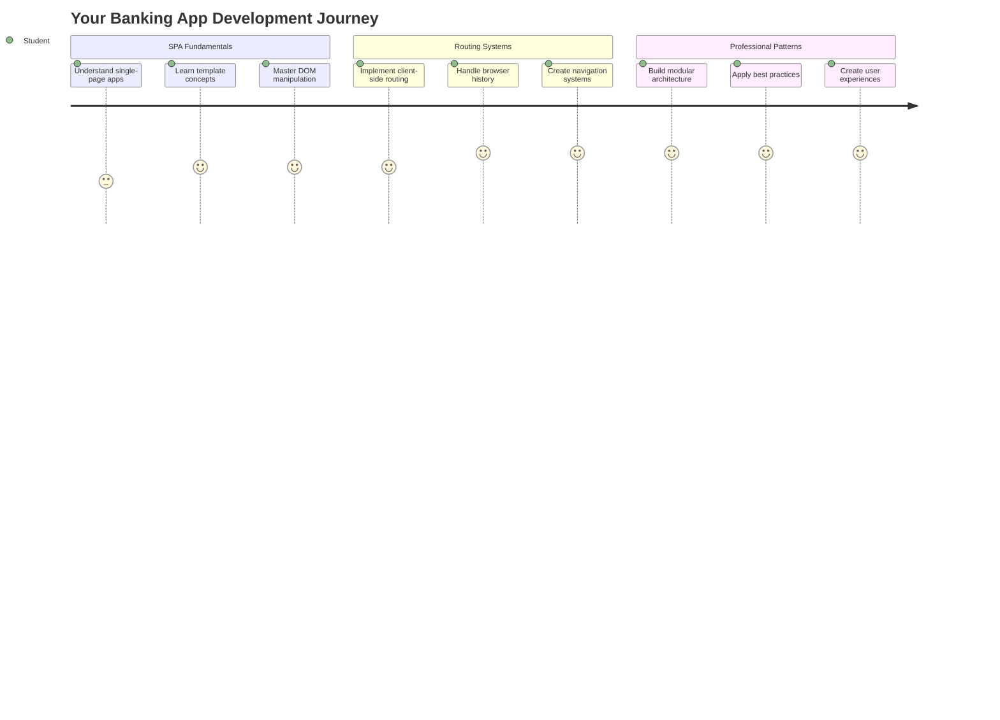
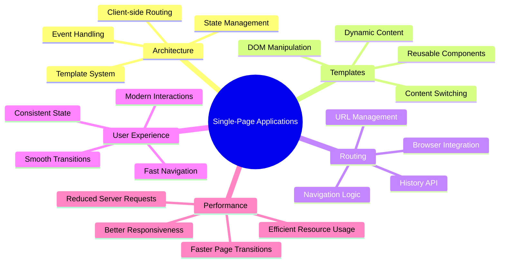
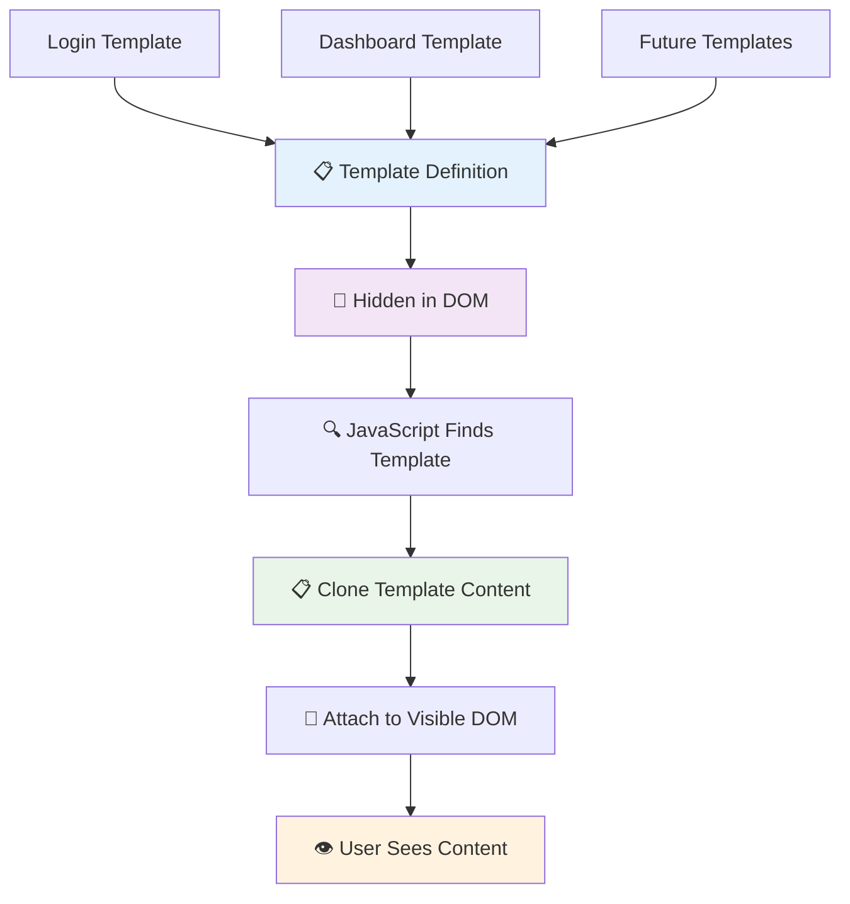
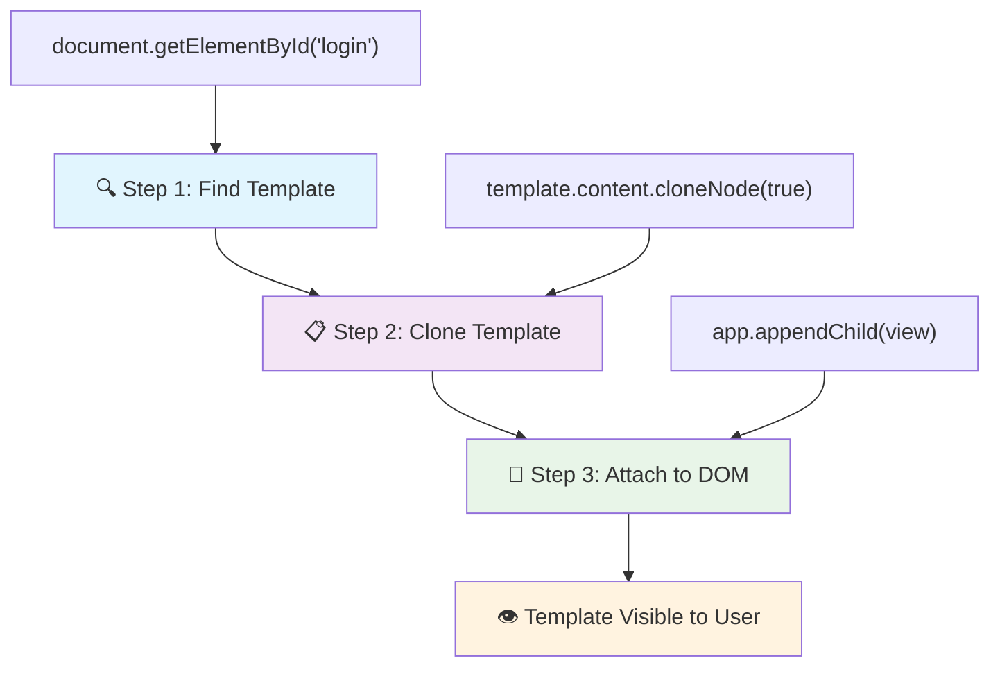
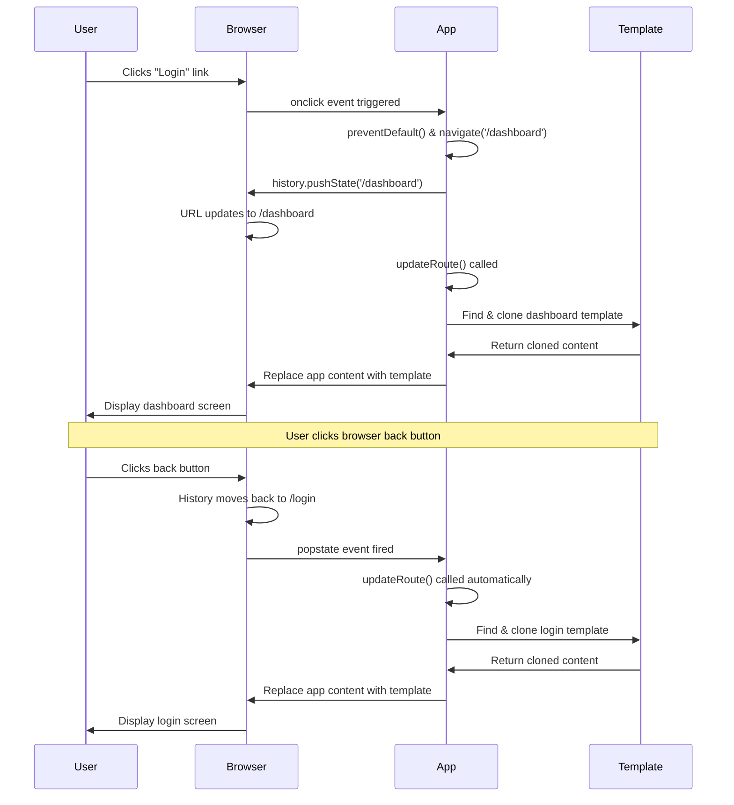
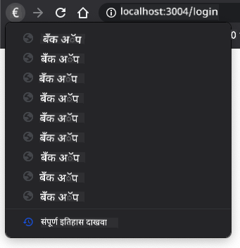

<!--
CO_OP_TRANSLATOR_METADATA:
{
  "original_hash": "351678bece18f07d9daa987a881fb062",
  "translation_date": "2025-11-03T14:47:54+00:00",
  "source_file": "7-bank-project/1-template-route/README.md",
  "language_code": "mr"
}
-->
# बँकिंग अ‍ॅप तयार करा भाग 1: HTML टेम्पलेट्स आणि वेब अ‍ॅपमधील रूट्स



जेव्हा अपोलो 11 च्या मार्गदर्शन संगणकाने 1969 मध्ये चंद्रावर नेव्हिगेशन केले, तेव्हा त्याला संपूर्ण प्रणाली पुन्हा सुरू न करता वेगवेगळ्या प्रोग्राम्समध्ये स्विच करावे लागले. आधुनिक वेब अ‍ॅप्सही असंच काम करतात – ते तुम्हाला जे दिसतं ते बदलतात, परंतु सर्वकाही पुन्हा लोड करत नाहीत. यामुळे वापरकर्त्यांना अपेक्षित असलेला गुळगुळीत, प्रतिसादात्मक अनुभव निर्माण होतो.

पारंपरिक वेबसाइट्स जिथे प्रत्येक संवादासाठी संपूर्ण पृष्ठ पुन्हा लोड करतात, तिथे आधुनिक वेब अ‍ॅप्स फक्त बदलण्याची गरज असलेल्या भागांचे अद्यतन करतात. हे दृष्टिकोन, जसे मिशन कंट्रोल सतत संवाद ठेवत वेगवेगळ्या डिस्प्ले दरम्यान स्विच करते, तसाच गुळगुळीत अनुभव निर्माण करतो.

यामुळे फरक इतका नाट्यमय का वाटतो:

| पारंपरिक मल्टी-पेज अ‍ॅप्स | आधुनिक सिंगल-पेज अ‍ॅप्स |
|----------------------------|-------------------------|
| **नेव्हिगेशन** | प्रत्येक स्क्रीनसाठी संपूर्ण पृष्ठ पुन्हा लोड | त्वरित सामग्री स्विचिंग |
| **कामगिरी** | संपूर्ण HTML डाउनलोडमुळे धीमे | अंशतः अद्यतनांमुळे जलद |
| **वापरकर्ता अनुभव** | पृष्ठ फ्लॅशेस त्रासदायक | गुळगुळीत, अ‍ॅपसारखे संक्रमण |
| **डेटा शेअरिंग** | पृष्ठांमध्ये कठीण | सोपे स्टेट मॅनेजमेंट |
| **विकसन** | अनेक HTML फायलींचे व्यवस्थापन | डायनॅमिक टेम्पलेट्ससह एक HTML |

**उत्क्रांती समजून घेणे:**
- **पारंपरिक अ‍ॅप्स** प्रत्येक नेव्हिगेशन क्रियेसाठी सर्व्हर विनंत्या करतात
- **आधुनिक SPAs** एकदाच लोड होतात आणि जावास्क्रिप्ट वापरून सामग्री गतिशीलपणे अद्यतनित करतात
- **वापरकर्त्यांच्या अपेक्षा** आता त्वरित, अखंड संवादांना प्राधान्य देतात
- **कामगिरी फायदे** बँडविड्थ कमी आणि जलद प्रतिसाद यांचा समावेश करतात

या धड्यात, आम्ही अनेक स्क्रीन असलेला बँकिंग अ‍ॅप तयार करू जो अखंडपणे एकत्रित होतो. जसे वैज्ञानिक वेगवेगळ्या प्रयोगांसाठी पुन्हा कॉन्फिगर करता येणारी मॉड्युलर उपकरणे वापरतात, तसेच आम्ही HTML टेम्पलेट्स वापरू जे पुनर्वापरयोग्य घटक म्हणून आवश्यकतेनुसार प्रदर्शित केले जाऊ शकतात.

तुम्ही HTML टेम्पलेट्स (वेगवेगळ्या स्क्रीनसाठी पुनर्वापरयोग्य ब्लूप्रिंट्स), जावास्क्रिप्ट रूटिंग (स्क्रीन दरम्यान स्विच करणारी प्रणाली) आणि ब्राउझरचा इतिहास API (जो बॅक बटण अपेक्षेप्रमाणे कार्यरत ठेवतो) यासह काम कराल. React, Vue आणि Angular सारख्या फ्रेमवर्कद्वारे वापरल्या जाणाऱ्या मूलभूत तंत्रांचा वापर येथे केला जातो.

शेवटी, तुम्हाला व्यावसायिक सिंगल-पेज अ‍ॅप्लिकेशन तत्त्वांचे प्रदर्शन करणारा कार्यरत बँकिंग अ‍ॅप मिळेल.



## प्री-लेक्चर क्विझ

[प्री-लेक्चर क्विझ](https://ff-quizzes.netlify.app/web/quiz/41)

### तुम्हाला काय लागेल

आपल्या बँकिंग अ‍ॅपची चाचणी घेण्यासाठी स्थानिक वेब सर्व्हरची आवश्यकता असेल – काळजी करू नका, हे सोपे आहे! जर तुमच्याकडे आधीपासून सेटअप नसेल, तर फक्त [Node.js](https://nodejs.org) इंस्टॉल करा आणि तुमच्या प्रोजेक्ट फोल्डरमधून `npx lite-server` चालवा. ही सोपी कमांड स्थानिक सर्व्हर चालवते आणि तुमचा अ‍ॅप ब्राउझरमध्ये आपोआप उघडते.

### तयारी

तुमच्या संगणकावर `bank` नावाचा फोल्डर तयार करा आणि त्यात `index.html` नावाची फाइल ठेवा. आम्ही या HTML [बॉयलरप्लेट](https://en.wikipedia.org/wiki/Boilerplate_code) पासून सुरुवात करू:

```html
<!DOCTYPE html>
<html lang="en">
  <head>
    <meta charset="UTF-8">
    <meta name="viewport" content="width=device-width, initial-scale=1.0">
    <title>Bank App</title>
  </head>
  <body>
    <!-- This is where you'll work -->
  </body>
</html>
```

**या बॉयलरप्लेटमध्ये काय आहे:**
- **स्थापना करते** HTML5 दस्तऐवज संरचना योग्य DOCTYPE घोषणेसह
- **कॉन्फिगर करते** आंतरराष्ट्रीय मजकूर समर्थनासाठी UTF-8 कॅरेक्टर एन्कोडिंग
- **सक्षम करते** मोबाइल सुसंगततेसाठी व्ह्यूपोर्ट मेटा टॅगसह प्रतिसादात्मक डिझाइन
- **सेट करते** ब्राउझर टॅबमध्ये दिसणारे वर्णनात्मक शीर्षक
- **तयार करते** स्वच्छ बॉडी सेक्शन जिथे आम्ही आमचा अ‍ॅप तयार करू

> 📁 **प्रोजेक्ट संरचना पूर्वावलोकन**
> 
> **या धड्याच्या शेवटी, तुमच्या प्रोजेक्टमध्ये खालील गोष्टी असतील:**
> ```
> bank/
> ├── index.html      <!-- Main HTML with templates -->
> ├── app.js          <!-- Routing and navigation logic -->
> └── style.css       <!-- (Optional for future lessons) -->
> ```
> 
> **फाइल जबाबदाऱ्या:**
> - **index.html**: सर्व टेम्पलेट्स समाविष्ट करते आणि अ‍ॅप संरचना प्रदान करते
> - **app.js**: रूटिंग, नेव्हिगेशन आणि टेम्पलेट व्यवस्थापन हाताळते
> - **टेम्पलेट्स**: लॉगिन, डॅशबोर्ड आणि इतर स्क्रीनसाठी UI परिभाषित करतात

---

## HTML टेम्पलेट्स

टेम्पलेट्स वेब विकासातील मूलभूत समस्या सोडवतात. जेव्हा गुटेनबर्गने 1440 च्या दशकात हलणाऱ्या टाइप प्रिंटिंगचा शोध लावला, तेव्हा त्याला समजले की संपूर्ण पृष्ठे कोरण्याऐवजी, तो पुनर्वापरयोग्य अक्षर ब्लॉक्स तयार करू शकतो आणि आवश्यकतेनुसार त्यांची व्यवस्था करू शकतो. HTML टेम्पलेट्स याच तत्त्वावर काम करतात – प्रत्येक स्क्रीनसाठी स्वतंत्र HTML फाइल्स तयार करण्याऐवजी, तुम्ही पुनर्वापरयोग्य संरचना परिभाषित करता ज्या आवश्यकतेनुसार प्रदर्शित केल्या जाऊ शकतात.



टेम्पलेट्सला तुमच्या अ‍ॅपच्या वेगवेगळ्या भागांसाठी ब्लूप्रिंट्स म्हणून विचार करा. जसे एक आर्किटेक्ट एक ब्लूप्रिंट तयार करतो आणि त्याचा अनेक वेळा वापर करतो, त्याऐवजी समान खोल्या पुन्हा काढतो, तसेच आम्ही टेम्पलेट्स एकदाच तयार करतो आणि आवश्यकतेनुसार त्यांचा वापर करतो. ब्राउझर हे टेम्पलेट्स लपवून ठेवतो जोपर्यंत जावास्क्रिप्ट त्यांना सक्रिय करत नाही.

जर तुम्हाला वेब पृष्ठासाठी अनेक स्क्रीन तयार करायच्या असतील, तर एक उपाय म्हणजे तुम्हाला प्रत्येक स्क्रीनसाठी एक HTML फाइल तयार करावी लागेल. परंतु, या उपायामध्ये काही अडचणी आहेत:

- स्क्रीन स्विच करताना तुम्हाला संपूर्ण HTML पुन्हा लोड करावे लागते, जे धीमे होऊ शकते.
- वेगवेगळ्या स्क्रीनमध्ये डेटा शेअर करणे कठीण आहे.

दुसरा दृष्टिकोन म्हणजे फक्त एक HTML फाइल असणे आणि `<template>` घटक वापरून अनेक [HTML टेम्पलेट्स](https://developer.mozilla.org/docs/Web/HTML/Element/template) परिभाषित करणे. टेम्पलेट हा पुनर्वापरयोग्य HTML ब्लॉक आहे जो ब्राउझरद्वारे प्रदर्शित केला जात नाही आणि जावास्क्रिप्ट वापरून रनटाइमवर इंस्टंटेट करावा लागतो.

### चला तयार करूया

आम्ही दोन मुख्य स्क्रीन असलेला बँक अ‍ॅप तयार करणार आहोत: लॉगिन पृष्ठ आणि डॅशबोर्ड. प्रथम, आपल्या HTML बॉडीमध्ये एक प्लेसहोल्डर घटक जोडा – येथे आपले वेगवेगळे स्क्रीन दिसतील:

```html
<div id="app">Loading...</div>
```

**या प्लेसहोल्डरचे समजून घेणे:**
- **तयार करते** "app" आयडी असलेला कंटेनर जिथे सर्व स्क्रीन प्रदर्शित केल्या जातील
- **दाखवते** एक लोडिंग संदेश जोपर्यंत जावास्क्रिप्ट पहिला स्क्रीन सुरू करत नाही
- **प्रदान करते** गतिशील सामग्रीसाठी एकच माउंटिंग पॉइंट
- **सुलभ करते** जावास्क्रिप्टद्वारे `document.getElementById()` वापरून लक्ष्य करणे

> 💡 **प्रो टिप**: या घटकाची सामग्री बदलली जाणार असल्याने, आम्ही लोडिंग संदेश किंवा इंडिकेटर ठेवू शकतो जो अ‍ॅप लोड होत असताना दिसेल.

यानंतर, HTML टेम्पलेट लॉगिन पृष्ठासाठी जोडा. सध्या आम्ही फक्त एक शीर्षक आणि एक सेक्शन ठेवू जिथे नेव्हिगेशनसाठी लिंक असेल.

```html
<template id="login">
  <h1>Bank App</h1>
  <section>
    <a href="/dashboard">Login</a>
  </section>
</template>
```

**या लॉगिन टेम्पलेटचे विश्लेषण:**
- **परिभाषित करते** "login" आयडीसह टेम्पलेट जावास्क्रिप्ट लक्ष्य करण्यासाठी
- **समाविष्ट करते** मुख्य शीर्षक जे अ‍ॅपचे ब्रँडिंग स्थापित करते
- **अंतर्भूत करते** संबंधित सामग्री गटबद्ध करण्यासाठी एक सेमॅंटिक `<section>` घटक
- **प्रदान करते** नेव्हिगेशन लिंक जी वापरकर्त्यांना डॅशबोर्डकडे नेईल

यानंतर, डॅशबोर्ड पृष्ठासाठी आणखी एक HTML टेम्पलेट जोडा. या पृष्ठामध्ये वेगवेगळ्या विभागांचा समावेश असेल:

- शीर्षकासह हेडर आणि लॉगआउट लिंक
- बँक खात्याचा वर्तमान शिल्लक
- व्यवहारांची यादी, टेबलमध्ये प्रदर्शित

```html
<template id="dashboard">
  <header>
    <h1>Bank App</h1>
    <a href="/login">Logout</a>
  </header>
  <section>
    Balance: 100$
  </section>
  <section>
    <h2>Transactions</h2>
    <table>
      <thead>
        <tr>
          <th>Date</th>
          <th>Object</th>
          <th>Amount</th>
        </tr>
      </thead>
      <tbody></tbody>
    </table>
  </section>
</template>
```

**या डॅशबोर्डचा प्रत्येक भाग समजून घेणे:**
- **पृष्ठ संरचना तयार करते** नेव्हिगेशनसाठी सेमॅंटिक `<header>` घटकासह
- **सुसंगतपणे प्रदर्शित करते** अ‍ॅप शीर्षक स्क्रीनवर ब्रँडिंगसाठी
- **प्रदान करते** लॉगआउट लिंक जी लॉगिन स्क्रीनकडे परत जाते
- **दाखवते** समर्पित विभागात चालू खाते शिल्लक
- **व्यवस्थित करते** व्यवहार डेटा योग्य संरचित HTML टेबल वापरून
- **परिभाषित करते** टेबल हेडर्स तारीख, ऑब्जेक्ट आणि रक्कम स्तंभांसाठी
- **रिक्त ठेवते** टेबल बॉडी पुढील गतिशील सामग्री इंजेक्शनसाठी

> 💡 **प्रो टिप**: HTML टेम्पलेट्स तयार करताना, तुम्हाला ते कसे दिसेल हे पाहायचे असल्यास, तुम्ही `<template>` आणि `</template>` ओळी `<!-- -->` ने कॉमेंट करू शकता.

### 🔄 **शैक्षणिक तपासणी**
**टेम्पलेट सिस्टम समजून घेणे**: जावास्क्रिप्ट अंमलात आणण्यापूर्वी, सुनिश्चित करा:
- ✅ टेम्पलेट्स नियमित HTML घटकांपेक्षा कसे वेगळे आहेत
- ✅ टेम्पलेट्स जावास्क्रिप्टद्वारे सक्रिय होईपर्यंत लपून राहतात का
- ✅ टेम्पलेट्समध्ये सेमॅंटिक HTML संरचनेचे महत्त्व
- ✅ टेम्पलेट्स पुनर्वापरयोग्य UI घटक सक्षम कसे करतात

**जलद स्व-परीक्षण**: जर तुम्ही तुमच्या HTML मधून `<template>` टॅग काढले तर काय होईल?
*उत्तर: सामग्री लगेच दिसते आणि तिचे टेम्पलेट कार्यक्षमता गमावते*

**आर्किटेक्चर फायदे**: टेम्पलेट्स प्रदान करतात:
- **पुनर्वापरयोग्यता**: एक परिभाषित, अनेक उदाहरणे
- **कामगिरी**: अनावश्यक HTML पार्सिंग नाही
- **देखभालक्षमता**: केंद्रीकृत UI संरचना
- **लवचिकता**: गतिशील सामग्री स्विचिंग

✅ तुम्हाला का वाटते की आम्ही टेम्पलेट्सवर `id` गुणधर्म वापरतो? आम्ही काहीतरी वेगळे जसे की क्लासेस वापरू शकतो का?

## जावास्क्रिप्टसह टेम्पलेट्स कार्यक्षम बनवणे

आता आपल्याला आपल्या टेम्पलेट्स कार्यक्षम बनवायचे आहेत. जसे 3D प्रिंटर डिजिटल ब्लूप्रिंट घेतो आणि भौतिक वस्तू तयार करतो, तसेच जावास्क्रिप्ट आमचे लपवलेले टेम्पलेट्स घेतो आणि दृश्यमान, परस्परसंवादी घटक तयार करतो जे वापरकर्ते पाहू आणि वापरू शकतात.

प्रक्रिया तीन सुसंगत चरणांचे अनुसरण करते जे आधुनिक वेब विकासाचा पाया तयार करतात. एकदा तुम्ही हा नमुना समजून घेतला की, तुम्हाला तो अनेक फ्रेमवर्क्स आणि लायब्ररीमध्ये ओळखता येईल.

जर तुम्ही तुमची सध्याची HTML फाइल ब्राउझरमध्ये वापरली, तर तुम्हाला `Loading...` दिसत राहील. कारण आम्हाला HTML टेम्पलेट्स इंस्टंटेट आणि प्रदर्शित करण्यासाठी काही जावास्क्रिप्ट कोड जोडण्याची आवश्यकता आहे.

टेम्पलेट इंस्टंटेट करणे सामान्यतः 3 चरणांमध्ये केले जाते:

1. DOM मध्ये टेम्पलेट घटक मिळवा, उदाहरणार्थ [`document.getElementById`](https://developer.mozilla.org/docs/Web/API/Document/getElementById) वापरून.
2. टेम्पलेट घटक क्लोन करा, [`cloneNode`](https://developer.mozilla.org/docs/Web/API/Node/cloneNode) वापरून.
3. दृश्यमान घटकाखाली DOM मध्ये जोडणे, उदाहरणार्थ [`appendChild`](https://developer.mozilla.org/docs/Web/API/Node/appendChild) वापरून.



**प्रक्रियेचे दृश्यात्मक विश्लेषण:**
- **चरण 1** DOM संरचनेत लपवलेला टेम्पलेट शोधतो
- **चरण 2** सुरक्षितपणे बदलता येणारी कार्यरत प्रत तयार करतो
- **चरण 3** प्रत दृश्यमान पृष्ठ क्षेत्रात घालतो
- **परिणाम** एक कार्यक्षम स्क्रीन आहे ज्यावर वापरकर्ते संवाद साधू शकतात

✅ आम्हाला टेम्पलेट क्लोन करण्याची आवश्यकता का आहे? जर आपण हा चरण वगळला तर काय होईल असे तुम्हाला वाटते?

### कार्य

तुमच्या प्रोजेक्ट फोल्डरमध्ये `app.js` नावाची नवीन फाइल तयार करा आणि ती फाइल तुमच्या HTML च्या `<head>` विभागात आयात करा:

```html
<script src="app.js" defer></script>
```

**या स्क्रिप्ट आयात समजून घेणे:**
- **जोडते** जावास्क्रिप्ट फाइल HTML दस्तऐवजाशी
- **वापरते** `defer` गुणधर्म जेणेकरून स्क्रिप्ट HTML पार्सिंग पूर्ण झाल्यानंतर चालते
- **सक्षम करते** सर्व DOM घटकांमध्ये प्रवेश कारण ते स्क्रिप्ट अंमलात आणण्यापूर्वी पूर्णपणे लोड होतात
- **अनुसरण करते** स्क्रिप्ट लोडिंग आणि कामगिरीसाठी आधुनिक सर्वोत्तम पद्धती

आता `app.js` मध्ये, आम्ही एक नवीन फंक्शन `updateRoute` तयार करू:

```js
function updateRoute(templateId) {
  const template = document.getElementById(templateId);
  const view = template.content.cloneNode(true);
  const app = document.getElementById('app');
  app.innerHTML = '';
  app.appendChild(view);
}
```

**चरण-दर-चरण, येथे काय घडत आहे:**
- **टेम्पलेट घटक शोधतो** त्याच्या अद्वितीय आयडी वापरून
- **टेम्पलेटच्या सामग्रीची डीप कॉपी तयार करतो** `cloneNode(true)` वापरून
- **अ‍ॅप कंटेनर शोधतो** जिथे सामग्री प्रदर्शित केली जाईल
- **अ‍ॅप कंटेनरमधून कोणतीही विद्यमान सामग्री साफ करतो**
- **क्लोन केलेली टेम्पलेट सामग्री दृश्यमान DOM मध्ये घालतो**

आता या फंक्शनला टेम्पलेटसह कॉल करा आणि परिणाम पहा.

```js
updateRoute('login');
```

**या फंक्शन कॉलने काय साध्य केले:**
- **लॉगिन टेम्पलेट सक्रिय करते** त्याचा आयडी पॅरामीटर म्हणून पास करून
- **प्रदर्शन करते** वेगवेगळ्या अ‍ॅप स्क्रीन दरम्यान प्रोग्रामॅटिक स्विचिंग कसे करावे
- **"Loading..." संदेशाच्या जागी लॉगिन स्क्रीन दाखवते**

✅ या कोडचा उद्देश काय आहे `app.innerHTML = '';`? त्याशिवाय काय होते?

## रूट्स तयार करणे

रूटिंग म्हणजे URL ला योग्य सामग्रीशी जोडणे. जसे की सुरुवातीच्या टेलिफोन ऑपरेटरने स्विचबोर्ड वापरून कॉल्स जोडले – ते येणारी विनंती घेत आणि योग्य गंतव्यस्थानी रूट करत. वेब रूट
आता आपण `updateRoute` फंक्शनमध्ये थोडा बदल करूया. `templateId` थेट आर्ग्युमेंट म्हणून पास करण्याऐवजी, आपण प्रथम वर्तमान URL पाहून आणि नंतर आमच्या मॅपचा वापर करून संबंधित टेम्पलेट ID मूल्य मिळवू इच्छितो. URL मधून फक्त पथ विभाग मिळवण्यासाठी आपण [`window.location.pathname`](https://developer.mozilla.org/docs/Web/API/Location/pathname) वापरू शकतो.

```js
function updateRoute() {
  const path = window.location.pathname;
  const route = routes[path];

  const template = document.getElementById(route.templateId);
  const view = template.content.cloneNode(true);
  const app = document.getElementById('app');
  app.innerHTML = '';
  app.appendChild(view);
}
```

**येथे काय घडते याचे विश्लेषण:**
- **ब्राउझरच्या URL मधून** `window.location.pathname` वापरून वर्तमान पथ काढतो
- **आमच्या routes ऑब्जेक्टमध्ये** संबंधित route कॉन्फिगरेशन शोधतो
- **route कॉन्फिगरेशनमधून** टेम्पलेट ID मिळवतो
- **पूर्वीप्रमाणेच** टेम्पलेट रेंडरिंग प्रक्रिया अनुसरतो
- **URL बदलांना प्रतिसाद देणारी** डायनॅमिक प्रणाली तयार करतो

येथे आम्ही घोषित केलेल्या routes ला संबंधित टेम्पलेटशी मॅप केले आहे. तुम्ही ब्राउझरमध्ये URL मॅन्युअली बदलून ते योग्य प्रकारे कार्य करते का ते तपासू शकता.

✅ जर तुम्ही URL मध्ये अज्ञात पथ प्रविष्ट केला तर काय होते? आपण हे कसे सोडवू शकतो?

## नेव्हिगेशन जोडणे

रूटिंग स्थापित झाल्यानंतर, वापरकर्त्यांना अॅपमधून नेव्हिगेट करण्याचा मार्ग आवश्यक आहे. पारंपरिक वेबसाइट्सवर लिंकवर क्लिक केल्यावर संपूर्ण पृष्ठे पुन्हा लोड होतात, परंतु आम्हाला URL आणि सामग्री पृष्ठ रीफ्रेश न करता अपडेट करायची आहे. यामुळे डेस्कटॉप अॅप्लिकेशन्स जसे वेगवेगळ्या दृश्यांमध्ये स्विच करतात तसा गुळगुळीत अनुभव तयार होतो.

आपल्याला दोन गोष्टी समन्वयित करणे आवश्यक आहे: ब्राउझरचा URL अपडेट करणे जेणेकरून वापरकर्ते पृष्ठे बुकमार्क करू शकतील आणि लिंक शेअर करू शकतील, आणि योग्य सामग्री प्रदर्शित करणे. योग्य प्रकारे अंमलात आणल्यास, हे आधुनिक अॅप्लिकेशन्सकडून अपेक्षित गुळगुळीत नेव्हिगेशन तयार करते.



### 🔄 **शैक्षणिक तपासणी**
**सिंगल-पेज अॅप्लिकेशन आर्किटेक्चर**: संपूर्ण प्रणालीची तुमची समज तपासा:
- ✅ क्लायंट-साइड रूटिंग पारंपरिक सर्व्हर-साइड रूटिंगपेक्षा कसे वेगळे आहे?
- ✅ SPA नेव्हिगेशनसाठी History API का आवश्यक आहे?
- ✅ टेम्पलेट्स पृष्ठ रीफ्रेश न करता डायनॅमिक सामग्री कशी सक्षम करतात?
- ✅ नेव्हिगेशन इंटरसेप्ट करण्यासाठी इव्हेंट हँडलिंगची भूमिका काय आहे?

**सिस्टम इंटिग्रेशन**: तुमचे SPA दाखवते:
- **टेम्पलेट व्यवस्थापन**: डायनॅमिक सामग्रीसह पुनर्वापरयोग्य UI घटक
- **क्लायंट-साइड रूटिंग**: सर्व्हर विनंतीशिवाय URL व्यवस्थापन
- **इव्हेंट-ड्रिव्हन आर्किटेक्चर**: प्रतिसादात्मक नेव्हिगेशन आणि वापरकर्ता संवाद
- **ब्राउझर इंटिग्रेशन**: योग्य इतिहास आणि बॅक/फॉरवर्ड बटण समर्थन
- **परफॉर्मन्स ऑप्टिमायझेशन**: जलद संक्रमण आणि कमी सर्व्हर लोड

**प्रोफेशनल पॅटर्न्स**: तुम्ही अंमलात आणले:
- **मॉडेल-व्ह्यू विभाजन**: टेम्पलेट्स अॅप्लिकेशन लॉजिकपासून वेगळे
- **स्टेट व्यवस्थापन**: URL स्टेट प्रदर्शित सामग्रीसह समक्रमित
- **प्रोग्रेसिव्ह एन्हांसमेंट**: जावास्क्रिप्ट मूलभूत HTML कार्यक्षमता वाढवते
- **वापरकर्ता अनुभव**: पृष्ठ रीफ्रेश न करता गुळगुळीत, अॅपसारखे नेव्हिगेशन

> � **आर्किटेक्चर अंतर्दृष्टी**: नेव्हिगेशन सिस्टम घटक
>
> **तुम्ही काय तयार करत आहात:**
> - **🔄 URL व्यवस्थापन**: पृष्ठ रीफ्रेश न करता ब्राउझर अॅड्रेस बार अपडेट करते
> - **📋 टेम्पलेट सिस्टम**: वर्तमान रूटवर आधारित सामग्री डायनॅमिकपणे बदलते  
> - **📚 इतिहास समाकलन**: ब्राउझर बॅक/फॉरवर्ड बटण कार्यक्षमता राखते
> - **🛡️ त्रुटी हाताळणी**: अवैध किंवा गहाळ रूटसाठी ग्रेसफुल फॉलबॅक

> **घटक एकत्र कसे कार्य करतात:**
> - **नेव्हिगेशन इव्हेंट्स** (क्लिक्स, इतिहास बदल) ऐकते
> - **URL अपडेट करते** History API वापरून
> - **योग्य टेम्पलेट रेंडर करते** नवीन रूटसाठी
> - **गुळगुळीत वापरकर्ता अनुभव राखते** संपूर्ण अॅपमध्ये

आमच्या अॅपसाठी पुढील पायरी म्हणजे URL मॅन्युअली बदलण्याची आवश्यकता न ठेवता पृष्ठांमध्ये नेव्हिगेट करण्याची शक्यता जोडणे. याचा अर्थ दोन गोष्टी आहेत:

  1. वर्तमान URL अपडेट करणे
  2. नवीन URL वर आधारित प्रदर्शित टेम्पलेट अपडेट करणे

आम्ही `updateRoute` फंक्शनसह दुसऱ्या भागाची काळजी घेतली आहे, त्यामुळे आम्हाला वर्तमान URL कसे अपडेट करायचे ते शोधावे लागेल.

आपल्याला जावास्क्रिप्ट आणि विशेषतः [`history.pushState`](https://developer.mozilla.org/docs/Web/API/History/pushState) वापरावे लागेल जे URL अपडेट करण्यास आणि HTML पुन्हा लोड न करता ब्राउझिंग इतिहासात नवीन एंट्री तयार करण्यास अनुमती देते.

> ⚠️ **महत्त्वाची टीप**: HTML अँकर एलिमेंट [`<a href>`](https://developer.mozilla.org/docs/Web/HTML/Element/a) स्वतःच वेगवेगळ्या URL वर हायपरलिंक्स तयार करण्यासाठी वापरले जाऊ शकते, परंतु ते ब्राउझरला डिफॉल्टनुसार HTML पुन्हा लोड करेल. कस्टम जावास्क्रिप्टसह रूटिंग हाताळताना, क्लिक इव्हेंटवर `preventDefault()` फंक्शन वापरून हे वर्तन टाळणे आवश्यक आहे.

### कार्य

आमच्या अॅपमध्ये नेव्हिगेट करण्यासाठी वापरता येईल अशी नवीन फंक्शन तयार करूया:

```js
function navigate(path) {
  window.history.pushState({}, path, path);
  updateRoute();
}
```

**या नेव्हिगेशन फंक्शनचे समजून घेणे:**
- **ब्राउझरचा URL** `history.pushState` वापरून नवीन पथावर अपडेट करते
- **ब्राउझरच्या इतिहास स्टॅकमध्ये** योग्य बॅक/फॉरवर्ड बटण समर्थनासाठी नवीन एंट्री जोडते
- **`updateRoute()` फंक्शन ट्रिगर करते** संबंधित टेम्पलेट प्रदर्शित करण्यासाठी
- **पृष्ठ रीफ्रेश न करता** सिंगल-पेज अॅप अनुभव राखते

ही पद्धत प्रथम दिलेल्या पथावर आधारित वर्तमान URL अपडेट करते, नंतर टेम्पलेट अपडेट करते. `window.location.origin` प्रॉपर्टी URL रूट परत करते, ज्यामुळे दिलेल्या पथावरून संपूर्ण URL पुन्हा तयार करणे शक्य होते.

आता आमच्याकडे हे फंक्शन आहे, आम्ही रूट परिभाषित केलेल्या कोणत्याही रूटशी जुळत नसल्यास आमच्याकडे असलेल्या समस्येची काळजी घेऊ शकतो. आम्ही `updateRoute` फंक्शन बदलून एखाद्या विद्यमान रूटवर फॉलबॅक जोडू जेव्हा आम्हाला जुळणारा रूट सापडत नाही.

```js
function updateRoute() {
  const path = window.location.pathname;
  const route = routes[path];

  if (!route) {
    return navigate('/login');
  }

  const template = document.getElementById(route.templateId);
  const view = template.content.cloneNode(true);
  const app = document.getElementById('app');
  app.innerHTML = '';
  app.appendChild(view);
}
```

**महत्त्वाचे मुद्दे लक्षात ठेवा:**
- **तपासते** की वर्तमान पथासाठी रूट अस्तित्वात आहे का
- **लॉगिन पृष्ठावर पुनर्निर्देशित करते** जेव्हा अवैध रूट प्रवेश केला जातो
- **फॉलबॅक यंत्रणा प्रदान करते** जी तुटलेले नेव्हिगेशन टाळते
- **सुनिश्चित करते** की वापरकर्त्यांना नेहमी वैध स्क्रीन दिसते, अगदी चुकीच्या URL सह

जर रूट सापडला नाही, तर आम्ही आता `login` पृष्ठावर पुनर्निर्देशित करू.

आता लिंक क्लिक केल्यावर URL मिळवण्यासाठी आणि ब्राउझरच्या डिफॉल्ट लिंक वर्तन टाळण्यासाठी एक फंक्शन तयार करूया:

```js
function onLinkClick(event) {
  event.preventDefault();
  navigate(event.target.href);
}
```

**या क्लिक हँडलरचे विश्लेषण:**
- **ब्राउझरचे डिफॉल्ट लिंक वर्तन टाळते** `preventDefault()` वापरून
- **क्लिक केलेल्या लिंक एलिमेंटमधून** गंतव्य URL काढते
- **पृष्ठ पुन्हा लोड न करता** आमच्या कस्टम नेव्हिगेट फंक्शनला कॉल करते
- **सिंगल-पेज अॅप अनुभव राखते**

```html
<a href="/dashboard" onclick="onLinkClick(event)">Login</a>
...
<a href="/login" onclick="onLinkClick(event)">Logout</a>
```

**या onclick बाइंडिंगने काय साध्य केले:**
- **प्रत्येक लिंकला** आमच्या कस्टम नेव्हिगेशन सिस्टमशी जोडते
- **क्लिक इव्हेंटला** आमच्या `onLinkClick` फंक्शनकडे प्रक्रिया करण्यासाठी पास करते
- **पृष्ठ रीफ्रेश न करता गुळगुळीत नेव्हिगेशन सक्षम करते**
- **योग्य URL संरचना राखते** जी वापरकर्ते बुकमार्क किंवा शेअर करू शकतात

[`onclick`](https://developer.mozilla.org/docs/Web/API/GlobalEventHandlers/onclick) अॅट्रिब्युट `click` इव्हेंटला जावास्क्रिप्ट कोडशी बाइंड करते, येथे `navigate()` फंक्शनला कॉल.

या लिंकवर क्लिक करून पहा, आता तुम्ही तुमच्या अॅपच्या वेगवेगळ्या स्क्रीनमध्ये नेव्हिगेट करू शकता.

✅ `history.pushState` पद्धत HTML5 मानकाचा भाग आहे आणि [सर्व आधुनिक ब्राउझर्समध्ये](https://caniuse.com/?search=pushState) अंमलात आणली आहे. तुम्ही जुने ब्राउझरसाठी वेब अॅप तयार करत असल्यास, तुम्ही या API च्या जागी एक युक्ती वापरू शकता: पथाच्या आधी [hash (`#`)](https://en.wikipedia.org/wiki/URI_fragment) वापरून तुम्ही रूटिंग अंमलात आणू शकता जे नियमित अँकर नेव्हिगेशनसह कार्य करते आणि पृष्ठ पुन्हा लोड करत नाही, कारण त्याचा उद्देश पृष्ठामध्ये अंतर्गत लिंक तयार करणे होता.

## बॅक आणि फॉरवर्ड बटणे कार्यरत करणे

बॅक आणि फॉरवर्ड बटणे वेब ब्राउझिंगसाठी मूलभूत आहेत, जसे NASA मिशन कंट्रोलर्स स्पेस मिशन दरम्यान मागील सिस्टम स्टेट्स पुनरावलोकन करू शकतात. वापरकर्ते अपेक्षा करतात की ही बटणे कार्य करतील, आणि जेव्हा ती कार्य करत नाहीत, तेव्हा अपेक्षित ब्राउझिंग अनुभव खंडित होतो.

आमच्या सिंगल-पेज अॅपला यासाठी अतिरिक्त कॉन्फिगरेशनची आवश्यकता आहे. ब्राउझर इतिहास स्टॅक राखतो (ज्यामध्ये आम्ही `history.pushState` सह जोडत आहोत), परंतु जेव्हा वापरकर्ते या इतिहासाद्वारे नेव्हिगेट करतात, तेव्हा आमच्या अॅपला योग्यरित्या प्रतिसाद देण्यासाठी प्रदर्शित सामग्री अपडेट करणे आवश्यक आहे.


**महत्त्वाचे संवाद बिंदू:**
- **वापरकर्ता क्रिया** क्लिक किंवा ब्राउझर बटणांद्वारे नेव्हिगेशन ट्रिगर करते
- **अॅप इंटरसेप्ट करते** लिंक क्लिक्स पृष्ठ रीफ्रेश टाळण्यासाठी
- **History API** URL बदल आणि ब्राउझर इतिहास स्टॅक व्यवस्थापित करते
- **टेम्पलेट्स** प्रत्येक स्क्रीनसाठी सामग्री संरचना प्रदान करतात
- **इव्हेंट लिसनर्स** सुनिश्चित करतात की अॅप सर्व प्रकारच्या नेव्हिगेशनला प्रतिसाद देते

`history.pushState` वापरून ब्राउझरच्या नेव्हिगेशन इतिहासात नवीन एंट्री तयार होते. तुम्ही ब्राउझरचा *बॅक बटन* धरून तपासू शकता, ते असे काहीतरी प्रदर्शित करेल:



जर तुम्ही बॅक बटनवर काही वेळा क्लिक केले, तर तुम्ही पाहाल की वर्तमान URL बदलतो आणि इतिहास अपडेट होतो, परंतु समान टेम्पलेट प्रदर्शित होत राहते.

कारण अॅपला माहित नाही की इतिहास बदलला आहे - म्हणजे आपण वेगळ्या URL वर गेलो आहोत - प्रत्येक वेळी `updateRoute()` कॉल करणे आवश्यक आहे. जर तुम्ही [`history.pushState` दस्तऐवज](https://developer.mozilla.org/docs/Web/API/History/pushState) पाहिले, तर तुम्ही पाहू शकता की जर स्टेट बदलला - म्हणजे आपण वेगळ्या URL वर गेलो - तर [`popstate`](https://developer.mozilla.org/docs/Web/API/Window/popstate_event) इव्हेंट ट्रिगर होतो. आम्ही ते समस्या सोडवण्यासाठी वापरू.

### कार्य

ब्राउझर इतिहास बदलल्यावर प्रदर्शित टेम्पलेट अपडेट होईल याची खात्री करण्यासाठी, आम्ही `updateRoute()` कॉल करणारे नवीन फंक्शन जोडू. आम्ही ते आमच्या `app.js` फाइलच्या तळाशी जोडू:

```js
window.onpopstate = () => updateRoute();
updateRoute();
```

**या इतिहास समाकलनाचे समजून घेणे:**
- **`popstate` इव्हेंट्ससाठी ऐकते** जेव्हा वापरकर्ते ब्राउझर बटणांसह नेव्हिगेट करतात
- **संक्षिप्त इव्हेंट हँडलर सिंटॅक्ससाठी** अॅरो फंक्शन वापरते
- **`updateRoute()` आपोआप कॉल करते** जेव्हा इतिहास स्टेट बदलतो
- **अॅप प्रारंभ करते** पृष्ठ प्रथम लोड झाल्यावर `updateRoute()` कॉल करून
- **योग्य टेम्पलेट प्रदर्शित करते** वापरकर्ते कसेही नेव्हिगेट करत असले तरी

> 💡 **प्रो टिप**: आम्ही [अॅरो फंक्शन](https://developer.mozilla.org/docs/Web/JavaScript/Reference/Functions/Arrow_functions) वापरून आमच्या `popstate` इव्हेंट हँडलर घोषित केला आहे, परंतु नियमित फंक्शन देखील त्याचप्रकारे कार्य करेल.

अॅरो फंक्शन्सवरील रिफ्रेशर व्हिडिओ येथे आहे:

[](https://youtube.com/watch?v=OP6eEbOj2sc "अॅरो फंक्शन्स")

> 🎥 अॅरो फंक्शन्सबद्दल व्हिडिओसाठी वरील प्रतिमेवर क्लिक करा.

आता तुमच्या ब्राउझरच्या बॅक आणि फॉरवर्ड बटणांचा वापर करून पहा आणि यावेळी प्रदर्शित रूट योग्य प्रकारे अपडेट होत आहे का ते तपासा.

### ⚡ **पुढील 5 मिनिटांत तुम्ही काय करू शकता**
- [ ] तुमच्या बँकिंग अॅपच्या नेव्हिगेशनची ब्राउझर बॅक/फॉरवर्ड बटणांचा वापर करून चाचणी करा
- [ ] अॅड्रेस बारमध्ये वेगवेगळे URL मॅन्युअली टाइप करून रूटिंगची चाचणी करा
- [ ] ब्राउझर DevTools उघडा आणि टेम्पलेट्स DOM मध्ये कसे क्लोन केले जातात ते तपासा
- [ ] रूटिंग फ्लो ट्रॅक करण्यासाठी `console.log` स्टेटमेंट्स जोडण्याचा प्रयत्न करा

### 🎯 **तुम्ही या तासात काय साध्य करू शकता**
- [ ] पोस्ट-लेसन क्विझ पूर्ण करा आणि SPA आर्किटेक्चर संकल्पना समजून घ्या
- [ ] तुमच्या बँकिंग अॅप टेम्पलेट्सला व्यावसायिक दिसण्यासाठी CSS स्टाइलिंग जोडा
- [ ] योग्य त्रुटी हाताळणीसह 404 एरर पृष्ठ आव्हान पूर्ण करा
- [ ] अतिरिक्त रूटिंग कार्यक्षमतेसह क्रेडिट्स पृष्ठ आव्हान तयार करा
- [ ] टेम्पलेट स्विचेस दरम्यान लोडिंग स्टेट्स आणि ट्रांझिशन्स जोडा

### 📅 **तुमचा आठवडाभराचा SPA विकास प्रवास**
- [ ] फॉर्म्स, डेटा व्यवस्थापन आणि टिकावासह संपूर्ण बँकिंग अॅप पूर्ण करा
- [ ] रूट पॅरामीटर्स आणि नेस्टेड रूट्ससारख्या प्रगत रूटिंग वैशिष्ट्ये जोडा
- [ ] नेव्हिगेशन गार्ड्स आणि प्रमाणीकरण-आधारित रूटिंग अंमलात आणा
- [ ] पुनर्वापरयोग्य टेम्पलेट घटक आणि घटक लायब्ररी तयार करा
- [ ] गुळगुळीत वापरकर्ता अनुभवासाठी अॅनिमेशन आणि ट्रांझिशन्स जोडा
- [ ] तुमचे SPA होस्टिंग प्लॅटफॉर्मवर तैनात करा आणि रूटिंग योग्यरित
- **सिंगल-पेज अ‍ॅप्लिकेशन्स** योग्य विभागणीसह डिझाइन करा
- **अंमलात आणा** क्लायंट-साइड राउटिंग सिस्टीम्स जे अ‍ॅप्लिकेशनच्या जटिलतेसह स्केल होतात
- **डिबग करा** ब्राउझर डेव्हलपर टूल्स वापरून जटिल नेव्हिगेशन फ्लो
- **ऑप्टिमाइझ करा** टेम्पलेट व्यवस्थापनाद्वारे अ‍ॅप्लिकेशनची कार्यक्षमता
- **डिझाइन करा** वापरकर्त्याचा अनुभव जो नैसर्गिक आणि प्रतिसादात्मक वाटतो

**फ्रंटएंड डेव्हलपमेंट संकल्पना आत्मसात केल्या**:
- **कंपोनेंट आर्किटेक्चर**: पुनर्वापरयोग्य UI पॅटर्न्स आणि टेम्पलेट सिस्टीम्स
- **स्टेट सिंक्रोनायझेशन**: URL स्टेट व्यवस्थापन आणि ब्राउझर इतिहास
- **इव्हेंट-ड्रिव्हन प्रोग्रामिंग**: वापरकर्ता संवाद हाताळणी आणि नेव्हिगेशन
- **परफॉर्मन्स ऑप्टिमायझेशन**: कार्यक्षम DOM मॅनिप्युलेशन आणि सामग्री लोडिंग
- **युजर एक्सपीरियन्स डिझाइन**: गुळगुळीत ट्रान्झिशन्स आणि सहज नेव्हिगेशन

**पुढील स्तर**: तुम्ही आधुनिक फ्रंटएंड फ्रेमवर्क्स, प्रगत स्टेट व्यवस्थापन, किंवा जटिल एंटरप्राइझ अ‍ॅप्लिकेशन्स तयार करण्यासाठी तयार आहात!

🌟 **साध्य केले**: तुम्ही आधुनिक वेब आर्किटेक्चर पॅटर्न्ससह व्यावसायिक सिंगल-पेज अ‍ॅप्लिकेशनची पायाभूत सुविधा तयार केली आहे!

---

## GitHub Copilot Agent Challenge 🚀

Agent मोड वापरून खालील आव्हान पूर्ण करा:

**वर्णन:** बँकिंग अ‍ॅपमध्ये त्रुटी हाताळणी आणि अवैध रूट्ससाठी 404 पृष्ठ टेम्पलेट अंमलात आणा, ज्यामुळे वापरकर्त्याचा अनुभव सुधारेल जेव्हा ते अस्तित्वात नसलेल्या पृष्ठांवर नेव्हिगेट करतात.

**प्रॉम्प्ट:** "not-found" आयडीसह एक नवीन HTML टेम्पलेट तयार करा जे वापरकर्त्यास अनुकूल 404 त्रुटी पृष्ठ शैलीसह दर्शवते. नंतर जावास्क्रिप्ट राउटिंग लॉजिकमध्ये बदल करा जेणेकरून वापरकर्ते अवैध URL वर नेव्हिगेट करताना हे टेम्पलेट दिसेल, आणि "Go Home" बटण जोडा जो लॉगिन पृष्ठावर परत नेतो.

[agent mode](https://code.visualstudio.com/blogs/2025/02/24/introducing-copilot-agent-mode) बद्दल अधिक जाणून घ्या.

## 🚀 Challenge

या अ‍ॅपसाठी क्रेडिट्स दर्शवणारे तिसऱ्या पृष्ठासाठी नवीन टेम्पलेट आणि रूट जोडा.

**आव्हानाचे उद्दिष्टे**:
- **तयार करा** योग्य सामग्री संरचनेसह नवीन HTML टेम्पलेट
- **नवीन रूट** तुमच्या राउट्स कॉन्फिगरेशन ऑब्जेक्टमध्ये जोडा
- **नेव्हिगेशन लिंक** क्रेडिट्स पृष्ठावर आणि त्यापासून समाविष्ट करा
- **चाचणी करा** की सर्व नेव्हिगेशन ब्राउझर इतिहासासह योग्य प्रकारे कार्य करते

## Post-Lecture Quiz

[Post-lecture quiz](https://ff-quizzes.netlify.app/web/quiz/42)

## पुनरावलोकन आणि स्व-अभ्यास

राउटिंग वेब डेव्हलपमेंटमधील आश्चर्यकारकपणे कठीण भागांपैकी एक आहे, विशेषतः वेब पृष्ठ रीफ्रेश वर्तनांपासून सिंगल पेज अ‍ॅप्लिकेशन पृष्ठ रीफ्रेशेसकडे जात असताना. [Azure Static Web App service](https://docs.microsoft.com/azure/static-web-apps/routes/?WT.mc_id=academic-77807-sagibbon) राउटिंग कसे हाताळते याबद्दल थोडे वाचा. त्या दस्तऐवजात वर्णन केलेल्या काही निर्णय आवश्यक का आहेत हे तुम्ही स्पष्ट करू शकता का?

**अतिरिक्त शिक्षण संसाधने**:
- **अन्वेषण करा** की React Router आणि Vue Router सारख्या लोकप्रिय फ्रेमवर्क्स क्लायंट-साइड राउटिंग कसे अंमलात आणतात
- **शोधा** हॅश-आधारित राउटिंग आणि इतिहास API राउटिंगमधील फरक
- **शिका** सर्व्हर-साइड रेंडरिंग (SSR) बद्दल आणि ते राउटिंग धोरणांवर कसा परिणाम करते
- **तपासा** प्रोग्रेसिव्ह वेब अ‍ॅप्स (PWAs) राउटिंग आणि नेव्हिगेशन कसे हाताळतात

## असाइनमेंट

[Improve the routing](assignment.md)

---

**अस्वीकरण**:  
हा दस्तऐवज AI भाषांतर सेवा [Co-op Translator](https://github.com/Azure/co-op-translator) वापरून भाषांतरित करण्यात आला आहे. आम्ही अचूकतेसाठी प्रयत्नशील असलो तरी, कृपया लक्षात ठेवा की स्वयंचलित भाषांतरे त्रुटी किंवा अचूकतेच्या अभावाने युक्त असू शकतात. मूळ भाषेतील दस्तऐवज हा अधिकृत स्रोत मानला जावा. महत्त्वाच्या माहितीसाठी, व्यावसायिक मानवी भाषांतराची शिफारस केली जाते. या भाषांतराचा वापर करून उद्भवलेल्या कोणत्याही गैरसमज किंवा चुकीच्या अर्थासाठी आम्ही जबाबदार राहणार नाही.