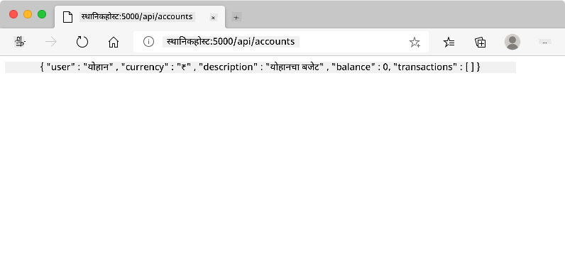
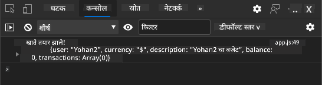
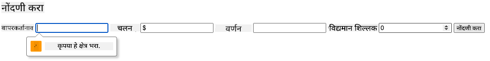
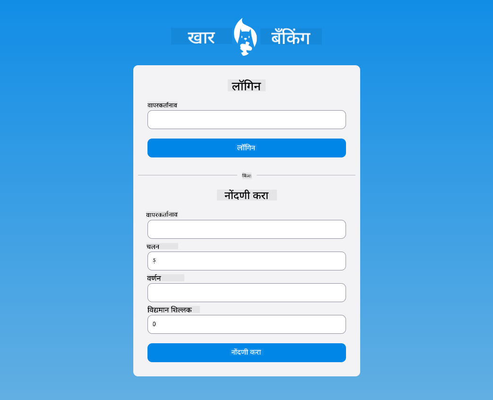

<!--
CO_OP_TRANSLATOR_METADATA:
{
  "original_hash": "b667b7d601e2ee19acb5aa9d102dc9f3",
  "translation_date": "2025-08-26T00:10:12+00:00",
  "source_file": "7-bank-project/2-forms/README.md",
  "language_code": "mr"
}
-->
# बँकिंग अॅप तयार करा भाग 2: लॉगिन आणि नोंदणी फॉर्म तयार करा

## व्याख्यानपूर्व क्विझ

[व्याख्यानपूर्व क्विझ](https://ff-quizzes.netlify.app/web/quiz/43)

### परिचय

जवळजवळ सर्व आधुनिक वेब अॅप्समध्ये, तुम्ही खाते तयार करून तुमची स्वतःची खासगी जागा मिळवू शकता. अनेक वापरकर्ते एकाच वेळी वेब अॅपमध्ये प्रवेश करू शकतात, त्यामुळे प्रत्येक वापरकर्त्याचा वैयक्तिक डेटा स्वतंत्रपणे साठवण्यासाठी आणि कोणती माहिती दाखवायची ते निवडण्यासाठी तुम्हाला एक यंत्रणा आवश्यक आहे. [वापरकर्ता ओळख सुरक्षितपणे व्यवस्थापित कशी करावी](https://en.wikipedia.org/wiki/Authentication) हे आम्ही येथे कव्हर करणार नाही कारण हा एक स्वतंत्र विषय आहे, परंतु आम्ही खात्री करू की प्रत्येक वापरकर्ता आमच्या अॅपवर एक (किंवा अधिक) बँक खाते तयार करू शकेल.

या भागात आम्ही HTML फॉर्मचा वापर करून आमच्या वेब अॅपमध्ये लॉगिन आणि नोंदणी जोडू. आम्ही डेटा सर्व्हर API कडे प्रोग्रामॅटिक पद्धतीने कसा पाठवायचा हे पाहू आणि शेवटी वापरकर्त्याच्या इनपुटसाठी मूलभूत सत्यापन नियम कसे परिभाषित करायचे हे शिकू.

### पूर्वअट

या धड्यासाठी तुम्ही वेब अॅपचे [HTML टेम्पलेट्स आणि रूटिंग](../1-template-route/README.md) पूर्ण केलेले असणे आवश्यक आहे. तुम्हाला [Node.js](https://nodejs.org) स्थापित करणे आणि [सर्व्हर API चालवणे](../api/README.md) स्थानिक पातळीवर सेट करणे आवश्यक आहे जेणेकरून तुम्ही खाती तयार करण्यासाठी डेटा पाठवू शकता.

**महत्त्वाची नोंद**
तुमच्याकडे एकाच वेळी दोन टर्मिनल्स चालू असतील, खालीलप्रमाणे:
1. मुख्य बँक अॅपसाठी जो आपण [HTML टेम्पलेट्स आणि रूटिंग](../1-template-route/README.md) धड्यात तयार केला.
2. [बँक अॅप सर्व्हर API](../api/README.md) साठी जो आपण वर सेट केला.

पुढील धड्यासाठी दोन्ही सर्व्हर चालू असणे आवश्यक आहे. ते वेगवेगळ्या पोर्ट्सवर (पोर्ट `3000` आणि पोर्ट `5000`) ऐकत असल्याने सर्व काही व्यवस्थित चालेल.

तुम्ही खालील कमांड टर्मिनलमध्ये चालवून सर्व्हर योग्यरित्या चालू आहे का ते तपासू शकता:

```sh
curl http://localhost:5000/api
# -> should return "Bank API v1.0.0" as a result
```

---

## फॉर्म आणि नियंत्रण

`<form>` घटक HTML दस्तऐवजाचा एक विभाग समाविष्ट करतो जिथे वापरकर्ता परस्परसंवादी नियंत्रणांसह डेटा इनपुट आणि सबमिट करू शकतो. फॉर्ममध्ये वापरता येणाऱ्या सर्व प्रकारच्या वापरकर्ता इंटरफेस (UI) नियंत्रणांपैकी `<input>` आणि `<button>` हे सर्वात सामान्य आहेत.

`<input>` चे अनेक [प्रकार](https://developer.mozilla.org/docs/Web/HTML/Element/input) आहेत. उदाहरणार्थ, वापरकर्त्याचे नाव प्रविष्ट करण्यासाठी तुम्ही खालीलप्रमाणे फील्ड तयार करू शकता:

```html
<input id="username" name="username" type="text">
```

`name` अॅट्रिब्युट फॉर्म डेटा पाठवताना प्रॉपर्टीचे नाव म्हणून वापरले जाते. `id` अॅट्रिब्युट `<label>` ला फॉर्म कंट्रोलशी जोडण्यासाठी वापरले जाते.

> [`<input>` प्रकारांची](https://developer.mozilla.org/docs/Web/HTML/Element/input) आणि [इतर फॉर्म नियंत्रणांची](https://developer.mozilla.org/docs/Learn/Forms/Other_form_controls) संपूर्ण यादी पाहा जेणेकरून UI तयार करताना तुम्ही कोणते मूळ UI घटक वापरू शकता याची कल्पना येईल.

✅ लक्षात ठेवा की `<input>` हा [रिकामा घटक](https://developer.mozilla.org/docs/Glossary/Empty_element) आहे ज्यावर तुम्ही जुळणारा क्लोजिंग टॅग जोडू नये. तुम्ही स्वतः-समाप्ती `<input/>` नोटेशन वापरू शकता, परंतु ते आवश्यक नाही.

फॉर्ममधील `<button>` घटक थोडा विशेष आहे. जर तुम्ही त्याच्या `type` अॅट्रिब्युटचे निर्दिष्ट केले नाही, तर ते दाबल्यावर फॉर्म डेटा आपोआप सर्व्हरवर सबमिट होईल. खालील `type` मूल्ये आहेत:

- `submit`: फॉर्ममध्ये डीफॉल्ट, बटण फॉर्म सबमिट क्रिया ट्रिगर करते.
- `reset`: बटण सर्व फॉर्म नियंत्रणांना त्यांच्या सुरुवातीच्या मूल्यांवर रीसेट करते.
- `button`: बटण दाबल्यावर कोणतीही डीफॉल्ट क्रिया नियुक्त करत नाही. तुम्ही नंतर त्याला जावास्क्रिप्ट वापरून सानुकूल क्रिया नियुक्त करू शकता.

### कार्य

चला `login` टेम्पलेटमध्ये फॉर्म जोडण्यापासून सुरुवात करूया. आपल्याला *username* फील्ड आणि *Login* बटण आवश्यक आहे.

```html
<template id="login">
  <h1>Bank App</h1>
  <section>
    <h2>Login</h2>
    <form id="loginForm">
      <label for="username">Username</label>
      <input id="username" name="user" type="text">
      <button>Login</button>
    </form>
  </section>
</template>
```

जर तुम्ही बारकाईने पाहिले, तर तुम्हाला दिसेल की आम्ही येथे `<label>` घटक देखील जोडला आहे. `<label>` घटक UI नियंत्रणांना नाव देण्यासाठी वापरले जातात, जसे की आपले username फील्ड. लेबले तुमच्या फॉर्म्सच्या वाचनीयतेसाठी महत्त्वाच्या आहेत, तसेच त्यांचे अतिरिक्त फायदे देखील आहेत:

- लेबल फॉर्म नियंत्रणाशी जोडल्याने, सहाय्यक तंत्रज्ञान (जसे की स्क्रीन रीडर) वापरणाऱ्या वापरकर्त्यांना त्यांना कोणता डेटा प्रदान करायचा आहे हे समजण्यास मदत होते.
- तुम्ही लेबलवर क्लिक करून संबंधित इनपुटवर थेट फोकस ठेवू शकता, ज्यामुळे टच-स्क्रीन डिव्हाइसवर पोहोचणे सोपे होते.

> [वेबवरील प्रवेशयोग्यता](https://developer.mozilla.org/docs/Learn/Accessibility/What_is_accessibility) हा एक महत्त्वाचा विषय आहे जो अनेकदा दुर्लक्षित केला जातो. [सामान्य HTML घटकांमुळे](https://developer.mozilla.org/docs/Learn/Accessibility/HTML) योग्यरित्या वापरल्यास प्रवेशयोग्य सामग्री तयार करणे कठीण नाही. [प्रवेशयोग्यतेबद्दल अधिक वाचा](https://developer.mozilla.org/docs/Web/Accessibility) जेणेकरून सामान्य चुका टाळता येतील आणि जबाबदार विकसक बनता येईल.

आता आपण नोंदणीसाठी दुसरा फॉर्म जोडू, आधीच्या फॉर्मच्या खाली:

```html
<hr/>
<h2>Register</h2>
<form id="registerForm">
  <label for="user">Username</label>
  <input id="user" name="user" type="text">
  <label for="currency">Currency</label>
  <input id="currency" name="currency" type="text" value="$">
  <label for="description">Description</label>
  <input id="description" name="description" type="text">
  <label for="balance">Current balance</label>
  <input id="balance" name="balance" type="number" value="0">
  <button>Register</button>
</form>
```

`value` अॅट्रिब्युट वापरून आपण दिलेल्या इनपुटसाठी डीफॉल्ट मूल्य परिभाषित करू शकतो. लक्षात घ्या की `balance` साठी इनपुटचा प्रकार `number` आहे. हे इतर इनपुट्सपेक्षा वेगळे दिसते का? त्यावर परस्परसंवाद करून पाहा.

✅ तुम्ही फक्त कीबोर्ड वापरून फॉर्म्स नेव्हिगेट आणि वापरू शकता का? तुम्ही ते कसे कराल?

## सर्व्हरकडे डेटा सबमिट करणे

आता आपल्याकडे कार्यशील UI आहे, पुढील पाऊल म्हणजे डेटा सर्व्हरकडे पाठवणे. आपल्या सध्याच्या कोडचा वापर करून एक जलद चाचणी करूया: जर तुम्ही *Login* किंवा *Register* बटणावर क्लिक केले तर काय होते?

तुमच्या ब्राउझरच्या URL विभागात बदल लक्षात आला का?


`<form>` साठी डीफॉल्ट क्रिया म्हणजे [GET पद्धतीचा](https://www.w3.org/Protocols/rfc2616/rfc2616-sec9.html#sec9.3) वापर करून फॉर्म डेटा सध्याच्या सर्व्हर URL वर सबमिट करणे, फॉर्म डेटा थेट URL मध्ये जोडणे. परंतु या पद्धतीला काही मर्यादा आहेत:

- पाठवलेला डेटा खूप मर्यादित आकाराचा असतो (सुमारे 2000 अक्षरे)
- डेटा थेट URL मध्ये दिसतो (पासवर्डसाठी चांगले नाही)
- फाइल अपलोडसह कार्य करत नाही

म्हणूनच तुम्ही [POST पद्धतीचा](https://www.w3.org/Protocols/rfc2616/rfc2616-sec9.html#sec9.5) वापर करू शकता, जो फॉर्म डेटा HTTP विनंतीच्या बॉडीमध्ये सर्व्हरकडे पाठवतो, वरील मर्यादा न ठेवता.

> जरी POST ही डेटा पाठवण्यासाठी सर्वात सामान्यतः वापरली जाणारी पद्धत असली तरी, [काही विशिष्ट परिस्थितींमध्ये](https://www.w3.org/2001/tag/doc/whenToUseGet.html) GET पद्धत वापरणे योग्य असते, जसे की शोध फील्ड अंमलात आणताना.

### कार्य

नोंदणी फॉर्ममध्ये `action` आणि `method` प्रॉपर्टीज जोडा:

```html
<form id="registerForm" action="//localhost:5000/api/accounts" method="POST">
```

आता तुमचे नाव वापरून नवीन खाते नोंदणी करण्याचा प्रयत्न करा. *Register* बटणावर क्लिक केल्यानंतर तुम्हाला असे काहीतरी दिसेल:



जर सर्व काही व्यवस्थित झाले, तर सर्व्हर तुमच्या विनंतीला तयार केलेल्या खात्याचा डेटा असलेल्या [JSON](https://www.json.org/json-en.html) प्रतिसादासह उत्तर देईल.

✅ त्याच नावाने पुन्हा नोंदणी करण्याचा प्रयत्न करा. काय होते?

## पृष्ठ रीलोड न करता डेटा सबमिट करणे

तुम्हाला कदाचित लक्षात आले असेल की आपण वापरलेल्या पद्धतीत एक छोटी समस्या आहे: फॉर्म सबमिट करताना, आपण अॅपमधून बाहेर पडतो आणि ब्राउझर सर्व्हर URL वर पुनर्निर्देशित करतो. आपण पृष्ठ रीलोड टाळण्याचा प्रयत्न करत आहोत कारण आपण [सिंगल-पेज अॅप्लिकेशन (SPA)](https://en.wikipedia.org/wiki/Single-page_application) तयार करत आहोत.

पृष्ठ रीलोड न करता फॉर्म डेटा सर्व्हरकडे पाठवण्यासाठी, आपल्याला जावास्क्रिप्ट कोड वापरावा लागेल. `<form>` घटकाच्या `action` प्रॉपर्टीमध्ये URL ठेवण्याऐवजी, तुम्ही `javascript:` स्ट्रिंगने सुरू होणारा कोणताही जावास्क्रिप्ट कोड वापरू शकता. याचा अर्थ असा की तुम्हाला ब्राउझरने आपोआप केलेल्या काही कार्यांची अंमलबजावणी करावी लागेल:

- फॉर्म डेटा मिळवा
- फॉर्म डेटा योग्य स्वरूपात रूपांतरित आणि एन्कोड करा
- HTTP विनंती तयार करा आणि ती सर्व्हरकडे पाठवा

### कार्य

नोंदणी फॉर्मच्या `action` ला खालीलप्रमाणे बदला:

```html
<form id="registerForm" action="javascript:register()">
```

`app.js` उघडा आणि `register` नावाची नवीन फंक्शन तयार करा:

```js
function register() {
  const registerForm = document.getElementById('registerForm');
  const formData = new FormData(registerForm);
  const data = Object.fromEntries(formData);
  const jsonData = JSON.stringify(data);
}
```

येथे आपण `getElementById()` वापरून फॉर्म घटक मिळवतो आणि [`FormData`](https://developer.mozilla.org/docs/Web/API/FormData) हेल्परचा वापर करून फॉर्म नियंत्रणांमधून की/व्हॅल्यू जोड्यांचा संच म्हणून मूल्ये काढतो. त्यानंतर आम्ही डेटा नियमित ऑब्जेक्टमध्ये रूपांतरित करतो [`Object.fromEntries()`](https://developer.mozilla.org/docs/Web/JavaScript/Reference/Global_Objects/Object/fromEntries) वापरून आणि शेवटी डेटा [JSON](https://www.json.org/json-en.html) मध्ये सिरीयलाइझ करतो, जो वेबवर डेटा एक्सचेंज करण्यासाठी सामान्यतः वापरला जातो.

डेटा आता सर्व्हरकडे पाठवण्यासाठी तयार आहे. `createAccount` नावाची नवीन फंक्शन तयार करा:

```js
async function createAccount(account) {
  try {
    const response = await fetch('//localhost:5000/api/accounts', {
      method: 'POST',
      headers: { 'Content-Type': 'application/json' },
      body: account
    });
    return await response.json();
  } catch (error) {
    return { error: error.message || 'Unknown error' };
  }
}
```

ही फंक्शन काय करते? प्रथम, येथे `async` कीवर्ड लक्षात घ्या. याचा अर्थ असा की फंक्शनमध्ये [**असिंक्रोनस**](https://developer.mozilla.org/docs/Web/JavaScript/Reference/Statements/async_function) कोड असेल. `await` कीवर्डसह वापरल्यास, ते असिंक्रोनस कोड चालवण्यासाठी थांबण्याची परवानगी देते - जसे की येथे सर्व्हर प्रतिसादाची वाट पाहणे - पुढे जाण्यापूर्वी.

`async/await` वापराबद्दल एक जलद व्हिडिओ येथे आहे:

[](https://youtube.com/watch?v=YwmlRkrxvkk "Async आणि Await प्रॉमिसेस व्यवस्थापित करण्यासाठी")

> 🎥 `async/await` बद्दल व्हिडिओसाठी वरील प्रतिमेवर क्लिक करा.

आम्ही JSON डेटा सर्व्हरकडे पाठवण्यासाठी `fetch()` API वापरतो. ही पद्धत 2 पॅरामीटर्स घेते:

- सर्व्हरचा URL, म्हणून आम्ही येथे `//localhost:5000/api/accounts` परत ठेवतो.
- विनंतीची सेटिंग्ज. येथे आम्ही पद्धत `POST` वर सेट करतो आणि विनंतीसाठी `body` प्रदान करतो. आम्ही सर्व्हरकडे JSON डेटा पाठवत असल्याने, आम्हाला `Content-Type` हेडर `application/json` वर सेट करणे आवश्यक आहे जेणेकरून सर्व्हरला सामग्री कशी समजून घ्यायची हे कळेल.

सर्व्हर विनंतीला JSON सह प्रतिसाद देईल, म्हणून आम्ही `await response.json()` वापरून JSON सामग्री पार्स करू शकतो आणि परिणामी ऑब्जेक्ट परत करू शकतो. लक्षात घ्या की ही पद्धत असिंक्रोनस आहे, म्हणून आम्ही येथे `await` कीवर्ड वापरतो जेणेकरून पार्सिंग दरम्यान कोणतीही त्रुटी देखील पकडली जाईल.

आता `register` फंक्शनमध्ये `createAccount()` कॉल करण्यासाठी काही कोड जोडा:

```js
const result = await createAccount(jsonData);
```

आम्ही येथे `await` कीवर्ड वापरतो, म्हणून आम्हाला `register` फंक्शनच्या आधी `async` कीवर्ड जोडणे आवश्यक आहे:

```js
async function register() {
```

शेवटी, निकाल तपासण्यासाठी काही लॉग्स जोडा. अंतिम फंक्शन असे दिसेल:

```js
async function register() {
  const registerForm = document.getElementById('registerForm');
  const formData = new FormData(registerForm);
  const jsonData = JSON.stringify(Object.fromEntries(formData));
  const result = await createAccount(jsonData);

  if (result.error) {
    return console.log('An error occurred:', result.error);
  }

  console.log('Account created!', result);
}
```

हे थोडे लांबले, पण आपण तिथे पोहोचलो! जर तुम्ही तुमचे [ब्राउझर डेव्हलपर टूल्स](https://developer.mozilla.org/docs/Learn/Common_questions/What_are_browser_developer_tools) उघडले आणि नवीन खाते नोंदणी करण्याचा प्रयत्न केला, तर तुम्हाला वेब पृष्ठावर कोणताही बदल दिसणार नाही, परंतु कन्सोलमध्ये एक संदेश दिसेल जो पुष्टी करतो की सर्व काही कार्यरत आहे.



✅ तुम्हाला वाटते का की डेटा सर्व्हरकडे सुरक्षितपणे पाठवला जातो? जर कोणी विनंती अडवली तर काय होईल? [HTTPS](https://en.wikipedia.org/wiki/HTTPS) बद्दल वाचा जेणेकरून सुरक्षित डेटा संप्रेषणाबद्दल अधिक जाणून घेता येईल.

## डेटा सत्यापन

जर तुम्ही username सेट न करता नवीन खाते नोंदणी करण्याचा प्रयत्न केला, तर तुम्हाला दिसेल की सर्व्हर [400 (Bad Request)](https://developer.mozilla.org/docs/Web/HTTP/Status/400#:~:text=The%20HyperText%20Transfer%20Protocol%20(HTTP,%2C%20or%20deceptive%20request%20routing).) त्रुटी परत करतो.

सर्व्हरकडे डेटा पाठवण्यापूर्वी, शक्य असल्यास फॉर्म डेटा [सत्यापित करणे](https://developer.mozilla.org/docs/Learn/Forms/Form_validation) चांगली पद्धत आहे, जेणेकरून तुम्ही वैध विनंती पाठवू शकता. HTML5 फॉर्म नियंत्रण विविध अॅट्रिब्युट्स वापरून अंगभूत सत्यापन प्रदान करतात:

- `required`: फील्ड भरले पाहिजे, अन्यथा फॉर्म सबमिट केला जाऊ शकत नाही.
- `minlength` आणि `maxlength`: मजकूर फील्डमधील किमान आणि कमाल वर्णांची संख्या परिभाषित करते.
- `min` आणि `max`: संख्यात्मक फील्डचे किमान आणि कमाल मूल्य परिभाषित करते.
- `type`: अपेक्षित डेटाचा प्रकार परिभाषित करतो, जसे की `number`, `email`, `file` किंवा [इतर अंगभूत प्रकार](https://developer.mozilla.org/docs/Web/HTML/Element/input). हा अॅट्रिब्युट फॉर्म नियंत्रणाच्या दृश्य रेंडरिंगमध्ये बदल करू शकतो.
- `pattern`: प्रविष्ट केलेला डेटा वैध आहे की नाही हे तपासण्यासाठी [नियमित अभिव्यक्ती](https://developer.mozilla.org/docs/Web/JavaScript/Guide/Regular_Expressions) नमुना परिभाषित करण्याची परवानगी देते.
टीप: तुम्ही तुमच्या फॉर्म कंट्रोल्सचा लूक वैध आहे किंवा नाही यावर आधारित सानुकूलित करू शकता, `:valid` आणि `:invalid` CSS प्स्यूडो-क्लासेस वापरून.
### कार्य

नवीन खाते तयार करण्यासाठी दोन आवश्यक फील्ड्स आहेत: वापरकर्तानाव आणि चलन. इतर फील्ड्स ऐच्छिक आहेत. फॉर्मच्या HTML मध्ये सुधारणा करा, `required` अॅट्रिब्युट आणि फील्डच्या लेबलमधील मजकूर वापरून:

```html
<label for="user">Username (required)</label>
<input id="user" name="user" type="text" required>
...
<label for="currency">Currency (required)</label>
<input id="currency" name="currency" type="text" value="$" required>
```

जरी या विशिष्ट सर्व्हर अंमलबजावणीमध्ये फील्ड्सच्या कमाल लांबीवर विशिष्ट मर्यादा लादलेल्या नसल्या तरी, कोणत्याही वापरकर्त्याच्या मजकूर प्रविष्टीसाठी वाजवी मर्यादा निश्चित करणे नेहमीच चांगली पद्धत आहे.

टेक्स्ट फील्ड्समध्ये `maxlength` अॅट्रिब्युट जोडा:

```html
<input id="user" name="user" type="text" maxlength="20" required>
...
<input id="currency" name="currency" type="text" value="$" maxlength="5" required>
...
<input id="description" name="description" type="text" maxlength="100">
```

आता जर तुम्ही *Register* बटण दाबले आणि एखादे फील्ड आम्ही परिभाषित केलेल्या वैधता नियमांचे पालन करत नसेल, तर तुम्हाला असे काहीतरी दिसेल:



डेटा सर्व्हरवर पाठवण्यापूर्वी केलेली अशी वैधता तपासणी **क्लायंट-साइड** वैधता तपासणी म्हणून ओळखली जाते. पण लक्षात ठेवा की सर्व तपासण्या डेटा पाठवल्याशिवाय करणे नेहमीच शक्य नसते. उदाहरणार्थ, येथे आम्ही तपासू शकत नाही की समान वापरकर्तानाव असलेले खाते आधीच अस्तित्वात आहे का, जोपर्यंत आम्ही सर्व्हरला विनंती पाठवत नाही. सर्व्हरवर केलेली अतिरिक्त वैधता तपासणी **सर्व्हर-साइड** वैधता तपासणी म्हणून ओळखली जाते.

सामान्यतः दोन्ही अंमलात आणणे आवश्यक असते. क्लायंट-साइड वैधता तपासणी वापरल्याने वापरकर्त्याला त्वरित अभिप्राय मिळतो, ज्यामुळे वापरकर्ता अनुभव सुधारतो, तर सर्व्हर-साइड वैधता तपासणी महत्त्वाची असते कारण ती सुनिश्चित करते की तुम्ही हाताळत असलेला वापरकर्ता डेटा योग्य आणि सुरक्षित आहे.

---

## 🚀 आव्हान

जर वापरकर्ता आधीच अस्तित्वात असेल, तर HTML मध्ये एक त्रुटी संदेश दाखवा.

थोड्या स्टायलिंगनंतर अंतिम लॉगिन पृष्ठ कसे दिसू शकते याचे एक उदाहरण येथे आहे:



## व्याख्यानानंतरचा क्विझ

[व्याख्यानानंतरचा क्विझ](https://ff-quizzes.netlify.app/web/quiz/44)

## पुनरावलोकन आणि स्व-अभ्यास

फॉर्म तयार करण्याच्या प्रयत्नांमध्ये विकसक खूप सर्जनशील झाले आहेत, विशेषतः वैधता रणनीतींबाबत. [CodePen](https://codepen.com) वरून वेगवेगळ्या फॉर्म फ्लोबद्दल जाणून घ्या; तुम्हाला काही मनोरंजक आणि प्रेरणादायक फॉर्म सापडतात का?

## असाइनमेंट

[तुमच्या बँक अॅपला स्टाइल करा](assignment.md)

**अस्वीकरण**:  
हा दस्तऐवज AI भाषांतर सेवा [Co-op Translator](https://github.com/Azure/co-op-translator) वापरून भाषांतरित करण्यात आला आहे. आम्ही अचूकतेसाठी प्रयत्नशील असलो तरी कृपया लक्षात ठेवा की स्वयंचलित भाषांतरे त्रुटी किंवा अचूकतेच्या अभावाने ग्रस्त असू शकतात. मूळ भाषेतील दस्तऐवज हा अधिकृत स्रोत मानला जावा. महत्त्वाच्या माहितीसाठी व्यावसायिक मानवी भाषांतराची शिफारस केली जाते. या भाषांतराचा वापर करून उद्भवलेल्या कोणत्याही गैरसमज किंवा चुकीच्या अर्थासाठी आम्ही जबाबदार नाही.