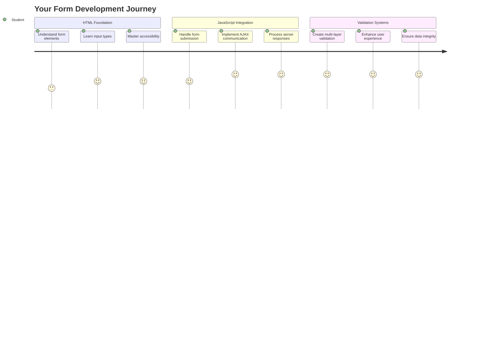
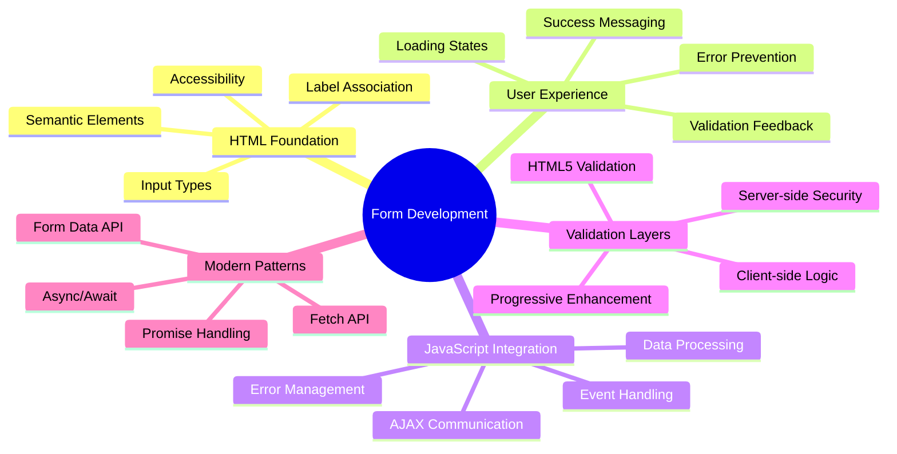
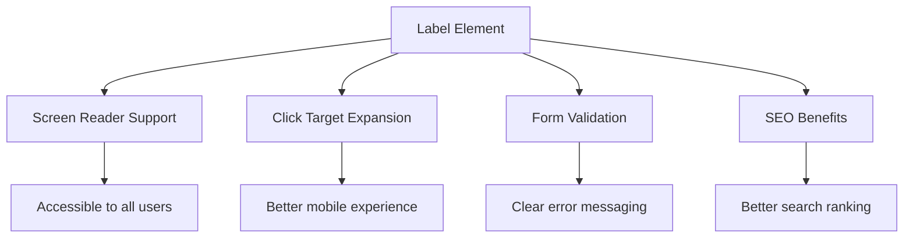
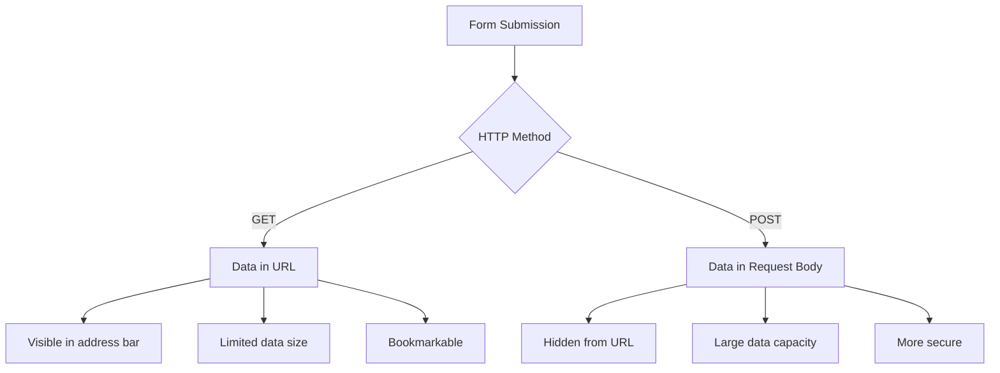
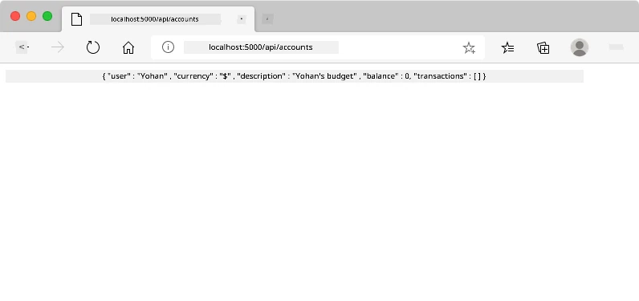
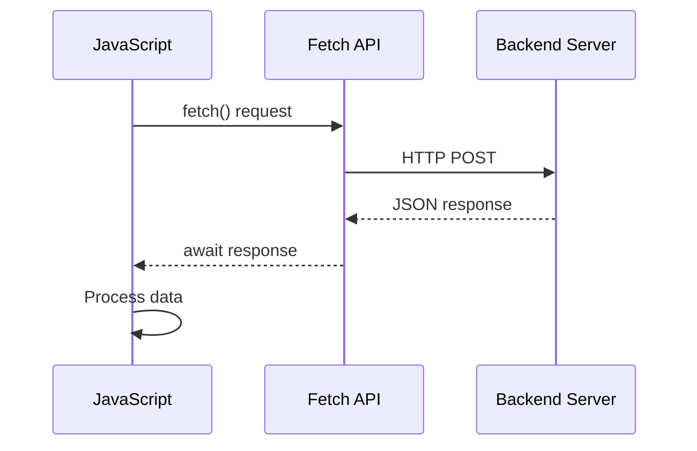
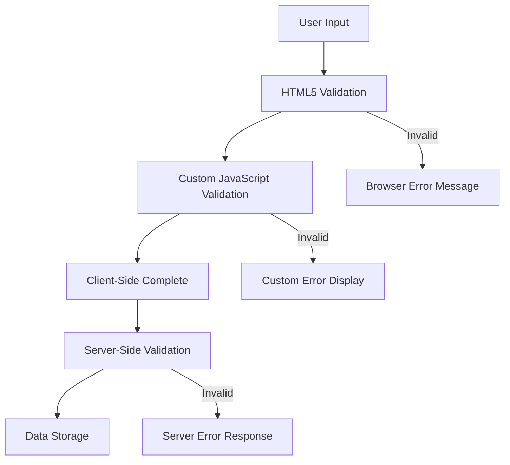
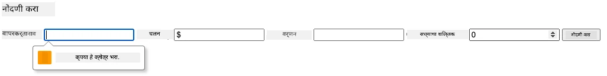
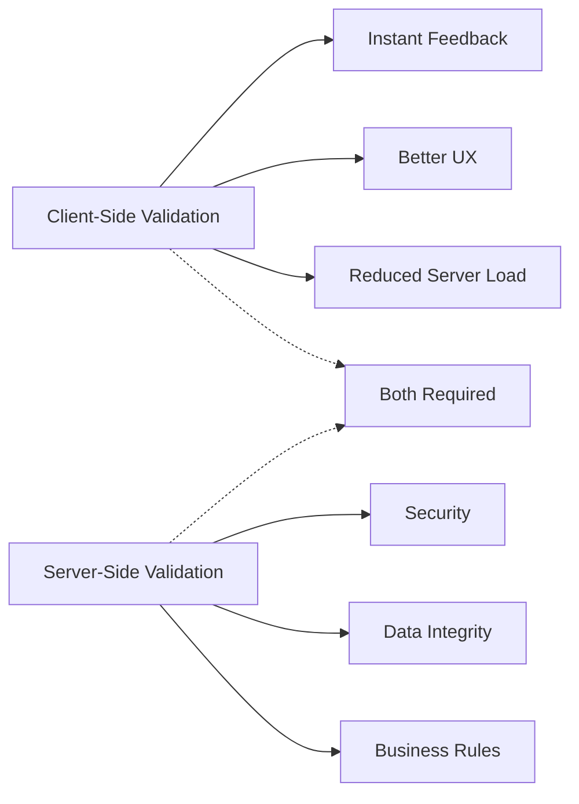
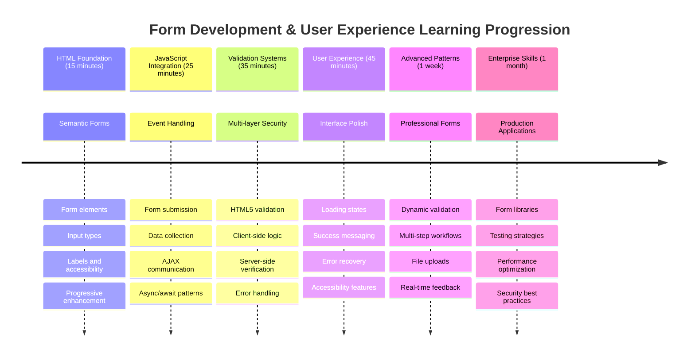

<!--
CO_OP_TRANSLATOR_METADATA:
{
  "original_hash": "7cbdbd132d39a2bb493e85bc2a9387cc",
  "translation_date": "2025-11-03T14:50:29+00:00",
  "source_file": "7-bank-project/2-forms/README.md",
  "language_code": "mr"
}
-->
# बँकिंग अ‍ॅप तयार करा भाग 2: लॉगिन आणि नोंदणी फॉर्म तयार करा



## पूर्व-व्याख्यान प्रश्नमंजुषा

[पूर्व-व्याख्यान प्रश्नमंजुषा](https://ff-quizzes.netlify.app/web/quiz/43)

कधी ऑनलाइन फॉर्म भरताना तुमचा ईमेल फॉर्मेट चुकीचा असल्यामुळे नाकारला गेला आहे का? किंवा सबमिट क्लिक केल्यावर तुमची सर्व माहिती गमावली आहे का? आपण सर्वांनी या त्रासदायक अनुभवांना सामोरे गेले आहे.

फॉर्म हे तुमच्या वापरकर्त्यांना आणि तुमच्या अ‍ॅप्लिकेशनच्या कार्यक्षमतेला जोडणारे पूल आहेत. जसे विमानतळ नियंत्रक विमानांना सुरक्षितपणे त्यांच्या गंतव्यस्थानी पोहोचवण्यासाठी काळजीपूर्वक प्रोटोकॉल वापरतात, तसेच चांगल्या प्रकारे डिझाइन केलेले फॉर्म स्पष्ट अभिप्राय देतात आणि महागड्या चुका टाळतात. दुसरीकडे, खराब फॉर्म वापरकर्त्यांना व्यस्त विमानतळातील गैरसमजापेक्षा वेगाने दूर करू शकतात.

या धड्यात, आपण तुमच्या स्थिर बँकिंग अ‍ॅपला एक परस्परसंवादी अ‍ॅप्लिकेशनमध्ये रूपांतरित करू. तुम्ही वापरकर्त्याच्या इनपुटची पडताळणी करणारे, सर्व्हरशी संवाद साधणारे आणि उपयुक्त अभिप्राय देणारे फॉर्म तयार करणे शिकाल. याला तुमच्या अ‍ॅप्लिकेशनच्या वैशिष्ट्यांमध्ये नेव्हिगेट करण्यासाठी वापरकर्त्यांना नियंत्रण इंटरफेस तयार करणे असे समजा.

शेवटी, तुमच्याकडे पडताळणीसह संपूर्ण लॉगिन आणि नोंदणी प्रणाली असेल जी वापरकर्त्यांना निराशा न करता यशाकडे मार्गदर्शन करेल.



## पूर्वतयारी

फॉर्म तयार करण्यास सुरुवात करण्यापूर्वी, तुमच्याकडे सर्व काही योग्य प्रकारे सेट आहे याची खात्री करूया. हा धडा आपण मागील धड्याच्या शेवटी जिथे थांबलो होतो तिथून सुरू होतो, त्यामुळे जर तुम्ही पुढे उडी मारली असेल, तर तुम्हाला परत जाऊन मूलभूत गोष्टी प्रथम कार्यरत कराव्या लागतील.

### आवश्यक सेटअप

| घटक | स्थिती | वर्णन |
|-----------|--------|-------------|
| [HTML टेम्पलेट्स](../1-template-route/README.md) | ✅ आवश्यक | तुमच्या बँकिंग अ‍ॅपची मूलभूत रचना |
| [Node.js](https://nodejs.org) | ✅ आवश्यक | सर्व्हरसाठी जावास्क्रिप्ट रनटाइम |
| [बँक API सर्व्हर](../api/README.md) | ✅ आवश्यक | डेटा स्टोरेजसाठी बॅकएंड सेवा |

> 💡 **विकसनशील टिप**: तुम्ही दोन स्वतंत्र सर्व्हर एकाच वेळी चालवणार आहात – एक तुमच्या फ्रंट-एंड बँकिंग अ‍ॅपसाठी आणि दुसरा बॅकएंड API साठी. ही सेटअप वास्तविक-जगातील विकासाचे प्रतिबिंब आहे जिथे फ्रंटएंड आणि बॅकएंड सेवा स्वतंत्रपणे कार्य करतात.

### सर्व्हर कॉन्फिगरेशन

**तुमच्या विकासाच्या वातावरणात समाविष्ट असेल:**
- **फ्रंटएंड सर्व्हर**: तुमचे बँकिंग अ‍ॅप सर्व्ह करतो (सामान्यतः पोर्ट `3000`)
- **बॅकएंड API सर्व्हर**: डेटा स्टोरेज आणि पुनर्प्राप्ती हाताळतो (पोर्ट `5000`)
- **दोन्ही सर्व्हर** कोणत्याही संघर्षाशिवाय एकाच वेळी चालवू शकतात

**तुमच्या API कनेक्शनची चाचणी करणे:**
```bash
curl http://localhost:5000/api
# Expected response: "Bank API v1.0.0"
```

**जर तुम्हाला API आवृत्ती प्रतिसाद दिसला, तर तुम्ही पुढे जाण्यास तयार आहात!**

---

## HTML फॉर्म आणि नियंत्रण समजून घेणे

HTML फॉर्म हे तुमच्या वेब अ‍ॅप्लिकेशनशी संवाद साधण्याचा वापरकर्त्यांचा मार्ग आहे. त्यांना 19व्या शतकातील दूरस्थ ठिकाणांना जोडणाऱ्या टेलिग्राफ सिस्टमसारखे समजा – ते वापरकर्त्याच्या हेतू आणि अ‍ॅप्लिकेशन प्रतिसाद यांच्यातील संवाद प्रोटोकॉल आहेत. विचारपूर्वक डिझाइन केलेले असल्यास, ते चुका पकडतात, इनपुट फॉर्मेटिंग मार्गदर्शन करतात आणि उपयुक्त सूचना देतात.

आधुनिक फॉर्म मूलभूत मजकूर इनपुटपेक्षा लक्षणीय अधिक प्रगत आहेत. HTML5 ने विशेष इनपुट प्रकार सादर केले जे ईमेल पडताळणी, क्रमांक फॉर्मेटिंग आणि तारीख निवड आपोआप हाताळतात. या सुधारणा प्रवेशयोग्यता आणि मोबाइल वापरकर्ता अनुभव दोन्हींसाठी फायदेशीर आहेत.

### आवश्यक फॉर्म घटक

**प्रत्येक फॉर्मला आवश्यक असलेले बांधकाम ब्लॉक्स:**

```html
<!-- Basic form structure -->
<form id="userForm" method="POST">
  <label for="username">Username</label>
  <input id="username" name="username" type="text" required>
  
  <button type="submit">Submit</button>
</form>
```

**या कोडमध्ये काय होते:**
- **तयार करते** एक फॉर्म कंटेनर ज्याला एक अद्वितीय आयडेंटिफायर आहे
- **निर्धारित करते** डेटा सबमिशनसाठी HTTP पद्धत
- **जोडते** लेबल्स इनपुट्सशी प्रवेशयोग्यतेसाठी
- **परिभाषित करते** फॉर्म प्रक्रिया करण्यासाठी सबमिट बटण

### आधुनिक इनपुट प्रकार आणि गुणधर्म

| इनपुट प्रकार | उद्देश | उदाहरण वापर |
|------------|---------|---------------|
| `text` | सामान्य मजकूर इनपुट | `<input type="text" name="username">` |
| `email` | ईमेल पडताळणी | `<input type="email" name="email">` |
| `password` | लपवलेला मजकूर प्रवेश | `<input type="password" name="password">` |
| `number` | संख्यात्मक इनपुट | `<input type="number" name="balance" min="0">` |
| `tel` | फोन नंबर | `<input type="tel" name="phone">` |

> 💡 **आधुनिक HTML5 फायदा**: विशिष्ट इनपुट प्रकार वापरणे स्वयंचलित पडताळणी, योग्य मोबाइल कीबोर्ड आणि अतिरिक्त जावास्क्रिप्टशिवाय चांगले प्रवेशयोग्यता समर्थन प्रदान करते!

### बटण प्रकार आणि वर्तन

```html
<!-- Different button behaviors -->
<button type="submit">Save Data</button>     <!-- Submits the form -->
<button type="reset">Clear Form</button>    <!-- Resets all fields -->
<button type="button">Custom Action</button> <!-- No default behavior -->
```

**प्रत्येक बटण प्रकार काय करतो:**
- **सबमिट बटणे**: फॉर्म सबमिशन ट्रिगर करतात आणि डेटा निर्दिष्ट एंडपॉइंटवर पाठवतात
- **रीसेट बटणे**: सर्व फॉर्म फील्ड्स त्यांच्या सुरुवातीच्या स्थितीत पुनर्संचयित करतात
- **सामान्य बटणे**: कोणतेही डीफॉल्ट वर्तन प्रदान करत नाहीत, कार्यक्षमतेसाठी सानुकूल जावास्क्रिप्ट आवश्यक आहे

> ⚠️ **महत्त्वाची टीप**: `<input>` घटक स्वतः बंद होतो आणि बंद करणारा टॅग आवश्यक नाही. आधुनिक सर्वोत्तम पद्धत म्हणजे `<input>` स्लॅशशिवाय लिहिणे.

### तुमचा लॉगिन फॉर्म तयार करणे

आता आधुनिक HTML फॉर्म पद्धतींचे प्रदर्शन करणारा व्यावहारिक लॉगिन फॉर्म तयार करूया. आपण मूलभूत रचनेपासून सुरुवात करू आणि प्रवेशयोग्यता वैशिष्ट्ये आणि पडताळणीसह हळूहळू सुधारणा करू.

```html
<template id="login">
  <h1>Bank App</h1>
  <section>
    <h2>Login</h2>
    <form id="loginForm" novalidate>
      <div class="form-group">
        <label for="username">Username</label>
        <input id="username" name="user" type="text" required 
               autocomplete="username" placeholder="Enter your username">
      </div>
      <button type="submit">Login</button>
    </form>
  </section>
</template>
```

**येथे काय होते याचे विश्लेषण:**
- **रचना तयार करते** फॉर्मसाठी अर्थपूर्ण HTML5 घटकांसह
- **गटबद्ध करते** संबंधित घटक `div` कंटेनर्ससह अर्थपूर्ण वर्गांसह
- **जोडते** लेबल्स इनपुट्सशी `for` आणि `id` गुणधर्म वापरून
- **समाविष्ट करते** आधुनिक गुणधर्म जसे की `autocomplete` आणि `placeholder` चांगल्या UX साठी
- **जोडते** `novalidate` ब्राउझर डीफॉल्ट्सऐवजी जावास्क्रिप्टसह पडताळणी हाताळण्यासाठी

### योग्य लेबल्सचे महत्त्व

**आधुनिक वेब विकासासाठी लेबल्स का महत्त्वाचे आहेत:**



**योग्य लेबल्स काय साध्य करतात:**
- **सक्षम करतात** स्क्रीन रीडर्स फॉर्म फील्ड्स स्पष्टपणे जाहीर करतात
- **वाढवतात** क्लिक करण्यायोग्य क्षेत्र (लेबलवर क्लिक केल्यावर इनपुटवर लक्ष केंद्रित होते)
- **सुधारतात** मोबाइल वापरयोग्यता मोठ्या टच टार्गेट्ससह
- **समर्थन करतात** फॉर्म पडताळणी अर्थपूर्ण त्रुटी संदेशांसह
- **सुधारतात** SEO फॉर्म घटकांना अर्थपूर्ण अर्थ प्रदान करून

> 🎯 **प्रवेशयोग्यता उद्देश**: प्रत्येक फॉर्म इनपुटसाठी संबंधित लेबल असावे. ही साधी पद्धत तुमचे फॉर्म सर्वांसाठी, अपंग वापरकर्त्यांसह, वापरण्यायोग्य बनवते आणि सर्व वापरकर्त्यांसाठी अनुभव सुधारते.

### नोंदणी फॉर्म तयार करणे

नोंदणी फॉर्मला संपूर्ण वापरकर्ता खाते तयार करण्यासाठी अधिक तपशीलवार माहिती आवश्यक आहे. आधुनिक HTML5 वैशिष्ट्यांसह आणि सुधारित प्रवेशयोग्यतेसह ते तयार करूया.

```html
<hr/>
<h2>Register</h2>
<form id="registerForm" novalidate>
  <div class="form-group">
    <label for="user">Username</label>
    <input id="user" name="user" type="text" required 
           autocomplete="username" placeholder="Choose a username">
  </div>
  
  <div class="form-group">
    <label for="currency">Currency</label>
    <input id="currency" name="currency" type="text" value="$" 
           required maxlength="3" placeholder="USD, EUR, etc.">
  </div>
  
  <div class="form-group">
    <label for="description">Account Description</label>
    <input id="description" name="description" type="text" 
           maxlength="100" placeholder="Personal savings, checking, etc.">
  </div>
  
  <div class="form-group">
    <label for="balance">Starting Balance</label>
    <input id="balance" name="balance" type="number" value="0" 
           min="0" step="0.01" placeholder="0.00">
  </div>
  
  <button type="submit">Create Account</button>
</form>
```

**वरीलमध्ये, आम्ही:**
- **संगठित केले** प्रत्येक फील्ड कंटेनर divs मध्ये चांगल्या स्टाइलिंग आणि लेआउटसाठी
- **जोडले** योग्य `autocomplete` गुणधर्म ब्राउझर ऑटोफिल समर्थनासाठी
- **समाविष्ट केले** उपयुक्त प्लेसहोल्डर मजकूर वापरकर्त्याच्या इनपुटला मार्गदर्शन करण्यासाठी
- **सेट केले** `value` गुणधर्म वापरून संवेदनशील डीफॉल्ट्स
- **लागू केले** पडताळणी गुणधर्म जसे की `required`, `maxlength`, आणि `min`
- **वापरले** `type="number"` बॅलन्स फील्डसाठी दशांश समर्थनासह

### इनपुट प्रकार आणि वर्तन शोधणे

**आधुनिक इनपुट प्रकार सुधारित कार्यक्षमता प्रदान करतात:**

| वैशिष्ट्य | फायदा | उदाहरण |
|---------|---------|----------|
| `type="number"` | मोबाइलवर संख्यात्मक कीपॅड | बॅलन्स एंट्री सोपी |
| `step="0.01"` | दशांश अचूकता नियंत्रण | चलनात सेंट्स परवानगी देते |
| `autocomplete` | ब्राउझर ऑटोफिल | फॉर्म पूर्ण करणे जलद |
| `placeholder` | संदर्भात्मक सूचना | वापरकर्त्याच्या अपेक्षांना मार्गदर्शन करते |

> 🎯 **प्रवेशयोग्यता आव्हान**: फक्त तुमच्या कीबोर्डचा वापर करून फॉर्म नेव्हिगेट करण्याचा प्रयत्न करा! `Tab` वापरून फील्ड्समध्ये जा, `Space` वापरून चेक बॉक्स तपासा, आणि `Enter` वापरून सबमिट करा. हा अनुभव तुम्हाला स्क्रीन रीडर वापरकर्ते तुमच्या फॉर्मशी कसा संवाद साधतात हे समजण्यास मदत करतो.

### 🔄 **शैक्षणिक तपासणी**
**फॉर्म फाउंडेशन समजून घेणे**: जावास्क्रिप्ट लागू करण्यापूर्वी, याची खात्री करा की तुम्हाला समजते:
- ✅ कसे अर्थपूर्ण HTML प्रवेशयोग्य फॉर्म रचना तयार करते
- ✅ मोबाइल कीबोर्ड्स आणि पडताळणीसाठी इनपुट प्रकार का महत्त्वाचे आहेत
- ✅ लेबल्स आणि फॉर्म नियंत्रण यांच्यातील संबंध
- ✅ फॉर्म गुणधर्म ब्राउझरच्या डीफॉल्ट वर्तनावर कसा परिणाम करतात

**जलद स्व-परीक्षण**: जावास्क्रिप्ट हाताळणीशिवाय फॉर्म सबमिट केल्यावर काय होते?
*उत्तर: ब्राउझर डीफॉल्ट सबमिशन करतो, सामान्यतः क्रिया URL वर पुनर्निर्देशित करतो*

**HTML5 फॉर्म फायदे**: आधुनिक फॉर्म प्रदान करतात:
- **अंतर्निहित पडताळणी**: स्वयंचलित ईमेल आणि क्रमांक फॉर्मेट तपासणी
- **मोबाइल ऑप्टिमायझेशन**: विविध इनपुट प्रकारांसाठी योग्य कीबोर्ड
- **प्रवेशयोग्यता**: स्क्रीन रीडर समर्थन आणि कीबोर्ड नेव्हिगेशन
- **प्रगत सुधारणा**: जावास्क्रिप्ट अक्षम असताना देखील कार्य करते

## फॉर्म सबमिशन पद्धती समजून घेणे

कोणी तुमचा फॉर्म भरतो आणि सबमिट क्लिक करतो तेव्हा, तो डेटा कुठेतरी जायला हवा – सामान्यतः सर्व्हरवर जो तो जतन करू शकतो. हे घडण्याचे काही वेगवेगळे मार्ग आहेत, आणि कोणता वापरायचा हे जाणून घेणे तुम्हाला नंतर काही त्रासांपासून वाचवू शकते.

चला पाहूया की कोणी सबमिट बटण क्लिक केल्यावर प्रत्यक्षात काय होते.

### डीफॉल्ट फॉर्म वर्तन

प्रथम, मूलभूत फॉर्म सबमिशनसह काय होते ते पाहूया:

**तुमचे सध्याचे फॉर्म तपासा:**
1. तुमच्या फॉर्ममधील *नोंदणी करा* बटणावर क्लिक करा
2. तुमच्या ब्राउझरच्या अ‍ॅड्रेस बारमधील बदलांचे निरीक्षण करा
3. पृष्ठ कसे रीलोड होते आणि डेटा URL मध्ये कसा दिसतो ते पहा


### HTTP पद्धतींची तुलना



**फरक समजून घेणे:**

| पद्धत | वापर प्रकरण | डेटा स्थान | सुरक्षा स्तर | आकार मर्यादा |
|--------|----------|---------------|----------------|-------------|
| `GET` | शोध क्वेरी, फिल्टर्स | URL पॅरामीटर्स | कमी (दृश्यमान) | ~2000 वर्ण |
| `POST` | वापरकर्ता खाती, संवेदनशील डेटा | विनंती बॉडी | उच्च (लपवलेले) | व्यावहारिक मर्यादा नाही |

**मूलभूत फरक समजून घेणे:**
- **GET**: फॉर्म डेटा URL मध्ये क्वेरी पॅरामीटर्स म्हणून जोडतो (शोध ऑपरेशन्ससाठी योग्य)
- **POST**: डेटा विनंती बॉडीमध्ये समाविष्ट करतो (संवेदनशील माहिती आवश्यक आहे)
- **GET मर्यादा**: आकार मर्यादा, दृश्यमान डेटा, टिकाऊ ब्राउझर इतिहास
- **POST फायदे**: मोठी डेटा क्षमता, गोपनीयता संरक्षण, फाइल अपलोड समर्थन

> 💡 **सर्वोत्तम पद्धत**: शोध फॉर्म आणि फिल्टर्ससाठी `GET` वापरा (डेटा पुनर्प्राप्ती), वापरकर्ता नोंदणी, लॉगिन आणि डेटा निर्मितीसाठी `POST` वापरा.

### फॉर्म सबमिशन कॉन्फिगर करणे

चला तुमच्या नोंदणी फॉर्मला POST पद्धत वापरून बॅकएंड API शी योग्य प्रकारे संवाद साधण्यासाठी कॉन्फिगर करूया:

```html
<form id="registerForm" action="//localhost:5000/api/accounts" 
      method="POST" novalidate>
```

**या कॉन्फिगरेशनमध्ये काय होते:**
- **दिशा देते** फॉर्म सबमिशन तुमच्या API एंडपॉइंटकडे
- **वापरते** POST पद्धत सुरक्षित डेटा ट्रान्समिशनसाठी
- **समाविष्ट करते** `novalidate` ब्राउझर डीफॉल्ट्सऐवजी जावास्क्रिप्टसह पडताळणी हाताळण्यासाठी

### फॉर्म सबमिशनची चाचणी करणे

**तुमचा फॉर्म तपासण्यासाठी या चरणांचे अनुसरण करा:**
1. **नोंदणी फॉर्म भरा** तुमच्या माहितीने
2. **क्लिक करा** "खाते तयार करा" बटण
3. **सर्व्हर प्रतिसाद** तुमच्या ब्राउझरमध्ये निरीक्षण करा



**तुम्हाला काय दिसायला हवे:**
- **ब्राउझर पुनर्निर्देशित करते** API एंडपॉइंट URL वर
- **JSON प्रतिसाद** तुमच्या नव्याने तयार केलेल्या खाते डेटासह
- **सर्व्हर पुष्टी** खाते यशस्वीरित्या तयार केले गेले आहे

> 🧪 **प्रयोग वेळ**: समान वापरकर्तानावासह पुन्हा नोंदणी करण्याचा प्रयत्न करा. तुम्हाला कोणता प्रतिसाद मिळतो? हे तुम्हाला समजण्यास मदत करते की सर्व्हर डुप्लिकेट डेटा आणि त्रुटी अटी कशा हाताळतो.

### JSON प्रतिसाद समजून घेणे

**जेव्हा सर्व्हर तुमचा फॉर्म यशस्वीरित्या प्रक्रिया करतो:**
```json
{
  "user": "john_doe",
  "currency": "$",
  "description": "Personal savings",
  "balance": 100,
  "id": "unique_account_id"
}
```

**हा प्रतिसाद पुष्टी करतो:**
- **तयार करते** तुमच्या निर्दिष्ट डेटासह नवीन खाते
- **असाइन करते** भविष्यातील संदर्भासाठी एक अद्वितीय आयडेंटिफायर
- **पर
```javascript
// Example of what FormData captures
const formData = new FormData(registerForm);

// FormData automatically captures:
// {
//   "user": "john_doe",
//   "currency": "$", 
//   "description": "Personal account",
//   "balance": "100"
// }
```

**FormData API चे फायदे:**
- **संपूर्ण संग्रह**: सर्व फॉर्म घटक जसे की मजकूर, फाइल्स आणि जटिल इनपुट्स कॅप्चर करते
- **प्रकाराची जाणीव**: विविध इनपुट प्रकार आपोआप हाताळते, सानुकूल कोडिंगची गरज नाही
- **कार्यक्षमता**: एकाच API कॉलसह मॅन्युअल फील्ड संग्रह काढून टाकते
- **अनुकूलता**: फॉर्मची रचना बदलत असताना कार्यक्षमता टिकवून ठेवते

### सर्व्हर कम्युनिकेशन फंक्शन तयार करणे

आता आधुनिक JavaScript पॅटर्न्स वापरून तुमच्या API सर्व्हरशी संवाद साधण्यासाठी एक मजबूत फंक्शन तयार करूया:

```javascript
async function createAccount(account) {
  try {
    const response = await fetch('//localhost:5000/api/accounts', {
      method: 'POST',
      headers: { 
        'Content-Type': 'application/json',
        'Accept': 'application/json'
      },
      body: account
    });
    
    // Check if the response was successful
    if (!response.ok) {
      throw new Error(`HTTP error! status: ${response.status}`);
    }
    
    return await response.json();
  } catch (error) {
    console.error('Account creation failed:', error);
    return { error: error.message || 'Network error occurred' };
  }
}
```

**असिंक्रोनस JavaScript समजून घेणे:**



**या आधुनिक अंमलबजावणीने काय साध्य केले आहे:**
- **वापरते** `async/await` वाचण्यास सुलभ असिंक्रोनस कोडसाठी
- **योग्य त्रुटी हाताळणी समाविष्ट करते** try/catch ब्लॉक्ससह
- **डेटा प्रक्रिया करण्यापूर्वी प्रतिसाद स्थिती तपासते**
- **JSON कम्युनिकेशनसाठी योग्य हेडर्स सेट करते**
- **डिबगिंगसाठी तपशीलवार त्रुटी संदेश प्रदान करते**
- **यश आणि त्रुटी प्रकरणांसाठी सुसंगत डेटा संरचना परत करते**

### आधुनिक Fetch API ची ताकद

**Fetch API चे जुन्या पद्धतींवर फायदे:**

| वैशिष्ट्य | फायदा | अंमलबजावणी |
|-----------|-------|------------|
| प्रॉमिस-आधारित | स्वच्छ असिंक्रोनस कोड | `await fetch()` |
| विनंती सानुकूलन | पूर्ण HTTP नियंत्रण | हेडर्स, पद्धती, बॉडी |
| प्रतिसाद हाताळणी | लवचिक डेटा पार्सिंग | `.json()`, `.text()`, `.blob()` |
| त्रुटी हाताळणी | व्यापक त्रुटी पकडणे | Try/catch ब्लॉक्स |

> 🎥 **अधिक जाणून घ्या**: [Async/Await Tutorial](https://youtube.com/watch?v=YwmlRkrxvkk) - आधुनिक वेब विकासासाठी असिंक्रोनस JavaScript पॅटर्न्स समजून घेणे.

**सर्व्हर कम्युनिकेशनसाठी मुख्य संकल्पना:**
- **Async फंक्शन्स** सर्व्हर प्रतिसादांची वाट पाहण्यासाठी अंमलबजावणी थांबवण्याची परवानगी देतात
- **Await कीवर्ड** असिंक्रोनस कोडला सिंक्रोनस कोडसारखे वाचण्यास सुलभ बनवते
- **Fetch API** आधुनिक, प्रॉमिस-आधारित HTTP विनंत्या प्रदान करते
- **त्रुटी हाताळणी** तुमचे अॅप नेटवर्क समस्यांना अनुग्रहाने प्रतिसाद देते याची खात्री करते

### नोंदणी फंक्शन पूर्ण करणे

आता सर्वकाही एकत्र आणून एक संपूर्ण, उत्पादन-तयार नोंदणी फंक्शन तयार करूया:

```javascript
async function register() {
  const registerForm = document.getElementById('registerForm');
  const submitButton = registerForm.querySelector('button[type="submit"]');
  
  try {
    // Show loading state
    submitButton.disabled = true;
    submitButton.textContent = 'Creating Account...';
    
    // Process form data
    const formData = new FormData(registerForm);
    const jsonData = JSON.stringify(Object.fromEntries(formData));
    
    // Send to server
    const result = await createAccount(jsonData);
    
    if (result.error) {
      console.error('Registration failed:', result.error);
      alert(`Registration failed: ${result.error}`);
      return;
    }
    
    console.log('Account created successfully!', result);
    alert(`Welcome, ${result.user}! Your account has been created.`);
    
    // Reset form after successful registration
    registerForm.reset();
    
  } catch (error) {
    console.error('Unexpected error:', error);
    alert('An unexpected error occurred. Please try again.');
  } finally {
    // Restore button state
    submitButton.disabled = false;
    submitButton.textContent = 'Create Account';
  }
}
```

**या सुधारित अंमलबजावणीमध्ये समाविष्ट आहे:**
- **फॉर्म सबमिशन दरम्यान व्हिज्युअल फीडबॅक प्रदान करते**
- **डुप्लिकेट सबमिशन टाळण्यासाठी सबमिट बटण अक्षम करते**
- **अपेक्षित आणि अनपेक्षित त्रुटी दोन्ही अनुग्रहाने हाताळते**
- **यशस्वी नोंदणीनंतर फॉर्म रीसेट करते**
- **परिणाम काहीही असो, UI स्थिती पुनर्संचयित करते**

### तुमच्या अंमलबजावणीची चाचणी करणे

**तुमच्या ब्राउझर डेव्हलपर टूल्स उघडा आणि नोंदणीची चाचणी करा:**

1. **ब्राउझर कन्सोल उघडा** (F12 → कन्सोल टॅब)
2. **नोंदणी फॉर्म भरा**
3. **"Create Account" वर क्लिक करा**
4. **कन्सोल संदेश आणि वापरकर्ता फीडबॅक निरीक्षण करा**


**तुम्हाला काय दिसेल:**
- **लोडिंग स्थिती** सबमिट बटणावर दिसते
- **कन्सोल लॉग्स** प्रक्रियेबद्दल तपशीलवार माहिती दर्शवतात
- **यश संदेश** खाते तयार होण्यास यशस्वी झाल्यावर दिसतो
- **फॉर्म यशस्वी सबमिशननंतर आपोआप रीसेट होतो**

> 🔒 **सुरक्षा विचार**: सध्या, डेटा HTTP वरून प्रवास करतो, जो उत्पादनासाठी सुरक्षित नाही. वास्तविक अनुप्रयोगांमध्ये, नेहमी डेटा ट्रान्समिशन एन्क्रिप्ट करण्यासाठी HTTPS वापरा. [HTTPS सुरक्षा](https://en.wikipedia.org/wiki/HTTPS) आणि वापरकर्ता डेटा संरक्षित करण्यासाठी ते का आवश्यक आहे याबद्दल अधिक जाणून घ्या.

### 🔄 **शैक्षणिक तपासणी**
**आधुनिक JavaScript एकत्रीकरण**: असिंक्रोनस फॉर्म हाताळणीची तुमची समज तपासा:
- ✅ `event.preventDefault()` फॉर्मच्या डीफॉल्ट वर्तनात कसा बदल करतो?
- ✅ FormData API मॅन्युअल फील्ड संग्रहापेक्षा अधिक कार्यक्षम का आहे?
- ✅ Async/await पॅटर्न्स कोड वाचण्यास सुलभ कसे बनवतात?
- ✅ त्रुटी हाताळणी वापरकर्ता अनुभवात काय भूमिका बजावते?

**सिस्टम आर्किटेक्चर**: तुमचे फॉर्म हाताळणी दर्शवते:
- **इव्हेंट-ड्रिव्हन प्रोग्रामिंग**: पृष्ठ रीलोड न करता फॉर्म वापरकर्ता क्रियांना प्रतिसाद देतात
- **असिंक्रोनस कम्युनिकेशन**: सर्व्हर विनंत्या वापरकर्ता इंटरफेस ब्लॉक करत नाहीत
- **त्रुटी हाताळणी**: नेटवर्क विनंत्या अयशस्वी झाल्यावर अनुग्रहाने ह्रास
- **स्थिती व्यवस्थापन**: UI अद्यतने सर्व्हर प्रतिसाद योग्य प्रकारे प्रतिबिंबित करतात
- **प्रोग्रेसिव्ह एन्हांसमेंट**: बेस कार्यक्षमता कार्य करते, JavaScript त्यात सुधारणा करते

**व्यावसायिक पॅटर्न्स**: तुम्ही अंमलबजावणी केली आहे:
- **सिंगल रिस्पॉन्सिबिलिटी**: फंक्शन्सचे स्पष्ट, केंद्रित उद्देश आहेत
- **त्रुटी सीमा**: Try/catch ब्लॉक्स अनुप्रयोग क्रॅश होण्यापासून प्रतिबंधित करतात
- **वापरकर्ता फीडबॅक**: लोडिंग स्थिती आणि यश/त्रुटी संदेश
- **डेटा ट्रान्सफॉर्मेशन**: सर्व्हर कम्युनिकेशनसाठी FormData ते JSON

## सर्वसमावेशक फॉर्म व्हॅलिडेशन

फॉर्म व्हॅलिडेशन सबमिशननंतर त्रुटी शोधण्याचा त्रासदायक अनुभव टाळते. आंतरराष्ट्रीय अंतराळ स्थानकावरील अनेक पुनरावृत्ती प्रणालींप्रमाणे, प्रभावी व्हॅलिडेशन अनेक स्तरांचे सुरक्षा तपासणी वापरते.

सर्वोत्तम दृष्टिकोन ब्राउझर-स्तरीय व्हॅलिडेशन त्वरित फीडबॅकसाठी, JavaScript व्हॅलिडेशन सुधारित वापरकर्ता अनुभवासाठी आणि सुरक्षा आणि डेटा अखंडतेसाठी सर्व्हर-साइड व्हॅलिडेशन एकत्र करतो. ही पुनरावृत्ती वापरकर्ता समाधान आणि सिस्टम संरक्षण सुनिश्चित करते.

### व्हॅलिडेशन स्तर समजून घेणे



**मल्टी-लेयर व्हॅलिडेशन धोरण:**
- **HTML5 व्हॅलिडेशन**: त्वरित ब्राउझर-आधारित तपासणी
- **JavaScript व्हॅलिडेशन**: सानुकूल लॉजिक आणि वापरकर्ता अनुभव
- **सर्व्हर व्हॅलिडेशन**: अंतिम सुरक्षा आणि डेटा अखंडता तपासणी
- **प्रोग्रेसिव्ह एन्हांसमेंट**: JavaScript अक्षम असल्यासही कार्य करते

### HTML5 व्हॅलिडेशन अॅट्रिब्यूट्स

**तुमच्या आधुनिक व्हॅलिडेशन साधनांचा उपयोग:**

| अॅट्रिब्यूट | उद्देश | उदाहरण वापर | ब्राउझर वर्तन |
|------------|--------|-------------|----------------|
| `required` | अनिवार्य फील्ड्स | `<input required>` | रिक्त सबमिशन प्रतिबंधित करते |
| `minlength`/`maxlength` | मजकूर लांबी मर्यादा | `<input maxlength="20">` | कॅरेक्टर मर्यादा लागू करते |
| `min`/`max` | संख्यात्मक श्रेणी | `<input min="0" max="1000">` | संख्या मर्यादा सत्यापित करते |
| `pattern` | सानुकूल regex नियम | `<input pattern="[A-Za-z]+">` | विशिष्ट स्वरूप जुळवते |
| `type` | डेटा प्रकार व्हॅलिडेशन | `<input type="email">` | स्वरूप-विशिष्ट व्हॅलिडेशन |

### CSS व्हॅलिडेशन स्टायलिंग

**व्हॅलिडेशन स्थितींसाठी व्हिज्युअल फीडबॅक तयार करा:**

```css
/* Valid input styling */
input:valid {
  border-color: #28a745;
  background-color: #f8fff9;
}

/* Invalid input styling */
input:invalid {
  border-color: #dc3545;
  background-color: #fff5f5;
}

/* Focus states for better accessibility */
input:focus:valid {
  box-shadow: 0 0 0 0.2rem rgba(40, 167, 69, 0.25);
}

input:focus:invalid {
  box-shadow: 0 0 0 0.2rem rgba(220, 53, 69, 0.25);
}
```

**या व्हिज्युअल संकेतांनी काय साध्य केले आहे:**
- **हिरवे बॉर्डर्स**: यशस्वी व्हॅलिडेशन दर्शवतात, जसे मिशन कंट्रोलमधील हिरव्या दिवे
- **लाल बॉर्डर्स**: लक्ष देण्याची आवश्यकता असलेल्या व्हॅलिडेशन त्रुटी दर्शवतात
- **फोकस हायलाइट्स**: वर्तमान इनपुट स्थानासाठी स्पष्ट व्हिज्युअल संदर्भ प्रदान करतात
- **सुसंगत स्टायलिंग**: वापरकर्ते शिकू शकतील अशा अंदाजे इंटरफेस पॅटर्न्स स्थापित करतात

> 💡 **प्रो टिप**: `:valid` आणि `:invalid` CSS प्सूडो-क्लासेस वापरून वापरकर्ते टाइप करत असताना त्वरित व्हिज्युअल फीडबॅक प्रदान करा, प्रतिसादात्मक आणि उपयुक्त इंटरफेस तयार करा.

### सर्वसमावेशक व्हॅलिडेशन अंमलबजावणी

तुमच्या नोंदणी फॉर्मला उत्कृष्ट वापरकर्ता अनुभव आणि डेटा गुणवत्तेसह मजबूत व्हॅलिडेशनसह सुधारूया:

```html
<form id="registerForm" method="POST" novalidate>
  <div class="form-group">
    <label for="user">Username <span class="required">*</span></label>
    <input id="user" name="user" type="text" required 
           minlength="3" maxlength="20" 
           pattern="[a-zA-Z0-9_]+" 
           autocomplete="username"
           title="Username must be 3-20 characters, letters, numbers, and underscores only">
    <small class="form-text">Choose a unique username (3-20 characters)</small>
  </div>
  
  <div class="form-group">
    <label for="currency">Currency <span class="required">*</span></label>
    <input id="currency" name="currency" type="text" required 
           value="$" maxlength="3" 
           pattern="[A-Z$€£¥₹]+" 
           title="Enter a valid currency symbol or code">
    <small class="form-text">Currency symbol (e.g., $, €, £)</small>
  </div>
  
  <div class="form-group">
    <label for="description">Account Description</label>
    <input id="description" name="description" type="text" 
           maxlength="100" 
           placeholder="Personal savings, checking, etc.">
    <small class="form-text">Optional description (up to 100 characters)</small>
  </div>
  
  <div class="form-group">
    <label for="balance">Starting Balance</label>
    <input id="balance" name="balance" type="number" 
           value="0" min="0" step="0.01" 
           title="Enter a positive number for your starting balance">
    <small class="form-text">Initial account balance (minimum $0.00)</small>
  </div>
  
  <button type="submit">Create Account</button>
</form>
```

**सुधारित व्हॅलिडेशन समजून घेणे:**
- **अनिवार्य फील्ड इंडिकेटर्ससह उपयुक्त वर्णन एकत्र करते**
- **फॉर्मॅट व्हॅलिडेशनसाठी `pattern` अॅट्रिब्यूट्स समाविष्ट करते**
- **अॅक्सेसिबिलिटी आणि टूलटिप्ससाठी `title` अॅट्रिब्यूट्स प्रदान करते**
- **वापरकर्ता इनपुट मार्गदर्शन करण्यासाठी मदत करणारा मजकूर जोडते**
- **चांगल्या अॅक्सेसिबिलिटीसाठी सेमॅंटिक HTML रचना वापरते**

### प्रगत व्हॅलिडेशन नियम

**प्रत्येक व्हॅलिडेशन नियम काय साध्य करतो:**

| फील्ड | व्हॅलिडेशन नियम | वापरकर्ता फायदा |
|-------|-----------------|-----------------|
| Username | `required`, `minlength="3"`, `maxlength="20"`, `pattern="[a-zA-Z0-9_]+"` | वैध, अद्वितीय ओळख सुनिश्चित करते |
| Currency | `required`, `maxlength="3"`, `pattern="[A-Z$€£¥₹]+"` | सामान्य चलन चिन्ह स्वीकारते |
| Balance | `min="0"`, `step="0.01"`, `type="number"` | नकारात्मक शिल्लक प्रतिबंधित करते |
| Description | `maxlength="100"` | वाजवी लांबी मर्यादा |

### व्हॅलिडेशन वर्तनाची चाचणी करणे

**या व्हॅलिडेशन परिस्थितींची चाचणी करा:**
1. **रिक्त अनिवार्य फील्डसह फॉर्म सबमिट करा**
2. **3 वर्णांपेक्षा कमी युजरनेम प्रविष्ट करा**
3. **युजरनेम फील्डमध्ये विशेष वर्ण वापरून पहा**
4. **नकारात्मक शिल्लक रक्कम प्रविष्ट करा**



**तुम्ही काय निरीक्षण कराल:**
- **ब्राउझर दर्शवतो** मूळ व्हॅलिडेशन संदेश
- **स्टायलिंग बदलते** `:valid` आणि `:invalid` स्थितींवर आधारित
- **फॉर्म सबमिशन** सर्व व्हॅलिडेशन पास होईपर्यंत प्रतिबंधित केले जाते
- **फोकस आपोआप** पहिल्या अवैध फील्डवर हलते

### क्लायंट-साइड वि. सर्व्हर-साइड व्हॅलिडेशन



**तुम्हाला दोन्ही स्तरांची आवश्यकता का आहे:**
- **क्लायंट-साइड व्हॅलिडेशन**: त्वरित फीडबॅक प्रदान करते आणि वापरकर्ता अनुभव सुधारते
- **सर्व्हर-साइड व्हॅलिडेशन**: सुरक्षा सुनिश्चित करते आणि जटिल व्यवसाय नियम हाताळते
- **संयुक्त दृष्टिकोन**: मजबूत, वापरकर्ता-अनुकूल आणि सुरक्षित अनुप्रयोग तयार करते
- **प्रोग्रेसिव्ह एन्हांसमेंट**: JavaScript अक्षम असतानाही कार्य करते

> 🛡️ **सुरक्षा स्मरणपत्र**: क्लायंट-साइड व्हॅलिडेशनवर कधीही विश्वास ठेवू नका! क्लायंट-साइड तपासण्या वगळण्यासाठी दुर्भावनायुक्त वापरकर्ते सक्षम असतात, त्यामुळे सुरक्षा आणि डेटा अखंडतेसाठी सर्व्हर-साइड व्हॅलिडेशन आवश्यक आहे.

### ⚡ **पुढील 5 मिनिटांत तुम्ही काय करू शकता**
- [ ] अवैध डेटासह तुमच्या फॉर्मची चाचणी करा आणि व्हॅलिडेशन संदेश पहा
- [ ] HTML5 व्हॅलिडेशन पाहण्यासाठी JavaScript अक्षम करून फॉर्म सबमिट करण्याचा प्रयत्न करा
- [ ] ब्राउझर DevTools उघडा आणि सर्व्हरला पाठवलेला फॉर्म डेटा तपासा
- [ ] मोबाइल कीबोर्ड बदल पाहण्यासाठी विविध इनपुट प्रकारांसह प्रयोग करा

### 🎯 **तुम्ही या तासात काय साध्य करू शकता**
- [ ] पोस्ट-लेसन क्विझ पूर्ण करा आणि फॉर्म हाताळणी संकल्पना समजून घ्या
- [ ] रिअल-टाइम फीडबॅकसह सर्वसमावेशक व्हॅलिडेशन आव्हान अंमलात आणा
- [ ] व्यावसायिक-दिसणारे फॉर्म तयार करण्यासाठी CSS स्टायलिंग जोडा
- [ ] डुप्लिकेट युजरनेम्स आणि सर्व्हर त्रुटींसाठी त्रुटी हाताळणी तयार करा
- [ ] जुळणाऱ्या व्हॅलिडेशनसह पासवर्ड पुष्टीकरण फील्ड जोडा

### 📅 **तुमचा आठवडाभराचा फॉर्म मास्टरी प्रवास**
- [ ] प्रगत फॉर्म वैशिष्ट्यांसह संपूर्ण बँकिंग अॅप पूर्ण करा
- [ ] प्रोफाइल चित्रे किंवा दस्तऐवजांसाठी फाइल अपलोड क्षमता अंमलात आणा
- [ ] प्रगती निर्देशक आणि स्थिती व्यवस्थापनासह मल्टी-स्टेप फॉर्म जोडा
- [ ] वापरकर्त्याच्या निवडींवर आधारित अनुकूल होणारे डायनॅमिक फॉर्म तयार करा
- [ ] चांगल्या वापरकर्ता अनुभवासाठी फॉर्म ऑटोसेव्ह आणि पुनर्प्राप्ती अंमलात आणा
- [ ] ईमेल सत्यापन आणि फोन नंबर स्वरूपनासारखे प्रगत व्हॅलिडेशन जोडा

### 🌟 **तुमचा महिनाभराचा फ्रंटएंड विकास मास्टरी**
- [ ] सशर्त लॉजिक आणि वर्कफ्लो असलेल्या जटिल फॉर्म अनुप्रयोग तयार करा
- [ ] जलद विकासासाठी फॉर्म लायब्ररी आणि फ्रेमवर्क शिका
- [ ] अॅक्सेसिबिलिटी मार्गदर्शक तत्त्वे आणि समावेशक डिझाइन तत्त्वे मास्टर करा
- [ ] जागतिक फॉर्मसाठी आंतरराष्ट्रीयीकरण आणि स्थानिकीकरण अंमलात आणा
- [ ] पुनर्वापर करण्यायोग्य फॉर्म घटक लायब्ररी आणि डिझाइन सिस्टम तयार करा
- [ ] ओपन सोर्स फॉर्म प्रकल्पांमध्ये योगदान द्या आणि सर्वोत्तम पद्धती सामायिक करा

## 🎯 तुमचा फॉर्म विकास मास्टरी टाइमलाइन



### 🛠️ तुमचा फॉर्म विकास टूलकिट सारांश

या धड्याचा अभ्यास केल्यानंतर, तुम्ही आता मास्टर केले आहे:
- **HTML5 फॉर्म्स**: सेमॅंटिक रचना, इनपुट प्रकार आणि अॅक्सेसिबिलिटी वैशिष्ट्ये
- **JavaScript फॉर्म हाताळणी**: इव्हेंट व्यवस्थापन, डेटा संग्रह आणि AJAX कम्युनिकेशन
- **व्हॅलिडेशन आर्किटेक्चर**: सुरक्षा आणि वापरकर्ता अनुभवासाठी मल्टी-
**प्रॉम्प्ट:** नोंदणी फॉर्मसाठी एक संपूर्ण फॉर्म सत्यापन प्रणाली तयार करा ज्यामध्ये समाविष्ट आहे: 1) वापरकर्ता टाइप करत असताना प्रत्येक फील्डसाठी रिअल-टाइम सत्यापन फीडबॅक, 2) प्रत्येक इनपुट फील्डखाली सानुकूल सत्यापन संदेश, 3) पासवर्ड पुष्टीकरण फील्डसह जुळणारे सत्यापन, 4) व्हिज्युअल इंडिकेटर्स (जसे की वैध फील्डसाठी हिरवे चिन्ह आणि अवैध फील्डसाठी लाल चेतावणी), 5) सबमिट बटण जेव्हा सर्व सत्यापन पास होतात तेव्हाच सक्षम होते. HTML5 सत्यापन गुणधर्म, CSS सत्यापन स्थितींसाठी आणि JavaScript परस्पर वर्तनासाठी वापरा.

[एजंट मोड](https://code.visualstudio.com/blogs/2025/02/24/introducing-copilot-agent-mode) बद्दल अधिक जाणून घ्या.

## 🚀 आव्हान

जर वापरकर्ता आधीच अस्तित्वात असेल तर HTML मध्ये एक त्रुटी संदेश दाखवा.

थोड्या CSS शैली जोडल्यावर अंतिम लॉगिन पृष्ठ कसे दिसू शकते याचे उदाहरण येथे आहे:


## व्याख्यानानंतरचा क्विझ

[व्याख्यानानंतरचा क्विझ](https://ff-quizzes.netlify.app/web/quiz/44)

## पुनरावलोकन आणि स्व-अभ्यास

विकसक त्यांच्या फॉर्म तयार करण्याच्या प्रयत्नांबद्दल खूपच सर्जनशील झाले आहेत, विशेषतः सत्यापन धोरणांबाबत. [CodePen](https://codepen.com) पाहून वेगवेगळ्या फॉर्म फ्लोबद्दल जाणून घ्या; तुम्हाला काही मनोरंजक आणि प्रेरणादायक फॉर्म सापडतात का?

## असाइनमेंट

[तुमच्या बँक अ‍ॅपला शैली द्या](assignment.md)

---

**अस्वीकरण**:  
हा दस्तऐवज AI भाषांतर सेवा [Co-op Translator](https://github.com/Azure/co-op-translator) वापरून भाषांतरित करण्यात आला आहे. आम्ही अचूकतेसाठी प्रयत्नशील असलो तरी, कृपयास लक्षात ठेवा की स्वयंचलित भाषांतरे त्रुटी किंवा अचूकतेच्या अभावासह असू शकतात. मूळ भाषेतील दस्तऐवज हा अधिकृत स्रोत मानला जावा. महत्त्वाच्या माहितीसाठी व्यावसायिक मानवी भाषांतराची शिफारस केली जाते. या भाषांतराचा वापर करून उद्भवलेल्या कोणत्याही गैरसमज किंवा चुकीच्या अर्थासाठी आम्ही जबाबदार राहणार नाही.