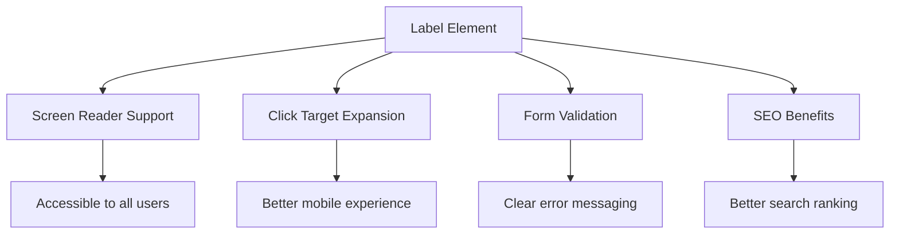
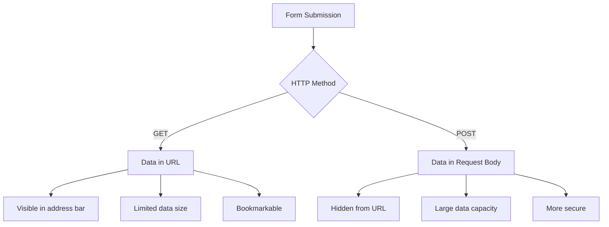
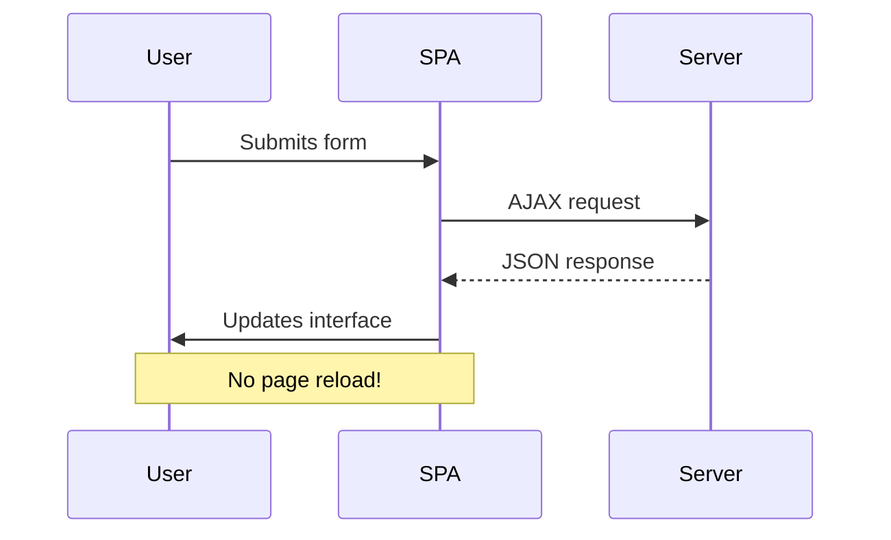
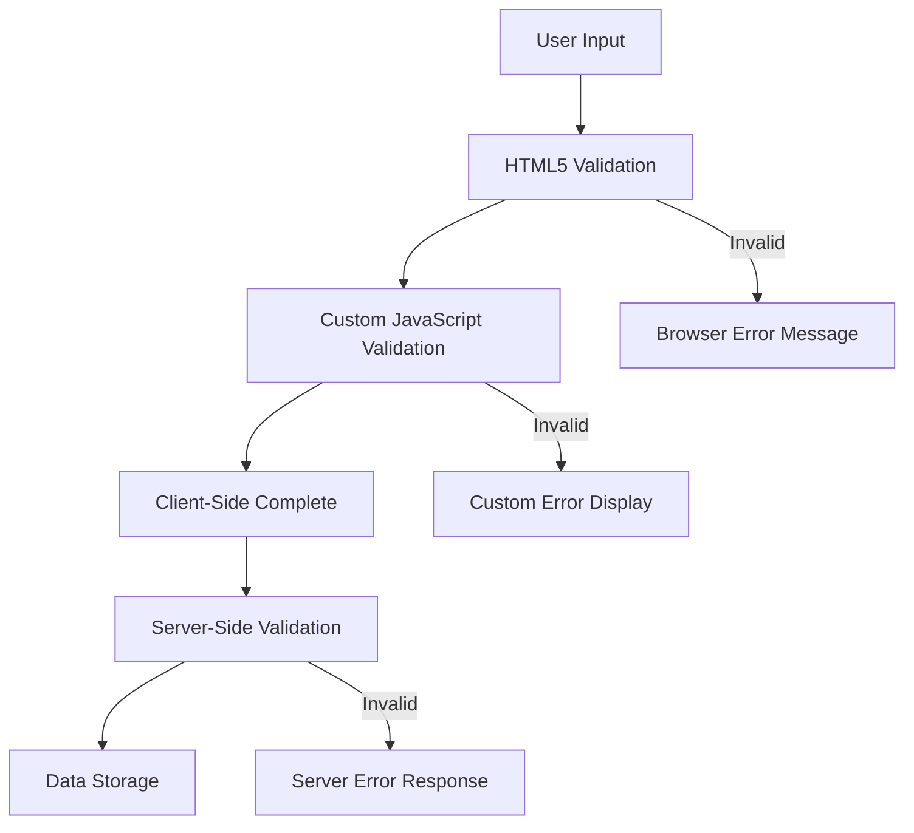
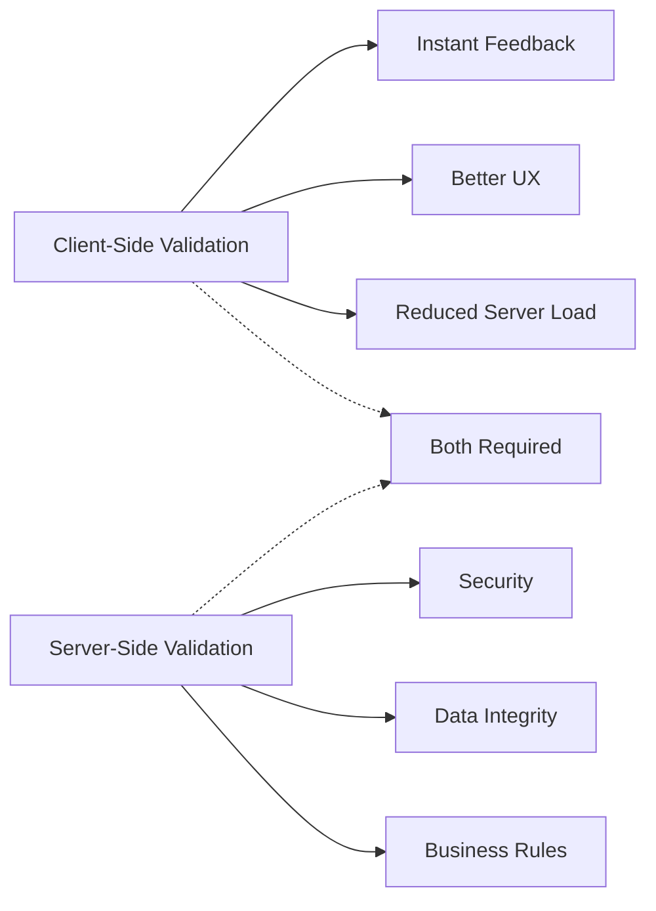

<!--
CO_OP_TRANSLATOR_METADATA:
{
  "original_hash": "b24f28fc46dd473aa9080f174182adde",
  "translation_date": "2025-10-22T16:23:50+00:00",
  "source_file": "7-bank-project/2-forms/README.md",
  "language_code": "mr"
}
-->
# बँकिंग अ‍ॅप तयार करा भाग 2: लॉगिन आणि नोंदणी फॉर्म तयार करा

## पूर्व-व्याख्यान प्रश्नमंजुषा

[पूर्व-व्याख्यान प्रश्नमंजुषा](https://ff-quizzes.netlify.app/web/quiz/43)

कधी ऑनलाइन फॉर्म भरताना तुमचा ईमेल फॉर्मेट चुकीचा असल्याचे सांगितले आहे का? किंवा सबमिट क्लिक केल्यावर सर्व माहिती गमावली आहे का? आपण सर्वांनी अशा त्रासदायक अनुभवांना सामोरे गेले आहे.

फॉर्म हे तुमच्या वापरकर्त्यांना आणि तुमच्या अ‍ॅप्लिकेशनच्या कार्यक्षमतेला जोडणारे पूल आहेत. जसे विमानतळ नियंत्रक विमानांना त्यांच्या गंतव्यस्थानी सुरक्षितपणे पोहोचवण्यासाठी काळजीपूर्वक प्रोटोकॉल वापरतात, तसेच चांगल्या प्रकारे डिझाइन केलेले फॉर्म स्पष्ट अभिप्राय देतात आणि महागड्या चुका टाळतात. दुसरीकडे, खराब फॉर्म वापरकर्त्यांना वेगाने दूर करू शकतात.

या धड्यात, आपण तुमचे स्थिर बँकिंग अ‍ॅप एक परस्परसंवादी अ‍ॅप्लिकेशनमध्ये रूपांतरित करू. तुम्ही वापरकर्त्याच्या इनपुटची पडताळणी करणारे, सर्व्हरशी संवाद साधणारे आणि उपयुक्त अभिप्राय देणारे फॉर्म तयार करणे शिकाल. याला वापरकर्त्यांना तुमच्या अ‍ॅप्लिकेशनच्या वैशिष्ट्यांमध्ये नेव्हिगेट करण्यास अनुमती देणारे नियंत्रण इंटरफेस तयार करणे असे समजून घ्या.

शेवटी, तुमच्याकडे एक संपूर्ण लॉगिन आणि नोंदणी प्रणाली असेल ज्यामध्ये वापरकर्त्यांना निराशा न होता यशाकडे मार्गदर्शन करणारी पडताळणी असेल.

## पूर्वापेक्षित गोष्टी

फॉर्म तयार करण्यास सुरुवात करण्यापूर्वी, तुमच्याकडे सर्व काही योग्य प्रकारे सेट केले आहे याची खात्री करूया. हा धडा आपण मागील धड्याच्या शेवटी जिथे सोडला होता तिथून सुरू होतो, त्यामुळे जर तुम्ही पुढे गेले असाल तर तुम्हाला परत जाऊन मूलभूत गोष्टी प्रथम कार्यरत कराव्या लागतील.

### आवश्यक सेटअप

| घटक | स्थिती | वर्णन |
|-----------|--------|-------------|
| [HTML टेम्पलेट्स](../1-template-route/README.md) | ✅ आवश्यक | तुमचे मूलभूत बँकिंग अ‍ॅप स्ट्रक्चर |
| [Node.js](https://nodejs.org) | ✅ आवश्यक | सर्व्हरसाठी JavaScript रनटाइम |
| [बँक API सर्व्हर](../api/README.md) | ✅ आवश्यक | डेटा स्टोरेजसाठी बॅकएंड सेवा |

> 💡 **विकास टिप**: तुम्ही दोन स्वतंत्र सर्व्हर एकाच वेळी चालवणार आहात – एक तुमच्या फ्रंट-एंड बँकिंग अ‍ॅपसाठी आणि दुसरा बॅकएंड API साठी. ही सेटअप वास्तविक-जगातील विकासाचे प्रतिबिंब आहे जिथे फ्रंटएंड आणि बॅकएंड सेवा स्वतंत्रपणे कार्य करतात.

### सर्व्हर कॉन्फिगरेशन

**तुमच्या विकास वातावरणात समाविष्ट असेल:**
- **फ्रंटएंड सर्व्हर**: तुमचे बँकिंग अ‍ॅप सर्व्ह करतो (सामान्यतः पोर्ट `3000`)
- **बॅकएंड API सर्व्हर**: डेटा स्टोरेज आणि पुनर्प्राप्ती हाताळतो (पोर्ट `5000`)
- **दोन्ही सर्व्हर** कोणत्याही संघर्षाशिवाय एकाच वेळी चालवू शकतात

**तुमच्या API कनेक्शनची चाचणी करणे:**
```bash
curl http://localhost:5000/api
# Expected response: "Bank API v1.0.0"
```

**जर तुम्हाला API आवृत्ती प्रतिसाद दिसला, तर तुम्ही पुढे जाण्यास तयार आहात!**

---

## HTML फॉर्म आणि नियंत्रण समजून घेणे

HTML फॉर्म हे तुमच्या वेब अ‍ॅप्लिकेशनशी संवाद साधण्याचा वापरकर्त्यांचा मार्ग आहे. त्यांना 19व्या शतकातील दूरस्थ ठिकाणांना जोडणाऱ्या टेलिग्राफ सिस्टमप्रमाणे समजून घ्या – ते वापरकर्त्याच्या हेतू आणि अ‍ॅप्लिकेशन प्रतिसाद यांच्यातील संवाद प्रोटोकॉल आहेत. विचारपूर्वक डिझाइन केलेले असल्यास, ते चुका पकडतात, इनपुट फॉर्मेटिंग मार्गदर्शन करतात आणि उपयुक्त सूचना देतात.

आधुनिक फॉर्म मूलभूत टेक्स्ट इनपुटपेक्षा लक्षणीय अधिक प्रगत आहेत. HTML5 ने विशेष इनपुट प्रकार सादर केले जे ईमेल पडताळणी, क्रमांक फॉर्मेटिंग आणि तारीख निवड आपोआप हाताळतात. या सुधारणा अ‍ॅक्सेसिबिलिटी आणि मोबाइल वापरकर्ता अनुभव दोन्हींसाठी फायदेशीर आहेत.

### आवश्यक फॉर्म घटक

**प्रत्येक फॉर्मला आवश्यक असलेले बिल्डिंग ब्लॉक्स:**

```html
<!-- Basic form structure -->
<form id="userForm" method="POST">
  <label for="username">Username</label>
  <input id="username" name="username" type="text" required>
  
  <button type="submit">Submit</button>
</form>
```

**या कोडमध्ये काय होते:**
- **तयार करते** एक फॉर्म कंटेनर ज्याला एक अद्वितीय आयडेंटिफायर आहे
- **निर्दिष्ट करते** डेटा सबमिशनसाठी HTTP पद्धत
- **जोडते** लेबल्स इनपुटशी अ‍ॅक्सेसिबिलिटीसाठी
- **परिभाषित करते** एक सबमिट बटण फॉर्म प्रक्रिया करण्यासाठी

### आधुनिक इनपुट प्रकार आणि गुणधर्म

| इनपुट प्रकार | उद्देश | उदाहरण वापर |
|------------|---------|---------------|
| `text` | सामान्य टेक्स्ट इनपुट | `<input type="text" name="username">` |
| `email` | ईमेल पडताळणी | `<input type="email" name="email">` |
| `password` | लपवलेला टेक्स्ट एंट्री | `<input type="password" name="password">` |
| `number` | संख्यात्मक इनपुट | `<input type="number" name="balance" min="0">` |
| `tel` | फोन नंबर | `<input type="tel" name="phone">` |

> 💡 **आधुनिक HTML5 फायदा**: विशिष्ट इनपुट प्रकार वापरणे आपोआप पडताळणी, योग्य मोबाइल कीबोर्ड आणि अतिरिक्त JavaScript शिवाय चांगले अ‍ॅक्सेसिबिलिटी समर्थन प्रदान करते!

### बटण प्रकार आणि वर्तन

```html
<!-- Different button behaviors -->
<button type="submit">Save Data</button>     <!-- Submits the form -->
<button type="reset">Clear Form</button>    <!-- Resets all fields -->
<button type="button">Custom Action</button> <!-- No default behavior -->
```

**प्रत्येक बटण प्रकार काय करतो:**
- **सबमिट बटणे**: फॉर्म सबमिशन ट्रिगर करतात आणि डेटा निर्दिष्ट केलेल्या एंडपॉइंटवर पाठवतात
- **रीसेट बटणे**: सर्व फॉर्म फील्ड्स त्यांच्या सुरुवातीच्या स्थितीत पुनर्संचयित करतात
- **सामान्य बटणे**: कोणतेही डिफॉल्ट वर्तन प्रदान करत नाहीत, कार्यक्षमतेसाठी सानुकूल JavaScript आवश्यक आहे

> ⚠️ **महत्त्वाची टीप**: `<input>` घटक स्वतः बंद होतो आणि बंद करणारा टॅग आवश्यक नाही. आधुनिक सर्वोत्तम पद्धत म्हणजे `<input>` स्लॅशशिवाय लिहिणे.

### तुमचा लॉगिन फॉर्म तयार करणे

आता आधुनिक HTML फॉर्म पद्धतींचे प्रदर्शन करणारा व्यावहारिक लॉगिन फॉर्म तयार करूया. आपण मूलभूत संरचनेपासून सुरुवात करू आणि अ‍ॅक्सेसिबिलिटी वैशिष्ट्ये आणि पडताळणीसह हळूहळू सुधारणा करू.

```html
<template id="login">
  <h1>Bank App</h1>
  <section>
    <h2>Login</h2>
    <form id="loginForm" novalidate>
      <div class="form-group">
        <label for="username">Username</label>
        <input id="username" name="user" type="text" required 
               autocomplete="username" placeholder="Enter your username">
      </div>
      <button type="submit">Login</button>
    </form>
  </section>
</template>
```

**येथे काय होते ते समजून घेणे:**
- **संरचना तयार करते** फॉर्मसाठी सेमॅंटिक HTML5 घटकांसह
- **संबंधित घटक गटबद्ध करते** `div` कंटेनर वापरून अर्थपूर्ण वर्गांसह
- **लेबल्स इनपुटशी जोडते** `for` आणि `id` गुणधर्म वापरून
- **आधुनिक गुणधर्म समाविष्ट करते** जसे की `autocomplete` आणि `placeholder` चांगल्या UX साठी
- **`novalidate` जोडते** ब्राउझर डिफॉल्ट्सऐवजी JavaScript सह पडताळणी हाताळण्यासाठी

### योग्य लेबल्सचे महत्त्व

**आधुनिक वेब विकासासाठी लेबल्स का महत्त्वाचे आहेत:**



**योग्य लेबल्स काय साध्य करतात:**
- **स्क्रीन रीडर्स सक्षम करतात** फॉर्म फील्ड्स स्पष्टपणे जाहीर करण्यासाठी
- **क्लिक करण्यायोग्य क्षेत्र वाढवतात** (लेबलवर क्लिक केल्यावर इनपुटवर लक्ष केंद्रित होते)
- **मोबाइल वापरयोग्यता सुधारतात** मोठ्या टच टार्गेट्ससह
- **फॉर्म पडताळणीस समर्थन देतात** अर्थपूर्ण त्रुटी संदेशांसह
- **SEO सुधारतात** फॉर्म घटकांना सेमॅंटिक अर्थ प्रदान करून

> 🎯 **अ‍ॅक्सेसिबिलिटी लक्ष्य**: प्रत्येक फॉर्म इनपुटसाठी संबंधित लेबल असावे. ही साधी पद्धत तुमचे फॉर्म सर्वांसाठी, अपंग वापरकर्त्यांसह, वापरण्यायोग्य बनवते आणि सर्व वापरकर्त्यांसाठी अनुभव सुधारते.

### नोंदणी फॉर्म तयार करणे

नोंदणी फॉर्मला संपूर्ण वापरकर्ता खाते तयार करण्यासाठी अधिक तपशीलवार माहिती आवश्यक आहे. आधुनिक HTML5 वैशिष्ट्ये आणि सुधारित अ‍ॅक्सेसिबिलिटीसह ते तयार करूया.

```html
<hr/>
<h2>Register</h2>
<form id="registerForm" novalidate>
  <div class="form-group">
    <label for="user">Username</label>
    <input id="user" name="user" type="text" required 
           autocomplete="username" placeholder="Choose a username">
  </div>
  
  <div class="form-group">
    <label for="currency">Currency</label>
    <input id="currency" name="currency" type="text" value="$" 
           required maxlength="3" placeholder="USD, EUR, etc.">
  </div>
  
  <div class="form-group">
    <label for="description">Account Description</label>
    <input id="description" name="description" type="text" 
           maxlength="100" placeholder="Personal savings, checking, etc.">
  </div>
  
  <div class="form-group">
    <label for="balance">Starting Balance</label>
    <input id="balance" name="balance" type="number" value="0" 
           min="0" step="0.01" placeholder="0.00">
  </div>
  
  <button type="submit">Create Account</button>
</form>
```

**वरीलमध्ये, आम्ही:**
- **प्रत्येक फील्ड व्यवस्थित केले** चांगल्या स्टाइलिंग आणि लेआउटसाठी कंटेनर divs मध्ये
- **योग्य `autocomplete` गुणधर्म जोडले** ब्राउझर ऑटोफिल समर्थनासाठी
- **उपयुक्त `placeholder` मजकूर समाविष्ट केला** वापरकर्त्याच्या इनपुटला मार्गदर्शन करण्यासाठी
- **सामान्य डिफॉल्ट्स सेट केले** `value` गुणधर्म वापरून
- **पडताळणी गुणधर्म लागू केले** जसे की `required`, `maxlength`, आणि `min`
- **`type="number"` वापरले** बॅलन्स फील्डसाठी दशांश समर्थनासह

### इनपुट प्रकार आणि वर्तन एक्सप्लोर करणे

**आधुनिक इनपुट प्रकार सुधारित कार्यक्षमता प्रदान करतात:**

| वैशिष्ट्य | फायदा | उदाहरण |
|---------|---------|----------|
| `type="number"` | मोबाइलवर संख्यात्मक कीपॅड | बॅलन्स एंट्री सोपी |
| `step="0.01"` | दशांश अचूकता नियंत्रण | चलनात सेंट्सला अनुमती देते |
| `autocomplete` | ब्राउझर ऑटोफिल | फॉर्म पूर्ण करणे जलद |
| `placeholder` | संदर्भात्मक सूचना | वापरकर्त्याच्या अपेक्षांना मार्गदर्शन करते |

> 🎯 **अ‍ॅक्सेसिबिलिटी आव्हान**: फक्त तुमच्या कीबोर्डचा वापर करून फॉर्म नेव्हिगेट करण्याचा प्रयत्न करा! फील्ड्समध्ये जाण्यासाठी `Tab` वापरा, चेक बॉक्ससाठी `Space` वापरा आणि सबमिट करण्यासाठी `Enter` वापरा. हा अनुभव तुम्हाला स्क्रीन रीडर वापरकर्ते तुमच्या फॉर्मशी कसे संवाद साधतात हे समजण्यास मदत करतो.

## फॉर्म सबमिशन पद्धती समजून घेणे

जेव्हा कोणी तुमचा फॉर्म भरतो आणि सबमिट क्लिक करतो, तेव्हा तो डेटा कुठेतरी जावा लागतो – सामान्यतः सर्व्हरवर जो तो जतन करू शकतो. हे दोन वेगवेगळ्या प्रकारे होऊ शकते आणि कोणता वापरायचा हे जाणून घेणे तुम्हाला नंतर काही डोकेदुखीपासून वाचवू शकते.

चला पाहूया की जेव्हा कोणी सबमिट बटण क्लिक करतो तेव्हा प्रत्यक्षात काय होते.

### डिफॉल्ट फॉर्म वर्तन

प्रथम, मूलभूत फॉर्म सबमिशनसह काय होते ते पाहूया:

**तुमचे वर्तमान फॉर्म तपासा:**
1. तुमच्या फॉर्ममधील *नोंदणी करा* बटणावर क्लिक करा
2. तुमच्या ब्राउझरच्या अ‍ॅड्रेस बारमधील बदलांचे निरीक्षण करा
3. पृष्ठ कसे रीलोड होते आणि डेटा URL मध्ये कसा दिसतो ते पहा


### HTTP पद्धतींची तुलना



**फरक समजून घेणे:**

| पद्धत | वापर प्रकरण | डेटा स्थान | सुरक्षा स्तर | आकार मर्यादा |
|--------|----------|---------------|----------------|-------------|
| `GET` | शोध क्वेरी, फिल्टर्स | URL पॅरामीटर्स | कमी (दृश्यमान) | ~2000 वर्ण |
| `POST` | वापरकर्ता खाती, संवेदनशील डेटा | विनंती बॉडी | उच्च (लपवलेले) | व्यावहारिक मर्यादा नाही |

**मूलभूत फरक समजून घेणे:**
- **GET**: फॉर्म डेटा URL मध्ये क्वेरी पॅरामीटर्स म्हणून जोडतो (शोध ऑपरेशन्ससाठी योग्य)
- **POST**: डेटा विनंती बॉडीमध्ये समाविष्ट करतो (संवेदनशील माहिती आवश्यक)
- **GET मर्यादा**: आकार मर्यादा, दृश्यमान डेटा, सतत ब्राउझर इतिहास
- **POST फायदे**: मोठ्या डेटा क्षमता, गोपनीयता संरक्षण, फाइल अपलोड समर्थन

> 💡 **सर्वोत्तम पद्धत**: शोध फॉर्म आणि फिल्टर्ससाठी `GET` वापरा (डेटा पुनर्प्राप्ती), वापरकर्ता नोंदणी, लॉगिन आणि डेटा निर्मितीसाठी `POST` वापरा.

### फॉर्म सबमिशन कॉन्फिगर करणे

चला तुमच्या नोंदणी फॉर्मला POST पद्धत वापरून बॅकएंड API शी योग्य प्रकारे संवाद साधण्यासाठी कॉन्फिगर करूया:

```html
<form id="registerForm" action="//localhost:5000/api/accounts" 
      method="POST" novalidate>
```

**या कॉन्फिगरेशनमध्ये काय होते:**
- **फॉर्म सबमिशन निर्देशित करते** तुमच्या API एंडपॉइंटवर
- **POST पद्धत वापरते** सुरक्षित डेटा ट्रान्समिशनसाठी
- **`novalidate` समाविष्ट करते** ब्राउझर डिफॉल्ट्सऐवजी JavaScript सह पडताळणी हाताळण्यासाठी

### फॉर्म सबमिशनची चाचणी करणे

**तुमच्या फॉर्मची चाचणी करण्यासाठी हे चरण अनुसरण करा:**
1. **नोंदणी फॉर्म भरा** तुमच्या माहितीने
2. **"खाते तयार करा" बटणावर क्लिक करा**
3. **तुमच्या ब्राउझरमधील सर्व्हर प्रतिसादाचे निरीक्षण करा**


**तुम्हाला काय दिसले पाहिजे:**
- **ब्राउझर पुनर्निर्देशित करते** API एंडपॉइंट URL वर
- **JSON प्रतिसाद** तुमच्या नव्याने तयार केलेल्या खाते डेटासह
- **सर्व्हर पुष्टीकरण** की खाते यशस्वीरित्या तयार केले गेले आहे

> 🧪 **प्रयोग वेळ**: समान वापरकर्तानावासह पुन्हा नोंदणी करण्याचा प्रयत्न करा. तुम्हाला कोणता प्रतिसाद मिळतो? हे तुम्हाला डुप्लिकेट डेटा आणि त्रुटी अटी कशा हाताळल्या जातात हे समजण्यास मदत करते.

### JSON प्रतिसाद समजून घेणे

**जेव्हा सर्व्हर तुमचा फॉर्म यशस्वीरित्या प्रक्रिया करतो:**
```json
{
  "user": "john_doe",
  "currency": "$",
  "description": "Personal savings",
  "balance": 100,
  "id": "unique_account_id"
}
```

**हा प्रतिसाद पुष्टी करतो:**
- **तयार करते** तुमच्या निर्दिष्ट डेटासह नवीन खाते
- **एक अद्वितीय आयडेंटिफायर नियुक्त करते** भविष्यातील संदर्भासाठी
- **सर्व खाते माहिती परत करते** पडताळणीसाठी
- **यशस्वी डेटाबेस स्टोरेज सूचित करते**

## आधुनिक फॉर्म हाताळणी JavaScript सह

पारंपरिक फॉर्म सबमिशन पूर्ण पृष्ठ रीलोड्स करतात, जसे की सुरुवातीच्या अंतराळ मोहिमांना कोर्स सुधारण्यासाठी संपूर्ण सिस्टम रीसेट आवश्यक होते. हा दृष्टिकोन वापरकर्ता अनुभवात अडथळा आणतो आणि अ‍ॅप्लिकेशन स्थिती गमावतो.

JavaScript फॉर्म हाताळणी आधुनिक अंतराळ यानांद्वारे वापरल्या जाणाऱ्या सतत मार्गदर्शन प्रणालीसारखी कार्य करते – नेव्हिगेशन संदर्भ गमावल्याशिवाय रिअल-टाइम समायोजन करणे. आपण फॉर्म सबमिशन इंटरसेप्ट करू शकतो, त्वरित अभिप्राय प्रदान करू शकतो, त्रुटी सौम्यपणे हाताळू शकतो आणि वापरकर्त्याच्या अ‍ॅप्लिकेशनमधील स्थिती राखून सर्व्हर प्रतिसादांवर आधारित इंटरफेस अपडेट करू शकतो.

### पृष्ठ रीलोड्स का टाळावेत?



**JavaScript फॉर्म हाताळणीचे फायदे:**
- **अ‍ॅप्लिकेशन स्थिती आणि वापरकर्ता संदर्भ राखते**
- **त्वरित अभिप्राय आणि लोडिंग इंडिकेटर्स प्रदान करते**
- **
- **सविस्तर** त्रुटी संदेशे डिबगिंगसाठी प्रदान करते  
- **सुसंगत** डेटा संरचना यश आणि त्रुटी प्रकरणांसाठी परत करते  

### आधुनिक Fetch API ची ताकद  

**Fetch API च्या जुन्या पद्धतींवरील फायदे:**  

| वैशिष्ट्य | फायदा | अंमलबजावणी |  
|-----------|-------|------------|  
| प्रॉमिस-आधारित | स्वच्छ असिंक्रोन कोड | `await fetch()` |  
| विनंती सानुकूलन | पूर्ण HTTP नियंत्रण | हेडर्स, पद्धती, बॉडी |  
| प्रतिसाद हाताळणी | लवचिक डेटा पार्सिंग | `.json()`, `.text()`, `.blob()` |  
| त्रुटी हाताळणी | व्यापक त्रुटी पकडणे | Try/catch ब्लॉक्स |  

> 🎥 **अधिक जाणून घ्या**: [Async/Await Tutorial](https://youtube.com/watch?v=YwmlRkrxvkk) - आधुनिक वेब विकासासाठी असिंक्रोनस JavaScript पॅटर्न समजून घेणे.  

**सर्व्हर कम्युनिकेशनसाठी महत्त्वाचे संकल्पना:**  
- **Async फंक्शन्स** सर्व्हर प्रतिसादांची वाट पाहण्यासाठी अंमलबजावणी थांबवू शकतात  
- **Await कीवर्ड** असिंक्रोनस कोडला सिंक्रोनस कोडसारखे वाचण्यास सोपे बनवते  
- **Fetch API** आधुनिक, प्रॉमिस-आधारित HTTP विनंत्या प्रदान करते  
- **त्रुटी हाताळणी** तुमच्या अॅपला नेटवर्क समस्यांवर सौम्य प्रतिसाद देण्यास सक्षम करते  

### नोंदणी फंक्शन पूर्ण करणे  

चला सर्वकाही एकत्र आणून एक संपूर्ण, उत्पादन-तयार नोंदणी फंक्शन तयार करूया:  

```javascript
async function register() {
  const registerForm = document.getElementById('registerForm');
  const submitButton = registerForm.querySelector('button[type="submit"]');
  
  try {
    // Show loading state
    submitButton.disabled = true;
    submitButton.textContent = 'Creating Account...';
    
    // Process form data
    const formData = new FormData(registerForm);
    const jsonData = JSON.stringify(Object.fromEntries(formData));
    
    // Send to server
    const result = await createAccount(jsonData);
    
    if (result.error) {
      console.error('Registration failed:', result.error);
      alert(`Registration failed: ${result.error}`);
      return;
    }
    
    console.log('Account created successfully!', result);
    alert(`Welcome, ${result.user}! Your account has been created.`);
    
    // Reset form after successful registration
    registerForm.reset();
    
  } catch (error) {
    console.error('Unexpected error:', error);
    alert('An unexpected error occurred. Please try again.');
  } finally {
    // Restore button state
    submitButton.disabled = false;
    submitButton.textContent = 'Create Account';
  }
}
```
  
**या सुधारित अंमलबजावणीत समाविष्ट आहे:**  
- **दृश्यमान फीडबॅक** फॉर्म सबमिशन दरम्यान प्रदान करते  
- **सबमिट बटण अक्षम करते** डुप्लिकेट सबमिशन टाळण्यासाठी  
- **अपेक्षित आणि अनपेक्षित त्रुटी सौम्यपणे हाताळते**  
- **वापरकर्ता-अनुकूल यश आणि त्रुटी संदेश दाखवते**  
- **यशस्वी नोंदणीनंतर फॉर्म रीसेट करते**  
- **परिणाम काहीही असो, UI स्थिती पुनर्संचयित करते**  

### तुमची अंमलबजावणी तपासणे  

**तुमच्या ब्राउझर डेव्हलपर टूल्स उघडा आणि नोंदणी तपासा:**  

1. **ब्राउझर कन्सोल उघडा** (F12 → Console टॅब)  
2. **नोंदणी फॉर्म भरा**  
3. **"Create Account" वर क्लिक करा**  
4. **कन्सोल संदेश आणि वापरकर्ता फीडबॅक निरीक्षण करा**  

  

**तुम्हाला काय दिसेल:**  
- **लोडिंग स्थिती** सबमिट बटणावर दिसते  
- **कन्सोल लॉग्स** प्रक्रियेबद्दल सविस्तर माहिती दाखवतात  
- **यश संदेश** खाते तयार होण्यास यशस्वी झाल्यावर दिसतो  
- **फॉर्म यशस्वी सबमिशननंतर आपोआप रीसेट होतो**  

> 🔒 **सुरक्षा विचार**: सध्या, डेटा HTTP वर प्रवास करतो, जो उत्पादनासाठी सुरक्षित नाही. वास्तविक अॅप्लिकेशन्समध्ये, नेहमीच HTTPS वापरा डेटा ट्रान्समिशन एन्क्रिप्ट करण्यासाठी. [HTTPS सुरक्षा](https://en.wikipedia.org/wiki/HTTPS) आणि वापरकर्ता डेटा संरक्षित करण्यासाठी ते का आवश्यक आहे याबद्दल अधिक जाणून घ्या.  

## सर्वसमावेशक फॉर्म व्हॅलिडेशन  

फॉर्म व्हॅलिडेशन सबमिशननंतर त्रुटी शोधण्याचा त्रासदायक अनुभव टाळते. आंतरराष्ट्रीय स्पेस स्टेशनवरील अनेक redundant प्रणालींसारखे, प्रभावी व्हॅलिडेशन अनेक सुरक्षा तपासण्यांचे स्तर वापरते.  

सर्वोत्तम दृष्टिकोन ब्राउझर-स्तरीय व्हॅलिडेशन त्वरित फीडबॅकसाठी, JavaScript व्हॅलिडेशन सुधारित वापरकर्ता अनुभवासाठी, आणि सर्व्हर-साइड व्हॅलिडेशन सुरक्षा आणि डेटा अखंडतेसाठी एकत्रित करतो. ही redundancy वापरकर्ता समाधान आणि प्रणाली संरक्षण सुनिश्चित करते.  

### व्हॅलिडेशन स्तर समजून घेणे  


  
**मल्टी-लेयर व्हॅलिडेशन धोरण:**  
- **HTML5 व्हॅलिडेशन**: त्वरित ब्राउझर-आधारित तपासणी  
- **JavaScript व्हॅलिडेशन**: सानुकूल लॉजिक आणि वापरकर्ता अनुभव  
- **सर्व्हर व्हॅलिडेशन**: अंतिम सुरक्षा आणि डेटा अखंडता तपासणी  
- **प्रोग्रेसिव्ह एन्हांसमेंट**: JavaScript अक्षम असले तरी कार्य करते  

### HTML5 व्हॅलिडेशन अॅट्रिब्यूट्स  

**तुमच्या आधुनिक व्हॅलिडेशन टूल्स:**  

| अॅट्रिब्यूट | उद्देश | उदाहरण वापर | ब्राउझर वर्तन |  
|------------|--------|-------------|----------------|  
| `required` | अनिवार्य फील्ड्स | `<input required>` | रिक्त सबमिशन रोखते |  
| `minlength`/`maxlength` | मजकूर लांबी मर्यादा | `<input maxlength="20">` | कॅरेक्टर मर्यादा लागू करते |  
| `min`/`max` | संख्यात्मक श्रेणी | `<input min="0" max="1000">` | संख्या मर्यादा तपासते |  
| `pattern` | सानुकूल regex नियम | `<input pattern="[A-Za-z]+">` | विशिष्ट स्वरूप जुळवते |  
| `type` | डेटा प्रकार व्हॅलिडेशन | `<input type="email">` | स्वरूप-विशिष्ट व्हॅलिडेशन |  

### CSS व्हॅलिडेशन स्टाइलिंग  

**व्हॅलिडेशन स्थितींसाठी दृश्यात्मक फीडबॅक तयार करा:**  

```css
/* Valid input styling */
input:valid {
  border-color: #28a745;
  background-color: #f8fff9;
}

/* Invalid input styling */
input:invalid {
  border-color: #dc3545;
  background-color: #fff5f5;
}

/* Focus states for better accessibility */
input:focus:valid {
  box-shadow: 0 0 0 0.2rem rgba(40, 167, 69, 0.25);
}

input:focus:invalid {
  box-shadow: 0 0 0 0.2rem rgba(220, 53, 69, 0.25);
}
```
  
**या दृश्य संकेत काय साध्य करतात:**  
- **हिरवे बॉर्डर**: यशस्वी व्हॅलिडेशन सूचित करतात, जसे मिशन कंट्रोलमधील हिरवी लाईट्स  
- **लाल बॉर्डर**: व्हॅलिडेशन त्रुटी सूचित करतात ज्यांना लक्ष देणे आवश्यक आहे  
- **फोकस हायलाइट्स**: वर्तमान इनपुट स्थानासाठी स्पष्ट दृश्य संदर्भ प्रदान करतात  
- **सुसंगत स्टाइलिंग**: वापरकर्ते शिकू शकतील अशा अंदाजे इंटरफेस पॅटर्न्स स्थापित करतात  

> 💡 **प्रो टिप**: `:valid` आणि `:invalid` CSS pseudo-classes वापरून वापरकर्ते टाइप करत असताना त्वरित दृश्यात्मक फीडबॅक प्रदान करा, प्रतिसादात्मक आणि उपयुक्त इंटरफेस तयार करा.  

### सर्वसमावेशक व्हॅलिडेशन अंमलबजावणी  

चला तुमच्या नोंदणी फॉर्मला उत्कृष्ट वापरकर्ता अनुभव आणि डेटा गुणवत्तेसह मजबूत व्हॅलिडेशनसह सुधारित करूया:  

```html
<form id="registerForm" method="POST" novalidate>
  <div class="form-group">
    <label for="user">Username <span class="required">*</span></label>
    <input id="user" name="user" type="text" required 
           minlength="3" maxlength="20" 
           pattern="[a-zA-Z0-9_]+" 
           autocomplete="username"
           title="Username must be 3-20 characters, letters, numbers, and underscores only">
    <small class="form-text">Choose a unique username (3-20 characters)</small>
  </div>
  
  <div class="form-group">
    <label for="currency">Currency <span class="required">*</span></label>
    <input id="currency" name="currency" type="text" required 
           value="$" maxlength="3" 
           pattern="[A-Z$€£¥₹]+" 
           title="Enter a valid currency symbol or code">
    <small class="form-text">Currency symbol (e.g., $, €, £)</small>
  </div>
  
  <div class="form-group">
    <label for="description">Account Description</label>
    <input id="description" name="description" type="text" 
           maxlength="100" 
           placeholder="Personal savings, checking, etc.">
    <small class="form-text">Optional description (up to 100 characters)</small>
  </div>
  
  <div class="form-group">
    <label for="balance">Starting Balance</label>
    <input id="balance" name="balance" type="number" 
           value="0" min="0" step="0.01" 
           title="Enter a positive number for your starting balance">
    <small class="form-text">Initial account balance (minimum $0.00)</small>
  </div>
  
  <button type="submit">Create Account</button>
</form>
```
  
**सुधारित व्हॅलिडेशन समजून घेणे:**  
- **आवश्यक फील्ड इंडिकेटर्स** सह उपयुक्त वर्णन एकत्रित करते  
- **`pattern` अॅट्रिब्यूट्स** स्वरूप व्हॅलिडेशनसाठी समाविष्ट करते  
- **`title` अॅट्रिब्यूट्स** accessibility आणि टूलटिप्ससाठी प्रदान करते  
- **वापरकर्ता इनपुट मार्गदर्शन करण्यासाठी मदत करणारा मजकूर समाविष्ट करते**  
- **बेहतर accessibility साठी सेमॅंटिक HTML संरचना वापरते**  

### प्रगत व्हॅलिडेशन नियम  

**प्रत्येक व्हॅलिडेशन नियम काय साध्य करतो:**  

| फील्ड | व्हॅलिडेशन नियम | वापरकर्ता फायदा |  
|-------|-----------------|-----------------|  
| Username | `required`, `minlength="3"`, `maxlength="20"`, `pattern="[a-zA-Z0-9_]+"` | वैध, अद्वितीय ओळख सुनिश्चित करते |  
| Currency | `required`, `maxlength="3"`, `pattern="[A-Z$€£¥₹]+"` | सामान्य चलन चिन्ह स्वीकारते |  
| Balance | `min="0"`, `step="0.01"`, `type="number"` | नकारात्मक शिल्लक टाळते |  
| Description | `maxlength="100"` | वाजवी लांबी मर्यादा |  

### व्हॅलिडेशन वर्तन तपासणे  

**या व्हॅलिडेशन परिस्थितींचा प्रयत्न करा:**  
1. **रिक्त आवश्यक फील्डसह फॉर्म सबमिट करा**  
2. **3 कॅरेक्टरपेक्षा कमी युजरनेम प्रविष्ट करा**  
3. **युजरनेम फील्डमध्ये विशेष कॅरेक्टर वापरण्याचा प्रयत्न करा**  
4. **नकारात्मक शिल्लक रक्कम प्रविष्ट करा**  

  

**तुम्ही काय निरीक्षण कराल:**  
- **ब्राउझर दाखवतो** नैसर्गिक व्हॅलिडेशन संदेश  
- **`valid` आणि `invalid` स्थितींवर आधारित स्टाइलिंग बदलते**  
- **सर्व व्हॅलिडेशन पास होईपर्यंत फॉर्म सबमिशन रोखले जाते**  
- **फोकस आपोआप** पहिल्या अवैध फील्डवर हलते  

### क्लायंट-साइड vs सर्व्हर-साइड व्हॅलिडेशन  


  
**तुम्हाला दोन्ही स्तर का आवश्यक आहेत:**  
- **क्लायंट-साइड व्हॅलिडेशन**: त्वरित फीडबॅक प्रदान करते आणि वापरकर्ता अनुभव सुधारते  
- **सर्व्हर-साइड व्हॅलिडेशन**: सुरक्षा सुनिश्चित करते आणि जटिल व्यवसाय नियम हाताळते  
- **संयुक्त दृष्टिकोन**: मजबूत, वापरकर्ता-अनुकूल आणि सुरक्षित अॅप्लिकेशन्स तयार करते  
- **प्रोग्रेसिव्ह एन्हांसमेंट**: JavaScript अक्षम असले तरी कार्य करते  

> 🛡️ **सुरक्षा स्मरणपत्र**: केवळ क्लायंट-साइड व्हॅलिडेशनवर विश्वास ठेवू नका! दुर्भावनायुक्त वापरकर्ते क्लायंट-साइड तपासण्या टाळू शकतात, त्यामुळे सुरक्षा आणि डेटा अखंडतेसाठी सर्व्हर-साइड व्हॅलिडेशन आवश्यक आहे.  

---  

---

## GitHub Copilot Agent Challenge 🚀  

Agent मोड वापरून खालील आव्हान पूर्ण करा:  

**वर्णन:** नोंदणी फॉर्मला सर्वसमावेशक क्लायंट-साइड व्हॅलिडेशन आणि वापरकर्ता फीडबॅकसह सुधारित करा. हे आव्हान तुम्हाला फॉर्म व्हॅलिडेशन, त्रुटी हाताळणी, आणि परस्पर फीडबॅकसह वापरकर्ता अनुभव सुधारण्याचा सराव करण्यास मदत करेल.  

**प्रॉम्प्ट:** नोंदणी फॉर्मसाठी संपूर्ण फॉर्म व्हॅलिडेशन प्रणाली तयार करा ज्यामध्ये समाविष्ट आहे: 1) वापरकर्ता टाइप करत असताना प्रत्येक फील्डसाठी रिअल-टाइम व्हॅलिडेशन फीडबॅक, 2) प्रत्येक इनपुट फील्डखाली सानुकूल व्हॅलिडेशन संदेश, 3) पासवर्ड पुष्टीकरण फील्डसह जुळणारे व्हॅलिडेशन, 4) दृश्यात्मक संकेत (जसे की वैध फील्डसाठी हिरवे चेकमार्क आणि अवैध फील्डसाठी लाल चेतावणी), 5) सर्व व्हॅलिडेशन पास झाल्यावरच सक्षम होणारे सबमिट बटण. HTML5 व्हॅलिडेशन अॅट्रिब्यूट्स, CSS स्टाइलिंगसाठी, आणि JavaScript परस्पर वर्तनासाठी वापरा.  

[Agent मोड](https://code.visualstudio.com/blogs/2025/02/24/introducing-copilot-agent-mode) बद्दल अधिक जाणून घ्या.  

## 🚀 आव्हान  

HTML मध्ये त्रुटी संदेश दाखवा जर वापरकर्ता आधीच अस्तित्वात असेल.  

अंतिम लॉगिन पृष्ठ थोड्या स्टाइलिंगनंतर कसे दिसू शकते याचे उदाहरण येथे आहे:  

  

## पोस्ट-लेक्चर क्विझ  

[पोस्ट-लेक्चर क्विझ](https://ff-quizzes.netlify.app/web/quiz/44)  

## पुनरावलोकन आणि स्व-अभ्यास  

डेव्हलपर्स त्यांच्या फॉर्म बिल्डिंग प्रयत्नांबद्दल खूप सर्जनशील झाले आहेत, विशेषतः व्हॅलिडेशन धोरणांबद्दल. [CodePen](https://codepen.com) पाहून वेगवेगळ्या फॉर्म फ्लोबद्दल जाणून घ्या; तुम्हाला काही मनोरंजक आणि प्रेरणादायक फॉर्म सापडतात का?  

## असाइनमेंट  

[तुमच्या बँक अॅपला स्टाइल करा](assignment.md)  

---

**अस्वीकरण**:  
हा दस्तऐवज AI भाषांतर सेवा [Co-op Translator](https://github.com/Azure/co-op-translator) वापरून भाषांतरित करण्यात आला आहे. आम्ही अचूकतेसाठी प्रयत्नशील असलो तरी, कृपया लक्षात ठेवा की स्वयंचलित भाषांतरे त्रुटी किंवा अचूकतेच्या अभावासह असू शकतात. मूळ भाषेतील दस्तऐवज हा अधिकृत स्रोत मानला जावा. महत्त्वाच्या माहितीसाठी, व्यावसायिक मानवी भाषांतराची शिफारस केली जाते. या भाषांतराचा वापर करून उद्भवलेल्या कोणत्याही गैरसमज किंवा चुकीच्या अर्थासाठी आम्ही जबाबदार राहणार नाही.