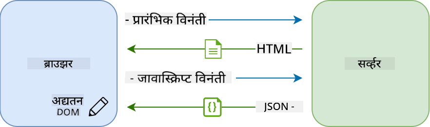
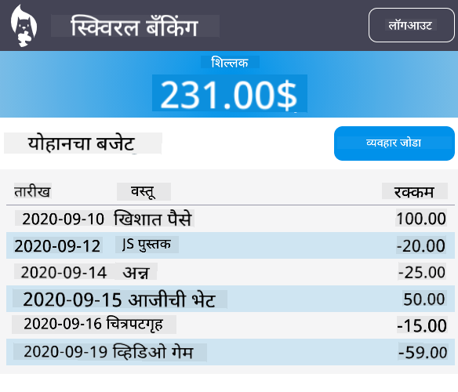

<!--
CO_OP_TRANSLATOR_METADATA:
{
  "original_hash": "431a0e773cfb4f7c13fa4358d01a7db0",
  "translation_date": "2025-10-20T21:24:29+00:00",
  "source_file": "7-bank-project/3-data/README.md",
  "language_code": "mr"
}
-->
# बँकिंग अ‍ॅप तयार करा भाग 3: डेटा मिळवण्याचे आणि वापरण्याचे पद्धती

## पूर्व-व्याख्यान प्रश्नमंजुषा

[पूर्व-व्याख्यान प्रश्नमंजुषा](https://ff-quizzes.netlify.app/web/quiz/45)

### परिचय

प्रत्येक वेब अ‍ॅप्लिकेशनच्या केंद्रस्थानी *डेटा* असतो. डेटा विविध स्वरूपात असतो, परंतु त्याचा मुख्य उद्देश नेहमीच वापरकर्त्याला माहिती दाखवणे असतो. वेब अ‍ॅप्स अधिकाधिक परस्परसंवादी आणि जटिल होत असल्याने, वापरकर्ता माहिती कशी प्रवेश करतो आणि त्याचा कसा उपयोग करतो हे वेब विकासाचा महत्त्वाचा भाग बनला आहे.

या धड्यात, आपण पाहू की सर्व्हरकडून डेटा असिंक्रोनस पद्धतीने कसा मिळवायचा आणि HTML पुन्हा लोड न करता वेब पृष्ठावर माहिती कशी दाखवायची.

### पूर्वतयारी

या धड्यासाठी तुम्ही वेब अ‍ॅपचा [लॉगिन आणि नोंदणी फॉर्म](../2-forms/README.md) तयार केला असावा. तुम्हाला [Node.js](https://nodejs.org) स्थापित करणे आणि [सर्व्हर API](../api/README.md) स्थानिक पातळीवर चालवणे आवश्यक आहे जेणेकरून तुम्हाला खाते डेटा मिळेल.

सर्व्हर योग्यरित्या चालू आहे की नाही हे तपासण्यासाठी तुम्ही टर्मिनलमध्ये हा आदेश चालवू शकता:

```sh
curl http://localhost:5000/api
# -> should return "Bank API v1.0.0" as a result
```

---

## AJAX आणि डेटा मिळवणे

पारंपरिक वेब साइट्समध्ये वापरकर्ता लिंक निवडतो किंवा फॉर्मद्वारे डेटा सबमिट करतो तेव्हा पूर्ण HTML पृष्ठ पुन्हा लोड करून सामग्री अपडेट केली जाते. नवीन डेटा लोड करण्यासाठी प्रत्येक वेळी वेब सर्व्हर नवीन HTML पृष्ठ परत करतो ज्याला ब्राउझरद्वारे प्रक्रिया करावी लागते, सध्याच्या वापरकर्त्याच्या क्रियेत व्यत्यय आणतो आणि रीलोड दरम्यान परस्परसंवाद मर्यादित करतो. या कार्यप्रवाहाला *मल्टी-पेज अ‍ॅप्लिकेशन* किंवा *MPA* असेही म्हणतात.


वेब अ‍ॅप्लिकेशन्स अधिक जटिल आणि परस्परसंवादी होऊ लागल्यावर, [AJAX (असिंक्रोनस जावास्क्रिप्ट आणि XML)](https://en.wikipedia.org/wiki/Ajax_(programming)) नावाची नवीन तंत्रज्ञान उदयास आली. या तंत्रज्ञानामुळे वेब अ‍ॅप्सना जावास्क्रिप्ट वापरून सर्व्हरकडून डेटा असिंक्रोनस पद्धतीने पाठवणे आणि मिळवणे शक्य झाले, HTML पृष्ठ पुन्हा लोड न करता, परिणामी जलद अपडेट्स आणि गुळगुळीत वापरकर्ता परस्परसंवाद मिळतो. सर्व्हरकडून नवीन डेटा प्राप्त झाल्यावर, सध्याचे HTML पृष्ठ जावास्क्रिप्ट वापरून [DOM](https://developer.mozilla.org/docs/Web/API/Document_Object_Model) API द्वारे अपडेट केले जाऊ शकते. कालांतराने, ही पद्धत आता [*सिंगल-पेज अ‍ॅप्लिकेशन* किंवा *SPA*](https://en.wikipedia.org/wiki/Single-page_application) म्हणून ओळखली जाते.



जेव्हा AJAX प्रथम सादर केले गेले, तेव्हा डेटा असिंक्रोनस पद्धतीने मिळवण्यासाठी उपलब्ध असलेली एकमेव API [`XMLHttpRequest`](https://developer.mozilla.org/docs/Web/API/XMLHttpRequest/Using_XMLHttpRequest) होती. परंतु आधुनिक ब्राउझर आता अधिक सोयीस्कर आणि शक्तिशाली [`Fetch` API](https://developer.mozilla.org/docs/Web/API/Fetch_API) देखील अंमलात आणतात, जी प्रॉमिसेस वापरते आणि JSON डेटा हाताळण्यासाठी अधिक योग्य आहे.

> सर्व आधुनिक ब्राउझर `Fetch API` ला समर्थन देतात, परंतु जर तुम्हाला तुमचे वेब अ‍ॅप्लिकेशन जुने ब्राउझरवर चालवायचे असेल तर [caniuse.com वर सुसंगतता टेबल](https://caniuse.com/fetch) तपासणे नेहमीच चांगली कल्पना आहे.

### कार्य

[मागील धड्यात](../2-forms/README.md) आम्ही खाते तयार करण्यासाठी नोंदणी फॉर्म अंमलात आणला. आता आम्ही विद्यमान खात्याचा वापर करून लॉगिन करण्यासाठी कोड जोडू आणि त्याचा डेटा मिळवू. `app.js` फाइल उघडा आणि नवीन `login` फंक्शन जोडा:

```js
async function login() {
  const loginForm = document.getElementById('loginForm')
  const user = loginForm.user.value;
}
```

येथे आम्ही `getElementById()` वापरून फॉर्म एलिमेंट मिळवून सुरुवात करतो आणि नंतर आम्ही `loginForm.user.value` वापरून इनपुटमधून वापरकर्त्याचे नाव मिळवतो. प्रत्येक फॉर्म कंट्रोलला त्याच्या नावाने (HTML मध्ये `name` अ‍ॅट्रिब्युट वापरून सेट केलेले) फॉर्मच्या प्रॉपर्टी म्हणून प्रवेश करता येतो.

नोंदणीसाठी जे केले होते त्याचप्रमाणे, आम्ही सर्व्हर विनंती करण्यासाठी आणखी एक फंक्शन तयार करू, परंतु यावेळी खाते डेटा मिळवण्यासाठी:

```js
async function getAccount(user) {
  try {
    const response = await fetch('//localhost:5000/api/accounts/' + encodeURIComponent(user));
    return await response.json();
  } catch (error) {
    return { error: error.message || 'Unknown error' };
  }
}
```

आम्ही `fetch` API वापरून सर्व्हरकडून डेटा असिंक्रोनस पद्धतीने मिळवतो, परंतु यावेळी आम्हाला फक्त डेटा क्वेरी करायचा असल्याने URL व्यतिरिक्त कोणत्याही अतिरिक्त पॅरामीटर्सची आवश्यकता नाही. डीफॉल्टनुसार, `fetch` एक [`GET`](https://developer.mozilla.org/docs/Web/HTTP/Methods/GET) HTTP विनंती तयार करते, जी आम्हाला येथे हवी आहे.

✅ `encodeURIComponent()` ही एक फंक्शन आहे जी URL साठी विशेष वर्ण एस्केप करते. जर आपण ही फंक्शन कॉल केली नाही आणि थेट `user` मूल्य URL मध्ये वापरले तर आपल्याला कोणत्या समस्या येऊ शकतात?

आता आपण आमच्या `login` फंक्शनला `getAccount` वापरण्यासाठी अपडेट करूया:

```js
async function login() {
  const loginForm = document.getElementById('loginForm')
  const user = loginForm.user.value;
  const data = await getAccount(user);

  if (data.error) {
    return console.log('loginError', data.error);
  }

  account = data;
  navigate('/dashboard');
}
```

प्रथम, कारण `getAccount` एक असिंक्रोनस फंक्शन आहे, आम्हाला सर्व्हरच्या निकालाची वाट पाहण्यासाठी `await` कीवर्ड वापरावा लागतो. कोणत्याही सर्व्हर विनंतीसाठी, आपल्याला त्रुटी प्रकरणांशी देखील व्यवहार करावा लागतो. सध्या आम्ही फक्त त्रुटी प्रदर्शित करण्यासाठी एक लॉग संदेश जोडू आणि नंतर त्याकडे परत येऊ.

यानंतर, आम्हाला डेटा कुठेतरी संग्रहित करावा लागेल जेणेकरून आम्ही नंतर डॅशबोर्ड माहिती प्रदर्शित करण्यासाठी त्याचा उपयोग करू शकू. कारण `account` व्हेरिएबल अद्याप अस्तित्वात नाही, आम्ही आमच्या फाइलच्या शीर्षस्थानी त्यासाठी एक ग्लोबल व्हेरिएबल तयार करू:

```js
let account = null;
```

वापरकर्ता डेटा व्हेरिएबलमध्ये सेव्ह झाल्यानंतर आपण *लॉगिन* पृष्ठावरून *डॅशबोर्ड* वर `navigate()` फंक्शन वापरून जाऊ शकतो.

शेवटी, लॉगिन फॉर्म सबमिट केल्यावर आपले `login` फंक्शन कॉल करणे आवश्यक आहे, HTML बदलून:

```html
<form id="loginForm" action="javascript:login()">
```

नवीन खाते नोंदणी करून आणि त्याच खात्याचा वापर करून लॉगिन करण्याचा प्रयत्न करून सर्व काही योग्यरित्या कार्य करत आहे का ते तपासा.

पुढील भागाकडे जाण्यापूर्वी, आपण `register` फंक्शन पूर्ण करू शकतो, फंक्शनच्या शेवटी हे जोडून:

```js
account = result;
navigate('/dashboard');
```

✅ तुम्हाला माहित आहे का की डीफॉल्टनुसार, तुम्ही फक्त *समान डोमेन आणि पोर्ट* वरून वेब पृष्ठ पाहत असलेल्या सर्व्हर API ला कॉल करू शकता? हे ब्राउझरद्वारे लागू केलेले सुरक्षा यंत्रणा आहे. पण थांबा, आमचे वेब अ‍ॅप `localhost:3000` वर चालत आहे तर सर्व्हर API `localhost:5000` वर चालत आहे, तरीही ते कसे कार्य करते? [क्रॉस-ऑरिजिन रिसोर्स शेअरिंग (CORS)](https://developer.mozilla.org/docs/Web/HTTP/CORS) नावाच्या तंत्राचा वापर करून, सर्व्हर विशिष्ट डोमेनसाठी अपवाद परवानगी देणारे प्रतिसादात विशेष हेडर्स जोडल्यास क्रॉस-ऑरिजिन HTTP विनंती करणे शक्य आहे.

> API बद्दल अधिक जाणून घ्या [या धड्यात](https://docs.microsoft.com/learn/modules/use-apis-discover-museum-art/?WT.mc_id=academic-77807-sagibbon)

## HTML अपडेट करून डेटा प्रदर्शित करा

आता आपल्याकडे वापरकर्ता डेटा आहे, आपल्याला विद्यमान HTML अपडेट करून तो प्रदर्शित करावा लागेल. आम्हाला आधीच माहित आहे की `document.getElementById()` वापरून DOM मधून एखादा एलिमेंट कसा मिळवायचा. बेस एलिमेंट मिळाल्यानंतर, तुम्ही त्यास बदलण्यासाठी किंवा त्यामध्ये नवीन चाइल्ड एलिमेंट्स जोडण्यासाठी खालील API वापरू शकता:

- [`textContent`](https://developer.mozilla.org/docs/Web/API/Node/textContent) प्रॉपर्टी वापरून तुम्ही एखाद्या एलिमेंटचा मजकूर बदलू शकता. लक्षात ठेवा की हे मूल्य बदलल्याने सर्व एलिमेंटचे चाइल्ड (जर असेल तर) काढून टाकले जाते आणि दिलेल्या मजकुराने बदलले जाते. म्हणून, एखाद्या दिलेल्या एलिमेंटचे सर्व चाइल्ड काढून टाकण्यासाठी रिक्त स्ट्रिंग `''` असाइन करणे ही एक कार्यक्षम पद्धत आहे.

- [`document.createElement()`](https://developer.mozilla.org/docs/Web/API/Document/createElement) आणि [`append()`](https://developer.mozilla.org/docs/Web/API/ParentNode/append) पद्धतीसह तुम्ही नवीन चाइल्ड एलिमेंट्स तयार करू शकता आणि जोडू शकता.

✅ एखाद्या एलिमेंटच्या [`innerHTML`](https://developer.mozilla.org/docs/Web/API/Element/innerHTML) प्रॉपर्टीचा वापर करून त्याच्या HTML सामग्रीत बदल करणे शक्य आहे, परंतु हे टाळले पाहिजे कारण ते [क्रॉस-साइट स्क्रिप्टिंग (XSS)](https://developer.mozilla.org/docs/Glossary/Cross-site_scripting) हल्ल्यांसाठी असुरक्षित आहे.

### कार्य

डॅशबोर्ड स्क्रीनवर जाण्यापूर्वी, *लॉगिन* पृष्ठावर आणखी एक गोष्ट करणे आवश्यक आहे. सध्या, जर तुम्ही अस्तित्वात नसलेल्या वापरकर्त्याच्या नावाने लॉगिन करण्याचा प्रयत्न केला, तर कन्सोलमध्ये एक संदेश दाखवला जातो, परंतु सामान्य वापरकर्त्यासाठी काहीही बदलत नाही आणि तुम्हाला काय चालले आहे ते कळत नाही.

चला लॉगिन `<button>` च्या अगोदर लॉगिन फॉर्ममध्ये एक प्लेसहोल्डर एलिमेंट जोडूया जिथे आवश्यक असल्यास त्रुटी संदेश प्रदर्शित करू शकतो:

```html
...
<div id="loginError"></div>
<button>Login</button>
...
```

हा `<div>` एलिमेंट रिक्त आहे, म्हणजे स्क्रीनवर काहीही प्रदर्शित होणार नाही जोपर्यंत आपण त्यामध्ये काही सामग्री जोडत नाही. आम्ही त्याला `id` देखील देतो जेणेकरून आम्ही ते सहजपणे जावास्क्रिप्टसह मिळवू शकू.

`app.js` फाइलवर परत जा आणि नवीन हेल्पर फंक्शन `updateElement` तयार करा:

```js
function updateElement(id, text) {
  const element = document.getElementById(id);
  element.textContent = text;
}
```

हे फंक्शन अगदी सोपे आहे: दिलेल्या एलिमेंट *id* आणि *text* च्या आधारे, ते संबंधित `id` असलेल्या DOM एलिमेंटचा मजकूर सामग्री अपडेट करेल. आता आपण हे फंक्शन `login` फंक्शनमधील पूर्वीच्या त्रुटी संदेशाच्या जागी वापरूया:

```js
if (data.error) {
  return updateElement('loginError', data.error);
}
```

आता जर तुम्ही अवैध खात्याने लॉगिन करण्याचा प्रयत्न केला, तर तुम्हाला असे काहीतरी दिसेल:


आता आमच्याकडे त्रुटी मजकूर आहे जो दृश्यात्मकपणे दिसतो, परंतु जर तुम्ही स्क्रीन रीडर वापरून प्रयत्न केला तर तुम्हाला काहीही ऐकू येणार नाही. पृष्ठावर डायनॅमिक पद्धतीने जोडलेला मजकूर स्क्रीन रीडरद्वारे घोषित केला जावा यासाठी, त्याला [लाइव्ह रिजन](https://developer.mozilla.org/docs/Web/Accessibility/ARIA/ARIA_Live_Regions) नावाच्या गोष्टीचा वापर करावा लागेल. येथे आम्ही अलर्ट नावाच्या लाइव्ह रिजनचा वापर करणार आहोत:

```html
<div id="loginError" role="alert"></div>
```

`register` फंक्शनच्या त्रुटींसाठी समान वर्तन अंमलात आणा (HTML अपडेट करायला विसरू नका).

## डॅशबोर्डवर माहिती प्रदर्शित करा

आत्ताच पाहिलेल्या तंत्रांचा वापर करून, आम्ही डॅशबोर्ड पृष्ठावर खाते माहिती प्रदर्शित करण्याची काळजी घेऊ.

सर्व्हरकडून प्राप्त झालेले खाते ऑब्जेक्ट असे दिसते:

```json
{
  "user": "test",
  "currency": "$",
  "description": "Test account",
  "balance": 75,
  "transactions": [
    { "id": "1", "date": "2020-10-01", "object": "Pocket money", "amount": 50 },
    { "id": "2", "date": "2020-10-03", "object": "Book", "amount": -10 },
    { "id": "3", "date": "2020-10-04", "object": "Sandwich", "amount": -5 }
  ],
}
```

> टीप: तुमचे काम सोपे करण्यासाठी, तुम्ही आधीपासून डेटा भरलेले `test` खाते वापरू शकता.

### कार्य

चला HTML मधील "Balance" विभाग बदलून प्लेसहोल्डर एलिमेंट्स जोडूया:

```html
<section>
  Balance: <span id="balance"></span><span id="currency"></span>
</section>
```

आम्ही खाली नवीन विभाग देखील जोडू जे खाते वर्णन प्रदर्शित करेल:

```html
<h2 id="description"></h2>
```

✅ कारण खाते वर्णन त्याखालील सामग्रीसाठी शीर्षक म्हणून कार्य करते, ते अर्थपूर्णपणे शीर्षक म्हणून चिन्हांकित केले आहे. [शीर्षक संरचनेचे महत्त्व](https://www.nomensa.com/blog/2017/how-structure-headings-web-accessibility) जाणून घ्या आणि पृष्ठाकडे गंभीरपणे पाहा जेणेकरून इतर काय शीर्षक असू शकते ते ठरवता येईल.

पुढे, आम्ही `app.js` मध्ये नवीन फंक्शन तयार करू जे प्लेसहोल्डर भरून काढेल:

```js
function updateDashboard() {
  if (!account) {
    return navigate('/login');
  }

  updateElement('description', account.description);
  updateElement('balance', account.balance.toFixed(2));
  updateElement('currency', account.currency);
}
```

प्रथम, आम्ही पुढे जाण्यापूर्वी आमच्याकडे आवश्यक खाते डेटा आहे की नाही ते तपासतो. त्यानंतर आम्ही आमचे HTML अपडेट करण्यासाठी आम्ही पूर्वी तयार केलेले `updateElement()` फंक्शन वापरतो.

> बॅलन्स डिस्प्ले अधिक आकर्षक बनवण्यासाठी, आम्ही [`toFixed(2)`](https://developer.mozilla.org/docs/Web/JavaScript/Reference/Global_Objects/Number/toFixed) पद्धतीचा वापर करतो जेणेकरून दशांश बिंदूच्या नंतर 2 अंकांसह मूल्य प्रदर्शित होईल.

आता प्रत्येक वेळी डॅशबोर्ड लोड केल्यावर आपले `updateDashboard()` फंक्शन कॉल करणे आवश्यक आहे. जर तुम्ही [धडा 1 असाइनमेंट](../1-template-route/assignment.md) आधीच पूर्ण केली असेल तर हे सोपे असावे, अन्यथा तुम्ही खालील अंमलबद्धता वापरू शकता.

`updateRoute()` फंक्शनच्या शेवटी हा कोड जोडा:

```js
if (typeof route.init === 'function') {
  route.init();
}
```

आणि रूट्सच्या व्याख्येसह अपडेट करा:

```js
const routes = {
  '/login': { templateId: 'login' },
  '/dashboard': { templateId: 'dashboard', init: updateDashboard }
};
```

या बदलासह, प्रत्येक वेळी डॅशबोर्ड पृष्ठ प्रदर्शित केले जाते, `updateDashboard()` फंक्शन कॉल केले जाते. लॉगिन केल्यानंतर, तुम्हाला खाते बॅलन्स, चलन आणि वर्णन दिसेल.

## HTML टेम्पलेट्ससह टेबल रो डायनॅमिक पद्धतीने तयार करा

[पहिल्या धड्यात](../1-template-route/README.md) आम्ही HTML टेम्पलेट्ससह [`appendChild()`](https://developer.mozilla.org/docs/Web/API/Node/appendChild) पद्धतीचा वापर करून अ‍ॅपमधील नेव्हिगेशन अंमलात आणले. टेम्पलेट्स लहान देखील असू शकतात आणि पृष्ठाचा पुनरावृत्ती होणारा भाग डायनॅमिक पद्धतीने भरण्यासाठी वापरले जाऊ शकतात.

आम्ही HTML टेबलमध्ये व्यवहारांची यादी प्रदर्शित करण्यासाठी समान पद्धतीचा वापर करू.

### कार्य

HTML `<body>` मध्ये नवीन टेम्पलेट जोडा:

```html
<template id="transaction">
  <tr>
    <td></td>
    <td></td>
    <td></td>
  </tr>
</template>
```

हे टेम्पलेट एकच टेबल रो दर्शवते, ज्यामध्ये आम्हाला भरायचे आहे असे 3 कॉलम आहेत: व्यवहाराचा *date*, *object* आणि *amount*.

यानंतर, डॅशबोर्ड टेम्पलेटमधील टेबलच्या `<tbody>` एलिमेंटला JavaScript वापरून शोधणे सोपे होण्यासाठी हे `id` प्रॉपर्टी जोडा:

```html
<tbody id="transactions"></tbody>
```

आमचे HTML तयार आहे, आता जावास्क्रिप्ट कोडकडे स्विच करूया आणि नवीन फंक्शन `createTransactionRow` तयार करूया:

```js
function createTransactionRow(transaction) {
  const template = document.getElementById('transaction');
  const transactionRow = template.content.cloneNode(true);
  const tr = transactionRow.querySelector('tr');
  tr.children[0].textContent = transaction.date;
  tr.children[1].textContent = transaction.object;
  tr.children[2].textContent = transaction.amount.toFixed(2);
  return transactionRow;
}
```

हे फंक्शन नेमके त्याचे नाव काय सूचित करते ते करते: आम्ही पूर्वी तयार केलेल्या टेम्पलेटचा वापर करून, ते नवीन टेबल रो तयार करते आणि व्यवहार डेटा वापरून त्याची सामग्री भरते. आम्ही आमच्या `updateDashboard()` फंक्शनमध्ये
आम्ही [`append()`](https://developer.mozilla.org/docs/Web/API/ParentNode/append) पद्धतीचा वापर करतो कारण ती मजकूर किंवा [DOM Nodes](https://developer.mozilla.org/docs/Web/API/Node) पालक घटकाला जोडण्याची परवानगी देते, जी आमच्या सर्व उपयोगांसाठी योग्य आहे.

जर तुम्ही `test` खाते वापरून लॉगिन करण्याचा प्रयत्न केला, तर आता तुम्हाला डॅशबोर्डवर व्यवहारांची यादी दिसेल 🎉.

---

## GitHub Copilot Agent Challenge 🚀

Agent मोड वापरून खालील आव्हान पूर्ण करा:

**वर्णन:** बँकिंग अ‍ॅपमध्ये व्यवहार शोध आणि फिल्टर वैशिष्ट्य अंमलात आणा ज्यामुळे वापरकर्त्यांना तारीख श्रेणी, रक्कम किंवा वर्णनाद्वारे विशिष्ट व्यवहार शोधता येतील.

**प्रॉम्प्ट:** बँकिंग अ‍ॅपसाठी शोध कार्यक्षमता तयार करा ज्यामध्ये समाविष्ट आहे: 1) तारीख श्रेणी (पासून/पर्यंत), किमान/कमाल रक्कम आणि व्यवहार वर्णन कीवर्डसाठी इनपुट फील्ड असलेला शोध फॉर्म, 2) शोध निकषांवर आधारित account.transactions अ‍ॅरे फिल्टर करणारी `filterTransactions()` फंक्शन, 3) फिल्टर केलेले निकाल दाखवण्यासाठी `updateDashboard()` फंक्शन अपडेट करा, आणि 4) दृश्य रीसेट करण्यासाठी "Clear Filters" बटण जोडा. आधुनिक JavaScript अ‍ॅरे पद्धती जसे `filter()` वापरा आणि रिक्त शोध निकषांसाठी एज केस हाताळा.

## 🚀 Challenge

डॅशबोर्ड पृष्ठ खऱ्या बँकिंग अ‍ॅपसारखे दिसण्यासाठी एकत्र काम करा. जर तुम्ही आधीच तुमचे अ‍ॅप स्टाइल केले असेल, तर [media queries](https://developer.mozilla.org/docs/Web/CSS/Media_Queries) वापरून [responsive design](https://developer.mozilla.org/docs/Web/Progressive_web_apps/Responsive/responsive_design_building_blocks) तयार करण्याचा प्रयत्न करा जे डेस्कटॉप आणि मोबाइल डिव्हाइसवर चांगले कार्य करते.

स्टाइल केलेल्या डॅशबोर्ड पृष्ठाचे उदाहरण येथे आहे:



## Post-Lecture Quiz

[Post-lecture quiz](https://ff-quizzes.netlify.app/web/quiz/46)

## Assignment

[तुमचा कोड पुनर्रचना करा आणि त्यावर टिप्पणी द्या](assignment.md)

---

**अस्वीकरण**:  
हा दस्तऐवज AI भाषांतर सेवा [Co-op Translator](https://github.com/Azure/co-op-translator) वापरून भाषांतरित करण्यात आला आहे. आम्ही अचूकतेसाठी प्रयत्नशील असलो तरी, कृपया लक्षात ठेवा की स्वयंचलित भाषांतरांमध्ये त्रुटी किंवा अचूकतेचा अभाव असू शकतो. मूळ भाषेतील दस्तऐवज हा अधिकृत स्रोत मानला जावा. महत्त्वाच्या माहितीसाठी व्यावसायिक मानवी भाषांतराची शिफारस केली जाते. या भाषांतराचा वापर करून निर्माण झालेल्या कोणत्याही गैरसमज किंवा चुकीच्या अर्थासाठी आम्ही जबाबदार राहणार नाही.