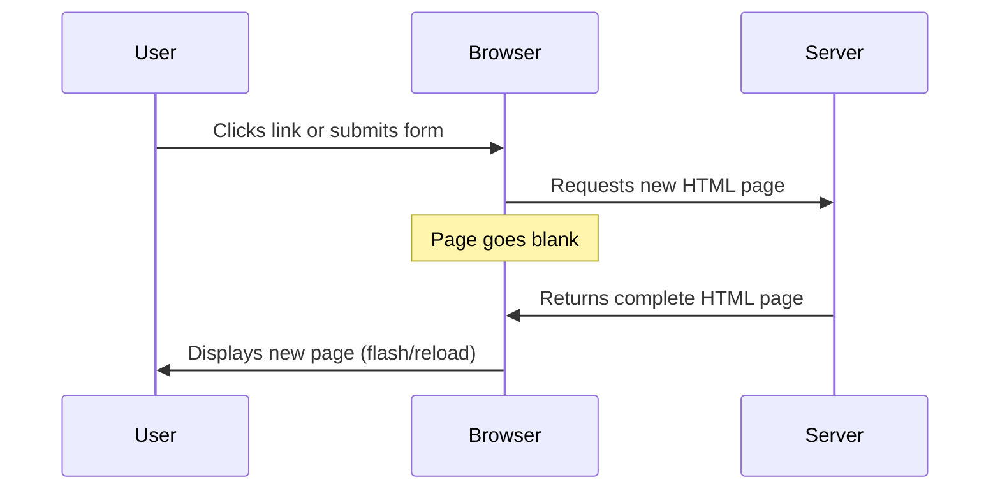
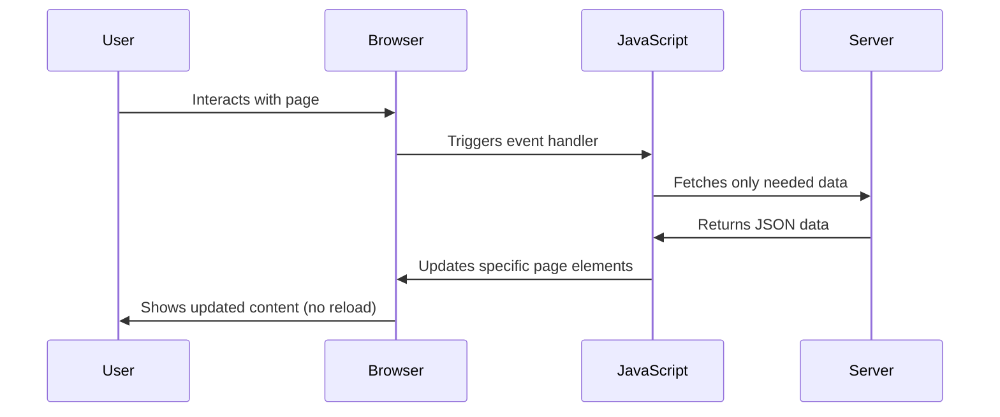
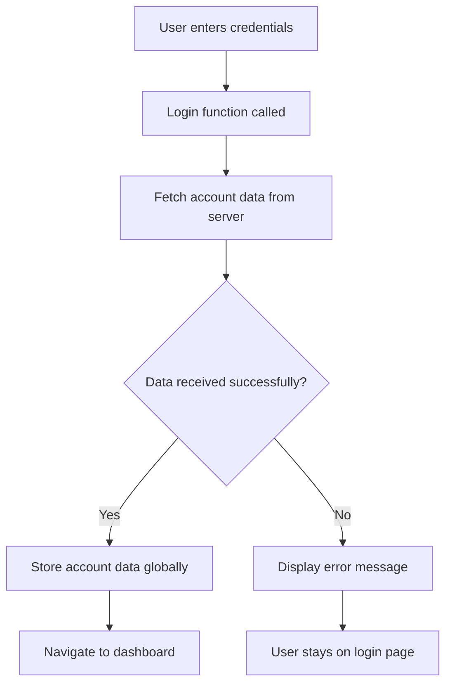
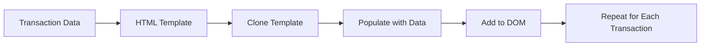

<!--
CO_OP_TRANSLATOR_METADATA:
{
  "original_hash": "2c1164912414820c8efd699b43f64954",
  "translation_date": "2025-10-22T16:19:03+00:00",
  "source_file": "7-bank-project/3-data/README.md",
  "language_code": "mr"
}
-->
# बँकिंग अ‍ॅप तयार करा भाग 3: डेटा मिळवण्याचे आणि वापरण्याचे पद्धती

स्टार ट्रेकमधील एंटरप्राइझच्या संगणकाचा विचार करा - जेव्हा कॅप्टन पिकार्ड जहाजाची स्थिती विचारतो, तेव्हा माहिती त्वरित दिसते, संपूर्ण इंटरफेस बंद न होता आणि पुन्हा तयार न होता. माहितीचा हा अखंड प्रवाहच आपण येथे तयार करत आहोत, डायनॅमिक डेटा मिळवून.

सध्या, तुमचे बँकिंग अ‍ॅप छापील वृत्तपत्रासारखे आहे - माहितीपूर्ण पण स्थिर. आपण ते नासाच्या मिशन कंट्रोलसारखे काहीतरी रूपांतरित करणार आहोत, जिथे डेटा सतत प्रवाहित होतो आणि वापरकर्त्याच्या कार्यप्रवाहात व्यत्यय न आणता रिअल-टाइममध्ये अपडेट होतो.

तुम्ही सर्व्हरशी असिंक्रोनसपणे संवाद साधणे, वेगवेगळ्या वेळेस येणारा डेटा हाताळणे आणि कच्च्या माहितीचे वापरकर्त्यांसाठी अर्थपूर्ण गोष्टींमध्ये रूपांतर करणे शिकाल. हे डेमो आणि उत्पादन-तयार सॉफ्टवेअरमधील फरक आहे.

## प्री-लेक्चर क्विझ

[प्री-लेक्चर क्विझ](https://ff-quizzes.netlify.app/web/quiz/45)

### पूर्वतयारी

डेटा मिळवण्याच्या प्रक्रियेत जाण्यापूर्वी, खालील घटक तयार असल्याची खात्री करा:

- **मागील धडा**: [लॉगिन आणि नोंदणी फॉर्म](../2-forms/README.md) पूर्ण करा - आपण या पायावर पुढे काम करू
- **लोकल सर्व्हर**: [Node.js](https://nodejs.org) इंस्टॉल करा आणि [सर्व्हर API चालवा](../api/README.md) खाते डेटा प्रदान करण्यासाठी
- **API कनेक्शन**: तुमच्या सर्व्हर कनेक्शनची चाचणी या कमांडने करा:

```bash
curl http://localhost:5000/api
# Expected response: "Bank API v1.0.0"
```

ही जलद चाचणी सर्व घटक योग्य प्रकारे संवाद साधत आहेत याची खात्री करते:
- तुमच्या सिस्टमवर Node.js योग्य प्रकारे चालत आहे याची पडताळणी करते
- तुमचा API सर्व्हर सक्रिय आहे आणि प्रतिसाद देत आहे याची पुष्टी करते
- तुमचे अ‍ॅप सर्व्हरपर्यंत पोहोचू शकते याची खात्री करते (मिशनपूर्व रेडिओ संपर्क तपासल्यासारखे)

---

## आधुनिक वेब अ‍ॅप्समध्ये डेटा मिळवण्याचे समजून घेणे

वेब अ‍ॅप्लिकेशन्स डेटा कसा हाताळतात यामध्ये गेल्या दोन दशकांत नाट्यमय बदल झाला आहे. आधुनिक तंत्रज्ञान जसे की AJAX आणि Fetch API का शक्तिशाली आहेत आणि ते वेब डेव्हलपर्ससाठी आवश्यक साधने का बनले आहेत हे समजून घेण्यासाठी ही उत्क्रांती समजून घेणे महत्त्वाचे आहे.

चला पारंपरिक वेबसाइट्स कशा कार्य करतात याची तुलना आपण आज तयार करत असलेल्या डायनॅमिक, प्रतिसादक्षम अ‍ॅप्लिकेशन्सशी करूया.

### पारंपरिक मल्टी-पेज अ‍ॅप्लिकेशन्स (MPA)

वेबच्या सुरुवातीच्या काळात, प्रत्येक क्लिक जुन्या टेलिव्हिजनवर चॅनेल बदलण्यासारखे होते - स्क्रीन रिक्त होई, नंतर नवीन सामग्रीमध्ये हळूहळू ट्यून होई. ही सुरुवातीच्या वेब अ‍ॅप्लिकेशन्सची वास्तविकता होती, जिथे प्रत्येक संवादाचा अर्थ संपूर्ण पृष्ठ पुन्हा तयार करणे होता.




**का ही पद्धत क्लंकी वाटली:**
- प्रत्येक क्लिकने संपूर्ण पृष्ठ पुन्हा तयार केले
- वापरकर्त्यांना विचारांच्या मध्यभागी त्रास झाला
- तुमचे इंटरनेट कनेक्शन पुन्हा पुन्हा समान हेडर आणि फूटर्स डाउनलोड करण्यात व्यस्त होते
- अ‍ॅप्स सॉफ्टवेअर वापरण्यापेक्षा फाइलिंग कॅबिनेटमधून क्लिक करण्यासारखे वाटले

### आधुनिक सिंगल-पेज अ‍ॅप्लिकेशन्स (SPA)

AJAX (Asynchronous JavaScript and XML) ने ही पद्धत पूर्णपणे बदलली. जसे आंतरराष्ट्रीय स्पेस स्टेशनचे मॉड्यूलर डिझाइन, जिथे अंतराळवीर संपूर्ण संरचना पुन्हा तयार न करता वैयक्तिक घटक बदलू शकतात, AJAX आम्हाला संपूर्ण वेबपृष्ठ पुन्हा लोड न करता विशिष्ट भाग अपडेट करण्याची परवानगी देते. नावात XMLचा उल्लेख असूनही, आपण आज प्रामुख्याने JSON वापरतो, परंतु मुख्य तत्त्व कायम आहे: फक्त जे बदलण्याची गरज आहे ते अपडेट करा.




**का SPAs अधिक चांगले वाटतात:**
- फक्त जे भाग प्रत्यक्षात बदलले ते अपडेट होतात (स्मार्ट, बरोबर?)
- त्रासदायक व्यत्यय नाहीत - तुमचे वापरकर्ते त्यांच्या प्रवाहात राहतात
- वायरवर कमी डेटा प्रवास करतो म्हणजे जलद लोडिंग
- सर्व काही तुमच्या फोनवरील अ‍ॅप्ससारखे जलद आणि प्रतिसादक्षम वाटते

### आधुनिक Fetch API कडे उत्क्रांती

आधुनिक ब्राउझर [`Fetch` API](https://developer.mozilla.org/docs/Web/API/Fetch_API) प्रदान करतात, जे जुन्या [`XMLHttpRequest`](https://developer.mozilla.org/docs/Web/API/XMLHttpRequest/Using_XMLHttpRequest) ची जागा घेतात. टेलिग्राफ ऑपरेट करण्याच्या आणि ईमेल वापरण्याच्या फरकासारखे, Fetch API स्वच्छ असिंक्रोनस कोडसाठी प्रॉमिसेस वापरते आणि JSON नैसर्गिकरित्या हाताळते.

| वैशिष्ट्य | XMLHttpRequest | Fetch API |
|---------|----------------|----------|
| **सिंटॅक्स** | क्लिष्ट कॉलबॅक-आधारित | स्वच्छ प्रॉमिस-आधारित |
| **JSON हाताळणी** | मॅन्युअल पार्सिंग आवश्यक | अंगभूत `.json()` पद्धत |
| **त्रुटी हाताळणी** | मर्यादित त्रुटी माहिती | व्यापक त्रुटी तपशील |
| **आधुनिक समर्थन** | वारसा सुसंगतता | ES6+ प्रॉमिसेस आणि async/await |

> 💡 **ब्राउझर सुसंगतता**: चांगली बातमी - Fetch API सर्व आधुनिक ब्राउझरमध्ये कार्य करते! तुम्हाला विशिष्ट आवृत्त्यांबद्दल उत्सुक असल्यास, [caniuse.com](https://caniuse.com/fetch) मध्ये संपूर्ण सुसंगतता कथा आहे.
> 
**तळटीप:**
- Chrome, Firefox, Safari, आणि Edge मध्ये उत्तम प्रकारे कार्य करते (म्हणजे तुमचे वापरकर्ते जिथे आहेत तिथे)
- फक्त Internet Explorer ला अतिरिक्त मदतीची गरज आहे (आणि प्रामाणिकपणे, IE सोडण्याची वेळ आली आहे)
- आपण नंतर वापरणार असलेल्या मोहक async/await पॅटर्नसाठी तुम्हाला उत्तम प्रकारे सेट करते

### वापरकर्ता लॉगिन आणि डेटा मिळवणे अंमलात आणणे

आता तुमच्या बँकिंग अ‍ॅपला स्थिर प्रदर्शनातून कार्यात्मक अ‍ॅप्लिकेशनमध्ये रूपांतरित करणारी लॉगिन प्रणाली अंमलात आणूया. जसे सुरक्षित लष्करी सुविधांमध्ये वापरले जाणारे प्रमाणीकरण प्रोटोकॉल, आपण वापरकर्त्याच्या क्रेडेन्शियल्सची पडताळणी करू आणि नंतर त्यांच्या विशिष्ट डेटावर प्रवेश प्रदान करू.

आम्ही हे टप्प्याटप्प्याने तयार करू, मूलभूत प्रमाणीकरणाने सुरुवात करून डेटा मिळवण्याच्या क्षमतेसह.

#### चरण 1: लॉगिन फंक्शन फाउंडेशन तयार करा

तुमच्या `app.js` फाइल उघडा आणि नवीन `login` फंक्शन जोडा. हे वापरकर्ता प्रमाणीकरण प्रक्रिया हाताळेल:

```javascript
async function login() {
  const loginForm = document.getElementById('loginForm');
  const user = loginForm.user.value;
}
```

**याचे विश्लेषण करूया:**
- `async` कीवर्ड? तो JavaScript ला सांगतो "अरे, या फंक्शनला कदाचित गोष्टींसाठी थांबावे लागेल"
- आम्ही पृष्ठावरून आमचा फॉर्म घेत आहोत (काहीही फॅन्सी नाही, फक्त त्याचा ID शोधत आहोत)
- नंतर आम्ही वापरकर्त्याने टाइप केलेले युजरनेम काढत आहोत
- एक छान ट्रिक: तुम्ही HTML मधील `name` अ‍ॅट्रिब्युटद्वारे कोणत्याही फॉर्म इनपुटमध्ये प्रवेश करू शकता - अतिरिक्त getElementById कॉल्सची गरज नाही!

> 💡 **फॉर्म ऍक्सेस पॅटर्न**: प्रत्येक फॉर्म कंट्रोलला त्याच्या नावाने (HTML मध्ये `name` अ‍ॅट्रिब्युट वापरून सेट केलेले) फॉर्म एलिमेंटच्या प्रॉपर्टी म्हणून प्रवेश करता येतो. हे फॉर्म डेटा मिळवण्याचा स्वच्छ, वाचनीय मार्ग प्रदान करते.

#### चरण 2: खाते डेटा मिळवण्याचे फंक्शन तयार करा

आता, आम्ही सर्व्हरवरून खाते डेटा मिळवण्यासाठी समर्पित फंक्शन तयार करू. हे तुमच्या नोंदणी फंक्शनसारखेच पॅटर्न अनुसरण करते पण डेटा मिळवण्यावर लक्ष केंद्रित करते:

```javascript
async function getAccount(user) {
  try {
    const response = await fetch('//localhost:5000/api/accounts/' + encodeURIComponent(user));
    return await response.json();
  } catch (error) {
    return { error: error.message || 'Unknown error' };
  }
}
```

**या कोडने काय साध्य केले आहे:**
- आधुनिक `fetch` API वापरून डेटा असिंक्रोनसपणे विनंती करतो
- युजरनेम पॅरामीटरसह GET विनंती URL तयार करतो
- URL मध्ये विशेष वर्ण सुरक्षितपणे हाताळण्यासाठी `encodeURIComponent()` लागू करतो
- प्रतिसाद JSON स्वरूपात रूपांतरित करतो जेणेकरून डेटा सहजपणे हाताळता येईल
- त्रुटी सौम्यपणे हाताळतो, क्रॅश होण्याऐवजी त्रुटी ऑब्जेक्ट परत करतो

> ⚠️ **सुरक्षा टीप**: `encodeURIComponent()` फंक्शन URL मध्ये विशेष वर्ण हाताळते. जसे नौदल संप्रेषण प्रणालींमध्ये वापरले जाणारे एन्कोडिंग, ते सुनिश्चित करते की तुमचा संदेश नेमका तसा पोहोचतो, "#" किंवा "&" सारखे वर्ण चुकीचे समजले जाण्यापासून प्रतिबंधित करते.
> 
**याचे महत्त्व:**
- विशेष वर्ण URL तोडण्यापासून प्रतिबंधित करते
- URL मॅनिप्युलेशन हल्ल्यांपासून संरक्षण करते
- तुमच्या सर्व्हरला इच्छित डेटा प्राप्त होतो याची खात्री करते
- सुरक्षित कोडिंग पद्धतींचे अनुसरण करते

#### HTTP GET विनंत्या समजून घेणे

तुम्हाला आश्चर्य वाटेल: जेव्हा तुम्ही `fetch` अतिरिक्त पर्यायांशिवाय वापरता, तेव्हा ते आपोआप [`GET`](https://developer.mozilla.org/docs/Web/HTTP/Methods/GET) विनंती तयार करते. हे आपल्यासाठी योग्य आहे - सर्व्हरला विचारणे "अरे, मी या वापरकर्त्याचा खाते डेटा पाहू शकतो का?"

GET विनंत्या पुस्तकालयातून पुस्तक उधार घेण्यासारख्या आहेत - तुम्ही आधीच अस्तित्वात असलेल्या गोष्टी पाहण्याची विनंती करत आहात. POST विनंत्या (ज्या आपण नोंदणीसाठी वापरल्या) संग्रहात जोडण्यासाठी नवीन पुस्तक सबमिट करण्यासारख्या आहेत.

| GET विनंती | POST विनंती |
|-------------|-------------|
| **उद्देश** | विद्यमान डेटा मिळवा | सर्व्हरला नवीन डेटा पाठवा |
| **पॅरामीटर्स** | URL पथ/क्वेरी स्ट्रिंगमध्ये | विनंती बॉडीमध्ये |
| **कॅशिंग** | ब्राउझरद्वारे कॅश केले जाऊ शकते | सामान्यतः कॅश केले जात नाही |
| **सुरक्षा** | URL/लॉगमध्ये दृश्यमान | विनंती बॉडीमध्ये लपलेले |

#### चरण 3: सर्व काही एकत्र आणणे

आता समाधानकारक भाग - चला तुमच्या खाते मिळवण्याच्या फंक्शनला लॉगिन प्रक्रियेशी जोडूया. येथे सर्व काही एकत्र येते:

```javascript
async function login() {
  const loginForm = document.getElementById('loginForm');
  const user = loginForm.user.value;
  const data = await getAccount(user);

  if (data.error) {
    return console.log('loginError', data.error);
  }

  account = data;
  navigate('/dashboard');
}
```

हे फंक्शन स्पष्ट क्रम अनुसरण करते:
- फॉर्म इनपुटमधून युजरनेम काढा
- सर्व्हरकडून वापरकर्त्याचा खाते डेटा विनंती करा
- प्रक्रियेदरम्यान उद्भवलेल्या कोणत्याही त्रुटी हाताळा
- खाते डेटा संग्रहित करा आणि यशस्वी लॉगिननंतर डॅशबोर्डवर जा

> 🎯 **Async/Await पॅटर्न**: कारण `getAccount` हे असिंक्रोनस फंक्शन आहे, आम्ही `await` कीवर्ड वापरतो जेणेकरून सर्व्हर प्रतिसाद देईपर्यंत अंमलबजावणी थांबते. हे कोड अनिर्दिष्ट डेटासह पुढे जाण्यापासून प्रतिबंधित करते.

#### चरण 4: तुमच्या डेटासाठी घर तयार करणे

तुमच्या अ‍ॅपला एक जागा हवी जिथे लोड झाल्यानंतर खाते माहिती लक्षात ठेवता येईल. याला तुमच्या अ‍ॅपची अल्पकालीन स्मृती समजा - सध्याच्या वापरकर्त्याचा डेटा सोयीस्कर ठेवण्यासाठी एक जागा. तुमच्या `app.js` फाइलच्या शीर्षस्थानी ही ओळ जोडा:

```javascript
// This holds the current user's account data
let account = null;
```

**आपल्याला याची आवश्यकता का आहे:**
- तुमच्या अ‍ॅपमधील कोणत्याही ठिकाणाहून खाते डेटा प्रवेशयोग्य ठेवते
- `null` सह प्रारंभ करणे म्हणजे "कोणीही अद्याप लॉग इन केलेले नाही"
- कोणी यशस्वीरित्या लॉग इन किंवा नोंदणी केल्यावर अपडेट होते
- सत्याचा एकच स्रोत म्हणून कार्य करते - कोण लॉग इन आहे याबद्दल गोंधळ नाही

#### चरण 5: तुमचा फॉर्म वायर करा

आता तुमच्या नवीन चमकदार लॉगिन फंक्शनला तुमच्या HTML फॉर्मशी कनेक्ट करूया. तुमचा फॉर्म टॅग असे अपडेट करा:

```html
<form id="loginForm" action="javascript:login()">
  <!-- Your existing form inputs -->
</form>
```

**या छोट्या बदलाने काय होते:**
- फॉर्मला त्याचे डीफॉल्ट "संपूर्ण पृष्ठ पुन्हा लोड करा" वर्तन थांबवते
- त्याऐवजी तुमचे कस्टम JavaScript फंक्शन कॉल करते
- सर्व काही गुळगुळीत आणि सिंगल-पेज-अ‍ॅपसारखे ठेवते
- वापरकर्त्यांनी "लॉगिन" दाबल्यावर काय होते यावर तुम्हाला पूर्ण नियंत्रण देते

#### चरण 6: तुमच्या नोंदणी फंक्शनला सुधारित करा

सुसंगततेसाठी, तुमचे `register` फंक्शन देखील खाते डेटा संग्रहित करण्यासाठी आणि डॅशबोर्डवर नेव्हिगेट करण्यासाठी अपडेट करा:

```javascript
// Add these lines at the end of your register function
account = result;
navigate('/dashboard');
```

**या सुधारिततेने प्रदान केले:**
- नोंदणीपासून डॅशबोर्डपर्यंत **सहज** संक्रमण
- लॉगिन आणि नोंदणी प्रवाहांमध्ये **सुसंगत** वापरकर्ता अनुभव
- यशस्वी नोंदणीनंतर खाते डेटावर **तत्काळ** प्रवेश

#### तुमच्या अंमलबजावणीची चाचणी



**चाचणी घेण्याची वेळ:**
1. सर्व काही कार्यरत आहे याची खात्री करण्यासाठी नवीन खाते तयार करा
2. त्याच क्रेडेन्शियल्ससह लॉगिन करण्याचा प्रयत्न करा
3. काहीतरी चुकीचे वाटल्यास तुमच्या ब्राउझरचा कन्सोल (F12) पहा
4. यशस्वी लॉगिननंतर तुम्ही डॅशबोर्डवर पोहोचला याची खात्री करा

काहीतरी कार्य करत नसेल तर घाबरू नका! बहुतेक समस्या सोप्या दुरुस्त्या आहेत जसे की टायपो किंवा API सर्व्हर सुरू करण्यास विसरणे.

#### क्रॉस-ऑरिजिन मॅजिकबद्दल एक जलद शब्द

तुम्हाला आश्चर्य वाटेल: "माझे वेब अ‍ॅप वेगवेगळ्या पोर्टवर चालत असलेल्या या API सर्व्हरशी कसे बोलत आहे?" उत्तम प्रश्न! हे प्रत्येक वेब डेव्हलपरला शेवटी सामोरे जावे लागते.

> 🔒 **क्रॉस-ऑरिजिन सुरक्षा**: ब्राउझर "समान-ऑरिजिन पॉलिसी" लागू करतात जे वेगवेगळ्या डोमेनमधील अनधिकृत संवाद रोखण्यासाठी. पेंटागॉनमधील चेकपॉइंट सिस्टमसारखे, ते डेटा ट्रान्सफर करण्यापूर्वी संवाद अधिकृत असल्याची पडताळणी करतात.
> 
**आमच्या सेटअपमध्ये:**
- तुमचे वेब अ‍ॅप `localhost:3000` वर चालते (डेव्हलपमेंट सर्व्हर)
- तुमचा API सर्व्हर `localhost:5000` वर चालतो (बॅकएंड सर्व्हर)
- API सर्व्हर [CORS हेडर्स](https://developer.mozilla.org/docs/Web/HTTP/CORS) समाविष्ट करतो जे तुमच्या वेब अ‍ॅपकडून संवाद
अधिक जटिल सामग्रीसाठी, [`document.createElement()`](https://developer.mozilla.org/docs/Web/API/Document/createElement) आणि [`append()`](https://developer.mozilla.org/docs/Web/API/ParentNode/append) पद्धती एकत्र करा:

```javascript
// Safe way to create new elements
const transactionItem = document.createElement('div');
transactionItem.className = 'transaction-item';
transactionItem.textContent = `${transaction.date}: ${transaction.description}`;
container.append(transactionItem);
```

**या दृष्टिकोनाची समज:**
- **नवीन DOM घटक** प्रोग्रामॅटिक पद्धतीने तयार करतो
- **घटकांचे गुणधर्म आणि सामग्रीवर** पूर्ण नियंत्रण ठेवतो
- **जटिल, नेस्टेड घटक संरचना** तयार करण्यास अनुमती देतो
- **सुरक्षितता राखतो** कारण संरचना आणि सामग्री वेगळी ठेवली जाते

> ⚠️ **सुरक्षिततेचा विचार**: जरी [`innerHTML`](https://developer.mozilla.org/docs/Web/API/Element/innerHTML) अनेक ट्युटोरियल्समध्ये दिसते, तरी ते एम्बेड केलेल्या स्क्रिप्ट्स चालवू शकते. CERN मधील सुरक्षा प्रोटोकॉल्सप्रमाणे जे अनधिकृत कोड कार्यान्वित होण्यापासून प्रतिबंधित करतात, `textContent` आणि `createElement` वापरणे सुरक्षित पर्याय प्रदान करते.
> 
**innerHTML चा धोका:**
- वापरकर्ता डेटामधील कोणत्याही `<script>` टॅग्स कार्यान्वित करते
- कोड इंजेक्शन हल्ल्यांसाठी असुरक्षित
- संभाव्य सुरक्षा त्रुटी निर्माण करते
- आम्ही वापरत असलेले सुरक्षित पर्याय समतुल्य कार्यक्षमता प्रदान करतात

### त्रुटी वापरकर्त्यास अनुकूल बनवणे

सध्या, लॉगिन त्रुटी फक्त ब्राउझर कन्सोलमध्ये दिसतात, जे वापरकर्त्यांसाठी अदृश्य आहे. जसे पायलटच्या अंतर्गत डायग्नोस्टिक्स आणि प्रवाशांच्या माहिती प्रणालीमधील फरक, तसेच आम्हाला योग्य चॅनेलद्वारे महत्त्वाची माहिती संवाद साधणे आवश्यक आहे.

दृश्यमान त्रुटी संदेश लागू करणे वापरकर्त्यांना काय चुकले आणि पुढे कसे जायचे याबद्दल त्वरित अभिप्राय प्रदान करते.

#### चरण 1: त्रुटी संदेशांसाठी जागा तयार करा

सर्वप्रथम, आपल्या HTML मध्ये त्रुटी संदेशांसाठी जागा तयार करा. हे आपल्या लॉगिन बटणाच्या अगोदर जोडा जेणेकरून वापरकर्त्यांना ते सहज दिसेल:

```html
<!-- This is where error messages will appear -->
<div id="loginError" role="alert"></div>
<button>Login</button>
```

**येथे काय घडत आहे:**
- आम्ही एक रिक्त कंटेनर तयार करत आहोत जो आवश्यकतेपर्यंत अदृश्य राहतो
- हे "लॉगिन" क्लिक केल्यानंतर वापरकर्त्यांनी नैसर्गिकरित्या पाहिलेल्या ठिकाणी ठेवले आहे
- स्क्रीन रीडर्ससाठी `role="alert"` एक चांगला पर्याय आहे - हे सहाय्यक तंत्रज्ञानाला सांगते "हे महत्त्वाचे आहे!"
- अनन्य `id` आमच्या JavaScript ला सोपे लक्ष्य प्रदान करते

#### चरण 2: एक उपयुक्त सहाय्यक फंक्शन तयार करा

चला एक छोटी युटिलिटी फंक्शन तयार करू जी कोणत्याही घटकाचा मजकूर अपडेट करू शकते. हे "एकदा लिहा, सर्वत्र वापरा" प्रकारचे फंक्शन आहे जे आपला वेळ वाचवेल:

```javascript
function updateElement(id, text) {
  const element = document.getElementById(id);
  element.textContent = text;
}
```

**फंक्शनचे फायदे:**
- फक्त घटक ID आणि मजकूर सामग्री आवश्यक असलेला सोपा इंटरफेस
- DOM घटक सुरक्षितपणे शोधतो आणि अपडेट करतो
- कोड डुप्लिकेशन कमी करणारा पुनर्वापरयोग्य नमुना
- अनुप्रयोगामध्ये सुसंगत अद्यतन वर्तन राखतो

#### चरण 3: त्रुटी वापरकर्त्यांना दिसेल अशा ठिकाणी दाखवा

आता त्या लपलेल्या कन्सोल संदेशाला काहीतरी वापरकर्त्यांना प्रत्यक्षात दिसेल अशा गोष्टीने बदला. आपले लॉगिन फंक्शन अपडेट करा:

```javascript
// Instead of just logging to console, show the user what's wrong
if (data.error) {
  return updateElement('loginError', data.error);
}
```

**हा छोटासा बदल मोठा फरक करतो:**
- त्रुटी संदेश वापरकर्त्यांनी पाहिलेल्या ठिकाणी दिसतात
- गूढ शांत अपयश नाही
- वापरकर्त्यांना त्वरित, कृतीयोग्य अभिप्राय मिळतो
- आपला अॅप व्यावसायिक आणि विचारशील वाटू लागतो

आता जेव्हा आपण अवैध खाते वापरून चाचणी करता, तेव्हा आपल्याला पृष्ठावरच एक उपयुक्त त्रुटी संदेश दिसेल!


#### चरण 4: समावेशकता आणि अॅक्सेसिबिलिटी

आम्ही पूर्वी जोडलेल्या `role="alert"` बद्दल एक छान गोष्ट आहे - ते फक्त सजावट नाही! हे छोटे गुणधर्म [Live Region](https://developer.mozilla.org/docs/Web/Accessibility/ARIA/ARIA_Live_Regions) तयार करते जे स्क्रीन रीडर्सना त्वरित बदलांची घोषणा करते:

```html
<div id="loginError" role="alert"></div>
```

**हे का महत्त्वाचे आहे:**
- स्क्रीन रीडर वापरकर्त्यांना त्रुटी संदेश दिसताच ऐकायला मिळतो
- प्रत्येकाला महत्त्वाची माहिती मिळते, ते कसे नेव्हिगेट करतात याची पर्वा न करता
- आपला अॅप अधिक लोकांसाठी कार्य करण्यासाठी एक साधा मार्ग
- समावेशक अनुभव तयार करण्याची काळजी दाखवते

अशा छोट्या गोष्टी चांगल्या डेव्हलपर्सना महान बनवतात!

#### चरण 5: नोंदणीसाठी समान नमुना लागू करा

सुसंगततेसाठी, आपल्या नोंदणी फॉर्ममध्ये समान त्रुटी हाताळणी लागू करा:

1. **नोंदणी HTML मध्ये** त्रुटी प्रदर्शन घटक जोडा:
```html
<div id="registerError" role="alert"></div>
```

2. **आपले नोंदणी फंक्शन** समान त्रुटी प्रदर्शन नमुना वापरण्यासाठी अपडेट करा:
```javascript
if (data.error) {
  return updateElement('registerError', data.error);
}
```

**सुसंगत त्रुटी हाताळणीचे फायदे:**
- **सर्व फॉर्ममध्ये** एकसमान वापरकर्ता अनुभव प्रदान करते
- **परिचित नमुने वापरून** संज्ञानात्मक भार कमी करते
- **पुनर्वापरयोग्य कोडसह** देखभाल सुलभ करते
- **अॅक्सेसिबिलिटी मानकांचे** अनुप्रयोगभर पालन सुनिश्चित करते

## आपला डायनॅमिक डॅशबोर्ड तयार करणे

आता आपण आपला स्थिर डॅशबोर्ड वास्तविक खाते डेटा प्रदर्शित करणाऱ्या डायनॅमिक इंटरफेसमध्ये रूपांतरित करू. जसे मुद्रित फ्लाइट वेळापत्रक आणि विमानतळांवरील थेट प्रस्थान बोर्डांमधील फरक, तसेच आपण स्थिर माहितीपासून वास्तविक-वेळ, प्रतिसादात्मक प्रदर्शनाकडे जात आहोत.

आपण शिकलेल्या DOM मॅनिप्युलेशन तंत्रांचा वापर करून, आम्ही एक डॅशबोर्ड तयार करू जो स्वयंचलितपणे चालू खाते माहितीने अपडेट होतो.

### आपला डेटा समजून घेणे

आम्ही तयार करण्यास सुरुवात करण्यापूर्वी, आपला सर्व्हर कोणत्या प्रकारचा डेटा परत पाठवतो ते पाहू. जेव्हा कोणी यशस्वीरित्या लॉगिन करते, तेव्हा आपल्याला काम करण्यासाठी माहितीचा खजिना मिळतो:

```json
{
  "user": "test",
  "currency": "$",
  "description": "Test account",
  "balance": 75,
  "transactions": [
    { "id": "1", "date": "2020-10-01", "object": "Pocket money", "amount": 50 },
    { "id": "2", "date": "2020-10-03", "object": "Book", "amount": -10 },
    { "id": "3", "date": "2020-10-04", "object": "Sandwich", "amount": -5 }
  ]
}
```

**या डेटा संरचनेत समाविष्ट आहे:**
- **`user`**: अनुभव वैयक्तिकृत करण्यासाठी योग्य ("पुन्हा स्वागत आहे, सारा!")
- **`currency`**: पैसे योग्य प्रकारे प्रदर्शित करण्यासाठी सुनिश्चित करते
- **`description`**: खात्यासाठी एक मैत्रीपूर्ण नाव
- **`balance`**: सर्वात महत्त्वाचा चालू शिल्लक
- **`transactions`**: सर्व तपशीलांसह संपूर्ण व्यवहार इतिहास

आपल्या व्यावसायिक-दिसणाऱ्या बँकिंग डॅशबोर्ड तयार करण्यासाठी आवश्यक सर्वकाही!

> 💡 **प्रो टिप**: आपला डॅशबोर्ड त्वरित क्रियाशील पाहायचा आहे? लॉगिन करताना `test` वापरकर्तानाव वापरा - ते नमुना डेटासह प्री-लोड केलेले आहे जेणेकरून आपल्याला प्रथम व्यवहार तयार न करता सर्वकाही कार्यरत दिसेल.
> 
**टेस्ट अकाउंट का उपयुक्त आहे:**
- यामध्ये आधीच वास्तववादी नमुना डेटा लोड केलेला आहे
- व्यवहार कसे प्रदर्शित होतात ते पाहण्यासाठी योग्य
- आपले डॅशबोर्ड वैशिष्ट्ये चाचणीसाठी उत्कृष्ट
- आपल्याला मॅन्युअली डमी डेटा तयार करण्यापासून वाचवते

### डॅशबोर्ड प्रदर्शन घटक तयार करणे

चला आपल्या डॅशबोर्ड इंटरफेसची पायरी-पायरीने रचना करू, खाते सारांश माहितीपासून सुरुवात करून आणि नंतर व्यवहार यादीसारख्या अधिक जटिल वैशिष्ट्यांकडे जाऊ.

#### चरण 1: आपली HTML रचना अपडेट करा

सर्वप्रथम, स्थिर "शिल्लक" विभाग डायनॅमिक प्लेसहोल्डर घटकांसह बदला जे आपले JavaScript भरू शकते:

```html
<section>
  Balance: <span id="balance"></span><span id="currency"></span>
</section>
```

यानंतर, खाते वर्णनासाठी एक विभाग जोडा. कारण हे डॅशबोर्ड सामग्रीसाठी शीर्षक म्हणून कार्य करते, सेमॅंटिक HTML वापरा:

```html
<h2 id="description"></h2>
```

**HTML रचना समजून घेणे:**
- **शिल्लक आणि चलनासाठी** स्वतंत्र `<span>` घटक वापरते वैयक्तिक नियंत्रणासाठी
- **प्रत्येक घटकासाठी** अनन्य IDs लागू करते JavaScript लक्ष्यीकरणासाठी
- **सेमॅंटिक HTML अनुसरण करते** `<h2>` खाते वर्णनासाठी वापरून
- **स्क्रीन रीडर्स आणि SEO साठी** एक तार्किक श्रेणी तयार करते

> ✅ **अॅक्सेसिबिलिटी अंतर्दृष्टी**: खाते वर्णन डॅशबोर्ड सामग्रीसाठी शीर्षक म्हणून कार्य करते, म्हणून ते सेमॅंटिकपणे शीर्षक म्हणून चिन्हांकित केले आहे. [शीर्षक रचना](https://www.nomensa.com/blog/2017/how-structure-headings-web-accessibility) अॅक्सेसिबिलिटीवर कसा परिणाम करते याबद्दल अधिक जाणून घ्या. आपल्या पृष्ठावरील इतर कोणते घटक शीर्षक टॅग्सचा लाभ घेऊ शकतात ते ओळखू शकता का?

#### चरण 2: डॅशबोर्ड अपडेट फंक्शन तयार करा

आता एक फंक्शन तयार करा जे वास्तविक खाते डेटासह आपला डॅशबोर्ड भरते:

```javascript
function updateDashboard() {
  if (!account) {
    return navigate('/login');
  }

  updateElement('description', account.description);
  updateElement('balance', account.balance.toFixed(2));
  updateElement('currency', account.currency);
}
```

**हे फंक्शन काय करते याचे चरण-दर-चरण विश्लेषण:**
- **पुष्टी करते** की खाते डेटा अस्तित्वात आहे
- **प्रमाणित वापरकर्त्यांना** लॉगिन पृष्ठावर पुनर्निर्देशित करते
- **पुनर्वापरयोग्य `updateElement` फंक्शन वापरून** खाते वर्णन अपडेट करते
- **शिल्लक नेहमी दोन दशांश स्थान दर्शविण्यासाठी स्वरूपित करते**
- **योग्य चलन चिन्ह प्रदर्शित करते**

> 💰 **पैशाचे स्वरूपन**: [`toFixed(2)`](https://developer.mozilla.org/docs/Web/JavaScript/Reference/Global_Objects/Number/toFixed) पद्धत खूप उपयुक्त आहे! हे सुनिश्चित करते की आपली शिल्लक नेहमी वास्तविक पैशासारखी दिसते - "75.00" ऐवजी फक्त "75". आपल्या वापरकर्त्यांना परिचित चलन स्वरूपन पाहून आनंद होईल.

#### चरण 3: आपला डॅशबोर्ड अपडेट होत असल्याची खात्री करा

आपला डॅशबोर्ड प्रत्येक वेळी कोणीही त्याला भेट देतो तेव्हा चालू डेटासह ताजेतवाने होतो याची खात्री करण्यासाठी, आपल्याला आपल्या नेव्हिगेशन सिस्टममध्ये हुक करणे आवश्यक आहे. आपण [पाठ 1 असाइनमेंट](../1-template-route/assignment.md) पूर्ण केली असल्यास, हे परिचित वाटेल. अन्यथा, काळजी करू नका - आपल्याला काय आवश्यक आहे ते येथे आहे:

आपल्या `updateRoute()` फंक्शनच्या शेवटी हे जोडा:

```javascript
if (typeof route.init === 'function') {
  route.init();
}
```

यानंतर आपल्या मार्गांमध्ये डॅशबोर्ड प्रारंभ समाविष्ट करण्यासाठी अपडेट करा:

```javascript
const routes = {
  '/login': { templateId: 'login' },
  '/dashboard': { templateId: 'dashboard', init: updateDashboard }
};
```

**हे हुशार सेटअप काय करते:**
- तपासते की मार्गामध्ये विशेष प्रारंभ कोड आहे का
- मार्ग लोड झाल्यावर तो कोड स्वयंचलितपणे चालवते
- सुनिश्चित करते की आपला डॅशबोर्ड नेहमी ताजे, चालू डेटा दर्शवतो
- आपली रूटिंग लॉजिक स्वच्छ आणि व्यवस्थित ठेवते

#### आपला डॅशबोर्ड चाचणी करणे

या बदलांची अंमलबजावणी केल्यानंतर, आपला डॅशबोर्ड चाचणी करा:

1. **टेस्ट अकाउंटसह लॉगिन करा**
2. **आपण डॅशबोर्डवर पुनर्निर्देशित झाल्याची पुष्टी करा**
3. **खाते वर्णन, शिल्लक आणि चलन योग्यरित्या प्रदर्शित होत असल्याची खात्री करा**
4. **लॉगआउट आणि पुन्हा लॉगिन करून डेटा योग्यरित्या ताजेतवाने होत असल्याची खात्री करा**

आपला डॅशबोर्ड आता लॉगिन केलेल्या वापरकर्त्याच्या डेटावर आधारित डायनॅमिक खाते माहिती प्रदर्शित करावा!

## टेम्पलेट्ससह स्मार्ट व्यवहार यादी तयार करणे

प्रत्येक व्यवहारासाठी मॅन्युअली HTML तयार करण्याऐवजी, आम्ही टेम्पलेट्स वापरून स्वयंचलितपणे सुसंगत स्वरूपन तयार करू. जसे अंतराळ यान उत्पादनामध्ये वापरले जाणारे मानकीकृत घटक, तसेच टेम्पलेट्स प्रत्येक व्यवहार रांगेसाठी समान संरचना आणि स्वरूपन सुनिश्चित करतात.

हे तंत्र काही व्यवहारांपासून हजारोपर्यंत कार्यक्षमतेने स्केल करते, सुसंगत कार्यक्षमता आणि सादरीकरण राखते.



### चरण 1: व्यवहार टेम्पलेट तयार करा

सर्वप्रथम, आपल्या HTML `<body>` मध्ये व्यवहार रांगेसाठी पुनर्वापरयोग्य टेम्पलेट जोडा:

```html
<template id="transaction">
  <tr>
    <td></td>
    <td></td>
    <td></td>
  </tr>
</template>
```

**HTML टेम्पलेट्स समजून घेणे:**
- **एकल टेबल रांगेसाठी** संरचना परिभाषित करते
- **JavaScript द्वारे क्लोन आणि भरले जाण्यापर्यंत** अदृश्य राहते
- **तारीख, वर्णन आणि रक्कमसाठी** तीन सेल्स समाविष्ट करते
- **सुसंगत स्वरूपनासाठी** पुनर्वापरयोग्य नमुना प्रदान करते

### चरण 2: डायनॅमिक सामग्रीसाठी आपली टेबल तयार करा

यानंतर, आपल्या टेबल बॉडीला `id` जोडा जेणेकरून JavaScript सहजपणे लक्ष्य करू शकेल:

```html
<tbody id="transactions"></tbody>
```

**हे काय साध्य करते:**
- **व्यवहार रांगा घालण्यासाठी** स्पष्ट लक्ष्य तयार करते
- **टेबल संरचना आणि डायनॅमिक सामग्री वेगळी ठेवते**
- **व्यवहार डेटा सहजपणे साफ आणि पुन्हा भरण्यास सक्षम करते**

### चरण 3: व्यवहार रांगा तयार करणारे फॅक्टरी फंक्शन तयार करा

आता एक फंक्शन तयार करा जे व्यवहार डेटा HTML घटकांमध्ये रूपांतरित करते:

```javascript
function createTransactionRow(transaction) {
  const template = document.getElementById('transaction');
  const transactionRow = template.content.cloneNode(true);
  const tr = transactionRow.querySelector('tr');
  tr.children[0].textContent = transaction.date;
  tr.children[1].textContent = transaction.object;
  tr.children[2].textContent = transaction.amount.toFixed(2);
  return transactionRow;
}
```

**या फॅक्टरी फंक्शनचे विश्लेषण:**
- **टेम्पलेट घटक त्याच्या ID द्वारे शोधते**
- **सुरक्षित हेरफेरसाठी टेम्पलेट सामग्री क्लोन करते**
- **क्लोन केलेल्या सामग्रीमधील टेबल रांग निवडते**
- **प्रत्येक सेल व्यवहार डेटाने भरते**
- **रक्कम योग्य दशांश स्थान दर्शविण्यासाठी स्वरूपित करते**
- **घालण्यासाठी तयार पूर्ण रांग परत करते**

### चरण 4: अनेक व्यवहार रांगा कार्यक्षमतेने तयार करा

आपल्या `updateDashboard()` फंक्शनमध्ये हे कोड जोडा जेणेकरून सर्व व्यवहार प्रदर्शित होतील:

```javascript
const transactionsRows = document.createDocumentFragment();
for (const transaction of account.transactions) {
  const transactionRow = createTransactionRow(transaction);
  transactionsRows.appendChild(transactionRow);
}
updateElement('transactions', transactionsRows);
```

**या कार्यक्षम दृष्टिकोनाची समज:**
- **DOM ऑपरेशन्स बॅच करण्यासाठी** दस्तऐवज फ्रॅगमेंट तयार करते
- **खाते डेटामधील सर्व व्यवहारांमधून** पुनरावृत्ती करते
- **फॅक्टरी फंक्शन वापरून** प्रत्येक व्यवहारासाठी रांग तयार करते
- **सर्व रांगा फ्रॅगमेंटमध्ये गोळा करते आणि नंतर DOM मध्ये जोडते**
- **अनेक वैयक्तिक घालण्याऐवजी** एकच DOM अपडेट करते

> ⚡ **कार्यक्षमता ऑप्टिमायझेशन**: [`document.createDocumentFragment()`](https://developer.mozilla.org/docs/Web/API/Document/createDocumentFragment) बोईंगच्या असेंबली प्रक्रियेसारखे कार्य करते - घटक मुख्य लाइनवर तयार केले जातात आणि नंतर पूर्ण युनिट म्हणून स्थापित केले जातात. ही बॅचिंग पद्धत अनेक वैयक्तिक ऑपरेशन्सऐवजी एकच घालण्याद्वारे DOM रीफ्लो कमी करते.

### चरण 5: मिश्रित सामग्रीसाठी अपडेट फंक्शन सुधारित करा

आपले `updateElement()` फंक्शन सध्या फक्त मजकूर सामग्री हाताळते. ते मजकूर आणि DOM नोड्स दोन्ही कार्य करण्यासाठी अपडेट करा:

```javascript
function updateElement(id, textOrNode) {
  const element = document.getElementById(id);
  element.textContent = ''; // Removes all children
  element.append(textOrNode);
}
```

**या अपडेटमधील मुख्य
**प्रॉम्प्ट:** बँकिंग अ‍ॅपसाठी शोध कार्यक्षमता तयार करा ज्यामध्ये समाविष्ट आहे: 1) तारीख श्रेणी (पासून/पर्यंत), किमान/कमाल रक्कम, आणि व्यवहार वर्णन कीवर्डसाठी इनपुट फील्डसह शोध फॉर्म, 2) `filterTransactions()` फंक्शन जे शोध निकषांवर आधारित account.transactions अ‍ॅरे फिल्टर करते, 3) `updateDashboard()` फंक्शन अद्यतनित करा जेणेकरून फिल्टर केलेले निकाल दाखवता येतील, आणि 4) "Clear Filters" बटण जोडा ज्यामुळे दृश्य रीसेट करता येईल. आधुनिक JavaScript अ‍ॅरे पद्धती जसे की `filter()` वापरा आणि रिक्त शोध निकषांसाठी एज केस हाताळा.

[agent mode](https://code.visualstudio.com/blogs/2025/02/24/introducing-copilot-agent-mode) बद्दल अधिक जाणून घ्या.

## 🚀 आव्हान

तुमच्या बँकिंग अ‍ॅपला पुढच्या स्तरावर नेण्यासाठी तयार आहात का? ते काहीतरी आकर्षक आणि वापरण्यास सोपे वाटेल असे बनवूया. तुमच्या सर्जनशीलतेला प्रेरणा देण्यासाठी काही कल्पना येथे दिल्या आहेत:

**ते सुंदर बनवा**: CSS स्टाइलिंग जोडा ज्यामुळे तुमचा कार्यशील डॅशबोर्ड काहीतरी आकर्षक दिसेल. स्वच्छ रेषा, चांगले अंतर, आणि कदाचित काही सूक्ष्म अ‍ॅनिमेशन विचारात घ्या.

**ते प्रतिसादक्षम बनवा**: [मीडिया क्वेरीज](https://developer.mozilla.org/docs/Web/CSS/Media_Queries) वापरून [प्रतिसादक्षम डिझाइन](https://developer.mozilla.org/docs/Web/Progressive_web_apps/Responsive/responsive_design_building_blocks) तयार करण्याचा प्रयत्न करा जे फोन, टॅब्लेट आणि डेस्कटॉपवर उत्तम प्रकारे कार्य करते. तुमचे वापरकर्ते तुमचे आभार मानतील!

**थोडी चमक जोडा**: व्यवहारांना रंग-कोडिंग विचारात घ्या (उत्पन्नासाठी हिरवा, खर्चासाठी लाल), आयकॉन जोडा, किंवा इंटरफेस परस्परसंवादी वाटेल असे हवर इफेक्ट तयार करा.

पॉलिश केलेल्या डॅशबोर्डचे उदाहरण कसे दिसू शकते ते येथे आहे:


तुम्हाला हे अचूकपणे जुळवायचे आहे असे वाटत नाही - याचा प्रेरणेसाठी वापर करा आणि ते तुमच्या पद्धतीने तयार करा!

## व्याख्यानानंतरचा क्विझ

[व्याख्यानानंतरचा क्विझ](https://ff-quizzes.netlify.app/web/quiz/46)

## असाइनमेंट

[तुमचा कोड पुनर्रचना करा आणि त्यावर टिप्पणी द्या](assignment.md)

---

**अस्वीकरण**:  
हा दस्तऐवज AI भाषांतर सेवा [Co-op Translator](https://github.com/Azure/co-op-translator) वापरून भाषांतरित करण्यात आला आहे. आम्ही अचूकतेसाठी प्रयत्नशील असलो तरी कृपया लक्षात ठेवा की स्वयंचलित भाषांतरे त्रुटी किंवा अचूकतेचा अभाव असू शकतात. मूळ भाषेतील दस्तऐवज हा अधिकृत स्रोत मानला जावा. महत्त्वाच्या माहितीसाठी व्यावसायिक मानवी भाषांतराची शिफारस केली जाते. या भाषांतराचा वापर करून झालेल्या कोणत्याही गैरसमज किंवा चुकीच्या अर्थासाठी आम्ही जबाबदार राहणार नाही.