# बँकिंग अ‍ॅप तयार करा भाग 3: डेटा मिळवण्याचे आणि वापरण्याचे पद्धती

स्टार ट्रेकमधील एंटरप्राइझचा संगणक आठवा - जेव्हा कॅप्टन पिकार्ड जहाजाची स्थिती विचारतो, तेव्हा माहिती त्वरित दिसते, संपूर्ण इंटरफेस बंद न होता आणि पुन्हा तयार न होता. माहितीचा हा अखंड प्रवाहच आपण येथे डायनॅमिक डेटा फेचिंगसह तयार करत आहोत.

सध्या, तुमचे बँकिंग अ‍ॅप छापील वृत्तपत्रासारखे आहे - माहितीपूर्ण पण स्थिर. आपण ते नासाच्या मिशन कंट्रोलसारखे काहीतरी रूपांतरित करणार आहोत, जिथे डेटा सतत वाहतो आणि वापरकर्त्याच्या कामकाजात व्यत्यय न आणता रिअल-टाइममध्ये अपडेट होतो.

तुम्ही सर्व्हरशी असिंक्रोनसपणे संवाद साधणे, वेगवेगळ्या वेळेस येणारा डेटा हाताळणे आणि कच्च्या माहितीचे वापरकर्त्यांसाठी अर्थपूर्ण काहीतरी रूपांतर कसे करावे हे शिकाल. हे डेमो आणि प्रॉडक्शन-रेडी सॉफ्टवेअरमधील फरक आहे.

## ⚡ पुढील 5 मिनिटांत तुम्ही काय करू शकता

**व्यस्त डेव्हलपर्ससाठी जलद प्रारंभ मार्ग**

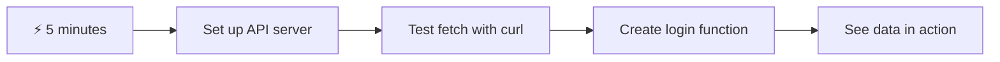

- **मिनिट 1-2**: तुमचा API सर्व्हर सुरू करा (`cd api && npm start`) आणि कनेक्शन तपासा
- **मिनिट 3**: `getAccount()` फंक्शन तयार करा ज्यामध्ये fetch वापरले आहे
- **मिनिट 4**: लॉगिन फॉर्म `action="javascript:login()"` सह वायर करा
- **मिनिट 5**: लॉगिन तपासा आणि अकाउंट डेटा कन्सोलमध्ये दिसत असल्याचे पहा

**जलद चाचणी आदेश**:
```bash
# Verify API is running
curl http://localhost:5000/api

# Test account data fetch
curl http://localhost:5000/api/accounts/test
```

**महत्त्व का आहे**: 5 मिनिटांत, तुम्ही असिंक्रोनस डेटा फेचिंगचे जादू पाहाल जे प्रत्येक आधुनिक वेब अ‍ॅप्लिकेशनला चालवते. हे अ‍ॅप्स प्रतिसादात्मक आणि जिवंत वाटण्याचे फाउंडेशन आहे.

## 🗺️ डेटा-ड्रिव्हन वेब अ‍ॅप्लिकेशन्समधील तुमचा शिक्षण प्रवास

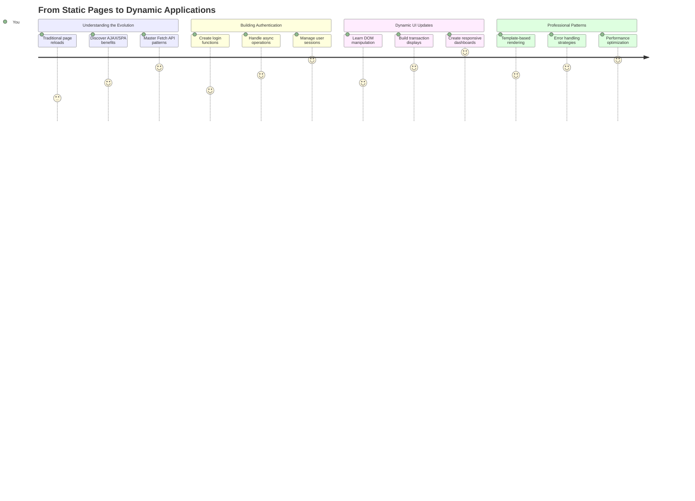

**तुमचा प्रवासाचा गंतव्य**: या धड्याच्या शेवटी, तुम्हाला समजेल की आधुनिक वेब अ‍ॅप्लिकेशन्स डेटा कसे फेच करतात, प्रक्रिया करतात आणि डायनॅमिकली प्रदर्शित करतात, व्यावसायिक अ‍ॅप्लिकेशन्सकडून अपेक्षित अखंड वापरकर्ता अनुभव तयार करतात.

## प्री-लेक्चर क्विझ

[प्री-लेक्चर क्विझ](https://ff-quizzes.netlify.app/web/quiz/45)

### पूर्वतयारी

डेटा फेचिंगमध्ये जाण्यापूर्वी, खालील घटक तयार असल्याची खात्री करा:

- **मागील धडा**: [लॉगिन आणि रजिस्ट्रेशन फॉर्म](../2-forms/README.md) पूर्ण करा - आपण या फाउंडेशनवर तयार करू
- **लोकल सर्व्हर**: [Node.js](https://nodejs.org) इंस्टॉल करा आणि [सर्व्हर API चालवा](../api/README.md) अकाउंट डेटा प्रदान करण्यासाठी
- **API कनेक्शन**: तुमच्या सर्व्हर कनेक्शनची चाचणी या आदेशाने करा:

```bash
curl http://localhost:5000/api
# Expected response: "Bank API v1.0.0"
```

ही जलद चाचणी सर्व घटक योग्य प्रकारे संवाद साधत असल्याची खात्री करते:
- तुमच्या सिस्टमवर Node.js योग्य प्रकारे चालत असल्याचे सत्यापित करते
- तुमचा API सर्व्हर सक्रिय आणि प्रतिसाद देत असल्याचे पुष्टी करते
- तुमचे अ‍ॅप सर्व्हरपर्यंत पोहोचू शकते याची खात्री करते (मिशनपूर्व रेडिओ संपर्क तपासण्यासारखे)

## 🧠 डेटा व्यवस्थापन इकोसिस्टमचा आढावा

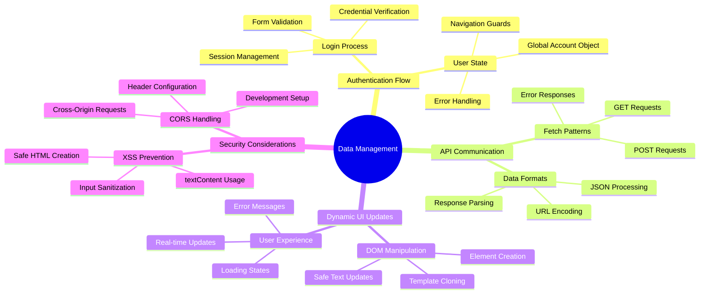

**मुख्य तत्त्व**: आधुनिक वेब अ‍ॅप्लिकेशन्स डेटा ऑर्केस्ट्रेशन सिस्टम आहेत - ते वापरकर्ता इंटरफेस, सर्व्हर API आणि ब्राउझर सुरक्षा मॉडेल्समध्ये समन्वय साधतात जे अखंड, प्रतिसादात्मक अनुभव तयार करतात.

---

## आधुनिक वेब अ‍ॅप्समध्ये डेटा फेचिंग समजून घेणे

वेब अ‍ॅप्लिकेशन्स डेटा कसे हाताळतात यामध्ये गेल्या दोन दशकांत नाट्यमय बदल झाला आहे. आधुनिक तंत्रज्ञान जसे की AJAX आणि Fetch API का इतके शक्तिशाली आहेत आणि वेब डेव्हलपर्ससाठी आवश्यक साधने का बनली आहेत हे समजून घेण्यासाठी ही उत्क्रांती समजून घेणे महत्त्वाचे आहे.

चला पारंपरिक वेबसाइट्स कशा कार्य करायच्या याचा आणि आज आपण तयार करत असलेल्या डायनॅमिक, प्रतिसादात्मक अ‍ॅप्लिकेशन्सचा अभ्यास करूया.

### पारंपरिक मल्टी-पेज अ‍ॅप्लिकेशन्स (MPA)

वेबच्या सुरुवातीच्या काळात, प्रत्येक क्लिक जुन्या टेलिव्हिजनवर चॅनेल बदलण्यासारखे होते - स्क्रीन रिकामी होई, नंतर हळूहळू नवीन सामग्रीमध्ये ट्यून होई. ही सुरुवातीच्या वेब अ‍ॅप्लिकेशन्सची वास्तविकता होती, जिथे प्रत्येक संवाद संपूर्ण पृष्ठ पुन्हा तयार करण्याचा अर्थ होता.

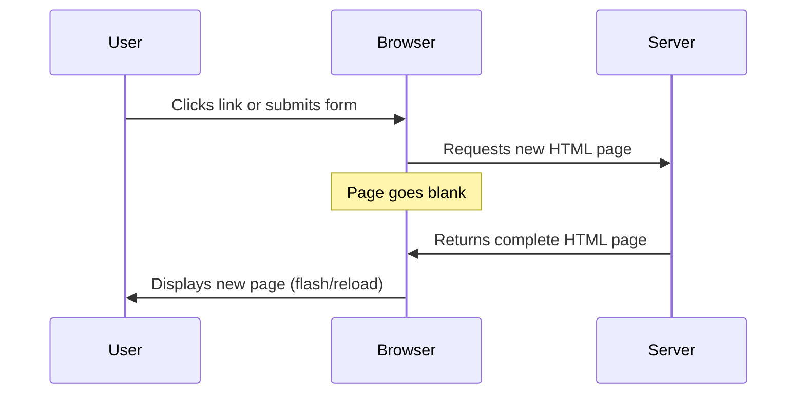

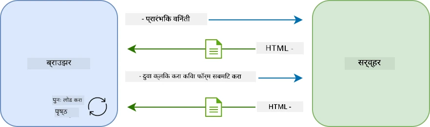

**हा दृष्टिकोन क्लंकी का वाटला:**
- प्रत्येक क्लिकने संपूर्ण पृष्ठ पुन्हा तयार करणे आवश्यक होते
- वापरकर्त्यांना त्या त्रासदायक पृष्ठ फ्लॅशेसने विचारमग्नतेत व्यत्यय आला
- तुमचे इंटरनेट कनेक्शन पुन्हा पुन्हा समान हेडर आणि फूटर्स डाउनलोड करण्यात व्यस्त होते
- अ‍ॅप्स सॉफ्टवेअर वापरण्यापेक्षा फाइलिंग कॅबिनेटमधून क्लिक करण्यासारखे वाटले

### आधुनिक सिंगल-पेज अ‍ॅप्लिकेशन्स (SPA)

AJAX (असिंक्रोनस जावास्क्रिप्ट आणि XML) ने ही पद्धत पूर्णपणे बदलली. जसे आंतरराष्ट्रीय स्पेस स्टेशनचे मॉड्यूलर डिझाइन, जिथे अंतराळवीर संपूर्ण संरचना पुन्हा तयार न करता वैयक्तिक घटक बदलू शकतात, AJAX आम्हाला संपूर्ण पृष्ठ पुन्हा लोड न करता वेबपृष्ठाचा विशिष्ट भाग अपडेट करण्याची परवानगी देते. नावात XMLचा उल्लेख असूनही, आपण आज प्रामुख्याने JSON वापरतो, परंतु मुख्य तत्त्व कायम आहे: फक्त बदलण्याची गरज असलेला भाग अपडेट करा.

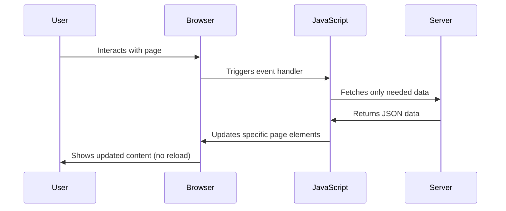

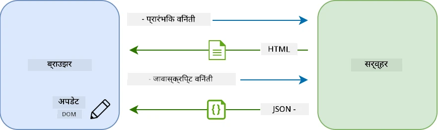

**SPAs चांगले का वाटतात:**
- फक्त बदललेले भाग अपडेट होतात (चतुर, बरोबर?)
- त्रासदायक व्यत्यय नाही - तुमचे वापरकर्ते त्यांच्या प्रवाहात राहतात
- वायरवर कमी डेटा प्रवास करतो म्हणजे जलद लोडिंग
- सर्व काही स्नॅपी आणि प्रतिसादात्मक वाटते, जसे तुमच्या फोनवरील अ‍ॅप्स

### आधुनिक Fetch API कडे उत्क्रांती

आधुनिक ब्राउझर [`Fetch` API](https://developer.mozilla.org/docs/Web/API/Fetch_API) प्रदान करतात, जे जुन्या [`XMLHttpRequest`](https://developer.mozilla.org/docs/Web/API/XMLHttpRequest/Using_XMLHttpRequest) ची जागा घेते. टेलिग्राफ ऑपरेट करण्याच्या आणि ईमेल वापरण्याच्या फरकासारखे, Fetch API स्वच्छ असिंक्रोनस कोडसाठी प्रॉमिसेस वापरते आणि नैसर्गिकरित्या JSON हाताळते.

| वैशिष्ट्य | XMLHttpRequest | Fetch API |
|---------|----------------|----------|
| **सिंटॅक्स** | क्लिष्ट कॉलबॅक-आधारित | स्वच्छ प्रॉमिस-आधारित |
| **JSON हाताळणी** | मॅन्युअल पार्सिंग आवश्यक | अंगभूत `.json()` पद्धत |
| **त्रुटी हाताळणी** | मर्यादित त्रुटी माहिती | व्यापक त्रुटी तपशील |
| **आधुनिक समर्थन** | वारसा सुसंगतता | ES6+ प्रॉमिसेस आणि async/await |

> 💡 **ब्राउझर सुसंगतता**: चांगली बातमी - Fetch API सर्व आधुनिक ब्राउझरमध्ये कार्य करते! तुम्हाला विशिष्ट आवृत्त्यांबद्दल उत्सुक असल्यास, [caniuse.com](https://caniuse.com/fetch) मध्ये संपूर्ण सुसंगतता कथा आहे.
> 
**तळटीप:**
- Chrome, Firefox, Safari, आणि Edge मध्ये उत्तम प्रकारे कार्य करते (म्हणजे तुमचे वापरकर्ते जिथे आहेत तिथे)
- फक्त Internet Explorer ला अतिरिक्त मदतीची गरज आहे (आणि प्रामाणिकपणे, IE ला सोडण्याची वेळ आली आहे)
- आम्ही नंतर वापरणार असलेल्या एलिगंट async/await पॅटर्नसाठी तुम्हाला उत्तम प्रकारे सेट करते

### वापरकर्ता लॉगिन आणि डेटा पुनर्प्राप्ती अंमलात आणणे

आता तुमच्या बँकिंग अ‍ॅपला स्थिर प्रदर्शनातून कार्यात्मक अ‍ॅप्लिकेशनमध्ये रूपांतरित करणारी लॉगिन प्रणाली अंमलात आणूया. सुरक्षित लष्करी सुविधांमध्ये वापरल्या जाणाऱ्या प्रमाणीकरण प्रोटोकॉलप्रमाणे, आम्ही वापरकर्त्याच्या क्रेडेन्शियल्सची पडताळणी करू आणि नंतर त्यांचा विशिष्ट डेटा प्रदान करू.

आम्ही मूलभूत प्रमाणीकरणासह सुरुवात करून डेटा फेचिंग क्षमता जोडून हे टप्प्याटप्प्याने तयार करू.

#### चरण 1: लॉगिन फंक्शन फाउंडेशन तयार करा

तुमच्या `app.js` फाइल उघडा आणि नवीन `login` फंक्शन जोडा. हे वापरकर्ता प्रमाणीकरण प्रक्रिया हाताळेल:

```javascript
async function login() {
  const loginForm = document.getElementById('loginForm');
  const user = loginForm.user.value;
}
```

**याचे विश्लेषण करूया:**
- `async` कीवर्ड? हे जावास्क्रिप्टला सांगत आहे "अरे, या फंक्शनला कदाचित गोष्टींसाठी थांबावे लागेल"
- आम्ही पृष्ठावरून आमचा फॉर्म घेत आहोत (काहीही फॅन्सी नाही, फक्त त्याचा ID शोधत आहोत)
- नंतर आम्ही वापरकर्त्याने टाइप केलेले युजरनेम काढत आहोत
- एक छान ट्रिक: तुम्ही HTML मधील `name` अ‍ॅट्रिब्युटने सेट केलेल्या कोणत्याही फॉर्म इनपुटला फॉर्म एलिमेंटच्या प्रॉपर्टी म्हणून ऍक्सेस करू शकता - अतिरिक्त getElementById कॉल्सची गरज नाही!

> 💡 **फॉर्म ऍक्सेस पॅटर्न**: प्रत्येक फॉर्म कंट्रोलला त्याच्या नावाने (HTML मध्ये `name` अ‍ॅट्रिब्युट वापरून सेट केलेले) फॉर्म एलिमेंटच्या प्रॉपर्टी म्हणून ऍक्सेस करता येते. हे फॉर्म डेटा मिळवण्याचा स्वच्छ, वाचनीय मार्ग प्रदान करते.

#### चरण 2: अकाउंट डेटा फेचिंग फंक्शन तयार करा

पुढे, आम्ही सर्व्हरवरून अकाउंट डेटा पुनर्प्राप्त करण्यासाठी समर्पित फंक्शन तयार करू. हे तुमच्या रजिस्ट्रेशन फंक्शनसारखेच पॅटर्न फॉलो करते पण डेटा पुनर्प्राप्तीवर लक्ष केंद्रित करते:

```javascript
async function getAccount(user) {
  try {
    const response = await fetch('//localhost:5000/api/accounts/' + encodeURIComponent(user));
    return await response.json();
  } catch (error) {
    return { error: error.message || 'Unknown error' };
  }
}
```

**हे कोड काय साध्य करते:**
- आधुनिक `fetch` API वापरून डेटा असिंक्रोनसपणे विनंती करते
- युजरनेम पॅरामीटरसह GET विनंती URL तयार करते
- URL मध्ये विशेष वर्ण सुरक्षितपणे हाताळण्यासाठी `encodeURIComponent()` लागू करते
- JSON स्वरूपात प्रतिसाद रूपांतरित करते जेणेकरून डेटा सहजपणे हाताळता येईल
- त्रुटी सौम्यपणे हाताळते, क्रॅश होण्याऐवजी त्रुटी ऑब्जेक्ट परत करते

> ⚠️ **सुरक्षा टीप**: `encodeURIComponent()` फंक्शन URL मध्ये विशेष वर्ण हाताळते. नेव्हल कम्युनिकेशन्समध्ये वापरल्या जाणाऱ्या एन्कोडिंग सिस्टम्ससारखे, ते तुमचा संदेश नेमका अपेक्षित असल्याप्रमाणे पोहोचतो याची खात्री करते, "#" किंवा "&" सारख्या वर्णांना चुकीच्या प्रकारे समजण्यापासून प्रतिबंधित करते.
> 
**महत्त्व का आहे:**
- विशेष वर्ण URL तोडण्यापासून प्रतिबंधित करते
- URL मॅनिप्युलेशन हल्ल्यांपासून संरक्षण करते
- तुमच्या सर्व्हरला अपेक्षित डेटा प्राप्त होतो याची खात्री करते
- सुरक्षित कोडिंग पद्धतींचे अनुसरण करते

#### HTTP GET विनंत्या समजून घेणे

तुम्हाला आश्चर्य वाटेल: जेव्हा तुम्ही `fetch` अतिरिक्त पर्यायांशिवाय वापरता, तेव्हा ते आपोआप [`GET`](https://developer.mozilla.org/docs/Web/HTTP/Methods/GET) विनंती तयार करते. हे आपल्यासाठी योग्य आहे - सर्व्हरला विचारणे "अरे, मी या वापरकर्त्याचा अकाउंट डेटा पाहू शकतो का?"

GET विनंत्या पुस्तकालयातून पुस्तक उधार घेण्यासारख्या आहेत - तुम्ही आधीच अस्तित्वात असलेल्या गोष्टी पाहण्याची विनंती करत आहात. POST विनंत्या (ज्या आम्ही नोंदणीसाठी वापरल्या) संग्रहात जोडण्यासाठी नवीन पुस्तक सबमिट करण्यासारख्या आहेत.

| GET विनंती | POST विनंती |
|-------------|-------------|
| **उद्देश** | विद्यमान डेटा पुनर्प्राप्त करा | सर्व्हरला नवीन डेटा पाठवा |
| **पॅरामीटर्स** | URL पथ/क्वेरी स्ट्रिंगमध्ये | विनंती बॉडीमध्ये |
| **कॅशिंग** | ब्राउझरद्वारे कॅश केले जाऊ शकते | सामान्यतः कॅश केले जात नाही |
| **सुरक्षा** | URL/लॉगमध्ये दृश्यमान | विनंती बॉडीमध्ये लपलेले |

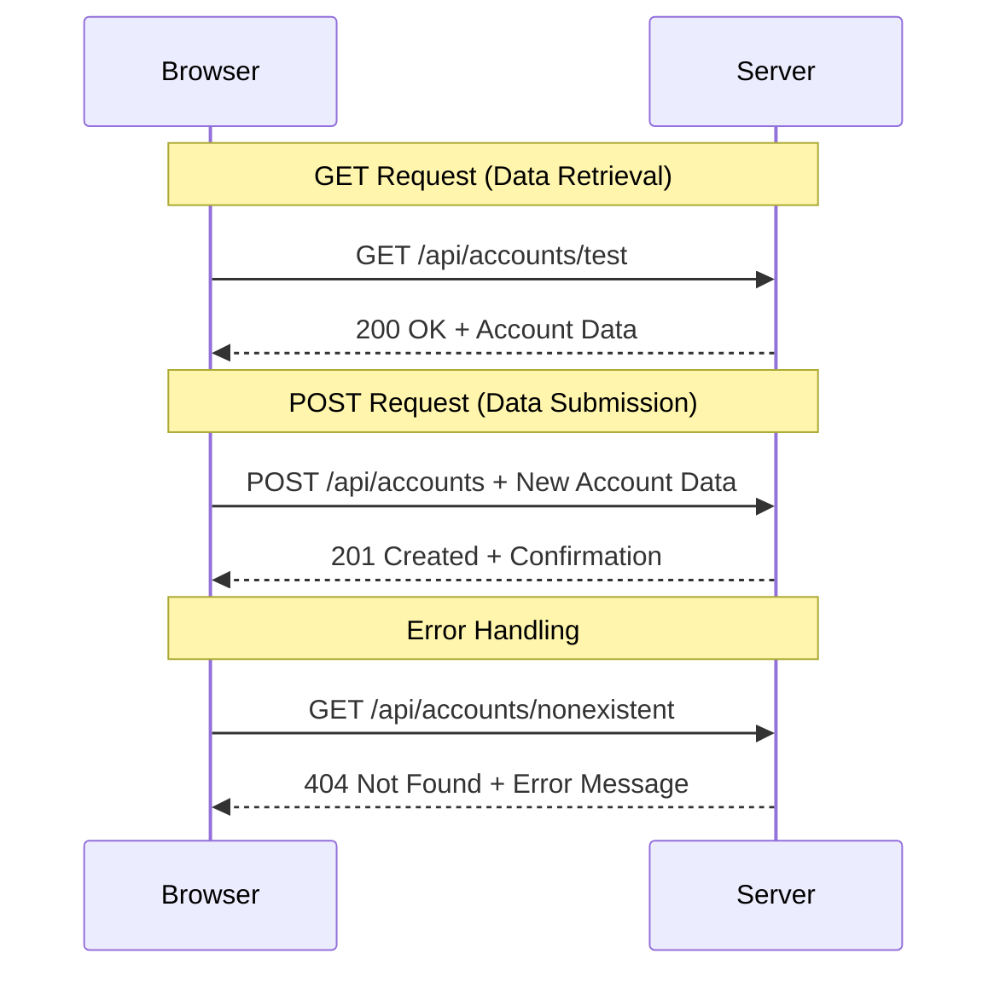

#### चरण 3: सर्व काही एकत्र आणणे

आता समाधानकारक भाग - चला तुमच्या अकाउंट फेचिंग फंक्शनला लॉगिन प्रक्रियेशी जोडूया. येथे सर्व काही जागेवर क्लिक करते:

```javascript
async function login() {
  const loginForm = document.getElementById('loginForm');
  const user = loginForm.user.value;
  const data = await getAccount(user);

  if (data.error) {
    return console.log('loginError', data.error);
  }

  account = data;
  navigate('/dashboard');
}
```

हे फंक्शन स्पष्ट क्रम अनुसरण करते:
- फॉर्म इनपुटमधून युजरनेम काढा
- सर्व्हरकडून वापरकर्त्याचा अकाउंट डेटा विनंती करा
- प्रक्रियेदरम्यान उद्भवलेल्या कोणत्याही त्रुटी हाताळा
- अकाउंट डेटा स्टोअर करा आणि यशस्वी झाल्यावर डॅशबोर्डवर जा

> 🎯 **Async/Await पॅटर्न**: कारण `getAccount` एक असिंक्रोनस फंक्शन आहे, आम्ही `await` कीवर्ड वापरतो जो सर्व्हर प्रतिसाद देईपर्यंत अंमलबजावणी थांबवतो. हे कोड undefined डेटासह पुढे जाण्यापासून प्रतिबंधित करते.

#### चरण 4: तुमच्या डेटासाठी घर तयार करणे

तुमच्या अ‍ॅपला एक ठिकाण हवे जे एकदा लोड झाल्यानंतर अकाउंट माहिती लक्षात ठेवेल. याला तुमच्या अ‍ॅपची अल्पकालीन स्मृती समजा - सध्याच्या वापरकर्त्याचा डेटा सोयीस्कर ठेवण्यासाठी एक जागा. तुमच्या `app.js` फाइलच्या शीर्षस्थानी ही ओळ जोडा:

```javascript
// This holds the current user's account data
let account = null;
```

**आपल्याला याची आवश्यकता का आहे:**
- अकाउंट डेटा तुमच्या अ‍ॅपमधील कुठूनही ऍक्सेस करण्यायोग्य ठेवते
- `null` सह प्रारंभ करणे म्हणजे "कोणीही अद्याप लॉग इन केलेले नाही"
- कोणी यशस्वीरित्या लॉग इन किंवा नोंदणी केल्यावर अपडेट होते
- एकल सत्याचा स्रोत म्हणून कार्य करते - कोण लॉग इन आहे याबद्दल गोंधळ नाही

#### चरण 5: तुमचा फॉर्म वायर करा

आता तुमच्या चमकदार नवीन लॉगिन फंक्शनला तुमच्या HTML फॉर्मशी कनेक्ट करूया. तुमच्या फॉर्म टॅगला असे अपडेट करा:

```html
<form id="loginForm" action="javascript:login()">
  <!-- Your existing form inputs -->
</form>
```

**हा छोटासा बदल काय करतो:**
- फॉर्मला त्याचे डीफॉल्ट "संपूर्ण पृष्ठ पुन्हा लोड करा" वर्तन थांबवते
- त्याऐवजी तुमचे कस्टम जावास्क्रिप्ट फंक्शन कॉल करते
- सर्व काही गुळगुळीत आणि सिंगल-पेज-अ‍ॅपसारखे ठेवते
- वापरकर्त्यांनी "लॉगिन" दाबल्यावर काय होते यावर तुम्हाला पूर्ण नियंत्रण देते

#### चरण 6: तुमच्या रजिस्ट्रेशन फंक्शनला सुधारित करा

सुसंगततेसाठी, तुमच्या `register` फंक्शनला अकाउंट डेटा स्टोअर करण्यासाठी आणि डॅशबोर्डवर नेव्हिगेट करण्यासाठी देखील अपडेट करा:

```javascript
// Add these lines at the end of your register function
account = result;
navigate('/dashboard');
```

**ही सुधारणा
DOM मॅनिप्युलेशन ही एक तंत्र आहे जी स्थिर वेब पृष्ठांना गतिशील अनुप्रयोगांमध्ये रूपांतरित करते, जे वापरकर्त्याच्या संवादांवर आणि सर्व्हर प्रतिसादांवर आधारित सामग्री अद्यतनित करतात.

### योग्य साधन निवडणे

तुमच्या HTML ला JavaScript सह अद्यतनित करण्याचा विचार करत असाल, तर तुमच्याकडे अनेक पर्याय आहेत. यांना टूलबॉक्समधील वेगवेगळ्या साधनांसारखे समजा - प्रत्येक विशिष्ट कामासाठी योग्य:

| पद्धत | कशासाठी चांगली आहे | कधी वापरायची | सुरक्षिततेचा स्तर |
|-------|---------------------|--------------|--------------------|
| `textContent` | वापरकर्त्याचा डेटा सुरक्षितपणे दाखवणे | कधीही तुम्ही मजकूर दाखवत असाल | ✅ अतिशय सुरक्षित |
| `createElement()` + `append()` | जटिल लेआउट तयार करणे | नवीन विभाग/यादी तयार करणे | ✅ अतिशय सुरक्षित |
| `innerHTML` | HTML सामग्री सेट करणे | ⚠️ शक्यतो टाळा | ❌ धोकादायक |

#### मजकूर सुरक्षितपणे दाखवण्याचा सुरक्षित मार्ग: textContent

[`textContent`](https://developer.mozilla.org/docs/Web/API/Node/textContent) प्रॉपर्टी वापरकर्त्याचा डेटा दाखवण्यासाठी तुमचा सर्वोत्तम मित्र आहे. हे तुमच्या वेबपृष्ठासाठी बाउन्सर असल्यासारखे आहे - काहीही हानिकारक आत येत नाही:

```javascript
// The safe, reliable way to update text
const balanceElement = document.getElementById('balance');
balanceElement.textContent = account.balance;
```

**textContent चे फायदे:**
- सर्वकाही सामान्य मजकूर म्हणून हाताळते (स्क्रिप्ट कार्यान्वयन टाळते)
- विद्यमान सामग्री आपोआप साफ करते
- सोप्या मजकूर अद्यतनांसाठी कार्यक्षम
- हानिकारक सामग्रीपासून अंगभूत सुरक्षा प्रदान करते

#### गतिशील HTML घटक तयार करणे

अधिक जटिल सामग्रीसाठी, [`document.createElement()`](https://developer.mozilla.org/docs/Web/API/Document/createElement) आणि [`append()`](https://developer.mozilla.org/docs/Web/API/ParentNode/append) पद्धती एकत्र करा:

```javascript
// Safe way to create new elements
const transactionItem = document.createElement('div');
transactionItem.className = 'transaction-item';
transactionItem.textContent = `${transaction.date}: ${transaction.description}`;
container.append(transactionItem);
```

**या दृष्टिकोनाचे समजून घेणे:**
- **नवीन DOM घटक** प्रोग्रामॅटिकली तयार करते
- घटकांचे गुणधर्म आणि सामग्रीवर **पूर्ण नियंत्रण ठेवते**
- **जटिल, नेस्टेड घटक संरचना** तयार करण्यास अनुमती देते
- **सुरक्षा जपते** संरचना आणि सामग्री वेगळे करून

> ⚠️ **सुरक्षा विचार**: जरी [`innerHTML`](https://developer.mozilla.org/docs/Web/API/Element/innerHTML) अनेक ट्यूटोरियलमध्ये दिसते, तरीही ते एम्बेड केलेल्या स्क्रिप्ट्स कार्यान्वित करू शकते. CERN मधील सुरक्षा प्रोटोकॉलप्रमाणे जे अनधिकृत कोड कार्यान्वयन टाळतात, `textContent` आणि `createElement` वापरणे सुरक्षित पर्याय प्रदान करते.
> 
**innerHTML चे धोके:**
- वापरकर्त्याच्या डेटामधील कोणत्याही `<script>` टॅग्स कार्यान्वित करते
- कोड इंजेक्शन हल्ल्यांसाठी असुरक्षित
- संभाव्य सुरक्षा त्रुटी निर्माण करते
- आम्ही वापरत असलेले सुरक्षित पर्याय समतुल्य कार्यक्षमता प्रदान करतात

### त्रुटी वापरकर्त्यासाठी सोप्या बनवणे

सध्या, लॉगिन त्रुटी फक्त ब्राउझर कन्सोलमध्ये दिसतात, जे वापरकर्त्यांसाठी अदृश्य आहे. पायलटच्या अंतर्गत निदान आणि प्रवासी माहिती प्रणालीमधील फरकासारखे, आम्हाला योग्य चॅनेलद्वारे महत्त्वाची माहिती संवाद साधण्याची आवश्यकता आहे.

दृश्यमान त्रुटी संदेश लागू केल्याने वापरकर्त्यांना काय चुकले आणि पुढे कसे जायचे याबद्दल त्वरित अभिप्राय मिळतो.

#### चरण 1: त्रुटी संदेशांसाठी जागा जोडा

प्रथम, तुमच्या HTML मध्ये त्रुटी संदेशांसाठी जागा तयार करा. हे तुमच्या लॉगिन बटणाच्या अगोदर जोडा जेणेकरून वापरकर्त्यांना ते सहज दिसेल:

```html
<!-- This is where error messages will appear -->
<div id="loginError" role="alert"></div>
<button>Login</button>
```

**इथे काय घडत आहे:**
- आम्ही एक रिक्त कंटेनर तयार करत आहोत जो आवश्यक होईपर्यंत अदृश्य राहतो
- हे "लॉगिन" क्लिक केल्यानंतर वापरकर्ते नैसर्गिकरित्या जिथे पाहतात तिथे ठेवले आहे
- स्क्रीन रीडर्ससाठी `role="alert"` एक चांगली गोष्ट आहे - ते सहाय्यक तंत्रज्ञानाला सांगते "हे महत्त्वाचे आहे!"
- अनोखा `id` आमच्या JavaScript ला सोपे लक्ष्य प्रदान करतो

#### चरण 2: एक उपयुक्त सहाय्यक फंक्शन तयार करा

आम्ही एक छोटी युटिलिटी फंक्शन तयार करूया जी कोणत्याही घटकाचा मजकूर अद्यतनित करू शकते. हे "एकदा लिहा, सर्वत्र वापरा" प्रकारचे फंक्शन आहे जे तुमचा वेळ वाचवेल:

```javascript
function updateElement(id, text) {
  const element = document.getElementById(id);
  element.textContent = text;
}
```

**फंक्शनचे फायदे:**
- फक्त घटक ID आणि मजकूर सामग्री आवश्यक असलेला सोपा इंटरफेस
- DOM घटक सुरक्षितपणे शोधतो आणि अद्यतनित करतो
- कोड डुप्लिकेशन कमी करणारा पुनरावृत्ती होणारा नमुना
- अनुप्रयोगामध्ये सुसंगत अद्यतन वर्तन राखते

#### चरण 3: त्रुटी वापरकर्त्यांना दिसेल अशा ठिकाणी दाखवा

आता त्या लपलेल्या कन्सोल संदेशाची जागा अशा गोष्टीने बदला जी वापरकर्त्यांना प्रत्यक्षात दिसेल. तुमच्या लॉगिन फंक्शनला अद्यतनित करा:

```javascript
// Instead of just logging to console, show the user what's wrong
if (data.error) {
  return updateElement('loginError', data.error);
}
```

**या छोट्या बदलामुळे मोठा फरक पडतो:**
- त्रुटी संदेश वापरकर्त्यांना दिसेल अशा ठिकाणी दिसतात
- गुप्त शांत अपयश नाही
- वापरकर्त्यांना त्वरित, कृतीयोग्य अभिप्राय मिळतो
- तुमचे अॅप व्यावसायिक आणि विचारशील वाटू लागते

आता जेव्हा तुम्ही अवैध खात्याने चाचणी कराल, तेव्हा तुम्हाला पृष्ठावरच एक उपयुक्त त्रुटी संदेश दिसेल!


#### चरण 4: अॅक्सेसिबिलिटीसह समावेशक असणे

आम्ही आधी जोडलेल्या `role="alert"` बद्दल एक छान गोष्ट आहे - ते फक्त सजावट नाही! हे छोटे गुणधर्म [Live Region](https://developer.mozilla.org/docs/Web/Accessibility/ARIA/ARIA_Live_Regions) तयार करते जे स्क्रीन रीडर्सना त्वरित बदलांची घोषणा करते:

```html
<div id="loginError" role="alert"></div>
```

**हे का महत्त्वाचे आहे:**
- स्क्रीन रीडर वापरकर्ते त्रुटी संदेश दिसताच ऐकतात
- प्रत्येकाला महत्त्वाची माहिती मिळते, ते कसे नेव्हिगेट करतात याची पर्वा न करता
- तुमचे अॅप अधिक लोकांसाठी कार्य करण्यासाठी सोपे बनवते
- समावेशक अनुभव तयार करण्याची तुमची काळजी दर्शवते

अशा छोट्या गोष्टी चांगल्या विकसकांना महान बनवतात!

### 🎯 शैक्षणिक तपासणी: प्रमाणीकरण नमुने

**थांबा आणि विचार करा**: तुम्ही पूर्ण प्रमाणीकरण प्रवाह अंमलात आणला आहे. वेब विकासातील हा एक मूलभूत नमुना आहे.

**जलद स्व-मूल्यांकन**:
- API कॉलसाठी async/await का वापरतो हे तुम्ही स्पष्ट करू शकता का?
- आपण `encodeURIComponent()` फंक्शन विसरलो तर काय होईल?
- आमचे त्रुटी हाताळणे वापरकर्ता अनुभव कसे सुधारते?

**वास्तविक-जगाशी कनेक्शन**: तुम्ही येथे शिकलेले नमुने (असिंक्रोनस डेटा फेचिंग, त्रुटी हाताळणे, वापरकर्ता अभिप्राय) प्रत्येक प्रमुख वेब अनुप्रयोगामध्ये वापरले जातात, सोशल मीडिया प्लॅटफॉर्मपासून ई-कॉमर्स साइट्सपर्यंत. तुम्ही उत्पादन-स्तरीय कौशल्ये तयार करत आहात!

**चॅलेंज प्रश्न**: तुम्ही ग्राहक, प्रशासक, टेलर यासारख्या एकाधिक वापरकर्ता भूमिका हाताळण्यासाठी या प्रमाणीकरण प्रणालीमध्ये कसे बदल करू शकता? आवश्यक डेटा संरचना आणि UI बदलांबद्दल विचार करा.

#### चरण 5: नोंदणीसाठी समान नमुना लागू करा

सुसंगततेसाठी, तुमच्या नोंदणी फॉर्ममध्ये समान त्रुटी हाताळणी अंमलात आणा:

1. **जोडा** नोंदणी HTML मध्ये त्रुटी प्रदर्शन घटक:
```html
<div id="registerError" role="alert"></div>
```

2. **अद्यतनित करा** तुमचे नोंदणी फंक्शन समान त्रुटी प्रदर्शन नमुना वापरण्यासाठी:
```javascript
if (data.error) {
  return updateElement('registerError', data.error);
}
```

**सुसंगत त्रुटी हाताळणीचे फायदे:**
- **सर्व फॉर्ममध्ये** एकसमान वापरकर्ता अनुभव प्रदान करते
- **परिचित नमुने वापरून** संज्ञानात्मक भार कमी करते
- **पुनरावृत्ती होणाऱ्या कोडसह देखभाल सुलभ करते**
- **संपूर्ण अॅपमध्ये** अॅक्सेसिबिलिटी मानकांचे पालन सुनिश्चित करते

## तुमचा गतिशील डॅशबोर्ड तयार करणे

आता आम्ही तुमचा स्थिर डॅशबोर्ड बदलून गतिशील इंटरफेसमध्ये रूपांतरित करू जो वास्तविक खाते डेटा प्रदर्शित करतो. मुद्रित फ्लाइट वेळापत्रक आणि विमानतळावरील थेट प्रस्थान बोर्ड यामधील फरकासारखे, आम्ही स्थिर माहितीपासून वास्तविक-वेळ, प्रतिसादात्मक प्रदर्शनाकडे जात आहोत.

तुम्ही शिकलेल्या DOM मॅनिप्युलेशन तंत्रांचा वापर करून, आम्ही एक डॅशबोर्ड तयार करू जो सध्याच्या खाते माहितीसह आपोआप अद्यतनित होतो.

### तुमच्या डेटाशी परिचित होणे

आम्ही तयार करायला सुरुवात करण्यापूर्वी, तुमचा सर्व्हर परत पाठवतो त्या प्रकारच्या डेटावर एक नजर टाकूया. जेव्हा कोणी यशस्वीरित्या लॉग इन करतो, तेव्हा तुम्हाला काम करण्यासाठी माहितीचा खजिना मिळतो:

```json
{
  "user": "test",
  "currency": "$",
  "description": "Test account",
  "balance": 75,
  "transactions": [
    { "id": "1", "date": "2020-10-01", "object": "Pocket money", "amount": 50 },
    { "id": "2", "date": "2020-10-03", "object": "Book", "amount": -10 },
    { "id": "3", "date": "2020-10-04", "object": "Sandwich", "amount": -5 }
  ]
}
```

**या डेटा संरचनेत समाविष्ट आहे:**
- **`user`**: अनुभव वैयक्तिकृत करण्यासाठी योग्य ("पुन्हा स्वागत आहे, सारा!")
- **`currency`**: पैसे योग्य प्रकारे प्रदर्शित करण्यासाठी मदत करते
- **`description`**: खात्याचे एक मैत्रीपूर्ण नाव
- **`balance`**: सर्वात महत्त्वाचा वर्तमान शिल्लक
- **`transactions`**: सर्व तपशीलांसह संपूर्ण व्यवहार इतिहास

व्यावसायिक दिसणारा बँकिंग डॅशबोर्ड तयार करण्यासाठी तुम्हाला आवश्यक सर्वकाही!

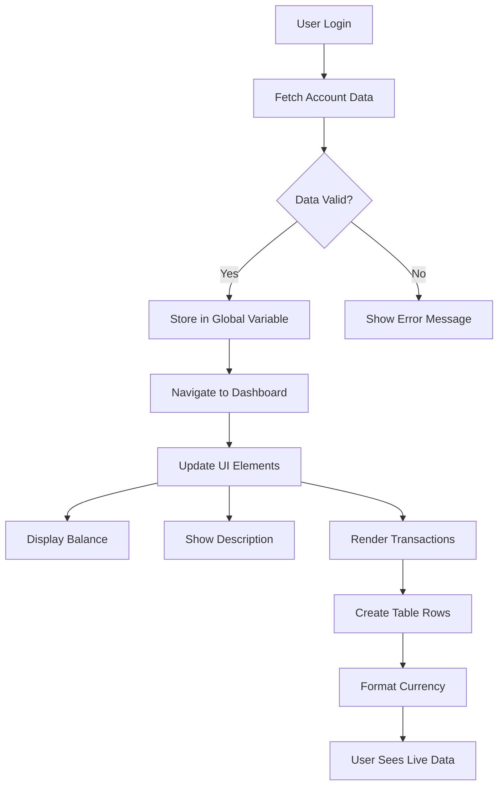

> 💡 **प्रो टिप**: तुमचा डॅशबोर्ड त्वरित क्रियाशील पाहायचा आहे का? लॉग इन करताना `test` वापरकर्तानाव वापरा - यामध्ये नमुना डेटा आधीच लोड केलेला आहे जेणेकरून तुम्ही सर्वकाही कार्य करताना पाहू शकता.
> 
**टेस्ट अकाउंट का उपयुक्त आहे:**
- आधीच लोड केलेल्या वास्तववादी नमुना डेटासह येते
- व्यवहार कसे प्रदर्शित होतात ते पाहण्यासाठी योग्य
- तुमच्या डॅशबोर्ड वैशिष्ट्यांची चाचणी घेण्यासाठी उत्तम
- तुम्हाला डमी डेटा मॅन्युअली तयार करण्यापासून वाचवते

### डॅशबोर्ड प्रदर्शन घटक तयार करणे

आम्ही तुमचा डॅशबोर्ड इंटरफेस चरण-दर-चरण तयार करू, खाते सारांश माहितीपासून सुरुवात करून आणि नंतर व्यवहार यादीसारख्या अधिक जटिल वैशिष्ट्यांकडे जाऊ.

#### चरण 1: तुमची HTML रचना अद्यतनित करा

प्रथम, स्थिर "शिल्लक" विभाग गतिशील प्लेसहोल्डर घटकांसह बदला जे तुमचा JavaScript भरू शकेल:

```html
<section>
  Balance: <span id="balance"></span><span id="currency"></span>
</section>
```

यानंतर, खात्याच्या वर्णनासाठी एक विभाग जोडा. कारण हे डॅशबोर्ड सामग्रीसाठी शीर्षक म्हणून कार्य करते, सेमॅंटिक HTML वापरा:

```html
<h2 id="description"></h2>
```

**HTML रचना समजून घेणे:**
- **वेगळ्या `<span>` घटकांचा वापर** शिल्लक आणि चलनासाठी स्वतंत्र नियंत्रणासाठी
- प्रत्येक घटकासाठी **अनोख्या IDs लागू करते** JavaScript लक्ष्यित करण्यासाठी
- सेमॅंटिक HTML चे अनुसरण करते, डॅशबोर्ड सामग्रीसाठी `<h2>` वापरून
- स्क्रीन रीडर्स आणि SEO साठी तर्कसंगत श्रेणी तयार करते

> ✅ **अॅक्सेसिबिलिटी अंतर्दृष्टी**: खाते वर्णन डॅशबोर्ड सामग्रीसाठी शीर्षक म्हणून कार्य करते, म्हणून ते शीर्षक म्हणून सेमॅंटिकली चिन्हांकित केले आहे. [शीर्षक संरचना](https://www.nomensa.com/blog/2017/how-structure-headings-web-accessibility) अॅक्सेसिबिलिटीवर कसा परिणाम करते याबद्दल अधिक जाणून घ्या. तुमच्या पृष्ठावरील इतर घटक ओळखू शकता का जे शीर्षक टॅग्सचा लाभ घेऊ शकतात?

#### चरण 2: डॅशबोर्ड अद्यतन फंक्शन तयार करा

आता एक फंक्शन तयार करा जे वास्तविक खाते डेटासह तुमचा डॅशबोर्ड भरते:

```javascript
function updateDashboard() {
  if (!account) {
    return navigate('/login');
  }

  updateElement('description', account.description);
  updateElement('balance', account.balance.toFixed(2));
  updateElement('currency', account.currency);
}
```

**हे फंक्शन काय करते:**
- खाते डेटा अस्तित्वात आहे याची **पडताळणी** करते
- अनधिकृत वापरकर्त्यांना लॉगिन पृष्ठावर परत **पाठवते**
- पुनरावृत्ती होणाऱ्या `updateElement` फंक्शनचा वापर करून खाते वर्णन **अद्यतनित करते**
- शिल्लक नेहमी दोन दशांश स्थान दर्शविण्यासाठी **स्वरूपित करते**
- योग्य चलन चिन्ह **प्रदर्शित करते**

> 💰 **पैशाचे स्वरूप**: [`toFixed(2)`](https://developer.mozilla.org/docs/Web/JavaScript/Reference/Global_Objects/Number/toFixed) पद्धत खूप उपयुक्त आहे! हे सुनिश्चित करते की तुमची शिल्लक नेहमी वास्तविक पैशासारखी दिसते - "75.00" ऐवजी फक्त "75". तुमचे वापरकर्ते परिचित चलन स्वरूपन पाहून आनंदित होतील.

#### चरण 3: तुमचा डॅशबोर्ड अद्यतनित होत असल्याची खात्री करा

तुमचा डॅशबोर्ड प्रत्येक वेळी कोणी त्याला भेट देतो तेव्हा ताज्या डेटासह रिफ्रेश होतो याची खात्री करण्यासाठी, आम्हाला तुमच्या नेव्हिगेशन सिस्टममध्ये हुक करणे आवश्यक आहे. तुम्ही [पाठ 1 असाइनमेंट](../1-template-route/assignment.md) पूर्ण केली असल्यास, हे परिचित वाटले पाहिजे. जर नाही, तर काळजी करू नका - तुम्हाला काय आवश्यक आहे ते येथे आहे:

तुमच्या `updateRoute()` फंक्शनच्या शेवटी हे जोडा:

```javascript
if (typeof route.init === 'function') {
  route.init();
}
```

यानंतर तुमच्या रूट्सला डॅशबोर्ड इनिशियलायझेशन समाविष्ट करण्यासाठी अद्यतनित करा:

```javascript
const routes = {
  '/login': { templateId: 'login' },
  '/dashboard': { templateId: 'dashboard', init: updateDashboard }
};
```

**या हुशार सेटअपने काय साध्य होते:**
- रूटमध्ये विशेष इनिशियलायझेशन कोड आहे का ते तपासते
- रूट लोड झाल्यावर तो कोड आपोआप चालवते
- तुमचा डॅशबोर्ड नेहमी ताज्या, वर्तमान डेटासह दर्शवतो
- तुमचे रूटिंग लॉजिक स्वच्छ आणि व्यवस्थित ठेवते

#### तुमचा डॅशबोर्ड चाचणी करणे

या बदलांची अंमलबजावणी केल्यानंतर, तुमचा डॅशबोर्ड चाचणी करा:

1. **लॉग इन करा** टेस्ट अकाउंटसह
2. **पडताळा** तुम्हाला डॅशबोर्डवर पुनर्निर्देशित केले आहे
3. **तपासा** खाते वर्णन, शिल्लक आणि चलन योग्यरित्या प्रदर्शित होते
4. **लॉग आउट आणि पुन्हा लॉग इन करून पहा** डेटा योग्यरित्या रिफ्रेश होतो याची खात्री करा

तुमचा डॅशबोर्ड आता गतिशील खाते माहिती प्रदर्शित करतो जो लॉग इन केलेल्या वापरकर्त्याच्या डेटावर आधारित अद्यतनित होतो!

## टेम्पलेट्ससह स्मार्ट व्यवहार यादी तयार करणे

प्रत्येक व्यवहारासाठी मॅन्युअली HTML तयार करण्याऐवजी, आम्ही टेम्पलेट्स वापरून स्वयंचलितपणे सुसंगत स्वरूपन तयार करू. अंतराळ यान उत्पादनासाठी वापरल्या जाणाऱ्या प्रमाणित घटकांप्रमाणे, टेम्पलेट्स सुनिश्चित करतात की प्रत्येक व्यवहार रांग समान संरचना आणि स्वरूपनाचे अनुसरण करते.

ही तंत्रज्ञान काही व्यवहारांपासून हजारोपर्यंत कार्यक्षमतेने स्केल करते, सुसंगत कार्यप्रदर्शन आणि सादरीकरण राखते.

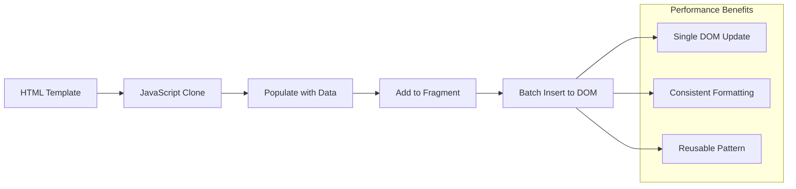

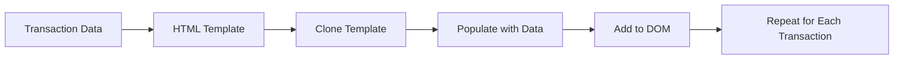

### चरण 1:
> ⚡ **प्रदर्शन सुधारणा**: [`document.createDocumentFragment()`](https://developer.mozilla.org/docs/Web/API/Document/createDocumentFragment) बोईंगच्या असेंब्ली प्रक्रियेप्रमाणे कार्य करते - घटक मुख्य रेषेपासून दूर तयार केले जातात आणि नंतर पूर्ण युनिट म्हणून स्थापित केले जातात. या बॅचिंग पद्धतीमुळे अनेक स्वतंत्र ऑपरेशन्सऐवजी एकाच समावेशाद्वारे DOM रीफ्लो कमी होतो.

### चरण 5: मिश्रित सामग्रीसाठी अपडेट फंक्शन सुधारित करा

तुमचे `updateElement()` फंक्शन सध्या फक्त मजकूर सामग्री हाताळते. ते मजकूर आणि DOM नोड्स दोन्हीवर कार्य करण्यासाठी अद्यतनित करा:

```javascript
function updateElement(id, textOrNode) {
  const element = document.getElementById(id);
  element.textContent = ''; // Removes all children
  element.append(textOrNode);
}
```

**या अद्यतनातील मुख्य सुधारणा:**
- नवीन सामग्री जोडण्यापूर्वी **मौजूदा सामग्री साफ करते**
- **मजकूर स्ट्रिंग्स किंवा DOM नोड्स** दोन्ही पॅरामीटर्स म्हणून स्वीकारते
- लवचिकतेसाठी [`append()`](https://developer.mozilla.org/docs/Web/API/ParentNode/append) पद्धतीचा वापर करते
- **मजकूर-आधारित विद्यमान वापरासह मागील सुसंगतता राखते**

### तुमचा डॅशबोर्ड चाचणीसाठी तयार करा

सत्याचा क्षण आला आहे! तुमचा डायनॅमिक डॅशबोर्ड अॅक्शनमध्ये पाहूया:

1. `test` खाते वापरून लॉग इन करा (त्यात नमुना डेटा तयार आहे)
2. तुमच्या डॅशबोर्डवर जा
3. व्यवहाराच्या रांगा योग्य स्वरूपनासह दिसत आहेत का ते तपासा
4. तारीख, वर्णन आणि रक्कम व्यवस्थित दिसत आहेत याची खात्री करा

जर सर्व काही कार्यरत असेल, तर तुम्हाला तुमच्या डॅशबोर्डवर पूर्णपणे कार्यशील व्यवहार सूची दिसेल! 🎉

**तुम्ही काय साध्य केले आहे:**
- कोणत्याही प्रमाणातील डेटासह स्केल होणारा डॅशबोर्ड तयार केला
- सुसंगत स्वरूपनासाठी पुनर्वापरयोग्य टेम्पलेट्स तयार केले
- कार्यक्षम DOM मॅनिप्युलेशन तंत्रे अंमलात आणली
- उत्पादन बँकिंग अनुप्रयोगांशी तुलनात्मक कार्यक्षमता विकसित केली

तुम्ही स्थिर वेबपृष्ठाला डायनॅमिक वेब अनुप्रयोगात यशस्वीरित्या रूपांतरित केले आहे.

### 🎯 शैक्षणिक तपासणी: डायनॅमिक सामग्री निर्मिती

**आर्किटेक्चर समज**: तुम्ही डेटा-टू-UI पाइपलाइन अंमलात आणली आहे जी React, Vue आणि Angular सारख्या फ्रेमवर्कमध्ये वापरल्या जाणाऱ्या पॅटर्न्सशी जुळते.

**मास्टर केलेले मुख्य संकल्पना**:
- **टेम्पलेट-आधारित रेंडरिंग**: पुनर्वापरयोग्य UI घटक तयार करणे
- **डॉक्युमेंट फ्रॅगमेंट्स**: DOM कार्यक्षमतेत सुधारणा करणे
- **सुरक्षित DOM मॅनिप्युलेशन**: सुरक्षा असुरक्षितता टाळणे
- **डेटा ट्रान्सफॉर्मेशन**: सर्व्हर डेटा वापरकर्ता इंटरफेसमध्ये रूपांतरित करणे

**उद्योग कनेक्शन**: या तंत्रांवर आधुनिक फ्रंटएंड फ्रेमवर्कची पायाभूत रचना तयार केली जाते. React चा व्हर्च्युअल DOM, Vue चा टेम्पलेट सिस्टम आणि Angular चा घटक आर्किटेक्चर हे सर्व या मुख्य संकल्पनांवर आधारित आहेत.

**चिंतन प्रश्न**: तुम्ही रिअल-टाइम अपडेट्स (जसे की नवीन व्यवहार स्वयंचलितपणे दिसणे) हाताळण्यासाठी ही प्रणाली कशी विस्तारित कराल? WebSockets किंवा Server-Sent Events विचारात घ्या.

---

## 📈 तुमचा डेटा व्यवस्थापन कौशल्य टाइमलाइन

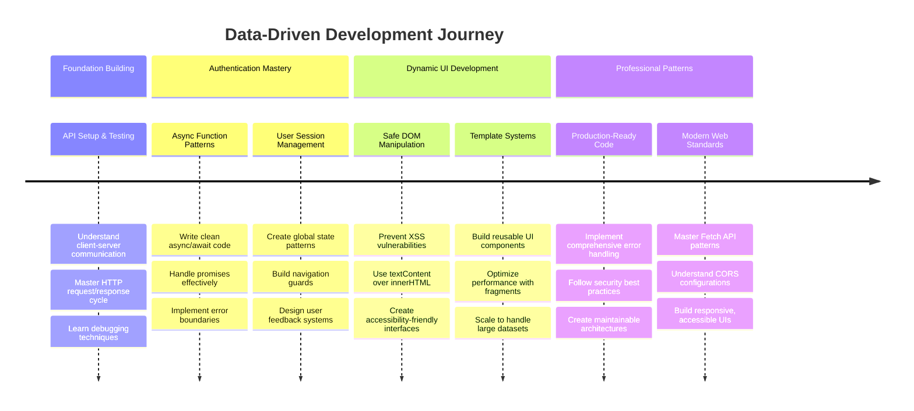

**🎓 पदवी माइलस्टोन**: तुम्ही आधुनिक JavaScript पॅटर्न्स वापरून पूर्ण डेटा-चालित वेब अनुप्रयोग यशस्वीरित्या तयार केला आहे. ही कौशल्ये React, Vue किंवा Angular सारख्या फ्रेमवर्कसह कार्य करण्यासाठी थेट अनुवादित होतात.

**🔄 पुढील स्तर क्षमता**:
- या संकल्पनांवर आधारित फ्रंटएंड फ्रेमवर्क एक्सप्लोर करण्यासाठी तयार
- WebSockets सह रिअल-टाइम वैशिष्ट्ये अंमलात आणण्यासाठी तयार
- ऑफलाइन क्षमता असलेल्या प्रोग्रेसिव्ह वेब अॅप्स तयार करण्यासाठी सुसज्ज
- प्रगत स्टेट मॅनेजमेंट पॅटर्न शिकण्यासाठी पाया तयार

## GitHub Copilot Agent Challenge 🚀

Agent मोड वापरून खालील आव्हान पूर्ण करा:

**वर्णन:** बँकिंग अॅपमध्ये व्यवहार शोध आणि फिल्टर वैशिष्ट्य अंमलात आणा जे वापरकर्त्यांना तारीख श्रेणी, रक्कम किंवा वर्णनाद्वारे विशिष्ट व्यवहार शोधण्याची परवानगी देते.

**प्रॉम्प्ट:** बँकिंग अॅपसाठी शोध कार्यक्षमता तयार करा ज्यामध्ये समाविष्ट आहे: 1) तारीख श्रेणी (पासून/पर्यंत), किमान/कमाल रक्कम आणि व्यवहार वर्णन कीवर्डसाठी इनपुट फील्डसह शोध फॉर्म, 2) `filterTransactions()` फंक्शन जे शोध निकषांवर आधारित account.transactions अॅरे फिल्टर करते, 3) `updateDashboard()` फंक्शन अद्यतनित करा जे फिल्टर केलेले परिणाम दर्शवते, आणि 4) दृश्य रीसेट करण्यासाठी "Clear Filters" बटण जोडा. आधुनिक JavaScript अॅरे पद्धती जसे की `filter()` वापरा आणि रिक्त शोध निकषांसाठी एज केस हाताळा.

[agent mode](https://code.visualstudio.com/blogs/2025/02/24/introducing-copilot-agent-mode) बद्दल अधिक जाणून घ्या.

## 🚀 आव्हान

तुमचे बँकिंग अॅप पुढील स्तरावर नेण्यासाठी तयार आहात? ते असे बनवूया की तुम्हाला ते वापरायचे वाटेल. तुमच्या सर्जनशीलतेला प्रेरणा देण्यासाठी काही कल्पना येथे आहेत:

**ते सुंदर बनवा**: CSS स्टाइलिंग जोडा जे तुमच्या कार्यात्मक डॅशबोर्डला व्हिज्युअली आकर्षक बनवेल. स्वच्छ रेषा, चांगले अंतर आणि कदाचित काही सूक्ष्म अॅनिमेशन विचार करा.

**ते प्रतिसादक्षम बनवा**: [मीडिया क्वेरीज](https://developer.mozilla.org/docs/Web/CSS/Media_Queries) वापरून [प्रतिसादक्षम डिझाइन](https://developer.mozilla.org/docs/Web/Progressive_web_apps/Responsive/responsive_design_building_blocks) तयार करण्याचा प्रयत्न करा जे फोन, टॅब्लेट आणि डेस्कटॉपवर उत्तम प्रकारे कार्य करते. तुमचे वापरकर्ते तुमचे आभार मानतील!

**थोडा आकर्षण जोडा**: व्यवहारांना रंग-कोडिंग करण्याचा विचार करा (उत्पन्नासाठी हिरवा, खर्चासाठी लाल), आयकॉन जोडणे किंवा इंटरफेसला परस्परसंवादी वाटण्यासाठी हवर इफेक्ट तयार करणे.

पॉलिश केलेला डॅशबोर्ड कसा दिसू शकतो याचे उदाहरण येथे आहे:


तुम्हाला हे अचूकपणे जुळवायचे आहे असे वाटत नाही - याचा प्रेरणास्रोत म्हणून वापर करा आणि ते तुमचे स्वतःचे बनवा!

## पोस्ट-लेक्चर क्विझ

[पोस्ट-लेक्चर क्विझ](https://ff-quizzes.netlify.app/web/quiz/46)

## असाइनमेंट

[तुमचा कोड पुनर्रचना करा आणि त्यावर टिप्पणी द्या](assignment.md)

---

**अस्वीकरण**:  
हा दस्तऐवज AI भाषांतर सेवा [Co-op Translator](https://github.com/Azure/co-op-translator) वापरून भाषांतरित करण्यात आला आहे. आम्ही अचूकतेसाठी प्रयत्नशील असलो तरी, कृपया लक्षात ठेवा की स्वयंचलित भाषांतरांमध्ये त्रुटी किंवा अचूकतेचा अभाव असू शकतो. मूळ भाषेतील दस्तऐवज हा अधिकृत स्रोत मानला जावा. महत्त्वाच्या माहितीसाठी, व्यावसायिक मानवी भाषांतराची शिफारस केली जाते. या भाषांतराचा वापर करून उद्भवलेल्या कोणत्याही गैरसमज किंवा चुकीच्या अर्थासाठी आम्ही जबाबदार राहणार नाही.