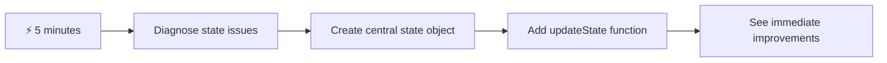
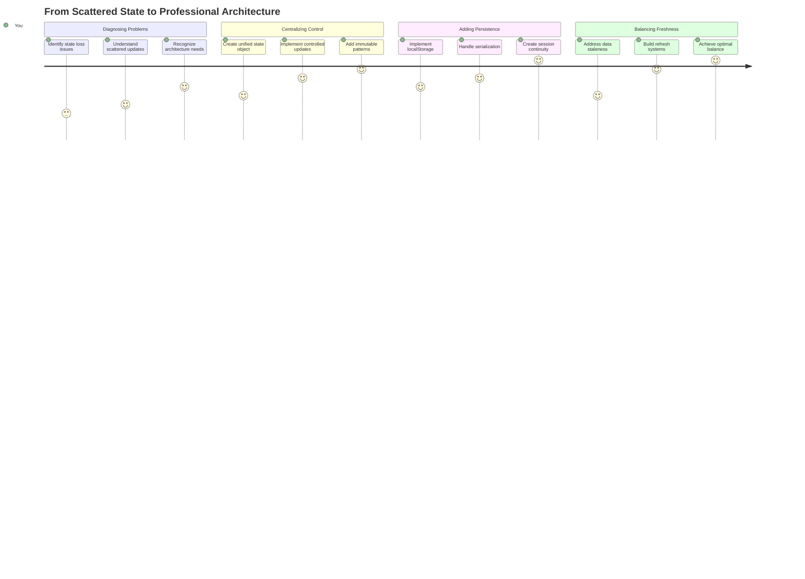
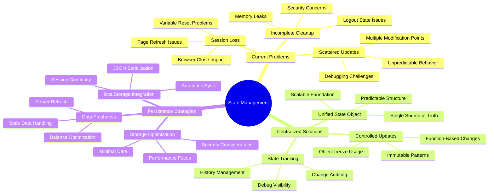
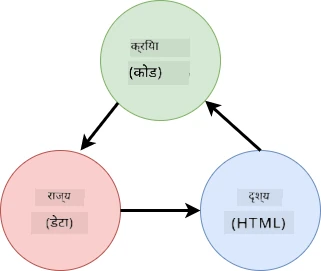
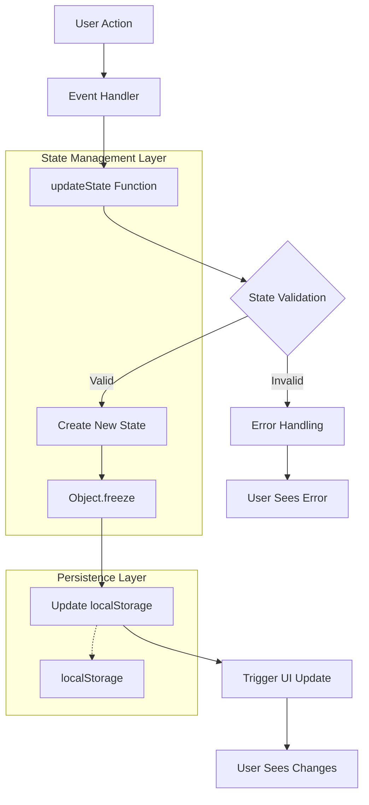
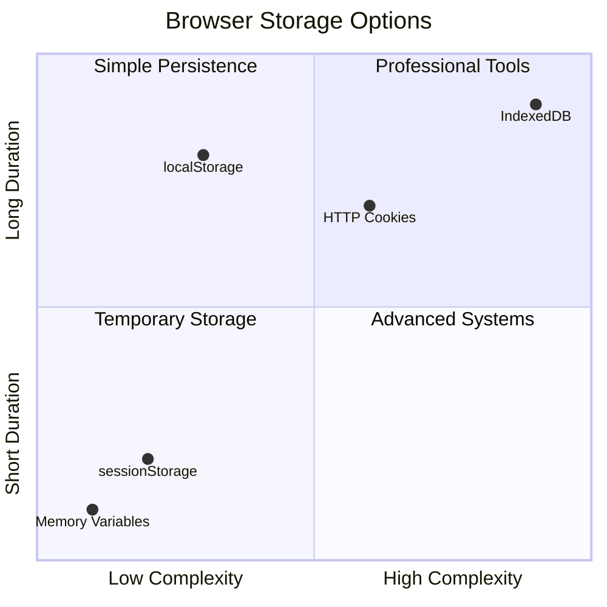
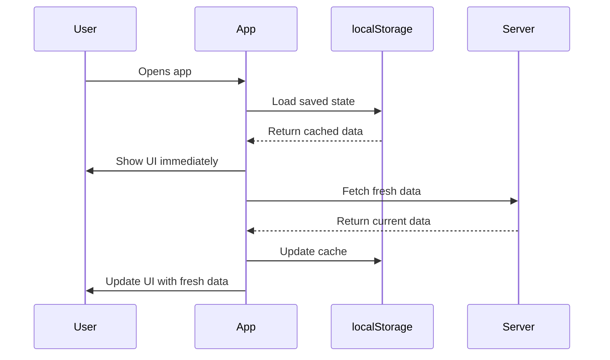
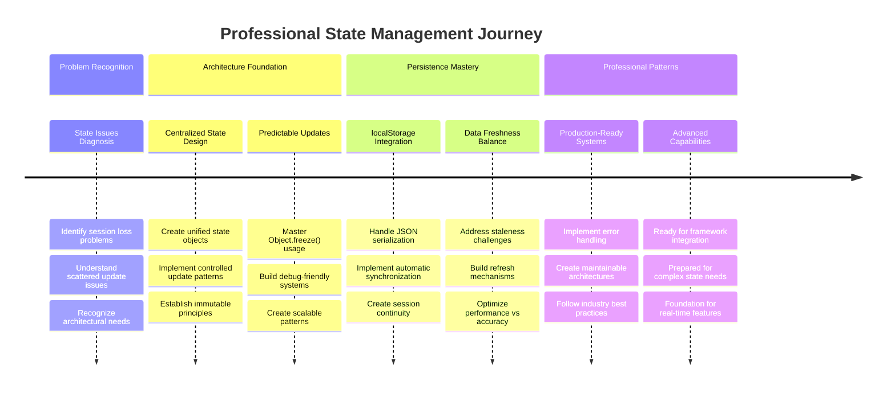

# बँकिंग अ‍ॅप तयार करा भाग 4: स्टेट मॅनेजमेंटची संकल्पना

## ⚡ पुढील 5 मिनिटांत तुम्ही काय करू शकता

**व्यस्त डेव्हलपर्ससाठी जलद सुरुवात मार्ग**



- **पहिला मिनिट**: सध्याच्या स्टेट समस्येची चाचणी करा - लॉगिन करा, पृष्ठ रीफ्रेश करा, लॉगआउट निरीक्षण करा
- **दुसरा मिनिट**: `let account = null` बदलून `let state = { account: null }` करा
- **तिसरा मिनिट**: नियंत्रित अद्यतनांसाठी साधा `updateState()` फंक्शन तयार करा
- **चौथा मिनिट**: नवीन पॅटर्न वापरण्यासाठी एक फंक्शन अपडेट करा
- **पाचवा मिनिट**: सुधारित अंदाज आणि डीबगिंग क्षमता तपासा

**जलद निदान चाचणी**:
```javascript
// Before: Scattered state
let account = null; // Lost on refresh!

// After: Centralized state
let state = Object.freeze({ account: null }); // Controlled and trackable!
```

**महत्त्व का आहे**: 5 मिनिटांत तुम्ही अराजक स्टेट मॅनेजमेंटमधून अंदाज लावता येणाऱ्या, डीबग करण्यायोग्य पॅटर्नमध्ये रूपांतर अनुभवाल. हे जटिल अ‍ॅप्लिकेशन्स टिकाऊ बनवण्याचा पाया आहे.

## 🗺️ स्टेट मॅनेजमेंट मास्टरीद्वारे तुमचा शिक्षण प्रवास



**तुमचा प्रवासाचा गंतव्य**: या धड्याच्या शेवटी, तुम्ही एक व्यावसायिक दर्जाचे स्टेट मॅनेजमेंट सिस्टम तयार केले असेल जे टिकाऊपणा, डेटा ताजेपणा आणि अंदाज लावता येणारे अद्यतन हाताळते - उत्पादन अ‍ॅप्लिकेशन्समध्ये वापरलेले समान पॅटर्न.

## प्री-लेक्चर क्विझ

[प्री-लेक्चर क्विझ](https://ff-quizzes.netlify.app/web/quiz/47)

## परिचय

स्टेट मॅनेजमेंट म्हणजे व्हॉयजर स्पेसक्राफ्टवरील नेव्हिगेशन सिस्टमसारखे आहे – जेव्हा सर्व काही सुरळीत चालू असते, तेव्हा तुम्हाला त्याची जाणीवही होत नाही. पण जेव्हा गोष्टी चुकतात, तेव्हा ते आंतरतारकीय जागेत पोहोचण्याचा आणि ब्रह्मांडीय पोकळीत हरवण्याचा फरक बनतो. वेब डेव्हलपमेंटमध्ये, स्टेट म्हणजे तुमच्या अ‍ॅप्लिकेशनला लक्षात ठेवण्याची गरज असलेली प्रत्येक गोष्ट: वापरकर्ता लॉगिन स्थिती, फॉर्म डेटा, नेव्हिगेशन इतिहास आणि तात्पुरते इंटरफेस स्टेट्स.

तुमचे बँकिंग अ‍ॅप साध्या लॉगिन फॉर्ममधून अधिक प्रगत अ‍ॅप्लिकेशनमध्ये विकसित झाल्यामुळे, तुम्हाला काही सामान्य आव्हाने आढळली असतील. पृष्ठ रीफ्रेश करा आणि वापरकर्ते अनपेक्षितपणे लॉगआउट होतात. ब्राउझर बंद करा आणि सर्व प्रगती गायब होते. समस्या डीबग करा आणि तुम्ही अनेक फंक्शन्समधून डेटा बदलत असलेल्या समस्यांचा शोध घेत आहात.

हे खराब कोडिंगचे संकेत नाहीत – जेव्हा अ‍ॅप्लिकेशन्स विशिष्ट जटिलतेच्या थ्रेशोल्डवर पोहोचतात तेव्हा नैसर्गिक वाढीच्या वेदना होतात. प्रत्येक डेव्हलपरला ही आव्हाने सामोरे जावे लागतात कारण त्यांचे अ‍ॅप्स "प्रूफ ऑफ कॉन्सेप्ट" पासून "प्रॉडक्शन रेडी" मध्ये संक्रमण करतात.

या धड्यात, आम्ही एक केंद्रीकृत स्टेट मॅनेजमेंट सिस्टम लागू करू जी तुमचे बँकिंग अ‍ॅप एक विश्वासार्ह, व्यावसायिक अ‍ॅप्लिकेशनमध्ये रूपांतरित करते. तुम्ही डेटा प्रवाह अंदाज लावता येण्यासारखे व्यवस्थापित करणे, वापरकर्ता सत्र योग्य प्रकारे टिकवणे आणि आधुनिक वेब अ‍ॅप्लिकेशन्ससाठी आवश्यक असलेला गुळगुळीत वापरकर्ता अनुभव तयार करणे शिकाल.

## पूर्वतयारी

स्टेट मॅनेजमेंट संकल्पनांमध्ये जाण्यापूर्वी, तुमचे डेव्हलपमेंट वातावरण योग्य प्रकारे सेट केलेले असणे आणि तुमचे बँकिंग अ‍ॅप फाउंडेशन तयार असणे आवश्यक आहे. या मालिकेच्या मागील भागांमधील संकल्पना आणि कोडवर हा धडा थेट तयार केला आहे.

पुढे जाण्यापूर्वी खालील घटक तयार असल्याची खात्री करा:

**आवश्यक सेटअप:**
- [डेटा फेचिंग धडा](../3-data/README.md) पूर्ण करा - तुमचे अ‍ॅप खाते डेटा यशस्वीरित्या लोड आणि प्रदर्शित करावे
- तुमच्या सिस्टमवर [Node.js](https://nodejs.org) इंस्टॉल करा बॅकएंड API चालवण्यासाठी
- खाते डेटा ऑपरेशन्स हाताळण्यासाठी [सर्व्हर API](../api/README.md) स्थानिकपणे सुरू करा

**तुमचे वातावरण तपासणे:**

तुमचा API सर्व्हर योग्यरित्या चालू आहे की नाही हे खालील कमांड टर्मिनलमध्ये चालवून सत्यापित करा:

```sh
curl http://localhost:5000/api
# -> should return "Bank API v1.0.0" as a result
```

**ही कमांड काय करते:**
- **GET विनंती पाठवते** तुमच्या स्थानिक API सर्व्हरला
- **कनेक्शन तपासते** आणि सर्व्हर प्रतिसाद देत आहे की नाही हे सत्यापित करते
- **API आवृत्ती माहिती परत करते** जर सर्व काही योग्य प्रकारे कार्य करत असेल

## 🧠 स्टेट मॅनेजमेंट आर्किटेक्चरचा आढावा



**मुख्य तत्त्व**: व्यावसायिक स्टेट मॅनेजमेंट अंदाज लावता येण्याजोगा, टिकाऊपणा आणि कार्यक्षमता यांचे संतुलन राखते जे साध्या संवादांपासून ते जटिल अ‍ॅप्लिकेशन वर्कफ्लोपर्यंत विश्वासार्ह वापरकर्ता अनुभव तयार करते.

---

## सध्याच्या स्टेट समस्यांचे निदान

शेरलॉक होम्सने गुन्ह्याच्या ठिकाणाचा तपास केल्याप्रमाणे, वापरकर्ता सत्र गायब होण्याच्या रहस्याचा उलगडा करण्यापूर्वी आपल्याला आपल्या सध्याच्या अंमलबजावणीमध्ये नेमके काय घडत आहे हे समजून घेणे आवश्यक आहे.

चला एक साधा प्रयोग करूया जो अंतर्निहित स्टेट मॅनेजमेंट आव्हाने उघड करतो:

**🧪 हा निदान चाचणी करा:**
1. तुमच्या बँकिंग अ‍ॅपमध्ये लॉगिन करा आणि डॅशबोर्डवर जा
2. ब्राउझर पृष्ठ रीफ्रेश करा
3. तुमच्या लॉगिन स्थितीवर काय परिणाम होतो ते निरीक्षण करा

जर तुम्हाला लॉगिन स्क्रीनवर परत पाठवले गेले असेल, तर तुम्ही क्लासिक स्टेट टिकाऊपणा समस्या शोधली आहे. हे वर्तन घडते कारण आमची सध्याची अंमलबजावणी वापरकर्ता डेटा जावास्क्रिप्ट व्हेरिएबल्समध्ये संग्रहित करते जे प्रत्येक पृष्ठ लोडसह रीसेट होते.

**सध्याच्या अंमलबजावणीतील समस्या:**

आमच्या [मागील धड्याच्या](../3-data/README.md) साध्या `account` व्हेरिएबलमुळे तीन महत्त्वाच्या समस्या निर्माण होतात ज्या वापरकर्ता अनुभव आणि कोड टिकाऊपणावर परिणाम करतात:

| समस्या | तांत्रिक कारण | वापरकर्त्याचा परिणाम |
|---------|--------|----------------|
| **सत्र गमावणे** | पृष्ठ रीफ्रेश जावास्क्रिप्ट व्हेरिएबल्स साफ करते | वापरकर्त्यांना वारंवार पुन्हा प्रमाणीकरण करावे लागते |
| **विखुरलेले अद्यतन** | अनेक फंक्शन्स थेट स्टेट बदलतात | डीबगिंग अधिकाधिक कठीण होते |
| **अपूर्ण साफसफाई** | लॉगआउट सर्व स्टेट संदर्भ साफ करत नाही | संभाव्य सुरक्षा आणि गोपनीयता चिंता |

**आर्किटेक्चरल आव्हान:**

टायटॅनिकच्या विभागीकृत डिझाइनप्रमाणे जे अनेक विभाग एकाच वेळी भरले तेव्हा मजबूत वाटले, या समस्यांचे स्वतंत्रपणे निराकरण करणे अंतर्निहित आर्किटेक्चरल समस्येचे निराकरण करणार नाही. आपल्याला एक व्यापक स्टेट मॅनेजमेंट सोल्यूशन आवश्यक आहे.

> 💡 **आपण येथे नेमके काय साध्य करण्याचा प्रयत्न करत आहोत?**

[स्टेट मॅनेजमेंट](https://en.wikipedia.org/wiki/State_management) खरोखर दोन मूलभूत कोड सोडवण्याबद्दल आहे:

1. **माझा डेटा कुठे आहे?**: आपल्याकडे कोणती माहिती आहे आणि ती कोठून येत आहे हे लक्षात ठेवणे
2. **सर्वजण एकाच पानावर आहेत का?**: वापरकर्त्यांना जे दिसते ते प्रत्यक्षात काय घडत आहे याशी जुळते याची खात्री करणे

**आमची गेम योजना:**

आम्ही आमच्या शेपटीचा पाठलाग करण्याऐवजी, आम्ही एक **केंद्रीकृत स्टेट मॅनेजमेंट** सिस्टम तयार करणार आहोत. हे सर्व महत्त्वाच्या गोष्टींच्या व्यवस्थेसाठी एक अतिशय व्यवस्थित व्यक्ती असल्यासारखे विचार करा:





**या डेटा प्रवाहाचे समजून घेणे:**
- **केंद्रीकृत** सर्व अ‍ॅप्लिकेशन स्टेट एका ठिकाणी
- **मार्गदर्शन** सर्व स्टेट बदल नियंत्रित फंक्शन्सद्वारे
- **सुनिश्चित करते** UI सध्याच्या स्टेटशी समक्रमित राहते
- **प्रदान करते** डेटा व्यवस्थापनासाठी स्पष्ट, अंदाज लावता येण्याजोगा पॅटर्न

> 💡 **व्यावसायिक अंतर्दृष्टी**: हा धडा मूलभूत संकल्पनांवर लक्ष केंद्रित करतो. जटिल अ‍ॅप्लिकेशन्ससाठी, [Redux](https://redux.js.org) सारख्या लायब्ररी अधिक प्रगत स्टेट मॅनेजमेंट वैशिष्ट्ये प्रदान करतात. या मूलभूत तत्त्वांचे समजून घेणे तुम्हाला कोणत्याही स्टेट मॅनेजमेंट लायब्ररीमध्ये प्रभुत्व मिळविण्यात मदत करेल.

> ⚠️ **प्रगत विषय**: आम्ही स्टेट बदलांद्वारे ट्रिगर केलेल्या स्वयंचलित UI अद्यतनांचा समावेश करणार नाही, कारण यामध्ये [Reactive Programming](https://en.wikipedia.org/wiki/Reactive_programming) संकल्पनांचा समावेश आहे. तुमच्या शिक्षण प्रवासासाठी हा एक उत्कृष्ट पुढील टप्पा मानला जाऊ शकतो!

### कार्य: स्टेट स्ट्रक्चर केंद्रीकृत करा

चला आपल्या विखुरलेल्या स्टेट मॅनेजमेंटला केंद्रीकृत सिस्टममध्ये रूपांतरित करण्यास सुरुवात करूया. हे पहिले पाऊल सर्व सुधारणांसाठी पाया तयार करते.

**पाऊल 1: केंद्रीकृत स्टेट ऑब्जेक्ट तयार करा**

साध्या `account` घोषणेला बदला:

```js
let account = null;
```

स्ट्रक्चर्ड स्टेट ऑब्जेक्टसह:

```js
let state = {
  account: null
};
```

**या बदलाचा महत्त्व का आहे:**
- **केंद्रीकृत करते** सर्व अ‍ॅप्लिकेशन डेटा एका ठिकाणी
- **तयार करते** नंतर अधिक स्टेट गुणधर्म जोडण्यासाठी संरचना
- **निर्माण करते** स्टेट आणि इतर व्हेरिएबल्स दरम्यान स्पष्ट सीमा
- **स्थापित करते** पॅटर्न जो तुमचे अ‍ॅप वाढत असताना स्केल होतो

**पाऊल 2: स्टेट ऍक्सेस पॅटर्न अपडेट करा**

तुमच्या फंक्शन्सला नवीन स्टेट स्ट्रक्चर वापरण्यासाठी अपडेट करा:

**`register()` आणि `login()` फंक्शन्समध्ये**, बदला:
```js
account = ...
```

सह:
```js
state.account = ...
```

**`updateDashboard()` फंक्शनमध्ये**, वरच्या बाजूला ही ओळ जोडा:
```js
const account = state.account;
```

**या अद्यतनांमुळे काय साध्य होते:**
- **सध्याची कार्यक्षमता टिकवते** आणि संरचनेत सुधारणा करते
- **तयार करते** तुमचा कोड अधिक प्रगत स्टेट मॅनेजमेंटसाठी
- **सुसंगत पॅटर्न तयार करते** स्टेट डेटा ऍक्सेस करण्यासाठी
- **स्थापित करते** केंद्रीकृत स्टेट अद्यतनांसाठी पाया

> 💡 **टीप**: हे पुनर्रचना त्वरित आमच्या समस्यांचे निराकरण करत नाही, परंतु येणाऱ्या शक्तिशाली सुधारणांसाठी आवश्यक पाया तयार करते!

### 🎯 शैक्षणिक तपासणी: केंद्रीकरण तत्त्वे

**थांबा आणि विचार करा**: तुम्ही केंद्रीकृत स्टेट मॅनेजमेंटचा पाया अंमलात आणला आहे. हा एक महत्त्वाचा आर्किटेक्चरल निर्णय आहे.

**जलद स्व-मूल्यांकन**:
- तुम्ही स्पष्ट करू शकता का की स्टेट एका ऑब्जेक्टमध्ये केंद्रीकृत करणे विखुरलेल्या व्हेरिएबल्सपेक्षा चांगले का आहे?
- जर तुम्ही `state.account` वापरण्यासाठी फंक्शन अपडेट करणे विसरलात तर काय होईल?
- हा पॅटर्न तुमच्या कोडला अधिक प्रगत वैशिष्ट्यांसाठी कसा तयार करतो?

**वास्तविक-जगाशी कनेक्शन**: तुम्ही शिकलेला केंद्रीकरण पॅटर्न Redux, Vuex आणि React Context सारख्या आधुनिक फ्रेमवर्कचा पाया आहे. तुम्ही प्रमुख अ‍ॅप्लिकेशन्समध्ये वापरलेले समान आर्किटेक्चरल विचार तयार करत आहात.

**चॅलेंज प्रश्न**: जर तुम्हाला तुमच्या अ‍ॅपमध्ये वापरकर्ता प्राधान्ये (थीम, भाषा) जोडायची असतील, तर तुम्ही ती स्टेट स्ट्रक्चरमध्ये कुठे जोडाल? हे कसे स्केल होईल?

## नियंत्रित स्टेट अद्यतनांची अंमलबजावणी

आमचा स्टेट केंद्रीकृत झाल्यामुळे, पुढील पाऊल म्हणजे डेटा बदलांसाठी नियंत्रित यंत्रणा स्थापित करणे. ही पद्धत अंदाज लावता येण्याजोगे स्टेट बदल आणि सोपे डीबगिंग सुनिश्चित करते.

मुख्य तत्त्व एअर ट्रॅफिक कंट्रोलसारखे आहे: अनेक फंक्शन्सना स्वतंत्रपणे स्टेट बदलण्याची परवानगी देण्याऐवजी, आम्ही सर्व बदल एका नियंत्रित फंक्शनद्वारे चॅनेल करतो. ही पद्धत डेटा बदल कधी आणि कसे घडतात याचे स्पष्ट निरीक्षण प्रदान करते.

**इम्युटेबल स्टेट मॅनेजमेंट:**

आम्ही आमच्या `state` ऑब्जेक्टला [*immutable*](https://en.wikipedia.org/wiki/Immutable_object) मानणार आहोत, म्हणजे आम्ही त्याला थेट बदलणार नाही. त्याऐवजी, प्रत्येक बदल नवीन स्टेट ऑब्जेक्ट तयार करतो ज्यामध्ये अद्यतनित डेटा असतो.

ही पद्धत थेट बदलांच्या तुलनेत सुरुवातीला अकार्यक्षम वाटू शकते, परंतु डीबगिंग, चाचणी आणि अ‍ॅप्लिकेशन अंदाज लावता येण्याजोगे ठेवण्यासाठी ती महत्त्वपूर्ण फायदे प्रदान करते.

**इम्युटेबल स्टेट मॅनेजमेंटचे फायदे:**

| फायदा | वर्णन | परिणाम |
|---------|-------------|--------|
| **अंदाज लावता येण्याजोगा** | बदल फक्त नियंत्रित फंक्शन्सद्वारे होतात | डीबग आणि चाचणी करणे सोपे |
| **इतिहास ट्रॅकिंग** | प्रत्येक स्टेट बदल नवीन ऑब्जेक्ट तयार करतो | Undo/Redo कार्यक्षमता सक्षम करते |
| **साइड इफेक्ट प्रतिबंध** | कोणतेही अनपेक्षित बदल नाहीत | रहस्यमय बग्स टाळते |
| **कार्यक्षमता ऑप्टिमायझेशन** | स्टेट प्रत्यक्षात बदलला आहे की नाही हे शोधणे सोपे | कार्यक्षम UI अद्यतन सक्षम करते |

**जावास्क्रिप्ट इम्युटेबिलिटी `Object.freeze()` सह:**

जावास्क्रिप्ट [`Object.freeze()`](https://developer.mozilla.org/docs/Web/JavaScript/Reference/Global_Objects/Object/freeze) प्रदान करते ऑब्जेक्ट बदल रोखण्यासाठी:

```js
const immutableState = Object.freeze({ account: userData });
// Any attempt to modify immutableState will throw an error
```

**येथे काय घडते याचे विश्लेषण:**
- **थेट प्रॉपर्टी असाइनमेंट किंवा हटवणे रोखते**
- **बदल करण्याच्या प्रयत्नांवर अपवाद फेकते**
- **सुनिश्चित करते** स्टेट बदल नियंत्रित फंक्शन्सद्वारे होणे आवश्यक आहे
- **स्पष्ट करार तयार करते** स्टेट कसा अपडेट केला जाऊ शकतो यासाठी

> 💡 **सखोल अभ्यास**: [MDN दस्तऐवज](https://developer.mozilla.org/docs/Web/JavaScript/Reference/Global_Objects/Object/freeze#What_is_shallow_freeze) मध्ये *शॅलो* आणि *डीप* इम्युटेबल ऑब्जेक्ट्समधील फरक जाणून घ्या. जटिल
| **ते किती काळ टिकावे?** | लॉगिन स्थिती व तात्पुरते UI प्राधान्य | योग्य संचयन कालावधी निवडा |
| **सर्व्हरला याची गरज आहे का?** | प्रमाणीकरण टोकन व UI सेटिंग्ज | सामायिकरणाच्या गरजा ठरवा |

**ब्राउझर संचयन पर्याय:**

आधुनिक ब्राउझर विविध संचयन यंत्रणा प्रदान करतात, प्रत्येक वेगवेगळ्या उपयोगासाठी डिझाइन केलेली आहे:

**प्राथमिक संचयन API:**

1. **[`localStorage`](https://developer.mozilla.org/docs/Web/API/Window/localStorage)**: कायमस्वरूपी [की/मूल्य संचयन](https://en.wikipedia.org/wiki/Key%E2%80%93value_database)
   - **कायम टिकते** ब्राउझर सत्रांमध्ये अनिश्चित काळासाठी  
   - **ब्राउझर पुन्हा सुरू केल्यावर आणि संगणक रीबूट केल्यावर टिकते**
   - **विशिष्ट वेबसाइट डोमेनसाठी मर्यादित**
   - **उत्तम** वापरकर्ता प्राधान्ये आणि लॉगिन स्थितीसाठी

2. **[`sessionStorage`](https://developer.mozilla.org/docs/Web/API/Window/sessionStorage)**: तात्पुरते सत्र संचयन
   - **localStorage प्रमाणेच कार्य करते** सक्रिय सत्रांमध्ये
   - **स्वतःहून साफ होते** ब्राउझर टॅब बंद झाल्यावर
   - **आदर्श** तात्पुरत्या डेटासाठी जी टिकून राहू नये

3. **[HTTP Cookies](https://developer.mozilla.org/docs/Web/HTTP/Cookies)**: सर्व्हर-सामायिक संचयन
   - **स्वतःहून पाठवले जाते** प्रत्येक सर्व्हर विनंतीसह
   - **उत्तम** [प्रमाणीकरण](https://en.wikipedia.org/wiki/Authentication) टोकनसाठी
   - **मर्यादित** आकारात आणि कार्यक्षमतेवर परिणाम करू शकते

**डेटा सिरियलायझेशनची आवश्यकता:**

`localStorage` आणि `sessionStorage` फक्त [स्ट्रिंग्स](https://developer.mozilla.org/docs/Web/JavaScript/Reference/Global_Objects/String) संचयित करतात:

```js
// Convert objects to JSON strings for storage
const accountData = { user: 'john', balance: 150 };
localStorage.setItem('account', JSON.stringify(accountData));

// Parse JSON strings back to objects when retrieving
const savedAccount = JSON.parse(localStorage.getItem('account'));
```

**सिरियलायझेशन समजून घेणे:**
- **जावास्क्रिप्ट ऑब्जेक्ट्सना JSON स्ट्रिंग्समध्ये रूपांतरित करते** [`JSON.stringify()`](https://developer.mozilla.org/docs/Web/JavaScript/Reference/Global_Objects/JSON/stringify) वापरून
- **JSON मधून ऑब्जेक्ट्स पुन्हा तयार करते** [`JSON.parse()`](https://developer.mozilla.org/docs/Web/JavaScript/Reference/Global_Objects/JSON/parse) वापरून
- **स्वतःहून जटिल नेस्टेड ऑब्जेक्ट्स आणि अ‍ॅरे हाताळते**
- **फेल होते** फंक्शन्स, अनिर्दिष्ट मूल्ये, आणि सर्क्युलर संदर्भांवर

> 💡 **प्रगत पर्याय**: मोठ्या डेटासेटसह जटिल ऑफलाइन अ‍ॅप्ससाठी, [`IndexedDB` API](https://developer.mozilla.org/docs/Web/API/IndexedDB_API) विचारात घ्या. हे पूर्ण क्लायंट-साइड डेटाबेस प्रदान करते परंतु अधिक जटिल अंमलबजावणीची आवश्यकता असते.



### कार्य: localStorage टिकवून ठेवणे अंमलात आणा

चला टिकाऊ संचयन अंमलात आणूया जेणेकरून वापरकर्ते स्पष्टपणे लॉगआउट होईपर्यंत लॉग इन राहतील. आम्ही `localStorage` वापरून खाते डेटा ब्राउझर सत्रांमध्ये संचयित करू.

**पायरी 1: संचयन कॉन्फिगरेशन परिभाषित करा**

```js
const storageKey = 'savedAccount';
```

**हा स्थिरांक काय प्रदान करतो:**
- **आमच्या संचयित डेटासाठी सुसंगत ओळखकर्ता तयार करतो**
- **संचयन की संदर्भांमध्ये टायपो टाळतो**
- **संचयन की बदलणे सोपे बनवतो**
- **देखभालक्षम कोडसाठी सर्वोत्तम पद्धतींचे अनुसरण करतो**

**पायरी 2: स्वयंचलित टिकवून ठेवणे जोडा**

`updateState()` फंक्शनच्या शेवटी ही ओळ जोडा:

```js
localStorage.setItem(storageKey, JSON.stringify(state.account));
```

**येथे काय घडते याचे विश्लेषण:**
- **खाते ऑब्जेक्ट JSON स्ट्रिंगमध्ये रूपांतरित करते** संचयनासाठी
- **आमच्या सुसंगत संचयन की वापरून डेटा सेव्ह करते**
- **स्वयंचलितपणे अंमलात आणते** जेव्हा राज्य बदल होतात
- **सुनिश्चित करते** की संचयित डेटा सद्य स्थितीसह नेहमी समक्रमित असतो

> 💡 **आर्किटेक्चरचा फायदा**: कारण आम्ही सर्व राज्य अद्यतने `updateState()` मध्ये केंद्रीकृत केली आहेत, टिकवून ठेवणे जोडण्यासाठी फक्त एक ओळ कोड आवश्यक होती. हे चांगल्या आर्किटेक्चरल निर्णयांचे सामर्थ्य दर्शवते!

**पायरी 3: अ‍ॅप लोडवर राज्य पुनर्संचयित करा**

संचयित डेटा पुनर्संचयित करण्यासाठी एक प्रारंभिक फंक्शन तयार करा:

```js
function init() {
  const savedAccount = localStorage.getItem(storageKey);
  if (savedAccount) {
    updateState('account', JSON.parse(savedAccount));
  }

  // Our previous initialization code
  window.onpopstate = () => updateRoute();
  updateRoute();
}

init();
```

**प्रारंभिक प्रक्रियेचे समजून घेणे:**
- **localStorage मधून पूर्वी सेव्ह केलेला खाते डेटा पुनर्प्राप्त करते**
- **JSON स्ट्रिंग पुन्हा जावास्क्रिप्ट ऑब्जेक्टमध्ये पार्स करते**
- **आमच्या नियंत्रित अद्यतन फंक्शनचा वापर करून राज्य अद्यतनित करते**
- **पृष्ठ लोडवर वापरकर्त्याचे सत्र स्वयंचलितपणे पुनर्संचयित करते**
- **मार्ग अद्यतनांपूर्वी अंमलात आणते** जेणेकरून राज्य उपलब्ध असेल

**पायरी 4: डीफॉल्ट मार्ग ऑप्टिमाइझ करा**

टिकवून ठेवण्याचा फायदा घेण्यासाठी डीफॉल्ट मार्ग अद्यतनित करा:

`updateRoute()` मध्ये, बदला:
```js
// Replace: return navigate('/login');
return navigate('/dashboard');
```

**का हा बदल योग्य आहे:**
- **आमच्या नवीन टिकवून ठेवण्याच्या प्रणालीचा प्रभावीपणे उपयोग करते**
- **डॅशबोर्डला प्रमाणीकरण तपासणी हाताळण्याची परवानगी देते**
- **संचयित सत्र अस्तित्वात नसल्यास स्वयंचलितपणे लॉगिनकडे पुनर्निर्देशित करते**
- **वापरकर्त्याचा अनुभव अधिक सहज बनवते**

**तुमच्या अंमलबजावणीची चाचणी:**

1. तुमच्या बँकिंग अ‍ॅपमध्ये लॉग इन करा
2. ब्राउझर पृष्ठ रीफ्रेश करा
3. खात्री करा की तुम्ही लॉग इन राहता आणि डॅशबोर्डवर असता
4. तुमचा ब्राउझर बंद करा आणि पुन्हा उघडा
5. तुमच्या अ‍ॅपकडे परत जा आणि खात्री करा की तुम्ही अजूनही लॉग इन आहात

🎉 **साध्य केलेले यश**: तुम्ही टिकाऊ राज्य व्यवस्थापन यशस्वीरित्या अंमलात आणले आहे! तुमचे अ‍ॅप आता व्यावसायिक वेब अ‍ॅप्लिकेशनसारखे वागते.

### 🎯 शैक्षणिक तपासणी: टिकवून ठेवण्याचे आर्किटेक्चर

**आर्किटेक्चर समजून घेणे**: तुम्ही एक परिष्कृत टिकवून ठेवण्याची प्रणाली अंमलात आणली आहे जी वापरकर्त्याचा अनुभव आणि डेटा व्यवस्थापनाची गुंतागुंत यामध्ये संतुलन राखते.

**मुख्य संकल्पना आत्मसात केल्या**:
- **JSON सिरियलायझेशन**: जटिल ऑब्जेक्ट्स स्टोरेबल स्ट्रिंग्समध्ये रूपांतरित करणे
- **स्वयंचलित समक्रमण**: राज्य बदल टिकाऊ संचयन ट्रिगर करतात
- **सत्र पुनर्प्राप्ती**: अ‍ॅप्स व्यत्ययांनंतर वापरकर्त्याचा संदर्भ पुनर्संचयित करू शकतात
- **केंद्रीकृत टिकवून ठेवणे**: एक अद्यतन फंक्शन सर्व संचयन हाताळते

**उद्योग कनेक्शन**: ही टिकवून ठेवण्याची पद्धत प्रोग्रेसिव वेब अ‍ॅप्स (PWAs), ऑफलाइन-प्रथम अ‍ॅप्लिकेशन्स, आणि आधुनिक मोबाइल वेब अनुभवांसाठी मूलभूत आहे. तुम्ही उत्पादन-स्तरीय क्षमता तयार करत आहात.

**चिंतन प्रश्न**: तुम्ही ही प्रणाली कशी बदलाल जेणेकरून एकाच डिव्हाइसवर अनेक वापरकर्त्यांची खाती हाताळता येतील? गोपनीयता आणि सुरक्षा परिणामांचा विचार करा.

## टिकवून ठेवणे आणि डेटा ताजेपणामध्ये संतुलन राखणे

आपली टिकवून ठेवण्याची प्रणाली यशस्वीरित्या वापरकर्त्याची सत्रे टिकवून ठेवते, परंतु एक नवीन आव्हान निर्माण करते: डेटा जुना होणे. जेव्हा अनेक वापरकर्ते किंवा अ‍ॅप्स समान सर्व्हर डेटा बदलतात, तेव्हा स्थानिक कॅश केलेली माहिती कालबाह्य होते.

ही परिस्थिती वायकिंग नेव्हिगेटर्ससारखी आहे ज्यांनी संग्रहित ताऱ्यांच्या चार्ट्सवर आणि वर्तमान आकाशीय निरीक्षणांवर अवलंबून राहिले. चार्ट्स सातत्य प्रदान करतात, परंतु नेव्हिगेटर्सना बदलत्या परिस्थितींचा विचार करण्यासाठी ताजी निरीक्षणे आवश्यक असतात. त्याचप्रमाणे, आपल्या अ‍ॅप्लिकेशनला टिकाऊ वापरकर्ता स्थिती आणि वर्तमान सर्व्हर डेटा दोन्ही आवश्यक आहे.

**🧪 डेटा ताजेपणाचा समस्या शोधणे:**

1. `test` खाते वापरून डॅशबोर्डमध्ये लॉग इन करा
2. दुसऱ्या स्रोताकडून व्यवहार अनुकरण करण्यासाठी टर्मिनलमध्ये हा आदेश चालवा:

```sh
curl --request POST \
     --header "Content-Type: application/json" \
     --data "{ \"date\": \"2020-07-24\", \"object\": \"Bought book\", \"amount\": -20 }" \
     http://localhost:5000/api/accounts/test/transactions
```

3. ब्राउझरमध्ये तुमचे डॅशबोर्ड पृष्ठ रीफ्रेश करा
4. नवीन व्यवहार दिसतो का ते निरीक्षण करा

**ही चाचणी काय दर्शवते:**
- **दाखवते** की स्थानिक संचयन "जुने" (कालबाह्य) होऊ शकते
- **अनुकरण करते** वास्तविक परिस्थिती जिथे डेटा बदल अ‍ॅपच्या बाहेर होतो
- **प्रकट करते** टिकवून ठेवणे आणि डेटा ताजेपणामधील तणाव

**डेटा जुना होण्याचे आव्हान:**

| समस्या | कारण | वापरकर्त्याचा परिणाम |
|--------|-------|-----------------------|
| **जुना डेटा** | localStorage स्वयंचलितपणे कालबाह्य होत नाही | वापरकर्त्यांना कालबाह्य माहिती दिसते |
| **सर्व्हर बदल** | इतर अ‍ॅप्स/वापरकर्ते समान डेटा बदलतात | प्लॅटफॉर्म्समध्ये विसंगत दृश्ये |
| **कॅश वि. वास्तव** | स्थानिक कॅश सर्व्हर स्थितीशी जुळत नाही | खराब वापरकर्ता अनुभव आणि गोंधळ |

**समाधान धोरण:**

आम्ही "लोडवर रीफ्रेश" पॅटर्न अंमलात आणू जो टिकवून ठेवण्याचे फायदे आणि ताज्या डेटाची आवश्यकता यामध्ये संतुलन राखतो. हा दृष्टिकोन गुळगुळीत वापरकर्ता अनुभव राखतो आणि डेटा अचूकता सुनिश्चित करतो.



### कार्य: डेटा रीफ्रेश प्रणाली अंमलात आणा

आम्ही एक प्रणाली तयार करू जी टिकाऊ राज्य व्यवस्थापनाच्या फायद्यांसह सर्व्हरकडून स्वयंचलितपणे ताजे डेटा प्राप्त करते.

**पायरी 1: खाते डेटा अद्यतनकर्ता तयार करा**

```js
async function updateAccountData() {
  const account = state.account;
  if (!account) {
    return logout();
  }

  const data = await getAccount(account.user);
  if (data.error) {
    return logout();
  }

  updateState('account', data);
}
```

**या फंक्शनच्या लॉजिकचे समजून घेणे:**
- **तपासते** की सध्या वापरकर्ता लॉग इन आहे का (state.account अस्तित्वात आहे)
- **वैध सत्र नसल्यास लॉगआउटकडे पुनर्निर्देशित करते**
- **अस्तित्वात असलेल्या `getAccount()` फंक्शनचा वापर करून सर्व्हरकडून ताजे खाते डेटा प्राप्त करते**
- **सर्व्हर त्रुटींचा सौम्यपणे सामना करते** अमान्य सत्र लॉग आउट करून
- **आमच्या नियंत्रित अद्यतन प्रणालीचा वापर करून ताज्या डेटासह राज्य अद्यतनित करते**
- **`updateState()` फंक्शनद्वारे स्वयंचलित localStorage टिकवून ठेवणे ट्रिगर करते**

**पायरी 2: डॅशबोर्ड रीफ्रेश हँडलर तयार करा**

```js
async function refresh() {
  await updateAccountData();
  updateDashboard();
}
```

**हा रीफ्रेश फंक्शन काय साध्य करतो:**
- **डेटा रीफ्रेश आणि UI अद्यतन प्रक्रियेचे समन्वय साधतो**
- **ताज्या डेटा लोड होईपर्यंत थांबतो** प्रदर्शन अद्यतनित करण्यापूर्वी
- **डॅशबोर्डवर सर्वात ताजी माहिती दर्शवण्याचे सुनिश्चित करते**
- **डेटा व्यवस्थापन आणि UI अद्यतनांमध्ये स्वच्छ विभाजन राखते**

**पायरी 3: मार्ग प्रणालीसह समाकलित करा**

डॅशबोर्ड मार्ग लोड झाल्यावर स्वयंचलितपणे रीफ्रेश ट्रिगर करण्यासाठी तुमची मार्ग कॉन्फिगरेशन अद्यतनित करा:

```js
const routes = {
  '/login': { templateId: 'login' },
  '/dashboard': { templateId: 'dashboard', init: refresh }
};
```

**ही समाकलन कसे कार्य करते:**
- **डॅशबोर्ड मार्गावर नेव्हिगेट केल्यावर प्रत्येक वेळी रीफ्रेश फंक्शन अंमलात आणते**
- **ताज्या डेटा नेहमी प्रदर्शित होतो याची खात्री करते**
- **डेटा ताजेपण जोडताना विद्यमान मार्ग संरचना राखते**
- **मार्ग-विशिष्ट प्रारंभिक अंमलबजावणीसाठी सुसंगत पॅटर्न प्रदान करते**

**तुमच्या डेटा रीफ्रेश प्रणालीची चाचणी:**

1. तुमच्या बँकिंग अ‍ॅपमध्ये लॉग इन करा
2. नवीन व्यवहार तयार करण्यासाठी पूर्वीचा curl आदेश चालवा
3. तुमचे डॅशबोर्ड पृष्ठ रीफ्रेश करा किंवा दुसऱ्या पृष्ठावर जा आणि परत या
4. नवीन व्यवहार त्वरित दिसतो का ते खात्री करा

🎉 **परिपूर्ण संतुलन साध्य केले**: तुमचे अ‍ॅप आता टिकाऊ राज्याचा गुळगुळीत अनुभव आणि ताज्या सर्व्हर डेटाची अचूकता यांचे संयोजन करते!

## 📈 तुमची राज्य व्यवस्थापन कौशल्याची टाइमलाइन



**🎓 पदवी मिळवण्याचा टप्पा**: तुम्ही Redux, Vuex, आणि इतर व्यावसायिक राज्य लायब्ररींच्या शक्तीचा उपयोग करून संपूर्ण राज्य व्यवस्थापन प्रणाली तयार केली आहे. हे पॅटर्न साध्या अ‍ॅप्सपासून एंटरप्राइज अ‍ॅप्लिकेशन्सपर्यंत स्केल होतात.

**🔄 पुढील स्तर क्षमता**:
- राज्य व्यवस्थापन फ्रेमवर्क (Redux, Zustand, Pinia) मास्टर करण्यासाठी तयार
- WebSockets सह रिअल-टाइम वैशिष्ट्ये अंमलात आणण्यासाठी तयार
- ऑफलाइन-प्रथम प्रोग्रेसिव वेब अ‍ॅप्स तयार करण्यासाठी सुसज्ज
- प्रगत पॅटर्नसाठी पाया सेट केला आहे जसे की राज्य मशीन आणि निरीक्षक

## GitHub Copilot Agent Challenge 🚀

Agent मोड वापरून खालील आव्हान पूर्ण करा:

**वर्णन:** बँकिंग अ‍ॅपसाठी undo/redo कार्यक्षमतेसह व्यापक राज्य व्यवस्थापन प्रणाली अंमलात आणा. हे आव्हान तुम्हाला प्रगत राज्य व्यवस्थापन संकल्पना सराव करण्यास मदत करेल ज्यामध्ये राज्य इतिहास ट्रॅकिंग, अपरिवर्तनीय अद्यतने, आणि वापरकर्ता इंटरफेस समक्रमण समाविष्ट आहे.

**प्रॉम्प्ट:** एक सुधारित राज्य व्यवस्थापन प्रणाली तयार करा ज्यामध्ये: 1) सर्व पूर्वीच्या राज्यांचा ट्रॅक ठेवणारा राज्य इतिहास अ‍ॅरे, 2) पूर्वीच्या राज्यांवर परत जाण्यासाठी undo आणि redo फंक्शन्स, 3) डॅशबोर्डवर undo/redo ऑपरेशन्ससाठी UI बटणे, 4) मेमरी समस्यांपासून बचाव करण्यासाठी 10 राज्यांचा कमाल इतिहास मर्यादा, आणि 5) वापरकर्ता लॉग आउट झाल्यावर इतिहासाची योग्य साफसफाई. खात्री करा की undo/redo कार्यक्षमता खाते शिल्लक बदलांसह कार्य करते आणि ब्राउझर रीफ्रेशेसमध्ये टिकते.

[agent mode](https://code.visualstudio.com/blogs/2025/02/24/introducing-copilot-agent-mode) बद्दल अधिक जाणून घ्या.

## 🚀 आव्हान: संचयन ऑप्टिमायझेशन

तुमची अंमलबजावणी आता वापरकर्ता सत्रे, डेटा रीफ्रेश, आणि राज्य व्यवस्थापन प्रभावीपणे हाताळते. तथापि, आमचा सध्याचा दृष्टिकोन कार्यक्षमतेसह कार्यक्षमता संतुलित करतो का याचा विचार करा.

जसे बुद्धिबळ मास्टर्स आवश्यक तुकड्यांमध्ये आणि खर्च करण्यायोग्य प्याद्यांमध्ये फरक करतात, प्रभावी राज्य व्यवस्थापनासाठी कोणता डेटा टिकवून ठेवणे आवश्यक आहे

---

**अस्वीकरण**:  
हा दस्तऐवज AI भाषांतर सेवा [Co-op Translator](https://github.com/Azure/co-op-translator) वापरून भाषांतरित करण्यात आला आहे. आम्ही अचूकतेसाठी प्रयत्नशील असलो तरी, कृपया लक्षात ठेवा की स्वयंचलित भाषांतरे त्रुटी किंवा अचूकतेच्या अभावाने युक्त असू शकतात. मूळ भाषेतील दस्तऐवज हा अधिकृत स्रोत मानला जावा. महत्त्वाच्या माहितीसाठी व्यावसायिक मानवी भाषांतराची शिफारस केली जाते. या भाषांतराचा वापर करून उद्भवलेल्या कोणत्याही गैरसमज किंवा चुकीच्या अर्थासाठी आम्ही जबाबदार राहणार नाही.