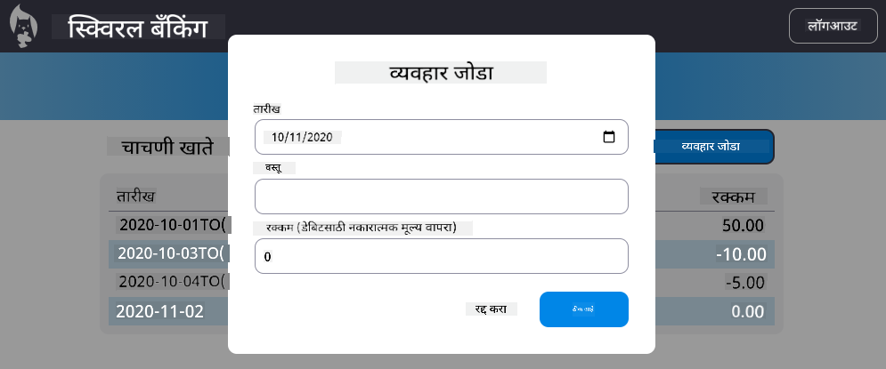

<!--
CO_OP_TRANSLATOR_METADATA:
{
  "original_hash": "f23a868536c07da991b1d4e773161e25",
  "translation_date": "2025-08-26T00:49:27+00:00",
  "source_file": "7-bank-project/4-state-management/assignment.md",
  "language_code": "mr"
}
-->
# "व्यवहार जोडा" संवाद लागू करा

## सूचना

आमच्या बँक अॅपमध्ये अजूनही एक महत्त्वाची सुविधा नाही: नवीन व्यवहार नोंदवण्याची शक्यता. मागील चार धड्यांमध्ये तुम्ही शिकलेल्या सर्व गोष्टींचा वापर करून, "व्यवहार जोडा" संवाद तयार करा:

- डॅशबोर्ड पृष्ठावर "व्यवहार जोडा" बटण जोडा
- HTML टेम्पलेटसह नवीन पृष्ठ तयार करा किंवा डॅशबोर्ड पृष्ठ सोडल्याशिवाय संवाद HTML दाखवण्यासाठी/लपवण्यासाठी JavaScript वापरा (यासाठी तुम्ही [`hidden`](https://developer.mozilla.org/docs/Web/HTML/Global_attributes/hidden) प्रॉपर्टी किंवा CSS क्लासेस वापरू शकता)
- संवादासाठी [कीबोर्ड आणि स्क्रीन रीडर अॅक्सेसिबिलिटी](https://developer.paciellogroup.com/blog/2018/06/the-current-state-of-modal-dialog-accessibility/) हाताळा
- इनपुट डेटा प्राप्त करण्यासाठी HTML फॉर्म लागू करा
- फॉर्म डेटामधून JSON डेटा तयार करा आणि API ला पाठवा
- नवीन डेटासह डॅशबोर्ड पृष्ठ अद्यतनित करा

[सर्व्हर API तपशील](../api/README.md) पाहा, तुम्हाला कोणता API कॉल करायचा आहे आणि अपेक्षित JSON स्वरूप काय आहे हे समजून घ्या.

असाइनमेंट पूर्ण केल्यानंतरचा एक उदाहरण परिणाम येथे दिला आहे:

## मूल्यमापन निकष

| निकष      | उत्कृष्ट                                                                                          | समाधानकारक                                                                                                             | सुधारणा आवश्यक                              |
| --------- | ------------------------------------------------------------------------------------------------- | ---------------------------------------------------------------------------------------------------------------------- | ------------------------------------------- |
|           | व्यवहार जोडणे सर्व धड्यांमध्ये पाहिलेल्या सर्वोत्तम पद्धतींचे अनुसरण करून पूर्णपणे अंमलात आणले आहे. | व्यवहार जोडणे अंमलात आणले आहे, परंतु सर्वोत्तम पद्धतींचे अनुसरण केले नाही किंवा ते फक्त अर्धवट कार्यरत आहे.            | व्यवहार जोडणे अजिबात कार्यरत नाही.         |

**अस्वीकरण**:  
हा दस्तऐवज AI भाषांतर सेवा [Co-op Translator](https://github.com/Azure/co-op-translator) वापरून भाषांतरित करण्यात आला आहे. आम्ही अचूकतेसाठी प्रयत्नशील असलो तरी कृपया लक्षात ठेवा की स्वयंचलित भाषांतरे त्रुटी किंवा अचूकतेच्या अभावाने युक्त असू शकतात. मूळ भाषेतील दस्तऐवज हा अधिकृत स्रोत मानला जावा. महत्त्वाच्या माहितीसाठी व्यावसायिक मानवी भाषांतराची शिफारस केली जाते. या भाषांतराचा वापर करून उद्भवलेल्या कोणत्याही गैरसमज किंवा चुकीच्या अर्थासाठी आम्ही जबाबदार नाही.