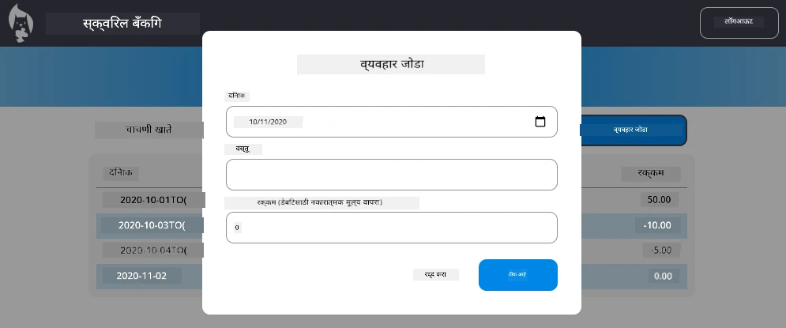

<!--
CO_OP_TRANSLATOR_METADATA:
{
  "original_hash": "50a7783473b39a2e0f133e271a102231",
  "translation_date": "2025-10-22T16:17:19+00:00",
  "source_file": "7-bank-project/4-state-management/assignment.md",
  "language_code": "mr"
}
-->
# "ट्रान्झॅक्शन जोडा" संवाद लागू करा

## आढावा

तुमच्या बँकिंग अ‍ॅपमध्ये आता मजबूत स्टेट मॅनेजमेंट आणि डेटा टिकवून ठेवण्याची क्षमता आहे, परंतु एक महत्त्वाची सुविधा अद्याप नाही: वापरकर्त्यांना स्वतःचे ट्रान्झॅक्शन जोडण्याची क्षमता. या असाइनमेंटमध्ये, तुम्ही एक संपूर्ण "ट्रान्झॅक्शन जोडा" संवाद तयार कराल जो तुमच्या विद्यमान स्टेट मॅनेजमेंट सिस्टमसोबत सहजपणे समाकलित होईल.

ही असाइनमेंट तुम्ही बँकिंगच्या चार धड्यांमध्ये शिकलेल्या गोष्टी एकत्र आणते: HTML टेम्पलेटिंग, फॉर्म हाताळणी, API समाकलन आणि स्टेट मॅनेजमेंट.

## शिकण्याची उद्दिष्टे

ही असाइनमेंट पूर्ण करून, तुम्ही:
- **निर्माण**: डेटा एंट्रीसाठी वापरकर्ता-अनुकूल संवाद इंटरफेस
- **अंमलात आणा**: कीबोर्ड आणि स्क्रीन रीडर समर्थनासह प्रवेशयोग्य फॉर्म डिझाइन
- **समाकलित करा**: विद्यमान स्टेट मॅनेजमेंट सिस्टमसह नवीन वैशिष्ट्ये
- **सराव**: API कम्युनिकेशन आणि एरर हँडलिंग
- **अर्ज करा**: आधुनिक वेब विकास पद्धती वास्तविक वैशिष्ट्यासाठी

## सूचना

### चरण 1: ट्रान्झॅक्शन बटण जोडा

**तयार करा**: डॅशबोर्ड पृष्ठावर "ट्रान्झॅक्शन जोडा" बटण जे वापरकर्त्यांना सहज सापडेल आणि प्रवेश करता येईल.

**आवश्यकता:**
- **बटण ठेवा**: डॅशबोर्डवरील तर्कसंगत ठिकाणी
- **स्पष्ट, क्रियाशील बटण मजकूर वापरा**
- **बटण स्टाइल करा**: विद्यमान UI डिझाइनशी जुळण्यासाठी
- **कीबोर्ड प्रवेशयोग्यता सुनिश्चित करा**

### चरण 2: संवाद अंमलबजावणी

तुमच्या संवादाची अंमलबजावणी करण्यासाठी खालील दोन पद्धतींपैकी एक निवडा:

**पर्याय A: स्वतंत्र पृष्ठ**
- **नवीन HTML टेम्पलेट तयार करा**: ट्रान्झॅक्शन फॉर्मसाठी
- **तुमच्या रूटिंग सिस्टममध्ये नवीन रूट जोडा**
- **फॉर्म पृष्ठावर नेव्हिगेशन अंमलात आणा**

**पर्याय B: मोडल संवाद (शिफारस केलेले)**
- **जावास्क्रिप्ट वापरा**: डॅशबोर्ड सोडल्याशिवाय संवाद दर्शविण्यासाठी/लपविण्यासाठी
- **अंमलात आणा**: [`hidden` प्रॉपर्टी](https://developer.mozilla.org/docs/Web/HTML/Global_attributes/hidden) किंवा CSS क्लासेस वापरून
- **स्मूथ वापरकर्ता अनुभव तयार करा**: योग्य फोकस व्यवस्थापनासह

### चरण 3: प्रवेशयोग्यता अंमलबजावणी

**सुनिश्चित करा**: तुमचा संवाद [मोडल संवादासाठी प्रवेशयोग्यता मानक](https://developer.paciellogroup.com/blog/2018/06/the-current-state-of-modal-dialog-accessibility/) पूर्ण करतो:

**कीबोर्ड नेव्हिगेशन:**
- **सपोर्ट करा**: संवाद बंद करण्यासाठी Escape की
- **फोकस ट्रॅप करा**: संवाद उघडल्यावर
- **फोकस परत करा**: संवाद बंद झाल्यावर ट्रिगर बटणावर

**स्क्रीन रीडर समर्थन:**
- **योग्य ARIA लेबल्स आणि रोल्स जोडा**
- **स्क्रीन रीडर्ससाठी संवाद उघडणे/बंद करणे जाहीर करा**
- **स्पष्ट फॉर्म फील्ड लेबल्स आणि एरर मेसेजेस प्रदान करा**

### चरण 4: फॉर्म तयार करणे

**HTML फॉर्म डिझाइन करा**: जो ट्रान्झॅक्शन डेटा गोळा करतो:

**आवश्यक फील्ड्स:**
- **तारीख**: ट्रान्झॅक्शन कधी झाले
- **वर्णन**: ट्रान्झॅक्शन कशासाठी होते
- **रक्कम**: ट्रान्झॅक्शन मूल्य (आयसाठी सकारात्मक, खर्चासाठी नकारात्मक)

**फॉर्म वैशिष्ट्ये:**
- **वापरकर्ता इनपुट वैध करा**: सबमिशनपूर्वी
- **अस्पष्ट डेटा साठी स्पष्ट एरर मेसेजेस प्रदान करा**
- **उपयुक्त प्लेसहोल्डर मजकूर आणि लेबल्स समाविष्ट करा**
- **विद्यमान डिझाइनसह सुसंगतपणे स्टाइल करा**

### चरण 5: API समाकलन

**तुमचा फॉर्म बॅकएंड API शी कनेक्ट करा**:

**अंमलबजावणी चरण:**
- **[सर्व्हर API तपशील](../api/README.md) पुनरावलोकन करा**: योग्य एंडपॉइंट आणि डेटा स्वरूपासाठी
- **तुमच्या फॉर्म इनपुट्समधून JSON डेटा तयार करा**
- **डेटा API ला पाठवा**: योग्य एरर हँडलिंगसह
- **वापरकर्त्याला यश/अपयश संदेश दर्शवा**
- **नेटवर्क एरर व्यवस्थित हाताळा**

### चरण 6: स्टेट मॅनेजमेंट समाकलन

**तुमच्या डॅशबोर्डला नवीन ट्रान्झॅक्शनसह अपडेट करा**:

**समाकलन आवश्यकता:**
- **खाते डेटा रीफ्रेश करा**: यशस्वी ट्रान्झॅक्शन जोडल्यानंतर
- **डॅशबोर्ड डिस्प्ले अपडेट करा**: पृष्ठ रीलोड न करता
- **नवीन ट्रान्झॅक्शन त्वरित दिसून येईल याची खात्री करा**
- **संपूर्ण प्रक्रियेदरम्यान योग्य स्टेट सुसंगतता राखा**

## तांत्रिक तपशील

**API एंडपॉइंट तपशील:**
[सर्व्हर API दस्तऐवज](../api/README.md) पहा:
- ट्रान्झॅक्शन डेटासाठी आवश्यक JSON स्वरूप
- HTTP पद्धत आणि एंडपॉइंट URL
- अपेक्षित प्रतिसाद स्वरूप
- एरर प्रतिसाद हाताळणी

**अपेक्षित परिणाम:**
ही असाइनमेंट पूर्ण केल्यानंतर, तुमच्या बँकिंग अ‍ॅपमध्ये एक पूर्ण कार्यक्षम "ट्रान्झॅक्शन जोडा" सुविधा असावी जी व्यावसायिकपणे दिसते आणि वागते:

## तुमची अंमलबजावणी चाचणी करणे

**कार्यात्मक चाचणी:**
1. **पडताळा**: "ट्रान्झॅक्शन जोडा" बटण स्पष्टपणे दृश्यमान आणि प्रवेशयोग्य आहे
2. **चाचणी करा**: संवाद योग्यरित्या उघडतो आणि बंद होतो
3. **पुष्टी करा**: सर्व आवश्यक फील्डसाठी फॉर्म वैधता कार्य करते
4. **तपासा**: यशस्वी ट्रान्झॅक्शन त्वरित डॅशबोर्डवर दिसते
5. **सुनिश्चित करा**: अमान्य डेटा आणि नेटवर्क समस्यांसाठी एरर हँडलिंग कार्य करते

**प्रवेशयोग्यता चाचणी:**
1. **फक्त कीबोर्ड वापरून संपूर्ण प्रवाह नेव्हिगेट करा**
2. **स्क्रीन रीडरसह चाचणी करा**: योग्य घोषणा सुनिश्चित करण्यासाठी
3. **पडताळा**: फोकस व्यवस्थापन योग्यरित्या कार्य करते
4. **तपासा**: सर्व फॉर्म घटकांमध्ये योग्य लेबल्स आहेत

## मूल्यांकन निकष

| निकष | उत्कृष्ट | पुरेसे | सुधारणा आवश्यक |
| -------- | --------- | -------- | ----------------- |
| **कार्यशीलता** | ट्रान्झॅक्शन जोडण्याची सुविधा उत्कृष्ट वापरकर्ता अनुभवासह निर्दोषपणे कार्य करते आणि धड्यांमधील सर्व सर्वोत्तम पद्धतींचे अनुसरण करते | ट्रान्झॅक्शन जोडण्याची सुविधा योग्यरित्या कार्य करते परंतु काही सर्वोत्तम पद्धतींचे अनुसरण करत नाही किंवा किरकोळ वापरयोग्यता समस्या आहेत | ट्रान्झॅक्शन जोडण्याची सुविधा अंशतः कार्यरत आहे किंवा महत्त्वाच्या वापरयोग्यता समस्यांसह आहे |
| **कोड गुणवत्ता** | कोड चांगल्या प्रकारे आयोजित केलेला आहे, स्थापित नमुन्यांचे अनुसरण करतो, योग्य एरर हँडलिंग समाविष्ट करतो आणि विद्यमान स्टेट मॅनेजमेंटसह सहजपणे समाकलित होतो | कोड कार्य करतो परंतु काही संघटनात्मक समस्या किंवा विद्यमान कोडबेससह विसंगत नमुने असू शकतात | कोडमध्ये महत्त्वाच्या संरचनात्मक समस्या आहेत किंवा विद्यमान नमुन्यांसह चांगले समाकलित होत नाही |
| **प्रवेशयोग्यता** | पूर्ण कीबोर्ड नेव्हिगेशन समर्थन, स्क्रीन रीडर सुसंगतता आणि उत्कृष्ट फोकस व्यवस्थापनासह WCAG मार्गदर्शक तत्त्वांचे अनुसरण करते | मूलभूत प्रवेशयोग्यता वैशिष्ट्ये अंमलात आणली आहेत परंतु काही कीबोर्ड नेव्हिगेशन किंवा स्क्रीन रीडर वैशिष्ट्ये गहाळ असू शकतात | मर्यादित किंवा कोणतेही प्रवेशयोग्यता विचार अंमलात आणले नाहीत |
| **वापरकर्ता अनुभव** | अंतर्ज्ञानी, पॉलिश इंटरफेस स्पष्ट अभिप्राय, स्मूथ संवाद आणि व्यावसायिक स्वरूपासह | चांगला वापरकर्ता अनुभव किरकोळ सुधारणा क्षेत्रांसह अभिप्राय किंवा व्हिज्युअल डिझाइनमध्ये | गोंधळात टाकणारा इंटरफेस किंवा वापरकर्ता अभिप्रायाच्या अभावासह खराब वापरकर्ता अनुभव |

## अतिरिक्त आव्हाने (ऐच्छिक)

मूलभूत आवश्यकता पूर्ण केल्यानंतर, या सुधारणा विचारात घ्या:

**वाढीव वैशिष्ट्ये:**
- **जोडा**: ट्रान्झॅक्शन श्रेण्या (अन्न, वाहतूक, मनोरंजन, इ.)
- **अंमलात आणा**: रिअल-टाइम अभिप्रायासह इनपुट वैधता
- **तयार करा**: पॉवर वापरकर्त्यांसाठी कीबोर्ड शॉर्टकट
- **जोडा**: ट्रान्झॅक्शन संपादन आणि हटविण्याची क्षमता

**प्रगत समाकलन:**
- **अंमलात आणा**: अलीकडे जोडलेल्या ट्रान्झॅक्शनसाठी अंडू फंक्शनॅलिटी
- **जोडा**: CSV फाइल्समधून बल्क ट्रान्झॅक्शन आयात
- **तयार करा**: ट्रान्झॅक्शन शोध आणि फिल्टरिंग क्षमता
- **अंमलात आणा**: डेटा एक्सपोर्ट फंक्शनॅलिटी

या ऐच्छिक वैशिष्ट्यांमुळे तुम्हाला अधिक प्रगत वेब विकास संकल्पना सराव करण्यास मदत होईल आणि अधिक संपूर्ण बँकिंग अ‍ॅप तयार होईल!

---

**अस्वीकरण**:  
हा दस्तऐवज AI भाषांतर सेवा [Co-op Translator](https://github.com/Azure/co-op-translator) वापरून भाषांतरित करण्यात आला आहे. आम्ही अचूकतेसाठी प्रयत्नशील असलो तरी, कृपया लक्षात ठेवा की स्वयंचलित भाषांतरांमध्ये त्रुटी किंवा अचूकतेचा अभाव असू शकतो. मूळ भाषेतील दस्तऐवज हा अधिकृत स्रोत मानला जावा. महत्त्वाच्या माहितीसाठी व्यावसायिक मानवी भाषांतराची शिफारस केली जाते. या भाषांतराचा वापर करून उद्भवलेल्या कोणत्याही गैरसमज किंवा चुकीच्या अर्थासाठी आम्ही जबाबदार राहणार नाही.