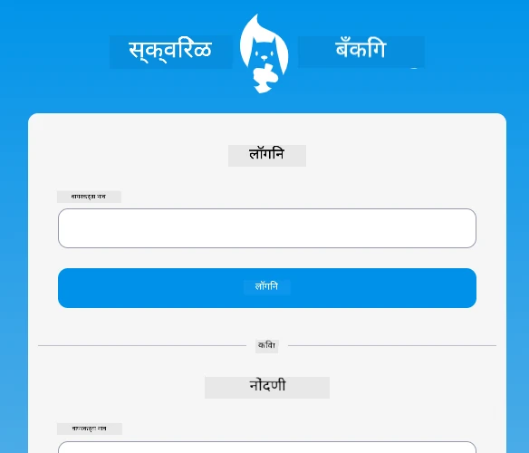
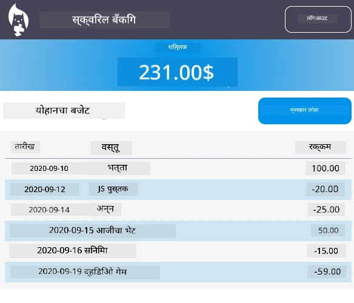

<!--
CO_OP_TRANSLATOR_METADATA:
{
  "original_hash": "830359535306594b448db6575ce5cdee",
  "translation_date": "2025-08-26T00:03:03+00:00",
  "source_file": "7-bank-project/README.md",
  "language_code": "mr"
}
-->
# :dollar: बँक तयार करा

या प्रकल्पात, तुम्ही काल्पनिक बँक कशी तयार करायची ते शिकाल. या धड्यांमध्ये वेब अ‍ॅप कसे मांडायचे आणि रूट्स प्रदान करायचे, फॉर्म तयार करायचे, स्टेट व्यवस्थापित करायचे, आणि API मधून डेटा कसा आणायचा ज्यामधून तुम्ही बँकेचा डेटा मिळवू शकता याचे मार्गदर्शन दिले आहे.

|  |  |
|--------------------------------|--------------------------------|

## धडे

1. [वेब अ‍ॅपमधील HTML टेम्पलेट्स आणि रूट्स](1-template-route/README.md)
2. [लॉगिन आणि नोंदणी फॉर्म तयार करा](2-forms/README.md)
3. [डेटा आणण्याचे आणि वापरण्याचे पद्धती](3-data/README.md)
4. [स्टेट व्यवस्थापनाची संकल्पना](4-state-management/README.md)

### श्रेय

हे धडे :hearts: सह [Yohan Lasorsa](https://twitter.com/sinedied) यांनी लिहिले आहेत.

जर तुम्हाला या धड्यांमध्ये वापरलेल्या [सर्व्हर API](/7-bank-project/api/README.md) कसे तयार करायचे ते शिकायचे असेल, तर तुम्ही [या व्हिडिओ मालिकेचे](https://aka.ms/NodeBeginner) अनुसरण करू शकता (विशेषतः व्हिडिओ 17 ते 21).

तुम्ही [हा इंटरॅक्टिव्ह Learn ट्यूटोरियल](https://aka.ms/learn/express-api) देखील पाहू शकता.

**अस्वीकरण**:  
हा दस्तऐवज AI भाषांतर सेवा [Co-op Translator](https://github.com/Azure/co-op-translator) वापरून भाषांतरित करण्यात आला आहे. आम्ही अचूकतेसाठी प्रयत्नशील असलो तरी कृपया लक्षात ठेवा की स्वयंचलित भाषांतरांमध्ये त्रुटी किंवा अचूकतेचा अभाव असू शकतो. मूळ भाषेतील दस्तऐवज हा अधिकृत स्रोत मानला जावा. महत्त्वाच्या माहितीसाठी व्यावसायिक मानवी भाषांतराची शिफारस केली जाते. या भाषांतराचा वापर करून उद्भवलेल्या कोणत्याही गैरसमज किंवा चुकीच्या अर्थासाठी आम्ही जबाबदार राहणार नाही.