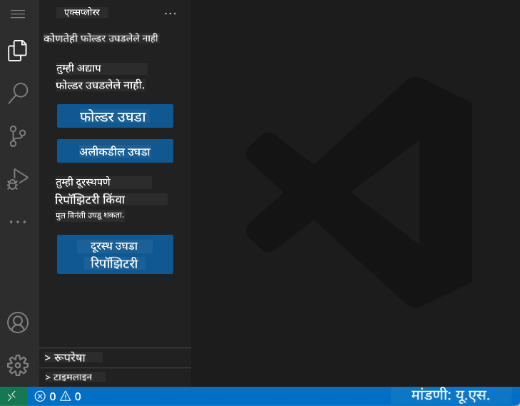
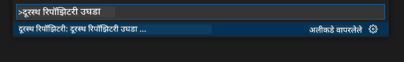
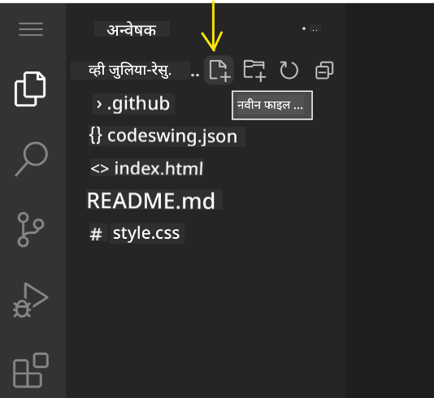
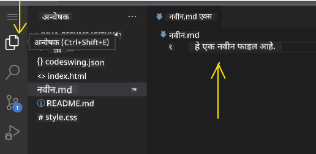
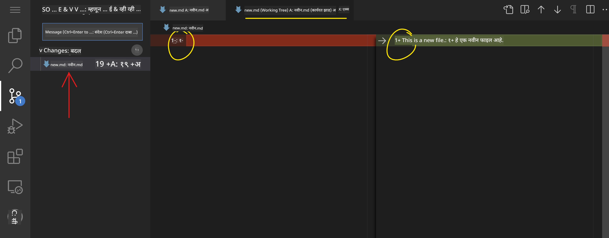
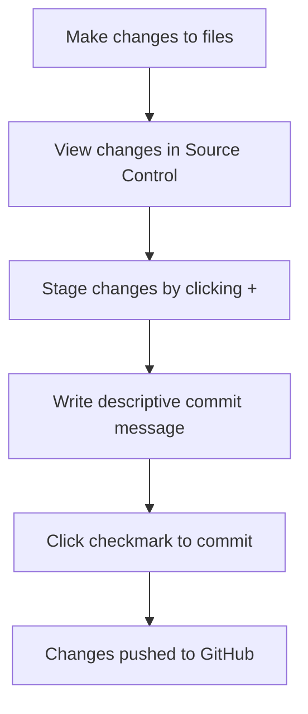
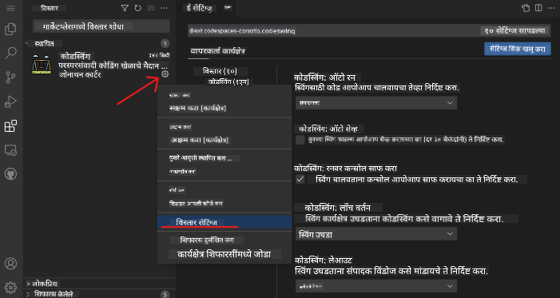

<!--
CO_OP_TRANSLATOR_METADATA:
{
  "original_hash": "cfd4a15974168ca426d50c67682ab9d4",
  "translation_date": "2025-10-22T15:50:53+00:00",
  "source_file": "8-code-editor/1-using-a-code-editor/README.md",
  "language_code": "mr"
}
-->
# कोड एडिटर वापरणे: VSCode.dev मध्ये प्राविण्य मिळवा

*द मॅट्रिक्स* मध्ये निओला डिजिटल जगात प्रवेश करण्यासाठी मोठ्या संगणक टर्मिनलमध्ये प्लग इन करावे लागले होते, हे लक्षात आहे का? आजचे वेब विकास साधने याच्या अगदी उलट आहेत – अत्यंत शक्तिशाली क्षमता कुठूनही उपलब्ध. VSCode.dev हा ब्राउझर-आधारित कोड एडिटर आहे जो कोणत्याही इंटरनेट कनेक्शन असलेल्या डिव्हाइसवर व्यावसायिक विकास साधने आणतो.

जसे छपाई यंत्राने पुस्तके सर्वांसाठी उपलब्ध केली, फक्त मठातील लेखकांसाठी नाही, तसेच VSCode.dev कोडिंगला लोकशाही बनवते. तुम्ही लायब्ररीच्या संगणकावर, शाळेच्या लॅबमध्ये किंवा ब्राउझर प्रवेश असलेल्या कोणत्याही ठिकाणी प्रकल्पांवर काम करू शकता. कोणतीही स्थापना नाही, कोणतेही "माझ्या विशिष्ट सेटअपची गरज आहे" मर्यादा नाहीत.

या धड्याच्या शेवटी, तुम्हाला VSCode.dev नेव्हिगेट कसे करायचे, GitHub रिपॉझिटरी थेट ब्राउझरमध्ये उघडायची आणि Git वापरून व्हर्जन कंट्रोल कसे करायचे हे समजेल – व्यावसायिक विकासक दररोज अवलंबून असलेल्या सर्व कौशल्ये.

## तुम्ही काय शिकाल

आपण हे एकत्र चालून गेल्यानंतर, तुम्ही हे करू शकाल:

- VSCode.dev नेव्हिगेट करा जणू ते तुमचे दुसरे घर आहे – तुम्हाला आवश्यक असलेले सर्व काही न हरवता शोधा
- कोणतीही GitHub रिपॉझिटरी तुमच्या ब्राउझरमध्ये उघडा आणि त्वरित संपादन सुरू करा (हे खूप जादुई आहे!)
- Git वापरून तुमचे बदल ट्रॅक करा आणि तुमची प्रगती व्यावसायिकासारखी जतन करा
- कोडिंग जलद आणि मजेदार बनवणाऱ्या एक्स्टेंशन्ससह तुमचा एडिटर सुपरचार्ज करा
- प्रकल्प फाइल्स आत्मविश्वासाने तयार करा आणि व्यवस्थित करा

## तुम्हाला काय लागेल

आवश्यकता सोप्या आहेत:

- एक विनामूल्य [GitHub खाते](https://github.com) (आवश्यक असल्यास आम्ही तयार करण्यात मार्गदर्शन करू)
- वेब ब्राउझरची मूलभूत ओळख
- GitHub बेसिक्स धडा उपयुक्त पार्श्वभूमी प्रदान करतो, जरी तो आवश्यक नाही

> 💡 **GitHub साठी नवीन?** खाते तयार करणे विनामूल्य आहे आणि काही मिनिटांत पूर्ण होते. जसे लायब्ररी कार्ड तुम्हाला जगभरातील पुस्तकांमध्ये प्रवेश देते, तसे GitHub खाते तुम्हाला इंटरनेटवरील कोड रिपॉझिटरीमध्ये प्रवेश देते.

## वेब-आधारित कोड एडिटर का महत्त्वाचे आहेत

इंटरनेटच्या आधी, वेगवेगळ्या विद्यापीठांतील वैज्ञानिकांना संशोधन सहजपणे शेअर करता येत नव्हते. मग 1960 च्या दशकात ARPANET आले, ज्याने अंतरावर संगणक जोडले. वेब-आधारित कोड एडिटर याच तत्त्वाचे अनुसरण करतात – शक्तिशाली साधने तुमच्या भौतिक स्थान किंवा डिव्हाइसच्या मर्यादेशिवाय उपलब्ध करणे.

कोड एडिटर तुमचे विकास कार्यक्षेत्र म्हणून काम करते, जिथे तुम्ही कोड फाइल्स लिहिता, संपादित करता आणि व्यवस्थित करता. साध्या टेक्स्ट एडिटरच्या विपरीत, व्यावसायिक कोड एडिटर सिंटॅक्स हायलाइटिंग, त्रुटी शोधणे आणि प्रकल्प व्यवस्थापन वैशिष्ट्ये प्रदान करतात.

VSCode.dev या क्षमतांना तुमच्या ब्राउझरमध्ये आणते:

**वेब-आधारित संपादनाचे फायदे:**

| वैशिष्ट्य | वर्णन | व्यावहारिक फायदा |
|---------|-------------|----------|
| **प्लॅटफॉर्म इंडिपेंडन्स** | कोणत्याही ब्राउझर असलेल्या डिव्हाइसवर चालते | वेगवेगळ्या संगणकांवर सहज काम करा |
| **स्थापना आवश्यक नाही** | वेब URL द्वारे प्रवेश | सॉफ्टवेअर स्थापना निर्बंध टाळा |
| **स्वयंचलित अद्यतने** | नेहमी नवीनतम आवृत्ती चालते | मॅन्युअल अद्यतनांशिवाय नवीन वैशिष्ट्ये मिळवा |
| **रिपॉझिटरी इंटिग्रेशन** | GitHub शी थेट कनेक्शन | स्थानिक फाइल व्यवस्थापनाशिवाय कोड संपादित करा |

**व्यावहारिक परिणाम:**
- वेगवेगळ्या वातावरणांमध्ये कामाची सातत्यता
- ऑपरेटिंग सिस्टमच्या मर्यादेशिवाय सुसंगत इंटरफेस
- त्वरित सहयोग क्षमता
- स्थानिक स्टोरेज आवश्यकता कमी

## VSCode.dev एक्सप्लोर करणे

जसे मेरी क्युरीचे प्रयोगशाळा साध्या जागेत अत्याधुनिक उपकरणे होती, तसेच VSCode.dev ब्राउझर इंटरफेसमध्ये व्यावसायिक विकास साधने पॅक करते. ही वेब अ‍ॅप्लिकेशन डेस्कटॉप कोड एडिटरप्रमाणेच मुख्य कार्यक्षमता प्रदान करते.

तुमच्या ब्राउझरमध्ये [vscode.dev](https://vscode.dev) वर नेव्हिगेट करून प्रारंभ करा. इंटरफेस डाउनलोड किंवा सिस्टम स्थापना न करता लोड होते – क्लाउड कंप्युटिंग तत्त्वांचा थेट अनुप्रयोग.

### तुमचे GitHub खाते कनेक्ट करणे

जसे अलेक्झांडर ग्रॅहम बेलचा टेलिफोन दूरस्थ ठिकाणे जोडतो, तसे तुमचे GitHub खाते लिंक करणे VSCode.dev ला तुमच्या कोड रिपॉझिटरीशी जोडते. GitHub सह साइन इन करण्यास सांगितले असता, हे कनेक्शन स्वीकारणे शिफारसीय आहे.

**GitHub इंटिग्रेशन प्रदान करते:**
- एडिटरमध्ये तुमच्या रिपॉझिटरींमध्ये थेट प्रवेश
- डिव्हाइसवर समक्रमित सेटिंग्ज आणि एक्स्टेंशन्स
- GitHub वर जतन करण्यासाठी सुलभ कार्यप्रवाह
- वैयक्तिकृत विकास वातावरण

### तुमच्या नवीन कार्यक्षेत्राशी परिचित होणे

सर्व काही लोड झाल्यानंतर, तुम्हाला एक सुंदर स्वच्छ कार्यक्षेत्र दिसेल जे तुम्हाला महत्त्वाच्या गोष्टींवर लक्ष केंद्रित ठेवण्यासाठी डिझाइन केले आहे – तुमचा कोड!

**तुमच्या परिसराचा दौरा:**
- **अ‍ॅक्टिव्हिटी बार** (डाव्या बाजूचा पट्टा): तुमची मुख्य नेव्हिगेशन एक्सप्लोरर 📁, शोध 🔍, सोर्स कंट्रोल 🌿, एक्स्टेंशन्स 🧩, आणि सेटिंग्ज ⚙️
- **साइडबार** (त्याच्या शेजारी असलेला पॅनेल): तुम्ही निवडलेल्या गोष्टींवर आधारित संबंधित माहिती दर्शविण्यासाठी बदलतो
- **एडिटर एरिया** (मधला मोठा जागा): येथेच जादू होते – तुमचे मुख्य कोडिंग क्षेत्र

**थोडा वेळ एक्सप्लोर करा:**
- त्या अ‍ॅक्टिव्हिटी बार आयकॉनवर क्लिक करा आणि प्रत्येकाने काय केले ते पहा
- साइडबार वेगवेगळ्या माहिती दर्शविण्यासाठी कसा अपडेट होतो ते लक्षात घ्या – खूप छान, बरोबर?
- एक्सप्लोरर दृश्य (📁) कदाचित जिथे तुम्ही तुमचा जास्त वेळ घालवाल, त्यामुळे त्यासह आरामदायक व्हा

## GitHub रिपॉझिटरी उघडणे

इंटरनेटच्या आधी, संशोधकांना दस्तऐवजांमध्ये प्रवेश करण्यासाठी शारीरिकरित्या लायब्ररीत जावे लागले. GitHub रिपॉझिटरी त्याचप्रमाणे कार्य करतात – ते दूरस्थपणे संग्रहित कोडचे संग्रह आहेत. VSCode.dev स्थानिक मशीनवर रिपॉझिटरी डाउनलोड करण्याच्या पारंपरिक चरणाशिवाय संपादन करण्यासाठी त्वरित प्रवेश सक्षम करते.

ही क्षमता कोणत्याही सार्वजनिक रिपॉझिटरीमध्ये त्वरित प्रवेश सक्षम करते, पाहण्यासाठी, संपादित करण्यासाठी किंवा योगदान देण्यासाठी. रिपॉझिटरी उघडण्यासाठी येथे दोन पद्धती आहेत:

### पद्धत 1: पॉइंट-आणि-क्लिक मार्ग

जेव्हा तुम्ही VSCode.dev मध्ये नवीन सुरुवात करत असता आणि विशिष्ट रिपॉझिटरी उघडायची असते तेव्हा हे परिपूर्ण आहे. हे सोपे आणि नवशिक्यांसाठी अनुकूल आहे:

**हे कसे करायचे:**

1. [vscode.dev](https://vscode.dev) वर जा जर तुम्ही आधीच तिथे नसाल
2. स्वागत स्क्रीनवर "ओपन रिमोट रिपॉझिटरी" बटण शोधा आणि त्यावर क्लिक करा

   

3. कोणत्याही GitHub रिपॉझिटरी URL मध्ये पेस्ट करा (हे वापरून पहा: `https://github.com/microsoft/Web-Dev-For-Beginners`)
4. Enter दाबा आणि जादू पहा!

**प्रो टिप - कमांड पॅलेट शॉर्टकट:**

कोडिंग जादूगारासारखे वाटायचे आहे का? हा कीबोर्ड शॉर्टकट वापरून पहा: Ctrl+Shift+P (किंवा Mac वर Cmd+Shift+P) कमांड पॅलेट उघडण्यासाठी:

**कमांड पॅलेट म्हणजे तुम्ही करू शकता अशा प्रत्येक गोष्टीसाठी शोध इंजिन असण्यासारखे आहे:**
- "ओपन रिमोट" टाइप करा आणि ते तुमच्यासाठी रिपॉझिटरी ओपनर शोधेल
- तुम्ही अलीकडे उघडलेल्या रिपॉझिटरी लक्षात ठेवते (खूप उपयुक्त!)
- एकदा तुम्ही याचा वापर करण्यास सुरुवात केली की, तुम्हाला कोडिंग वीजेच्या वेगाने वाटेल
- हे मूलत: VSCode.dev चे "हे Siri, पण कोडिंगसाठी" आहे

### पद्धत 2: URL मॉडिफिकेशन तंत्र

जसे HTTP आणि HTTPS वेगवेगळ्या प्रोटोकॉल वापरतात तरीही समान डोमेन संरचना राखतात, तसे VSCode.dev GitHub च्या अ‍ॅड्रेसिंग सिस्टमचे प्रतिबिंबित करणारे URL पॅटर्न वापरते. कोणत्याही GitHub रिपॉझिटरी URL ला VSCode.dev मध्ये थेट उघडण्यासाठी बदलले जाऊ शकते.

**URL ट्रान्सफॉर्मेशन पॅटर्न:**

| रिपॉझिटरी प्रकार | GitHub URL | VSCode.dev URL |
|----------------|---------------------|----------------|
| **सार्वजनिक रिपॉझिटरी** | `github.com/microsoft/Web-Dev-For-Beginners` | `vscode.dev/github/microsoft/Web-Dev-For-Beginners` |
| **वैयक्तिक प्रकल्प** | `github.com/your-username/my-project` | `vscode.dev/github/your-username/my-project` |
| **कोणतीही प्रवेशयोग्य रिपॉझिटरी** | `github.com/their-username/awesome-repo` | `vscode.dev/github/their-username/awesome-repo` |

**अंमलबजावणी:**
- `github.com` ला `vscode.dev/github` ने बदला
- इतर सर्व URL घटक अपरिवर्तित ठेवा
- कोणत्याही सार्वजनिकपणे प्रवेशयोग्य रिपॉझिटरीसह कार्य करते
- त्वरित संपादन प्रवेश प्रदान करते

> 💡 **जीवन बदलणारी टिप**: तुमच्या आवडत्या रिपॉझिटरीच्या VSCode.dev आवृत्त्या बुकमार्क करा. माझ्याकडे "माझे पोर्टफोलिओ संपादित करा" आणि "डॉक्युमेंटेशन दुरुस्त करा" सारखे बुकमार्क आहेत जे मला थेट संपादन मोडमध्ये घेऊन जातात!

**तुम्ही कोणती पद्धत वापरावी?**
- **इंटरफेस मार्ग**: जेव्हा तुम्ही एक्सप्लोर करत असता किंवा अचूक रिपॉझिटरी नावे लक्षात ठेवू शकत नाही
- **URL ट्रिक**: जेव्हा तुम्हाला अचूकपणे कुठे जायचे आहे हे माहित असते तेव्हा वीजेच्या वेगाने प्रवेशासाठी परिपूर्ण

## फाइल्स आणि प्रकल्पांसह काम करणे

आता तुमच्याकडे रिपॉझिटरी उघडली आहे, चला बांधायला सुरुवात करूया! VSCode.dev तुम्हाला कोड फाइल्स तयार करण्यासाठी, संपादित करण्यासाठी आणि व्यवस्थित करण्यासाठी आवश्यक असलेली प्रत्येक गोष्ट देते. याला तुमचे डिजिटल कार्यशाळा समजा – प्रत्येक साधन तुम्हाला आवश्यक असलेल्या ठिकाणी आहे.

चला तुमच्या कोडिंग कार्यप्रवाहाचा जास्तीत जास्त भाग बनवणाऱ्या रोजच्या कामांमध्ये डुबकी मारूया.

### नवीन फाइल्स तयार करणे

जसे आर्किटेक्टच्या ऑफिसमध्ये ब्लूप्रिंट्स व्यवस्थित करणे, VSCode.dev मध्ये फाइल तयार करणे संरचित दृष्टिकोनाचे अनुसरण करते. प्रणाली सर्व मानक वेब विकास फाइल प्रकारांना समर्थन देते.

**फाइल तयार करण्याची प्रक्रिया:**

1. एक्सप्लोरर साइडबारमधील लक्ष्य फोल्डरवर नेव्हिगेट करा
2. फोल्डरच्या नावावर होवर करा "नवीन फाइल" आयकॉन (📄+) प्रकट करण्यासाठी
3. योग्य एक्स्टेंशनसह फाइलचे नाव प्रविष्ट करा (`style.css`, `script.js`, `index.html`)
4. फाइल तयार करण्यासाठी Enter दाबा

**नाव देण्याचे नियम:**
- फाइलचा उद्देश सूचित करणारी वर्णनात्मक नावे वापरा
- योग्य सिंटॅक्स हायलाइटिंगसाठी फाइल एक्स्टेंशन्स समाविष्ट करा
- प्रकल्पांमध्ये सुसंगत नाव देण्याचे नमुने अनुसरण करा
- स्पेसऐवजी लोअरकेस अक्षरे आणि हायफन्स वापरा

### फाइल्स संपादित करणे आणि जतन करणे

येथे खरी मजा सुरू होते! VSCode.dev चा एडिटर उपयुक्त वैशिष्ट्यांनी भरलेला आहे ज्यामुळे कोडिंग गुळगुळीत आणि अंतर्ज्ञानी वाटते. हे कोडसाठी खूप हुशार लेखन सहाय्यक असल्यासारखे आहे.

**तुमचा संपादन कार्यप्रवाह:**

1. एक्सप्लोररमधील कोणत्याही फाइलवर क्लिक करा ती मुख्य क्षेत्रात उघडण्यासाठी
2. टाइप करायला सुरुवात करा आणि VSCode.dev तुम्हाला रंग, सूचना आणि त्रुटी शोधण्यास मदत करताना पहा
3. तुमचे काम Ctrl+S (Windows/Linux) किंवा Cmd+S (Mac) सह जतन करा – जरी ते ऑटो-सेव्ह करते!

**तुम्ही कोड करत असताना घडणाऱ्या छान गोष्टी:**
- तुमचा कोड सुंदरपणे रंग-कोडेड होतो त्यामुळे वाचायला सोपे होते
- VSCode.dev तुम्ही टाइप करत असताना पूर्णता सुचवते (ऑटोकरेक्टसारखे, पण खूप हुशार)
- तुम्ही जतन करण्यापूर्वी टायपो आणि त्रुटी पकडते
- तुम्ही ब्राउझरमध्ये जसे अनेक फाइल्स टॅबमध्ये उघडू शकता
- सर्व काही पार्श्वभूमीमध्ये स्वयंचलितपणे जतन होते

> ⚠️ **जलद टिप**: जरी ऑटो-सेव्ह तुमच्या पाठीशी आहे, Ctrl+S किंवा Cmd+S दाबणे अजूनही चांगली सवय आहे. हे सर्व काही त्वरित जतन करते आणि त्रुटी तपासणीसारख्या काही अतिरिक्त उपयुक्त वैशिष्ट्यांना ट्रिगर करते.

### Git सह व्हर्जन कंट्रोल

जसे पुरातत्वशास्त्रज्ञ उत्खननाच्या स्तरांचे तपशीलवार रेकॉर्ड तयार करतात, तसे Git तुमच्या कोडमधील बदल वेळोवेळी ट्रॅक करते. ही प्रणाली प्रकल्प इतिहास जतन करते आणि तुम्हाला आवश्यक असल्यास मागील आवृत्त्यांमध्ये परत जाण्याची परवानगी देते. VSCode.dev मध्ये समाकलित Git कार्यक्षमता समाविष्ट आहे.

**सोर्स कंट्रोल इंटरफेस:**

1. अ‍ॅक्टिव्हिटी बारमधील 🌿 आयकॉनद्वारे सोर्स कंट्रोल पॅनेलमध्ये प्रवेश करा
2. बदललेल्या फाइल्स "बदल" विभागात दिसतात
3. रंग कोडिंग बदल प्रकार सूचित करते: जोडण्यांसाठी हिरवा, वगळण्यासाठी लाल

**तुमचे काम जतन करणे (कमिट कार्यप्रवाह):**

**तुमची चरण-दर-चरण प्रक्रिया येथे आहे:**
- तुम्ही ज्या फाइल्स जतन करू इच्छिता त्याच्या शेजारी "+" आयकॉनवर क्लिक करा (हे त्यांना "स्टेज" करते)
- तुम्ही तुमच्या सर्व स्टेज केलेल्या बदलांवर समाधानी आहात याची डबल-चेक करा
- तुम्ही काय केले याचे एक छोटेसे नोट लिहा (हे तुमचे "कमिट मेसेज" आहे)
- सर्व काही GitHub वर जतन करण्यासाठी चेकमार्क बटणावर क्लिक करा
- जर तुम्ही एखाद्या गोष्टीबद्दल तुमचे मन बदलले असेल, तर अंडू आयकॉन तुम्हाला बदल रद्द करू देते

**च
- प्रत्येक विस्तारामध्ये रेटिंग्स, डाउनलोड संख्या आणि वास्तविक वापरकर्त्यांच्या पुनरावलोकनांचा समावेश असतो
- तुम्हाला स्क्रीनशॉट्स आणि प्रत्येक विस्तार काय करतो याचे स्पष्ट वर्णन मिळते
- सर्वकाही सुस्पष्टपणे सुसंगततेच्या माहितीसह चिन्हांकित केलेले असते
- तुलनात्मक विस्तार सुचवले जातात जेणेकरून तुम्ही पर्यायांची तुलना करू शकता

### विस्तार स्थापित करणे (हे खूप सोपे आहे!)

तुमच्या संपादकाला नवीन क्षमता देणे एका बटणावर क्लिक करण्याइतके सोपे आहे. विस्तार सेकंदांत स्थापित होतात आणि त्वरित कार्य करायला सुरुवात करतात – कोणतेही रीस्टार्ट नाही, कोणतीही प्रतीक्षा नाही.

**तुम्हाला फक्त हे करायचे आहे:**

1. तुम्हाला हवे ते शोधा (उदाहरणार्थ "live server" किंवा "prettier" शोधा)
2. चांगले दिसणाऱ्या विस्तारावर क्लिक करा आणि अधिक तपशील पहा
3. त्याचे कार्य काय आहे ते वाचा आणि रेटिंग्स तपासा
4. त्या निळ्या "Install" बटणावर क्लिक करा आणि काम पूर्ण!

**पडद्यामागे काय घडते:**
- विस्तार आपोआप डाउनलोड होतो आणि सेटअप होतो
- नवीन वैशिष्ट्ये तुमच्या इंटरफेसमध्ये त्वरित दिसतात
- सर्वकाही त्वरित कार्य करायला सुरुवात करते (खरोखर, हे इतके जलद आहे!)
- जर तुम्ही साइन इन केले असेल, तर विस्तार तुमच्या सर्व डिव्हाइसवर सिंक होतो

**मी सुरुवातीला शिफारस करतो असे काही विस्तार:**
- **Live Server**: कोड करताना तुमची वेबसाइट रिअल-टाइममध्ये अपडेट होते (हे जादू सारखे आहे!)
- **Prettier**: तुमचा कोड स्वच्छ आणि व्यावसायिक दिसण्यासाठी आपोआप स्वरूपित करते
- **Auto Rename Tag**: एक HTML टॅग बदला आणि त्याचा जोडीदार टॅगही अपडेट होतो
- **Bracket Pair Colorizer**: तुमचे ब्रॅकेट्स रंगीत कोड करते जेणेकरून तुम्ही गोंधळात पडणार नाही
- **GitLens**: तुमच्या Git वैशिष्ट्यांना भरपूर उपयुक्त माहितीने सुपरचार्ज करते

### तुमचे विस्तार सानुकूलित करणे

बहुतेक विस्तार सेटिंग्जसह येतात ज्यामुळे तुम्ही त्यांना तुमच्या आवडीनुसार कार्य करण्यासाठी सानुकूलित करू शकता. हे कारमध्ये सीट आणि मिरर समायोजित करण्यासारखे आहे – प्रत्येकाची स्वतःची प्राधान्ये असतात!

**विस्तार सेटिंग्ज समायोजित करणे:**

1. विस्तार पॅनेलमध्ये तुमचा स्थापित विस्तार शोधा
2. त्याच्या नावाजवळ असलेल्या लहान गियर आयकॉन (⚙️) शोधा आणि त्यावर क्लिक करा
3. ड्रॉपडाउनमधून "Extension Settings" निवडा
4. तुमच्या कार्यप्रवाहासाठी योग्य वाटेपर्यंत गोष्टी समायोजित करा

**तुम्हाला समायोजित करायचे असलेले सामान्य गोष्टी:**
- तुमचा कोड कसा स्वरूपित होतो (tabs vs spaces, line length, इ.)
- कोणते कीबोर्ड शॉर्टकट विविध क्रिया ट्रिगर करतात
- कोणत्या फाइल प्रकारांवर विस्तार कार्य करावा
- विशिष्ट वैशिष्ट्ये चालू किंवा बंद करणे जेणेकरून गोष्टी स्वच्छ राहतील

### तुमचे विस्तार व्यवस्थित ठेवणे

तुम्हाला अधिक छान विस्तार सापडत असताना, तुम्हाला तुमचा संग्रह व्यवस्थित आणि सुरळीत चालू ठेवायचा असेल. VSCode.dev हे व्यवस्थापित करणे खूप सोपे करते.

**तुमचे विस्तार व्यवस्थापन पर्याय:**

| तुम्ही काय करू शकता | कधी उपयुक्त आहे | प्रो टिप |
|--------|---------|----------|
| **Disable** | एखादा विस्तार समस्या निर्माण करत आहे का हे तपासण्यासाठी | पुन्हा वापरण्याची शक्यता असल्यास अनइंस्टॉल करण्यापेक्षा चांगले |
| **Uninstall** | तुम्हाला गरज नसलेल्या विस्तारांना पूर्णपणे काढून टाकणे | तुमचे वातावरण स्वच्छ आणि जलद ठेवते |
| **Update** | नवीनतम वैशिष्ट्ये आणि बग फिक्सेस मिळवणे | सहसा आपोआप होते, परंतु तपासणे योग्य आहे |

**मी विस्तार कसे व्यवस्थापित करतो:**
- काही महिन्यांनी, मी स्थापित केलेल्या गोष्टींचा आढावा घेतो आणि मी वापरत नसलेल्या गोष्टी काढून टाकतो
- मी विस्तार अद्यतनित ठेवतो जेणेकरून मला नवीन सुधारणा आणि सुरक्षा फिक्सेस मिळतील
- जर काही गोष्ट मंद वाटत असेल, तर मी तात्पुरते विस्तार अक्षम करतो आणि त्यापैकी एक कारण आहे का ते पाहतो
- जेव्हा विस्तारांना मोठी अद्यतने मिळतात तेव्हा मी अद्यतन नोट्स वाचतो – कधी कधी छान नवीन वैशिष्ट्ये असतात!

> ⚠️ **कामगिरी टिप**: विस्तार अप्रतिम आहेत, परंतु खूप जास्त असल्यास गोष्टी मंद होऊ शकतात. जे खरोखर तुमचे जीवन सोपे करतात त्यावर लक्ष केंद्रित करा आणि जे तुम्ही कधीही वापरत नाही ते काढून टाकण्यास घाबरू नका.

## GitHub Copilot Agent Challenge 🚀

जसे NASA त्यांच्या अंतराळ मोहिमांसाठी संरचित दृष्टिकोन वापरते, तसेच VSCode.dev कौशल्यांचा संपूर्ण कार्यप्रवाह परिस्थितीत प्रणालीबद्ध अनुप्रयोग यामध्ये समाविष्ट आहे.

**उद्दिष्ट:** VSCode.dev मध्ये प्रवीणता दाखवून एक व्यापक वेब विकास कार्यप्रवाह स्थापित करणे.

**प्रकल्प आवश्यकता:** Agent mode सहाय्य वापरून, या कार्ये पूर्ण करा:
1. विद्यमान रिपॉझिटरी फोर्क करा किंवा नवीन तयार करा
2. HTML, CSS, आणि JavaScript फाइल्ससह कार्यक्षम प्रकल्प संरचना स्थापित करा
3. विकास-वर्धित तीन विस्तार स्थापित आणि कॉन्फिगर करा
4. वर्णनात्मक commit messages सह आवृत्ती नियंत्रणाचा सराव करा
5. फीचर ब्रांच तयार करणे आणि बदल करणे याचा प्रयोग करा
6. README.md फाइलमध्ये प्रक्रिया आणि शिकवण्या दस्तऐवजीकरण करा

हे व्यायाम सर्व VSCode.dev संकल्पना व्यावहारिक कार्यप्रवाहात एकत्रित करते जे भविष्यातील विकास प्रकल्पांमध्ये लागू केले जाऊ शकते.

[agent mode](https://code.visualstudio.com/blogs/2025/02/24/introducing-copilot-agent-mode) बद्दल अधिक जाणून घ्या.

## असाइनमेंट

आता या कौशल्यांची खरी चाचणी घेण्याची वेळ आली आहे! मी एक प्रॅक्टिकल प्रोजेक्ट तयार केला आहे ज्यामुळे तुम्हाला आपण कव्हर केलेल्या सर्व गोष्टींचा सराव करता येईल: [VSCode.dev वापरून एक रिज्युम वेबसाइट तयार करा](./assignment.md)

हे असाइनमेंट तुम्हाला संपूर्णपणे तुमच्या ब्राउझरमध्ये एक व्यावसायिक रिज्युम वेबसाइट तयार करण्यासाठी मार्गदर्शन करते. तुम्ही एक्सप्लोर केलेल्या सर्व VSCode.dev वैशिष्ट्यांचा वापर कराल आणि शेवटी, तुमच्याकडे एक छान दिसणारी वेबसाइट आणि तुमच्या नवीन कार्यप्रवाहावर ठाम आत्मविश्वास असेल.

## शोधत राहा आणि तुमची कौशल्ये वाढवा

तुमच्याकडे आता एक मजबूत पाया आहे, परंतु अजून खूप छान गोष्टी शोधायच्या आहेत! तुमची VSCode.dev कौशल्ये पुढील स्तरावर नेण्यासाठी काही संसाधने आणि कल्पना येथे आहेत:

**बुकमार्क करण्यासाठी अधिकृत दस्तऐवज:**
- [VSCode Web Documentation](https://code.visualstudio.com/docs/editor/vscode-web?WT.mc_id=academic-0000-alfredodeza) – ब्राउझर-आधारित संपादनासाठी संपूर्ण मार्गदर्शक
- [GitHub Codespaces](https://docs.github.com/en/codespaces) – जेव्हा तुम्हाला क्लाउडमध्ये अधिक शक्ती हवी असते

**पुढील प्रयोग करण्यासाठी छान वैशिष्ट्ये:**
- **Keyboard Shortcuts**: कीबोर्ड शॉर्टकट्स शिकून कोडिंग निंजा सारखे वाटा
- **Workspace Settings**: विविध प्रकारच्या प्रकल्पांसाठी वेगवेगळे वातावरण सेट करा
- **Multi-root Workspaces**: एकाच वेळी अनेक रिपॉझिटरीवर काम करा (खूप उपयुक्त!)
- **Terminal Integration**: तुमच्या ब्राउझरमध्ये कमांड-लाइन टूल्समध्ये प्रवेश करा

**सरावासाठी कल्पना:**
- काही ओपन-सोर्स प्रकल्पांमध्ये उडी मारा आणि VSCode.dev वापरून योगदान द्या – हे परत देण्याचा एक उत्तम मार्ग आहे!
- वेगवेगळे विस्तार वापरून पहा आणि तुमची परिपूर्ण सेटअप शोधा
- तुम्ही सर्वाधिक प्रकारच्या साइट्स तयार करता त्यासाठी प्रकल्प टेम्पलेट्स तयार करा
- Git कार्यप्रवाहांचा सराव करा जसे की ब्रांचिंग आणि मर्जिंग – टीम प्रोजेक्ट्समध्ये ही कौशल्ये खूप महत्त्वाची आहेत

---

**तुम्ही ब्राउझर-आधारित विकासात प्रवीण झाला आहात!** 🎉 जसे पोर्टेबल उपकरणांच्या शोधामुळे वैज्ञानिकांना दुर्गम ठिकाणी संशोधन करता आले, तसेच VSCode.dev तुम्हाला कोणत्याही इंटरनेट-कनेक्टेड डिव्हाइसवर व्यावसायिक कोडिंग करण्यास सक्षम करते.

ही कौशल्ये सध्याच्या उद्योग पद्धतींशी जुळतात – अनेक व्यावसायिक विकासक त्यांच्या लवचिकता आणि प्रवेशयोग्यतेसाठी क्लाउड-आधारित विकास वातावरण वापरतात. तुम्ही एक कार्यप्रवाह शिकला आहे जो वैयक्तिक प्रकल्पांपासून मोठ्या टीम सहयोगांपर्यंत वाढतो.

तुमच्या पुढील विकास प्रकल्पावर या तंत्रांचा उपयोग करा! 🚀

---

**अस्वीकरण**:  
हा दस्तऐवज AI भाषांतर सेवा [Co-op Translator](https://github.com/Azure/co-op-translator) वापरून भाषांतरित करण्यात आला आहे. आम्ही अचूकतेसाठी प्रयत्नशील असलो तरी, कृपयास लक्षात घ्या की स्वयंचलित भाषांतरे त्रुटी किंवा अचूकतेच्या अभावाने युक्त असू शकतात. मूळ भाषेतील दस्तऐवज हा अधिकृत स्रोत मानला जावा. महत्त्वाच्या माहितीसाठी, व्यावसायिक मानवी भाषांतराची शिफारस केली जाते. या भाषांतराचा वापर करून उद्भवलेल्या कोणत्याही गैरसमज किंवा चुकीच्या अर्थासाठी आम्ही जबाबदार नाही.