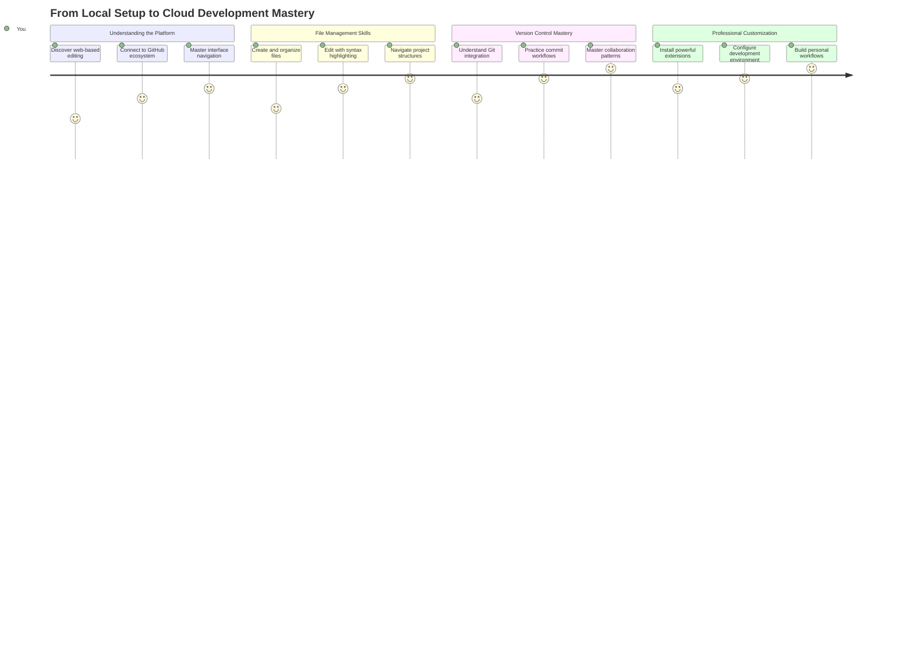
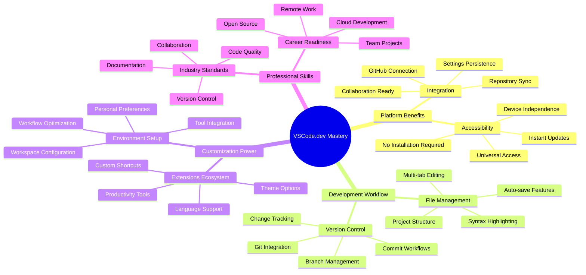
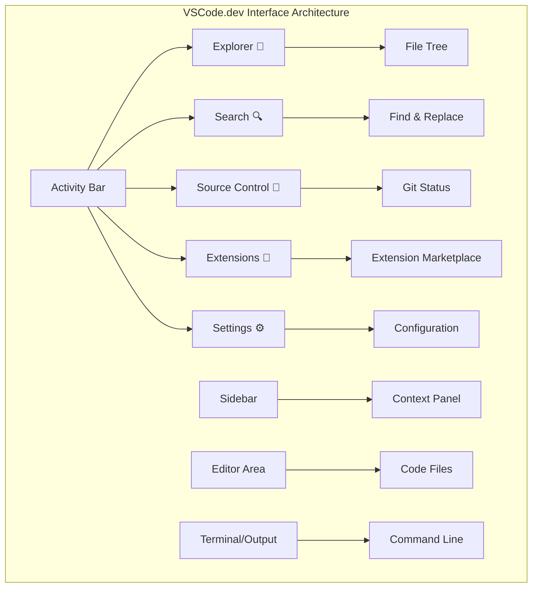
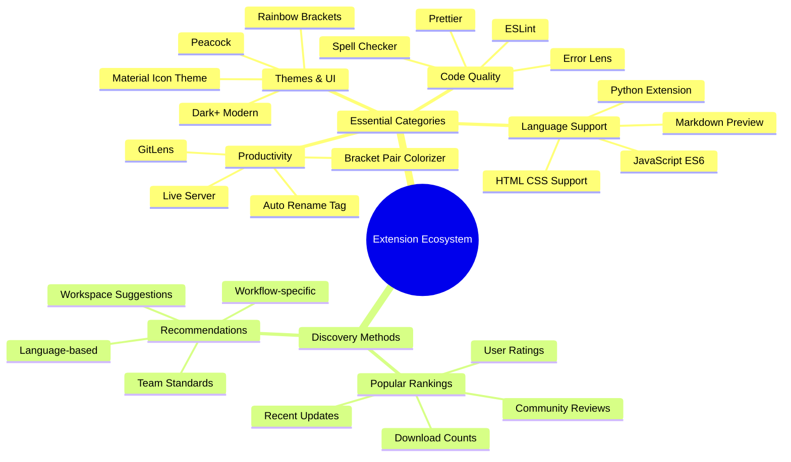
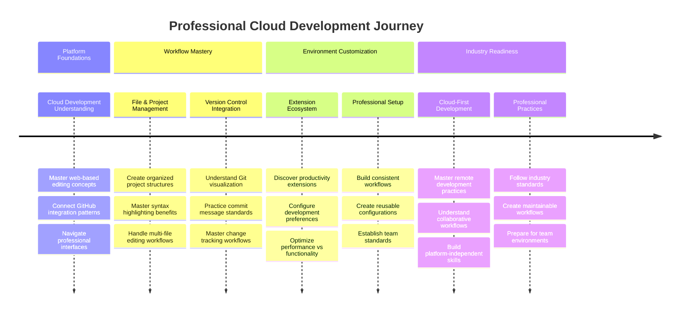

<!--
CO_OP_TRANSLATOR_METADATA:
{
  "original_hash": "a9a3bcc037a447e2d8994d99e871cd9f",
  "translation_date": "2025-11-03T14:17:13+00:00",
  "source_file": "8-code-editor/1-using-a-code-editor/README.md",
  "language_code": "mr"
}
-->
# कोड एडिटर वापरणे: VSCode.dev मध्ये प्राविण्य मिळवा

*द मॅट्रिक्स* मध्ये निओला डिजिटल जगात प्रवेश करण्यासाठी मोठ्या संगणक टर्मिनलमध्ये प्लग इन करावे लागले होते, हे लक्षात आहे का? आजचे वेब विकास साधने याच्या अगदी उलट आहेत – अत्यंत शक्तिशाली क्षमता कुठूनही उपलब्ध आहेत. VSCode.dev हा ब्राउझर-आधारित कोड एडिटर आहे जो कोणत्याही इंटरनेट कनेक्शन असलेल्या डिव्हाइसवर व्यावसायिक विकास साधने आणतो.

जसे छपाई यंत्राने पुस्तकं सर्वांसाठी उपलब्ध केली, फक्त मठातील लेखकांसाठी नाही, तसेच VSCode.dev कोडिंगला लोकशाहीसाठी खुले करते. तुम्ही लायब्ररीच्या संगणकावर, शाळेच्या प्रयोगशाळेत किंवा ब्राउझर प्रवेश असलेल्या कोणत्याही ठिकाणी प्रकल्पांवर काम करू शकता. कोणतीही स्थापना नाही, कोणतेही "माझ्या विशिष्ट सेटअपची गरज आहे" असे बंधन नाही.

या धड्याच्या शेवटी, तुम्हाला VSCode.dev नेव्हिगेट कसे करायचे, GitHub रिपॉझिटरी थेट ब्राउझरमध्ये उघडायची आणि Git वापरून व्हर्जन कंट्रोल कसे करायचे हे समजेल – व्यावसायिक विकासक दररोज अवलंबून असलेल्या कौशल्ये.

## ⚡ पुढील ५ मिनिटांत तुम्ही काय करू शकता

**व्यस्त विकासकांसाठी जलद सुरुवात मार्ग**


- **पहिला मिनिट**: [vscode.dev](https://vscode.dev) वर जा - कोणतीही स्थापना आवश्यक नाही
- **दुसरा मिनिट**: GitHub सह साइन इन करा आणि तुमच्या रिपॉझिटरी कनेक्ट करा
- **तिसरा मिनिट**: URL ट्रिक वापरून पहा: कोणत्याही रिपॉझिटरी URL मध्ये `github.com` ला `vscode.dev/github` मध्ये बदला
- **चौथा मिनिट**: नवीन फाइल तयार करा आणि सिंटॅक्स हायलाइटिंग आपोआप कार्य करताना पहा
- **पाचवा मिनिट**: बदल करा आणि Source Control पॅनेलद्वारे ते कमिट करा

**जलद चाचणी URL**:
```
# Transform this:
github.com/microsoft/Web-Dev-For-Beginners

# Into this:
vscode.dev/github/microsoft/Web-Dev-For-Beginners
```

**महत्त्व का आहे**: ५ मिनिटांत, तुम्ही व्यावसायिक साधनांसह कोठूनही कोडिंग करण्याचा अनुभव घ्याल. हे विकासाचे भविष्य दर्शवते - प्रवेशयोग्य, शक्तिशाली आणि त्वरित.

## 🗺️ क्लाउड-आधारित विकासामधील तुमचा शिक्षण प्रवास



**तुमचा प्रवासाचा गंतव्य**: या धड्याच्या शेवटी, तुम्ही कोणत्याही डिव्हाइसवरून कार्य करणारे व्यावसायिक क्लाउड विकास वातावरण मास्टर केले असेल, जे तुम्हाला प्रमुख तंत्रज्ञान कंपन्यांतील विकासक वापरत असलेल्या साधनांसह कोड करण्यास सक्षम करते.

## तुम्ही काय शिकाल

आपण हे एकत्रितपणे चालविल्यानंतर, तुम्ही हे करू शकाल:

- VSCode.dev नेव्हिगेट करा जणू ते तुमचे दुसरे घर आहे – तुम्हाला आवश्यक असलेले सर्व काही न सापडता शोधा
- कोणतीही GitHub रिपॉझिटरी ब्राउझरमध्ये उघडा आणि त्वरित संपादन सुरू करा (हे खूप जादुई आहे!)
- Git वापरून तुमचे बदल ट्रॅक करा आणि व्यावसायिकासारखे तुमची प्रगती जतन करा
- कोडिंग जलद आणि मजेदार बनवणाऱ्या एक्सटेंशन्ससह तुमचा एडिटर सुपरचार्ज करा
- आत्मविश्वासाने प्रकल्प फाइल्स तयार करा आणि आयोजित करा

## तुम्हाला काय आवश्यक आहे

आवश्यकता सोपी आहेत:

- एक विनामूल्य [GitHub खाते](https://github.com) (आवश्यक असल्यास आम्ही तुम्हाला तयार करण्यात मार्गदर्शन करू)
- वेब ब्राउझरची मूलभूत ओळख
- GitHub बेसिक्स धडा उपयुक्त पार्श्वभूमी प्रदान करतो, जरी तो आवश्यक नाही

> 💡 **GitHub साठी नवीन?** खाते तयार करणे विनामूल्य आहे आणि काही मिनिटांत पूर्ण होते. जसे लायब्ररी कार्ड तुम्हाला जगभरातील पुस्तकांमध्ये प्रवेश देते, तसे GitHub खाते तुम्हाला इंटरनेटवरील कोड रिपॉझिटरीमध्ये प्रवेश देते.

## 🧠 क्लाउड विकास इकोसिस्टमचा आढावा



**मुख्य तत्त्व**: क्लाउड-आधारित विकास वातावरण कोडिंगचे भविष्य दर्शवते - व्यावसायिक दर्जाचे साधने प्रदान करणे जे प्रवेशयोग्य, सहयोगी आणि प्लॅटफॉर्म-स्वतंत्र आहेत.

## वेब-आधारित कोड एडिटर का महत्त्वाचे आहेत

इंटरनेटच्या आधी, वेगवेगळ्या विद्यापीठांतील वैज्ञानिकांना संशोधन सहजपणे शेअर करता येत नव्हते. मग १९६० च्या दशकात ARPANET आले, ज्याने अंतरावर संगणकांना जोडले. वेब-आधारित कोड एडिटर याच तत्त्वाचे अनुसरण करतात – शक्तिशाली साधने तुमच्या भौतिक स्थान किंवा डिव्हाइसच्या मर्यादेपासून स्वतंत्रपणे उपलब्ध करणे.

कोड एडिटर तुमचे विकास कार्यक्षेत्र म्हणून काम करते, जिथे तुम्ही कोड फाइल्स लिहिता, संपादित करता आणि आयोजित करता. साध्या टेक्स्ट एडिटरपेक्षा वेगळे, व्यावसायिक कोड एडिटर सिंटॅक्स हायलाइटिंग, त्रुटी शोधणे आणि प्रकल्प व्यवस्थापन वैशिष्ट्ये प्रदान करतात.

VSCode.dev या क्षमतांना तुमच्या ब्राउझरमध्ये आणते:

**वेब-आधारित संपादनाचे फायदे:**

| वैशिष्ट्य | वर्णन | व्यावहारिक फायदा |
|---------|-------------|----------|
| **प्लॅटफॉर्म स्वतंत्रता** | कोणत्याही ब्राउझर असलेल्या डिव्हाइसवर चालते | वेगवेगळ्या संगणकांवर सहज काम करा |
| **स्थापना आवश्यक नाही** | वेब URL द्वारे प्रवेश | सॉफ्टवेअर स्थापना निर्बंध टाळा |
| **स्वयंचलित अद्यतने** | नेहमी नवीनतम आवृत्ती चालवते | मॅन्युअल अद्यतनांशिवाय नवीन वैशिष्ट्ये प्रवेश करा |
| **रिपॉझिटरी एकत्रीकरण** | GitHub शी थेट कनेक्शन | स्थानिक फाइल व्यवस्थापनाशिवाय कोड संपादित करा |

**व्यावहारिक परिणाम:**
- वेगवेगळ्या वातावरणांमध्ये कामाची सातत्यता
- ऑपरेटिंग सिस्टमच्या मर्यादेपासून स्वतंत्र इंटरफेस
- त्वरित सहयोग क्षमता
- स्थानिक स्टोरेज आवश्यकता कमी

## VSCode.dev एक्सप्लोर करणे

जसे मेरी क्युरीचे प्रयोगशाळा साध्या जागेत अत्याधुनिक उपकरणे होती, तसेच VSCode.dev व्यावसायिक विकास साधने ब्राउझर इंटरफेसमध्ये पॅक करते. ही वेब अॅप्लिकेशन डेस्कटॉप कोड एडिटरच्या समान मुख्य कार्यक्षमता प्रदान करते.

[VSCode.dev](https://vscode.dev) वर ब्राउझरमध्ये जा. इंटरफेस कोणत्याही डाउनलोड किंवा सिस्टम स्थापनेशिवाय लोड होते – क्लाउड कंप्युटिंग तत्त्वांचा थेट अनुप्रयोग.

### तुमचे GitHub खाते कनेक्ट करणे

जसे अलेक्झांडर ग्रॅहम बेलचा टेलिफोन दूरस्थ ठिकाणांना जोडतो, तसे तुमचे GitHub खाते लिंक करणे VSCode.dev ला तुमच्या कोड रिपॉझिटरीशी जोडते. GitHub सह साइन इन करण्यास सांगितले असता, हे कनेक्शन स्वीकारणे शिफारसीय आहे.

**GitHub एकत्रीकरण प्रदान करते:**
- संपादकामध्ये तुमच्या रिपॉझिटरींना थेट प्रवेश
- डिव्हाइसवर समक्रमित सेटिंग्ज आणि एक्सटेंशन्स
- GitHub वर जतन करण्यासाठी सुलभ वर्कफ्लो
- वैयक्तिकृत विकास वातावरण

### तुमच्या नवीन कार्यक्षेत्राशी परिचित होणे

सर्व काही लोड झाल्यावर, तुम्हाला एक सुंदर स्वच्छ कार्यक्षेत्र दिसेल जे तुम्हाला महत्त्वाच्या गोष्टींवर लक्ष केंद्रित ठेवण्यासाठी डिझाइन केले आहे – तुमचा कोड!


**तुमच्या परिसराचा दौरा:**
- **अॅक्टिव्हिटी बार** (डाव्या बाजूचा पट्टा): तुमची मुख्य नेव्हिगेशन Explorer 📁, Search 🔍, Source Control 🌿, Extensions 🧩, आणि Settings ⚙️ सह
- **साइडबार** (त्याच्या शेजारी असलेला पॅनेल): तुम्ही निवडलेल्या गोष्टींवर आधारित संबंधित माहिती दर्शविण्यासाठी बदलतो
- **एडिटर एरिया** (मधला मोठा जागा): येथेच जादू होते – तुमचे मुख्य कोडिंग क्षेत्र

**थोडा वेळ एक्सप्लोर करा:**
- त्या अॅक्टिव्हिटी बार आयकॉनवर क्लिक करा आणि प्रत्येक काय करते ते पहा
- साइडबार वेगवेगळ्या माहिती दर्शविण्यासाठी कसे अपडेट होते ते पहा – खूप छान, नाही का?
- Explorer दृश्य (📁) कदाचित तुम्ही तुमचा जास्त वेळ घालवाल, त्यामुळे त्यासह आरामदायक व्हा



## GitHub रिपॉझिटरी उघडणे

इंटरनेटच्या आधी, संशोधकांना दस्तऐवजांमध्ये प्रवेश करण्यासाठी लायब्ररीमध्ये शारीरिक प्रवास करावा लागायचा. GitHub रिपॉझिटरी त्याचप्रमाणे कार्य करतात – ते दूरस्थपणे संग्रहित कोडचे संग्रह आहेत. VSCode.dev पारंपरिक पायरी काढून टाकते ज्यामध्ये स्थानिक मशीनवर रिपॉझिटरी डाउनलोड करणे आवश्यक होते.

ही क्षमता कोणत्याही सार्वजनिक रिपॉझिटरीमध्ये त्वरित प्रवेश सक्षम करते, पाहण्यासाठी, संपादित करण्यासाठी किंवा योगदान देण्यासाठी. रिपॉझिटरी उघडण्यासाठी येथे दोन पद्धती आहेत:

### पद्धत १: पॉइंट-आणि-क्लिक मार्ग

VSCode.dev मध्ये नवीन सुरुवात करत असताना आणि विशिष्ट रिपॉझिटरी उघडायची असल्यास हे परिपूर्ण आहे. हे सोपे आणि नवशिक्यांसाठी अनुकूल आहे:

**हे कसे करायचे:**

1. [VSCode.dev](https://vscode.dev) वर जा जर तुम्ही आधीपासून तिथे नसाल
2. स्वागत स्क्रीनवरील "Open Remote Repository" बटण शोधा आणि त्यावर क्लिक करा

   

3. कोणत्याही GitHub रिपॉझिटरी URL पेस्ट करा (हे वापरून पहा: `https://github.com/microsoft/Web-Dev-For-Beginners`)
4. Enter दाबा आणि जादू पहा!

**प्रो टिप - कमांड पॅलेट शॉर्टकट:**

कोडिंग जादूगारासारखे वाटायचे आहे का? हा कीबोर्ड शॉर्टकट वापरून पहा: Ctrl+Shift+P (किंवा Mac वर Cmd+Shift+P) कमांड पॅलेट उघडण्यासाठी:


**कमांड पॅलेट म्हणजे तुम्ही करू शकता अशा प्रत्येक गोष्टीसाठी शोध इंजिन असल्यासारखे आहे:**
- "open remote" टाइप करा आणि ते तुमच्यासाठी रिपॉझिटरी ओपनर शोधेल
- तुम्ही अलीकडे उघडलेल्या रिपॉझिटरी लक्षात ठेवते (खूप उपयुक्त!)
- एकदा तुम्ही याचा वापर करण्यास सुरुवात केली की, तुम्हाला कोडिंग वीजेच्या वेगाने होत असल्यासारखे वाटेल
- हे मूलत: VSCode.dev चे "Hey Siri, पण कोडिंगसाठी" आवृत्ती आहे

### पद्धत २: URL बदलण्याची तंत्र

जसे HTTP आणि HTTPS वेगवेगळ्या प्रोटोकॉल वापरतात परंतु समान डोमेन संरचना राखतात, तसे VSCode.dev GitHub च्या अ‍ॅड्रेसिंग सिस्टमचे प्रतिबिंबित करणारे URL पॅटर्न वापरते. कोणत्याही GitHub रिपॉझिटरी URL ला VSCode.dev मध्ये थेट उघडण्यासाठी बदलले जाऊ शकते.

**URL ट्रान्सफॉर्मेशन पॅटर्न:**

| रिपॉझिटरी प्रकार | GitHub URL | VSCode.dev URL |
|----------------|---------------------|----------------|
| **सार्वजनिक रिपॉझिटरी** | `github.com/microsoft/Web-Dev-For-Beginners` | `vscode.dev/github/microsoft/Web-Dev-For-Beginners` |
| **वैयक्तिक प्रकल्प** | `github.com/your-username/my-project` | `vscode.dev/github/your-username/my-project` |
| **कोणतीही प्रवेशयोग्य रिपॉझिटरी** | `github.com/their-username/awesome-repo` | `vscode.dev/github/their-username/awesome-repo` |

**अंमलबजावणी:**
- `github.com` ला `vscode.dev/github` ने बदला
- इतर सर्व URL घटक अपरिवर्तित ठेवा
- कोणत्याही सार्वजनिकपणे प्रवेशयोग्य रिपॉझिटरीसह कार्य करते
- त्वरित संपादन प्रवेश प्रदान करते

> 💡 **जीवन बदलणारी टिप**: तुमच्या आवडत्या रिपॉझिटरीच्या VSCode.dev आवृत्त्या बुकमार्क करा. माझ्याकडे "Edit My Portfolio" आणि "Fix Documentation" सारखे बुकमार्क आहेत जे मला थेट संपादन मोडमध्ये घेऊन जातात!

**तुम्ही कोणती पद्धत वापरावी?**
- **इंटरफेस मार्ग**: जेव्हा तुम्ही एक्सप्लोर करत असता किंवा अचूक रिपॉझिटरी नावे लक्षात ठेवू शकत नाही तेव्हा उत्तम
- **URL ट्रिक**: जेव्हा तुम्हाला नक्की कुठे जायचे आहे हे माहित असेल तेव्हा वीजेच्या वेगाने प्रवेशासाठी परिपूर्ण

### 🎯 शैक्षणिक तपासणी: क्लाउड विकास प्रवेश

**थांबा आणि विचार करा**: तुम्ही वेब ब्राउझरद्वारे कोड रिपॉझिटरीमध्ये प्रवेश करण्याच्या दोन पद्धती शिकल्या आहेत. हे विकास कसे कार्य करते यामध्ये मूलभूत बदल दर्शवते.

**जलद स्व-मूल्यांकन**:
- वेब-आधारित संपादन पारंपरिक "विकास वातावरण सेटअप" का काढून टाकते हे तुम्ही स्पष्ट करू शकता का?
- स्थानिक git क्लोनिंगच्या तुलनेत URL बदलण्याच्या तंत्राचा कोणता फायदा आहे?
- तुम्ही ओपन सोर्स प्रकल्पांमध्ये योगदान देण्याचा दृष्टिकोन कसा बदलतो?

**वास्तविक-जगाशी कनेक्शन**: GitHub, GitLab, आणि Replit सारख्या प्रमुख कंपन्यांनी त्यांच्या विकास प्लॅटफॉर्म्स क्लाउड-फर्स्ट तत्त्वांवर आधारित तयार केले आहेत. तुम्ही व्यावसायिक विकास संघांनी जगभरात वापरलेल्या समान वर्कफ्लो शिकत आहात.

**चॅलेंज प्रश्न**: क्लाउड-आधारित विकास शाळांमध्ये कोडिंग शिकवण्याचा दृष्टिकोन कसा बदलू शकतो? डिव्हाइस आवश्यकता, सॉफ्टवेअर व्यवस्थापन, आणि सहयोगी शक्यता विचारात घ्या.

## फाइल्स आणि प्रकल्पांसह काम करणे

आता तुम्ही रिपॉझिटरी उघडली आहे, चला बांधायला सुरुवात करूया! VSCode.dev तुम्हाला तुमच्या कोड फाइल्स तयार करण्यासाठी, संपादित करण्यासाठी आणि आयोजित करण्यासाठी आवश्यक असलेली प्रत्येक गोष्ट देते. याला तुमचे डिजिटल कार्यशाळा समजा – प्रत्येक साधन तुम्हाला आवश्यक असलेल्या ठिकाणी आहे.

चला तुमच्या कोडिंग वर्कफ्लोचा मोठा भाग बनवणाऱ्या रोजच्या कामांमध्ये डुबकी मारूया.

### नवीन फाइल्स तयार करणे

जसे आर्किटेक्टच्या ऑफिसमध्ये ब्लूप्रिंट्स आयोजित करणे, VSCode.dev मध्ये फाइल तयार करणे संरचित दृष्टिकोनाचे अनुसरण करते. प्रणाली सर्व मानक वेब विकास फाइल प्रकारांना समर्थन देते.

**फाइल तयार करण्याची प्रक्रिया:**

1. Explorer साइडबारमधील लक्ष्य फोल्डरवर जा
2. फोल्डरच्या नावावर होवर करा आणि "New File" आयकॉन (📄+) उघडा
3. योग्य एक्सटेंशनसह फाइलचे नाव प्रविष्ट करा (`style.css`, `script.js`, `index.html`)
4. फाइल तयार करण्यासाठी Enter दाबा


**नाव देण्याचे नियम:**
- फाइलचा उद्देश सूचित करणारी वर्णनात्मक नावे वापरा
- योग्य सिंटॅक्स हायलाइटिंगसाठी फाइल एक्सटेंशन्स समाविष्ट करा
- प्रकल्पांमध्ये सुसंगत नाव देण्याचे नमुने अनुसरण करा
- लोअरकेस अक्षरे आणि हायफन्स वापरा, जागा टाळा

### फाइल्स संपादित करणे आणि जतन करणे

येथे खरी मजा सुरू होते! VSCode.dev चा एडिटर उपयुक्त वैशिष्ट्यांनी भरलेला आहे ज्यामुळे कोडिंग गुळगुळीत आणि अंतर्ज्ञानी वाटते. हे कोडसाठी खूप हुशार लेखन सहाय्यक असल्यासारखे आहे.

**तुमचा संपादन वर्कफ्लो:**

1. Explorer मध्ये कोणत्याही फाइलवर क्लिक करा आणि ती मुख्य क्षेत्रात
- आपल्या सर्व स्टेज केलेल्या बदलांबद्दल आपण समाधानी आहात याची खात्री करा
- आपण काय केले याचे एक छोटेसे नोट लिहा (हेच आपले "commit message" आहे)
- सर्व काही GitHub वर सेव्ह करण्यासाठी चेकमार्क बटणावर क्लिक करा
- जर काहीतरी बदलायचे ठरवले असेल, तर undo आयकॉन वापरून बदल रद्द करू शकता

**चांगले commit messages लिहिणे (हे सोपे आहे!):**
- फक्त आपण काय केले ते वर्णन करा, जसे "Add contact form" किंवा "Fix broken navigation"
- ते लहान आणि सोपे ठेवा – ट्वीट लांबीसारखे, निबंधासारखे नाही
- "Add", "Fix", "Update", किंवा "Remove" सारख्या क्रियापदांनी सुरुवात करा
- **चांगले उदाहरणे**: "Add responsive navigation menu", "Fix mobile layout issues", "Update colors for better accessibility"

> 💡 **जलद नेव्हिगेशन टिप**: वरच्या डाव्या बाजूला असलेल्या हॅमबर्गर मेनू (☰) वापरून आपल्या GitHub रिपॉझिटरीकडे परत जा आणि आपले committed बदल ऑनलाइन पहा. हे आपल्या संपादन वातावरण आणि GitHub प्रोजेक्टच्या मुख्य पृष्ठामधील एक पोर्टलसारखे आहे!

## एक्स्टेंशन्ससह कार्यक्षमता वाढवणे

जसे एखाद्या कारागीराच्या कार्यशाळेत विविध कामांसाठी विशेष साधने असतात, तसेच VSCode.dev एक्स्टेंशन्ससह सानुकूलित केले जाऊ शकते जे विशिष्ट क्षमता जोडतात. या समुदाय-निर्मित प्लगिन्स कोड फॉर्मॅटिंग, लाईव्ह प्रिव्ह्यू, आणि Git इंटिग्रेशन सुधारण्यासारख्या सामान्य विकास गरजा पूर्ण करतात.

एक्स्टेंशन मार्केटप्लेसमध्ये जगभरातील विकसकांनी तयार केलेली हजारो मोफत साधने आहेत. प्रत्येक एक्स्टेंशन विशिष्ट कार्यप्रवाह आव्हाने सोडवते, ज्यामुळे आपल्याला आपल्या गरजा आणि प्राधान्यांनुसार वैयक्तिक विकास वातावरण तयार करता येते.



### आपले परिपूर्ण एक्स्टेंशन्स शोधणे

एक्स्टेंशन मार्केटप्लेस खूप चांगल्या प्रकारे आयोजित केलेले आहे, त्यामुळे आपल्याला आवश्यक असलेले शोधण्यात अडचण येणार नाही. हे आपल्याला विशिष्ट साधने शोधण्यात तसेच आपल्याला माहित नसलेल्या छान गोष्टी शोधण्यात मदत करण्यासाठी डिझाइन केले आहे!

**मार्केटप्लेसमध्ये जाणे:**

1. अ‍ॅक्टिव्हिटी बारमधील एक्स्टेंशन्स आयकॉन (🧩) वर क्लिक करा
2. ब्राउझ करा किंवा काहीतरी विशिष्ट शोधा
3. जे काही मनोरंजक वाटते त्यावर क्लिक करा आणि त्याबद्दल अधिक जाणून घ्या


**आपण तिथे काय पाहाल:**

| विभाग | काय आहे | का उपयुक्त आहे |
|----------|---------|----------|
| **Installed** | आपण आधीच जोडलेले एक्स्टेंशन्स | आपले वैयक्तिक कोडिंग टूलकिट |
| **Popular** | लोकप्रिय एक्स्टेंशन्स | बहुतेक विकसकांनी शिफारस केलेले |
| **Recommended** | आपल्या प्रोजेक्टसाठी स्मार्ट शिफारसी | VSCode.dev च्या उपयुक्त शिफारसी |

**ब्राउझिंग सोपे कसे आहे:**
- प्रत्येक एक्स्टेंशनमध्ये रेटिंग्स, डाउनलोड संख्या, आणि वास्तविक वापरकर्त्यांच्या पुनरावलोकनांचा समावेश आहे
- प्रत्येक एक्स्टेंशन काय करते याचे स्पष्ट वर्णन आणि स्क्रीनशॉट्स उपलब्ध आहेत
- सर्वकाही सुसंगततेच्या माहितीसह स्पष्टपणे चिन्हांकित केलेले आहे
- समान एक्स्टेंशन्स सुचवले जातात जेणेकरून आपण पर्यायांची तुलना करू शकता

### एक्स्टेंशन्स इंस्टॉल करणे (हे खूप सोपे आहे!)

आपल्या संपादकाला नवीन क्षमता जोडणे म्हणजे फक्त एका बटणावर क्लिक करणे. एक्स्टेंशन्स काही सेकंदात इंस्टॉल होतात आणि लगेच कार्य करायला सुरुवात करतात – कोणतेही रिस्टार्ट नाही, कोणतीही प्रतीक्षा नाही.

**आपल्याला फक्त हे करायचे आहे:**

1. आपल्याला हवे ते शोधा (उदाहरणार्थ "live server" किंवा "prettier" शोधा)
2. जे चांगले वाटते त्यावर क्लिक करा आणि अधिक तपशील पहा
3. ते काय करते ते वाचा आणि रेटिंग्स तपासा
4. निळ्या "Install" बटणावर क्लिक करा आणि काम पूर्ण!


**पडद्यामागे काय होते:**
- एक्स्टेंशन आपोआप डाउनलोड होते आणि सेटअप होते
- नवीन वैशिष्ट्ये लगेचच आपल्या इंटरफेसमध्ये दिसतात
- सर्वकाही त्वरित कार्य करायला सुरुवात करते (खरोखर, हे इतके जलद आहे!)
- आपण साइन इन केले असल्यास, एक्स्टेंशन सर्व डिव्हाइसवर सिंक होते

**मी शिफारस करतो की आपण यापासून सुरुवात करा:**
- **Live Server**: कोड करताना आपली वेबसाइट रिअल-टाइममध्ये अपडेट होते (हे जादू सारखे आहे!)
- **Prettier**: आपला कोड स्वच्छ आणि व्यावसायिक दिसण्यासाठी आपोआप फॉर्मॅट करते
- **Auto Rename Tag**: एक HTML टॅग बदला आणि त्याचा जोडीदार टॅग आपोआप अपडेट होतो
- **Bracket Pair Colorizer**: आपल्या ब्रॅकेट्स रंग-कोड करते जेणेकरून आपण गोंधळात पडणार नाही
- **GitLens**: आपल्या Git वैशिष्ट्यांना भरपूर उपयुक्त माहितीने सुपरचार्ज करते

### आपल्या एक्स्टेंशन्स सानुकूलित करणे

बहुतेक एक्स्टेंशन्समध्ये सेटिंग्ज असतात ज्यामुळे आपण त्यांना आपल्या गरजेनुसार सानुकूलित करू शकता. हे कारमध्ये सीट आणि मिरर समायोजित करण्यासारखे आहे – प्रत्येकाची स्वतःची प्राधान्ये असतात!

**एक्स्टेंशन सेटिंग्ज समायोजित करणे:**

1. एक्स्टेंशन्स पॅनेलमध्ये आपले इंस्टॉल केलेले एक्स्टेंशन शोधा
2. त्याच्या नावाजवळ असलेल्या छोटे गियर आयकॉन (⚙️) शोधा आणि क्लिक करा
3. ड्रॉपडाउनमधून "Extension Settings" निवडा
4. आपल्या कार्यप्रवाहासाठी योग्य वाटेपर्यंत गोष्टी समायोजित करा


**आपण समायोजित करू इच्छित सामान्य गोष्टी:**
- आपला कोड कसा फॉर्मॅट होतो (tabs vs spaces, line length, इ.)
- कोणते कीबोर्ड शॉर्टकट विविध क्रिया ट्रिगर करतात
- कोणत्या फाइल प्रकारांवर एक्स्टेंशन कार्य करावे
- विशिष्ट वैशिष्ट्ये चालू किंवा बंद करणे जेणेकरून गोष्टी स्वच्छ राहतील

### आपल्या एक्स्टेंशन्स व्यवस्थित ठेवणे

आपण अधिक छान एक्स्टेंशन्स शोधत असताना, आपली संग्रह व्यवस्थित आणि सुरळीत चालू ठेवू इच्छाल. VSCode.dev हे व्यवस्थापित करणे खूप सोपे करते.

**आपल्या एक्स्टेंशन व्यवस्थापन पर्याय:**

| आपण काय करू शकता | कधी उपयुक्त आहे | प्रो टिप |
|--------|---------|----------|
| **Disable** | एखाद्या एक्स्टेंशनमुळे समस्या निर्माण होत आहे का हे तपासणे | पुन्हा वापरण्याची शक्यता असल्यास अनइंस्टॉल करण्यापेक्षा चांगले |
| **Uninstall** | आपल्याला आवश्यक नसलेल्या एक्स्टेंशन्स पूर्णपणे काढून टाकणे | आपले वातावरण स्वच्छ आणि जलद ठेवते |
| **Update** | नवीन वैशिष्ट्ये आणि बग फिक्सेस मिळवणे | सहसा आपोआप होते, परंतु तपासणे योग्य आहे |

**मी एक्स्टेंशन्स कसे व्यवस्थापित करतो:**
- काही महिन्यांनी, मी जे काही इंस्टॉल केले आहे त्याचा आढावा घेतो आणि जे मी वापरत नाही ते काढून टाकतो
- मी एक्स्टेंशन्स अपडेट ठेवतो जेणेकरून मला नवीन सुधारणा आणि सुरक्षा फिक्सेस मिळतील
- जर काहीतरी मंद वाटत असेल, तर मी तात्पुरते एक्स्टेंशन्स डिसेबल करतो आणि कोणते कारणीभूत आहे ते पाहतो
- जेव्हा एक्स्टेंशन्सला मोठे अपडेट्स मिळतात तेव्हा मी अपडेट नोट्स वाचतो – कधी कधी छान नवीन वैशिष्ट्ये असतात!

> ⚠️ **परफॉर्मन्स टिप**: एक्स्टेंशन्स अप्रतिम आहेत, परंतु खूप जास्त असल्यास गोष्टी मंद होऊ शकतात. जे खरोखर आपले जीवन सोपे करतात त्यावर लक्ष केंद्रित करा आणि जे आपण कधीही वापरत नाही ते अनइंस्टॉल करण्यास घाबरू नका.

### 🎯 शैक्षणिक तपासणी: विकास वातावरण सानुकूलन

**आर्किटेक्चर समजून घेणे**: आपण समुदाय-निर्मित एक्स्टेंशन्स वापरून व्यावसायिक विकास वातावरण सानुकूलित करणे शिकले. हे प्रतिबिंबित करते की एंटरप्राइझ विकास संघ कसे मानक टूलचेन तयार करतात.

**मुख्य संकल्पना आत्मसात केल्या**:
- **एक्स्टेंशन शोध**: विशिष्ट विकास आव्हाने सोडवणारी साधने शोधणे
- **वातावरण कॉन्फिगरेशन**: वैयक्तिक किंवा संघाच्या प्राधान्यांनुसार साधने सानुकूलित करणे
- **परफॉर्मन्स ऑप्टिमायझेशन**: कार्यक्षमता आणि प्रणाली कार्यक्षमतेचा समतोल राखणे
- **समुदाय सहकार्य**: जागतिक विकसक समुदायाने तयार केलेल्या साधनांचा लाभ घेणे

**उद्योग कनेक्शन**: एक्स्टेंशन इकोसिस्टम्स VS Code, Chrome DevTools, आणि आधुनिक IDEs सारख्या प्रमुख विकास प्लॅटफॉर्म्सला शक्ती देतात. एक्स्टेंशन्सचे मूल्यांकन, इंस्टॉल, आणि कॉन्फिगर कसे करावे हे समजून घेणे व्यावसायिक विकास कार्यप्रवाहांसाठी आवश्यक आहे.

**चिंतन प्रश्न**: 10 विकसकांच्या संघासाठी मानक विकास वातावरण सेट करण्यासाठी आपण कसे पुढे जाल? सुसंगतता, कार्यक्षमता, आणि वैयक्तिक प्राधान्ये विचारात घ्या.

## 📈 आपली क्लाउड विकास कौशल्ये सुधारण्याची वेळापत्रक



**🎓 ग्रॅज्युएशन माइलस्टोन**: आपण प्रमुख तंत्रज्ञान कंपन्यांतील व्यावसायिक विकसकांनी वापरलेल्या समान साधने आणि कार्यप्रवाहांचा वापर करून क्लाउड-आधारित विकास यशस्वीरित्या आत्मसात केला आहे. ही कौशल्ये सॉफ्टवेअर विकासाच्या भविष्यासाठी महत्त्वपूर्ण आहेत.

**🔄 पुढील स्तर क्षमता**:
- प्रगत क्लाउड विकास प्लॅटफॉर्म्स (Codespaces, GitPod) एक्सप्लोर करण्यासाठी तयार
- वितरित विकास संघांमध्ये काम करण्यासाठी तयार
- जागतिक स्तरावर ओपन सोर्स प्रोजेक्ट्समध्ये योगदान देण्यासाठी सुसज्ज
- आधुनिक DevOps आणि सतत इंटिग्रेशन पद्धतींसाठी पाया तयार

## GitHub Copilot Agent Challenge 🚀

जसे NASA त्यांच्या स्पेस मिशन्ससाठी संरचित दृष्टिकोन वापरते, तसेच या आव्हानात VSCode.dev कौशल्यांचा संपूर्ण कार्यप्रवाह परिदृश्यात प्रणालीबद्ध अनुप्रयोग समाविष्ट आहे.

**उद्दिष्ट:** VSCode.dev च्या कौशल्यांचा वापर करून व्यापक वेब विकास कार्यप्रवाह स्थापित करणे.

**प्रोजेक्ट आवश्यकता:** Agent mode सहाय्य वापरून, या कार्ये पूर्ण करा:
1. विद्यमान रिपॉझिटरी फोर्क करा किंवा नवीन तयार करा
2. HTML, CSS, आणि JavaScript फाइल्ससह कार्यक्षम प्रोजेक्ट संरचना स्थापित करा
3. तीन विकास-सुधारक एक्स्टेंशन्स इंस्टॉल आणि कॉन्फिगर करा
4. वर्णनात्मक commit messages सह आवृत्ती नियंत्रणाचा सराव करा
5. फीचर ब्रांच तयार करणे आणि बदल करणे याचा प्रयोग करा
6. README.md फाइलमध्ये प्रक्रिया आणि शिकवणींचे दस्तऐवजीकरण करा

हा व्यायाम सर्व VSCode.dev संकल्पनांना एक व्यावहारिक कार्यप्रवाहात एकत्रित करतो जो भविष्यातील विकास प्रोजेक्ट्ससाठी लागू केला जाऊ शकतो.

[agent mode](https://code.visualstudio.com/blogs/2025/02/24/introducing-copilot-agent-mode) बद्दल अधिक जाणून घ्या.

## असाइनमेंट

आता या कौशल्यांची खऱ्या प्रोजेक्टमध्ये चाचणी घेण्याची वेळ आली आहे! मी एक हँड्स-ऑन प्रोजेक्ट तयार केला आहे जो आपल्याला आपण कव्हर केलेल्या प्रत्येक गोष्टीचा सराव करण्यास अनुमती देईल: [VSCode.dev वापरून एक रिझ्युमे वेबसाइट तयार करा](./assignment.md)

ही असाइनमेंट आपल्याला संपूर्णपणे आपल्या ब्राउझरमध्ये एक व्यावसायिक रिझ्युमे वेबसाइट तयार करण्यासाठी मार्गदर्शन करते. आपण एक्सप्लोर केलेल्या सर्व VSCode.dev वैशिष्ट्यांचा वापर कराल, आणि शेवटी, आपल्याकडे एक उत्कृष्ट वेबसाइट आणि आपल्या नवीन कार्यप्रवाहावर ठाम आत्मविश्वास असेल.

## आपल्या कौशल्ये एक्सप्लोर करणे आणि वाढवणे सुरू ठेवा

आपल्याकडे आता एक मजबूत पाया आहे, परंतु शोधण्यासाठी अजून खूप छान गोष्टी आहेत! आपल्या VSCode.dev कौशल्ये पुढील स्तरावर नेण्यासाठी काही संसाधने आणि कल्पना येथे आहेत:

**बुकमार्क करण्यासाठी अधिकृत दस्तऐवज:**
- [VSCode Web Documentation](https://code.visualstudio.com/docs/editor/vscode-web?WT.mc_id=academic-0000-alfredodeza) – ब्राउझर-आधारित संपादनासाठी संपूर्ण मार्गदर्शक
- [GitHub Codespaces](https://docs.github.com/en/codespaces) – क्लाउडमध्ये अधिक शक्ती हवी असल्यास

**पुढील प्रयोग करण्यासाठी छान वैशिष्ट्ये:**
- **Keyboard Shortcuts**: कीबोर्ड शॉर्टकट्स शिकून कोडिंग निंजा सारखे वाटेल
- **Workspace Settings**: विविध प्रकारच्या प्रोजेक्ट्ससाठी वेगवेगळे वातावरण सेट करा
- **Multi-root Workspaces**: एकाच वेळी अनेक रिपॉझिटरींवर काम करा (खूप उपयुक्त!)
- **Terminal Integration**: आपल्या ब्राउझरमध्ये कमांड-लाइन साधनांमध्ये प्रवेश करा

**सरावासाठी कल्पना:**
- काही ओपन-सोर्स प्रोजेक्ट्समध्ये उडी मारा आणि VSCode.dev वापरून योगदान द्या – हे परत देण्याचा एक उत्तम मार्ग आहे!
- आपले परिपूर्ण सेटअप शोधण्यासाठी विविध एक्स्टेंशन्स वापरून पहा
- आपण सर्वात जास्त तयार केलेल्या साइट्सच्या प्रकारांसाठी प्रोजेक्ट टेम्पलेट्स तयार करा
- Git कार्यप्रवाहांचा सराव करा जसे की ब्रांचिंग आणि मर्जिंग – संघ प्रोजेक्ट्समध्ये ही कौशल्ये खूप उपयुक्त आहेत

---

**आपण ब्राउझर-आधारित विकासात पारंगत झाला आहात!** 🎉 जसे पोर्टेबल उपकरणांच्या शोधामुळे वैज्ञानिकांना दुर्गम ठिकाणी संशोधन करण्याची परवानगी मिळाली, तसेच VSCode.dev कोणत्याही इंटरनेट-कनेक्टेड डिव्हाइसवरून व्यावसायिक कोडिंग सक्षम करते.

ही कौशल्ये वर्तमान उद्योग पद्धतींशी जुळतात – अनेक व्यावसायिक विकसक त्यांच्या लवचिकता आणि प्रवेशयोग्यतेसाठी क्लाउड-आधारित विकास वातावरण वापरतात. आपण एक कार्यप्रवाह शिकला आहे जो वैयक्तिक प्रोजेक्ट्सपासून मोठ्या संघ सहयोगांपर्यंत स्केल होतो.

आपल्या पुढील विकास प्रोजेक्टसाठी या तंत्रांचा वापर करा! 🚀

---

**अस्वीकरण**:  
हा दस्तऐवज AI भाषांतर सेवा [Co-op Translator](https://github.com/Azure/co-op-translator) वापरून भाषांतरित करण्यात आला आहे. आम्ही अचूकतेसाठी प्रयत्नशील असलो तरी, कृपयास लक्षात ठेवा की स्वयंचलित भाषांतरांमध्ये त्रुटी किंवा अचूकतेचा अभाव असू शकतो. मूळ भाषेतील दस्तऐवज हा अधिकृत स्रोत मानला जावा. महत्त्वाच्या माहितीसाठी, व्यावसायिक मानवी भाषांतराची शिफारस केली जाते. या भाषांतराचा वापर करून निर्माण झालेल्या कोणत्याही गैरसमज किंवा चुकीच्या अर्थासाठी आम्ही जबाबदार नाही.