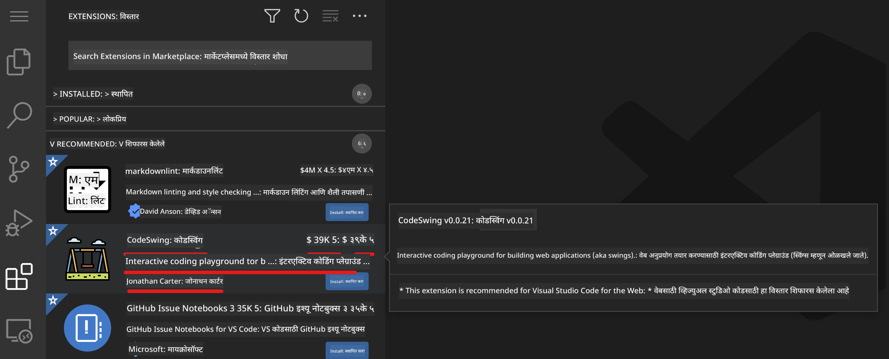
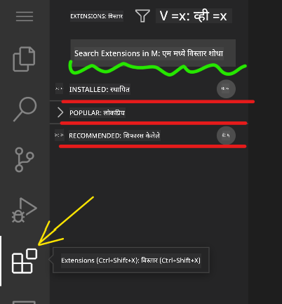

<!--
CO_OP_TRANSLATOR_METADATA:
{
  "original_hash": "1ba61d96a11309a2a6ea507496dcf7e5",
  "translation_date": "2025-08-28T16:21:37+00:00",
  "source_file": "8-code-editor/1-using-a-code-editor/README.md",
  "language_code": "mr"
}
-->
# कोड संपादक वापरणे

या धड्यात [VSCode.dev](https://vscode.dev) या वेब-आधारित कोड संपादकाचा मूलभूत वापर शिकवला आहे, ज्यामुळे तुम्ही तुमच्या कोडमध्ये बदल करू शकता आणि कोणतेही सॉफ्टवेअर तुमच्या संगणकावर स्थापित न करता प्रकल्पात योगदान देऊ शकता.

## शिकण्याची उद्दिष्टे

या धड्यात तुम्ही शिकाल:

- कोड प्रकल्पात कोड संपादक कसा वापरायचा
- आवृत्ती नियंत्रणाद्वारे बदल कसे ट्रॅक करायचे
- विकासासाठी संपादक कसा सानुकूलित करायचा

### पूर्वतयारी

सुरुवात करण्यापूर्वी तुम्हाला [GitHub](https://github.com) वर खाते तयार करणे आवश्यक आहे. [GitHub](https://github.com/) वर जा आणि जर तुम्ही आधीच खाते तयार केले नसेल तर खाते तयार करा.

### परिचय

कोड संपादक हा प्रोग्राम लिहिण्यासाठी आणि विद्यमान कोडिंग प्रकल्पांमध्ये सहयोग करण्यासाठी एक महत्त्वाचा साधन आहे. एकदा तुम्हाला संपादकाचे मूलभूत ज्ञान आणि त्याच्या वैशिष्ट्यांचा कसा उपयोग करायचा हे समजले की, तुम्ही कोड लिहिताना त्याचा उपयोग करू शकता.

## VSCode.dev सह सुरुवात करणे

[VSCode.dev](https://vscode.dev) हा वेबवर आधारित कोड संपादक आहे. तुम्हाला याचा वापर करण्यासाठी काहीही स्थापित करण्याची गरज नाही, जसे तुम्ही कोणतीही वेबसाइट उघडता. संपादक सुरू करण्यासाठी खालील लिंक उघडा: [https://vscode.dev](https://vscode.dev). जर तुम्ही [GitHub](https://github.com/) मध्ये साइन इन केले नसेल, तर साइन इन करण्यासाठी किंवा नवीन खाते तयार करण्यासाठी सूचनांचे अनुसरण करा आणि नंतर साइन इन करा.

एकदा लोड झाल्यावर, ते खालील प्रतिमेसारखे दिसेल:


तीन मुख्य विभाग आहेत, डावीकडून उजवीकडे:

1. _अॅक्टिव्हिटी बार_, ज्यामध्ये काही चिन्हे आहेत, जसे की 🔎, ⚙️, आणि इतर काही.
2. विस्तारित अॅक्टिव्हिटी बार, जो _एक्सप्लोरर_ म्हणून डीफॉल्ट असतो, ज्याला _साइड बार_ म्हणतात.
3. शेवटी, उजवीकडील कोड क्षेत्र.

प्रत्येक चिन्हावर क्लिक करा आणि वेगवेगळे मेनू प्रदर्शित करा. एकदा पूर्ण झाल्यावर, _एक्सप्लोरर_ वर क्लिक करा जेणेकरून तुम्ही जिथे सुरुवात केली तिथे परत जाल.

जेव्हा तुम्ही कोड तयार करणे किंवा विद्यमान कोडमध्ये बदल करणे सुरू करता, तेव्हा ते उजवीकडील सर्वात मोठ्या क्षेत्रात होईल. तुम्ही विद्यमान कोड देखील पाहण्यासाठी या क्षेत्राचा वापर कराल, जे तुम्ही पुढे कराल.

## GitHub रिपॉझिटरी उघडा

तुम्हाला प्रथम GitHub रिपॉझिटरी उघडणे आवश्यक आहे. रिपॉझिटरी उघडण्यासाठी अनेक मार्ग आहेत. या विभागात तुम्ही रिपॉझिटरी उघडण्याचे दोन वेगवेगळे मार्ग पाहाल जेणेकरून तुम्ही बदलांवर काम सुरू करू शकता.

### 1. संपादकासह

दूरस्थ रिपॉझिटरी उघडण्यासाठी संपादकाचा वापर करा. जर तुम्ही [VSCode.dev](https://vscode.dev) वर गेला तर तुम्हाला _"Open Remote Repository"_ बटण दिसेल:


तुम्ही कमांड पॅलेटचा वापर देखील करू शकता. कमांड पॅलेट म्हणजे एक इनपुट बॉक्स आहे जिथे तुम्ही कोणत्याही कमांड किंवा क्रियेचा भाग असलेला शब्द टाइप करू शकता आणि योग्य कमांड शोधू शकता. वरच्या डावीकडील मेनू वापरा, नंतर _View_ निवडा, आणि नंतर _Command Palette_ निवडा, किंवा खालील कीबोर्ड शॉर्टकट वापरा: Ctrl-Shift-P (MacOS वर Command-Shift-P).


एकदा मेनू उघडल्यावर, _open remote repository_ टाइप करा आणि नंतर पहिला पर्याय निवडा. तुम्ही भाग असलेल्या किंवा अलीकडे उघडलेल्या अनेक रिपॉझिटरी दिसतील. तुम्ही पूर्ण GitHub URL देखील वापरू शकता. खालील URL वापरा आणि बॉक्समध्ये पेस्ट करा:

```
https://github.com/microsoft/Web-Dev-For-Beginners
```

✅ यशस्वी झाल्यास, तुम्हाला या रिपॉझिटरीतील सर्व फाइल्स टेक्स्ट संपादकात लोड झालेल्या दिसतील.

### 2. URL वापरून

तुम्ही URL वापरून देखील रिपॉझिटरी लोड करू शकता. उदाहरणार्थ, विद्यमान रिपॉझिटरीसाठी पूर्ण URL [https://github.com/microsoft/Web-Dev-For-Beginners](https://github.com/microsoft/Web-Dev-For-Beginners) आहे, परंतु तुम्ही GitHub डोमेन `VSCode.dev/github` सह बदलू शकता आणि रिपॉझिटरी थेट लोड करू शकता. परिणामी URL असेल: [https://vscode.dev/github/microsoft/Web-Dev-For-Beginners](https://vscode.dev/github/microsoft/Web-Dev-For-Beginners).

## फाइल्स संपादित करा

एकदा तुम्ही ब्राउझर/VSCode.dev वर रिपॉझिटरी उघडली की, पुढील पायरी म्हणजे प्रकल्पात अपडेट्स किंवा बदल करणे.

### 1. नवीन फाइल तयार करा

तुम्ही विद्यमान फोल्डरमध्ये फाइल तयार करू शकता किंवा ती मूळ डिरेक्टरी/फोल्डरमध्ये तयार करू शकता. नवीन फाइल तयार करण्यासाठी, तुम्हाला फाइल ज्या ठिकाणी/डिरेक्टरीमध्ये सेव्ह करायची आहे ती उघडा आणि अॅक्टिव्हिटी बारमध्ये _'New file ...'_ आयकॉन निवडा, फाइलचे नाव द्या आणि एंटर दाबा.


### 2. रिपॉझिटरीवरील फाइल संपादित करा आणि सेव्ह करा

VSCode.dev वापरणे उपयुक्त आहे जेव्हा तुम्हाला तुमच्या प्रकल्पात जलद अपडेट्स करायच्या असतील आणि स्थानिक सॉफ्टवेअर लोड करायचे नसेल. तुमचा कोड अपडेट करण्यासाठी, अॅक्टिव्हिटी बारवरील 'Explorer' आयकॉनवर क्लिक करा, ज्यामुळे रिपॉझिटरीतील फाइल्स आणि फोल्डर्स दिसतील. फाइल निवडा, ती कोड क्षेत्रात उघडा, बदल करा आणि सेव्ह करा.


एकदा तुम्ही तुमचा प्रकल्प अपडेट केल्यावर, _`source control`_ आयकॉन निवडा ज्यामध्ये तुम्ही रिपॉझिटरीमध्ये केलेले सर्व नवीन बदल असतील.

तुमच्या प्रकल्पात केलेले बदल पाहण्यासाठी, विस्तारित अॅक्टिव्हिटी बारमधील `Changes` फोल्डरमधील फाइल्स निवडा. हे तुम्हाला 'Working Tree' उघडेल जिथे तुम्ही फाइलमध्ये केलेले बदल व्हिज्युअली पाहू शकता. लाल रंग प्रकल्पातील वगळलेला भाग दर्शवतो, तर हिरवा रंग जोडलेला भाग दर्शवतो.


जर तुम्ही केलेल्या बदलांवर समाधानी असाल, तर `Changes` फोल्डरवर होवर करा आणि बदल स्टेज करण्यासाठी `+` बटण क्लिक करा. स्टेजिंग म्हणजे तुमचे बदल GitHub वर कमिट करण्यासाठी तयार करणे.

जर तुम्हाला काही बदलांबद्दल खात्री नसेल आणि तुम्हाला ते रद्द करायचे असेल, तर `Changes` फोल्डरवर होवर करा आणि `undo` आयकॉन निवडा.

नंतर, `commit message` टाइप करा _(तुमच्या प्रकल्पात केलेल्या बदलांचे वर्णन)_, आणि बदल कमिट आणि पुश करण्यासाठी `check icon` क्लिक करा.

एकदा तुमच्या प्रकल्पावर काम पूर्ण झाल्यावर, वरच्या डावीकडील `hamburger menu icon` निवडा आणि github.com वर रिपॉझिटरीवर परत जा.


## एक्स्टेंशन्स वापरणे

VSCode मध्ये एक्स्टेंशन्स स्थापित केल्याने तुम्ही तुमच्या संपादकावर नवीन वैशिष्ट्ये आणि सानुकूलित विकास पर्याय जोडू शकता, ज्यामुळे तुमचा विकास कार्यप्रवाह सुधारतो. हे एक्स्टेंशन्स तुम्हाला अनेक प्रोग्रामिंग भाषांसाठी समर्थन जोडण्यास मदत करतात आणि सामान्यतः सामान्य एक्स्टेंशन्स किंवा भाषा-आधारित एक्स्टेंशन्स असतात.

सर्व उपलब्ध एक्स्टेंशन्सची यादी पाहण्यासाठी, अॅक्टिव्हिटी बारवरील _`Extensions icon`_ क्लिक करा आणि _'Search Extensions in Marketplace'_ लेबल असलेल्या टेक्स्ट फील्डमध्ये एक्स्टेंशनचे नाव टाइप करा. तुम्हाला एक्स्टेंशन्सची यादी दिसेल, ज्यामध्ये **एक्स्टेंशनचे नाव, प्रकाशकाचे नाव, एक वाक्य वर्णन, डाउनलोडची संख्या** आणि **स्टार रेटिंग** असेल.



तुम्ही पूर्वी स्थापित केलेली सर्व एक्स्टेंशन्स _`Installed folder`_ मध्ये, बहुतेक विकसकांनी वापरलेली लोकप्रिय एक्स्टेंशन्स _`Popular folder`_ मध्ये आणि तुमच्यासाठी शिफारस केलेली एक्स्टेंशन्स _`recommended folder`_ मध्ये पाहू शकता.



### 1. एक्स्टेंशन्स स्थापित करा

एक्स्टेंशन स्थापित करण्यासाठी, शोध फील्डमध्ये एक्स्टेंशनचे नाव टाइप करा आणि विस्तारित अॅक्टिव्हिटी बारवर दिसल्यावर त्यावर क्लिक करा. कोड क्षेत्रावर अतिरिक्त माहिती पाहण्यासाठी एक्स्टेंशन निवडा. तुम्ही विस्तारित अॅक्टिव्हिटी बारवरील _ब्लू इंस्टॉल बटण_ क्लिक करून किंवा कोड क्षेत्रावर दिसणारे इंस्टॉल बटण वापरून एक्स्टेंशन स्थापित करू शकता.


### 2. एक्स्टेंशन्स सानुकूलित करा

एक्स्टेंशन स्थापित केल्यानंतर, तुम्हाला त्याचे वर्तन बदलावे लागेल आणि तुमच्या पसंतीनुसार सानुकूलित करावे लागेल. असे करण्यासाठी, एक्स्टेंशन्स आयकॉन निवडा, आणि यावेळी, तुमचे एक्स्टेंशन _Installed folder_ मध्ये दिसेल, _**Gear icon**_ क्लिक करा आणि _Extensions Setting_ निवडा.


### 3. एक्स्टेंशन्स व्यवस्थापित करा

एक्स्टेंशन स्थापित केल्यानंतर आणि वापरल्यानंतर, VSCode.dev तुम्हाला वेगवेगळ्या गरजांनुसार तुमचे एक्स्टेंशन व्यवस्थापित करण्याचे पर्याय देते. उदाहरणार्थ, तुम्ही निवडू शकता:

- **डिसेबल:**  _(तुम्ही एक्स्टेंशन तात्पुरते डिसेबल करू शकता जेव्हा तुम्हाला त्याची गरज नसते पण ते पूर्णपणे अनइंस्टॉल करायचे नसते)_

    विस्तारित अॅक्टिव्हिटी बारवरील स्थापित एक्स्टेंशन निवडा > Gear आयकॉन क्लिक करा > 'Disable' किंवा 'Disable (Workspace)' निवडा **किंवा** कोड क्षेत्रावर एक्स्टेंशन उघडा आणि ब्लू डिसेबल बटण क्लिक करा.

- **अनइंस्टॉल:** विस्तारित अॅक्टिव्हिटी बारवरील स्थापित एक्स्टेंशन निवडा > Gear आयकॉन क्लिक करा > 'Uninstall' निवडा **किंवा** कोड क्षेत्रावर एक्स्टेंशन उघडा आणि ब्लू अनइंस्टॉल बटण क्लिक करा.

---

## असाइनमेंट

[VSCode.dev वापरून एक रिझ्युम वेबसाइट तयार करा](https://github.com/microsoft/Web-Dev-For-Beginners/blob/main/8-code-editor/1-using-a-code-editor/assignment.md)

## पुनरावलोकन आणि स्व-अभ्यास

[VSCode.dev](https://code.visualstudio.com/docs/editor/vscode-web?WT.mc_id=academic-0000-alfredodeza) आणि त्याच्या इतर वैशिष्ट्यांबद्दल अधिक वाचा.

---

**अस्वीकरण**:  
हा दस्तऐवज AI भाषांतर सेवा [Co-op Translator](https://github.com/Azure/co-op-translator) चा वापर करून भाषांतरित करण्यात आला आहे. आम्ही अचूकतेसाठी प्रयत्नशील असलो तरी, कृपया लक्षात घ्या की स्वयंचलित भाषांतरांमध्ये त्रुटी किंवा अचूकतेचा अभाव असू शकतो. मूळ भाषेतील मूळ दस्तऐवज हा अधिकृत स्रोत मानला जावा. महत्त्वाच्या माहितीसाठी, व्यावसायिक मानवी भाषांतराची शिफारस केली जाते. या भाषांतराचा वापर करून उद्भवलेल्या कोणत्याही गैरसमज किंवा चुकीच्या अर्थासाठी आम्ही जबाबदार राहणार नाही.