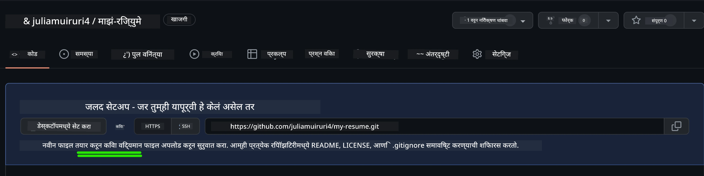
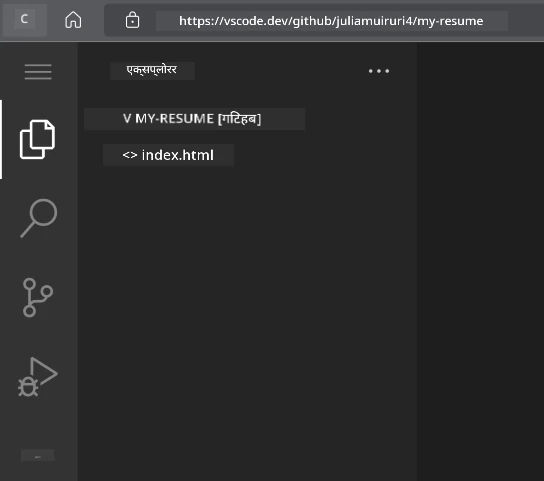
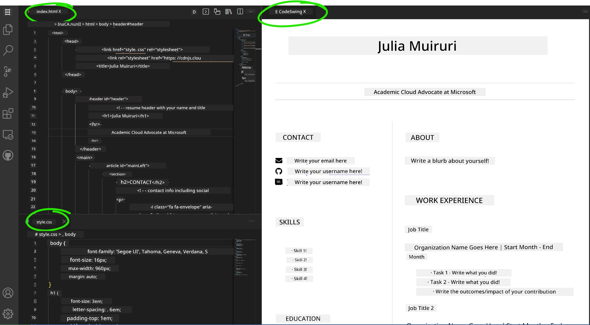

# VSCode.dev वापरून एक व्यावसायिक रिझ्युम वेबसाइट तयार करा

आपल्या कौशल्ये आणि अनुभव एका इंटरॅक्टिव्ह, आधुनिक स्वरूपात दाखवणारी व्यावसायिक रिझ्युम वेबसाइट तयार करून आपल्या करिअरच्या संधींमध्ये बदल घडवा. पारंपरिक PDF पाठवण्याऐवजी, भरती करणाऱ्यांना आपल्या पात्रता आणि वेब डेव्हलपमेंट कौशल्ये दाखवणारी एक आकर्षक, प्रतिसादक्षम वेबसाइट प्रदान करण्याची कल्पना करा.

ही प्रॅक्टिकल असाइनमेंट आपले VSCode.dev कौशल्ये वापरण्यास प्रवृत्त करते आणि आपल्या करिअरसाठी खरोखर उपयुक्त काहीतरी तयार करण्याची संधी देते. आपण ब्राउझरमध्ये संपूर्ण वेब डेव्हलपमेंट वर्कफ्लो अनुभवाल – रेपॉझिटरी तयार करण्यापासून ते डिप्लॉयमेंटपर्यंत.

हे प्रोजेक्ट पूर्ण केल्यानंतर, आपल्याकडे एक व्यावसायिक ऑनलाइन उपस्थिती असेल जी संभाव्य नियोक्त्यांसह सहजपणे शेअर केली जाऊ शकते, आपल्या कौशल्ये वाढल्यावर अपडेट केली जाऊ शकते आणि आपल्या वैयक्तिक ब्रँडशी जुळवून घेतली जाऊ शकते. हे खऱ्या जगातील वेब डेव्हलपमेंट कौशल्ये दाखवणारे प्रॅक्टिकल प्रोजेक्ट आहे.

## शिकण्याचे उद्दिष्ट

हे असाइनमेंट पूर्ण केल्यानंतर, आपण खालील गोष्टी करू शकाल:

- **तयार करा** आणि VSCode.dev वापरून एक संपूर्ण वेब डेव्हलपमेंट प्रोजेक्ट व्यवस्थापित करा
- **रचना करा** व्यावसायिक वेबसाइट सेमॅंटिक HTML घटक वापरून
- **स्टाइल करा** आधुनिक CSS तंत्र वापरून प्रतिसादक्षम लेआउट्स
- **अंमलात आणा** मूलभूत वेब तंत्रज्ञान वापरून इंटरॅक्टिव्ह वैशिष्ट्ये
- **डिप्लॉय करा** एक लाइव्ह वेबसाइट जी शेअर करण्यायोग्य URL द्वारे प्रवेशयोग्य आहे
- **प्रदर्शन करा** विकास प्रक्रियेदरम्यान व्हर्जन कंट्रोल सर्वोत्तम पद्धती

## पूर्वतयारी

हे असाइनमेंट सुरू करण्यापूर्वी, खात्री करा की आपल्याकडे खालील गोष्टी आहेत:

- GitHub खाते ([github.com](https://github.com/) वर तयार करा, जर आवश्यक असेल तर)
- VSCode.dev लेसन पूर्ण केले आहे ज्यामध्ये इंटरफेस नेव्हिगेशन आणि मूलभूत ऑपरेशन्स समाविष्ट आहेत
- HTML रचना आणि CSS स्टाइलिंग संकल्पनांची मूलभूत समज

## प्रोजेक्ट सेटअप आणि रेपॉझिटरी तयार करणे

आपल्या प्रोजेक्टची पायाभरणी सेटअप करून सुरुवात करूया. हा प्रक्रिया वास्तविक-जगातील विकास वर्कफ्लो प्रतिबिंबित करते जिथे प्रोजेक्ट्स योग्य रेपॉझिटरी प्रारंभ आणि रचना नियोजनासह सुरू होतात.

### चरण 1: आपली GitHub रेपॉझिटरी तयार करा

समर्पित रेपॉझिटरी सेट करणे सुनिश्चित करते की आपला प्रोजेक्ट सुरुवातीपासून व्यवस्थित आयोजित आणि व्हर्जन-कंट्रोल केलेला आहे.

1. [GitHub.com](https://github.com) वर जा आणि आपल्या खात्यात साइन इन करा
2. वरच्या उजव्या कोपऱ्यातील हिरव्या "New" बटणावर किंवा "+" चिन्हावर क्लिक करा
3. आपल्या रेपॉझिटरीचे नाव `my-resume` ठेवा (किंवा `john-smith-resume` सारखे वैयक्तिक नाव निवडा)
4. एक संक्षिप्त वर्णन जोडा: "HTML आणि CSS वापरून तयार केलेली व्यावसायिक रिझ्युम वेबसाइट"
5. "Public" निवडा जेणेकरून आपली रिझ्युम संभाव्य नियोक्त्यांसाठी प्रवेशयोग्य होईल
6. "Add a README file" निवडून प्रारंभिक प्रोजेक्ट वर्णन तयार करा
7. सेटअप अंतिम करण्यासाठी "Create repository" वर क्लिक करा

> 💡 **रेपॉझिटरी नाव देण्याचा सल्ला**: प्रोजेक्टचा उद्देश स्पष्टपणे सूचित करणारी वर्णनात्मक, व्यावसायिक नावे वापरा. हे नियोक्त्यांसह शेअर करताना किंवा पोर्टफोलिओ पुनरावलोकन दरम्यान मदत करते.

### चरण 2: प्रोजेक्ट रचना प्रारंभ करा

VSCode.dev मध्ये रेपॉझिटरी उघडण्यासाठी किमान एक फाइल आवश्यक असल्याने, आपण GitHub वर आपली मुख्य HTML फाइल थेट तयार करू.

1. आपल्या नवीन रेपॉझिटरीमध्ये "creating a new file" लिंकवर क्लिक करा
2. `index.html` नाव फाइलसाठी टाइप करा
3. प्रारंभिक HTML रचना जोडा:

```html
<!DOCTYPE html>
<html lang="en">
<head>
    <meta charset="UTF-8">
    <meta name="viewport" content="width=device-width, initial-scale=1.0">
    <title>Your Name - Professional Resume</title>
</head>
<body>
    <h1>Your Name</h1>
    <p>Professional Resume Website</p>
</body>
</html>
```

4. एक कमिट संदेश लिहा: "Add initial HTML structure"
5. आपले बदल सेव्ह करण्यासाठी "Commit new file" वर क्लिक करा



**या प्रारंभिक सेटअपने काय साध्य केले आहे:**
- HTML5 दस्तऐवज रचना योग्य प्रकारे स्थापित करते
- प्रतिसादक्षम डिझाइन सुसंगततेसाठी viewport meta tag समाविष्ट करते
- ब्राउझर टॅबमध्ये दिसणारे वर्णनात्मक पृष्ठ शीर्षक सेट करते
- व्यावसायिक सामग्री संघटनासाठी पाया तयार करते

## VSCode.dev मध्ये काम करणे

आता आपली रेपॉझिटरी पायाभरणी स्थापित झाली आहे, मुख्य विकास कार्यासाठी VSCode.dev वर संक्रमण करूया. हा वेब-आधारित संपादक व्यावसायिक वेब डेव्हलपमेंटसाठी आवश्यक असलेली सर्व साधने प्रदान करतो.

### चरण 3: आपला प्रोजेक्ट VSCode.dev मध्ये उघडा

1. नवीन ब्राउझर टॅबमध्ये [vscode.dev](https://vscode.dev) वर जा
2. स्वागत स्क्रीनवर "Open Remote Repository" वर क्लिक करा
3. GitHub वरून आपला रेपॉझिटरी URL कॉपी करा आणि इनपुट फील्डमध्ये पेस्ट करा

   स्वरूप: `https://github.com/your-username/my-resume`
   
   *`your-username` आपल्या वास्तविक GitHub वापरकर्तानावाने बदला*

4. आपला प्रोजेक्ट लोड करण्यासाठी Enter दाबा

✅ **यशाचा संकेत**: आपल्याला Explorer साइडबारमध्ये आपली प्रोजेक्ट फाइल्स दिसतील आणि मुख्य संपादक क्षेत्रात `index.html` संपादनासाठी उपलब्ध असेल.



**इंटरफेसमध्ये आपण काय पाहाल:**
- **Explorer साइडबार**: **आपल्या रेपॉझिटरी फाइल्स आणि फोल्डर रचना दर्शवते**
- **Editor क्षेत्र**: **संपादनासाठी निवडलेल्या फाइल्सची सामग्री दर्शवते**
- **Activity बार**: **Source Control आणि Extensions सारख्या वैशिष्ट्यांमध्ये प्रवेश प्रदान करते**
- **Status बार**: **कनेक्शन स्थिती आणि वर्तमान शाखा माहिती दर्शवते**

### चरण 4: आपली रिझ्युम सामग्री तयार करा

`index.html` मधील प्लेसहोल्डर सामग्री बदलून एक व्यापक रिझ्युम रचना तयार करा. ही HTML आपल्या पात्रतेचे व्यावसायिक सादरीकरण करण्यासाठी पाया प्रदान करते.

<details>
<summary><b>पूर्ण HTML रिझ्युम रचना</b></summary>

```html
<!DOCTYPE html>
<html lang="en">
<head>
    <meta charset="UTF-8">
    <meta name="viewport" content="width=device-width, initial-scale=1.0">
    <link href="style.css" rel="stylesheet">
    <link rel="stylesheet" href="https://cdnjs.cloudflare.com/ajax/libs/font-awesome/5.15.4/css/all.min.css">
    <title>Your Name - Professional Resume</title>
</head>
<body>
    <header id="header">
        <h1>Your Full Name</h1>
        <hr>
        <p class="role">Your Professional Title</p>
        <hr>
    </header>
    
    <main>
        <article id="mainLeft">
            <section>
                <h2>CONTACT</h2>
                <p>
                    <i class="fa fa-envelope" aria-hidden="true"></i>
                    <a href="mailto:your.email@domain.com">your.email@domain.com</a>
                </p>
                <p>
                    <i class="fab fa-github" aria-hidden="true"></i>
                    <a href="https://github.com/your-username">github.com/your-username</a>
                </p>
                <p>
                    <i class="fab fa-linkedin" aria-hidden="true"></i>
                    <a href="https://linkedin.com/in/your-profile">linkedin.com/in/your-profile</a>
                </p>
            </section>
            
            <section>
                <h2>SKILLS</h2>
                <ul>
                    <li>HTML5 & CSS3</li>
                    <li>JavaScript (ES6+)</li>
                    <li>Responsive Web Design</li>
                    <li>Version Control (Git)</li>
                    <li>Problem Solving</li>
                </ul>
            </section>
            
            <section>
                <h2>EDUCATION</h2>
                <h3>Your Degree or Certification</h3>
                <p>Institution Name</p>
                <p>Start Date - End Date</p>
            </section>
        </article>
        
        <article id="mainRight">
            <section>
                <h2>ABOUT</h2>
                <p>Write a compelling summary that highlights your passion for web development, key achievements, and career goals. This section should give employers insight into your personality and professional approach.</p>
            </section>
            
            <section>
                <h2>WORK EXPERIENCE</h2>
                <div class="job">
                    <h3>Job Title</h3>
                    <p class="company">Company Name | Start Date – End Date</p>
                    <ul>
                        <li>Describe a key accomplishment or responsibility</li>
                        <li>Highlight specific skills or technologies used</li>
                        <li>Quantify impact where possible (e.g., "Improved efficiency by 25%")</li>
                    </ul>
                </div>
                
                <div class="job">
                    <h3>Previous Job Title</h3>
                    <p class="company">Previous Company | Start Date – End Date</p>
                    <ul>
                        <li>Focus on transferable skills and achievements</li>
                        <li>Demonstrate growth and learning progression</li>
                        <li>Include any leadership or collaboration experiences</li>
                    </ul>
                </div>
            </section>
            
            <section>
                <h2>PROJECTS</h2>
                <div class="project">
                    <h3>Project Name</h3>
                    <p>Brief description of what the project accomplishes and technologies used.</p>
                    <a href="#" target="_blank">View Project</a>
                </div>
            </section>
        </article>
    </main>
</body>
</html>
```
</details>

**कस्टमायझेशन मार्गदर्शक:**
- **सर्व प्लेसहोल्डर मजकूर आपल्या वास्तविक माहितीने बदला**
- **आपल्या अनुभव स्तर आणि करिअर फोकसनुसार विभाग समायोजित करा**
- **आवश्यकतेनुसार विभाग जोडा किंवा काढा (उदा., प्रमाणपत्रे, स्वयंसेवा कार्य, भाषा)**
- **आपल्या वास्तविक प्रोफाइल्स आणि प्रोजेक्ट्ससाठी लिंक समाविष्ट करा**

### चरण 5: सहाय्यक फाइल्स तयार करा

व्यावसायिक वेबसाइट्ससाठी व्यवस्थित फाइल रचना आवश्यक असते. संपूर्ण प्रोजेक्टसाठी आवश्यक असलेल्या CSS स्टाइलशीट आणि कॉन्फिगरेशन फाइल्स तयार करा.

1. Explorer साइडबारमध्ये आपल्या प्रोजेक्ट फोल्डर नावावर होवर करा
2. दिसणाऱ्या "New File" आयकॉन (📄+) वर क्लिक करा
3. एकावेळी खालील फाइल्स तयार करा:
   - `style.css` (स्टाइलिंग आणि लेआउटसाठी)
   - `codeswing.json` (प्रिव्ह्यू एक्सटेंशन कॉन्फिगरेशनसाठी)

**CSS फाइल (`style.css`) तयार करणे:**

<details>
<summary><b>व्यावसायिक CSS स्टाइलिंग</b></summary>

```css
/* Modern Resume Styling */
body {
    font-family: 'Segoe UI', Tahoma, Geneva, Verdana, sans-serif;
    font-size: 16px;
    line-height: 1.6;
    max-width: 960px;
    margin: 0 auto;
    padding: 20px;
    color: #333;
    background-color: #f9f9f9;
}

/* Header Styling */
header {
    text-align: center;
    margin-bottom: 3em;
    padding: 2em;
    background: linear-gradient(135deg, #667eea 0%, #764ba2 100%);
    color: white;
    border-radius: 10px;
    box-shadow: 0 4px 6px rgba(0, 0, 0, 0.1);
}

h1 {
    font-size: 3em;
    letter-spacing: 0.1em;
    margin-bottom: 0.2em;
    font-weight: 300;
}

.role {
    font-size: 1.3em;
    font-weight: 300;
    margin: 1em 0;
}

/* Main Content Layout */
main {
    display: grid;
    grid-template-columns: 35% 65%;
    gap: 3em;
    margin-top: 3em;
    background: white;
    padding: 2em;
    border-radius: 10px;
    box-shadow: 0 2px 10px rgba(0, 0, 0, 0.1);
}

/* Typography */
h2 {
    font-size: 1.4em;
    font-weight: 600;
    margin-bottom: 1em;
    color: #667eea;
    border-bottom: 2px solid #667eea;
    padding-bottom: 0.3em;
}

h3 {
    font-size: 1.1em;
    font-weight: 600;
    margin-bottom: 0.5em;
    color: #444;
}

/* Section Styling */
section {
    margin-bottom: 2.5em;
}

#mainLeft {
    border-right: 1px solid #e0e0e0;
    padding-right: 2em;
}

/* Contact Links */
section a {
    color: #667eea;
    text-decoration: none;
    transition: color 0.3s ease;
}

section a:hover {
    color: #764ba2;
    text-decoration: underline;
}

/* Icons */
i {
    margin-right: 0.8em;
    width: 20px;
    text-align: center;
    color: #667eea;
}

/* Lists */
ul {
    list-style: none;
    padding-left: 0;
}

li {
    margin: 0.5em 0;
    padding: 0.3em 0;
    position: relative;
}

li:before {
    content: "▸";
    color: #667eea;
    margin-right: 0.5em;
}

/* Work Experience */
.job, .project {
    margin-bottom: 2em;
    padding-bottom: 1.5em;
    border-bottom: 1px solid #f0f0f0;
}

.company {
    font-style: italic;
    color: #666;
    margin-bottom: 0.5em;
}

/* Responsive Design */
@media (max-width: 768px) {
    main {
        grid-template-columns: 1fr;
        gap: 2em;
    }
    
    #mainLeft {
        border-right: none;
        border-bottom: 1px solid #e0e0e0;
        padding-right: 0;
        padding-bottom: 2em;
    }
    
    h1 {
        font-size: 2.2em;
    }
    
    body {
        padding: 10px;
    }
}

/* Print Styles */
@media print {
    body {
        background: white;
        color: black;
        font-size: 12pt;
    }
    
    header {
        background: none;
        color: black;
        box-shadow: none;
    }
    
    main {
        box-shadow: none;
    }
}
```
</details>

**कॉन्फिगरेशन फाइल (`codeswing.json`) तयार करणे:**

```json
{
    "scripts": [],
    "styles": []
}
```

**CSS वैशिष्ट्ये समजून घेणे:**
- **CSS Grid वापरते** प्रतिसादक्षम, व्यावसायिक लेआउट रचना तयार करण्यासाठी
- **आधुनिक रंग योजना लागू करते** ग्रेडियंट हेडर्ससह
- **हवर इफेक्ट्स आणि स्मूथ ट्रान्झिशन्स समाविष्ट करते** इंटरॅक्टिव्हिटीसाठी
- **सर्व डिव्हाइस आकारांवर कार्य करणारे प्रतिसादक्षम डिझाइन प्रदान करते**
- **PDF जनरेशनसाठी प्रिंट-फ्रेंडली स्टाइल्स जोडते**

### चरण 6: एक्सटेंशन्स इंस्टॉल आणि कॉन्फिगर करा

एक्सटेंशन्स आपल्या विकास अनुभवाला सुधारित करतात, लाइव्ह प्रिव्ह्यू क्षमता आणि सुधारित वर्कफ्लो साधने प्रदान करतात. CodeSwing एक्सटेंशन वेब डेव्हलपमेंट प्रोजेक्ट्ससाठी विशेषतः उपयुक्त आहे.

**CodeSwing एक्सटेंशन इंस्टॉल करणे:**

1. Activity बारमधील Extensions आयकॉन (🧩) वर क्लिक करा
2. मार्केटप्लेस सर्च बॉक्समध्ये "CodeSwing" शोधा
3. शोध परिणामांमधून CodeSwing एक्सटेंशन निवडा
4. निळ्या "Install" बटणावर क्लिक करा


**CodeSwing काय प्रदान करते:**
- **आपण संपादन करत असताना आपल्या वेबसाइटचा लाइव्ह प्रिव्ह्यू सक्षम करते**
- **मॅन्युअल रिफ्रेशशिवाय रिअल-टाइममध्ये बदल दर्शवते**
- **HTML, CSS, आणि JavaScript यासह अनेक फाइल प्रकारांना समर्थन देते**
- **एकात्मिक विकास वातावरण अनुभव प्रदान करते**

**इंस्टॉलेशननंतर त्वरित परिणाम:**
CodeSwing इंस्टॉल झाल्यानंतर, आपल्याला आपल्या रिझ्युम वेबसाइटचा लाइव्ह प्रिव्ह्यू संपादकात दिसेल. यामुळे आपण बदल करत असताना आपली साइट कशी दिसते हे पाहण्याची परवानगी मिळते.



**सुधारित इंटरफेस समजून घेणे:**
- **स्प्लिट व्ह्यू**: **आपला कोड एका बाजूला आणि लाइव्ह प्रिव्ह्यू दुसऱ्या बाजूला दर्शवते**
- **रिअल-टाइम अपडेट्स**: **आपण टाइप करत असताना लगेच बदल प्रतिबिंबित करते**
- **इंटरॅक्टिव्ह प्रिव्ह्यू**: **लिंक्स आणि इंटरॅक्शनची चाचणी करण्याची परवानगी देते**
- **मोबाइल सिम्युलेशन**: **प्रतिसादक्षम डिझाइन चाचणी क्षमता प्रदान करते**

### चरण 7: व्हर्जन कंट्रोल आणि प्रकाशित करणे

आपली रिझ्युम वेबसाइट पूर्ण झाल्यानंतर, Git वापरून आपले काम सेव्ह करा आणि ऑनलाइन उपलब्ध करा.

**आपले बदल कमिट करणे:**

1. Activity बारमधील Source Control आयकॉन (🌿) वर क्लिक करा
2. "Changes" विभागात आपण तयार केलेल्या आणि सुधारित केलेल्या सर्व फाइल्स पुनरावलोकन करा
3. प्रत्येक फाइलच्या बाजूला "+" आयकॉनवर क्लिक करून आपले बदल स्टेज करा
4. एक वर्णनात्मक कमिट संदेश लिहा, जसे:
   - "Add complete resume website with responsive design"
   - "Implement professional styling and content structure"
5. कमिट आणि पुश करण्यासाठी चेकमार्क (✓) वर क्लिक करा

**प्रभावी कमिट संदेश उदाहरणे:**
- "Add professional resume content and styling"
- "Implement responsive design for mobile compatibility"
- "Update contact information and project links"

> 💡 **व्यावसायिक सल्ला**: चांगले कमिट संदेश आपल्या प्रोजेक्टच्या उत्क्रांतीचा मागोवा ठेवण्यास मदत करतात आणि तपशीलाकडे लक्ष देण्याचे प्रदर्शन करतात – नियोक्त्यांना महत्त्वाच्या असलेल्या गुणधर्म.

**आपली प्रकाशित साइट प्रवेश करणे:**
एकदा कमिट झाल्यानंतर, आपण टॉप-लेफ्ट कोपऱ्यातील हॅमबर्गर मेनू (☰) वापरून आपल्या GitHub रेपॉझिटरीवर परत जाऊ शकता. आपली रिझ्युम वेबसाइट आता व्हर्जन-कंट्रोल केलेली आहे आणि डिप्लॉयमेंट किंवा शेअरिंगसाठी तयार आहे.

## परिणाम आणि पुढील पायऱ्या

**अभिनंदन! 🎉** आपण VSCode.dev वापरून एक व्यावसायिक रिझ्युम वेबसाइट यशस्वीरित्या तयार केली आहे. आपल्या प्रोजेक्टने खालील गोष्टी प्रदर्शित केल्या:
**तांत्रिक कौशल्ये प्रदर्शित केली:**
- **रेपॉझिटरी व्यवस्थापन**: संपूर्ण प्रोजेक्ट रचना तयार केली आणि आयोजित केली
- **वेब डेव्हलपमेंट**: आधुनिक HTML5 आणि CSS3 वापरून प्रतिसादक्षम वेबसाइट तयार केली
- **व्हर्जन कंट्रोल**: अर्थपूर्ण कमिट्ससह योग्य Git वर्कफ्लो अंमलात आणला
- **साधन प्रवीणता**: VSCode.dev चा इंटरफेस आणि एक्सटेंशन सिस्टम प्रभावीपणे वापरला

**व्यावसायिक परिणाम साध्य केले:**
- **ऑनलाइन उपस्थिती**: एक शेअर करण्यायोग्य URL जो आपल्या पात्रता दर्शवतो
- **आधुनिक स्वरूप**: पारंपरिक PDF रिझ्युम्ससाठी एक इंटरॅक्टिव्ह पर्याय
- **प्रदर्शनक्षम कौशल्ये**: आपल्या वेब डेव्हलपमेंट क्षमतांचे ठोस पुरावे
- **सोपे अपडेट्स**: एक पाया जो आपण सतत सुधारित आणि सानुकूलित करू शकता

### डिप्लॉयमेंट पर्याय

आपली रिझ्युम नियोक्त्यांसाठी प्रवेशयोग्य बनवण्यासाठी, खालील होस्टिंग पर्याय विचारात घ्या:

**GitHub Pages (शिफारस केलेले):**
1. GitHub वर आपल्या रेपॉझिटरी सेटिंग्जमध्ये जा
2. "Pages" विभागावर स्क्रोल करा
3. "Deploy from a branch" निवडा आणि "main" निवडा
4. आपली साइट `https://your-username.github.io/my-resume` येथे उपलब्ध असेल

**पर्यायी प्लॅटफॉर्म्स:**
- **Netlify**: स्वयंचलित डिप्लॉयमेंटसह कस्टम डोमेन
- **Vercel**: आधुनिक होस्टिंग वैशिष्ट्यांसह जलद डिप्लॉयमेंट
- **GitHub Codespaces**: बिल्ट-इन प्रिव्ह्यूसह विकास वातावरण

### सुधारणा सूचना

खालील वैशिष्ट्ये जोडून आपल्या कौशल्ये विकसित करत रहा:

**तांत्रिक सुधारणा:**
- **JavaScript इंटरॅक्टिव्हिटी**: स्मूथ स्क्रोलिंग किंवा इंटरॅक्टिव्ह घटक जोडा
- **डार्क मोड टॉगल**: वापरकर्त्याच्या प्राधान्यासाठी थीम स्विचिंग अंमलात आणा
- **संपर्क फॉर्म**: संभाव्य नियोक्त्यांकडून थेट संवाद सक्षम करा
- **SEO ऑप्टिमायझेशन**: चांगल्या शोध दृश्यमानतेसाठी मेटा टॅग्स आणि संरचित डेटा जोडा

**सामग्री सुधारणा:**
- **प्रोजेक्ट पोर्टफोलिओ**: GitHub रेपॉझिटरी आणि लाइव्ह डेमो लिंक करा
- **कौशल्ये व्हिज्युअलायझेशन**: प्रगती बार किंवा कौशल्य रेटिंग सिस्टम तयार करा
- **टेस्टिमोनियल्स विभाग**: सहकारी किंवा प्रशिक्षकांकडून शिफारसी समाविष्ट करा
- **ब्लॉग इंटिग्रेशन**: आपल्या शिकण्याच्या प्रवासाचे प्रदर्शन करण्यासाठी ब्लॉग विभाग जोडा

## GitHub Copilot Agent चॅलेंज 🚀

Agent मोड वापरून खालील चॅलेंज पूर्ण करा:

**वर्णन:** व्यावसायिक वेब डेव्हलपमेंट क्षमता आणि आधुनिक डिझाइन तत्त्वे प्रदर्शित करणाऱ्या प्रगत वैशिष्ट्यांसह आपल्या रिझ्युम वेबसाइटला सुधारित करा.

**प्रॉम्प्ट:** आपल्या विद्यमान रिझ्युम वेबसाइटवर आधारित, खालील प्रगत वैशिष्ट्ये अंमलात आणा:
1. स्मूथ ट्रान्झिशन्ससह डार्क/लाइट थीम टॉगल जोडा
2. अॅनिमेटेड प्रगती बारसह एक इंटरॅक्टिव्ह कौशल्य विभाग तयार करा
3
- **प्रवेशयोग्यता**: समावेशक वेब डिझाइनसाठी WCAG मार्गदर्शक तत्त्वे जाणून घ्या  
- **कामगिरी**: ऑप्टिमायझेशनसाठी Lighthouse सारखी साधने शोधा  
- **SEO**: शोध इंजिन ऑप्टिमायझेशनची मूलभूत तत्त्वे समजून घ्या  

**व्यावसायिक विकास:**  
- **पोर्टफोलिओ तयार करणे**: विविध कौशल्ये दाखवण्यासाठी अतिरिक्त प्रकल्प तयार करा  
- **ओपन सोर्स**: सहकार्याचा अनुभव मिळवण्यासाठी विद्यमान प्रकल्पांमध्ये योगदान द्या  
- **नेटवर्किंग**: तुमची रिझ्युम वेबसाइट विकसक समुदायांमध्ये शेअर करा आणि अभिप्राय मिळवा  
- **सतत शिकणे**: वेब डेव्हलपमेंटमधील ट्रेंड्स आणि तंत्रज्ञानाशी अद्ययावत रहा  

---

**तुमचे पुढील पाऊल:** तुमची रिझ्युम वेबसाइट मित्र, कुटुंबीय किंवा मार्गदर्शकांसोबत शेअर करा आणि अभिप्राय मिळवा. त्यांच्या सूचनांचा उपयोग करून तुमच्या डिझाइनमध्ये सुधारणा करा. लक्षात ठेवा, हा प्रकल्प फक्त रिझ्युम नाही – तो वेब डेव्हलपर म्हणून तुमच्या प्रगतीचे प्रदर्शन आहे!

---

**अस्वीकरण**:  
हा दस्तऐवज AI भाषांतर सेवा [Co-op Translator](https://github.com/Azure/co-op-translator) वापरून भाषांतरित करण्यात आला आहे. आम्ही अचूकतेसाठी प्रयत्नशील असलो तरी, कृपया लक्षात ठेवा की स्वयंचलित भाषांतरांमध्ये त्रुटी किंवा अचूकतेचा अभाव असू शकतो. मूळ भाषेतील दस्तऐवज हा अधिकृत स्रोत मानला जावा. महत्त्वाच्या माहितीसाठी व्यावसायिक मानवी भाषांतराची शिफारस केली जाते. या भाषांतराचा वापर करून निर्माण झालेल्या कोणत्याही गैरसमज किंवा चुकीच्या अर्थासाठी आम्ही जबाबदार राहणार नाही.