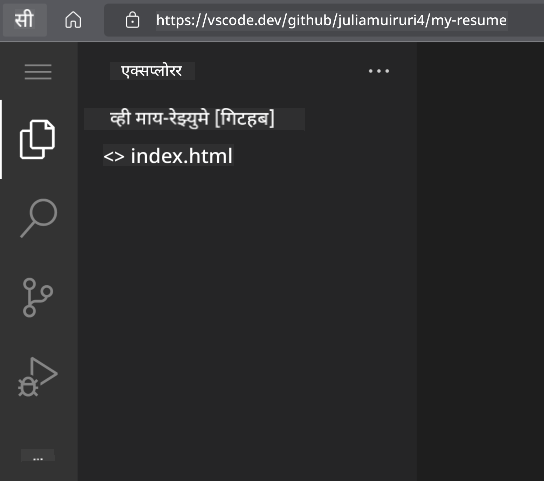

<!--
CO_OP_TRANSLATOR_METADATA:
{
  "original_hash": "2fcb983b8dbadadb1bc2e97f8c12dac5",
  "translation_date": "2025-08-25T23:22:49+00:00",
  "source_file": "8-code-editor/1-using-a-code-editor/assignment.md",
  "language_code": "mr"
}
-->
# vscode.dev वापरून एक रिझ्युमे-वेबसाइट तयार करा

_जर एखाद्या भरती करणाऱ्या व्यक्तीने तुमचा रिझ्युमे मागितला आणि तुम्ही त्यांना URL पाठवला तर किती छान वाटेल?_ 😎

## उद्दिष्टे

या असाइनमेंटनंतर, तुम्ही शिकाल की:

- तुमचा रिझ्युमे दाखवण्यासाठी एक वेबसाइट कशी तयार करायची

### पूर्वअट

1. GitHub खाते. [GitHub](https://github.com/) वर जा आणि तुमच्याकडे आधीपासूनच खाते नसेल तर एक खाते तयार करा.

## पायऱ्या

**पायरी 1:** एक नवीन GitHub रिपॉझिटरी तयार करा आणि त्याला `my-resume` असे नाव द्या.

**पायरी 2:** तुमच्या रिपॉझिटरीमध्ये `index.html` नावाची फाईल तयार करा. आपण github.com वर किमान एक फाईल जोडू कारण तुम्ही vscode.dev वर रिकामी रिपॉझिटरी उघडू शकत नाही.

`creating a new file` लिंकवर क्लिक करा, `index.html` नाव टाइप करा आणि `Commit new file` बटण निवडा.


**पायरी 3:** [VSCode.dev](https://vscode.dev) उघडा आणि `Open Remote Repository` बटण निवडा.

तुमच्या रिझ्युमे साइटसाठी तुम्ही नुकतीच तयार केलेल्या रिपॉझिटरीचा URL कॉपी करा आणि तो इनपुट बॉक्समध्ये पेस्ट करा:

_`your-username` ला तुमच्या GitHub युजरनेमने बदला._

```
https://github.com/your-username/my-resume
```

✅ जर यशस्वी झाले, तर तुम्हाला तुमचा प्रोजेक्ट आणि `index.html` फाईल ब्राउझरवरील टेक्स्ट एडिटरमध्ये उघडलेली दिसेल.



**पायरी 4:** `index.html` फाईल उघडा, खालील कोड तुमच्या कोड एरियामध्ये पेस्ट करा आणि सेव्ह करा.

<details>
    <summary><b>तुमच्या रिझ्युमे वेबसाइटवरील सामग्रीसाठी HTML कोड.</b></summary>
    
        <html>

            <head>
                <link href="style.css" rel="stylesheet">
                <link rel="stylesheet" href="https://cdnjs.cloudflare.com/ajax/libs/font-awesome/5.15.4/css/all.min.css">
                <title>तुमचे नाव येथे लिहा!</title>
            </head>
            <body>
                <header id="header">
                    <!-- रिझ्युमे हेडर तुमच्या नावासह -->
                    <h1>तुमचे नाव येथे लिहा!</h1>
                    <hr>
                    तुमची भूमिका!
                    <hr>
                </header>
                <main>
                    <article id="mainLeft">
                        <section>
                            <h2>संपर्क</h2>
                            <!-- संपर्क माहिती, सोशल मीडिया सहित -->
                            <p>
                                <i class="fa fa-envelope" aria-hidden="true"></i>
                                <a href="mailto:username@domain.top-level domain">तुमचा ईमेल येथे लिहा</a>
                            </p>
                            <p>
                                <i class="fab fa-github" aria-hidden="true"></i>
                                <a href="github.com/yourGitHubUsername">तुमचा युजरनेम येथे लिहा!</a>
                            </p>
                            <p>
                                <i class="fab fa-linkedin" aria-hidden="true"></i>
                                <a href="linkedin.com/yourLinkedInUsername">तुमचा युजरनेम येथे लिहा!</a>
                            </p>
                        </section>
                        <section>
                            <h2>कौशल्ये</h2>
                            <!-- तुमची कौशल्ये -->
                            <ul>
                                <li>कौशल्य 1!</li>
                                <li>कौशल्य 2!</li>
                                <li>कौशल्य 3!</li>
                                <li>कौशल्य 4!</li>
                            </ul>
                        </section>
                        <section>
                            <h2>शिक्षण</h2>
                            <!-- तुमचे शिक्षण -->
                            <h3>तुमचा कोर्स येथे लिहा!</h3>
                            <p>
                                तुमची संस्था येथे लिहा!
                            </p>
                            <p>
                                सुरुवात - समाप्ती तारीख
                            </p>
                        </section>            
                    </article>
                    <article id="mainRight">
                        <section>
                            <h2>माझ्याबद्दल</h2>
                            <!-- तुमच्याबद्दल -->
                            <p>तुमच्याबद्दल थोडक्यात लिहा!</p>
                        </section>
                        <section>
                            <h2>कामाचा अनुभव</h2>
                            <!-- तुमचा कामाचा अनुभव -->
                            <h3>नोकरीचे शीर्षक</h3>
                            <p>
                                संस्थेचे नाव येथे लिहा | सुरुवातीचा महिना – समाप्ती महिना
                            </p>
                            <ul>
                                    <li>कार्य 1 - तुम्ही काय केले ते लिहा!</li>
                                    <li>कार्य 2 - तुम्ही काय केले ते लिहा!</li>
                                    <li>तुमच्या योगदानाचा परिणाम/परिणाम लिहा</li>
                                    
                            </ul>
                            <h3>नोकरीचे शीर्षक 2</h3>
                            <p>
                                संस्थेचे नाव येथे लिहा | सुरुवातीचा महिना – समाप्ती महिना
                            </p>
                            <ul>
                                    <li>कार्य 1 - तुम्ही काय केले ते लिहा!</li>
                                    <li>कार्य 2 - तुम्ही काय केले ते लिहा!</li>
                                    <li>तुमच्या योगदानाचा परिणाम/परिणाम लिहा</li>
                                    
                            </ul>
                        </section>
                    </article>
                </main>
            </body>
        </html>
</details>

तुमच्या रिझ्युमे तपशीलांसाठी HTML कोडमधील _placeholder text_ बदला.

**पायरी 5:** My-Resume फोल्डरवर होवर करा, `New File ...` आयकॉनवर क्लिक करा आणि तुमच्या प्रोजेक्टमध्ये `style.css` आणि `codeswing.json` नावाच्या दोन नवीन फाईल्स तयार करा.

**पायरी 6:** `style.css` फाईल उघडा, खालील कोड पेस्ट करा आणि सेव्ह करा.

<details>
        <summary><b>साइटच्या लेआउटचे स्वरूप ठरवण्यासाठी CSS कोड.</b></summary>
            
            body {
                font-family: 'Segoe UI', Tahoma, Geneva, Verdana, sans-serif;
                font-size: 16px;
                max-width: 960px;
                margin: auto;
            }
            h1 {
                font-size: 3em;
                letter-spacing: .6em;
                padding-top: 1em;
                padding-bottom: 1em;
            }

            h2 {
                font-size: 1.5em;
                padding-bottom: 1em;
            }

            h3 {
                font-size: 1em;
                padding-bottom: 1em;
            }
            main { 
                display: grid;
                grid-template-columns: 40% 60%;
                margin-top: 3em;
            }
            header {
                text-align: center;
                margin: auto 2em;
            }

            section {
                margin: auto 1em 4em 2em;
            }

            i {
                margin-right: .5em;
            }

            p {
                margin: .2em auto
            }

            hr {
                border: none;
                background-color: lightgray;
                height: 1px;
            }

            h1, h2, h3 {
                font-weight: 100;
                margin-bottom: 0;
            }
            #mainLeft {
                border-right: 1px solid lightgray;
            }
            
</details>

**पायरी 6:** `codeswing.json` फाईल उघडा, खालील कोड पेस्ट करा आणि सेव्ह करा.

    {
    "scripts": [],
    "styles": []
    }

**पायरी 7:** `Codeswing extension` इन्स्टॉल करा जेणेकरून कोड एरियामध्ये रिझ्युमे वेबसाइट पाहता येईल.

_`Extensions`_ आयकॉनवर क्लिक करा आणि Codeswing टाइप करा. विस्तारित अ‍ॅक्टिव्हिटी बारवरील _ब्लू इन्स्टॉल बटण_ क्लिक करा किंवा कोड एरियामध्ये दिसणाऱ्या इन्स्टॉल बटणाचा वापर करा. एक्स्टेंशन इन्स्टॉल केल्यानंतर, तुमच्या प्रोजेक्टमध्ये झालेल्या बदलांचे निरीक्षण करा 😃


तुमच्या स्क्रीनवर एक्स्टेंशन इन्स्टॉल केल्यानंतर हे दिसेल.


जर तुम्ही केलेल्या बदलांवर समाधानी असाल, तर `Changes` फोल्डरवर होवर करा आणि `+` बटण क्लिक करून बदल स्टेज करा.

बदलांसाठी एक कमिट मेसेज लिहा _(तुमच्या प्रोजेक्टमध्ये केलेल्या बदलांचे वर्णन)_ आणि `check` क्लिक करून तुमचे बदल कमिट करा. प्रोजेक्टवर काम पूर्ण झाल्यावर, वरच्या डाव्या बाजूला असलेल्या हॅमबर्गर मेनू आयकॉनवर क्लिक करा आणि GitHub वरील रिपॉझिटरीवर परत जा.

अभिनंदन 🎉 तुम्ही काही पायऱ्यांमध्ये vscode.dev वापरून तुमची रिझ्युमे वेबसाइट तयार केली आहे.

## 🚀 आव्हान

तुमच्याकडे बदल करण्याची परवानगी असलेली रिमोट रिपॉझिटरी उघडा आणि काही फाईल्स अपडेट करा. पुढे, तुमच्या बदलांसह एक नवीन ब्रँच तयार करण्याचा प्रयत्न करा आणि एक Pull Request तयार करा.

## पुनरावलोकन आणि स्व-अभ्यास

[VSCode.dev](https://code.visualstudio.com/docs/editor/vscode-web?WT.mc_id=academic-0000-alfredodeza) आणि त्याच्या इतर वैशिष्ट्यांबद्दल अधिक वाचा.

**अस्वीकरण**:  
हा दस्तऐवज AI भाषांतर सेवा [Co-op Translator](https://github.com/Azure/co-op-translator) वापरून भाषांतरित करण्यात आला आहे. आम्ही अचूकतेसाठी प्रयत्नशील असलो तरी कृपया लक्षात ठेवा की स्वयंचलित भाषांतरांमध्ये त्रुटी किंवा अचूकतेचा अभाव असू शकतो. मूळ भाषेतील दस्तऐवज हा अधिकृत स्रोत मानला जावा. महत्त्वाच्या माहितीसाठी व्यावसायिक मानवी भाषांतराची शिफारस केली जाते. या भाषांतराचा वापर करून उद्भवलेल्या कोणत्याही गैरसमज किंवा चुकीच्या अर्थासाठी आम्ही जबाबदार राहणार नाही.