<!--
CO_OP_TRANSLATOR_METADATA:
{
  "original_hash": "2066c17078e9d18b5e309f31d8e8bc24",
  "translation_date": "2025-11-03T14:34:15+00:00",
  "source_file": "9-chat-project/README.md",
  "language_code": "mr"
}
-->
# एआयसह चॅट असिस्टंट तयार करा

स्टार ट्रेकमध्ये, जेव्हा क्रू सहजपणे जहाजाच्या संगणकाशी संवाद साधत असे, जटिल प्रश्न विचारत असे आणि विचारपूर्वक उत्तर मिळवत असे, तेव्हा ते 1960 च्या दशकातील शुद्ध विज्ञान कल्पनारम्य वाटत होते. परंतु आता, तुम्ही आधीपासूनच ओळखत असलेल्या वेब तंत्रज्ञानाचा वापर करून तुम्ही ते तयार करू शकता.

या धड्यात, आपण HTML, CSS, JavaScript आणि काही बॅकएंड इंटिग्रेशन वापरून एआय चॅट असिस्टंट तयार करू. तुम्हाला कळेल की तुम्ही शिकत असलेल्या कौशल्यांचा वापर करून शक्तिशाली एआय सेवांशी कसे जोडले जाऊ शकते, ज्या संदर्भ समजून घेऊ शकतात आणि अर्थपूर्ण उत्तर तयार करू शकतात.

एआयला एक विशाल ग्रंथालय असल्यासारखे समजून घ्या जे केवळ माहिती शोधू शकत नाही तर ती एकत्रित करून तुमच्या विशिष्ट प्रश्नांसाठी सुसंगत उत्तर तयार करू शकते. हजारो पृष्ठे शोधण्याऐवजी, तुम्हाला थेट, संदर्भात्मक उत्तर मिळते.

हे इंटिग्रेशन परिचित वेब तंत्रज्ञान एकत्र काम करून होते. HTML चॅट इंटरफेस तयार करते, CSS व्हिज्युअल डिझाइन हाताळते, JavaScript वापरकर्ता संवाद व्यवस्थापित करते आणि बॅकएंड API सर्वकाही एआय सेवांशी जोडते. हे ऑर्केस्ट्राच्या वेगवेगळ्या विभागांनी एकत्र काम करून सिंफनी तयार करण्यासारखे आहे.

आम्ही नैसर्गिक मानवी संवाद आणि मशीन प्रोसेसिंग यांच्यातील एक पूल तयार करत आहोत. तुम्ही एआय सेवा इंटिग्रेशनची तांत्रिक अंमलबजावणी आणि संवादांना अंतर्ज्ञानी वाटण्यासाठी डिझाइन पॅटर्न शिकाल.

या धड्याच्या शेवटी, एआय इंटिग्रेशन तुम्हाला रहस्यमय प्रक्रियेसारखे वाटणार नाही, तर तुम्ही काम करू शकता अशा आणखी एका API सारखे वाटेल. तुम्ही ChatGPT आणि Claude सारख्या आधुनिक एआय असिस्टंट्सना चालवणाऱ्या अॅप्लिकेशन्सच्या मूलभूत पॅटर्न्स समजून घ्याल, ज्यामध्ये तुम्ही शिकत असलेल्या वेब डेव्हलपमेंट तत्त्वांचा वापर केला आहे.

## ⚡ पुढील 5 मिनिटांत तुम्ही काय करू शकता

**व्यस्त डेव्हलपर्ससाठी जलद सुरुवात मार्ग**

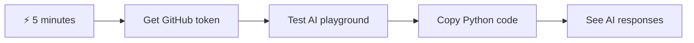

- **पहिला मिनिट**: [GitHub Models Playground](https://github.com/marketplace/models/azure-openai/gpt-4o-mini/playground) ला भेट द्या आणि वैयक्तिक प्रवेश टोकन तयार करा
- **दुसरा मिनिट**: प्लेग्राउंड इंटरफेसमध्ये थेट एआय संवादांची चाचणी करा
- **तिसरा मिनिट**: "Code" टॅबवर क्लिक करा आणि Python स्निपेट कॉपी करा
- **चौथा मिनिट**: तुमच्या टोकनसह स्थानिक स्तरावर कोड चालवा: `GITHUB_TOKEN=your_token python test.py`
- **पाचवा मिनिट**: तुमच्या स्वतःच्या कोडमधून तुमचे पहिले एआय उत्तर तयार होताना पहा

**जलद चाचणी कोड**:
```python
import os
from openai import OpenAI

client = OpenAI(
    base_url="https://models.github.ai/inference",
    api_key="your_token_here"
)

response = client.chat.completions.create(
    messages=[{"role": "user", "content": "Hello AI!"}],
    model="openai/gpt-4o-mini"
)

print(response.choices[0].message.content)
```

**याचा महत्त्व**: 5 मिनिटांत, तुम्ही प्रोग्रामॅटिक एआय संवादाची जादू अनुभवाल. हे तुम्ही वापरत असलेल्या प्रत्येक एआय अॅप्लिकेशनला चालवणारे मूलभूत बांधकाम ब्लॉक दर्शवते.

तुमच्या पूर्ण प्रकल्पाचे अंतिम स्वरूप असे दिसेल:

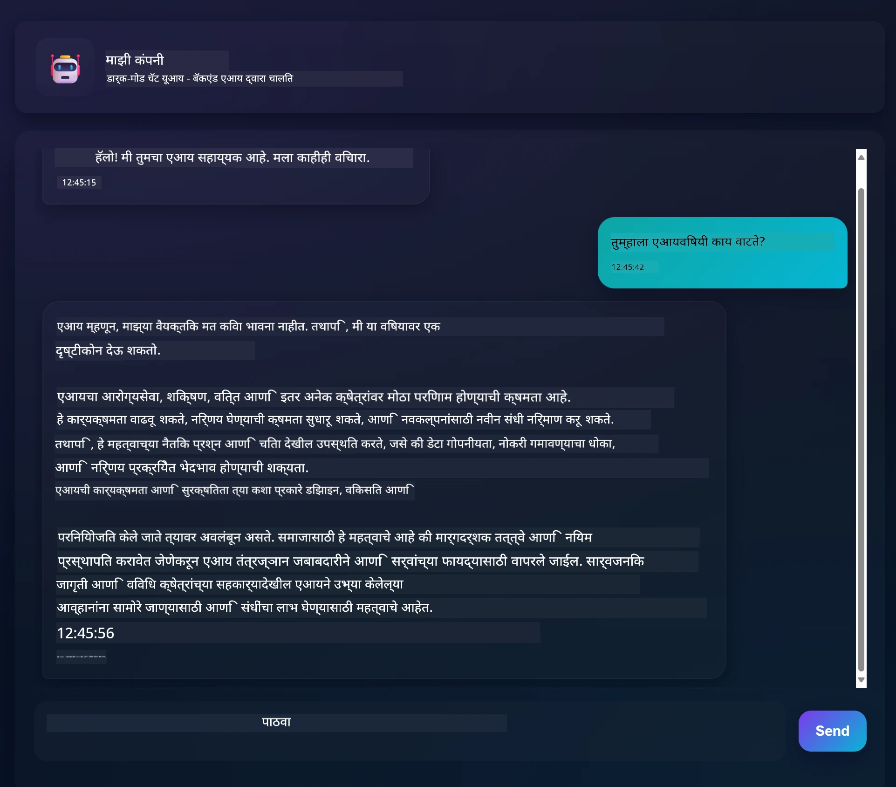

## 🗺️ एआय अॅप्लिकेशन डेव्हलपमेंटमधील तुमचा शिक्षण प्रवास

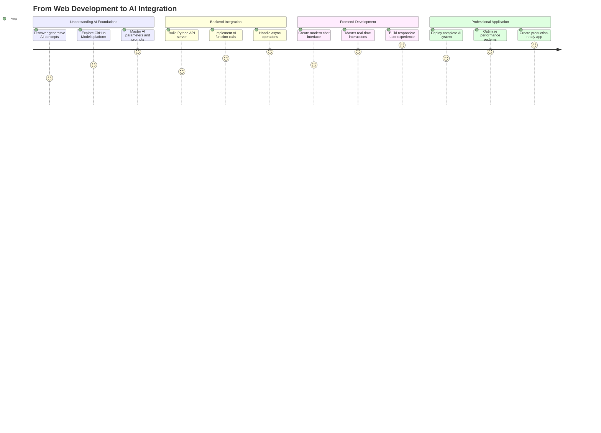

**तुमचा प्रवासाचा गंतव्य**: या धड्याच्या शेवटी, तुम्ही आधुनिक एआय असिस्टंट्स जसे की ChatGPT, Claude आणि Google Bard चालवणाऱ्या तंत्रज्ञान आणि पॅटर्न्सचा वापर करून एक संपूर्ण एआय-संचालित अॅप्लिकेशन तयार केले असेल.

## एआय समजून घेणे: रहस्यापासून प्रावीण्यापर्यंत

कोडमध्ये जाण्यापूर्वी, आपण ज्या गोष्टींवर काम करत आहोत त्या समजून घेऊया. जर तुम्ही यापूर्वी API वापरले असतील, तर तुम्हाला मूलभूत पॅटर्न माहित आहे: विनंती पाठवा, उत्तर प्राप्त करा.

एआय API समान संरचनेचे अनुसरण करतात, परंतु डेटाबेसमधून पूर्व-साठवलेला डेटा पुनर्प्राप्त करण्याऐवजी, ते मोठ्या प्रमाणात मजकूरातून शिकलेल्या पॅटर्नवर आधारित नवीन प्रतिसाद तयार करतात. ग्रंथालयाच्या कॅटलॉग सिस्टम आणि अनेक स्रोतांमधून माहिती एकत्रित करू शकणाऱ्या ज्ञानी ग्रंथपालातील फरकासारखे विचार करा.

### "जनरेटिव्ह एआय" म्हणजे काय?

रोसेटा स्टोनने ज्ञात आणि अज्ञात भाषांमधील पॅटर्न शोधून इजिप्शियन हायेरोग्लिफिक्स समजून घेण्यास विद्वानांना कसे सक्षम केले, याचा विचार करा. एआय मॉडेल्स त्याचप्रमाणे कार्य करतात – ते मजकूराच्या प्रचंड प्रमाणात पॅटर्न शोधतात जेणेकरून भाषा कशी कार्य करते हे समजून घेता येईल आणि नंतर त्या पॅटर्न्सचा वापर करून नवीन प्रश्नांना योग्य प्रतिसाद तयार करता येईल.

**याचे सोपे उदाहरण देतो:**
- **पारंपरिक डेटाबेस**: जसे तुमचा जन्म प्रमाणपत्र विचारणे – तुम्हाला प्रत्येक वेळी एकच दस्तऐवज मिळतो
- **सर्च इंजिन**: जसे ग्रंथपालाला मांजरींवर पुस्तके शोधण्यास सांगणे – ते तुम्हाला उपलब्ध असलेले दाखवतात
- **जनरेटिव्ह एआय**: जसे ज्ञानी मित्राला मांजरींविषयी विचारणे – ते तुम्हाला तुमच्या गरजेनुसार सुसंगत गोष्टी सांगतात

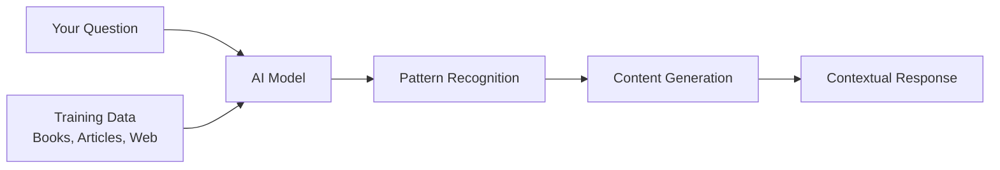

### एआय मॉडेल्स कसे शिकतात (सोपे आवृत्ती)

एआय मॉडेल्स पुस्तकं, लेख आणि संभाषणांमधील मजकूर असलेल्या प्रचंड डेटासेट्सच्या संपर्कातून शिकतात. या प्रक्रियेद्वारे, ते खालील गोष्टींमधील पॅटर्न ओळखतात:
- लिखित संवादामध्ये विचार कसे रचले जातात
- कोणते शब्द सामान्यतः एकत्र दिसतात
- संभाषण सामान्यतः कसे चालते
- औपचारिक आणि अनौपचारिक संवादांमधील संदर्भात्मक फरक

**हे पुरातत्वज्ञ प्राचीन भाषांचे डिकोडिंग कसे करतात यासारखे आहे**: ते व्याकरण, शब्दसंग्रह आणि सांस्कृतिक संदर्भ समजून घेण्यासाठी हजारो उदाहरणांचे विश्लेषण करतात, शेवटी शिकलेल्या पॅटर्न्सचा वापर करून नवीन मजकूरांचे अर्थ लावण्यास सक्षम होतात.

### GitHub Models का?

आम्ही GitHub Models वापरत आहोत कारण ते एक व्यावसायिक कारण आहे – ते आपल्याला आपले स्वतःचे एआय इन्फ्रास्ट्रक्चर सेट अप न करता एंटरप्राइझ-स्तरीय एआयमध्ये प्रवेश देते (जे, माझ्यावर विश्वास ठेवा, तुम्हाला सध्या करायचे नाही!). हे मूलतः "AI-as-a-Service" आहे आणि सर्वोत्तम भाग? सुरुवात करण्यासाठी ते विनामूल्य आहे, त्यामुळे तुम्ही मोठ्या बिलाची चिंता न करता प्रयोग करू शकता.

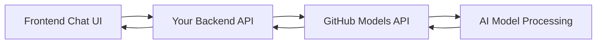

आम्ही GitHub Models आमच्या बॅकएंड इंटिग्रेशनसाठी वापरू, जे व्यावसायिक दर्जाच्या एआय क्षमतेसाठी डेव्हलपर-अनुकूल इंटरफेसद्वारे प्रवेश प्रदान करते. [GitHub Models Playground](https://github.com/marketplace/models/azure-openai/gpt-4o-mini/playground) एक चाचणी वातावरण म्हणून काम करते जिथे तुम्ही वेगवेगळ्या एआय मॉडेल्ससह प्रयोग करू शकता आणि कोडमध्ये त्यांची अंमलबजावणी करण्यापूर्वी त्यांची क्षमता समजू शकता.

## 🧠 एआय अॅप्लिकेशन डेव्हलपमेंट इकोसिस्टम

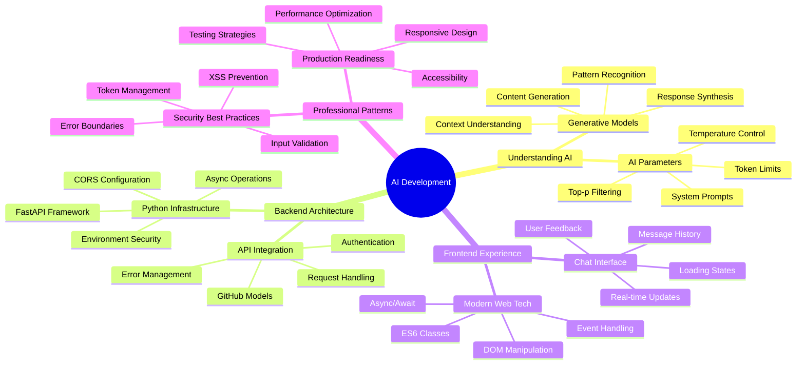

**मूलभूत तत्त्व**: एआय अॅप्लिकेशन डेव्हलपमेंट पारंपरिक वेब डेव्हलपमेंट कौशल्यांना एआय सेवा इंटिग्रेशनसह एकत्र करते, बुद्धिमान अॅप्लिकेशन्स तयार करते जे वापरकर्त्यांना नैसर्गिक आणि प्रतिसादात्मक वाटतात.

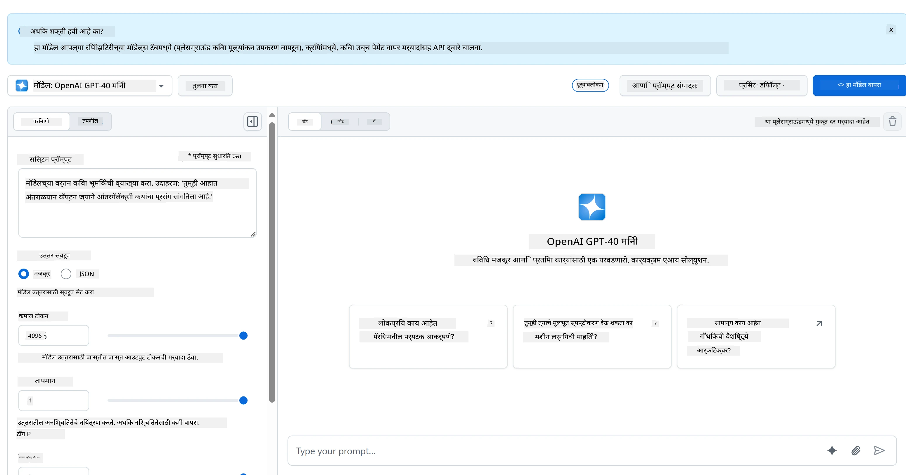

**प्लेग्राउंड इतके उपयुक्त का आहे:**
- **वेगवेगळे एआय मॉडेल्स** जसे GPT-4o-mini, Claude आणि इतर (सर्व विनामूल्य!) वापरून पहा
- **तुमच्या कल्पना आणि प्रॉम्प्ट्स** कोड लिहिण्यापूर्वी चाचणी करा
- **तयार कोड स्निपेट्स** तुमच्या आवडत्या प्रोग्रामिंग भाषेत मिळवा
- **सेटिंग्ज बदलून पहा** जसे की क्रिएटिव्हिटी लेव्हल आणि प्रतिसादाची लांबी, त्याचा आउटपुटवर कसा परिणाम होतो ते पाहा

थोडा प्रयोग केल्यानंतर, फक्त "Code" टॅबवर क्लिक करा आणि तुमची प्रोग्रामिंग भाषा निवडा, ज्यामुळे तुम्हाला लागणारा अंमलबजावणी कोड मिळेल.

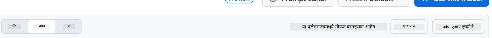

## Python बॅकएंड इंटिग्रेशन सेट करणे

आता Python वापरून एआय इंटिग्रेशन अंमलात आणूया. Python एआय अॅप्लिकेशन्ससाठी उत्कृष्ट आहे कारण त्याचा साधा सिंटॅक्स आणि शक्तिशाली लायब्ररी आहेत. आपण GitHub Models प्लेग्राउंडमधून कोड सुरू करू आणि नंतर त्याला पुनर्वापर करण्यायोग्य, उत्पादन-तयार फंक्शनमध्ये सुधारित करू.

### बेस इंप्लिमेंटेशन समजून घेणे

जेव्हा तुम्ही प्लेग्राउंडमधून Python कोड घेता, तेव्हा तुम्हाला असे काहीतरी दिसेल. जर ते सुरुवातीला खूप वाटत असेल तर काळजी करू नका – चला त्यावर तुकड्यांमध्ये चर्चा करूया:

```python
"""Run this model in Python

> pip install openai
"""
import os
from openai import OpenAI

# To authenticate with the model you will need to generate a personal access token (PAT) in your GitHub settings. 
# Create your PAT token by following instructions here: https://docs.github.com/en/authentication/keeping-your-account-and-data-secure/managing-your-personal-access-tokens
client = OpenAI(
    base_url="https://models.github.ai/inference",
    api_key=os.environ["GITHUB_TOKEN"],
)

response = client.chat.completions.create(
    messages=[
        {
            "role": "system",
            "content": "",
        },
        {
            "role": "user",
            "content": "What is the capital of France?",
        }
    ],
    model="openai/gpt-4o-mini",
    temperature=1,
    max_tokens=4096,
    top_p=1
)

print(response.choices[0].message.content)
```

**या कोडमध्ये काय घडत आहे:**
- **आम्ही आवश्यक टूल्स आयात करतो**: `os` पर्यावरणीय व्हेरिएबल्स वाचण्यासाठी आणि `OpenAI` एआयशी संवाद साधण्यासाठी
- **OpenAI क्लायंट सेट करतो**: GitHub च्या एआय सर्व्हर्सकडे निर्देशित करण्यासाठी
- **प्रमाणीकरण करतो**: विशेष GitHub टोकन वापरून (यावर थोडक्यात चर्चा करू!)
- **संवाद संरचना करतो**: वेगवेगळ्या "भूमिका"सह – नाटकासाठी दृश्य सेट करण्यासारखे
- **विनंती पाठवतो**: एआयकडे काही फाइन-ट्यूनिंग पॅरामीटर्ससह
- **प्रतिसाद मजकूर काढतो**: परत आलेल्या सर्व डेटामधून

### संदेश भूमिका समजून घेणे: एआय संवाद फ्रेमवर्क

एआय संवाद विशिष्ट संरचना वापरतात ज्यामध्ये वेगवेगळ्या "भूमिका" असतात ज्यांचे वेगवेगळे उद्देश असतात:

```python
messages=[
    {
        "role": "system",
        "content": "You are a helpful assistant who explains things simply."
    },
    {
        "role": "user", 
        "content": "What is machine learning?"
    }
]
```

**हे नाटक दिग्दर्शित करण्यासारखे आहे:**
- **सिस्टम भूमिका**: अभिनेता/अभिनेत्रीसाठी स्टेजचे निर्देश – एआयला कसे वागायचे, कोणती व्यक्तिमत्त्व असावी आणि कसे प्रतिसाद द्यायचे ते सांगते
- **वापरकर्ता भूमिका**: अॅप्लिकेशन वापरणाऱ्या व्यक्तीचा वास्तविक प्रश्न किंवा संदेश
- **असिस्टंट भूमिका**: एआयचा प्रतिसाद (तुम्ही हे पाठवत नाही, परंतु ते संवाद इतिहासात दिसते)

**वास्तविक जीवनातील उदाहरण**: कल्पना करा की तुम्ही पार्टीत एखाद्या मित्राला कोणीतरी ओळख करून देत आहात:
- **सिस्टम संदेश**: "ही माझी मैत्रीण सारा आहे, ती एक डॉक्टर आहे जी वैद्यकीय संकल्पना सोप्या शब्दात स्पष्ट करण्यात उत्कृष्ट आहे"
- **वापरकर्ता संदेश**: "तुम्ही मला लसी कशा कार्य करतात ते स्पष्ट करू शकता का?"
- **असिस्टंट प्रतिसाद**: सारा एक मैत्रीपूर्ण डॉक्टर म्हणून प्रतिसाद देते, वकील किंवा शेफ म्हणून नाही

### एआय पॅरामीटर्स समजून घेणे: प्रतिसाद वर्तनाचे फाइन-ट्यूनिंग

एआय API कॉल्समधील संख्यात्मक पॅरामीटर्स मॉडेल प्रतिसाद कसा तयार करतो हे नियंत्रित करतात. हे सेटिंग्ज तुम्हाला वेगवेगळ्या वापराच्या प्रकरणांसाठी एआयचे वर्तन समायोजित करण्यास अनुमती देतात:

#### तापमान (0.0 ते 2.0): क्रिएटिव्हिटी डायल

**याचा उपयोग**: एआयचे प्रतिसाद किती सर्जनशील किंवा अंदाजानुसार असतील ते नियंत्रित करते.

**जॅझ संगीतकाराच्या सुधारणा पातळीप्रमाणे विचार करा**:
- **तापमान = 0.1**: प्रत्येक वेळी अगदी समान धून वाजवणे (अत्यंत अंदाजानुसार)
- **तापमान = 0.7**: ओळखण्यायोग्य राहून काही चवदार बदल जोडणे (संतुलित सर्जनशीलता)
- **तापमान = 1.5**: अनपेक्षित वळणांसह पूर्ण प्रायोगिक जॅझ (अत्यंत अप्रत्याशित)

```python
# Very predictable responses (good for factual questions)
response = client.chat.completions.create(
    messages=[{"role": "user", "content": "What is 2+2?"}],
    temperature=0.1  # Will almost always say "4"
)

# Creative responses (good for brainstorming)
response = client.chat.completions.create(
    messages=[{"role": "user", "content": "Write a creative story opening"}],
    temperature=1.2  # Will generate unique, unexpected stories
)
```

#### मॅक्स टोकन्स (1 ते 4096+): प्रतिसाद लांबी नियंत्रक

**याचा उपयोग**: एआयच्या प्रतिसादाची लांबी किती असावी यावर मर्यादा सेट करते.

**टोकन्स साधारणतः शब्दांशी समतुल्य असतात** (सुमारे 1 टोकन = इंग्रजीमध्ये 0.75 शब्द):
- **max_tokens=50**: लहान आणि गोड (जसे की टेक्स्ट संदेश)
- **max_tokens=500**: एक किंवा दोन चांगले परिच्छेद
- **max_tokens=2000**: उदाहरणांसह तपशीलवार स्पष्टीकरण

```python
# Short, concise answers
response = client.chat.completions.create(
    messages=[{"role": "user", "content": "Explain JavaScript"}],
    max_tokens=100  # Forces a brief explanation
)

# Detailed, comprehensive answers  
response = client.chat.completions.create(
    messages=[{"role": "user", "content": "Explain JavaScript"}],
    max_tokens=1500  # Allows for detailed explanations with examples
)
```

#### Top_p (0.0 ते 1.0): फोकस पॅरामीटर

**याचा उपयोग**: एआय सर्वात संभाव्य प्रतिसादांवर किती लक्ष केंद्रित करते ते नियंत्रित करते.

**एआयकडे प्रचंड शब्दसंग्रह आहे, प्रत्येक शब्द किती संभाव्य आहे यावर आधारित रँक केलेला आहे असे चित्रित करा**:
- **top_p=0.1**: फक्त शीर्ष 10% संभाव्य शब्द विचारात घेतो (अत्यंत लक्ष केंद्रित)
- **top_p=0.9**: संभाव्य शब्दांपैकी 90% विचारात घेतो (अधिक सर्जनशील)
- **top_p=1.0**: सर्वकाही विचारात घेतो (कमाल विविधता)

**उदाहरणार्थ**: जर तुम्ही विचारले "आकाश सामान्यतः..."
- **कमी top_p**: जवळजवळ निश्चितपणे "निळे" म्हणेल
- **उच्च top_p**: "निळे", "ढगाळ", "विशाल", "बदलणारे", "सुंदर" इत्यादी म्हणू शकते

### सर्वकाही एकत्र ठेवणे: वेगवेगळ्या वापराच्या प्रकरणांसाठी पॅरामीटर संयोजन

```python
# For factual, consistent answers (like a documentation bot)
factual_params = {
    "temperature": 0.2,
    "max_tokens": 300,
    "top_p": 0.3
}

# For creative writing assistance
creative_params = {
    "temperature": 1.1,
    "max_tokens": 1000,
    "top_p": 0.9
}

# For conversational, helpful responses (balanced)
conversational_params = {
    "temperature": 0.7,
    "max_tokens": 500,
    "top_p": 0.8
}
```

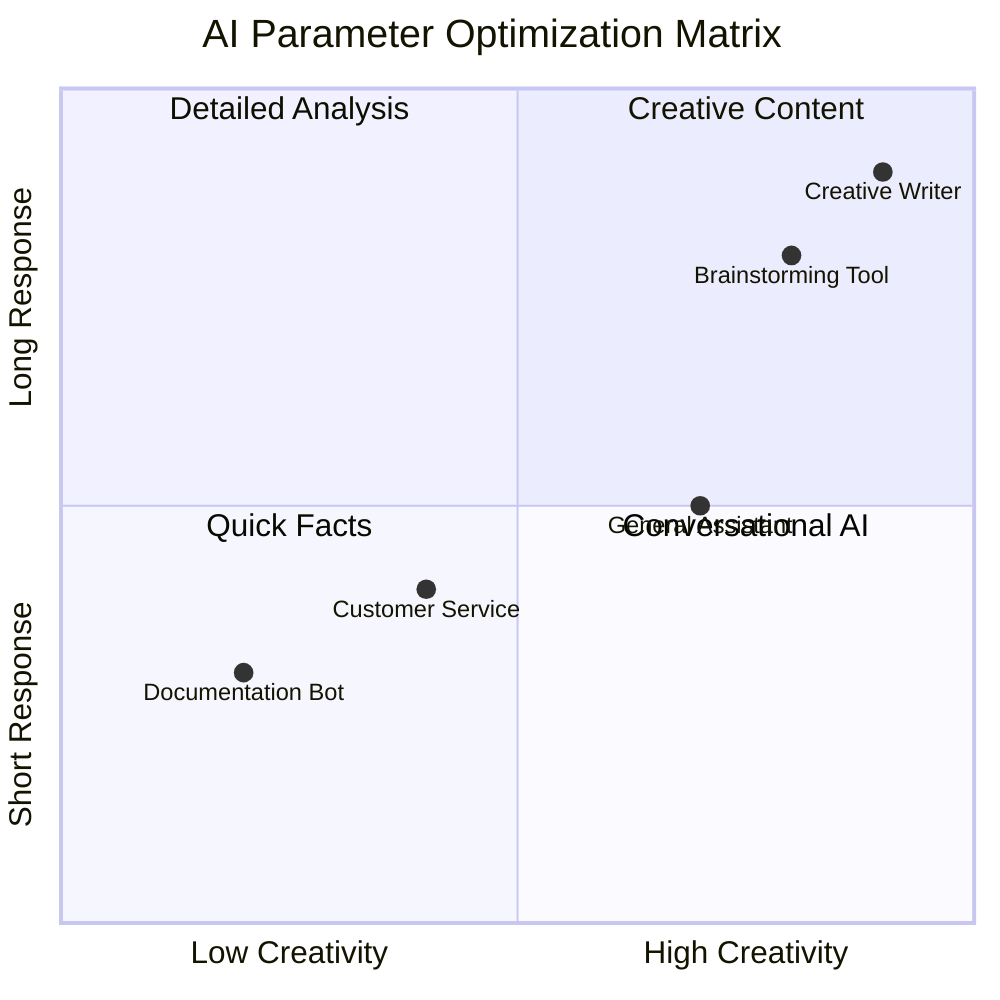

**हे पॅरामीटर्स का महत्त्वाचे आहेत हे समजून घेणे**: वेगवेगळ्या अॅप्लिकेशन्सना वेगवेगळ्या प्रकारच्या प्रतिसादांची आवश्यकता असते. ग्राहक सेवा बॉटने सुसंगत आणि तथ्यात्मक असावे (कमी तापमान), तर सर्जनशील लेखन सहाय्यकाने कल्पक आणि विविध असावे (उच्च तापमान). या पॅरामीटर्स समजून घेणे तुम्हाला तुमच्या एआयच्या व्यक्तिमत्त्वावर आणि प्रतिसाद शैलीवर नियंत्रण देते.
```

**Here's what's happening in this code:**
- **We import** the tools we need: `os` for reading environment variables and `OpenAI` for talking to the AI
- **We set up** the OpenAI client to point to GitHub's AI servers instead of OpenAI directly
- **We authenticate** using a special GitHub token (more on that in a minute!)
- **We structure** our conversation with different "roles" – think of it like setting the scene for a play
- **We send** our request to the AI with some fine-tuning parameters
- **We extract** the actual response text from all the data that comes back

> 🔐 **Security Note**: Never hardcode API keys in your source code! Always use environment variables to store sensitive credentials like your `GITHUB_TOKEN`.

### Creating a Reusable AI Function

Let's refactor this code into a clean, reusable function that we can easily integrate into our web application:

```python
import asyncio
from openai import AsyncOpenAI

# Use AsyncOpenAI for better performance
client = AsyncOpenAI(
    base_url="https://models.github.ai/inference",
    api_key=os.environ["GITHUB_TOKEN"],
)

async def call_llm_async(prompt: str, system_message: str = "You are a helpful assistant."):
    """
    Sends a prompt to the AI model asynchronously and returns the response.
    
    Args:
        prompt: The user's question or message
        system_message: Instructions that define the AI's behavior and personality
    
    Returns:
        str: The AI's response to the prompt
    """
    try:
        response = await client.chat.completions.create(
            messages=[
                {
                    "role": "system",
                    "content": system_message,
                },
                {
                    "role": "user",
                    "content": prompt,
                }
            ],
            model="openai/gpt-4o-mini",
            temperature=1,
            max_tokens=4096,
            top_p=1
        )
        return response.choices[0].message.content
    except Exception as e:
        logger.error(f"AI API error: {str(e)}")
        return "I'm sorry, I'm having trouble processing your request right now."

# Backward compatibility function for synchronous calls
def call_llm(prompt: str, system_message: str = "You are a helpful assistant."):
    """Synchronous wrapper for async AI calls."""
    return asyncio.run(call_llm_async(prompt, system_message))
```

**या सुधारित फंक्शनचे समजून घेणे**:
- **दोन पॅरामीटर्स स्वीकारते**: वापरकर्त्याचा प्रॉम्प्ट आणि पर्यायी सिस्टम संदेश
- **सामान्य सहाय्यक वर्तनासाठी** एक डीफॉल्ट सिस्टम संदेश प्रदान करते
- **योग्य Python प्रकाराच्या सूचनांचा वापर करते** चांगल्या कोड दस्तऐवजीकरणासाठी
- **फक्त प्रतिसाद सामग्री परत करते**,
**2. आउटपुट स्वरूपन**: AI ला प्रतिसाद कसा संरचित करायचा ते सांगा  
```python
system_prompt = """
You are a technical mentor. Always structure your responses as:
1. Quick Answer (1-2 sentences)
2. Detailed Explanation 
3. Code Example
4. Common Pitfalls to Avoid
5. Next Steps for Learning
"""
```
  
**3. बंधन सेट करणे**: AI ने काय करू नये ते परिभाषित करा  
```python
system_prompt = """
You are a coding tutor focused on teaching best practices. Never write complete 
solutions for the user - instead, guide them with hints and questions so they 
learn by doing. Always explain the 'why' behind coding decisions.
"""
```
  
#### तुमच्या चॅट असिस्टंटसाठी हे का महत्त्वाचे आहे  

सिस्टम प्रॉम्प्ट्स समजून घेणे तुम्हाला विशेष AI असिस्टंट्स तयार करण्याची अविश्वसनीय क्षमता देते:  
- **ग्राहक सेवा बॉट**: मदत करणारा, संयमी, धोरण-समज  
- **शिक्षण ट्यूटर**: प्रोत्साहन देणारा, पायरी-पायरीने शिकवणारा, समजून घेण्याची खात्री करणारा  
- **सर्जनशील भागीदार**: कल्पक, कल्पनांवर काम करणारा, "काय असेल?" विचारणारा  
- **तांत्रिक तज्ज्ञ**: अचूक, तपशीलवार, सुरक्षा-जागरूक  

**मुख्य अंतर्दृष्टी**: तुम्ही फक्त AI API कॉल करत नाही आहात – तुम्ही तुमच्या विशिष्ट उपयोगासाठी सेवा देणारी सानुकूल AI व्यक्तिमत्व तयार करत आहात. हे आधुनिक AI अनुप्रयोगांना सामान्य वाटण्याऐवजी सानुकूल आणि उपयुक्त बनवते.  

### 🎯 शैक्षणिक तपासणी: AI व्यक्तिमत्व प्रोग्रामिंग  

**थांबा आणि विचार करा**: तुम्ही नुकतेच सिस्टम प्रॉम्प्ट्सद्वारे AI व्यक्तिमत्व प्रोग्राम करण्यास शिकले. हे आधुनिक AI अनुप्रयोग विकासातील मूलभूत कौशल्य आहे.  

**जलद स्व-मूल्यांकन**:  
- तुम्ही स्पष्ट करू शकता की सिस्टम प्रॉम्प्ट्स नियमित वापरकर्ता संदेशांपेक्षा कसे वेगळे आहेत?  
- तापमान आणि top_p पॅरामीटर्समध्ये काय फरक आहे?  
- तुम्ही विशिष्ट उपयोगासाठी (जसे की कोडिंग ट्यूटर) सिस्टम प्रॉम्प्ट कसे तयार कराल?  

**वास्तविक-जगाशी संबंध**: तुम्ही शिकलेली सिस्टम प्रॉम्प्ट तंत्रे प्रत्येक प्रमुख AI अनुप्रयोगांमध्ये वापरली जातात - GitHub Copilot च्या कोडिंग सहाय्यापासून ChatGPT च्या संवादात्मक इंटरफेसपर्यंत. तुम्ही प्रमुख तंत्रज्ञान कंपन्यांमधील AI उत्पादन संघांनी वापरलेले समान नमुने शिकत आहात.  

**चॅलेंज प्रश्न**: तुम्ही वेगवेगळ्या वापरकर्त्यांसाठी (नवशिक्या विरुद्ध तज्ज्ञ) वेगवेगळ्या AI व्यक्तिमत्वांची रचना कशी कराल? प्रॉम्प्ट इंजिनिअरिंगद्वारे समान अंतर्गत AI मॉडेल वेगवेगळ्या प्रेक्षकांना कसे सेवा देऊ शकते याचा विचार करा.  

## FastAPI सह वेब API तयार करणे: तुमचा उच्च-प्रदर्शन AI संवाद केंद्र  

आता तुमच्या फ्रंटएंडला AI सेवांशी जोडणारा बॅकएंड तयार करूया. आम्ही FastAPI वापरू, एक आधुनिक Python फ्रेमवर्क जे AI अनुप्रयोगांसाठी API तयार करण्यात उत्कृष्ट आहे.  

FastAPI या प्रकारच्या प्रकल्पासाठी अनेक फायदे देते: समवर्ती विनंत्या हाताळण्यासाठी अंगभूत async समर्थन, स्वयंचलित API दस्तऐवज निर्मिती, आणि उत्कृष्ट कार्यक्षमता. तुमचा FastAPI सर्व्हर फ्रंटएंडकडून विनंत्या प्राप्त करणारा, AI सेवांशी संवाद साधणारा आणि स्वरूपित प्रतिसाद परत करणारा मध्यस्थ म्हणून कार्य करतो.  

### AI अनुप्रयोगांसाठी FastAPI का?  

तुम्हाला आश्चर्य वाटू शकते: "मी फक्त माझ्या फ्रंटएंड JavaScript मधून थेट AI ला कॉल करू शकत नाही का?" किंवा "Flask किंवा Django ऐवजी FastAPI का?" उत्तम प्रश्न!  

**आम्ही जे तयार करत आहोत त्यासाठी FastAPI योग्य का आहे:**  
- **मूलतः Async**: अनेक AI विनंत्या एकाच वेळी अडथळा न येता हाताळू शकते  
- **स्वयंचलित दस्तऐवज**: `/docs` ला भेट द्या आणि एक सुंदर, परस्परसंवादी API दस्तऐवज पृष्ठ विनामूल्य मिळवा  
- **अंगभूत सत्यापन**: समस्या निर्माण होण्यापूर्वी त्रुटी पकडते  
- **अत्यंत वेगवान**: सर्वात वेगवान Python फ्रेमवर्कपैकी एक  
- **आधुनिक Python**: Python च्या सर्व नवीनतम आणि उत्कृष्ट वैशिष्ट्यांचा वापर करते  

**आणि आपल्याला बॅकएंड का आवश्यक आहे:**  

**सुरक्षा**: तुमचा AI API की पासवर्डसारखा आहे – जर तुम्ही तो फ्रंटएंड JavaScript मध्ये ठेवला तर, तुमच्या वेबसाइटचा स्त्रोत कोड पाहणारा कोणीही तो चोरू शकतो आणि तुमचे AI क्रेडिट्स वापरू शकतो. बॅकएंड संवेदनशील क्रेडेन्शियल्स सुरक्षित ठेवतो.  

**रेट लिमिटिंग आणि नियंत्रण**: बॅकएंड तुम्हाला वापरकर्ते किती वेळा विनंत्या करू शकतात हे नियंत्रित करण्यास, वापरकर्ता प्रमाणीकरण लागू करण्यास आणि वापर ट्रॅक करण्यासाठी लॉगिंग जोडण्यास अनुमती देते.  

**डेटा प्रक्रिया**: तुम्हाला संभाषणे जतन करायची असतील, अयोग्य सामग्री फिल्टर करायची असेल किंवा अनेक AI सेवा एकत्र करायच्या असतील. बॅकएंड ही लॉजिक ठेवण्याचे ठिकाण आहे.  

**आर्किटेक्चर क्लायंट-सर्व्हर मॉडेलसारखे आहे:**  
- **फ्रंटएंड**: संवादासाठी वापरकर्ता इंटरफेस स्तर  
- **बॅकएंड API**: विनंती प्रक्रिया आणि रूटिंग स्तर  
- **AI सेवा**: बाह्य संगणन आणि प्रतिसाद निर्मिती  
- **पर्यावरणीय व्हेरिएबल्स**: सुरक्षित कॉन्फिगरेशन आणि क्रेडेन्शियल्स स्टोरेज  

### विनंती-प्रतिसाद प्रवाह समजून घेणे  

चला पाहूया जेव्हा वापरकर्ता संदेश पाठवतो तेव्हा काय होते:  

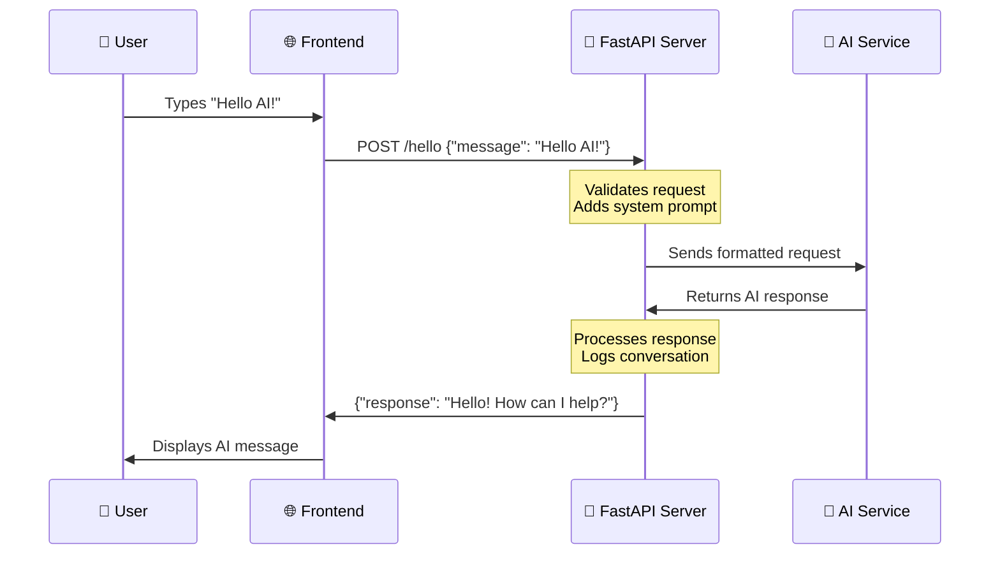
  
**प्रत्येक चरण समजून घेणे:**  
1. **वापरकर्ता संवाद**: व्यक्ती चॅट इंटरफेसमध्ये टाइप करते  
2. **फ्रंटएंड प्रक्रिया**: JavaScript इनपुट कॅप्चर करते आणि JSON म्हणून स्वरूपित करते  
3. **API सत्यापन**: FastAPI स्वयंचलितपणे Pydantic मॉडेल्स वापरून विनंती सत्यापित करते  
4. **AI एकत्रीकरण**: बॅकएंड संदर्भ (सिस्टम प्रॉम्प्ट) जोडतो आणि AI सेवेला कॉल करतो  
5. **प्रतिसाद हाताळणी**: API AI प्रतिसाद प्राप्त करते आणि आवश्यक असल्यास ते बदलू शकते  
6. **फ्रंटएंड प्रदर्शन**: JavaScript चॅट इंटरफेसमध्ये प्रतिसाद दर्शवते  

### API आर्किटेक्चर समजून घेणे  

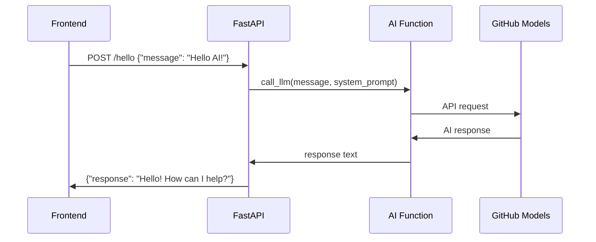
  
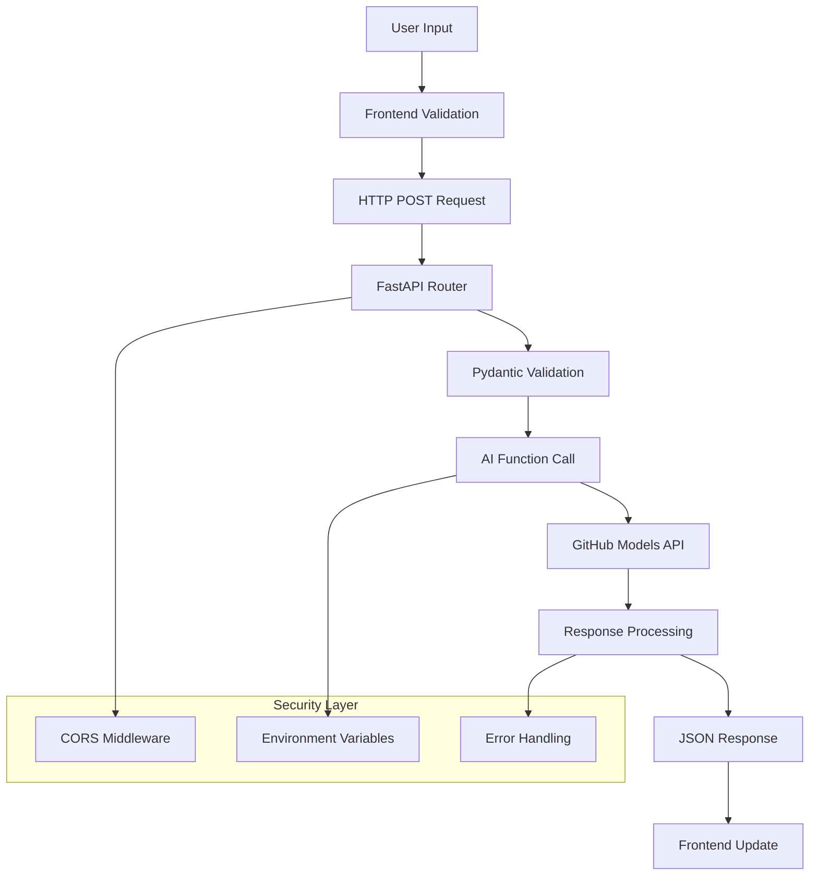
  
### FastAPI अनुप्रयोग तयार करणे  

चला आपला API पायरी-पायरीने तयार करूया. `api.py` नावाची फाइल तयार करा आणि खालील FastAPI कोड लिहा:  

```python
# api.py
from fastapi import FastAPI, HTTPException
from fastapi.middleware.cors import CORSMiddleware
from pydantic import BaseModel
from llm import call_llm
import logging

# Configure logging
logging.basicConfig(level=logging.INFO)
logger = logging.getLogger(__name__)

# Create FastAPI application
app = FastAPI(
    title="AI Chat API",
    description="A high-performance API for AI-powered chat applications",
    version="1.0.0"
)

# Configure CORS
app.add_middleware(
    CORSMiddleware,
    allow_origins=["*"],  # Configure appropriately for production
    allow_credentials=True,
    allow_methods=["*"],
    allow_headers=["*"],
)

# Pydantic models for request/response validation
class ChatMessage(BaseModel):
    message: str

class ChatResponse(BaseModel):
    response: str

@app.get("/")
async def root():
    """Root endpoint providing API information."""
    return {
        "message": "Welcome to the AI Chat API",
        "docs": "/docs",
        "health": "/health"
    }

@app.get("/health")
async def health_check():
    """Health check endpoint."""
    return {"status": "healthy", "service": "ai-chat-api"}

@app.post("/hello", response_model=ChatResponse)
async def chat_endpoint(chat_message: ChatMessage):
    """Main chat endpoint that processes messages and returns AI responses."""
    try:
        # Extract and validate message
        message = chat_message.message.strip()
        if not message:
            raise HTTPException(status_code=400, detail="Message cannot be empty")
        
        logger.info(f"Processing message: {message[:50]}...")
        
        # Call AI service (note: call_llm should be made async for better performance)
        ai_response = await call_llm_async(message, "You are a helpful and friendly assistant.")
        
        logger.info("AI response generated successfully")
        return ChatResponse(response=ai_response)
        
    except HTTPException:
        raise
    except Exception as e:
        logger.error(f"Error processing chat message: {str(e)}")
        raise HTTPException(status_code=500, detail="Internal server error")

if __name__ == "__main__":
    import uvicorn
    uvicorn.run(app, host="0.0.0.0", port=5000, reload=True)
```
  
**FastAPI अंमलबजावणी समजून घेणे:**  
- **आयात करते** FastAPI आधुनिक वेब फ्रेमवर्क कार्यक्षमता आणि Pydantic डेटा सत्यापनासाठी  
- **स्वयंचलित API दस्तऐवज तयार करते** (सर्व्हर चालू असताना `/docs` वर उपलब्ध)  
- **CORS मिडलवेअर सक्षम करते** वेगवेगळ्या उत्पत्तीमधून फ्रंटएंड विनंत्या परवानगी देण्यासाठी  
- **Pydantic मॉडेल्स परिभाषित करते** स्वयंचलित विनंती/प्रतिसाद सत्यापन आणि दस्तऐवजासाठी  
- **अधिक चांगल्या कार्यक्षमतेसाठी async एंडपॉइंट्स वापरते**  
- **योग्य HTTP स्थिती कोड आणि त्रुटी हाताळणी अंमलात आणते** HTTPException सह  
- **संरचित लॉगिंग समाविष्ट करते** मॉनिटरिंग आणि डीबगिंगसाठी  
- **सेवा स्थिती मॉनिटरिंगसाठी हेल्थ चेक एंडपॉइंट प्रदान करते**  

**FastAPI च्या पारंपरिक फ्रेमवर्क्सवरील मुख्य फायदे:**  
- **स्वयंचलित सत्यापन**: Pydantic मॉडेल्स प्रक्रिया करण्यापूर्वी डेटा अखंडता सुनिश्चित करतात  
- **परस्परसंवादी दस्तऐवज**: `/docs` ला भेट द्या स्वयंचलित, चाचणीयोग्य API दस्तऐवजासाठी  
- **प्रकार सुरक्षा**: Python प्रकार संकेत runtime त्रुटी टाळतात आणि कोड गुणवत्ता सुधारतात  
- **Async समर्थन**: अनेक AI विनंत्या एकाच वेळी अडथळा न येता हाताळा  
- **कार्यक्षमता**: रिअल-टाइम अनुप्रयोगांसाठी लक्षणीय वेगवान विनंती प्रक्रिया  

### CORS समजून घेणे: वेबचा सुरक्षा रक्षक  

CORS (Cross-Origin Resource Sharing) म्हणजे इमारतीतील सुरक्षा रक्षकासारखे आहे जो पाहुण्यांना प्रवेश करण्यास परवानगी आहे की नाही हे तपासतो. चला हे का महत्त्वाचे आहे आणि तुमच्या अनुप्रयोगावर कसा परिणाम होतो ते समजून घेऊया.  

#### CORS म्हणजे काय आणि ते का अस्तित्वात आहे?  

**समस्या**: कल्पना करा की कोणतीही वेबसाइट तुमच्या परवानगीशिवाय तुमच्या बँकेच्या वेबसाइटला विनंत्या करू शकते. ते सुरक्षा संकट असेल! ब्राउझर हे "समान-उत्पत्ती धोरण" द्वारे डीफॉल्टने प्रतिबंधित करतात.  

**समान-उत्पत्ती धोरण**: ब्राउझर फक्त वेब पृष्ठांना समान डोमेन, पोर्ट आणि प्रोटोकॉलमधून विनंत्या करण्याची परवानगी देतात.  

**वास्तविक-जगातील उपमा**: हे अपार्टमेंट इमारतीच्या सुरक्षेसारखे आहे – फक्त रहिवासी (समान उत्पत्ती) डीफॉल्टने इमारतीत प्रवेश करू शकतात. जर तुम्हाला मित्राला (वेगळ्या उत्पत्ती) भेट देऊ द्यायचे असेल, तर तुम्हाला स्पष्टपणे सुरक्षा सांगावी लागेल की ते ठीक आहे.  

#### तुमच्या विकासाच्या वातावरणातील CORS  

विकसनादरम्यान, तुमचा फ्रंटएंड आणि बॅकएंड वेगवेगळ्या पोर्टवर चालतो:  
- फ्रंटएंड: `http://localhost:3000` (किंवा file:// जर HTML थेट उघडत असेल)  
- बॅकएंड: `http://localhost:5000`  

हे "वेगळ्या उत्पत्ती" मानले जातात जरी ते एकाच संगणकावर असले तरी!  

```python
from fastapi.middleware.cors import CORSMiddleware

app = FastAPI(__name__)
CORS(app)   # This tells browsers: "It's okay for other origins to make requests to this API"
```
  
**CORS कॉन्फिगरेशन प्रत्यक्षात काय करते:**  
- **विशेष HTTP हेडर्स API प्रतिसादांमध्ये जोडते** जे ब्राउझरला सांगतात "ही क्रॉस-उत्पत्ती विनंती परवानगी आहे"  
- **"प्रीफ्लाइट" विनंत्या हाताळते** (ब्राउझर कधीकधी वास्तविक विनंती पाठवण्यापूर्वी परवान्या तपासतात)  
- **तुमच्या ब्राउझर कन्सोलमधील "CORS धोरणाद्वारे अवरोधित" त्रुटी टाळते**  

#### CORS सुरक्षा: विकास विरुद्ध उत्पादन  

```python
# 🚨 Development: Allows ALL origins (convenient but insecure)
CORS(app)

# ✅ Production: Only allow your specific frontend domain
CORS(app, origins=["https://yourdomain.com", "https://www.yourdomain.com"])

# 🔒 Advanced: Different origins for different environments
if app.debug:  # Development mode
    CORS(app, origins=["http://localhost:3000", "http://127.0.0.1:3000"])
else:  # Production mode
    CORS(app, origins=["https://yourdomain.com"])
```
  
**हे का महत्त्वाचे आहे**: विकासामध्ये, `CORS(app)` म्हणजे तुमचा दरवाजा अनलॉक ठेवण्यासारखे आहे – सोयीस्कर पण सुरक्षित नाही. उत्पादनामध्ये, तुम्हाला अचूकपणे सांगायचे आहे की कोणत्या वेबसाइट्स तुमच्या API शी संवाद साधू शकतात.  

#### सामान्य CORS परिस्थिती आणि उपाय  

| परिस्थिती | समस्या | उपाय |  
|----------|---------|----------|  
| **स्थानिक विकास** | फ्रंटएंड बॅकएंडपर्यंत पोहोचू शकत नाही | FastAPI मध्ये CORSMiddleware जोडा |  
| **GitHub Pages + Heroku** | तैनात फ्रंटएंड API पर्यंत पोहोचू शकत नाही | तुमच्या GitHub Pages URL ला CORS उत्पत्तीमध्ये जोडा |  
| **कस्टम डोमेन** | उत्पादनामध्ये CORS त्रुटी | CORS उत्पत्ती तुमच्या डोमेनशी जुळवून अद्यतनित करा |  
| **मोबाइल अ‍ॅप** | अ‍ॅप वेब API पर्यंत पोहोचू शकत नाही | तुमच्या अ‍ॅपचा डोमेन जोडा किंवा काळजीपूर्वक `*` वापरा |  

**प्रो टिप**: तुम्ही तुमच्या ब्राउझरच्या डेव्हलपर टूल्समध्ये नेटवर्क टॅब अंतर्गत CORS हेडर्स तपासू शकता. प्रतिसादामध्ये `Access-Control-Allow-Origin` सारखे हेडर्स शोधा.  

### त्रुटी हाताळणी आणि सत्यापन  

आमच्या API मध्ये योग्य त्रुटी हाताळणी कशी समाविष्ट आहे हे लक्षात घ्या:  

```python
# Validate that we received a message
if not message:
    return jsonify({"error": "Message field is required"}), 400
```
  
**मुख्य सत्यापन तत्त्वे:**  
- **आवश्यक फील्ड्ससाठी तपासते** विनंत्या प्रक्रिया करण्यापूर्वी  
- **अर्थपूर्ण त्रुटी संदेश JSON स्वरूपात परत करते**  
- **योग्य HTTP स्थिती कोड वापरते** (वाईट विनंत्यांसाठी 400)  
- **समोरच्या विकासकांना समस्या डीबग करण्यात मदत करण्यासाठी स्पष्ट अभिप्राय प्रदान करते**  

## तुमचा बॅकएंड सेट करणे आणि चालवणे  

आता आमच्याकडे आमचा AI एकत्रीकरण आणि FastAPI सर्व्हर तयार आहे, चला सर्व काही चालवूया. सेटअप प्रक्रियेमध्ये Python अवलंबित्व स्थापित करणे, पर्यावरणीय व्हेरिएबल्स कॉन्फिगर करणे आणि तुमचा विकास सर्व्हर सुरू करणे समाविष्ट आहे.  

### Python पर्यावरण सेटअप  

तुमचे Python विकास पर्यावरण सेट करूया. आभासी वातावरण म्हणजे मॅनहॅटन प्रोजेक्टच्या compartmentalized दृष्टिकोनासारखे – प्रत्येक प्रकल्पाला विशिष्ट साधने आणि अवलंबित्वांसह स्वतःचे वेगळे स्थान मिळते, वेगवेगळ्या प्रकल्पांमधील संघर्ष टाळतो.  

```bash
# Navigate to your backend directory
cd backend

# Create a virtual environment (like creating a clean room for your project)
python -m venv venv

# Activate it (Linux/Mac)
source ./venv/bin/activate

# On Windows, use:
# venv\Scripts\activate

# Install the good stuff
pip install openai fastapi uvicorn python-dotenv
```
  
**आम्ही काय केले:**  
- **आमचा स्वतःचा छोटासा Python बबल तयार केला** जिथे आम्ही पॅकेजेस स्थापित करू शकतो ज्याचा इतर कोणत्याही गोष्टीवर परिणाम होणार नाही  
- **ते सक्रिय केले** जेणेकरून आमचा टर्मिनल या विशिष्ट पर्यावरणाचा वापर करेल  
- **आवश्यक गोष्टी स्थापित केल्या**: OpenAI AI मॅजिकसाठी, FastAPI आमच्या वेब API साठी, Uvicorn ते प्रत्यक्षात चालवण्यासाठी, आणि python-dotenv सुरक्षित गुपित व्यवस्थापनासाठी  

**मुख्य अवलंबित्वे स्पष्ट केली:**  
- **FastAPI**: आधुनिक, जलद वेब फ्रेमवर्क स्वयंचलित API दस्तऐवजांसह  
- **Uvicorn**: FastAPI अनुप्रयोग चालवणारा अत्यंत जलद ASGI सर्व्हर  
- **OpenAI**: GitHub मॉडेल्स आणि OpenAI API एकत्रीकरणासाठी अधिकृत लायब्ररी  
- **python-dotenv**: .env फाइल्समधून सुरक्षित पर्यावरणीय व्हेरिएबल्स लोड करणे  

### पर्यावरणीय कॉन्फिगरेशन: गुपिते सुरक्षित ठेवणे  

आमचा API सुरू करण्यापूर्वी, वेब विकासातील सर्वात महत्त्वाचा धडा म्हणजे गुपिते खरोखर गुपित कशी ठेवायची. पर्यावरणीय व्हेरिएबल्स म्हणजे एक सुरक्षित तिजोरी जिथे फक्त तुमचा अनुप्रयोग प्रवेश करू शकतो.  

#### पर्यावरणीय व्हेरिएबल्स म्हणजे काय?  

**पर्यावरणीय व्हेरिएबल्स म्हणजे सुरक्षित ठेवण्याचे बॉक्स** – तुम्ही तुमची मौल्यवान सामग्री तिथे ठेवता, आणि फक्त तुम्ही (आणि तुमचा अ‍ॅप) ती बाहेर काढण्यासाठी किल्ली असते. तुमच्या कोडमध्ये संवेदनशील माहिती थेट लिहिण्याऐवजी (जिथे अक्षरशः कोणीही ती पाहू शकतो), तुम्ही ती सुरक्षितपणे पर्यावरणात साठवता.  

**येथे फरक आहे:**  
- **चुकीचा मार्ग**: तुमचा पासवर्ड स्टिकी नोटवर लिहून तुमच्या मॉनिटरवर ठेवणे  
- **योग्य मार्ग**: तुमचा पासवर्ड सुरक्षित पासवर्ड व्यवस्थापकामध्ये ठेवणे ज्यामध्ये फक्त तुम्ही प्रवेश करू शकता  

#### पर्यावरणीय व्हेरिएबल्स का महत्त्वाचे आहेत  

```python
# 🚨 NEVER DO THIS - API key visible to everyone
client = OpenAI(
    api_key="ghp_1234567890abcdef...",  # Anyone can steal this!
    base_url="https://models.github.ai/inference"
)

# ✅ DO THIS - API key stored securely
client = OpenAI(
    api_key=os.environ["GITHUB_TOKEN"],  # Only your app can access this
    base_url="https://models.github.ai/inference"
)
```
  
**जेव्हा तुम्ही गुपिते हार्डकोड करता तेव्हा काय होते:**  
1. **आवृत्ती नियंत्रण प्रदर्शन**: तुमच्या Git रिपॉझिटरीमध्ये प्रवेश असलेल्या कोणालाही तुमची API की दिसते  
2. **सार्वजनिक रिपॉझिटरीज**: जर तुम्ही GitHub वर पुश केले तर तुमची की संपूर्ण इंटरनेटला दिसते  
3. **संघ सामायिकरण**: तुमच्या प्रकल्पावर काम करणाऱ्या इतर विकासकांना तुमच्या वैयक्तिक API की चा प्रवेश मिळतो  
4. **सुरक्षा उल्लंघन**: जर कोणी तुमची API की चोरली तर ते
आता येतो तो रोमांचक क्षण – तुमचा FastAPI विकास सर्व्हर सुरू करणे आणि तुमची AI एकत्रीकरण जिवंत पाहणे! FastAPI Uvicorn वापरतो, जो एक अत्यंत वेगवान ASGI सर्व्हर आहे, जो विशेषतः async Python अनुप्रयोगांसाठी डिझाइन केलेला आहे.

#### FastAPI सर्व्हर स्टार्टअप प्रक्रिया समजून घेणे

```bash
# Method 1: Direct Python execution (includes auto-reload)
python api.py

# Method 2: Using Uvicorn directly (more control)
uvicorn api:app --host 0.0.0.0 --port 5000 --reload
```

जेव्हा तुम्ही हा आदेश चालवता, तेव्हा मागील बाजूस काय घडते:

**1. Python तुमचा FastAPI अनुप्रयोग लोड करतो**:
- सर्व आवश्यक लायब्ररी आयात करतो (FastAPI, Pydantic, OpenAI, इ.)
- तुमच्या `.env` फाइलमधून पर्यावरणीय व्हेरिएबल्स लोड करतो
- स्वयंचलित दस्तऐवजीकरणासह FastAPI अनुप्रयोगाची उदाहरण तयार करतो

**2. Uvicorn ASGI सर्व्हर कॉन्फिगर करतो**:
- async विनंती हाताळणी क्षमतांसह पोर्ट 5000 वर बाइंड करतो
- स्वयंचलित सत्यापनासह विनंती रूटिंग सेट करतो
- विकासासाठी हॉट रीलोड सक्षम करतो (फाइल बदलांवर पुन्हा सुरू करतो)
- परस्पर API दस्तऐवज तयार करतो

**3. सर्व्हर ऐकण्यास सुरुवात करतो**:
- तुमच्या टर्मिनलवर दिसते: `INFO: Uvicorn running on http://0.0.0.0:5000`
- सर्व्हर अनेक समकालीन AI विनंत्या हाताळू शकतो
- तुमचा API `http://localhost:5000/docs` वर स्वयंचलित दस्तऐवजांसह तयार आहे

#### सर्व काही व्यवस्थित कार्य करत असल्यास तुम्हाला काय दिसेल

```bash
$ python api.py
INFO:     Will watch for changes in these directories: ['/your/project/path']
INFO:     Uvicorn running on http://0.0.0.0:5000 (Press CTRL+C to quit)
INFO:     Started reloader process [12345] using WatchFiles
INFO:     Started server process [12346]
INFO:     Waiting for application startup.
INFO:     Application startup complete.
```

**FastAPI आउटपुट समजून घेणे:**
- **बदलांसाठी पाहील**: विकासासाठी ऑटो-रिलोड सक्षम
- **Uvicorn चालू आहे**: उच्च-प्रदर्शन ASGI सर्व्हर सक्रिय आहे
- **रिलोडर प्रक्रिया सुरू केली**: स्वयंचलित पुनःप्रारंभासाठी फाइल वॉचर
- **अनुप्रयोग स्टार्टअप पूर्ण**: FastAPI अॅप यशस्वीरित्या प्रारंभ झाले
- **परस्पर दस्तऐवज उपलब्ध**: स्वयंचलित API दस्तऐवजांसाठी `/docs` ला भेट द्या

#### तुमचा FastAPI चाचणी करणे: अनेक शक्तिशाली पद्धती

FastAPI तुमच्या API ची चाचणी घेण्यासाठी अनेक सोयीस्कर पद्धती प्रदान करते, ज्यामध्ये स्वयंचलित परस्पर दस्तऐवज समाविष्ट आहे:

**पद्धत 1: परस्पर API दस्तऐवज (शिफारस केलेली)**
1. तुमचा ब्राउझर उघडा आणि `http://localhost:5000/docs` ला जा
2. तुम्हाला Swagger UI दिसेल ज्यामध्ये तुमचे सर्व एंडपॉइंट्स दस्तऐवजीकरण केलेले आहेत
3. `/hello` वर क्लिक करा → "Try it out" → एक चाचणी संदेश प्रविष्ट करा → "Execute"
4. योग्य स्वरूपनासह ब्राउझरमध्ये थेट प्रतिसाद पहा

**पद्धत 2: मूलभूत ब्राउझर चाचणी**
1. रूट एंडपॉइंटसाठी `http://localhost:5000` ला जा
2. सर्व्हरची आरोग्य स्थिती तपासण्यासाठी `http://localhost:5000/health` ला जा
3. हे तुमचा FastAPI सर्व्हर योग्यरित्या चालू असल्याची पुष्टी करते

**पद्धत 3: कमांड लाइन चाचणी (प्रगत)**
```bash
# Test with curl (if available)
curl -X POST http://localhost:5000/hello \
  -H "Content-Type: application/json" \
  -d '{"message": "Hello AI!"}'

# Expected response:
# {"response": "Hello! I'm your AI assistant. How can I help you today?"}
```

**पद्धत 4: Python चाचणी स्क्रिप्ट**
```python
# test_api.py - Create this file to test your API
import requests
import json

# Test the API endpoint
url = "http://localhost:5000/hello"
data = {"message": "Tell me a joke about programming"}

response = requests.post(url, json=data)
if response.status_code == 200:
    result = response.json()
    print("AI Response:", result['response'])
else:
    print("Error:", response.status_code, response.text)
```

#### सामान्य स्टार्टअप समस्यांचे निराकरण

| त्रुटी संदेश | याचा अर्थ | कसे दुरुस्त करावे |
|---------------|---------------|------------|
| `ModuleNotFoundError: No module named 'fastapi'` | FastAPI स्थापित नाही | तुमच्या व्हर्च्युअल वातावरणात `pip install fastapi uvicorn` चालवा |
| `ModuleNotFoundError: No module named 'uvicorn'` | ASGI सर्व्हर स्थापित नाही | तुमच्या व्हर्च्युअल वातावरणात `pip install uvicorn` चालवा |
| `KeyError: 'GITHUB_TOKEN'` | पर्यावरणीय व्हेरिएबल सापडले नाही | तुमच्या `.env` फाइल आणि `load_dotenv()` कॉल तपासा |
| `Address already in use` | पोर्ट 5000 व्यस्त आहे | पोर्ट 5000 वापरणारे इतर प्रक्रिया बंद करा किंवा पोर्ट बदला |
| `ValidationError` | विनंती डेटा Pydantic मॉडेलशी जुळत नाही | तुमचा विनंती स्वरूप अपेक्षित स्कीमाशी जुळतो का ते तपासा |
| `HTTPException 422` | प्रक्रिया न करता येणारी घटक | विनंती सत्यापन अयशस्वी, योग्य स्वरूपासाठी `/docs` तपासा |
| `OpenAI API error` | AI सेवा प्रमाणीकरण अयशस्वी | तुमचा GitHub टोकन योग्य आहे आणि योग्य परवानग्या आहेत याची पुष्टी करा |

#### विकासासाठी सर्वोत्तम पद्धती

**हॉट रीलोडिंग**: FastAPI सह Uvicorn स्वयंचलित रीलोडिंग प्रदान करते जेव्हा तुम्ही तुमच्या Python फाइल्समध्ये बदल साठवता. याचा अर्थ तुम्ही तुमचा कोड बदलू शकता आणि मॅन्युअली पुन्हा सुरू न करता त्वरित चाचणी करू शकता.

```python
# Enable hot reloading explicitly
if __name__ == "__main__":
    app.run(host="0.0.0.0", port=5000, debug=True)  # debug=True enables hot reload
```

**विकासासाठी लॉगिंग**: काय चालले आहे हे समजण्यासाठी लॉगिंग जोडा:

```python
import logging

# Set up logging
logging.basicConfig(level=logging.INFO)
logger = logging.getLogger(__name__)

@app.route("/hello", methods=["POST"])
def hello():
    data = request.get_json()
    message = data.get("message", "")
    
    logger.info(f"Received message: {message}")
    
    if not message:
        logger.warning("Empty message received")
        return jsonify({"error": "Message field is required"}), 400
    
    try:
        response = call_llm(message, "You are a helpful and friendly assistant.")
        logger.info(f"AI response generated successfully")
        return jsonify({"response": response})
    except Exception as e:
        logger.error(f"AI API error: {str(e)}")
        return jsonify({"error": "AI service temporarily unavailable"}), 500
```

**लॉगिंग का मदत करते**: विकासादरम्यान, तुम्हाला नेमक्या कोणत्या विनंत्या येत आहेत, AI कशाचे उत्तर देत आहे आणि त्रुटी कुठे घडत आहेत हे पाहता येते. यामुळे डीबगिंग खूप जलद होते.

### GitHub Codespaces साठी कॉन्फिगर करणे: क्लाउड विकास सोपे केले

GitHub Codespaces म्हणजे क्लाउडमध्ये एक शक्तिशाली विकास संगणक असणे ज्याचा तुम्ही कोणत्याही ब्राउझरमधून प्रवेश करू शकता. जर तुम्ही Codespaces मध्ये काम करत असाल, तर तुमचा बॅकएंड तुमच्या फ्रंटएंडसाठी प्रवेशयोग्य बनवण्यासाठी काही अतिरिक्त पायऱ्या आहेत.

#### Codespaces नेटवर्किंग समजून घेणे

स्थानिक विकास वातावरणात, सर्व काही एकाच संगणकावर चालते:
- बॅकएंड: `http://localhost:5000`
- फ्रंटएंड: `http://localhost:3000` (किंवा file://)

Codespaces मध्ये, तुमचे विकास वातावरण GitHub च्या सर्व्हरवर चालते, त्यामुळे "localhost" चा अर्थ वेगळा आहे. GitHub तुमच्या सेवांसाठी स्वयंचलितपणे सार्वजनिक URL तयार करतो, परंतु तुम्हाला त्यांना योग्यरित्या कॉन्फिगर करणे आवश्यक आहे.

#### Codespaces कॉन्फिगरेशन चरण-दर-चरण

**1. तुमचा बॅकएंड सर्व्हर सुरू करा**:
```bash
cd backend
python api.py
```

तुम्हाला परिचित FastAPI/Uvicorn स्टार्टअप संदेश दिसेल, परंतु लक्षात घ्या की तो Codespace वातावरणात चालू आहे.

**2. पोर्ट दृश्यमानता कॉन्फिगर करा**:
- VS Code च्या तळाच्या पॅनेलमध्ये "Ports" टॅब शोधा
- यादीमध्ये पोर्ट 5000 शोधा
- पोर्ट 5000 वर उजवे क्लिक करा
- "Port Visibility" → "Public" निवडा

**ते सार्वजनिक का करावे?** सामान्यतः, Codespace पोर्ट्स खाजगी असतात (फक्त तुम्हाला प्रवेशयोग्य). ते सार्वजनिक बनवणे तुमच्या फ्रंटएंडला (जो ब्राउझरमध्ये चालतो) तुमच्या बॅकएंडशी संवाद साधण्यास अनुमती देते.

**3. तुमचा सार्वजनिक URL मिळवा**:
पोर्ट सार्वजनिक केल्यानंतर, तुम्हाला असे URL दिसेल:
```
https://your-codespace-name-5000.app.github.dev
```

**4. तुमच्या फ्रंटएंड कॉन्फिगरेशनला अपडेट करा**:
```javascript
// In your frontend app.js, update the BASE_URL:
this.BASE_URL = "https://your-codespace-name-5000.app.github.dev";
```

#### Codespace URL समजून घेणे

Codespace URL एक अंदाजे नमुना अनुसरण करतो:
```
https://[codespace-name]-[port].app.github.dev
```

**याचे विश्लेषण करणे:**
- `codespace-name`: तुमच्या Codespace साठी एक अद्वितीय ओळखकर्ता (सामान्यतः तुमचे वापरकर्तानाव समाविष्ट करते)
- `port`: तुमची सेवा चालू असलेला पोर्ट क्रमांक (आपल्या FastAPI अॅपसाठी 5000)
- `app.github.dev`: Codespace अनुप्रयोगांसाठी GitHub चे डोमेन

#### तुमची Codespace सेटअप चाचणी करणे

**1. बॅकएंड थेट चाचणी करा**:
तुमच्या सार्वजनिक URL ला नवीन ब्राउझर टॅबमध्ये उघडा. तुम्हाला दिसले पाहिजे:
```
Welcome to the AI Chat API. Send POST requests to /hello with JSON payload containing 'message' field.
```

**2. ब्राउझर डेव्हलपर टूल्ससह चाचणी करा**:
```javascript
// Open browser console and test your API
fetch('https://your-codespace-name-5000.app.github.dev/hello', {
  method: 'POST',
  headers: {'Content-Type': 'application/json'},
  body: JSON.stringify({message: 'Hello from Codespaces!'})
})
.then(response => response.json())
.then(data => console.log(data));
```

#### Codespaces विरुद्ध स्थानिक विकास

| पैलू | स्थानिक विकास | GitHub Codespaces |
|--------|-------------------|-------------------|
| **सेटअप वेळ** | जास्त (Python, dependencies स्थापित करा) | त्वरित (पूर्व-कॉन्फिगर केलेले वातावरण) |
| **URL प्रवेश** | `http://localhost:5000` | `https://xyz-5000.app.github.dev` |
| **पोर्ट कॉन्फिगरेशन** | स्वयंचलित | मॅन्युअल (पोर्ट्स सार्वजनिक करा) |
| **फाइल टिकाव** | स्थानिक मशीन | GitHub रेपॉजिटरी |
| **सहकार्य** | वातावरण शेअर करणे कठीण | Codespace लिंक शेअर करणे सोपे |
| **इंटरनेट अवलंबित्व** | फक्त AI API कॉलसाठी | सर्वकाहीसाठी आवश्यक |

#### Codespace विकास टिप्स

**Codespaces मधील पर्यावरणीय व्हेरिएबल्स**:
तुमची `.env` फाइल Codespaces मध्ये त्याच प्रकारे कार्य करते, परंतु तुम्ही पर्यावरणीय व्हेरिएबल्स थेट Codespace मध्ये सेट करू शकता:

```bash
# Set environment variable for the current session
export GITHUB_TOKEN="your_token_here"

# Or add to your .bashrc for persistence
echo 'export GITHUB_TOKEN="your_token_here"' >> ~/.bashrc
```

**पोर्ट व्यवस्थापन**:
- Codespaces स्वयंचलितपणे शोधतो जेव्हा तुमचा अनुप्रयोग पोर्टवर ऐकण्यास सुरुवात करतो
- तुम्ही एकाच वेळी अनेक पोर्ट्स फॉरवर्ड करू शकता (जर तुम्ही नंतर डेटाबेस जोडला तर उपयुक्त)
- तुमचा Codespace चालू असेपर्यंत पोर्ट्स प्रवेशयोग्य राहतात

**विकास कार्यप्रवाह**:
1. VS Code मध्ये कोड बदल करा
2. FastAPI स्वयंचलितपणे रीलोड होते (Uvicorn च्या रीलोड मोडमुळे)
3. सार्वजनिक URL द्वारे त्वरित बदलांची चाचणी करा
4. तयार झाल्यावर कमिट आणि पुश करा

> 💡 **प्रो टिप**: विकासादरम्यान तुमचा Codespace बॅकएंड URL बुकमार्क करा. कारण Codespace नावे स्थिर असतात, तुम्ही समान Codespace वापरत असाल तोपर्यंत URL बदलणार नाही.

## फ्रंटएंड चॅट इंटरफेस तयार करणे: जिथे मानव AI ला भेटतो

आता आपण वापरकर्ता इंटरफेस तयार करू – तो भाग जो लोकांना तुमच्या AI सहाय्यकाशी संवाद साधण्यास सक्षम करतो. मूळ iPhone च्या इंटरफेसच्या डिझाइनप्रमाणे, आम्ही जटिल तंत्रज्ञान सहज आणि नैसर्गिकपणे वापरण्यासारखे बनवण्यावर लक्ष केंद्रित करत आहोत.

### आधुनिक फ्रंटएंड आर्किटेक्चर समजून घेणे

आपला चॅट इंटरफेस "सिंगल पेज अॅप्लिकेशन" किंवा SPA असे म्हणतात. जुन्या पद्धतीच्या दृष्टिकोनाऐवजी जिथे प्रत्येक क्लिक नवीन पृष्ठ लोड करते, आमचे अॅप सहज आणि त्वरित अद्यतनित होते:

**जुनी वेबसाइट्स**: जसे एखादे भौतिक पुस्तक वाचणे – तुम्ही पूर्णपणे नवीन पृष्ठे पलटवता
**आमचे चॅट अॅप**: जसे तुमचा फोन वापरणे – सर्व काही सहजतेने आणि त्वरित अद्यतनित होते

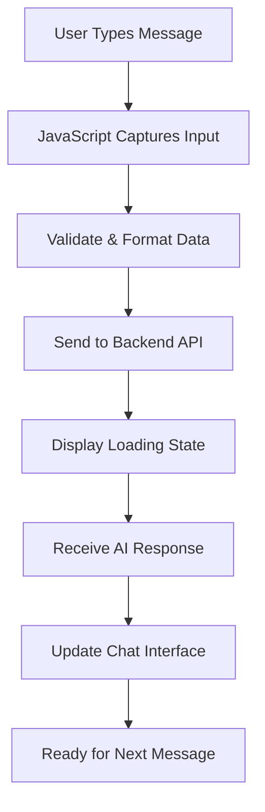

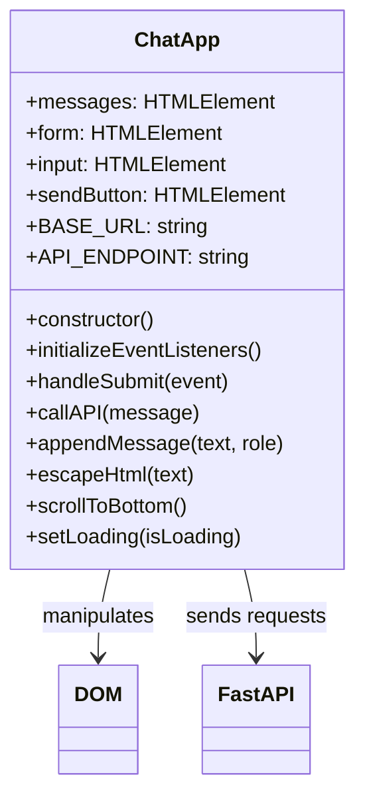

### फ्रंटएंड विकासाचे तीन स्तंभ

प्रत्येक फ्रंटएंड अॅप्लिकेशन – साध्या वेबसाइट्सपासून डिस्कॉर्ड किंवा स्लॅकसारख्या जटिल अॅप्सपर्यंत – तीन मुख्य तंत्रज्ञानावर आधारित असते. त्यांना तुम्ही वेबवर दिसणाऱ्या आणि संवाद साधणाऱ्या प्रत्येक गोष्टीचा पाया समजून घ्या:

**HTML (रचना)**: हा तुमचा पाया आहे
- कोणते घटक अस्तित्वात आहेत हे ठरवते (बटणे, टेक्स्ट एरिया, कंटेनर)
- सामग्रीला अर्थ देते (हे शीर्षक आहे, हे फॉर्म आहे, इ.)
- मूलभूत रचना तयार करते ज्यावर सर्वकाही तयार होते

**CSS (सादरीकरण)**: हा तुमचा अंतर्गत डिझायनर आहे
- सर्वकाही सुंदर बनवते (रंग, फॉन्ट, लेआउट्स)
- वेगवेगळ्या स्क्रीन आकारांशी हाताळते (फोन विरुद्ध लॅपटॉप विरुद्ध टॅबलेट)
- गुळगुळीत अॅनिमेशन आणि व्हिज्युअल फीडबॅक तयार करते

**JavaScript (वर्तन)**: हा तुमचा मेंदू आहे
- वापरकर्ते काय करतात यावर प्रतिक्रिया देते (क्लिक्स, टाइपिंग, स्क्रोलिंग)
- तुमच्या बॅकएंडशी संवाद साधते आणि पृष्ठ अद्यतनित करते
- सर्वकाही परस्परसंवादी आणि गतिशील बनवते

**याला वास्तुशिल्पीय डिझाइनसारखे समजा:**
- **HTML**: संरचनात्मक ब्लूप्रिंट (स्पेस आणि नातेसंबंध परिभाषित करणे)
- **CSS**: सौंदर्यात्मक आणि पर्यावरणीय डिझाइन (व्हिज्युअल शैली आणि वापरकर्ता अनुभव)
- **JavaScript**: यांत्रिक प्रणाली (कार्यक्षमता आणि परस्परसंवाद)

### आधुनिक JavaScript आर्किटेक्चर का महत्त्वाचे आहे

आपले चॅट अनुप्रयोग आधुनिक JavaScript नमुने वापरेल जे तुम्हाला व्यावसायिक अनुप्रयोगांमध्ये दिसतील. हे संकल्पना समजून घेणे तुम्हाला विकसक म्हणून वाढण्यास मदत करेल:

**Class-Based Architecture**: आपण आपला कोड वर्गांमध्ये आयोजित करू, जे वस्तूंसाठी ब्लूप्रिंट तयार करण्यासारखे आहे
**Async/Await**: वेळ घेणाऱ्या ऑपरेशन्स हाताळण्याचा आधुनिक मार्ग (जसे API कॉल्स)
**Event-Driven Programming**: आमचे अॅप वापरकर्त्याच्या क्रियांवर प्रतिक्रिया देते (क्लिक्स, की प्रेस) लूपमध्ये चालण्याऐवजी
**DOM Manipulation**: वापरकर्त्याच्या संवाद आणि API प्रतिसादांवर आधारित वेबपृष्ठ सामग्री गतिशीलपणे अद्यतनित करणे

### प्रकल्प संरचना सेटअप

सुसंगत संरचनेसह फ्रंटएंड डिरेक्टरी तयार करा:

```text
frontend/
├── index.html      # Main HTML structure
├── app.js          # JavaScript functionality
└── styles.css      # Visual styling
```

**आर्किटेक्चर समजून घेणे:**
- **वेगळे करते** रचना (HTML), वर्तन (JavaScript), आणि सादरीकरण (CSS) यामध्ये चिंता
- **साधी फाइल संरचना राखते** जी नेव्हिगेट आणि सुधारित करणे सोपे आहे
- **वेब विकास सर्वोत्तम पद्धतींचे अनुसरण करते** संघटन आणि टिकावासाठी

### HTML पाया तयार करणे: प्रवेशयोग्यतेसाठी अर्थपूर्ण रचना

चला HTML रचनेपासून सुरुवात करूया. आधुनिक वेब विकास "अर्थपूर्ण HTML" वर जोर देते – HTML घटक वापरणे जे त्यांच्या उद्देशाचे स्पष्टपणे वर्णन करतात, फक्त त्यांच्या स्वरूपाचे नाही. यामुळे तुमचा अनुप्रयोग स्क्रीन रीडर्स, सर्च इंजिन्स आणि इतर साधनांसाठी प्रवेशयोग्य बनतो.

**अर्थपूर्ण HTML का महत्त्वाचे आहे**: कल्पना करा की तुम्ही तुमचे चॅट अॅप फोनवर कोणाला वर्णन करत आहात. तुम्ही म्हणाल "तेथे शीर्षकासह एक हेडर आहे, एक मुख्य क्षेत्र जिथे संभाषणे दिसतात, आणि संदेश टाइप करण्यासाठी तळाशी एक फॉर्म आहे." अर्थपूर्ण HTML घटक वापरते जे या नैसर्गिक वर्णनाशी जुळते.

`index.html` तयार करा या विचारपूर्वक संरचित मार्कअपसह:

```html
<!DOCTYPE html>
<html lang="en">
<head>
    <meta charset="UTF-8">
    <meta name="viewport" content="width=device-width, initial-scale=1.0">
    <title>AI Chat Assistant</title>
    <link rel="stylesheet" href="styles.css">
</head>
<body>
    <div class="chat-container">
        <header class="chat-header">
            <h1>AI Chat Assistant</h1>
            <p>Ask me anything!</p>
        </header>
        
        <main class="chat-messages" id="messages" role="log" aria-live="polite">
            <!-- Messages will be dynamically added here -->
        </main>
        
        <form class="chat-form" id="chatForm">
            <div class="input-group">
                <input 
                    type="text" 
                    id="messageInput" 
                    placeholder="Type your message here..." 
                    required
                    aria-label="Chat message input"
                >
                <button type="submit" id="sendBtn" aria-label="Send message">
                    Send
                </button>
            </div>
        </form>
    </div>
    <script src="app.js"></script>
</body>
</html>
```

**प्रत्येक HTML घटक आणि त्याचा उद्देश समजून घेणे:**

#### दस्तऐवज रचना
- **`<!DOCTYPE html>`**: ब्राउझरला सांगते की हे आधुनिक HTML5 आहे
- **`<html lang="en">`**: स्क्रीन रीडर्स आणि भाषांतर साधनांसाठी पृष्ठ भाषा निर्दिष्ट करते
- **`<meta charset="UTF-8">`**: आंतरराष्ट्रीय मजकुरासाठी योग्य कॅरेक्टर एन्कोडिंग सुनिश्चित करते
- **`<meta name="viewport"...>`**: पृष्ठ मोबाइल-प्रतिसादक्षम बनवते झूम आणि स्केल नियंत्रित करून

#### अर्थपूर्ण घटक
- **`<header>`**: शीर्षक आणि वर्णनासह शीर्ष विभाग स्पष्टपणे
आता आपण JavaScript तयार करूया ज्यामुळे आपले चॅट इंटरफेस कार्यक्षम होईल. आपण व्यावसायिक वेब विकासात आढळणारे आधुनिक JavaScript पॅटर्न वापरणार आहोत, ज्यामध्ये ES6 क्लासेस, async/await, आणि इव्हेंट-ड्रिव्हन प्रोग्रामिंग समाविष्ट आहे.

#### आधुनिक JavaScript आर्किटेक्चर समजून घेणे

प्रोसीजरल कोड (क्रमाने चालणाऱ्या फंक्शन्सची मालिका) लिहिण्याऐवजी, आपण **क्लास-बेस्ड आर्किटेक्चर** तयार करू. क्लास म्हणजे ऑब्जेक्ट तयार करण्यासाठी एक ब्लूप्रिंट आहे – जसे की आर्किटेक्टचा ब्लूप्रिंट अनेक घरे बांधण्यासाठी वापरला जाऊ शकतो.

**वेब अॅप्लिकेशन्ससाठी क्लासेस का वापरावेत?**
- **संघटन**: संबंधित सर्व फंक्शनॅलिटी एकत्रित केली जाते
- **पुनर्वापरयोग्यता**: तुम्ही एका पृष्ठावर अनेक चॅट इंस्टन्स तयार करू शकता
- **देखभाल सुलभता**: विशिष्ट वैशिष्ट्ये डीबग आणि सुधारित करणे सोपे
- **व्यावसायिक मानक**: React, Vue, आणि Angular सारख्या फ्रेमवर्कमध्ये हा पॅटर्न वापरला जातो

`app.js` तयार करा आधुनिक, चांगल्या प्रकारे संरचित JavaScript सह:

```javascript
// app.js - Modern chat application logic

class ChatApp {
    constructor() {
        // Get references to DOM elements we'll need to manipulate
        this.messages = document.getElementById("messages");
        this.form = document.getElementById("chatForm");
        this.input = document.getElementById("messageInput");
        this.sendButton = document.getElementById("sendBtn");
        
        // Configure your backend URL here
        this.BASE_URL = "http://localhost:5000"; // Update this for your environment
        this.API_ENDPOINT = `${this.BASE_URL}/hello`;
        
        // Set up event listeners when the chat app is created
        this.initializeEventListeners();
    }
    
    initializeEventListeners() {
        // Listen for form submission (when user clicks Send or presses Enter)
        this.form.addEventListener("submit", (e) => this.handleSubmit(e));
        
        // Also listen for Enter key in the input field (better UX)
        this.input.addEventListener("keypress", (e) => {
            if (e.key === "Enter" && !e.shiftKey) {
                e.preventDefault();
                this.handleSubmit(e);
            }
        });
    }
    
    async handleSubmit(event) {
        event.preventDefault(); // Prevent form from refreshing the page
        
        const messageText = this.input.value.trim();
        if (!messageText) return; // Don't send empty messages
        
        // Provide user feedback that something is happening
        this.setLoading(true);
        
        // Add user message to chat immediately (optimistic UI)
        this.appendMessage(messageText, "user");
        
        // Clear input field so user can type next message
        this.input.value = '';
        
        try {
            // Call the AI API and wait for response
            const reply = await this.callAPI(messageText);
            
            // Add AI response to chat
            this.appendMessage(reply, "assistant");
        } catch (error) {
            console.error('API Error:', error);
            this.appendMessage("Sorry, I'm having trouble connecting right now. Please try again.", "error");
        } finally {
            // Re-enable the interface regardless of success or failure
            this.setLoading(false);
        }
    }
    
    async callAPI(message) {
        const response = await fetch(this.API_ENDPOINT, {
            method: "POST",
            headers: { 
                "Content-Type": "application/json" 
            },
            body: JSON.stringify({ message })
        });
        
        if (!response.ok) {
            throw new Error(`HTTP error! status: ${response.status}`);
        }
        
        const data = await response.json();
        return data.response;
    }
    
    appendMessage(text, role) {
        const messageElement = document.createElement("div");
        messageElement.className = `message ${role}`;
        messageElement.innerHTML = `
            <div class="message-content">
                <span class="message-text">${this.escapeHtml(text)}</span>
                <span class="message-time">${new Date().toLocaleTimeString()}</span>
            </div>
        `;
        
        this.messages.appendChild(messageElement);
        this.scrollToBottom();
    }
    
    escapeHtml(text) {
        const div = document.createElement('div');
        div.textContent = text;
        return div.innerHTML;
    }
    
    scrollToBottom() {
        this.messages.scrollTop = this.messages.scrollHeight;
    }
    
    setLoading(isLoading) {
        this.sendButton.disabled = isLoading;
        this.input.disabled = isLoading;
        this.sendButton.textContent = isLoading ? "Sending..." : "Send";
    }
}

// Initialize the chat application when the page loads
document.addEventListener("DOMContentLoaded", () => {
    new ChatApp();
});
```

#### प्रत्येक JavaScript संकल्पना समजून घेणे

**ES6 क्लास स्ट्रक्चर**:
```javascript
class ChatApp {
    constructor() {
        // This runs when you create a new ChatApp instance
        // It's like the "setup" function for your chat
    }
    
    methodName() {
        // Methods are functions that belong to the class
        // They can access class properties using "this"
    }
}
```

**Async/Await पॅटर्न**:
```javascript
// Old way (callback hell):
fetch(url)
  .then(response => response.json())
  .then(data => console.log(data))
  .catch(error => console.error(error));

// Modern way (async/await):
try {
    const response = await fetch(url);
    const data = await response.json();
    console.log(data);
} catch (error) {
    console.error(error);
}
```

**इव्हेंट-ड्रिव्हन प्रोग्रामिंग**:
काहीतरी घडले आहे का हे सतत तपासण्याऐवजी, आपण इव्हेंटसाठी "ऐकतो":
```javascript
// When form is submitted, run handleSubmit
this.form.addEventListener("submit", (e) => this.handleSubmit(e));

// When Enter key is pressed, also run handleSubmit
this.input.addEventListener("keypress", (e) => { /* ... */ });
```

**DOM मॅनिप्युलेशन**:
```javascript
// Create new elements
const messageElement = document.createElement("div");

// Modify their properties
messageElement.className = "message user";
messageElement.innerHTML = "Hello world!";

// Add to the page
this.messages.appendChild(messageElement);
```

#### सुरक्षा आणि सर्वोत्तम पद्धती

**XSS प्रतिबंध**:
```javascript
escapeHtml(text) {
    const div = document.createElement('div');
    div.textContent = text;  // This automatically escapes HTML
    return div.innerHTML;
}
```

**महत्त्व का आहे**: जर एखादा वापरकर्ता `<script>alert('hack')</script>` टाइप केला, तर ही फंक्शन त्याला कोड म्हणून अंमलात आणण्याऐवजी टेक्स्ट म्हणून प्रदर्शित करते.

**एरर हँडलिंग**:
```javascript
try {
    const reply = await this.callAPI(messageText);
    this.appendMessage(reply, "assistant");
} catch (error) {
    // Show user-friendly error instead of breaking the app
    this.appendMessage("Sorry, I'm having trouble...", "error");
}
```

**वापरकर्ता अनुभव विचार**:
- **ऑप्टिमिस्टिक UI**: वापरकर्त्याचा संदेश त्वरित जोडा, सर्व्हर प्रतिसादाची वाट पाहू नका
- **लोडिंग स्टेट्स**: बटणे अक्षम करा आणि "सेंडिंग..." दर्शवा
- **ऑटो-स्क्रोल**: नवीनतम संदेश दृश्यमान ठेवा
- **इनपुट व्हॅलिडेशन**: रिकामे संदेश पाठवू नका
- **कीबोर्ड शॉर्टकट्स**: एंटर की संदेश पाठवते (खऱ्या चॅट अॅप्ससारखे)

#### अॅप्लिकेशन फ्लो समजून घेणे

1. **पृष्ठ लोड होते** → `DOMContentLoaded` इव्हेंट फायर होते → `new ChatApp()` तयार होते
2. **कन्स्ट्रक्टर चालतो** → DOM एलिमेंट संदर्भ मिळवतो → इव्हेंट लिसनर्स सेट करतो
3. **वापरकर्ता संदेश टाइप करतो** → एंटर प्रेस करतो किंवा सेंड क्लिक करतो → `handleSubmit` चालतो
4. **handleSubmit** → इनपुट व्हॅलिडेट करतो → लोडिंग स्टेट दाखवतो → API कॉल करतो
5. **API प्रतिसाद देते** → AI संदेश चॅटमध्ये जोडते → इंटरफेस पुन्हा सक्षम करते
6. **पुढील संदेशासाठी तयार** → वापरकर्ता चॅटिंग सुरू ठेवू शकतो

हे आर्किटेक्चर स्केलेबल आहे – तुम्ही संदेश संपादन, फाइल अपलोड्स, किंवा अनेक संभाषण थ्रेड्स सारखी वैशिष्ट्ये कोर स्ट्रक्चर पुन्हा लिहिल्याशिवाय सहजपणे जोडू शकता.

### 🎯 शैक्षणिक तपासणी: आधुनिक फ्रंटएंड आर्किटेक्चर

**आर्किटेक्चर समजून घेणे**: तुम्ही आधुनिक JavaScript पॅटर्न वापरून पूर्ण सिंगल-पेज अॅप्लिकेशन अंमलात आणले आहे. हे व्यावसायिक-स्तरीय फ्रंटएंड विकासाचे प्रतिनिधित्व करते.

**मुख्य संकल्पना आत्मसात**:
- **ES6 क्लास आर्किटेक्चर**: संघटित, देखभालक्षम कोड स्ट्रक्चर
- **Async/Await पॅटर्न्स**: आधुनिक असिंक्रोनस प्रोग्रामिंग
- **इव्हेंट-ड्रिव्हन प्रोग्रामिंग**: प्रतिसादात्मक वापरकर्ता इंटरफेस डिझाइन
- **सुरक्षा सर्वोत्तम पद्धती**: XSS प्रतिबंध आणि इनपुट व्हॅलिडेशन

**उद्योग कनेक्शन**: तुम्ही शिकलेले पॅटर्न (क्लास-बेस्ड आर्किटेक्चर, असिंक्रोनस ऑपरेशन्स, DOM मॅनिप्युलेशन) आधुनिक फ्रेमवर्कसाठी (React, Vue, Angular) पाया आहेत. तुम्ही उत्पादन अॅप्लिकेशन्समध्ये वापरल्या जाणाऱ्या समान आर्किटेक्चरल विचारांसह तयार करत आहात.

**प्रतिबिंब प्रश्न**: तुम्ही या चॅट अॅप्लिकेशनला अनेक संभाषण किंवा वापरकर्ता प्रमाणीकरण हाताळण्यासाठी कसे विस्तारित कराल? आवश्यक आर्किटेक्चरल बदलांचा विचार करा आणि क्लास स्ट्रक्चर कसे विकसित होईल याचा विचार करा.

### तुमचे चॅट इंटरफेस स्टाइलिंग

आता CSS सह आधुनिक, आकर्षक चॅट इंटरफेस तयार करूया. चांगले स्टाइलिंग तुमच्या अॅप्लिकेशनला व्यावसायिक वाटते आणि एकूण वापरकर्ता अनुभव सुधारते. आम्ही Flexbox, CSS Grid, आणि कस्टम प्रॉपर्टीजसारख्या आधुनिक CSS वैशिष्ट्यांचा वापर करून प्रतिसादक्षम, प्रवेशयोग्य डिझाइन तयार करू.

`styles.css` तयार करा या सर्वसमावेशक शैलींसह:

```css
/* styles.css - Modern chat interface styling */

:root {
    --primary-color: #2563eb;
    --secondary-color: #f1f5f9;
    --user-color: #3b82f6;
    --assistant-color: #6b7280;
    --error-color: #ef4444;
    --text-primary: #1e293b;
    --text-secondary: #64748b;
    --border-radius: 12px;
    --shadow: 0 4px 6px -1px rgba(0, 0, 0, 0.1);
}

* {
    margin: 0;
    padding: 0;
    box-sizing: border-box;
}

body {
    font-family: -apple-system, BlinkMacSystemFont, 'Segoe UI', Roboto, sans-serif;
    background: linear-gradient(135deg, #667eea 0%, #764ba2 100%);
    min-height: 100vh;
    display: flex;
    align-items: center;
    justify-content: center;
    padding: 20px;
}

.chat-container {
    width: 100%;
    max-width: 800px;
    height: 600px;
    background: white;
    border-radius: var(--border-radius);
    box-shadow: var(--shadow);
    display: flex;
    flex-direction: column;
    overflow: hidden;
}

.chat-header {
    background: var(--primary-color);
    color: white;
    padding: 20px;
    text-align: center;
}

.chat-header h1 {
    font-size: 1.5rem;
    margin-bottom: 5px;
}

.chat-header p {
    opacity: 0.9;
    font-size: 0.9rem;
}

.chat-messages {
    flex: 1;
    padding: 20px;
    overflow-y: auto;
    display: flex;
    flex-direction: column;
    gap: 15px;
    background: var(--secondary-color);
}

.message {
    display: flex;
    max-width: 80%;
    animation: slideIn 0.3s ease-out;
}

.message.user {
    align-self: flex-end;
}

.message.user .message-content {
    background: var(--user-color);
    color: white;
    border-radius: var(--border-radius) var(--border-radius) 4px var(--border-radius);
}

.message.assistant {
    align-self: flex-start;
}

.message.assistant .message-content {
    background: white;
    color: var(--text-primary);
    border-radius: var(--border-radius) var(--border-radius) var(--border-radius) 4px;
    border: 1px solid #e2e8f0;
}

.message.error .message-content {
    background: var(--error-color);
    color: white;
    border-radius: var(--border-radius);
}

.message-content {
    padding: 12px 16px;
    box-shadow: var(--shadow);
    position: relative;
}

.message-text {
    display: block;
    line-height: 1.5;
    word-wrap: break-word;
}

.message-time {
    display: block;
    font-size: 0.75rem;
    opacity: 0.7;
    margin-top: 5px;
}

.chat-form {
    padding: 20px;
    border-top: 1px solid #e2e8f0;
    background: white;
}

.input-group {
    display: flex;
    gap: 10px;
    align-items: center;
}

#messageInput {
    flex: 1;
    padding: 12px 16px;
    border: 2px solid #e2e8f0;
    border-radius: var(--border-radius);
    font-size: 1rem;
    outline: none;
    transition: border-color 0.2s ease;
}

#messageInput:focus {
    border-color: var(--primary-color);
}

#messageInput:disabled {
    background: #f8fafc;
    opacity: 0.6;
    cursor: not-allowed;
}

#sendBtn {
    padding: 12px 24px;
    background: var(--primary-color);
    color: white;
    border: none;
    border-radius: var(--border-radius);
    font-size: 1rem;
    font-weight: 600;
    cursor: pointer;
    transition: background-color 0.2s ease;
    min-width: 80px;
}

#sendBtn:hover:not(:disabled) {
    background: #1d4ed8;
}

#sendBtn:disabled {
    background: #94a3b8;
    cursor: not-allowed;
}

@keyframes slideIn {
    from {
        opacity: 0;
        transform: translateY(10px);
    }
    to {
        opacity: 1;
        transform: translateY(0);
    }
}

/* Responsive design for mobile devices */
@media (max-width: 768px) {
    body {
        padding: 10px;
    }
    
    .chat-container {
        height: calc(100vh - 20px);
        border-radius: 8px;
    }
    
    .message {
        max-width: 90%;
    }
    
    .input-group {
        flex-direction: column;
        gap: 10px;
    }
    
    #messageInput {
        width: 100%;
    }
    
    #sendBtn {
        width: 100%;
    }
}

/* Accessibility improvements */
@media (prefers-reduced-motion: reduce) {
    .message {
        animation: none;
    }
    
    * {
        transition: none !important;
    }
}

/* Dark mode support */
@media (prefers-color-scheme: dark) {
    .chat-container {
        background: #1e293b;
        color: #f1f5f9;
    }
    
    .chat-messages {
        background: #0f172a;
    }
    
    .message.assistant .message-content {
        background: #334155;
        color: #f1f5f9;
        border-color: #475569;
    }
    
    .chat-form {
        background: #1e293b;
        border-color: #475569;
    }
    
    #messageInput {
        background: #334155;
        color: #f1f5f9;
        border-color: #475569;
    }
}
```

**CSS आर्किटेक्चर समजून घेणे:**
- **वापरते** CSS कस्टम प्रॉपर्टीज (व्हेरिएबल्स) सुसंगत थीमिंग आणि सोपी देखभालसाठी
- **अंमलात आणते** Flexbox लेआउट प्रतिसादक्षम डिझाइन आणि योग्य संरेखनासाठी
- **समाविष्ट करते** गुळगुळीत अॅनिमेशन संदेश दिसण्यासाठी, विचलित न करता
- **प्रदान करते** वापरकर्ता संदेश, AI प्रतिसाद, आणि एरर स्टेट्समध्ये दृश्यात्मक फरक
- **समर्थन करते** प्रतिसादक्षम डिझाइन जे डेस्कटॉप आणि मोबाइल डिव्हाइसवर कार्य करते
- **विचार करते** प्रवेशयोग्यता कमी मोशन प्राधान्ये आणि योग्य कॉन्ट्रास्ट रेशो सह
- **ऑफर करते** डार्क मोड समर्थन वापरकर्त्याच्या सिस्टम प्राधान्यांवर आधारित

### तुमचा बॅकएंड URL कॉन्फिगर करणे

तुमच्या JavaScript मध्ये `BASE_URL` अद्यतनित करणे अंतिम पायरी आहे जेणेकरून ते तुमच्या बॅकएंड सर्व्हरशी जुळेल:

```javascript
// For local development
this.BASE_URL = "http://localhost:5000";

// For GitHub Codespaces (replace with your actual URL)
this.BASE_URL = "https://your-codespace-name-5000.app.github.dev";
```

**तुमचा बॅकएंड URL निश्चित करणे:**
- **स्थानिक विकास**: फ्रंटएंड आणि बॅकएंड दोन्ही स्थानिकपणे चालवत असल्यास `http://localhost:5000` वापरा
- **Codespaces**: पोर्ट 5000 सार्वजनिक केल्यानंतर पोर्ट्स टॅबमध्ये तुमचा बॅकएंड URL शोधा
- **उत्पादन**: होस्टिंग सेवेसाठी तैनात करताना तुमच्या वास्तविक डोमेनसह बदला

> 💡 **चाचणी टिप**: तुम्ही तुमच्या ब्राउझरमध्ये रूट URL ला भेट देऊन तुमचा बॅकएंड थेट चाचणी करू शकता. तुम्हाला तुमच्या FastAPI सर्व्हरकडून स्वागत संदेश दिसायला हवा.
- **संवादाच्या विषयावर आधारित** स्मार्ट सुचनेची अंमलबजावणी करा  
- **सामान्य प्रश्नांसाठी** जलद उत्तर बटणे तयार करा  

> 🎯 **शिकण्याचे उद्दिष्ट**: या अतिरिक्त आव्हानांमुळे तुम्हाला प्रगत वेब विकास पद्धती आणि उत्पादन अनुप्रयोगांमध्ये वापरल्या जाणाऱ्या AI एकत्रीकरण तंत्रज्ञानाची समज मिळेल.  

## सारांश आणि पुढील पावले  

अभिनंदन! तुम्ही यशस्वीरित्या सुरवातीपासून एक संपूर्ण AI-सक्षम चॅट सहाय्यक तयार केला आहे. या प्रकल्पामुळे तुम्हाला आधुनिक वेब विकास तंत्रज्ञान आणि AI एकत्रीकरणासह प्रत्यक्ष अनुभव मिळाला आहे – आजच्या तंत्रज्ञानाच्या क्षेत्रात अत्यंत मौल्यवान कौशल्ये.  

### तुम्ही काय साध्य केले आहे  

या धड्यादरम्यान, तुम्ही अनेक महत्त्वाच्या तंत्रज्ञान आणि संकल्पनांमध्ये प्राविण्य मिळवले आहे:  

**बॅकएंड विकास:**  
- **GitHub Models API** सह AI कार्यक्षमतेसाठी एकत्रीकरण केले  
- **Flask वापरून** योग्य त्रुटी हाताळणीसह RESTful API तयार केला  
- **पर्यावरणीय व्हेरिएबल्स वापरून** सुरक्षित प्रमाणीकरण अंमलात आणले  
- **CORS कॉन्फिगर केले** जेणेकरून फ्रंटएंड आणि बॅकएंड दरम्यान क्रॉस-ऑरिजिन विनंत्या होऊ शकतील  

**फ्रंटएंड विकास:**  
- **सामाजिक HTML वापरून** प्रतिसादक्षम चॅट इंटरफेस तयार केला  
- **आधुनिक JavaScript** सह async/await आणि वर्ग-आधारित आर्किटेक्चर अंमलात आणले  
- **CSS Grid, Flexbox आणि अ‍ॅनिमेशनसह** आकर्षक वापरकर्ता इंटरफेस डिझाइन केला  
- **प्रवेशयोग्यता वैशिष्ट्ये आणि प्रतिसादक्षम डिझाइन तत्त्वे** जोडली  

**फुल-स्टॅक एकत्रीकरण:**  
- **HTTP API कॉल्सद्वारे** फ्रंटएंड आणि बॅकएंड कनेक्ट केले  
- **वास्तविक वेळेतील वापरकर्ता संवाद आणि असिंक्रोनस डेटा प्रवाह** हाताळला  
- **अर्जामध्ये त्रुटी हाताळणी आणि वापरकर्ता अभिप्राय अंमलात आणला**  
- **वापरकर्ता इनपुटपासून AI प्रतिसादापर्यंत संपूर्ण अर्ज कार्यप्रवाहाची चाचणी केली**  

### मुख्य शिकण्याचे परिणाम  

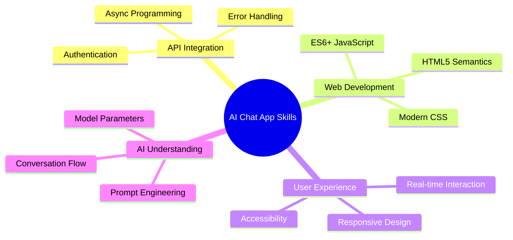
  
या प्रकल्पाने तुम्हाला AI-सक्षम अनुप्रयोग तयार करण्याच्या मूलभूत गोष्टींची ओळख करून दिली आहे, जे वेब विकासाचे भविष्य दर्शवते. तुम्हाला पारंपरिक वेब अनुप्रयोगांमध्ये AI क्षमता कशी एकत्रित करायची हे आता समजले आहे, ज्यामुळे बुद्धिमान आणि प्रतिसादक्षम वापरकर्ता अनुभव तयार होतो.  

### व्यावसायिक उपयोग  

या धड्यादरम्यान तुम्ही विकसित केलेली कौशल्ये आधुनिक सॉफ्टवेअर विकास करिअरमध्ये थेट लागू होतात:  

- **आधुनिक फ्रेमवर्क आणि API वापरून फुल-स्टॅक वेब विकास**  
- **वेब अनुप्रयोग आणि मोबाइल अ‍ॅप्समध्ये AI एकत्रीकरण**  
- **मायक्रोसर्व्हिस आर्किटेक्चरसाठी API डिझाइन आणि विकास**  
- **प्रवेशयोग्यता आणि प्रतिसादक्षम डिझाइनवर लक्ष केंद्रित करून वापरकर्ता इंटरफेस विकास**  
- **DevOps पद्धती** ज्यामध्ये पर्यावरण कॉन्फिगरेशन आणि डिप्लॉयमेंट समाविष्ट आहे  

### तुमच्या AI विकास प्रवासाची पुढील पायरी  

**पुढील शिकण्याची पावले:**  
- **अधिक प्रगत AI मॉडेल्स आणि API (GPT-4, Claude, Gemini)** एक्सप्लोर करा  
- **AI प्रतिसाद सुधारण्यासाठी प्रॉम्प्ट इंजिनिअरिंग तंत्रज्ञान शिकणे**  
- **संवाद डिझाइन आणि चॅटबॉट वापरकर्ता अनुभव तत्त्वे अभ्यासणे**  
- **AI सुरक्षा, नैतिकता आणि जबाबदार AI विकास पद्धतींचा अभ्यास करणे**  
- **संवादाची स्मृती आणि संदर्भ जागरूकता असलेल्या अधिक जटिल अनुप्रयोगांची निर्मिती करणे**  

**प्रगत प्रकल्प कल्पना:**  
- AI मॉडरेशनसह मल्टी-युजर चॅट रूम्स  
- AI-सक्षम ग्राहक सेवा चॅटबॉट्स  
- वैयक्तिक शिक्षणासह शैक्षणिक ट्युटरिंग सहाय्यक  
- वेगवेगळ्या AI व्यक्तिमत्त्वांसह सर्जनशील लेखन सहकारी  
- विकसकांसाठी तांत्रिक दस्तऐवज सहाय्यक  

## GitHub Codespaces सह सुरुवात करा  

या प्रकल्पाचा क्लाउड विकास वातावरणात प्रयत्न करायचा आहे का? GitHub Codespaces तुमच्या ब्राउझरमध्ये संपूर्ण विकास सेटअप प्रदान करते, स्थानिक सेटअप आवश्यकता न करता AI अनुप्रयोगांसह प्रयोग करण्यासाठी परिपूर्ण आहे.  

### तुमचे विकास वातावरण सेट करणे  

**पायरी 1: टेम्पलेटमधून तयार करा**  
- [Web Dev For Beginners repository](https://github.com/microsoft/Web-Dev-For-Beginners) वर जा  
- वरच्या उजव्या कोपऱ्यात "Use this template" वर क्लिक करा (तुम्ही GitHub मध्ये लॉग इन असल्याची खात्री करा)  

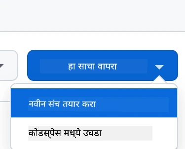  

**पायरी 2: Codespaces लॉन्च करा**  
- तुमच्या नव्याने तयार केलेल्या रिपॉझिटरी उघडा  
- हिरव्या "Code" बटणावर क्लिक करा आणि "Codespaces" निवडा  
- "Create codespace on main" निवडा आणि तुमचे विकास वातावरण सुरू करा  

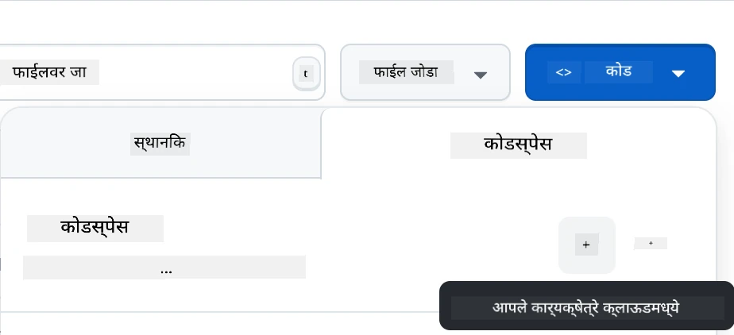  

**पायरी 3: वातावरण कॉन्फिगरेशन**  
तुमचे Codespace लोड झाल्यावर, तुम्हाला खालील गोष्टींमध्ये प्रवेश मिळेल:  
- **पूर्व-स्थापित** Python, Node.js, आणि सर्व आवश्यक विकास साधने  
- **VS Code इंटरफेस** वेब विकासासाठी एक्सटेंशन्ससह  
- **टर्मिनल प्रवेश** बॅकएंड आणि फ्रंटएंड सर्व्हर चालवण्यासाठी  
- **पोर्ट फॉरवर्डिंग** तुमचे अनुप्रयोग चाचणी करण्यासाठी  

**Codespaces काय प्रदान करते:**  
- **स्थानिक वातावरण सेटअप आणि कॉन्फिगरेशन समस्यांचे निराकरण करते**  
- **विविध उपकरणांमध्ये सुसंगत विकास वातावरण प्रदान करते**  
- **वेब विकासासाठी पूर्व-कॉन्फिगर केलेली साधने आणि एक्सटेंशन्स समाविष्ट करते**  
- **आवृत्ती नियंत्रण आणि सहयोगासाठी GitHub सह अखंड एकत्रीकरण प्रदान करते**  

> 🚀 **प्रो टिप**: Codespaces AI अनुप्रयोग शिकण्यासाठी आणि प्रोटोटाइपिंगसाठी परिपूर्ण आहे कारण ते सर्व जटिल वातावरण सेटअप स्वयंचलितपणे हाताळते, तुम्हाला कॉन्फिगरेशन समस्या सोडवण्याऐवजी तयार करणे आणि शिकणे यावर लक्ष केंद्रित करण्यास अनुमती देते.  

---

**अस्वीकरण**:  
हा दस्तऐवज AI भाषांतर सेवा [Co-op Translator](https://github.com/Azure/co-op-translator) वापरून भाषांतरित करण्यात आला आहे. आम्ही अचूकतेसाठी प्रयत्नशील असलो तरी, कृपया लक्षात ठेवा की स्वयंचलित भाषांतरांमध्ये त्रुटी किंवा अचूकतेचा अभाव असू शकतो. मूळ भाषेतील दस्तऐवज हा अधिकृत स्रोत मानला जावा. महत्त्वाच्या माहितीसाठी व्यावसायिक मानवी भाषांतराची शिफारस केली जाते. या भाषांतराचा वापर करून निर्माण झालेल्या कोणत्याही गैरसमज किंवा चुकीच्या अर्थासाठी आम्ही जबाबदार राहणार नाही.