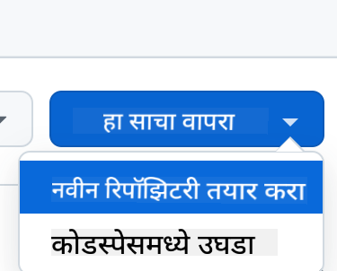

<!--
CO_OP_TRANSLATOR_METADATA:
{
  "original_hash": "002304ffe0059e55b33e2ee5283788ad",
  "translation_date": "2025-09-01T15:25:47+00:00",
  "source_file": "9-chat-project/README.md",
  "language_code": "mr"
}
-->
# चॅट प्रोजेक्ट

हा चॅट प्रोजेक्ट GitHub Models वापरून चॅट असिस्टंट कसा तयार करायचा हे दाखवतो.

तयार प्रोजेक्ट कसा दिसतो ते येथे आहे:

<div>
  
</div>

थोडक्यात, जनरेटिव्ह AI वापरून चॅट असिस्टंट तयार करणे AI शिकण्याची उत्तम सुरुवात आहे. या धड्यादरम्यान तुम्ही जनरेटिव्ह AI वेब अॅपमध्ये कसे समाकलित करायचे ते शिकाल. चला सुरुवात करूया.

## जनरेटिव्ह AI शी कनेक्ट करणे

बॅकएंडसाठी, आम्ही GitHub Models वापरत आहोत. ही एक उत्कृष्ट सेवा आहे जी तुम्हाला AI विनामूल्य वापरण्याची परवानगी देते. त्याच्या प्लेग्राउंडवर जा आणि तुमच्या निवडलेल्या बॅकएंड भाषेशी संबंधित कोड मिळवा. GitHub Models Playground येथे कसे दिसते ते येथे आहे: [GitHub Models Playground](https://github.com/marketplace/models/azure-openai/gpt-4o-mini/playground)

<div>
  
</div>

जसे सांगितले, "Code" टॅब आणि तुमचा निवडलेला रनटाइम निवडा.

<div>
  
</div>

### Python वापरणे

या प्रकरणात आम्ही Python निवडतो, ज्याचा अर्थ असा होतो की आम्ही हा कोड निवडतो:

```python
"""Run this model in Python

> pip install openai
"""
import os
from openai import OpenAI

# To authenticate with the model you will need to generate a personal access token (PAT) in your GitHub settings. 
# Create your PAT token by following instructions here: https://docs.github.com/en/authentication/keeping-your-account-and-data-secure/managing-your-personal-access-tokens
client = OpenAI(
    base_url="https://models.github.ai/inference",
    api_key=os.environ["GITHUB_TOKEN"],
)

response = client.chat.completions.create(
    messages=[
        {
            "role": "system",
            "content": "",
        },
        {
            "role": "user",
            "content": "What is the capital of France?",
        }
    ],
    model="openai/gpt-4o-mini",
    temperature=1,
    max_tokens=4096,
    top_p=1
)

print(response.choices[0].message.content)
```

आता हा कोड थोडा स्वच्छ करूया जेणेकरून तो पुन्हा वापरता येईल:

```python
def call_llm(prompt: str, system_message: str):
    response = client.chat.completions.create(
        messages=[
            {
                "role": "system",
                "content": system_message,
            },
            {
                "role": "user",
                "content": prompt,
            }
        ],
        model="openai/gpt-4o-mini",
        temperature=1,
        max_tokens=4096,
        top_p=1
    )

    return response.choices[0].message.content
```

या `call_llm` फंक्शनसह, आम्ही आता एक प्रॉम्प्ट आणि एक सिस्टम प्रॉम्प्ट घेऊ शकतो आणि फंक्शन परिणाम परत करते.

### AI असिस्टंट सानुकूलित करा

जर तुम्हाला AI असिस्टंट सानुकूलित करायचा असेल तर तुम्ही सिस्टम प्रॉम्प्ट भरून त्याचे वर्तन कसे असावे हे निर्दिष्ट करू शकता:

```python
call_llm("Tell me about you", "You're Albert Einstein, you only know of things in the time you were alive")
```

## वेब API द्वारे एक्सपोज करा

छान, आपला AI भाग पूर्ण झाला आहे, आता आपण वेब API मध्ये ते कसे समाकलित करू शकतो ते पाहूया. वेब API साठी, आम्ही Flask वापरण्याचा निर्णय घेतला आहे, परंतु कोणताही वेब फ्रेमवर्क चांगला असावा. त्यासाठी कोड पाहूया:

### Python वापरणे

```python
# api.py
from flask import Flask, request, jsonify
from llm import call_llm
from flask_cors import CORS

app = Flask(__name__)
CORS(app)   # *   example.com

@app.route("/", methods=["GET"])
def index():
    return "Welcome to this API. Call POST /hello with 'message': 'my message' as JSON payload"


@app.route("/hello", methods=["POST"])
def hello():
    # get message from request body  { "message": "do this taks for me" }
    data = request.get_json()
    message = data.get("message", "")

    response = call_llm(message, "You are a helpful assistant.")
    return jsonify({
        "response": response
    })

if __name__ == "__main__":
    app.run(host="0.0.0.0", port=5000)
```

येथे, आम्ही एक Flask API तयार करतो आणि "/" आणि "/chat" नावाचे डिफॉल्ट रूट परिभाषित करतो. दुसरे रूट आमच्या फ्रंटएंडद्वारे प्रश्न पाठवण्यासाठी वापरले जाते.

*llm.py* समाकलित करण्यासाठी आपल्याला हे करणे आवश्यक आहे:

- `call_llm` फंक्शन आयात करा:

   ```python
   from llm import call_llm
   from flask import Flask, request
   ```

- "/chat" रूटमधून कॉल करा:

   ```python
   @app.route("/hello", methods=["POST"])
   def hello():
      # get message from request body  { "message": "do this taks for me" }
      data = request.get_json()
      message = data.get("message", "")

      response = call_llm(message, "You are a helpful assistant.")
      return jsonify({
         "response": response
      })
   ```

   येथे आम्ही येणाऱ्या विनंतीचे विश्लेषण करून JSON बॉडीमधील `message` प्रॉपर्टी मिळवतो. त्यानंतर आम्ही LLM कॉल करतो:

   ```python
   response = call_llm(message, "You are a helpful assistant")

   # return the response as JSON
   return jsonify({
      "response": response 
   })
   ```

छान, आता आपण आवश्यक ते केले आहे.

## Cors कॉन्फिगर करा

आम्ही असे सांगावे की आम्ही Cors, क्रॉस-ऑरिजिन रिसोर्स शेअरिंग सेट केले आहे. याचा अर्थ असा की आमचा बॅकएंड आणि फ्रंटएंड वेगवेगळ्या पोर्टवर चालणार असल्यामुळे, आम्हाला फ्रंटएंडला बॅकएंडमध्ये कॉल करण्याची परवानगी द्यावी लागेल.

### Python वापरणे

*api.py* मध्ये एक कोड आहे जो हे सेट करतो:

```python
from flask_cors import CORS

app = Flask(__name__)
CORS(app)   # *   example.com
```

सध्या हे "*" म्हणजे सर्व ऑरिजिनसाठी सेट केले आहे आणि ते थोडे असुरक्षित आहे, उत्पादनात जाताना आम्ही ते मर्यादित केले पाहिजे.

## तुमचा प्रोजेक्ट चालवा

तुमचा प्रोजेक्ट चालवण्यासाठी, तुम्हाला प्रथम तुमचा बॅकएंड आणि नंतर तुमचा फ्रंटएंड सुरू करावा लागेल.

### Python वापरणे

ठीक आहे, आमच्याकडे *llm.py* आणि *api.py* आहे, बॅकएंडसह हे कसे कार्य करू शकते? बरं, दोन गोष्टी कराव्या लागतील:

- डिपेंडन्सी इंस्टॉल करा:

   ```sh
   cd backend
   python -m venv venv
   source ./venv/bin/activate

   pip install openai flask flask-cors openai
   ```

- API सुरू करा:

   ```sh
   python api.py
   ```

   जर तुम्ही Codespaces मध्ये असाल तर तुम्हाला एडिटरच्या खालच्या भागात पोर्ट्सवर जावे लागेल, त्यावर राईट-क्लिक करा आणि "Port Visibility" वर क्लिक करा आणि "Public" निवडा.

### फ्रंटएंडवर काम करा

आता आमच्याकडे API चालू आहे, चला यासाठी फ्रंटएंड तयार करूया. एक साधा फ्रंटएंड जो आम्ही टप्प्याटप्प्याने सुधारू. *frontend* फोल्डरमध्ये खालील तयार करा:

```text
backend/
frontend/
index.html
app.js
styles.css
```

चला **index.html** पासून सुरुवात करूया:

```html
<html>
    <head>
        <link rel="stylesheet" href="styles.css">
    </head>
    <body>
      <form>
        <textarea id="messages"></textarea>
        <input id="input" type="text" />
        <button type="submit" id="sendBtn">Send</button>  
      </form>  
      <script src="app.js" />
    </body>
</html>    
```

वरील हे चॅट विंडोला समर्थन देण्यासाठी आवश्यक किमान आहे, कारण यात संदेश रेंडर करण्यासाठी एक टेक्स्टएरिया, संदेश टाइप करण्यासाठी एक इनपुट आणि संदेश बॅकएंडला पाठवण्यासाठी एक बटण आहे. पुढे *app.js* मधील JavaScript पाहूया.

**app.js**

```js
// app.js

(function(){
  // 1. set up elements  
  const messages = document.getElementById("messages");
  const form = document.getElementById("form");
  const input = document.getElementById("input");

  const BASE_URL = "change this";
  const API_ENDPOINT = `${BASE_URL}/hello`;

  // 2. create a function that talks to our backend
  async function callApi(text) {
    const response = await fetch(API_ENDPOINT, {
      method: "POST",
      headers: { "Content-Type": "application/json" },
      body: JSON.stringify({ message: text })
    });
    let json = await response.json();
    return json.response;
  }

  // 3. add response to our textarea
  function appendMessage(text, role) {
    const el = document.createElement("div");
    el.className = `message ${role}`;
    el.innerHTML = text;
    messages.appendChild(el);
  }

  // 4. listen to submit events
  form.addEventListener("submit", async(e) => {
    e.preventDefault();
   // someone clicked the button in the form
   
   // get input
   const text = input.value.trim();

   appendMessage(text, "user")

   // reset it
   input.value = '';

   const reply = await callApi(text);

   // add to messages
   appendMessage(reply, "assistant");

  })
})();
```

कोडच्या प्रत्येक विभागावरून जाऊया:

- 1) येथे आम्ही आमच्या सर्व घटकांचा संदर्भ घेतो ज्याचा आम्ही नंतर कोडमध्ये संदर्भ घेऊ.
- 2) या विभागात, आम्ही एक फंक्शन तयार करतो जे बिल्ट-इन `fetch` पद्धत वापरते जी आमच्या बॅकएंडला कॉल करते.
- 3) `appendMessage` प्रतिसाद तसेच वापरकर्ता म्हणून तुम्ही टाइप करता ते जोडण्यास मदत करते.
- 4) येथे आम्ही सबमिट इव्हेंट ऐकतो आणि आम्ही इनपुट फील्ड वाचतो, वापरकर्त्याचा संदेश टेक्स्टएरियामध्ये ठेवतो, API कॉल करतो आणि टेक्स्टएरियामध्ये प्रतिसाद रेंडर करतो.

आता स्टाइलिंग पाहूया, येथे तुम्ही खूप क्रिएटिव्ह होऊ शकता आणि तुम्हाला हवे तसे दिसायला लावू शकता, परंतु येथे काही सूचना आहेत:

**styles.css**

```
.message {
    background: #222;
    box-shadow: 0 0 0 10px orange;
    padding: 10px:
    margin: 5px;
}

.message.user {
    background: blue;
}

.message.assistant {
    background: grey;
} 
```

या तीन क्लासेससह, तुम्ही संदेश वेगळ्या प्रकारे स्टाइल करू शकता, ते असिस्टंटकडून आले आहेत किंवा तुम्ही वापरकर्ता म्हणून टाइप केले आहेत. प्रेरणा मिळवायची असल्यास, `solution/frontend/styles.css` फोल्डर तपासा.

### बेस URL बदला

येथे एक गोष्ट होती जी आम्ही सेट केली नाही ती म्हणजे `BASE_URL`, हे तुमचा बॅकएंड सुरू होईपर्यंत माहित नाही. ते सेट करण्यासाठी:

- जर तुम्ही API स्थानिकपणे चालवत असाल, तर ते `http://localhost:5000` सारखे काहीतरी सेट केले पाहिजे.
- जर Codespaces मध्ये चालवले असेल, तर ते "[name]app.github.dev" सारखे दिसेल.

## असाइनमेंट

तुमचा स्वतःचा *project* फोल्डर तयार करा ज्यामध्ये खालीलप्रमाणे सामग्री असेल:

```text
project/
  frontend/
    index.html
    app.js
    styles.css
  backend/
    ...
```

वरील दिलेल्या सूचनांमधून सामग्री कॉपी करा परंतु तुमच्या आवडीनुसार सानुकूलित करा.

## सोल्यूशन

[Solution](./solution/README.md)

## बोनस

AI असिस्टंटचा व्यक्तिमत्व बदलण्याचा प्रयत्न करा.

### Python साठी

जेव्हा तुम्ही *api.py* मध्ये `call_llm` कॉल करता तेव्हा तुम्ही दुसरा आर्ग्युमेंट तुमच्या इच्छेनुसार बदलू शकता, उदाहरणार्थ:

```python
call_llm(message, "You are Captain Picard")
```

### फ्रंटएंड

CSS आणि टेक्स्ट देखील तुमच्या आवडीनुसार बदला, त्यामुळे *index.html* आणि *styles.css* मध्ये बदल करा.

## सारांश

छान, तुम्ही AI वापरून वैयक्तिक असिस्टंट कसे तयार करायचे ते शून्यापासून शिकले. आम्ही GitHub Models, Python मध्ये बॅकएंड आणि HTML, CSS आणि JavaScript मध्ये फ्रंटएंड वापरून हे केले.

## Codespaces सह सेट अप करा

- येथे जा: [Web Dev For Beginners repo](https://github.com/microsoft/Web-Dev-For-Beginners)
- टेम्पलेटमधून तयार करा (GitHub मध्ये लॉग इन असल्याची खात्री करा) वरच्या उजव्या कोपऱ्यात:

    

- एकदा तुमच्या रेपोमध्ये, Codespace तयार करा:

    

    यामुळे तुम्ही आता काम करू शकता असे वातावरण सुरू होईल.

---

**अस्वीकरण**:  
हा दस्तऐवज AI भाषांतर सेवा [Co-op Translator](https://github.com/Azure/co-op-translator) चा वापर करून भाषांतरित करण्यात आला आहे. आम्ही अचूकतेसाठी प्रयत्नशील असलो तरी कृपया लक्षात ठेवा की स्वयंचलित भाषांतरे त्रुटी किंवा अचूकतेच्या अभावाने युक्त असू शकतात. मूळ भाषेतील दस्तऐवज हा अधिकृत स्रोत मानला जावा. महत्त्वाच्या माहितीसाठी व्यावसायिक मानवी भाषांतराची शिफारस केली जाते. या भाषांतराचा वापर करून उद्भवलेल्या कोणत्याही गैरसमज किंवा चुकीच्या अर्थासाठी आम्ही जबाबदार राहणार नाही.