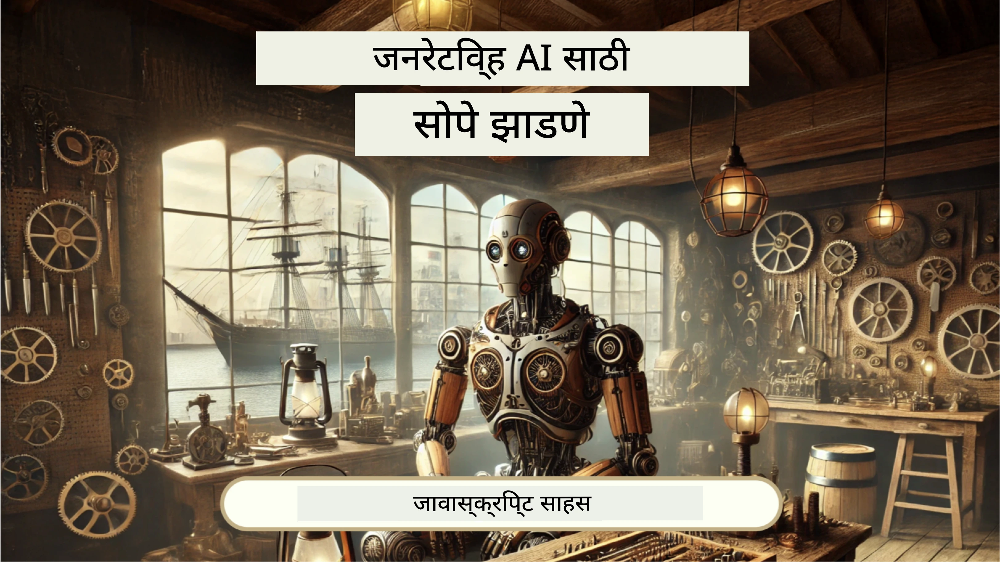
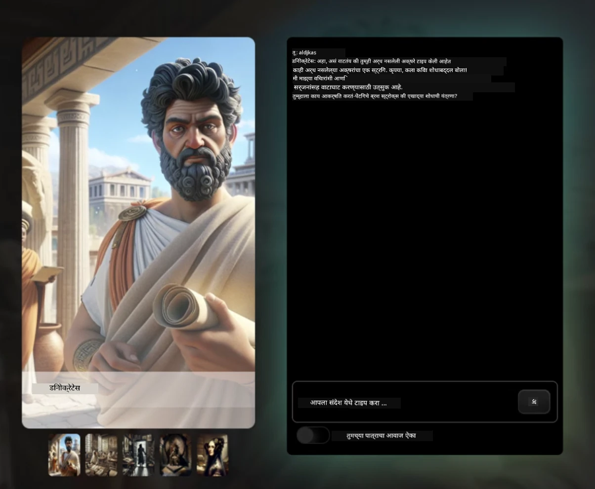
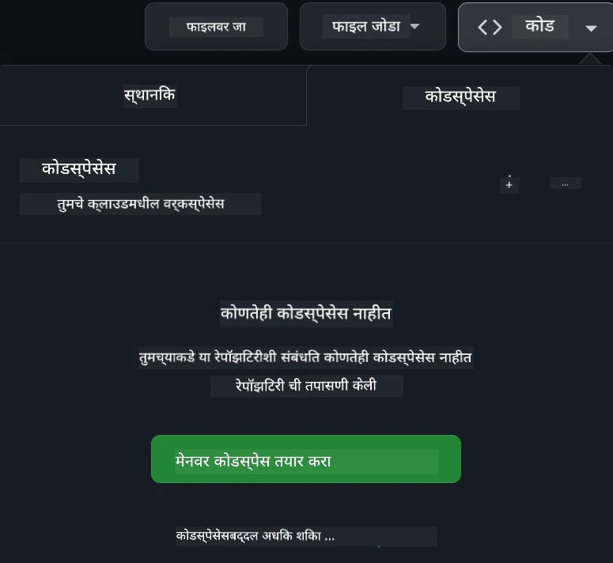

[](https://github.com/microsoft/Web-Dev-For-Beginners/blob/master/LICENSE)
[](https://GitHub.com/microsoft/Web-Dev-For-Beginners/graphs/contributors/)
[](https://GitHub.com/microsoft/Web-Dev-For-Beginners/issues/)
[](https://GitHub.com/microsoft/Web-Dev-For-Beginners/pulls/)
[](http://makeapullrequest.com)

[](https://GitHub.com/microsoft/Web-Dev-For-Beginners/watchers/)
[](https://GitHub.com/microsoft/Web-Dev-For-Beginners/network/)
[](https://GitHub.com/microsoft/Web-Dev-For-Beginners/stargazers/)

[](https://discord.gg/nTYy5BXMWG)

# नवशिक्यांसाठी वेब विकास - एक अभ्यासक्रम

मायक्रोसॉफ्ट क्लाउड अॅडव्होकेट्सद्वारे आम्ही सादर केलेल्या १२ आठवड्यांच्या सविस्तर कोर्ससह वेब विकासाच्या मूलभूत गोष्टी शिका. २४ धड्यांपैकी प्रत्येक धडा JavaScript, CSS आणि HTML मध्ये करता येणाऱ्या प्रकल्पांद्वारे जसे की टेररियम, ब्राउझर एक्सटेन्शन्स, आणि स्पेस गेम्स यांचा अभ्यास करतो. क्विझ, चर्चा आणि व्यावहारिक असाइनमेंटसह गुंतून रहा. आमच्या परिणामकारक प्रोजेक्ट-आधारित शिक्षण पद्धतीने तुमची कौशल्ये वाढवा आणि ज्ञान टिकवून ठेवा. आजच तुमची कोडिंग यात्रा सुरू करा!

Azure AI Foundry Discord समुदायात सहभागी व्हा

[](https://discord.gg/nTYy5BXMWG)

हे संसाधने वापरण्यास प्रारंभ करण्यासाठी खालील टप्पे फॉलो करा:
1. **रिपॉझिटरी फोर्क करा**: क्लिक करा [](https://GitHub.com/microsoft/Web-Dev-For-Beginners/fork)
2. **रिपॉझिटरी क्लोन करा**:   `git clone https://github.com/microsoft/Web-Dev-For-Beginners.git`
3. [**Azure AI Foundry Discord मध्ये सहभागी व्हा आणि तज्ञ तसेच सहकारी विकसकांना भेटा**](https://discord.com/invite/ByRwuEEgH4)

### 🌐 बहुभाषिक समर्थन

#### GitHub Action द्वारे समर्थित (स्वयंचलित व नेहमी अद्ययावत)

<!-- CO-OP TRANSLATOR LANGUAGES TABLE START -->
[Arabic](../ar/README.md) | [Bengali](../bn/README.md) | [Bulgarian](../bg/README.md) | [Burmese (Myanmar)](../my/README.md) | [Chinese (Simplified)](../zh-CN/README.md) | [Chinese (Traditional, Hong Kong)](../zh-HK/README.md) | [Chinese (Traditional, Macau)](../zh-MO/README.md) | [Chinese (Traditional, Taiwan)](../zh-TW/README.md) | [Croatian](../hr/README.md) | [Czech](../cs/README.md) | [Danish](../da/README.md) | [Dutch](../nl/README.md) | [Estonian](../et/README.md) | [Finnish](../fi/README.md) | [French](../fr/README.md) | [German](../de/README.md) | [Greek](../el/README.md) | [Hebrew](../he/README.md) | [Hindi](../hi/README.md) | [Hungarian](../hu/README.md) | [Indonesian](../id/README.md) | [Italian](../it/README.md) | [Japanese](../ja/README.md) | [Kannada](../kn/README.md) | [Korean](../ko/README.md) | [Lithuanian](../lt/README.md) | [Malay](../ms/README.md) | [Malayalam](../ml/README.md) | [Marathi](./README.md) | [Nepali](../ne/README.md) | [Nigerian Pidgin](../pcm/README.md) | [Norwegian](../no/README.md) | [Persian (Farsi)](../fa/README.md) | [Polish](../pl/README.md) | [Portuguese (Brazil)](../pt-BR/README.md) | [Portuguese (Portugal)](../pt-PT/README.md) | [Punjabi (Gurmukhi)](../pa/README.md) | [Romanian](../ro/README.md) | [Russian](../ru/README.md) | [Serbian (Cyrillic)](../sr/README.md) | [Slovak](../sk/README.md) | [Slovenian](../sl/README.md) | [Spanish](../es/README.md) | [Swahili](../sw/README.md) | [Swedish](../sv/README.md) | [Tagalog (Filipino)](../tl/README.md) | [Tamil](../ta/README.md) | [Telugu](../te/README.md) | [Thai](../th/README.md) | [Turkish](../tr/README.md) | [Ukrainian](../uk/README.md) | [Urdu](../ur/README.md) | [Vietnamese](../vi/README.md)

> **स्थानिकरित्या क्लोन करणे पसंत आहे?**

> या रिपॉझिटरीमध्ये ५०+ भाषांच्या अनुवादांचा समावेश आहे ज्यामुळे डाउनलोडचा आकार लक्षणीयपणे वाढतो. अनुवादांशिवाय क्लोन करण्यासाठी sparse checkout वापरा:
> ```bash
> git clone --filter=blob:none --sparse https://github.com/microsoft/Web-Dev-For-Beginners.git
> cd Web-Dev-For-Beginners
> git sparse-checkout set --no-cone '/*' '!translations' '!translated_images'
> ```
> हे तुम्हाला कोर्स पूर्ण करण्यासाठी सर्व ते देते आणि डाउनलोड अधिक जलद होते.
<!-- CO-OP TRANSLATOR LANGUAGES TABLE END -->

**अधिक भाषांमध्ये अनुवाद हवा असल्यास, [येथे](https://github.com/Azure/co-op-translator/blob/main/getting_started/supported-languages.md) सूचीबद्ध केलेले भाषासमर्थन पहा**

[](https://open.vscode.dev/microsoft/Web-Dev-For-Beginners)

#### 🧑‍🎓 _तुम्ही विद्यार्थी आहात का?_

[**Student Hub page**](https://docs.microsoft.com/learn/student-hub/?WT.mc_id=academic-77807-sagibbon) येथे भेट द्या जिथे तुम्हाला नवशिक्यांसाठी संसाधने, विद्यार्थ्यांसाठी पॅक्स आणि अगदी मोफत प्रमाणपत्र कूपन मिळवण्याचे मार्गही सापडतील. ही पान तुम्हाला बुकमार्क करायला हवे आणि दर महिन्याला नव्या सामग्रीसाठी तपासायला हवे.

### 📣 घोषणा - नवीन GitHub Copilot Agent मोड आव्हाने पूर्ण करा!

नवीन आव्हान जोडले गेले आहे, बहुतेक अध्यायांत "GitHub Copilot Agent Challenge 🚀" शोधा. हे GitHub Copilot आणि Agent मोड वापरून पूर्ण करण्यासाठी एक नवीन आव्हान आहे. जर तुम्ही Agent मोड पूर्वी वापरला नसेल तर हे फक्त मजकूर निर्माण करत नाही तर फाइल्स तयार आणि संपादित करू शकते, आज्ञा चालवू शकते आणि बरंच काही.

### 📣 घोषणा - _नवीन प्रोजेक्ट Generative AI वापरून बनविण्यासाठी_

नवीन AI सहाय्यक प्रोजेक्ट नुकताच जोडला आहे, पहा [project](./9-chat-project/README.md)

### 📣 घोषणा - _Generative AI साठी नवीन अभ्यासक्रम JavaScript मध्ये नुकताच रिलीज झाला आहे_

आमचा नवीन Generative AI अभ्यासक्रम चुकवू नका!

शिकायला सुरूवात करण्यासाठी भेट द्या [https://aka.ms/genai-js-course](https://aka.ms/genai-js-course)!



- मूलभूत ते RAG पर्यंत सर्व काही शिकवणारे धडे.
- ऐतिहासिक व्यक्तिरेखांशी संवाद साधा GenAI आणि आमच्या साथीदार अॅपचा वापर करून.
- मजेदार आणि गुंतवणूक करणारी कथा, तुम्ही टाइम ट्रॅव्हल केल्यासारखे व्हाल!




प्रत्येक धड्यात असाइनमेंट पूर्ण करणे, ज्ञान तपासणी आणि आव्हानाचा समावेश आहे ज्यामुळे तुम्हाला पुढील विषयांवर मार्गदर्शन मिळते:
- प्रॉम्प्टिंग आणि प्रॉम्प्ट इंजिनीयरिंग
- मजकूर आणि इमेज अॅप जनरेशन
- शोध अॅप्स

शिकायला सुरुवात करण्यासाठी भेट द्या [https://aka.ms/genai-js-course](../../[https:/aka.ms/genai-js-course)!


## 🌱 प्रारंभ करा

> **शिक्षकहो**, आम्ही [या अभ्यासक्रमासाठी काही सूचना](for-teachers.md) समाविष्ट केल्या आहेत. कृपया [आमच्या चर्चा मंचावर](https://github.com/microsoft/Web-Dev-For-Beginners/discussions/categories/teacher-corner) तुमचा अभिप्राय द्या!

**[शिकणारे](https://aka.ms/student-page/?WT.mc_id=academic-77807-sagibbon)**, प्रत्येक धड्यासाठी प्री-लेक्चर क्विझसह प्रारंभ करा, नंतर व्याख्यान साहित्य वाचा, विविध क्रियाकलाप पूर्ण करा आणि पोस्ट-लेक्चर क्विझने तुमचे समज तपासा.

शिकण्याचा अनुभव सुधारण्यासाठी, सहकारी विद्यार्थ्यांशी संपर्क करा आणि प्रोजेक्टवर एकत्र काम करा! चर्चांची शिफारस आम्ही आमच्या [चर्चा फोरम](https://github.com/microsoft/Web-Dev-For-Beginners/discussions) मध्ये करतो जिथे आमचा मॉडरेटर टीम तुमच्या प्रश्नांची उत्तरे देईल.

शिक्षणाला पुढे नेण्यासाठी, आम्ही अत्यंत शिफारस करतो की तुम्ही [Microsoft Learn](https://learn.microsoft.com/users/wirelesslife/collections/p1ddcy5jwy0jkm?WT.mc_id=academic-77807-sagibbon) वर अतिरिक्त अभ्यास साहित्य पहा.

### 📋 तुमचे वातावरण सेट करा

हा अभ्यासक्रम एका विकसित वातावरणासह तयार आहे! सुरू करताना तुम्ही हा अभ्यासक्रम [Codespace](https://github.com/features/codespaces/) मध्ये (ब्राऊझर-आधारित, इंस्टॉलेशन्स नको असलेले वातावरण) चालवू शकता किंवा तुमच्या संगणकावर स्थानिकरित्या [Visual Studio Code](https://code.visualstudio.com/?WT.mc_id=academic-77807-sagibbon) सारख्या टेक्ट्स एडिटरचा वापर करून चालवू शकता.

#### तुमची रिपॉझिटरी तयार करा
तुमचे काम सहज जतन करण्यासाठी, या रिपॉझिटरीची स्वतःची प्रत तयार करणे शिफारसीय आहे. ह्या पानाच्या वरच्या बाजूला असलेल्या **Use this template** बटणावर क्लिक करून हे करता येईल. यामुळे तुमच्या GitHub खात्यात एक नवीन रिपॉझिटरी तयार होईल ज्यात अभ्यासक्रमाची प्रत असेल.

हे टप्पे फॉलो करा:
1. **रिपॉझिटरी फोर्क करा**: या पानाच्या वरच्या-उजव्या कोपऱ्यातील "Fork" बटणावर क्लिक करा.
2. **रिपॉझिटरी क्लोन करा**:   `git clone https://github.com/microsoft/Web-Dev-For-Beginners.git`

#### Codespace मध्ये अभ्यासक्रम चालविणे

तुमच्या तयार केलेल्या या रिपॉझिटरीच्या कॉपीमध्ये, **Code** बटणावर क्लिक करा आणि **Open with Codespaces** निवडा. यामुळे तुमच्यासाठी नवीन Codespace तयार होईल.



#### तुमच्या संगणकावर स्थानिकरित्या अभ्यासक्रम चालवणे

हा अभ्यासक्रम आपल्या संगणकावर चालवायचा असल्यास, तुम्हाला एक व्राहक संपादक, एक ब्राऊझर आणि एक कमांड लाइन टूल लागेल. आमचा पहिला धडा, [Programming Languages and Tools of the Trade परिचय](../../1-getting-started-lessons/1-intro-to-programming-languages), तुम्हाला प्रत्येक साधनासाठी विविध पर्यायांबद्दल मार्गदर्शन करेल ज्यातून तुम्ही तुमच्यासाठी योग्य ते निवडू शकता.

आमची शिफारस आहे की तुम्ही [Visual Studio Code](https://code.visualstudio.com/?WT.mc_id=academic-77807-sagibbon) या एडिटरचा वापर करा, ज्यामध्ये अंगभूत [Terminal](https://code.visualstudio.com/docs/terminal/basics/?WT.mc_id=academic-77807-sagibbon) देखील आहे. तुम्ही Visual Studio Code [इथे](https://code.visualstudio.com/?WT.mc_id=academic-77807-sagibbon) डाउनलोड करू शकता.


1. तुमची रिपॉझिटरी तुमच्या संगणकावर क्लोन करा. हे करण्यासाठी **Code** बटणावर क्लिक करा आणि URL कॉपी करा:

    [CodeSpace](./images/createcodespace.png)
    मग, [Visual Studio Code](https://code.visualstudio.com/?WT.mc_id=academic-77807-sagibbon) मध्ये [टर्मिनल](https://code.visualstudio.com/docs/terminal/basics/?WT.mc_id=academic-77807-sagibbon) उघडा आणि खालील आदेश चालवा, `<your-repository-url>` या ठिकाणी तुम्ही नुकताच कॉपी केलेला URL ठेवा:

    ```bash 
    git clone <your-repository-url>
    ```

2. Visual Studio Code मध्ये फोल्डर उघडा. तुम्ही हे **File** > **Open Folder** वर क्लिक करून आणि नुकताच क्लोन केलेला फोल्डर निवडून करू शकता.


>  शिफारस केलेले Visual Studio Code विस्तार:
>
> * [Live Server](https://marketplace.visualstudio.com/items?itemName=ritwickdey.LiveServer&WT.mc_id=academic-77807-sagibbon) - Visual Studio Code मध्ये HTML पृष्ठांचे पूर्वावलोकन करण्यासाठी
> * [Copilot](https://marketplace.visualstudio.com/items?itemName=GitHub.copilot&WT.mc_id=academic-77807-sagibbon) - कोड जलद लिहिण्यात मदत करण्यासाठी

## 📂 प्रत्येक धडा मध्ये समाविष्ट आहे:

- ऐच्छिक स्केच नोट
- ऐच्छिक पूरक व्हिडिओ
- पूर्व-धडा वॉर्मअप क्विझ
- लिखित धडा
- प्रकल्प-आधारित धड्यांसाठी, प्रकल्प कसा तयार करायचा याचे टप्प्याटप्प्याने मार्गदर्शक
- ज्ञान चाचण्या
- एक आव्हान
- पूरक वाचन
- असाइनमेंट
- [धडा नंतरचा क्विझ](https://ff-quizzes.netlify.app/web/)

> **क्विझ विषयी एक नोट**: सर्व क्विझ Quiz-app फोल्डरमध्ये आहेत, एकूण 48 क्विझ ज्यामध्ये प्रत्येकी तीन प्रश्न आहेत. ते [येथे](https://ff-quizzes.netlify.app/web/) उपलब्ध आहेत, क्विझ अॅप स्थानिकरीत्या चालवता येऊ शकतो किंवा Azure वर तैनात करता येतो; `quiz-app` फोल्डरमधील सूचनांचे पालन करा.

## 🗃️ धडे

|     |                       प्रकल्पाचे नाव                       |                            शिकवले जाणारे संकल्पना                             | शिका उद्दिष्टे                                                                                                                 |                                                         लिंक केलेला धडा                                                          |         लेखक          |
| :-: | :------------------------------------------------------: | :--------------------------------------------------------------------: | ----------------------------------------------------------------------------------------------------------------------------------- | :----------------------------------------------------------------------------------------------------------------------------: | :---------------------: |
| 01  |                     Getting Started                      |           प्रोग्रॅमिंगची ओळख आणि कामांच्या साधनांसाठी परिचय           | जास्तीत जास्त प्रोग्रॅमिंग भाषांच्या मूलभूत तत्त्वांबद्दल आणि व्यावसायिक विकसकांना मदत करणाऱ्या सॉफ्टवेअरबद्दल शिका | [प्रोग्रॅमिंग भाषांची आणि कामांच्या साधनांची ओळख](./1-getting-started-lessons/1-intro-to-programming-languages/README.md) |         Jasmine         |
| 02  |                     Getting Started                      |             GitHub च्या मूलभूत गोष्टी, ज्यामध्ये टीमसह काम करणे             | तुमच्या प्रकल्पात GitHub कसा वापरायचा, कोड बेसवर इतरांसोबत सहयोग कसा करायचा                                                    |                            [GitHub ची ओळख](./1-getting-started-lessons/2-github-basics/README.md)                             |          Floor          |
| 03  |                     Getting Started                      |                             प्रवेशयोग्यता                              | वेब प्रवेशयोग्यतेच्या मूलभूत गोष्टी शिका                                                                                               |                       [प्रवेशयोग्यता मूलतत्त्वे](./1-getting-started-lessons/3-accessibility/README.md)                       |       Christopher       |
| 04  |                        JS Basics                         |                         JavaScript डेटा प्रकार                          | JavaScript डेटा प्रकारांची मूलभूत माहिती                                                                                                 |                                       [डेटा प्रकार](./2-js-basics/1-data-types/README.md)                                        |         Jasmine         |
| 05  |                        JS Basics                         |                         फंक्शन्स आणि मेथड्स                          | अ‍ॅप्लिकेशनच्या लॉजिक फ्लोचे व्यवस्थापन करण्यासाठी फंक्शन्स आणि मेथडबद्दल शिका                                                             |                              [फंक्शन्स आणि मेथड्स](./2-js-basics/2-functions-methods/README.md)                               | Jasmine and Christopher |
| 06  |                        JS Basics                         |                        JS सह निर्णय घेणे                        | निर्णय घेण्याच्या पद्धती वापरून तुमच्या कोडमध्ये अटी कशा तयार कराव्यात हे शिका                                                           |                                 [निर्णय घेणे](./2-js-basics/3-making-decisions/README.md)                                  |         Jasmine         |
| 07  |                        JS Basics                         |                            अ‍ॅरे आणि लूप्स                            | JavaScript मध्ये अ‍ॅरे आणि लूप वापरून डेटा कसा हाताळायचा हे शिका                                                                                 |                                   [अ‍ॅरे आणि लूप्स](./2-js-basics/4-arrays-loops/README.md)                                    |         Jasmine         |
| 08  |       [Terrarium](./3-terrarium/solution/README.md)       |                            HTML चा व्यावहारिक उपयोग                            | ऑनलाइन टेरॅरियम तयार करण्यासाठी HTML तयार करा, लेआउट तयार करण्यावर लक्ष केंद्रित करा                                                         |                                 [HTML मध्ये परिचय](./3-terrarium/1-intro-to-html/README.md)                                 |           Jen           |
| 09  |       [Terrarium](./3-terrarium/solution/README.md)       |                            CSS चा व्यावहारिक उपयोग                             | ऑनलाइन टेरॅरियमला स्टाइल करण्यासाठी CSS तयार करा, CSS च्या मूलभूत गोष्टींसह पृष्ठ प्रतिक्रियाशील बनवणे यावर लक्ष केंद्रीत करा                     |                                  [CSS मध्ये परिचय](./3-terrarium/2-intro-to-css/README.md)                                  |           Jen           |
| 10  |            [Terrarium](./3-terrarium/solution/README.md)            |                 JavaScript क्लोजर्स, DOM हाताळणी                  | टेरॅरियमला ड्रॅग/ड्रॉप इंटरफेससारखे कार्य करण्यासाठी JavaScript तयार करा, क्लोजर्स आणि DOM हाताळणीवर लक्ष केंद्रित करा             |                  [JavaScript क्लोजर्स, DOM हाताळणी](./3-terrarium/3-intro-to-DOM-and-closures/README.md)                   |           Jen           |
| 11  |          [टायपिंग गेम](./4-typing-game/solution/README.md)          |                          टायपिंग गेम तयार करा                           | कीबोर्ड इव्हेंट्सचा वापर करून तुमच्या JavaScript अ‍ॅपचा लॉजिक कसा चालवायचा हे शिका                                                          |                                [इव्हेंट-चालित प्रोग्रॅमिंग](./4-typing-game/typing-game/README.md)                                |       Christopher       |
| 12  | [ग्रीन ब्राउझर एक्सटेंशन](./5-browser-extension/solution/README.md) |                         ब्राउझर्सबरोबर काम करणे                          | ब्राउझर्स कसे कार्य करतात, त्यांचा इतिहास, आणि ब्राउझर एक्सटेंशनचे पहिले घटक कसे तयार करायचे हे शिका                               |                               [ब्राउझर विषयी](./5-browser-extension/1-about-browsers/README.md)                                |           Jen           |
| 13  | [ग्रीन ब्राउझर एक्सटेंशन](./5-browser-extension/solution/README.md) | फॉर्म तयार करणे, API कॉल करणे आणि स्थानिक साठवणेमध्ये व्हेरिएबल संचयित करणे | API कॉल करण्यासाठी आणि स्थानिक साठवणेमध्ये व्हेरिएबल्स वापरण्यासाठी तुमच्या ब्राउझर एक्सटेंशनचे JavaScript घटक तयार करा                      |                [APIs, फॉर्म्स, आणि स्थानिक साठवणूक](./5-browser-extension/2-forms-browsers-local-storage/README.md)                 |           Jen           |
| 14  | [ग्रीन ब्राउझर एक्सटेंशन](./5-browser-extension/solution/README.md) |          ब्राउझरमधील पार्श्वभूमी प्रक्रिये, वेब कार्यक्षमता          | एक्सटेंशनच्या आयकॉनचे व्यवस्थापन करण्यासाठी ब्राउझरच्या पार्श्वभूमी प्रक्रियेचा वापर करा; वेब कार्यक्षमतेबद्दल आणि सुधारणा शिकाअ                   |             [पार्श्वभूमी कार्ये आणि कार्यक्षमते](./5-browser-extension/3-background-tasks-and-performance/README.md)              |           Jen           |
| 15  |           [अंतराळ खेळ](./6-space-game/solution/README.md)           |             JavaScript सह अधिक प्रगत खेळ विकास             | क्लासेस आणि कंपोजिशनचा वापर करून वारसा आणि Pub/Sub पॅटर्न बद्दल शिका, खेळ तयार करण्याची तयारी म्हणून              |                      [प्रगत खेळ विकासाची ओळख](./6-space-game/1-introduction/README.md)                       |          Chris          |
| 16  |           [अंतराळ खेळ](./6-space-game/solution/README.md)           |                           कॅनव्हासवर रेखाटणे                            | स्क्रीनवर घटक रेखाटण्यासाठी वापरल्या जाणाऱ्या Canvas API बद्दल शिका                                                                       |                                [कॅनव्हासवर रेखाटणे](./6-space-game/2-drawing-to-canvas/README.md)                                |          Chris          |
| 17  |           [अंतराळ खेळ](./6-space-game/solution/README.md)           |                   स्क्रीनवर घटक हलवणे                    | Cartesian स्थाननिर्देश आणि Canvas API वापरून घटकांना गती कशी मिळते ते जाणून घ्या                                            |                           [घटक हलवणे](./6-space-game/3-moving-elements-around/README.md)                           |          Chris          |
| 18  |           [अंतराळ खेळ](./6-space-game/solution/README.md)           |                          टक्कर अटींचे निरीक्षण                           | घटकांच्या टक्करेनंतर एकमेकांना प्रतिसाद द्यायला शिका, की-प्रेस वापरून आणि खेळाची कार्यक्षमता सुनिश्चित करण्यासाठी कूलडाउन फंक्शन प्रदान करा    |                              [टक्कर निरीक्षण](./6-space-game/4-collision-detection/README.md)                              |          Chris          |
| 19  |           [अंतराळ खेळ](./6-space-game/solution/README.md)           |                             स्कोअर राखणे                              | खेळाच्या स्थिती आणि कार्यक्षमतेवर आधारित गणिती गणना करा                                                                |                                    [स्कोअर राखणे](./6-space-game/5-keeping-score/README.md)                                    |          Chris          |
| 20  |           [अंतराळ खेळ](./6-space-game/solution/README.md)           |                     खेळ समाप्त करणे आणि पुन्हा सुरू करणे                     | खेळ संपविणे आणि पुन्हा सुरू करताना, साधने साफ करणे आणि व्हेरिएबल मूल्ये रीसेट करण्याबद्दल शिका                              |                                [समाप्तीची अट](./6-space-game/6-end-condition/README.md)                                 |          Chris          |
| 21  |         [बँकिंग अ‍ॅप](./7-bank-project/solution/README.md)          |                 वेब अ‍ॅपमध्ये HTML टेम्पलेट्स आणि रूट्स                 | मल्टीपेज वेबसाइटची रचना कशी तयार करावी (राउटिंग आणि HTML टेम्पलेटस वापरून)                             |                            [HTML टेम्पलेट्स आणि रूट्स](./7-bank-project/1-template-route/README.md)                             |          Yohan          |
| 22  |         [बँकिंग अ‍ॅप](./7-bank-project/solution/README.md)          |                  लॉगिन आणि नोंदणी फॉर्म तयार करा                   | फॉर्म तयार करणे आणि व्हॅलिडेशन प्रक्रियांचे व्यवस्थापन याबद्दल शिका                                                                          |                                           [फॉर्म्स](./7-bank-project/2-forms/README.md)                                           |          Yohan          |
| 23  |         [बँकिंग अ‍ॅप](./7-bank-project/solution/README.md)          |                   डेटा मिळविण्याच्या आणि वापरण्याच्या पद्धती                   | तुमच्या अ‍ॅपमध्ये डेटा कसा येतो आणि जातो, कसा मिळवायचा, जिथे ठेवायचा आणि टाकून द्यायचा हे शिका                                                 |                                            [डेटा](./7-bank-project/3-data/README.md)                                            |          Yohan          |
| 24  |         [बँकिंग अ‍ॅप](./7-bank-project/solution/README.md)          |                      स्टेट मॅनेजमेंट संकल्पना                      | तुमच्या अ‍ॅपमध्ये स्टेट कसा टिकवायचा आणि प्रोग्रामच्या माध्यमातून कसा व्यवस्थापित करायचा हे शिका                                                              |                                [स्टेट मॅनेजमेंट](./7-bank-project/4-state-management/README.md)                                |          Yohan          |
| 25 | [ब्राउझर/VSकोड कोड](../../8-code-editor) | VSकोड सोबत काम | कोड एडिटर कसा वापरायचा शिका| [VSकोड कोड एडिटर वापरा](./8-code-editor/1-using-a-code-editor/README.md) | Chris |
| 26 | [AI सहाय्यक](./9-chat-project/README.md) | AI सोबत काम | स्वतःचा AI सहाय्यक कसा तयार करायचा ते शिका | [AI सहाय्यक प्रकल्प](./9-chat-project/README.md) | Chris |

## 🏫 शिक्षणशास्त्र

आमच्या अभ्यासक्रमाची रचना दोन महत्त्वाच्या शैक्षणिक तत्त्वांवर आधारित आहे:
* प्रकल्प-आधारित शिक्षण
* वारंवार क्विझ

हा कार्यक्रम JavaScript, HTML आणि CSS यांचे मूलभूत तत्त्व शिकवतो, तसेच आजकाल वेब विकासक वापरत असलेल्या नवीनतम साधने आणि तंत्रे शिकवतो. विद्यार्थी टायपिंग गेम, आभासी टेरॅरियम, पर्यावरण-अनुकूल ब्राउझर एक्सटेंशन, अंतराळ-आक्रमक प्रकारचा गेम, आणि व्यवसायांसाठी बँकिंग अ‍ॅप तयार करून हाताळणीचा अनुभव मिळवू शकतील. या मालिकेच्या अखेरीस, विद्यार्थ्यांना वेब विकासाचा सखोल आढावा मिळेल.

> 🎓 तुम्ही हा अभ्यासक्रम सुरूवातीचे काही धडे Microsoft Learn वर [Learn Path](https://docs.microsoft.com/learn/paths/web-development-101/?WT.mc_id=academic-77807-sagibbon) म्हणून घेतू शकता!

प्रकल्पांसोबत मजकूर सुसंगत ठेवून, प्रक्रिया विद्यार्थ्यांसाठी अधिक मनोरंजक होते आणि संकल्पनांची धरपकड वाढते. आम्ही JavaScript चे मूलभूत तत्त्वे समजावण्यासाठी काही सुरुवातीचे धडे लिहिले तसेच "[Beginners Series to: JavaScript](https://channel9.msdn.com/Series/Beginners-Series-to-JavaScript/?WT.mc_id=academic-77807-sagibbon)" या व्हिडिओ ट्युटोरियल मालिकेतील एक व्हिडिओ जोडला, ज्याचे काही लेखक या अभ्यासक्रमात योगदान देतात.

याशिवाय, वर्गापूर्वी असलेला कमी-दबावाचा क्विझ विद्यार्थ्यांच्या लक्षात विषय शिकण्याची तयारी तयार करतो, तर वर्गानंतरचा दुसरा क्विझ अधिक चांगले टिकवणूक सुनिश्चित करतो. हा अभ्यासक्रम लवचीक आणि आनंददायी आहे आणि पूर्णपणे किंवा भागाने घेतला जाऊ शकतो. प्रकल्प सुरुवातीला लहान आणि १२ आठवड्यांच्या चक्राच्या शेवटी अधिक गुंतागुंतीचा होतो.

आम्ही जावास्क्रिप्ट फ्रेमवर्क परिचय देण्याचे उद्दिष्ट टाळले जेणेकरून प्राथमिक वेब विकासक कौशल्यांवर लक्ष केंद्रित ठेवले जाऊ शकेल; हा अभ्यासक्रम पूर्ण केल्यानंतर पुढील चांगला टप्पा म्हणजे Node.js बद्दल शिकणे "[Beginner Series to: Node.js](https://channel9.msdn.com/Series/Beginners-Series-to-Nodejs/?WT.mc_id=academic-77807-sagibbon)" या व्हिडिओ मालिकेद्वारे.

> आमच्या [व्यवहार संहिता](CODE_OF_CONDUCT.md) आणि [योगदान](CONTRIBUTING.md) मार्गदर्शक तत्त्वे पहा. तुमची रचनात्मक अभिप्रेते आम्ही स्वागत करतो!


## 🧭 ऑफलाइन प्रवेश

तुम्ही [Docsify](https://docsify.js.org/#/) वापरून हा दस्तऐवज ऑफलाइन चालवू शकता. या रेपोचा फोर्क करा, तुमच्या स्थानिक संगणकावर [Docsify स्थापित करा](https://docsify.js.org/#/quickstart), आणि नंतर या रेपोच्या मुळ फोल्डरमध्ये `docsify serve` टाइप करा. वेबसाइट तुमच्या लोकलहोस्टवर पोर्ट 3000 वर सेवा देईल: `localhost:3000`.

## 📘 PDF

सर्व धड्यांचे PDF [येथे](https://microsoft.github.io/Web-Dev-For-Beginners/pdf/readme.pdf) मिळू शकते.


## 🎒 इतर कोर्सेस
आमची टीम इतर कोर्सेस तयार करते! पाहा:

<!-- CO-OP TRANSLATOR OTHER COURSES START -->
### LangChain
[](https://aka.ms/langchain4j-for-beginners)
[](https://aka.ms/langchainjs-for-beginners?WT.mc_id=m365-94501-dwahlin)
[](https://github.com/microsoft/langchain-for-beginners?WT.mc_id=m365-94501-dwahlin)
---

### Azure / Edge / MCP / Agents
[](https://github.com/microsoft/AZD-for-beginners?WT.mc_id=academic-105485-koreyst)
[](https://github.com/microsoft/edgeai-for-beginners?WT.mc_id=academic-105485-koreyst)
[](https://github.com/microsoft/mcp-for-beginners?WT.mc_id=academic-105485-koreyst)
[](https://github.com/microsoft/ai-agents-for-beginners?WT.mc_id=academic-105485-koreyst)

---
 
### Generative AI Series
[](https://github.com/microsoft/generative-ai-for-beginners?WT.mc_id=academic-105485-koreyst)
[-9333EA?style=for-the-badge&labelColor=E5E7EB&color=9333EA)](https://github.com/microsoft/Generative-AI-for-beginners-dotnet?WT.mc_id=academic-105485-koreyst)
[-C084FC?style=for-the-badge&labelColor=E5E7EB&color=C084FC)](https://github.com/microsoft/generative-ai-for-beginners-java?WT.mc_id=academic-105485-koreyst)
[-E879F9?style=for-the-badge&labelColor=E5E7EB&color=E879F9)](https://github.com/microsoft/generative-ai-with-javascript?WT.mc_id=academic-105485-koreyst)

---
 
### Core Learning
[](https://aka.ms/ml-beginners?WT.mc_id=academic-105485-koreyst)
[](https://aka.ms/datascience-beginners?WT.mc_id=academic-105485-koreyst)
[](https://aka.ms/ai-beginners?WT.mc_id=academic-105485-koreyst)
[](https://github.com/microsoft/Security-101?WT.mc_id=academic-96948-sayoung)
[](https://aka.ms/webdev-beginners?WT.mc_id=academic-105485-koreyst)
[](https://aka.ms/iot-beginners?WT.mc_id=academic-105485-koreyst)
[](https://github.com/microsoft/xr-development-for-beginners?WT.mc_id=academic-105485-koreyst)

---
 
### Copilot Series
[](https://aka.ms/GitHubCopilotAI?WT.mc_id=academic-105485-koreyst)
[](https://github.com/microsoft/mastering-github-copilot-for-dotnet-csharp-developers?WT.mc_id=academic-105485-koreyst)
[](https://github.com/microsoft/CopilotAdventures?WT.mc_id=academic-105485-koreyst)
<!-- CO-OP TRANSLATOR OTHER COURSES END -->

## मदतीसाठी संपर्क करा

जर तुम्हाला अडकले असेल किंवा AI अॅप्स तयार करताना काही प्रश्न असतील. MCP बद्दल चर्चांमध्ये सहकारी शिकणाऱ्यां आणि अनुभवी विकसकांमध्ये सामील व्हा. ही एक सहायक समुदाय आहे जिथे प्रश्न विचारणे स्वागतार्ह असते आणि ज्ञान मोकळेपणाने वाटले जाते.

[](https://discord.gg/nTYy5BXMWG)

जर तुम्हाला उत्पादनाबद्दल अभिप्राय किंवा चुका असतील तर भेट द्या:

[](https://aka.ms/foundry/forum)

## परवानगी

हा रिपॉझिटरी MIT परवान्यांतर्गत परवानगी दिला गेला आहे. अधिक माहितीकरिता [LICENSE](../../LICENSE) फाइल पहा.

---

<!-- CO-OP TRANSLATOR DISCLAIMER START -->
**अस्वीकरण**:  
हा दस्तऐवज AI अनुवाद सेवा [Co-op Translator](https://github.com/Azure/co-op-translator) चा वापर करून अनुवादित करण्यात आला आहे. आम्ही अचूकतेसाठी प्रयत्न करतो, पण कृपया लक्षात ठेवा की स्वयंचलित अनुवादांमध्ये चुका किंवा अस्वस्थता असू शकते. मूळ दस्तऐवज त्याच्या स्थानिक भाषेत अधिकृत स्रोत मानला पाहिजे. महत्त्वाची माहिती असल्यास व्यावसायिक मानवी अनुवाद करविणे शिफारसीय आहे. या अनुवादाच्या वापरामुळे उद्भवलेल्या कोणत्याही गैरसमजुती किंवा चुकीच्या अर्थनिर्देशांसाठी आम्ही जबाबदार नाही.
<!-- CO-OP TRANSLATOR DISCLAIMER END -->