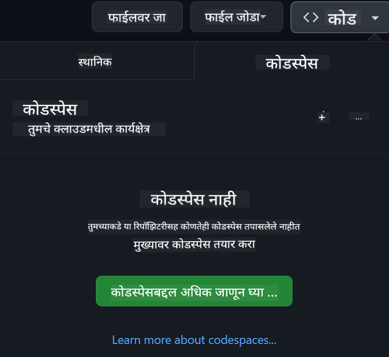

<!--
CO_OP_TRANSLATOR_METADATA:
{
  "original_hash": "fea3a0fceb8ad86fd640c09cf63a2aac",
  "translation_date": "2026-01-06T17:20:43+00:00",
  "source_file": "README.md",
  "language_code": "mr"
}
-->
[](https://github.com/microsoft/Web-Dev-For-Beginners/blob/master/LICENSE)
[](https://GitHub.com/microsoft/Web-Dev-For-Beginners/graphs/contributors/)
[](https://GitHub.com/microsoft/Web-Dev-For-Beginners/issues/)
[](https://GitHub.com/microsoft/Web-Dev-For-Beginners/pulls/)
[](http://makeapullrequest.com)

[](https://GitHub.com/microsoft/Web-Dev-For-Beginners/watchers/)
[](https://GitHub.com/microsoft/Web-Dev-For-Beginners/network/)
[](https://GitHub.com/microsoft/Web-Dev-For-Beginners/stargazers/)

[](https://discord.gg/nTYy5BXMWG)

# नवशिक्यांसाठी वेब विकास - एक अभ्यासक्रम

Microsoft Cloud Advocates द्वारा दिलेल्या 12 आठवड्यांच्या व्यापक अभ्यासक्रमासह वेब विकासाच्या मूलतत्त्वांना शिका. 24 धड्यांपैकी प्रत्येक धडा JavaScript, CSS, आणि HTML या विषयात काम करताना टेरारियम, ब्राउझर विस्तार, आणि अंतराळातील खेळांसारख्या प्रकल्पांद्वारे सखोल समज विकसित करतो. क्विझ, चर्चासत्र, आणि व्यावहारिक कार्यांसह सहभागी व्हा. आपल्या कौशल्यांना वाढवा आणि आमच्या प्रभावी प्रकल्प-आधारित शिक्षण पद्धतीने आपले ज्ञान टिकवून ठेवा. आजच आपल्या कोडिंग प्रवासास प्रारंभ करा!

Azure AI Foundry Discord समुदायात सामील व्हा

[](https://discord.gg/nTYy5BXMWG)

या स्रोतांचा वापर करण्यासाठी खालील चरणांचे पालन करा:
1. **रिपॉझिटरी फोर्क करा**: क्लिक करा [](https://GitHub.com/microsoft/Web-Dev-For-Beginners/fork)
2. **रिपॉझिटरी क्लोन करा**:   `git clone https://github.com/microsoft/Web-Dev-For-Beginners.git`
3. [**Azure AI Foundry Discord मध्ये सामील व्हा आणि तज्ञ व सहकारी विकसकांशी भेटा**](https://discord.com/invite/ByRwuEEgH4)

### 🌐 बहुभाषिक समर्थन

#### GitHub Action द्वारे समर्थित (स्वयंचलित आणि नेहमी अद्ययावत)

<!-- CO-OP TRANSLATOR LANGUAGES TABLE START -->
[Arabic](../ar/README.md) | [Bengali](../bn/README.md) | [Bulgarian](../bg/README.md) | [Burmese (Myanmar)](../my/README.md) | [Chinese (Simplified)](../zh/README.md) | [Chinese (Traditional, Hong Kong)](../hk/README.md) | [Chinese (Traditional, Macau)](../mo/README.md) | [Chinese (Traditional, Taiwan)](../tw/README.md) | [Croatian](../hr/README.md) | [Czech](../cs/README.md) | [Danish](../da/README.md) | [Dutch](../nl/README.md) | [Estonian](../et/README.md) | [Finnish](../fi/README.md) | [French](../fr/README.md) | [German](../de/README.md) | [Greek](../el/README.md) | [Hebrew](../he/README.md) | [Hindi](../hi/README.md) | [Hungarian](../hu/README.md) | [Indonesian](../id/README.md) | [Italian](../it/README.md) | [Japanese](../ja/README.md) | [Kannada](../kn/README.md) | [Korean](../ko/README.md) | [Lithuanian](../lt/README.md) | [Malay](../ms/README.md) | [Malayalam](../ml/README.md) | [Marathi](./README.md) | [Nepali](../ne/README.md) | [Nigerian Pidgin](../pcm/README.md) | [Norwegian](../no/README.md) | [Persian (Farsi)](../fa/README.md) | [Polish](../pl/README.md) | [Portuguese (Brazil)](../br/README.md) | [Portuguese (Portugal)](../pt/README.md) | [Punjabi (Gurmukhi)](../pa/README.md) | [Romanian](../ro/README.md) | [Russian](../ru/README.md) | [Serbian (Cyrillic)](../sr/README.md) | [Slovak](../sk/README.md) | [Slovenian](../sl/README.md) | [Spanish](../es/README.md) | [Swahili](../sw/README.md) | [Swedish](../sv/README.md) | [Tagalog (Filipino)](../tl/README.md) | [Tamil](../ta/README.md) | [Telugu](../te/README.md) | [Thai](../th/README.md) | [Turkish](../tr/README.md) | [Ukrainian](../uk/README.md) | [Urdu](../ur/README.md) | [Vietnamese](../vi/README.md)

> **स्थानिकरित्या क्लोन करणे प्राधान्य द्यायचे आहे का?**

> या रिपॉझिटरीमध्ये 50+ भाषांमध्ये भाषांतर समाविष्ट आहे ज्यामुळे डाउनलोड आकार लक्षणीय वाढतो. भाषांतरांशिवाय क्लोन करण्यासाठी, sparse checkout वापरा:
> ```bash
> git clone --filter=blob:none --sparse https://github.com/microsoft/Web-Dev-For-Beginners.git
> cd Web-Dev-For-Beginners
> git sparse-checkout set --no-cone '/*' '!translations' '!translated_images'
> ```
> यामुळे आपल्याला कोर्स पूर्ण करण्यासाठी आवश्यक असलेले सर्व काही खूप वेगाने डाउनलोड होईल.
<!-- CO-OP TRANSLATOR LANGUAGES TABLE END -->

**आपल्याला अतिरिक्त भाषांमध्ये समर्थन हव असल्यास येथे यादी दिली आहे [here](https://github.com/Azure/co-op-translator/blob/main/getting_started/supported-languages.md)**

[](https://open.vscode.dev/microsoft/Web-Dev-For-Beginners)

#### 🧑‍🎓 _तुम्ही विद्यार्थी आहात?_

[**Student Hub page**](https://docs.microsoft.com/learn/student-hub/?WT.mc_id=academic-77807-sagibbon) भेट द्या जिथे तुम्हाला नवशिक्यांसाठी संसाधने, विद्यार्थी पॅक्स आणि अगदी मोफत प्रमाणपत्र व्हाउचर मिळण्याचे मार्ग मिळतील. प्रत्येक महिन्याला आम्ही मजकूर बदलतो त्यामुळे ही पृष्ठे बुकमार्क करा आणि वेळोवेळी पाहत रहा.

### 📣 घोषणा - नवीन GitHub Copilot Agent मोड आव्हाने पूर्ण करा!

नवीन आव्हान जोडले गेले आहे, बहुतेक प्रकरणांमध्ये "GitHub Copilot Agent Challenge 🚀" शोधा. हे GitHub Copilot आणि Agent मोड वापरून पूर्ण करण्यासाठी नवे आव्हान आहे. जर तुम्ही Agent मोड आधी वापरले नसेल तर तो केवळ मजकूर तयार करणार नाही तर फायली तयार आणि संपादित करू शकतो, आज्ञा चालवू शकतो आणि बरेच काही करू शकतो.

### 📣 घोषणा - जनरेटिव्ह AI वापरून नवे प्रकल्प तयार करा 

नवीन AI सहाय्यक प्रकल्प नुकताच जोडला गेला आहे, पाहण्यासाठी [project](./9-chat-project/README.md) 

### 📣 घोषणा - जावास्क्रिप्टसाठी जनरेटिव्ह AI वर नवीन अभ्यासक्रम नुकताच जारी

आमचा नवीन जनरेटिव्ह AI अभ्यासक्रम चुकवू नका!

प्रारंभ करण्यासाठी भेट द्या [https://aka.ms/genai-js-course](https://aka.ms/genai-js-course)!


- मुलभूत पासून RAG पर्यंत सगळ्या गोष्टींचा समावेश असलेले धडे.
- GenAI आणि आमच्या साथीदार अॅपसह ऐतिहासिक पात्रांशी संवाद साधा.
- मजेशीर आणि आकर्षक कथाकथन, तुम्ही काळ प्रवास करता!


प्रत्येक धड्यांत पूर्ण करण्यासाठी एक असाइनमेंट, ज्ञान तपासणी आणि आव्हान असते ज्यामुळे आपण पुढील विषय शिकता:
- प्रॉम्प्टिंग आणि प्रॉम्प्ट अभियांत्रिकी
- मजकूर आणि प्रतिमा अॅप निर्मिती
- शोध अनुप्रयोग

प्रारंभ करण्यासाठी भेट द्या [https://aka.ms/genai-js-course](../../[https:/aka.ms/genai-js-course)!


## 🌱 प्रारंभ कसा करावा

> **शिक्षक**, आम्ही या अभ्यासक्रमाचा वापर कसा करावा याबाबत काही सूचना [समाविष्ट केल्या आहेत](for-teachers.md). कृपया आमच्या [चर्चा फोरममध्ये](https://github.com/microsoft/Web-Dev-For-Beginners/discussions/categories/teacher-corner) आपले मत द्या!

**[शिकणारे](https://aka.ms/student-page/?WT.mc_id=academic-77807-sagibbon)**, प्रत्येक धड्यापूर्वी प्री-लेक्चर क्विझ घेऊन सुरू करा आणि नंतर व्याख्यान सामग्री वाचा, विविध क्रियाकलाप पूर्ण करा आणि पोस्ट-लेक्चर क्विझद्वारे तुमची समज तपासा.

आपल्या शिकण्याचा अनुभव सुधारण्यासाठी, सहकारी प्रकल्पांवर काम करण्यासाठी तुमच्या सहपाठींशी कनेक्ट व्हा! चर्चांना प्रोत्साहन दिले आहे आमच्या [चर्चा फोरम](https://github.com/microsoft/Web-Dev-For-Beginners/discussions) मध्ये जिथे आमचा मॉडरेटर संघ तुमचे प्रश्न उत्तर देण्यासाठी उपलब्ध आहे.

आपली शिक्षण वाढविण्यासाठी, आम्ही [Microsoft Learn](https://learn.microsoft.com/users/wirelesslife/collections/p1ddcy5jwy0jkm?WT.mc_id=academic-77807-sagibbon) मध्ये अतिरिक्त अभ्यास साहित्य अन्वेषण करण्याची शिफारस करतो.

### 📋 आपले पर्यावरण सेट करणे

हा अभ्यासक्रम विकास पर्यावरणासह तयार आहे! सुरुवात करताना, तुम्ही अभ्यासक्रम [Codespace](https://github.com/features/codespaces/) (_एक ब्राउझर-आधारित, कोणतीही इंस्टॉलेशन न लागणारे वातावरण_) मध्ये चालवू शकता, किंवा स्थानिक तुमच्या संगणकावर [Visual Studio Code](https://code.visualstudio.com/?WT.mc_id=academic-77807-sagibbon) सारखा टेक्स्ट एडिटर वापरू शकता.

#### आपला रिपॉझिटरी तयार करा
आपले काम सहज जतन करण्यासाठी, आपली स्वतःची या रिपॉझिटरीची प्रत तयार करणे शिफारस आहे. हे करण्यासाठी पानाच्या वरच्या भागातील **Use this template** बटणावर क्लिक करा. यामुळे आपल्या GitHub खात्यात अभ्यासक्रमाची प्रत असलेली नवीन रिपॉझिटरी तयार होईल.

हे पायऱ्या फॉलो करा:
1. **रिपॉझिटरी फोर्क करा**: या पानाच्या वरच्या-उजव्या बाजूला "Fork" बटणावर क्लिक करा.
2. **रिपॉझिटरी क्लोन करा**:   `git clone https://github.com/microsoft/Web-Dev-For-Beginners.git`

#### Codespace मध्ये अभ्यासक्रम चालवा

तुमच्या तयार केलेल्या या रिपॉझिटरीच्या प्रतिप्रत मध्ये **Code** बटणावर क्लिक करा आणि **Open with Codespaces** निवडा. यामुळे तुम्हाला कार्य करण्यासाठी नवीन Codespace तयार होईल.



#### आपल्याक computer वर स्थानिकरित्या अभ्यासक्रम चालवणे

आपल्या संगणकावर हा अभ्यासक्रम चालवण्यासाठी, तुम्हाला टेक्स्ट एडिटर, ब्राउझर आणि कमांड लाइन टूलची गरज आहे. आमचा पहिला धडा, [Introduction to Programming Languages and Tools of the Trade](../../1-getting-started-lessons/1-intro-to-programming-languages), तुम्हाला या प्रत्येकसाठी विविध पर्यायांवर मार्गदर्शन करेल ज्यामध्ये तुम्हाला योग्य असलेले निवडता येईल.

आमची शिफारस अशी आहे की तुम्ही [Visual Studio Code](https://code.visualstudio.com/?WT.mc_id=academic-77807-sagibbon) एडिटर म्हणून वापरा, ज्यामध्ये एक अंगभूत [Terminal](https://code.visualstudio.com/docs/terminal/basics/?WT.mc_id=academic-77807-sagibbon) देखील आहे. तुम्ही Visual Studio Code येथे डाउनलोड करू शकता [here](https://code.visualstudio.com/?WT.mc_id=academic-77807-sagibbon).


1. आपला रिपॉझिटरी आपल्या संगणकावर क्लोन करा. हे करण्यासाठी तुम्ही **Code** बटणावर क्लिक करून URL कॉपी करू शकता:

    [CodeSpace](./images/createcodespace.png)
    नंतर, [Visual Studio Code](https://code.visualstudio.com/?WT.mc_id=academic-77807-sagibbon) मध्ये [Terminal](https://code.visualstudio.com/docs/terminal/basics/?WT.mc_id=academic-77807-sagibbon) उघडा आणि खालील कमांड चालवा, `<your-repository-url>` च्या जागी तुम्ही नुकतीच कॉपी केलेली URL टाका:

    ```bash 
    git clone <your-repository-url>
    ```

2. Visual Studio Code मध्ये फोल्डर उघडा. तुम्ही हे **File** > **Open Folder** यावर क्लिक करून आणि तुम्ही नुकतीच क्लोन केलेला फोल्डर निवडून करू शकता.


>  शिफारस केलेले Visual Studio Code विस्तार:
>
> * [Live Server](https://marketplace.visualstudio.com/items?itemName=ritwickdey.LiveServer&WT.mc_id=academic-77807-sagibbon) - Visual Studio Code मध्ये HTML पृष्ठांचे पूर्वावलोकन करण्यासाठी
> * [Copilot](https://marketplace.visualstudio.com/items?itemName=GitHub.copilot&WT.mc_id=academic-77807-sagibbon) - कोड जलद लिहिण्यासाठी मदत करण्यासाठी

## 📂 प्रत्येक धडा यामध्ये समाविष्ट आहे:

- ऐच्छिक स्केचनोट
- ऐच्छिक पूरक व्हिडिओ
- पूर्व-धड्याचा वार्मअप क्विझ
- लिहिलेला धडा
- प्रकल्पावर आधारित धड्यांसाठी, प्रकल्प कसे बनवायचे याबाबत टप्प्याटप्प्याने मार्गदर्शन
- ज्ञान चाचण्या
- एक आव्हान
- पूरक वाचन
- असाइनमेंट
- [पोस्ट-धड्याचा क्विझ](https://ff-quizzes.netlify.app/web/)

> **क्विझ्स विषयी एक नोंद**: सर्व क्विझ्स Quiz-app फोल्डरमध्ये आहेत, 48 एकूण क्विझ्स, प्रत्येकी तीन प्रश्नांसह. ते [येथे](https://ff-quizzes.netlify.app/web/) उपलब्ध आहेत, क्विझ अॅप स्थानिकपणे चालवता येतो किंवा Azure वर तैनात करता येतो; `quiz-app` फोल्डरमध्ये दिलेल्या सूचनांचे पालन करा.

## 🗃️ धडे

|     |                       प्रकल्पाचे नाव                       |                          शिकवलेली संकल्पना                           | शिकण्याचे उद्दिष्टे                                                                                                                    |                                                         लिंक केलेला धडा                                                         |         लेखक          |
| :-: | :-------------------------------------------------------: | :------------------------------------------------------------------: | ------------------------------------------------------------------------------------------------------------------------------------ | :----------------------------------------------------------------------------------------------------------------------------: | :-------------------: |
| 01  |                      सुरुवात करणे                        |           प्रोग्रामिंगची ओळख आणि साधने                             | बहुतेक प्रोग्रामिंग भाषांच्या मूलभूत तत्त्वांची आणि व्यावसायिक विकासकांच्या कामात मदत करणाऱ्या सॉफ्टवेअर्सबद्दल शिका                | [प्रोग्रामिंग भाषांची आणि साधनांची ओळख](./1-getting-started-lessons/1-intro-to-programming-languages/README.md)                |         Jasmine       |
| 02  |                      सुरुवात करणे                        |            GitHub चे मूलभूत गोष्टी, टीमसह काम करणे                  | तुमच्या प्रकल्पात GitHub कसे वापरायचे, कोड बेसवर इतरांसोबत सहकार्य कसे करायचे                                                       |                            [GitHub ची ओळख](./1-getting-started-lessons/2-github-basics/README.md)                              |          Floor        |
| 03  |                      सुरुवात करणे                        |                          प्रवेशयोग्यता                               | वेब प्रवेशयोग्यतेचे मूलभूत तत्त्वे शिका                                                                                                |                       [प्रवेशयोग्यता मूलभूत गोष्टी](./1-getting-started-lessons/3-accessibility/README.md)                       |       Christopher     |
| 04  |                        JS मूलतत्त्वे                      |                      JavaScript डेटा प्रकार                          | JavaScript डेटा प्रकारांची मूलभूत माहिती                                                                                             |                                       [डेटा प्रकार](./2-js-basics/1-data-types/README.md)                                        |         Jasmine       |
| 05  |                        JS मूलतत्त्वे                      |                      फंक्शन्स आणि मेथड्स                             | अ‍ॅप्लिकेशनच्या लॉजिक फ्लोचे व्यवस्थापन करण्यासाठी फंक्शन्स आणि मेथड्स विषयी शिका                                                    |                              [फंक्शन्स आणि मेथड्स](./2-js-basics/2-functions-methods/README.md)                               | Jasmine आणि Christopher |
| 06  |                        JS मूलतत्त्वे                      |                          JS वापरून निर्णय घेणे                        | निर्णय घेण्याच्या पद्धती वापरून तुमच्या कोडमध्ये परिस्थिती कशी तयार करायची ते शिका                                                  |                                 [निर्णय घेणे](./2-js-basics/3-making-decisions/README.md)                                      |         Jasmine       |
| 07  |                        JS मूलतत्त्वे                      |                          अ‍ॅरे आणि लूप्स                            | JavaScript मध्ये डेटा हाताळण्यासाठी अ‍ॅरे आणि लूप्ससह काम करा                                                                        |                                   [अ‍ॅरे आणि लूप्स](./2-js-basics/4-arrays-loops/README.md)                                    |         Jasmine       |
| 08  |       [Terrarium](./3-terrarium/solution/README.md)       |                         HTML प्रत्यक्षात कसे वापरायचे                  | ऑनलाइन टेरियम तयार करण्यासाठी HTML बांधा, लेआउट तयार करण्यावर लक्ष केंद्रित करा                                                       |                                 [HTML ची ओळख](./3-terrarium/1-intro-to-html/README.md)                                        |           Jen         |
| 09  |       [Terrarium](./3-terrarium/solution/README.md)       |                          CSS प्रत्यक्षात कसे वापरायचे                 | ऑनलाइन टेरियमसाठी CSS स्टाइल करा, CSS च्या मूलभूत गोष्टींसह पान प्रतिसाद देणारे कसे बनवायचे हे शिका                                   |                                  [CSS ची ओळख](./3-terrarium/2-intro-to-css/README.md)                                        |           Jen         |
| 10  |            [Terrarium](./3-terrarium/solution/README.md)            |                JavaScript क्लोजर्स, DOM संचार                       | ड्रॅग/ड्रॉप इंटरफेस तयार करण्यासाठी JavaScript तयार करा, क्लोजर्स आणि DOM संचारावर लक्ष केंद्रित करा                                  |                  [JavaScript क्लोजर्स, DOM संचार](./3-terrarium/3-intro-to-DOM-and-closures/README.md)                           |           Jen         |
| 11  |          [टायपिंग गेम](./4-typing-game/solution/README.md)          |                          टायपिंग गेम बनवा                            | तुमच्या JavaScript अ‍ॅपचा लॉजिक चालवण्यासाठी कीबोर्ड इव्हेंट्स कसे वापरायचे ते शिका                                                  |                                [इव्हेंट-चालित प्रोग्रामिंग](./4-typing-game/typing-game/README.md)                                 |       Christopher     |
| 12  | [ग्रीन ब्राउझर विस्तार](./5-browser-extension/solution/README.md) |                         ब्राउझरशी काम करणे                            | ब्राउझर कसे काम करतात, त्यांचा इतिहास काय आहे, आणि ब्राउझर विस्ताराचे पहिले घटक कसे तयार करायचे हे शिका                            |                               [ब्राउझर विषयी](./5-browser-extension/1-about-browsers/README.md)                               |           Jen         |
| 13  | [ग्रीन ब्राउझर विस्तार](./5-browser-extension/solution/README.md) | फॉर्म तयार करणे, API कॉल करणे आणि स्थानिक साठवणीत व्हेरिएबल साठवणे | तुमच्या ब्राउझर विस्ताराचे JavaScript घटक API कॉल करण्यासाठी तयार करा, स्थानिक साठवणीत साठवलेल्या व्हेरिएबल्सचा वापर करून         |                [APIs, फॉर्म आणि स्थानिक साठवण](./5-browser-extension/2-forms-browsers-local-storage/README.md)                  |           Jen         |
| 14  | [ग्रीन ब्राउझर विस्तार](./5-browser-extension/solution/README.md) |          ब्राउझरमधील पार्श्वभूमी प्रक्रिया, वेब कार्यक्षमता         | विस्ताराच्या आयकॉनची पार्श्वभूमी प्रक्रिया वापरा; वेब कार्यक्षमता आणि काही सुधारणा याबद्दल शिका                                           |             [पार्श्वभूमी कार्ये आणि कार्यक्षमता](./5-browser-extension/3-background-tasks-and-performance/README.md)            |           Jen         |
| 15  |           [स्पेस गेम](./6-space-game/solution/README.md)           |        JavaScript सह अधिक प्रगत गेम विकास                            | इनहेरिटन्स, क्लासेस आणि कंपोजीशन तसेच Pub/Sub पॅटर्नच्या माध्यमातून शिका, गेम बनवण्याच्या तयारीसाठी                                 |                      [प्रगत गेम विकासाची ओळख](./6-space-game/1-introduction/README.md)                                         |          Chris        |
| 16  |           [स्पेस गेम](./6-space-game/solution/README.md)           |                       कॅनव्हासवर चित्र काढणे                         | स्क्रीनवर घटक काढण्यासाठी वापरले जाणारे Canvas API बद्दल शिका                                                                       |                                [कॅनव्हासवर चित्र काढणे](./6-space-game/2-drawing-to-canvas/README.md)                          |          Chris        |
| 17  |           [स्पेस गेम](./6-space-game/solution/README.md)           |                    स्क्रीनवर घटक हलविणे                              | घटकांना हालचाल मिळविण्यासाठी קर्टेसियन समन्वय आणि Canvas API कसे वापरायचे हे जाणून घ्या                                               |                           [घटक हलविणे](./6-space-game/3-moving-elements-around/README.md)                                     |          Chris        |
| 18  |           [स्पेस गेम](./6-space-game/solution/README.md)           |                     धडक नियंत्रित करणे                              | कीप्रेस वापरून घटक एकमेकांना भिडण्यास आणि प्रतिसाद देण्यास तयार करा; गेमच्या कार्यक्षमतेसाठी कूलडाउन फंक्शन पुरवा                      |                              [धडक ओळख](./6-space-game/4-collision-detection/README.md)                                         |          Chris        |
| 19  |           [स्पेस गेम](./6-space-game/solution/README.md)           |                         स्कोअर ठेवणे                                 | गेमच्या स्थिती आणि कार्यक्षमतेवर आधारित गणिते करा                                                                                   |                                    [स्कोअर ठेवणे](./6-space-game/5-keeping-score/README.md)                                      |          Chris        |
| 20  |           [स्पेस गेम](./6-space-game/solution/README.md)           |                     गेम समाप्त करणे आणि पुनरारंभ करणे                | गेम समाप्ती आणि पुनरारंभ कसे करायचे, मालमत्ता साफसफाई आणि व्हेरिएबल मूल्ये रीसेट करणे शिका                                            |                                [समाप्ती अटी](./6-space-game/6-end-condition/README.md)                                         |          Chris        |
| 21  |         [बँकिंग अॅप](./7-bank-project/solution/README.md)          |             वेब अॅपमध्ये HTML टेम्पलेट्स आणि मार्ग                   | मार्गदर्शक आणि HTML टेम्पलेट्स वापरून बहुपृष्ठ वेबसाइटची संरचना तयार करणे शिका                                                     |                            [HTML टेम्पलेट्स आणि मार्ग](./7-bank-project/1-template-route/README.md)                            |          Yohan        |
| 22  |         [बँकिंग अॅप](./7-bank-project/solution/README.md)          |               लॉगिन आणि नोंदणी फॉर्म तयार करणे                       | फॉर्म तयार करणे आणि वैधता तपासणीच्या पद्धतींबद्दल शिका                                                                              |                                           [फॉर्म्स](./7-bank-project/2-forms/README.md)                                      |          Yohan        |
| 23  |         [बँकिंग अॅप](./7-bank-project/solution/README.md)          |                   डेटा प्राप्त करण्याच्या आणि वापरण्याच्या पद्धती   | अ‍ॅपमध्ये डेटा कसा वाहतो, तो कसा आणायचा, साठवायचा आणि निरुपयोगी कसा करायचा हे शिका                                                  |                                            [डेटा](./7-bank-project/3-data/README.md)                                           |          Yohan        |
| 24  |         [बँकिंग अॅप](./7-bank-project/solution/README.md)          |                      राज्य व्यवस्थापनाची संकल्पना                    | तुमच्या अॅपमध्ये राज्य कसा राखला जातो आणि त्याचे प्रोग्रामिंगद्वारे व्यवस्थापन कसे करायचे                                          |                                [राज्य व्यवस्थापन](./7-bank-project/4-state-management/README.md)                                |          Yohan        |
| 25 | [ब्राउझर/VScode कोड](../../8-code-editor) | VScode शी काम करणे | कोड संपादक कसा वापरायचा शिका | [VScode कोड संपादक वापरा](./8-code-editor/1-using-a-code-editor/README.md) | Chris |
| 26 | [AI सहाय्यक](./9-chat-project/README.md) | AI सह काम करणे | तुमचा स्वतःचा AI सहाय्यक कसा तयार करायचा शिका | [AI सहाय्यक प्रकल्प](./9-chat-project/README.md) | Chris |

## 🏫 शिक्षणशास्त्र

आमचे अभ्यासक्रम दोन मुख्य शैक्षणिक तत्त्वांना अनुसरून तयार केला आहे:
* प्रकल्प-आधारित शिक्षण
* वारंवार क्विझ्स

हा कार्यक्रम JavaScript, HTML, आणि CSS च्या मूलभूत गोष्टी तसेच आजच्या वेब विकासकांनी वापरलेले नवीनतम साधने आणि तंत्र शिकवतो. विद्यार्थ्यांना टायपिंग गेम, व्हर्चुअल टेरियम, पर्यावरणपूरक ब्राउझर विस्तार, स्पेस-इन्व्हेडर शैलीचा गेम आणि व्यवसायांसाठी बँकिंग अॅप तयार करून प्रत्यक्ष अनुभव घेण्याची संधी मिळेल. मालिकेच्या शेवटी, विद्यार्थ्यांना वेब विकासाचा ठोस समज प्राप्त होतो.

> 🎓 तुम्ही या अभ्यासक्रमातील पहिले काही धडे Microsoft Learn वर [Learn Path](https://docs.microsoft.com/learn/paths/web-development-101/?WT.mc_id=academic-77807-sagibbon) म्हणून घेऊ शकता!

प्रकल्पांशी सामग्री सुसंगत असल्यामुळे, विद्यार्थ्यांसाठी प्रक्रिया अधिक आकर्षक होते आणि संकल्पनांची जपणूक वाढेल. आम्ही JavaScript मूलतत्त्वांमध्ये अनेक प्रारंभिक धडे लिहिले आहेत जे संकल्पना ओळख करून देतात, एका व्हिडिओसह "[Beginners Series to: JavaScript](https://channel9.msdn.com/Series/Beginners-Series-to-JavaScript/?WT.mc_id=academic-77807-sagibbon)" ह्या व्हिडिओ ट्युटोरियल्स मालिकेतील, ज्यातील काही लेखकांनी या अभ्यासक्रमात योगदान दिले आहे.

शिवाय, वर्गापूर्वीचा कमी-दबावाचा क्विझ विद्यार्थ्यांच्या शिकलोण्यास तयारी दाखवतो, तर वर्गानंतरचा दुसरा क्विझ अधिक चांगली जपणूक सुनिश्चित करतो. हा अभ्यासक्रम लवचिक आणि मनोरंजक असे बनवला आहे आणि पूर्ण किंवा अंशतः गृहीत धरून घेतला जाऊ शकतो. प्रकल्प आधी लहान असतात आणि 12 आठवड्यांच्या चक्राच्या शेवटी जास्त क्लिष्ट होतात.

तपासणीसाठी, JavaScript फ्रेमवर्क्सचा परीचय देणे टाळण्यात आले आहे, जेणेकरून वेब विकासक म्हणून मूलभूत कौशल्ये आधी विकसित केली जावीत; हा अभ्यासक्रम पूर्ण करण्याचा चांगला पुढचा टप्पा म्हणजे Node.js विषयी शिकणे, दुसऱ्या व्हिडिओ संग्रहाद्वारे: "[Beginner Series to: Node.js](https://channel9.msdn.com/Series/Beginners-Series-to-Nodejs/?WT.mc_id=academic-77807-sagibbon)".

> आमच्या [आचारसंहिते](CODE_OF_CONDUCT.md) आणि [योगदान](CONTRIBUTING.md) मार्गदर्शकांचे दर्शन घ्या. आम्ही तुमच्या रचनात्मक अभिप्रायाचे स्वागत करतो!

## 🧭 ऑफलाइन प्रवेश

[Docsify](https://docsify.js.org/#/) वापरून तुम्ही हा दस्तऐवज ऑफलाइन चालवू शकता. हा रेपो फोर्क करा, तुमच्या स्थानिक मशीनवर [Docsify इंस्टॉल](https://docsify.js.org/#/quickstart) करा, आणि मग या रेपोजच्या मुळ फोल्डरमध्ये `docsify serve` टाइप करा. वेबसाइट पोर्ट 3000 वर तुमच्या लोकलहोस्टवर सर्व्ह केली जाईल: `localhost:3000`.

## 📘 PDF

सर्व धड्यांचा PDF [येथे](https://microsoft.github.io/Web-Dev-For-Beginners/pdf/readme.pdf) उपलब्ध आहे.


## 🎒 अन्य कोर्सेस
आमच्या टीमकडून आणखी कोर्सेस तयार केले जातात! पहा:

<!-- CO-OP TRANSLATOR OTHER COURSES START -->
### LangChain
[](https://aka.ms/langchain4j-for-beginners)
[](https://aka.ms/langchainjs-for-beginners?WT.mc_id=m365-94501-dwahlin)

---

### Azure / Edge / MCP / Agents
[](https://github.com/microsoft/AZD-for-beginners?WT.mc_id=academic-105485-koreyst)
[](https://github.com/microsoft/edgeai-for-beginners?WT.mc_id=academic-105485-koreyst)
[](https://github.com/microsoft/mcp-for-beginners?WT.mc_id=academic-105485-koreyst)
[](https://github.com/microsoft/ai-agents-for-beginners?WT.mc_id=academic-105485-koreyst)

---
 
### Generative AI Series
[](https://github.com/microsoft/generative-ai-for-beginners?WT.mc_id=academic-105485-koreyst)
[-9333EA?style=for-the-badge&labelColor=E5E7EB&color=9333EA)](https://github.com/microsoft/Generative-AI-for-beginners-dotnet?WT.mc_id=academic-105485-koreyst)
[-C084FC?style=for-the-badge&labelColor=E5E7EB&color=C084FC)](https://github.com/microsoft/generative-ai-for-beginners-java?WT.mc_id=academic-105485-koreyst)
[-E879F9?style=for-the-badge&labelColor=E5E7EB&color=E879F9)](https://github.com/microsoft/generative-ai-with-javascript?WT.mc_id=academic-105485-koreyst)

---
 
### Core Learning
[](https://aka.ms/ml-beginners?WT.mc_id=academic-105485-koreyst)
[](https://aka.ms/datascience-beginners?WT.mc_id=academic-105485-koreyst)
[](https://aka.ms/ai-beginners?WT.mc_id=academic-105485-koreyst)
[](https://github.com/microsoft/Security-101?WT.mc_id=academic-96948-sayoung)
[](https://aka.ms/webdev-beginners?WT.mc_id=academic-105485-koreyst)
[](https://aka.ms/iot-beginners?WT.mc_id=academic-105485-koreyst)
[](https://github.com/microsoft/xr-development-for-beginners?WT.mc_id=academic-105485-koreyst)

---
 
### Copilot Series
[](https://aka.ms/GitHubCopilotAI?WT.mc_id=academic-105485-koreyst)
[](https://github.com/microsoft/mastering-github-copilot-for-dotnet-csharp-developers?WT.mc_id=academic-105485-koreyst)
[](https://github.com/microsoft/CopilotAdventures?WT.mc_id=academic-105485-koreyst)
<!-- CO-OP TRANSLATOR OTHER COURSES END -->

## मदत मिळवा

जर तुम्हाला अडचण आली किंवा AI अॅप तयार करताना काही प्रश्न असतील, तर MCP संदर्भातील चर्चा करण्यासाठी सहकारी शिकणारे आणि अनुभवी विकासकांमध्ये सामील व्हा. हे एक समर्थन करणारे समुदाय आहे जिथे प्रश्नांना स्वागत आहे आणि ज्ञान मोकळेपणाने सामायिक केले जाते.

[](https://discord.gg/nTYy5BXMWG)

जर तुम्हाला उत्पादनाबाबत अभिप्राय किंवा तयार करताना चुका असतील तर भेट द्या:

[](https://aka.ms/foundry/forum)

## परवाना

ही संचिका MIT परवान्याखाली परवानगी दिलेली आहे. अधिक माहितीसाठी [LICENSE](../../LICENSE) फाइल पहा.

---

<!-- CO-OP TRANSLATOR DISCLAIMER START -->
**अस्वीकरण**:  
हा दस्तऐवज AI अनुवाद सेवा [Co-op Translator](https://github.com/Azure/co-op-translator) चा वापर करून अनुवादित केला आहे. आम्ही अचूकतेसाठी प्रयत्न करतो, तरी कृपया लक्षात ठेवा की स्वयंचलित अनुवादांमध्ये चुका किंवा अचूकतेचा अभाव असू शकतो. मूळ दस्तऐवज त्याच्या नैसर्गिक भाषेत अधिकृत स्रोत मानला पाहिजे. महत्वाच्या माहितीच्या बाबतीत व्यावसायिक मानवी अनुवाद शिफारसीय आहे. या अनुवादाच्या वापरामुळे उद्भवणाऱ्या कोणत्याही गैरसमजुतीसाठी किंवा चुका हेसाठी आम्ही जबाबदार नाही.
<!-- CO-OP TRANSLATOR DISCLAIMER END -->