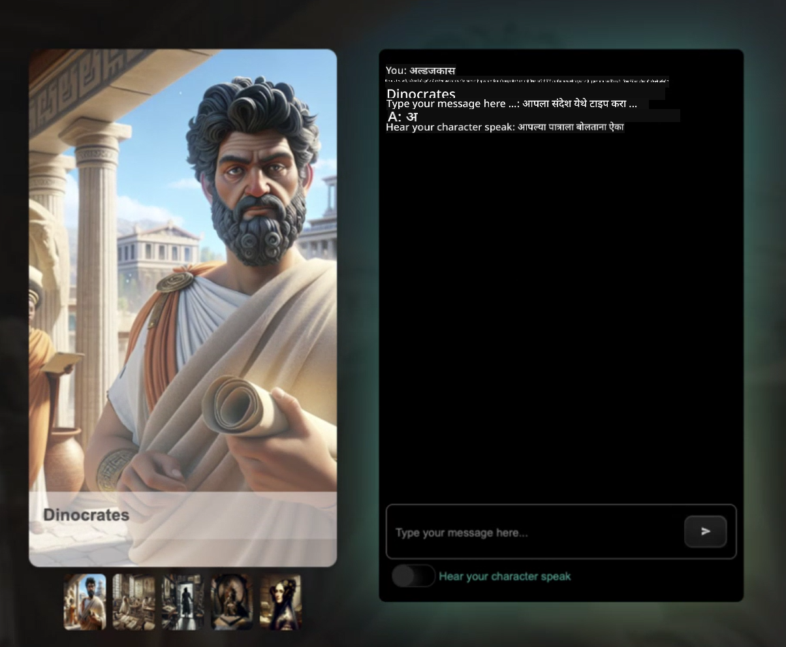

<!--
CO_OP_TRANSLATOR_METADATA:
{
  "original_hash": "63e29f5a308b533df9d70336bbb2e2b8",
  "translation_date": "2025-11-25T11:58:43+00:00",
  "source_file": "README.md",
  "language_code": "mr"
}
-->
[](https://github.com/microsoft/Web-Dev-For-Beginners/blob/master/LICENSE)
[](https://GitHub.com/microsoft/Web-Dev-For-Beginners/graphs/contributors/)
[](https://GitHub.com/microsoft/Web-Dev-For-Beginners/issues/)
[](https://GitHub.com/microsoft/Web-Dev-For-Beginners/pulls/)
[](http://makeapullrequest.com)

[](https://GitHub.com/microsoft/Web-Dev-For-Beginners/watchers/)
[](https://GitHub.com/microsoft/Web-Dev-For-Beginners/network/)
[](https://GitHub.com/microsoft/Web-Dev-For-Beginners/stargazers/)

[](https://discord.gg/nTYy5BXMWG)

# नवशिक्यांसाठी वेब विकास - अभ्यासक्रम

मायक्रोसॉफ्ट क्लाउड अॅडव्होकेट्सद्वारे तयार केलेल्या 12 आठवड्यांच्या व्यापक कोर्ससह वेब विकासाची मूलभूत तत्त्वे शिका. प्रत्येक 24 धड्यांमध्ये जावास्क्रिप्ट, CSS आणि HTML यावर प्रकल्पांद्वारे सखोल चर्चा केली जाते, जसे की टेरॅरियम्स, ब्राउझर एक्सटेंशन्स आणि स्पेस गेम्स. क्विझ, चर्चा आणि व्यावहारिक असाइनमेंट्ससह सहभाग घ्या. प्रकल्प-आधारित शिक्षण पद्धतीसह तुमचे कौशल्य वाढवा आणि ज्ञान टिकवून ठेवा. आजच तुमचा कोडिंग प्रवास सुरू करा!

Azure AI Foundry Discord समुदायामध्ये सामील व्हा

[](https://discord.gg/nTYy5BXMWG)

या संसाधनांचा वापर सुरू करण्यासाठी खालील चरणांचे अनुसरण करा:
1. **रेपॉझिटरी फोर्क करा**: क्लिक करा [](https://GitHub.com/microsoft/Web-Dev-For-Beginners/fork)
2. **रेपॉझिटरी क्लोन करा**:   `git clone https://github.com/microsoft/Web-Dev-For-Beginners.git`
3. [**Azure AI Foundry Discord मध्ये सामील व्हा आणि तज्ञ व इतर विकसकांशी भेटा**](https://discord.com/invite/ByRwuEEgH4)

### 🌐 बहुभाषिक समर्थन

#### GitHub Action द्वारे समर्थित (स्वयंचलित आणि नेहमी अद्ययावत)

<!-- CO-OP TRANSLATOR LANGUAGES TABLE START -->
[अरबी](../ar/README.md) | [बंगाली](../bn/README.md) | [बल्गेरियन](../bg/README.md) | [बर्मी (म्यानमार)](../my/README.md) | [चिनी (सरलीकृत)](../zh/README.md) | [चिनी (पारंपरिक, हाँगकाँग)](../hk/README.md) | [चिनी (पारंपरिक, मकाऊ)](../mo/README.md) | [चिनी (पारंपरिक, तैवान)](../tw/README.md) | [क्रोएशियन](../hr/README.md) | [झेक](../cs/README.md) | [डॅनिश](../da/README.md) | [डच](../nl/README.md) | [एस्टोनियन](../et/README.md) | [फिनिश](../fi/README.md) | [फ्रेंच](../fr/README.md) | [जर्मन](../de/README.md) | [ग्रीक](../el/README.md) | [हिब्रू](../he/README.md) | [हिंदी](../hi/README.md) | [हंगेरियन](../hu/README.md) | [इंडोनेशियन](../id/README.md) | [इटालियन](../it/README.md) | [जपानी](../ja/README.md) | [कोरियन](../ko/README.md) | [लिथुआनियन](../lt/README.md) | [मलय](../ms/README.md) | [मराठी](./README.md) | [नेपाळी](../ne/README.md) | [नॉर्वेजियन](../no/README.md) | [पर्शियन (फारसी)](../fa/README.md) | [पोलिश](../pl/README.md) | [पोर्तुगीज (ब्राझील)](../br/README.md) | [पोर्तुगीज (पोर्तुगाल)](../pt/README.md) | [पंजाबी (गुरुमुखी)](../pa/README.md) | [रोमानियन](../ro/README.md) | [रशियन](../ru/README.md) | [सर्बियन (सिरिलिक)](../sr/README.md) | [स्लोव्हाक](../sk/README.md) | [स्लोव्हेनियन](../sl/README.md) | [स्पॅनिश](../es/README.md) | [स्वाहिली](../sw/README.md) | [स्वीडिश](../sv/README.md) | [टागालोग (फिलिपिनो)](../tl/README.md) | [तमिळ](../ta/README.md) | [थाई](../th/README.md) | [तुर्की](../tr/README.md) | [युक्रेनियन](../uk/README.md) | [उर्दू](../ur/README.md) | [व्हिएतनामी](../vi/README.md)
<!-- CO-OP TRANSLATOR LANGUAGES TABLE END -->

**जर तुम्हाला अतिरिक्त भाषांमध्ये भाषांतर हवे असेल तर समर्थित भाषांची यादी [येथे](https://github.com/Azure/co-op-translator/blob/main/getting_started/supported-languages.md) आहे**

[](https://open.vscode.dev/microsoft/Web-Dev-For-Beginners)

#### 🧑‍🎓 _तुम्ही विद्यार्थी आहात का?_

[**Student Hub पृष्ठाला**](https://docs.microsoft.com/learn/student-hub/?WT.mc_id=academic-77807-sagibbon) भेट द्या जिथे तुम्हाला नवशिक्या संसाधने, विद्यार्थी पॅक्स आणि अगदी मोफत प्रमाणपत्र व्हाउचर मिळवण्याचे मार्ग सापडतील. हे पृष्ठ बुकमार्क करा आणि वेळोवेळी तपासा कारण आम्ही दरमहा सामग्री बदलतो.

### 📣 घोषणा - GitHub Copilot Agent मोड आव्हाने पूर्ण करण्यासाठी नवीन!

नवीन आव्हान जोडले गेले आहे, "GitHub Copilot Agent Challenge 🚀" बहुतेक अध्यायांमध्ये शोधा. हे GitHub Copilot आणि Agent मोड वापरून पूर्ण करण्यासाठी एक नवीन आव्हान आहे. जर तुम्ही Agent मोड वापरला नसेल तर तो केवळ मजकूर तयार करण्यास सक्षम नाही तर फाइल्स तयार आणि संपादित करू शकतो, आदेश चालवू शकतो आणि बरेच काही करू शकतो.

### 📣 घोषणा - _Generative AI वापरून तयार करण्यासाठी नवीन प्रकल्प_

नवीन AI सहाय्यक प्रकल्प नुकताच जोडला गेला आहे, तपासा [प्रकल्प](./09-chat-project/README.md)

### 📣 घोषणा - _नवीन अभ्यासक्रम_ JavaScript साठी Generative AI वर नुकताच प्रसिद्ध झाला

आमचा नवीन Generative AI अभ्यासक्रम चुकवू नका!

[https://aka.ms/genai-js-course](https://aka.ms/genai-js-course) ला भेट द्या आणि सुरुवात करा!


- मूलभूत गोष्टींपासून RAG पर्यंत सर्वकाही कव्हर करणारे धडे.
- GenAI आणि आमच्या साथीदार अॅपचा वापर करून ऐतिहासिक पात्रांशी संवाद साधा.
- मजेदार आणि आकर्षक कथा, तुम्ही वेळ प्रवास कराल!



प्रत्येक धड्यात पूर्ण करण्यासाठी असाइनमेंट, ज्ञान तपासणी आणि आव्हान समाविष्ट आहे जे तुम्हाला खालील विषय शिकण्यासाठी मार्गदर्शन करेल:
- प्रॉम्प्टिंग आणि प्रॉम्प्ट इंजिनिअरिंग
- मजकूर आणि प्रतिमा अॅप निर्मिती
- शोध अॅप्स

[https://aka.ms/genai-js-course](https://aka.ms/genai-js-course) ला भेट द्या आणि सुरुवात करा!


## 🌱 सुरुवात करणे

> **शिक्षक**, आम्ही [काही सूचना समाविष्ट केल्या आहेत](for-teachers.md) की हा अभ्यासक्रम कसा वापरायचा. आम्हाला तुमचे अभिप्राय [आमच्या चर्चा मंचावर](https://github.com/microsoft/Web-Dev-For-Beginners/discussions/categories/teacher-corner) आवडेल!

**[शिकणारे](https://aka.ms/student-page/?WT.mc_id=academic-77807-sagibbon)**, प्रत्येक धड्यासाठी, प्री-लेक्चर क्विझसह प्रारंभ करा आणि लेक्चर सामग्री वाचून, विविध क्रियाकलाप पूर्ण करून आणि पोस्ट-लेक्चर क्विझसह तुमची समज तपासून पुढे जा.

तुमचा शिक्षण अनुभव वाढवण्यासाठी, तुमच्या सहकाऱ्यांशी कनेक्ट व्हा आणि प्रकल्पांवर एकत्र काम करा! आमच्या [चर्चा मंचावर](https://github.com/microsoft/Web-Dev-For-Beginners/discussions) चर्चा प्रोत्साहित केल्या जातात जिथे आमचे मॉडरेटर तुमच्या प्रश्नांची उत्तरे देण्यासाठी उपलब्ध असतील.

तुमचे शिक्षण पुढे नेण्यासाठी, आम्ही [Microsoft Learn](https://learn.microsoft.com/users/wirelesslife/collections/p1ddcy5jwy0jkm?WT.mc_id=academic-77807-sagibbon) एक्सप्लोर करण्याची जोरदार शिफारस करतो जेथे अतिरिक्त अभ्यास सामग्री उपलब्ध आहे.

### 📋 तुमचे वातावरण सेट करणे

या अभ्यासक्रमासाठी विकास वातावरण तयार आहे! तुम्ही सुरुवात करत असताना तुम्ही [Codespace](https://github.com/features/codespaces/) (_ब्राउझर-आधारित, कोणत्याही इंस्टॉलची गरज नसलेले वातावरण_) मध्ये किंवा तुमच्या संगणकावर स्थानिकपणे [Visual Studio Code](https://code.visualstudio.com/?WT.mc_id=academic-77807-sagibbon) सारख्या टेक्स्ट एडिटरचा वापर करून चालवू शकता.

#### तुमची रेपॉझिटरी तयार करा
तुमचे काम सहजपणे सेव्ह करण्यासाठी, तुमच्या GitHub खात्यात या रेपॉझिटरीची स्वतःची प्रत तयार करणे शिफारसीय आहे. तुम्ही पृष्ठाच्या शीर्षस्थानी **Use this template** बटणावर क्लिक करून हे करू शकता. यामुळे तुमच्या GitHub खात्यात अभ्यासक्रमाची प्रत असलेली नवीन रेपॉझिटरी तयार होईल.

या चरणांचे अनुसरण करा:
1. **रेपॉझिटरी फोर्क करा**: या पृष्ठाच्या वरच्या उजव्या कोपऱ्यात "Fork" बटणावर क्लिक करा.
2. **रेपॉझिटरी क्लोन करा**:   `git clone https://github.com/microsoft/Web-Dev-For-Beginners.git`

#### Codespace मध्ये अभ्यासक्रम चालवणे

तुमच्या तयार केलेल्या रेपॉझिटरीच्या प्रतामध्ये, **Code** बटणावर क्लिक करा आणि **Open with Codespaces** निवडा. यामुळे तुमच्यासाठी काम करण्यासाठी नवीन Codespace तयार होईल.


#### तुमच्या संगणकावर स्थानिकपणे अभ्यासक्रम चालवणे

तुमच्या संगणकावर स्थानिकपणे हा अभ्यासक्रम चालवण्यासाठी, तुम्हाला टेक्स्ट एडिटर, ब्राउझर आणि कमांड लाइन टूलची आवश्यकता असेल. आमचा पहिला धडा, [प्रोग्रामिंग भाषांची ओळख आणि व्यापाराचे साधने](../../1-getting-started-lessons/1-intro-to-programming-languages), तुम्हाला या साधनांसाठी विविध पर्यायांमधून मार्गदर्शन करेल जे तुम्हाला सर्वात चांगले वाटते ते निवडण्यासाठी.

आमची शिफारस आहे की तुम्ही [Visual Studio Code](https://code.visualstudio.com/?WT.mc_id=academic-77807-sagibbon) एडिटर म्हणून वापरा, ज्यामध्ये [Terminal](https://code.visualstudio.com/docs/terminal/basics/?WT.mc_id=academic-77807-sagibbon) देखील समाविष्ट आहे. तुम्ही [इथे](https://code.visualstudio.com/?WT.mc_id=academic-77807-sagibbon) Visual Studio Code डाउनलोड करू शकता.

1. तुमची रेपॉझिटरी तुमच्या संगणकावर क्लोन करा. तुम्ही **Code** बटणावर क्लिक करून आणि URL कॉपी करून हे करू शकता:

    [CodeSpace](./images/createcodespace.png)

    नंतर, [Visual Studio Code](https://code.visualstudio.com/?WT.mc_id=academic-77807-sagibbon) मध्ये [Terminal](https://code.visualstudio.com/docs/terminal/basics/?WT.mc_id=academic-77807-sagibbon) उघडा आणि खालील आदेश चालवा, `<your-repository-url>` तुमच्या कॉपी केलेल्या URL ने बदला:

    ```bash 
    git clone <your-repository-url>
    ```

2. Visual Studio Code मध्ये फोल्डर उघडा. तुम्ही **File** > **Open Folder** वर क्लिक करून आणि तुम्ही नुकतेच क्लोन केलेले फोल्डर निवडून हे करू शकता.

>  शिफारस केलेले Visual Studio Code एक्सटेंशन्स:
>
> * [Live Server](https://marketplace.visualstudio.com/items?itemName=ritwickdey.LiveServer&WT.mc_id=academic-77807-sagibbon) - Visual Studio Code मध्ये HTML पृष्ठे प्रीव्ह्यू करण्यासाठी
> * [Copilot](https://marketplace.visualstudio.com/items?itemName=GitHub.copilot&WT.mc_id=academic-77807-sagibbon) - कोड लवकर लिहिण्यास मदत करण्यासाठी

## 📂 प्रत्येक धड्यात समाविष्ट आहे:

- ऐच्छिक स्केच नोट
- ऐच्छिक पूरक व्हिडिओ
- धड्यापूर्वीचा वॉर्मअप क्विझ
- लेखी धडा
- प्रकल्प-आधारित धड्यांसाठी, प्रकल्प कसा तयार करायचा याचे चरण-दर-चरण मार्गदर्शक
- ज्ञान तपासणी
- एक आव्हान
- पूरक वाचन
- असाइनमेंट
- [धड्यानंतरचा क्विझ](https://ff-quizzes.netlify.app/web/)

> **क्विझबद्दल एक टीप**: सर्व क्विझ Quiz-app फोल्डरमध्ये आहेत, एकूण 48 क्विझ, प्रत्येकी तीन प्रश्न. ते [येथे](https://ff-quizzes.netlify.app/web/) उपलब्ध आहेत. क्विझ अॅप स्थानिक पातळीवर चालवले जाऊ शकते किंवा Azure वर तैनात केले जाऊ शकते; `quiz-app` फोल्डरमधील सूचनांचे अनुसरण करा.

## 🗃️ धडे

|     |                       प्रकल्पाचे नाव                       |                            शिकवले जाणारे संकल्पना                             | शिकण्याचे उद्दिष्ट                                                                                                                 |                                                         संबंधित धडा                                                          |         लेखक          |
| :-: | :------------------------------------------------------: | :--------------------------------------------------------------------: | ----------------------------------------------------------------------------------------------------------------------------------- | :----------------------------------------------------------------------------------------------------------------------------: | :---------------------: |
| 01  |                     सुरुवात करा                      |           प्रोग्रामिंगची ओळख आणि वापरण्यात येणारी साधने           | बहुतेक प्रोग्रामिंग भाषांमागील मूलभूत गोष्टी आणि व्यावसायिक विकसकांना त्यांचे काम करण्यात मदत करणारे सॉफ्टवेअर याबद्दल जाणून घ्या | [प्रोग्रामिंग भाषांची ओळख आणि वापरण्यात येणारी साधने](./1-getting-started-lessons/1-intro-to-programming-languages/README.md) |         Jasmine         |
| 02  |                     सुरुवात करा                      |             GitHub च्या मूलभूत गोष्टी, टीमसोबत काम करणे             | तुमच्या प्रकल्पात GitHub कसे वापरायचे, कोड बेसवर इतरांसोबत कसे सहकार्य करायचे                                                    |                            [GitHub ची ओळख](./1-getting-started-lessons/2-github-basics/README.md)                             |          Floor          |
| 03  |                     सुरुवात करा                      |                             प्रवेशयोग्यता                              | वेब प्रवेशयोग्यतेच्या मूलभूत गोष्टी जाणून घ्या                                                                                               |                       [प्रवेशयोग्यता मूलतत्त्वे](./1-getting-started-lessons/3-accessibility/README.md)                       |       Christopher       |
| 04  |                        JS मूलतत्त्वे                         |                         JavaScript डेटा प्रकार                          | JavaScript डेटा प्रकारांची मूलभूत माहिती                                                                                                 |                                       [डेटा प्रकार](./2-js-basics/1-data-types/README.md)                                        |         Jasmine         |
| 05  |                        JS मूलतत्त्वे                         |                         फंक्शन्स आणि पद्धती                          | अॅप्लिकेशनच्या लॉजिक फ्लोचे व्यवस्थापन करण्यासाठी फंक्शन्स आणि पद्धतींबद्दल जाणून घ्या                                                             |                              [फंक्शन्स आणि पद्धती](./2-js-basics/2-functions-methods/README.md)                               | Jasmine आणि Christopher |
| 06  |                        JS मूलतत्त्वे                         |                        JS सह निर्णय घेणे                        | निर्णय घेण्याच्या पद्धती वापरून तुमच्या कोडमध्ये अटी कशा तयार करायच्या ते जाणून घ्या                                                           |                                 [निर्णय घेणे](./2-js-basics/3-making-decisions/README.md)                                  |         Jasmine         |
| 07  |                        JS मूलतत्त्वे                         |                            अॅरे आणि लूप्स                            | JavaScript मध्ये अॅरे आणि लूप्स वापरून डेटा कसा हाताळायचा                                                                                 |                                   [अॅरे आणि लूप्स](./2-js-basics/4-arrays-loops/README.md)                                    |         Jasmine         |
| 08  |       [Terrarium](./3-terrarium/solution/README.md)       |                            HTML चा सराव                            | ऑनलाइन टेरॅरियम तयार करण्यासाठी HTML तयार करा, लेआउट तयार करण्यावर लक्ष केंद्रित करा                                                         |                                 [HTML ची ओळख](./3-terrarium/1-intro-to-html/README.md)                                 |           Jen           |
| 09  |       [Terrarium](./3-terrarium/solution/README.md)       |                            CSS चा सराव                             | ऑनलाइन टेरॅरियमला शैली देण्यासाठी CSS तयार करा, CSS च्या मूलभूत गोष्टींवर लक्ष केंद्रित करा ज्यामध्ये पृष्ठ प्रतिसादक्षम बनवणे समाविष्ट आहे                     |                                  [CSS ची ओळख](./3-terrarium/2-intro-to-css/README.md)                                  |           Jen           |
| 10  |            [Terrarium](./3-terrarium/solution/README.md)            |                 JavaScript क्लोजर्स, DOM मॅनिप्युलेशन                  | टेरॅरियमला ड्रॅग/ड्रॉप इंटरफेस म्हणून कार्य करण्यासाठी JavaScript तयार करा, क्लोजर्स आणि DOM मॅनिप्युलेशनवर लक्ष केंद्रित करा             |                  [JavaScript क्लोजर्स, DOM मॅनिप्युलेशन](./3-terrarium/3-intro-to-DOM-and-closures/README.md)                   |           Jen           |
| 11  |          [Typing Game](./4-typing-game/solution/README.md)          |                          टायपिंग गेम तयार करा                           | तुमच्या JavaScript अॅपच्या लॉजिकला चालना देण्यासाठी कीबोर्ड इव्हेंट्स कसे वापरायचे ते जाणून घ्या                                                          |                                [इव्हेंट-ड्रिव्हन प्रोग्रामिंग](./4-typing-game/typing-game/README.md)                                |       Christopher       |
| 12  | [Green Browser Extension](./5-browser-extension/solution/README.md) |                         ब्राउझरसह काम करणे                          | ब्राउझर कसे कार्य करतात, त्यांचा इतिहास आणि ब्राउझर एक्सटेंशनच्या पहिल्या घटकांचे स्कॅफोल्ड कसे करायचे ते जाणून घ्या                               |                               [ब्राउझरबद्दल](./5-browser-extension/1-about-browsers/README.md)                                |           Jen           |
| 13  | [Green Browser Extension](./5-browser-extension/solution/README.md) | फॉर्म तयार करणे, API कॉल करणे आणि स्थानिक स्टोरेजमध्ये व्हेरिएबल्स साठवणे | स्थानिक स्टोरेजमध्ये साठवलेल्या व्हेरिएबल्सचा वापर करून API कॉल करण्यासाठी तुमच्या ब्राउझर एक्सटेंशनचे JavaScript घटक तयार करा                      |                [APIs, फॉर्म्स, आणि स्थानिक स्टोरेज](./5-browser-extension/2-forms-browsers-local-storage/README.md)                 |           Jen           |
| 14  | [Green Browser Extension](./5-browser-extension/solution/README.md) |          ब्राउझरमधील पार्श्वभूमी प्रक्रिया, वेब कार्यक्षमता          | एक्सटेंशनच्या आयकॉनचे व्यवस्थापन करण्यासाठी ब्राउझरच्या पार्श्वभूमी प्रक्रियेचा वापर करा; वेब कार्यक्षमता आणि काही ऑप्टिमायझेशनबद्दल जाणून घ्या   |             [पार्श्वभूमी कार्ये आणि कार्यक्षमता](./5-browser-extension/3-background-tasks-and-performance/README.md)              |           Jen           |
| 15  |           [Space Game](./6-space-game/solution/README.md)           |             JavaScript सह अधिक प्रगत गेम डेव्हलपमेंट             | गेम तयार करण्याच्या तयारीसाठी क्लासेस आणि कंपोझिशन आणि पब/सब पॅटर्न वापरून इनहेरिटन्सबद्दल जाणून घ्या              |                      [प्रगत गेम डेव्हलपमेंटची ओळख](./6-space-game/1-introduction/README.md)                       |          Chris          |
| 16  |           [Space Game](./6-space-game/solution/README.md)           |                           कॅनव्हासवर रेखाटन                            | स्क्रीनवर घटक रेखाटण्यासाठी वापरल्या जाणाऱ्या कॅनव्हास API बद्दल जाणून घ्या                                                                       |                                [कॅनव्हासवर रेखाटन](./6-space-game/2-drawing-to-canvas/README.md)                                |          Chris          |
| 17  |           [Space Game](./6-space-game/solution/README.md)           |                   स्क्रीनवर घटक हलवणे                    | घटकांना कार्टेशियन कोऑर्डिनेट्स आणि कॅनव्हास API वापरून गती कशी मिळवता येते ते शोधा                                            |                           [घटक हलवणे](./6-space-game/3-moving-elements-around/README.md)                           |          Chris          |
| 18  |           [Space Game](./6-space-game/solution/README.md)           |                          टक्कर शोधणे                           | घटकांना एकमेकांशी टक्कर देणे आणि कीप्रेस वापरून प्रतिक्रिया देणे आणि गेमची कार्यक्षमता सुनिश्चित करण्यासाठी कूलडाउन फंक्शन प्रदान करणे    |                              [टक्कर शोधणे](./6-space-game/4-collision-detection/README.md)                              |          Chris          |
| 19  |           [Space Game](./6-space-game/solution/README.md)           |                             स्कोअर ठेवणे                              | गेमच्या स्थिती आणि कार्यक्षमतेच्या आधारे गणितीय गणना करा                                                                |                                    [स्कोअर ठेवणे](./6-space-game/5-keeping-score/README.md)                                    |          Chris          |
| 20  |           [Space Game](./6-space-game/solution/README.md)           |                     गेम संपवणे आणि पुन्हा सुरू करणे                     | गेम संपवणे आणि पुन्हा सुरू करणे, ज्यामध्ये अॅसेट्स साफ करणे आणि व्हेरिएबल व्हॅल्यूज रीसेट करणे समाविष्ट आहे                              |                                [समाप्ती अट](./6-space-game/6-end-condition/README.md)                                 |          Chris          |
| 21  |         [Banking App](./7-bank-project/solution/README.md)          |                 HTML टेम्पलेट्स आणि वेब अॅपमधील रूट्स                 | रूटिंग आणि HTML टेम्पलेट्स वापरून मल्टीपेज वेबसाइटच्या आर्किटेक्चरचे स्कॅफोल्ड कसे तयार करायचे ते जाणून घ्या                             |                            [HTML टेम्पलेट्स आणि रूट्स](./7-bank-project/1-template-route/README.md)                             |          Yohan          |
| 22  |         [Banking App](./7-bank-project/solution/README.md)          |                  लॉगिन आणि नोंदणी फॉर्म तयार करा                   | फॉर्म तयार करणे आणि व्हॅलिडेशन रूटीन हाताळण्याबद्दल जाणून घ्या                                                                          |                                           [फॉर्म्स](./7-bank-project/2-forms/README.md)                                           |          Yohan          |
| 23  |         [Banking App](./7-bank-project/solution/README.md)          |                   डेटा मिळवण्याच्या आणि वापरण्याच्या पद्धती                   | तुमच्या अॅपमध्ये डेटा कसा प्रवाहित होतो, तो कसा मिळवायचा, साठवायचा आणि त्याचा निपटारा कसा करायचा                                                 |                                            [डेटा](./7-bank-project/3-data/README.md)                                            |          Yohan          |
| 24  |         [Banking App](./7-bank-project/solution/README.md)          |                      स्टेट मॅनेजमेंटची संकल्पना                      | तुमचे अॅप स्टेट कसे टिकवते आणि ते प्रोग्रामॅटिकली कसे व्यवस्थापित करायचे ते जाणून घ्या                                                              |                                [स्टेट मॅनेजमेंट](./7-bank-project/4-state-management/README.md)                                |          Yohan          |
| 25 | [Browser/VScode Code](../../8-code-editor) | VScode सह काम करणे | कोड एडिटर कसा वापरायचा ते जाणून घ्या | [VScode कोड एडिटर वापरा](./8-code-editor/1-using-a-code-editor/README.md) | Chris |
| 26 | [AI Assistants](./9-chat-project/README.md) | AI सह काम करणे | तुमचा स्वतःचा AI सहाय्यक कसा तयार करायचा ते जाणून घ्या | [AI सहाय्यक प्रकल्प](./9-chat-project/README.md) | Chris |

## 🏫 अध्यापनशास्त्र

आमचे अभ्यासक्रम दोन प्रमुख अध्यापनशास्त्रीय तत्त्वे लक्षात घेऊन डिझाइन केले गेले आहे:
* प्रकल्प-आधारित शिक्षण
* वारंवार क्विझ

हा कार्यक्रम JavaScript, HTML, आणि CSS च्या मूलभूत गोष्टी तसेच आजच्या वेब विकसकांनी वापरलेली नवीनतम साधने आणि तंत्र शिकवतो. विद्यार्थ्यांना टायपिंग गेम, वर्च्युअल टेरॅरियम, पर्यावरणपूरक ब्राउझर एक्सटेंशन, स्पेस-इनव्हेडर-शैलीतील गेम आणि व्यवसायांसाठी बँकिंग अॅप तयार करून प्रत्यक्ष अनुभव मिळवण्याची संधी मिळेल. मालिकेच्या शेवटी, विद्यार्थ्यांना वेब डेव्हलपमेंटचे ठोस ज्ञान मिळाले असेल.

> 🎓 तुम्ही या अभ्यासक्रमातील पहिले काही धडे [Learn Path](https://docs.microsoft.com/learn/paths/web-development-101/?WT.mc_id=academic-77807-sagibbon) वर Microsoft Learn वर घेऊ शकता!

सामग्री प्रकल्पांशी संरेखित असल्याचे सुनिश्चित करून, प्रक्रिया विद्यार्थ्यांसाठी अधिक आकर्षक बनवली जाते आणि संकल्पनांचे धारणा वाढवली जाते. आम्ही JavaScript मूलभूत गोष्टींमध्ये काही स्टार्टर धडे देखील लिहिले आहेत, ज्यामध्ये "[Beginners Series to: JavaScript](https://channel9.msdn.com/Series/Beginners-Series-to-JavaScript/?WT.mc_id=academic-77807-sagibbon)" व्हिडिओ ट्यूटोरियलच्या संग्रहातील व्हिडिओ जोडले आहेत, ज्यांचे काही लेखक या अभ्यासक्रमात योगदान देतात.

याव्यतिरिक्त, वर्गापूर्वीचा कमी-जोखीम क्विझ विद्यार्थ्याच्या विषय शिकण्याच्या हेतूची स्थापना करतो, तर वर्गानंतरचा दुसरा क्विझ पुढील धारणा सुनिश्चित करतो. हा अभ्यासक्रम लवचिक आणि मजेदार बनवण्यासाठी डिझाइन केला गेला आहे आणि तो पूर्ण किंवा अंशतः घेतला जाऊ शकतो. प्रकल्प लहान सुरू होतात आणि 12 आठवड्यांच्या चक्राच्या शेवटी अधिकाधिक जटिल होतात.

आम्ही जाणीवपूर्वक JavaScript फ्रेमवर्कची ओळख टाळली आहे जेणेकरून फ्रेमवर्क स्वीकारण्यापूर्वी वेब डेव्हलपर म्हणून आवश्यक असलेल्या मूलभूत कौशल्यांवर लक्ष केंद्रित करता येईल, या अभ्यासक्रमाचे पूर्ण होणे हा Node.js बद्दल शिकण्याचा एक चांगला पुढचा टप्पा असेल, आणखी एका व्हिडिओ संग्रहाद्वारे: "[Beginner Series to: Node.js](https://channel9.msdn.com/Series/Beginners-Series-to-Nodejs/?WT.mc_id=academic-77807-sagibbon)".

> आमच्या [Code of Conduct](CODE_OF_CONDUCT.md) आणि [Contributing](CONTRIBUTING.md) मार्गदर्शक तत्त्वांना भेट द्या. आम्ही तुमच्या रचनात्मक अभिप्रायाचे स्वागत करतो!


## 🧭 ऑफलाइन प्रवेश

तुम्ही [Docsify](https://docsify.js.org/#/) वापरून ही दस्तऐवज ऑफलाइन चालवू शकता. या रेपोला फोर्क करा, तुमच्या स्थानिक मशीनवर [Docsify स्थापित करा](https://docsify.js.org/#/quickstart), आणि नंतर या रेपोच्या रूट फोल्डरमध्ये `docsify serve` टाइप करा. वेबसाइट तुमच्या लोकलहोस्टवर पोर्ट 3000 वर सर्व्ह केली जाईल: `localhost:3000`.

## 📘 PDF

सर्व धड्यांचा PDF [येथे](https://microsoft.github.io/Web-Dev-For-Beginners/pdf/readme.pdf) सापडेल.


## 🎒 इतर अभ्यासक्रम

आमची टीम इतर अभ्यासक्रम तयार करते! पहा:

<!-- CO-OP TRANSLATOR OTHER COURSES START -->
### Azure / Edge / MCP / Agents
[](https://github.com/microsoft/AZD-for-beginners?WT.mc_id=academic-105485-koreyst)
[](https://github.com/microsoft/edgeai-for-beginners?WT.mc_id=academic-105485-koreyst)  
[](https://github.com/microsoft/mcp-for-beginners?WT.mc_id=academic-105485-koreyst)  
[](https://github.com/microsoft/ai-agents-for-beginners?WT.mc_id=academic-105485-koreyst)  

---

### जनरेटिव AI मालिका  
[](https://github.com/microsoft/generative-ai-for-beginners?WT.mc_id=academic-105485-koreyst)  
[-9333EA?style=for-the-badge&labelColor=E5E7EB&color=9333EA)](https://github.com/microsoft/Generative-AI-for-beginners-dotnet?WT.mc_id=academic-105485-koreyst)  
[-C084FC?style=for-the-badge&labelColor=E5E7EB&color=C084FC)](https://github.com/microsoft/generative-ai-for-beginners-java?WT.mc_id=academic-105485-koreyst)  
[-E879F9?style=for-the-badge&labelColor=E5E7EB&color=E879F9)](https://github.com/microsoft/generative-ai-with-javascript?WT.mc_id=academic-105485-koreyst)  

---

### मुख्य शिक्षण  
[](https://aka.ms/ml-beginners?WT.mc_id=academic-105485-koreyst)  
[](https://aka.ms/datascience-beginners?WT.mc_id=academic-105485-koreyst)  
[](https://aka.ms/ai-beginners?WT.mc_id=academic-105485-koreyst)  
[](https://github.com/microsoft/Security-101?WT.mc_id=academic-96948-sayoung)  
[](https://aka.ms/webdev-beginners?WT.mc_id=academic-105485-koreyst)  
[](https://aka.ms/iot-beginners?WT.mc_id=academic-105485-koreyst)  
[](https://github.com/microsoft/xr-development-for-beginners?WT.mc_id=academic-105485-koreyst)  

---

### कोपायलट मालिका  
[](https://aka.ms/GitHubCopilotAI?WT.mc_id=academic-105485-koreyst)  
[](https://github.com/microsoft/mastering-github-copilot-for-dotnet-csharp-developers?WT.mc_id=academic-105485-koreyst)  
[](https://github.com/microsoft/CopilotAdventures?WT.mc_id=academic-105485-koreyst)  
<!-- CO-OP TRANSLATOR OTHER COURSES END -->

## मदत मिळवा  

जर तुम्हाला अडचण आली किंवा AI अ‍ॅप्स तयार करताना काही प्रश्न असतील, तर MCP बद्दल चर्चा करण्यासाठी शिकणारे आणि अनुभवी विकसकांसोबत सामील व्हा. ही एक सहायक समुदाय आहे जिथे प्रश्न विचारले जातात आणि ज्ञान मुक्तपणे सामायिक केले जाते.  

[](https://discord.gg/nTYy5BXMWG)  

जर तुम्हाला उत्पादनाबद्दल अभिप्राय द्यायचा असेल किंवा तयार करताना त्रुटी आढळल्या तर भेट द्या:  

[](https://aka.ms/foundry/forum)  

## परवाना  

या रिपॉझिटरीला MIT परवान्याखाली परवानगी दिली आहे. अधिक माहितीसाठी [LICENSE](../../LICENSE) फाइल पहा.  

---

<!-- CO-OP TRANSLATOR DISCLAIMER START -->
**अस्वीकरण**:  
हा दस्तऐवज AI भाषांतर सेवा [Co-op Translator](https://github.com/Azure/co-op-translator) वापरून भाषांतरित करण्यात आला आहे. आम्ही अचूकतेसाठी प्रयत्नशील असलो तरी, कृपया लक्षात ठेवा की स्वयंचलित भाषांतरे त्रुटी किंवा अचूकतेच्या अभावाने युक्त असू शकतात. मूळ भाषेतील दस्तऐवज हा अधिकृत स्रोत मानला जावा. महत्त्वाच्या माहितीसाठी, व्यावसायिक मानवी भाषांतराची शिफारस केली जाते. या भाषांतराचा वापर करून उद्भवलेल्या कोणत्याही गैरसमज किंवा चुकीच्या अर्थासाठी आम्ही जबाबदार राहणार नाही.
<!-- CO-OP TRANSLATOR DISCLAIMER END -->