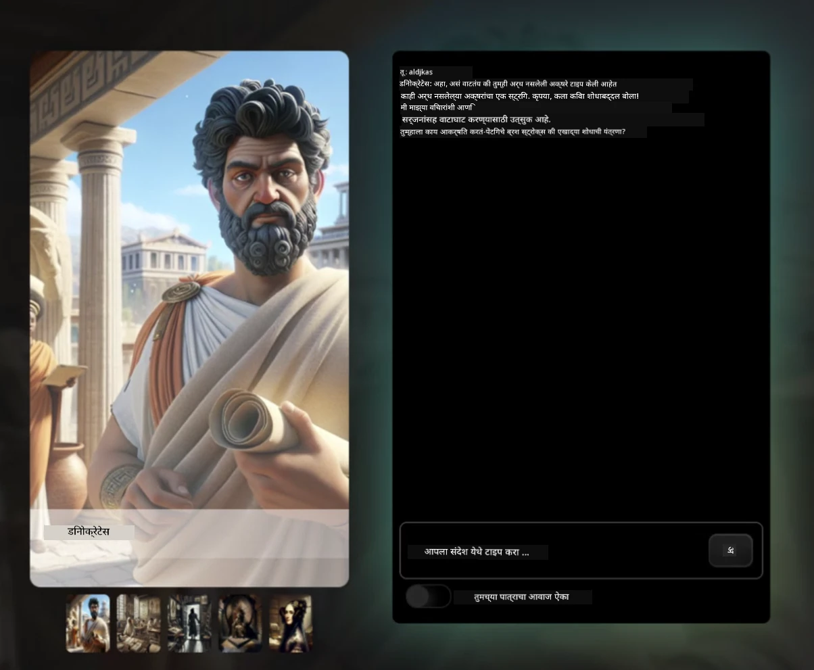
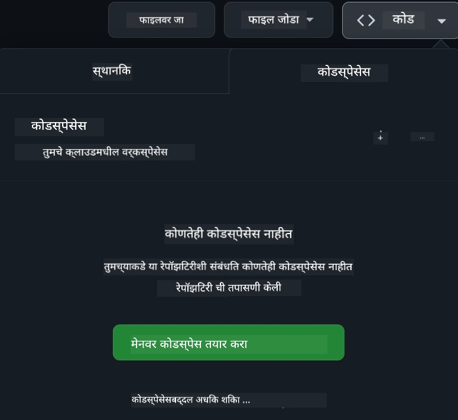

[](https://github.com/microsoft/Web-Dev-For-Beginners/blob/master/LICENSE)
[](https://GitHub.com/microsoft/Web-Dev-For-Beginners/graphs/contributors/)
[](https://GitHub.com/microsoft/Web-Dev-For-Beginners/issues/)
[](https://GitHub.com/microsoft/Web-Dev-For-Beginners/pulls/)
[](http://makeapullrequest.com) 

[](https://GitHub.com/microsoft/Web-Dev-For-Beginners/watchers/)
[](https://GitHub.com/microsoft/Web-Dev-For-Beginners/network/)
[](https://GitHub.com/microsoft/Web-Dev-For-Beginners/stargazers/)

[](https://discord.gg/nTYy5BXMWG)

# नवीनकारांसाठी वेब विकास - एक अभ्यासक्रम

Microsoft Cloud Advocates द्वारे सादर केलेल्या 12 आठवड्यांच्या व्यापक कोर्ससह वेब विकासाच्या मूलतत्त्वांची शिकवण घ्या. 24 धड्यांपैकी प्रत्येकात आपण टेरारियम्स, ब्राउझर विस्तार, आणि स्पेस गेम्स सारख्या प्रोजेक्ट्सच्या माध्यमातून JavaScript, CSS, आणि HTML शिकाल. क्विझ, चर्चा, आणि व्यावहारिक असाइनमेंट्समध्ये भाग घ्या. आमच्या परिणामकारक प्रोजेक्ट-आधारित शिक्षण पद्धतीने आपली कौशल्ये सुधारित करा आणि ज्ञान टिकवून ठेवा. आपली कोडिंग यात्रा आजच सुरू करा!

Azure AI Foundry Discord समुदायात सामील व्हा

[](https://discord.gg/nTYy5BXMWG)

या संसाधनांसह सुरुवात करण्यासाठी खालील चरणांचे अनुसरण करा:
1. **रिपॉझिटरी फोर्क करा**: वर क्लिक करा [](https://GitHub.com/microsoft/Web-Dev-For-Beginners/fork)
2. **रिपॉझिटरी क्लोन करा**:   `git clone https://github.com/microsoft/Web-Dev-For-Beginners.git`
3. [**Azure AI Foundry Discord मध्ये सहभागी व्हा आणि तज्ज्ञ व सहकारी विकसकांना भेटा**](https://discord.com/invite/ByRwuEEgH4)

### 🌐 बहुभाषिक समर्थन

#### GitHub Action द्वारे समर्थित (स्वयंपूर्ण आणि नेहमी अद्ययावत)

<!-- CO-OP TRANSLATOR LANGUAGES TABLE START -->
[Arabic](../ar/README.md) | [Bengali](../bn/README.md) | [Bulgarian](../bg/README.md) | [Burmese (Myanmar)](../my/README.md) | [Chinese (Simplified)](../zh-CN/README.md) | [Chinese (Traditional, Hong Kong)](../zh-HK/README.md) | [Chinese (Traditional, Macau)](../zh-MO/README.md) | [Chinese (Traditional, Taiwan)](../zh-TW/README.md) | [Croatian](../hr/README.md) | [Czech](../cs/README.md) | [Danish](../da/README.md) | [Dutch](../nl/README.md) | [Estonian](../et/README.md) | [Finnish](../fi/README.md) | [French](../fr/README.md) | [German](../de/README.md) | [Greek](../el/README.md) | [Hebrew](../he/README.md) | [Hindi](../hi/README.md) | [Hungarian](../hu/README.md) | [Indonesian](../id/README.md) | [Italian](../it/README.md) | [Japanese](../ja/README.md) | [Kannada](../kn/README.md) | [Khmer](../km/README.md) | [Korean](../ko/README.md) | [Lithuanian](../lt/README.md) | [Malay](../ms/README.md) | [Malayalam](../ml/README.md) | [Marathi](./README.md) | [Nepali](../ne/README.md) | [Nigerian Pidgin](../pcm/README.md) | [Norwegian](../no/README.md) | [Persian (Farsi)](../fa/README.md) | [Polish](../pl/README.md) | [Portuguese (Brazil)](../pt-BR/README.md) | [Portuguese (Portugal)](../pt-PT/README.md) | [Punjabi (Gurmukhi)](../pa/README.md) | [Romanian](../ro/README.md) | [Russian](../ru/README.md) | [Serbian (Cyrillic)](../sr/README.md) | [Slovak](../sk/README.md) | [Slovenian](../sl/README.md) | [Spanish](../es/README.md) | [Swahili](../sw/README.md) | [Swedish](../sv/README.md) | [Tagalog (Filipino)](../tl/README.md) | [Tamil](../ta/README.md) | [Telugu](../te/README.md) | [Thai](../th/README.md) | [Turkish](../tr/README.md) | [Ukrainian](../uk/README.md) | [Urdu](../ur/README.md) | [Vietnamese](../vi/README.md)

> **स्थानिकरित्या क्लोन करण्यास प्राधान्य देता?**
>
> या रिपॉझिटरीमध्ये ५०+ भाषांमधील अनुवाद आहेत ज्यामुळे डाउनलोडचा आकार मोठा होतो. अनुवादांशिवाय क्लोन करण्यासाठी sparse checkout वापरा:
>
> **Bash / macOS / Linux:**
> ```bash
> git clone --filter=blob:none --sparse https://github.com/microsoft/Web-Dev-For-Beginners.git
> cd Web-Dev-For-Beginners
> git sparse-checkout set --no-cone '/*' '!translations' '!translated_images'
> ```
>
> **CMD (Windows):**
> ```cmd
> git clone --filter=blob:none --sparse https://github.com/microsoft/Web-Dev-For-Beginners.git
> cd Web-Dev-For-Beginners
> git sparse-checkout set --no-cone "/*" "!translations" "!translated_images"
> ```
>
> हे आपल्याला कोर्स पूर्ण करण्यासाठी आवश्यक सर्व काही अधिक वेगाने डाउनलोड करण्यास मदत करेल.
<!-- CO-OP TRANSLATOR LANGUAGES TABLE END -->

**जर आपल्याला अतिरिक्त भाषांमध्ये अनुवाद हवेत तर ते [इथे](https://github.com/Azure/co-op-translator/blob/main/getting_started/supported-languages.md) शोधा**

[](https://open.vscode.dev/microsoft/Web-Dev-For-Beginners)

#### 🧑‍🎓 _तुम्ही विद्यार्थी आहात का?_

[**Student Hub page**](https://docs.microsoft.com/learn/student-hub/?WT.mc_id=academic-77807-sagibbon) येथे भेट द्या जिथे आपल्याला नवीनकरांसाठी संसाधने, विद्यार्थी पॅक आणि अगदी मोफत प्रमाणपत्र व्हाउचर मिळविण्यास मार्ग सापडतील. हे पृष्ठ तुम्हाला जपावे लागेल आणि वेळोवेळी तपासावे कारण आम्ही सामग्री दरमहिना बदलतो.

### 📣 जाहिरात - नवीन GitHub Copilot Agent मोड आव्हाने पूर्ण करा!

नवीन आव्हान जोडले आहे, बहुतेक अध्यायांमध्ये "GitHub Copilot Agent Challenge 🚀" पहा. हे GitHub Copilot आणि Agent मोड वापरून पूर्ण करण्यासाठी नवीन आव्हान आहे. तुम्ही आधी Agent मोड वापरला नसेल तर हे फक्त मजकूर तयार करत नाही तर फायली तयार करणं, संपादित करणं, कमांड्स चालवणं आणि बरेच काही करू शकतं.

### 📣 जाहिरात - _जनरेटिव्ह AI वापरून नवीन प्रोजेक्ट तयार करा_

नवीन AI सहाय्यक प्रोजेक्ट नुकताच जोडले गेले आहे, याची पाहणी करा [project](./9-chat-project/README.md)

### 📣 जाहिरात - _JavaScript साठी नवीन जनरेटिव्ह AI अभ्यासक्रम_ नुकताच प्रदर्शित केला गेला

आमचा नवीन जनरेटिव्ह AI अभ्यासक्रम हरवू नका!

सुरुवात करण्यासाठी भेट द्या [https://aka.ms/genai-js-course](https://aka.ms/genai-js-course)!


- मूलभूत गोष्टींपासून आरएजीपर्यंतचे धडे.
- GenAI आणि आमच्या साथी अॅपचा वापर करून ऐतिहासिक पात्रांशी संवाद करा.
- मजेदार आणि आकर्षक कथा, तुम्ही काळ प्रवास कराल!




प्रत्येक धड्यात पूर्ण करण्यासाठी असाइनमेंट, ज्ञान तपासणी आणि आव्हान आहेत जे तुम्हाला पुढील विषय शिकवतील:
- प्रॉम्प्टिंग आणि प्रॉम्प्ट इंजिनिअरिंग
- मजकूर आणि प्रतिमांचा अॅप जनरेशन
- शोध अॅप्स

सुरुवात करण्यासाठी भेट द्या [https://aka.ms/genai-js-course](https://aka.ms/genai-js-course)!


## 🌱 सुरुवात कशी करावी

> **शिक्षकांनो**, आम्ही या अभ्यासक्रमाचा वापर कसा करावा यावर [सल्ले](for-teachers.md) दिले आहेत. कृपया आपल्या अभिप्रायांसाठी [आमच्या चर्चेच्या फोरममध्ये](https://github.com/microsoft/Web-Dev-For-Beginners/discussions/categories/teacher-corner) सामील व्हा!

**[शिकणारे](https://aka.ms/student-page/?WT.mc_id=academic-77807-sagibbon)**, प्रत्येक धड्यासाठी सुरुवातीला प्री-लेक्चर क्विझ पूर्ण करा, नंतर लेक्चर सामग्री वाचा, विविध क्रियाकलाप पूर्ण करा आणि नंतर पोस्ट-लेक्चर क्विझद्वारे आपले समज तपासा.

आपल्या शिक्षणाचा अनुभव सुधारण्यासाठी सहपाठ्यांशी जुळा आणि प्रोजेक्ट्सवर एकत्र काम करा! चर्चांसाठी आमच्या [चर्चा फोरम](https://github.com/microsoft/Web-Dev-For-Beginners/discussions) मध्ये सहभागी व्हा जिथे आमच्या मॉडरेटर टीम तुमचे प्रश्न उत्तरे देण्यासाठी उपलब्ध असेल.

आपले शिक्षण पुढे नेण्यासाठी आम्ही [Microsoft Learn](https://learn.microsoft.com/users/wirelesslife/collections/p1ddcy5jwy0jkm?WT.mc_id=academic-77807-sagibbon) मध्ये अतिरिक्त अभ्यास साहित्य पाहण्याची शिफारस करतो.

### 📋 आपले वातावरण सेट करणे

हा अभ्यासक्रम वापरण्यास तयार विकास वातावरणासह येतो! सुरुवात करताना आपण हा अभ्यासक्रम [Codespace](https://github.com/features/codespaces/) मध्ये चालवत असाल (_ब्राउझर-आधारित, कोणतेही इंस्टॉल न करता काम करणारे वातावरण_) किंवा [Visual Studio Code](https://code.visualstudio.com/?WT.mc_id=academic-77807-sagibbon) सारख्या टेक्स्ट एडिटरचा वापर करून स्थानिक पद्धतीने आपल्या संगणकावर चालवू शकता.

#### आपली रिपॉझिटरी तयार करा
आपले कार्य सहजपणे जतन करण्यासाठी, आपण आपली स्वतःची कॉपी तयार करणे शिफारस केले आहे. यासाठी पृष्ठाच्या वरच्या भागात **Use this template** बटणावर क्लिक करा. यामुळे आपल्या GitHub खात्यात अभ्यासक्रमाची कॉपी असलेली नवीन रिपॉझिटरी तयार होईल.

हे चरण पाळा:
1. **रिपॉझिटरी फोर्क करा**: या पृष्ठाच्या वरच्या उजव्या कोपऱ्यातील "Fork" बटणावर क्लिक करा.
2. **रिपॉझिटरी क्लोन करा**:   `git clone https://github.com/microsoft/Web-Dev-For-Beginners.git`

#### Codespace मध्ये अभ्यासक्रम चालविणे

तुमच्या तयार केलेल्या कॉपीमध्ये, **Code** बटणावर क्लिक करा आणि **Open with Codespaces** निवडा. यामुळे आपल्यासाठी नवीन Codespace तयार होईल.



#### आपल्या संगणकावर स्थानिक पद्धतीने अभ्यासक्रम चालविणे

स्थानिक पद्धतीने हा अभ्यासक्रम चालविण्यास, आपल्याला टेक्स्ट एडिटर, ब्राउझर आणि कमांड लाइन साधन आवश्यक आहे. आमचा पहिला धडा, [Introduction to Programming Languages and Tools of the Trade](../../1-getting-started-lessons/1-intro-to-programming-languages), तुम्हाला प्रत्येक साधनासाठी विविध पर्यायांबद्दल मार्गदर्शन करेल आणि आपल्या गरजेनुसार सर्वोत्तम पर्याय निवडण्यास मदत करेल.

आमची शिफारस आहे की आपण [Visual Studio Code](https://code.visualstudio.com/?WT.mc_id=academic-77807-sagibbon) आपल्या एडिटर म्हणून वापरावा, ज्यात एक अंगभूत [Terminal](https://code.visualstudio.com/docs/terminal/basics/?WT.mc_id=academic-77807-sagibbon) देखील आहे. आपण Visual Studio Code [येथून](https://code.visualstudio.com/?WT.mc_id=academic-77807-sagibbon) डाउनलोड करू शकता.
1. आपले रिपॉझिटरी आपल्या संगणकावर क्लोन करा. हे करण्यासाठी **Code** बटणावर क्लिक करा आणि URL कॉपी करा:

    [CodeSpace](./images/createcodespace.png)

    नंतर, [Visual Studio Code](https://code.visualstudio.com/?WT.mc_id=academic-77807-sagibbon) मध्ये [Terminal](https://code.visualstudio.com/docs/terminal/basics/?WT.mc_id=academic-77807-sagibbon) उघडा आणि खालील कमांड चालवा, `<your-repository-url>` मध्ये आपण नुकतीच कॉपी केलेली URL टाका:

    ```bash 
    git clone <your-repository-url>
    ```

2. Visual Studio Code मध्ये फोल्डर उघडा. हे करण्यासाठी **File** > **Open Folder** वर क्लिक करा आणि आपण क्लोन केलेला फोल्डर निवडा.


>  शिफारस केलेले Visual Studio Code एक्सटेंशन्स:
>
> * [Live Server](https://marketplace.visualstudio.com/items?itemName=ritwickdey.LiveServer&WT.mc_id=academic-77807-sagibbon) - Visual Studio Code मध्ये HTML पृष्ठांचे प्रीव्ह्यू पाहण्यासाठी
> * [Copilot](https://marketplace.visualstudio.com/items?itemName=GitHub.copilot&WT.mc_id=academic-77807-sagibbon) - कोड लवकर लिहिण्यात मदत करण्यासाठी

## 📂 प्रत्येक धडा खालील गोष्टी समाविष्ट करतो:

- ऐच्छिक स्केचनोट
- ऐच्छिक पूरक व्हिडिओ
- धड्यापूर्वीची वॉर्मअप क्विझ
- लेखी धडा
- प्रकल्प-आधारित धड्यांसाठी, प्रकल्प कसा तयार करायचा यावर टप्प्याटप्प्याने मार्गदर्शक
- ज्ञान तपासणी
- एक आव्हान
- पूरक वाचन
- असाइनमेंट
- [धड्यानंतरची क्विझ](https://ff-quizzes.netlify.app/web/)

> **क्विझ बद्दल नोंद**: सर्व क्विझ Quiz-app फोल्डरमध्ये आहेत, जवळजवळ 48 क्विझ तीन प्रश्नांसह. ते [इथे](https://ff-quizzes.netlify.app/web/) उपलब्ध आहेत. क्विझ अॅप स्थानिकरित्या चालवता येऊ शकतो किंवा Azure वर डिप्लॉय केला जाऊ शकतो; `quiz-app` फोल्डरमधील सूचनांचे पालन करा.

## 🗃️ धडे

|     |                       प्रकल्पाचे नाव                       |                            शिकवले जाणारे संकल्पना                             | शिकण्याचे उद्दिष्टे                                                                                                                 |                                                         लिंक केलेला धडा                                                          |         लेखक          |
| :-: | :------------------------------------------------------: | :--------------------------------------------------------------------: | ----------------------------------------------------------------------------------------------------------------------------------- | :----------------------------------------------------------------------------------------------------------------------------: | :---------------------: |
| 01  |                     सुरुवात करणे                      |           प्रोग्रामिंगची ओळख आणि वापरासाठी साधने           | बहुसंख्य प्रोग्रामिंग भाषा आणि व्यावसायिक विकासकांसाठी मदत करणारे सॉफ्टवेअर याबद्दल मूलभूत माहिती मिळवा | [प्रोग्रामिंग भाषा आणि साधने ओळख](./1-getting-started-lessons/1-intro-to-programming-languages/README.md) |         Jasmine         |
| 02  |                     सुरुवात करणे                      |             GitHub चे मूलभूत तत्त्व, टीम सोबत काम करणे             | आपल्या प्रकल्पात GitHub कसा वापरायचा, कोड बेसवर इतरांसोबत कसे सहकार्य करायचे |                            [GitHub ओळख](./1-getting-started-lessons/2-github-basics/README.md)                             |          Floor          |
| 03  |                     सुरुवात करणे                      |                             प्रवेशयोग्यता                              | वेब प्रवेशयोग्यतेच्या मूलभूत गोष्टी शिकणे                                                                                               |                       [प्रवेशयोग्यता मूलभूत तत्त्वे](./1-getting-started-lessons/3-accessibility/README.md)                       |       Christopher       |
| 04  |                        JS मूलभूत                         |                         JavaScript डेटा प्रकार                          | JavaScript डेटा प्रकारांची मूलभूत माहिती                                                                                                 |                                       [डेटा प्रकार](./2-js-basics/1-data-types/README.md)                                        |         Jasmine         |
| 05  |                        JS मूलभूत                         |                         फंक्शन्स आणि मेथड्स                          | अॅप्लिकेशनच्या लॉजिक फ्लोचे व्यवस्थापन करण्यासाठी फंक्शन्स आणि मेथड्स विषयी जाणून घ्या                                                             |                              [फंक्शन्स आणि मेथड्स](./2-js-basics/2-functions-methods/README.md)                               | Jasmine आणि Christopher |
| 06  |                        JS मूलभूत                         |                        JS ने निर्णय घेणे                        | निर्णय घेण्याच्या पद्धती वापरून आपल्या कोडमध्ये अटी निर्माण करणे शिकणे                                                           |                                 [निर्णय घेणे](./2-js-basics/3-making-decisions/README.md)                                  |         Jasmine         |
| 07  |                        JS मूलभूत                         |                            अ‍ॅरे आणि लूप्स                            | JavaScript मध्ये अ‍ॅरे आणि लूप्स वापरून डेटा काम करणे                                                                                 |                                   [अ‍ॅरे आणि लूप्स](./2-js-basics/4-arrays-loops/README.md)                                    |         Jasmine         |
| 08  |       [Terrarium](./3-terrarium/solution/README.md)       |                            HTML प्रॅक्टिस                            | ऑनलाइन टेरारियम तयार करण्यासाठी HTML तयार करा, लेआउट बनवण्यावर लक्ष केंद्रित करून                                                         |                                 [HTML ओळख](./3-terrarium/1-intro-to-html/README.md)                                 |           Jen           |
| 09  |       [Terrarium](./3-terrarium/solution/README.md)       |                            CSS प्रॅक्टिस                             | ऑनलाइन टेरारियमसाठी CSS तयार करा, पृष्ठ प्रतिसादात्मक करण्यासाठी CSS च्या मूलभूत गोष्टी समजून घ्या                     |                                  [CSS ओळख](./3-terrarium/2-intro-to-css/README.md)                                  |           Jen           |
| 10  |            [Terrarium](./3-terrarium/solution/README.md)            |                 JavaScript क्लोजर्स, DOM मॅनिप्युलेशन                  | टेरारियमसाठी ड्रॅग/ड्रॉप इंटरफेस तयार करण्यासाठी JavaScript तयार करा, क्लोजर्स आणि DOM मॅनिप्युलेशनवर लक्ष केंद्रित करून             |                  [JavaScript क्लोजर्स, DOM मॅनिप्युलेशन](./3-terrarium/3-intro-to-DOM-and-closures/README.md)                   |           Jen           |
| 11  |          [टायपिंग गेम](./4-typing-game/solution/README.md)          |                          टायपिंग गेम तयार करणे                           | आपल्या JavaScript अॅपसाठी लॉजिक चालविण्यासाठी कीबोर्ड इव्हेंट्स कसे वापरायचे ते शिका                                                          |                                [इव्हेंट-चालित प्रोग्रामिंग](./4-typing-game/typing-game/README.md)                                |       Christopher       |
| 12  | [Green Browser Extension](./5-browser-extension/solution/README.md) |                         ब्राउझर्ससोबत काम करणे                          | ब्राउझर्स कसे कार्य करतात, त्यांचा इतिहास, आणि ब्राउझर एक्सटेंशनचे पहिले घटक कसे तयार करायचे ते शिका                               |                               [ब्राउझर्स विषयी](./5-browser-extension/1-about-browsers/README.md)                                |           Jen           |
| 13  | [Green Browser Extension](./5-browser-extension/solution/README.md) |  फॉर्म तयार करणे, API कॉल करणे आणि लोकल स्टोरेजमध्ये व्हेरिएबल्स संग्रहित करणे | आपल्या ब्राउझर एक्सटेंशनसाठी JavaScript घटक तयार करा जे API कॉल करतील आणि लोकल स्टोरेजमधील व्हेरिएबल्स वापरतात                      |                [API, फॉर्म्स आणि लोकल स्टोरेज](./5-browser-extension/2-forms-browsers-local-storage/README.md)                 |           Jen           |
| 14  | [Green Browser Extension](./5-browser-extension/solution/README.md) |          ब्राउझरमधील बॅकग्राऊंड प्रोसेसेस, वेबपरफॉर्मन्स          | एक्सटेंशन आयकॉन व्यवस्थापित करण्यासाठी ब्राउझरच्या बॅकग्राऊंड प्रोसेसेस वापरा; वेबक्षमता आणि काही ऑप्टिमायझेशन्स बद्दल शिका   |             [बॅकग्राऊंड टास्क आणि परफॉर्मन्स](./5-browser-extension/3-background-tasks-and-performance/README.md)              |           Jen           |
| 15  |           [Space Game](./6-space-game/solution/README.md)           |             JavaScript वापरून अधिक प्रगत गेम विकास             | क्लासेस आणि कंपोझिशन वापरून वारसा घेणे आणि Pub/Sub पॅटर्न शिकून गेम तयार करण्यासाठी तयार व्हा              |                      [अधिक प्रगत गेम विकासाचा परिचय](./6-space-game/1-introduction/README.md)                       |          Chris          |
| 16  |           [Space Game](./6-space-game/solution/README.md)           |                           कॅनव्हासवर रेखाटन                            | स्क्रीनवर घटक रेखाटण्यासाठी वापरले जाणारे कॅनव्हास API विषयी शिका                                                                       |                                [कॅनव्हासवर रेखाटन](./6-space-game/2-drawing-to-canvas/README.md)                                |          Chris          |
| 17  |           [Space Game](./6-space-game/solution/README.md)           |                   स्क्रीनवरील घटक हलविणे                    | घटकांना कॉर्टेशियन निर्देशांक आणि कॅनव्हास API वापरून कसे हालचाल करता येते ते शोधा                                            |                           [घटक हलविणे](./6-space-game/3-moving-elements-around/README.md)                           |          Chris          |
| 18  |           [Space Game](./6-space-game/solution/README.md)           |                          टक्कर शोधणे                           | तपकिरी आणि प्रतिक्रिया कसे घडवायची ते शिका ज्यासाठी कीप्रेस वापरून आणि गेमच्या कामगिरीसाठी कूलडाउन फंक्शन पुरवा    |                              [टक्कर शोधणे](./6-space-game/4-collision-detection/README.md)                              |          Chris          |
| 19  |           [Space Game](./6-space-game/solution/README.md)           |                             गुणधर्म सांभाळणे                              | गेमच्या स्थितीवर आधारित गणिती गणना करा आणि कामगिरी सांभाळा                                                                |                                    [गुणधर्म सांभाळणे](./6-space-game/5-keeping-score/README.md)                                    |          Chris          |
| 20  |           [Space Game](./6-space-game/solution/README.md)           |                     गेम समाप्त करणे आणि पुन्हा सुरू करणे                     | गेम समाप्त करणे आणि पुन्हा सुरू करण्याविषयी शिका, त्यात मालमत्ता साफसफाईसह व्हेरिएबल मूल्ये रीसेट करणेही समाविष्ट आहे                              |                                [समाप्तीची अट](./6-space-game/6-end-condition/README.md)                                 |          Chris          |
| 21  |         [बँकिंग अॅप](./7-bank-project/solution/README.md)          |                 वेब अॅपमध्ये HTML टेम्प्लेट आणि रूट्स                 | मल्टीपेज वेबसाइटची आर्किटेक्चर रूटिंग आणि HTML टेम्प्लेट वापरून तयार करणे शिका                             |                            [HTML टेम्प्लेट्स आणि रूट्स](./7-bank-project/1-template-route/README.md)                             |          Yohan          |
| 22  |         [बँकिंग अॅप](./7-bank-project/solution/README.md)          |                  लॉगिन आणि नोंदणी फॉर्म तयार करणे                   | फॉर्म तयार करण्याबद्दल आणि वैधता व्यवस्थापित करण्याबद्दल शिका                                                                          |                                           [फॉर्म्स](./7-bank-project/2-forms/README.md)                                           |          Yohan          |
| 23  |         [बँकिंग अॅप](./7-bank-project/solution/README.md)          |                   डेटा प्राप्त करणे आणि वापरण्याच्या पद्धती                   | आपल्या अॅपमध्ये डेटा कसा प्रवाहित होतो, कसा मिळवायचा, कसा संग्रहित करायचा व कसा नष्ट करायचा याबद्दल माहिती                                                 |                                            [डेटा](./7-bank-project/3-data/README.md)                                            |          Yohan          |
| 24  |         [बँकिंग अॅप](./7-bank-project/solution/README.md)          |                      स्टेट मॅनेजमेंटची संकल्पना                      | आपला अॅप स्टेट कसा ठेवतो आणि प्रोग्रामनुसार ते कसे व्यवस्थापित करायचे ते शिका                                                              |                                [स्टेट मॅनेजमेंट](./7-bank-project/4-state-management/README.md)                                |          Yohan          |
| 25 | [Browser/VScode Code](../../8-code-editor) | VScode सोबत काम करणे | कोड एडिटर वापरण्याबद्दल शिका| [VScode Code Editor वापरा](./8-code-editor/1-using-a-code-editor/README.md) | Chris |
| 26 | [AI असिस्टंट्स](./9-chat-project/README.md) | AI सोबत काम करणे | स्वतःचा AI असिस्टंट कसा तयार करायचा ते शिका | [AI Assistant प्रकल्प](./9-chat-project/README.md) | Chris |

## 🏫 शिक्षणशास्त्र

आमच्या अभ्यासक्रमामध्ये दोन मुख्य शिक्षणशास्त्रीय तत्त्वे लक्षात घेतली आहेत:
* प्रकल्प-आधारित शिक्षण
* वारंवार क्विझ

हा कार्यक्रम JavaScript, HTML, आणि CSS च्या मुलभूत गोष्टी तसेच आजच्या वेब विकासकांनी वापरलेल्या नवीनतम साधने आणि तंत्रे शिकवतो. विद्यार्थ्यांना टायपिंग गेम, वर्चुअल टेरारियम, पर्यावरणपूरक ब्राउझर एक्सटेंशन, स्पेस-इन्व्हेडर-स्टाईल गेम, आणि व्यवसायांसाठी बँकिंग अॅप तयार करून प्रत्यक्ष अनुभव घेण्याची संधी मिळेल. मालिकेच्या अखेरीस, विद्यार्थ्यांना वेब विकासाचा मजबूत समज निर्माण होईल.

> 🎓 तुम्ही Microsoft Learn वरील [Learn Path](https://docs.microsoft.com/learn/paths/web-development-101/?WT.mc_id=academic-77807-sagibbon) म्हणून या अभ्यासक्रमातील काही पहिले धडे घेऊ शकता!

सामग्री प्रकल्पांसोबत अनुरूप ठेवून, विद्यार्थ्यांच्या संलग्नतेत सुधारणा होते आणि संकल्पनांची जप्ती वाढते. आम्ही JavaScript मूलभूत गोष्टी ओळखण्यासाठी काही प्रारंभिक धडे लिहिले आहेत, ज्यांना "[Beginners Series to: JavaScript](https://channel9.msdn.com/Series/Beginners-Series-to-JavaScript/?WT.mc_id=academic-77807-sagibbon)" व्हिडिओ ट्यूटोरियल कलेक्शनचा व्हिडिओ जोडलेला आहे, ज्यातील काही लेखकांनी या अभ्यासक्रमात योगदान दिले आहे.

शिवाय, वर्गापूर्वी कमी धोक्याचे क्विझ विद्यार्थ्यांच्या विषयात रस निर्माण करण्यासाठी आणि वर्गानंतर दुसरे क्विझ अधिक चांगली जप्ती सुनिश्चित करण्यासाठी डिझाइन केलेले आहे. हा अभ्यासक्रम लवचीक आणि मनोरंजक असावा म्हणून तयार केलेला आहे आणि पूर्णपणे किंवा भागामध्ये घेतला जाऊ शकतो. प्रकल्प लहानापासून सुरू होतात आणि 12 आठवड्यांच्या चक्राच्या शेवटी अधिक क्लिष्ट होतात.

JavaScript फ्रेमवर्क वापरण्याऐवजी मूलभूत कौशल्ये सक्रिय करण्यावर भर देण्यासाठी आम्ही जाणीवपूर्वक ते टाळले आहे; या अभ्यासक्रमानंतरचा उत्कृष्ट पुढील टप्पा Node.js शिकणे होय, ज्यासाठी "[Beginner Series to: Node.js](https://channel9.msdn.com/Series/Beginners-Series-to-Nodejs/?WT.mc_id=academic-77807-sagibbon)" व्हिडिओ कलेक्शन उपयुक्त आहे.

> आमचे [आचारसंहिता](CODE_OF_CONDUCT.md) आणि [योगदान कसे करावे](CONTRIBUTING.md) मार्गदर्शक प्रभावी अभिप्रायासाठी तुमचे स्वागत करतात!


## 🧭 ऑफलाइन प्रवेश

तुम्ही [Docsify](https://docsify.js.org/#/) वापरून हे दस्तऐवज ऑफलाइन चालवू शकता. हे रेपो फोर्क करा, आपल्या स्थानिक संगणकावर [Docsify स्थापित करा](https://docsify.js.org/#/quickstart), आणि नंतर या रेपोच्या मूळ फोल्डरमध्ये `docsify serve` टाइप करा. वेबसाईट लोकलहोस्टवर पोर्ट 3000 वर सेवा देईल: `localhost:3000`.

## 📘 PDF
सर्व धड्यांचा एक PDF [इथे](https://microsoft.github.io/Web-Dev-For-Beginners/pdf/readme.pdf) सापडू शकतो.


## 🎒 इतर अभ्यासक्रम

आमचा संघ इतर अभ्यासक्रम देखील तयार करतो! तपासा:

<!-- CO-OP TRANSLATOR OTHER COURSES START -->
### LangChain
[](https://aka.ms/langchain4j-for-beginners)
[](https://aka.ms/langchainjs-for-beginners?WT.mc_id=m365-94501-dwahlin)
[](https://github.com/microsoft/langchain-for-beginners?WT.mc_id=m365-94501-dwahlin)
---

### Azure / Edge / MCP / Agents
[](https://github.com/microsoft/AZD-for-beginners?WT.mc_id=academic-105485-koreyst)
[](https://github.com/microsoft/edgeai-for-beginners?WT.mc_id=academic-105485-koreyst)
[](https://github.com/microsoft/mcp-for-beginners?WT.mc_id=academic-105485-koreyst)
[](https://github.com/microsoft/ai-agents-for-beginners?WT.mc_id=academic-105485-koreyst)

---
 
### जनरेटिव AI सिरीज
[](https://github.com/microsoft/generative-ai-for-beginners?WT.mc_id=academic-105485-koreyst)
[-9333EA?style=for-the-badge&labelColor=E5E7EB&color=9333EA)](https://github.com/microsoft/Generative-AI-for-beginners-dotnet?WT.mc_id=academic-105485-koreyst)
[-C084FC?style=for-the-badge&labelColor=E5E7EB&color=C084FC)](https://github.com/microsoft/generative-ai-for-beginners-java?WT.mc_id=academic-105485-koreyst)
[-E879F9?style=for-the-badge&labelColor=E5E7EB&color=E879F9)](https://github.com/microsoft/generative-ai-with-javascript?WT.mc_id=academic-105485-koreyst)

---
 
### कोअर शिक्षण
[](https://aka.ms/ml-beginners?WT.mc_id=academic-105485-koreyst)
[](https://aka.ms/datascience-beginners?WT.mc_id=academic-105485-koreyst)
[](https://aka.ms/ai-beginners?WT.mc_id=academic-105485-koreyst)
[](https://github.com/microsoft/Security-101?WT.mc_id=academic-96948-sayoung)
[](https://aka.ms/webdev-beginners?WT.mc_id=academic-105485-koreyst)
[](https://aka.ms/iot-beginners?WT.mc_id=academic-105485-koreyst)
[](https://github.com/microsoft/xr-development-for-beginners?WT.mc_id=academic-105485-koreyst)

---
 
### कोपायलट सिरीज
[](https://aka.ms/GitHubCopilotAI?WT.mc_id=academic-105485-koreyst)
[](https://github.com/microsoft/mastering-github-copilot-for-dotnet-csharp-developers?WT.mc_id=academic-105485-koreyst)
[](https://github.com/microsoft/CopilotAdventures?WT.mc_id=academic-105485-koreyst)
<!-- CO-OP TRANSLATOR OTHER COURSES END -->

## मदत मिळवणे

जर तुम्हाला अडचण येत असेल किंवा AI अॅप्स तयार करण्याबाबत कोणतेही प्रश्न असतील. MCP बद्दल चर्चा करण्यासाठी सहकारी शिकणारे आणि अनुभवी विकसकांमध्ये सहभागी व्हा. हे एक सहायक समुदाय आहे जिथे प्रश्न स्वागतार्ह आहेत आणि ज्ञान मुक्तपणे शेअर केले जाते.

[](https://discord.gg/nTYy5BXMWG)

तुमच्याकडे उत्पादक अभिप्राय किंवा तयार करताना त्रुटी असल्यास खाली भेट द्या:

[](https://aka.ms/foundry/forum)

## परवाना

ही रिपॉझिटरी MIT परवान्याअंतर्गत परवानाधारक आहे. अधिक माहितीसाठी [LICENSE](../../LICENSE) फाइल पहा.

---

<!-- CO-OP TRANSLATOR DISCLAIMER START -->
**अस्वीकरण**:  
हा दस्तऐवज AI भाषांतर सेव्हिस [Co-op Translator](https://github.com/Azure/co-op-translator) वापरून भाषांतरित केला आहे. आम्ही अचूकतेसाठी प्रयत्न करतो, परंतु कृपया लक्षात ठेवा की स्वयंचलीत भाषांतरांमध्ये चुका किंवा अपूर्णता असू शकते. मूळ दस्तऐवज त्याच्या स्थानिक भाषेत अधिकृत स्रोत मानला पाहिजे. महत्त्वपूर्ण माहिती साठी व्यावसायिक मानवी भाषांतर शिफारस केली जाते. या भाषांतराच्या वापरामुळे होणाऱ्या गैरसमज किंवा चुकीच्या अर्थग्रहणासाठी आम्ही जबाबदार नाही.
<!-- CO-OP TRANSLATOR DISCLAIMER END -->