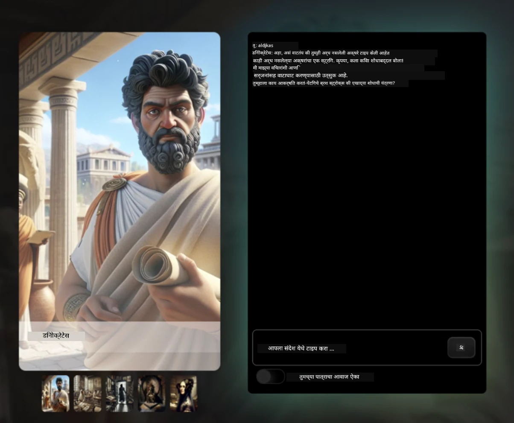
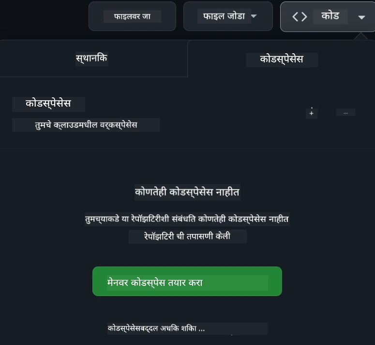

[](https://github.com/microsoft/Web-Dev-For-Beginners/blob/master/LICENSE)
[](https://GitHub.com/microsoft/Web-Dev-For-Beginners/graphs/contributors/)
[](https://GitHub.com/microsoft/Web-Dev-For-Beginners/issues/)
[](https://GitHub.com/microsoft/Web-Dev-For-Beginners/pulls/)
[](http://makeapullrequest.com) 

[](https://GitHub.com/microsoft/Web-Dev-For-Beginners/watchers/)
[](https://GitHub.com/microsoft/Web-Dev-For-Beginners/network/)
[](https://GitHub.com/microsoft/Web-Dev-For-Beginners/stargazers/)

[](https://discord.gg/nTYy5BXMWG)

# नवशिक्यांसाठी वेब विकास - एक अभ्यासक्रम

Microsoft Cloud Advocates द्वारे आमच्या 12 आठवड्यांच्या सविस्तर कोर्ससह वेब विकासाच्या मूलभूत गोष्टी शिका. 24 धड्यांपैकी प्रत्येकात JavaScript, CSS, आणि HTML यांचा समावेश आहे ज्यामध्ये terrariums, browser extensions, आणि space games ईसारख्या प्रॅक्टिकल प्रोजेक्ट्सद्वारे शिकवले जाते. क्विझ, चर्चासत्रं, आणि प्रॅक्टिकल असाइनमेंट्समध्ये सहभागी व्हा. आमच्या प्रभावी प्रोजेक्ट-आधारित शिक्षण पद्धतीने आपले कौशल्य वाढवा आणि ज्ञान अधिक चांगल्या प्रकारे आत्मसात करा. आजच आपली कोडिंग यात्रा सुरू करा!

Azure AI Foundry Discord मध्ये सामील व्हा आणि तज्ञ व सह-विकसकांशी भेटा.

[](https://discord.gg/nTYy5BXMWG)

या संसाधनांचा वापर सुरू करण्यासाठी खालील टप्पे फॉलो करा:
1. **रिपॉझिटरी फोर्क करा**: क्लिक करा [](https://GitHub.com/microsoft/Web-Dev-For-Beginners/fork)
2. **रिपॉझिटरी क्लोन करा**:   `git clone https://github.com/microsoft/Web-Dev-For-Beginners.git`
3. [**Azure AI Foundry Discord मध्ये सामील व्हा आणि तज्ञ, सह-विकसकांशी भेटा**](https://discord.com/invite/ByRwuEEgH4)

### 🌐 बहुभाषिक समर्थन

#### GitHub Action द्वारे समर्थित (स्वयंचलित आणि नेहमी अद्ययावत)

<!-- CO-OP TRANSLATOR LANGUAGES TABLE START -->
[Arabic](../ar/README.md) | [Bengali](../bn/README.md) | [Bulgarian](../bg/README.md) | [Burmese (Myanmar)](../my/README.md) | [Chinese (Simplified)](../zh-CN/README.md) | [Chinese (Traditional, Hong Kong)](../zh-HK/README.md) | [Chinese (Traditional, Macau)](../zh-MO/README.md) | [Chinese (Traditional, Taiwan)](../zh-TW/README.md) | [Croatian](../hr/README.md) | [Czech](../cs/README.md) | [Danish](../da/README.md) | [Dutch](../nl/README.md) | [Estonian](../et/README.md) | [Finnish](../fi/README.md) | [French](../fr/README.md) | [German](../de/README.md) | [Greek](../el/README.md) | [Hebrew](../he/README.md) | [Hindi](../hi/README.md) | [Hungarian](../hu/README.md) | [Indonesian](../id/README.md) | [Italian](../it/README.md) | [Japanese](../ja/README.md) | [Kannada](../kn/README.md) | [Khmer](../km/README.md) | [Korean](../ko/README.md) | [Lithuanian](../lt/README.md) | [Malay](../ms/README.md) | [Malayalam](../ml/README.md) | [Marathi](./README.md) | [Nepali](../ne/README.md) | [Nigerian Pidgin](../pcm/README.md) | [Norwegian](../no/README.md) | [Persian (Farsi)](../fa/README.md) | [Polish](../pl/README.md) | [Portuguese (Brazil)](../pt-BR/README.md) | [Portuguese (Portugal)](../pt-PT/README.md) | [Punjabi (Gurmukhi)](../pa/README.md) | [Romanian](../ro/README.md) | [Russian](../ru/README.md) | [Serbian (Cyrillic)](../sr/README.md) | [Slovak](../sk/README.md) | [Slovenian](../sl/README.md) | [Spanish](../es/README.md) | [Swahili](../sw/README.md) | [Swedish](../sv/README.md) | [Tagalog (Filipino)](../tl/README.md) | [Tamil](../ta/README.md) | [Telugu](../te/README.md) | [Thai](../th/README.md) | [Turkish](../tr/README.md) | [Ukrainian](../uk/README.md) | [Urdu](../ur/README.md) | [Vietnamese](../vi/README.md)

> **स्थानिकरित्या क्लोन करायला प्राधान्य देता?**
>
> या रिपॉझिटरीमध्ये 50+ भाषांतील अनुवाद आहेत जे डाउनलोड आकार लक्षणीय वाढवतात. अनुवादांशिवाय क्लोन करण्यासाठी sparse checkout वापरा:
>
> **Bash / macOS / Linux:**
> ```bash
> git clone --filter=blob:none --sparse https://github.com/microsoft/Web-Dev-For-Beginners.git
> cd Web-Dev-For-Beginners
> git sparse-checkout set --no-cone '/*' '!translations' '!translated_images'
> ```
>
> **CMD (Windows):**
> ```cmd
> git clone --filter=blob:none --sparse https://github.com/microsoft/Web-Dev-For-Beginners.git
> cd Web-Dev-For-Beginners
> git sparse-checkout set --no-cone "/*" "!translations" "!translated_images"
> ```
>
> यामुळे कोर्स पूर्ण करण्यासाठी आवश्यक सर्वकाही आपल्याला लवकर डाउनलोड होईल.
<!-- CO-OP TRANSLATOR LANGUAGES TABLE END -->

**आपल्याला अतिरिक्त भाषांतर हवे असल्यास, समर्थन केलेल्या भाषा येथे नमूद आहेत. [येथे](https://github.com/Azure/co-op-translator/blob/main/getting_started/supported-languages.md)**

[](https://open.vscode.dev/microsoft/Web-Dev-For-Beginners)

#### 🧑‍🎓 _तुम्ही विद्यार्थी आहात काय?_

[**Student Hub पृष्ठ**](https://docs.microsoft.com/learn/student-hub/?WT.mc_id=academic-77807-sagibbon) येथे भेट द्या जिथे तुम्हाला नवशिक्यासाठीचे संसाधने, विद्यार्थी पॅक्स आणि अगदी मोफत प्रमाणपत्र व्हाउचर मिळवण्याचे मार्गही सापडतील. हा पृष्ठ तुम्ही आवर्जून बुकमार्क करा आणि वेळोवेळी तपासत रहा कारण आपल्याला दर महिन्याला कंटेंट बदलत असतो.

### 📣 घोषणा - नवीन GitHub Copilot Agent मोड आव्हाने पूर्ण करायला!

नवीन आव्हान समाविष्ट केले गेले आहे, बहुतेक प्रकरणांमध्ये "GitHub Copilot Agent Challenge 🚀" शोधा. हे GitHub Copilot आणि Agent मोड वापरून पूर्ण करण्यासाठी नवीन आव्हान आहे. जर तुम्ही Agent मोड पूर्वी वापरला नसेल तर तो केवळ टेक्स्ट निर्माण करण्यापुरता मर्यादित नसून फाइल्स तयार करणे आणि संपादित करणं, कमांड्स चालवणे आणि बरेच काही करू शकतो.

### 📣 घोषणा - Generative AI वापरून नवीन प्रोजेक्ट तयार करा

नवीन AI Assistant प्रोजेक्ट नुकताच समाविष्ट केला गेला आहे, ते बघा [प्रोजेक्ट](./9-chat-project/README.md)

### 📣 घोषणा - Generative AI साठी नवीन अभ्यासक्रम JavaScript यासाठी नुकताच रिलीज झाला आहे

आमचा नवीन Generative AI अभ्यासक्रम चुकवू नका!

सुरू करण्यासाठी भेट द्या: [https://aka.ms/genai-js-course](https://aka.ms/genai-js-course)


- मूलभूत गोष्टींपासून RAG पर्यंतचे धडे.
- GenAI आणि आमच्या साथीदार अॅपसह ऐतिहासिक पात्रांशी संवाद साधा.
- मजेशीर आणि आकर्षक कथा, तुम्ही समय प्रवास करत असाल!



प्रत्येक धड्यात एक असाइनमेंट पूर्ण करायला मिळते, ज्ञान तपासणी आणि एक आव्हान तुमच्या शिकण्याच्या मार्गदर्शनासाठी, जसे की:
- प्रॉम्प्टिंग आणि प्रॉम्प्ट अभियांत्रिकी
- टेक्स्ट व प्रतिमा अॅप निर्मिती
- शोध अॅप्स

सुरू करण्यासाठी भेट द्या [https://aka.ms/genai-js-course](https://aka.ms/genai-js-course)

## 🌱 सुरुवात करणे

> **शिक्षकांनो**, आम्ही [शिक्षकांसाठी काही सूचना समाविष्ट केल्या आहेत](for-teachers.md) या अभ्यासक्रमाचा कसा वापर करावा यासाठी. तुमचा अभिप्राय आम्हाला आवडेल [आमच्या चर्चासत्रात](https://github.com/microsoft/Web-Dev-For-Beginners/discussions/categories/teacher-corner)!

**[शिकणारे](https://aka.ms/student-page/?WT.mc_id=academic-77807-sagibbon)**, प्रत्येक धडा सुरू करण्यापूर्वी प्री-लेक्चर क्विझ घ्या आणि मग व्याख्यानाचे साहित्य वाचा, विविध उपक्रम पूर्ण करा आणि तुमची समज पोस्ट-लेक्चर क्विझने तपासा.

आपल्या शिकण्याच्या अनुभवाला सुधारण्यासाठी, सहकार्याने प्रोजेक्ट्सवर काम करण्यासाठी तुमच्या सहपाठींशी संपर्क करा! चर्चा आमच्या [चर्चा फोरममध्ये](https://github.com/microsoft/Web-Dev-For-Beginners/discussions) प्रोत्साहित केल्या जातात जिथे आमच्या मॉडरेटर संघ सदस्य तुमचे प्रश्न सोडवण्यासाठी उपलब्ध राहतील.

शिक्षण सखोल करण्यासाठी, आम्ही [Microsoft Learn](https://learn.microsoft.com/users/wirelesslife/collections/p1ddcy5jwy0jkm?WT.mc_id=academic-77807-sagibbon) या अतिरिक्त अभ्यास साहित्याचा शोध घेण्याची शिफारस करतो.

### 📋 तुमचे वातावरण सेट करा

हा अभ्यासक्रम थेट विकासासाठी एका वातावरणासह तयार आहे! सुरू करताना तुम्ही [Codespace](https://github.com/features/codespaces/) (_ब्राउझर-आधारित, कोणतीही इन्स्टॉलेशन आवश्यक नाही असा वातावरण_) मध्ये चालवू शकता किंवा तुमच्या कॉम्प्युटरवर स्थानिकरित्या [Visual Studio Code](https://code.visualstudio.com/?WT.mc_id=academic-77807-sagibbon) सारख्या टेक्स्ट एडिटरचा वापर करून चालवू शकता.

#### तुमची रिपॉझिटरी तयार करा
तुमचे काम सुलभतेने जतन करण्यासाठी, याची प्रक्रिया आहे की तुम्ही स्वतःची कॉपी तयार कील पाहिजे. हे करण्यासाठी, या पानाच्या वरच्या बाजूला असलेल्या **Use this template** बटणावर क्लिक करा. यामुळे तुमच्या GitHub खात्यात एक नवीन रिपॉझिटरी तयार होईल ज्यामध्ये हा अभ्यासक्रम असलेली कॉपी असेल.

हे टप्पे फॉलो करा:
1. **रिपॉझिटरी फोर्क करा**: या पानाच्या उजव्या वरच्या कोपऱ्यातील "Fork" बटणावर क्लिक करा.
2. **रिपॉझिटरी क्लोन करा**:   `git clone https://github.com/microsoft/Web-Dev-For-Beginners.git`

#### Codespace मध्ये अभ्यासक्रम चालवणे

तुमच्या तयार केलेल्या कॉपीमध्ये, **Code** बटणावर क्लिक करा आणि **Open with Codespaces** निवडा. यामुळे तुमच्यासाठी नवीन Codespace तयार होईल.



#### स्थानिकरित्या तुमच्या कॉम्प्युटरवर अभ्यासक्रम चालवणे

हा अभ्यासक्रम तुमच्या कॉम्प्युटरवर स्थानिकपणे चालवण्यासाठी, तुम्हाला टेक्स्ट एडिटर, ब्राउझर आणि कमांड लाइन टूल लागेल. आमचा पहिला धडा, [प्रोग्रॅमिंग भाषा आणि साधनांची ओळख](../../1-getting-started-lessons/1-intro-to-programming-languages), तुम्हाला प्रत्येक प्रकारच्या टूलसाठी विविध पर्यायांबद्दल मार्गदर्शन करेल जे तुम्हाला सर्वोत्तम कामासाठी निवडायला मदत करतील.

आमची सूचना आहे की [Visual Studio Code](https://code.visualstudio.com/?WT.mc_id=academic-77807-sagibbon) वापरा, ज्यामध्ये अंतर्निहित [Terminal](https://code.visualstudio.com/docs/terminal/basics/?WT.mc_id=academic-77807-sagibbon) देखील आहे. तुम्ही Visual Studio Code येथे डाउनलोड करू शकता [इथे](https://code.visualstudio.com/?WT.mc_id=academic-77807-sagibbon).
1. आपल्या संगणकावर आपले रेपॉझिटरी क्लोन करा. आपण हे करण्यासाठी **Code** बटणावर क्लिक करून URL कॉपी करू शकता:

    [CodeSpace](./images/createcodespace.png)

    नंतर, [Visual Studio Code](https://code.visualstudio.com/?WT.mc_id=academic-77807-sagibbon) मध्ये [Terminal](https://code.visualstudio.com/docs/terminal/basics/?WT.mc_id=academic-77807-sagibbon) उघडा आणि पुढील कमांड चालवा, `<your-repository-url>` ला आपण नुकतीच कॉपी केलेल्या URL ने बदला:

    ```bash 
    git clone <your-repository-url>
    ```

2. Visual Studio Code मध्ये फोल्डर उघडा. आपण हे करण्यासाठी **File** > **Open Folder** क्लिक करा आणि जो फोल्डर आपण क्लोन केला आहे तो निवडा.


>  शिफारसीत Visual Studio Code विस्तार:
>
> * [Live Server](https://marketplace.visualstudio.com/items?itemName=ritwickdey.LiveServer&WT.mc_id=academic-77807-sagibbon) - Visual Studio Code मध्ये HTML पृष्ठांचे पूर्वावलोकन करण्यासाठी
> * [Copilot](https://marketplace.visualstudio.com/items?itemName=GitHub.copilot&WT.mc_id=academic-77807-sagibbon) - आपला कोड लवकर लिहिण्यास मदत करण्यासाठी

## 📂 प्रत्येक धडा यामध्ये असतो:

- ऐच्छिक स्केच नोट
- ऐच्छिक पूरक व्हिडिओ
- पूर्व-धडा वॉर्मअप क्विझ
- लेखी धडा
- प्रोजेक्ट-आधारित धड्यांसाठी, प्रोजेक्ट तयार करण्यासाठी चरण-दर-चरण मार्गदर्शक
- ज्ञान तपासणी
- एक आव्हान
- पूरक वाचन
- असाइनमेंट
- [धडा नंतरचे क्विझ](https://ff-quizzes.netlify.app/web/)

> **क्विझंबद्दल एक टीप**: सर्व क्विझ Quiz-app फोल्डरमध्ये आहेत, एकूण 48 क्विझ ज्यामध्ये प्रत्येकात तीन प्रश्न आहेत. ते येथे उपलब्ध आहेत [येथे](https://ff-quizzes.netlify.app/web/) क्विझ अॅप स्थानिकरित्या चालवता येतो किंवा Azure वर तैनात करता येतो; `quiz-app` फोल्डरमधील सूचना पाळा.

## 🗃️ धडे

|     |                       प्रोजेक्ट नाव                       |                            शिकवले जाणारे संकल्पना                             | शैक्षणिक उद्दिष्टे                                                                                                                |                                                         लिंक केलेला धडा                                                          |         लेखक          |
| :-: | :------------------------------------------------------: | :--------------------------------------------------------------------: | ----------------------------------------------------------------------------------------------------------------------------------- | :----------------------------------------------------------------------------------------------------------------------------: | :---------------------: |
| 01  |                     Getting Started                      |           प्रोग्रामिंगची ओळख आणि कामासाठी वापरलेले साधन           | बहुतेक प्रोग्रामिंग भाषांमागील मूलभूत तत्त्वे आणि व्यावसायिक विकासक त्यांच्या कामासाठी वापरतात असे सॉफ्टवेअर जाणून घ्या | [Intro to Programming Languages and Tools of the Trade](./1-getting-started-lessons/1-intro-to-programming-languages/README.md) |         Jasmine         |
| 02  |                     Getting Started                      |             GitHub चे मूलतत्त्व, टीमसोबत काम करणे             | आपल्या प्रोजेक्टमध्ये GitHub कसा वापरायचा, कोड बेसवर इतरांशी सहकार्य कसे करायचे |                            [Intro to GitHub](./1-getting-started-lessons/2-github-basics/README.md)                             |          Floor          |
| 03  |                     Getting Started                      |                             प्रवेशयोग्यता                              | वेब प्रवेशयोग्यतेचे मूलतत्त्वे शिका                                                                                               |                       [Accessibility Fundamentals](./1-getting-started-lessons/3-accessibility/README.md)                       |       Christopher       |
| 04  |                        JS Basics                         |                         JavaScript डेटा प्रकार                          | JavaScript डेटा प्रकारांची मूलतत्त्वे                                                                                                 |                                       [Data Types](./2-js-basics/1-data-types/README.md)                                        |         Jasmine         |
| 05  |                        JS Basics                         |                         फंक्शन्स आणि मेथड्स                          | एक अॅप्लिकेशनच्या लॉजिक फ्लोचे नियमन करण्यासाठी फंक्शन्स आणि मेथड्सबद्दल शिका                                                             |                              [Functions and Methods](./2-js-basics/2-functions-methods/README.md)                               | Jasmine and Christopher |
| 06  |                        JS Basics                         |                        JS ने निर्णय कसे घ्यायचे                        | आपल्या कोडमध्ये निर्णय घेण्याच्या पद्धती कशा तयार करायच्या हे शिका                                                           |                                 [Making Decisions](./2-js-basics/3-making-decisions/README.md)                                  |         Jasmine         |
| 07  |                        JS Basics                         |                            Arrays आणि Loops                            | JavaScript मध्ये डेटा हाताळण्यासाठी अ‍ॅरे आणि लूप्स वापरणे                                                                                 |                                   [Arrays and Loops](./2-js-basics/4-arrays-loops/README.md)                                    |         Jasmine         |
| 08  |       [Terrarium](./3-terrarium/solution/README.md)       |                            HTML वर व्यवहार                            | ऑनलाइन टेरारियम तयार करण्यासाठी HTML तयार करा, लेआउटवर भर देऊन                                                         |                                 [Introduction to HTML](./3-terrarium/1-intro-to-html/README.md)                                 |           Jen           |
| 09  |       [Terrarium](./3-terrarium/solution/README.md)       |                            CSS वर व्यवहार                             | ऑनलाइन टेरारियमसाठी CSS तयार करा, CSS चे मूलतत्त्वे आणि पृष्ठ प्रतिसादक बनविण्यावर जोर देऊन                     |                                  [Introduction to CSS](./3-terrarium/2-intro-to-css/README.md)                                  |           Jen           |
| 10  |            [Terrarium](./3-terrarium/solution/README.md)            |                 JavaScript क्लोजर्स, DOM हाताळणी                  | टेरारियमसाठी ड्रॅग/ड्रॉप इंटरफेस तयार करण्यासाठी JavaScript लिहा, क्लोजर्स आणि DOM हाताळणीवर लक्ष केंद्रित करा             |                  [JavaScript Closures, DOM manipulation](./3-terrarium/3-intro-to-DOM-and-closures/README.md)                   |           Jen           |
| 11  |          [Typing Game](./4-typing-game/solution/README.md)          |                          टायपिंग गेम तयार करा                           | JavaScript अॅप्लिकेशनच्या लॉजिकला कीबोर्ड इव्हेंट्स चा वापर करून चालवा                                                          |                                [Event-Driven Programming](./4-typing-game/typing-game/README.md)                                |       Christopher       |
| 12  | [Green Browser Extension](./5-browser-extension/solution/README.md) |                         ब्राउझरसोबत काम करणे                          | ब्राउझर कसे कार्य करतात, त्याचा इतिहास आणि ब्राउझर विस्तार घटकांची प्राथमिक रचना कशी तयार करायची हे शिका                               |                               [About Browsers](./5-browser-extension/1-about-browsers/README.md)                                |           Jen           |
| 13  | [Green Browser Extension](./5-browser-extension/solution/README.md) | फॉर्म तयार करणे, API कॉल करणे आणि स्थानिक संग्रहात व्हेरिएबल साठवणे | आपले ब्राउझर विस्तार तयार करा जे API कॉल करेल आणि स्थानीय संग्रहात सीरियलाइज्ड व्हेरिएबल्स वापरेल                      |                [APIs, Forms, and Local Storage](./5-browser-extension/2-forms-browsers-local-storage/README.md)                 |           Jen           |
| 14  | [Green Browser Extension](./5-browser-extension/solution/README.md) |          ब्राउझरमधील पार्श्वभूमी प्रक्रिया, वेब कार्यक्षमता          | ब्राउझरच्या पार्श्वभूमी प्रक्रियांचा वापर करून विस्ताराचा आयकॉन व्यवस्थापित करा; वेब कार्यक्षमता आणि काही ऑप्टिमायझेशन शिका   |             [Background Tasks and Performance](./5-browser-extension/3-background-tasks-and-performance/README.md)              |           Jen           |
| 15  |           [Space Game](./6-space-game/solution/README.md)           |             JavaScript सह अधिक प्रगत गेम विकास             | क्लास आणि कंपोझिशन वापरून इनहेरिटेंस आणि पब/सब पॅटर्न बद्दल शिका, गेम बनविण्याच्या तयारीसाठी              |                      [Introduction to Advanced Game Development](./6-space-game/1-introduction/README.md)                       |          Chris          |
| 16  |           [Space Game](./6-space-game/solution/README.md)           |                           कॅनव्हासवर रेखाटणे                            | कॅनव्हास API चा अभ्यास करा, ज्याचा वापर करून स्क्रीनवर घटक रेखाटले जातात                                                                       |                                [Drawing to Canvas](./6-space-game/2-drawing-to-canvas/README.md)                                |          Chris          |
| 17  |           [Space Game](./6-space-game/solution/README.md)           |                   स्क्रीनवर घटक हलविणे                    | घटकांना चळवळ देण्यासाठी कॅर्टेशियन निर्देशांक आणि कॅनव्हास API यांचा वापर जाणून घ्या                                            |                           [Moving Elements Around](./6-space-game/3-moving-elements-around/README.md)                           |          Chris          |
| 18  |           [Space Game](./6-space-game/solution/README.md)           |                          धडक ओळखणे                           | कीप्रेस वापरून घटकांना एकमेकांशी धडकवून त्यावर प्रतिक्रिया देण्यासाठी कोल्डडाउन फंक्शन तयार करा जेणेकरून गेमची कार्यक्षमता टिकेल    |                              [Collision Detection](./6-space-game/4-collision-detection/README.md)                              |          Chris          |
| 19  |           [Space Game](./6-space-game/solution/README.md)           |                             स्कोर ठेवणे                              | गेमच्या स्थिती आणि कार्यक्षमतेच्या आधारावर गणितीय गणना करा                                                                |                                    [Keeping Score](./6-space-game/5-keeping-score/README.md)                                    |          Chris          |
| 20  |           [Space Game](./6-space-game/solution/README.md)           |                     गेम संपवणे आणि पुन्हा सुरू करणे                     | गेम संपवणे आणि पुन्हा सुरू करण्याबद्दल शिका, तसेच संसाधने साफ करणे आणि व्हेरिएबल किंमती रीसेट करणे                              |                                [The Ending Condition](./6-space-game/6-end-condition/README.md)                                 |          Chris          |
| 21  |         [Banking App](./7-bank-project/solution/README.md)          |                 वेब अॅपमधील HTML टेंप्लेट्स आणि राऊट्स                 | मल्टीपेज वेबसाईट संरचना तयार करण्यासाठी राऊटिंग आणि HTML टेंप्लेट वापरणे शिका                             |                            [HTML Templates and Routes](./7-bank-project/1-template-route/README.md)                             |          Yohan          |
| 22  |         [Banking App](./7-bank-project/solution/README.md)          |                  लॉगिन आणि नोंदणी फॉर्म तयार करा                   | फॉर्म तयार करण्याबद्दल आणि मूल्यांकन प्रक्रिया हाताळण्याबाबत शिका                                                                          |                                           [Forms](./7-bank-project/2-forms/README.md)                                           |          Yohan          |
| 23  |         [Banking App](./7-bank-project/solution/README.md)          |                   डेटा घेण्याचे आणि वापरण्याचे पद्धती                   | आपला अॅपमध्ये डेटा कसा येतो व जातो, तो कसा मिळवायचा, साठवायचा आणि नष्ट करायचा                                                      |                                            [Data](./7-bank-project/3-data/README.md)                                            |          Yohan          |
| 24  |         [Banking App](./7-bank-project/solution/README.md)          |                      स्टेट व्यवस्थापन संकल्पना                      | आपल्या अॅपची स्थिती कशी टिकवून ठेवायची आणि त्याचे प्रोग्रामिंगद्वारे व्यवस्थापन कसे करायचे हे शिका                                                              |                                [State Management](./7-bank-project/4-state-management/README.md)                                |          Yohan          |
| 25 | [Browser/VScode Code](../../8-code-editor) | VScode सोबत काम करणे | कोड संपादक वापरणे शिका| [Use VScode Code Editor](./8-code-editor/1-using-a-code-editor/README.md) | Chris |
| 26 | [AI Assistants](./9-chat-project/README.md) | AI सोबत काम करणे | आपला स्वतःचा AI असिस्टंट कसा बनवायचा ते शिका | [AI Assistant project](./9-chat-project/README.md) | Chris |

## 🏫 पेडागॉजी

आमचा अभ्यासक्रम दोन प्रमुख शैक्षणिक तत्त्वांवर आधारित आहे:
* प्रोजेक्ट-आधारित शिक्षण
* वारंवार क्विझ

हा कार्यक्रम JavaScript, HTML आणि CSS चे मूलभूत तत्त्वे तसेच आजच्या वेब विकासकांनी वापरलेली नवीन साधने आणि तंत्रे शिकवतो. विद्यार्थी टायपिंग गेम, आभासी टेरारियम, पर्यावरणपूरक ब्राउझर विस्तार, स्पेस-इन्व्हेडर-शैलीतील गेम आणि व्यवसायांसाठी बँकिंग अॅप तयार करून प्रत्यक्ष अनुभव घेतील. मालिकेच्या शेवटी, विद्यार्थ्यांना वेब विकासाचा सखोल समज प्राप्त होईल.

> 🎓 आपण Microsoft Learn वर या अभ्यासक्रमातील पहिले काही धडे [Learn Path](https://docs.microsoft.com/learn/paths/web-development-101/?WT.mc_id=academic-77807-sagibbon) म्हणून घेऊ शकता!

विषय आविष्कार प्रोजेक्ट्सशी सुसंगत ठेवून, प्रक्रिया विद्यार्थ्यांसाठी अधिक आकर्षक केली आहे आणि संकल्पनांचा दीर्घकालीन समज वाढवला गेला आहे. आम्ही JavaScript चे मूलभूत तत्त्वे समजावून सांगण्यासाठी अनेक प्रारंभीक धडे लिहिले आहेत, जे "[Beginners Series to: JavaScript](https://channel9.msdn.com/Series/Beginners-Series-to-JavaScript/?WT.mc_id=academic-77807-sagibbon)" व्हिडिओ मालिकेतील व्हिडिओसह जोडले गेले आहेत, ज्यातील काही लेखकांनी या अभ्यासक्रमात योगदान दिले आहे.

याशिवाय, वर्गाच्या आधीचा कमी-दाबाचा क्विझ विद्यार्थ्यांच्या लक्षात विषय शिकण्याचा उद्देश सेट करतो, तर वर्गानंतरचा दुसरा क्विझ अधिक चांगल्या समजसपाटीसाठी मदत करतो. हा अभ्यासक्रम लवचिक आणि मजेदार ठेवण्यासाठी डिझाइन केला आहे आणि संपूर्ण किंवा भागांमध्ये घेतला जाऊ शकतो. प्रोजेक्ट प्रारंभी लहान सुरू होतात आणि 12 आठवड्यांच्या चक्राच्या शेवटी अधिक जटिल होतात.

जावास्क्रिप्ट फ्रेमवर्क परिचय टाळण्यामागील कारण म्हणजे वेब विकासक म्हणून मूलभूत कौशल्यांवर लक्ष केंद्रित करणे, फ्रेमवर्क वापरण्याआधी. या अभ्यासक्रमानंतर पुढील चांगला पाऊल Node.js बद्दल शिकणे असू शकते, "[Beginner Series to: Node.js](https://channel9.msdn.com/Series/Beginners-Series-to-Nodejs/?WT.mc_id=academic-77807-sagibbon)" या व्हिडिओ मालिकेद्वारे.

> आमचे [वर्तन संकेतशास्त्र](CODE_OF_CONDUCT.md) आणि [योगदान](CONTRIBUTING.md) मार्गदर्शक पहा. आपले रचनात्मक अभिप्राय स्वागतार्ह आहे!


## 🧭 ऑफलाइन प्रवेश

आपण हा दस्तऐवज [Docsify](https://docsify.js.org/#/) वापरून ऑफलाइन चालवू शकता. हा रेपो फोर्क करा, आपली स्थानिक यंत्रावर [Docsify स्थापित करा](https://docsify.js.org/#/quickstart), आणि नंतर या रेपॉच्या वरच्या फोल्डरमध्ये `docsify serve` टाइप करा. वेबसाईट आपल्याला पोर्ट 3000 वर `localhost:3000` या पत्त्यावर मिळेल.

## 📘 PDF
सर्व धड्यांचे PDF [येथे](https://microsoft.github.io/Web-Dev-For-Beginners/pdf/readme.pdf) उपलब्ध आहे.


## 🎒 इतर कोर्सेस

आमची टीम इतर कोर्सेस सुद्धा तयार करते! पहा:

<!-- CO-OP TRANSLATOR OTHER COURSES START -->
### LangChain
[](https://aka.ms/langchain4j-for-beginners)
[](https://aka.ms/langchainjs-for-beginners?WT.mc_id=m365-94501-dwahlin)
[](https://github.com/microsoft/langchain-for-beginners?WT.mc_id=m365-94501-dwahlin)
---

### Azure / Edge / MCP / Agents
[](https://github.com/microsoft/AZD-for-beginners?WT.mc_id=academic-105485-koreyst)
[](https://github.com/microsoft/edgeai-for-beginners?WT.mc_id=academic-105485-koreyst)
[](https://github.com/microsoft/mcp-for-beginners?WT.mc_id=academic-105485-koreyst)
[](https://github.com/microsoft/ai-agents-for-beginners?WT.mc_id=academic-105485-koreyst)

---
 
### Generative AI Series
[](https://github.com/microsoft/generative-ai-for-beginners?WT.mc_id=academic-105485-koreyst)
[-9333EA?style=for-the-badge&labelColor=E5E7EB&color=9333EA)](https://github.com/microsoft/Generative-AI-for-beginners-dotnet?WT.mc_id=academic-105485-koreyst)
[-C084FC?style=for-the-badge&labelColor=E5E7EB&color=C084FC)](https://github.com/microsoft/generative-ai-for-beginners-java?WT.mc_id=academic-105485-koreyst)
[-E879F9?style=for-the-badge&labelColor=E5E7EB&color=E879F9)](https://github.com/microsoft/generative-ai-with-javascript?WT.mc_id=academic-105485-koreyst)

---
 
### Core Learning
[](https://aka.ms/ml-beginners?WT.mc_id=academic-105485-koreyst)
[](https://aka.ms/datascience-beginners?WT.mc_id=academic-105485-koreyst)
[](https://aka.ms/ai-beginners?WT.mc_id=academic-105485-koreyst)
[](https://github.com/microsoft/Security-101?WT.mc_id=academic-96948-sayoung)
[](https://aka.ms/webdev-beginners?WT.mc_id=academic-105485-koreyst)
[](https://aka.ms/iot-beginners?WT.mc_id=academic-105485-koreyst)
[](https://github.com/microsoft/xr-development-for-beginners?WT.mc_id=academic-105485-koreyst)

---
 
### Copilot Series
[](https://aka.ms/GitHubCopilotAI?WT.mc_id=academic-105485-koreyst)
[](https://github.com/microsoft/mastering-github-copilot-for-dotnet-csharp-developers?WT.mc_id=academic-105485-koreyst)
[](https://github.com/microsoft/CopilotAdventures?WT.mc_id=academic-105485-koreyst)
<!-- CO-OP TRANSLATOR OTHER COURSES END -->

## मदत घेणे

जर तुम्हाला अडचण येत असेल किंवा AI अ‍ॅप्स तयार करताना काही प्रश्न असतील, तर MCP विषयी चर्चा करण्यासाठी इतर शिकणाऱ्या आणि अनुभवी विकासकांसोबत सहभागी व्हा. हे एक सहकार्यशील समुदाय आहे जिथे प्रश्न विचारणे स्वागतार्ह आहे आणि ज्ञान मोकळेपणाने शेअर केले जाते.

[](https://discord.gg/nTYy5BXMWG)

जर तुम्हाला उत्पादनाबाबत अभिप्राय किंवा चुका आढळल्या तर येथे भेट द्या:

[](https://aka.ms/foundry/forum)

## परवाना

हा रेपॉझिटरी MIT परवान्याखाली प्रकाशित आहे. अधिक माहितीसाठी [LICENSE](../../LICENSE) फाईल पहा.

---

<!-- CO-OP TRANSLATOR DISCLAIMER START -->
**अस्वीकरण**:
हा दस्तऐवज AI भाषांतर सेवा [Co-op Translator](https://github.com/Azure/co-op-translator) चा वापर करून भाषांतरित करण्यात आला आहे. आम्ही अचूकतेसाठी प्रयत्नशील आहोत, तरी कृपया लक्षात घ्या की स्वयंचलित भाषांतरांमध्ये चुका किंवा अचूकतेत तफावत असू शकते. मूळ दस्तऐवज त्याच्या स्थानिक भाषेत अधिकृत स्रोत म्हणून पाहावा. महत्त्वपूर्ण माहितीसाठी व्यावसायिक मानवी भाषांतर शिफारस केले जाते. या भाषांतराच्या वापरामुळे उद्भवणाऱ्या कोणत्याही गैरसमज किंवा चुकीच्या अर्थसंग्रहासाठी आम्ही उत्तरदायी नाही.
<!-- CO-OP TRANSLATOR DISCLAIMER END -->