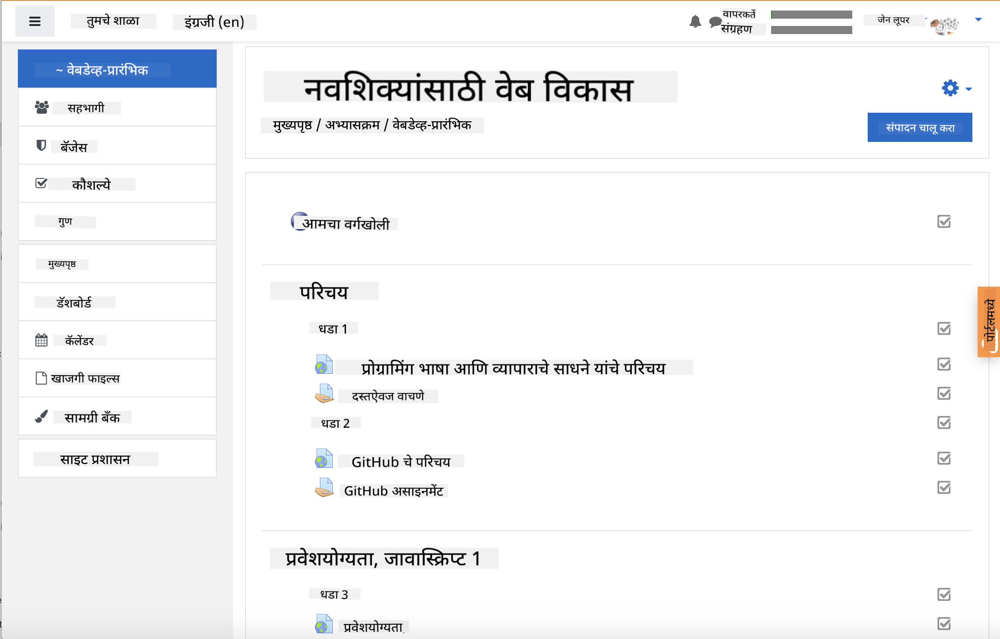

<!--
CO_OP_TRANSLATOR_METADATA:
{
  "original_hash": "75cb51f7ca9ea0b097ef4a1287e9290c",
  "translation_date": "2025-08-25T20:56:15+00:00",
  "source_file": "for-teachers.md",
  "language_code": "mr"
}
-->
## शिक्षकांसाठी

तुम्हाला तुमच्या वर्गात हा अभ्यासक्रम वापरायचा आहे का? कृपया जरूर वापरा!

खरं तर, तुम्ही GitHub Classroom वापरून GitHub मध्येच हा अभ्यासक्रम वापरू शकता.

त्यासाठी, या रेपोला फोर्क करा. तुम्हाला प्रत्येक धड्यासाठी एक रेपो तयार करावा लागेल, त्यामुळे तुम्हाला प्रत्येक फोल्डर वेगळ्या रेपोमध्ये काढावा लागेल. अशा प्रकारे, [GitHub Classroom](https://classroom.github.com/classrooms) प्रत्येक धडा स्वतंत्रपणे उचलू शकेल.

या [पूर्ण सूचना](https://github.blog/2020-03-18-set-up-your-digital-classroom-with-github-classroom/) तुम्हाला तुमचा वर्ग कसा सेट करायचा याची कल्पना देतील.

## Moodle, Canvas किंवा Blackboard मध्ये वापरणे

हा अभ्यासक्रम या Learning Management Systems मध्ये चांगला कार्य करतो! पूर्ण सामग्रीसाठी [Moodle अपलोड फाइल](../../../../../../../teaching-files/webdev-moodle.mbz) वापरा, किंवा काही सामग्री असलेली [Common Cartridge फाइल](../../../../../../../teaching-files/webdev-common-cartridge.imscc) वापरून पहा. Moodle Cloud पूर्ण Common Cartridge निर्यातांना समर्थन देत नाही, त्यामुळे Canvas मध्ये अपलोड करण्यासाठी Moodle डाउनलोड फाइल वापरणे अधिक योग्य आहे. कृपया आम्हाला हा अनुभव सुधारण्यासाठी कसे मदत करता येईल ते सांगा.

> Moodle वर्गात अभ्यासक्रम

> Canvas मध्ये अभ्यासक्रम

## रेपो जसे आहे तसे वापरणे

जर तुम्हाला GitHub Classroom न वापरता हा रेपो सध्याच्या स्वरूपात वापरायचा असेल, तर ते देखील शक्य आहे. तुम्हाला तुमच्या विद्यार्थ्यांशी संवाद साधून कोणता धडा एकत्रितपणे शिकायचा आहे ते सांगावे लागेल.

ऑनलाइन स्वरूपात (Zoom, Teams किंवा इतर) तुम्ही क्विझसाठी ब्रेकआउट रूम तयार करू शकता आणि विद्यार्थ्यांना शिकण्यासाठी तयार होण्यासाठी मार्गदर्शन करू शकता. त्यानंतर विद्यार्थ्यांना क्विझमध्ये सहभागी होण्यासाठी आमंत्रित करा आणि ठराविक वेळेत त्यांची उत्तरे 'issues' म्हणून सबमिट करण्यास सांगा. जर तुम्हाला विद्यार्थ्यांनी सार्वजनिकपणे सहकार्याने काम करावे असे वाटत असेल तर तुम्ही असाइनमेंटसाठीही हेच करू शकता.

जर तुम्हाला अधिक खाजगी स्वरूप हवे असेल, तर विद्यार्थ्यांना अभ्यासक्रम, धडा दर धडा, त्यांच्या स्वतःच्या GitHub रेपोमध्ये खाजगी रेपो म्हणून फोर्क करण्यास सांगा आणि तुम्हाला प्रवेश द्या. त्यानंतर ते क्विझ आणि असाइनमेंट खाजगीपणे पूर्ण करू शकतात आणि तुमच्या वर्गाच्या रेपोवर issues द्वारे तुम्हाला सबमिट करू शकतात.

ऑनलाइन वर्ग स्वरूपात हे कार्य करण्याचे अनेक मार्ग आहेत. कृपया तुम्हाला काय सर्वोत्तम वाटते ते आम्हाला सांगा!

## कृपया तुमचे विचार सांगा!

आम्हाला हा अभ्यासक्रम तुमच्यासाठी आणि तुमच्या विद्यार्थ्यांसाठी उपयुक्त बनवायचा आहे. [Teacher corner](https://github.com/microsoft/Web-Dev-For-Beginners/discussions/categories/teacher-corner) वर आमच्याशी संपर्क साधा आणि कोणत्याही विनंत्या, बग्स आणि अभिप्रायासाठी [**नवीन issue**](https://github.com/microsoft/Web-Dev-For-Beginners/issues/new/choose) उघडा.

**अस्वीकरण**:  
हा दस्तऐवज AI भाषांतर सेवा [Co-op Translator](https://github.com/Azure/co-op-translator) वापरून भाषांतरित करण्यात आला आहे. आम्ही अचूकतेसाठी प्रयत्नशील असलो तरी कृपया लक्षात ठेवा की स्वयंचलित भाषांतरांमध्ये त्रुटी किंवा अचूकतेचा अभाव असू शकतो. मूळ भाषेतील दस्तऐवज हा अधिकृत स्रोत मानला जावा. महत्त्वाच्या माहितीसाठी व्यावसायिक मानवी भाषांतराची शिफारस केली जाते. या भाषांतराचा वापर करून उद्भवलेल्या कोणत्याही गैरसमज किंवा चुकीच्या अर्थासाठी आम्ही जबाबदार राहणार नाही.