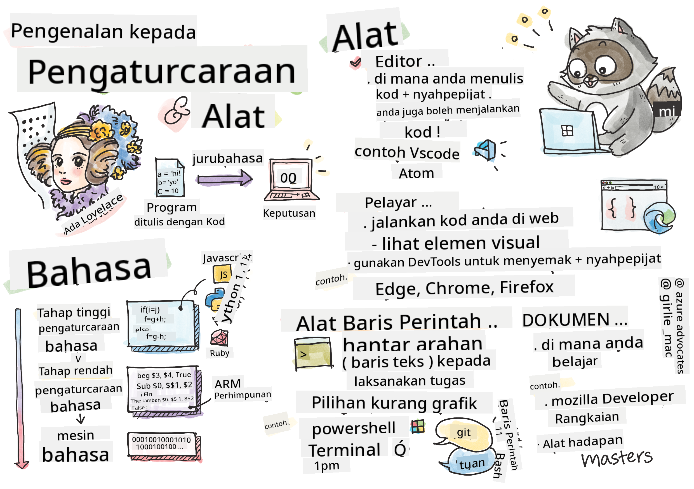

<!--
CO_OP_TRANSLATOR_METADATA:
{
  "original_hash": "2581528206a2a01c3a0b9c88e039b7bc",
  "translation_date": "2025-10-03T10:21:06+00:00",
  "source_file": "1-getting-started-lessons/1-intro-to-programming-languages/README.md",
  "language_code": "ms"
}
-->
# Pengenalan kepada Bahasa Pengaturcaraan dan Alat-alat Penting

Pelajaran ini merangkumi asas-asas bahasa pengaturcaraan. Topik yang dibincangkan di sini terpakai kepada kebanyakan bahasa pengaturcaraan moden hari ini. Dalam bahagian 'Alat-alat Penting', anda akan mempelajari perisian berguna yang membantu anda sebagai seorang pembangun.


> Sketchnote oleh [Tomomi Imura](https://twitter.com/girlie_mac)

## Kuiz Pra-Kuliah
[Kuiz pra-kuliah](https://forms.office.com/r/dru4TE0U9n?origin=lprLink)

## Pengenalan

Dalam pelajaran ini, kita akan membincangkan:

- Apa itu pengaturcaraan?
- Jenis-jenis bahasa pengaturcaraan
- Elemen asas dalam program
- Perisian dan alat berguna untuk pembangun profesional

> Anda boleh mengikuti pelajaran ini di [Microsoft Learn](https://docs.microsoft.com/learn/modules/web-development-101/introduction-programming/?WT.mc_id=academic-77807-sagibbon)!

## Apa itu Pengaturcaraan?

Pengaturcaraan (juga dikenali sebagai pengekodan) adalah proses menulis arahan untuk peranti seperti komputer atau peranti mudah alih. Arahan ini ditulis menggunakan bahasa pengaturcaraan, yang kemudian ditafsirkan oleh peranti. Set arahan ini mungkin dirujuk dengan pelbagai nama, tetapi *program*, *program komputer*, *aplikasi (app)*, dan *eksikutif* adalah beberapa nama yang popular.

*Program* boleh menjadi apa sahaja yang ditulis dengan kod; laman web, permainan, dan aplikasi telefon adalah program. Walaupun mungkin untuk mencipta program tanpa menulis kod, logik asasnya ditafsirkan oleh peranti dan logik itu kemungkinan besar ditulis dengan kod. Program yang *berjalan* atau *melaksanakan* kod sedang menjalankan arahan. Peranti yang anda gunakan untuk membaca pelajaran ini sedang menjalankan program untuk mencetaknya ke skrin anda.

✅ Lakukan sedikit penyelidikan: siapakah yang dianggap sebagai pengaturcara komputer pertama di dunia?

## Bahasa Pengaturcaraan

Bahasa pengaturcaraan membolehkan pembangun menulis arahan untuk peranti. Peranti hanya boleh memahami binari (1s dan 0s), dan bagi *kebanyakan* pembangun, itu bukan cara yang efisien untuk berkomunikasi. Bahasa pengaturcaraan adalah alat komunikasi antara manusia dan komputer.

Bahasa pengaturcaraan datang dalam pelbagai format dan mungkin mempunyai tujuan yang berbeza. Sebagai contoh, JavaScript digunakan terutamanya untuk aplikasi web, manakala Bash digunakan terutamanya untuk sistem operasi.

*Bahasa tahap rendah* biasanya memerlukan langkah yang lebih sedikit berbanding *bahasa tahap tinggi* untuk peranti menafsirkan arahan. Walau bagaimanapun, apa yang menjadikan bahasa tahap tinggi popular adalah kebolehbacaan dan sokongannya. JavaScript dianggap sebagai bahasa tahap tinggi.

Kod berikut menggambarkan perbezaan antara bahasa tahap tinggi dengan JavaScript dan bahasa tahap rendah dengan kod ARM assembly.

```javascript
let number = 10
let n1 = 0, n2 = 1, nextTerm;

for (let i = 1; i <= number; i++) {
    console.log(n1);
    nextTerm = n1 + n2;
    n1 = n2;
    n2 = nextTerm;
}
```

```c
 area ascen,code,readonly
 entry
 code32
 adr r0,thumb+1
 bx r0
 code16
thumb
 mov r0,#00
 sub r0,r0,#01
 mov r1,#01
 mov r4,#10
 ldr r2,=0x40000000
back add r0,r1
 str r0,[r2]
 add r2,#04
 mov r3,r0
 mov r0,r1
 mov r1,r3
 sub r4,#01
 cmp r4,#00
 bne back
 end
```

Percaya atau tidak, *kedua-duanya melakukan perkara yang sama*: mencetak urutan Fibonacci sehingga 10.

✅ Urutan Fibonacci [ditakrifkan](https://en.wikipedia.org/wiki/Fibonacci_number) sebagai satu set nombor di mana setiap nombor adalah jumlah dua nombor sebelumnya, bermula dari 0 dan 1. Sepuluh nombor pertama dalam urutan Fibonacci adalah 0, 1, 1, 2, 3, 5, 8, 13, 21, dan 34.

## Elemen Program

Satu arahan dalam program dipanggil *penyata* dan biasanya mempunyai watak atau jarak baris yang menandakan di mana arahan itu berakhir, atau *berhenti*. Cara program berhenti berbeza mengikut setiap bahasa.

Penyata dalam program mungkin bergantung pada data yang disediakan oleh pengguna atau dari tempat lain untuk melaksanakan arahan. Data boleh mengubah cara program berfungsi, jadi bahasa pengaturcaraan datang dengan cara untuk menyimpan data sementara supaya ia boleh digunakan kemudian. Ini dipanggil *pembolehubah*. Pembolehubah adalah penyata yang mengarahkan peranti untuk menyimpan data dalam memorinya. Pembolehubah dalam program adalah serupa dengan pembolehubah dalam algebra, di mana ia mempunyai nama unik dan nilainya mungkin berubah dari semasa ke semasa.

Ada kemungkinan bahawa beberapa penyata tidak akan dilaksanakan oleh peranti. Ini biasanya disengajakan apabila ditulis oleh pembangun atau secara tidak sengaja apabila berlaku ralat yang tidak dijangka. Kawalan jenis ini terhadap aplikasi menjadikannya lebih kukuh dan mudah diselenggara. Biasanya, perubahan kawalan ini berlaku apabila syarat tertentu dipenuhi. Penyata biasa yang digunakan dalam pengaturcaraan moden untuk mengawal cara program berjalan adalah penyata `if..else`.

✅ Anda akan mempelajari lebih lanjut tentang jenis penyata ini dalam pelajaran seterusnya.

## Alat-alat Penting

[](https://youtube.com/watch?v=69WJeXGBdxg "Tools of the Trade")

> 🎥 Klik imej di atas untuk video tentang alat-alat

Dalam bahagian ini, anda akan mempelajari beberapa perisian yang mungkin sangat berguna semasa anda memulakan perjalanan sebagai pembangun profesional.

**Persekitaran pembangunan** adalah satu set alat dan ciri unik yang sering digunakan oleh pembangun semasa menulis perisian. Beberapa alat ini telah disesuaikan untuk keperluan khusus pembangun, dan mungkin berubah dari semasa ke semasa jika pembangun itu mengubah keutamaan dalam kerja, projek peribadi, atau apabila mereka menggunakan bahasa pengaturcaraan yang berbeza. Persekitaran pembangunan adalah unik seperti pembangun yang menggunakannya.

### Editor

Salah satu alat yang paling penting untuk pembangunan perisian adalah editor. Editor adalah tempat anda menulis kod anda dan kadang-kadang tempat anda menjalankan kod anda.

Pembangun bergantung pada editor untuk beberapa sebab tambahan:

- *Debugging* membantu mengenal pasti pepijat dan ralat dengan meneliti kod, baris demi baris. Sesetengah editor mempunyai keupayaan debugging; ia boleh disesuaikan dan ditambah untuk bahasa pengaturcaraan tertentu.
- *Penyorotan sintaks* menambah warna dan format teks pada kod, menjadikannya lebih mudah dibaca. Kebanyakan editor membenarkan penyorotan sintaks yang disesuaikan.
- *Ekstensi dan Integrasi* adalah alat khusus untuk pembangun, oleh pembangun. Alat ini tidak dibina dalam editor asas. Sebagai contoh, ramai pembangun mendokumentasikan kod mereka untuk menjelaskan cara ia berfungsi. Mereka mungkin memasang ekstensi pemeriksa ejaan untuk membantu mencari kesilapan dalam dokumentasi. Kebanyakan ekstensi bertujuan untuk digunakan dalam editor tertentu, dan kebanyakan editor datang dengan cara untuk mencari ekstensi yang tersedia.
- *Penyesuaian* membolehkan pembangun mencipta persekitaran pembangunan yang unik untuk memenuhi keperluan mereka. Kebanyakan editor sangat boleh disesuaikan dan juga mungkin membenarkan pembangun mencipta ekstensi tersuai.

#### Editor Popular dan Ekstensi Pembangunan Web

- [Visual Studio Code](https://code.visualstudio.com/?WT.mc_id=academic-77807-sagibbon)
  - [Code Spell Checker](https://marketplace.visualstudio.com/items?itemName=streetsidesoftware.code-spell-checker)
  - [Live Share](https://marketplace.visualstudio.com/items?itemName=MS-vsliveshare.vsliveshare)
  - [Prettier - Code formatter](https://marketplace.visualstudio.com/items?itemName=esbenp.prettier-vscode)
- [Atom](https://atom.io/)
  - [spell-check](https://atom.io/packages/spell-check)
  - [teletype](https://atom.io/packages/teletype)
  - [atom-beautify](https://atom.io/packages/atom-beautify)
  
- [Sublimetext](https://www.sublimetext.com/)
  - [emmet](https://emmet.io/)
  - [SublimeLinter](http://www.sublimelinter.com/en/stable/)

### Pelayar

Alat penting lain adalah pelayar. Pembangun web bergantung pada pelayar untuk melihat bagaimana kod mereka berjalan di web. Ia juga digunakan untuk memaparkan elemen visual halaman web yang ditulis dalam editor, seperti HTML.

Kebanyakan pelayar datang dengan *alat pembangun* (DevTools) yang mengandungi satu set ciri dan maklumat berguna untuk membantu pembangun mengumpul dan menangkap maklumat penting tentang aplikasi mereka. Sebagai contoh: Jika halaman web mempunyai ralat, kadang-kadang berguna untuk mengetahui bila ia berlaku. DevTools dalam pelayar boleh dikonfigurasikan untuk menangkap maklumat ini.

#### Pelayar Popular dan DevTools

- [Edge](https://docs.microsoft.com/microsoft-edge/devtools-guide-chromium/?WT.mc_id=academic-77807-sagibbon)
- [Chrome](https://developers.google.com/web/tools/chrome-devtools/)
- [Firefox](https://developer.mozilla.org/docs/Tools)

### Alat Baris Perintah

Sesetengah pembangun lebih suka pandangan yang kurang grafik untuk tugas harian mereka dan bergantung pada baris perintah untuk mencapainya. Menulis kod memerlukan sejumlah besar menaip dan sesetengah pembangun lebih suka tidak mengganggu aliran mereka di papan kekunci. Mereka akan menggunakan pintasan papan kekunci untuk bertukar antara tetingkap desktop, bekerja pada fail yang berbeza, dan menggunakan alat. Kebanyakan tugas boleh diselesaikan dengan tetikus, tetapi satu manfaat menggunakan baris perintah adalah banyak yang boleh dilakukan dengan alat baris perintah tanpa perlu bertukar antara tetikus dan papan kekunci. Manfaat lain baris perintah adalah ia boleh dikonfigurasikan dan anda boleh menyimpan konfigurasi tersuai, mengubahnya kemudian, dan mengimportnya ke mesin pembangunan lain. Oleh kerana persekitaran pembangunan sangat unik kepada setiap pembangun, sesetengah akan mengelakkan menggunakan baris perintah, sesetengah akan bergantung sepenuhnya padanya, dan sesetengah lebih suka campuran kedua-duanya.

### Pilihan Baris Perintah Popular

Pilihan untuk baris perintah akan berbeza berdasarkan sistem operasi yang anda gunakan.

*💻 = datang pra-pasang pada sistem operasi.*

#### Windows

- [Powershell](https://docs.microsoft.com/powershell/scripting/overview?view=powershell-7/?WT.mc_id=academic-77807-sagibbon) 💻
- [Command Line](https://docs.microsoft.com/windows-server/administration/windows-commands/windows-commands/?WT.mc_id=academic-77807-sagibbon) (juga dikenali sebagai CMD) 💻
- [Windows Terminal](https://docs.microsoft.com/windows/terminal/?WT.mc_id=academic-77807-sagibbon)
- [mintty](https://mintty.github.io/)
  
#### MacOS

- [Terminal](https://support.apple.com/guide/terminal/open-or-quit-terminal-apd5265185d-f365-44cb-8b09-71a064a42125/mac) 💻
- [iTerm](https://iterm2.com/)
- [Powershell](https://docs.microsoft.com/powershell/scripting/install/installing-powershell-core-on-macos?view=powershell-7/?WT.mc_id=academic-77807-sagibbon)

#### Linux

- [Bash](https://www.gnu.org/software/bash/manual/html_node/index.html) 💻
- [KDE Konsole](https://docs.kde.org/trunk5/en/konsole/konsole/index.html)
- [Powershell](https://docs.microsoft.com/powershell/scripting/install/installing-powershell-core-on-linux?view=powershell-7/?WT.mc_id=academic-77807-sagibbon)

#### Alat Baris Perintah Popular

- [Git](https://git-scm.com/) (💻 pada kebanyakan sistem operasi)
- [NPM](https://www.npmjs.com/)
- [Yarn](https://classic.yarnpkg.com/en/docs/cli/)

### Dokumentasi

Apabila seorang pembangun ingin mempelajari sesuatu yang baru, mereka kemungkinan besar akan merujuk kepada dokumentasi untuk mempelajari cara menggunakannya. Pembangun sering bergantung pada dokumentasi untuk membimbing mereka tentang cara menggunakan alat dan bahasa dengan betul, dan juga untuk mendapatkan pengetahuan yang lebih mendalam tentang cara ia berfungsi.

#### Dokumentasi Popular tentang Pembangunan Web

- [Mozilla Developer Network (MDN)](https://developer.mozilla.org/docs/Web), daripada Mozilla, penerbit pelayar [Firefox](https://www.mozilla.org/firefox/)
- [Frontend Masters](https://frontendmasters.com/learn/)
- [Web.dev](https://web.dev), daripada Google, penerbit pelayar [Chrome](https://www.google.com/chrome/)
- [Dokumen pembangun Microsoft](https://docs.microsoft.com/microsoft-edge/#microsoft-edge-for-developers), untuk [Microsoft Edge](https://www.microsoft.com/edge)
- [W3 Schools](https://www.w3schools.com/where_to_start.asp)

✅ Lakukan sedikit penyelidikan: Sekarang anda tahu asas-asas persekitaran pembangun web, bandingkan dan bezakan dengan persekitaran pereka web.

---

## 🚀 Cabaran

Bandingkan beberapa bahasa pengaturcaraan. Apakah ciri unik JavaScript berbanding Java? Bagaimana pula dengan COBOL berbanding Go?

## Kuiz Pasca-Kuliah
[Kuiz pasca-kuliah](https://ff-quizzes.netlify.app/web/)

## Ulasan & Kajian Kendiri

Kajilah sedikit tentang pelbagai bahasa yang tersedia untuk pengaturcara. Cuba tulis satu baris dalam satu bahasa, dan kemudian tulis semula dalam dua bahasa lain. Apa yang anda pelajari?

## Tugasan

[Membaca Dokumentasi](assignment.md)

> Nota: Apabila memilih alat untuk tugasan anda, jangan pilih editor, pelayar, atau alat baris perintah yang telah disenaraikan di atas.

---

**Penafian**:  
Dokumen ini telah diterjemahkan menggunakan perkhidmatan terjemahan AI [Co-op Translator](https://github.com/Azure/co-op-translator). Walaupun kami berusaha untuk memastikan ketepatan, sila ambil perhatian bahawa terjemahan automatik mungkin mengandungi kesilapan atau ketidaktepatan. Dokumen asal dalam bahasa asalnya harus dianggap sebagai sumber yang berwibawa. Untuk maklumat yang kritikal, terjemahan manusia profesional adalah disyorkan. Kami tidak bertanggungjawab atas sebarang salah faham atau salah tafsir yang timbul daripada penggunaan terjemahan ini.