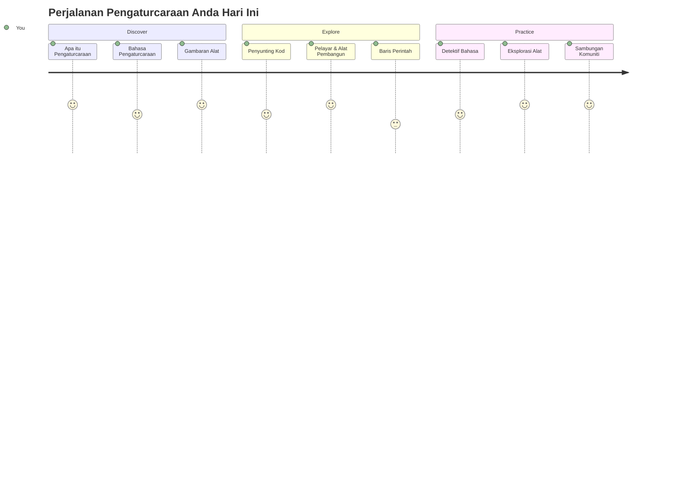
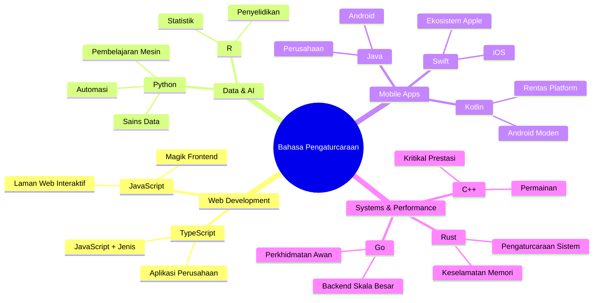
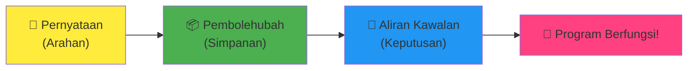
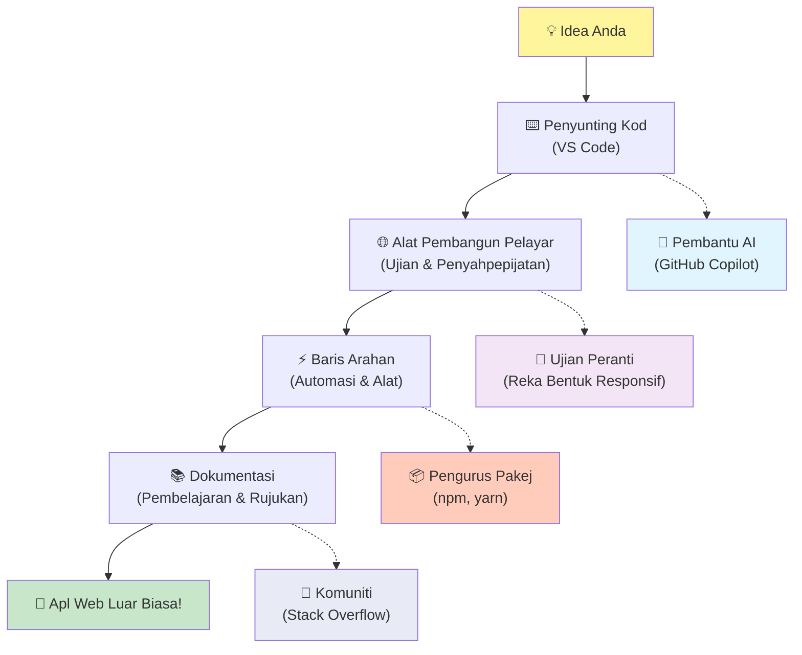
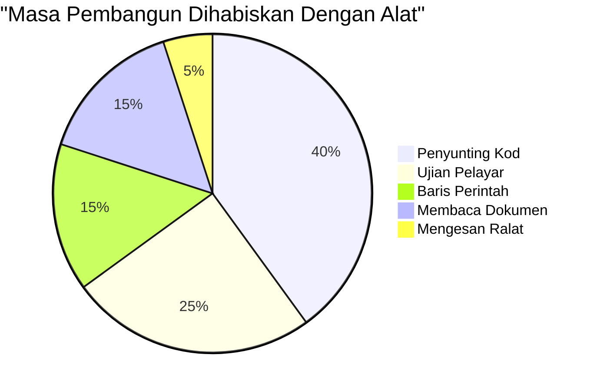
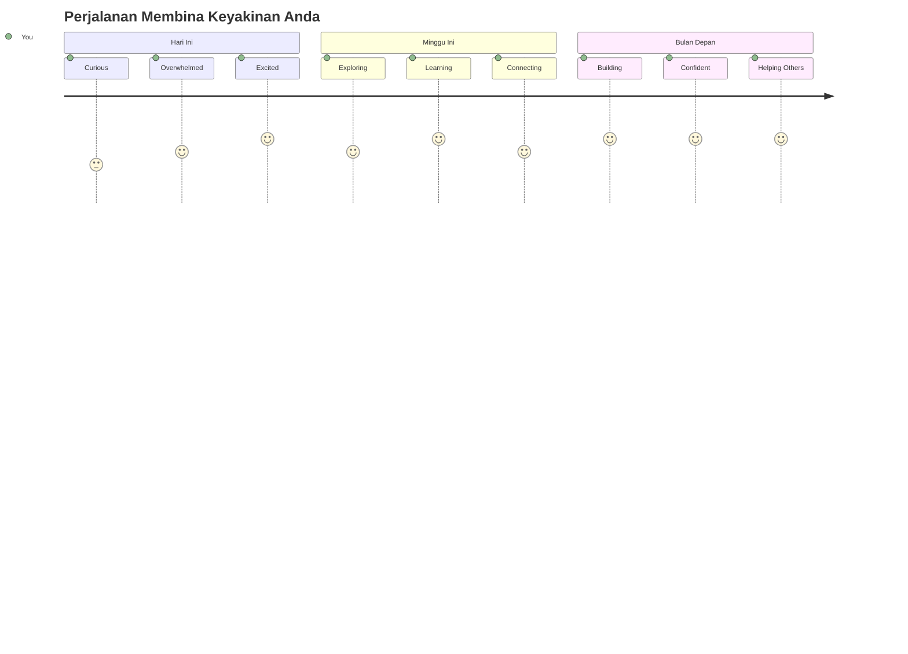

# Pengenalan kepada Bahasa Pengaturcaraan dan Alat Pembangun Moden
 
Hai di sana, bakal pembangun! 👋 Boleh saya beritahu sesuatu yang masih membuat saya teruja setiap hari? Anda bakal menemui bahawa pengaturcaraan bukan sekadar tentang komputer – ia tentang memiliki kuasa super sebenar untuk menghidupkan idea liar anda!

Anda tahu saat ketika anda menggunakan aplikasi kegemaran dan semuanya berjalan lancar? Bila anda tekan butang dan sesuatu yang benar-benar ajaib berlaku yang membuat anda berkata "wah, macam mana mereka BUAT itu?" Sebenarnya, seseorang seperti anda – mungkin sedang duduk di kedai kopi kegemaran mereka jam 2 pagi dengan espresso ketiga mereka – telah menulis kod yang mencipta keajaiban itu. Dan ini yang akan mengejutkan anda: menjelang akhir pelajaran ini, anda bukan sahaja akan faham bagaimana mereka melakukannya, tetapi anda akan teruja untuk mencubanya sendiri!

Dengar, saya faham jika pengaturcaraan terasa mencabar sekarang. Bila saya mula-mula bermula, saya benar-benar fikir anda perlu jadi genius matematik atau sudah menulis kod sejak umur lima tahun. Tetapi inilah yang mengubah pandangan saya sepenuhnya: pengaturcaraan sebenarnya seperti belajar bercakap dalam bahasa baru. Anda mula dengan "hello" dan "terima kasih," kemudian berinjak ke memesan kopi, dan sebelum anda sedar, anda sedang berborak falsafah yang mendalam! Kecuali dalam kes ini, anda berborak dengan komputer, dan jujur? Mereka adalah rakan perbualan paling sabar yang pernah anda ada – mereka tidak pernah menghukum kesilapan anda dan mereka sentiasa teruja untuk cuba lagi!

Hari ini, kita akan teroka alat luar biasa yang menjadikan pembangunan web moden bukan sahaja mungkin, tetapi sangat ketagih. Saya bercakap tentang editor, pelayar, dan aliran kerja yang sama yang digunakan oleh pembangun di Netflix, Spotify, dan studio aplikasi indie kegemaran anda setiap hari. Dan ini bahagian yang akan membuat anda menari kegembiraan: kebanyakan alat profesional ini adalah PERCUMA!


> Sketchnote oleh [Tomomi Imura](https://twitter.com/girlie_mac)


```mermaid
journey
    title Perjalanan Pengaturcaraan Anda Hari Ini
    section Discover
      Apa itu Pengaturcaraan: 5: You
      Bahasa Pengaturcaraan: 4: You
      Gambaran Alat: 5: You
    section Explore
      Penyunting Kod: 4: You
      Pelayar & Alat Pembangun: 5: You
      Baris Perintah: 3: You
    section Practice
      Detektif Bahasa: 4: You
      Eksplorasi Alat: 5: You
      Sambungan Komuniti: 5: You
```
## Mari Kita Lihat Apa Yang Anda Sudah Tahu!

Sebelum kita melompat ke perkara menyeronokkan, saya ingin tahu – apa yang sudah anda tahu tentang dunia pengaturcaraan ini? Dan dengar, jika anda melihat soalan-soalan ini dan fikir "Saya betul-betul langsung tak faham apa-apa," itu bukan sahaja okay, ia sempurna! Itu bermaksud anda berada di tempat yang betul. Anggap kuiz ini seperti regangan sebelum senaman – kita cuma memanaskan otot otak!

[Ambil kuiz pra-pelajaran](https://ff-quizzes.netlify.app/web/)


## Pengembaraan Yang Akan Kita Jalani Bersama

Baiklah, saya betul-betul teruja dengan apa yang akan kita teroka hari ini! Serius, saya harap saya dapat lihat wajah anda bila beberapa konsep ini klik. Ini perjalanan luar biasa yang akan kita lalui bersama:

- **Apa sebenarnya pengaturcaraan itu (dan kenapa ia paling hebat!)** – Kita akan terokai bagaimana kod sebenarnya adalah sihir tidak kelihatan yang memacu segala-galanya di sekitar anda, dari loceng penggera yang entah bagaimana tahu ini pagi Isnin ke algoritma yang secara sempurna menyusun cadangan Netflix anda
- **Bahasa pengaturcaraan dan personalitinya yang menakjubkan** – Bayangkan masuk ke parti di mana setiap orang mempunyai kuasa super dan cara menyelesaikan masalah yang berbeza-beza. Begitulah dunia bahasa pengaturcaraan, dan anda akan suka berjumpa mereka!
- **Blok binaan asas yang menjadikan sihir digital berlaku** – Bayangkan ini sebagai set LEGO kreatif utama. Setelah anda faham bagaimana bahagian ini bergabung, anda akan sedar anda boleh bina apa sahaja yang anda bayangkan
- **Alat profesional yang akan membuat anda rasa seperti baru diberi tongkat ahli sihir** – Saya tidak berlebih-lebihan – alat ini benar-benar akan membuat anda rasa seperti mempunyai kuasa super, dan bahagian terbaik? Ia sama yang digunakan oleh para pro!

> 💡 **Ini sebenarnya:** Jangan cuba hafal semua hari ini! Sekarang ini, saya cuma mahu anda rasa percikan teruja tentang apa yang mungkin berlaku. Butiran akan melekat secara semula jadi bila kita berlatih bersama – begitulah pembelajaran sebenar terjadi!

> Anda boleh ambil pelajaran ini di [Microsoft Learn](https://learn.microsoft.com/en-us/learn/modules/web-development-101/introduction-programming/?WT.mc_id=academic-77807-sagibbon)!

## Jadi Apa Sebenarnya *Pengaturcaraan* Itu?

Baiklah, mari kita jawab soalan bernilai juta dolar ini: apa itu pengaturcaraan sebenarnya?

Saya akan beritahu cerita yang mengubah cara saya fikir tentang ini. Minggu lepas, saya cuba terangkan kepada ibu saya cara guna alat kawalan jauh TV pintar baru kami. Saya dapati saya berkata "Tekan butang merah, tapi bukan butang merah besar, butang merah kecil di sebelah kiri... tidak, sebelah kiri yang lain... okay, sekarang tahan selama dua saat, bukan satu, bukan tiga..." Kedengaran akrab? 😅

Itulah pengaturcaraan! Ia seni memberikan arahan yang sangat terperinci, langkah demi langkah kepada sesuatu yang sangat kuat tetapi perlu semuanya dijelaskan dengan lengkap. Kecuali, bukan menerangkan kepada ibu anda (yang boleh tanya "butang merah yang mana?!"), anda menerangkan kepada komputer (yang hanya buat tepat apa yang anda suruh, walaupun apa yang anda kata bukan apa yang anda maksudkan).

Ini yang buat saya terkejut bila mula belajar: komputer sebenarnya sangat mudah dari segi asasnya. Mereka hanya faham dua perkara – 1 dan 0, yang asasnya adalah "ya" dan "tidak" atau "hidup" dan "mati." Itu sahaja! Tapi inilah yang jadi magik – kita tidak perlu bercakap dalam 1 dan 0 seperti dalam The Matrix. Di sinilah **bahasa pengaturcaraan** membantu. Ia seperti mempunyai penterjemah terbaik dunia yang mengambil pemikiran manusia biasa anda dan tukar jadi bahasa komputer.

Dan ini yang masih buat saya teruja setiap pagi bila bangun: hampir *segala-galanya* digital dalam hidup anda bermula dengan seseorang seperti anda, mungkin sedang duduk dalam baju tidur dengan secawan kopi, menaip kod di laptop mereka. Penapis Instagram yang buat anda nampak sempurna? Seseorang yang tulis kod itu. Cadangan yang membawa anda ke lagu kegemaran baru? Pembangun yang bina algoritma itu. Aplikasi yang bantu anda pecah bil makan malam dengan kawan? Ya, seseorang fikir "ini menyusahkan, saya percaya saya boleh baikinya" dan kemudian... mereka buat!

Bila anda belajar pengaturcaraan, anda bukan sekadar belajar kemahiran baru – anda menjadi sebahagian daripada komuniti hebat penyelesai masalah yang habiskan masa mereka berfikir, "Bagaimana kalau saya boleh bina sesuatu yang buat hari seseorang jadi lebih baik sikit?" Jujur, ada apa yang lebih hebat daripada itu?

✅ **Cari Fakta Menarik**: Ini sesuatu yang sangat menarik untuk dicari bila ada masa lapang – siapa yang anda fikir adalah pengaturcara komputer pertama dunia? Saya akan beri petunjuk: mungkin bukan yang anda jangkakan! Cerita tentang orang ini sangat menarik dan tunjuk pengaturcaraan sentiasa tentang kreativiti menyelesaikan masalah dan berfikir di luar kotak.

### 🧠 **Masa Semakan: Bagaimana Perasaan Anda?**

**Luangkan masa untuk fikir:**
- Adakah idea "memberi arahan kepada komputer" kini masuk akal?
- Boleh kah anda fikirkan tugas harian yang ingin anda automatikkan dengan pengaturcaraan?
- Apa soalan yang muncul dalam fikiran anda tentang perkara pengaturcaraan ini?

> **Ingat:** Normal sahaja jika beberapa konsep rasa keliru sekarang. Belajar pengaturcaraan seperti belajar bahasa baru – ambil masa untuk otak bina laluan saraf. Anda buat dengan baik!

## Bahasa Pengaturcaraan Seperti Rasa-Rasa Sihir Berbeza

Baiklah, ini mungkin kedengaran pelik, tetapi ikut saya – bahasa pengaturcaraan banyak seperti genre muzik yang berbeza. Fikirkan: ada jazz yang lancar dan spontan, rock yang kuat dan terus-terang, klasik yang anggun dan teratur, dan hip-hop yang kreatif dan ekspresif. Setiap gaya ada suasana sendiri, komuniti peminat yang bersemangat, dan setiap satu sesuai untuk mood dan acara berbeza.

Bahasa pengaturcaraan berfungsi sama! Anda tak akan guna bahasa yang sama untuk bina permainan mudah alih yang menyeronokkan dengan bahasa yang anda guna untuk analisis data iklim yang besar, sama seperti anda tak akan main death metal dalam kelas yoga (baiklah, kebanyakan kelas yoga! 😄).

Tapi ini yang betul-betul buat saya kagum setiap kali saya fikir: bahasa-bahasa ini seperti ada penterjemah paling sabar dan bijak di dunia duduk di sebelah anda. Anda boleh ungkap idea dengan cara yang semula jadi pada otak manusia anda, dan mereka uruskan kerja kompleks menterjemah itu ke dalam 1 dan 0 yang komputer faham. Macam ada kawan yang fasih kedua-dua "kreativiti manusia" dan "logik komputer" – dan mereka tak pernah penat, tak perlu rehat kopi, dan tak pernah marah bila anda tanya soalan sama dua kali!

### Bahasa Pengaturcaraan Popular dan Kegunaannya


```mermaid
mindmap
  root((Bahasa Pengaturcaraan))
    Web Development
      JavaScript
        Magik Frontend
        Laman Web Interaktif
      TypeScript
        JavaScript + Jenis
        Aplikasi Perusahaan
    Data & AI
      Python
        Sains Data
        Pembelajaran Mesin
        Automasi
      R
        Statistik
        Penyelidikan
    Mobile Apps
      Java
        Android
        Perusahaan
      Swift
        iOS
        Ekosistem Apple
      Kotlin
        Android Moden
        Rentas Platform
    Systems & Performance
      C++
        Permainan
        Kritikal Prestasi
      Rust
        Keselamatan Memori
        Pengaturcaraan Sistem
      Go
        Perkhidmatan Awan
        Backend Skala Besar
```
| Bahasa | Terbaik Untuk | Kenapa Ia Popular |
|----------|----------|------------------|
| **JavaScript** | Pembangunan web, antara muka pengguna | Berjalan dalam pelayar dan menggerakkan laman web interaktif |
| **Python** | Sains data, automasi, AI | Mudah dibaca dan dipelajari, perpustakaan yang kuat |
| **Java** | Aplikasi perusahaan, aplikasi Android | Platform-independen, kukuh untuk sistem besar |
| **C#** | Aplikasi Windows, pembangunan permainan | Sokongan ekosistem Microsoft yang kuat |
| **Go** | Perkhidmatan awan, sistem backend | Pantas, mudah, direka untuk pengkomputeran moden |

### Bahasa Tahap Tinggi vs Tahap Rendah

Baiklah, ini sebenarnya konsep yang buat minda saya 'pecah' bila mula belajar, jadi saya nak kongsi analogi yang akhirnya buat saya faham – dan saya harap ia membantu anda juga!

Bayangkan anda melawat negara yang bahasa mereka anda tak tahu, dan anda sangat perlu cari tandas terdekat (kita semua pernah lalui, kan? 😅):

- **Pengaturcaraan tahap rendah** macam belajar dialek tempatan sehingga anda boleh berborak dengan nenek yang jual buah di sudut menggunakan rujukan budaya, bahasa pasar, dan jenaka dalaman yang hanya orang tempatan faham. Sangat mengagumkan dan sangat cekap... jika anda memang fasih! Tapi agak memeningkan bila anda cuma mahu cari tandas.

- **Pengaturcaraan tahap tinggi** macam ada kawan tempatan yang faham anda betul-betul. Anda cakap "Saya betul-betul perlu cari tandas" dalam Bahasa Inggeris biasa, dan mereka uruskan semua terjemahan budaya dan bagi arah yang masuk akal untuk otak bukan tempatan anda.

Dalam istilah pengaturcaraan:
- **Bahasa tahap rendah** (seperti Assembly atau C) membenarkan anda berinteraksi secara sangat terperinci dengan perkakasan sebenar komputer, tetapi anda perlu fikir macam mesin, yang... mari kita kata satu perubahan mental yang besar!
- **Bahasa tahap tinggi** (seperti JavaScript, Python, atau C#) membenarkan anda berfikir macam manusia sementara mereka uruskan bahasa mesin di belakang tabir. Selain itu, mereka ada komuniti sangat mesra yang pernah jadi pemula dan benar-benar mahu membantu!

Teka bahasa mana saya cadangkan anda mula dengan? 😉 Bahasa tahap tinggi macam roda latihan yang anda tak mahu tanggalkan sebab ia buat pengalaman belajar lebih menyeronokkan!


```mermaid
flowchart TB
    A["👤 Pemikiran Manusia:<br/>'Saya mahu mengira nombor Fibonacci'"] --> B{Pilih Tahap Bahasa}
    
    B -->|Tahap Tinggi| C["🌟 JavaScript/Python<br/>Mudah dibaca dan ditulis"]
    B -->|Tahap Rendah| D["⚙️ Assembly/C<br/>Kawalan terus perkakasan"]
    
    C --> E["📝 Tulis: fibonacci(10)"]
    D --> F["📝 Tulis: mov r0,#00<br/>sub r0,r0,#01"]
    
    E --> G["🤖 Pemahaman Komputer:<br/>Penterjemah mengendalikan kerumitan"]
    F --> G
    
    G --> H["💻 Keputusan Sama:<br/>0, 1, 1, 2, 3, 5, 8, 13..."]
    
    style C fill:#e1f5fe
    style D fill:#fff3e0
    style H fill:#e8f5e8
```
### Saya Nak Tunjukkan Kenapa Bahasa Tahap Tinggi Lebih Mesra

Baiklah, saya nak tunjuk sesuatu yang jelas menunjukkan kenapa saya jatuh cinta pada bahasa tahap tinggi, tapi dulu – saya perlukan anda janji sesuatu. Bila lihat contoh kod pertama, jangan panik! Ia sepatutnya nampak menakutkan. Itu memang poin saya!

Kita akan lihat tugasan yang sama ditulis dalam dua gaya berbeza. Kedua-duanya cipta apa yang dipanggil urutan Fibonacci – pola matematik indah di mana setiap nombor adalah jumlah dua nombor sebelum itu: 0, 1, 1, 2, 3, 5, 8, 13... (Fakta menarik: pola ini ada di mana-mana dalam alam semula jadi – putaran biji bunga matahari, corak buah pinus, malah cara galaksi terbentuk!)

Sedia nak lihat perbezaannya? Mari!

**Bahasa tahap tinggi (JavaScript) – Mesra manusia:**

```javascript
// Langkah 1: Persediaan asas Fibonacci
const fibonacciCount = 10;
let current = 0;
let next = 1;

console.log('Fibonacci sequence:');
```

**Ini yang kod ini lakukan:**
- **Isytiharkan** satu tetap untuk tentukan berapa banyak nombor Fibonacci kita nak hasilkan
- **Mula** dengan dua pembolehubah untuk jejak nombor sekarang dan seterusnya dalam urutan
- **Tetapkan** nilai permulaan (0 dan 1) yang menentukan pola Fibonacci
- **Papar** mesej header untuk kenal pasti output kita

```javascript
// Langkah 2: Jana urutan dengan gelung
for (let i = 0; i < fibonacciCount; i++) {
  console.log(`Position ${i + 1}: ${current}`);
  
  // Kira nombor seterusnya dalam urutan
  const sum = current + next;
  current = next;
  next = sum;
}
```

**Terangkan apa yang berlaku di sini:**
- **Ulang** untuk setiap kedudukan dalam urutan menggunakan gelung `for`
- **Papar** setiap nombor dengan kedudukannya menggunakan format template literal
- **Kira** nombor Fibonacci seterusnya dengan tambah nilai sekarang dan seterusnya
- **Kemas kini** pembolehubah untuk bergerak ke iterasi seterusnya

```javascript
// Langkah 3: Pendekatan fungsional moden
const generateFibonacci = (count) => {
  const sequence = [0, 1];
  
  for (let i = 2; i < count; i++) {
    sequence[i] = sequence[i - 1] + sequence[i - 2];
  }
  
  return sequence;
};

// Contoh penggunaan
const fibSequence = generateFibonacci(10);
console.log(fibSequence);
```

**Dalam contoh di atas, kita:**
- **Cipta** fungsi boleh guna semula menggunakan sintaks fungsi anak panah moden
- **Bina** senarai untuk simpan urutan penuh daripada hanya paparkan satu demi satu
- **Guna** indeks senarai untuk kira setiap nombor baru dari nilai sebelum
- **Pulangkan** urutan penuh untuk kegunaan fleksibel dalam bahagian lain program kita

**Bahasa tahap rendah (ARM Assembly) – Mesra komputer:**

```assembly
 area ascen,code,readonly
 entry
 code32
 adr r0,thumb+1
 bx r0
 code16
thumb
 mov r0,#00
 sub r0,r0,#01
 mov r1,#01
 mov r4,#10
 ldr r2,=0x40000000
back add r0,r1
 str r0,[r2]
 add r2,#04
 mov r3,r0
 mov r0,r1
 mov r1,r3
 sub r4,#01
 cmp r4,#00
 bne back
 end
```

Perhatikan bagaimana versi JavaScript baca hampir seperti arahan dalam Bahasa Inggeris, manakala versi Assembly menggunakan arahan cryptic yang mengawal terus pemproses komputer. Kedua-duanya capai tugas yang sama, tetapi bahasa tahap tinggi jauh lebih mudah difahami, ditulis, dan diselenggara oleh manusia.

**Perbezaan utama yang anda perhatikan:**
- **Kebolehbacaan**: JavaScript menggunakan nama yang deskriptif seperti `fibonacciCount` manakala Assembly menggunakan label yang sukar difahami seperti `r0`, `r1`
- **Komen**: Bahasa aras tinggi menggalakkan komen penerangan yang menjadikan kod itu sendiri sebagai dokumentasi
- **Struktur**: Aliran logik JavaScript sepadan dengan cara manusia berfikir tentang masalah satu demi satu
- **Penyelenggaraan**: Mengemas kini versi JavaScript untuk keperluan berbeza adalah mudah dan jelas

✅ **Mengenai siri Fibonacci**: Corak nombor yang sangat indah ini (di mana setiap nombor adalah jumlah dua nombor sebelumnya: 0, 1, 1, 2, 3, 5, 8...) muncul secara harfiah *di mana-mana* dalam alam semula jadi! Anda akan menjumpainya dalam lingkaran bunga matahari, corak biji pinus, cara cengkerang nautilus melengkung, dan malah dalam cara dahan pokok tumbuh. Memang menakjubkan bagaimana matematik dan kod boleh membantu kita memahami dan menghasilkan semula corak yang digunakan alam untuk mencipta keindahan!


## Blok Bangunan Yang Membuat Keajaiban Berlaku

Baiklah, sekarang anda telah melihat bagaimana bahasa pengaturcaraan berfungsi dalam tindakan, mari kita pecahkan bahagian asas yang membentuk hampir setiap program yang pernah ditulis. Anggaplah ini sebagai bahan penting dalam resipi kegemaran anda – apabila anda memahami apa yang setiap satu lakukan, anda akan dapat membaca dan menulis kod dalam hampir mana-mana bahasa!

Ini agak seperti belajar tatabahasa pengaturcaraan. Ingat masa di sekolah apabila anda belajar tentang kata nama, kata kerja, dan bagaimana menyusun ayat? Pengaturcaraan mempunyai versi tatabahasa sendiri, dan jujurnya, ia jauh lebih logik dan memaafkan berbanding tatabahasa Bahasa Inggeris! 😄

### Penyataan: Arahan Langkah demi Langkah

Mari mulakan dengan **penyataan** – ini seperti ayat tunggal dalam perbualan dengan komputer anda. Setiap penyataan memberitahu komputer untuk melakukan satu perkara tertentu, seperti memberi arahan: "Belok kiri di sini," "Berhenti di lampu merah," "Parkir di tempat itu."

Apa yang saya suka tentang penyataan adalah betapa biasanya mudah dibaca. Lihat ini:

```javascript
// Pernyataan asas yang melaksanakan tindakan tunggal
const userName = "Alex";                    
console.log("Hello, world!");              
const sum = 5 + 3;                         
```

**Ini yang dibuat oleh kod ini:**
- **Isytihar** pembolehubah tetap untuk menyimpan nama pengguna
- **Paparkan** mesej salam ke output konsol
- **Kira** dan simpan hasil operasi matematik

```javascript
// Kenyataan yang berinteraksi dengan halaman web
document.title = "My Awesome Website";      
document.body.style.backgroundColor = "lightblue";
```

**Langkah demi langkah, ini yang berlaku:**
- **Ubah** tajuk halaman web yang muncul di tab pelayar
- **Tukar** warna latar belakang seluruh badan halaman

### Pembolehubah: Sistem Memori Program Anda

Baiklah, **pembolehubah** sebenarnya adalah salah satu konsep kegemaran saya untuk diajar kerana ia sangat mirip dengan perkara yang anda gunakan setiap hari!

Fikirkan tentang senarai kontak telefon anda seketika. Anda tidak menghafal nombor telefon setiap orang – sebaliknya, anda menyimpan "Ibu," "Kawan Baik," atau "Tempat Pizza Yang Menghantar Sehingga 2 Pagi" dan biar telefon anda mengingat nombor sebenar. Pembolehubah berfungsi dengan cara yang sama! Mereka seperti bekas berlabel di mana program anda boleh menyimpan maklumat dan mengambilnya semula menggunakan nama yang sebenar bermakna.

Ini yang sangat menarik: pembolehubah boleh berubah sewaktu program anda berjalan (oleh itu nama "pembolehubah" – nampak tak apa yang mereka buat?). Sama seperti anda mungkin mengemas kini kontak tempat pizza itu apabila anda temui tempat yang lebih baik, pembolehubah boleh dikemas kini apabila program anda mempelajari maklumat baru atau apabila keadaan berubah!

Biarkan saya tunjukkan betapa mudahnya ini:

```javascript
// Langkah 1: Mewujudkan pembolehubah asas
const siteName = "Weather Dashboard";        
let currentWeather = "sunny";               
let temperature = 75;                       
let isRaining = false;                      
```

**Memahami konsep ini:**
- **Simpan** nilai yang tidak berubah dalam pembolehubah `const` (seperti nama tapak)
- **Gunakan** `let` untuk nilai yang boleh berubah sepanjang program anda
- **Tugaskan** jenis data berbeza: rentetan (teks), nombor, dan boolean (betul/salah)
- **Pilih** nama yang deskriptif yang menjelaskan apa yang setiap pembolehubah simpan

```javascript
// Langkah 2: Bekerja dengan objek untuk mengelompokkan data berkaitan
const weatherData = {                       
  location: "San Francisco",
  humidity: 65,
  windSpeed: 12
};
```

**Dalam contoh di atas, kita telah:**
- **Buat** objek untuk mengumpul maklumat cuaca berkaitan
- **Susun** pelbagai data di bawah satu nama pembolehubah
- **Gunakan** pasangan kunci-nilai untuk memberi label setiap maklumat dengan jelas

```javascript
// Langkah 3: Menggunakan dan mengemas kini pembolehubah
console.log(`${siteName}: Today is ${currentWeather} and ${temperature}°F`);
console.log(`Wind speed: ${weatherData.windSpeed} mph`);

// Mengemas kini pembolehubah yang boleh diubah
currentWeather = "cloudy";                  
temperature = 68;                          
```

**Mari fahami setiap bahagian:**
- **Paparkan** maklumat menggunakan literal templat dengan sintaks `${}`
- **Akses** sifat objek menggunakan notasi titik (`weatherData.windSpeed`)
- **Kemas kini** pembolehubah yang diisytiharkan dengan `let` untuk mencerminkan keadaan yang berubah
- **Gabungkan** beberapa pembolehubah untuk membuat mesej yang bermakna

```javascript
// Langkah 4: Pemecahan moden untuk kod yang lebih kemas
const { location, humidity } = weatherData; 
console.log(`${location} humidity: ${humidity}%`);
```

**Apa yang anda perlu tahu:**
- **Ekstrak** sifat tertentu dari objek menggunakan penugasan destruktur
- **Buat** pembolehubah baru secara automatik dengan nama yang sama seperti kunci objek
- **Permudahkan** kod dengan mengelakkan penggunaan notasi titik berulang

### Aliran Kawalan: Mengajar Program Anda Berfikir

Baiklah, di sinilah pengaturcaraan jadi sangat menakjubkan! **Aliran kawalan** adalah mengajar program anda bagaimana membuat keputusan bijak, sama seperti yang anda lakukan setiap hari tanpa perlu berfikir.

Bayangkan ini: pagi ini anda mungkin melalui sesuatu seperti "Jika hujan, saya akan ambil payung. Jika sejuk, saya akan pakai jaket. Jika lambat, saya akan tinggalkan sarapan dan ambil kopi dalam perjalanan." Otak anda secara semula jadi mengikuti logik jika-kemudian ini berpuluh kali setiap hari!

Ini yang membuat program rasa pintar dan hidup, bukannya hanya mengikuti skrip membosankan dan boleh dijangka. Mereka sebenarnya boleh melihat keadaan, menilai apa yang sedang berlaku, dan memberi tindak balas yang sesuai. Ia seperti memberi program anda otak yang boleh menyesuaikan diri dan membuat pilihan!

Nak tengok betapa hebatnya ini berfungsi? Mari saya tunjukkan:

```javascript
// Langkah 1: Logik bersyarat asas
const userAge = 17;

if (userAge >= 18) {
  console.log("You can vote!");
} else {
  const yearsToWait = 18 - userAge;
  console.log(`You'll be able to vote in ${yearsToWait} year(s).`);
}
```

**Ini yang dibuat oleh kod ini:**
- **Periksa** jika umur pengguna memenuhi syarat mengundi
- **Jalankan** blok kod berbeza berdasarkan hasil keadaan
- **Kira** dan paparkan berapa lama lagi sehingga layak mengundi jika bawah 18
- **Berikan** maklum balas khusus yang membantu untuk setiap senario

```javascript
// Langkah 2: Pelbagai syarat dengan operator logik
const userAge = 17;
const hasPermission = true;

if (userAge >= 18 && hasPermission) {
  console.log("Access granted: You can enter the venue.");
} else if (userAge >= 16) {
  console.log("You need parent permission to enter.");
} else {
  console.log("Sorry, you must be at least 16 years old.");
}
```

**Memecahkan apa yang berlaku di sini:**
- **Gabungkan** pelbagai syarat menggunakan operator `&&` (dan)
- **Bina** hierarki syarat menggunakan `else if` untuk berbilang senario
- **Tangani** semua kemungkinan dengan penyataan `else` terakhir
- **Berikan** maklum balas yang jelas dan boleh bertindak untuk setiap situasi berbeza

```javascript
// Langkah 3: Syarat ringkas dengan operator ternari
const votingStatus = userAge >= 18 ? "Can vote" : "Cannot vote yet";
console.log(`Status: ${votingStatus}`);
```

**Apa yang anda perlu ingat:**
- **Gunakan** operator terner (`? :`) untuk syarat dua pilihan mudah
- **Tulis** syarat dulu, ikut dengan `?`, kemudian hasil benar, kemudian `:`, kemudian hasil salah
- **Gunakan** corak ini apabila mahu tugaskan nilai berdasarkan syarat

```javascript
// Langkah 4: Mengendalikan pelbagai kes khusus
const dayOfWeek = "Tuesday";

switch (dayOfWeek) {
  case "Monday":
  case "Tuesday":
  case "Wednesday":
  case "Thursday":
  case "Friday":
    console.log("It's a weekday - time to work!");
    break;
  case "Saturday":
  case "Sunday":
    console.log("It's the weekend - time to relax!");
    break;
  default:
    console.log("Invalid day of the week");
}
```

**Kod ini mencapai perkara berikut:**
- **Padankan** nilai pembolehubah dengan beberapa kes spesifik
- **Kumpulkan** kes yang serupa (hari bekerja lawan hujung minggu)
- **Jalankan** blok kod yang tepat apabila ada padanan
- **Sertakan** kes `default` untuk menangani nilai yang tidak dijangka
- **Gunakan** penyataan `break` untuk mengelakkan kod terus ke kes seterusnya

> 💡 **Analogi dunia sebenar**: Fikirkan aliran kawalan seperti mempunyai GPS yang paling sabar di dunia memberi arahan. Ia mungkin berkata "Jika ada trafik di Jalan Utama, ambil lebuh raya sebagai gantinya. Jika pembinaan menghalang lebuh raya, cuba laluan yang indah." Program menggunakan jenis logik bersyarat yang sama untuk memberi maklum balas secara bijak kepada pelbagai situasi dan sentiasa memberikan pengguna pengalaman terbaik.

### 🎯 **Semakan Konsep: Penguasaan Blok Bangunan**

**Mari kita lihat sejauh mana pemahaman anda tentang asas:**
- Boleh tak terangkan perbezaan antara pembolehubah dan penyataan dengan kata-kata anda sendiri?
- Fikirkan satu senario dunia sebenar di mana anda akan gunakan keputusan if-then (seperti contoh pengundian kita)
- Apa satu perkara mengenai logik pengaturcaraan yang buat anda terkejut?

**Peningkat keyakinan cepat:**

```mermaid
flowchart LR
    A["📝 Pernyataan<br/>(Arahan)"] --> B["📦 Pembolehubah<br/>(Simpanan)"] --> C["🔀 Aliran Kawalan<br/>(Keputusan)"] --> D["🎉 Program Berfungsi!"]
    
    style A fill:#ffeb3b
    style B fill:#4caf50
    style C fill:#2196f3
    style D fill:#ff4081
```
✅ **Apa yang akan datang**: Kita akan berseronok meneroka lebih mendalam tentang konsep ini sambil meneruskan perjalanan luar biasa ini bersama! Sekarang, fokus saja pada rasa keterujaan tentang semua kemungkinan menakjubkan yang menanti anda. Kemahiran dan teknik khusus akan terhasil secara semula jadi apabila kita berlatih bersama – saya janji ini akan jadi lebih menyeronokkan dari yang anda sangka!

## Alat Perdagangan

Baiklah, ini sebenarnya buat saya sangat teruja sampai tak sabar nak berkongsi! 🚀 Kita akan bercakap tentang alat luar biasa yang akan buat anda rasa seolah-olah baru saja diberi kunci ke kapal angkasa digital.

Anda tahu bagaimana chef ada pisau yang seimbang sempurna yang terasa seperti sambungan tangan mereka? Atau bagaimana pemuzik ada gitar yang seolah-olah bernyanyi sebaik sahaja disentuh? Baiklah, pembangun ada versi alat ajaib mereka sendiri, dan inilah yang akan benar-benar mengejutkan anda – kebanyakannya percuma sepenuhnya!

Saya secara harfiah teruja untuk berkongsi ini dengan anda kerana ia telah merevolusikan cara kita membina perisian. Kita bercakap tentang pembantu pengekodan berkuasa AI yang boleh membantu menulis kod anda (saya tak bergurau!), persekitaran awan di mana anda boleh bina aplikasi penuh dari mana-mana sahaja dengan Wi-Fi, dan alat menyahpepijat yang sangat canggih seolah-olah ada penglihatan sinar-X untuk program anda.

Dan bahagian yang masih membuat saya berdebar: ini bukan "alat untuk pemula" yang akan anda tinggalkan bila dah maju. Ini adalah alat profesional yang sama yang digunakan oleh pembangun di Google, Netflix, dan studio aplikasi indie kegemaran anda ketika ini. Anda akan rasa sangat pro menggunakan mereka!


```mermaid
graph TD
    A["💡 Idea Anda"] --> B["⌨️ Penyunting Kod<br/>(VS Code)"] 
    B --> C["🌐 Alat Pembangun Pelayar<br/>(Ujian & Penyahpepijatan)"]
    C --> D["⚡ Baris Arahan<br/>(Automasi & Alat)"]
    D --> E["📚 Dokumentasi<br/>(Pembelajaran & Rujukan)"]
    E --> F["🚀 Apl Web Luar Biasa!"]
    
    B -.-> G["🤖 Pembantu AI<br/>(GitHub Copilot)"]
    C -.-> H["📱 Ujian Peranti<br/>(Reka Bentuk Responsif)"]
    D -.-> I["📦 Pengurus Pakej<br/>(npm, yarn)"]
    E -.-> J["👥 Komuniti<br/>(Stack Overflow)"]
    
    style A fill:#fff59d
    style F fill:#c8e6c9
    style G fill:#e1f5fe
    style H fill:#f3e5f5
    style I fill:#ffccbc
    style J fill:#e8eaf6
```
### Penyunting Kod dan IDE: Sahabat Digital Baru Anda

Mari kita bercakap tentang penyunting kod – ini benar-benar akan jadi tempat kegemaran baru anda untuk melepak! Anggapkan mereka sebagai sanctuary pengaturcaraan peribadi di mana anda akan habiskan masa paling banyak hasilkan dan sempurnakan ciptaan digital anda.

Tapi inilah yang sangat ajaib tentang penyunting moden: mereka bukan sahaja editor teks biasa. Mereka seperti mempunyai mentor pengekodan yang paling bijak dan penyokong sentiasa di sebelah anda 24/7. Mereka tangkap kesilapan taip sebelum anda sedar, cadangkan penambahbaikan yang membuat anda kelihatan genius, bantu anda faham apa yang setiap bahagian kod buat, dan sesetengahnya boleh jangka apa yang anda mahu taip dan tawarkan habiskan fikiran anda!

Saya ingat bila pertama kali saya jumpa auto-completion – saya rasa macam hidup dalam masa depan. Anda mula taip sesuatu, penyunting anda kata, "Eh, adakah anda fikir tentang fungsi ini yang buat apa yang anda perlukan?" Macam ada pembaca fikiran sebagai rakan pengekodan!

**Apa yang buat penyunting ini sangat hebat?**

Penyunting kod moden menawarkan pelbagai ciri yang mengagumkan direka untuk meningkatkan produktiviti anda:

| Ciri | Apa Yang Dilakukan | Kenapa Ia Membantu |
|---------|--------------|--------------|
| **Penyorotan Sintaks** | Warnakan bahagian kod berbeza | Memudahkan baca kod dan kesilapan dikesan |
| **Auto-selesaian** | Cadangkan kod semasa taip | Mempercepat pengekodan dan kurangkan kesilapan taip |
| **Alat Penyahpepijatan** | Bantu cari dan betulkan kesilapan | Jimatkan jam penyelesaian masalah |
| **Sambungan** | Tambah ciri khusus | Sesuaikan penyunting untuk teknologi apa pun |
| **Pembantu AI** | Cadangkan kod dan penerangan | Mempercepat pembelajaran dan produktiviti |

> 🎥 **Sumber Video**: Nak tengok alat-alat ini beraksi? Tonton [video Tools of the Trade](https://youtube.com/watch?v=69WJeXGBdxg) untuk gambaran menyeluruh.

#### Penyunting Disyorkan untuk Pembangunan Web

**[Visual Studio Code](https://code.visualstudio.com/?WT.mc_id=academic-77807-sagibbon)** (Percuma)
- Paling popular di kalangan pembangun web
- Ekosistem sambungan yang cemerlang
- Terminal terbina dalam dan integrasi Git
- **Sambungan wajib ada**:
  - [GitHub Copilot](https://marketplace.visualstudio.com/items?itemName=GitHub.copilot) - Cadangan kod berkuasa AI
  - [Live Share](https://marketplace.visualstudio.com/items?itemName=MS-vsliveshare.vsliveshare) - Kolaborasi masa nyata
  - [Prettier](https://marketplace.visualstudio.com/items?itemName=esbenp.prettier-vscode) - Format kod automatik
  - [Code Spell Checker](https://marketplace.visualstudio.com/items?itemName=streetsidesoftware.code-spell-checker) - Tangkap salah eja dalam kod anda

**[JetBrains WebStorm](https://www.jetbrains.com/webstorm/)** (Berbayar, percuma untuk pelajar)
- Alat penyahpepijatan dan ujian lanjutan
- Penyiapan kod pintar
- Kawalan versi terbina dalam

**IDE Berasaskan Awan** (Harga pelbagai)
- [GitHub Codespaces](https://github.com/features/codespaces) - VS Code penuh dalam pelayar anda
- [Replit](https://replit.com/) - Bagus untuk belajar dan berkongsi kod
- [StackBlitz](https://stackblitz.com/) - Pembangunan web penuh serta-merta

> 💡 **Tip Memulakan**: Mula dengan Visual Studio Code – ia percuma, digunakan secara meluas dalam industri, dan mempunyai komuniti besar yang menghasilkan tutorial dan sambungan berguna.


### Pelayar Web: Makmal Pembangunan Rahsia Anda

Baiklah, bersiaplah untuk minda anda benar-benar dikejutkan! Anda tahu bagaimana anda gunakan pelayar untuk tatal media sosial dan tonton video? Sebenarnya mereka menyembunyikan makmal pembangun rahsia yang luar biasa ini sepanjang masa, hanya menunggu anda untuk temui!

Setiap kali anda klik kanan pada halaman web dan pilih "Inspect Element," anda membuka dunia tersembunyi alat pembangun yang sebenarnya lebih kuat daripada beberapa perisian mahal yang saya pernah bayar ratusan ringgit. Ia seperti menemui bahawa dapur lama anda rupanya menyembunyikan makmal chef profesional di belakang panel rahsia!
Pertama kali seseorang menunjukkan saya DevTools pelayar, saya menghabiskan kira-kira tiga jam hanya klik-keliling dan berkata "TUNGGU, IA BOLEH BUAT ITU JUGA?!" Anda boleh secara literal mengedit mana-mana laman web secara masa nyata, melihat dengan tepat betapa cepatnya segala-galanya dimuatkan, menguji bagaimana rupa tapak anda pada peranti yang berbeza, dan bahkan debug JavaScript seperti seorang profesional total. Ia sungguh menakjubkan!

**Inilah sebab mengapa pelayar adalah senjata rahsia anda:**

Apabila anda mencipta laman web atau aplikasi web, anda perlu melihat bagaimana rupa dan kelakuannya di dunia sebenar. Pelayar bukan sahaja memaparkan hasil kerja anda tetapi juga memberikan maklum balas terperinci tentang prestasi, aksesibiliti, dan isu-isu yang berpotensi.

#### Alat Pembangun Pelayar (DevTools)

Pelayar moden termasuk suite pembangunan yang menyeluruh:

| Kategori Alat | Apa Yang Ia Lakukan | Contoh Kes Penggunaan |
|---------------|--------------------|----------------------|
| **Pemeriksa Elemen** | Lihat dan sunting HTML/CSS secara masa nyata | Laraskan gaya untuk melihat keputusan serta-merta |
| **Konsol** | Lihat mesej ralat dan uji JavaScript | Debug masalah dan cuba kod |
| **Pemantau Rangkaian** | Jejak bagaimana sumber dimuat | Optimumkan prestasi dan masa memuat |
| **Pemeriksa Aksesibiliti** | Uji reka bentuk inklusif | Pastikan tapak anda berfungsi untuk semua pengguna |
| **Simulator Peranti** | Pratonton pada saiz skrin yang berbeza | Uji reka bentuk responsif tanpa perlu banyak peranti |

#### Pelayar Disyorkan untuk Pembangunan

- **[Chrome](https://developers.google.com/web/tools/chrome-devtools/)** - DevTools standard industri dengan dokumentasi yang luas
- **[Firefox](https://developer.mozilla.org/docs/Tools)** - Alat hebat untuk CSS Grid dan aksesibiliti
- **[Edge](https://docs.microsoft.com/microsoft-edge/devtools-guide-chromium/?WT.mc_id=academic-77807-sagibbon)** - Dibina atas Chromium dengan sumber pembangun Microsoft

> ⚠️ **Petua Ujian Penting**: Sentiasa uji laman web anda dalam pelbagai pelayar! Apa yang berfungsi dengan sempurna di Chrome mungkin kelihatan berbeza di Safari atau Firefox. Pembangun profesional menguji merentas semua pelayar utama untuk memastikan pengalaman pengguna yang konsisten.


### Alat Baris Perintah: Pintu Masuk Anda Kepada Kuasa Super Pembangun

Baiklah, mari kita jujur di sini tentang baris perintah, kerana saya mahu anda dengar ini dari seseorang yang benar-benar faham. Apabila saya pertama kali melihatnya – hanya skrin hitam menakutkan dengan teks berkedip – saya secara literal fikir, "Tidak, langsung tidak! Ini nampak macam dari filem penggodam 1980-an, dan saya memang tidak cukup bijak untuk ini!" 😅

Tetapi inilah yang saya harap seseorang beritahu saya dulu, dan yang saya beritahu anda sekarang: baris perintah tidak menakutkan – ia sebenarnya seperti berbual secara langsung dengan komputer anda. Fikirkan ia seperti perbezaan antara memesan makanan melalui aplikasi mewah dengan gambar dan menu (yang mudah dan senang) berbanding berjalan masuk ke restoran tempatan kegemaran anda di mana cef tahu dengan tepat apa yang anda suka dan boleh menghidangkan sesuatu yang sempurna hanya dengan anda berkata "kejutan saya dengan sesuatu yang hebat."

Baris perintah adalah tempat pembangun merasa seperti ahli sihir sebenar. Anda taip beberapa perkataan yang kelihatan ajaib (baiklah, ia cuma arahan, tetapi ia terasa ajaib!), tekan enter, dan BOOM – anda telah mencipta struktur projek keseluruhan, memasang alat berkuasa dari seluruh dunia, atau melancarkan aplikasi anda ke internet untuk berjuta-juta orang lihat. Setelah anda merasai kuasa itu buat kali pertama, secara jujur sangat ketagihan!

**Kenapa baris perintah akan menjadi alat kegemaran anda:**

Walaupun antara muka grafik bagus untuk banyak tugas, baris perintah unggul dalam automasi, ketepatan, dan kelajuan. Banyak alat pembangunan berfungsi terutamanya melalui antara muka baris perintah, dan mempelajari cara menggunakannya dengan cekap boleh meningkat produktiviti anda secara mendadak.

```bash
# Langkah 1: Cipta dan navigasi ke direktori projek
mkdir my-awesome-website
cd my-awesome-website
```

**Ini yang kod ini lakukan:**
- **Cipta** direktori baru bernama "my-awesome-website" untuk projek anda
- **Navigasi** ke dalam direktori yang baru dicipta untuk mula bekerja

```bash
# Langkah 2: Inisialisasi projek dengan package.json
npm init -y

# Pasang alat pembangunan moden
npm install --save-dev vite prettier eslint
npm install --save-dev @eslint/js
```

**Langkah demi langkah, ini yang berlaku:**
- **Inisialisasi** projek Node.js baru dengan tetapan lalai menggunakan `npm init -y`
- **Pasang** Vite sebagai alat bina moden untuk pembangunan dan binaan produksi cepat
- **Tambah** Prettier untuk pemformatan kod automatik dan ESLint untuk pemeriksaan kualiti kod
- **Gunakan** bendera `--save-dev` untuk menandakan ini sebagai kebergantungan khusus pembangunan

```bash
# Langkah 3: Cipta struktur projek dan fail
mkdir src assets
echo '<!DOCTYPE html><html><head><title>My Site</title></head><body><h1>Hello World</h1></body></html>' > index.html

# Mulakan server pembangunan
npx vite
```

**Dalam di atas, kami telah:**
- **Susun** projek kami dengan mencipta folder berasingan untuk kod sumber dan aset
- **Jana** fail HTML asas dengan struktur dokumen yang betul
- **Mulakan** pelayan pembangunan Vite untuk pengecasan semula langsung dan penggantian modul panas

#### Alat Baris Perintah Penting untuk Pembangunan Web

| Alat | Tujuan | Kenapa Anda Perlu Ia |
|------|--------|---------------------|
| **[Git](https://git-scm.com/)** | Kawalan versi | Jejak perubahan, bekerjasama dengan orang lain, sandarkan kerja anda |
| **[Node.js & npm](https://nodejs.org/)** | Runtime JavaScript & pengurusan pakej | Jalankan JavaScript di luar pelayar, pasang alat pembangunan moden |
| **[Vite](https://vitejs.dev/)** | Alat bina & pelayan pembangunan | Pembangunan pantas dengan penggantian modul panas |
| **[ESLint](https://eslint.org/)** | Kualiti kod | Cari dan betulkan masalah dalam JavaScript anda secara automatik |
| **[Prettier](https://prettier.io/)** | Pemformatan kod | Kekalkan kod anda sentiasa format dan mudah dibaca |

#### Pilihan Spesifik Platform

**Windows:**
- **[Windows Terminal](https://docs.microsoft.com/windows/terminal/?WT.mc_id=academic-77807-sagibbon)** - Terminal moden, kaya ciri
- **[PowerShell](https://docs.microsoft.com/powershell/?WT.mc_id=academic-77807-sagibbon)** 💻 - Persekitaran skrip yang berkuasa
- **[Command Prompt](https://docs.microsoft.com/windows-server/administration/windows-commands/?WT.mc_id=academic-77807-sagibbon)** 💻 - Baris perintah Windows tradisional

**macOS:**
- **[Terminal](https://support.apple.com/guide/terminal/)** 💻 - Aplikasi terminal terbina dalam
- **[iTerm2](https://iterm2.com/)** - Terminal dipertingkat dengan ciri lanjutan

**Linux:**
- **[Bash](https://www.gnu.org/software/bash/)** 💻 - Shell Linux standard
- **[KDE Konsole](https://docs.kde.org/trunk5/en/konsole/konsole/index.html)** - Emulator terminal canggih

> 💻 = Terpasang secara lalai dalam sistem operasi

> 🎯 **Jalur Pembelajaran**: Mula dengan arahan asas seperti `cd` (tukar direktori), `ls` atau `dir` (senaraikan fail), dan `mkdir` (cipta folder). Amalkan dengan arahan aliran kerja moden seperti `npm install`, `git status`, dan `code .` (buka direktori semasa dalam VS Code). Apabila anda semakin selesa, anda akan secara semula jadi mempelajari arahan lebih maju dan teknik automasi.


### Dokumentasi: Mentor Pembelajaran Anda Yang Sentiasa Ada

Baiklah, saya nak kongsi rahsia kecil yang akan buat anda rasa lebih baik tentang menjadi seorang pemula: malah pembangun yang paling berpengalaman menghabiskan sebahagian besar masa mereka membaca dokumentasi. Dan itu bukan kerana mereka tidak tahu apa yang mereka buat – sebenarnya itu tanda kebijaksanaan!

Fikirkan dokumentasi sebagai akses kepada guru paling penyabar dan berpengetahuan di dunia yang sentiasa tersedia 24/7. Terperangkap dengan masalah jam 2 pagi? Dokumentasi ada dengan pelukan maya hangat dan jawapan tepat yang anda perlukan. Nak belajar tentang ciri baru yang semua orang bercakap? Dokumentasi sentiasa membantu dengan contoh langkah demi langkah. Cuba faham kenapa sesuatu berfungsi seperti itu? Anda dah teka – dokumentasi bersedia menerangkannya dengan cara yang akhirnya buat anda faham!

Ini sesuatu yang benar-benar mengubah perspektif saya: dunia pembangunan web bergerak sangat pantas, dan tiada siapa (saya maksudkan langsung tiada!) yang menghafal semua perkara. Saya lihat pembangun senior dengan pengalaman lebih 15 tahun mencari semula sintaks asas, dan anda tahu apa? Itu bukan memalukan – itu pintar! Ia bukan tentang ingatan yang sempurna; ia tentang tahu di mana untuk cari jawapan boleh dipercayai dengan cepat dan faham cara nak guna.

**Inilah tempat magik sebenar berlaku:**

Pembangun profesional menghabiskan sebahagian besar masa mereka membaca dokumentasi – bukan sebab mereka tidak tahu apa yang mereka buat, tetapi kerana lanskap pembangunan web berkembang begitu pantas sehingga untuk kekal terkini memerlukan pembelajaran berterusan. Dokumentasi yang baik membantu anda faham bukan sahaja *bagaimana* menggunakan sesuatu, tetapi *kenapa* dan *bila* nak gunakannya.

#### Sumber Dokumentasi Penting

**[Mozilla Developer Network (MDN)](https://developer.mozilla.org/docs/Web)**
- Standard emas untuk dokumentasi teknologi web
- Panduan komprehensif untuk HTML, CSS, dan JavaScript
- Termasuk maklumat keserasian pelayar
- Mempunyai contoh praktikal dan demo interaktif

**[Web.dev](https://web.dev)** (oleh Google)
- Amalan terbaik pembangunan web moden
- Panduan pengoptimuman prestasi
- Prinsip aksesibiliti dan reka bentuk inklusif
- Kajian kes dari projek dunia sebenar

**[Microsoft Developer Documentation](https://docs.microsoft.com/microsoft-edge/#microsoft-edge-for-developers)**
- Sumber pembangunan pelayar Edge
- Panduan Progressive Web App
- Wawasan pembangunan lintas platform

**[Frontend Masters Learning Paths](https://frontendmasters.com/learn/)**
- Kurikulum pembelajaran terstruktur
- Kursus video dari pakar industri
- Latihan pengkodan praktikal

> 📚 **Strategi Belajar**: Jangan cuba menghafal dokumentasi – sebaliknya, pelajari cara melayarinya dengan cekap. Tandai rujukan yang kerap digunakan dan amalkan menggunakan fungsi carian untuk mencari maklumat spesifik dengan cepat.

### 🔧 **Semak Kemahiran Alat: Apa Yang Resonates Dengan Anda?**

**Luangkan masa untuk fikirkan:**
- Alat mana yang paling anda teruja untuk cuba dahulu? (Tiada jawapan salah!)
- Adakah baris perintah masih rasa menakutkan, atau anda jadi ingin tahu tentangnya?
- Bolehkah anda bayangkan menggunakan DevTools pelayar untuk mengintip di sebalik tirai laman web kegemaran anda?


```mermaid
pie title "Masa Pembangun Dihabiskan Dengan Alat"
    "Penyunting Kod" : 40
    "Ujian Pelayar" : 25
    "Baris Perintah" : 15
    "Membaca Dokumen" : 15
    "Mengesan Ralat" : 5
```
> **Info menarik**: Kebanyakan pembangun menghabiskan kira-kira 40% masa mereka dalam editor kod mereka, tapi perhatikan berapa banyak masa yang digunakan untuk ujian, pembelajaran, dan penyelesaian masalah. Pengaturcaraan bukan hanya menulis kod – ia tentang mereka pengalaman!

✅ **Makanan untuk difikirkan**: Ini sesuatu yang menarik untuk direnungkan – bagaimana anda fikir alat untuk membina laman web (pembangunan) mungkin berbeza dari alat untuk mereka bagaimana ia nampak (reka bentuk)? Ia seperti perbezaan antara seorang arkitek yang mereka rumah cantik dan kontraktor yang sebenarnya membinanya. Kedua-duanya penting, tapi mereka perlukan kotak alat yang berbeza! Cara berfikir ini akan sangat membantu anda melihat gambaran besar bagaimana laman web menjadi hidup.

## Cabaran Ejen GitHub Copilot 🚀

Gunakan mod Ejen untuk melengkapkan cabaran berikut:

**Deskripsi:** Terokai ciri-ciri editor kod moden atau IDE dan tunjukkan bagaimana ia boleh memperbaiki aliran kerja anda sebagai pembangun web.

**Arahan:** Pilih editor kod atau IDE (seperti Visual Studio Code, WebStorm, atau IDE berasaskan awan). Senaraikan tiga ciri atau sambungan yang membantu anda menulis, debug, atau menyelenggara kod dengan lebih cekap. Untuk setiap satu, berikan penjelasan ringkas bagaimana ia menguntungkan aliran kerja anda.

---

## 🚀 Cabaran

**Baiklah, detektif, sedia untuk kes pertama anda?**

Kini anda sudah mempunyai asas hebat ini, saya ada pengembaraan yang akan membantu anda lihat betapa pelbagai dan menariknya dunia pengaturcaraan sebenarnya. Dan dengar – ini bukan tentang menulis kod lagi, jadi jangan risau! Anggap diri anda sebagai detektif bahasa pengaturcaraan dalam kes pertama yang sangat menarik!

**Misi anda, jika anda setuju menerimanya:**
1. **Jadilah peneroka bahasa**: Pilih tiga bahasa pengaturcaraan dari alam berbeza sama sekali – mungkin satu yang bina laman web, satu yang cipta aplikasi mudah alih, dan satu yang mengira data untuk saintis. Cari contoh tugasan sama yang ditulis dalam setiap bahasa. Saya janji anda akan sangat kagum bagaimana berbeza rupa mereka walaupun buat perkara tepat sama!

2. **Dedahkan cerita asal usul mereka**: Apa yang buat setiap bahasa istimewa? Ini fakta menarik – setiap bahasa pengaturcaraan dicipta kerana ada orang fikir, "Tahu tak? Pasti ada cara yang lebih baik untuk selesaikan masalah tertentu ini." Bolehkah anda cari apa masalah itu? Sesetengah cerita ini memang sangat menarik!

3. **Kenali komuniti mereka**: Lihat betapa mesra dan bersemangat komuniti setiap bahasa. Ada yang mempunyai berjuta pembangun berkongsi ilmu dan saling membantu, ada yang lebih kecil tapi sangat rapat dan menyokong. Anda pasti suka lihat personaliti berbeza setiap komuniti!

4. **Ikut gerak hati anda**: Bahasa mana yang rasa paling mesra untuk anda sekarang? Jangan stres nak buat pilihan "sempurna" – ikut sahaja naluri! Tiada jawapan salah di sini, dan anda boleh selidik yang lain kemudian.

**Kerja detektif tambahan**: Cuba cari laman web atau aplikasi utama yang dibina dengan setiap bahasa. Saya jamin anda akan terkejut belajar apa yang memacu Instagram, Netflix, atau permainan mudah alih yang anda tak boleh berhenti main tu!

> 💡 **Ingat**: Anda tidak cuba jadi pakar dalam mana-mana bahasa hari ini. Anda cuma nak kenal kawasan sekitar sebelum buat keputusan nak mulakan di mana. Ambil masa, berseronok, dan biar keingintahuan memandu anda!

## Mari Raikan Apa Yang Anda Telah Temui!

Wah, anda telah menyerap begitu banyak maklumat hebat hari ini! Saya sungguh teruja nak lihat berapa banyak daripada perjalanan menakjubkan ini yang melekat dalam fikiran anda. Dan ingat – ini bukan ujian di mana anda perlu sempurna semuanya. Ini lebih kepada sambutan semua perkara hebat yang anda telah pelajari tentang dunia menarik yang bakal anda ceburi ini!

[Ambil kuiz selepas pelajaran](https://ff-quizzes.netlify.app/web/)

## Ulasan & Belajar Sendiri

**Ambil masa anda untuk menjelajah dan berseronokwith it!**
Anda telah menempuh banyak perkara hari ini, dan itu sesuatu yang patut dibanggakan! Kini tiba bahagian yang menyeronokkan – meneroka topik yang mencetuskan rasa ingin tahu anda. Ingat, ini bukan kerja rumah – ini adalah pengembaraan!

**Selami lebih dalam apa yang menggembirakan anda:**

**Berinteraksi dengan bahasa pengaturcaraan:**
- Lawati laman web rasmi 2-3 bahasa yang menarik perhatian anda. Setiap satu mempunyai personaliti dan cerita tersendiri!
- Cuba beberapa padang permainan pengaturcaraan dalam talian seperti [CodePen](https://codepen.io/), [JSFiddle](https://jsfiddle.net/), atau [Replit](https://replit.com/). Jangan takut untuk bereksperimen – anda tidak akan memecahkan apa-apa!
- Baca tentang bagaimana bahasa kegemaran anda tercipta. Serius, sesetengah cerita asal ini sangat menarik dan akan membantu anda memahami mengapa bahasa berfungsi seperti yang mereka lakukan.

**Biasakan diri dengan alat baru anda:**
- Muat turun Visual Studio Code jika anda belum melakukannya – ia percuma dan anda pasti akan menyukainya!
- Luangkan beberapa minit melayari pasaran Extensions. Ia seperti kedai aplikasi untuk penyunting kod anda!
- Buka Alat Pembangun penyemak imbas anda dan klik sahaja sekeliling. Jangan risau jika anda tidak memahami semuanya – biasakan diri dengan apa yang ada di sana.

**Bergabung dengan komuniti:**
- Ikuti beberapa komuniti pembangun di [Dev.to](https://dev.to/), [Stack Overflow](https://stackoverflow.com/), atau [GitHub](https://github.com/). Komuniti pengaturcaraan sangat mesra kepada pendatang baru!
- Tonton beberapa video pengaturcaraan mesra pemula di YouTube. Terdapat banyak pencipta hebat di luar sana yang masih mengingati bagaimana rasanya mula belajar.
- Pertimbangkan untuk menyertai perjumpaan tempatan atau komuniti dalam talian. Percayalah, pembangun suka membantu pendatang baru!

> 🎯 **Dengar, ini yang saya mahu anda ingat**: Anda tidak dijangka menjadi ahli sihir pengaturcaraan dalam semalam! Sekarang, anda hanya sedang mengenali dunia baru yang menakjubkan yang akan anda sertai. Ambil masa anda, nikmati perjalanan ini, dan ingat – setiap pembangun yang anda kagumi suatu masa dahulu duduk di tempat yang sama seperti anda sekarang, berasa teruja dan mungkin sedikit terbeban. Itu adalah normal, dan itu bermakna anda sedang melakukan dengan betul!


## Tugasan

[Membaca Dokumen](assignment.md)

> 💡 **Sedikit dorongan untuk tugasan anda**: Saya sangat ingin melihat anda meneroka beberapa alat yang belum kita bincangkan! Langkau penyunting, penyemak imbas, dan alat baris arahan yang telah kita bincangkan – ada sebuah alam yang sangat hebat dengan alat pembangunan yang menunggu untuk diterokai. Cari yang sentiasa dikemaskini dan mempunyai komuniti yang aktif dan membantu (mereka biasanya ada tutorial terbaik dan orang paling sokong apabila anda menghadapi masalah dan memerlukan bantuan mesra).

---

## 🚀 Garis Masa Perjalanan Pengaturcaraan Anda

### ⚡ **Apa Yang Boleh Anda Lakukan Dalam 5 Minit Akan Datang**
- [ ] Tandakan 2-3 laman web bahasa pengaturcaraan yang menarik perhatian anda
- [ ] Muat turun Visual Studio Code jika anda belum melakukannya
- [ ] Buka DevTools penyemak imbas anda (F12) dan klik sekeliling mana-mana laman web
- [ ] Sertai satu komuniti pengaturcaraan (Dev.to, Reddit r/webdev, atau Stack Overflow)

### ⏰ **Apa Yang Boleh Anda Capai Dalam Jam Ini**
- [ ] Lengkapkan kuiz selepas pelajaran dan renungkan jawapan anda
- [ ] Pasang sambungan GitHub Copilot dalam VS Code
- [ ] Cuba contoh "Hello World" dalam 2 bahasa pengaturcaraan berbeza secara dalam talian
- [ ] Tonton video "Sehari Dalam Kehidupan Seorang Pembangun" di YouTube
- [ ] Mulakan kerja penyiasatan bahasa pengaturcaraan anda (daripada cabaran)

### 📅 **Pengembaraan Anda Sepanjang Minggu**
- [ ] Lengkapkan tugasan dan teroka 3 alat pembangunan baru
- [ ] Ikuti 5 pembangun atau akaun pengaturcaraan di media sosial
- [ ] Cuba bina sesuatu yang kecil di CodePen atau Replit (walaupun hanya "Hello, [Nama Anda]!")
- [ ] Baca satu catatan blog pembangun tentang perjalanan pengaturcaraan seseorang
- [ ] Sertai perjumpaan maya atau tonton ceramah pengaturcaraan
- [ ] Mula belajar bahasa pilihan anda dengan tutorial dalam talian

### 🗓️ **Transformasi Anda Sepanjang Sebulan**
- [ ] Bina projek kecil pertama anda (walaupun sekadar halaman web mudah!)
- [ ] Sumbang kepada projek sumber terbuka (mula dengan pembaikan dokumentasi)
- [ ] Bimbing seseorang yang baru bermula perjalanan pengaturcaraan mereka
- [ ] Cipta laman web portfolio pembangun anda
- [ ] Sambungkan dengan komuniti pembangun tempatan atau kumpulan belajar
- [ ] Mulakan perancangan penanda aras pembelajaran seterusnya

### 🎯 **Pemeriksaan Refleksi Akhir**

**Sebelum anda teruskan, luangkan masa untuk meraikan:**
- Apa satu perkara tentang pengaturcaraan yang membuat anda teruja hari ini?
- Alat atau konsep mana yang anda ingin terokai dahulu?
- Bagaimana perasaan anda mengenai permulaan perjalanan pengaturcaraan ini?
- Apa satu soalan yang anda ingin tanya kepada pembangun sekarang?


```mermaid
journey
    title Perjalanan Membina Keyakinan Anda
    section Hari Ini
      Curious: 3: You
      Overwhelmed: 4: You
      Excited: 5: You
    section Minggu Ini
      Exploring: 4: You
      Learning: 5: You
      Connecting: 4: You
    section Bulan Depan
      Building: 5: You
      Confident: 5: You
      Helping Others: 5: You
```
> 🌟 **Ingat**: Setiap pakar pernah menjadi pemula. Setiap pembangun kanan pernah berasa seperti anda sekarang – teruja, mungkin sedikit terbeban, dan pasti ingin tahu tentang apa yang mungkin dilakukan. Anda berada dalam syarikat yang hebat, dan perjalanan ini akan menjadi luar biasa. Selamat datang ke dunia pengaturcaraan yang menakjubkan! 🎉

---

<!-- CO-OP TRANSLATOR DISCLAIMER START -->
**Penafian**:  
Dokumen ini telah diterjemahkan menggunakan perkhidmatan terjemahan AI [Co-op Translator](https://github.com/Azure/co-op-translator). Walaupun kami berusaha untuk ketepatan, sila ambil perhatian bahawa terjemahan automatik mungkin mengandungi kesilapan atau ketidaktepatan. Dokumen asal dalam bahasa asalnya harus dianggap sebagai sumber yang sahih. Untuk maklumat penting, terjemahan profesional oleh manusia adalah disyorkan. Kami tidak bertanggungjawab atas sebarang salah faham atau salah tafsir yang timbul daripada penggunaan terjemahan ini.
<!-- CO-OP TRANSLATOR DISCLAIMER END -->