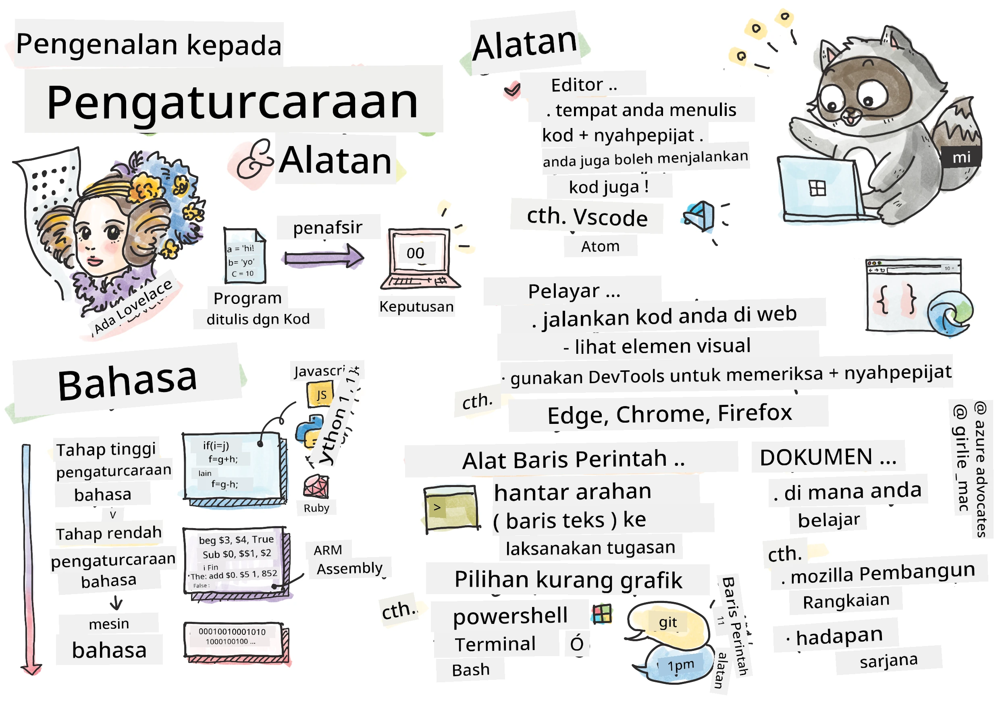
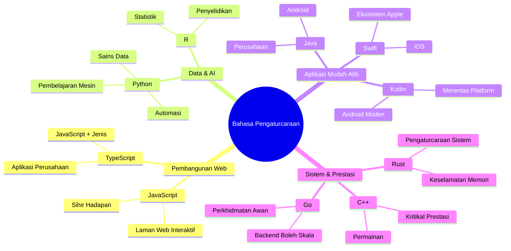
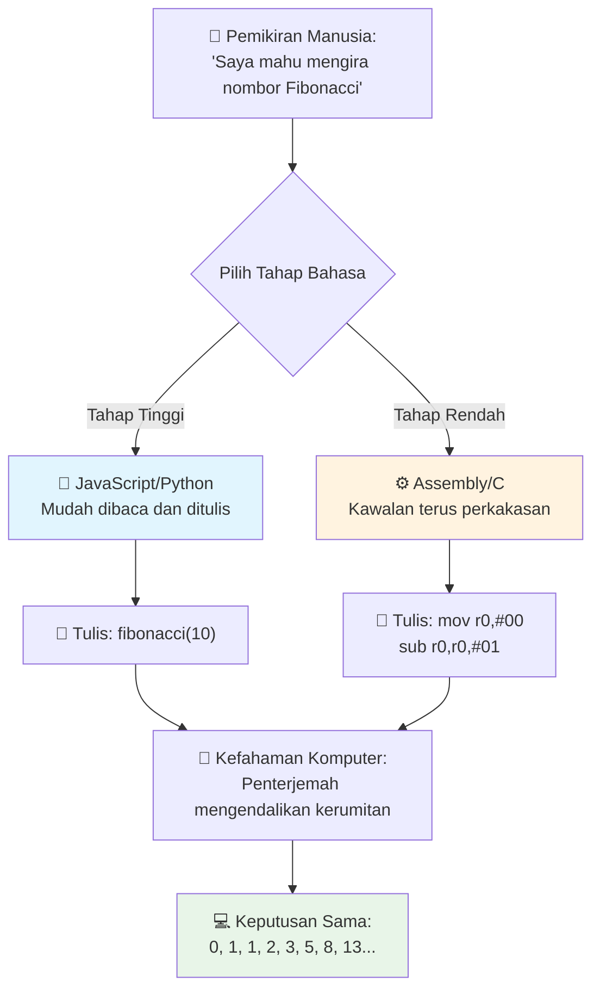
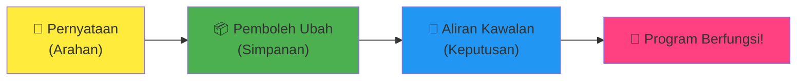
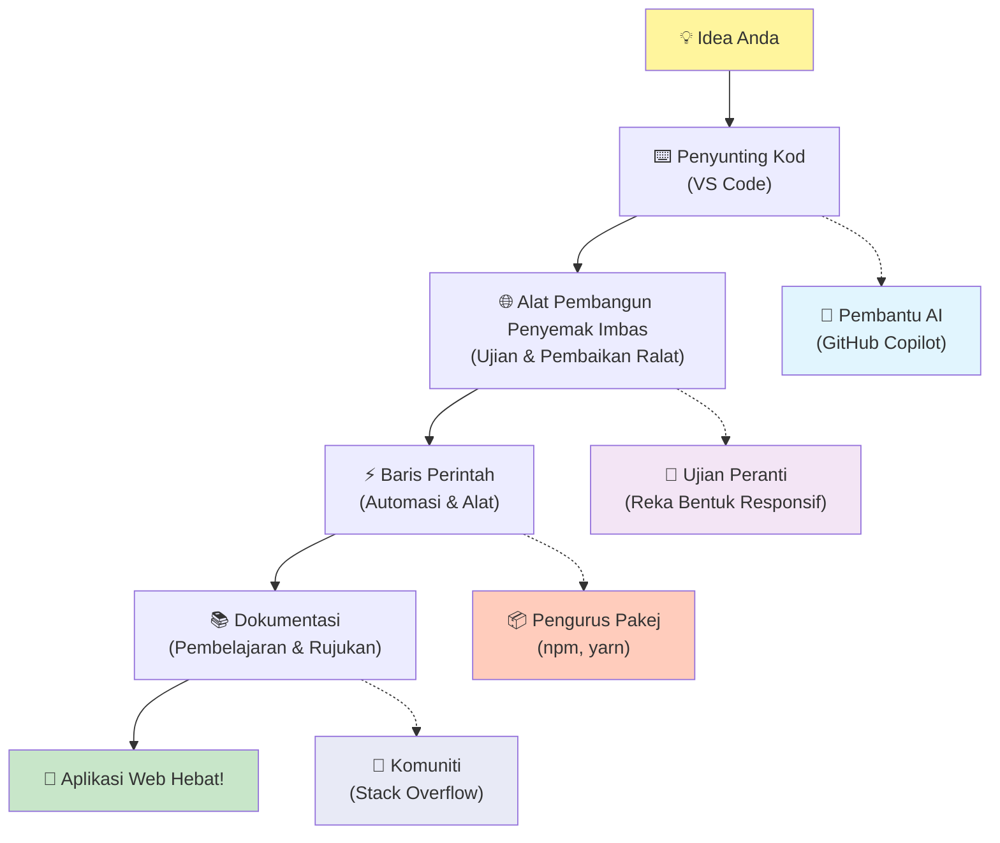
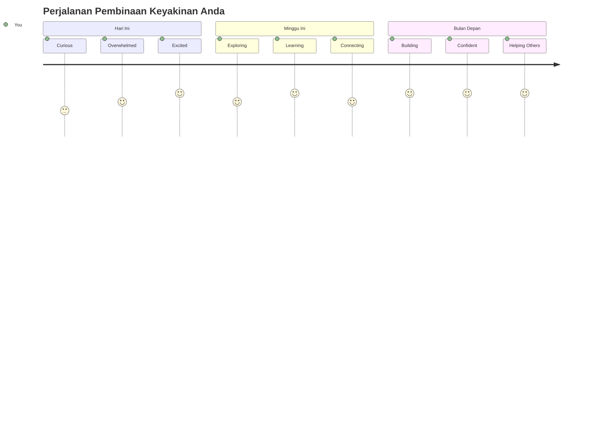

# Pengenalan kepada Bahasa Pengaturcaraan dan Alat Pembangun Moden

Hai, bakal pembangun! 👋 Boleh saya beritahu sesuatu yang masih membuat saya teruja setiap hari? Anda akan menemui bahawa pengaturcaraan bukan hanya tentang komputer – ia tentang mempunyai kuasa luar biasa untuk menghidupkan idea-idea liar anda!

Anda tahu saat bila anda menggunakan aplikasi kegemaran anda dan semuanya berjalan lancar? Bila anda tekan butang dan sesuatu yang penuh magis berlaku yang membuat anda berkata "wow, bagaimana mereka BUAT itu?" Nah, seseorang seperti anda – mungkin sedang duduk di kedai kopi kegemaran mereka pada pukul 2 pagi dengan espresso ketiga mereka – menulis kod yang mencipta keajaiban itu. Dan inilah yang akan mengagumkan anda: menjelang akhir pelajaran ini, anda bukan sahaja akan faham bagaimana mereka melakukannya, tetapi anda akan tidak sabar untuk mencuba sendiri!

Dengar, saya faham jika pengaturcaraan terasa menakutkan sekarang. Bila saya mula-mula bermula, saya benar-benar fikir anda perlu menjadi genius matematik atau telah menulis kod sejak berumur lima tahun. Tetapi ini yang benar-benar mengubah perspektif saya: pengaturcaraan adalah seperti belajar bercakap dalam bahasa baru. Anda mula dengan "hello" dan "terima kasih," kemudian belajar memesan kopi, dan sebelum anda sedar, anda sedang berbincang secara mendalam secara falsafah! Cuma dalam kes ini, anda berbual dengan komputer, dan jujur? Mereka adalah rakan berbual paling sabar yang pernah anda miliki – mereka tidak pernah menghakimi kesilapan anda dan sentiasa teruja untuk cuba lagi!

Hari ini, kita akan meneroka alat hebat yang membuat pembangunan web moden bukan sahaja mungkin, tetapi sangat ketagihan. Saya bercakap tentang editor, pelayar, dan aliran kerja yang sama yang digunakan pembangun di Netflix, Spotify, dan studio aplikasi indie kegemaran anda setiap hari. Dan inilah bahagian yang akan membuat anda menari kegembiraan: kebanyakan alat profesional ini adalah percuma!


> Sketchnote oleh [Tomomi Imura](https://twitter.com/girlie_mac)


```mermaid
journey
    title Perjalanan Pengaturcaraan Anda Hari Ini
    section Terokai
      Apakah Pengaturcaraan: 5: You
      Bahasa Pengaturcaraan: 4: You
      Pengenalan Alat: 5: You
    section Selidik
      Penyunting Kod: 4: You
      Pelayar & DevTools: 5: You
      Baris Perintah: 3: You
    section Amalkan
      Detektif Bahasa: 4: You
      Penjelajahan Alat: 5: You
      Sambungan Komuniti: 5: You
```
## Mari Lihat Apa Yang Anda Sudah Tahu!

Sebelum kita mulakan dengan perkara menyeronokkan, saya ingin tahu – apa yang anda sudah tahu tentang dunia pengaturcaraan ini? Dan dengar, jika anda melihat soalan-soalan ini dan berfikir "Saya memang langsung tak tahu apa-apa tentang ini," itu bukan sahaja okay, ia sempurna! Itu bermakna anda berada di tempat yang betul. Anggap kuiz ini seperti regangan sebelum bersenam – kita cuma memanaskan otot otak!

[Ambil kuiz pra-pelajaran](https://ff-quizzes.netlify.app/web/)


## Pengembaraan Yang Kita Akan Lalui Bersama

Baiklah, saya benar-benar teruja dengan apa yang kita akan terokai hari ini! Serius, saya harap saya dapat lihat wajah anda bila beberapa konsep ini difahami. Berikut adalah perjalanan hebat yang kita bakal lalui bersama:

- **Apa itu pengaturcaraan sebenarnya (dan mengapa ia benda paling hebat!)** – Kita akan terokai bagaimana kod adalah sihir tak kelihatan yang menggerakkan segala-galanya di sekeliling anda, dari penggera yang entah bagaimana tahu itu pagi Isnin hingga algoritma yang sempurna memilih rekomendasi Netflix anda
- **Bahasa pengaturcaraan dan personaliti mereka yang menakjubkan** – Bayangkan masuk ke sebuah parti di mana setiap orang mempunyai kuasa super dan cara menyelesaikan masalah yang berbeza. Begitulah dunia bahasa pengaturcaraan, dan anda pasti suka mengenali mereka!
- **Binaan asas yang membuat sihir digital berlaku** – Anggap ini sebagai set LEGO kreatif yang utama. Setelah anda faham bagaimana kepingan ini bersatu, anda akan sedar anda boleh bina apa sahaja yang imaginas anda impikan
- **Alat profesional yang akan membuat anda rasa seperti diberi tongkat ahli sihir** – Saya tidak berlebihan – alat ini benar-benar akan membuat anda rasa seperti mempunyai kuasa super, dan bahagian terbaik? Ia adalah alat yang sama yang digunakan oleh pakar!

> 💡 **Ini perkara penting**: Jangan cuba ingat semuanya hari ini! Sekarang, saya mahu anda rasakan percikan keterujaan tentang apa yang mungkin. Maklumat akan melekat dengan sendiri apabila kita berlatih bersama – itulah cara pembelajaran sebenar berlaku!

> Anda boleh ambil pelajaran ini di [Microsoft Learn](https://learn.microsoft.com/en-us/learn/modules/web-development-101/introduction-programming/?WT.mc_id=academic-77807-sagibbon)!

## Jadi Apa Itu *Pengaturcaraan* Sebenarnya?

Baiklah, mari kita jawab soalan bernilai jutaan dolar: apa itu pengaturcaraan sebenar?

Saya akan beri cerita yang benar-benar mengubah cara saya berfikir tentang ini. Minggu lepas, saya cuba terangkan kepada ibu saya cara menggunakan alat kawalan jauh TV pintar baru kami. Saya dapati diri saya berkata seperti "Tekan butang merah, tapi bukan butang merah besar, butang merah kecil di sebelah kiri... bukan, sebelah kiri yang lain... baik, tahan selama dua saat, bukan satu, bukan tiga..." Kedengaran biasa? 😅

Itulah pengaturcaraan! Ia seni memberi arahan yang sangat terperinci, langkah demi langkah kepada sesuatu yang sangat kuat tetapi perlu segala-galanya dijelaskan dengan sempurna. Cuma, bukannya menerangkan kepada ibu anda (yang boleh tanya "butang merah yang mana?!"), anda menerangkan kepada komputer (yang hanya melakukan tepat apa yang anda kata, walaupun apa yang anda kata bukan apa yang anda maksudkan).

Inilah yang membuat saya terpesona bila saya belajar ini: komputer sebenarnya sangat mudah pada inti mereka. Mereka hanya faham dua perkara – 1 dan 0, yang sebenarnya bermaksud "ya" dan "tidak" atau "hidup" dan "mati." Itu sahaja! Tetapi inilah bahagian magis – kita tidak perlu bercakap dalam 1 dan 0 macam dalam The Matrix. Di sinilah **bahasa pengaturcaraan** datang membantu. Mereka macam penterjemah terbaik dunia yang mengubah fikiran manusia biasa anda ke dalam bahasa komputer.

Dan ini masih membuat saya teruja setiap pagi bila bangun: literal *semua* benda digital dalam hidup anda bermula dengan seseorang seperti anda, mungkin sedang memakai pakaian tidur dengan secawan kopi, menaip kod di laptop mereka. Penapis Instagram yang buat anda nampak sempurna? Seseorang kod itu. Cadangan yang membawa anda kepada lagu kegemaran baru? Seorang pembangun buat algoritma itu. Aplikasi yang membantu anda bahagikan bil makan malam dengan kawan? Yep, seseorang fikir "ini menyusahkan, saya boleh betulkan" dan kemudian... mereka buat!

Bila anda belajar pengaturcaraan, anda bukan sahaja belajar kemahiran baru – anda menjadi sebahagian daripada komuniti hebat penyelesai masalah yang menghabiskan hari mereka dengan bertanya, "Bagaimana kalau saya bina sesuatu yang buat hari seseorang lebih baik sedikit?" Jujur, ada apa-apa yang lebih hebat daripada itu?

✅ **Misi Fakta Menarik**: Ini sesuatu yang sangat menarik untuk dicari bila ada masa lapang – siapa anda rasa insan pertama di dunia yang menjadi pengaturcara komputer? Saya beri petunjuk: mungkin bukan siapa yang anda jangka! Cerita tentang orang ini sangat menarik dan menunjukkan pengaturcaraan sentiasa tentang penyelesaian kreatif dan fikir luar kotak.

### 🧠 **Masa Semak: Bagaimana Perasaan Anda?**

**Luangkan masa untuk renungkan:**
- Adakah idea "memberi arahan kepada komputer" sudah jelas sekarang?
- Bolehkah anda fikirkan tugasan harian yang ingin anda automatikkan dengan pengaturcaraan?
- Apakah soalan yang terlintas dalam fikiran anda mengenai perkara pengaturcaraan ini?

> **Ingat**: Adalah normal jika sesetengah konsep agak kabur sekarang. Belajar pengaturcaraan seperti belajar bahasa baru – otak anda perlukan masa untuk membina laluan neural itu. Anda buat dengan baik!

## Bahasa Pengaturcaraan Macam Rasa-Rasa Ajaib Berbeza

Baik, ini mungkin kedengaran pelik, tapi ikut saya – bahasa pengaturcaraan banyak macam jenis muzik yang berbeza. Fikirkan: anda ada jazz yang lembut dan improvisasi, rock yang kuat dan terus, klasik yang elegan dan tersusun, dan hip-hop yang kreatif dan ekspresif. Setiap gaya ada vibe sendiri, komuniti peminat yang bersemangat, dan setiap satu sesuai untuk mood dan majlis berbeza.

Bahasa pengaturcaraan juga sama! Anda tak akan guna bahasa yang sama untuk buat permainan mudah alih yang seronok dengan bahasa untuk proses data iklim yang besar, sama macam anda takkan main death metal dalam kelas yoga (kebanyakan kelas yoga la 😄).

Tapi inilah yang buat saya kagum setiap kali fikir: bahasa-bahasa ini macam penterjemah paling sabar dan bijak di dunia duduk sebelah anda. Anda boleh ungkapkan idea dengan cara yang semula jadi untuk otak manusia, dan mereka urus semua kerja rumit tukar itu ke dalam 1 dan 0 yang komputer faham. Macam kawan yang fasih dalam "kreativiti manusia" dan "logik komputer" – dan mereka tak penat, tak perlu rehat kopi, dan tak menghakimi kalau tanya soalan sama dua kali!

### Bahasa Pengaturcaraan Popular dan Kegunaan Mereka


```mermaid
mindmap
  root((Bahasa Pengaturcaraan))
    Pembangunan Web
      JavaScript
        Sihir Hadapan
        Laman Web Interaktif
      TypeScript
        JavaScript + Jenis
        Aplikasi Perusahaan
    Data & AI
      Python
        Sains Data
        Pembelajaran Mesin
        Automasi
      R
        Statistik
        Penyelidikan
    Aplikasi Mudah Alih
      Java
        Android
        Perusahaan
      Swift
        iOS
        Ekosistem Apple
      Kotlin
        Android Moden
        Merentas Platform
    Sistem & Prestasi
      C++
        Permainan
        Kritikal Prestasi
      Rust
        Keselamatan Memori
        Pengaturcaraan Sistem
      Go
        Perkhidmatan Awan
        Backend Boleh Skala
```
| Bahasa | Terbaik Untuk | Kenapa Popular |
|----------|----------|------------------|
| **JavaScript** | Pembangunan web, antara muka pengguna | Berjalan dalam pelayar dan menguatkan laman web interaktif |
| **Python** | Sains data, automasi, AI | Mudah dibaca dan dipelajari, perpustakaan berkuasa |
| **Java** | Aplikasi perusahaan, aplikasi Android | Bebas platform, kukuh untuk sistem besar |
| **C#** | Aplikasi Windows, pembangunan permainan | Sokongan ekosistem Microsoft yang kuat |
| **Go** | Perkhidmatan awan, sistem backend | Pantas, ringkas, direka untuk pengkomputeran moden |

### Bahasa Tingkat Tinggi vs. Rendah

Baik, ini sebenarnya konsep yang buat otak saya hampir hancur bila mula belajar, jadi saya akan kongsi analogi yang buat saya faham – saya harap ia juga membantu anda!

Bayangkan anda melancong ke negara yang bahasa nya anda tidak faham, dan anda sangat perlu jumpa tandas terdekat (kita semua pernah kan? 😅):

- **Pengaturcaraan tahap rendah** macam belajar dialek tempatan begitu baik sehingga anda boleh bersembang dengan nenek jual buah di sudut menggunakan rujukan budaya, slanga tempatan, dan gurauan dalaman yang hanya difahami mereka yang besar di situ. Sangat mengagumkan dan cekap... kalau anda fasih! Tapi agak sukar bila anda cuma mahu cari tandas.

- **Pengaturcaraan tahap tinggi** macam ada kawan tempatan yang benar-benar faham anda. Anda boleh kata "Saya benar-benar perlu cari tandas" dalam Bahasa Inggeris, dan mereka urus semua terjemahan budaya dan beri arahan yang masuk akal untuk otak bukan tempatan anda.

Dalam istilah pengaturcaraan:
- **Bahasa tahap rendah** (seperti Assembly atau C) membenarkan anda berbual sangat terperinci dengan perkakasan komputer, tapi anda perlu berfikir seperti mesin, yang... mari kata ia satu perubahan mental besar!
- **Bahasa tahap tinggi** (seperti JavaScript, Python, atau C#) membenarkan anda berfikir seperti manusia sementara mereka urus semua bahasa mesin di belakang tabir. Plus, mereka ada komuniti yang sangat mesra penuh orang yang ingat macam mana jadi baru dan benar-benar mahu membantu!

Teka bahasa mana yang saya cadangkan anda mula? 😉 Bahasa tahap tinggi macam roda latihan yang anda tak mahu lepaskan sebab ia buat pengalaman lebih seronok!


```mermaid
flowchart TB
    A["👤 Pemikiran Manusia:<br/>'Saya mahu mengira nombor Fibonacci'"] --> B{Pilih Tahap Bahasa}
    
    B -->|Tahap Tinggi| C["🌟 JavaScript/Python<br/>Mudah dibaca dan ditulis"]
    B -->|Tahap Rendah| D["⚙️ Assembly/C<br/>Kawalan terus perkakasan"]
    
    C --> E["📝 Tulis: fibonacci(10)"]
    D --> F["📝 Tulis: mov r0,#00<br/>sub r0,r0,#01"]
    
    E --> G["🤖 Kefahaman Komputer:<br/>Penterjemah mengendalikan kerumitan"]
    F --> G
    
    G --> H["💻 Keputusan Sama:<br/>0, 1, 1, 2, 3, 5, 8, 13..."]
    
    style C fill:#e1f5fe
    style D fill:#fff3e0
    style H fill:#e8f5e8
```
### Saya Nak Tunjukkan Kenapa Bahasa Tahap Tinggi Lebih Mesra

Baik, saya nak tunjuk sesuatu yang jelaskan kenapa saya jatuh cinta dengan bahasa tahap tinggi, tapi pertama – saya perlu anda janji sesuatu. Bila anda lihat contoh kod pertama, jangan panik! Nampak mencabar memang tepat!

Kita akan lihat tugas yang sama ditulis dalam dua gaya yang berbeza. Kedua-duanya cipta apa yang dipanggil urutan Fibonacci – corak matematik cantik di mana setiap nombor adalah jumlah dua nombor sebelumnya: 0, 1, 1, 2, 3, 5, 8, 13... (Fakta menyeronokkan: corak ini ada di mana-mana dalam alam – spiral biji bunga matahari, corak kon pain, malah cara galaksi terbentuk!)

Sedia nak tengok bezanya? Mari kita teruskan!

**Bahasa tahap tinggi (JavaScript) – Mesra manusia:**

```javascript
// Langkah 1: Persediaan asas Fibonacci
const fibonacciCount = 10;
let current = 0;
let next = 1;

console.log('Fibonacci sequence:');
```

**Inilah apa yang kod ini buat:**
- **Isytiharkan** pemalar untuk tentukan berapa banyak nombor Fibonacci yang nak dihasilkan
- **Mula** dua pemboleh ubah untuk jejak nombor semasa dan yang seterusnya dalam urutan
- **Tetapkan** nilai mula (0 dan 1) yang mentakrifkan corak Fibonacci
- **Paparkan** mesej tajuk untuk kenal pasti output kita

```javascript
// Langkah 2: Hasilkan urutan dengan gelung
for (let i = 0; i < fibonacciCount; i++) {
  console.log(`Position ${i + 1}: ${current}`);
  
  // Kira nombor seterusnya dalam urutan
  const sum = current + next;
  current = next;
  next = sum;
}
```

**Jelaskan apa berlaku di sini:**
- **Ulang** bagi setiap posisi dalam urutan menggunakan gelung `for`
- **Paparkan** setiap nombor dengan posisinya menggunakan pemformatan template literal
- **Kira** nombor Fibonacci seterusnya dengan tambah nilai semasa dan berikutnya
- **Kemaskini** pemboleh ubah jejak untuk pergi ke ulang seterusnya

```javascript
// Langkah 3: Pendekatan fungsional moden
const generateFibonacci = (count) => {
  const sequence = [0, 1];
  
  for (let i = 2; i < count; i++) {
    sequence[i] = sequence[i - 1] + sequence[i - 2];
  }
  
  return sequence;
};

// Contoh penggunaan
const fibSequence = generateFibonacci(10);
console.log(fibSequence);
```

**Dalam kod atas, kita:**
- **Cipta** fungsi boleh guna semula menggunakan sintaks anak panah moden
- **Bina** senarai untuk simpan urutan lengkap dan bukan paparkan satu-satu
- **Guna** pengindeksan senarai untuk kira nombor baru dari nilai sebelumnya
- **Pulangkan** urutan lengkap untuk kegunaan fleksibel pada bahagian lain program

**Bahasa tahap rendah (ARM Assembly) – Mesra komputer:**

```assembly
 area ascen,code,readonly
 entry
 code32
 adr r0,thumb+1
 bx r0
 code16
thumb
 mov r0,#00
 sub r0,r0,#01
 mov r1,#01
 mov r4,#10
 ldr r2,=0x40000000
back add r0,r1
 str r0,[r2]
 add r2,#04
 mov r3,r0
 mov r0,r1
 mov r1,r3
 sub r4,#01
 cmp r4,#00
 bne back
 end
```

Perhatikan bagaimana versi JavaScript dibaca macam arahan Bahasa Inggeris, sementara versi Assembly menggunakan arahan tersulit yang kawal terus pemproses komputer. Kedua-duanya buat tugas sama, tapi bahasa tahap tinggi jauh lebih mudah untuk manusia faham, tulis, dan jaga.

**Perbezaan utama yang anda akan perhatikan:**
- **Kebolehbacaan**: JavaScript menggunakan nama yang deskriptif seperti `fibonacciCount` manakala Assembly menggunakan label yang sukar difahami seperti `r0`, `r1`
- **Komen**: Bahasa peringkat tinggi menggalakkan komen penjelasan yang menjadikan kod itu mengandungi dokumentasi sendiri
- **Struktur**: Aliran logik JavaScript sepadan dengan cara manusia berfikir tentang masalah langkah demi langkah
- **Penyelenggaraan**: Mengemas kini versi JavaScript untuk keperluan yang berbeza adalah mudah dan jelas

✅ **Mengenai urutan Fibonacci**: Corak nombor yang sangat cantik ini (di mana setiap nombor sama dengan jumlah dua nombor sebelumnya: 0, 1, 1, 2, 3, 5, 8...) muncul secara literal *di mana-mana* dalam alam semula jadi! Anda akan menjumpainya dalam lingkaran bunga matahari, corak kerucut pain, cara cengkerang nautilus melengkung, dan malah dalam cara cabang pokok tumbuh. Ia sangat mengagumkan bagaimana matematik dan kod boleh membantu kita memahami dan mencipta semula corak yang digunakan oleh alam untuk menghasilkan keindahan!


## Blok Bangunan Yang Membuat Keajaiban Berlaku

Baiklah, sekarang anda telah melihat bagaimana bahasa pengaturcaraan kelihatan dalam tindakan, mari kita pecahkan bahagian asas yang membentuk setiap program yang pernah ditulis. Anggap ini sebagai bahan penting dalam resipi kegemaran anda – apabila anda memahami fungsi setiap satu, anda akan dapat membaca dan menulis kod dalam hampir mana-mana bahasa!

Ini seumpama belajar tatabahasa pengaturcaraan. Ingat kembali di sekolah apabila anda belajar tentang kata nama, kata kerja, dan cara menyusun ayat? Pengaturcaraan mempunyai versi tatabahasanya sendiri, dan sebenarnya, ia jauh lebih logik dan mudah dimaafkan berbanding tatabahasa Bahasa Inggeris! 😄

### Pernyataan: Arahan Langkah demi Langkah

Mari mulakan dengan **pernyataan** – ini seperti ayat individu dalam perbualan dengan komputer anda. Setiap pernyataan memberitahu komputer untuk melakukan satu perkara tertentu, seperti memberi arahan: "Belok kiri sini," "Berhenti di lampu merah," "Parkir di tempat itu."

Apa yang saya suka tentang pernyataan ialah betapa biasanya ia mudah dibaca. Tengok ini:

```javascript
// Pernyataan asas yang melaksanakan tindakan tunggal
const userName = "Alex";                    
console.log("Hello, world!");              
const sum = 5 + 3;                         
```

**Berikut adalah apa yang kod ini lakukan:**
- **Isytiharkan** pembolehubah tetap untuk menyimpan nama pengguna
- **Paparkan** mesej sapaan ke output konsol
- **Kira** dan simpan hasil operasi matematik

```javascript
// Kenyataan yang berinteraksi dengan halaman web
document.title = "My Awesome Website";      
document.body.style.backgroundColor = "lightblue";
```

**Langkah demi langkah, ini yang berlaku:**
- **Ubah** tajuk laman web yang muncul di tab pelayar
- **Tukar** warna latar belakang seluruh badan halaman

### Pembolehubah: Sistem Memori Program Anda

Baiklah, **pembolehubah** sebenarnya adalah salah satu konsep kegemaran saya untuk diajar kerana ia sangat menyerupai perkara yang anda gunakan setiap hari!

Fikirkan tentang senarai kenalan telefon anda sejenak. Anda tidak menghafal nombor telefon semua orang – sebaliknya, anda menyimpan "Ibu," "Kawan Baik," atau "Tempat Pizza Yang Hantar Sehingga 2 Pagi" dan biarkan telefon anda ingat nombor sebenar. Pembolehubah berfungsi dengan cara yang sama! Ia seperti bekas bermerek di mana program anda boleh menyimpan maklumat dan mengambilnya semula menggunakan nama yang benar-benar masuk akal.

Apa yang sangat menarik: pembolehubah boleh berubah semasa program anda berjalan (oleh itu nama "pembolehubah" – faham tak maksudnya?). Seperti mana anda mungkin mengemaskini kenalan tempat pizza apabila jumpa tempat yang lebih baik, pembolehubah boleh dikemaskini apabila program anda belajar maklumat baru atau keadaan berubah!

Saya tunjukkan bagaimana ini boleh jadi sangat mudah:

```javascript
// Langkah 1: Mencipta pembolehubah asas
const siteName = "Weather Dashboard";        
let currentWeather = "sunny";               
let temperature = 75;                       
let isRaining = false;                      
```

**Memahami konsep ini:**
- **Simpan** nilai yang tidak berubah dalam pembolehubah `const` (seperti nama tapak)
- **Guna** `let` untuk nilai yang boleh berubah sepanjang program anda
- **Tetapkan** jenis data berbeza: rentetan (teks), nombor, dan boolean (benar/salah)
- **Pilih** nama yang deskriptif yang menerangkan apa yang setiap pembolehubah simpan

```javascript
// Langkah 2: Bekerja dengan objek untuk mengelompokkan data berkaitan
const weatherData = {                       
  location: "San Francisco",
  humidity: 65,
  windSpeed: 12
};
```

**Dalam kod di atas, kami:**
- **Cipta** objek untuk mengumpulkan maklumat cuaca yang berkaitan
- **Susun** pelbagai data di bawah satu nama pembolehubah
- **Guna** pasangan kunci-nilai untuk melabel setiap maklumat dengan jelas

```javascript
// Langkah 3: Menggunakan dan mengemas kini pembolehubah
console.log(`${siteName}: Today is ${currentWeather} and ${temperature}°F`);
console.log(`Wind speed: ${weatherData.windSpeed} mph`);

// Mengemas kini pembolehubah yang boleh diubah
currentWeather = "cloudy";                  
temperature = 68;                          
```

**Mari fahami setiap bahagian:**
- **Paparkan** maklumat menggunakan template literal dengan sintaks `${}`
- **Akses** sifat objek menggunakan notasi titik (`weatherData.windSpeed`)
- **Kemas kini** pembolehubah yang diistiharkan dengan `let` untuk mencerminkan keadaan berubah
- **Gabungkan** beberapa pembolehubah untuk buat mesej yang bermakna

```javascript
// Langkah 4: Penyahstrukturan moden untuk kod yang lebih kemas
const { location, humidity } = weatherData; 
console.log(`${location} humidity: ${humidity}%`);
```

**Apa yang anda perlu tahu:**
- **Keluarkan** sifat tertentu dari objek menggunakan penetapan destruktur
- **Cipta** pembolehubah baru secara automatik dengan nama yang sama seperti kunci objek
- **Permudahkan** kod dengan mengelakkan notasi titik yang berulang

### Aliran Kawalan: Mengajar Program Anda Berfikir

Baiklah, di sinilah pengaturcaraan menjadi sangat mengagumkan! **Aliran kawalan** sebenarnya mengajar program anda bagaimana membuat keputusan bijak, sama seperti anda lakukan setiap hari tanpa perlu berfikir.

Bayangkan ini: pagi tadi anda mungkin melalui sesuatu seperti "Jika hujan, saya bawa payung. Jika sejuk, saya pakai jaket. Jika saya lambat, saya langkau sarapan dan beli kopi dalam perjalanan." Otak anda secara semula jadi mengikuti logik if-then ini berulang kali setiap hari!

Ini yang membuatkan program terasa pintar dan hidup, bukannya hanya ikut skrip membosankan yang boleh diramal. Mereka boleh melihat situasi, menilai apa yang berlaku, dan bertindak balas dengan tepat. Ia seperti memberikan otak kepada program anda yang boleh menyesuaikan diri dan membuat pilihan!

Nak lihat betapa hebatnya ini berfungsi? Saya tunjukkan:

```javascript
// Langkah 1: Logik bersyarat asas
const userAge = 17;

if (userAge >= 18) {
  console.log("You can vote!");
} else {
  const yearsToWait = 18 - userAge;
  console.log(`You'll be able to vote in ${yearsToWait} year(s).`);
}
```

**Kod ini melakukan:**
- **Periksa** jika umur pengguna memenuhi syarat mengundi
- **Laksanakan** blok kod berbeza berdasarkan keputusan syarat
- **Kira** dan paparkan berapa lama sehingga layak mengundi jika bawah 18
- **Berikan** maklum balas khusus yang membantu untuk setiap senario

```javascript
// Langkah 2: Pelbagai syarat dengan operator logik
const userAge = 17;
const hasPermission = true;

if (userAge >= 18 && hasPermission) {
  console.log("Access granted: You can enter the venue.");
} else if (userAge >= 16) {
  console.log("You need parent permission to enter.");
} else {
  console.log("Sorry, you must be at least 16 years old.");
}
```

**Pecahan apa yang terjadi di sini:**
- **Gabungkan** beberapa syarat menggunakan operator `&&` (dan)
- **Cipta** hirarki syarat menggunakan `else if` untuk pelbagai senario
- **Tangani** semua kemungkinan dengan pernyataan `else` terakhir
- **Berikan** maklum balas jelas dan boleh dilaksanakan untuk setiap situasi berbeza

```javascript
// Langkah 3: Keadaan ringkas dengan operator ternari
const votingStatus = userAge >= 18 ? "Can vote" : "Cannot vote yet";
console.log(`Status: ${votingStatus}`);
```

**Apa yang perlu anda ingat:**
- **Guna** operator ternari (`? :`) untuk syarat dua pilihan yang mudah
- **Tulis** syarat dahulu, diikuti `?`, kemudian keputusan benar, `:`, dan keputusan salah
- **Guna** corak ini apabila perlu tetapkan nilai berdasarkan syarat

```javascript
// Langkah 4: Mengendalikan pelbagai kes khusus
const dayOfWeek = "Tuesday";

switch (dayOfWeek) {
  case "Monday":
  case "Tuesday":
  case "Wednesday":
  case "Thursday":
  case "Friday":
    console.log("It's a weekday - time to work!");
    break;
  case "Saturday":
  case "Sunday":
    console.log("It's the weekend - time to relax!");
    break;
  default:
    console.log("Invalid day of the week");
}
```

**Kod ini mencapai yang berikut:**
- **Padankan** nilai pembolehubah dengan beberapa kes tertentu
- **Kumpulkan** kes yang serupa bersama (hari bekerja vs hujung minggu)
- **Laksanakan** blok kod sesuai apabila padanan ditemui
- **Sertakan** kes `default` untuk tangani nilai tidak dijangka
- **Guna** pernyataan `break` untuk elakkan kod terus ke kes seterusnya

> 💡 **Analogi dunia nyata**: Anggap aliran kawalan seperti GPS paling sabar di dunia memberi arahan kepada anda. Ia mungkin berkata "Jika ada kesesakan di Jalan Utama, ambil lebuh raya pula. Jika pembinaan menghalang lebuh raya, cuba laluan indah." Program menggunakan logik bersyarat yang sama untuk bertindak balas dengan bijak terhadap situasi yang berbeza dan sentiasa memberikan pengalaman terbaik kepada pengguna.

### 🎯 **Semakan Konsep: Penguasaan Blok Bangunan**

**Mari lihat bagaimana anda faham asas-asas:**
- Bolehkah anda terangkan perbezaan antara pembolehubah dan pernyataan dengan kata-kata anda sendiri?
- Fikirkan satu senario dunia sebenar di mana anda menggunakan keputusan if-then (seperti contoh mengundi kami)
- Apa satu perkara tentang logik pengaturcaraan yang mengejutkan anda?

**Peningkat keyakinan cepat:**

```mermaid
flowchart LR
    A["📝 Pernyataan<br/>(Arahan)"] --> B["📦 Pemboleh Ubah<br/>(Simpanan)"] --> C["🔀 Aliran Kawalan<br/>(Keputusan)"] --> D["🎉 Program Berfungsi!"]
    
    style A fill:#ffeb3b
    style B fill:#4caf50
    style C fill:#2196f3
    style D fill:#ff4081
```
✅ **Apa yang akan datang seterusnya**: Kita akan berseronok menelusuri konsep ini dengan lebih mendalam semasa meneruskan perjalanan hebat ini bersama! Sekarang, fokus sahaja pada perasaan teruja dengan segala kemungkinan hebat di hadapan anda. Kemahiran dan teknik khusus akan datang secara semula jadi apabila kita berlatih bersama – saya janji ia akan jauh lebih menyeronokkan daripada yang anda jangkakan!

## Alat-Alat Kerja

Baiklah, ini sebenarnya tempat saya jadi sangat teruja sehingga sukar nak kawal diri! 🚀 Kita akan bercakap tentang alat yang hebat yang akan buat anda rasa seperti baru dapat kunci kapal angkasa digital.

Anda tahu macam mana tukang masak ada pisau seimbang sempurna yang rasa macam sambungan tangan mereka? Atau macam mana pemuzik ada gitar yang seolah-olah bernyanyi sebaik sahaja mereka sentuh? Baik, pembangun pun ada versi alat ajaib mereka sendiri, dan ini yang akan betul-betul buat anda terpukau – kebanyakan daripadanya adalah percuma!

Saya hampir melompat di kerusi saya memikirkan nak kongsikan ini dengan anda sebab ia benar-benar mengubah cara kita bina perisian. Kita bercakap tentang pembantu pengekodan dipacu AI yang boleh bantu tulis kod anda (saya serius!), persekitaran awan di mana anda boleh bina aplikasi sepenuhnya dari mana-mana dengan Wi-Fi, dan alat penyahpepijat yang sangat canggih sehingga rasa macam ada penglihatan sinar-X untuk program anda.

Dan ini bahagian yang masih buat saya bergetar: ini bukan "alat pemula" yang anda akan lambat-laun tinggalkan. Ini adalah alat tahap profesional yang sama yang pembangun di Google, Netflix, dan studio aplikasi indie kegemaran anda gunakan sekarang juga. Anda akan rasa macam pro gila menggunakan ini!


```mermaid
graph TD
    A["💡 Idea Anda"] --> B["⌨️ Penyunting Kod<br/>(VS Code)"] 
    B --> C["🌐 Alat Pembangun Penyemak Imbas<br/>(Ujian & Pembaikan Ralat)"]
    C --> D["⚡ Baris Perintah<br/>(Automasi & Alat)"]
    D --> E["📚 Dokumentasi<br/>(Pembelajaran & Rujukan)"]
    E --> F["🚀 Aplikasi Web Hebat!"]
    
    B -.-> G["🤖 Pembantu AI<br/>(GitHub Copilot)"]
    C -.-> H["📱 Ujian Peranti<br/>(Reka Bentuk Responsif)"]
    D -.-> I["📦 Pengurus Pakej<br/>(npm, yarn)"]
    E -.-> J["👥 Komuniti<br/>(Stack Overflow)"]
    
    style A fill:#fff59d
    style F fill:#c8e6c9
    style G fill:#e1f5fe
    style H fill:#f3e5f5
    style I fill:#ffccbc
    style J fill:#e8eaf6
```
### Penyunting Kod dan IDE: Sahabat Digital Baru Anda

Mari kita bincang tentang penyunting kod – ini benar-benar akan jadi tempat kegemaran baru anda! Anggap ia sebagai tempat perlindungan pengkodan peribadi di mana anda akan habiskan kebanyakan masa mencipta dan menyempurnakan ciptaan digital anda.

Tapi apa yang betul-betul ajaib tentang penyunting moden ialah mereka bukan sekadar penyunting teks biasa. Mereka seperti mentor pengkodan yang paling cerdas dan menyokong sentiasa berada di sebelah anda 24/7. Mereka tangkap kesilapan taip sebelum anda sedar, cadangkan penambahbaikan yang buat anda kelihatan seperti genius, bantu anda faham setiap baris kod, malah ada yang boleh ramal apa yang anda nak taip dan tawarkan lengkapi fikiran anda!

Saya ingat masa pertama kali jumpa auto-completion – saya rasa macam hidup di masa depan. Anda mula taip sesuatu, dan penyunting anda kata, "Eh, adakah anda maksud fungsi ini yang tepat anda perlukan?" Macam ada pembaca fikiran sebagai rakan pengkodan anda!

**Apa yang buat penyunting ini hebat?**

Penyunting kod moden tawarkan pelbagai ciri hebat yang direka untuk tingkatkan produktiviti anda:

| Ciri | Apa Yang Dilakukan | Kenapa Ia Membantu |
|---------|--------------|--------------|
| **Pemfokusan Sintaks** | Warnakan bahagian kod anda yang berbeza | Mudahkan membaca kod dan kenal pasti kesilapan |
| **Pengisian Automatik** | Cadangkan kod semasa anda menaip | Cepatkan pengekodan dan kurang silap taip |
| **Alat Penyahpepijat** | Bantu cari dan baiki kesilapan | Jimat waktu menyelesaikan masalah |
| **Sambungan** | Tambah ciri khusus | Sesuaikan penyunting anda mengikut teknologi |
| **Pembantu AI** | Cadangkan kod dan penjelasan | Percepat pembelajaran dan produktiviti |

> 🎥 **Sumber Video**: Nak tengok alat ini beraksi? Tonton [Video Alat-Alat Kerja](https://youtube.com/watch?v=69WJeXGBdxg) untuk gambaran menyeluruh.

#### Penyunting Disyorkan untuk Pembangunan Web

**[Visual Studio Code](https://code.visualstudio.com/?WT.mc_id=academic-77807-sagibbon)** (Percuma)
- Paling popular di kalangan pembangun web
- Ekosistem sambungan yang hebat
- Terminal terbina dalam dan integrasi Git
- **Sambungan wajib ada**:
  - [GitHub Copilot](https://marketplace.visualstudio.com/items?itemName=GitHub.copilot) - Cadangan kod dipacu AI
  - [Live Share](https://marketplace.visualstudio.com/items?itemName=MS-vsliveshare.vsliveshare) - Kolaborasi masa nyata
  - [Prettier](https://marketplace.visualstudio.com/items?itemName=esbenp.prettier-vscode) - Format kod automatik
  - [Code Spell Checker](https://marketplace.visualstudio.com/items?itemName=streetsidesoftware.code-spell-checker) - Tangkap kesilapan taip dalam kod anda

**[JetBrains WebStorm](https://www.jetbrains.com/webstorm/)** (Berbayar, percuma untuk pelajar)
- Alat penyahpepijat dan ujian lanjutan
- Pengisian kod pintar
- Kawalan versi terbina dalam

**IDE Berasaskan Awan** (Pelbagai harga)
- [GitHub Codespaces](https://github.com/features/codespaces) - VS Code penuh dalam pelayar anda
- [Replit](https://replit.com/) - Bagus untuk belajar dan berkongsi kod
- [StackBlitz](https://stackblitz.com/) - Pembangunan web penuh serta merta

> 💡 **Petua Mula**: Mulakan dengan Visual Studio Code – ia percuma, digunakan secara meluas dalam industri, dan mempunyai komuniti besar yang buat tutorial dan sambungan yang membantu.


### Pelayar Web: Makmal Pembangunan Rahsia Anda

Baiklah, bersiaplah untuk minda anda benar-benar terkejut! Anda tahu macam mana anda gunakan pelayar untuk layari media sosial dan tonton video? Sebenarnya ia menyembunyikan makmal pembangun rahsia yang hebat sepanjang masa, hanya menunggu untuk anda temui!

Setiap kali anda klik kanan pada laman web dan pilih "Inspect Element," anda sedang membuka dunia alat pembangun tersembunyi yang sebenarnya lebih berkuasa daripada beberapa perisian mahal yang pernah saya bayar ratusan ringgit sebelum ini. Ia seperti menemui dapur biasa anda sebenarnya menyimpan makmal tukang masak profesional di belakang panel rahsia!
Kali pertama seseorang menunjukkan saya DevTools pelayar, saya habiskan masa kira-kira tiga jam hanya mengklik sekitar dan berkata "TUNGGU, IA BOLEH BUAT ITU JUGA?!" Anda boleh mengedit mana-mana laman web secara masa nyata, melihat dengan tepat seberapa pantas segala-galanya dimuatkan, menguji bagaimana laman anda kelihatan pada peranti yang berbeza, dan malah membetulkan JavaScript seperti seorang pro sepenuhnya. Ia benar-benar menakjubkan!

**Ini sebab mengapa pelayar adalah senjata rahsia anda:**

Apabila anda mencipta laman web atau aplikasi web, anda perlu melihat bagaimana ia kelihatan dan berperilaku dalam dunia nyata. Pelayar bukan sahaja memaparkan kerja anda tetapi juga menyediakan maklum balas terperinci tentang prestasi, aksesibiliti, dan isu berpotensi.

#### Alat Pembangun Pelayar (DevTools)

Pelayar moden termasuk suite pembangunan yang lengkap:

| Kategori Alat | Apa Fungsinya | Contoh Penggunaan |
|---------------|--------------|------------------|
| **Pemeriksa Elemen** | Lihat dan edit HTML/CSS dalam masa nyata | Laraskan gaya untuk melihat hasil serta-merta |
| **Konsol** | Lihat mesej ralat dan uji JavaScript | Betulkan masalah dan cuba kod |
| **Pemantau Rangkaian** | Jejak bagaimana sumber dimuatkan | Optimumkan prestasi dan masa muat |
| **Pemeriksa Aksesibiliti** | Uji reka bentuk inklusif | Pastikan laman anda berfungsi untuk semua pengguna |
| **Simulator Peranti** | Pratonton pada saiz skrin berbeza | Uji reka bentuk responsif tanpa peranti pelbagai |

#### Pelayar Disyorkan untuk Pembangunan

- **[Chrome](https://developers.google.com/web/tools/chrome-devtools/)** - DevTools standard industri dengan dokumentasi luas
- **[Firefox](https://developer.mozilla.org/docs/Tools)** - Alat CSS Grid dan aksesibiliti yang cemerlang
- **[Edge](https://docs.microsoft.com/microsoft-edge/devtools-guide-chromium/?WT.mc_id=academic-77807-sagibbon)** - Dibina di atas Chromium dengan sumber pembangun Microsoft

> ⚠️ **Tip Ujian Penting**: Sentiasa uji laman web anda dalam pelbagai pelayar! Apa yang berfungsi dengan sempurna di Chrome mungkin kelihatan berbeza di Safari atau Firefox. Pembangun profesional menguji merentasi semua pelayar utama untuk memastikan pengalaman pengguna yang konsisten.


### Alat Baris Perintah: Laluan Anda ke Kuasa Super Pembangun

Baiklah, mari kita jujur tentang baris perintah, kerana saya mahu anda dengar ini dari seseorang yang benar-benar faham. Bila saya pertama kali melihatnya – hanya skrin hitam menakutkan dengan teks berkedip – saya benar-benar fikir, "Tidak, sama sekali tidak! Ini nampak seperti sesuatu dari filem penggodam tahun 1980-an, dan saya memang tak cukup pintar untuk ini!" 😅

Tapi ini apa yang saya harap seseorang beritahu saya dulu, dan apa yang saya beritahu anda sekarang: baris perintah bukanlah menakutkan – ia sebenarnya seperti berborak terus dengan komputer anda. Fikirkan ia sebagai perbezaan antara memesan makanan melalui aplikasi mewah dengan gambar dan menu (yang mudah dan senang) berbanding masuk ke restoran tempatan kegemaran anda di mana cef tahu betul apa yang anda suka dan boleh masak sesuatu yang sempurna hanya dengan anda mengatakan "kejutan saya dengan sesuatu yang hebat."

Baris perintah adalah tempat pembangun rasa seperti ahli sihir mutlak. Anda taip beberapa kata yang nampak magikal (baiklah, ia cuma arahan, tetapi rasanya magikal!), tekan enter, dan BOOM – anda telah mencipta struktur projek sepenuhnya, memasang alat berkuasa dari seluruh dunia, atau melancarkan aplikasi anda ke internet untuk jutaan orang lihat. Setelah anda merasai kuasa itu, ia benar-benar ketagih!

**Kenapa baris perintah akan jadi alat kegemaran anda:**

Walaupun antara muka grafik bagus untuk banyak tugas, baris perintah unggul dalam automasi, ketepatan, dan kelajuan. Banyak alat pembangunan berfungsi terutama melalui antara muka baris perintah, dan belajar menggunakannya dengan cekap boleh memperbaiki produktiviti anda dengan mendadak.

```bash
# Langkah 1: Buat dan pergi ke direktori projek
mkdir my-awesome-website
cd my-awesome-website
```

**Ini yang kod ini lakukan:**
- **Cipta** direktori baru bernama "my-awesome-website" untuk projek anda
- **Masuk** ke dalam direktori baru yang dibuat untuk mula bekerja

```bash
# Langkah 2: Mulakan projek dengan package.json
npm init -y

# Pasang alat pembangunan moden
npm install --save-dev vite prettier eslint
npm install --save-dev @eslint/js
```

**Langkah demi langkah, inilah yang berlaku:**
- **Inisialisasi** projek Node.js baru dengan tetapan lalai menggunakan `npm init -y`
- **Pasang** Vite sebagai alat bina moden untuk pembangunan cepat dan bina produksi
- **Tambah** Prettier untuk format kod automatik dan ESLint untuk pemeriksaan kualiti kod
- **Gunakan** bendera `--save-dev` untuk tandakan ini sebagai kebergantungan khusus pembangunan

```bash
# Langkah 3: Buat struktur projek dan fail
mkdir src assets
echo '<!DOCTYPE html><html><head><title>My Site</title></head><body><h1>Hello World</h1></body></html>' > index.html

# Mulakan pelayan pembangunan
npx vite
```

**Dalam yang di atas, kami:**
- **Mengatur** projek dengan membuat folder terpisah untuk kod sumber dan aset
- **Menjana** fail HTML asas dengan struktur dokumen yang betul
- **Memulakan** pelayan pembangunan Vite untuk pemuatan semula langsung dan penggantian modul panas

#### Alat Baris Perintah Penting untuk Pembangunan Web

| Alat | Tujuan | Kenapa Anda Perlu |
|------|---------|-------------------|
| **[Git](https://git-scm.com/)** | Kawalan versi | Jejak perubahan, bekerjasama dengan orang lain, sandaran kerja anda |
| **[Node.js & npm](https://nodejs.org/)** | Runtime JavaScript & pengurusan pakej | Jalankan JavaScript di luar pelayar, pasang alat pembangunan moden |
| **[Vite](https://vitejs.dev/)** | Alat bina & pelayan pembangunan | Pembangunan pantas dengan penggantian modul panas |
| **[ESLint](https://eslint.org/)** | Kualiti kod | Cari dan baiki masalah dalam JavaScript anda secara automatik |
| **[Prettier](https://prettier.io/)** | Format kod | Kekalkan kod anda sentiasa diformat dengan konsisten dan mudah dibaca |

#### Pilihan Spesifik Platform

**Windows:**
- **[Windows Terminal](https://docs.microsoft.com/windows/terminal/?WT.mc_id=academic-77807-sagibbon)** - Terminal moden penuh ciri
- **[PowerShell](https://docs.microsoft.com/powershell/?WT.mc_id=academic-77807-sagibbon)** 💻 - Persekitaran skrip berkuasa
- **[Command Prompt](https://learn.microsoft.com/windows-server/administration/windows-commands/windows-commands)** 💻 - Baris perintah Windows tradisional

**macOS:**
- **[Terminal](https://support.apple.com/guide/terminal/)** 💻 - Aplikasi terminal terbina dalam
- **[iTerm2](https://iterm2.com/)** - Terminal lanjutan dengan ciri-ciri hebat

**Linux:**
- **[Bash](https://www.gnu.org/software/bash/)** 💻 - Shell Linux standard
- **[KDE Konsole](https://docs.kde.org/trunk5/en/konsole/konsole/index.html)** - Peniruan terminal lanjutan

> 💻 = Telah dipasang secara lalai pada sistem operasi

> 🎯 **Laluan Pembelajaran**: Mula dengan arahan asas seperti `cd` (tukar direktori), `ls` atau `dir` (senaraikan fail), dan `mkdir` (cipta folder). Amalkan dengan arahan aliran kerja moden seperti `npm install`, `git status`, dan `code .` (buka direktori semasa dalam VS Code). Apabila anda semakin selesa, anda akan secara semula jadi menguasai arahan lanjutan dan teknik automasi.


### Dokumentasi: Mentor Pembelajaran Yang Sentiasa Ada

Baiklah, saya nak kongsi satu rahsia kecil yang akan buat anda rasa lebih selesa sebagai pemula: walaupun pembangun paling berpengalaman menghabiskan sebahagian besar masa mereka membaca dokumentasi. Dan itu bukan kerana mereka tidak tahu apa yang mereka buat – sebenarnya itu tanda kebijaksanaan!

Fikirkan dokumentasi seperti mempunyai akses kepada guru paling sabar dan berpengetahuan di dunia yang sedia 24/7. Terperangkap pada masalah waktu 2 pagi? Dokumentasi ada dengan pelukan maya yang hangat dan tepat jawapan yang anda perlukan. Nak belajar tentang ciri baru yang semua orang bualkan? Dokumentasi sokong anda dengan contoh langkah demi langkah. Cuba fahami kenapa sesuatu berfungsi begini? Anda boleh teka – dokumentasi sedia terangkan dengan cara yang buat anda akhirnya faham!

Ini sesuatu yang benar-benar ubah pandangan saya: dunia pembangunan web bergerak sangat cepat, dan tiada siapa (betul-betul tiada siapa!) yang ingat semua perkara. Saya lihat pembangun kanan dengan pengalaman 15+ tahun perlu semak sintaks asas, dan anda tahu apa? Itu bukan memalukan – itu pintar! Bukan tentang ingatan sempurna; ia tentang tahu di mana nak cari jawapan yang boleh dipercayai dengan cepat dan bagaimana untuk gunakan.

**Inilah tempat keajaiban sebenar berlaku:**

Pembangun profesional gunakan sebahagian besar masa mereka membaca dokumentasi – bukan sebab mereka tak tahu tapi sebab landskap pembangunan web sangat pantas berkembang dan untuk kekal kemas kini mereka perlu belajar berterusan. Dokumentasi yang bagus bantu anda faham bukan sahaja *bagaimana* guna sesuatu, tapi *kenapa* dan *bila* gunakannya.

#### Sumber Dokumentasi Penting

**[Mozilla Developer Network (MDN)](https://developer.mozilla.org/docs/Web)**
- Standard emas untuk dokumentasi teknologi web
- Panduan lengkap untuk HTML, CSS, dan JavaScript
- Termasuk maklumat keserasian pelayar
- Memiliki contoh praktikal dan demo interaktif

**[Web.dev](https://web.dev)** (oleh Google)
- Amalan terbaik pembangunan web moden
- Panduan optimum prestasi
- Prinsip aksesibiliti dan reka bentuk inklusif
- Kajian kes dari projek dunia sebenar

**[Dokumentasi Pembangun Microsoft](https://docs.microsoft.com/microsoft-edge/#microsoft-edge-for-developers)**
- Sumber pembangunan pelayar Edge
- Panduan Progressive Web App
- Pandangan pembangunan merentas platform

**[Frontend Masters Learning Paths](https://frontendmasters.com/learn/)**
- Kurikulum pembelajaran terstruktur
- Kursus video dari pakar industri
- Latihan pengekodan amali

> 📚 **Strategi Belajar**: Jangan cuba hafal dokumentasi – sebaliknya, belajar cara menavigasi dengan cekap. Tandai rujukan yang kerap digunakan dan amalkan guna fungsi carian untuk cari maklumat spesifik dengan cepat.

### 🔧 **Pemeriksaan Penguasaan Alat: Apa Yang Menyentuh Anda?**

**Luangkan masa memikirkan:**
- Alat mana paling anda teruja untuk cuba dahulu? (Tiada jawapan salah!)
- Adakah baris perintah masih nampak menakutkan, atau anda mula rasa ingin tahu?
- Boleh anda bayangkan menggunakan DevTools pelayar untuk intip di sebalik tabir laman web kegemaran anda?


```mermaid
pie title "Masa Pembangun Dihabiskan Dengan Alat"
    "Penyunting Kod" : 40
    "Ujian Pelayar" : 25
    "Baris Perintah" : 15
    "Membaca Dokumen" : 15
    "Penyahpepijatan" : 5
```
> **Wawasan menarik**: Kebanyakan pembangun menghabiskan kira-kira 40% masa mereka dalam editor kod, tapi lihat berapa banyak masa untuk menguji, belajar dan menyelesaikan masalah. Pengaturcaraan bukan hanya tentang menulis kod – ia tentang mencipta pengalaman!

✅ **Makanan minda**: Ini sesuatu untuk difikirkan – bagaimana anda fikir alat untuk bina laman web (pembangunan) mungkin berbeza daripada alat untuk reka bentuk rupa (rekabentuk)? Ia macam beza antara arkitek yang mereka rumah cantik dan kontraktor yang bina betul-betul. Kedua-duanya penting, tapi perlukan kotak alat yang berbeza! Cara fikir macam ini sangat membantu anda nampak gambaran besar bagaimana laman web terhasil.

## Cabaran Ejen GitHub Copilot 🚀

Gunakan mod Ejen untuk lengkapkan cabaran berikut:

**Deskripsi:** Terokai ciri editor kod moden atau IDE dan tunjukkan bagaimana ia boleh memperbaiki aliran kerja anda sebagai pembangun web.

**Arahan:** Pilih editor kod atau IDE (seperti Visual Studio Code, WebStorm, atau IDE berasaskan awan). Senaraikan tiga ciri atau sambungan yang membantu anda menulis, membaiki, atau menyelenggara kod dengan lebih cekap. Untuk setiap satu, berikan penerangan ringkas bagaimana ia memberi manfaat kepada aliran kerja anda.

---

## 🚀 Cabaran

**Baiklah, detektif, bersedia untuk kes pertama anda?**

Sekarang anda sudah ada asas hebat ini, saya ada pengembaraan yang akan bantu anda lihat betapa pelbagai dan menariknya dunia pengaturcaraan sebenarnya. Dan dengar – ini belum tentang menulis kod lagi, jadi jangan risau! Anggap diri anda sebagai detektif bahasa pengaturcaraan dalam kes pertama yang sangat menarik ini!

**Misi anda, sekiranya anda mahu terima:**
1. **Jadilah peneroka bahasa:** Pilih tiga bahasa pengaturcaraan dari alam yang sangat berbeza – mungkin satu untuk bina laman web, satu cipta aplikasi mudah alih, dan satu proses data untuk saintis. Cari contoh tugasan mudah yang sama ditulis dalam setiap bahasa. Saya janji anda akan terkejut betapa berbezanya ia boleh nampak walaupun buat perkara yang sama!

2. **Temui kisah asal-usul mereka:** Apa yang buat setiap bahasa istimewa? Ini fakta menarik – setiap bahasa pengaturcaraan dicipta kerana seseorang fikir, "Tahukah? Mesti ada cara lebih baik untuk selesaikan masalah khusus ini." Bolehkah anda tahu masalah apa yang mereka cuba selesaikan? Sesetengah cerita ini memang menarik!

3. **Kenali komuniti:** Lihat betapa mesra dan penuh semangat komuniti setiap bahasa. Ada yang ada jutaan pembangun berkongsi ilmu dan bantu satu sama lain, yang lain kecil tapi rapat dan sangat menyokong. Anda pasti suka lihat personaliti berbeza komuniti ni!

4. **Ikut hati rasa:** Bahasa mana paling anda rasa mudah didekati sekarang? Jangan risau tentang buat pilihan "sempurna" – cuma ikuti naluri anda! Tiada jawapan salah di sini, dan anda sentiasa boleh teroka bahasa lain kemudian.

**Kerja detektif bonus:** Cuba cari apa laman web atau aplikasi utama dibina dengan setiap bahasa. Saya jamin anda akan terkejut bila tahu apa yang kuasakan Instagram, Netflix, atau permainan mudah alih kegemaran anda!

> 💡 **Ingat:** Anda bukan cuba jadi pakar bahasa hari ini. Anda cuma kenal kawasan dulu sebelum pilih tempat mahu mengatur tapak. Ambil masa, berseronok, dan biar rasa ingin tahu pimpin!

## Mari Raikan Penemuan Anda!

Wah, anda sudah serap begitu banyak maklumat hebat hari ini! Saya benar-benar teruja nak lihat berapa banyak perjalanan luar biasa ini melekat dalam diri anda. Dan ingat – ini bukan ujian untuk dapatkan semuanya sempurna. Ini lebih kepada sambutan semua perkara hebat yang anda pelajari tentang dunia menarik yang bakal anda ceburi!

[Ambil kuiz selepas pelajaran](https://ff-quizzes.netlify.app/web/)

## Semak & Belajar Sendiri

**Ambil masa anda untuk teroka dan berseronok!**
Anda telah menerokai banyak perkara hari ini, dan itu sesuatu yang patut dibanggakan! Kini tiba bahagian yang menyeronokkan – meneroka topik-topik yang membangkitkan rasa ingin tahu anda. Ingat, ini bukan kerja rumah – ini satu pengembaraan!

**Selami lebih dalam apa yang membuat anda teruja:**

**Cuba sendiri dengan bahasa pengaturcaraan:**
- Lawati laman web rasmi 2-3 bahasa yang menarik perhatian anda. Setiap satu mempunyai personaliti dan kisahnya sendiri!
- Cuba beberapa taman permainan pengekodan dalam talian seperti [CodePen](https://codepen.io/), [JSFiddle](https://jsfiddle.net/), atau [Replit](https://replit.com/). Jangan takut untuk bereksperimen – anda tidak akan merosakkan apa-apa!
- Baca tentang bagaimana bahasa kegemaran anda tercipta. Serius, beberapa cerita asal-usul ini sangat menarik dan akan membantu anda memahami mengapa bahasa berfungsi dengan cara mereka.

**Biasakan diri dengan alat baharu anda:**
- Muat turun Visual Studio Code jika anda belum lagi – ia percuma dan anda pasti akan menyukainya!
- Luangkan beberapa minit melayari pasar Sambungan. Ia seperti kedai aplikasi untuk editor kod anda!
- Buka Alat Pembangun pelayar anda dan klik sebanyak mungkin. Jangan risau tentang memahami semuanya – hanya biasakan diri dengan apa yang ada.

**Sertai komuniti:**
- Ikuti beberapa komuniti pembangun di [Dev.to](https://dev.to/), [Stack Overflow](https://stackoverflow.com/), atau [GitHub](https://github.com/). Komuniti pengaturcaraan sangat mesra kepada pendatang baru!
- Tonton beberapa video pengekodan mesra pemula di YouTube. Ada banyak pencipta hebat di luar sana yang ingat bagaimana rasanya untuk bermula.
- Pertimbangkan untuk menyertai pertemuan tempatan atau komuniti dalam talian. Percayalah, pembangun suka membantu pendatang baru!

> 🎯 **Dengar, ini yang saya mahu anda ingat**: Anda tidak dijangka menjadi pakar pengekodan dalam sekelip mata! Sekarang, anda baru sahaja mula mengenali dunia baru yang menakjubkan ini yang akan anda ceburi. Ambil masa anda, nikmati perjalanan ini, dan ingat – setiap pembangun yang anda kagumi dahulu duduk di tempat yang sama seperti anda sekarang, berasa teruja dan mungkin sedikit tertekan. Itu sangat normal, dan ia bermakna anda berada di landasan yang betul!


## Tugasan

[Membaca Dokumen](assignment.md)

> 💡 **Sedikit dorongan untuk tugasan anda**: Saya sangat ingin melihat anda meneroka beberapa alat yang belum kita bincangkan lagi! Langkau editor, pelayar, dan alat baris arahan yang sudah kita bualkan – ada satu alam semesta alat pembangunan hebat yang menanti untuk diterokai. Cari yang dikekalkan secara aktif dan mempunyai komuniti yang hidup dan membantu (biasanya mereka mempunyai tutorial terbaik dan orang yang paling menyokong apabila anda tersekat dan memerlukan bantuan mesra).

---

## 🚀 Garis Masa Perjalanan Pengaturcaraan Anda

### ⚡ **Apa yang Boleh Anda Lakukan Dalam 5 Minit Akan Datang**
- [ ] Tandakan 2-3 laman web bahasa pengaturcaraan yang menarik perhatian anda
- [ ] Muat turun Visual Studio Code jika anda belum lagi
- [ ] Buka DevTools pelayar anda (F12) dan klik di mana-mana laman web
- [ ] Sertai satu komuniti pengaturcaraan (Dev.to, Reddit r/webdev, atau Stack Overflow)

### ⏰ **Apa yang Boleh Anda Capai Dalam Jam Ini**
- [ ] Lengkapkan kuiz selepas pelajaran dan renungkan jawapan anda
- [ ] Sediakan VS Code dengan sambungan GitHub Copilot
- [ ] Cuba contoh "Hello World" dalam 2 bahasa pengaturcaraan berbeza secara dalam talian
- [ ] Tonton video "Sehari dalam Kehidupan Pembangun" di YouTube
- [ ] Mulakan kerja penyiasatan bahasa pengaturcaraan anda (dari cabaran)

### 📅 **Pengembaraan Anda Sepanjang Minggu**
- [ ] Lengkapkan tugasan dan terokai 3 alat pembangunan baru
- [ ] Ikuti 5 pembangun atau akaun pengaturcaraan di media sosial
- [ ] Cuba bina sesuatu yang kecil di CodePen atau Replit (walaupun hanya "Hello, [Nama Anda]!")
- [ ] Baca satu catatan blog pembangun mengenai perjalanan pengekodan seseorang
- [ ] Sertai pertemuan maya atau tonton ceramah pengaturcaraan
- [ ] Mula belajar bahasa pilihan anda dengan tutorial dalam talian

### 🗓️ **Transformasi Anda Sepanjang Bulan**
- [ ] Bina projek kecil pertama anda (walaupun halaman web ringkas pun dikira!)
- [ ] Sumbang kepada projek sumber terbuka (mula dengan pembaikan dokumentasi)
- [ ] Bimbing seseorang yang baru memulakan perjalanan pengaturcaraan mereka
- [ ] Buat laman web portfolio pembangun anda
- [ ] Sambung dengan komuniti pembangun tempatan atau kumpulan belajar
- [ ] Mula merancang tahap pembelajaran seterusnya

### 🎯 **Pemeriksaan Refleksi Akhir**

**Sebelum anda meneruskan, luangkan masa untuk meraikan:**
- Apakah satu perkara tentang pengaturcaraan yang membuat anda teruja hari ini?
- Alat atau konsep mana yang anda mahu teroka terlebih dahulu?
- Bagaimana perasaan anda tentang memulakan perjalanan pengaturcaraan ini?
- Apakah satu soalan yang anda ingin tanya kepada pembangun sekarang?


```mermaid
journey
    title Perjalanan Pembinaan Keyakinan Anda
    section Hari Ini
      Curious: 3: You
      Overwhelmed: 4: You
      Excited: 5: You
    section Minggu Ini
      Exploring: 4: You
      Learning: 5: You
      Connecting: 4: You
    section Bulan Depan
      Building: 5: You
      Confident: 5: You
      Helping Others: 5: You
```
> 🌟 **Ingat**: Setiap pakar dahulu adalah seorang pemula. Setiap pembangun senior pernah merasa seperti anda sekarang – teruja, mungkin sedikit tertekan, dan pasti ingin tahu apa yang mungkin terjadi. Anda berada dalam syarikat yang hebat, dan perjalanan ini akan menjadi luar biasa. Selamat datang ke dunia pengaturcaraan yang menakjubkan! 🎉

---

<!-- CO-OP TRANSLATOR DISCLAIMER START -->
**Penafian**:  
Dokumen ini telah diterjemahkan menggunakan perkhidmatan terjemahan AI [Co-op Translator](https://github.com/Azure/co-op-translator). Walaupun kami berusaha untuk ketepatan, sila maklum bahawa terjemahan automatik mungkin mengandungi kesilapan atau ketidaktepatan. Dokumen asal dalam bahasa asalnya harus dianggap sebagai sumber yang sahih. Untuk maklumat penting, terjemahan profesional oleh manusia adalah disyorkan. Kami tidak bertanggungjawab atas sebarang salah faham atau salah tafsir yang timbul daripada penggunaan terjemahan ini.
<!-- CO-OP TRANSLATOR DISCLAIMER END -->