<!--
CO_OP_TRANSLATOR_METADATA:
{
  "original_hash": "d45ddcc54eb9232a76d08328b09d792e",
  "translation_date": "2025-11-06T12:03:24+00:00",
  "source_file": "1-getting-started-lessons/1-intro-to-programming-languages/README.md",
  "language_code": "ms"
}
-->
# Pengenalan kepada Bahasa Pengaturcaraan dan Alat Pembangun Moden

Hai, bakal pembangun! 👋 Boleh saya kongsikan sesuatu yang masih membuatkan saya teruja setiap hari? Anda akan menemui bahawa pengaturcaraan bukan sekadar tentang komputer – ia adalah kuasa luar biasa untuk merealisasikan idea-idea liar anda!

Anda tahu saat itu apabila anda menggunakan aplikasi kegemaran anda dan semuanya berfungsi dengan sempurna? Apabila anda menekan butang dan sesuatu yang sangat ajaib berlaku sehingga membuatkan anda berkata "wow, macam mana mereka BUAT ni?" Nah, seseorang seperti anda – mungkin sedang duduk di kedai kopi kegemaran mereka pada pukul 2 pagi dengan espresso ketiga mereka – menulis kod yang mencipta keajaiban itu. Dan inilah yang akan mengejutkan anda: pada akhir pelajaran ini, anda bukan sahaja akan memahami bagaimana mereka melakukannya, tetapi anda akan teruja untuk mencubanya sendiri!

Dengar, saya faham sepenuhnya jika pengaturcaraan terasa menakutkan sekarang. Ketika saya mula-mula belajar, saya benar-benar fikir anda perlu menjadi genius matematik atau telah mula mengatur sejak kecil. Tetapi inilah yang mengubah perspektif saya sepenuhnya: pengaturcaraan sebenarnya seperti belajar bercakap dalam bahasa baru. Anda mula dengan "hello" dan "terima kasih," kemudian beralih kepada memesan kopi, dan sebelum anda sedar, anda sedang berbincang tentang falsafah yang mendalam! Kecuali dalam kes ini, anda bercakap dengan komputer, dan jujurnya? Mereka adalah rakan bicara yang paling sabar – mereka tidak pernah menghakimi kesilapan anda dan sentiasa bersedia untuk mencuba lagi!

Hari ini, kita akan meneroka alat luar biasa yang menjadikan pembangunan web moden bukan sahaja mungkin, tetapi sangat menyeronokkan. Saya bercakap tentang editor, pelayar, dan aliran kerja yang sama yang digunakan oleh pembangun di Netflix, Spotify, dan studio aplikasi indie kegemaran anda setiap hari. Dan inilah bahagian yang akan membuatkan anda menari kegembiraan: kebanyakan alat profesional ini adalah percuma!


> Sketchnote oleh [Tomomi Imura](https://twitter.com/girlie_mac)


## Mari Lihat Apa yang Anda Sudah Tahu!

Sebelum kita melompat ke bahagian yang menyeronokkan, saya ingin tahu – apa yang anda sudah tahu tentang dunia pengaturcaraan ini? Dan dengar, jika anda melihat soalan-soalan ini dan berfikir "Saya benar-benar tidak tahu apa-apa tentang ini," itu bukan sahaja okay, tetapi sempurna! Itu bermakna anda berada di tempat yang betul. Anggap kuiz ini seperti regangan sebelum bersenam – kita hanya memanaskan otak!

[Ambil kuiz pra-pelajaran](https://forms.office.com/r/dru4TE0U9n?origin=lprLink)

## Pengembaraan yang Akan Kita Lalui Bersama

Baiklah, saya benar-benar teruja tentang apa yang akan kita terokai hari ini! Serius, saya berharap saya dapat melihat wajah anda apabila beberapa konsep ini mula masuk akal. Inilah perjalanan luar biasa yang akan kita lalui bersama:

- **Apa sebenarnya pengaturcaraan (dan kenapa ia perkara paling hebat!)** – Kita akan menemui bagaimana kod adalah sihir yang tidak kelihatan yang menggerakkan segala-galanya di sekeliling anda, daripada penggera yang tahu ia pagi Isnin hingga algoritma yang menyusun cadangan Netflix anda dengan sempurna
- **Bahasa pengaturcaraan dan keperibadian mereka yang menakjubkan** – Bayangkan anda masuk ke pesta di mana setiap orang mempunyai kuasa luar biasa dan cara menyelesaikan masalah yang berbeza. Itulah dunia bahasa pengaturcaraan, dan anda akan suka mengenali mereka!
- **Blok asas yang membuat keajaiban digital berlaku** – Anggap ini sebagai set LEGO kreatif yang terbaik. Setelah anda memahami bagaimana kepingan ini sesuai bersama, anda akan sedar bahawa anda boleh membina apa sahaja yang anda impikan
- **Alat profesional yang akan membuatkan anda rasa seperti mendapat tongkat sihir** – Saya tidak berlebihan di sini – alat ini akan membuatkan anda rasa seperti mempunyai kuasa luar biasa, dan bahagian terbaik? Ia adalah alat yang sama digunakan oleh profesional!

> 💡 **Inilah perkara penting**: Jangan fikir untuk menghafal semuanya hari ini! Sekarang, saya hanya mahu anda merasakan semangat tentang apa yang mungkin. Perincian akan melekat secara semula jadi apabila kita berlatih bersama – begitulah cara pembelajaran sebenar berlaku!

> Anda boleh mengambil pelajaran ini di [Microsoft Learn](https://docs.microsoft.com/learn/modules/web-development-101/introduction-programming/?WT.mc_id=academic-77807-sagibbon)!

## Jadi Apa Sebenarnya *Pengaturcaraan*?

Baiklah, mari kita jawab soalan bernilai jutaan dolar: apa sebenarnya pengaturcaraan?

Saya akan kongsikan cerita yang mengubah cara saya berfikir tentang ini. Minggu lepas, saya cuba menerangkan kepada ibu saya bagaimana menggunakan alat kawalan jauh TV pintar baru kami. Saya mendapati diri saya berkata perkara seperti "Tekan butang merah, tetapi bukan butang merah besar, butang merah kecil di sebelah kiri... bukan, kiri anda yang satu lagi... okay, sekarang tahan selama dua saat, bukan satu, bukan tiga..." Kedengaran biasa? 😅

Itulah pengaturcaraan! Ia adalah seni memberikan arahan yang sangat terperinci, langkah demi langkah kepada sesuatu yang sangat berkuasa tetapi memerlukan segalanya dijelaskan dengan sempurna. Kecuali bukannya menerangkan kepada ibu anda (yang boleh bertanya "butang merah yang mana?!"), anda menerangkan kepada komputer (yang hanya melakukan apa yang anda katakan, walaupun apa yang anda katakan tidak betul-betul seperti yang anda maksudkan).

Inilah yang mengejutkan saya apabila saya mula belajar: komputer sebenarnya sangat mudah pada dasarnya. Mereka hanya memahami dua perkara – 1 dan 0, yang pada dasarnya hanya "ya" dan "tidak" atau "hidup" dan "mati." Itu sahaja! Tetapi inilah yang menjadikannya ajaib – kita tidak perlu bercakap dalam 1s dan 0s seperti dalam The Matrix. Di sinilah **bahasa pengaturcaraan** datang untuk menyelamatkan. Mereka seperti mempunyai penterjemah terbaik di dunia yang mengambil pemikiran manusia biasa anda dan menukarkannya kepada bahasa komputer.

Dan inilah yang masih membuatkan saya teruja setiap pagi apabila saya bangun: secara literal *segala-galanya* digital dalam hidup anda bermula dengan seseorang seperti anda, mungkin sedang duduk dalam pakaian tidur dengan secawan kopi, menaip kod di laptop mereka. Penapis Instagram yang membuatkan anda kelihatan sempurna? Seseorang mengatur itu. Cadangan yang membawa anda kepada lagu kegemaran baru anda? Seorang pembangun membina algoritma itu. Aplikasi yang membantu anda membahagikan bil makan malam dengan rakan? Ya, seseorang berfikir "ini menjengkelkan, saya rasa saya boleh menyelesaikan ini" dan kemudian... mereka melakukannya!

Apabila anda belajar mengatur, anda bukan sahaja mempelajari kemahiran baru – anda menjadi sebahagian daripada komuniti luar biasa penyelesai masalah yang menghabiskan hari mereka berfikir, "Bagaimana jika saya boleh membina sesuatu yang membuatkan hari seseorang menjadi lebih baik?" Jujurnya, adakah perkara yang lebih hebat daripada itu?

✅ **Fakta Menarik**: Inilah sesuatu yang sangat menarik untuk anda cari apabila ada masa lapang – siapa yang anda fikir adalah pengaturcara komputer pertama di dunia? Saya akan beri petunjuk: ia mungkin bukan orang yang anda jangkakan! Cerita di sebalik orang ini sangat menarik dan menunjukkan bahawa pengaturcaraan sentiasa tentang penyelesaian masalah kreatif dan berfikir di luar kotak.

### 🧠 **Masa Semak: Bagaimana Perasaan Anda?**

**Luangkan masa untuk merenung:**
- Adakah idea "memberi arahan kepada komputer" masuk akal kepada anda sekarang?
- Bolehkah anda fikirkan tugas harian yang anda ingin automasikan dengan pengaturcaraan?
- Apa soalan yang muncul dalam fikiran anda tentang pengaturcaraan ini?

> **Ingat**: Ia sangat normal jika beberapa konsep masih kabur sekarang. Belajar pengaturcaraan adalah seperti belajar bahasa baru – ia mengambil masa untuk otak anda membina laluan neural tersebut. Anda sedang melakukan yang terbaik!

## Bahasa Pengaturcaraan Seperti Pelbagai Rasa Magik

Baiklah, ini mungkin kedengaran pelik, tetapi ikut saya – bahasa pengaturcaraan adalah seperti pelbagai jenis muzik. Fikirkan: anda ada jazz, yang lancar dan improvisasi, rock yang kuat dan langsung, klasik yang elegan dan terstruktur, dan hip-hop yang kreatif dan ekspresif. Setiap gaya mempunyai suasana tersendiri, komuniti peminat yang bersemangat, dan setiap satu sesuai untuk mood dan keadaan yang berbeza.

Bahasa pengaturcaraan berfungsi dengan cara yang sama! Anda tidak akan menggunakan bahasa yang sama untuk membina permainan mudah alih yang menyeronokkan seperti yang anda gunakan untuk menganalisis data iklim yang besar, sama seperti anda tidak akan memainkan muzik death metal di kelas yoga (baik, kebanyakan kelas yoga! 😄).

Tetapi inilah yang benar-benar mengejutkan saya setiap kali saya memikirkannya: bahasa-bahasa ini seperti mempunyai penterjemah yang paling sabar dan bijak di dunia duduk di sebelah anda. Anda boleh menyatakan idea anda dengan cara yang terasa semula jadi kepada otak manusia anda, dan mereka mengendalikan semua kerja kompleks untuk menukarkannya kepada 1s dan 0s yang sebenarnya difahami oleh komputer. Ia seperti mempunyai rakan yang fasih dalam kedua-dua "kreativiti manusia" dan "logik komputer" – dan mereka tidak pernah letih, tidak pernah memerlukan rehat kopi, dan tidak pernah menghakimi anda kerana bertanya soalan yang sama dua kali!

### Bahasa Pengaturcaraan Popular dan Kegunaannya


| Bahasa | Terbaik Untuk | Kenapa Ia Popular |
|--------|---------------|-------------------|
| **JavaScript** | Pembangunan web, antara muka pengguna | Berfungsi dalam pelayar dan menggerakkan laman web interaktif |
| **Python** | Sains data, automasi, AI | Mudah dibaca dan dipelajari, perpustakaan yang kuat |
| **Java** | Aplikasi perusahaan, aplikasi Android | Bebas platform, kukuh untuk sistem besar |
| **C#** | Aplikasi Windows, pembangunan permainan | Sokongan ekosistem Microsoft yang kuat |
| **Go** | Perkhidmatan awan, sistem backend | Pantas, mudah, direka untuk pengkomputeran moden |

### Bahasa Tingkat Tinggi vs. Tingkat Rendah

Baiklah, ini adalah konsep yang benar-benar membuatkan otak saya bingung apabila saya mula belajar, jadi saya akan kongsikan analogi yang akhirnya membuatkan saya faham – dan saya benar-benar berharap ia membantu anda juga!

Bayangkan anda melawat negara di mana anda tidak bercakap bahasa tersebut, dan anda sangat perlu mencari tandas terdekat (kita semua pernah mengalami ini, kan? 😅):

- **Pengaturcaraan tingkat rendah** adalah seperti belajar dialek tempatan dengan sangat baik sehingga anda boleh berbual dengan nenek yang menjual buah di sudut jalan menggunakan rujukan budaya, slang tempatan, dan jenaka dalaman yang hanya difahami oleh seseorang yang membesar di sana. Sangat mengagumkan dan sangat efisien... jika anda kebetulan fasih! Tetapi agak mengelirukan apabila anda hanya cuba mencari tandas.

- **Pengaturcaraan tingkat tinggi** adalah seperti mempunyai rakan tempatan yang hebat yang benar-benar memahami anda. Anda boleh berkata "Saya sangat perlu mencari tandas" dalam bahasa Inggeris biasa, dan mereka mengendalikan semua terjemahan budaya dan memberikan arahan dengan cara yang masuk akal kepada otak bukan tempatan anda.

Dalam istilah pengaturcaraan:
- **Bahasa tingkat rendah** (seperti Assembly atau C) membolehkan anda berbual dengan sangat terperinci dengan perkakasan komputer sebenar, tetapi anda perlu berfikir seperti mesin, yang... baiklah, mari kita katakan ia adalah perubahan mental yang besar!
- **Bahasa tingkat tinggi** (seperti JavaScript, Python, atau C#) membolehkan anda berfikir seperti manusia sementara mereka mengendalikan semua bahasa mesin di belakang tabir. Tambahan pula, mereka mempunyai komuniti yang sangat mesra penuh dengan orang yang ingat bagaimana rasanya menjadi baru dan benar-benar ingin membantu!

Agak jelas yang mana satu saya akan cadangkan anda mulakan, kan? 😉 Bahasa tingkat tinggi adalah seperti mempunyai roda latihan yang anda tidak pernah mahu tanggalkan kerana ia menjadikan keseluruhan pengalaman lebih menyeronokkan!

```mermaid
flowchart TB
    A["👤 Human Thought:<br/>'I want to calculate Fibonacci numbers'"] --> B{Choose Language Level}
    
    B -->|High-Level| C["🌟 JavaScript/Python<br/>Easy to read and write"]
    B -->|Low-Level| D["⚙️ Assembly/C<br/>Direct hardware control"]
    
    C --> E["📝 Write: fibonacci(10)"]
    D --> F["📝 Write: mov r0,#00<br/>sub r0,r0,#01"]
    
    E --> G["🤖 Computer Understanding:<br/>Translator handles complexity"]
    F --> G
    
    G --> H["💻 Same Result:<br/>0, 1, 1, 2, 3, 5, 8, 13..."]
    
    style C fill:#e1f5fe
    style D fill:#fff3e0
    style H fill:#e8f5e8
```



### Biarkan Saya Tunjukkan Kenapa Bahasa Tingkat Tinggi Lebih Mesra

Baiklah, saya akan tunjukkan sesuatu yang sempurna untuk menunjukkan kenapa saya jatuh cinta dengan bahasa tingkat tinggi, tetapi pertama – saya perlukan anda berjanji sesuatu. Apabila anda melihat contoh kod pertama itu, jangan panik! Ia sepatutnya kelihatan menakutkan. Itulah intipati yang saya cuba sampaikan!

Kita akan melihat tugas yang sama ditulis dalam dua gaya yang berbeza. Kedua-duanya mencipta apa yang dipanggil urutan Fibonacci – ia adalah corak matematik yang indah di mana setiap nombor adalah jumlah dua nombor sebelumnya: 0, 1, 1, 2, 3, 5, 8, 13... (Fakta menarik: anda akan menemui corak ini di mana-mana dalam alam semula jadi – lingkaran biji bunga matahari, corak kon pain, malah cara galaksi terbentuk!)

Bersedia untuk melihat perbezaannya? Mari kita mulakan!

**Bahasa tingkat tinggi (JavaScript) – Mesra manusia:**

```javascript
// Step 1: Basic Fibonacci setup
const fibonacciCount = 10;
let current = 0;
let next = 1;

console.log('Fibonacci sequence:');
```

**Inilah yang dilakukan oleh kod ini:**
- **Mengisytiharkan** satu constant untuk menentukan berapa banyak nombor Fibonacci yang kita mahu hasilkan
- **Memulakan** dua pembolehubah untuk menjejaki nombor semasa dan seterusnya dalam urutan
- **Menetapkan** nilai permulaan (0 dan 1) yang menentukan corak Fibonacci
- **Memaparkan** mesej tajuk untuk mengenal pasti output kita

```javascript
// Step 2: Generate the sequence with a loop
for (let i = 0; i < fibonacciCount; i++) {
  console.log(`Position ${i + 1}: ${current}`);
  
  // Calculate next number in sequence
  const sum = current + next;
  current = next;
  next = sum;
}
```

**Memecahkan apa yang berlaku di sini:**
- **Mengulang** setiap kedudukan dalam urutan kita menggunakan `for` loop
- **Memaparkan** setiap nombor dengan kedudukannya menggunakan format literal templat
- **Mengira** nombor Fibonacci seterusnya dengan menambah nilai semasa dan seterusnya
- **Mengemas kini** pembolehubah penjejakan kita untuk bergerak ke iterasi seterusnya

```javascript
// Step 3: Modern functional approach
const generateFibonacci = (count) => {
  const sequence = [0, 1];
  
  for (let i = 2; i < count; i++) {
    sequence[i] = sequence[i - 1] + sequence[i - 2];
  }
  
  return sequence;
};

// Usage example
const fibSequence = generateFibonacci(10);
console.log(fibSequence);
```

**Dalam kod di atas, kita telah:**
- **Mencipta** fungsi boleh guna semula menggunakan sintaks fungsi anak panah moden
- **Membina** array untuk menyimpan urutan lengkap daripada memaparkan satu persatu
- **Menggunakan** pengindeksan array untuk mengira setiap nombor baru daripada nilai sebelumnya
- **Mengembalikan** urutan lengkap untuk kegunaan fleksibel dalam bahagian lain program kita

**Bahasa tingkat rendah (ARM Assembly) – Mesra komputer:**

```assembly
 area ascen,code,readonly
 entry
 code32
 adr r0,thumb+1
 bx r0
 code16
thumb
 mov r0,#00
 sub r0,r0,#01
 mov r1,#01
 mov r4,#10
 ldr r2,=0x40000000
back add r0,r1
 str r0,[r2]
 add r2,#04
 mov r3,r0
 mov r0,r1
 mov r1,r3
 sub r4,#01
 cmp r4,#00
 bne back
 end
```

Perhatikan bagaimana versi JavaScript hampir seperti arahan dalam bahasa Inggeris, sementara versi Assembly menggunakan arahan yang sukar difahami yang secara langsung mengawal pemproses komputer. Kedua-duanya menyelesaikan tugas yang sama, tetapi bahasa tingkat tinggi jauh lebih mudah untuk manusia fahami, tulis, dan selenggara.

**Perbezaan utama yang anda akan perhatikan:**
- **Kebolehbacaan**: JavaScript menggunakan nama deskriptif seperti `fibonacciCount` sementara Assembly menggunakan label yang sukar difahami seperti `r0`, `r1`
- **Komen**: Bahasa pengaturcaraan tahap tinggi menggalakkan komen penjelasan yang menjadikan kod lebih mudah difahami
- **Struktur**: Aliran logik JavaScript sepadan dengan cara manusia berfikir tentang masalah secara langkah demi langkah
- **Penyelenggaraan**: Mengemas kini versi JavaScript untuk keperluan yang berbeza adalah mudah dan jelas

✅ **Tentang urutan Fibonacci**: Corak nombor yang sangat cantik ini (di mana setiap nombor adalah jumlah dua nombor sebelumnya: 0, 1, 1, 2, 3, 5, 8...) muncul *di mana-mana* dalam alam semula jadi! Anda boleh menemukannya dalam lingkaran bunga matahari, corak kon pain, cara cengkerang nautilus melengkung, dan bahkan dalam cara cabang pokok tumbuh. Sangat menakjubkan bagaimana matematik dan kod dapat membantu kita memahami dan mencipta semula corak yang digunakan alam untuk mencipta keindahan!


## Blok Asas yang Membuat Keajaiban Terjadi

Baiklah, sekarang setelah anda melihat bagaimana bahasa pengaturcaraan berfungsi, mari kita pecahkan bahagian asas yang membentuk setiap program yang pernah ditulis. Anggaplah ini sebagai bahan penting dalam resipi kegemaran anda – setelah anda memahami apa yang dilakukan oleh setiap satu, anda akan dapat membaca dan menulis kod dalam hampir semua bahasa!

Ini seperti belajar tatabahasa pengaturcaraan. Ingat semasa di sekolah anda belajar tentang kata nama, kata kerja, dan cara menyusun ayat? Pengaturcaraan mempunyai versi tatabahasa sendiri, dan jujurnya, ia jauh lebih logik dan mudah daripada tatabahasa Bahasa Inggeris! 😄

### Pernyataan: Arahan Langkah Demi Langkah

Mari kita mulakan dengan **pernyataan** – ini seperti ayat individu dalam perbualan dengan komputer anda. Setiap pernyataan memberitahu komputer untuk melakukan satu perkara tertentu, seperti memberikan arahan: "Belok kiri di sini," "Berhenti di lampu merah," "Parkir di tempat itu."

Apa yang saya suka tentang pernyataan adalah betapa mudah dibacanya. Lihat ini:

```javascript
// Basic statements that perform single actions
const userName = "Alex";                    
console.log("Hello, world!");              
const sum = 5 + 3;                         
```

**Inilah yang dilakukan oleh kod ini:**
- **Mengisytiharkan** pembolehubah tetap untuk menyimpan nama pengguna
- **Memaparkan** mesej ucapan ke output konsol
- **Mengira** dan menyimpan hasil operasi matematik

```javascript
// Statements that interact with web pages
document.title = "My Awesome Website";      
document.body.style.backgroundColor = "lightblue";
```

**Langkah demi langkah, inilah yang berlaku:**
- **Mengubah** tajuk laman web yang muncul di tab pelayar
- **Menukar** warna latar belakang keseluruhan badan halaman

### Pembolehubah: Sistem Memori Program Anda

Baiklah, **pembolehubah** adalah salah satu konsep kegemaran saya untuk diajar kerana ia sangat mirip dengan perkara yang anda gunakan setiap hari!

Fikirkan senarai kenalan telefon anda sebentar. Anda tidak menghafal nombor telefon semua orang – sebaliknya, anda menyimpan "Ibu," "Kawan Baik," atau "Tempat Pizza Yang Hantar Sampai 2 Pagi" dan biarkan telefon anda mengingat nombor sebenar. Pembolehubah berfungsi dengan cara yang sama! Ia seperti bekas berlabel di mana program anda boleh menyimpan maklumat dan mengambilnya kemudian menggunakan nama yang masuk akal.

Inilah yang sangat menarik: pembolehubah boleh berubah semasa program anda berjalan (itulah sebabnya ia dipanggil "pembolehubah" – faham maksudnya?). Sama seperti anda mungkin mengemas kini kenalan tempat pizza itu apabila anda menemui tempat yang lebih baik, pembolehubah boleh dikemas kini apabila program anda mempelajari maklumat baru atau apabila keadaan berubah!

Biar saya tunjukkan betapa mudahnya ini:

```javascript
// Step 1: Creating basic variables
const siteName = "Weather Dashboard";        
let currentWeather = "sunny";               
let temperature = 75;                       
let isRaining = false;                      
```

**Memahami konsep ini:**
- **Simpan** nilai yang tidak berubah dalam pembolehubah `const` (seperti nama laman web)
- **Gunakan** `let` untuk nilai yang boleh berubah sepanjang program anda
- **Tetapkan** jenis data yang berbeza: teks (string), nombor, dan boolean (benar/palsu)
- **Pilih** nama deskriptif yang menjelaskan apa yang terkandung dalam setiap pembolehubah

```javascript
// Step 2: Working with objects to group related data
const weatherData = {                       
  location: "San Francisco",
  humidity: 65,
  windSpeed: 12
};
```

**Dalam kod di atas, kita telah:**
- **Mencipta** objek untuk mengelompokkan maklumat cuaca yang berkaitan
- **Mengatur** beberapa bahagian data di bawah satu nama pembolehubah
- **Menggunakan** pasangan kunci-nilai untuk melabelkan setiap bahagian maklumat dengan jelas

```javascript
// Step 3: Using and updating variables
console.log(`${siteName}: Today is ${currentWeather} and ${temperature}°F`);
console.log(`Wind speed: ${weatherData.windSpeed} mph`);

// Updating changeable variables
currentWeather = "cloudy";                  
temperature = 68;                          
```

**Mari kita fahami setiap bahagian:**
- **Paparkan** maklumat menggunakan literal templat dengan sintaks `${}`
- **Akses** sifat objek menggunakan notasi titik (`weatherData.windSpeed`)
- **Kemas kini** pembolehubah yang diisytiharkan dengan `let` untuk mencerminkan keadaan yang berubah
- **Gabungkan** beberapa pembolehubah untuk mencipta mesej yang bermakna

```javascript
// Step 4: Modern destructuring for cleaner code
const { location, humidity } = weatherData; 
console.log(`${location} humidity: ${humidity}%`);
```

**Apa yang perlu anda tahu:**
- **Ekstrak** sifat tertentu daripada objek menggunakan penugasan destruktur
- **Cipta** pembolehubah baru secara automatik dengan nama yang sama seperti kunci objek
- **Permudahkan** kod dengan mengelakkan notasi titik berulang

### Aliran Kawalan: Mengajar Program Anda Berfikir

Baiklah, di sinilah pengaturcaraan menjadi sangat menakjubkan! **Aliran kawalan** pada dasarnya mengajar program anda bagaimana membuat keputusan pintar, sama seperti yang anda lakukan setiap hari tanpa berfikir.

Bayangkan ini: pagi tadi anda mungkin melalui sesuatu seperti "Jika hujan, saya akan ambil payung. Jika sejuk, saya akan pakai jaket. Jika saya terlambat, saya akan abaikan sarapan dan ambil kopi dalam perjalanan." Otak anda secara semula jadi mengikuti logik jika-maka ini berpuluh-puluh kali setiap hari!

Inilah yang membuat program terasa pintar dan hidup daripada hanya mengikuti skrip yang membosankan dan boleh diramal. Mereka sebenarnya boleh melihat situasi, menilai apa yang sedang berlaku, dan bertindak balas dengan sewajarnya. Ia seperti memberikan program anda otak yang boleh menyesuaikan diri dan membuat pilihan!

Mahukan contoh bagaimana ini berfungsi dengan indah? Biar saya tunjukkan:

```javascript
// Step 1: Basic conditional logic
const userAge = 17;

if (userAge >= 18) {
  console.log("You can vote!");
} else {
  const yearsToWait = 18 - userAge;
  console.log(`You'll be able to vote in ${yearsToWait} year(s).`);
}
```

**Inilah yang dilakukan oleh kod ini:**
- **Periksa** jika umur pengguna memenuhi syarat mengundi
- **Laksanakan** blok kod yang berbeza berdasarkan hasil keadaan
- **Kira** dan paparkan berapa lama sehingga layak mengundi jika di bawah 18 tahun
- **Berikan** maklum balas yang spesifik dan berguna untuk setiap senario

```javascript
// Step 2: Multiple conditions with logical operators
const userAge = 17;
const hasPermission = true;

if (userAge >= 18 && hasPermission) {
  console.log("Access granted: You can enter the venue.");
} else if (userAge >= 16) {
  console.log("You need parent permission to enter.");
} else {
  console.log("Sorry, you must be at least 16 years old.");
}
```

**Memecahkan apa yang berlaku di sini:**
- **Gabungkan** beberapa keadaan menggunakan operator `&&` (dan)
- **Cipta** hierarki keadaan menggunakan `else if` untuk beberapa senario
- **Tangani** semua kes yang mungkin dengan pernyataan `else` terakhir
- **Berikan** maklum balas yang jelas dan boleh diambil tindakan untuk setiap situasi yang berbeza

```javascript
// Step 3: Concise conditional with ternary operator
const votingStatus = userAge >= 18 ? "Can vote" : "Cannot vote yet";
console.log(`Status: ${votingStatus}`);
```

**Apa yang perlu anda ingat:**
- **Gunakan** operator ternari (`? :`) untuk keadaan dua pilihan yang mudah
- **Tulis** keadaan terlebih dahulu, diikuti oleh `?`, kemudian hasil benar, kemudian `:`, kemudian hasil palsu
- **Gunakan** corak ini apabila anda perlu menetapkan nilai berdasarkan keadaan

```javascript
// Step 4: Handling multiple specific cases
const dayOfWeek = "Tuesday";

switch (dayOfWeek) {
  case "Monday":
  case "Tuesday":
  case "Wednesday":
  case "Thursday":
  case "Friday":
    console.log("It's a weekday - time to work!");
    break;
  case "Saturday":
  case "Sunday":
    console.log("It's the weekend - time to relax!");
    break;
  default:
    console.log("Invalid day of the week");
}
```

**Kod ini mencapai perkara berikut:**
- **Padankan** nilai pembolehubah dengan beberapa kes tertentu
- **Kelompokkan** kes yang serupa bersama-sama (hari kerja vs. hujung minggu)
- **Laksanakan** blok kod yang sesuai apabila padanan ditemui
- **Sertakan** kes `default` untuk menangani nilai yang tidak dijangka
- **Gunakan** pernyataan `break` untuk mengelakkan kod terus ke kes seterusnya

> 💡 **Analogi dunia nyata**: Fikirkan aliran kawalan seperti mempunyai GPS yang paling sabar di dunia memberikan anda arahan. Ia mungkin berkata "Jika ada trafik di Jalan Utama, ambil lebuh raya sebagai gantinya. Jika pembinaan menghalang lebuh raya, cuba laluan pemandangan." Program menggunakan logik bersyarat yang sama untuk bertindak balas dengan bijak terhadap situasi yang berbeza dan sentiasa memberikan pengalaman terbaik kepada pengguna.

### 🎯 **Semakan Konsep: Penguasaan Blok Asas**

**Mari lihat sejauh mana anda memahami asas-asas ini:**
- Bolehkah anda menerangkan perbezaan antara pembolehubah dan pernyataan dengan kata-kata anda sendiri?
- Fikirkan senario dunia nyata di mana anda akan menggunakan keputusan jika-maka (seperti contoh mengundi kita)
- Apa satu perkara tentang logik pengaturcaraan yang mengejutkan anda?

**Peningkatan keyakinan cepat:**

```mermaid
flowchart LR
    A["📝 Statements<br/>(Instructions)"] --> B["📦 Variables<br/>(Storage)"] --> C["🔀 Control Flow<br/>(Decisions)"] --> D["🎉 Working Program!"]
    
    style A fill:#ffeb3b
    style B fill:#4caf50
    style C fill:#2196f3
    style D fill:#ff4081
```


✅ **Apa yang akan datang**: Kita akan berseronok mendalami konsep-konsep ini semasa kita meneruskan perjalanan luar biasa ini bersama-sama! Buat masa ini, fokuslah pada perasaan teruja tentang semua kemungkinan hebat yang menanti anda. Kemahiran dan teknik khusus akan melekat secara semula jadi semasa kita berlatih bersama – saya janji ini akan jauh lebih menyeronokkan daripada yang anda jangkakan!

## Alat yang Digunakan

Baiklah, ini adalah bahagian di mana saya sangat teruja sehingga hampir tidak dapat mengawal diri saya! 🚀 Kita akan bercakap tentang alat luar biasa yang akan membuatkan anda merasa seperti baru sahaja diberikan kunci kepada kapal angkasa digital.

Anda tahu bagaimana seorang chef mempunyai pisau yang seimbang dengan sempurna yang terasa seperti lanjutan tangan mereka? Atau bagaimana seorang pemuzik mempunyai gitar yang seolah-olah menyanyi sebaik sahaja mereka menyentuhnya? Nah, pembangun mempunyai versi alat ajaib ini, dan inilah yang akan membuatkan anda kagum – kebanyakannya adalah percuma!

Saya hampir melompat dari kerusi saya memikirkan untuk berkongsi ini dengan anda kerana ia telah merevolusikan cara kita membina perisian. Kita bercakap tentang pembantu pengkodan berkuasa AI yang boleh membantu menulis kod anda (saya tidak bergurau!), persekitaran awan di mana anda boleh membina aplikasi sepenuhnya dari mana-mana sahaja dengan Wi-Fi, dan alat debugging yang sangat canggih sehingga ia seperti mempunyai penglihatan X-ray untuk program anda.

Dan inilah bahagian yang masih membuatkan saya meremang: ini bukan "alat pemula" yang akan anda tinggalkan. Ini adalah alat profesional yang sama yang digunakan oleh pembangun di Google, Netflix, dan studio aplikasi indie yang anda suka pada saat ini. Anda akan merasa seperti seorang profesional menggunakannya!

```mermaid
graph TD
    A["💡 Your Idea"] --> B["⌨️ Code Editor<br/>(VS Code)"] 
    B --> C["🌐 Browser DevTools<br/>(Testing & Debugging)"]
    C --> D["⚡ Command Line<br/>(Automation & Tools)"]
    D --> E["📚 Documentation<br/>(Learning & Reference)"]
    E --> F["🚀 Amazing Web App!"]
    
    B -.-> G["🤖 AI Assistant<br/>(GitHub Copilot)"]
    C -.-> H["📱 Device Testing<br/>(Responsive Design)"]
    D -.-> I["📦 Package Managers<br/>(npm, yarn)"]
    E -.-> J["👥 Community<br/>(Stack Overflow)"]
    
    style A fill:#fff59d
    style F fill:#c8e6c9
    style G fill:#e1f5fe
    style H fill:#f3e5f5
    style I fill:#ffccbc
    style J fill:#e8eaf6
```



### Editor Kod dan IDE: Sahabat Digital Baru Anda

Mari kita bercakap tentang editor kod – ini akan menjadi tempat kegemaran baru anda untuk menghabiskan masa! Anggaplah mereka sebagai tempat perlindungan pengkodan peribadi anda di mana anda akan menghabiskan sebahagian besar masa anda mencipta dan menyempurnakan ciptaan digital anda.

Tetapi inilah yang benar-benar ajaib tentang editor moden: mereka bukan sekadar editor teks mewah. Mereka seperti mempunyai mentor pengkodan yang paling bijak dan menyokong duduk di sebelah anda 24/7. Mereka menangkap kesalahan ketik anda sebelum anda menyedarinya, mencadangkan penambahbaikan yang membuatkan anda kelihatan seperti seorang genius, membantu anda memahami apa yang dilakukan oleh setiap bahagian kod, dan beberapa daripadanya bahkan boleh meramalkan apa yang akan anda taip dan menawarkan untuk menyelesaikan pemikiran anda!

Saya masih ingat ketika pertama kali menemui auto-completion – saya benar-benar merasa seperti hidup di masa depan. Anda mula menaip sesuatu, dan editor anda berkata, "Hei, adakah anda memikirkan fungsi ini yang melakukan apa yang anda perlukan?" Ia seperti mempunyai pembaca fikiran sebagai rakan pengkodan anda!

**Apa yang membuatkan editor ini begitu luar biasa?**

Editor kod moden menawarkan pelbagai ciri yang mengagumkan yang direka untuk meningkatkan produktiviti anda:

| Ciri | Apa yang Dilakukan | Mengapa Ia Membantu |
|------|---------------------|---------------------|
| **Penyorotan Sintaks** | Mewarnakan bahagian kod yang berbeza | Memudahkan kod dibaca dan kesalahan dikesan |
| **Auto-completion** | Mencadangkan kod semasa anda menaip | Mempercepat pengkodan dan mengurangkan kesalahan ketik |
| **Alat Debugging** | Membantu anda mencari dan membetulkan kesalahan | Menjimatkan masa penyelesaian masalah |
| **Sambungan** | Menambah ciri khusus | Menyesuaikan editor anda untuk sebarang teknologi |
| **Pembantu AI** | Mencadangkan kod dan penjelasan | Mempercepat pembelajaran dan produktiviti |

> 🎥 **Sumber Video**: Mahu melihat alat ini beraksi? Lihat [video Alat yang Digunakan](https://youtube.com/watch?v=69WJeXGBdxg) untuk gambaran keseluruhan yang komprehensif.

#### Editor yang Disyorkan untuk Pembangunan Web

**[Visual Studio Code](https://code.visualstudio.com/?WT.mc_id=academic-77807-sagibbon)** (Percuma)
- Paling popular di kalangan pembangun web
- Ekosistem sambungan yang sangat baik
- Terminal terbina dalam dan integrasi Git
- **Sambungan yang mesti ada**:
  - [GitHub Copilot](https://marketplace.visualstudio.com/items?itemName=GitHub.copilot) - Cadangan kod berkuasa AI
  - [Live Share](https://marketplace.visualstudio.com/items?itemName=MS-vsliveshare.vsliveshare) - Kolaborasi masa nyata
  - [Prettier](https://marketplace.visualstudio.com/items?itemName=esbenp.prettier-vscode) - Pemformatan kod automatik
  - [Code Spell Checker](https://marketplace.visualstudio.com/items?itemName=streetsidesoftware.code-spell-checker) - Menangkap kesalahan ketik dalam kod anda

**[JetBrains WebStorm](https://www.jetbrains.com/webstorm/)** (Berbayar, percuma untuk pelajar)
- Alat debugging dan pengujian yang canggih
- Penyelesaian kod pintar
- Kawalan versi terbina dalam

**IDE Berasaskan Awan** (Pelbagai harga)
- [GitHub Codespaces](https://github.com/features/codespaces) - VS Code penuh dalam pelayar anda
- [Replit](https://replit.com/) - Hebat untuk belajar dan berkongsi kod
- [StackBlitz](https://stackblitz.com/) - Pembangunan web full-stack segera

> 💡 **Tip Memulakan**: Mulakan dengan Visual Studio Code – ia percuma, digunakan secara meluas dalam industri, dan mempunyai komuniti besar yang mencipta tutorial dan sambungan yang berguna.


### Pelayar Web: Makmal Pembangunan Rahsia Anda

Baiklah, bersiaplah untuk terkejut sepenuhnya! Anda tahu bagaimana anda menggunakan pelayar untuk menatal media sosial dan menonton video? Nah, ternyata mereka telah menyembunyikan makmal rahsia pembangun yang luar biasa ini sepanjang masa, hanya menunggu anda untuk menemukannya!

Setiap kali anda klik kanan pada halaman web dan memilih "Inspect Element," anda membuka dunia alat pembangun tersembunyi yang sebenarnya lebih kuat daripada beberapa perisian mahal yang pernah saya bayar ratusan dolar untuk. Ia seperti menemui bahawa dapur biasa anda telah menyembunyikan makmal chef profesional di belakang panel rahsia!
Kali pertama seseorang tunjukkan saya DevTools pelayar, saya habiskan masa tiga jam hanya klik sana sini sambil berkata, "TUNGGU, IA BOLEH BUAT ITU JUGA?!" Anda boleh edit mana-mana laman web secara langsung, lihat betapa pantas semuanya dimuatkan, uji bagaimana laman anda kelihatan pada pelbagai peranti, dan bahkan debug JavaScript seperti seorang profesional. Ia benar-benar mengagumkan!

**Kenapa pelayar adalah senjata rahsia anda:**

Apabila anda mencipta laman web atau aplikasi web, anda perlu melihat bagaimana ia kelihatan dan berfungsi di dunia sebenar. Pelayar bukan sahaja memaparkan hasil kerja anda tetapi juga memberikan maklum balas terperinci tentang prestasi, kebolehaksesan, dan isu-isu yang berpotensi.

#### Alat Pembangun Pelayar (DevTools)

Pelayar moden dilengkapi dengan suite pembangunan yang komprehensif:

| Kategori Alat | Apa yang Dilakukan | Contoh Penggunaan |
|---------------|--------------------|------------------|
| **Element Inspector** | Lihat dan edit HTML/CSS secara langsung | Laraskan gaya untuk melihat hasil segera |
| **Console** | Lihat mesej ralat dan uji JavaScript | Debug masalah dan bereksperimen dengan kod |
| **Network Monitor** | Jejak bagaimana sumber dimuatkan | Optimumkan prestasi dan masa pemuatan |
| **Accessibility Checker** | Uji reka bentuk inklusif | Pastikan laman anda berfungsi untuk semua pengguna |
| **Device Simulator** | Pratonton pada pelbagai saiz skrin | Uji reka bentuk responsif tanpa banyak peranti |

#### Pelayar yang Disyorkan untuk Pembangunan

- **[Chrome](https://developers.google.com/web/tools/chrome-devtools/)** - DevTools standard industri dengan dokumentasi yang luas
- **[Firefox](https://developer.mozilla.org/docs/Tools)** - Alat CSS Grid dan kebolehaksesan yang cemerlang
- **[Edge](https://docs.microsoft.com/microsoft-edge/devtools-guide-chromium/?WT.mc_id=academic-77807-sagibbon)** - Dibina atas Chromium dengan sumber pembangunan Microsoft

> ⚠️ **Tip Penting untuk Ujian**: Sentiasa uji laman web anda dalam pelbagai pelayar! Apa yang berfungsi dengan sempurna dalam Chrome mungkin kelihatan berbeza dalam Safari atau Firefox. Pembangun profesional menguji di semua pelayar utama untuk memastikan pengalaman pengguna yang konsisten.

### Alat Baris Perintah: Gerbang Anda ke Kuasa Pembangun

Baiklah, mari kita jujur tentang baris perintah, kerana saya mahu anda dengar ini daripada seseorang yang benar-benar faham. Kali pertama saya melihatnya – hanya skrin hitam yang menakutkan dengan teks berkelip – saya benar-benar fikir, "Tidak, tidak sama sekali! Ini kelihatan seperti sesuatu dari filem penggodam tahun 1980-an, dan saya pasti tidak cukup bijak untuk ini!" 😅

Tetapi inilah yang saya harap seseorang beritahu saya dahulu, dan apa yang saya beritahu anda sekarang: baris perintah tidak menakutkan – ia sebenarnya seperti berbual secara langsung dengan komputer anda. Fikirkan ia seperti perbezaan antara memesan makanan melalui aplikasi mewah dengan gambar dan menu (yang mudah dan senang) berbanding masuk ke restoran tempatan kegemaran anda di mana chef tahu apa yang anda suka dan boleh menyediakan sesuatu yang sempurna hanya dengan anda berkata "kejutan saya dengan sesuatu yang hebat."

Baris perintah adalah tempat pembangun pergi untuk merasa seperti ahli sihir sebenar. Anda taip beberapa perkataan yang kelihatan ajaib (baiklah, mereka hanya arahan, tetapi mereka terasa ajaib!), tekan enter, dan BOOM – anda telah mencipta struktur projek keseluruhan, memasang alat yang hebat dari seluruh dunia, atau melancarkan aplikasi anda ke internet untuk dilihat oleh jutaan orang. Setelah anda merasai kuasa itu, ia benar-benar ketagihan!

**Kenapa baris perintah akan menjadi alat kegemaran anda:**

Walaupun antara muka grafik hebat untuk banyak tugas, baris perintah cemerlang dalam automasi, ketepatan, dan kelajuan. Banyak alat pembangunan berfungsi terutamanya melalui antara muka baris perintah, dan belajar menggunakannya dengan cekap boleh meningkatkan produktiviti anda secara dramatik.

```bash
# Step 1: Create and navigate to project directory
mkdir my-awesome-website
cd my-awesome-website
```

**Apa yang kod ini lakukan:**
- **Cipta** direktori baru bernama "my-awesome-website" untuk projek anda
- **Navigasi** ke dalam direktori yang baru dicipta untuk mula bekerja

```bash
# Step 2: Initialize project with package.json
npm init -y

# Install modern development tools
npm install --save-dev vite prettier eslint
npm install --save-dev @eslint/js
```

**Langkah demi langkah, inilah yang berlaku:**
- **Inisialisasi** projek Node.js baru dengan tetapan lalai menggunakan `npm init -y`
- **Pasang** Vite sebagai alat binaan moden untuk pembangunan dan binaan produksi yang pantas
- **Tambah** Prettier untuk pemformatan kod automatik dan ESLint untuk pemeriksaan kualiti kod
- **Gunakan** flag `--save-dev` untuk menandakan ini sebagai kebergantungan pembangunan sahaja

```bash
# Step 3: Create project structure and files
mkdir src assets
echo '<!DOCTYPE html><html><head><title>My Site</title></head><body><h1>Hello World</h1></body></html>' > index.html

# Start development server
npx vite
```

**Dalam kod di atas, kami telah:**
- **Susun** projek kami dengan mencipta folder berasingan untuk kod sumber dan aset
- **Hasilkan** fail HTML asas dengan struktur dokumen yang betul
- **Mulakan** pelayan pembangunan Vite untuk pemuatan semula langsung dan penggantian modul panas

#### Alat Baris Perintah Penting untuk Pembangunan Web

| Alat | Tujuan | Kenapa Anda Perlukan |
|------|--------|-----------------------|
| **[Git](https://git-scm.com/)** | Kawalan versi | Jejak perubahan, bekerjasama dengan orang lain, sandarkan kerja anda |
| **[Node.js & npm](https://nodejs.org/)** | Runtime JavaScript & pengurusan pakej | Jalankan JavaScript di luar pelayar, pasang alat pembangunan moden |
| **[Vite](https://vitejs.dev/)** | Alat binaan & pelayan pembangunan | Pembangunan pantas dengan penggantian modul panas |
| **[ESLint](https://eslint.org/)** | Kualiti kod | Cari dan baiki masalah dalam JavaScript anda secara automatik |
| **[Prettier](https://prettier.io/)** | Pemformatan kod | Pastikan kod anda diformat secara konsisten dan mudah dibaca |

#### Pilihan Khusus Platform

**Windows:**
- **[Windows Terminal](https://docs.microsoft.com/windows/terminal/?WT.mc_id=academic-77807-sagibbon)** - Terminal moden yang kaya dengan ciri
- **[PowerShell](https://docs.microsoft.com/powershell/?WT.mc_id=academic-77807-sagibbon)** 💻 - Persekitaran skrip yang berkuasa
- **[Command Prompt](https://docs.microsoft.com/windows-server/administration/windows-commands/?WT.mc_id=academic-77807-sagibbon)** 💻 - Baris perintah tradisional Windows

**macOS:**
- **[Terminal](https://support.apple.com/guide/terminal/)** 💻 - Aplikasi terminal terbina dalam
- **[iTerm2](https://iterm2.com/)** - Terminal yang dipertingkatkan dengan ciri-ciri maju

**Linux:**
- **[Bash](https://www.gnu.org/software/bash/)** 💻 - Shell standard Linux
- **[KDE Konsole](https://docs.kde.org/trunk5/en/konsole/konsole/index.html)** - Emulator terminal yang maju

> 💻 = Pra-pasang pada sistem operasi

> 🎯 **Laluan Pembelajaran**: Mulakan dengan arahan asas seperti `cd` (tukar direktori), `ls` atau `dir` (senarai fail), dan `mkdir` (cipta folder). Berlatih dengan arahan aliran kerja moden seperti `npm install`, `git status`, dan `code .` (buka direktori semasa dalam VS Code). Apabila anda semakin selesa, anda akan secara semula jadi mempelajari arahan yang lebih maju dan teknik automasi.

### Dokumentasi: Mentor Pembelajaran Anda yang Sentiasa Ada

Baiklah, saya ingin berkongsi satu rahsia kecil yang akan membuatkan anda berasa lebih baik sebagai seorang pemula: walaupun pembangun yang paling berpengalaman menghabiskan sebahagian besar masa mereka membaca dokumentasi. Dan itu bukan kerana mereka tidak tahu apa yang mereka lakukan – ia sebenarnya tanda kebijaksanaan!

Fikirkan dokumentasi sebagai mempunyai akses kepada guru yang paling sabar dan berpengetahuan di dunia yang tersedia 24/7. Terperangkap dengan masalah pada pukul 2 pagi? Dokumentasi ada dengan pelukan maya yang hangat dan jawapan yang tepat yang anda perlukan. Mahu belajar tentang beberapa ciri baru yang menarik yang semua orang bicarakan? Dokumentasi menyokong anda dengan contoh langkah demi langkah. Cuba memahami mengapa sesuatu berfungsi seperti itu? Anda tahu – dokumentasi sedia untuk menerangkannya dengan cara yang akhirnya membuatkan anda faham!

Inilah sesuatu yang benar-benar mengubah perspektif saya: dunia pembangunan web bergerak dengan sangat pantas, dan tiada siapa (saya maksudkan benar-benar tiada siapa!) menghafal semuanya. Saya pernah melihat pembangun senior dengan pengalaman lebih dari 15 tahun mencari sintaks asas, dan anda tahu apa? Itu bukan memalukan – itu bijak! Ia bukan tentang mempunyai ingatan yang sempurna; ia tentang mengetahui di mana untuk mencari jawapan yang boleh dipercayai dengan cepat dan memahami bagaimana untuk menggunakannya.

**Di sinilah keajaiban sebenar berlaku:**

Pembangun profesional menghabiskan sebahagian besar masa mereka membaca dokumentasi – bukan kerana mereka tidak tahu apa yang mereka lakukan, tetapi kerana landskap pembangunan web berkembang dengan begitu pesat sehingga untuk kekal terkini memerlukan pembelajaran berterusan. Dokumentasi yang hebat membantu anda memahami bukan sahaja *bagaimana* menggunakan sesuatu, tetapi juga *kenapa* dan *bila* menggunakannya.

#### Sumber Dokumentasi Penting

**[Mozilla Developer Network (MDN)](https://developer.mozilla.org/docs/Web)**
- Standard emas untuk dokumentasi teknologi web
- Panduan komprehensif untuk HTML, CSS, dan JavaScript
- Termasuk maklumat keserasian pelayar
- Menampilkan contoh praktikal dan demo interaktif

**[Web.dev](https://web.dev)** (oleh Google)
- Amalan terbaik pembangunan web moden
- Panduan pengoptimuman prestasi
- Prinsip reka bentuk inklusif dan kebolehaksesan
- Kajian kes dari projek dunia sebenar

**[Microsoft Developer Documentation](https://docs.microsoft.com/microsoft-edge/#microsoft-edge-for-developers)**
- Sumber pembangunan pelayar Edge
- Panduan Progressive Web App
- Wawasan pembangunan merentas platform

**[Frontend Masters Learning Paths](https://frontendmasters.com/learn/)**
- Kurikulum pembelajaran yang terstruktur
- Kursus video dari pakar industri
- Latihan pengekodan secara langsung

> 📚 **Strategi Belajar**: Jangan cuba menghafal dokumentasi – sebaliknya, belajar bagaimana untuk menavigasinya dengan cekap. Tandakan rujukan yang sering digunakan dan berlatih menggunakan fungsi carian untuk mencari maklumat tertentu dengan cepat.

### 🔧 **Semakan Penguasaan Alat: Apa yang Menarik Minat Anda?**

**Luangkan masa untuk mempertimbangkan:**
- Alat mana yang paling anda teruja untuk cuba dahulu? (Tiada jawapan yang salah!)
- Adakah baris perintah masih terasa menakutkan, atau anda mula ingin tahu tentangnya?
- Bolehkah anda bayangkan menggunakan DevTools pelayar untuk mengintip di sebalik tabir laman web kegemaran anda?


> **Pandangan menarik**: Kebanyakan pembangun menghabiskan kira-kira 40% masa mereka dalam editor kod mereka, tetapi perhatikan berapa banyak masa yang digunakan untuk ujian, pembelajaran, dan penyelesaian masalah. Pengaturcaraan bukan hanya tentang menulis kod – ia tentang mencipta pengalaman!

✅ **Makanan untuk difikirkan**: Inilah sesuatu yang menarik untuk direnungkan – bagaimana anda fikir alat untuk membina laman web (pembangunan) mungkin berbeza daripada alat untuk mereka bentuk bagaimana ia kelihatan (reka bentuk)? Ia seperti perbezaan antara menjadi arkitek yang mereka bentuk rumah yang indah dan kontraktor yang sebenarnya membinanya. Kedua-duanya penting, tetapi mereka memerlukan kotak alat yang berbeza! Pemikiran seperti ini benar-benar akan membantu anda melihat gambaran besar bagaimana laman web dihidupkan.

## Cabaran Ejen GitHub Copilot 🚀

Gunakan mod Ejen untuk menyelesaikan cabaran berikut:

**Deskripsi:** Terokai ciri-ciri editor kod moden atau IDE dan tunjukkan bagaimana ia boleh meningkatkan aliran kerja anda sebagai pembangun web.

**Arahan:** Pilih editor kod atau IDE (seperti Visual Studio Code, WebStorm, atau IDE berasaskan awan). Senaraikan tiga ciri atau sambungan yang membantu anda menulis, debug, atau menyelenggara kod dengan lebih cekap. Untuk setiap satu, berikan penjelasan ringkas tentang bagaimana ia memberi manfaat kepada aliran kerja anda.

---

## 🚀 Cabaran

**Baiklah, detektif, bersedia untuk kes pertama anda?**

Sekarang setelah anda mempunyai asas yang hebat ini, saya ada satu pengembaraan yang akan membantu anda melihat betapa pelbagai dan menariknya dunia pengaturcaraan. Dan dengar – ini bukan tentang menulis kod lagi, jadi tiada tekanan di situ! Anggap diri anda sebagai detektif bahasa pengaturcaraan dalam kes pertama yang menarik!

**Misi anda, jika anda memilih untuk menerimanya:**
1. **Jadi penjelajah bahasa**: Pilih tiga bahasa pengaturcaraan dari alam semesta yang berbeza – mungkin satu yang membina laman web, satu yang mencipta aplikasi mudah alih, dan satu yang menganalisis data untuk saintis. Cari contoh tugas mudah yang sama ditulis dalam setiap bahasa. Saya janji anda akan kagum melihat betapa berbezanya mereka walaupun melakukan perkara yang sama!

2. **Selidik asal usul mereka**: Apa yang membuatkan setiap bahasa istimewa? Inilah fakta menarik – setiap bahasa pengaturcaraan dicipta kerana seseorang berfikir, "Anda tahu apa? Pasti ada cara yang lebih baik untuk menyelesaikan masalah ini." Bolehkah anda cari apa masalah itu? Beberapa cerita ini benar-benar menarik!

3. **Kenali komuniti mereka**: Lihat bagaimana mesra dan bersemangat setiap komuniti bahasa. Ada yang mempunyai jutaan pembangun yang berkongsi pengetahuan dan saling membantu, ada yang lebih kecil tetapi sangat erat dan menyokong. Anda pasti akan suka melihat keperibadian berbeza yang dimiliki oleh komuniti ini!

4. **Ikut gerak hati anda**: Bahasa mana yang paling mudah didekati untuk anda sekarang? Jangan stres tentang membuat pilihan "sempurna" – hanya dengar naluri anda! Tiada jawapan yang salah di sini, dan anda sentiasa boleh meneroka yang lain kemudian.

**Kerja detektif bonus**: Lihat jika anda boleh mengetahui laman web atau aplikasi utama yang dibina dengan setiap bahasa. Saya jamin anda akan terkejut mengetahui apa yang menggerakkan Instagram, Netflix, atau permainan mudah alih yang tidak boleh anda berhenti mainkan!

> 💡 **Ingat**: Anda tidak cuba menjadi pakar dalam mana-mana bahasa ini hari ini. Anda hanya mengenali kawasan itu sebelum anda memutuskan di mana anda mahu menetap. Luangkan masa anda, berseronoklah dengannya, dan biarkan rasa ingin tahu anda memandu anda!

## Mari Raikan Apa yang Anda Temui!

Wah, anda telah menyerap begitu banyak maklumat yang luar biasa hari ini! Saya benar-benar teruja untuk melihat berapa banyak perjalanan hebat ini yang melekat dengan anda. Dan ingat – ini bukan ujian di mana anda perlu mendapatkan semuanya dengan sempurna. Ini lebih seperti perayaan semua perkara hebat yang telah anda pelajari tentang dunia yang menarik ini yang akan anda terokai!

[Ambil kuiz selepas pelajaran](https://ff-quizzes.netlify.app/web/)
## Kajian & Pembelajaran Sendiri

**Luangkan masa untuk meneroka dan berseronok dengannya!**

Anda telah belajar banyak hari ini, dan itu sesuatu yang patut dibanggakan! Sekarang tiba bahagian yang menyeronokkan – meneroka topik yang menarik minat anda. Ingat, ini bukan kerja rumah – ini adalah satu pengembaraan!

**Selami lebih dalam apa yang menarik minat anda:**

**Cuba sendiri dengan bahasa pengaturcaraan:**
- Lawati laman web rasmi 2-3 bahasa yang menarik perhatian anda. Setiap satu mempunyai keunikan dan ceritanya sendiri!
- Cuba beberapa platform kod dalam talian seperti [CodePen](https://codepen.io/), [JSFiddle](https://jsfiddle.net/), atau [Replit](https://replit.com/). Jangan takut untuk mencuba – anda tidak akan merosakkan apa-apa!
- Baca tentang bagaimana bahasa kegemaran anda dicipta. Serius, beberapa cerita asal ini sangat menarik dan akan membantu anda memahami mengapa bahasa berfungsi seperti yang mereka lakukan.

**Biasakan diri dengan alat baru anda:**
- Muat turun Visual Studio Code jika anda belum melakukannya – ia percuma dan anda pasti akan menyukainya!
- Luangkan beberapa minit melayari pasaran Extensions. Ia seperti kedai aplikasi untuk editor kod anda!
- Buka Alat Pembangun di pelayar anda dan klik sekitar. Jangan risau tentang memahami semuanya – hanya biasakan diri dengan apa yang ada.

**Sertai komuniti:**
- Ikuti beberapa komuniti pembangun di [Dev.to](https://dev.to/), [Stack Overflow](https://stackoverflow.com/), atau [GitHub](https://github.com/). Komuniti pengaturcaraan sangat mesra kepada pendatang baru!
- Tonton beberapa video pengaturcaraan mesra pemula di YouTube. Terdapat begitu banyak pencipta hebat di luar sana yang ingat bagaimana rasanya baru bermula.
- Pertimbangkan untuk menyertai pertemuan tempatan atau komuniti dalam talian. Percayalah, pembangun suka membantu pendatang baru!

> 🎯 **Dengar, ini yang saya mahu anda ingat**: Anda tidak dijangka menjadi pakar pengaturcaraan dalam sekelip mata! Sekarang, anda hanya mula mengenali dunia baru yang menakjubkan ini yang akan anda sertai. Luangkan masa anda, nikmati perjalanan ini, dan ingat – setiap pembangun yang anda kagumi pernah berada di tempat yang sama seperti anda sekarang, merasa teruja dan mungkin sedikit keliru. Itu sangat normal, dan itu bermakna anda sedang melakukannya dengan betul!


## Tugasan

[Reading the Docs](assignment.md)

> 💡 **Sedikit dorongan untuk tugasan anda**: Saya sangat ingin melihat anda meneroka beberapa alat yang belum kita bincangkan! Abaikan editor, pelayar, dan alat baris perintah yang telah kita bincangkan – terdapat seluruh alam semesta alat pembangunan yang luar biasa di luar sana yang menunggu untuk diterokai. Cari yang aktif dikemas kini dan mempunyai komuniti yang meriah dan membantu (ini biasanya mempunyai tutorial terbaik dan orang yang paling menyokong apabila anda menghadapi masalah dan memerlukan bantuan mesra).

---

## 🚀 Garis Masa Perjalanan Pengaturcaraan Anda

### ⚡ **Apa Yang Boleh Anda Lakukan Dalam 5 Minit Seterusnya**
- [ ] Tandakan laman web 2-3 bahasa pengaturcaraan yang menarik perhatian anda
- [ ] Muat turun Visual Studio Code jika anda belum melakukannya
- [ ] Buka DevTools pelayar anda (F12) dan klik sekitar mana-mana laman web
- [ ] Sertai satu komuniti pengaturcaraan (Dev.to, Reddit r/webdev, atau Stack Overflow)

### ⏰ **Apa Yang Boleh Anda Capai Dalam Satu Jam**
- [ ] Lengkapkan kuiz selepas pelajaran dan renungkan jawapan anda
- [ ] Pasang VS Code dengan sambungan GitHub Copilot
- [ ] Cuba contoh "Hello World" dalam 2 bahasa pengaturcaraan secara dalam talian
- [ ] Tonton video "Sehari dalam Kehidupan Seorang Pembangun" di YouTube
- [ ] Mulakan penyelidikan detektif bahasa pengaturcaraan anda (daripada cabaran)

### 📅 **Pengembaraan Sepanjang Minggu Anda**
- [ ] Lengkapkan tugasan dan terokai 3 alat pembangunan baru
- [ ] Ikuti 5 pembangun atau akaun pengaturcaraan di media sosial
- [ ] Cuba bina sesuatu yang kecil di CodePen atau Replit (walaupun hanya "Hello, [Nama Anda]!")
- [ ] Baca satu pos blog pembangun tentang perjalanan pengaturcaraan seseorang
- [ ] Sertai pertemuan maya atau tonton ceramah pengaturcaraan
- [ ] Mulakan pembelajaran bahasa pilihan anda dengan tutorial dalam talian

### 🗓️ **Transformasi Sepanjang Bulan Anda**
- [ ] Bina projek kecil pertama anda (walaupun laman web mudah dikira!)
- [ ] Sumbang kepada projek sumber terbuka (mulakan dengan pembaikan dokumentasi)
- [ ] Mentor seseorang yang baru memulakan perjalanan pengaturcaraan mereka
- [ ] Cipta laman web portfolio pembangun anda
- [ ] Berhubung dengan komuniti pembangun tempatan atau kumpulan belajar
- [ ] Mulakan perancangan untuk pencapaian pembelajaran seterusnya

### 🎯 **Pemeriksaan Refleksi Akhir**

**Sebelum anda teruskan, luangkan masa untuk meraikan:**
- Apa satu perkara tentang pengaturcaraan yang membuat anda teruja hari ini?
- Alat atau konsep mana yang ingin anda terokai dahulu?
- Bagaimana perasaan anda tentang memulakan perjalanan pengaturcaraan ini?
- Apa satu soalan yang ingin anda tanyakan kepada seorang pembangun sekarang?


> 🌟 **Ingat**: Setiap pakar pernah menjadi pemula. Setiap pembangun senior pernah merasa seperti anda sekarang – teruja, mungkin sedikit keliru, dan pasti ingin tahu tentang apa yang mungkin. Anda berada dalam syarikat yang hebat, dan perjalanan ini akan menjadi luar biasa. Selamat datang ke dunia pengaturcaraan yang menakjubkan! 🎉

---

**Penafian**:  
Dokumen ini telah diterjemahkan menggunakan perkhidmatan terjemahan AI [Co-op Translator](https://github.com/Azure/co-op-translator). Walaupun kami berusaha untuk ketepatan, sila ambil perhatian bahawa terjemahan automatik mungkin mengandungi kesilapan atau ketidaktepatan. Dokumen asal dalam bahasa asalnya harus dianggap sebagai sumber yang berwibawa. Untuk maklumat yang kritikal, terjemahan manusia profesional adalah disyorkan. Kami tidak bertanggungjawab atas sebarang salah faham atau salah tafsir yang timbul daripada penggunaan terjemahan ini.