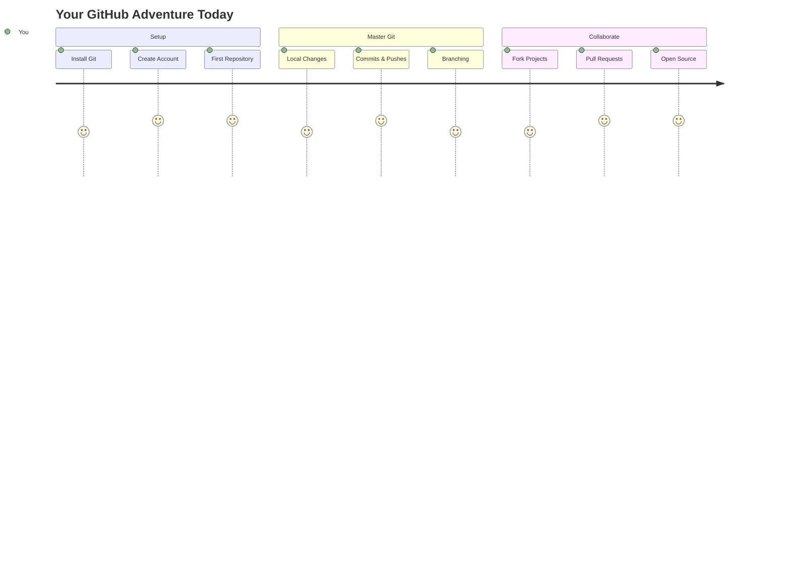
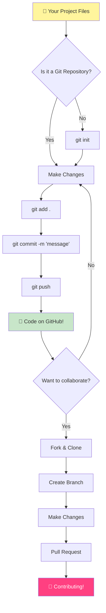
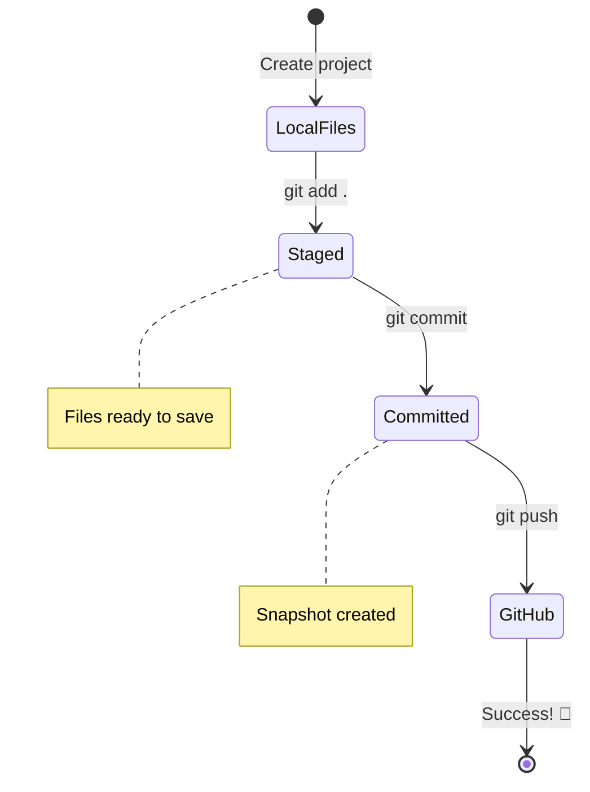
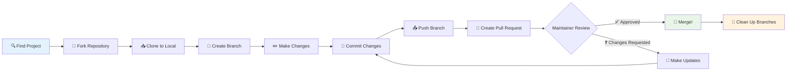
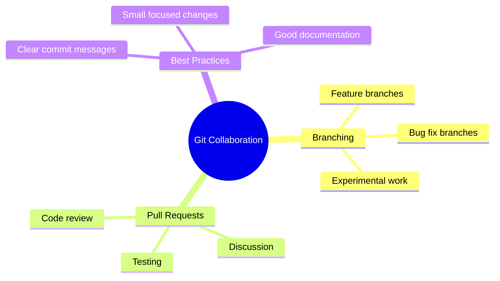
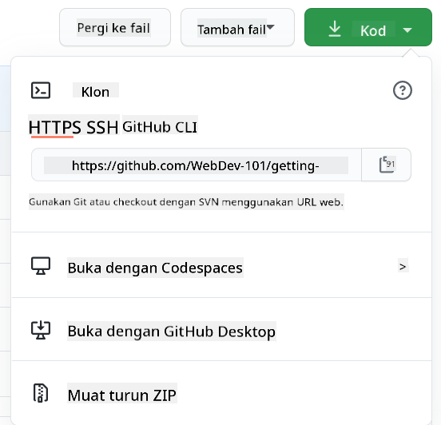
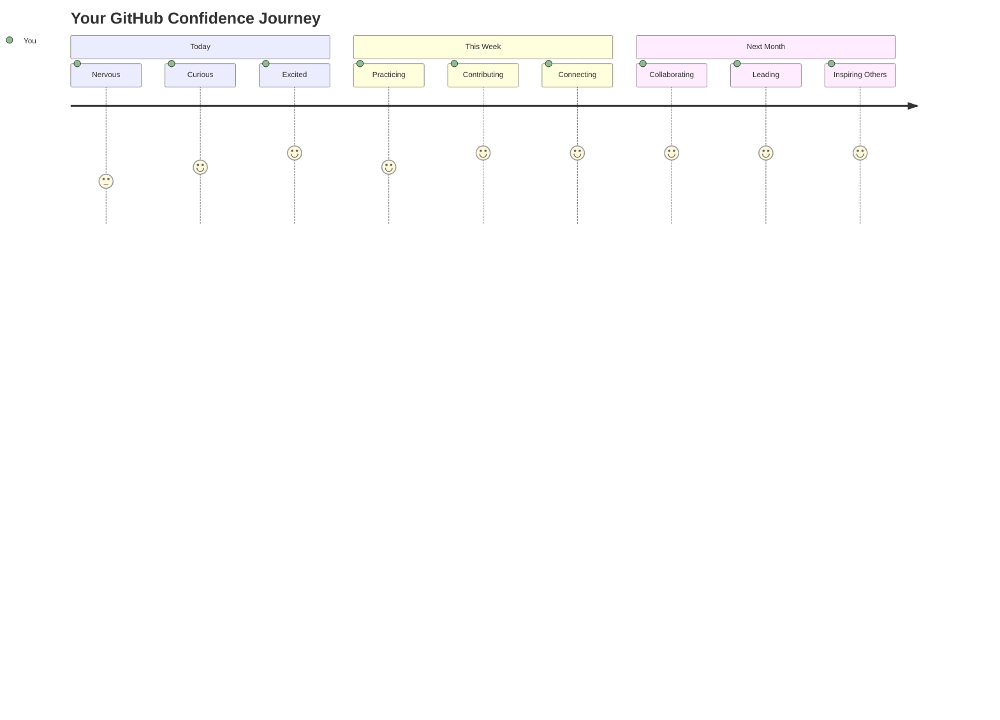

<!--
CO_OP_TRANSLATOR_METADATA:
{
  "original_hash": "0fe3ff66299b447f1c8cb34dcbf0c5ef",
  "translation_date": "2025-11-06T12:06:34+00:00",
  "source_file": "1-getting-started-lessons/2-github-basics/README.md",
  "language_code": "ms"
}
-->
# Pengenalan kepada GitHub

Hai di sana, bakal pembangun! 👋 Bersedia untuk menyertai jutaan pengaturcara di seluruh dunia? Saya sangat teruja untuk memperkenalkan anda kepada GitHub – anggap ia sebagai platform media sosial untuk pengaturcara, tetapi bukannya berkongsi gambar makan tengah hari, kita berkongsi kod dan membina perkara yang luar biasa bersama-sama!

Apa yang benar-benar mengagumkan saya: setiap aplikasi di telefon anda, setiap laman web yang anda lawati, dan kebanyakan alat yang anda akan pelajari untuk digunakan dibangunkan oleh pasukan pembangun yang bekerjasama di platform seperti GitHub. Aplikasi muzik yang anda suka? Seseorang seperti anda menyumbang kepadanya. Permainan yang anda tidak boleh berhenti main? Ya, mungkin dibina dengan kerjasama GitHub. Dan sekarang ANDA akan belajar bagaimana menjadi sebahagian daripada komuniti yang hebat itu!

Saya tahu ini mungkin terasa banyak pada mulanya – malah, saya masih ingat menatap halaman GitHub pertama saya sambil berfikir "Apa maksud semua ini?" Tetapi inilah perkara: setiap pembangun bermula tepat di tempat anda berada sekarang. Pada akhir pelajaran ini, anda akan mempunyai repositori GitHub anda sendiri (anggap ia sebagai pameran projek peribadi anda di awan), dan anda akan tahu bagaimana untuk menyimpan kerja anda, berkongsi dengan orang lain, dan bahkan menyumbang kepada projek yang digunakan oleh jutaan orang.

Kita akan melalui perjalanan ini bersama-sama, satu langkah pada satu masa. Tiada tergesa-gesa, tiada tekanan – hanya anda, saya, dan beberapa alat yang sangat hebat yang akan menjadi sahabat baru anda!


> Sketchnote oleh [Tomomi Imura](https://twitter.com/girlie_mac)



## Kuiz Pra-Kuliah
[Kuiz pra-kuliah](https://ff-quizzes.netlify.app)

## Pengenalan

Sebelum kita terjun ke perkara yang benar-benar menarik, mari kita siapkan komputer anda untuk sedikit keajaiban GitHub! Anggap ini seperti mengatur bekalan seni anda sebelum mencipta karya agung – mempunyai alat yang betul membuat segalanya lebih lancar dan jauh lebih menyeronokkan.

Saya akan membimbing anda melalui setiap langkah persediaan secara peribadi, dan saya janji ia tidaklah menakutkan seperti yang mungkin kelihatan pada pandangan pertama. Jika sesuatu tidak masuk akal dengan segera, itu adalah normal sepenuhnya! Saya masih ingat ketika pertama kali menyediakan persekitaran pembangunan saya dan merasa seperti cuba membaca hieroglif kuno. Setiap pembangun telah berada tepat di tempat anda sekarang, tertanya-tanya jika mereka melakukannya dengan betul. Spoiler: jika anda di sini belajar, anda sudah melakukannya dengan betul! 🌟

Dalam pelajaran ini, kita akan meliputi:

- menjejaki kerja yang anda lakukan pada mesin anda
- bekerja pada projek dengan orang lain
- bagaimana untuk menyumbang kepada perisian sumber terbuka

### Prasyarat

Mari kita siapkan komputer anda untuk sedikit keajaiban GitHub! Jangan risau – persediaan ini hanya perlu dilakukan sekali, dan kemudian anda akan bersedia untuk seluruh perjalanan pengkodan anda.

Baiklah, mari kita mulakan dengan asas! Pertama, kita perlu memeriksa jika Git sudah ada di komputer anda. Git pada dasarnya seperti mempunyai pembantu yang sangat pintar yang mengingati setiap perubahan yang anda buat pada kod anda – jauh lebih baik daripada menekan Ctrl+S dengan panik setiap dua saat (kita semua pernah melakukannya!).

Mari kita lihat jika Git sudah dipasang dengan menaip arahan ajaib ini di terminal anda:
`git --version`

Jika Git belum ada, jangan risau! Pergi sahaja ke [muat turun Git](https://git-scm.com/downloads) dan dapatkannya. Setelah anda memasangnya, kita perlu memperkenalkan Git kepada anda dengan betul:

> 💡 **Persediaan Kali Pertama**: Arahan ini memberitahu Git siapa anda. Maklumat ini akan dilampirkan pada setiap komit yang anda buat, jadi pilih nama dan e-mel yang anda selesa untuk dikongsi secara umum.

```bash
git config --global user.name "your-name"
git config --global user.email "your-email"
```

Untuk memeriksa jika Git sudah dikonfigurasi, anda boleh menaip:
```bash
git config --list
```

Anda juga memerlukan akaun GitHub, editor kod (seperti Visual Studio Code), dan anda perlu membuka terminal anda (atau: command prompt).

Pergi ke [github.com](https://github.com/) dan buat akaun jika anda belum ada, atau log masuk dan isi profil anda.

💡 **Tip Moden**: Pertimbangkan untuk menyediakan [kunci SSH](https://docs.github.com/en/authentication/connecting-to-github-with-ssh) atau menggunakan [GitHub CLI](https://cli.github.com/) untuk pengesahan yang lebih mudah tanpa kata laluan.

✅ GitHub bukan satu-satunya repositori kod di dunia; ada yang lain, tetapi GitHub adalah yang paling terkenal.

### Persediaan

Anda memerlukan folder dengan projek kod pada mesin tempatan anda (laptop atau PC), dan repositori awam di GitHub, yang akan menjadi contoh bagaimana untuk menyumbang kepada projek orang lain.

### Menjaga Kod Anda Selamat

Mari kita bercakap tentang keselamatan sekejap – tetapi jangan risau, kita tidak akan membebankan anda dengan perkara yang menakutkan! Anggap amalan keselamatan ini seperti mengunci kereta atau rumah anda. Ia adalah tabiat mudah yang menjadi kebiasaan dan menjaga kerja keras anda dilindungi.

Kami akan menunjukkan kepada anda cara moden dan selamat untuk bekerja dengan GitHub dari awal. Dengan cara ini, anda akan membentuk tabiat baik yang akan berguna sepanjang kerjaya pengkodan anda.

Apabila bekerja dengan GitHub, adalah penting untuk mengikuti amalan keselamatan terbaik:

| Kawasan Keselamatan | Amalan Terbaik | Mengapa Ia Penting |
|---------------------|----------------|--------------------|
| **Pengesahan** | Gunakan kunci SSH atau Token Akses Peribadi | Kata laluan kurang selamat dan sedang dihentikan |
| **Pengesahan Dua Faktor** | Aktifkan 2FA pada akaun GitHub anda | Menambah lapisan perlindungan tambahan pada akaun |
| **Keselamatan Repositori** | Jangan sekali-kali komit maklumat sensitif | Kunci API dan kata laluan tidak sepatutnya berada dalam repositori awam |
| **Pengurusan Kebergantungan** | Aktifkan Dependabot untuk kemas kini | Menjaga kebergantungan anda selamat dan terkini |

> ⚠️ **Peringatan Keselamatan Kritikal**: Jangan sekali-kali komit kunci API, kata laluan, atau maklumat sensitif lain ke mana-mana repositori. Gunakan pembolehubah persekitaran dan fail `.gitignore` untuk melindungi data sensitif.

**Persediaan Pengesahan Moden:**

```bash
# Generate SSH key (modern ed25519 algorithm)
ssh-keygen -t ed25519 -C "your_email@example.com"

# Set up Git to use SSH
git remote set-url origin git@github.com:username/repository.git
```

> 💡 **Tip Pro**: Kunci SSH menghapuskan keperluan untuk memasukkan kata laluan berulang kali dan lebih selamat daripada kaedah pengesahan tradisional.

---

## Menguruskan Kod Anda Seperti Pro

Baiklah, INI adalah di mana perkara menjadi sangat menarik! 🎉 Kita akan belajar bagaimana untuk menjejaki dan menguruskan kod anda seperti profesional, dan sejujurnya, ini adalah salah satu perkara kegemaran saya untuk diajar kerana ia benar-benar mengubah permainan.

Bayangkan ini: anda sedang menulis cerita yang menakjubkan, dan anda mahu menjejaki setiap draf, setiap suntingan cemerlang, dan setiap "tunggu, itu genius!" sepanjang perjalanan. Itulah yang Git lakukan untuk kod anda! Ia seperti mempunyai buku nota perjalanan masa yang paling luar biasa yang mengingati SEGALANYA – setiap ketikan, setiap perubahan, setiap "oops, itu merosakkan segalanya" yang anda boleh batalkan dengan serta-merta.

Saya akan jujur – ini mungkin terasa mengelirukan pada mulanya. Ketika saya mula, saya fikir "Kenapa saya tidak boleh hanya menyimpan fail saya seperti biasa?" Tetapi percayalah kepada saya: apabila Git klik untuk anda (dan ia akan!), anda akan mempunyai momen lampu di mana anda berfikir "Bagaimana saya PERNAH mengkod tanpa ini?" Ia seperti menemui anda boleh terbang apabila anda telah berjalan ke mana-mana sepanjang hidup anda!

Katakan anda mempunyai folder secara tempatan dengan beberapa projek kod dan anda mahu mula menjejaki kemajuan anda menggunakan git - sistem kawalan versi. Sesetengah orang membandingkan menggunakan git dengan menulis surat cinta kepada diri anda di masa depan. Membaca mesej komit anda beberapa hari, minggu, atau bulan kemudian, anda akan dapat mengingat mengapa anda membuat keputusan, atau "rollback" perubahan - iaitu, apabila anda menulis mesej "commit" yang baik.



### Tugas: Cipta Repositori Pertama Anda!

> 🎯 **Misi Anda (dan saya sangat teruja untuk anda!)**: Kita akan mencipta repositori GitHub pertama anda bersama-sama! Pada akhir ini, anda akan mempunyai sudut kecil anda sendiri di internet di mana kod anda tinggal, dan anda akan membuat "commit" pertama anda (itu istilah pembangun untuk menyimpan kerja anda dengan cara yang sangat pintar).
>
> Ini benar-benar saat yang istimewa – anda akan secara rasmi menyertai komuniti pembangun global! Saya masih ingat kegembiraan mencipta repo pertama saya dan berfikir "Wow, saya benar-benar melakukannya!"

Mari kita lalui pengembaraan ini bersama-sama, langkah demi langkah. Ambil masa anda dengan setiap bahagian – tiada hadiah untuk tergesa-gesa, dan saya janji setiap langkah akan masuk akal. Ingat, setiap bintang pengkodan yang anda kagumi pernah duduk tepat di tempat anda berada, bersedia untuk mencipta repositori pertama mereka. Betapa hebatnya itu?

> Tonton video
> 
> [](https://www.youtube.com/watch?v=9R31OUPpxU4)

**Mari Lakukan Ini Bersama-sama:**

1. **Cipta repositori anda di GitHub**. Pergi ke GitHub.com dan cari butang hijau terang **New** (atau tanda **+** di sudut kanan atas). Klik dan pilih **New repository**.

   Inilah yang perlu dilakukan:
   1. Berikan repositori anda nama – buat ia sesuatu yang bermakna untuk anda!
   1. Tambahkan penerangan jika anda mahu (ini membantu orang lain memahami tentang apa projek anda)
   1. Tentukan jika anda mahu ia awam (semua orang boleh melihatnya) atau peribadi (hanya untuk anda)
   1. Saya cadangkan menandakan kotak untuk menambah fail README – ia seperti halaman depan projek anda
   1. Klik **Create repository** dan raikan – anda baru sahaja mencipta repo pertama anda! 🎉

2. **Navigasi ke folder projek anda**. Sekarang mari kita buka terminal anda (jangan risau, ia tidaklah menakutkan seperti yang kelihatan!). Kita perlu memberitahu komputer anda di mana fail projek anda berada. Taip arahan ini:

   ```bash
   cd [name of your folder]
   ```

   **Apa yang kita lakukan di sini:**
   - Kita pada dasarnya berkata "Hei komputer, bawa saya ke folder projek saya"
   - Ini seperti membuka folder tertentu di desktop anda, tetapi kita melakukannya dengan arahan teks
   - Gantikan `[name of your folder]` dengan nama sebenar folder projek anda

3. **Ubah folder anda menjadi repositori Git**. Di sinilah keajaiban berlaku! Taip:

   ```bash
   git init
   ```

   **Inilah yang baru berlaku (perkara yang sangat hebat!):**
   - Git baru sahaja mencipta folder tersembunyi `.git` dalam projek anda – anda tidak akan melihatnya, tetapi ia ada!
   - Folder biasa anda kini menjadi "repositori" yang boleh menjejaki setiap perubahan yang anda buat
   - Anggap ia seperti memberikan folder anda kuasa super untuk mengingati segalanya

4. **Periksa apa yang sedang berlaku**. Mari kita lihat apa yang Git fikirkan tentang projek anda sekarang:

   ```bash
   git status
   ```

   **Memahami apa yang Git beritahu anda:**
   
   Anda mungkin melihat sesuatu yang kelihatan seperti ini:

   ```output
   Changes not staged for commit:
   (use "git add <file>..." to update what will be committed)
   (use "git restore <file>..." to discard changes in working directory)

        modified:   file.txt
        modified:   file2.txt
   ```

   **Jangan panik! Inilah maksudnya:**
   - Fail dalam **merah** adalah fail yang mempunyai perubahan tetapi belum bersedia untuk disimpan
   - Fail dalam **hijau** (apabila anda melihatnya) sudah bersedia untuk disimpan
   - Git sedang membantu dengan memberitahu anda dengan tepat apa yang boleh anda lakukan seterusnya

   > 💡 **Tip pro**: Arahan `git status` adalah sahabat terbaik anda! Gunakannya bila-bila masa anda keliru tentang apa yang sedang berlaku. Ia seperti bertanya kepada Git "Hei, apa situasi sekarang?"

5. **Sediakan fail anda untuk disimpan** (ini dipanggil "staging"):

   ```bash
   git add .
   ```

   **Apa yang kita baru lakukan:**
   - Kita memberitahu Git "Hei, saya mahu memasukkan SEMUA fail saya dalam simpanan seterusnya"
   - `.` adalah seperti berkata "semua dalam folder ini"
   - Sekarang fail anda "staged" dan bersedia untuk langkah seterusnya

   **Mahukan lebih selektif?** Anda boleh menambah hanya fail tertentu:

   ```bash
   git add [file or folder name]
   ```

   **Kenapa anda mungkin mahu melakukan ini?**
   - Kadang-kadang anda mahu menyimpan perubahan berkaitan bersama-sama
   - Ia membantu anda mengatur kerja anda ke dalam bahagian logik
   - Memudahkan untuk memahami apa yang berubah dan bila

   **Berubah fikiran?** Jangan risau! Anda boleh membatalkan "stage" fail seperti ini:

   ```bash
   # Unstage everything
   git reset
   
   # Unstage just one file
   git reset [file name]
   ```

   Jangan risau – ini tidak memadamkan kerja anda, ia hanya mengeluarkan fail dari "staging".

6. **Simpan kerja anda secara kekal** (membuat komit pertama anda!):

   ```bash
   git commit -m "first commit"
   ```

   **🎉 Tahniah! Anda baru sahaja membuat komit pertama anda!**
   
   **Inilah yang baru berlaku:**
   - Git mengambil "snapshot" semua fail yang telah "staged" pada saat ini
   - Mesej komit anda "first commit" menerangkan tentang apa titik simpanan ini
   - Git memberikan snapshot ini ID unik supaya anda sentiasa boleh mencarinya kemudian
   - Anda secara rasmi mula menjejaki sejarah projek anda!

   > 💡 **Mesej komit masa depan**: Untuk komit seterusnya, jadilah lebih deskriptif! Daripada "updated stuff", cuba "Tambah borang hubungan ke halaman utama" atau "Betulkan bug menu navigasi". Diri anda di masa depan akan berterima kasih!

7. **Sambungkan projek tempatan anda ke GitHub**. Sekarang, projek anda hanya wujud di komputer anda. Mari kita sambungkannya ke repositori GitHub anda supaya anda boleh berkongsi dengan dunia!

   Pertama, pergi ke halaman repositori GitHub anda dan salin URL. Kemudian kembali ke sini dan taip:

   ```bash
   git remote add origin https://github.com/username/repository_name.git
   ```
   
   (Gantikan URL itu dengan URL repositori sebenar anda!)
**Apa yang baru kita lakukan:**
- Kita telah mencipta sambungan antara projek tempatan anda dan repositori GitHub anda
- "Origin" hanyalah nama panggilan untuk repositori GitHub anda – ia seperti menambah kenalan ke telefon anda
- Kini Git tempatan anda tahu ke mana untuk menghantar kod anda apabila anda bersedia untuk berkongsi

💡 **Cara lebih mudah**: Jika anda telah memasang GitHub CLI, anda boleh melakukan ini dengan satu arahan:
   ```bash
   gh repo create my-repo --public --push --source=.
   ```

8. **Hantar kod anda ke GitHub** (saat yang dinanti-nantikan!):

   ```bash
   git push -u origin main
   ```

**🚀 Inilah dia! Anda sedang memuat naik kod anda ke GitHub!**

**Apa yang sedang berlaku:**
- Komit anda sedang bergerak dari komputer anda ke GitHub
- Flag `-u` menetapkan sambungan kekal supaya push di masa depan lebih mudah
- "main" adalah nama cawangan utama anda (seperti folder utama)
- Selepas ini, anda hanya perlu menaip `git push` untuk muat naik seterusnya!

💡 **Nota ringkas**: Jika cawangan anda dipanggil sesuatu yang lain (seperti "master"), gunakan nama itu. Anda boleh semak dengan `git branch --show-current`.

9. **Ritma pengkodan harian anda yang baru** (di sinilah ia menjadi ketagihan!):

Mulai sekarang, setiap kali anda membuat perubahan pada projek anda, anda hanya perlu melakukan tiga langkah mudah ini:

   ```bash
   git add .
   git commit -m "describe what you changed"
   git push
   ```

**Ini menjadi nadi pengkodan anda:**
- Buat beberapa perubahan hebat pada kod anda ✨
- Stage mereka dengan `git add` ("Hei Git, beri perhatian pada perubahan ini!")
- Simpan mereka dengan `git commit` dan mesej deskriptif (masa depan anda akan berterima kasih!)
- Kongsi mereka dengan dunia menggunakan `git push` 🚀
- Ulangi – serius, ini menjadi semudah bernafas!

Saya suka aliran kerja ini kerana ia seperti mempunyai beberapa titik simpanan dalam permainan video. Buat perubahan yang anda suka? Komit! Mahu mencuba sesuatu yang berisiko? Tiada masalah – anda sentiasa boleh kembali ke komit terakhir anda jika keadaan menjadi tidak terkawal!

> 💡 **Tip**: Anda mungkin juga mahu menggunakan fail `.gitignore` untuk mengelakkan fail yang anda tidak mahu jejak daripada muncul di GitHub - seperti fail nota yang anda simpan dalam folder yang sama tetapi tidak sesuai untuk repositori awam. Anda boleh mencari templat untuk fail `.gitignore` di [.gitignore templates](https://github.com/github/gitignore) atau mencipta satu menggunakan [gitignore.io](https://www.toptal.com/developers/gitignore).

### 🧠 **Pemeriksaan Repositori Pertama: Bagaimana Rasanya?**

**Luangkan masa untuk meraikan dan merenung:**
- Bagaimana rasanya melihat kod anda muncul di GitHub buat kali pertama?
- Langkah mana yang paling mengelirukan, dan mana yang terasa sangat mudah?
- Bolehkah anda menerangkan perbezaan antara `git add`, `git commit`, dan `git push` dengan kata-kata anda sendiri?



> **Ingat**: Walaupun pembangun berpengalaman kadang-kadang lupa arahan yang tepat. Menjadikan aliran kerja ini sebagai memori otot memerlukan latihan - anda sedang melakukan dengan baik!

#### Aliran kerja Git moden

Pertimbangkan untuk mengamalkan amalan moden ini:

- **Conventional Commits**: Gunakan format mesej komit yang standard seperti `feat:`, `fix:`, `docs:`, dll. Ketahui lebih lanjut di [conventionalcommits.org](https://www.conventionalcommits.org/)
- **Komit atom**: Pastikan setiap komit mewakili satu perubahan logik
- **Komit kerap**: Komit dengan kerap dengan mesej deskriptif daripada komit besar dan jarang

#### Mesej komit

Baris subjek mesej komit Git yang hebat melengkapkan ayat berikut:
Jika digunakan, komit ini akan <baris subjek anda di sini>

Untuk subjek gunakan bentuk perintah, masa kini: "ubah" bukan "diubah" atau "mengubah". 
Seperti dalam subjek, dalam badan (pilihan) juga gunakan bentuk perintah, masa kini. Badan harus merangkumi motivasi untuk perubahan dan bandingkan ini dengan tingkah laku sebelumnya. Anda menerangkan `mengapa`, bukan `bagaimana`.

✅ Luangkan beberapa minit untuk melayari GitHub. Bolehkah anda menemui mesej komit yang sangat hebat? Bolehkah anda menemui yang sangat minimal? Maklumat apa yang anda fikir paling penting dan berguna untuk disampaikan dalam mesej komit?

## Bekerjasama dengan Orang Lain (Bahagian Seronok!)

Pegang topi anda kerana INILAH di mana GitHub menjadi sangat ajaib! 🪄 Anda telah menguasai pengurusan kod anda sendiri, tetapi sekarang kita akan menyelami bahagian kegemaran saya – bekerjasama dengan orang hebat dari seluruh dunia.

Bayangkan ini: anda bangun esok dan melihat seseorang di Tokyo telah memperbaiki kod anda semasa anda tidur. Kemudian seseorang di Berlin membetulkan bug yang anda tidak dapat selesaikan. Menjelang petang, seorang pembangun di São Paulo telah menambah ciri yang anda tidak pernah fikirkan. Itu bukan fiksyen sains – itu hanya hari Selasa di alam semesta GitHub!

Apa yang benar-benar membuatkan saya teruja ialah kemahiran kolaborasi yang akan anda pelajari? Ini adalah aliran kerja YANG SAMA yang digunakan oleh pasukan di Google, Microsoft, dan syarikat permulaan kegemaran anda setiap hari. Anda bukan sahaja belajar alat yang hebat – anda sedang belajar bahasa rahsia yang membuat seluruh dunia perisian bekerjasama.

Serius, apabila anda mengalami keseronokan apabila seseorang menggabungkan permintaan tarik pertama anda, anda akan memahami mengapa pembangun begitu bersemangat tentang sumber terbuka. Ia seperti menjadi sebahagian daripada projek pasukan terbesar dan paling kreatif di dunia!

> Tonton video
>
> [](https://www.youtube.com/watch?v=bFCM-PC3cu8)

Sebab utama meletakkan sesuatu di GitHub adalah untuk memungkinkan kerjasama dengan pembangun lain.



Dalam repositori anda, navigasi ke `Insights > Community` untuk melihat bagaimana projek anda dibandingkan dengan standard komuniti yang disyorkan.

Mahukan repositori anda kelihatan profesional dan mesra? Pergi ke repositori anda dan klik pada `Insights > Community`. Ciri hebat ini menunjukkan kepada anda bagaimana projek anda dibandingkan dengan apa yang dianggap sebagai "amalan repositori yang baik" oleh komuniti GitHub.

> 🎯 **Menjadikan Projek Anda Bersinar**: Repositori yang teratur dengan dokumentasi yang baik adalah seperti mempunyai kedai yang bersih dan mesra. Ia menunjukkan kepada orang bahawa anda peduli dengan kerja anda dan membuatkan orang lain ingin menyumbang!

**Inilah yang menjadikan repositori hebat:**

| Apa yang Perlu Ditambah | Mengapa Ia Penting | Apa yang Ia Lakukan untuk Anda |
|--------------------------|--------------------|--------------------------------|
| **Deskripsi** | Kesan pertama penting! | Orang tahu dengan segera apa yang projek anda lakukan |
| **README** | Halaman depan projek anda | Seperti pemandu pelancong mesra untuk pelawat baru |
| **Panduan Penyumbangan** | Menunjukkan anda mengalu-alukan bantuan | Orang tahu dengan tepat bagaimana mereka boleh membantu anda |
| **Kod Etika** | Mewujudkan ruang mesra | Semua orang merasa dialu-alukan untuk menyertai |
| **Lesen** | Kejelasan undang-undang | Orang lain tahu bagaimana mereka boleh menggunakan kod anda |
| **Dasar Keselamatan** | Menunjukkan anda bertanggungjawab | Menunjukkan amalan profesional |

> 💡 **Tip Pro**: GitHub menyediakan templat untuk semua fail ini. Apabila mencipta repositori baru, tandakan kotak untuk menjana fail-fail ini secara automatik.

**Ciri GitHub Moden untuk Diterokai:**

🤖 **Automasi & CI/CD:**
- **GitHub Actions** untuk ujian dan penyebaran automatik
- **Dependabot** untuk kemas kini kebergantungan automatik

💬 **Komuniti & Pengurusan Projek:**
- **GitHub Discussions** untuk perbincangan komuniti di luar isu
- **GitHub Projects** untuk pengurusan projek gaya kanban
- **Peraturan perlindungan cawangan** untuk menegakkan standard kualiti kod

Semua sumber ini akan memberi manfaat kepada onboarding ahli pasukan baru. Dan ini biasanya perkara yang dilihat oleh penyumbang baru sebelum mereka melihat kod anda, untuk mengetahui sama ada projek anda adalah tempat yang sesuai untuk mereka meluangkan masa.

✅ Fail README, walaupun memerlukan masa untuk disediakan, sering diabaikan oleh penyelenggara yang sibuk. Bolehkah anda menemui contoh yang sangat deskriptif? Nota: terdapat beberapa [alat untuk membantu mencipta README yang baik](https://www.makeareadme.com/) yang mungkin anda ingin cuba.

### Tugas: Gabungkan beberapa kod

Dokumen penyumbangan membantu orang menyumbang kepada projek. Ia menerangkan jenis sumbangan yang anda cari dan bagaimana prosesnya berfungsi. Penyumbang perlu melalui beberapa langkah untuk dapat menyumbang kepada repo anda di GitHub:

1. **Fork repo anda** Anda mungkin mahu orang _fork_ projek anda. Fork bermaksud mencipta replika repositori anda di profil GitHub mereka.
1. **Clone**. Dari situ mereka akan clone projek ke mesin tempatan mereka.
1. **Cipta cawangan**. Anda akan mahu meminta mereka mencipta _cawangan_ untuk kerja mereka.
1. **Fokuskan perubahan mereka pada satu kawasan**. Minta penyumbang untuk menumpukan sumbangan mereka pada satu perkara pada satu masa - dengan cara itu peluang untuk anda _gabungkan_ kerja mereka adalah lebih tinggi. Bayangkan mereka menulis pembaikan bug, menambah ciri baru, dan mengemas kini beberapa ujian - bagaimana jika anda mahu, atau hanya boleh melaksanakan 2 daripada 3, atau 1 daripada 3 perubahan?

✅ Bayangkan situasi di mana cawangan sangat kritikal untuk menulis dan menghantar kod yang baik. Apakah kes penggunaan yang boleh anda fikirkan?

> Nota, jadilah perubahan yang anda mahu lihat di dunia, dan cipta cawangan untuk kerja anda sendiri juga. Sebarang komit yang anda buat akan dibuat pada cawangan yang anda sedang "checked out". Gunakan `git status` untuk melihat cawangan mana itu.

Mari kita lalui aliran kerja penyumbang. Anggap penyumbang telah _fork_ dan _clone_ repo jadi mereka mempunyai repo Git yang sedia untuk digunakan, di mesin tempatan mereka:

1. **Cipta cawangan**. Gunakan arahan `git branch` untuk mencipta cawangan yang akan mengandungi perubahan yang mereka maksudkan untuk disumbangkan:

   ```bash
   git branch [branch-name]
   ```

   > 💡 **Pendekatan Moden**: Anda juga boleh mencipta dan beralih ke cawangan baru dalam satu arahan:
   ```bash
   git switch -c [branch-name]
   ```

1. **Beralih ke cawangan kerja**. Beralih ke cawangan yang ditentukan dan kemas kini direktori kerja dengan `git switch`:

   ```bash
   git switch [branch-name]
   ```

   > 💡 **Nota Moden**: `git switch` adalah pengganti moden untuk `git checkout` apabila menukar cawangan. Ia lebih jelas dan lebih selamat untuk pemula.

1. **Lakukan kerja**. Pada ketika ini anda mahu menambah perubahan anda. Jangan lupa untuk memberitahu Git mengenainya dengan arahan berikut:

   ```bash
   git add .
   git commit -m "my changes"
   ```

   > ⚠️ **Kualiti Mesej Komit**: Pastikan anda memberikan komit anda nama yang baik, baik untuk anda dan penyelenggara repo yang anda bantu. Jadilah spesifik tentang apa yang anda ubah!

1. **Gabungkan kerja anda dengan cawangan `main`**. Pada satu ketika anda selesai bekerja dan anda mahu menggabungkan kerja anda dengan cawangan `main`. Cawangan `main` mungkin telah berubah sementara itu jadi pastikan anda mengemas kini terlebih dahulu dengan arahan berikut:

   ```bash
   git switch main
   git pull
   ```

   Pada ketika ini anda mahu memastikan bahawa sebarang _konflik_, situasi di mana Git tidak dapat dengan mudah _menggabungkan_ perubahan berlaku dalam cawangan kerja anda. Oleh itu jalankan arahan berikut:

   ```bash
   git switch [branch_name]
   git merge main
   ```

   Arahan `git merge main` akan membawa semua perubahan dari `main` ke dalam cawangan anda. Mudah-mudahan anda boleh teruskan. Jika tidak, VS Code akan memberitahu anda di mana Git _keliru_ dan anda hanya mengubah fail yang terjejas untuk mengatakan kandungan mana yang paling tepat.

   💡 **Alternatif moden**: Pertimbangkan untuk menggunakan `git rebase` untuk sejarah yang lebih bersih:
   ```bash
   git rebase main
   ```
   Ini memainkan semula komit anda di atas cawangan utama terkini, mencipta sejarah linear.

1. **Hantar kerja anda ke GitHub**. Menghantar kerja anda ke GitHub bermaksud dua perkara. Push cawangan anda ke repo anda dan kemudian buka PR, Pull Request.

   ```bash
   git push --set-upstream origin [branch-name]
   ```

   Arahan di atas mencipta cawangan di repo forked anda.

### 🤝 **Pemeriksaan Kemahiran Kolaborasi: Bersedia untuk Bekerjasama dengan Orang Lain?**

**Mari lihat bagaimana perasaan anda tentang kolaborasi:**
- Adakah idea fork dan pull request masuk akal kepada anda sekarang?
- Apakah satu perkara tentang bekerja dengan cawangan yang anda mahu latih lebih banyak?
- Sejauh mana anda selesa menyumbang kepada projek orang lain?



> **Peningkat keyakinan**: Setiap pembangun yang anda kagumi pernah gugup tentang permintaan tarik pertama mereka. Komuniti GitHub sangat mesra kepada pendatang baru!

1. **Buka PR**. Seterusnya, anda mahu membuka PR. Anda melakukannya dengan menavigasi ke repo forked di GitHub. Anda akan melihat petunjuk di GitHub di mana ia bertanya sama ada anda mahu mencipta PR baru, anda klik itu dan anda dibawa ke antara muka di mana anda boleh menukar tajuk mesej komit, memberikannya deskripsi yang lebih sesuai. Kini penyelenggara repo yang anda forked akan melihat PR ini dan _harap-harap_ mereka akan menghargai dan _menggabungkan_ PR anda. Anda kini seorang penyumbang, yay :)

   💡 **Tip moden**: Anda juga boleh mencipta PR menggunakan GitHub CLI:
   ```bash
   gh pr create --title "Your PR title" --body "Description of changes"
   ```

   🔧 **Amalan terbaik untuk PR**:
   - Pautkan kepada isu berkaitan menggunakan kata kunci seperti "Fixes #123"
   - Tambahkan tangkapan skrin untuk perubahan UI
   - Minta pengulas tertentu
   - Gunakan PR draf untuk kerja yang sedang berjalan
   - Pastikan semua pemeriksaan CI lulus sebelum meminta ulasan
1. **Bersihkan**. Adalah amalan yang baik untuk _membersihkan_ selepas anda berjaya menggabungkan PR. Anda perlu membersihkan kedua-dua cawangan tempatan anda dan cawangan yang anda tolak ke GitHub. Pertama, mari kita hapuskannya secara tempatan dengan arahan berikut:

   ```bash
   git branch -d [branch-name]
   ```

   Pastikan anda pergi ke halaman GitHub untuk repo yang telah difork dan hapuskan cawangan jauh yang baru sahaja anda tolak ke sana.

`Pull request` mungkin kedengaran seperti istilah yang pelik kerana sebenarnya anda ingin menolak perubahan anda ke projek tersebut. Tetapi pemelihara (pemilik projek) atau pasukan teras perlu mempertimbangkan perubahan anda sebelum menggabungkannya dengan cawangan "utama" projek, jadi sebenarnya anda meminta keputusan perubahan daripada pemelihara.

Pull request adalah tempat untuk membandingkan dan membincangkan perbezaan yang diperkenalkan pada cawangan dengan ulasan, komen, ujian yang diintegrasikan, dan banyak lagi. Pull request yang baik mengikuti peraturan yang hampir sama seperti mesej commit. Anda boleh menambah rujukan kepada isu dalam penjejak isu, contohnya apabila kerja anda menyelesaikan sesuatu isu. Ini dilakukan dengan menggunakan `#` diikuti dengan nombor isu anda. Sebagai contoh `#97`.

🤞Semoga semua pemeriksaan lulus dan pemilik projek menggabungkan perubahan anda ke dalam projek🤞

Kemas kini cawangan kerja tempatan semasa anda dengan semua commit baru dari cawangan jauh yang sepadan di GitHub:

`git pull`

## Menyumbang kepada Sumber Terbuka (Peluang Anda untuk Memberi Impak!)

Adakah anda bersedia untuk sesuatu yang akan benar-benar mengejutkan anda? 🤯 Mari kita bincangkan tentang menyumbang kepada projek sumber terbuka – dan saya rasa teruja hanya memikirkan untuk berkongsi ini dengan anda!

Ini adalah peluang anda untuk menjadi sebahagian daripada sesuatu yang benar-benar luar biasa. Bayangkan memperbaiki alat yang digunakan oleh jutaan pembangun setiap hari, atau membetulkan pepijat dalam aplikasi yang disukai oleh rakan-rakan anda. Itu bukan sekadar impian – itulah yang dimaksudkan dengan sumbangan sumber terbuka!

Inilah yang membuatkan saya teruja setiap kali memikirkannya: setiap alat yang anda pelajari – editor kod anda, rangka kerja yang akan kita terokai, malah pelayar yang anda gunakan sekarang – bermula dengan seseorang seperti anda yang membuat sumbangan pertama mereka. Pembangun hebat yang membina sambungan VS Code kegemaran anda? Mereka juga pernah menjadi pemula yang mengklik "create pull request" dengan tangan yang gementar, seperti yang akan anda lakukan.

Dan inilah bahagian yang paling indah: komuniti sumber terbuka adalah seperti pelukan besar di internet. Kebanyakan projek secara aktif mencari pendatang baru dan mempunyai isu yang ditandai "good first issue" khusus untuk orang seperti anda! Pemelihara benar-benar teruja apabila mereka melihat penyumbang baru kerana mereka mengingati langkah pertama mereka sendiri.

```mermaid
flowchart TD
    A[🔍 Explore GitHub] --> B[🏷️ Find "good first issue"]
    B --> C[📖 Read Contributing Guidelines]
    C --> D[🍴 Fork Repository]
    D --> E[💻 Set Up Local Environment]
    E --> F[🌿 Create Feature Branch]
    F --> G[✨ Make Your Contribution]
    G --> H[🧪 Test Your Changes]
    H --> I[📝 Write Clear Commit]
    I --> J[📤 Push & Create PR]
    J --> K[💬 Engage with Feedback]
    K --> L[🎉 Merged! You're a Contributor!]
    L --> M[🌟 Find Next Issue]
    
    style A fill:#e1f5fe
    style L fill:#c8e6c9
    style M fill:#fff59d
```

Anda bukan sahaja belajar untuk menulis kod di sini – anda sedang bersedia untuk menyertai keluarga global pembina yang bangun setiap hari dengan memikirkan "Bagaimana kita boleh menjadikan dunia digital sedikit lebih baik?" Selamat datang ke kelab! 🌟

Pertama, mari kita cari repositori (atau **repo**) di GitHub yang menarik minat anda dan yang ingin anda sumbangkan perubahan. Anda akan mahu menyalin kandungannya ke mesin anda.

✅ Cara yang baik untuk mencari repo 'mesra pemula' adalah dengan [mencari tag 'good-first-issue'](https://github.blog/2020-01-22-browse-good-first-issues-to-start-contributing-to-open-source/).



Terdapat beberapa cara untuk menyalin kod. Salah satu cara adalah dengan "clone" kandungan repositori, menggunakan HTTPS, SSH, atau menggunakan GitHub CLI (Command Line Interface).

Buka terminal anda dan clone repositori seperti ini:
```bash
# Using HTTPS
git clone https://github.com/ProjectURL

# Using SSH (requires SSH key setup)
git clone git@github.com:username/repository.git

# Using GitHub CLI
gh repo clone username/repository
```

Untuk bekerja pada projek, tukar ke folder yang betul:
`cd ProjectURL`

Anda juga boleh membuka keseluruhan projek menggunakan:
- **[GitHub Codespaces](https://github.com/features/codespaces)** - Persekitaran pembangunan awan GitHub dengan VS Code dalam pelayar
- **[GitHub Desktop](https://desktop.github.com/)** - Aplikasi GUI untuk operasi Git  
- **[GitHub.dev](https://github.dev)** - Tekan kekunci `.` pada mana-mana repo GitHub untuk membuka VS Code dalam pelayar
- **VS Code** dengan sambungan Pull Requests GitHub

Akhir sekali, anda boleh memuat turun kod dalam folder zip.

### Beberapa perkara menarik tentang GitHub

Anda boleh memberi bintang, menonton dan/atau "fork" mana-mana repositori awam di GitHub. Anda boleh mencari repositori yang anda beri bintang dalam menu drop-down di sudut kanan atas. Ia seperti penanda buku, tetapi untuk kod.

Projek mempunyai penjejak isu, kebanyakannya di GitHub dalam tab "Issues" kecuali dinyatakan sebaliknya, di mana orang membincangkan isu berkaitan projek. Dan tab Pull Requests adalah tempat orang membincangkan dan mengulas perubahan yang sedang berlangsung.

Projek mungkin juga mempunyai perbincangan dalam forum, senarai mel, atau saluran sembang seperti Slack, Discord atau IRC.

🔧 **Ciri moden GitHub**:
- **GitHub Discussions** - Forum terbina dalam untuk perbualan komuniti
- **GitHub Sponsors** - Sokong pemelihara secara kewangan  
- **Tab Security** - Laporan kerentanan dan nasihat keselamatan
- **Tab Actions** - Lihat aliran kerja automatik dan saluran CI/CD
- **Tab Insights** - Analitik tentang penyumbang, commit, dan kesihatan projek
- **Tab Projects** - Alat pengurusan projek terbina dalam GitHub

✅ Lihat sekeliling repo GitHub baru anda dan cuba beberapa perkara, seperti mengedit tetapan, menambah maklumat ke repo anda, mencipta projek (seperti papan Kanban), dan menyediakan GitHub Actions untuk automasi. Terdapat banyak yang boleh anda lakukan!

---

## 🚀 Cabaran 

Baiklah, sudah tiba masanya untuk menguji kuasa super GitHub baru anda! 🚀 Berikut adalah cabaran yang akan membuatkan semuanya klik dengan cara yang paling memuaskan:

Ajak seorang rakan (atau ahli keluarga yang selalu bertanya apa yang anda lakukan dengan semua "perkara komputer" ini) dan mulakan pengembaraan pengekodan kolaboratif bersama! Di sinilah keajaiban sebenar berlaku – cipta projek, biarkan mereka fork, buat beberapa cawangan, dan gabungkan perubahan seperti profesional yang anda sedang menjadi.

Saya tidak akan berbohong – anda mungkin akan ketawa pada satu ketika (terutamanya apabila anda berdua cuba mengubah baris yang sama), mungkin menggaru kepala dalam kekeliruan, tetapi anda pasti akan mempunyai momen "aha!" yang menakjubkan yang membuatkan semua pembelajaran berbaloi. Tambahan pula, ada sesuatu yang istimewa tentang berkongsi gabungan pertama yang berjaya dengan orang lain – ia seperti perayaan kecil tentang sejauh mana anda telah melangkah!

Belum ada rakan pengekodan? Jangan risau! Komuniti GitHub penuh dengan orang yang sangat mesra yang mengingati bagaimana rasanya menjadi baru. Cari repositori dengan label "good first issue" – mereka pada dasarnya berkata "Hei pemula, mari belajar bersama kami!" Betapa hebatnya itu?

## Kuiz Selepas Kuliah
[Kuiz selepas kuliah](https://ff-quizzes.netlify.app/web/en/)

## Ulasan & Terus Belajar

Whew! 🎉 Lihatlah anda – anda baru sahaja menakluk asas GitHub seperti seorang juara sejati! Jika otak anda terasa sedikit penuh sekarang, itu adalah perkara biasa dan sebenarnya tanda yang baik. Anda baru sahaja belajar alat yang mengambil masa berminggu-minggu untuk saya rasa selesa semasa saya mula.

Git dan GitHub sangat berkuasa (serius, sangat berkuasa), dan setiap pembangun yang saya kenal – termasuk yang kelihatan seperti ahli sihir sekarang – perlu berlatih dan tersandung sedikit sebelum semuanya klik. Fakta bahawa anda telah melalui pelajaran ini bermakna anda sudah dalam perjalanan untuk menguasai beberapa alat yang paling penting dalam kit alat pembangun.

Berikut adalah beberapa sumber yang sangat hebat untuk membantu anda berlatih dan menjadi lebih hebat:

- [Panduan menyumbang kepada perisian sumber terbuka](https://opensource.guide/how-to-contribute/#how-to-submit-a-contribution) – Peta jalan anda untuk membuat perbezaan
- [Cheatsheet Git](https://training.github.com/downloads/github-git-cheat-sheet/) – Simpan ini untuk rujukan cepat!

Dan ingat: latihan membawa kemajuan, bukan kesempurnaan! Semakin banyak anda menggunakan Git dan GitHub, semakin semula jadi ia menjadi. GitHub telah mencipta beberapa kursus interaktif yang menakjubkan yang membolehkan anda berlatih dalam persekitaran yang selamat:

- [Pengenalan kepada GitHub](https://github.com/skills/introduction-to-github)
- [Berkomunikasi menggunakan Markdown](https://github.com/skills/communicate-using-markdown)  
- [GitHub Pages](https://github.com/skills/github-pages)
- [Mengurus konflik gabungan](https://github.com/skills/resolve-merge-conflicts)

**Rasa berani? Lihat alat moden ini:**
- [Dokumentasi GitHub CLI](https://cli.github.com/manual/) – Untuk apabila anda ingin merasa seperti ahli sihir baris perintah
- [Dokumentasi GitHub Codespaces](https://docs.github.com/en/codespaces) – Kod di awan!
- [Dokumentasi GitHub Actions](https://docs.github.com/en/actions) – Automasi semua perkara
- [Amalan terbaik Git](https://www.atlassian.com/git/tutorials/comparing-workflows) – Tingkatkan permainan aliran kerja anda 

## Cabaran Ejen GitHub Copilot 🚀

Gunakan mod Ejen untuk menyelesaikan cabaran berikut:

**Deskripsi:** Cipta projek pembangunan web kolaboratif yang menunjukkan aliran kerja GitHub lengkap yang telah anda pelajari dalam pelajaran ini. Cabaran ini akan membantu anda berlatih penciptaan repositori, ciri kolaborasi, dan aliran kerja Git moden dalam senario dunia sebenar.

**Arahan:** Cipta repositori GitHub awam baru untuk projek "Sumber Pembangunan Web" yang ringkas. Repositori tersebut harus termasuk fail README.md yang berstruktur baik yang menyenaraikan alat dan sumber pembangunan web yang berguna, disusun mengikut kategori (HTML, CSS, JavaScript, dll.). Sediakan repositori dengan piawaian komuniti yang betul termasuk lesen, panduan menyumbang, dan kod tingkah laku. Cipta sekurang-kurangnya dua cawangan ciri: satu untuk menambah sumber CSS dan satu lagi untuk sumber JavaScript. Buat commit pada setiap cawangan dengan mesej commit yang deskriptif, kemudian cipta pull request untuk menggabungkan perubahan kembali ke main. Aktifkan ciri GitHub seperti Issues, Discussions, dan sediakan aliran kerja GitHub Actions asas untuk pemeriksaan automatik.

## Tugasan 

Misi anda, jika anda memilih untuk menerimanya: Lengkapkan kursus [Pengenalan kepada GitHub](https://github.com/skills/introduction-to-github) di GitHub Skills. Kursus interaktif ini akan membolehkan anda berlatih segala yang telah anda pelajari dalam persekitaran yang selamat dan berpandu. Tambahan pula, anda akan mendapat lencana yang hebat apabila selesai! 🏅

**Rasa bersedia untuk cabaran lebih lanjut?**
- Sediakan pengesahan SSH untuk akaun GitHub anda (tidak perlu lagi kata laluan!)
- Cuba gunakan GitHub CLI untuk operasi Git harian anda
- Cipta repositori dengan aliran kerja GitHub Actions
- Terokai GitHub Codespaces dengan membuka repositori ini dalam editor berasaskan awan

---

## 🚀 Garis Masa Penguasaan GitHub Anda

### ⚡ **Apa yang Anda Boleh Lakukan dalam 5 Minit Seterusnya**
- [ ] Beri bintang pada repositori ini dan 3 projek lain yang menarik minat anda
- [ ] Sediakan pengesahan dua faktor pada akaun GitHub anda
- [ ] Cipta README ringkas untuk repositori pertama anda
- [ ] Ikuti 5 pembangun yang kerja mereka memberi inspirasi kepada anda

### 🎯 **Apa yang Anda Boleh Capai Dalam Satu Jam**
- [ ] Lengkapkan kuiz selepas pelajaran dan renungkan perjalanan GitHub anda
- [ ] Sediakan kunci SSH untuk pengesahan GitHub tanpa kata laluan
- [ ] Buat commit pertama yang bermakna dengan mesej commit yang hebat
- [ ] Terokai tab "Explore" GitHub untuk menemui projek yang sedang trending
- [ ] Berlatih fork repositori dan membuat perubahan kecil

### 📅 **Pengembaraan GitHub Anda Sepanjang Minggu**
- [ ] Lengkapkan kursus Kemahiran GitHub (Pengenalan kepada GitHub, Markdown)
- [ ] Buat pull request pertama anda kepada projek sumber terbuka
- [ ] Sediakan laman GitHub Pages untuk mempamerkan kerja anda
- [ ] Sertai GitHub Discussions pada projek yang menarik minat anda
- [ ] Cipta repositori dengan piawaian komuniti yang betul (README, Lesen, dll.)
- [ ] Cuba GitHub Codespaces untuk pembangunan berasaskan awan

### 🌟 **Transformasi Anda Sepanjang Bulan**
- [ ] Menyumbang kepada 3 projek sumber terbuka yang berbeza
- [ ] Mentor seseorang yang baru kepada GitHub (berikan semangat!)
- [ ] Sediakan aliran kerja automatik dengan GitHub Actions
- [ ] Bina portfolio yang mempamerkan sumbangan GitHub anda
- [ ] Sertai Hacktoberfest atau acara komuniti serupa
- [ ] Menjadi pemelihara projek anda sendiri yang orang lain sumbangkan

### 🎓 **Pemeriksaan Akhir Penguasaan GitHub Anda**

**Raikan sejauh mana anda telah melangkah:**
- Apa perkara kegemaran anda tentang menggunakan GitHub?
- Ciri kolaborasi mana yang paling menggembirakan anda?
- Seberapa yakin anda untuk menyumbang kepada sumber terbuka sekarang?
- Projek pertama apa yang ingin anda sumbangkan?



> 🌍 **Selamat datang ke komuniti pembangun global!** Anda kini mempunyai alat untuk bekerjasama dengan berjuta-juta pembangun di seluruh dunia. Sumbangan pertama anda mungkin kelihatan kecil, tetapi ingat - setiap projek sumber terbuka utama bermula dengan seseorang yang membuat commit pertama mereka. Persoalannya bukanlah jika anda akan memberi impak, tetapi projek hebat apa yang akan mendapat manfaat daripada perspektif unik anda terlebih dahulu! 🚀

Ingat: setiap pakar pernah menjadi pemula. Anda pasti boleh melakukannya! 💪

---

**Penafian**:  
Dokumen ini telah diterjemahkan menggunakan perkhidmatan terjemahan AI [Co-op Translator](https://github.com/Azure/co-op-translator). Walaupun kami berusaha untuk ketepatan, sila ambil perhatian bahawa terjemahan automatik mungkin mengandungi kesilapan atau ketidaktepatan. Dokumen asal dalam bahasa asalnya harus dianggap sebagai sumber yang berwibawa. Untuk maklumat kritikal, terjemahan manusia profesional adalah disyorkan. Kami tidak bertanggungjawab atas sebarang salah faham atau salah tafsir yang timbul daripada penggunaan terjemahan ini.