<!--
CO_OP_TRANSLATOR_METADATA:
{
  "original_hash": "7f2c48e04754724123ea100a822765e5",
  "translation_date": "2025-11-06T12:05:02+00:00",
  "source_file": "1-getting-started-lessons/3-accessibility/README.md",
  "language_code": "ms"
}
-->
# Membuat Laman Web yang Mesra Akses


> Sketchnote oleh [Tomomi Imura](https://twitter.com/girlie_mac)


## Kuiz Pra-Kuliah
[Kuiz pra-kuliah](https://ff-quizzes.netlify.app/web/)

> Kuasa Web terletak pada sifat sejagatnya. Akses oleh semua orang tanpa mengira kecacatan adalah aspek penting.
>
> \- Sir Timothy Berners-Lee, Pengarah W3C dan pencipta World Wide Web

Ada sesuatu yang mungkin mengejutkan anda: apabila anda membina laman web yang mesra akses, anda bukan sahaja membantu orang kurang upaya—anda sebenarnya menjadikan web lebih baik untuk semua orang!

Pernah perasan potongan tepi jalan di sudut jalan? Ia pada asalnya direka untuk kerusi roda, tetapi kini ia membantu orang dengan stroller, pekerja penghantaran dengan troli, pelancong dengan beg beroda, dan penunggang basikal juga. Begitulah cara reka bentuk web mesra akses berfungsi—penyelesaian yang membantu satu kumpulan sering kali memberi manfaat kepada semua orang. Menarik, kan?

Dalam pelajaran ini, kita akan meneroka cara mencipta laman web yang benar-benar berfungsi untuk semua orang, tidak kira bagaimana mereka melayari web. Anda akan menemui teknik praktikal yang sudah terbina dalam piawaian web, mencuba alat ujian, dan melihat bagaimana kebolehcapaian menjadikan laman web anda lebih mesra pengguna untuk semua.

Menjelang akhir pelajaran ini, anda akan yakin untuk menjadikan kebolehcapaian sebagai sebahagian semula jadi dalam aliran kerja pembangunan anda. Bersedia untuk meneroka bagaimana pilihan reka bentuk yang bijak boleh membuka web kepada berbilion pengguna? Jom kita mulakan!


> Anda boleh mengikuti pelajaran ini di [Microsoft Learn](https://docs.microsoft.com/learn/modules/web-development-101/accessibility/?WT.mc_id=academic-77807-sagibbon)!

## Memahami Teknologi Bantuan

Sebelum kita mula menulis kod, mari luangkan masa untuk memahami bagaimana orang dengan keupayaan berbeza sebenarnya mengalami web. Ini bukan sekadar teori—memahami corak navigasi dunia sebenar ini akan menjadikan anda seorang pembangun yang jauh lebih baik!

Teknologi bantuan adalah alat yang sangat menakjubkan yang membantu orang kurang upaya berinteraksi dengan laman web dengan cara yang mungkin mengejutkan anda. Setelah anda memahami cara teknologi ini berfungsi, mencipta pengalaman web mesra akses menjadi lebih intuitif. Ia seperti belajar melihat kod anda melalui mata orang lain.

### Pembaca skrin

[Pembaca skrin](https://en.wikipedia.org/wiki/Screen_reader) adalah teknologi yang cukup canggih yang menukar teks digital kepada output suara atau braille. Walaupun ia digunakan terutamanya oleh orang yang mempunyai masalah penglihatan, ia juga sangat berguna untuk pengguna dengan masalah pembelajaran seperti disleksia.

Saya suka menganggap pembaca skrin seperti mempunyai seorang pencerita pintar yang membaca buku kepada anda. Ia membaca kandungan dengan kuat dalam susunan logik, mengumumkan elemen interaktif seperti "butang" atau "pautan," dan menyediakan pintasan papan kekunci untuk melompat di sekitar halaman. Tetapi inilah perkara penting—pembaca skrin hanya boleh berfungsi dengan baik jika kita membina laman web dengan struktur yang betul dan kandungan yang bermakna. Di sinilah peranan anda sebagai pembangun!

**Pembaca skrin popular di pelbagai platform:**
- **Windows**: [NVDA](https://www.nvaccess.org/about-nvda/) (percuma dan paling popular), [JAWS](https://webaim.org/articles/jaws/), [Narrator](https://support.microsoft.com/windows/complete-guide-to-narrator-e4397a0d-ef4f-b386-d8ae-c172f109bdb1/?WT.mc_id=academic-77807-sagibbon) (terbina dalam)
- **macOS/iOS**: [VoiceOver](https://support.apple.com/guide/voiceover/welcome/10) (terbina dalam dan sangat berkemampuan)
- **Android**: [TalkBack](https://support.google.com/accessibility/android/answer/6283677) (terbina dalam)
- **Linux**: [Orca](https://wiki.gnome.org/Projects/Orca) (percuma dan sumber terbuka)

**Cara pembaca skrin menavigasi kandungan web:**

Pembaca skrin menyediakan pelbagai kaedah navigasi yang menjadikan pelayaran lebih efisien untuk pengguna berpengalaman:
- **Pembacaan berurutan**: Membaca kandungan dari atas ke bawah, seperti mengikuti buku
- **Navigasi penanda**: Melompat antara bahagian halaman (header, nav, main, footer)
- **Navigasi tajuk**: Melompat antara tajuk untuk memahami struktur halaman
- **Senarai pautan**: Menjana senarai semua pautan untuk akses cepat
- **Kawalan borang**: Menavigasi secara langsung antara medan input dan butang

> 💡 **Inilah sesuatu yang mengejutkan saya**: 68% pengguna pembaca skrin menavigasi terutamanya melalui tajuk ([Kajian WebAIM](https://webaim.org/projects/screenreadersurvey9/#finding)). Ini bermakna struktur tajuk anda seperti peta jalan untuk pengguna—apabila anda melakukannya dengan betul, anda secara literal membantu orang mencari jalan di sekitar kandungan anda dengan lebih cepat!

### Membina aliran kerja ujian anda

Berita baik—ujian kebolehcapaian yang berkesan tidak perlu membebankan! Anda perlu menggabungkan alat automatik (mereka hebat dalam menangkap isu yang jelas) dengan beberapa ujian manual. Berikut adalah pendekatan sistematik yang saya dapati menangkap kebanyakan isu tanpa memakan masa seharian anda:

**Aliran kerja ujian manual penting:**

```mermaid
flowchart TD
    A[🚀 Start Testing] --> B{⌨️ Keyboard Navigation}
    B --> C[Tab through all interactive elements]
    C --> D{🎧 Screen Reader Testing}
    D --> E[Test with NVDA/VoiceOver]
    E --> F{🔍 Zoom Testing}
    F --> G[Zoom to 200% and test functionality]
    G --> H{🎨 Color/Contrast Check}
    H --> I[Verify all text meets contrast ratios]
    I --> J{👁️ Focus Management}
    J --> K[Ensure focus indicators are visible]
    K --> L[✅ Testing Complete]
    
    style A fill:#e3f2fd
    style L fill:#e8f5e8
    style B fill:#fff3e0
    style D fill:#f3e5f5
    style F fill:#e0f2f1
    style H fill:#fce4ec
    style J fill:#e8eaf6
```



**Senarai semak ujian langkah demi langkah:**
1. **Navigasi papan kekunci**: Gunakan hanya Tab, Shift+Tab, Enter, Space, dan kekunci anak panah
2. **Ujian pembaca skrin**: Aktifkan NVDA, VoiceOver, atau Narrator dan navigasi dengan mata tertutup
3. **Ujian zum**: Uji pada tahap zum 200% dan 400%
4. **Pengesahan kontras warna**: Periksa semua teks dan komponen UI
5. **Ujian penunjuk fokus**: Pastikan semua elemen interaktif mempunyai keadaan fokus yang kelihatan

✅ **Mulakan dengan Lighthouse**: Buka DevTools pelayar anda, jalankan audit kebolehcapaian Lighthouse, kemudian gunakan hasilnya untuk memandu kawasan fokus ujian manual anda.

### Alat zum dan pembesaran

Anda tahu bagaimana kadang-kadang anda mencubit untuk zum pada telefon anda apabila teks terlalu kecil, atau mengecilkan mata anda pada skrin komputer riba dalam cahaya matahari terang? Ramai pengguna bergantung pada alat pembesaran untuk menjadikan kandungan boleh dibaca setiap hari. Ini termasuk orang dengan penglihatan rendah, warga emas, dan sesiapa sahaja yang pernah cuba membaca laman web di luar rumah.

Teknologi zum moden telah berkembang lebih daripada sekadar membesarkan sesuatu. Memahami cara alat ini berfungsi akan membantu anda mencipta reka bentuk responsif yang kekal berfungsi dan menarik pada setiap tahap pembesaran.

**Keupayaan zum pelayar moden:**
- **Zum halaman**: Menskalakan semua kandungan secara berkadar (teks, imej, susun atur) - ini adalah kaedah yang disukai
- **Zum teks sahaja**: Meningkatkan saiz fon sambil mengekalkan susun atur asal
- **Pinch-to-zoom**: Sokongan gerak isyarat mudah alih untuk pembesaran sementara
- **Sokongan pelayar**: Semua pelayar moden menyokong zum sehingga 500% tanpa memecahkan fungsi

**Perisian pembesaran khusus:**
- **Windows**: [Magnifier](https://support.microsoft.com/windows/use-magnifier-to-make-things-on-the-screen-easier-to-see-414948ba-8b1c-d3bd-8615-0e5e32204198) (terbina dalam), [ZoomText](https://www.freedomscientific.com/training/zoomtext/getting-started/)
- **macOS/iOS**: [Zoom](https://www.apple.com/accessibility/mac/vision/) (terbina dalam dengan ciri lanjutan)

> ⚠️ **Pertimbangan Reka Bentuk**: WCAG memerlukan kandungan kekal berfungsi apabila dizum sehingga 200%. Pada tahap ini, penggulungan mendatar harus minimum, dan semua elemen interaktif harus kekal boleh diakses.

✅ **Uji reka bentuk responsif anda**: Zum pelayar anda kepada 200% dan 400%. Adakah susun atur anda menyesuaikan dengan baik? Adakah anda masih boleh mengakses semua fungsi tanpa penggulungan berlebihan?

## Alat Ujian Kebolehcapaian Moden

Sekarang anda memahami bagaimana orang menavigasi web dengan teknologi bantuan, mari kita terokai alat yang membantu anda membina dan menguji laman web mesra akses.

Anggaplah begini: alat automatik sangat bagus untuk menangkap isu yang jelas (seperti teks alt yang hilang), manakala ujian manual membantu anda memastikan laman web anda selesa digunakan dalam dunia sebenar. Bersama-sama, mereka memberi anda keyakinan bahawa laman web anda berfungsi untuk semua orang.

### Ujian kontras warna

Berita baik: kontras warna adalah salah satu isu kebolehcapaian yang paling biasa, tetapi ia juga salah satu yang paling mudah untuk diperbaiki. Kontras yang baik memberi manfaat kepada semua orang—daripada pengguna dengan masalah penglihatan kepada orang yang cuba membaca telefon mereka di pantai.

**Keperluan kontras WCAG:**

| Jenis Teks | WCAG AA (Minimum) | WCAG AAA (Dipertingkatkan) |
|------------|-------------------|---------------------------|
| **Teks biasa** (di bawah 18pt) | Nisbah kontras 4.5:1 | Nisbah kontras 7:1 |
| **Teks besar** (18pt+ atau 14pt+ tebal) | Nisbah kontras 3:1 | Nisbah kontras 4.5:1 |
| **Komponen UI** (butang, sempadan borang) | Nisbah kontras 3:1 | Nisbah kontras 3:1 |

**Alat ujian penting:**
- [Colour Contrast Analyser](https://www.tpgi.com/color-contrast-checker/) - Aplikasi desktop dengan pemilih warna
- [WebAIM Contrast Checker](https://webaim.org/resources/contrastchecker/) - Berasaskan web dengan maklum balas segera
- [Stark](https://www.getstark.co/) - Plugin alat reka bentuk untuk Figma, Sketch, Adobe XD
- [Accessible Colors](https://accessible-colors.com/) - Cari palet warna yang mesra akses

✅ **Bina palet warna yang lebih baik**: Mulakan dengan warna jenama anda dan gunakan pemeriksa kontras untuk mencipta variasi yang mesra akses. Dokumentasikan ini sebagai token warna mesra akses sistem reka bentuk anda.

### Audit kebolehcapaian menyeluruh

Ujian kebolehcapaian yang paling berkesan menggabungkan pelbagai pendekatan. Tiada satu alat pun yang menangkap segalanya, jadi membina rutin ujian dengan pelbagai kaedah memastikan liputan yang menyeluruh.

**Ujian berasaskan pelayar (terbina dalam DevTools):**
- **Chrome/Edge**: Audit kebolehcapaian Lighthouse + panel Kebolehcapaian
- **Firefox**: Pemeriksa Kebolehcapaian dengan paparan pokok terperinci
- **Safari**: Tab Audit dalam Web Inspector dengan simulasi VoiceOver

**Sambungan ujian profesional:**
- [axe DevTools](https://www.deque.com/axe/devtools/) - Ujian automatik standard industri
- [WAVE](https://wave.webaim.org/extension/) - Maklum balas visual dengan penonjolan ralat
- [Accessibility Insights](https://accessibilityinsights.io/) - Suite ujian komprehensif Microsoft

**Integrasi baris perintah dan CI/CD:**
- [axe-core](https://github.com/dequelabs/axe-core) - Perpustakaan JavaScript untuk ujian automatik
- [Pa11y](https://pa11y.org/) - Alat ujian kebolehcapaian baris perintah
- [Lighthouse CI](https://github.com/GoogleChrome/lighthouse-ci) - Penilaian kebolehcapaian automatik

> 🎯 **Matlamat Ujian**: Sasarkan skor kebolehcapaian Lighthouse 95+ sebagai asas anda. Ingat, alat automatik hanya menangkap kira-kira 30-40% isu kebolehcapaian—ujian manual masih penting!

### 🧠 **Semakan Kemahiran Ujian: Bersedia Mencari Isu?**

**Mari lihat bagaimana perasaan anda tentang ujian kebolehcapaian:**
- Kaedah ujian mana yang kelihatan paling mudah untuk anda sekarang?
- Bolehkah anda bayangkan menggunakan navigasi papan kekunci sahaja selama sehari penuh?
- Apakah satu halangan kebolehcapaian yang pernah anda alami secara peribadi dalam talian?


> **Peningkat keyakinan**: Penguji kebolehcapaian profesional menggunakan gabungan kaedah yang sama. Anda sedang mempelajari amalan standard industri!

## Membina Kebolehcapaian dari Awal

Kunci kejayaan kebolehcapaian adalah membinanya ke dalam asas anda dari hari pertama. Saya tahu ia menggoda untuk berfikir "Saya akan tambah kebolehcapaian kemudian," tetapi itu seperti cuba menambah tanjakan ke rumah selepas ia sudah dibina. Boleh? Ya. Mudah? Tidak begitu.

Anggaplah kebolehcapaian seperti merancang rumah—ia jauh lebih mudah untuk memasukkan kebolehcapaian kerusi roda dalam rancangan seni bina awal anda daripada menyesuaikan semuanya kemudian.

### Prinsip POUR: Asas kebolehcapaian anda

Garis Panduan Kebolehcapaian Kandungan Web (WCAG) dibina di sekitar empat prinsip asas yang membentuk POUR. Jangan risau—ini bukan konsep akademik yang membosankan! Mereka sebenarnya garis panduan praktikal untuk menjadikan kandungan yang berfungsi untuk semua orang.

Setelah anda memahami POUR, membuat keputusan kebolehcapaian menjadi jauh lebih intuitif. Ia seperti mempunyai senarai semak mental yang membimbing pilihan reka bentuk anda. Mari kita pecahkan:


**🔍 Boleh Dipercepatkan**: Maklumat mesti dapat disampaikan dengan cara yang dapat dirasakan oleh pengguna melalui deria mereka yang tersedia

- Sediakan alternatif teks untuk kandungan bukan teks (imej, video, audio)
- Pastikan kontras warna mencukupi untuk semua teks dan komponen UI
- Tawarkan kapsyen dan transkrip untuk kandungan multimedia
- Reka kandungan yang kekal berfungsi apabila dizum sehingga 200%
- Gunakan ciri deria berganda (bukan hanya warna) untuk menyampaikan maklumat

**🎮 Boleh Dikendalikan**: Semua komponen antara muka mesti boleh dikendalikan melalui kaedah input yang tersedia

- Pastikan semua fungsi boleh diakses melalui navigasi papan kekunci
- Berikan pengguna masa yang mencukupi untuk membaca dan berinteraksi dengan kandungan
- Elakkan kandungan yang menyebabkan sawan atau gangguan vestibular
- Bantu pengguna menavigasi dengan cekap dengan struktur dan penanda yang jelas
- Pastikan elemen interaktif mempunyai saiz sasaran yang mencukupi (minimum 44px)

**📖 Boleh Difahami**: Maklumat dan operasi UI mesti jelas dan mudah difahami

- Gunakan bahasa yang jelas dan mudah sesuai untuk audiens anda
- Pastikan kandungan muncul dan beroperasi dengan cara yang boleh diramal dan konsisten
- Sediakan arahan dan mesej ralat yang jelas untuk input pengguna
- Bantu pengguna memahami dan membetulkan kesilapan dalam borang
- Susun kandungan dengan susunan bacaan logik dan hierarki maklumat

**💪 Kukuh**: Kandungan mesti berfungsi dengan boleh dipercayai di pelbagai teknologi dan peranti bantuan

- **Gunakan HTML semantik yang sah sebagai asas anda**
- **Pastikan keserasian dengan teknologi bantuan semasa dan masa depan**
- **Ikuti piawaian web dan amalan terbaik untuk markup**
- **Uji pada pelbagai pelayar, peranti, dan alat bantuan**
- **Strukturkan kandungan supaya ia tetap berfungsi dengan baik walaupun ciri-ciri canggih tidak disokong**

### 🎯 **Semak Prinsip POUR: Memastikan Ia Melekat**

**Refleksi pantas tentang asas:**
- Bolehkah anda memikirkan satu ciri laman web yang gagal memenuhi setiap prinsip POUR?
- Prinsip mana yang paling semula jadi bagi anda sebagai pembangun?
- Bagaimana prinsip-prinsip ini boleh meningkatkan reka bentuk untuk semua orang, bukan hanya pengguna kurang upaya?


> **Ingat**: Mulakan dengan penambahbaikan yang memberi impak tinggi tetapi memerlukan usaha rendah. HTML semantik dan teks alt memberikan peningkatan kebolehaksesan terbesar dengan usaha paling sedikit!

## Mencipta Reka Bentuk Visual yang Boleh Diakses

Reka bentuk visual yang baik dan kebolehaksesan berjalan seiring. Apabila anda mereka bentuk dengan mengambil kira kebolehaksesan, anda sering mendapati bahawa kekangan ini membawa kepada penyelesaian yang lebih bersih dan elegan yang memberi manfaat kepada semua pengguna.

Mari kita terokai cara mencipta reka bentuk yang menarik secara visual yang berfungsi untuk semua orang, tanpa mengira keupayaan visual mereka atau keadaan di mana mereka melihat kandungan anda.

### Strategi warna dan kebolehaksesan visual

Warna sangat berkuasa untuk komunikasi, tetapi ia tidak seharusnya menjadi satu-satunya cara anda menyampaikan maklumat penting. Reka bentuk yang melangkaui warna mencipta pengalaman yang lebih kukuh dan inklusif yang berfungsi dalam lebih banyak situasi.

**Reka bentuk untuk perbezaan penglihatan warna:**

Kira-kira 8% lelaki dan 0.5% wanita mempunyai beberapa bentuk perbezaan penglihatan warna (sering dipanggil "buta warna"). Jenis yang paling biasa ialah:
- **Deuteranopia**: Kesukaran membezakan merah dan hijau
- **Protanopia**: Merah kelihatan lebih malap
- **Tritanopia**: Kesukaran dengan biru dan kuning (jarang berlaku)

**Strategi warna inklusif:**

```css
/* ❌ Bad: Using only color to indicate status */
.error { color: red; }
.success { color: green; }

/* ✅ Good: Color plus icons and context */
.error {
  color: #d32f2f;
  border-left: 4px solid #d32f2f;
}
.error::before {
  content: "⚠️";
  margin-right: 8px;
}

.success {
  color: #2e7d32;
  border-left: 4px solid #2e7d32;
}
.success::before {
  content: "✅";
  margin-right: 8px;
}
```

**Melangkaui keperluan kontras asas:**
- Uji pilihan warna anda dengan simulator buta warna
- Gunakan corak, tekstur, atau bentuk bersama kod warna
- Pastikan keadaan interaktif kekal dapat dibezakan tanpa warna
- Pertimbangkan bagaimana reka bentuk anda kelihatan dalam mod kontras tinggi

✅ **Uji kebolehaksesan warna anda**: Gunakan alat seperti [Coblis](https://www.color-blindness.com/coblis-color-blindness-simulator/) untuk melihat bagaimana laman web anda muncul kepada pengguna dengan jenis penglihatan warna yang berbeza.

### Penunjuk fokus dan reka bentuk interaksi

Penunjuk fokus adalah setara digital dengan kursor—ia menunjukkan kepada pengguna papan kekunci di mana mereka berada di halaman. Penunjuk fokus yang direka dengan baik meningkatkan pengalaman untuk semua orang dengan menjadikan interaksi jelas dan boleh diramal.

**Amalan terbaik penunjuk fokus moden:**

```css
/* Enhanced focus styles that work across browsers */
button:focus-visible {
  outline: 2px solid #0066cc;
  outline-offset: 2px;
  box-shadow: 0 0 0 4px rgba(0, 102, 204, 0.25);
}

/* Remove focus outline for mouse users, preserve for keyboard users */
button:focus:not(:focus-visible) {
  outline: none;
}

/* Focus-within for complex components */
.card:focus-within {
  box-shadow: 0 0 0 3px rgba(74, 144, 164, 0.5);
  border-color: #4A90A4;
}

/* Ensure focus indicators meet contrast requirements */
.custom-focus:focus-visible {
  outline: 3px solid #ffffff;
  outline-offset: 2px;
  box-shadow: 0 0 0 6px #000000;
}
```

**Keperluan penunjuk fokus:**
- **Keterlihatan**: Mesti mempunyai nisbah kontras sekurang-kurangnya 3:1 dengan elemen sekeliling
- **Lebar**: Ketebalan minimum 2px di sekeliling keseluruhan elemen
- **Kekekalan**: Harus kekal kelihatan sehingga fokus beralih ke tempat lain
- **Perbezaan**: Mesti berbeza secara visual daripada keadaan UI lain

> 💡 **Tip Reka Bentuk**: Penunjuk fokus yang hebat sering menggunakan gabungan garis luar, bayang kotak, dan perubahan warna untuk memastikan keterlihatan merentasi latar belakang dan konteks yang berbeza.

✅ **Audit penunjuk fokus**: Tab melalui laman web anda dan perhatikan elemen mana yang mempunyai penunjuk fokus yang jelas. Adakah ada yang sukar dilihat atau hilang sepenuhnya?

### HTML Semantik: Asas Kebolehaksesan

HTML semantik adalah seperti memberikan teknologi bantuan sistem GPS untuk laman web anda. Apabila anda menggunakan elemen HTML yang betul untuk tujuan yang dimaksudkan, anda pada dasarnya menyediakan pembaca skrin, papan kekunci, dan alat lain dengan peta terperinci untuk membantu pengguna menavigasi dengan berkesan.

Berikut adalah analogi yang benar-benar menarik bagi saya: HTML semantik adalah perbezaan antara perpustakaan yang teratur dengan kategori yang jelas dan tanda yang berguna berbanding gudang di mana buku-buku berselerak secara rawak. Kedua-dua tempat mempunyai buku yang sama, tetapi yang mana satu yang anda lebih suka cuba mencari sesuatu? Tepat sekali!

```mermaid
flowchart TD
    A[🏠 HTML Document] --> B[📰 header]
    A --> C[🧭 nav]
    A --> D[📄 main]
    A --> E[📋 footer]
    
    B --> B1[h1: Site Name<br/>Logo & branding]
    C --> C1[ul: Navigation<br/>Primary links]
    D --> D1[article: Content<br/>section: Subsections]
    D --> D2[aside: Sidebar<br/>Related content]
    E --> E1[nav: Footer links<br/>Copyright info]
    
    D1 --> D1a[h1: Page title<br/>h2: Major sections<br/>h3: Subsections]
    
    style A fill:#e3f2fd
    style B fill:#e8f5e8
    style C fill:#fff3e0
    style D fill:#f3e5f5
    style E fill:#e0f2f1
```



**Blok binaan struktur halaman yang boleh diakses:**

```html
<!-- Landmark elements provide page navigation structure -->
<header>
  <h1>Your Site Name</h1>
  <nav aria-label="Main navigation">
    <ul>
      <li><a href="/home">Home</a></li>
      <li><a href="/about">About</a></li>
      <li><a href="/services">Services</a></li>
    </ul>
  </nav>
</header>

<main>
  <article>
    <header>
      <h1>Article Title</h1>
      <p>Published on <time datetime="2024-10-14">October 14, 2024</time></p>
    </header>
    
    <section>
      <h2>First Section</h2>
      <p>Content that relates to this section...</p>
    </section>
    
    <section>
      <h2>Second Section</h2>
      <p>More related content...</p>
    </section>
  </article>
  
  <aside>
    <h2>Related Links</h2>
    <nav aria-label="Related articles">
      <ul>
        <li><a href="/related-1">First related article</a></li>
        <li><a href="/related-2">Second related article</a></li>
      </ul>
    </nav>
  </aside>
</main>

<footer>
  <p>&copy; 2024 Your Site Name. All rights reserved.</p>
  <nav aria-label="Footer links">
    <ul>
      <li><a href="/privacy">Privacy Policy</a></li>
      <li><a href="/contact">Contact Us</a></li>
    </ul>
  </nav>
</footer>
```

**Mengapa HTML semantik mengubah kebolehaksesan:**

| Elemen Semantik | Tujuan | Manfaat Pembaca Skrin |
|------------------|---------|----------------------|
| `<header>` | Tajuk halaman atau bahagian | "Landmark banner" - navigasi cepat ke atas |
| `<nav>` | Pautan navigasi | "Landmark navigasi" - senarai bahagian navigasi |
| `<main>` | Kandungan utama halaman | "Landmark utama" - lompat terus ke kandungan |
| `<article>` | Kandungan yang berdiri sendiri | Mengumumkan sempadan artikel |
| `<section>` | Kumpulan kandungan bertema | Memberikan struktur kandungan |
| `<aside>` | Kandungan sidebar berkaitan | "Landmark pelengkap" |
| `<footer>` | Footer halaman atau bahagian | "Landmark info kandungan" |

**Kuasa pembaca skrin dengan HTML semantik:**
- **Navigasi landmark**: Lompat antara bahagian utama halaman dengan segera
- **Garis besar tajuk**: Hasilkan jadual kandungan daripada struktur tajuk anda
- **Senarai elemen**: Buat senarai semua pautan, butang, atau kawalan borang
- **Kesedaran konteks**: Memahami hubungan antara bahagian kandungan

> 🎯 **Ujian Pantas**: Cuba navigasi laman web anda dengan pembaca skrin menggunakan pintasan landmark (D untuk landmark, H untuk tajuk, K untuk pautan dalam NVDA/JAWS). Adakah navigasi masuk akal?

### 🏗️ **Semakan Penguasaan HTML Semantik: Membina Asas Kukuh**

**Mari kita nilai pemahaman semantik anda:**
- Bolehkah anda mengenal pasti landmark pada halaman web hanya dengan melihat HTML?
- Bagaimana anda akan menerangkan perbezaan antara `<section>` dan `<div>` kepada rakan?
- Apa perkara pertama yang anda akan periksa jika pengguna pembaca skrin melaporkan masalah navigasi?


> **Pandangan profesional**: HTML semantik yang baik menyelesaikan kira-kira 70% masalah kebolehaksesan secara automatik. Kuasai asas ini dan anda berada di landasan yang betul!

✅ **Audit struktur semantik anda**: Gunakan panel Kebolehaksesan dalam DevTools pelayar anda untuk melihat pokok kebolehaksesan dan pastikan markup anda mencipta struktur yang logik.

### Hierarki tajuk: Mencipta garis besar kandungan yang logik

Tajuk sangat penting untuk kandungan yang boleh diakses—ia seperti tulang belakang yang menyatukan semuanya. Pengguna pembaca skrin sangat bergantung pada tajuk untuk memahami dan menavigasi kandungan anda. Anggaplah ia sebagai menyediakan jadual kandungan untuk halaman anda.

**Inilah peraturan emas untuk tajuk:**
Jangan melangkau tahap. Sentiasa maju secara logik dari `<h1>` ke `<h2>` ke `<h3>`, dan seterusnya. Ingat membuat garis besar di sekolah? Ia adalah prinsip yang sama—anda tidak akan melompat dari "I. Titik Utama" terus ke "C. Sub-sub-titik" tanpa "A. Sub-titik" di antara, bukan?

**Contoh struktur tajuk yang sempurna:**

```html
<!-- ✅ Excellent: Logical, hierarchical progression -->
<main>
  <h1>Complete Guide to Web Accessibility</h1>
  
  <section>
    <h2>Understanding Screen Readers</h2>
    <p>Introduction to screen reader technology...</p>
    
    <h3>Popular Screen Reader Software</h3>
    <p>NVDA, JAWS, and VoiceOver comparison...</p>
    
    <h3>Testing with Screen Readers</h3>
    <p>Step-by-step testing instructions...</p>
  </section>
  
  <section>
    <h2>Color and Contrast Guidelines</h2>
    <p>Designing with sufficient contrast...</p>
    
    <h3>WCAG Contrast Requirements</h3>
    <p>Understanding the different contrast levels...</p>
    
    <h3>Testing Tools and Techniques</h3>
    <p>Tools for verifying contrast ratios...</p>
  </section>
</main>
```

```html
<!-- ❌ Problematic: Skipping levels, inconsistent structure -->
<h1>Page Title</h1>
<h3>Subsection</h3> <!-- Skipped h2 -->
<h2>This should come before h3</h2>
<h1>Another main heading?</h1> <!-- Multiple h1s -->
```

**Amalan terbaik tajuk:**
- **Satu `<h1>` setiap halaman**: Biasanya tajuk utama halaman atau tajuk kandungan utama anda
- **Kemajuan logik**: Jangan melangkau tahap (h1 → h2 → h3, bukan h1 → h3)
- **Kandungan deskriptif**: Jadikan tajuk bermakna apabila dibaca di luar konteks
- **Gaya visual dengan CSS**: Gunakan CSS untuk penampilan, tahap HTML untuk struktur

**Statistik navigasi pembaca skrin:**
- 68% pengguna pembaca skrin menavigasi melalui tajuk ([Kajian WebAIM](https://webaim.org/projects/screenreadersurvey9/#finding))
- Pengguna mengharapkan untuk mencari garis besar tajuk yang logik
- Tajuk menyediakan cara terpantas untuk memahami struktur halaman

> 💡 **Tip Profesional**: Gunakan sambungan pelayar seperti "HeadingsMap" untuk memvisualisasikan struktur tajuk anda. Ia sepatutnya dibaca seperti jadual kandungan yang teratur.

✅ **Uji struktur tajuk anda**: Gunakan navigasi tajuk pembaca skrin (kekunci H dalam NVDA) untuk melompat melalui tajuk anda. Adakah kemajuan menceritakan kisah kandungan anda secara logik?

### Teknik kebolehaksesan visual lanjutan

Melangkaui asas kontras dan warna, terdapat teknik canggih yang membantu mencipta pengalaman visual yang benar-benar inklusif. Kaedah ini memastikan kandungan anda berfungsi merentasi keadaan tontonan yang berbeza dan teknologi bantuan.

**Strategi komunikasi visual penting:**

- **Maklum balas pelbagai modal**: Gabungkan isyarat visual, teks, dan kadangkala audio
- **Pendedahan progresif**: Sampaikan maklumat dalam bahagian yang boleh dihadam
- **Pola interaksi yang konsisten**: Gunakan konvensyen UI yang biasa
- **Tipografi responsif**: Skala teks dengan sewajarnya merentasi peranti
- **Keadaan pemuatan dan ralat**: Berikan maklum balas yang jelas untuk semua tindakan pengguna

**Utiliti CSS untuk kebolehaksesan yang dipertingkatkan:**

```css
/* Screen reader only text - visually hidden but accessible */
.sr-only {
  position: absolute;
  width: 1px;
  height: 1px;
  padding: 0;
  margin: -1px;
  overflow: hidden;
  clip: rect(0, 0, 0, 0);
  white-space: nowrap;
  border: 0;
}

/* Skip link for keyboard navigation */
.skip-link {
  position: absolute;
  top: -40px;
  left: 6px;
  background: #000000;
  color: #ffffff;
  padding: 8px 16px;
  text-decoration: none;
  border-radius: 4px;
  font-weight: bold;
  transition: top 0.3s ease;
  z-index: 1000;
}

.skip-link:focus {
  top: 6px;
}

/* Reduced motion respect */
@media (prefers-reduced-motion: reduce) {
  .skip-link {
    transition: none;
  }
  
  * {
    animation-duration: 0.01ms !important;
    animation-iteration-count: 1 !important;
    transition-duration: 0.01ms !important;
  }
}

/* High contrast mode support */
@media (prefers-contrast: high) {
  .button {
    border: 2px solid;
  }
}
```

> 🎯 **Pola Kebolehaksesan**: "Pautan lompat" adalah penting untuk pengguna papan kekunci. Ia sepatutnya menjadi elemen pertama yang boleh difokuskan pada halaman anda dan melompat terus ke kawasan kandungan utama.

✅ **Laksanakan navigasi lompat**: Tambahkan pautan lompat ke halaman anda dan uji dengan menekan Tab sebaik sahaja halaman dimuatkan. Ia sepatutnya muncul dan membolehkan anda melompat ke kandungan utama.

## Menulis Teks Pautan yang Bermakna

Pautan pada dasarnya adalah lebuh raya web, tetapi teks pautan yang ditulis dengan buruk adalah seperti mempunyai papan tanda jalan yang hanya mengatakan "Tempat" dan bukannya "Pusat Bandar Chicago." Tidak begitu membantu, bukan?

Berikut adalah sesuatu yang mengejutkan saya apabila saya mula-mula mengetahuinya: pembaca skrin boleh mengekstrak semua pautan dari halaman dan menunjukkannya sebagai satu senarai besar. Bayangkan jika seseorang menyerahkan direktori setiap pautan di halaman anda. Adakah setiap satu masuk akal dengan sendirinya? Itulah ujian yang perlu dilalui oleh teks pautan anda!

### Memahami pola navigasi pautan

Pembaca skrin menawarkan ciri navigasi pautan yang berkuasa yang bergantung pada teks pautan yang ditulis dengan baik:

**Kaedah navigasi pautan:**
- **Pembacaan berurutan**: Pautan dibaca dalam konteks sebagai sebahagian daripada aliran kandungan
- **Penjanaan senarai pautan**: Semua pautan halaman disusun menjadi direktori yang boleh dicari
- **Navigasi cepat**: Lompat antara pautan menggunakan pintasan papan kekunci (K dalam NVDA)
- **Fungsi carian**: Cari pautan tertentu dengan menaip teks separa

**Mengapa konteks penting:**
Apabila pengguna pembaca skrin menjana senarai pautan, mereka melihat sesuatu seperti ini:
- "Muat turun laporan"
- "Ketahui lebih lanjut"
- "Klik di sini"
- "Dasar privasi"
- "Klik di sini"

Hanya dua daripada pautan ini memberikan maklumat berguna apabila dibaca di luar konteks!

> 📊 **Kesan Pengguna**: Pengguna pembaca skrin mengimbas senarai pautan untuk memahami kandungan halaman dengan cepat. Teks pautan generik memaksa mereka untuk kembali ke konteks setiap pautan, memperlahankan pengalaman melayari mereka dengan ketara.

### Kesilapan teks pautan biasa untuk dielakkan

Memahami apa yang tidak berfungsi membantu anda mengenal pasti dan membetulkan isu kebolehaksesan dalam kandungan sedia ada.

**❌ Teks pautan generik yang tidak memberikan konteks:**

```html
<!-- Meaningless when read from a link list -->
<p>Our sustainability efforts are detailed in our recent report. 
   <a href="/sustainability-2024.pdf">Click here</a> to view it.</p>

<!-- Repeated generic text throughout the page -->
<div class="article-card">
  <h3>Web Accessibility Guide</h3>
  <p>Learn the fundamentals...</p>
  <a href="/accessibility-guide">Read more</a>
</div>
<div class="article-card">
  <h3>Color Contrast Tips</h3>
  <p>Improve your design...</p>
  <a href="/color-contrast">Read more</a>
</div>

<!-- URLs as link text (difficult for screen readers to announce) -->
<p>Visit https://www.w3.org/WAI/WCAG21/quickref/ for WCAG guidelines.</p>

<!-- Vague action words -->
<a href="/contact">Go</a> | <a href="/about">See</a> | <a href="/help">View</a>
```

**Mengapa pola ini gagal:**
- **"Klik di sini"** tidak memberitahu pengguna apa-apa tentang destinasi
- **"Baca lebih lanjut"** yang diulang beberapa kali mencipta kekeliruan
- **URL mentah** sukar untuk pembaca skrin menyebut dengan jelas
- **Perkataan tunggal** seperti "Pergi" atau "Lihat" kekurangan konteks deskriptif

### Menulis teks pautan yang cemerlang

Teks pautan deskriptif memberi manfaat kepada semua orang—pengguna yang dapat melihat boleh mengimbas pautan dengan cepat, dan pengguna pembaca skrin memahami destinasi dengan segera.

**✅ Contoh teks pautan yang jelas dan deskriptif:**

```html
<!-- Descriptive text that explains the destination -->
<p>Our comprehensive <a href="/sustainability-2024.pdf">2024 sustainability report (PDF, 2.1MB)</a> details our environmental initiatives.</p>

<!-- Specific, unique link text for each card -->
<div class="article-card">
  <h3>Web Accessibility Guide</h3>
  <p>Learn the fundamentals of inclusive design...</p>
  <a href="/accessibility-guide">Read our complete web accessibility guide</a>
</div>
<div class="article-card">
  <h3>Color Contrast Tips</h3>
  <p>Improve your design with better color choices...</p>
  <a href="/color-contrast">Explore color contrast best practices</a>
</div>

<!-- Meaningful text instead of raw URLs -->
<p>The <a href="https://www.w3.org/WAI/WCAG21/quickref/">WCAG 2.1 Quick Reference guide</a> provides comprehensive accessibility guidelines.</p>

<!-- Descriptive action links -->
<a href="/contact">Contact our support team</a> | 
<a href="/about">About our company</a> | 
<a href="/help">Get help with your account</a>
```

**Amalan terbaik teks pautan:**
- **Jadi spesifik**: "Muat turun laporan kewangan suku tahunan" berbanding "Muat turun"
- **Sertakan jenis fail dan saiz**: "(PDF, 1.2MB)" untuk fail yang boleh dimuat turun
- **Sebutkan jika pautan dibuka secara luaran**: "(dibuka dalam tetingkap baru)" apabila sesuai
- **Gunakan bahasa aktif**: "Hubungi kami" berbanding "Halaman hubungan"
- **Pastikan ringkas**: Sasarkan 2-8 perkataan jika boleh

### Pola kebolehaksesan pautan lanjutan

Kadangkala kekangan reka bentuk visual atau keperluan teknikal memerlukan penyelesaian khas. Berikut adalah teknik canggih untuk senario mencabar yang biasa:

**Menggunakan ARIA untuk konteks yang dipertingkatkan:**

```html
<!-- When button text must be short but needs more context -->
<a href="/report.pdf" 
   aria-label="Download 2024 annual financial report, PDF format, 2.3MB">
  Download Report
</a>

<!-- When the full context comes from surrounding content -->
<h3 id="sustainability-heading">Sustainability Initiative</h3>
<p>Our efforts to reduce environmental impact...</p>
<a href="/sustainability-details" 
   aria-labelledby="sustainability-heading"
   aria-describedby="sustainability-summary">
  Learn more
</a>
<p id="sustainability-summary">Detailed breakdown of our 2024 environmental goals and achievements</p>
```

**Menunjukkan jenis fail dan destinasi luaran:**

```html
<!-- Method 1: Include information in visible link text -->
<a href="/annual-report.pdf">
  Download our 2024 annual report (PDF, 2.3MB)
</a>

<!-- Method 2: Use screen reader-only text for file details -->
<a href="/annual-report.pdf">
  Download our 2024 annual report
  <span class="sr-only">(PDF format, 2.3MB)</span>
</a>

<!-- Method 3: External link indication -->
<a href="https://example.com" 
   target="_blank" 
   aria-describedby="external-link-warning">
  Visit external resource
</a>
<span id="external-link-warning" class="sr-only">
  (opens in new window)
</span>

<!-- Method 4: Using CSS for visual indicators -->
<a href="https://example.com" class="external-link">
  External resource
</a>
```

```css
/* Visual indicator for external links */
.external-link::after {
  content: " ↗";
  font-size: 0.8em;
  color: #666;
}

/* Screen reader announcement for external links */
.external-link::before {
  content: "External link: ";
  position: absolute;
  left: -10000px;
  width: 1px;
  height: 1px;
  overflow: hidden;
}
```

> ⚠️ **Penting**: Apabila menggunakan `target="_blank"`, sentiasa maklumkan pengguna bahawa pautan dibuka dalam tetingkap atau tab baru. Perubahan navigasi yang tidak dijangka boleh mengelirukan.

✅ **Uji konteks pautan anda**: Gunakan alat pembangun pelayar anda untuk menjana senarai semua pautan di halaman anda. Bolehkah anda memahami tujuan setiap pautan tanpa sebarang konteks sekeliling?

## ARIA: Memperkasakan Kebolehaksesan HTML

[Accessible Rich Internet Applications (ARIA)](https://developer.mozilla.org/docs/Web/Accessibility/ARIA) adalah seperti mempunyai penterjemah sejagat antara aplikasi web kompleks anda dan teknologi bantuan. Apabila HTML sahaja tidak dapat menyatakan semua yang dilakukan oleh komponen interaktif anda, ARIA masuk untuk mengisi jurang tersebut.

Saya suka menganggap ARIA sebagai menambah anotasi berguna pada HTML anda—seperti arahan pentas dalam skrip drama yang membantu pelakon memahami peranan dan hubungan mereka.

**Inilah peraturan paling penting tentang ARIA**: Sentiasa gunakan HTML semantik terlebih dahulu, kemudian tambahkan ARIA untuk meningkatkannya. Anggap ARIA sebagai perasa, bukan hidangan utama. Ia sepatutnya menjelaskan dan meningkatkan struktur HTML anda, bukan menggantikannya. Dapatkan asas itu dengan betul terlebih dahulu!

### Pelaksanaan ARIA yang strategik

ARIA adalah berkuasa, tetapi dengan kuasa datang tanggungjawab. ARIA yang salah boleh menjadikan kebolehaksesan lebih teruk daripada tiada ARIA sama sekali. Berikut adalah bila dan bagaimana untuk menggunakannya dengan berkesan:

**✅ Gunakan ARIA apabila:**
- Mencipta widget interaktif tersuai (akordion, tab, karusel)
- Membina kandungan dinamik yang berubah tanpa memuat semula halaman
- Memberikan konteks tambahan untuk hubungan UI yang kompleks
- Menunjukkan keadaan pemuatan atau kemas kini kandungan langsung
- Mencipta antara muka seperti aplikasi dengan kawalan tersuai

**❌ Elakkan ARIA apabila:**
- Elemen HTML standard sudah menyediakan semantik yang diperlukan
- Anda tidak pasti bagaimana untuk melaksanakannya dengan betul
- Ia menduplikasi maklumat yang sudah disediakan oleh HTML semantik
- Anda belum menguji dengan teknologi bantuan sebenar

> 🎯 **Peraturan Emas ARIA**: "Jangan ubah semantik melainkan anda benar-benar perlu, pastikan kebolehaksesan papan kekunci sentiasa, dan uji dengan teknologi bantuan sebenar."
**Lima kategori ARIA:**

1. **Peranan**: Apakah elemen ini? (`button`, `tab`, `dialog`)
2. **Sifat**: Apakah ciri-cirinya? (`aria-required`, `aria-haspopup`)
3. **Keadaan**: Apakah keadaan semasanya? (`aria-expanded`, `aria-checked`)
4. **Landmark**: Di mana ia dalam struktur halaman? (`banner`, `navigation`, `main`)
5. **Kawasan langsung**: Bagaimana perubahan harus diumumkan? (`aria-live`, `aria-atomic`)

### Corak ARIA penting untuk aplikasi web moden

Corak ini menyelesaikan cabaran kebolehaksesan yang paling biasa dalam aplikasi web interaktif:

**Menamakan dan menerangkan elemen:**

```html
<!-- aria-label: Provides accessible name when visible text isn't sufficient -->
<button aria-label="Close newsletter subscription dialog">×</button>

<!-- aria-labelledby: References existing text as the accessible name -->
<section aria-labelledby="news-heading">
  <h2 id="news-heading">Latest News</h2>
  <!-- news content -->
</section>

<!-- aria-describedby: Links to additional descriptive text -->
<input type="password" 
       aria-describedby="pwd-requirements pwd-strength"
       required>
<div id="pwd-requirements">
  Password must contain at least 8 characters, including uppercase, lowercase, and numbers.
</div>
<div id="pwd-strength" aria-live="polite">
  <!-- Dynamic password strength indicator -->
</div>
```

**Kawasan langsung untuk kandungan dinamik:**

```html
<!-- Polite announcements (don't interrupt current speech) -->
<div aria-live="polite" id="status-updates">
  <!-- Status messages appear here -->
</div>

<!-- Assertive announcements (interrupt and announce immediately) -->
<div aria-live="assertive" id="urgent-alerts">
  <!-- Error messages and critical alerts -->
</div>

<!-- Loading states with live regions -->
<button id="submit-btn" aria-describedby="loading-status">
  Submit Application
</button>
<div id="loading-status" aria-live="polite" aria-atomic="true">
  <!-- "Processing your application..." appears here -->
</div>
```

**Contoh widget interaktif (akordion):**

```html
<div class="accordion">
  <h3>
    <button aria-expanded="false" 
            aria-controls="panel-1" 
            id="accordion-trigger-1"
            class="accordion-trigger">
      Accessibility Guidelines
    </button>
  </h3>
  <div id="panel-1" 
       role="region"
       aria-labelledby="accordion-trigger-1" 
       hidden>
    <p>WCAG 2.1 provides comprehensive guidelines...</p>
  </div>
</div>
```

```javascript
// JavaScript to manage accordion state
function toggleAccordion(trigger) {
  const panel = document.getElementById(trigger.getAttribute('aria-controls'));
  const isExpanded = trigger.getAttribute('aria-expanded') === 'true';
  
  // Toggle states
  trigger.setAttribute('aria-expanded', !isExpanded);
  panel.hidden = isExpanded;
  
  // Announce change to screen readers
  const status = document.getElementById('status-updates');
  status.textContent = isExpanded ? 'Section collapsed' : 'Section expanded';
}
```

### Amalan terbaik pelaksanaan ARIA

ARIA sangat berkuasa tetapi memerlukan pelaksanaan yang teliti. Mengikuti garis panduan ini membantu memastikan ARIA anda meningkatkan kebolehaksesan dan bukannya menghalangnya:

**🛡️ Prinsip utama:**

```mermaid
flowchart TD
    A[🚀 Start with semantic HTML] --> B{Does HTML provide needed semantics?}
    B -->|Yes| C[✅ Use HTML only]
    B -->|No| D[Consider ARIA enhancement]
    D --> E{Can you achieve it with simpler means?}
    E -->|Yes| F[🔄 Simplify approach]
    E -->|No| G[📝 Implement ARIA carefully]
    G --> H[🧪 Test with real AT]
    H --> I{Works as expected?}
    I -->|No| J[🔧 Debug and fix]
    I -->|Yes| K[✅ Success!]
    J --> H
    F --> C
    
    style A fill:#e3f2fd
    style C fill:#e8f5e8
    style K fill:#e8f5e8
    style G fill:#fff3e0
    style H fill:#f3e5f5
```



1. **HTML semantik dahulu**: Sentiasa pilih `<button>` berbanding `<div role="button">`
2. **Jangan rosakkan semantik**: Jangan sekali-kali menimpa makna HTML sedia ada (elakkan `<h1 role="button">`)
3. **Kekalkan kebolehaksesan papan kekunci**: Semua elemen ARIA interaktif mesti boleh diakses sepenuhnya dengan papan kekunci
4. **Uji dengan pengguna sebenar**: Sokongan ARIA berbeza dengan ketara antara teknologi bantuan
5. **Mulakan dengan mudah**: Pelaksanaan ARIA yang kompleks lebih cenderung mempunyai kesilapan

**🔍 Aliran kerja ujian:**


**🚫 Kesilapan ARIA biasa yang perlu dielakkan:**

- **Maklumat bercanggah**: Jangan bercanggah dengan semantik HTML
- **Label berlebihan**: Terlalu banyak maklumat ARIA boleh mengelirukan pengguna
- **ARIA statik**: Lupa mengemas kini keadaan ARIA apabila kandungan berubah
- **Pelaksanaan tidak diuji**: ARIA yang berfungsi secara teori tetapi gagal dalam amalan
- **Sokongan papan kekunci yang hilang**: Peranan ARIA tanpa interaksi papan kekunci yang sepadan

> 💡 **Sumber Ujian**: Gunakan alat seperti [accessibility-checker](https://www.npmjs.com/package/accessibility-checker) untuk pengesahan ARIA automatik, tetapi sentiasa uji dengan pembaca skrin sebenar untuk pengalaman lengkap.

### 🎭 **Semakan Kemahiran ARIA: Bersedia untuk Interaksi Kompleks?**

**Ukur keyakinan ARIA anda:**
- Bilakah anda akan memilih ARIA berbanding HTML semantik? (Petunjuk: hampir tidak pernah!)
- Bolehkah anda menerangkan mengapa `<div role="button">` biasanya lebih buruk daripada `<button>`?
- Apakah perkara paling penting untuk diingat tentang ujian ARIA?


> **Wawasan utama**: Kebanyakan penggunaan ARIA adalah untuk melabel dan menerangkan elemen. Corak widget kompleks jauh lebih jarang daripada yang anda sangka!

✅ **Belajar daripada pakar**: Kajilah [Panduan Amalan Penulisan ARIA](https://w3c.github.io/aria-practices/) untuk corak dan pelaksanaan yang telah diuji untuk widget interaktif yang kompleks.

## Menjadikan Imej dan Media Boleh Diakses

Kandungan visual dan audio adalah bahagian penting dalam pengalaman web moden, tetapi ia boleh mencipta halangan jika tidak dilaksanakan dengan teliti. Matlamatnya adalah memastikan maklumat dan kesan emosi media anda sampai kepada setiap pengguna. Apabila anda sudah biasa, ia menjadi kebiasaan.

Jenis media yang berbeza memerlukan pendekatan kebolehaksesan yang berbeza. Ia seperti memasak—anda tidak akan merawat ikan yang halus dengan cara yang sama seperti anda merawat stik yang berat. Memahami perbezaan ini membantu anda memilih penyelesaian yang betul untuk setiap situasi.

### Kebolehaksesan imej strategik

Setiap imej di laman web anda mempunyai tujuan. Memahami tujuan itu membantu anda menulis teks alternatif yang lebih baik dan mencipta pengalaman yang lebih inklusif.

**Empat jenis imej dan strategi teks alt mereka:**

**Imej informatif** - menyampaikan maklumat penting:
```html

```

**Imej hiasan** - semata-mata visual tanpa nilai maklumat:
```html

```

**Imej fungsional** - berfungsi sebagai butang atau kawalan:
```html
<button>
  
</button>
```

**Imej kompleks** - carta, rajah, infografik:
```html

<div id="chart-description">
  <p>Detailed description: Sales data shows a steady increase across all quarters...</p>
</div>
```

### Kebolehaksesan video dan audio

**Keperluan video:**
- **Sarikata**: Versi teks kandungan yang diucapkan dan kesan bunyi
- **Penerangan audio**: Narasi elemen visual untuk pengguna buta
- **Transkrip**: Versi teks penuh semua kandungan audio dan visual

```html
<video controls>
  <source src="video.mp4" type="video/mp4">
  <track kind="captions" src="captions.vtt" srclang="en" label="English">
  <track kind="descriptions" src="descriptions.vtt" srclang="en" label="Audio descriptions">
</video>
```

**Keperluan audio:**
- **Transkrip**: Versi teks semua kandungan yang diucapkan
- **Petunjuk visual**: Untuk kandungan audio sahaja, sediakan petunjuk visual

### Teknik imej moden

**Menggunakan CSS untuk imej hiasan:**
```css
.hero-section {
  background-image: url('decorative-hero.jpg');
  /* Decorative images in CSS don't need alt text */
}
```

**Imej responsif dengan kebolehaksesan:**
```html
<picture>
  <source media="(min-width: 800px)" srcset="large-chart.png">
  <source media="(min-width: 400px)" srcset="medium-chart.png">
  
</picture>
```

✅ **Uji kebolehaksesan imej**: Gunakan pembaca skrin untuk menavigasi halaman dengan imej. Adakah anda mendapat maklumat yang mencukupi untuk memahami kandungan?

## Navigasi papan kekunci dan pengurusan fokus

Ramai pengguna menavigasi web sepenuhnya dengan papan kekunci mereka. Ini termasuk orang kurang upaya motor, pengguna kuasa yang mendapati papan kekunci lebih pantas daripada tetikus, dan sesiapa sahaja yang tetikusnya tidak berfungsi. Memastikan laman web anda berfungsi dengan baik dengan input papan kekunci adalah penting dan sering menjadikan laman web anda lebih cekap untuk semua orang.

```mermaid
flowchart LR
    A[⌨️ Keyboard Navigation] --> B[Tab Order]
    A --> C[Focus Indicators]
    A --> D[Skip Links]
    A --> E[Keyboard Shortcuts]
    
    B --> B1[Logical sequence<br/>All interactive elements<br/>No tab traps]
    C --> C1[Visible outlines<br/>High contrast<br/>Clear boundaries]
    D --> D1[Skip to main<br/>Skip to nav<br/>Bypass repetitive]
    E --> E1[Escape to close<br/>Enter to activate<br/>Arrows in groups]
    
    style A fill:#e3f2fd
    style B fill:#e8f5e8
    style C fill:#fff3e0
    style D fill:#f3e5f5
    style E fill:#e0f2f1
```



### Corak navigasi papan kekunci penting

**Interaksi papan kekunci standard:**
- **Tab**: Alihkan fokus ke hadapan melalui elemen interaktif
- **Shift + Tab**: Alihkan fokus ke belakang
- **Enter**: Aktifkan butang dan pautan
- **Space**: Aktifkan butang, tandakan kotak semak
- **Kekunci anak panah**: Navigasi dalam kumpulan komponen (butang radio, menu)
- **Escape**: Tutup modals, dropdown, atau batalkan operasi

### Amalan terbaik pengurusan fokus

**Petunjuk fokus yang kelihatan:**
```css
/* Ensure focus is always visible */
button:focus-visible {
  outline: 2px solid #4A90A4;
  outline-offset: 2px;
}

/* Custom focus styles for different components */
.card:focus-within {
  box-shadow: 0 0 0 3px rgba(74, 144, 164, 0.5);
}
```

**Pautan lompat untuk navigasi yang cekap:**
```html
<a href="#main-content" class="skip-link">Skip to main content</a>
<a href="#navigation" class="skip-link">Skip to navigation</a>

<nav id="navigation">
  <!-- navigation content -->
</nav>
<main id="main-content">
  <!-- main content -->
</main>
```

**Susunan tab yang betul:**
```html
<!-- Use semantic HTML for natural tab order -->
<form>
  <label for="name">Name:</label>
  <input type="text" id="name" tabindex="0">
  
  <label for="email">Email:</label>
  <input type="email" id="email" tabindex="0">
  
  <button type="submit" tabindex="0">Submit</button>
</form>
```

### Fokus terperangkap dalam modals

Apabila membuka dialog modal, fokus harus terperangkap dalam modal:

```javascript
// Modern focus trap implementation
function trapFocus(element) {
  const focusableElements = element.querySelectorAll(
    'button, [href], input, select, textarea, [tabindex]:not([tabindex="-1"])'
  );
  
  const firstElement = focusableElements[0];
  const lastElement = focusableElements[focusableElements.length - 1];

  element.addEventListener('keydown', (e) => {
    if (e.key === 'Tab') {
      if (e.shiftKey && document.activeElement === firstElement) {
        e.preventDefault();
        lastElement.focus();
      } else if (!e.shiftKey && document.activeElement === lastElement) {
        e.preventDefault();
        firstElement.focus();
      }
    }
    
    if (e.key === 'Escape') {
      closeModal();
    }
  });
  
  // Focus first element when modal opens
  firstElement.focus();
}
```

✅ **Uji navigasi papan kekunci**: Cuba navigasi laman web anda menggunakan hanya kekunci Tab. Bolehkah anda mencapai semua elemen interaktif? Adakah susunan fokus logik? Adakah petunjuk fokus kelihatan dengan jelas?

## Kebolehaksesan borang

Borang adalah kritikal untuk interaksi pengguna dan memerlukan perhatian khusus terhadap kebolehaksesan.

### Label dan kaitan kawalan borang

**Setiap kawalan borang memerlukan label:**
```html
<!-- Explicit labeling (preferred) -->
<label for="username">Username:</label>
<input type="text" id="username" name="username" required>

<!-- Implicit labeling -->
<label>
  Password:
  <input type="password" name="password" required>
</label>

<!-- Using aria-label when visual label isn't desired -->
<input type="search" aria-label="Search products" placeholder="Search...">
```

### Pengendalian ralat dan pengesahan

**Mesej ralat yang boleh diakses:**
```html
<label for="email">Email Address:</label>
<input type="email" id="email" name="email" 
       aria-describedby="email-error" 
       aria-invalid="true" required>
<div id="email-error" role="alert">
  Please enter a valid email address
</div>
```

**Amalan terbaik pengesahan borang:**
- Gunakan `aria-invalid` untuk menunjukkan medan yang tidak sah
- Sediakan mesej ralat yang jelas dan spesifik
- Gunakan `role="alert"` untuk pengumuman ralat penting
- Tunjukkan ralat serta-merta dan semasa penyerahan borang

### Fieldsets dan pengelompokan

**Kelompokkan kawalan borang yang berkaitan:**
```html
<fieldset>
  <legend>Shipping Address</legend>
  <label for="street">Street Address:</label>
  <input type="text" id="street" name="street">
  
  <label for="city">City:</label>
  <input type="text" id="city" name="city">
</fieldset>

<fieldset>
  <legend>Preferred Contact Method</legend>
  <input type="radio" id="contact-email" name="contact" value="email">
  <label for="contact-email">Email</label>
  
  <input type="radio" id="contact-phone" name="contact" value="phone">
  <label for="contact-phone">Phone</label>
</fieldset>
```

## Perjalanan Kebolehaksesan Anda: Perkara Penting

Tahniah! Anda baru sahaja memperoleh pengetahuan asas untuk mencipta pengalaman web yang benar-benar inklusif. Ini adalah perkara yang sangat menarik! Kebolehaksesan web bukan hanya tentang memenuhi keperluan pematuhan—ia tentang mengenali cara pelbagai orang berinteraksi dengan kandungan digital dan mereka bentuk untuk kerumitan yang menakjubkan itu.

Anda kini sebahagian daripada komuniti pembangun yang semakin berkembang yang memahami bahawa reka bentuk yang hebat berfungsi untuk semua orang. Selamat datang ke kelab!

**🎯 Alat kebolehaksesan anda kini termasuk:**

| Prinsip Utama | Pelaksanaan | Kesan |
|---------------|-------------|-------|
| **Asas HTML Semantik** | Gunakan elemen HTML yang betul untuk tujuan yang dimaksudkan | Pembaca skrin boleh menavigasi dengan cekap, papan kekunci berfungsi secara automatik |
| **Reka Bentuk Visual Inklusif** | Kontras yang mencukupi, penggunaan warna yang bermakna, petunjuk fokus yang kelihatan | Jelas untuk semua orang dalam sebarang keadaan pencahayaan |
| **Kandungan Deskriptif** | Teks pautan yang bermakna, teks alt, tajuk | Pengguna memahami kandungan tanpa konteks visual |
| **Kebolehaksesan Papan Kekunci** | Susunan tab, pintasan papan kekunci, pengurusan fokus | Kebolehaksesan motor dan kecekapan pengguna kuasa |
| **Peningkatan ARIA** | Penggunaan strategik untuk mengisi jurang semantik | Aplikasi kompleks berfungsi dengan teknologi bantuan |
| **Ujian Komprehensif** | Alat automatik + pengesahan manual + ujian pengguna sebenar | Menangkap isu sebelum ia memberi kesan kepada pengguna |

**🚀 Langkah seterusnya anda:**

1. **Bina kebolehaksesan dalam aliran kerja anda**: Jadikan ujian sebagai sebahagian semula jadi daripada proses pembangunan anda
2. **Belajar daripada pengguna sebenar**: Dapatkan maklum balas daripada orang yang menggunakan teknologi bantuan
3. **Kekal terkini**: Teknik kebolehaksesan berkembang dengan teknologi dan piawaian baharu
4. **Advokasi untuk inklusi**: Kongsi pengetahuan anda dan jadikan kebolehaksesan sebagai keutamaan pasukan

> 💡 **Ingat**: Kekangan kebolehaksesan sering membawa kepada penyelesaian inovatif dan elegan yang memberi manfaat kepada semua orang. Curb cuts, sarikata, dan kawalan suara semuanya bermula sebagai ciri kebolehaksesan dan menjadi penambahbaikan arus perdana.

**Kes perniagaan sangat jelas**: Laman web yang boleh diakses mencapai lebih ramai pengguna, mendapat kedudukan lebih baik dalam enjin carian, mempunyai kos penyelenggaraan yang lebih rendah, dan mengelakkan risiko undang-undang. Tetapi sejujurnya? Sebab sebenar untuk mengambil berat tentang kebolehaksesan jauh lebih mendalam. Laman web yang boleh diakses mencerminkan nilai terbaik web—keterbukaan, inklusiviti, dan idea bahawa semua orang berhak mendapat akses yang sama kepada maklumat.

Anda kini dilengkapi untuk membina web inklusif masa depan. Setiap laman web yang boleh diakses yang anda cipta menjadikan internet tempat yang lebih mesra untuk semua orang. Itu sangat menakjubkan apabila anda memikirkannya!

## Sumber Tambahan

Teruskan perjalanan pembelajaran kebolehaksesan anda dengan sumber penting ini:

**📚 Piawaian dan Garis Panduan Rasmi:**
- [Garis Panduan WCAG 2.1](https://www.w3.org/WAI/WCAG21/quickref/) - Piawaian kebolehaksesan rasmi dengan rujukan pantas
- [Panduan Amalan Penulisan ARIA](https://w3c.github.io/aria-practices/) - Corak komprehensif untuk widget interaktif
- [Garis Panduan WebAIM](https://webaim.org/) - Panduan kebolehaksesan yang praktikal dan mesra pemula

**🛠️ Alat dan Sumber Ujian:**
- [axe DevTools](https://www.deque.com/axe/devtools/) - Ujian kebolehaksesan standard industri
- [Senarai Semak Projek A11y](https://www.a11yproject.com/checklist/) - Pengesahan kebolehaksesan langkah demi langkah
- [Accessibility Insights](https://accessibilityinsights.io/) - Suite ujian komprehensif Microsoft
- [Color Oracle](https://colororacle.org/) - Simulator buta warna untuk ujian reka bentuk

**🎓 Pembelajaran dan Komuniti:**
- [Kajian Pembaca Skrin WebAIM](https://webaim.org/projects/screenreadersurvey9/) - Keutamaan dan tingkah laku pengguna sebenar
- [Komponen Inklusif](https://inclusive-components.design/) - Corak komponen kebolehaksesan moden
- [A11y Coffee](https://a11y.coffee/) - Petua dan wawasan kebolehaksesan pantas
- [Inisiatif Kebolehaksesan Web (WAI)](https://www.w3.org/WAI/) - Sumber kebolehaksesan komprehensif W3C

**🎥 Pembelajaran Praktikal:**
- [Panduan Pembangun Kebolehaksesan](https://www.accessibility-developer-guide.com/) - Panduan pelaksanaan praktikal
- [Deque University](https://dequeuniversity.com/) - Kursus latihan kebolehaksesan profesional

## Cabaran Ejen GitHub Copilot 🚀

Gunakan mod Ejen untuk menyelesaikan cabaran berikut:

**Penerangan:** Cipta komponen dialog modal yang boleh diakses sepenuhnya yang menunjukkan pengurusan fokus yang betul, atribut ARIA, dan corak navigasi papan kekunci.

**Arahan:** Bina komponen dialog modal lengkap dengan HTML, CSS, dan JavaScript yang termasuk: perangkap fokus yang betul, kekunci ESC untuk menutup, klik di luar untuk menutup, atribut ARIA untuk pembaca skrin, dan petunjuk fokus yang kelihatan. Modal harus mengandungi borang dengan label yang betul dan pengendalian ralat. Pastikan komponen memenuhi piawaian WCAG 2.1 AA.


## 🚀 Cabaran

Ambil HTML ini dan tulis semula supaya ia boleh diakses sepenuhnya, berdasarkan strategi yang anda pelajari.

```html
<!DOCTYPE html>
<html lang="en">
  <head>
    <meta charset="UTF-8">
    <meta name="viewport" content="width=device-width, initial-scale=1.0">
    <title>Turtle Ipsum - The World's Premier Turtle Fan Club</title>
    <link href='../assets/style.css' rel='stylesheet' type='text/css'>
  </head>
  <body>
    <header class="site-header">
      <h1 class="site-title">Turtle Ipsum</h1>
      <p class="site-subtitle">The World's Premier Turtle Fan Club</p>
    </header>
    
    <nav class="main-nav" aria-label="Main navigation">
      <h2 class="nav-header">Resources</h2>
      <ul class="nav-list">
        <li><a href="https://www.youtube.com/watch?v=CMNry4PE93Y">"I like turtles" video</a></li>
        <li><a href="https://en.wikipedia.org/wiki/Turtle">Basic turtle information</a></li>
        <li><a href="https://en.wikipedia.org/wiki/Turtles_(chocolate)">Chocolate turtles candy</a></li>
      </ul>
    </nav>
    
    <main class="main-content">
      <article>
        <h1>Welcome to Turtle Ipsum</h1>
        <p class="intro">
          <a href="/about">Learn more about our turtle community</a> and discover fascinating facts about these amazing creatures.
        </p>
        <p class="article-text">
          Turtle ipsum dolor sit amet, consectetur adipiscing elit, sed do eiusmod tempor incididunt ut labore et dolore magna aliqua. Ut enim ad minim veniam, quis nostrud exercitation ullamco laboris nisi ut aliquip ex ea commodo consequat. Duis aute irure dolor in reprehenderit in voluptate velit esse cillum dolore eu fugiat nulla pariatur. Excepteur sint occaecat cupidatat non proident, sunt in culpa qui officia deserunt mollit anim id est laborum.
        </p>
      </article>
    </main>
    
    <footer class="footer">
      <section class="newsletter-signup">
        <h2>Stay Updated</h2>
        <button type="button" onclick="showNewsletterForm()">Sign up for turtle news</button>
      </section>
      
      <nav class="footer-nav" aria-label="Footer navigation">
        <h2>Site Pages</h2>
        <ul>
          <li><a href="../">Home</a></li>
          <li><a href="../semantic">Semantic HTML example</a></li>
        </ul>
      </nav>
      
      <p class="footer-copyright">&copy; 2024 Instrument. All rights reserved.</p>
    </footer>
  </body>
</html>
```

**Penambahbaikan utama yang dibuat:**
- Menambah struktur HTML semantik yang betul
- Membetulkan hierarki tajuk (satu h1, perkembangan logik)
- Menambah teks pautan yang bermakna dan bukannya "klik di sini"
- Termasuk label ARIA yang betul untuk navigasi
- Menambah atribut lang dan meta tag yang betul
- Menggunakan elemen butang untuk elemen interaktif
- Menstrukturkan kandungan footer dengan landmark yang betul

## Kuiz Selepas Kuliah
[Kuiz selepas kuliah](https://ff-quizzes.netlify.app/web/en/)

## Kajian & Pembelajaran Kendiri

Banyak kerajaan mempunyai undang-undang mengenai keperluan kebolehaksesan. Bacalah undang-undang kebolehaksesan negara asal anda. Apa yang diliputi, dan apa yang tidak? Contohnya ialah [laman web kerajaan ini](https://accessibility.blog.gov.uk/).

## Tugasan
 
[Analisis laman web yang tidak boleh diakses](assignment.md)

Kredit: [Turtle Ipsum](https://github.com/Instrument/semantic-html-sample) oleh Instrument

---

## 🚀 Garis Masa Penguasaan Kebolehaksesan Anda

### ⚡ **Apa yang Anda Boleh Lakukan dalam 5 Minit Seterusnya**
- [ ] Pasang sambungan axe DevTools dalam pelayar anda
- [ ] Jalankan audit kebolehaksesan Lighthouse pada laman web kegemaran anda
- [ ] Cuba navigasi mana-mana laman web menggunakan hanya kekunci Tab
- [ ] Uji pembaca skrin terbina dalam pelayar anda (Narrator/VoiceOver)

### 🎯 **Apa yang Anda Boleh Capai Dalam Jam Ini**
- [ ] Lengkapkan kuiz selepas pelajaran dan renungkan wawasan kebolehaksesan
- [ ] Berlatih menulis teks alt yang bermakna untuk 10 imej yang berbeza
- [ ] Audit struktur tajuk laman web menggunakan sambungan HeadingsMap
- [ ] Betulkan isu kebolehaksesan yang ditemui dalam HTML cabaran
- [ ] Uji kontras warna pada projek semasa anda dengan alat WebAIM

### 📅 **Perjalanan Kebolehaksesan Anda Sepanjang Minggu**
- [ ] Lengkapkan tugasan menganalisis laman web yang tidak boleh diakses
- [ ] Sediakan persekitaran pembangunan anda dengan alat ujian kebolehaksesan
- [ ] Berlatih navigasi papan kekunci di 5 laman web kompleks yang berbeza  
- [ ] Bina borang ringkas dengan label yang betul, pengendalian ralat, dan ARIA  
- [ ] Sertai komuniti kebolehcapaian (A11y Slack, forum WebAIM)  
- [ ] Tonton pengguna sebenar dengan ketidakupayaan melayari laman web (YouTube mempunyai contoh hebat)  

### 🌟 **Transformasi Sebulan Anda**  
- [ ] Integrasikan ujian kebolehcapaian ke dalam aliran kerja pembangunan anda  
- [ ] Sumbang kepada projek sumber terbuka dengan membaiki isu kebolehcapaian  
- [ ] Lakukan ujian kebolehgunaan dengan seseorang yang menggunakan teknologi bantuan  
- [ ] Bina perpustakaan komponen yang boleh diakses untuk pasukan anda  
- [ ] Sokong kebolehcapaian di tempat kerja atau komuniti anda  
- [ ] Bimbing seseorang yang baru dalam konsep kebolehcapaian  

### 🏆 **Pemeriksaan Akhir Juara Kebolehcapaian**  

**Raikan perjalanan kebolehcapaian anda:**  
- Apa perkara paling mengejutkan yang anda pelajari tentang cara orang menggunakan web?  
- Prinsip kebolehcapaian mana yang paling selaras dengan gaya pembangunan anda?  
- Bagaimana pembelajaran tentang kebolehcapaian mengubah perspektif anda terhadap reka bentuk?  
- Apakah peningkatan kebolehcapaian pertama yang ingin anda lakukan pada projek sebenar?  


  
> 🌍 **Anda kini seorang juara kebolehcapaian!** Anda memahami bahawa pengalaman web yang hebat berfungsi untuk semua orang, tanpa mengira cara mereka mengakses web. Setiap ciri kebolehcapaian yang anda bina menjadikan internet lebih inklusif. Web memerlukan pembangun seperti anda yang melihat kebolehcapaian bukan sebagai batasan, tetapi sebagai peluang untuk mencipta pengalaman yang lebih baik untuk semua pengguna. Selamat datang ke gerakan ini! 🎉 

---

**Penafian**:  
Dokumen ini telah diterjemahkan menggunakan perkhidmatan terjemahan AI [Co-op Translator](https://github.com/Azure/co-op-translator). Walaupun kami berusaha untuk ketepatan, sila ambil perhatian bahawa terjemahan automatik mungkin mengandungi kesilapan atau ketidaktepatan. Dokumen asal dalam bahasa asalnya harus dianggap sebagai sumber yang berwibawa. Untuk maklumat penting, terjemahan manusia profesional adalah disyorkan. Kami tidak bertanggungjawab atas sebarang salah faham atau salah tafsir yang timbul daripada penggunaan terjemahan ini.